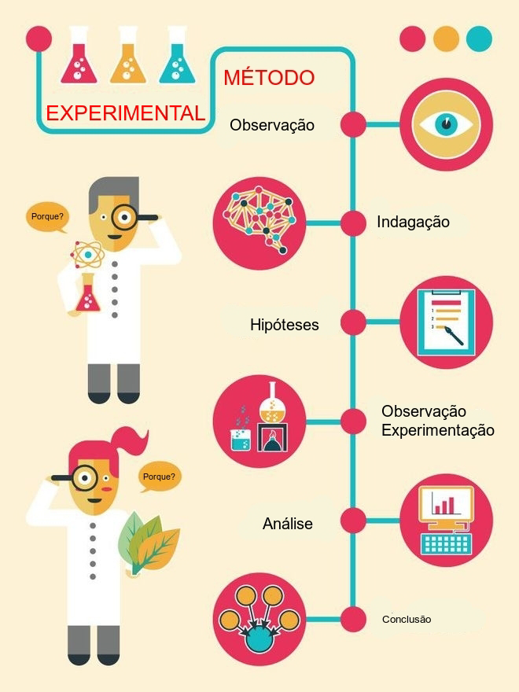
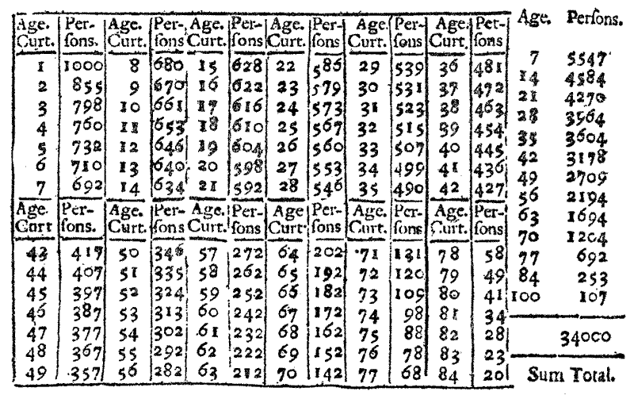
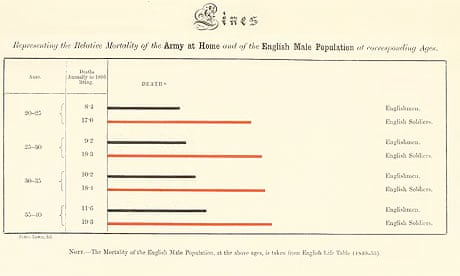
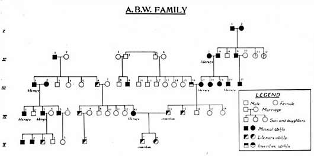
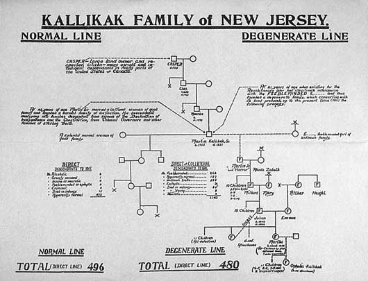

# Introdução histórica daquilo que veio a se chamar estatística 


\

-   do latim:  _statisticum collegium_ (colegiado dos assuntos do Estado);  
-   do alemão: _statistik_ (Gottfried Achenwall, 1719-1772);  
-   no inglês: _statistics_ (Enciclopédia Britânica, 1797).

\

De acordo com a revista do _Instituto Internacional de Estatística_ cinco homens são chamados de fundadores dos primórdios da estatística:

\

-   Hermann Conring;  
-   Gottfried Achenwall; 
-   Johan Peter Süßmilch; 
-   John Graunt, e 
-   William Petty.

\


## Filosofia da ciência (teoria do conhecimento, epistemologia)


\


>Estritamente falando, todo o conhecimento fora da matemática, da lógica demonstrativa (um ramo da mesma) e da taxonomia, encontra-se fundamentado em hipóteses (naturalmente há inúmeros tipos de hipóteses, mas as que estamos a nos referir são altamente confiáveis, como as expressas em certas leis gerais da física e da química como, por exemplo, a Lei de Hooke as Leis de Kepler dentre tantas outras).

\

O *raciocínio lógico demonstrativo* permeia as ciências até onde a matemática lhe suporta; todavia, em si (assim como também a matemática), é incapaz de gerar novos conhecimentos sobre o mundo que nos rodeia.

\

> O _método lógico demonstrativo_ é próprio para objetos que existem apenas _idealmente_, que são construídos inteiramente pelo nosso pensamento. 

\

> O _método hipotético experimental_ é próprio das ciências naturais  (física, química, biologia, etc.), que observam seus objetos e realizam experimentos.


\


```{r , echo=FALSE, out.width='80%', fig.align='center', fig.cap='Método demonstrativo e Método experimental hipotético (George Polya, 1954) '}

knitr::include_graphics("images11/polya.png")
```

\

_Hipotético_ porque os cientistas partem de hipóteses sobre os objetos que guiam os experimentos e a avaliação dos resultados e _experimental_ porque se baseia em observações e em experimentos, tanto para formular quanto para verificar as teorias. 

\

O método hipotético experimental pode ser indutivo (fatos $\to$ lei geral) ou dedutivo  (lei geral $\to$ fatos).


\

Isso é observado em qualquer que seja a área do conhecimento:


\

- ciências biológicas;  
- ciências exatas;  
- ciências agrárias;  
- ciências humanas;  
- ciência sociais e outras.

\


```{r figProdConhec, echo=FALSE, out.width='80%', fig.align='center', fig.cap="Representação esquemática do fluxo de infomações da amostra à produção de conhecimento "}

knitr::include_graphics("images1/esquema.jpg")

```

\


Assim, na investigação científica é imposto ao pesquisador formular perguntas que deverão ser apropriadamente respondidas. 

\

- comparar esses resultados a outros valores; ou,  
- comparar resultados obtidos pela aplicação de diferentes métodos/ou produtos (valores centrais, variabilidade, proporções) observados em diferentes amostras.

\


```{r , echo=FALSE, out.width='80%', fig.align='center', fig.cap='Método experimental hipotético'}


```

\

Uma hipótese é uma conjectura racional feita após um grande número de observações e experimentos; é uma tese que precisa ser confirmada ou verificada por meio de novas observações e experimentos. 


\


Uma hipótese estatística é uma suposição feita sobre uma determinada característica de interesse de uma população sob estudo (um parâmetro) que subsiste (perdura, sobrevive, permanece incontestável) até que alguma informação sobre essa população seja estatisticamente significativa para contradizê-la.


\

> ``A ciência não consegue provar coisa alguma. Ela pode apenas refutar as coisas'' (Karl Popper)

\

> Uma teoria científica é, portanto, transitória. Uma conjectura temporariamente sustentada que um dia poderá ser refutada e substituída por outra. Conclusões baseadas em raciocínios plausíveis são provisórias, ao contrário daquelas produzidas por raciocínios lógico demonstrativos. 


\


## Diferentes usos relacionados ao termo, primeiros levantamentos, estudos e publicações (o passado distante)


\

O _Domesday Book_ [(link)](http://www.nationalarchives.gov.uk/education/resources/domesday-book/) 
 foi encomendado em dezembro de 1085 por Guilherme, o Conquistador (_King William I_), que invadiu a Inglaterra em 1066. 


O primeiro esboço foi concluído em agosto de 1086 e continha registros de 13.418 assentamentos nos condados ingleses ao sul dos rios Ribble e Tees (a fronteira com a Escócia) com informações sobre terras, proprietários, uso da terra, empregados e animais cujo propósito básico era fundamentar a taxação (Figura \@ref(fig:figA1)).

\


```{r figA1, echo=FALSE, out.width='75%', fig.align='center', fig.cap="Domesday Book"}

knitr::include_graphics("images1/domesday.jpg")

```

\

O dramaturgo inglês William Shakespeare usou a palavra **statists** (estadistas e, portanto, num sentido não relacionado com números ou matemática) no diálogo da Cena II de Hamlet [(link)](http://shakespeare.mit.edu/hamlet/full.html). 

\


> "Hamlet:
> Cercado assim por tantas vilanias, mesmo antes de eu poder dizer o prólogo, representava o cérebro.
Sentei-me e escrevi com capricho nova carta. Já pensei, como os nossos estadistas, que é feio escrever bem, tendo insistido, até, em desaprendê-lo; mas, nessa hora muito bom me foi isso. Quererias saber 
qual o conteúdo da mensagem?[...]"


\

Um ponto de partida para a compreensão a ligação entre *estado* e *estatística* é Hermann Conring (1606-1681), professor de filosofia, medicina e política da Universidade de Helmstadt (atual Alemanha), criou um curso de Ciência política em 1660 para funcionários do estado, que descrevia e examinava as questões fundamentais do Estado. Nele a palavra *estatística* (parece ter) passado a ser considerada como uma disciplina autônoma que tinha por objetivo a descrição das coisas do Estado (Figura \@ref(fig:figHermann)).

\


```{r figHermann, echo=FALSE, out.width='75%', fig.align='center', fig.cap='Hermann Conring (1606-1681)'}


```

\

*Microscopium Statisticum: quo status imperii Romano-Germanici cum primis extraordinarius, ad vivum repraentatur* (Statistical Microscope: An Analysis of the State, in which the State of the Germanic Roman Empire is vividly represented, above all extraordinary)  é um livro cujo título normalmente chama  mais atenção do que seu conteúdo: o uso de *statisticum* – que significa *do estado* – é reconhecido como um dos primeiros passos em direção ao uso da palavra *estatística* como hoje empregamos  (Figura \@ref(fig:figMicroscopium)). Foi publicado sob o pseudônimo de Helenus Politanus em 1672.

\

```{r figMicroscopium, echo=FALSE, out.width='75%', fig.align='center', fig.cap='Microscopium Statisticum (ed. de 1672)'}


```

\

Johan Peter Süßmilch é mais conhecido por seu notável trabalho de 1741 sobre população, conectando  o direito natural e a aritmética política. O trabalho de Süssmilch foi amplamente referenciado por Robert Malthus (1798). Ele reconheceu não apenas a "proporção geométrica" da fertilidade humana, mas também o efeito de padrões de vida mais elevados sobre o problema populacional  (Figura \@ref(fig:figPeter)).  

\


```{r figPeter, echo=FALSE, out.width='75%', fig.align='center', fig.cap='The Divine order in the circumstances of the human sex (1741)'}

knitr::include_graphics("images1/peter.jpg")

```

\


Com um sentido não relacionado com números ou matemática, a palavra **estatística** parece ter sido também proposta no século XVII, pelo historiador e professor alemão (à época Transilvânia) Martin Schmeitzel (1679-1747) da Universidade de Jena e, posteriormente adotada por seu aluno, (igualmente) historiador e jurista Gottfried Achenwall (1719-1772) em 1749, em _Abriß der neuen Staatswissenschaft der vornehmen Europäischen Reiche und Republiken_ (Esboço da nova ciência política dos nobres impérios europeus e repúblicas, Figura \@ref(fig:figA5)).


\

```{r figA5, echo=FALSE, out.width='75%', fig.align='center', fig.cap='Abriß der neuen Staatswissenschaft der vornehmen Europäischen Reiche und Republiken (1749)'}
knitr::include_graphics("images1/gottfried.jpg")
```


\

Muitos anos depois, William Hooper usou a palavra **estatística** em sua tradução de _The Elements of Universal Erudition_(Elementos da Erudição Universal) escrita por Jacob Friedrich Freiherr von Bielfeld (1717-1770). Nesse livro, a *estatística* foi definida como a ciência que nos ensina o arranjo político de todos os estados modernos do mundo conhecido (novamente num sentido não associado a números ou matemática, Figura \@ref(fig:figA6)). 


\

```{r figA6, echo=FALSE, out.width='75%', fig.align='center', fig.cap='The Elements of Universal Erudition  (1771)'}
knitr::include_graphics("images1/hooper.jpg")
```

\


Na Inglaterra a palavra estatística estava mais associada ao estudo de dados numéricos como modo de se obter *insights* sobre questões sociais e demográficas no país. Dois pioneiros nessa linha foram William Petty  e  John Graunt. Em 1687 o economista e filósofo inglês William Petty (1623-1687) publicou *Several Essays on Political Arithmetic* (Vários ensaios sobre aritmética política), sugerindo ao governo inglês a criação de um departamento para registro de *estatísticas* vitais  (Figura \@ref(fig:figA3)).


\


```{r figA3, echo=FALSE, out.width='75%', fig.align='center', fig.cap='Several Essays in Political Arithmetick (ed. de 1699)'}


```

\

O negociante inglês John Graunt (1620-1674) substituiu a crença pela evidência em *Natural and Political Observations Mentioned in a Following Index and Made upon the Bills of Mortality* (Observações naturais e políticas feitas sobre as notas de mortalidade). 

\

Nesse trabalho, realizado com dados coletados das paróquias de Londres entre 1604 e 1660, Graunt tirou as seguintes conclusões: que havia maior nascimento de crianças do sexo masculino, mas havia distribuição aproximadamente igual de ambos os sexos na população geral; alta mortalidade nos primeiros anos de vida; maior mortalidade nas zonas urbanas em relação às zonas rurais  (Figura \@ref(fig:figA2)). 

\

```{r figA2, echo=FALSE, out.width='75%', fig.align='center', fig.cap='Natural and Political Observations Mentioned in a Following Index and Made upon the Bills of Mortality (ed. de 1662)'}

knitr::include_graphics("images1/graunt.jpg")

```


\

O matemático e astrônomo inglês Edmond Halley (1656-1742) construiu em 1693, baseado em dados coletados na cidade (à época) alemã de Bresláu, uma *Life Table* (Tábua de sobrevivência), um estudo que analisa as probabilidades de sobrevivência e morte em relação à idade  (Figura \@ref(fig:figA4)).

\

```{r figA4, echo=FALSE, out.width='75%', fig.align='center', fig.cap='Halley’s life table (1693)'}

```

\

O jurista e político escocês John Sinclair propôs que se realizasse uma detalhada pesquisa em 938 paróquias para elucidar a história natural e política de seu país ( _Statistics Accounts_ ). Essa pesquisa fazia parte de um projeto muito mais ousado: _The Pyramid of Statistical Enquiry_ (A Pirâmide da Pesquisa Estatística, Figura \@ref(fig:figA7)).

\

```{r figA7, echo=FALSE, out.width='75%', fig.align='center', fig.cap='The Pyramid of Statistical Enquiry  (1814)'}
knitr::include_graphics("images1/sinclair.jpg")
```

\


Outro trabalho com vertente demográfica foi o de Sébastien Le Prestre, Marquês de Vauban (1633–
1707), intitulado  *Méthode générale et facile pour faire le dénombrement des peuples*, detakhado num livro de 1686 (Figura \@ref(fig:figvauban)).

\

```{r figvauban, echo=FALSE, out.width='75%', fig.align='center', fig.cap='Méthode générale et facile pour faire le dénombrement des peuples (1686)'}


```


\


O médico inglês (considerado por alguns como o "pai" da epidemiologia moderna) John Snow (1813-1858) estudou a dispersão espacial dos casos de cólera em Londres e concluiu que sua causa residia na contaminação da água consumida (poço localizado na _Broad Street_, no distrito do _Soho_): _Report to the Cholera Outbreak in the Parish of St. James, Westminster during the Autumn of 1854_ (Relatório sobre o surto de cólera na paróquia de St. James, Westminster durante o outono de 1854, Figura \@ref(fig:figA8)).


\


```{r figA8, echo=FALSE, out.width='75%', fig.align='center', fig.cap='Mapa dos casos de cólera (1854)'}
knitr::include_graphics("images1/london-1854-snow.jpg")
```


## Visualização de dados \& Estudos e primeiras publicações


\

O teólogo e filósofo inglês Joseph Priestley (1733-1804) introduziu como inovação os primeiros gráficos com linha temporal, em que barras individuais eram usadas para visualizar o tempo de vida de uma pessoa e o todo pode ser usado para comparar a expectativa de vida de várias pessoas  (Figura \@ref(fig:figA9)).

\

```{r figA9, echo=FALSE, out.width='75%', fig.align='center', fig.cap='Expectativa de vida de diversas pessoas (1765)'}
knitr::include_graphics("images1/priestley-timechart-1765.jpg")
```


\

O engenheiro e economista escocês William Playfair (1759-1823) é considerado comumente como fundador dos métodos gráficos para apresentação de estatísticas. Playfair concebeu vários tipos de diagramas para visualização de dados: 

- em 1786, o gráfico de barras  (Figura \@ref(fig:figA10)); e, 
- em 1801, o gráfico de setores  (Figura \@ref(fig:figA11)).

\


```{r figA10, echo=FALSE, out.width='75%', fig.align='center', fig.cap='Commercial and Political Atlas (Atlas Comercial e Político de 1786): cada barra representa as exportações e importações da Escócia para 17 países em 1781'}
knitr::include_graphics("images1/playfair-barchart-1786.jpg")
```

\


```{r figA11, echo=FALSE, out.width='75%', fig.align='center', fig.cap='Statistical Breviary (Breviário Estatístico de 1801): proporção da extensão do Império Turco em diferentes regiões do mundo: Asia, Europa e África, antes de 1789'}
knitr::include_graphics("images1/playfair-piechart-1801.jpg")
```


\


A enfermeira inglesa Florence Nightingale (1820-1910) conduziu um trabalho pioneiro ao chegar no hospital militar britânico na Turquia em 1856, estabelecendo uma ordem e um método muito necessários aos registros médicos estatísticos e que indicaram serem as precárias práticas sanitárias o culpado da alta mortalidade [(link)](https://www.york.ac.uk/depts/maths/histstat/small.htm) , Figuras \@ref(fig:figA12) e  \@ref(fig:figA13). 

\


```{r figA12, echo=FALSE, out.width='75%', fig.align='center', fig.cap='Esse diagrama (coxcomb) feito durante a Guerra da Crimeia foi dividido igualmente em 12 setores, representando os meses do ano, com a área sombreada do setor  de cada mês proporcional à taxa de mortalidade naquele mês. Seu sombreamento com código de cores indicava a causa da morte em cada área do diagrama'}
knitr::include_graphics("images1/florence-rose-diagram.jpg")
```

\


```{r figA13, echo=FALSE, out.width='75%', fig.align='center', fig.cap='Gráfico de barras de Florence Nightingale mostrando as diferenças de mortalidade entre soldados britânicos e a população masculina inglesa geral (civis)'}

```

\


## Pesquisadores cuja contribuição foi fundamental na área 

\


Uma breve biografia de cada um dos pesquisadores a seguir relacionados pode ser obtida em: [(link)](http://www-history.mcs.st-andrews.ac.uk/BiogIndex.html).  

\

- Niccolò Fontana Tartaglia (Veneza à época, hoje Itália: 1499-1557)
- Girolamo Cardano (Pávia à época, hoje Itália: 1501-1576)
- Galileu Galilei (Florença à época, hoje Itália: 1564-1642)
- Pierre de Fermat (França: 1607-1665)
- Blaise Pascal (França: 1623-1662)
- Jakob Bernoulli (Suíça: 1655-1705)
- Abrahan de Moivre (França: 1667-1754)
- Thomas Bayes (Inglaterra: 1702-1761)
- Pierre-Simon Laplace (França: 1749-1827)
- Johann Carl Friedrich Gauss (Alemanha: 1777-1856)
- Lambert Adolphe Jacques Quételet (França à época, hoje Bélgica: 1796-1874)
- Pafnuti Lvovitch Chebyshev (Rússia: 1821-1894)
- Francis Galton (Inglaterra: 1822-1911)
- Wilhelm Lexis (Alemanha: 1837-1914)
- Thorvald Nicolai Thiele (Dinamarca: 1838-1910)
- Friedrich Robert Helmert (Saxônia: 1843-1917)
- Francis Ysidro Edgeworth (Inglaterra: 1845-1926)
- James Douglas Hamilton Dickson (Escócia: 1849-1931)
- Andrei Andreyevich Markov (Rússia: 1856-1922)
- Aleksandr Mikhailovich Lyapunov (Rússia: 1857-1918)
- Walter Frank Raphael Weldon (Inglaterra: 1860-1906)
- Karl Pearson (Inglaterra: 1857-1936)
- William Seally Gosset (Inglaterra: 1876-1937)
- Ronald Aylmer Fisher (Inglaterra: 1890-1962)
- Andrei Nikolaevich Kolmogorov (Rússia: 1903-1987)
  

## Revista Biometrika

\


Karl Pearson (1857-1936) é amplamente considerado o fundador da disciplina moderna de **estatística**, e também é famoso como um filósofo da ciência, como escritor sobre o darwinismo social e como um dos principais impulsionadores para instalar a eugenia como a ciência social chave.


\


>"Pretende-se que a _Biometrika_ sirva como um meio não apenas de coletar ou publicar, sob um título, dados biológicos de um tipo não coletados sistematicamente ou publicados em outro lugar em qualquer outro periódico, mas também de disseminar um conhecimento de tal teoria estatística para o seu tratamento científico[...]"

\


Em outubro de 1901 foi fundada a _Biometrika, the Journal for the Statistical Study of Biological Problems_ (Biometrika, o Jornal para o Estudo Estatístico de Problemas Biológicos) com o propósito de promover a análise estatística de fenômenos biológicos, isto é, a matematização da biologia.

\


Os fundadores da _Biometrika_ foram _Sir_ Francis Galton (primo de Charles Darwin), Walter Frank Raphael Weldon e Karl Pearson. A maior parte do trabalho foi feita por Pearson e Weldon, este último focando na edição do conteúdo (ou seja, o aspecto biológico) e o primeiro nos detalhes, incluindo correções de prova. Galton e o eugenista americano Charles Davenport atuaram, respectivamente, como consultor e editor.

\


Alguns dos tópicos abordados na revista incluem criminologia, botânica, zoologia, epidemiologia e outros aspectos da saúde humana. Na década de 1930, o caráter da _Biometrika_ mudou, e ``representou a vanguarda internacional da pesquisa em métodos estatísticos e sua aplicação na ciência e tecnologia'', ao invés de focar a hereditariedade.

\


_Sir_ Francis Galton, que serviu como editor da primeira edição (1901), escreveu a Introdução, que incluiu uma declaração de propósito para a revista  
[(link)](https://academic.oup.com/biomet/article-abstract/1/1/1/192192?redirectedFrom=fulltext).

\

## Eugenia 

\

Em 16 de maio de 1883 _Sir_ Francis Galton cunhou o termo *eugenia*, posteriormente descrevendo-o como “o estudo das agências sob controle social que podem melhorar ou reparar as qualidades raciais das gerações futuras, seja fisicamente ou mentalmente”.

\

Galton detalha o conceito em seu livro _Inquiries into Human Faculty and its Development_, e recomenda que indivíduos de famílias altamente classificadas em seu sistema de mérito sejam encorajados a se casar cedo e receber incentivos para ter filhos. Ele também condenou os casamentos tardios dentro desse mesmo grupo como "disgênicos" ou desvantajosos para a espécie humana.

\

A palavra *eugenia* foi extraída da palavra grega _eu_, que significa bem, e _genos_, que significa prole. Juntos, significaria *bem-nascido*.

\

Este livro caiu em domínio público e pode ser lido na íntegra online. A caracterização original de eugenia de Galton pode ser encontrada na página 17 desta edição de domínio público (Parte 1 do pdf):

\

> "uma breve palavra para expressar a ciência de melhorar o rebanho, que não está de modo algum confinado a questões de acasalamento criterioso, mas que, especialmente no caso do homem, toma conhecimento de todas as influências que tendem, mesmo que em grau remoto, a dar ao raças ou linhagens de sangue mais adequadas uma melhor chance de prevalecer rapidamente sobre os menos adequados do que teriam de outra forma [...]”(Galton, 1883, p.17)

\


Mais recentemente, alguns grupos sociais viram no trabalho e opiniões de Fisher endossos ao colonialismo, à supremacia branca e à eugenia (como hoje interpretada). 

\

Outros grupos, todavia, afirmam que Fisher não era racista nem eugenista, embora ele achasse que havia diferenças comportamentais e de inteligência entre os grupos humanos.


\


```{r figA14, echo=FALSE, out.width='75%', fig.align='center', fig.cap='Gráfico de linhagens para alergias'}
knitr::include_graphics("images1/chart_pedigree_allergy2.jpg")
```


\

```{r figA15, echo=FALSE, out.width='75%', fig.align='center', fig.cap='Gráfico de linhagens para aptidão musical'}

```

\


```{r figA16, echo=FALSE, out.width='75%', fig.align='center', fig.cap='Linhas "normais" e "degeneradas" da família Kallikak (New Jersey)'}

```

\

```{r figA17, echo=FALSE, out.width='75%', fig.align='center', fig.cap='Lei da Inegridade Racia (Virginia, EUA, 1924)'}
knitr::include_graphics("images1/VA_racial_integrity_act2.jpg")
```

\

```{r figA18, echo=FALSE, out.width='75%', fig.align='center', fig.cap='Licença para casamento'}
knitr::include_graphics("images1/choosing_love_over_eugenics.jpeg")
```


\


## Estatística e _machine learning_ : uma livre tradução deste [link](https://www.r-bloggers.com/2020/02/xgboostlss-an-extension-of-xgboost-to-probabilistic-forecasting/) 

\


```{r, echo=FALSE, out.width='80%', fig.align='center', fig.cap="Autor: estatístico anônimo"}

knitr::include_graphics("images4/statData.png")

```


\


Para se raciocinar rigorosamente sob incerteza, precisamos invocar a linguagem da probabilidade (Zhang et al. 2020). Qualquer modelo que não forneça a quantificação da incerteza associada ao seu resultado provavelmente produzirá uma imagem incompleta e potencialmente enganosa. 

\

Embora este seja um consenso irrevogável na estatística, um equívoco comum, embora muito persistente, é que os algoritmos de _machine learning_ geralmente carecem de formas adequadas de quantificar a incerteza. 

\

Apesar do fato dos dois termos existirem em paralelo e serem indistintamente utilizados, a percepção de que algoritmos de _machine learning_ e a estatística implicam um conjunto de técnicas não sobrepostas permanece viva, tanto entre profissionais como acadêmicos.

\

Isso é vividamente retratado pela declaração provocativa (e potencialmente irônica) de Brian D. Ripley de que "o aprendizado de máquina é estatística menos qualquer verificação de modelos e suposições" que ele fez durante a "useR! 2004", conferência de Viena que serviu para ilustrar a diferença entre aprendizado de máquina e estatística.


\

Na verdade, a relação entre estatística e algoritmos de _machine learning_ é artificialmente complicada por tais afirmações e, na melhor das hipóteses, isto é lamentável, pois implica numa distinção profunda e qualitativa entre as duas disciplinas (Januschowski et al. 2020). O artigo de  Leo Breiman (2001) é uma exceção notável, pois propõe diferenciar os dois com base na cultura científica, e não apenas nos métodos. 

\

Embora as abordagens discutidas em Breiman (2001) constituam uma divisão admissível do espaço de análise e modelação de dados, os avanços mais recentes tornaram gradualmente esta distinção menos clara. 


\

Na verdade, a tendência atual de investigação tanto em estatística com algoritmos de _machine learning_ gravita no sentido de aproximar ambas as disciplinas. Numa era de necessidade crescente de que os resultados dos modelos de previsão sejam transformados em conhecimentos explicáveis e confiáveis, este é um desenvolvimento extremamente promissor e encorajador, uma vez que ambas as disciplinas têm muito a aprender uma com a outra. Junto com Januschowski et al. (2020) , argumentamos que é mais construtivo procurar um terreno comum do que introduzir fronteiras artificiais. 


