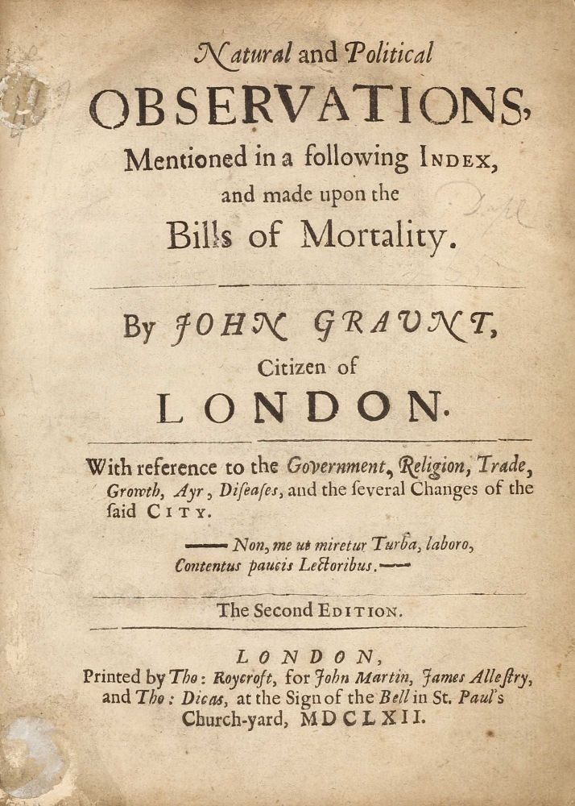
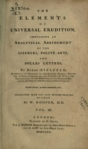
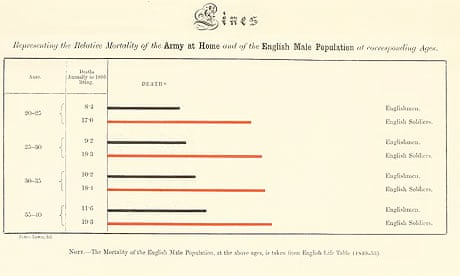
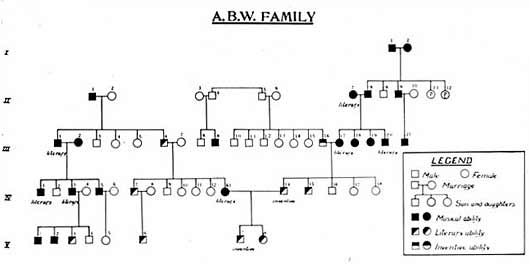

---
output:
  pdf_document: default
  html_document: default
---
# Um pouco da história

## Primeiros levantamentos, estudos e publicações \& Demografia e aritmética política

1086


O _Domesday Book_ [(link)](http://www.nationalarchives.gov.uk/education/resources/domesday-book/) 
 foi encomendado em dezembro de 1085 por Guilherme, o Conquistador (_King William I_), que invadiu a Inglaterra em 1066. 


O primeiro esboço foi concluído em agosto de 1086 e continha registros de 13.418 assentamentos nos condados ingleses ao sul dos rios Ribble e Tees (a fronteira com a Escócia) com informações sobre terras, proprietários, uso da terra, empregados e animais cujo propósito básico era fundamentar a taxação.


```{r, echo=FALSE, out.width='50%', fig.align='center', fig.cap="Domesday Book"}

knitr::include_graphics("images/domesday.jpg")

```


1602

O dramaturgo inglês William Shakespeare usou a palavra **statists** (estadistas e, portanto, num sentido não relacionado com números ou matemática) no diálogo da Cena II de Hamlet [(link)](http://shakespeare.mit.edu/hamlet/full.html). 


> "Hamlet:
> Cercado assim por tantas vilanias, mesmo antes de eu poder dizer o prólogo, representava o cérebro.
Sentei-me e escrevi com capricho nova carta. Já pensei, como os nossos estadistas, que é feio escrever bem, tendo insistido, até, em desaprendê-lo; mas, nessa hora muito bom me foi isso. Quererias saber 
qual o conteúdo da mensagem?[...]"


1603

O negociante inglês John Graunt (1620-1674) substituiu a crença pela evidência em _Natural and Political Observations Mentioned in a Following Index and Made upon the Bills of Mortality_ (Observações naturais e políticas feitas sobre as notas de mortalidade). 

Nesse trabalho, realizado com dados coletados das paróquias de Londres entre 1604 e 1660, Graunt tirou as seguintes conclusões: que havia maior nascimento de crianças do sexo masculino, mas havia distribuição aproximadamente igual de ambos os sexos na população geral; alta mortalidade nos primeiros anos de vida; maior mortalidade nas zonas urbanas em relação às zonas rurais. 

```{r, echo=FALSE, out.width='50%', fig.align='center', fig.cap='Natural and Political Observations Mentioned in a Following Index and Made upon the Bills of Mortality (ed. de 1662)'}



```


1660

Herman Conring (1606-1681), professor de filosofia, medicina e política da Universidade de Helmstadt (atual Alemanha), criou um curso de Ciência política em 1660, que descrevia e examinava as questões fundamentais do Estado. Nele a **estatística** passou a ser considerada como uma disciplina autônoma que tinha por objetivo a descrição das coisas do Estado.

1687

Em 1687 o economista e filósofo inglês William Petty (1623-1687) publicou _Five Essays on Political Arithmetic_ (Cinco ensaios sobre aritmética política), sugerindo ao governo inglês a criação de um departamento para registro de **estatísticas** vitais.


```{r, echo=FALSE, out.width='50%', fig.align='center', fig.cap='Several Essays in Political Arithmetick (ed. de 1699)'}
knitr::include_graphics("images/petty.jpg")
```


O Capitão John Graunt e William Petty instituiram na Inglaterra um novo ramo de estudos denominado de \textit{Political arithmetic} (Aritmética política)

1693

O matemático e astrônomo inglês Edmond Halley (1656-1742) construiu em 1693, baseado em dados coletados na cidade (à época) alemã de Bresláu, uma _Life Table_ (Tábua de sobrevivência), um estudo que analisa as probabilidades de sobrevivência e morte em relação à idade.

```{r, echo=FALSE, out.width='50%', fig.align='center', fig.cap='Halley’s life table (1693)'}
knitr::include_graphics("images/halley.png")
```


1749

Com um sentido não relacionado com números ou matemática, a palavra **estatística** parece ter sido proposta pela primeira vez no século XVII, pelo historiador e professor alemão (à época Transilvânia) Martin Schmeitzel (1679-1747) da Universidade de Jena e, posteriormente adotada por seu aluno, (igualmente) historiador e jurista Gottfried Achenwall (1719-1772) em 1749, em _Abriß der neuen Staatswissenschaft der vornehmen Europäischen Reiche und Republiken_ (Esboço da nova ciência política dos nobres impérios europeus e repúblicas).


```{r, echo=FALSE, out.width='50%', fig.align='center', fig.cap='Abriß der neuen Staatswissenschaft der vornehmen Europäischen Reiche und Republiken (1749)'}
knitr::include_graphics("images/gottfried.jpg")
```


1771

William Hooper usou a palavra **estatística** em sua tradução de _The Elements of Universal Erudition_(Elementos da Erudição Universal) escrita por Jacob Friedrich Freiherr von Bielfeld (1717-1770). 

Nesse livro, a **estatística** foi definida como a ciência que nos ensina o arranjo político de todos os estados modernos do mundo conhecido (mais uma veznum sentido não associado a números ou matemática). 


```{r, echo=FALSE, out.width='50%', fig.align='center', fig.cap='The Elements of Universal Erudition  (1771)'}

```


1790

O jurista e político escocês John Sinclair propôs que se realizasse uma detalhada pesquisa em 938 paróquias para elucidar a história natural e política de seu país (_Statistics Accounts_). Essa pesquisa fazia parte de um projeto muito mais ousado: _The Pyramid of Statistical Enquiry_ (A Pirâmide da Pesquisa Estatística).

```{r, echo=FALSE, out.width='50%', fig.align='center', fig.cap='The Pyramid of Statistical Enquiry  (1814)'}
knitr::include_graphics("images/sinclair.jpg")
```


1854

O médico inglês (considerado por alguns como o "pai" da epidemiologia moderna) John Snow (1813-1858) estudou a dispersão espacial dos casos de cólera em Londres e concluiu que sua causa residia na contaminação da água consumida (poço localizado na _Broad Street_, no distrito do _Soho_): _Report to the Cholera Outbreak in the Parish of St. James, Westminster during the Autumn of 1854_ (Relatório sobre o surto de cólera na paróquia de St. James, Westminster durante o outono de 1854).


```{r, echo=FALSE, out.width='50%', fig.align='center', fig.cap='Mapa dos casos de cólera (1854)'}
knitr::include_graphics("images/london-1854-snow.jpg")
```


## Visualização de dados \& Estudos e primeiras publicações


1765

O teólogo e filósofo inglês Joseph Priestley (1733-1804) introduziu como inovação os primeiros gráficos com linha temporal, em que barras individuais eram usadas para visualizar o tempo de vida de uma pessoa e o todo pode ser usado para comparar a expectativa de vida de várias pessoas.

```{r, echo=FALSE, out.width='50%', fig.align='center', fig.cap='Expectativa de vida de diversas pessoas (1765)'}
knitr::include_graphics("images/priestley-timechart-1765.jpg")
```


1786

O engenheiro e economista escocês William Playfair (1759-1823) é considerado comumente como fundador dos métodos gráficos para apresentação de estatísticas. Playfair concebeu vários tipos de diagramas para visualização de dados: 

- em 1786, o gráfico de barras; e, 
- em 1801, o gráfico de setores.


```{r, echo=FALSE, out.width='50%', fig.align='center', fig.cap='Commercial and Political Atlas (Atlas Comercial e Político de 1786): cada barra representa as exportações e importações da Escócia para 17 países em 1781'}
knitr::include_graphics("images/playfair-barchart-1786.jpg")
```


```{r, echo=FALSE, out.width='50%', fig.align='center', fig.cap='Statistical Breviary (Breviário Estatístico de 1801): proporção da extensão do Império Turco em diferentes regiões do mundo: Asia, Europa e África, antes de 1789'}
knitr::include_graphics("images/playfair-piechart-1801.jpg")
```


1856

A enfermeira inglesa Florence Nightingale (1820-1910) conduziu um trabalho pioneiro ao chegar no hospital militar britânico na Turquia em 1856, estabelecendo uma ordem e um método muito necessários aos registros médicos estatísticos e que indicaram serem as precárias práticas sanitárias o culpado da alta mortalidade [(link)](https://www.york.ac.uk/depts/maths/histstat/small.htm). 


```{r, echo=FALSE, out.width='50%', fig.align='center', fig.cap='Esse diagrama (coxcomb) feito durante a Guerra da Crimeia foi dividido igualmente em 12 setores, representando os meses do ano, com a área sombreada do setor  de cada mês proporcional à taxa de mortalidade naquele mês. Seu sombreamento com código de cores indicava a causa da morte em cada área do diagrama'}
knitr::include_graphics("images/florence-rose-diagram.jpg")
```


```{r, echo=FALSE, out.width='50%', fig.align='center', fig.cap='Gráfico de barras de Florence Nightingale mostrando as diferenças de mortalidade entre soldados britânicos e a população masculina inglesa geral (civis)'}

```


## Nomes notáveis

Karl Pearson (1857-1936) é amplamente considerado o fundador da disciplina moderna de **estatística**, e também é famoso como um filósofo da ciência, como escritor sobre o darwinismo social e como um dos principais impulsionadores para instalar a eugenia como a ciência social chave. Uma breve biografia de cada um dos pesquisadores a seguir relacionados pode ser obtida em: [(link)](http://www-history.mcs.st-andrews.ac.uk/BiogIndex.html).  

- Niccolò Fontana Tartaglia (Veneza à época, hoje Itália: 1499-1557)
- Girolamo Cardano (Pávia à época, hoje Itália: 1501-1576)
- Galileu Galilei (Florença à época, hoje Itália: 1564-1642)
- Pierre de Fermat (França: 1607-1665)
- Blaise Pascal (França: 1623-1662)
- Jakob Bernoulli (Suíça: 1655-1705)
- Abrahan de Moivre (França: 1667-1754)
- Thomas Bayes (Inglaterra: 1702-1761)
- Pierre-Simon Laplace (França: 1749-1827)
- Johann Carl Friedrich Gauss (Alemanha: 1777-1856)
- Lambert Adolphe Jacques Quételet (França à época, hoje Bélgica: 1796-1874)
- Pafnuti Lvovitch Chebyshev (Rússia: 1821-1894)
- Francis Galton (Inglaterra: 1822-1911)
- Wilhelm Lexis (Alemanha: 1837-1914)
- Thorvald Nicolai Thiele (Dinamarca: 1838-1910)
- Friedrich Robert Helmert (Saxônia: 1843-1917)
- Francis Ysidro Edgeworth (Inglaterra: 1845-1926)
- James Douglas Hamilton Dickson (Escócia: 1849-1931)
- Andrei Andreyevich Markov (Rússia: 1856-1922)
- Aleksandr Mikhailovich Lyapunov (Rússia: 1857-1918)
- Walter Frank Raphael Weldon (Inglaterra: 1860-1906)
- Karl Pearson (Inglaterra: 1857-1936)
- William Seally Gosset (Inglaterra: 1876-1937)
- Ronald Aylmer Fisher (Inglaterra: 1890-1962)
- Andrei Nikolaevich Kolmogorov (Rússia: 1903-1987)
  

## Revista Biometrika


>"Pretende-se que a \textit{Biometrika} sirva como um meio não apenas de coletar ou publicar, sob um título, dados biológicos de um tipo não coletados sistematicamente ou publicados em outro lugar em qualquer outro periódico, mas também de disseminar um conhecimento de tal teoria estatística para o seu tratamento científico[...]"


Em outubro de 1901 foi fundada a _Biometrika, the Journal for the Statistical Study of Biological Problems_ (Biometrika, o Jornal para o Estudo Estatístico de Problemas Biológicos) com o propósito de promover a análise estatística de fenômenos biológicos, isto é, a matematização da biologia.


Os fundadores da _Biometrika_ foram _Sir_ Francis Galton (primo de Charles Darwin), Walter Frank Raphael Weldon e Karl Pearson. A maior parte do trabalho foi feita por Pearson e Weldon, este último focando na edição do conteúdo (ou seja, o aspecto biológico) e o primeiro nos detalhes, incluindo correções de prova. Galton e o eugenista americano Charles Davenport atuaram, respectivamente, como consultor e editor.


Alguns dos tópicos abordados na revista incluem criminologia, botânica, zoologia, epidemiologia e outros aspectos da saúde humana. Na década de 1930, o caráter da _Biometrika_ mudou, e ``representou a vanguarda internacional da pesquisa em métodos estatísticos e sua aplicação na ciência e tecnologia'', ao invés de focar a hereditariedade.


_Sir_ Francis Galton, que serviu como editor da primeira edição (1901), escreveu a Introdução, que incluiu uma declaração de propósito para a revista  
[(link)](https://academic.oup.com/biomet/article-abstract/1/1/1/192192?redirectedFrom=fulltext).

## Eugenia 

Em 16 de maio de 1883 _Sir_ Francis Galton cunhou o termo “eugenia”, posteriormente descrevendo-o como “o estudo das agências sob controle social que podem melhorar ou reparar as qualidades raciais das gerações futuras, seja fisicamente ou mentalmente”.

Galton detalha o conceito em seu livro _Inquiries into Human Faculty and its Development_, e recomenda que indivíduos de famílias altamente classificadas em seu sistema de mérito sejam encorajados a se casar cedo e receber incentivos para ter filhos. Ele também condenou os casamentos tardios dentro desse mesmo grupo como "disgênicos" ou desvantajosos para a espécie humana.

A palavra "eugenia" foi extraída da palavra grega _eu_, que significa bem, e _genos_, que significa prole. Juntos, significa bem-nascido.

Este livro caiu em domínio público e pode ser lido na íntegra online. A caracterização original de eugenia de Galton pode ser encontrada na página 17 desta edição de domínio público (Parte 1 do pdf):

> "uma breve palavra para expressar a ciência de melhorar o rebanho, que não está de modo algum confinado a questões de acasalamento criterioso, mas que, especialmente no caso do homem, toma conhecimento de todas as influências que tendem, mesmo que em grau remoto, a dar ao raças ou linhagens de sangue mais adequadas uma melhor chance de prevalecer rapidamente sobre os menos adequados do que teriam de outra forma [...]”(Galton, 1883, p.17)


Há poucos anos alguns grupos sociais viram no trabalho e opiniões de Fisher endossos ao colonialismo, à supremacia branca e à eugenia. 

Outros grupos, todavia, afirmam que Fisher não era racista e eugenista, embora ele achasse que havia diferenças comportamentais e de inteligência entre os grupos humanos.


```{r, echo=FALSE, out.width='50%', fig.align='center', fig.cap='Gráfico de linhagens para alergias'}
knitr::include_graphics("images/chart_pedigree_allergy2.jpg")
```


```{r, echo=FALSE, out.width='50%', fig.align='center', fig.cap='Gráfico de linhagens para aptidão musical'}

```


```{r, echo=FALSE, out.width='50%', fig.align='center', fig.cap='Linhas "normais" e "degeneradas" da família Kallikak (New Jersey)'}
knitr::include_graphics("images/chart_Kallikak_pedigree2.jpg")
```

```{r, echo=FALSE, out.width='50%', fig.align='center', fig.cap='Lei da Inegridade Racia (Virginia, EUA, 1924)'}
knitr::include_graphics("images/VA_racial_integrity_act2.jpg")
```

```{r, echo=FALSE, out.width='50%', fig.align='center', fig.cap='Licença para casamento'}
knitr::include_graphics("images/choosing_love_over_eugenics.jpeg")
```


