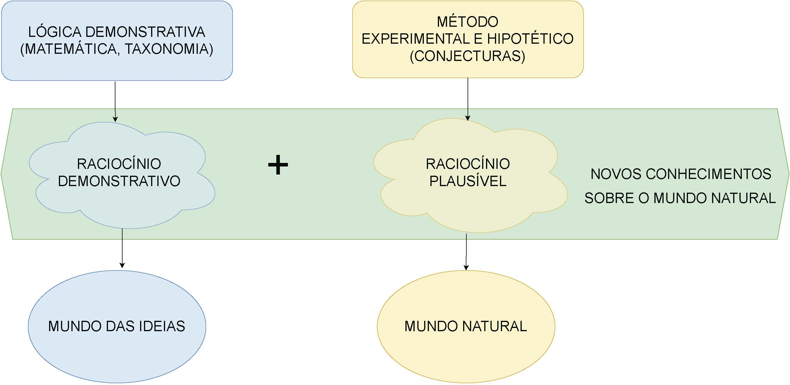
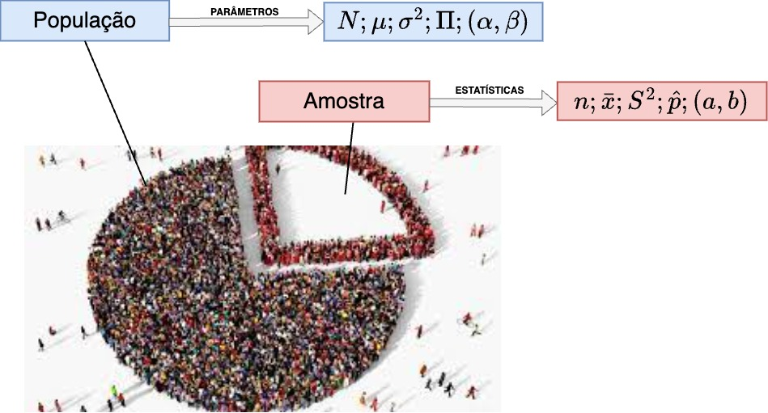
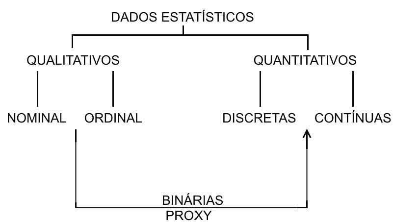
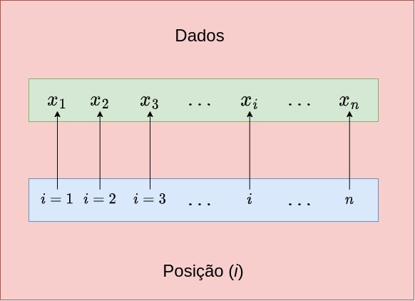
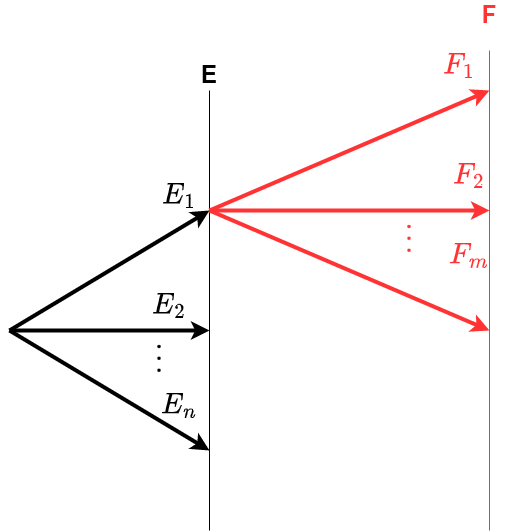
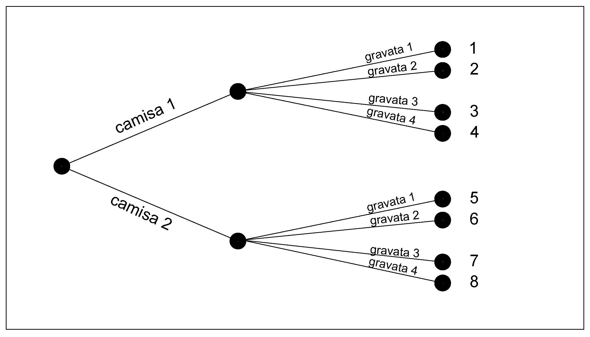
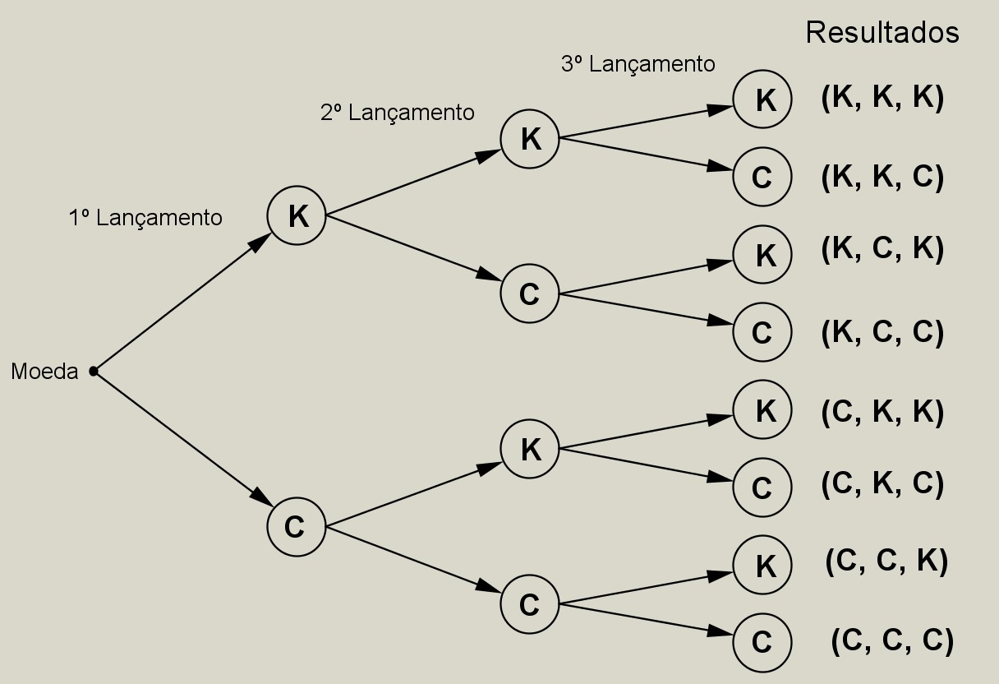
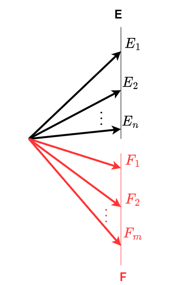
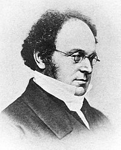
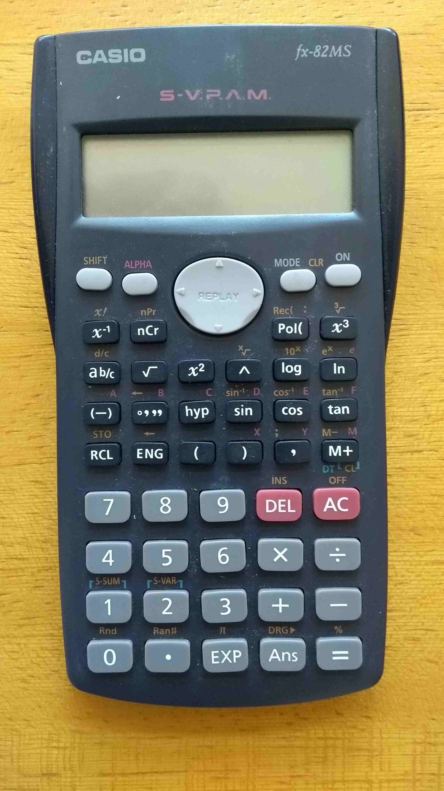

---
output:
  html_document: default
  pdf_document: default
---


```{r, echo=FALSE, include=FALSE}
colFmt <- function(x,color) {
  
  outputFormat <- knitr::opts_knit$get("rmarkdown.pandoc.to")
  
  if(outputFormat == 'latex') {
    ret <- paste("\\textcolor{",color,"}{",x,"}",sep="")
  } else if(outputFormat == 'html') {
    ret <- paste("<font color='",color,"'>",x,"</font>",sep="")
  } else {
    ret <- x
  }

  return(ret)
}
```


# Introdução conceitual essencial 


\

>  "Estatística é a ciência de coletar, organizar, apresentar, analisar e interpretar dados[...]" (Ronald A. Fisher)

\


De modo geral, a estatística pode ser dividida em três grandes áreas:

- descritiva;
- probabilidade; e,
- inferencial.

\

## Estatística descritiva

Nos primeiros trabalhos estatísticos, os dados coletados eram inicialmente apresentados na forma de tabelas e gráficos.

A **estatística descritiva** se ocupa de tudo o que seja relacionado a dados: coleta, processamento, descrição (seja na forma tabular ou gráfica) e sínteses numéricas (de locação, de dispersão, de repartição) sem inferir coisa alguma além da informação trazida pelos dados. Vem experimentando crescente uso em todas as áreas científicas e desenvolvimento:

- crescente uso de uma abordagem quantitativa em todas as ciências;
- disponibilidade de recursos computacionais;
- quantidade de dados coletados.


A palavra **estatística** pode assumir diferentes significados: 

- no singular: **estatística**    \vspace{0.5cm}	
  - refere-se à ciência que compreende métodos que são usados na coleta, análise, interpretação e apresentação de dados quantitativos ou qualitativos (numéricos ou não); e,
  - denota uma medida ou fórmula específica (tais como uma média, um intervalo de valores, uma taxa de crescimento, um índice). 
- no plural: **estatísticas**
  - refere-se a dados coletados de maneira sistemática com um propósito específico definido em qualquer campo de estudo (nesse sentido, as _estatísticas_ também podem ser consideradas como agregados de fatos expressos em forma numérica).


## Estatística inferencial


A **estatística inferencial** tem o objetivo de estabelecer níveis de confiança da tomada de decisão de associar uma estimativa amostral a um parâmetro populacional. Divide-se em estimação e testes de significância.


>"Dedução e indução são procedimentos racionais que nos levam do já conhecido ao ainda não conhecido; isto é, permitem que adquiramos conhecimentos novos graças a conhecimentos já adquiridos.[...]"

Dedução.

Na dedução parte-se de uma verdade já conhecida para demonstrar que ela se aplica a todos os casos particulares iguais. Vai do geral ao particular.


Indução.

Na indução parte-se de alguns casos particulares  iguais ou semelhantes para se estipular uma **lei geral**. Vai do particular ao geral.

Na dedução, dado **X**, infiro (concluo) **a**, **b**, **c**, **d**.

Na indução, dados **a**, **b**, **c**, **d**, infiro (concluo) **X**.


> Exemplo: testes de aceleração (0-60 mph) feitos com 6 carros importados em 1999 resultaram nas seguintes medidas: 12,9 s; 16,50 s; 11,30 s; 15,20 s; 18,20 s e 17,70 s. Um estudo descritivo poderia afirmar que:

- metade dos dados coletados acelera de 0-60 mph em menos de 16,00 s; e
- a aceleração média de 0-60 mph é de 15,30 s.

> Mas, a partir dessa amostra concluir que a aceleração média de **todos** os carros importados em 1999 seja de 15,30 s; ou, que **metade** dos carros importados em 1999 acelerem de 0-60 mph em menos de 16,00 s são afirmações que pertencem à **inferência estatística**.   


## Produção de conhecimento


>"A ciência não consegue provar coisa alguma. Ela pode apenas refutar as coisas [...]" (Karl Popper)

\


```{r, echo=FALSE, out.width='100%', fig.align='center', fig.cap="Método demonstrativo e Método experimental hipotético (George Polya, 1954)"}



```


\


Na expansão de qualquer área do conhecimento propomos hipóteses que serão avaliadas mediante a coleta de dados que, depois de analisados, revelarão informações que, eventualmente, nos conduzirão ao afastamento da hipótese original e à proposição de outras, num processo contínuo.


\

```{r, echo=FALSE, out.width='60%', fig.align='center', fig.cap="Método experimental hipotético"}


```


\


Uma investigação científica deve envolver, em linhas gerais:

\


- observação dos fatos;
- descrição das características essenciais, segundo o que se obteve através da observação;
- explicação dessas características descritivas;
- previsão; e,
- decisão pertinente à investigação.

\


O planejamento de uma pesquisa deve envolver, em linhas gerais:

\


- definição do _universo_: é necessário delimitar claramente, no tempo e espaço, o âmbito do inquérito, definindo, em termos precisos, o _universo_ a ser trabalhado;
- exame das informações disponíveis: deve-se reunir todo o material existente: mapas, artigos, livros, relatórios relativos a levantamentos semelhantes;
- tipos de levantamentos: completo ou amostral;
- prazo;
- custo;
- precisão.


## População (universo) \& amostra

\


```{r, echo=FALSE, out.width='100%', fig.align='center', fig.cap="Universo e amostra"}


```

\


Quase que, invariavelmente, em todo ramo de conhecimento, o pesquisador esbarra em uma série de limitações das mais variadas ordens (econômica, técnica, ética, geográfica, temporal,...) que impossibilitam o estudo dos dados e informações associados a todos os casos existentes (**população ou universo**).

\


Por essa razão, através de um procedimento estatístico denominado de amostragem, estuda-se uma população (universo) a partir de uma amostra. Amostra é, portanto, um subconjunto finito e representativo da população (universo), extraído de modo sistemático (planejado).


## Parâmetros e estatísticas

\


É comum a adoção de letras gregas para as características descritivas que se referirem à poúlação (universo) e letras do alfabeto latino para aquelas relativas à amostra extraída:


\

| Característica estudada | Notação populacional  | Notação amostral  |
|-------------------------|-----------------------|-------------------|
| Número de elementos     | N                     | n                 |
| Média                   | $\mu$ ("mi")          | $\stackrel{-}{x}$ |
| Variância               | $\sigma^{2}$ ("sigma")| ${s}^{2}$         |
| Desvio padrão           | $\sigma$ ("sigma")    | s                 |
| Proporção               | $\Pi$ ("pi")          | p ou $\hat{p}$    |

\
\
\


```{r, echo=FALSE, out.width='100%', fig.align='center', fig.cap="Parâmetros e estatísticas"}



```

\
\
\


```{r, echo=FALSE, out.width='100%', fig.align='center', fig.cap="Alfabeto grego"}

knitr::include_graphics("images2/alf_grego.jpg")

```


## Tipos de variáveis

\

Variáveis quantitativas
\


- contínuas: são os dados com maior potencial de produzir informação significativa dentre todos: comprimentos, áreas, pesos, densidades; e,
- discretas: são dados com um pouco menos de informação que os de natureza contínua mas possuem mais informação que dados qualitativos: número de andares de um prédio, de degraus de uma escada, número de filhos de um casal. 

\


Variáveis qualitativas

\


- ordinais: apresentam um pouco mais de informação que os dados qualitativos puramente nominais na medida que suas classes podem ser interpretadas como possuindo um ordenamento inerente: padrão construtivo (baixo, médio, alto), classe econômica de rendimento (baixa, média, alta),  nível de escolaridade (fundamental, médio e superior); e,
- nominais: são dados a menor quantidade de informação: sexo, cor, códigos postais de cidades; 

\

Codificação de variáveis qualitativas

\


- binárias: pela associação de valores numéricos: 0 ou 1 a uma variável qualitativa nominal que se apresente com apenas dois aspectos: sim ou não, ausência ou presença. Pela composição de mais variáveis binárias pode-se codificar variáveis que possuam um número maior de classes; e,
- _proxy_: pela associação de valores numéricos contínuos que guardam ``correlação'' com as classes da variável qualitativa nominal.


```{r, echo=FALSE, out.width='75%', fig.align='center', fig.cap="Tipos e codificações de variáveis "}



```


## Indexação de dados ($i$)

\


Muitas operações matemáticas são representadas trazendo os valores dos dados indicados de modo genérico por letras (gregas ou romanas) e índices como, por exemplo, $x_{i}$. Tal notação está a indicar  que, se dispuséssemos os dados em uma linha virtual (às vezes necessitando que estejam ordenados, como para a determinação de uma separatiz), cada um de seus valores estaria a ocupar uma _posição_ indicada pelo índice _i_:


\


```{r, echo=FALSE, out.width='60%', fig.align='center', fig.cap="Entendendo a indexação de dados"}



```


## Noções básicas sobre somatórios ($\Sigma$)

\


Somatório é um operador matemático utilizado para simplificar expressões que envolvam soma de mais de um elemento. 

\


Digamos, por exemplo, que estamos interessados saber o total de comissões a pagar em um determinado setor de uma empresa. 

\

Admita que esse setor tenha 6 funcionários: Pedro, Guilherme, Lucas, Maria, Fernanda e Roberto e que suas comissões sejam R\$ 3000; R\$ 3300; R\$ 3900; R\$ 2950; R\$ 3150 e R\$ 3450.

\


A representação da soma das comissões pode ser expressa de vários modos como, por exemplo, nesse extensa frase:

\

> O total de comissões a pagar em um determinado setor de uma empresa é a Renda do Pedro mais a Renda do Guilherme mais a  Renda do Lucas mais a Renda da Maria mais a Renda da Fernanda mais  Renda do Roberto.

\

Atribuindo os valores para cada uma das rendas:

\

> O total de comissões a pagar em um determinado setor de uma empresa é: : R\$ 3000 + R\$ 3300 + R\$ 3900 + R\$ 2950 + R\$ 3150 + R\$ 3450.

\

Chamando-se "O total de comissões a pagar em um determinado setor de uma empresa é" de $X$, teremos:

\

> $X$ = R\$ 3000 + R\$ 3300 + R\$ 3900 + R\$ 2950 + R\$ 3150 + R\$ 3450.

\


Para simplificar a representação dessa operação, vamos enumerar os funcionários: Pedro (1), Guilherme (2), Lucas (3), Maria (4), Fernanda (5) e Roberto (6). Além disso, vamos chamar a comissão a ser paga pela letra X.

\


Para diferenciar a fração da comissão $X$ a ser paga a  cada um dos funcionários podemos por um índice na letra $X$ para indicar a quem estamos nos referindo. Assim $X_{1}$ seria a comissão do Pedro, $X_{2}$  a do Guilherme, $X_{3}$ a do Lucas, $X_{4}$ a da Maria, $X_{5}$ a da Fernanda e $X_{3}$ a do Roberto. 

\


Com essa notação podemos representar matematicamente o total das comissões a pagar em um determinado setor de uma empresa por:

\

> $X=X_{1}+X_{2}+X_{3}+X_{4}+X_{5}+X_{6}$ 


\

Cada um desses fatores pode ser generalizado como um $X_{i}$, a comissão de um _i-ésimo_ funcionário qualquer.  Sabendo que o setor tem apenas 6 funcionários (Pedro, Guilherme, Lucas, Maria, Fernanda e Roberto) então esse i irá variar de 1 a 6 (Pedro:1, Guilherme: 2, Lucas: 3, Maria: 4, Fernanda: 5 e Roberto: 6).

\

Com todas essas considerações podemos representar a soma das comissões utilizando a notação matemática do somatório. 

\


A letra grega maiúscula **$\Sigma$ ("sigma")** é habitualmente adotada na matemática para representar o somatório de uma quantidade de fatores.  Assim, nosso exemplo da soma de 6 fatores (comissões) pode ser representada matematicamente por: 

\


$$
\sum_{i=1}^{6}{X_{i}} = X_{1}+X_{2}+X_{3}+X_{4}+X_{5}+X_{6}
$$

\


Observe que abaixo da letra $\Sigma$  ("sigma") vemos $i=1$ indicando que o índice dos fatores (X) a serem somados (a _i-ésima_ comissão) irá se iniciar pela comissão do primeiro funcionário, quando então i = 1.

\


Acima da letra $\Sigma$  ("sigma") vemos o número $6$ indicando que o índice dos fatores (X) a serem somados irá se dar até o valor da comissão do sexto funcionário, quando então i=6.

\


Generalizando-se para uma soma de $n$ fatores $X$: 

\


$$
\sum_{i=1}^n{X_{i}}.
$$

\

A representação matemática do somatório pode ser inserida junto a qualquer outra operação como, por exemplo, podemos, depois de realizar a soma, dividi-la por um valor $n$ qualquer

\


$$
\frac{\sum_{i=1}^n{X_{i}}}{n} \\
$$

\


ou elevá-la ao quadrado:

\


$$
\left(\sum_{i=1}^n{X_{i}}\right)^{2}
$$
\


Atenção para a diferença entre essas duas operações:

\


$$
\left(\sum_{i=1}^n{X_{i}}\right)^{2}  
$$

\

e

\


$$
\sum_{i=1}^n{X_{i}^{2}}
$$
\

A primeira indica que devemos realizar a soma dos fatores **e só então elevar esse resultado ao quadrado**. A segunda indica que devemos realizar a **soma dos quadrados de cada um dos fatores**. 


\


```{r}
library(formattable)
comissoes=c(3000, 3300, 3900, 2950, 3150, 3450)

#Somatório das comissões
currency(sum(comissoes),
  symbol = "R$",
  digits = 2L,
  format = "f",
  big.mark= ".",
  decimal.mark= ",",
  sep= " ")


#Somatório das comissões dividido pelo número de comissões
currency(sum(comissoes)/length(comissoes),
  symbol = "R$",
  digits = 2L,
  format = "f",
  big.mark= ".",
  decimal.mark= ",",
  sep= " ")


#Quadrado do somatório das comissões
currency(sum(comissoes)^2,
  symbol = "R$",
  digits = 2L,
  format = "f",
  big.mark= ".",
  decimal.mark= ",",
  sep= " ")


#Somatório dos quadrados das comissões
currency(sum(comissoes^2),
  symbol = "R$",
  digits = 2L,
  format = "f",
  big.mark= ".",
  decimal.mark= ",",
  sep= " ")


```


## Análise combinatória (métodos de enumeração)


\


A análise combinatória (ou métodos de enumeração) é um conjunto de técnicas para agrupamento de objetos conforme regras definidas e obtenção, através de cálculos, do número de agrupamentos possíveis. 

\

### Princípio básico da contagem (regra da multiplicação)

\


Suponha a realização de dois experimentos. Se o experimento $E$ pode gerar qualquer um de $n$ resultados possíveis ($E_{1},E_{2},E_{3}, \dots, E_{n}$) e se, para cada um dos resultados do experimento, houver $m$ resultados possíveis para o experimento $F$ ($F_{1},F_{2},F_{3}, \dots, F_{m}$), então os dois experimentos possuem conjuntamente $n \cdot m$ diferentes resultados possíveis.


\


```{r , echo=FALSE, out.width='50%', fig.align='center', fig.cap="Regra da multiplicação"}



```


\

>Esse princípio recebe o nome de _Princípio multiplicativo_, e é aplicado nos casos em que os eventos são interligados pelo conectivo **e**, característico de decisões sucessivas: ocorrem os dois.


\


Se um homem tem 2 camisas e 4 gravatas, então ele tem $2 \times  4 = 8$ formas de combinar uma camisa com uma gravata. 

\

Um diagrama como ilustrado na Figura \@ref(fig:fig12) (denominado **diagrama de árvore** em virtude de sua aparência) geralmente é usado para explicar o princípio acima


\


```{r  fig12, echo=FALSE, out.width='50%', fig.align='center', fig.cap="Diagrama de árvore"}



```


\


Ao lançarmos uma moeda três vezes (assumindo-se que K: cara e C: coroa) haverá $2 \times  2 \times 2 = 8$ possibilidades distintas.

\

O  **diagrama de árvore** associado será (cf. Figura \@ref(fig:fig13):

\

```{r  fig13, echo=FALSE, out.width='50%', fig.align='center', fig.cap="Diagrama de árvore"}



```


\

### Regra da adição

\


Suponha agora os mesmos expermentos $E$ e $F$ que geram $n$ e $m$ resultados possíveis ($E_{1},E_{2},E_{3}, \dots, E_{n}$ e $F_{1},F_{2},F_{3}, \dots, F_{m}$), mas que eeses experimentos não estejam mais alinhados sequencialmente: ocorre o evento $E$ ou o evento $F$. Então o número de maneiras pelas quais o evento $E$ ou o evento $F$ poderão se manifestar será de $n + m$ maneiras diferentes:


\


```{r , echo=FALSE, out.width='50%', fig.align='center', fig.cap="Regra da adição"}



```


\

>Esse princípio recebe o nome de _Princípio aditivo_, e é aplicado nos casos em que os eventos são interligados pelo conectivo **ou**, característico de eventos mutuamente exclusivos: ocorre um ou outro.


\
 
Uma cantina de um colégio possui três tipos de sucos e dois tipos de refrigerantes. Um aluno pode adquirir apenas 1 suco ou 1 refrigerante. Quantas possibilidades de escolha ele tem?

\

Seja $E_{1}$ definido como escolher um tipo de suco ($n_{1}=3$) e $E_{2}$ definido como escolher 1 tipo de refrigerante ($n_{2}=2$). Então o número total de possíveis escolhas será dado aplicando-se o princípio aditivo:

\

$$
n_{1} + n_{2}=5
$$

\

### Permutações (ordenação de elementos)

\


Suponha $n$ objetos diferentes. Permutar os $n$ objetos equivaleria a colocá-los dentro de uma caixa com $n$ compartimentos em **alguma ordenação**.

\

O primeiro compartimento pode ser ocupado por qualquer um dos $n$ objetos, o segundo por $n-1$ e o último por apenas 1 objeto. 
\

Assim, pelo princípio básico vemos que essa caixa poderá ser carregada de:

\

$$
n.(n-1).(n-2).1= n! \text{ maneiras diferentes.}
$$.	

\

> Exemplo: quantos diferentes arranjos ordenados das letras a, b e c são possíveis? 

\

Pela enumeração direta vemos que são 6, ou seja, 'abc', 'acb', 'bac', 'bca', 'cab' e 'cba', resultado de $3!=6$. 

\

>Exemplo: quantas diferentes ordens de rebatedores são possíveis em um time de beisebol formado por 9 jogadores?

\

$9! = 362.880$ ordenamentos possíveis para os rebatedores.


\

>Exemplo: uma turma de teoria da probabilidade é formada por 6 estudantes do sexo masculino e 4 do sexo feminino. Aplica-se uma prova e os estudantes são classificados de acordo com o seu desempenho. Suponha que nenhum dos estudantes tenha tirado a mesma nota.
(a) Quantas diferentes classificações são possíveis?
(b) Se os estudantes do sexo masculino forem classificados apenas entre si e também os do sexo feminino apenas entre si, quantas diferentes classificações são possíveis?

\


a) Como cada classificação corresponde a um arranjo particular
das 10 pessoas, a resposta é $10! = 3.628.800$.


\

(b) Como há $6!$ possíveis classificações dos homens entre si e $4!$ classificações possíveis das mulheres entre si, segue do princípio básico que há $(6!)(4!)=(720)(24) = 17.280$ classificações possíveis neste caso.

\

### Arranjos sem repetição

\


Considere um conjunto de $n$ objetos diferentes. Suponha que desejamos selecionar uma quantidade $p$ desses objetos, onde $p < n$, e dispor os $p$ objetos escolhidos em uma ordem específica.

\

Quando selecionamos e ordenamos um subconjunto de objetos de um conjunto maior, estamos formando arranjos ordenados. Nesse caso, o número total de arranjos possíveis de $p$ elementos retirados de um conjunto de $n$ objetos distintos (**sem repetir nenhum elemento**) é dado por:


$$
P_{(n,p)} =  \frac{n!}{(n-p)!}
$$   

\

A fórmula para $P_{(n,p)}$ considera tanto a seleção de $p$ elementos quanto a ordenação deles, de modo que qualquer alteração na ordem dos elementos resulta em um novo arranjo. 

\

Dessa forma, arranjos com os mesmos objetos em ordens distintas são considerados distintos.


\

>Exemplo: quantos agrupamentos distintos, formados por 3 letras cada, podem ser formados com as 7 letras: A, B, C, D, E, F, G, considerando que não é permitido repetir nenhuma letra e que a ordem dos elementos importa? 

\

\begin{align*}
n  & = 7 \\
p  & = 3 \\
P_{(n,p)} & = \frac{7!}{ (7-3)!} \\
          & = \frac{7!}{4!} = \\
          & = \frac{ 7 \times 6 \times 5 \times 4! }{4!}  \\
          & = 7 \times 6 \times 5  = 210   
\end{align*}

\

$ABC, ACB, BAC, BCA, CAB, CBA, \dots$

\

### Arranjos com repetição

\


Considere um conjunto de $n$ objetos diferentes. Suponha que desejamos selecionar uma quantidade $p$ desses objetos, onde $p < n$, e dispor os $p$ objetos escolhidos em uma ordem específica.

\

Ao permitirmos a repetição dos objetos no agrupamento, cada posição pode ser ocupada por qualquer um dos $n$ objetos, independentemente das escolhas anteriores. 

\

Dessa forma, o número de arranjos com repetição de $p$ elementos selecionados de um conjunto de nn objetos distintos é dado por:

\


$$
P_{(n,p)} =  n ^{p}
$$
\

Essa fórmula ocorre porque, ao preencher cada uma das $p$ posições com qualquer um dos $n$ objetos, multiplicamos $n$ possibilidades para cada posição, resultando em:

\

$$
n \times n \times \ldots \times n = n^p
$$

\

> Exemplo: Quantos agrupamentos diferentes (onde a ordem dos elementos é razão para distinção: **permutações**) formados por **3 letras cada** podem ser formados com as **7 letras**: A, B, C, D, E, F, G **com repetição**?

\

\begin{align*}
n   &  = 7 \\
p   &  = 3 \\
P_{(n,p)} &  = n^{p} \\
          &   = 7 ^{3} = 343
\end{align*}

\

Primeira posição: temos 7 opções (uma das 7 letras).
Segunda posição: também temos 7 opções, pois a repetição é permitida.
Terceira posição: novamente, temos 7 opções.


\

$AAA, AAB, AAC, \dots$


\


### Combinações sem repetição

\

Em uma _permutação_, a *ordem* dos objetos em cada agrupamento é essencial: qualquer alteração na ordem cria um **agrupamento distinto**. Por exemplo, o agrupamento _abc_ é diferente de _bca_ numa permutação, pois a ordem importa.

\


Em muitos problemas, entretanto, estamos interessados somente na seleção dos objetos, **sem considerar a ordem** em que eles aparecem. 

\

Nesse caso, os agrupamentos onde os mesmos elementos aparecem em _ordens diferentes_ são considerados **equivalentes**. Tais seleções são chamadas de combinações. Por exemplo, _abc_ e _bca_ representam uma mesma combinação, pois contêm os **mesmos** elementos _independentemente da ordem_.


\

O conceito de uma combinação refere-se a um conjunto de $n$ objetos distintos, dos quais escolhemos $p$ objetos $(p < n)$ **sem repetição**. Assim:

- _a ordem_ não importa: então $abc$ é igual a $bca$ (os agrupamentos que contêm os mesmos objetos em qualquer ordem **são considerados iguais**);
- _a repetição_ não permitida: cada objeto só aparece uma vez em cada agrupamento.


\

O número total de combinações possíveis de $p$ objetos selecionados de um conjunto de $n$ objetos distintos é dado por:

\


$$
C_{(n,p)} = \frac{n!}{p! \times (n-p)!}
$$
\

em que o **numerador** ($n!$) representa o número total de maneiras de permutar todos os $n$ objetos, o **denominador** ($p! \times (n - p)!$) remove as redundâncias causadas pela permutação dos $p$ objetos escolhidos ($p!$) e das maneiras de ordenar os $(n - p)$ objetos restantes ($(n - p)!$).

\

A fórmula resulta no número de agrupamentos únicos onde **apenas a composição do conjunto importa**, e a ordem dos elementos dentro de cada conjunto não afeta a contagem.


\

> Exemplo: Qual é número de formas nas quais $3$ cartas podem ser escolhidas ou selecionadas de um total de $8$ cartas diferentes?

\

\begin{align*}
n & = 8 \\
p & = 3 \\
C_{(n,p)} & = \frac{n!}{p! \times (n - p)!}\\
C_{(8,3)} & = \frac{8!}{ 3! (8-3)!}  \\
          & = \frac{8!}{3! \times 5!} \\
          & = \frac{ 8 \times 7 \times 6 \times 5! }{ 3! \times 5! } \\
          & = \frac{ 8 \times 7 \times 6 }{3!} = 56  
\end{align*}


\

O número total de combinações com repetição, de $p$ objetos selecionados de $n$ (também chamado de combinações de $n$ elementos tomados $p$ a cada vez com repetição) é representado por:

\

$$
C_{(n+p-1,p)} = \frac{ (n+p-1)! }{ p! \times ( n-1)!}
$$

\

>Exemplo: um comitê de três pessoas deve ser formado a partir de um grupo de 20 pessoas. Quantos comitês diferentes são possíveis?


\

\begin{align*}
n & =  20 \\
p & = 3 \\ 
C_{(n,p)} & = \frac{n!}{p! \times (n - p)!}\\
C_{(20,3)} & = \frac{20!}{3! \times (20 - 3)!}\\
& = \frac{20 \times 19 \times 18 \times 17!}{3! \times 17!}\\
& = \frac{20 \times 19 \times 18}{3 \times 2 \times 1}\\
& = \frac{6840}{6} = 1140
\end{align*}

\

>Exemplo: de um grupo de cinco mulheres e sete homens, quantos comitês diferentes formados por duas mulheres e três homens podem ser formados? E se dois dos homens estiverem brigados e se recusarem a trabalhar juntos? 

\


Para resolver esse problema, vamos dividi-lo em duas partes: 

1. calcular o número de comitês possíveis formados por duas mulheres e três homens (combinações $C_{(5,2})$ e $C_{(7,3})$) 
2. Calcular o número de comitês possíveis se dois dos homens estiverem brigados e se recusarem a trabalhar juntos.

\


>Parte 1: Comitês sem restrição

**Escolha das Mulheres**: Temos 5 mulheres e precisamos escolher 2. O número de maneiras de fazer isso é uma combinação, dada por:

\

$$
C_{(5, 2)} = \frac{5!}{2! \times (5 - 2)!} = \frac{5 \times 4}{2 \times 1} = 10
$$
\


**Escolha dos Homens**: Temos 7 homens e precisamos escolher 3. O número de maneiras de fazer isso também é uma combinação, dada por:

$$
C_{(7, 3)} = \frac{7!}{3! \times (7 - 3)!} = \frac{7 \times 6 \times 5}{3 \times 2 \times 1} = 35
$$
\

O **número total de comitês** é o produto das duas combinações (princípio básico):

$$
\text{Total} = C_{(5, 2)} \times C_{(7, 3)} = 10 \times 35 = 350
$$
\

Portanto, sem restrições, há **350 comitês diferentes** que podem ser formados.

\

> Parte 2: Comitês com restrição (Dois Homens Brigados)

\

Para calcular o número de comitês possíveis com essa restrição, usamos o princípio da exclusão: (total de comitês sem restrição - total de comitês com restrição). Começamos contando quantos comitês incluem os dois homens brigados: $A$ e $B$.

\

Se ambos estão no comitê então precisamos escolher apenas mais 1 homem entre os 5 homens restantes. O número de maneiras de fazer isso é:

\


$$
C_{(5, 1)} = 5
$$
\

Então, do total de **35 possíveis grupos de 3 homens formados sem restrição** apenas 5 são grupos onde $A$ e $B$ estão presentes, resultando então em $35-5=30$ grupos onde $A$ e $B$ estão ausentes.  

\

Compondo com o número de possíveis grupos de mulheres   (princípio básico) teremos:

\

$$
\text{Total} = C_{(5, 2)} \times30 = 10 \times 30 = 300
$$
\

Portanto, com essa restriçãose, há **300 comitês diferentes** que podem ser formados.

\


### Combinações com Repetição

\

Em muitos problemas de contagem, estamos interessados em **selecionar** um subconjunto de objetos de um conjunto maior, sem nos preocupar com a ordem dos objetos. Isso é chamado de **combinação**. No entanto, ao contrário das combinações convencionais, em alguns casos é permitido que os mesmos objetos sejam escolhidos mais de uma vez. Essas são conhecidas como **combinações com repetição**.

\

Nas **combinações com repetição**, selecionamos $p$ objetos a partir de um conjunto de $n$ objetos distintos, **permitindo** que cada objeto seja escolhido mais de uma vez. Nesse contexto: a **ordem dos objetos não importa**, ou seja, uma seleção de _A,B,A_ é considerada igual a _A,A,B_ e a **repetição é permitida**, então podemos escolher o mesmo objeto mais de uma vez.

\

Combinações com repetição são úteis em contextos onde é necessário selecionar subconjuntos com elementos repetidos, como:
- escolha de itens com reposição (como selecionar moedas em valores específicos).
- problemas de contagem em álgebra combinatória.
- distribuição de recursos em cenários onde itens podem ser alocados mais de uma vez.

\


O número de combinações **com repetição** para selecionar $p$ objetos de um conjunto de $n$ objetos distintos é dado por:

\

$$
C_{(n + p - 1, p)} = \frac{(n + p - 1)!}{p! \times (n - 1)!}
$$

\

Essa fórmula reflete o fato de que, ao permitir repetições, cada seleção possível pode ser visualizada como uma combinação com um conjunto "expandido" de opções, onde as escolhas de um mesmo objeto múltiplas vezes são válidas e contadas.

\

>Exemplo: quantas maneiras existem de selecionar 3 frutas de um conjunto com 5 tipos diferentes (maçã, banana, laranja, uva e pera), onde repetições são permitidas?

\

\begin{align*}
n & = 5 \\
p & = 3 \\
C_{(n + p - 1, p)} & = \frac{(n + p - 1)!}{p! \times (n - 1)!}\\
C_{(5 + 3 - 1, 3)} & = \frac{(5 + 3 - 1)!}{3! \times (5 - 1)!} = \frac{7!}{3! \times 4!}\\
& = \frac{7 \times 6 \times 5 \times 4!}{3! \times 4!} = \frac{7 \times 6 \times 5}{3 \times 2 \times 1} = \frac{210}{6} = 35
\end{align*}

\


> Exemplo: supondo que você queira comprar um sorvete com 4 bolas em uma sorveteria que possui 3 sabores disponíveis: chocolate, baunilha e morango. De quantos modos diferentes você pode fazer esta compra? (Note que nesta combinação é possível repetir a ordem de dois ou mais sabores, assim tratando de uma combinação com repetição).

\

\begin{align*}
n & =  3 \\
p & = 4 \\ 
C_{(n + p - 1, p)} & = \frac{(n + p - 1)!}{p! \times (n - 1)!}\\
C_{(n+p-1,p)} & = \frac{(3+4-1)!}{ 4! (3-1)!} = 15  
\end{align*}


\

##  Fatoriais 

>$n!=n.(n-1).(n-2)\dots(n-(n-1)).(n-n)$ 

>$1!=1$

>$0!=1$ 

\


\begin{align*}
P_{(n,n)} & = \frac{n!}{(n-n)!} = \frac{n!}{0!} = n! \\
C_{(n,0)} & = \frac{n!}{ 0! \times (n-0)! } = \frac{n!}{ 1 \times (n)!} = 1 \\
C_{(n,1)} & = \frac{n! }{ 1! (n-1)!} \\
   & = \frac{ n! }{(n-1)! } \\
   & = \frac{ n \times (n-1)! }{ (n-1)!} = n    
\end{align*}


## Conectivos lógicos

Muitos dos problemas ligados à probabilidade de ocorrência de eventos são propostos com o auxílio de conectivos lógicos: 

\

- **Proposição**: a afirmação de que algo é verdadeiro. Após analisarmos qualquer proposição, podemos defini-la como verdadeira ou falsa como, por exemplo: "o céu é azul";
- **Negação**: negação do valor lógico de uma proposição. A negação de uma proposição verdadeira é falsa. A negação de uma proposição falsa é verdadeira. Os símbolos da negação são o til $^{-}$ ou $^{c}$;
- **Conjunção**: proposição composta com a utilização do conectivo "e" como, por exemplo: "o céu é azul e as nuvens são brancas". Os símbolos usuais para uma conjunção são: $\cap$ ou a letra "V" invertida; e,
- **Disjunção**: proposição composta com a utilização do conectivo "ou" como, por exemplo, "o céu é azul ou os pássaros são pretos". Os símbolos usuais para uma disjunção são: $\cup$ ou a letra $V$.


## Leis de De Morgan


Augustus de Morgan foi um matemático e lógico indiano.

\


```{r  , echo=FALSE, out.width='50%', fig.align='center', fig.cap="Augustus De Morgan (1806 - 1871)"}



```

\

Primeira Lei de De Morgan: 

\

Negar duas proposições ligadas com "e" ($\cap$); ou seja, uma **conjunção**, é o mesmo que negar duas proposições e ligá-las com "ou"' (ou seja, transformá-las em uma disjunção). Considerando as proposições "p" e "q" teremos:

\

- $\sim (p \cap q) = (~p) \cup (~q)$; ou,  
- $(p \cap q)^{c} = (p^{c}) \cup (q^{c})$.

\

Segunda Lei de De Morgan:

\


Negar duas proposições ligadas por "ou"' ($\cup$); ou seja, uma **disjunção**, é o mesmo que negar as duas proposições e ligá-las com "e" (ou seja, transformá-las em uma conjunção). Considerando as proposições "p" e "q" teremos:

\

- $\sim (p \cup q) = (~p) \cap (~q)$; ou,  
- $(p \cup q)^{c}= (p^{c}) \cap (q^{c})$.


## Noções básicas para o uso de calculadora (Cassio fx-82MS)


Em estatística trabalha-se muito com a análise de um ou mais conjuntos de dados, sendo comum a realização de diversas operações matemáticas com esses dados. Muitas dessas operações envolvem somatórios, por exemplo, e para simplificar essas operações o uso da calculadora se torna essencial. 


Neste curso recomenda-se o uso de uma calculadora científica. Existem diversas calculadoras que cumprem as funções necessárias nesse curso. Para padronizar as aulas, alguns professores sugerem a calculadora científica de código: FX82MS, que é a calculadora que cujo funcionamento será exibido a seguir, passo a passo. A seguir serão descritas algumas das funções básicas mais importantes no uso desta calculadora.


Primeiro vamos deixar a calculadora no modo de regressão linear. Esse modo permite que a calculadora
funcione normalmente para as operações comuns (soma, subtração, multiplicação e divisão), e ainda libera
todas as funções importantes nesse curso. Sempre que o aluno for utilizar a calculadora, ele deve se certificar que ela esteja no modo de regressão linear, da seguinte forma:


PASSO 1: 

- 1. ON 
- 2. MODE 
- 3. Aperte 3 para escolher REG 
- 4. Aperte 1 para escolher LIN 


Repare que no topo do visor da calculadora apareceu o símbolo `r colFmt("REG",'red')`, que indica que a calculadora está em modo de regressão. Desde que esteja no modo de regressão, podemos passar para o passo seguinte. 


O nosso objetivo aqui é inserir o conjunto de dados na calculadora para então realizarmos as operações necessárias. Mas antes de inserir os dados, temos que garantir que a calculadora esteja `r colFmt("vazia",'red')` para o novo conjunto de dados. Ou seja, devemos limpar a calculadora:


PASSO 2: 

- 1. SHIFT
- 2. MODE 
- 3. Aperte 1 para escolher Scl ( _Stat Clear_) 
- 4. Aperte = para limpar a calculadora


Entrada de dados.


Agora que a calculadora está em modo de regressão e está limpa, podemos inserir o conjunto de dados. Para ilustrar esta função, vamos inserir o seguinte conjunto de dados: $X= {5,3,6,2}$. 


Para inserir cada um desses elementos você deve digitar o número e em seguida o botão M+. 

A sequência fica assim: 5 M+ 3 M+ 6 M+ 2 M+. 

A cada vez que você insere uma observação, a calculadora atualiza o número de observações inseridas. No final, nesse caso, aparece `r colFmt("n=4",'red')` porque inserimos 4 observações.


Funções envolvendo somatórios.


Observe na calculadora os botões `r colFmt("shift",'orange')` e `r colFmt("alpha",'red')`. Geralmente estes botões aparecem nas cores amarela e vermelha, respectivamente. Observe ainda que alguns botões da calculadora possuem termos nessas cores. Para selecionar as funções em `r colFmt("amarelo",'orange')`, antes devemos ligar o modo `r colFmt("shift",'orange')`. Enquanto que para selecionar as funções em `r colFmt("vermelho",'red')` deve-se ligar o modo `r colFmt("alpha",'red')`.


Por exemplo, para abrir a função `r colFmt("S-SUM",'orange')` que está em `r colFmt("amarelo",'orange')` no botão 1, faz-se: SHIFT 1. A função  `r colFmt("S-SUM",'orange')` é a que contém todos os somatórios importantes. Ao abrir esta função aparecem três opções da seguinte forma:

$$
\Sigma(x) \\
\Sigma(x^{2})\\
n 
$$

Aperta-se 1 = para ter o somatório de $x$; 2 = para ter o somatório de $x^{2}$ ou 3 = para saber o número $n$ de obervações inseridas. 


Funções para obter a média e o desvio padrão.


A função  `r colFmt("S-VAR",'orange')` fornece a média e o desvio padrão dos dados. Essas são medidas importantes, que serão utilizadas durante todo o curso. Para abrir esta função faz-se: SHIFT 2.


$$
\stackrel{-}{x}
\sigma_{x}
S_{x}
$$

A opção 1 retorna a média dos dados, a opção 2 retorna o desvio padrão populacional e a opção 3 o desvio padrão amostral.

Como inserir dois conjuntos de dados.


Quando se deseja estudar dois conjuntos de dados, de mesmo tamanho, pode-se inseri-los de forma simultânea na calculadora. Para ilustrar vamos inserir os seguintes conjuntos de dados: $X={2,7,4,3,2}$ e $Y={1,2,3,6,5}$.  `r colFmt("Antes de inserir os dados, lembre-se de limpar a calculadora",'red')`. 


Em seguida vamos inserir os dados de 2 em 2: o primeiro de X com o primeiro de Y e assim por diante. Repare que ao lado do botão M+ tem um botão com uma vírgula. Esta vírgula é utilizada para separar as observações de X das de Y . A sequência fica assim:


- 2,1 M+ 
- 7,2 M+ 
- 4,3 M+ 
- 3,6 M+ 
- 2,5 M+ 

Se você usar a função `r colFmt("S-SUM",'orange')`, na tela vai aparecer os somatórios apenas de X, que foi pela ordem, o primeiro a ser inserido. Na calculadora tem um botão grande e style="color:gray;">S-SUM</span>, com 4 setas. Depois de selecionar a função  `r colFmt("amarelo",'orange')` aperte a seta para frente que aparecerão os somatórios para Y . O mesmo acontece para a função  `r colFmt("S-VAR",'orange')`.


```{r, echo=FALSE, out.width='80%', fig.align='center', fig.cap="Calculadora Cassio"}



```


## Instalação do software R em conjunto com a interface gráfica RStudio

\

> "A pergunta não é se o R faz; mas sim, como ele faz [...] (anônimo)"

\


R é uma linguagem e ambiente para computação estatística e gráficos. É um projeto GNU que é semelhante à linguagem e ambiente S que foi desenvolvido nos Laboratórios Bell (anteriormente AT&T, agora _Lucent Technologies_) por John Chambers e colegas. R pode ser considerado como uma implementação diferente de S. Existem algumas diferenças importantes, mas muito código escrito para S roda inalterado sob R.

R fornece uma ampla variedade de técnicas estatísticas (modelagem linear e não linear, testes estatísticos clássicos, análise de séries temporais, classificação, _clustering_, ...) e gráficas, e é altamente extensível. A linguagem S costuma ser o veículo escolhido para pesquisa em metodologia estatística, e R fornece uma rota de código aberto para participação nessa atividade.

Um dos pontos fortes do R é a facilidade com que gráficos de qualidade de publicação bem projetados podem ser produzidos, incluindo símbolos matemáticos e fórmulas quando necessário. Grande cuidado foi tomado sobre os padrões para as escolhas de design menores em gráficos, mas o usuário mantém o controle total.

R está disponível como Software Livre sob os termos da Licença Pública Geral GNU da _Free Software Foundation em_ forma de código-fonte. Ele compila e roda em uma ampla variedade de plataformas UNIX e sistemas similares (incluindo FreeBSD e Linux), Windows e MacOS.

R é um conjunto integrado de recursos de software para manipulação de dados, cálculo e exibição gráfica. Inclui:

- uma instalação eficaz de manipulação e armazenamento de dados,
- um conjunto de operadores para cálculos em arrays, em particular matrizes,
uma coleção grande, coerente e integrada de ferramentas intermediárias para análise de dados,
- facilidades gráficas para análise de dados e exibição na tela ou em cópia impressa, e
uma linguagem de programação bem desenvolvida, simples e eficaz que inclui condicionais, loops, funções recursivas definidas pelo usuário e recursos de entrada e saída.


O termo "ambiente" destina-se a caracterizá-lo como um sistema totalmente planejado e coerente, em vez de um acréscimo incremental de ferramentas muito específicas e inflexíveis, como é frequentemente o caso de outros softwares de análise de dados.

R, como S, é projetado em torno de uma verdadeira linguagem de computador e permite aos usuários adicionar funcionalidades adicionais definindo novas funções. Grande parte do sistema é escrito no dialeto R de S, o que torna mais fácil para os usuários seguirem as escolhas algorítmicas feitas. Para tarefas de computação intensiva, os códigos C, C++ e Fortran podem ser vinculados e chamados em tempo de execução. Usuários avançados podem escrever código C para manipular objetos R diretamente.

Muitos usuários pensam no R como um sistema estatístico. Preferimos pensar nisso como um ambiente no qual as técnicas estatísticas são implementadas. R pode ser estendido (facilmente) via packages . Existem cerca de oito pacotes fornecidos com a distribuição R e muitos mais estão disponíveis através da família CRAN de sites da Internet, cobrindo uma ampla gama de estatísticas modernas.

R tem seu próprio formato de documentação semelhante ao LaTeX, que é usado para fornecer documentação abrangente, tanto on-line em vários formatos quanto em cópia impressa.


A página principal pode ser acessa em: [The R Project for Statistical Computing](https://www.r-project.org/) e as informações acima foram traduzidas de [Fonte das informações](https://www.r-project.org/about.html).

\

### RStudio

\


RStudio é um ambiente de desenvolvimento integrado (IDE) para R e Python. Ele inclui um console, editor de realce de sintaxe que oferece suporte à execução direta de código e ferramentas para plotagem, histórico, depuração e gerenciamento de espaço de trabalho. O RStudio está disponível em código aberto e edições comerciais e é executado na área de trabalho (Windows, Mac e Linux). A página principal pode ser acessada em: [RStudio](https://posit.co/download/rstudio-desktop/). 

\

Há inúmeros tutoiais para a instalação do $R$ e o $RStudio$ (uma IDE: _Integrated development environment_ para poder utilizar o software de um mod mais amigável), dentre os quais: [Tutorial de instalação (UFPr)](http://leg.ufpr.br/~fernandomayer/aulas/ce083-2016-2/R-instalacao.html). 

### Pacotes  

\


Os pacotes na linguagem de programação R são um conjunto de funções R , código compilado e dados de amostra. Estes são armazenados em um diretório chamado "biblioteca" dentro do ambiente R. Por padrão, o R instala um grupo de pacotes durante a instalação. Assim que iniciarmos o console R, apenas os pacotes padrão estarão disponíveis por padrão. Outros pacotes que já estão instalados precisam ser carregados explicitamente para serem utilizados pelo programa R que os usará. 

\

Uma lista de todos os pacotes disponibilizados para os mais variados problemas de anáise estatística pode ser vista em [Lista de pacotes](https://cran.r-project.org/web/packages/available_packages_by_name.html).

\


