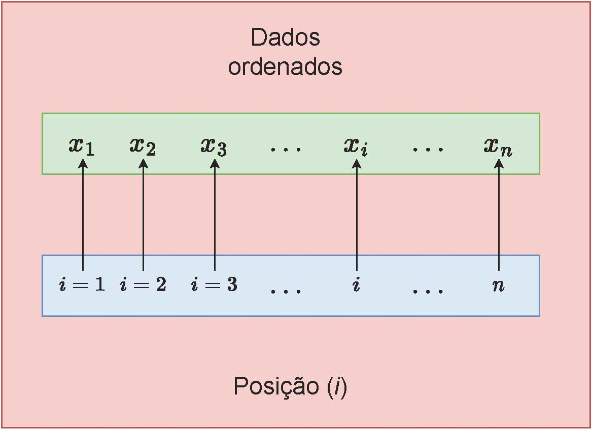
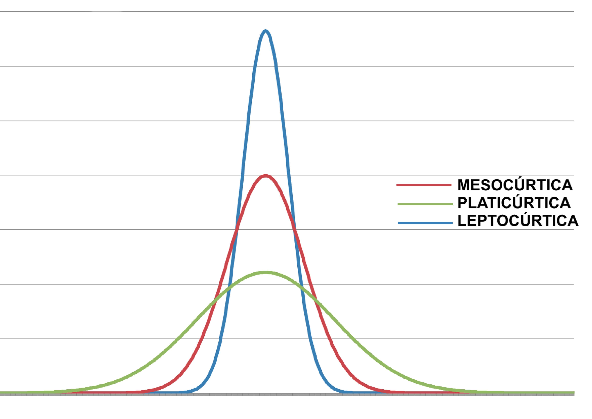
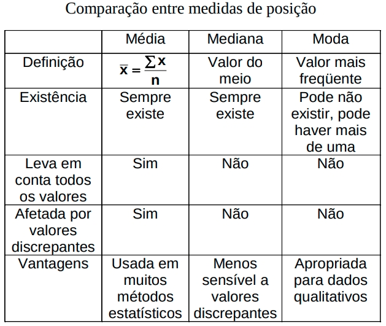

---
output:
  html_document: default
  pdf_document: default
---
```{r, echo=FALSE, include=FALSE}
colFmt <- function(x,color) {
  
  outputFormat <- knitr::opts_knit$get("rmarkdown.pandoc.to")
  
  if(outputFormat == 'latex') {
    ret <- paste("\\textcolor{",color,"}{",x,"}",sep="")
  } else if(outputFormat == 'html') {
    ret <- paste("<font color='",color,"'>",x,"</font>",sep="")
  } else {
    ret <- x
  }

  return(ret)
}
```


```{r , echo = FALSE, include=FALSE}
library(texPreview)
library(kableExtra)
library(knitr)
library(ggplot2)
knitr::opts_chunk$set(echo = TRUE)
```


# Introdução à estatística descritiva


\

Sobre o estudo da estatística por áreas nas quais, aparentemente, não se vislumbra sua utilidade trazemos o prefácio da tradução do livro de Jack Levin (Estatística aplicada às ciências humanas) por Sérgio Francisco Costa, ao dizer que o livro: 

\

>"[...] destina-se a um público muito específico: estudantes de Ciências Humanas, refúgio errôneo dos que fogem das equações e dos cálculos, pois que, embora humanas - e talvez por isso mesmo - não podemos prescindir das tão odiadas quantificações [...]"

\


## Análise exploratória

\

A análise exploratória de dados ( _EDA: Exploratory Data Analisys_ , originalmente desenvolvida pelo matemático e estatístico norte-americano John Tukey na década de 1970) é usada para se investigar conjuntos de dados e resumir suas principais características, muitas vezes usando métodos de visualização de dados por gráficos e apresentação de tabelas. 

\

```{r, echo=FALSE, out.width='50%', fig.align='center', fig.cap="John Tukey (1915-2000)"}


```

\

Habitualmente uma _EDA_ envolve:

- verificar quais são os tipos de variáveis presentes nos dados;
- verificar os padrões de cada variável e eventuais associações entre duas ou mais delas; e,
- apresentar os valores assumidos por cada uma das variáveis em formas resumidas como: 
  - resumos (sínteses) numéricas
  - tabulares e 
  - gráficos.

## Dados brutos, em rol, diagrama de ramos & folhas e de dispersão unidimensional


Consideremos os dados obtidos da medição das alturas em metros de 60 estudantes de uma determinada classe de um certo curso aqui na UEL: 


```{r}
alturas=c(1.63,1.67,1.47,1.64,1.66,1.73,2.00,1.62,1.65,1.56,1.65,1.85,1.73,
          1.78,1.82,1.68,1.67,1.83,1.72,1.71,1.73,1.67,1.66,1.95,1.76,1.73,
          1.77,1.68,1.65,1.64,1.66,1.68,1.61,1.73,1.72,1.83,1.69,1.84,1.66,
          1.78,1.54,1.74,1.56,1.66,1.56,1.62,1.55,1.86,1.44,1.67,1.76,1.79,
          1.75,1.41,1.65,1.58,1.93,1.57,1.71,1.58,0.1,3.68,0,NA)
alturas
```

\
_Garbage in_, _garbage out_. Não são raras as vezes nas quais o relatório com os dados coletados em uma pesquisa apresentam uma série de erros. Não estamos a nos refeir aqui aos **erros amostrais** mas sim aos erros experimentais (não amostrais), aqueles decorrentes de dados coletados incorretamente, tais como aqueles resultantes de omissões na transcrição das informações, da leitura de instrumentos descalibrados ou de informações simplesmente não coletadas.

\

Denomina-se pré-processamento essa etapa de _limpeza_ do conjunto de dados na qual busca-se corrigir de mdo extremamente criterioso esses problemas e, para tanto, um profundo conhecimento do objeto que está sendo pesquisado é necessário de modo a não serem liminarmente eliminados dados simplesmente por destoarem da alguma tendência (para essas tituações há ferramentas estatísticas apropriadas). \

\


O conjunto original de dados ( _dataset_) refere-se a alturas de pessoas (estudantes ) e assim, tata-se de uma variável quantitativa e contínua e como tal será analisada. As omissões de informação "NA" ( _not available_) e as medidas transcritas com erros grosseiros (0 m; 0,10 m; 3,68 m) serão removidas.   

\


Assim, o _dataset_ será composto pelos dados abaixo:

\


```{r}
alturas=c(1.63,1.67,1.47,1.64,1.66,1.73,2.00,1.62,1.65,1.56,1.65,1.85,1.73,
          1.78,1.82,1.68,1.67,1.83,1.72,1.71,1.73,1.67,1.66,1.95,1.76,1.73,
          1.77,1.68,1.65,1.64,1.66,1.68,1.61,1.73,1.72,1.83,1.69,1.84,1.66,
          1.78,1.54,1.74,1.56,1.66,1.56,1.62,1.55,1.86,1.44,1.67,1.76,1.79,
          1.75,1.41,1.65,1.58,1.93,1.57,1.71,1.58)
alturas
```

\


Esse conjunto de dados certamente contém diversas informações acerca da altura dessas pessoas; todavia, da maneira como está apresentado a compreensão dessas informações fica bastante comprometida.


## Resumos (sínteses) numéricos descritivos

\


Esse modo de apresentação é chamado de dados _brutos_. 


\

Com um pequeno refinamento, como pela simples ordenação desses dados (são medidas numéricas contínuas), algumas informações começam a se destacar:

\


```{r}
sort(alturas)
```
\

A interpretabilidade das informações trazidas por esses dados começa a ficar mais fácil como, por exemplo, as alturas:

\

- mínima; e,
- máxima dos estudantes.

\

A uma listagem de valores ordenada (de modo crescente ou decrescente) dá-se o nome de _rol_. 


Além da apresentação elementar de algumas informações relacionadas aos dados brutos da amostra, tais como os valores _mínimo_ e _máximo_ observados, a estatística descritiva possui muitas outras ferramentas para _condensar_ e _expor_ a informação trazida pelos dados por meio resumos (sínteses) descritivos:

- numéricos
- tabulares
- gráficos.

\

Resumos (sínteses) numéricos descritivos são quantidades que condensam variados aspectos relacionados aos valores dos dados. 

\

As mais conhecidas _sínteses numéricas_ podem ser agrupadas conforme o aspecto que expõem dos dados:

\


- tendência central (posição): média (simples ou aritmética, geométrica, harmônica, anarmônica, quadrática, biquadrática), moda e mediana;
- dispersão (variabilidade): absolutas (amplitude total, variância e desvio padrão) ou relativas (coeficiente de variação, unidades padronizadas); e,
- subdivisão (separatrizes, quantis): mediana (50\%), quartis (25\%, 50\%, 75\%), decis (10\%, ....90\%) e percentis (1\%....99\%).

\

Uma  medida de posição ou dispersão é dita **resistente** quando forem pouco afetadas pela alteração de uma pequena porção dos dados. A mediana é uma medida resistente, já a média e a variância não são.


### Medidas de tendência central (posição)


#### Média 

\

Sejam $x_{1}, x_{2}, ..., x_{n}$ os $n$ valores assumidos pela variável $X$ (dados brutos). A _média aritmética simples_ será dada por: 

\

$$
\stackrel{-}{x}=\frac{\sum _{i=1}^{n}{x}_{i}}{n}
$$

\

Algumas propriedades da média aritmética:

\

- somando-se (ou subtraindo-se) cada um dos elementos do conjunto de dados por uma constante arbitrária qualquer $k$, a média aritmética ficará adicionada (ou subtraída) dessa essa constante $k$ 

\

```{r,  out.width='80%', fig.align='center', fig.cap="Mudanças na média pela adição (subtração) de uma constante $k=0.05$"}

alturas_ad=alturas+0.05

par(mfrow=c(1,2))

stripchart(alturas,method = "stack",  at=0.5, 
main="",pch = 20,
col="blue", cex=1, xlab="Alturas originais dos estudantes (m)", 
ylab="Quantidades observadas (un)")
abline(v=mean(alturas), col="red") 
text(mean(alturas)-0.2, 1, "Média=1,69 m", col = "red", srt=90) 

stripchart(alturas_ad,method = "stack",  at=0.5, 
main="",pch = 20,
col="blue", cex=1, xlab="Alt. dos estudantes (m) adic. de 5cm", 
ylab="Quantidades observadas (un)")
abline(v=mean(alturas_ad), col="red") 
text(mean(alturas_ad)-0.2, 1, "Média=1,74 m", col = "red", srt=90) 

```

\


- multiplicando-se (ou dividindo-se) cada um dos elementos do conjunto de dados por uma constante arbitrária $k$, a média aritmética ficará multiplicada (ou dividida) por essa constante $k$

\


```{r,  out.width='80%', fig.align='center', fig.cap="Mudanças na média pela multiplicação (divisão) de uma constante $k=1.2$"}
alturas_mult=alturas*1.2

par(mfrow=c(1,2))

stripchart(alturas,method = "stack",  at=0.5, 
main="",pch = 20,
col="blue",  xlab="Alturas originais dos estudantes (m)", 
ylab="Quantidades observadas (un)")
abline(v=mean(alturas), col="red") 
text(mean(alturas)-0.1, 1, "Média=1,69 m", col = "red", srt=90) 


stripchart(alturas_mult,method = "stack",  at=0.5, 
main="",pch = 20,
col="blue",  xlab="Alt. dos estudantes (m) mult. por 1,2", 
ylab="Quantidades observadas (un)")
abline(v=mean(alturas_mult), col="red") 
text(mean(alturas_mult)-0.1, 1, "Média= 2,02 m", col = "red", srt=90) 


```
\


- a soma dos desvios observados entre cada um dos valores assumidos pela variável $X$ e sua média $\stackrel{-}{x}$ é nula;
- a soma dos quadrados dos desvios é mínima; 
- em uma distribuição de frequências, a soma dos produtos dos desvios entre a média  o valor médio de cada uma das classes, pelas respectivas frequências é nula; e,
- multiplicando-se (ou dividindo-se) todas as frequências de uma distribuição por uma constante arbitrária, a média aritmética não se altera.


\

Usando os dados das medidas das alturas dos 60 estudantes  teremos o seguinte valor para a **média**:

\

```{r}

round(mean(alturas),2)

```

#### Moda  

\

Moda é o valor que ocorre com maior frequência na amostra. Uma amostra pode se apresentar como:

\


- unimodal; 
- bimodal;
- plurimodal; ou, 
- amodal.

\

```{r, align='center', fig.cap="Bimodal: 1,66 m e 1,73 m"}

tab_alturas=table(alturas)

tab_alturas

barplot(tab_alturas,
        main="Valores observados da alturas dos estudantes",
        xlab="Altura (cm)",
        ylab="Quantidade observada (un)",
        ylim=c(0,6),
        col="blue",
        las=0, 
        hor="FALSE")

```

\

Usando os dados das medidas das alturas dos 60 estudantes  teremos os seguintes valores para a **moda**:

\


```{r}
# função em R para extrair a moda:

Modes <- function(x) {
  ux <- unique(x)
  tab <- tabulate(match(x, ux))
  ux[tab == max(tab)]
}

Modes(alturas)
```


### Medidas de dispersão (variabilidade)

\

O conhecimento de uma medida de tendência central nos provê uma informação útil mas incompleta. As medidas de dispersão nos ajudam a ter uma perspectiva melhor dos dados.


\

- amplitude total dos dados;
- desvio padrão (variância): é considerada a mais útil das medidas de dispersão;  
- coeficiente de variação; e,
- unidades padronizadas.

\

Diferentes tipos quanto à dimensão (unidade):

\

- **medidas absolutas** são aquelas expressas na mesma unidade de medida da variável do fenômeno estudado ($m;kg;\frac{R\$}{mês};\dots$);  
- **medidas relativas** são adimiensionais e assim podem ser usadas para se comparar a variabilidade de dois ou mais conjuntos de dados, mesmo quando as variáveis se refiram a diferentes fenômenos ou que sejam expressas, originalmente, em diferentes unidades.


\

#### Amplitude total dos dados

\

A amplitude total dos dados é a simples diferença entre o **maior** e o **menor** dos valores observados:

\

$$
A=x_{max} - x_{min}
$$

\


#### Variância (e desvio padrão)

\

Sejam $x_{1}, x_{2}, ..., x_{n}$ os $n$ valores assumidos pela variável $X$. Dá-se o nome de desvios a contar da média as diferenças entre cada uma das observações e a média: $x_{i} - \stackrel{-}{x}$ com $i=1,2,...,n$.

\


Não é possível considerar a possibilidade de se adotar o valor médio desses desvios pois uma das propriedades da média é que a soma dos desvios em torno de si é nula.

\


$$
\stackrel{-}{d} = \frac{\sum _{i=1}^{n}\left(x_{i}-\stackrel{-}{x}\right)}{n}
$$
$$
\sum _{i=1}^{n}\left(x_{i}-\stackrel{-}{x}\right)=0
$$ 

\

constitui-se numa restrição linear dos desvios porque qualquer $n-1$ deles completamente determina o outro. Tampouco se considera a possibilidade de se adotar o valor médio desses desvios em módulo, pelas dificuldades teóricas em problemas de inferência.

\


$$
\stackrel{-}{d}  = \frac{\sum _{i=1}^{n}\left|x_{i}-\stackrel{-}{x}\right|}{n}
$$

\

Uma alternativa é adotar o valor médio do **quadrado** desses desvios.

\

$$
S^{2}=\frac{\sum _{i=1}^{n}\left(x_{i}-\stackrel{-}{x}\right)^{2}}{n-1}
$$

\

ou, 

\

$$
S^{2}=\frac{1}{(n-1)} \times \left[ \sum _{i=1}^{n} (x_{i}^{2}) - \frac{({\sum _{i=1}^{n}x_{i})}^{2} }{n}\right]
$$

\

Diz-se que a variância amostral (variância _ajustada_) possui $(n-1)$ graus de liberdade, denotado pela letra grega $\nu$. A perda de _um_ grau de liberdade deve-se à necessidade de se substituir a média populacional desconhecida ($\mu$) por sua estimativa amostral ($\stackrel{-}{x}$), deduzida a partir dos dados coletados. 

\


Pode-se demonstrar que em razão dessa restrição a melhor estimativa para a variância populacional é obtida dividindo-se a soma dos quadrados dos desvios por $(n-1)$. Assim $S^{2}$ será um estimador não tendencioso para a variância amostral ao ser dividido por $(n-1)$.

\


```{r}

IC.Na = function (N, n, mu, sigma) {
  dados=data.frame()
  plot(0, 0, 
       type="n", 
       xlim=c(sigma-0.1*sigma,sigma+0.1*sigma), 
       ylim=c(0,N), 
       bty="l",
       xlab="Desvio padrão", 
       ylab="Amostras extraídas", 
       main=paste0("Flutuação dos valores dos desvios padrão \nobtidos em ", N," amostras de tamanho ",n), 
       sub=paste0("A população de origem tem uma distribuição ~ N  (\u03bc:",mu," ; \u03c3:", sigma,")"))
  abline(v=sigma, col='darkgreen', lwd=2, lty=2)
for (i in 1:N) {
  x = rnorm(n, mu, sigma)
  media = mean(x)
  sd = sqrt(sum((x-mean(x))^2)/(n-1))
  sd_vies = sqrt(sum((x-mean(x))^2)/(n))
  temp=cbind(mu, media, sd, sd_vies)
  dados=rbind(dados, temp)
  plotx = c(sd)
  ploty = c(i,i)
  if ( sd < sigma) points(sd, i, col="blue",cex=1)+text(y=i+3,x=sd, labels=round(sd,3), cex=1, col='blue')
  else 
    points(sd, i, col="blue", cex=1)+text(y=i+3,x=sd, labels=round(sd,3), cex=1, col='blue') 
  plotx = c(sd_vies)
  ploty = c(i,i)
  if ( sd_vies < sigma) points(sd_vies, i, col="red",cex=1)+text(y=i+3,x=sd_vies, labels=round(sd_vies,3), cex=1, col='red')
  else 
    points(sd_vies, i, col="red", cex=1)+text(y=i+3,x=sd_vies, labels=round(sd_vies,3), cex=1, col='red') 
} 
abline(v=mean(dados$sd), col='blue', lwd=2, lty=2)
abline(v=mean(dados$sd_vies), col='red', lwd=2, lty=2)
}

```

\


```{r ,  out.width='100%', fig.align='center', fig.cap="Flutuação dos valores do desvio padrão obtidos pelo estimador não viesado (em azul) e pelo estimador viesado (em vermelho) para diversas amostras extraídas de uma mesma população distribuição $\\sim N (\\mu; \\sigma)$ (em verde o desvio padrão populacional, em azul a média dos desvios padrão amostrais correta e em vermelho a estimada de modo viesado)", warning = FALSE, echo=TRUE}

IC.Na(N=100, n=15, mu=170, sigma=7)

```


\

```{r, echo=FALSE, warning=FALSE, out.width='80%', fig.align='center', fig.cap="A distribuição das variâncias amostrais segue uma curva aproximada pela distribuição Qui-quadrado com (n-1) graus de liberdade"}


N=1000 # número de amostras
n=50 #tamanho de cada amostra
media=1.75 #média da população amostrada
desvio=0.05 #desvio da população amostrada

var_amostral=replicate(N, var(rnorm(n=n, mean = media, sd = desvio)))
dados=as.data.frame(var_amostral)
ggplot(dados, aes(x=var_amostral)) + 
geom_histogram(aes(y=..density..), bins=50, colour="black", fill="lightblue")+
geom_density(alpha=.2, fill="#052416")+
geom_area(stat = "function", 
            fun = dchisq, 
            args = list(df=n-1),
            fill = NA, 
            colour="black") +
scale_y_continuous(name="Densidade") +
scale_x_continuous(name="Variâncias amostrais", limits = c(min(var_amostral),max(var_amostral))) +
theme(plot.title = element_text(size = 15, face = "bold"),
        axis.text.x = element_text(angle=0, hjust=1, size=10),
        axis.text.y = element_text(angle=0, hjust=1, size=10),
        axis.title.x = element_text(size = 10),
        axis.title.y = element_text(size = 10))
```

\


Uma medida de dispersão que apresenta a mesma unidade que a das observações originais é o **desvio-padrão**, definido como a raiz quadrada positiva da variância.

\


$$
S= \sqrt{\frac{\sum _{i=1}^{n}\left(x_{i}-\stackrel{-}{x}\right)^{2}}{n-1}}
$$

\


Tanto a variância quanto o desvio padrão indicam, em média, qual será o erro (desvio) cometido ao tentar substituir cada observação pela medida resumo do conjunto de dados (média).


\


Usando os dados das medidas das alturas dos 60 estudantes  teremos o seguinte valor para a **variância** (com unidade igual a $m^{2}$) e o **desvio padrão** (com unidade igual a $m$):

\


```{r}
# Variãncia
var(alturas)

# Desvio padrão
sd(alturas) 

```


Propriedades da variância:

\

- somando-se (ou subtraindo-se) cada um dos elementos do conjunto de dados por uma constante arbitrária, a variância (e o desvio padrão) não se altera; e,
- multiplicando-se (ou dividindo-se) cada um dos elementos do conjunto de dados por uma constante arbitrária, a variância ficará multiplicada (ou dividida) pelo quadrado dessa constante. O desvio padrão fica multiplicado (ou dividido) por essa constante  

\


```{r}
# Adicionando-se uma constante k=0.05
alturas_ad=alturas+0.05

# Variância não se altera
var_ad= var(alturas_ad)
var_ad

# Multiplicando-se uma constante k=1.2
alturas_mult=alturas*1.2

# Variância fica multiplicada (dividida) pelo quadrado dessa constante)
var(alturas_mult)

all.equal(var(alturas_mult), var(alturas)*(1.2^2)) 

```


#### Coeficiente de variação.

\

O coeficiente de variação (uma medida adimensional) é dado pela razão do desvio padrão pela média:

\

$$
CV(\%)= 100\cdot(\frac{s}{\stackrel{-}{x}})
$$

\


```{=latex}

\begin{table}[h]
\centering
\caption{Classificação da variabilidade a partir da medida do Coeficiente de variação}
\begin{tabular}{|c|c|}
\hline 
Classificação  & Medida do Coeficiente de variação (CV \%) \\ 
\hline 
Baixo & $CV \le 10\%$ \\
\hline 
Médio  & $10\% \le CV \le 20\%$ \\
\hline 
Alto  & $20\% \le CV \le 30\%$ \\
\hline 
Muito alto & $CV \ge 30\%$ \\
\hline 
\end{tabular}
\end{table}
```


\


```{r eval=knitr::is_html_output(), results = "asis", echo = FALSE, message = FALSE}

tex2markdown <- function(texstring) {
  writeLines(text = texstring,
             con = myfile <- tempfile(fileext = ".tex"))
  texfile <- pandoc(input = myfile, format = "html")
  cat(readLines(texfile), sep = "\n")
  unlink(c(myfile, texfile))
}

textable <- "

\\begin{table}[h]
\\centering
\\caption{Classificação da variabilidade a partir da medida do Coeficiente de variação}
\\begin{tabular}{|c|c|}
\\hline 
Classificação  & Medida do Coeficiente de variação (CV \\%) \\\\ 
\\hline 
Baixo & $CV \\le 10\\%$ \\\\
\\hline 
Médio  & $10\\% \\le CV \\le 20\\%$ \\\\
\\hline 
Alto  & $20\\% \\le CV \\le 30\\%$ \\\\
\\hline 
Muito alto & $CV \\ge 30\\%$ \\\\
\\hline 
\\end{tabular}
\\end{table}

"

tex2markdown(textable)
```


### Medidas de subdivisão (separatrizes)

\


Separatrizes (quantis) são **medidas quantitativas** que delimitam uma *proporção de observações existentes* em um conjunto de dados previamente ordenados **com valores menores que ela**.

\

Assim, se tomamrmos como exemplo a mediana, ela é dita uma separatriz (ou quantil) de 50\% pois **aproximadamente** 50\% dos dados de um conjunto possuem **valores menores que ela**.

\

Para se **determinar** qualquer separatriz necessitamos saber antes qual a **posição** que ela ocupa nos **dados ordenados crescentemente**: $x_{1}<x_{2}< \dots< x_{n}$:


\


```{r, echo=FALSE, out.width='50%', fig.align='center', fig.cap="Entendendo a indexação de dados"}



```


\

De modo geral, um _quantil_ de ordem $p$ (ou também $p-quantil$, indicado por $q_{p}$) é uma medida separatriz onde $p$ é uma proporção qualquer (limitada no intervalo 0 < p < 1), tal que 100$p$\% das observações sejam menores que seu valor $q_{p}$. Desse modo, o valor $q_{p}$ de uma variável aleatória $X$ remete à medida da probabilidade:

\

$$
P(X=x | x\leq q_{p})=p
$$ 
\

Os quantis recebem diferentes nomes em função do modo como subdividem o conjunto de dados:

\

- percentil (subdivisão em 100 partes): $p_{1}, \dots, p_{99}$  
- decis (subdivisão em 10 partes): $d_{10}, \dots, d_{90}$
- quartis  (subdivisão em 4 partes): $Q_{1}, \dots, Q_{3}$

\

Naturalmente que os valores de $p_{50}$, $d_{5}$ e $Q_{2}$ são **os mesmos** posto tratarem-se de separatrizes que subdividem os dados na mesma propoção (50\%).

\

Os quantis mais informativos (e que por essa razão são usados para um importante gráfico que mais adiante será exposto em detalhes - _Boxplot_) são: \\

\

- 1$^{o}$ Quartil ($q_{0,25}$): 25\% dos dados possuem valores abaixo desse valor e 75\% estão acima;
- 2$^{o}$ Quartil ou mediana ($q_{0,50}$): 50\% dos dados possuem valores abaixo desse valor  e 50\% estão acima; e,
- 3$^{o}$ Quartil ($q_{0,75}$): 75\% dos dados possuem valores abaixo desse valor  e 25\% estão acima.

\

Todavia a medicina utiliza para muitos propósitos os percentis como, por exemplo, as curvas de crescimento idade $versus$ altura. 

\


De modo geral, para se calcular a posição _L_ que um quantil qualquer de ordem _p_ assume em um rol de dados há algumas regras empíricas:

$$
L_{p}=\frac{p}{100} \times (n)\\
L_{p}=\frac{p}{100} \times (n+1)\\
L_{p}=[\frac{p}{100} \times (n-1)]+1\\
$$
\

Onde:

\

- _p_ é a **ordem** do quantil em \% (50\% no caso mediana, por exemplo);
- _n_ é o número de dados do rol;  e,
- _L_ é a **posição** do valor referente ao quantil desejado.

\

Os quartis calculados a partir das posições determinadas por essas regras *aproximadamente* subdividem o conjunto de dados em 25\%, 50\% e 75\%.

\

Assim, para a determinação dos quartis pela primeira regra o valor de _p_ seria:

\


- para o _primeiro quartil_ ($Q_{1}$): $L_{q_{0,25}}=\frac{25}{100} \times (n)$; 
- para o _segundo quartil_ (a mediana ou $Q_{2}$): $L_{q_{0,50}}=\frac{50}{100} \times (n)$; ou,  
- para o _terceiro quartil_ ($Q_{3}$): $L_{q_{0,75}}=\frac{75}{100} \times (n)$. 


\


Novamente podemos nos deparar com **duas situações possíveis** para o valor calculado para a posição _L_ qualquer que seja a regra:


\

- se valor calculado da **posição**  L for um **inteiro**, nessa posição encontraremos o valor referente ao quantil desejado;  
- se o valor calculado da **posição  L** for **fracionário**, o valor desse quantil será determinado pela média entre os dois valores dos dados que estão nas **posições** imediatamente anterior e imediatamente posterior à posição **L** calculada.


\


Juntamente com as observações mínima ($x_{i}$) e máxima ($x_{n}$), o  1$^{o}$, 2$^{o}$ e 3$^{o}$ Quartis são importantes para se ter uma boa idéia da assimetria da distribuição dos dados. 

\

Para uma distribuição simétrica (ou aproximadamente simétrica) deveremos observar (Distribuição Gaussiana):

\

- a dispersão inferior: $q_{2} - x_{1} \approx x_{n} - q_{2}$ à dispersão superior ;
- $q_{2} - q_{1}  \approx   q_{3} - q_{2}$; e,
- $q_{1} - x_{1}  \approx   x_{n} - q_{3}$.

\


Para nosso conjunto de dados, segundo a regra empírica apresentada teremos as seguintes posições para determinação dos valores dos quartis:

\

- para o _primeiro quartil_:

\begin{align*}
L_{Q_{1}} & =\frac{p}{100} \times (n) \\
          & =\frac{25}{100} \times (60) \\
          & = 0,25*60 \\
          & = 15
\end{align*}
\

- para o _segundo quartil_:


\begin{align*}
L_{Q_{2}} & =\frac{p}{100} \times (n) \\
          & =\frac{50}{100} \times (60) \\
          & = 0,5*60 \\
          & = 30
\end{align*}


\
- para o _terceiro quartil_:

\begin{align*}
L_{Q_{3}} & =\frac{p}{100} \times (n) \\
          & =\frac{75}{100} \times (60) \\
          & = 0,75*60 \\
          & = 45
\end{align*}


\

E os quartis serão:

\

-$Q_{1}$=1,63  
-$Q_{2}$=1,67  
-$Q_{3}$=1,75

\


Há muitos modos de se estabelecer os quantis descritos na literatura. O próprio [R](https://www.rdocumentation.org/packages/stats/versions/3.6.2/topics/quantile) apresenta 9 modos diferentes: 

\


```{r}
quantile(alturas, type=1)
quantile(alturas, type=2)
quantile(alturas, type=3)
quantile(alturas, type=4)
quantile(alturas, type=5)
quantile(alturas, type=6)
quantile(alturas, type=7)
quantile(alturas, type=8)
quantile(alturas, type=9)


```


\


Para grandes conjuntos de dados a diferença entre os quantis determinados sob esses diferentes modos será desprezível.

\
## Padronização (_z-scores_)


\

À conversão do valor assumido por uma variável em unidades de desvio padrão acima (ou abaixo) do valor médio de sua distribuição é dado o nome de _padronização_. Essa métrica permite comparações com outras, procedentes de outros fenômenos. 

\

Para padronizar (achar o seu _z-score_ Z) o valor de uma variável procede-se segundo a fórmula:

\

$$
Z=\frac{x_{i} - \stackrel{-}{x}}{s}
$$


\
O valor $Z$ expressa quantos desvios esse dado está acima (ou abaixo) da média da distribuição.


\

Pelo _Teorema de Tchebichev_ pode-se estimar a probabilidade mínima dos dados situados a certa distância de $k$ desvios da média dessa distribuição:

\


$$
P(|X-\mu|\ge k\sigma) \leq 1 - \frac{1}{k^{2}}
$$

\

Assim, se $k=2$ **ao menos** 75\% das observações devem estar entre a média e dois desvios padrões acima ou abaixo da média. 

\


```{r}
med=round(mean(alturas),2)
desv= round(sd(alturas),2)
```

\

No exemplo das alturas dos estudantes temos a média de `r med` m e um desvio padrão de `r desv` m. Assim, **ao menos** 75\% das alturas deverão estar entre `r med-2*desv` m e `r med + 2*desv` m.  

\

```{r}
sort(alturas)
# Duas observações menores que 1,47m e trẽs maiores que 1,91m.
# Assim, 54 observações dentro do intervalo, equivalendo a 91,66% do total.
```

\

## Medidas de forma (assimetria \& curtose)

\

Quando analisamos o histograma (a representação gráfica da distribuição das frequências dos valores agrupados em classes) de uma determinada variável, não é muito comum que ele se mostre simétrico tal como seria se os dados fossem distribuídos de modo exatamente Normal.  

\

Ao observarmos que a cauda se mostra mais alongada para a direita (indicativo da existência de uma quantidade maior de dados com grandes valores, _arrastando_ a média para a direita: moda $<$ mediana $<$ média) diz-se que a _distribuição é assimétrica à direita_. Na situação oposta (moda $>$ mediana $>$ média) diz-se que ela é _assimétrica à esquerda_.

\


```{r,  out.width='80%', fig.align='center', fig.cap="Diferentes formas na distribuição dos dados"}

a=rbeta(10000,5,2)
c=rbeta(10000,5,5)
b=rbeta(10000,2,5)

par(mfrow=c(1,3))
hist(a, 
     xlab="Valores",col = 'lightblue',
     ylab="Frequência",
     main="Assimetria à esq.")
hist(c, 
     xlab="Valores",col = 'lightblue',
     ylab="Frequência",
     main="Relativa simetria")
hist(b, 
     xlab="Valores",col = 'lightblue',
     ylab="Frequência",
     main="Assimetria à dir.")


```

\

De modo assemelhado, o histograma pode denotar uma forma mais _plana_ ou menos _aguda_, onde um _cume_ mostra-se mais destacado. 

\

Nesse aspecto da forma, uma variável com distribuição Gaussiana apresentaria uma curva a que denominamos _mesocúrtica_. Distribuições com um aspecto mais plano são denominadas de _platicúrticas_  e as  com um cume agudo são denominadas _leptocúrticas_.

\


A curtose é uma medida da agudeza da distribuição dos dados em relação à distribuição Gaussiana.  

\

```{r, echo=FALSE, out.width='80%', fig.align='center', fig.cap="Diferentes aspectos de uma distribuição quanto à sua inclinação"}



```

\


Essas possíveis variações na forma de uma distribuição podem ser numericamente quantificadas através dos _coeficientes de assimetria e curtose_. 

\


Uma das medidas do coeficiente de assimetria é através do _primeiro ou segundo coeficientes de Pearson_, dados pelas seguintes relações:

\


- Primeiro coeficiente de assimetria de Pearson: $AS= \frac{ \stackrel{-}{x} - M_{o} }{ s }$
- Segundo coeficiente de assimetria de Pearson: $AS = \frac{ 3 ( \stackrel{-}{x} - Q_{2}) } { s  }$

\

Onde:

\

- $\stackrel{-}{x}$ é a média; 
- $M_{o}$ é a moda;
- $S$ é o desvio padrão; e, 
- $Q_{2}$ é o segundo quartil (mediana).

\

A _assimetria_ é classificada do modo seguinte:

\

- $-1 \leq AS \leq 1%=$ : distribuição simétrica;
- $AS<-1$: distribuição com assimetria negativa; e,
- $AS>1$: distribuição com assimetria positiva.

\

Uma das medidas do coeficiente de curtose é através da seguinte relação entre _quartis_ e _percentis_:

\


$$
K = \frac{Q_{3} - Q_{1}}   {2 \times(P_{90} - P_{10})} 
$$

\

Onde: 

\

- $Q_{3}$ = $3^{o}$  quartil; 
- $Q_{1}$ = $1^{o}$ quartil;
- $P_{90}$ = $90^{o}$ percentil; e, 
- $P_{10}$ = $10^{o}$ percentil.

\

O _coeficiente de curtose_ é classificado do modo seguinte:

\

- k = 0,263: distribuição mesocúrtica;
- k < 0,263: distribuição leptocúrtica; e,
- k > 0,263: distribuição platicúrtica.

\


## Diferentes posições da média, moda e mediana (2$^{o}$ quartil)

\


Essas três medidas podem se apresentar com valores em posições alternadas quando as comparamos:
\

- quando a moda=mediana=média temos uma distribuição de frequências razoavelmente **simétrica**;
- quando a moda $\leq$ mediana $\leq$ média (há uma quantidade maior de dados com grandes valores, arrastando a média para a direita, para cima) temos uma distribuição de frequências **positivamente assimétrica**, ; e,  
- quando  a moda $\geq$ mediana $\geq$ média (há uma quantidade maior de dados com pequenos valores, arrastando a média para a esquerda, para baixo) temos uma distribuição de frequências **negativamente assimétrica**.  

\


```{r, include=FALSE}
pos=as.vector(barplot(tab_alturas))

```

\

```{r,  out.width='80%', fig.align='center', fig.cap="Valores observados das alturas dos estudantes e as posições da média, moda e mediana"}
barplot(tab_alturas,
        main="Valores observados da alturas dos estudantes",
        xlab="Altura (cm)",
        ylab="Quantidade observada (un)",
        ylim=c(0,6),
        col="blue",
        las=0, 
        hor="FALSE")
abline(v=mean(19.9, 21.1), col="red")
text( mean(19.9, 21.1)-0.5, 5, "Média=1,69 m", col = "red", srt=90)
abline(v=median(18.7 , 19.9), col="darkgreen") 
text(median(18.7 , 19.9)-0.5, 5, "Mediana=1,675 m", col = "darkgreen", srt=90)
abline(v=c(16.3, 23.5), col="darkgrey") 
text(c(16.3-0.5, 23.5-0.5), 5, c("Moda=1,66","Moda=1,73"), col = "darkgray", srt=90)

```


\

```{r, echo=FALSE, out.width='80%', fig.align='center', fig.cap="Quadro comparativo entre as medidas de tendência central (posição)"}



```


## Apresentação tabular de dados 


\

As sínteses numéricas expostas condensam ao máximo a informação trazida pelos dados na forma de estatísticas associadas à:

\

- posição: média, moda, mediana;
- dispersão: amplitude total dos dados, variância (esvio padrão), coeficiente de variação;
- separatrizes (repartição): como por exemplo os quartis ($Q_{1}$; $Q_{2}$/mediana e $Q_{3}$). 

\

A correta exposição dos dados na forma de tabelas e gráficos auxilia o entendimento de muitas outras características relacionadas aos dados trabalhados por parte do leitor com grande riqueza visual.   

\

Ao se lidar com grandes conjuntos de dados a visualização da informação contida nos dados fica comprometida se eles forem simplesmente apresentados como uma listagem, mesmo que depurados de eventuais inconsistências e ordenados como a lista abaixo:

\


```{r}
sort(alturas)
```

\

Um dos modos de se lidar com isso é condensando a informação dos dados brutos em tabelas. 

\

Uma tabela é uma forma não discursiva de apresentar informações nas quais o dado numérico se destaca como informação central. Uma tabela se diferencia de um quadro por este ter todos os seus campos delimitados por linhas e conter apenas informações de natureza qualitativa. 

\

Uma tabela deve conter algumas **informações essenciais**, fora daquela estritamente relacionada aos dados, para que a compreensão do leitor acerca dos dados expostos seja a mais imediata possível:   

\


- título que explique o que a tabela contém, local, data;
- cabeçalho nas colunas e linhas com a explicação, ainda que resumis, a que se referem as quantidades expostas no corpo;
- corpo formado pelos dados referentes às variáveis; 
- fonte dos dados;
- uniformidade no número de casas decimais apresentadas no corpo; 
- todas as casas devem apresentar valores ou símbolos que expliquem a ausência da informação (NI, NE, ou 0-zero).

\


Trabalhos de natureza acadêmica ou científica deveriam obrigatoriamente seguir, quando publicados no Brasil, a norma vigente publicada pela ABNT: Associação Brasileira de Normas Técnicas e algumas punlicações do IBGE: Instituto Brasileiro de Geografia e Estatística (como em [link](https://biblioteca.ibge.gov.br/visualizacao/livros/liv23907.pdf)).

\

Observa-se frequentemente, todavia, que  as publicações seguem normas particulares das instituições de ensino (para trabalhos de conclusão de curso, monografias, dissertações e teses) ou das editoras (artigos), muitas vezes mescladas com recomendações da ABNT.  Na Universidade Estadual de Londrina o portal da biblioteca possui uma ligação para a seção "Normas para trabalhos" ([link](https://sites.uel.br/bibliotecas/)).


\

### Apresentação tabular de dados qualitativos

\

#### Dados qualitativos em entrada única 

\

Para alguns tipos de dados, a apresentação tabular é bastante imediata. 

\

Admita que tenha sido realizada uma pesquisa junto a um terminal de desembarque internacional em algum aeroporto sobre o continente de procedência do passageiro, num determinado período de um certo dia, tendo sido anotados os seguintes valores: AM, AM, A, A, A, AM, EU, EU, EU, EU, AM, AS, AS, AS, OC, AS, EU, AM, onde os continente anotados são assim identificados: americano (AM); africano (A), europeu (EU); asiático (AS) e da oceania (OC). Uma tabela para a apresentação dos resultados poderia ser:  


\


```{=latex }

\begin{table}[h]
\begin{center}
\caption{Desembarques no terminal internacional A em Cumbica (SP, Brasil-10/10/2021: 8 h 00min às 12 h 00 min)}
\begin{tabular}{|l|l|}
\hline
Continente de procedência   &  Desembarques  \\
\hline
América & 5 \\                                
África  & 3 \\                           
Europa  & 5 \\                          
Ásia    & 4 \\                          
Oceania & 1 \\                        
\hline
Total  & 18 \\   
\hline
\end{tabular} \vspace{4pt}

Fonte: Próprio autor
\end{center}
\end{table}


```


```{r eval=knitr::is_html_output(), results = "asis", echo = FALSE, message = FALSE}

tex2markdown <- function(texstring) {
  writeLines(text = texstring,
             con = myfile <- tempfile(fileext = ".tex"))
  texfile <- pandoc(input = myfile, format = "html")
  cat(readLines(texfile), sep = "\n")
  unlink(c(myfile, texfile))
}

textable <- "
\\begin{table}[h]
\\centering
\\caption{Desembarques no terminal internacional A em Cumbica (SP, Brasil) \\\\\\hspace{\\textwidth} (10/10/2021: 8 h 00min às 12 h 00 min)}
\\begin{tabular}{|l|l|}
\\hline
Continente de procedência   &  Desembarques  \\\\
\\hline
América & 5 \\\\                                
África  & 3 \\\\                           
Europa  & 5 \\\\                          
Ásia    & 4 \\\\                         
Oceania & 1 \\\\                        
\\hline
Total  &  18 \\\\   
\\end{tabular}
\\vspace{4pt}
Fonte: Próprio autor
\\end{table}	

"

tex2markdown(textable)
```


\

Outro exemplo de apresentação tabular onde são apresentadas as proporções relativas  observadas de cada nível da variável estudada ("tipo de família", com quatro níveis diferentes), de um levantamento amostral feito pela Agência do Censo dos Estados Unidos em 2005.

\


```{=latex }
\begin{table}[h]
\begin{center}
\caption{Estrutura domiciliar dos Estados Unidos}
\begin{tabular}{|l|l|l|l|}
\hline
Estrutura domiciliar   & Número (milhões)  & Freq. rel.  & Freq. rel.  (\%) \\
\hline
Casal com filhos       & 24,1             & 0,22       & 22               \\
Casal sem filhos       & 31,1             & 0,28       & 28               \\
Solteiro, sem parceiro & 19,1             & 0,17       & 17               \\
Morando sozinho        & 30,1             & 0,27       & 27               \\
Outros domicílios      & 6,7              & 0,06       & 6                \\
\hline
Total                  & 111.1            & 1,00       & 100\%            \\
\hline
\end{tabular} \vspace{4pt}

Fonte: Próprio autor
\end{center}
\end{table}


```


```{r eval=knitr::is_html_output(), results = "asis", echo = FALSE, message = FALSE}

tex2markdown <- function(texstring) {
  writeLines(text = texstring,
             con = myfile <- tempfile(fileext = ".tex"))
  texfile <- pandoc(input = myfile, format = "html")
  cat(readLines(texfile), sep = "\n")
  unlink(c(myfile, texfile))
}

textable <- "
\\begin{table}[h]
\\centering
\\caption{Estrutura domiciliar dos Estados Unidos}
\\begin{tabular}{|l|l|l|l|}
\\hline
Estrutura domiciliar   & Número (milhões)  & Freq. rel.  & Freq. rel.  (\\%) \\\\
\\hline
Casal com filhos       & 24,1             & 0,22       & 22               \\\\
Casal sem filhos       & 31,1             & 0,28       & 28               \\\\
Solteiro, sem parceiro & 19,1             & 0,17       & 17               \\\\
Morando sozinho        & 30,1             & 0,27       & 27               \\\\
Outros domicílios      & 6,7              & 0,06       & 6                \\\\
\\hline
Total                  & 111.1            & 1,00       & 100\\%            \\\\
\\hline
\\end{tabular}
\\vspace{4pt}
Fonte: Censo dos EUA (2005)                                                
\\end{table}		

"

tex2markdown(textable)
```


\

#### Dados qualitativos em entrada dupla 

\

Outros tipos de dados são provenientes de pesquisas que têm por base respostas de natureza binária como, por exemplo:

\

- sim ou não;
- gosto ou não gosto; 
- voto em "A" ou voto em "B"; ou,
- concordo ou não concordo.

\

Como resultado final, são obtidas contagens que  expressam as frequências absolutas observadas para cada uma das variáveis (ou seus níveis) como na apresentação tabular de dados qualitativos por _Tabelas de Contingência_. 

\

As _tabelas de contingência_ são usadas para associar duas ou mais variáveis qualitativas (ou seus níveis) às contagens das respostas obtidas, na forma das frequências absoluta e relativa observadas em cada uma dessas variáveis (ou seus níveis).

\

O uso desse tipo de tabela é comum quando se pretende investigar se as variáveis estudadas têm alguma associação por meio de testes não paramétricos. Esse tipo de apresentação facilita a extração de informações relacionadas às probabilidades marginais ou condicionadas de cada uma variáveis ou seus níveis. 


\

Admita agora que a pesquisa anterior junto ao terminal de desembarque internacional tenha também apontado o sexo do passageiro em seu desembarque. Uma tabela de dupla entrada com aqueles dados assumiria a forma:

\

```{=latex }


\begin{table}
\begin{center}
\caption{Desembarques no terminal internacional A em Cumbica (SP, Brasil - 10/10/2021: 8 h 00min às 12 h 00 min)}
\begin{tabular}{l|l|l|l}
\hline
\multirow{2}{*}{Desembarques no terminal internacional A em Cumbica (SP, Brasil)} & \multicolumn{2}{c|}{Sexo do passageiro} & \multirow{2}{*}{Total}  \\ 
\cline{2-3}
                & M & F &        \\ 
\hline
América & 3 & 2 & 5 \\                                
África  & 3 & 0 & 3 \\                           
Europa  & 1 & 4 & 5 \\                          
Ásia    & 2 & 2 & 4 \\                          
Oceania & 0 & 1 & 1 \\                        
\hline
Total  & 9 & 9 & 18 \\   
\hline
\end{tabular} \vspace{4pt}

Fonte: Próprio autor
\end{center}
\end{table}

```


\


```{r eval=knitr::is_html_output(), results = "asis", echo = FALSE, message = FALSE}

tex2markdown <- function(texstring) {
  writeLines(text = texstring,
             con = myfile <- tempfile(fileext = ".tex"))
  texfile <- pandoc(input = myfile, format = "html")
  cat(readLines(texfile), sep = "\n")
  unlink(c(myfile, texfile))
}

textable <- "

\\begin{table}
\\centering
\\caption{Desembarques no terminal internacional A em Cumbica (SP, Brasil) \\\\
\\hspace{\\textwidth} (10/10/2021: 8 h 00min às 12 h 00 min)}
\\begin{tabular}{l|l|l|l}
\\hline
\\multirow{2}{*}{Desembarques no terminal internacional A em Cumbica (SP, Brasil)} & \\multicolumn{2}{c|}{Sexo do passageiro} & \\multirow{2}{*}{Total}  \\\\ 
                               & M & F &        \\\\ 
\\hline
América & 3 & 2 & 5 \\\\                                
África  & 3 & 0 & 3 \\\\                           
Europa  & 1 & 4 & 5 \\\\                          
Ásia    & 2 & 2 & 4 \\\\                          
Oceania & 0 & 1 & 1 \\\\                        
\\hline
Total  & 9 & 9 & 18  \\\\   
\\hline
\\end{tabular}
\\vspace{4pt}
Fonte: Próprio autor
\\end{table}	

"

tex2markdown(textable)
```

\


Um outro exemplo, usando dados da incidência de baixo peso ao nascer em recém-nascidos de Pelotas (RS) segundo o hábito tabágico da mãe durante a gravidez (1982):

\


```{=latex}

\begin{table}
\begin{center}
\caption{Incidência de baixo peso ao nascer em recém-nascidos de Pelotas, RS, segundo o hábito tabágico da mãe durante a gravidez (1982)}
\begin{tabular}{c|c|c|c}
\hline
\multirow{2}{*}{Classificação da mãe} & \multicolumn{2}{c|}{Baixo peso ao nascer} & \multirow{2}{*}{Total}  \\ 
\cline{2-3}
                               & Sim & Não &        \\ 
\hline              
Fumante & 275  & 2.144  & 2.419    \\
\hline 
Não fumante & 311  & 4.496  & 4.807   \\
\hline 
Total & 586 & 6.640 & 7.226  \\
\hline
\end{tabular} \vspace{4pt}

Fonte: Próprio autor
\end{center}
\end{table}

```

\

```{r eval=knitr::is_html_output(), results = "asis", echo = FALSE, message = FALSE}

tex2markdown <- function(texstring) {
  writeLines(text = texstring,
             con = myfile <- tempfile(fileext = ".tex"))
  texfile <- pandoc(input = myfile, format = "html")
  cat(readLines(texfile), sep = "\n")
  unlink(c(myfile, texfile))
}

textable <- "

\\begin{table}
\\centering
\\caption{Incidência de baixo peso ao nascer em recém-nascidos de Pelotas, RS,
segundo o hábito tabágico da mãe durante a gravidez (1982)}
\\begin{tabular}{c|c|c|c}
\\hline
\\multirow{2}{*}{Classificação da mãe} & \\multicolumn{2}{c|}{Baixo peso ao nascer} & \\multirow{2}{*}{Total}  \\\\ 
                                      & Sim & Não &        \\\\ 
\\hline              
Fumante & 275  & 2.144  & 2.419    \\\\
\\hline 
Não fumante & 311  & 4.496  & 4.807   \\\\
\\hline 
Total & 586 & 6.640 & 7.226  \\\\
\\hline
\\end{tabular}
\\vspace{4pt}
Fonte: Próprio autor                                                
\\end{table}	

"

tex2markdown(textable)
```


\

Ou ainda neste outro estudo que analisa a inclinação partidária de dois tipos de núcleos familiares em relação à presença de filhos: 

\


```{=latex }

\begin{table}[h]
\begin{center}
\caption{Inclinação partidária (frequências absolutas)}
\begin{tabular}{|l|l|l|l|}
\hline
Estrutura domiciliar    & Democrata          & Republicano &  Totais        \\
\hline
Casal com filho(s)    & 762                & 468         & 1230            \\
Casal sem filhos      & 484                & 477         & 961             \\
\hline
Totais                & 1246               & 945         & 2191           \\
\hline
\end{tabular} \vspace{4pt}

Fonte: Próprio autor
\end{center}
\end{table}


```


```{r eval=knitr::is_html_output(), results = "asis", echo = FALSE, message = FALSE}

tex2markdown <- function(texstring) {
  writeLines(text = texstring,
             con = myfile <- tempfile(fileext = ".tex"))
  texfile <- pandoc(input = myfile, format = "html")
  cat(readLines(texfile), sep = "\n")
  unlink(c(myfile, texfile))
}

textable <- "
\\begin{table}[h]
\\centering
\\caption{Inclinação partidária (frequências absolutas)}
\\begin{tabular}{|l|l|l|l|}
\\hline
Estrutura domiciliar   & Democrata          & Republicano &  Totais        \\\\
\\hline
Casal com filho(s)    & 762                & 468         & 1230            \\\\
Casal sem filhos      & 484                & 477         & 961             \\\\
\\hline
Totais                & 1246               & 945         & 2191           \\\\
\\hline
\\end{tabular}
\\vspace{4pt}
Fonte: Próprio autor                                                
\\end{table}		

"

tex2markdown(textable)
```


\

A partir das contagens obtidas na pesquisa (as frequências absolutas), uma tabela com as frequências relativas pode ser construída, passando a apresentar as proporções relativas de cada categoria em relação aos níveis pesquisados:

\


```{=latex }


\begin{table}[h]
\begin{center}
\caption{Inclinação partidária (frequências relativas)}
\begin{tabular}{|l|l|l|l|}
\hline
Estrutura domiciliar    & Democrata (\%)          & Republicano (\%) &  Totais  (\%)      \\
\hline
Casal com filho(s)    & 34,78                & 21,36         & 56,14            \\
Casal sem filhos      & 22,09                & 21,77         & 43,86             \\
\hline
Totais (\%)           & 56,87               & 43,13         & 100           \\
\hline
\end{tabular} \vspace{4pt}

Fonte: Próprio autor
\end{center}
\end{table}


```


```{r eval=knitr::is_html_output(), results = "asis", echo = FALSE, message = FALSE}

tex2markdown <- function(texstring) {
  writeLines(text = texstring,
             con = myfile <- tempfile(fileext = ".tex"))
  texfile <- pandoc(input = myfile, format = "html")
  cat(readLines(texfile), sep = "\n")
  unlink(c(myfile, texfile))
}

textable <- "
\\begin{table}[h]
\\centering
\\caption{Inclinação partidária (frequências relativas)}
\\begin{tabular}{|l|l|l|l|}
\\hline
Estrutura domiciliar    & Democrata (\\%)          & Republicano (\\%) &  Totais  (\\%)     \\\\
\\hline
Casal com filho(s)    & 34,78                & 21,36         & 56,14            \\\\
Casal sem filhos      & 22,09                & 21,77         & 43,86             \\\\
\\hline
Totais (\\%)          & 56,87               & 43,13         & 100           \\\\
\\hline
\\end{tabular}
\\vspace{4pt}
Fonte: Próprio autor                                                
\\end{table}		

"

tex2markdown(textable)
```


### Apresentação tabular de dados quantitativos

\

Todavia, para grandes quatidades de observações de dados quantitativos, a apresentação na forma de tabelas deve ser precedida do agrupamento dos valores observados em classes. O procedimento estatístico de agrupar os dados em _classes_  ou _categorias_ envolve construir uma _tabela de distribuição de frequências_.


\

Uma _tabela de distribuição de frequências_ associa cada _classe_ (intervalo) de valores da variável estudada ao número de ocorrências observadas. Como _regra prática_, a  repartição dos dados brutos em classes deve sempre observar para que não haja um número excessivo de classes (diminuição da finalidade de resumir os dados, criação de classes sem nenhuma observação) nem tampouco poucas (que não possibilitem a visualização da distribuição e promovam perda da informação original).


\

A construção de uma _distribuição de frequências_ consiste essencialmente em:

\

- escolher as _classes_ ou _intervalos_ (dados quantitativos) ou _categorias_ (dados qualitativos);
- separar ou enquadrar os dados nessas _classes_ ou _categorias_; e,
- contar o número de dados de cada _classe_ ou _categoria_. 

\


A literatura propõe vários modos para se determinar o número _k_ de classes:

\


| Crítério                   | Tamanho da amostra (_n_) | Fórmula                 |
|----------------------------|--------------------------|-------------------------|
|                            | n $\leq$ 25              | k=5                     |
| Raiz quadrada              | 25  $\leq$ n $\leq$ 220  | k=$\sqrt{n}$            |
| Raiz quadrada              | 25  $\leq$ n $\leq$ 220  | $2^{k} > n$             |
| Herbert **Sturges**        | 135 $\leq$ 572237        | k=1+3,22.log(n)$^{(1)}$ |
| Giuseppe **Milone**        | 20 $\leq 36315$          | k=-1+2.ln(n) $^{(2)}$   |

\

- $^{(1)}$: logarítmo na base 10; e
- $^{(2)}$: logarítmo na base _e_.

\


Ao se escolher um número ($k$) de classes deve-se **ponderar** para que:

\

- os intervalos das classes tenham, geralmente, a mesma amplitude (raramente se necessita dispor de classes com amplitudes diferentes);
- os intervalos, a faixa de variação que vai do limite inferior da **primeira classe** ao limite superior da **última classe*, devem conter todos os valores possíveis da variável;
- cada valor observado deve pertencer **apenas a uma classe**;
- nenhuma classe deverá estar vazia (sem observação alguma);  
- não adotar um número muito elevado de classes de modo que cada classe possua poucas observações (ou mesmo nenhuma); e,
- não adotar um número muito reduzido de classes de modo a esconder a variabilidade dos dados ao se reunir todas as observações em poucas faixas de valores;
- alguns autores recomendam um número mínimo de 5 classes e um máximo de 15;
- podemos considerar a amplitude de cada classe com **uma casa decimal a mais que os dados** de modo a facilitar a incorporação do último valor (mais elevado) na última classe. 

\


Em nosso exemplo das alturas dos estudantes, a determinação do número de classes pelo critério da _raiz quadrada_ ( _n_=60) sugere 8 classes (outros critérios: pelo menor inteiro tq. $2^{k}>n; k=6$, pelo critério de Sturges $k=6,86 \sim 7$,  de Giuseppe Milone $k=8,18 \sim 9)$).

\


\begin{align*}
k & =\sqrt{n} \\
 & = 7,74 \\
\end{align*}

\

Arredondar para **mais**: $k=8$.

\

A _amplitude total_ (_C_) dos valores observados é a simples diferença entre o _valor máximo_ (2,00 m) e o _valor mínimo_ (1,41 m):


\

\begin{align*}
C & =2,00-1,41 \\
 & =0,59 m 
\end{align*}

\


A amplitude de cada uma das classes ( _c_) será dada pelo quociente da _amplitude total_ ( _C_) pelo _número de classes_ ( _k_). 
\

\begin{align*}
c & = \frac{C}{k} \\
  & = \frac{0,59}{8}\\ 
  & = 0,07375 m
\end{align*}

\

Arredondar para **mais**: $c=0,075 m$.

\

As classes são então assim construídas:

\

- Limite inferior da $1^{a}$ classe ($LI_{1}$): valor mínimo observado; e, 
- Limite superior da $1^{a}$ classe ($LS_{1}$): $LI_{1}$ + c. 

\

e assim sucessivamente atá a última classe.

\


Símbolos gráficos para intervalos:

\

- Os símbolos abaixo indicam que o valor situado à sua esquerda **está incluído** no intervalo e o da direita **não está**: 

\    

$$
\vdash \\
{\bullet}-{\circ}
$$

\

- Os símbolos abaixo indicam que o valor situado à sua esquerda **não está** incluído no intervalo e o da direita **está incluído*:  

\

$$
\dashv  \\
{\circ}-{\bullet}
$$

\

> As tabelas que serão apresentadas a seguir estão sem os requisitos essenciais expostos anteriormente uma vez que o propósito é explicar a construção e cálculo dos valores de suas células.


\

Com $c=0,075m$ as 8 classes ficam assim estabelecidas, tendo-se como ponto de partida o valor mínimo observado: 1,41 m - 1,485 m; 1,485 m - 1,56 m;  1,56 m - 1,635 m;  1,635 m - 1,71 m;  1,71 m - 1,785 m; 1,785 m - 1,86 m; 1,86 m - 1,935m; 1,935 - 2,01 m.

\


{`r colFmt(" 1,41 ; 1,44 ; 1,47",'blue')` ; 1,54 ; 1,55 ; `r colFmt("1,56 ; 1,56 ; 1,56; 1,57 ; 1,58 ; 1,58 ; 1,61 ; 1,62 ; 1,62 ; 1,63", 'blue')`; 1,64 ;1,64 ; 1,65 ; 1,65 ; 1,65 ; 1,65 ; 1,66 ; 1,66 ; 1,66 ; 1,66 ; 1,66 ; 1,67 ; 1,67 ; 1,67 ; 1,67 ; 1,68 ; 1,68 ;1,68 ; 1,69 ; `r colFmt(" 1,71 ; 1,71 ; 1,72 ; 1,72 ; 1,73 ; 1,73 ; 1,73 ; 1,73 ; 1,73 ; 1,74 ; 1,75 ; 1,76 ; 1,76 ; 1,77 ;  1,78 ; 1,78" , 'blue')`; 1,79 1,82 ; 1,83 ; 1,83 ; 1,84 ; 1,85 ;  `r colFmt(" 1,86  ; 1,93", 'blue')`;  1,95 ; 2,00}

\
\


A tabela de distribuição de frequências com 8 classes, cada uma com amplitude 0,075 m, assume a forma:

\


| Classe                  | Frequência absoluta ($f_{i}$) |
|-------------------------|-------------------------------|
| 1,41 m $\vdash$ 1,485 m |  3                            |
| 1,485 m $\vdash$ 1,56 m |  2                            |
| 1,56 m $\vdash$ 1,635 m |  10                           |
| 1,635 m $\vdash$ 1,71 m |  19                           |
| 1,71 m $\vdash$ 1,785 m |  16                           |
| 1,785 m $\vdash$ 1,86 m |  6                            |
| 1,86 m $\vdash$ 1,935 m |  2                            |
| 1,935m $\vdash$ 2,01 m  |  2                            |
| Total                   |  60                           |

\


Alternativamente, caso adotássemos como ponto de partida (um pouco abaixo do valor mínimo observado) o valor de 1,40 m e como aplitude de classe 0,08 m, uma tabela alternativa de distribuição de frequẽncias teria como  classes : 1,40 m - 1,48 m; 1,48 m - 1,56 m;  1,56 m - 1,64 m;  1,64 m - 1,72 m;  1,72 m - 1,80 m; 1,80 m - 1,88 m; 1,88 m - 2,06 m e, para facilitar a contagem das observações pertencentes a cada uma das classes ordenamos os dados:

\

{
`r colFmt("1,41 ; 1,44 ; 1,47 ;",'blue')` 
1,54 ; 1,55 ; 
`r colFmt("1,56 ; 1,56 ; 1,56 ; 1,57 ; 1,58 ; 1,58 ; 1,61 ; 1,62 ; 1,62 ; 1,63 ;", 'blue')` 
1,64 ;1,64 ; 1,65 ; 1,65 ; 1,65 ; 1,65 ; 1,66 ; 1,66 ; 1,66 ; 1,66 ; 1,66 ; 1,67 ; 1,67 ; 1,67 ; 1,67 ; 1,68 ; 1,68 ;1,68 ; 1,69 ; 1,71 ; 1,71 ; 
`r colFmt("1,72 ; 1,72 ; 1,73 ; 1,73 ; 1,73 ; 1,73 ; 1,73 ; 1,74 ; 1,75 ; 1,76 ; 1,76 ; 1,77 ;  1,78 ; 1,78 ;1,79;", 'blue')` 1,82 ; 1,83 ; 1,83 ; 1,84 ; 1,85 ; 1,86 ;
`r colFmt("1,93 ; 1,95 ; 2,00;", 'blue')` }

\

A tabela de distribuição de frequências com 7 classes, cada uma com amplitude 0,08 m, assume a forma:

\


| Classe                 | Frequência absoluta ($f_{i}$) |
|------------------------|-------------------------------|
| 1,40 m $\vdash$ 1,48 m |  3                            |
| 1,48 m $\vdash$ 1,56 m |  2                            |
| 1,56 m $\vdash$ 1,64 m |  10                           |
| 1,64 m $\vdash$ 1,72 m |  21                           |
| 1,72 m $\vdash$ 1,80 m |  15                           |
| 1,80 m $\vdash$ 1,88 m |  6                            |
| 1,88 m $\vdash$ 2,06 m |  3                            |
| Total                  |  60                           |

\


Também podemos cogitar adotar alternativamente um intervalo de classe $c=0,10$ m, com a primeira classe começando (um pouco abaixo do valor mínimo observado) na altura de 1,40 m; todavia, a última classe não iria contemplar o valor máximo observado (2,00 m) e necessitaíamos abrir mais uma classe apenas para incluí-lo. 


\

Mas começando-se no valor mínimo obseravado (1,41 m) estaríamos assegurando que o limite superior da última classe incluiria o valor máximo observado (2,00 m). Assim, essas seriam as classes sob uma amplitude de 0,10 m: 1,41 m - 1,51 m; 1,51 m - 1,61 m;  1,61 m - 1,71 m;  1,71 m - 1,81 m;  1,81 m - 1,91 m; 1,91 m - 2,01 m. O total de 6 classes (1,41 m a 2,01 m) cobre  toda  faixa de variação dos valores dos dados (de 1,41 m a 2,00 m ) e é de rápida assimilação pelo leitor.  


\

Ordenando-se os dados para facilitar a contagem das observações pertencentes a cada uma das classes: 
 

\

{`r colFmt("1,41 ; 1,44 ; 1,47 ;",'blue')` 1,54 ; 1,55 ; 1,56 ; 1,56 ; 1,56 ; 1,57 ; 1,58 ; 1,58 ; `r colFmt("1,61 ; 1,62 ; 1,62 ; 1,63 ; 1,64 ;1,64 ; 1,65 ; 1,65 ; 1,65 ; 1,65 ; 1,66 ; 1,66 ; 1,66 ; 1,66 ; 1,66 ; 1,67 ; 1,67 ; 1,67 ; 1,67 ; 1,68 ; 1,68 ;1,68 ; 1,69 ;",'blue')` 1,71 ; 1,71 ; 1,72 ; 1,72 ; 1,73 ; 1,73 ; 1,73 ; 1,73 ; 1,73 ; 1,74 ; 1,75 ; 1,76 ; 1,76 ; 1,77 ; 1,78 ; 1,78 ; 1,79 ; `r colFmt("1,82 ; 1,83 ; 1,83 ; 1,84 ; 1,85 ; 1,86 ;",'blue')` 1,93 ; 1,95 ; 2,00}

\

A tabela de distribuição de frequências com 6 classes, cada uma com amplitude 0,10 m, assume a forma:

\


| Classe                 | Frequência absoluta ($f_{i}$) |
|------------------------|-------------------------------|
| 1,41 m $\vdash$ 1,51 m | 3                             |
| 1,51 m $\vdash$ 1,61 m | 8                             |
| 1,61 m $\vdash$ 1,71 m | 23                            |
| 1,71 m $\vdash$ 1,81 m | 17                            |
| 1,81 m $\vdash$ 1,91 m | 6                             |
| 1,91 m $\vdash$ 2,01 m | 3                             |
| Total                  | 60                            |


\


_Tabelas de distribuição de frequências_ mais completas podem montadas agregando muitas informações adicionais em novas colunas, mediante simples operações aritméticas.

\

Essas informações servem para tornar a visualização mais imediata e muitas delas são obtidas com operações matemáticas elementares:

\


- Classe _i_: é a simples identificação de cada classe;
- Amplitude ($\Delta_{i}$) da classe $i$: a diferença entre o valor do limite superior e o do inferior de cada classe; 
- Intervalo de valores da classe  $i$  (onde seu limite inferior **está contido** e o limite superior **não está contido**); 
- Valor médio ($\stackrel{-}{x}_{i}$) de cada classe $i$: o valor de seu **limite inferior** mais a metade da amplitude da classe;
- Frequência absoluta ($f_{i}$) da classe  $i$: o número de observações contidas no intervalo da classe considerada; 
- Frequência relativa ($fr_{i}= \frac{f_{i}}{n}$) da classe $i$  (ou frequência relativa percentual, se assim apresentada):  o quociente do número de observações $n_{i}$ contidas no intervalo da classe $f_{i}$,  pelo número total de observações ($n$);
- Frequência acumulada ($fac_{i}$) da classe $i$  (ou frequência acumulada percentual, se assim apresentada): o número de observações com medidas contidas na classe $i$ e nas anteriores a ela; 
- Densidade absoluta ($\delta_{i}=\frac{f_{i}}{\Delta_{i}}$):  o quociente do número de observações da classe ($f_{i}$) pela sua  amplitude  ($\Delta_{i}$); 
- Densidade relativa $\delta_{fr_{i}}=\frac{fr_{i}}{\Delta_{i}}$:  o quociente da frequência relativa ($fr_{i}$) pela amplitude ($\Delta_{i}$)  da classe. 

\


Vejo como exemplo as tabelas abaixo:


\


| Classe | Int. de valores     | Alt. média              | Freq. abs.| Freq. rel.     | Freq. rel.  (\%) | Freq. acumulada | Freq. acum. (\%) |
|--------|---------------------|-------------------------|-----------|----------------|------------------|-----------------|------------------|
|        |                     | ($\stackrel{-}{x}_{i}$) | ($f_{i}$) | ($fr_{i}$)     | ($fr_{i}\%$)     | ($fac_{i}$)     | ($fac_{i}\%$)    |
| 1      | 1,41  $\vdash$ 1,51 | 1,46                    | 3         | 0,05           | 5                | 3               | 5,00             |
| 2      | 1,51  $\vdash$ 1,61 | 1,56                    | 8         | 0,13           | 13,33            | 11              | 18,33            |
| 3      | 1,61  $\vdash$ 1,71 | 1,66                    | 23        | 0,38           | 38,33            | 34              | 56,66            |
| 4      | 1,71  $\vdash$ 1,81 | 1,76                    | 17        | 0,28           | 28,34            | 51              | 85,00            |
| 5      | 1,81  $\vdash$ 1,91 | 1,86                    | 6         | 0,10           | 10               | 57              | 95,00            |
| 6      | 1,91  $\vdash$ 2,01 | 1,96                    | 3         | 0,05           | 5                | 60              | 100,00           |
| Totais | -                   |                         | 60        | 1,00           | 100,00           | -               | -                |


\

| Classe | Int. de valores     | Freq. abs.| Amplitude      | Dens. abs      | Freq. rel. | Dens. rel.            |
|--------|---------------------|-----------|----------------|----------------|------------|-----------------------|
|        |                     | ($f_{i}$) | ($\Delta_{i}$) | ($\delta_{i}$) | ($fr_{i}$) | ($\delta_{fr_{i}}$)   |
| 1      | 1,41  $\vdash$ 1,51 | 3         | 0,10           | 30             | 0,05       | 0,5                   |
| 2      | 1,51  $\vdash$ 1,61 | 8         | 0,10           | 80             | 0,13       | 1,33                  |
| 3      | 1,61  $\vdash$ 1,71 | 23        | 0,10           | 230            | 0,39       | 3,83                  |
| 4      | 1,71  $\vdash$ 1,81 | 17        | 0,10           | 170            | 0,28       | 2,83                  |
| 5      | 1,81  $\vdash$ 1,91 | 6         | 0,10           | 60             | 0,10       | 1                     |
| 6      | 1,91  $\vdash$ 2,01 | 3         | 0,10           | 30             | 0,05       | 0,5                   |
| Totais | -                   | 60        | -              | -              | 1,00       | -                     |

\


### Média

\

Nas tabelas de _distribuições de frequências_ os resultados estão agrupados em _intervalos de classes ($i$)_.  Por essa razão, os dados perdem sua identidade individual e passam a se representados pelo valor médio de cada intervalo ($\stackrel{-}{x}_{i}$). 

\


A média será então dada pelo produto deste valor médio de cada intervalo ($\stackrel{-}{x}_{i}$) pela frequência absoluta que ele apresentou (${n}_{i}$), dividido pela quantidade de dados ($n$). 

\


Sejam $n_{1}, n_{2}, ..., n_{n}$ as frequências apresentadas para cada intervalo $i$ dos valores assumidos pela variável $X$ para o total $n$ de observações. Assim a _média aritmética simples_ para dados agrupados será dada por: 

\

$$
\stackrel{-}{x}=\frac{\sum _{i=1}^{k}{f}_{i}\cdot{\stackrel{-}{x}}_{i}}{n}
$$
\


onde:

- $\stackrel{-}{x}_{i}$: o valor médio do intervalo da classe $i$; 
- $f_{i}$: a frequência absoluta da classe $i$; 
- $k$ é o número de classes da tabela de distribuição de frequências;
- $n$ é o número de dados da tabela (eventualmente, os dados podem se referir a toda a população sob estudo) .


### Moda

\

Moda para dados apresentados na forma de uma distribuição de frequências: 


$$
Mo = l_{inf} + (\frac{\Delta_{1}}{\Delta_{1} + \Delta_{2}}) \times \Delta_{i}
$$    
\

Primeiramente identificamos a(s) classe(s) modal(is), que é (são) a(s) classe(s) com maior(es) frequência(s) absoluta $f_{i}$. Os demias elementos da expressã da moda são: 
\


- $l_{inf}$: limite inferior da classe modal;  
- $\Delta_{1}$ frequência absoluta da **classe modal** menos a frequência absoluta da **classe anterior** à classe modal; 
- $\Delta_{2}$ frequência absoluta da **classe modal** menos a frequência absoluta da **classe posterior** à classe modal; e, 
- $\Delta_{i}$ é o intervalo de cada classe.

\

### Mediana 

\

Mediana para dados apresentados na forma de uma **distribuição de frequências**: 

\

    

$$
Md = l_{inf} + \left[ \frac{\frac{\sum_{i}^{k} f_{i}}{2} - f_{ac_{(md-1)}}}{f_{md}} \right] \times \Delta_{i}
$$ 


\

Primeiramente identificamos a classe mediana, que é a classe que contem o elemento de posição $\frac{n}{2}$ (basta observar a coluna da frequência absoluta acumulada: $f_{ac_i}$, percorrendo-a até a classe $i$ que tenha valor $>\frac{n}{2}$. Os demais elementos da expressão da mediana são:   

\

- $l_{inf}$: limite inferior da **classe mediana**;  
- $f_{ac_{(i-1)}}$: é a frequência absoluta acumulada até a **classe anterior à classe mediana**;  
- $f_{md}$: é a frequência absoluta da **classe mediana**; e,  
- $\Delta_{i}$: é o intervalo de cada classe.

\


### Variância

\

Variância para dados agrupados: 

\

$$
S^{2}= \frac{1}{n-1} \times \left[  \sum _{i=1}^{k}{(\stackrel{-}{x}}_{i})^{2} \cdot {f}_{i} - \frac{{\left(\sum _{i=1}^{k}{\stackrel{-}{x}}_{i} \cdot {f}_{i}\right)}^{2}  }{n}\right]
$$


\

em que: 

- $\stackrel{-}{x}_{i}$: o valor médio do intervalo da classe $i$; 
- $f_{i}$: a frequência absoluta da classe $i$; 
- $k$ é o número de classes da tabela de distribuição de frequências;
- $n$ é o número de dados da tabela (eventualmente, os dados podem se referir a toda a população sob estudo) .


\

### Quartis


\

Quartis para dados agrupados:


\


$$
Q_{i}= l_{inf_{Q_{i}}} + \Delta_{i} \frac{L_{Q_{i}} - f_{ac_{Q_{i-1}}}}{f_{Q_{i}}} 
$$


\

em que:

\

-   $n$ é o número de dados;
-   $Q_{i}$ é o quartil desejado: $i=1, 2, 3$;
-   $L_{Q_{i}}$ é posição do quartil desejado tal que:
    -   $L_{Q_{1}}=0.25n$
    -   $L_{Q_{2}}=0.5n$
    -   $L_{Q_{3}}=0.75n$ 
-   *classe quartílica* é a classe onde a posição do quartil desejado ( $L_{Q_{i}}$) se localiza;
-   $l_{inf_{Q_{i}}}$ é o limite inferior da *classe quartílica*;    
-   $f_{ac_{Q_{i-1}}}$ é a *frequência acumulada* da classe imediatamente anterior à classe quartílica;
-   $f_{Q_{i}}$ é a *frequência absoluta* de classe quartílica;
-   $\Delta_{i}$ é a amplitude de cada classe (fraquentemente igual para todas).

\


\


## Apresentação gráfica de dados


\

Uma apresentação na forma gráfica torna ainda mais fácil a visualização das informações contidas nos dados.  Há uma gama enorme de gráficos para a representação de dados a depender de sua natureza (qualitativa ou quantitativa). 

\

### Gráficos para uma variável qualitativa

\

- ranking: barras;
- parte em relação ao todo: setores;


\


#### Colunas 

\

A partir das tabelas mostradas na seção 3.5.1.1 Dados qualitativos em entrada única poderíamos eleborar a apresentação gráfica na forma de _Gráficos de colunas_:
 

\


```{r,  out.width='80%', align='center',  fig.cap="Gráfico de barras dos dados observados no terminal de desembarque internacional do aeroporto"}

desembarque=c('AM','AM','A','A','A','AM','EU','EU','EU','EU','AM','AS','AS','AS','OC','AS','EU','AM')
tab_desembarque=table(desembarque)

barplot(tab_desembarque,
        main="Desembarques no terminal internacional A em Cumbica \n(10/10/2021: 8 h 00min às 12 h 00 min)",
        sub= "Continente de procedência: América: AM; África: A; Europa: EU; Ásia: AS; Oceania: OC \nfonte: próprio autor",
        xlab="",
        ylab="Quantidade observada (un)",
        ylim=c(0,6),
        col="blue",
        las=0, 
        hor="FALSE")

```


\


```{r, align='center', fig.cap="Gráfico de barras da estrutura domiciliar dos Estados Unidos"}

library(ggplot2)
dados=data.frame(tipo=c("Casal com filhos",
                          "Casal sem filhos",
                          "Solteiro, s/parceiro",
                          "Morando sozinho",
                          "Outros domicíclios"),
                 quant=c(24.1, 31.1, 
                       19.1, 30.1,
                       6.7))

ggplot(dados, aes(x=tipo, y=quant, color=tipo)) +
geom_bar(stat="identity", position=position_dodge())+
ggtitle("Estrutura domiciliar dos Estados Unidos, 2005") +
theme(legend.position="bottom")+
geom_text(aes(label=quant), vjust=1.6, color="white", position = position_dodge(0.9), size=3.5)+
scale_fill_brewer(palette="Paired")+
theme_minimal()+
xlab("")  +
ylab("Frequência absoluta observada (milhões)")+
labs(colour = "Tipos de domicílios") 


```

\


#### Setores

\


Em um _Gráfico de setores_ a representação das quantidades está associada a uma fração do comprimento de um círculo. Para sua confecção considera-se a proporção da quantidade observada específica da quantidade total de dados, expressa na forma de fração do ângulo de um setor circular em relação ao ângulo interno total de um círculo (360^o^). 

\


```{r,  out.width='80%',align='center', fig.cap="Gráfico de setores dos desembarques observados no terminal de desembarque internacional do aeroporto"}

library(scales)
library(ggplot2)

desembarques_classes=data.frame(
  group = c("América","África","Europa","Ásia","Oceania"),
  value = c(5,3,5,4,1))


blank_theme=theme_minimal()+
  theme(
    axis.title.x = element_blank(),
    axis.title.y = element_blank(),
    panel.border = element_blank(),
    panel.grid=element_blank(),
    axis.ticks = element_blank(),
    plot.title=element_text(size=14, face="bold")
  )

ggplot(desembarques_classes, aes(x="", y=value, fill=group)) +
  blank_theme +
  scale_fill_brewer("Blues")+
  labs(title="Desembarques no terminal internacional A em Cumbica", 
          subtitle="(10/10/2021: 8 h 00min às 12 h 00 min)",
           caption = "Fonte: próprio autor") +
  theme(axis.text.x=element_blank()) +
  geom_bar(width = 1, stat = "identity") +
  coord_polar("y", start=0) +
  geom_text(aes(y = value/2 + c(0, cumsum(value)[-length(value)]),
                label = percent(value/18 )), size=5)+
  guides(fill = guide_legend(title = "Legenda",
                             label.position = "right",
                             title.position = "top", title.vjust = 1)) 


```


\


```{r, align='center', fig.cap="Gráfico de setores da estrutura domiciliar dos Estados Unidos"}

library(ggplot2)
library(scales)

blank_theme=theme_minimal()+
  theme(
    axis.title.x = element_blank(),
    axis.title.y = element_blank(),
    panel.border = element_blank(),
    panel.grid=element_blank(),
    axis.ticks = element_blank(),
    plot.title=element_text(size=14, face="bold")
  )

bp=ggplot(dados, aes(x="", y=quant, fill=tipo))+
  geom_bar(width = 1, stat = "identity")
pie=bp + coord_polar("y", start=0)
pie + 
  scale_fill_brewer("Blues")+
  blank_theme +
  theme(axis.text.x=element_blank()) +
  geom_text(aes(x =  1.2,label = quant), position = position_stack(vjust = 0.5)) +
  ggtitle("Estrutura domiciliar dos Estados Unidos, 2005") +
  theme(legend.position = "right", legend.justification = "center", legend.direction = "vertical",
        legend.spacing.x = unit(0.5, 'cm'),legend.spacing.y = unit(0.5, 'cm'))+
  guides(fill = guide_legend(title = "Tipos de domicílios",
                             label.position = "right",
                             title.position = "top", title.vjust = 1)) 


```

\

#### Colunas para dados em uma tabela de dupla entrada 

\

```{r, align='center', fig.cap="Gráfico de barras da estrutura familiar em relação à inclinação partidária nos Estados Unidos"}

library(ggplot2)             # Carrega a biblioteca ggplot2

# Dados fornecidos
casal_com_filho_democratas <- 3478
casal_com_filho_republicano <- 2136
casal_sem_filho_democratas <- 2209
casal_sem_filho_republicano <- 2177

# Criar um dataframe com os dados
dados <- data.frame(
  Categoria = c("Com Filhos", "Com Filhos", "Sem Filhos", "Sem Filhos"),
  Partido = c("Democratas", "Republicanos", "Democratas", "Republicanos"),
  Contagem = c(casal_com_filho_democratas, casal_com_filho_republicano,
               casal_sem_filho_democratas, casal_sem_filho_republicano)
)

# Criar o gráfico de barras empilhadas
ggplot(dados, aes(x = Categoria, y = Contagem, fill = Partido)) +
  geom_bar(stat = "identity") +
  labs(title = "Contagem de Votos por Categoria e Partido (Censo dos EUA,2005)",
       x = "Categoria",
       y = "Contagem") +
  scale_fill_manual(values = c("Democratas" = "lightgreen", "Republicanos" = "lightblue")) +
  theme_minimal()


```

\


```{r, align='center', fig.cap="Gráfico de barras da exposição ao fator de risco e o efeito"}

library(ggplot2)             # Carrega a biblioteca ggplot2

# Dados fornecidos
fumantes_filho_bp = 275
fumantes_filho_pn = 2144
n_fumantes_filho_bp = 311
n_fumantes_filho_pn = 6640

# Criar um dataframe com os dados
dados <- data.frame(
  Risco = c("Fumante", "Fumante", "Não fumante", "Não fumante"),
  Peso = c("Baixo peso", "Peso normal", "Baixo peso", "Peso normal"),
  Contagem = c(fumantes_filho_bp, fumantes_filho_pn,
               n_fumantes_filho_bp, n_fumantes_filho_pn)
)

# Criar o gráfico de barras empilhadas
ggplot(dados, aes(x = Risco, y = Contagem, fill = Peso)) +
  geom_bar(stat = "identity") +
  labs(title = "Peso de recém nascidos em Pelotas (RS, 1982)",
       x = "Exposição ao risco",
       y = "Contagem") +
  scale_fill_manual(values = c("Baixo peso" = "gray", "Peso normal" = "lightgreen")) +
  theme_minimal()


```


### Gráficos para uma variável quantitativa

\

- diagrama de ramos e folhas; 
- dispersão _unidimensional_; e
- barras; 
- histograma; e,
- setores;
- _box plot_. 

\

#### Ramos e Folhas

\


_Diagrama de Ramos e Folhas_ é uma apresentação híbrida pois ao mesmo tempo que espelha a quantidade de medidas observadas para cada altura, mantém as informações da listagem. 

\

```{r}
stem(alturas)
```

\


À esquerda do traço vertical (os ramos) são apresentadas frações das medidas das alturas (no caso, decímetros) e à direita (as folhas) são apresentadas os complementos dessas medidas (os centímetros) de tal modo que cada um dos dados da amostral original possa ter sua medida resgatada fazendo-se a leitura dos valores à esquerda com cada um deles à direita. 

\

Essa apresentação também oferece uma apreciação visual a respeito de como os valores se distribuem. 

\

#### Gráficos de dispersão unidimensional

\


Um _Gráfico de dispersão unidimensional (stripchart)_ expressa visualmente duas informações: a localização de cada uma das medidas e a dispersão dos dados.
 
\
 
```{r,  out.width='80%', fig.align='center' , fig.cap="Gráfico de dispersão unidimensional (stripchart)"}

stripchart(alturas, method = "stack", offset=1,
           pch=20, at=0.5,
           main="Gráfico de dispersão unidimensional",
           col="blue",cex=1,
           xlab="Alturas dos estudantes (m)",
           ylab="Quantidades observadas (un)")

```


#### Barras


\

Se modificarmos o diagrama de ramos e folhas dos comprimentos e quantidades observadas, representando cada uma das alturas medidas por um _retângulo_ cujas alturas sejam proporcionais à quantidade contada de cada uma dessas alturas teremos um _Gráfico de barras_.  

\

```{r, align='center', fig.cap="Gráfico de barras dos dados brutos: uma barra para cada observação e sua altura expressando o número de observações com esse valor"}

tab_alturas=table(alturas)

barplot(tab_alturas,
        main="Valores observados da alturas dos estudantes",
        xlab="Altura (cm)",
        ylab="Quantidade observada (un)",
        ylim=c(0,6),
        col="blue",
        las=0, 
        hor="FALSE")

```

\


#### Histograma

\


Para dados quantitativos, o agrupamento dos valores brutos observados em classes (cada uma com um valor mínimo e máximo fixado) permite a geração de um _Histograma_, um tipo diferente de _Gráfico de barras_ onde cada coluna está unida às colunas imediatamente adjacentes (indicando a continuidade de valores das medidas) e sua altura expressa a quantidade de observações contidas nessa classe.   

\

Para as classes estabelecias na seção anterior o histograma das alturas dos estudantes terá esse aspecto: 

\


```{r,  out.width='80%', fig.align='center', fig.cap="Histograma das alturas dos estudantes com as posições da média, moda e mediana"}

h1=hist(alturas, breaks=seq(1.41 , 2.01 , 0.1),  include.lowest = TRUE, right = FALSE, main= "Histograma das alturas dos estudantes", col="blue", 
xlab="Classes de alturas (m)", ylab="Frequência absoluta observada (un)" , cex=0.7, ylim=c(0,30))
text(h1$mids,h1$counts,labels=h1$counts, adj=c(0.5, -0.5))
abline(v=mean(alturas), col="red") 
text(mean(alturas)-0.01, 28, "Média=1,69 m", col = "red", srt=90)
abline(v=median(alturas), col="darkgreen") 
text(median(alturas)-0.01, 27.2, "Mediana=1,675 m", col = "darkgreen", srt=90)
abline(v=Modes(alturas), col="darkgrey") 
text(Modes(alturas)+c(-0.01, -0.01), 27, c("Moda=1,66","Moda=1,73"), col = "darkgray", srt=90)

```

\


Um _histograma_ é a  representação gráfica de uma _tabela de distribuição de frequências_ em colunas (retângulos). 

\

A base de cada retângulo representa o intervalo de cada classe e a altura, a quantidade ou a _frequência absoluta_ com que aquele valor da classe ocorre no conjunto de dados. 

\

O termo _histograma_ foi cunhado por Karl Pearson (c. 1891) e vem da composição em grego de _istos_ (mastro) com _gramma_ (escrita), convertida em inglês para _historical diagram: histogram_. 

\

Como elemento gráfico, seu uso é anterior à sua denominação (maiores detalhes em:
[(link)](https://www.ine.es/ss/Satellite?blobcol=urldata&blobheader=application\%2Fpdf&blobheadername1=Content-Disposition&blobheadervalue1=attachment\%3B+filename\%3Dart_192_2.pdf&blobkey=urldata&blobtable=MungoBlobs&blobwhere=229\%2F670\%2Fart_192_2.pdf&ssbinary=true) ).


\


Num _histograma de densidade_, a altura de cada retângulo representa uma _densidade_ relacionada à _frequência relativa_ no intervalo de cada classe. 

\


```{r,output.width='80%',  align='center', fig.cap="A linha vermelha é uma aproximação da Função de Densidade da frequência relativa de observação (a linha preta é a curva da função densidade de uma distribuição Normal com média e variâncias dadas pelos dados"}


h2=hist(alturas,breaks=seq(1.41 , 2.01 , 0.10),  include.lowest = TRUE, right = FALSE, main= "Histograma das densidades das alturas dos estudantes", col="blue", 
xlab="Classes de alturas (m)", ylab="Densidade da freq. relativa", prob="TRUE", ylim=c(0,5))
text(h2$mids,h2$density,labels=round(h2$density, 5), adj=c(0.5, -0.5), cex=0.7)
lines(density(alturas), col="red")             
lines(density(alturas, adjust=2), col="orange")  

```

\

Como a área de cada retângulo é igual à proporção  ($fr_{i}$) da classe ($i$) a soma de todas essas áreas será igual a 1:

\


```{r}
(0.10*0.5)+(0.10*1.333)+(0.10*3.833)+(0.10*2.833)+(0.10*1)+(0.10*0.50)
```

\


Uma aproximação para a **área sob a curva da Função de Densidade** pode ser soma das áreas de um dos retângulo com:

\

- Base = $\Delta_{i}$; e,\\
- Altura =$\frac{fr_{i}}{\Delta_{i}}$. 


\

A  **área da curva da Função de Densidade delimitada por dois valores quaisquer** é uma analogia para a probabilidade de que um determinado valor de altura de um estudante (amostrado aleatoriamente dentre todos os 60 estudantes) esteja contida nesse intervalo.

\

**Equivale dizer que**, amostrando-se aleatoriamente um estudante dentre todos os 60 alunos, a probabilidade de que a altura desse estudante estaje contida entre os valores mínimo e máximo da amostra é, **naturalmente**, igual a  1 (100\%)  


#### Setores

\

Em um _Gráfico de setores_ a representação das quantidades está associada a uma fração do comprimento de um círculo. Para sua confecção considera-se a proporção da quantidade observada específica da quantidade total de dados, expressa na forma de fração do ângulo de um setor circular em relação ao ângulo interno total de um círculo (360^o^). 

\


```{r, output.width='80%', align='center', fig.cap="Gráfico de setores das alturas dos estudantes"}

library(scales)
library(ggplot2)

alturas_classes=data.frame(
  group = c("1,41-1,51",
            "1,51-1,61",
            "1,61-1,71",
            "1,71-1,81",
            "1,81-1,91",
            "1,91-2,01"),
  value = c(3,8,23,17,6,3))

blank_theme=theme_minimal()+
  theme(
    axis.title.x = element_blank(),
    axis.title.y = element_blank(),
    panel.border = element_blank(),
    panel.grid=element_blank(),
    axis.ticks = element_blank(),
    plot.title=element_text(size=14, face="bold")
  )

ggplot(alturas_classes, aes(x="", y=value, fill=group)) +
  blank_theme +
  scale_fill_brewer("Blues")+
  ggtitle("Alturas dos estudantes") +
  theme(axis.text.x=element_blank()) +
  geom_bar(width = 1, stat = "identity") +
  coord_polar("y", start=0) +
  geom_text(aes(y = value/2 + c(0, cumsum(value)[-length(value)]),
                label = percent(value/60 )), size=5)+
  guides(fill = guide_legend("Classes de valores (m)",
                             label.position = "right",
                             title.position = "top", title.vjust = 1)) 


```

\


#### Box-plot (gráfico de caixas)

\


O gráfico **Box-plot** ( _box and whisker plot_ ): esse gráfico apresenta de modo conjunto, informações sobre a posição, dispersão, assimetria e dados discrepantes do conjunto analisado:

\


- o segundo quartil (mediana): $Q_{2}$);  
- os valores mínimo: $x_{1}$ e máximo: $x_{n}$ (dados ordenados);  
- o 1$^{o}$ e 3$^{o}$ quartis;  
- a dispersão (intervalo interquartílico: $d_{q}=(Q_{3} - Q_{1})$);  
- um limite superior: $LS=Q_{3} + 1,50.d_{q}$;  
- um limite inferior: $LI=Q_{1} - 1,50.d_{q}$;  
- os valores mínimo e máximo observados (caso não existam valores superiores aos limites _LI_ e _LS_); ou  
- as observações mais extremas, situadas fora dos limites _LI_ e _LS_ (que **podem ou não** ser _outliers_ , dados atípicos).

\


```{r,  output.width='80%',  fig.align='center', fig.cap="Box-plot de um rol de valores com Distribuição Normal (média 20 e variãncia 5"}

min=min(alturas)
q1=1.635
q2=1.675
med=mean(alturas)
q3=1.755
max=max(alturas)
iq=q3-q1
ls=q3+1.5*iq
li=q1-1.5*iq
head(sort(alturas,TRUE)) #2.00 1.95 >>1.93<< 1.86 1.85 1.84
tail(sort(alturas,TRUE)) # 1.56 1.55 1.54 1.47 1.44 >>1.41<<


boxplot(alturas, 
        main="Boxplot do conjunto de dados de alturas",
        ylim=c(1.2, 2.1))

lines( y=c(1.47, 1.47), x=c(0.6,1), col="blue") 
text(x=0.60, y=1.47-0.05, "Delimitador inferior do bigode=1,47", col = "blue", srt=0)

lines( y=c(1.93,1.93), x=c(0.6,1), col="blue") 
text(x=0.60, y=1.93+0.05, "Delimitador superior do bigode=1,93", col = "blue", srt=0)

lines(y=c(med, med),  x=c(1,1.4), col="blue") 
text(x=1.4 , y= med+0.05 , "Média=1,6907", col = "blue", srt=0)

lines(y=c(q1, q1), x=c(1, 1.4), col="blue") 
text(x=1.4, y=q1 -0.05, "Primeiro quartil: Q1=1,635", col = "blue", srt=0)

lines(y=c(q2, q2),  x=c(0.6,1), col="blue") 
text(x=0.60 , y= q2 - 0.05, "Mediana: Q2=1,675", col = "blue", srt=0)

lines(y=c(q3, q3), x=c(1, 1.4), col="blue") 
text(x= 1.4 , y=q3 + 0.05, "Terceiro quartil: Q3=1,755", col = "blue", srt=0)

lines(y=c(li,li) , x=c(1.01,1.4) , col="red", lty=2) 
text(x=1.2, y=q1-1.5*iq-0.05 , "Limite inferior teórico: LI=1,455) ", col = "red", srt=0)

lines(y=c(ls,ls) , x=c(1.01,1.4) , col="red", lty=2) 
text(x=1.2, y=q3+1.5*iq +0.05 , "Limite superior teórico: LS=1,935", col = "red", srt=0)

points (y=1.47, x=1 , col="green", cex=1, lwd=5) 
text(x=1, y=1.47-0.05 , "Última observação dentro do LI: h=1,47 ", col = "green", srt=0)

points (y=1.93, x=1 , col="green", cex=1, lwd=5) 
text(x=1, y=1.93+0.05 , "Última observação dentro do LS: h=1,93 ", col = "green", srt=0)


```


