```{r, echo=FALSE, include=FALSE}
colFmt <- function(x,color) {
  
  outputFormat <- knitr::opts_knit$get("rmarkdown.pandoc.to")
  
  if(outputFormat == 'latex') {
    ret <- paste("\\textcolor{",color,"}{",x,"}",sep="")
  } else if(outputFormat == 'html') {
    ret <- paste("<font color='",color,"'>",x,"</font>",sep="")
  } else {
    ret <- x
  }

  return(ret)
}

#uso>>>> `r colFmt("REG",'red')`, 

```


# Introdução ao cálculo de probabilidades{#introducao-ao-calculo-de-probabilidades}

\

\
\
\


Seria bom começar o capítulo sobre teoria das probabilidades, dando uma definição  concisa, simples e intuitiva, todavia formalmente rigorosa. Infelizmente, isto não será possível.

\

Se por um lado, uma definição rigorosa de probabilidade requer um aparato matemático sofisticado e é bem pouco intuitiva; por outro lado as definições simples e frequentemente encontradas são tautológicas como:

\

>Probabilidade é um _número_ que quantifica, uma _medida da informação_ disponível sobre a _possibilidade_ de ocorrência de um determinado _evento_ quando ainda não se sabe se ele ocorrerá ou não.

\

>Essa definição é ``circular'' ( _definiendum_ = _definien_ ) uma vez que se vale de um sinônimo de probabilidade (possibilidade) para se auto definir.

\

Todavia ela nos introduz **dois conceitos** que iremos usar como ponto de partida:


\

1. probabilidade refere-se a _experimentos de resultado incerto (aleatórios)_;
2. que probabilidade é uma _quantidade_.


## Introdução histórica

\

Os estudos de probabilidade surgiram no século XVII, motivados por questões práticas relacionadas a jogos de azar e decisões econômicas.

Uma das situações que estimulou essas discussões foi o problema apresentado pelo **Cavaleiro de Méré** (Chevalier de Méré), que envolvia jogos de azar com dados. Ele levantou duas questões principais sobre a probabilidade de certos resultados ao lançar dados, que acabaram influenciando o desenvolvimento da teoria probabilística.

\

>A primeira questão envolvia o lançamento de um dado seis vezes, onde Méré acreditava que havia uma alta chance de obter pelo menos um "6". Sua intuição estava correta: a probabilidade de não obter um "6" em seis lançamentos consecutivos é $(\frac{5}{6})^{6}$ , aproximadamente 33%, o que significa que a chance de obter pelo menos um "6" é de cerca de 67%.

\

>O segundo problema que Méré trouxe era mais intrigante e envolvia o lançamento de dois dados 24 vezes. Ele acreditava que deveria obter pelo menos um duplo "6", mas errou em sua previsão. A probabilidade de não obter um duplo "6" em 24 lançamentos consecutivos é $(\frac{35}{36})^{24}$, aproximadamente 51%, ou seja, a chance de obter um duplo "6" é apenas cerca de 49%, e não tão alta quanto ele esperava ao observar os resultados do jogo.

\

Essa discrepância entre intuição e realidade levou Méré a buscar ajuda com Pascal, e a subsequente troca de ideias com Fermat. Foi nessa correspondência entre **Blaise Pascal** e **Pierre de Fermat** em 1654, na qual discutiam problemas de divisão de apostas em jogos interrompidos, que se estabeleceu a base para o conceito de probabilidade esperada.

\


A formalização desses estudos avançou no século XVIII com a publicação da obra *Ars Conjectandi* (1713) de **Jacob Bernoulli**, que introduziu a *lei dos grandes números*. Essa lei estabelece que, com um número crescente de experimentos, a frequência observada de um evento tende a se aproximar de sua probabilidade verdadeira, fornecendo assim uma base teórica sólida para a análise de fenômenos aleatórios.

\

Outro avanço significativo veio com **Abraham de Moivre**, que em *The Doctrine of Chances* (1718) aplicou a teoria da probabilidade ao estudo de distribuições estatísticas, introduzindo a curva normal para modelar variáveis aleatórias. Ele também formalizou o conceito de **esperança matemática**, essencial para a análise de risco e a tomada de decisões em situações de incerteza.

\

No século XIX, **Pierre-Simon Laplace** sistematizou a teoria da probabilidade em sua obra *Théorie Analytique des Probabilités* (1812), onde ele introduziu a *regra de Bayes*, expandindo a aplicação da probabilidade para áreas como astronomia e ciências sociais. Sua abordagem permitiu que a probabilidade fosse utilizada para fazer inferências sobre eventos desconhecidos com base em informações prévias.

\

A evolução da teoria da probabilidade levou, no século XX, à sua formalização por meio da *teoria da medida*. Esta teoria, desenvolvida por matemáticos como **Andrey Kolmogorov** na década de 1930, deu à probabilidade um arcabouço rigoroso dentro da matemática, utilizando conceitos de medida para definir a probabilidade como uma função que mapeia eventos (subconjuntos de um espaço amostral) para valores numéricos entre 0 e 1. Esse formalismo ficou conhecido como *modelo axiomático da probabilidade*.

\

Esses axiomas são a base para o desenvolvimento de modelos probabilísticos consistentes e robustos, que hoje são amplamente utilizados em áreas como finanças, física, estatística e inteligência artificial.

\

```{r, echo=FALSE, out.width='80%', fig.align='center', fig.cap="Astralagus (um dos ossos que compõem o calcanhar, usado no Egito antigo como um dado rudimentar)"}


```

\

## Conceitos essenciais

\


### Experimentos determinísticos e experimentos aleatórios

\


>Aleatório provem do latim: _aleatorium_: fato cujo desfecho depende de um acontecimento futuro e incerto, resultado da sorte ou acaso, acidental.

\


>Probabilidade deriva do latim: _probabilitas_: qualidade do que se pode comprovar, de _probabilis_: o que pode passar por um teste, provável e de _probare_: provar, testar, examinar.

\


Ao contrário de um **experimento determinístico**, cujo resultado pode ser previamente determinado como :

- como a reação de dois átomos de hidrogênio com um átomo de oxigênio: $2H_{2}+O_{2} \to 2H_{2}O$ e
- a distância $S$ percorrida no vácuo sob velocidade constante $V$ e sem atrito num intervalo de tempo $t$: $S = V \times t$

o conceito de experimento aleatório é o que estabelece que seu resultado **não pode ser previsto com certeza** como em:

- o lançamento de um dado. O resultado pode ser qualquer número inteiro de 1 a 6 e
- a medição da altura de uma pessoa selecionada aleatoriamente.

\


Os resultados observados **apresentam variações** mesmo quando esses experimentos são repetidos indefinidamente e sob as mesmas condições; todavia, é possível estabelecer um conjunto cujos elementos compõem todos os possíveis resultados:


\

- qualquer número inteiro de 1 a 6: e o conjunto de possíveis resultados é finito e
- qualquer valor em um intervalo contínuo por exemplo, entre 1,50 m e 2,00 m (com infinitas possibilidades dentro desse intervalo).

\


### O espaço amostral

\


A primeira coisa que fazemos quando começamos a pensar sobre a probabilidade de ocorrência de um certo resultado em um _experimento aleatório_ é tentar listar todos os resultados com _possibilidade de ocorrência_.

\


Esses resultados formam um conjunto a que denominamos de _espaço amostral_ que, usualmente, é representado pela letra grega maiúscula $\Omega$.

\


Para que $\Omega$ seja considerado o _espaço amostral_ desse experimento aleatório ele precisa apresentar duas propriedades:


\

1. _apenas um_ de seus elementos ocorre cada vez que realizamos o _experimento aleatório_; e,
2. _pelo menos um_ dos possíveis resultados ocorre sempre que realizarmos o _experimento aleatório_.

\

Essas condições indicam que os elementos de $\Omega$ são _mutuamente exclusivos_ e _exaustivos_.


\

#### Espaços aleatórios discretos


\

- são finitos ou contáveis (infinito numerável)
- pode-se atribuir uma probabilidade para cada resultado

\

>Exemplo 1:

- Experimento aleatório: lançar um dado e contar o número de pontos na face que ficar exposta para cima
- Espaço amostral finito: $\Omega = \{1,2,3,4,5,6\}$

\

>Exemplo 2:

- Experimento aleatório: lançar dois dados e contar o número de pontos nas faces que ficarem  expostas para cima
- Espaço amostral finito: $\Omega = \{2,3,4,5,6,7,8,9,10,11,12\}$

\

>Exemplo 3:

- Experimento aleatório: lançar uma moeda e contar o número de lançamentos necessários até se obter uma "cara"
- Espaço amostral infinito contável: $\Omega = \{1,2,3,4,5, \dots, k, \dots\}$


\

>Exemplo 4:

- Experimento aleatório: lançar um dado até se obter um "6"
- Espaço amostral infinito contável: $\Omega = \{1,2,3,4,5, \dots, k, \dots\}$


\


> Um espaço amostral consiste então da *enumeração* (finita ou infinita contável) de todos os *possíveis resultados* de serem obtidos em um experimento aleatório.

>Cada um dos possíveis resultados de um experimento aleatório  é chamado de um _elemento_ desse espaço amostral. Assim, para o espaço amostral $\Omega$, seus elementos serão  representados por letras gregas minúsculas $\omega_{n}$


\


$$
\Omega = \{\omega_{1}, \omega_{2}, \omega_{3}, ..., \omega_{n}, \dots \}
$$

\

#### "Espaços" aleatórios contínuos

\

- não são contáveis: os resultados possíveis formam um intervalo contínuo de valores
- probabilidade de um resultado específico é zero: como existem infinitos resultados possíveis, a probabilidade de um valor específico é 0
- probabilidades são atribuídas a intervalos: a probabilidade de um evento é associada à extensão do intervalo (comprimento, área, volume, etc.) que o evento ocupa.

\


>Exemplo 1:

- Experimento aleatório: a altura de uma pessoa aleatoriamente sorteada
- Intervalo amostral: $\Omega = [1,5 ; 2,0 ]$ m


>Exemplo 2:

- Experimento aleatório: o peso de uma pessoa aleatoriamente sorteada
- Intervalo amostral: $\Omega = [10 ; 100 ]$ kg

>Exemplo 3:

- Experimento aleatório: o teor de um minério por quuilo de uma amostra de solo  extraída de um local aleatório
- Intervalo amostral: $\Omega = [0,001 ; 0,01]$ gramas

\


#### Espaços amostrais equiprováveis e não equiprováveis

\

Se _todos_ os elementos que compõem um espaço amostral finito de um experimento aleatório possuem a _mesma_ probabilidade de ocorrência é dito que o _espaço amostral_ desse _experimento aleatório_ é _equiprovável_ (com a mesma probabilidade para todos os seus elementos).

\

> Exemplo 1

- Experimento aleatório: lançar um dado e contar o número de pontos na face que ficar exposta para cima
- Espaço amostral finito: $\Omega = \{1,2,3,4,5,6\}$
- Probabilidades: $P(1)=\frac{1}{6},P(2)=\frac{1}{6},\\P(3)=\frac{1}{6},P(4)=\frac{1}{6},\\P(5)=\frac{1}{6},P(6)=\frac{1}{6}$


\
 > Exemplo 2


- Experimento aleatório: lançar dois dados e contar o número de pontos nas faces que ficarem  expostas para cima
- Espaço amostral finito: $\Omega = \{2,3,4,5,6,7,8,9,10,11,12\}$
- Probabilidades: $P(2)=\frac{1}{36},P(3)=\frac{2}{36},P(4)=\frac{3}{36},P(5)=\frac{4}{36},\\P(6)=\frac{5}{36},P(7)=\frac{6}{36}, P(8)=\frac{5}{36}, P(9)=\frac{4}{36},\\ P(10)=\frac{3}{36}, P(11)=\frac{2}{36}, P(12)=\frac{1}{36}$


\


_Cada_ um dos elementos que compõem o espaço amostral (a soma dos valores numéricos das faces no lançamento de um dado por duas vezes) poderá resultar de diferentes combinações de valores.

\

A Tabela \@ref(tab:table1) apresenta todas as combinações possíveis de serem obtidas, bem como as proporções em relação ao total para cada elemento do espaço amostral.

\


```{r table1, echo=FALSE, results='asis'}
  cat('Table: (\\#tab:table1) Quadro dos possíveis resultados de um experimento aleatório: somas dos valores numéricos das faces no lançamento de um dado por duas vezes


| Soma                         | Possíveis combinações de resultados nos lançamentos | Frequência $n_{i}$ | Proporção $f_{i}$|
|------------------------------|-----------------------------------------------------|----------------------|---------------------|
|                              | (primeiro,segundo)                                  |                      |                     |
| 2                            | (1,1)                                               | 1                    |    $\\frac{1}{36}$  |
| 3                            | (1,2); (2,1)                                        | 2                    |    $\\frac{2}{36}$  |
| 4                            | (1,3); (2,2); (3,1)                                 | 3                    |    $\\frac{3}{36}$  |
| 5                            | (1,4); (2,3); (3,2); (4,1)                          | 4                    |    $\\frac{4}{36}$  |
| 6                            | (1,5); (2,4); (3,3); (4,2); (5,1)                   | 5                    |    $\\frac{5}{36}$  |
| 7                            | (1,6); (2,5); (3,4); (4,3); (5,2); (6,1)            | 6                    |    $\\frac{6}{36}$  |
| 8                            | (2,6); (3,5); (4,4); (5,3); (6,2)                   | 5                    |    $\\frac{5}{36}$  |
| 9                            | (3,6); (4,5); (5,4); (6,3)                          | 4                    |    $\\frac{4}{36}$  |
| 10                           | (4,6); (5,5); (6,4)                                 | 3                    |    $\\frac{3}{36}$  |
| 11                           | (5,6); (6, 5)                                       | 2                    |    $\\frac{2}{36}$  |
| 12                           | (6,6)                                               | 1                    |    $\\frac{1}{36}$  |
| Totais                       |                                                     | 36                   |   $1$   |

')
```


\


As probabilidades de ocorrência de cada um os elementos desse espaço amostral são diferentes e, por essa razão é dito que o _espaço amostral_ desse _experimento aleatório_ tem elementos _não equiprováveis_.


\


### Evento

\


Define-se como _evento de interesse_ um _subconjunto finito_ do espaço amostral, composto por _um ou mais_ de seus elementos que _satisfazem_ o enunciado estabelecido no experimento aleatório proposto.

\

A expressão _evento de interesse_ (também chamado de _sucesso_) refere-se, no contexto do cálculo de probabilidades, à ocorrência de um resultado _desejado_ durante a realização de um experimento aleatório.

\

Frequentemente, eventos de interesse são representados por letras maiúsculas do alfabeto romano e podem ser acompanhados de uma notação explicativa, como $E(\dots)$.


\

Por exemplo, considere um experimento aleatório que consiste em lançar um dado uma única vez. Um possível evento de interesse pode ser: E(obtenção do número 2) ($E(2)$) e, nesse contexto pode ser a obtenção do número 2 como resultado.

\


Podemos ter variados tipos de _eventos de interesse_ como:

\

1. _simples_ ou _compostos_;
2. _certos_ ou _impossíveis_;
3. _dependentes_ ou _independentes_ ;
4. _mutuamente exclusivos_ ;
5. _complementares_;


\


####  Diagramas de Venn para representar o espaço amostral e eventos de interesse


\

Em muitos dos problemas de probabilidade, o _evento de interesse_ pode se definido como _associações_ de _dois_ ou _mais_ eventos formados, por sua vez, por um ou mais elementos do espaço amostral do experimento aleatório.  Uniões, interseções e complementos são algumas dessas associações que, doravante, serão muito utilizados.


\

Por essa razão, a representação do espaço amostral e esses eventos por meio de Diagramas de Venn pode ajudar a compreensão de um problema de cálculo  probabilidade.


\


```{r, echo=FALSE, out.width='30%', fig.align='center', fig.cap="John Venn, 1834–1923"}


```


\


##### União  $A \cup B$


Sejam $A$ e $B$ dois _eventos de interesse_ definidos sobre o _espaço amostral_ $\Omega=\{1,2,3,4,5,6\}$ (lançamento de um dado) tais que $A=\{1,2,3\}$ e $B=\{2,4,6\}$.

\

Um _evento de interesse_ $E$ expresso como a  _união_ desses dois outros, representado por $E=(A \cup B)$, será o subconjunto do espaço amostral $\Omega$ que contém os elementos que pertençam **a $A$, ou a $B$ ou a ambos**.

\

Desse modo, $E=A \cup B=\{1,2,3,4,6\}$ e o Diagrama de Venn correspondente será:

\

```{r, echo=FALSE, out.width='80%', fig.align='center', fig.cap="União: $A \\cup B$"}

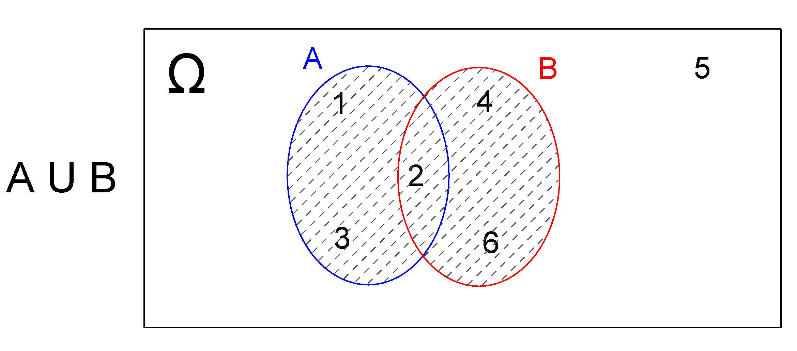

```
\


Na realização desse _experimento aleatório_ (lançar um dado)  o _evento de ineteresse_ $E$ ocorrerá quando qualquer um dos resultados for um elemento pertencente a $A$, ou a $B$ ou a _ambos_.


\


##### Interseção  $A \cap B$


Um _evento de interresse_ $E$ definido como a _interseção_ dos eventos $A$ e $B$ anteriormente definodos, representado por $E=(A \cap B)$, será o subconjunto do espaço amostral $\Omega$ que contém todos os elementos que pertençam **a ambos os eventos A e B simultaneamente**.
\

Desse modo, $E=(A \cap B) =\{2\}$ e o Diagrama de Venn correspondente será:

\

```{r, echo=FALSE, out.width='80%', fig.align='center', fig.cap="Interseção: $A \\cap B$"}

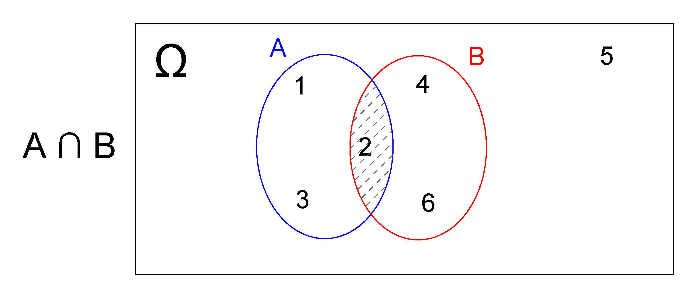

```

\

Na realização desse _experimento aleatório_ (lançar um dado)  o _evento de interesse_ $E$ ocorrerá apenas quando o resultado for um elemento simultaneamente pertencente a $A$ e $B$ .

\

Quando o evento de interesse é definido pela interseção de dois outros, todavia esssa interseção é vazia, representa-se $E$ como

\


$$
E(A \cap B) = \varnothing
$$

\


##### Complemmento  $A^{c}$


Um _evento de intersse_ pode também ser definido como o _complemento_ de outros como, por exemplo, de $A$, sendo representado representado por $E=(A^{c})$ (ou $E=(\stackrel{-}{A})$).

\

Desse modo, $E=(A^{c}) =\{4,5,6\}$ e o Diagrama de Venn correspondente será:


\


```{r, echo=FALSE, out.width='80%', fig.align='center', fig.cap="Complementar  $A^{c}$"}

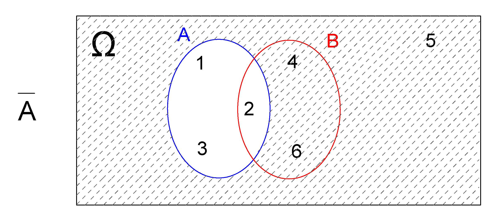

```

\

De modo análogo, para $E=(B^{c})=\{1,3,5\}$ e o Diagrama de Venn correspondente será :

\

```{r, echo=FALSE, out.width='80%', fig.align='center', fig.cap="Complementar de B"}

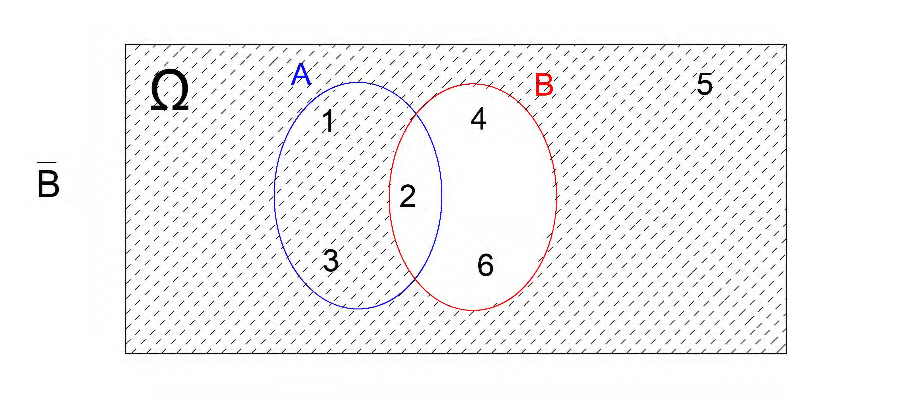

```

\


```{r, echo=FALSE, out.width='80%', fig.align='center', fig.cap="Diagramas de Venn"}

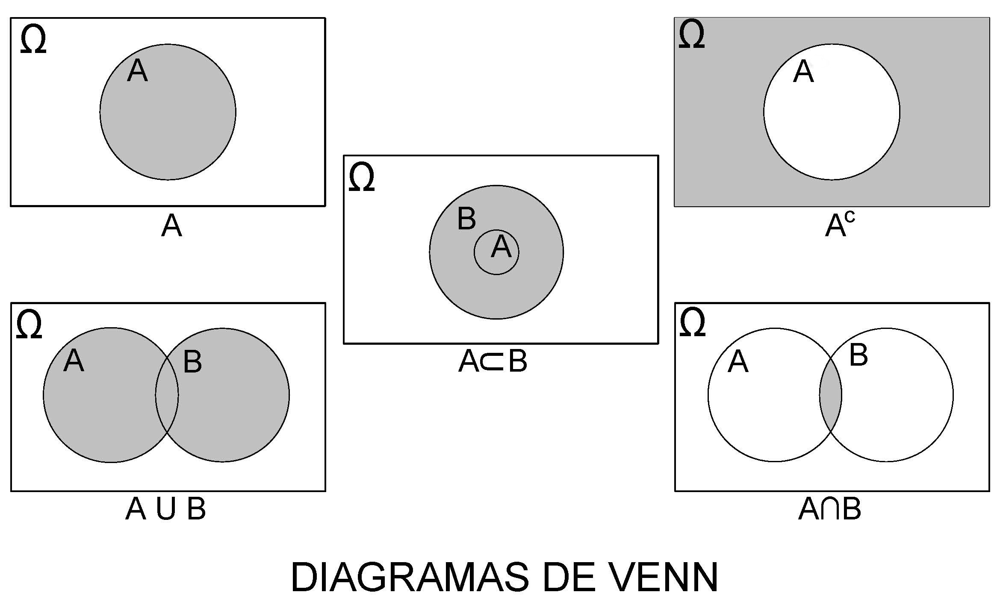

```


\

#### Eventos simples e eventos compostos


O evento de interesse ($E(2)$) definido no experimento aleatório anterior (obter o número _2_) é formado por apenas um elemento do espaço amostral. Eventos formados por apenas um elemento do espaço amostral são denominados de _evento simples_.

\
$$
\Omega = \{1; 2; 3; 4; 5; 6\}\\
E(2) = \{2\}
$$

\


Admita agora o mesmo _experimento aleatório_ todavia definindo como _evento de interesse_ (Eobter-se um número _par_. Um _evento de interesse_ assim definido é um evento composto uma vez que é formado por mais de um elemento do espaço amostral:

\


$$
\Omega = \{1; 2; 3; 4; 5; 6\}\\
E(par) = \{2; 4; 6\}
$$

\

Outro exemplo, a partir de um  _experimento aleatótrio_ que consiste em se lançar uma moeda _duas_ vezes, cujo _espaço amostral_ é representado por um conjunto composto por _quatro_ elementos

\


$$
\Omega = \{(\text{Cara}, \text{Coroa}),(\text{Coroa}, \text{Cara}),(\text{Cara}, \text{Cara}), (\text{Coroa}, \text{Coroa})\}
$$


\


Se definirmos como  _evento de interesse_ na realização desse experimento aleatório obter-se $E=\{(Cara, Cara)\}$, o evento $E$ será um _evento simples_ pois é formado por apenas _um_ elemento do espaço amostral.

\

Se, por outro lado, definimos como _sucesso_ obter-se $E_{1}=\{(Cara, Coroa)  \text{ ou } (Coroa, Cara)\}$, o evento $E_{1}$ será um _evento composto_ pois é formado por _dois_ elementos do espaço amostral.

\

Se codificarmos _Cara=1_ e _Coroa=0_, podemos representar num plano $XY$ o espaço amostral $\Omega$ desse experimento aleatório e o _evento de sucesso_  $E_{1}$


\

```{r, echo=FALSE, out.width='50%', fig.align='center', fig.cap="Representação gráfico do espaço amostral do experimento aleatório e do evento de interesse definido"}

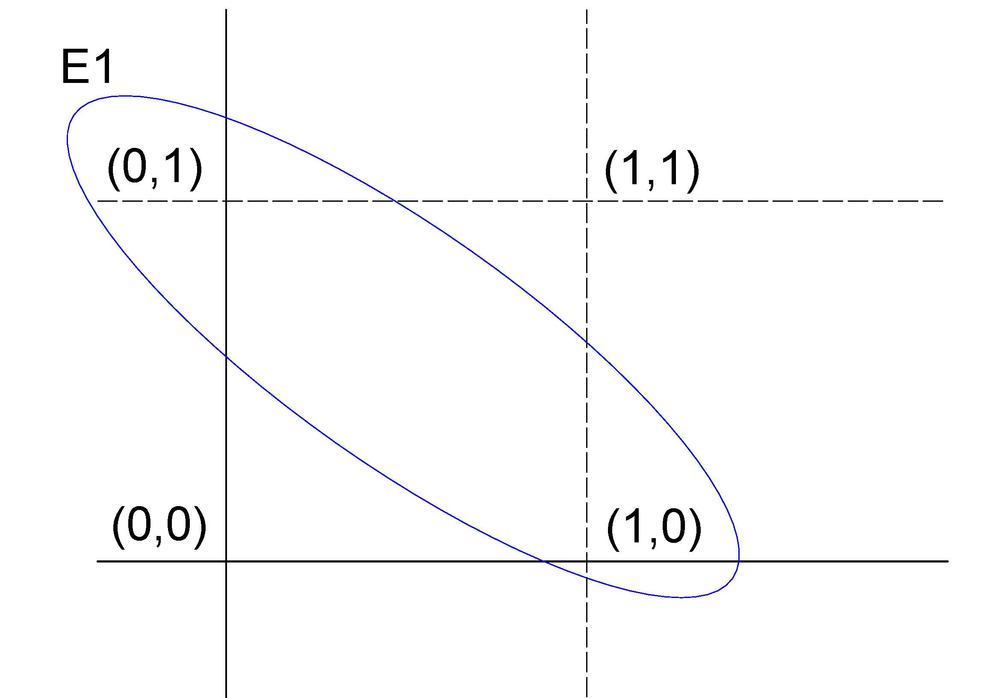

```

\


#### Eventos certos e eventos impossíveis

\

Um evento de interesse $G$, definido sobre o espaço amostral $\Omega$, em que $G = \Omega$, expressa que qualquer elemento de $\Omega$ satisfaz o evento $G$, ou seja, qualquer um dos possíveis resultados do experimento aleatório corresponde ao evento.

\

Um evento de interesse assim definido ocorrerá com certeza, razão pela qual tais eventos são denominados eventos certos.

\

Por outro lado, se definirmos um evento de interesse $I$ que não contém resultados pertencentes a $\Omega$ — o espaço amostral, ou seja, todos os resultados possíveis — como, por exemplo, obter o número 7 no lançamento de um dado de seis faces, esse evento será impossível de ocorrer.

\

Eventos assim definidos são chamados de eventos impossíveis.

\


#### Eventos independentes

\


Dois eventos são considerados _independentes_ quando a probabilidade de ocorrência de um evento de interesse em um determinado experimento aleatório não é influenciada pelo _resultado prévio_ de outro evento.

\

>Em outras palavras, a ocorrência de um evento não altera a probabilidade do outro. Caso contrário, esses eventos são classificados como dependentes ou condicionados.

\

Este conceito será explorado em maior detalhe em seções posteriores.

\

#### Eventos mutuamente exclusivos

\


Dois eventos que _nunca_ poderão ocorrer simultaneamente são ditos _mutuamente exclusivos_. No experimento do lançamento da moeda por uma vez, nunca observaremos, simultaneamente, dois eventos como $E=\{(Cara)\}$ **e**  $F=\{(Coroa)\}$.
\

Um evento assim definido teria sua interseção vazia


\

$$
G=(E \cap F) = \varnothing
$$

e, por essa razão, sua probabilidade será $P(G)=P(E \cap F)=0$.

\

#### Eventos complementares


Definido um _evento de interesse_ qualquer pode-se observar apenas dois resultados:

\

1. _ocorrer_;
2. _não ocorrer_ o sucesso.

\

Ou seja, um ou outro deverá forçosamente ocorrer.

\


Chama-se de _evento complementar_ ($E^{c}$ ou $\stackrel{-}{E}$) a um evento ($E$) e sua probabilidade de sucesso será:


$$
P(E^{c}) = 1 - P(E)
$$


\


Se a probabilidade de sucesso de que ele ocorra for $P(E)=p$ e a de que ele não ocorra for $P(E^{c}= q)$ vê-se que a soma dessas quantidades deverá ser $p + q =1$, novamente antecipando um dos postulados do conceito axiomático de probabilidade.


\


### Probabilidade


#### Conceito clássico ou *a priori*


Sob uma visão intuitiva, a probabilidade como uma medida da informação que temos sobre a possibilidade de ocorrência de um evento aleatório, pode ser definida como a medida numérica expressa em termos relativos (percentuais), obtida pela razão (proporção)  entre o número de eventos favoráveis (sucessos) pelo número total de eventos prováveis no experimento (espaço amostral).

\


Esse conceito de probabilidade é denominado _clássico_ ou *a priori*, baseado em um conhecimento prévio ou uma crença subjetiva sobre a probabilidade de um evento ocorrer.

\

Por exemplo, um jogador de cartas pode ter uma crença a priori de que a probabilidade de uma carta ser um ás é de 1 em 13, independentemente do número de baralhos no jogo

\


A distribuição de frequências é um instrumento importante para a análise da variabilidade de experimentos aleatórios e, em particular, as frequências relativas são estimativas das probabilidades.

\

$$
P(E)= \frac{\text{número de resultados de interesse (sucessos)}}{\text{número total de resultados possíveis no espaço amostral}}
$$


\

Com o estabelecimento de suposições adequadas, um modelo teórico de probabilidade pode ser empregado sem a realização *a priori* do experimento aleatório, reproduzindo de modo razoável a distribuição das frequências quando o experimento é realizado.

\


Consideremos o exemplo do experimento que consiste em se lançar um dado e observar o valor numérico de sua face. As suposições que deveriam ser estabelecidas *a priori* são:

\


- só pode ocorrer uma das seis faces; e,
- o dado utilizado não possui viés algum (não favorece face alguma).

\

Como todos os $N$ resultados do espaço amostral apresentam uma **mesma probabilidade** de ocorrência, então a proporção teórica de ocorrência de qualquer um desse resultados poderá ser apresentado na forma vista na na forma vista na Tabela \@ref(tab:table2).

\


$$
P(E)= \frac{1}{N}
$$

\

```{r table2, echo=FALSE, results='asis'}
  cat('Table: (\\#tab:table2) Distribuição das proporções teóricas do um experimento aleatório: lançamento de um dado


| Face               | 1                 | 2                 | 3                 | 4                 | 5                 | 6                 | Total |
|--------------------|-------------------|-------------------|-------------------|-------------------|-------------------|-------------------|-------|
| Proporção teórica | $\\frac{1}{6}$ | $\\frac{1}{6}$ | $\\frac{1}{6}$ | $\\frac{1}{6}$ | $\\frac{1}{6}$ | $\\frac{1}{6}$ | 1     |

')
```

\


Sendo equiprováveis todos os elementos do espaço amostral, todos terão a mesma probabilidade de ocorrência que será:

\


\begin{align*}
P(E) = & \frac{1}{N} \\
     = &  \frac{1}{6} \\
     = & \frac{1}{6}
\end{align*}

\


Por essa razão sabe-se, *a priori* a probabilidade de ocorrência de qualquer evento ao se realizar esse tipo de experimento aleatório uma única vez.

\


#### Conceito frequentista ou *a posteriori*


Todavia, se realizarmos o experimento aleatório anterior apenas algumas, tal regularidade poderá não ser comprovada: as frequências observadas (as quantidades obtidas para cada um dos valores numéricos das faces) apresentarão uma **grande irregularidade**  diferindo das frequência teóricas definidas.

\


Observa-se que os resultados das frequências observadas irá se estabilizar, aproximando-se das frequências teóricas, à medida que se repete esse experimento um número suficientemente grande de vezes.

\

A definição frequencial (*a posteriori*):

\

1- refere-se à probabilidade empírica observada *a posteriori*;
2- tem por objetivo estabelecer um modelo adequado à interpretação de alguns tipos de experimentos aleatórios; e,
3- é a base para se formular um modelo teórico de distribuição de probabilidades como os que serão abordados mais adiante.

\

Ao se repetir o experimento aleatório um grande número   de vezes ( $n$ tendendo a infinitas vezes), a quantidade de vezes que um determinado resultado foi verificado dividida por o número de repetições realizadas ($n$) irá se aproximar de sua proporção teórica. É o que se denomina como _regularidade estatística dos resultados_ por essa propriedade não mais se necessita que os eventos sejam _equiprováveis_.


\

>Formalmente conhecida como Lei Fraca dos Grandes Números (um dos pilares da teoria da probabilidade, foi formalizada pelo matemático suíço Jakob Bernoulli em 1713) e estabelece uma convergência para a probabilidade: à medida que o número de ensaios independentes de um experimento aleatório aumenta, a frequência relativa dos sucessos observados tende a se aproximar da probabilidade teórica

\


$$
P\left(E\right)=\underset{n\to \infty }{lim}{\frac{F(E)}{n}}
$$

\

onde:

\

- $P(E)$ é a probabilidade de ocorrência do evento $E$;
- $F(E)$ é a frequência observada do evento $E$ (o número de vezes que ele ocorre em _n_ repetições); e,
- $n$ é o número de repetições do experimento.

\

Jakob Bernoulli in 1713
\


##### Simulações

\

As simulações desempenham um papel fundamental no entendimento prático dos conceitos probabilísticos, permitindo a reprodução de experimentos aleatórios em larga escala.

\

Por meio de simulações, podemos verificar empiricamente a convergência das frequências observadas para as frequências teóricas discutidas nos conceitos anteriores.

\

Elas fornecem uma ferramenta poderosa para ilustrar a regularidade estatística dos resultados, especialmente em situações em que realizar o experimento real seria impraticável ou custoso.

\


Ao simular o lançamento de um dado, por exemplo, é possível observar como a frequência relativa de qualquer face começa a se aproximar da probabilidade teórica ($P(\cdot)=\frac{1}{6}$) à medida que aumentamos o número de repetições.


\


```{r}

# Função para lançar o dado n vezes e calcular a frequência de uma face específica

lancar_dado <- function(n, face_escolhida) {
  # Definindo as faces do dado
  faces <- 1:6

  # Realizando n lançamentos
  lancamentos <- sample(faces, n, replace = TRUE)

  # Calculando a frequência observada da face escolhida
  frequencia <- sum(lancamentos == face_escolhida) / n * 100

  # Exibindo a frequência em percentual
  cat("A frequência observada da face", face_escolhida, "foi de", frequencia, "%\n")
}

```


```{r ,  out.width='60%', fig.align='center', fig.cap="A simulação do lançamento de um dado justo 10 vezes e a probabilidade amostral difere significativamente da probabilidade teórica de 1/6, devido ao pequeno número de lançamentos.", warning = FALSE}


lancar_dado(10, 3)

```

```{r ,  out.width='60%', fig.align='center', fig.cap="A simulação do lançamento de um dado justo 10.000 vezes e a convergência da probabilidade amostral para a probabilidade teórica de 1/6.", warning = FALSE}


lancar_dado(10000, 3)

```

\

Ao simular o lançamento de um dado, por exemplo, é possível observar como as frequências relativas de todas as    faces começam a se aproximar das probabilidades teóricas ($P(1)=P(2)=P(3)=P(4)=P(5)=P(6)=\frac{1}{6}$) à medida que aumentamos o número de repetições.


\


```{r}

library(ggplot2)

lanca_dado <- function(numero_de_lancamentos) {
  # Gere os lançamentos do dado
  lancamentos <- sample(1:6, numero_de_lancamentos, replace = TRUE)

  # Crie um data frame com os resultados
  dados <- data.frame(Face = lancamentos)

  # Contagem das ocorrências de cada face
  contagem <- table(dados$Face)

  # Crie um gráfico de barras com o número de lançamentos no título
  grafico <- ggplot(data = data.frame(Face = names(contagem), Contagem = as.numeric(contagem)),
                    aes(x = Face, y = Contagem)) +
    geom_bar(stat = "identity") +
    labs(x = "Face do Dado", y = "Contagem") +
    ggtitle(paste("Lançamento de um Dado por:", numero_de_lancamentos, "vezes")) +
    theme_minimal()

  # Exiba o gráfico
  print(grafico)
}


```


```{r ,  out.width='60%', fig.align='center', fig.cap="Histograma das frequências observadas em 10 lançamentos de um dado justo, evidenciando a variabilidade significativa nas frequências relativas, mesmo que todos os resultados sejam igualmente prováveis.", warning = FALSE}

lanca_dado(10)

```


```{r ,  out.width='60%', fig.align='center', fig.cap="Histograma das frequências observadas em 10.000 lançamentos de um dado justo, ilustrando a convergência assintótica das frequências relativas de cada resultado para sua probabilidade teórica, considerando que todos os resultados são igualmente prováveis. ", warning = FALSE}


lanca_dado(10000)

```


\

Ao simular o lançamento de dois dados, por exemplo, é possível observar como as frequências relativas de todas as possíveis somas das faces começam a se aproximar das probabilidades teóricas:


$$
P(2) = P(12) = \frac{1}{36}, \\
P(3) = P(11) = \frac{2}{36}, \\
P(4) = P(10) = \frac{3}{36}, \\
P(5) = P(9) =  \frac{4}{36}, \\
P(6) = P(8) =  \frac{5}{36}, \\
P(7) = \frac{6}{36}
$$

à  medida que aumentamos o número de repetições.


\


```{r}

library(ggplot2)

lanca_dois_dados <- function(numero_de_lancamentos) {
  # Gere os lançamentos dos dois dados
  dado1 <- sample(1:6, numero_de_lancamentos, replace = TRUE)
  dado2 <- sample(1:6, numero_de_lancamentos, replace = TRUE)

  # Calcule a soma dos dois dados
  somas <- dado1 + dado2

  # Crie um data frame com os resultados
  dados <- data.frame(Soma = somas)

  # Contagem das ocorrências de cada soma
  contagem <- table(dados$Soma)

  # Crie um data frame com a proporção de cada soma
  dados_grafico <- data.frame(
    Soma = as.numeric(names(contagem)),
    Contagem = as.numeric(contagem),
    Proporcao = as.numeric(contagem) / numero_de_lancamentos
  )

  # Probabilidades teóricas de cada soma
  prob_teoricas <- c(1/36, 2/36, 3/36, 4/36, 5/36, 6/36, 5/36, 4/36, 3/36, 2/36, 1/36)
  somas_teoricas <- 2:12
  prob_teoricas_formatadas <- paste0("(", round(prob_teoricas * 100, 2), "%)")

  # Adicione as probabilidades teóricas ao eixo x como rótulos
  labels_eixo_x <- paste(somas_teoricas, prob_teoricas_formatadas)

  # Crie o gráfico de barras com as frequências observadas e as probabilidades teóricas no eixo x
  grafico_somas <- ggplot(data = dados_grafico, aes(x = Soma, y = Proporcao)) +
    geom_bar(stat = "identity", fill = "steelblue") +
    geom_text(aes(label = scales::percent(Proporcao, accuracy = 0.1)), vjust = -0.5) +  # Exibe as proporções acima das barras
    scale_x_continuous(breaks = somas_teoricas, labels = labels_eixo_x) +  # Define os rótulos com soma e probabilidade
    scale_y_continuous(labels = scales::percent) + # Formata o eixo y como porcentagem
    labs(x = "Soma dos Dados (Probabilidade Teórica)", y = "Proporção das Observações (%)") +
    ggtitle(paste("Lançamento de Dois Dados por:", numero_de_lancamentos, "vezes")) +
    theme_minimal()

  # Exiba o gráfico
  print(grafico_somas)
}


```


```{r ,  out.width='60%', fig.align='center', fig.cap="Histograma das frequências observadas em 10 lançamentos de dois dados justos, evidenciando a diferença significativa das frequências relativas observadas em relação às probabilidades teóricas de cada resultado possível.", warning = FALSE}

lanca_dois_dados(10)

```


```{r ,  out.width='60%', fig.align='center', fig.cap="Histograma das frequências observadas em 10.000 lançamentos de dois dados justos ilustrando a convergência assintótica das frequências relativas observadas para as probabilidades teóricas de cada resultado possível. ", warning = FALSE}


lanca_dois_dados(10000)

```


\


#### Conceito axiomático

\


Esta abordagem é baseada em um conjunto de axiomas matemáticos que definem as propriedades básicas de probabilidades. A probabilidade é definida como uma função de conjuntos que atribui a cada conjunto de eventos um número entre 0 e 1, satisfazendo os axiomas matemáticos de probabilidade. Essa abordagem permite que as probabilidades sejam definidas formalmente e usadas para cálculos matemáticos.

\

> Um _axioma_ é uma premissa considerada necessariamente evidente e verdadeira, fundamento de uma demonstração, porém ela mesma indemonstrável, originada, segundo a tradição racionalista, de princípios inatos da consciência ou, segundo os empiristas, de generalizações da observação empírica.

 \

Admita $P$ uma função que opera sobre o espaço $\Omega$; isto é, uma função que associa uma quantidade $P(\Omega)$ a cada elemento $\omega$ $\in$ $\Omega$.

\

```{r, echo=FALSE, out.width='80%', fig.align='center', fig.cap="Representação gráfica da função $P(\\Omega)$"}

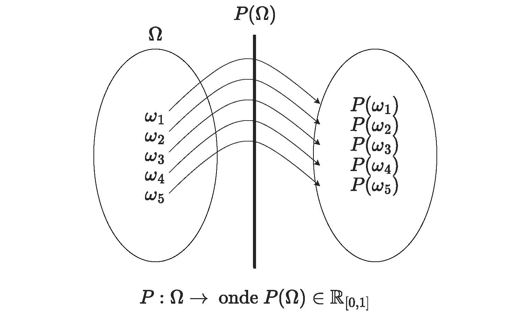

```


\


Essa função $P$ será uma **função de probabilidade** se, e somente se, satisfizer a **três axiomas**  (postulados: conceitos iniciais necessários à construção ou aceitação de uma teoria) estabelecidos por Andrey Kolmogorov (1933).

\

```{r, echo=FALSE, out.width='40%', fig.align='center', fig.cap="Andrey Nikolaevich Kolmogorov  (1903-1987)"}

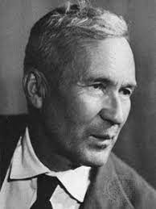

```

\


Kolmogoroff afirmou que uma _Teoria das probabilidades_ poderia ser desenvolvida a partir de _axiomas_, da
mesma forma que a geometria e a álgebra, e a considerou como caso especial da _Teoria da medida e integração_ desenvolvida por Lebesgue, Borel e Fréchet. Ele estabeleceu como postulados as propriedades comuns das noções de probabilidade clássica e frequentista que, desta forma, viraram casos particulares da definição axiomática.

\


##### Postulado do intervalo 


A probabilidade de qualquer $E$ **é um número real entre 0 e 1** (pode-se entender isso como uma convenção, onde então se estabelece a medida da probabilidade é um número positivo e que qualquer evento pode ter probabilidade de, no máximo, 1). Esse postulado está plenamente de acordo com a interpretação frequentista de probabilidade. 

\


$$
P(E) \ge 0 \text{ (não negatividade e,)}\\
\text{mais especificamente, }\\
0 \hspace{0.5cm} \le P(E) \hspace{0.5cm} \le 1
$$

\

##### Postulado da certeza (normalização)


O segundo postulado refere-se à probabilidade do **evento certo** ser igua a 1. No que diz respeito à interpretação frequentista, uma probabilidade de 1 implica que o evento em questão ocorrerá 100\% do tempo ou, em outras palavras, **que é certo que ele ocorra** (como, p. exemplo, um experimento aleatório de se lançar dois dados e somar o valor de suas faces o evento certo poderia ser definido como observar uym valor menor que 13 ou maior que 2)  

\

$$
P(\Omega) = 1 
$$

\


##### Postulado da aditividade para eventos mutuamente exclusivos (aditividade)


$$
P\left(\bigcup _{n=1}^{\infty }{\omega}_{n}\right)=\sum _{n=1}^{\infty }P\left({\omega}_{n}\right)
$$

\

para qualquer sequência de eventos **mutuamente exclusivos** $\{\omega_{1}, \omega_{2}, \omega_{3}, ..., \omega_{n}, ...\}$ (isto é, tal que $\omega_{i} \cap \omega_{j} \varnothing$ se $i \neq j$)

\


Tomando o terceiro postulado no caso mais simples, isto é, para **dois** eventos mutuamente exclusivos $\omega_{1}$ e $\omega_{2}$, pode ser facilmente visto que é satisfeito pela interpretação frequentista.


\

Se um evento ocorrer, digamos, 28\% das vezes, outro evento ocorrerá 39\%, **e os dois eventos não podem ocorrer ao mesmo tempo (ou seja, são mutuamente exclusivos)**,  então um **ou outro** evento} ocorrerão em 28 + 39 = 67\% das vezes. Assim, o terceiro postulado é satisfeito, e o mesmo tipo de argumento se aplica quando há mais de dois eventos mutuamente exclusivos.


\

**Recapitulando**

\

1- foi definido o conceito de **experimento aleatório** como sendo aquele cujos resultados não podem ser determinados com certeza antes de sua realização;  
2- foi definido o conceito de **espaço amostral** de um experimento aleatório como sendo o conjunto de **todos os possíveis resultados** que ele pode apresentar;  
3- foi definido que um **evento de interesse** é um subconjunto do espaço amostral no qual estamos particularmente interessados;  
4- foi definida uma **função** que tem como domínio o espaço amostral e associa uma quantidade (entre **0**  e **1**) a **cada elemento** do espaço amostral; e, por fim,  
5- estabelecemos que **se** essa função atende a **três postulados** então ela será uma **medida da probabilidade** de ocorrẽncia de cada evento do espaço amostral em questão.

\

Assim, quando uma função $P$ associa uma quantidade $P(\Omega)$ a um evento $\omega$ e $P(\Omega)$ atende aos três axiomas anteriormente estabelecidos, diz-se que que ela é a **função de probabilidade** de $\Omega$.

\

## Probabilidade da união de eventos

\

Considerem o espaço amostral de um experimento que consiste no lançamento de um dado honesto: $S=\{1,2,3,4,5,6\}$ e admitam alguns eventos constituídos sobre esse espaço mostral, abaixo descritos:

\

$$
E_{1}=\{par\},\\
E_{2}=\{ímpar\},\\
E_{3}=\{1,2,3\},\\
E_{4}=\{4,5,6\},\\
E_{5}=\{\ge4\},\\
E_{6}=\{\le5\}.\\
$$
\

A partir desses eventos podemos propros novos eventos de interesse a partir de _uniões_ (conectivo $\cup$) de dois (ou mais) dos eventos originais como, por exemplo, 

$$
H_{a}=E_{1} \cup E_{2},\\
H_{b}=E_{1} \cup E_{4},\\
H_{c}=E_{2} \cup E_{3},\\
H_{d}=E_{2} \cup E_{5},\\
H_{e}=E_{4} \cup E_{6},\\
H_{f}=E_{3} \cup E_{5}.
$$.

\

No experimento aleatório estabelecido:

\

- lembrando que a _união_ de dois conjuntos é o conjunto formado pelos elementos que estão em um, no outro ou em ambos, e  
- pensando em probabilidade como a razão do "número de resultados favoráveis" pelo "número de resultados possíveis" (conceito _a priori_)

\

podemos fcimente verificar que as probabilidades de ocorrência desses eventos são:

\

$$
P(H_{a})=1\\
P(H_{b})=P(H_{c})=P(H_{d})=P(H_{e})=\frac{1}{3}\\
P(H_{f})=0\\
$$

\


Considerem agora a Tabela \@ref(tab:table3), de dupla entrada, na qual vemos a  distribuição dos  alunos de uma escola conforme seu sexo e o curso: 

\

```{r table3, echo=FALSE, results='asis'}
  cat('Table: (\\#tab:table3) Distribuição da quantidade de alunos segundo seu sexo e curso escolhido

| Curso                   | Sexo                                             |
|-------------------------|---------------------------|--------------|-------|
|                         | Masculino (M)             | Feminino (F) | Total |
| Matemática pura (M)     | 70                        | 40           | 110   |
| Matemática aplicada (A) | 15                        | 15           | 30    |
| Estatística (E)         | 10                        | 20           | 30    |
| Computação (C)          | 20                        | 10           | 30    |
| Total                   | 115                       | 85           | 200   |
')

```

\

Essa tabela nos possibilita calcular a probabilidade de ocorrência de diversos eventos de interesse que desejemos estabelecer.

\


> Exemplo: seja o experimento aleatório de se escolher, aleatoriamente, um estudante qualquer desses quatro cursos. Assim, se definimos nosso evento de interesse $M$ como sendo  **M:sexo masculino**, a probabilidade de sucesso (que o indivíduo sorteado aleatoriamente seja do sexo masculino) será:  

\


$$
P(M) = \frac{115}{200}
$$


\

> Exemplo: se nosso evento de interesse $A$ como sendo **$A:$ curso de matemática aplicada** , a probabilidade de sucesso (que o indivíduo sorteado aleatoriamente seja do curso de matemática aplicada será):

$$
P(A) = \frac{30}{200}
$$

\


A partir dos eventos de interesse anteriormente estabelecidos, podemos definir outros eventos na forma de uniões ($\cup$) e interseções ($\cap$):


\

- uma união entre os dois eventos de interesse anteriores $A$ e $M$ é representada por $A \cup M$ (alternativamente lê-se também  **ou**) e representa um evento onde **pelo menos** um dos dois eventos básicos pode ocorrer: **ou** $A$, **ou** $M$ **ou ambos**; e,    
- uma interseção dos dois  eventos de interesse anteriores $A$ e $M$ é representada por $A \cap M$ (alternativamente lê-se também **e**) e representa um evento onde **os dois eventos** básicos  devem ocorrer: $A$ **e** $M$.

\


> Exemplo: se definimos nosso evento de interesse ($P(A \cap M)$) como sendo **sexo masculino e cursando matemática aplicada**. Facilmente podemos visualizar na Tabela \@ref(tab:table3)  que apenas 15 alunos do curso do evento de interesse (matemática aplicada) são do sexo do segundo evento de interesse (masculino), em relação a todo espaço amostral e assim:  

\

$$
P(A \cap M) = \frac{15}{200}
$$.


\

> Exemplo: consideremos agora o evento de interesse ($P(A \cup M)$) como sendo **sexo masculino ou cursando matemática aplicada**. 

\

Na Tabela \@ref(tab:table3) temos as duas probabilidades **marginais**:

\

1. $P(A)=\frac{30}{200}$ (curso: matemática aplicada); e,
2- $P(M)=\frac{115}{200}$ (sexo masc).

\


Poderíamos intuir equivocadamente que:

\


$$
P(A \cup M) = P(A) + P(M) = \frac{30}{200} + \frac{115}{200} = \frac{145}{200}
$$


\

Tal raciocínio é errado pois iria considerar por **duas vezes** os alunos do **sexo masculino**. Uma fração da quantidade global (115) de alunos do **sexo masculino** já considera aqueles que estão matriculados no curso de **matemática aplicada** (15). É preciso **subtrair** da soma das probabilidades marginais essa **parcela em comum** que é a interseção dos dois eventos básicos. 

A resposta correta será:


$$
P(A \cup M) = P(A) + P(M) - P(A \cap M) = \frac{30}{200} + \frac{115}{200} -\frac{15}{200} = \frac{130}{200}
$$.

\

Portanto, para quaisquer eventos de intersse $A$ e $B$, podemos estabelecer uma **regra geral da pobabilidade da união de dois eventos quaiquer** como: 

\


$$
P(A \cup B) = P(A) + P(B) - P(A \cap B)
$$


\

Se $A$ e $B$ forem **mutuamente exclusivos**, a interseção entre eles será vazia ($A \cap B =\varnothing$) e, assim, essa probabiidade é zero.  Nessa situação, a probabilidade de $P(A \cup B)$ fica reduzida a uma **regra particular para a adição de probabilidades de eventos mutuamente exclusivos**:

\


$$
P(A \cup B) = P(A) + P(B)
$$


\

Relembrando o que se denomina como _regularidade estatística dos resultados_ :


$$
P\left(E\right)=\underset{n\to \infty }{lim}{\frac{F(E)}{n}}
$$

\


```{r}

# Função para simular uma população maior mantendo proporções
simPop <- function(tamanho_populacao) {
  # Proporções conforme a tabela
  prop <- data.frame(
    Curso = c("Matemática pura", "Matemática aplicada", "Estatística", "Computação"),
    Masculino = c(70, 15, 10, 20),
    Feminino = c(40, 15, 20, 10),
    Total = c(110, 30, 30, 30)
  )

  # Calculando as proporções relativas
  prop$propM <- prop$Masculino / prop$Total
  prop$propF <- prop$Feminino / prop$Total

  # Função para gerar amostra de acordo com as proporções
  gerar_amostra <- function(curso, propM, propF, total, tamanho_populacao) {
    n_curso <- round((total / sum(prop$Total)) * tamanho_populacao)
    sexo <- sample(c("M", "F"), n_curso, replace = TRUE, prob = c(propM, propF))
    data.frame(Curso = rep(curso, n_curso), Sexo = sexo)
  }

  # Gerando a população para cada curso
  populacao <- do.call(rbind, lapply(1:nrow(prop), function(i) {
    gerar_amostra(prop$Curso[i], prop$propM[i], prop$propF[i],
                  prop$Total[i], tamanho_populacao)
  }))

  return(populacao)
}


```

\

```{r}
# Gerando uma população de 10.000 indivíduos
popSim <- simPop(100000)
table(popSim$Curso, popSim$Sexo)

```
\

```{r}

# Selecionar uma amostra de 200 com reposição (simular a tabela)
ordem1=c("Matemática pura", "Matemática aplicada", "Estatística", "Computação")
ordem2=c("M", "F")
amostPop=popSim[sample(1:nrow(popSim), 200, replace = TRUE), ]
tab=table(factor(amostPop$Curso, levels = ordem1), factor(amostPop$Sexo, levels = ordem2))
tab=addmargins(tab)
colnames(tab)=c("M", "F", "Total")
rownames(tab)=c("Matemática pura (M)", "Matemática aplicada (A)","Estatística (E)","Computação (C)","Total")
tab

```


```{r}

# Calcular a probabilidade de ser do sexo "Masculino" na amostra
pMasc<- mean(amostPop$Sexo == "M")
pMasc

# Calcular a probabilidade de cursar "Matemática aplicada" na amostra
pMatAp <- mean(amostPop$Curso == "Matemática aplicada")
pMatAp

# Calcular a probabilidade de cursar "Matemática aplicada" -E- ser do sexo "Masculino" na amostra
pMatAp_and_Masc <- mean(amostPop$Curso == "Matemática aplicada" & amostPop$Sexo == "M")
pMatAp_and_Masc

# Calcular a probabilidade de cursar "Matemática aplicada" -OU- ser do sexo "Masculino" na amostra
pMatAp_or_Masc <- mean(amostPop$Curso == "Matemática aplicada" | amostPop$Sexo == "M")
pMatAp_or_Masc

```


\


> Exemplo: Uma população é composta por 20 pessoas que consomem o produto **A**, 30 pessoas que consomem o produto **B** e 50 pessoas que consomem o produto **C** . Um pesquisador de mercado seleciona aleatoriamente uma pessoa desta população. **Sabendo que uma pessoa não consome mais de um produto ao mesmo tempo**, qual a probabilidade de ter sido selecionada uma pessoa que consome os produtos **A ou C**?


\

Solução: 


\

Definindo os eventos de interesse e as probabilidades associadas:

\


1- $E_{A}=\text{consumidor do produto A}$: $P(E_{A}=\frac{20}{100}$);  
2- $E_{B}=\text{consumidor do produto B}$: $P(E_{B}=\frac{30}{100}$); e,  
3- $E_{C}=\text{consumidor do produto C}$: $P(E_{C}=\frac{50}{100}$).


\

Pela regra geral da probabilidade  da união de dois eventos quaiquer sabemos que:

\


$$
P(E_{A} \cup E_{C}) = P(E_{A}) + P(E_{C}) - P(E_{A} \cap E_{C})
$$

\


Como foi estabelecido no enunciado que uma pessoa **não**  consome mais de um produto ao mesmo tempo (esses eventos são, portanto, **mutuamente exclusivos**: $E_{A} \cap E_{C}=\varnothing$) a probabilidade pedida será:

\

\begin{align*}
P(E_{A} \cup E_{C}) & = P(E_{A}) + P(E_{C}) - P(E_{A} \cap E_{C}) \\
                    & = \frac{20}{10} + \frac{50}{100} - 0 \\
                    & =  \frac{70}{100} \\
                    & =  0,70    
\end{align*}

\


## Probabilidade de eventos condicionados

\

Admita dois eventos definidos sobre o exprimento aleatório de se sortear uma carta de um baralho: 

\

- \( A: \{A, 2,3,4,5,6,7,8,9,10,J,Q,K\}_{vermelho}\): cartas vermelhas (ouro e copas), e
- \( B: \{A, J, Q, K\}_{qualquer}\): cartas com figuras.

\


Se nosso interesse é agora determinar a probabilidade de um evento definido como uma  **vermelha e de figura ao mesmo tempo** ou seja, uma carta que está simultaneamente nos conjuntos \( A \) e \( B \), estamos então interessados na probabilidade da **interseção** (conectivo $\cap$) desses dois eventos: \( P(A \cap B) \). Esse evento (interseção) acaba impondo restrições no espaço amostral inicial (todas as 52 cartas do baralho)

\

- Olhando-se por um prisma, podemos considerar que o espaço amostral agora é reduzido para \( A \): apenas as 26 cartas vermelhas: copas e ouro e, **dentro desse novo espaço amostral**, estamos interessados nos elementos \( B \): apenas as 4 cartas de figura: A, J, Q ou K.


\

A probabilidade do um evento \( B \) condicionada à ocorrência prévia do evento \( A \), pode ser entendida como a fração de \( B \) dentro de \( A \), ou seja:

\

$$
P(\text{foi sorteada uma carta vermelha, sortear-se uma figura})=\\
\frac{  \text{resultados favoráveis (número de cartas de figuras e vermelhas)}}{\text{resultados possíveis (número de cartas vermelhas)}}=\\
\frac{8}{26}=0,3076\\
$$ 
<!-- P(\text{foi sorteada uma carta vermelha, sortear-se uma figura})= \frac{P(B \cap A)}{P(A)}\\ -->
<!-- P(\text{foi sorteada uma carta vermelha, sortear-se uma figura}) \times P(A)= P(B \cap A) \\ -->
<!-- P(\text{foi sorteada uma carta de figura, sortear-se uma carta vermelha})= \frac{P(A \cap B)}{P(B)}\\ -->
<!-- P(\text{foi sorteada uma carta de figura, sortear-se uma carta vermelha})  \times P(B)= P(A \cap B)\\ -->

\


- Alternativamente, se olharmos por outro prisma, podemos considerar que o espaço amostral agora é reduzido para \( B \): apenas as 16 cartas de figuras e, **dentro desse novo espaço amostral**, estamos interessados nos elementos \( A \): apenas as 8 cartas vermelhas.


\

$$
P(\text{foi sorteada uma carta de figura, sortear-se uma carta vermelha})=\\
\frac{  \text{resultados favoráveis (número de cartas vermelhas e com figuras)}}{\text{resultados possíveis (número de cartas de figuras )}}=\\
\frac{8}{16}=0,50\\
$$ 


\


>Dois eventos quaisquer $A$ e $B$ definidos sobre um experimento aleatório são ditos **condicionados** quando a ocorrência prévia de um deles impõe **uma restrição** no espaço amostral do segundo, alterando sua probabilidade original do outro. *Ocorrência* pode ser entendido alternativamente como uma informação adicional trazida *a priori* ao experimento, e que alterará a incerteza inicial que pairava sobre os possíveis resultados.


\


A **probabilidade** de um evento qualquer $A$ **condicionada** a um segundo evento $B$ é representada como $P(A|B)$.

\


A _barra_ vertical pode ser "lida" adotando-se termos correlatos que facilitam o entendimento da relação existente, tais como :

\

- probabilidade de $A$ **posto que** ocorreu $B$;
- probabilidade de $A$ **admitindo-se** que ocorreu $B$;
- probabilidade de $A$ **considerando-se** que ocorreu $B$,

\


Uma **regra geral para o cálculo da probabilidade de dois eventos condicionados** pode ser apresentada como:

\

\begin{align*}
P(A|B) & = \frac{ P(A\cap B)}{ P(B)} \\
P(B|A) & = \frac{ P(B\cap A)}{ P(A)}
\end{align*}

\

para $P(B)>0$ e $P(A)>0$ nas expressões acima.


\

Trazendo-se ao exemplo das cartas de baralho, as probabilidades **marginais** de aleatoriamente serem sorteadas cartas vermelhas, de figuras e vermelhas e de figuras são:

\

- uma carta vermelha: \( P(A)=26/52=0,50\)
- uma carta de figura é \( P(B)=16/52=0,3076\). 
- uma carta vermelha e de figura é  \( P(A \cap B) = 8/52=0,1538\)

\

$$
P(\text{foi sorteada uma carta vermelha, sortear-se uma figura}) -> P(B|A) =\\
\frac{ P(B\cap A)}{ P(A)}=\\
\frac{0,1538}{0,50}=\\
0,3076\\
$$

\

A probabilidade marginal de se sortear uma carta de figura é 0,3076; **todavia**, com a informação *a priori* de que a carta sorteada foi uma carta vermelha, **não se alterou**.

\

$$
P(\text{foi sorteada uma carta de figura, sortear-se uma carta vermelha}) -> P(A|B)  =\\
\frac{ P(A\cap B)}{ P(B)}=\\
\frac{0,1538}{0,3076}=\\
0,50 \\
$$


\
  Do mesmo modo, a probabilidade marginal de se sortear uma carta vermelha é 0,50; **todavia**, com a informação *a priori* de que a carta sorteada foi uma carta de figura, **não se alterou**.

\


>Se P(B|A)=P(B) (naturalmente P(A|B)=P(A)) dizemos que os eventos A e B não são condicionados. 


\


<!-- De modo geral, se os eventos $E_{1}$, $E_{2}$,...,$E_{n}$ particionam um espaço amostral (não têm interseções entre si e sua a união é o espaço amostral). Admita $B$ um evento qualquer definido sobre as partições desse espaço. A probabilidade de ocorrência de $B$ evento será: -->

<!-- \ -->

<!-- ```{r , echo=FALSE, out.width='60%', fig.align='center', fig.cap="Interseções das n partições do espaço amostral com o evento B"} -->

<!-- 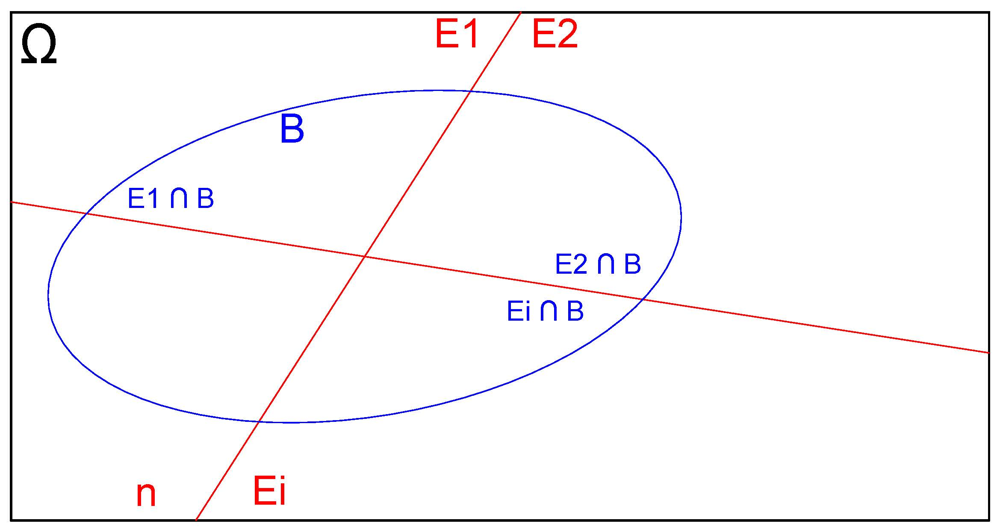 -->

<!-- ``` -->

<!-- \ -->


<!-- \begin{align*} -->
<!-- P(B) & = P(B \cap E_{1}) +  P(B \cap E_{2}) + \dots + P(B \cap E_{n}) \\ -->
<!--      & = P(E_{1}) \times P(B|E_{1}) + \dots + P(B|E_{n})\\ -->
<!--      & = \sum_{i=1}^{n} P(E_{i}) \times P(B|E_{i})\\ -->
<!-- \end{align*} -->

<!-- \ -->

>Exemplo: Consideremos a Tabela \@ref(tab:table3) que apresenta informações cruzadas do sexo dos alunos e seus respectivos cursos. Vamos definir os eventos **Fem:sexo feminino** e **Est: cursar estatística**. Como calcular a probabilidade condicionada de nosso evento de interesse **P(Fem|Est)** (a probabilidade de um aluno aleatoriamente escolhido ser do sexo **feminino**, **dado** que ele cursa **estatística**)?

\


\begin{align*}
P(Fem|Est) & = \frac{ P(Fem \cap Est)}{ P(Est)} \\
           & = \frac{20}{30} = \frac{2}{3}    
\end{align*}


\

Esse cálculo é facilmente entendido observando-se as celulas da distribuição de frequências na Tabela \@ref(tab:table3).


\

> Exemplo: Considerem a Tabela \@ref(tab:table4) que relaciona a ida à praia de uma certa pessoa às condições climáticas do dia. 


\

```{r table4, echo=FALSE, results='asis'}
  cat('Table: (\\#tab:table4) Condicionamento de passeios à praia em relação às condições climáticas observadas


| Dia          | 1 | 2 | 3 | 4 | 5 | 6 | 7 | 8 | 9 | 10 |
|--------------|---|---|---|---|---|---|---|---|---|----|
| Foi à praia? | N | S | N | S | S | S | N | N | S | S  |
| Fez sol?     | N | S | N | S | N | S | S | N | S | S  |

')
```

\

Baseado nos dados coletados responda:

\

1- Qual a probabilidade dessa pessoa ir à praia?  
2- Sabendo-se que fez Sol, qual a probabilidade dessa pessoa ir à praia?  
3- Os eventos **ir à praia** e **fazer Sol** são independentes ou condicionados?

\


Da Tabela \@ref(tab:table4) extraímos as seguintes probabilidades:

\

\begin{align*}
P(IP) & = \frac{6}{10}= 0,60 \\
P(FS) & = \frac{6}{10}= 0,60 \\
P(IP \cap FS) & = \frac{5}{10} \\
    & = 0,50 
\end{align*}


\

A partir delas podemos calcular a seguinte probabilidade condicionada:


\


\begin{align*}
P(IP|FS) & = \frac{ P(IP \cap F)}{ P(FS)} \\
       & = \frac{5}{6} \\
       & = 0,83     
\end{align*}

\


A probabilidade dessa pessoa ir à praia ($P(IP)$) é 0,60;  **mas** quando faz Sol a probabilidade  ($P(IP|FS)$) dela aumenta para 0,83.  

\


Assim, os eventos $IP$ e $FS$ são condicionados: essa pessoa vai à praia 60\% dos dias analisados; mas, **quando faz sol**, ela vai em 83\% dos dias (a presença de Sol altera a probabilidade dela ir à praia).


\

> Exemplo: Em uma cidade existem 15.000 usuários de telefonia, dos quais 10.000 possuem telefones fixos, 8.000 telefones móveis e 3.000 telefones fixos e móveis. Seja o experimento aleatório de uma operadora de telefone móvel selecionar uma pessoa dessa cidade para oferecer uma promoção do tipo "Fale Grátis de seu Móvel para seu Fixo". 


\

Responda:

\


1- Sorteando-se aleatoriamente um cliente dessa operadora, se soubermos antecipadamente que ele tem telefone móvel, qual a probabilidade de esse cliente tenha telefone fixo também?  
2- Sabendo-se que ele tem telefone fixo, qual a probabilidade de ele tenha telefone móvel também?

\


O espaço amostral de todos esses possíveis eventos pode ser ilustrado pelo diagrama de Venn abaixo:  


\

```{r venn, echo=FALSE, out.width='50%', fig.align='center', fig.cap="Diagrama de Venn do espaço amostral"}

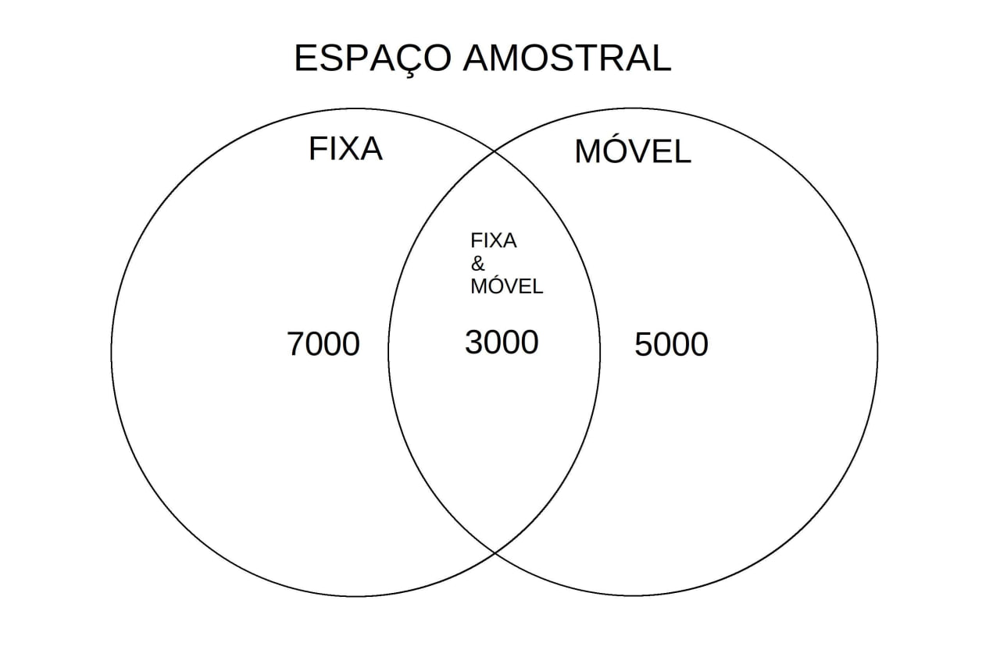

```

\


Do diagrama apresentado na Figura\@ref(fig:venn) podemos extrair imediatamente as probabilidades pedidas: 

\

- $P(F|M)$ (probabilidade de ter uma linha fixa sabendo que possui um telefone móvel); e,
- $P(M|F)$ (probabilidade de ter uma linha móvel sabendo que possui um telefone fixo):

\

\begin{align*}
P(F|M) & = \frac{n(MF)}{n(M)}\\
       & =\frac{3000}{8000}\\
       & = 0,375 
\end{align*}
\


e

\

\begin{align*}
P(M|F) & = \frac{n(MF)}{n(F)} \\
       & =\frac{3000}{10000} \\
       & = 0,300 
\end{align*}

\


Mas também podemos calcular as probablidades do modo como explicado no começo desta sessão. Definindo-se os eventos **$F:$ telefone fixo** e **$M:$ telefone móvel**, a primeira  pergunta pede $P(F|M)$:probabilidade de ter um telefone fixo sabendo que ele tem um telefone móvel:

\

\begin{align*}
P(F|M) & =  \frac{P(F \cap M)}{P(M)} \\
       & = \frac{ \frac{3000}{15000} }{\frac{8000}{15000} }\\
       & = 0,375.
\end{align*}
\


A segunda pede $P(M|F)$: probabilidade de ter um telefone móvel sabendo que ele tem um telefone fixo:

\

\begin{align*}
P(M|F) & = \frac{P(M \cap F)}{P(F)} \\
       & = \frac{ \frac{3000}{15000} }{\frac{10000}{15000} } \\
       & = 0,300
\end{align*}

\

> Exemplo: Considere a Tabela \@ref(tab:table5) onde são expostos os resultados de uma pesquisa relacionada ao gosto pela prática de tênis entre alunos e alunas. Definindo-se os eventos **$A$:"gostar de tênis"** e **$B$:"ser do sexo feminino"**, calcule as probabilidade pedidas ao se sortear, aleatoriamente, uma das pessoas pesquisadas.

\

1- Qual a probabilidade de que goste de tênis ($P(T)$)?  
2- Qual probabilidade de que não goste de tênis ($P(T^{c})$)?  
3- Qual a probabilidade de que seja do sexo feminino **ou** goste de tênis: ($P(F \cup T)$)?  
4- Sabendo-se que foi sorteada uma aluna, qual a probabilidade de que goste de tênis ($P(T|F))$?  
5- Verifique se os eventos **$T$: "gostar de tênis"** e **$F$:"ser do sexo feminino"** são condicionados ou independentes ($P(T \cap F) \stackrel{?}{=} P(T) \times P(F)$))

\


```{r table5, echo=FALSE, results='asis'}
  cat('Table: (\\#tab:table5) Distribuição da quantidade de alunos segundo seu sexo e a preferência por tênis

|                          | Sexo                                  |
|--------------------------|----------------|--------------|-------|
| Curso                    |                |              |       |
|                          | Masculino (M)  | Feminino (F) | Total |
| Gostam de tênis (T)      | 400            | 200          | 600   |
| Não gostam de tênis (NT) | 50             | 50           | 100   |
| Total                    | 450            | 250          | 700   |
	
')
```

\


> Exemplo: Imagine que um jogador está treinando cobranças de pênaltis. Historicamente a probabilidade de acertar uma cobrança, supondo que acertou a anterior é de 60%. Mas, se ele tiver errado a anterior a probabilidade de acertar cai para 30%. Construa a distribuição de probabilidades do número de acertos em 3 tentativas de cobrança.

\


```{r , echo=FALSE, out.width='40%', fig.align='center', fig.cap="Diagrama em árvore das três repetições dependentes de um pênalti"}

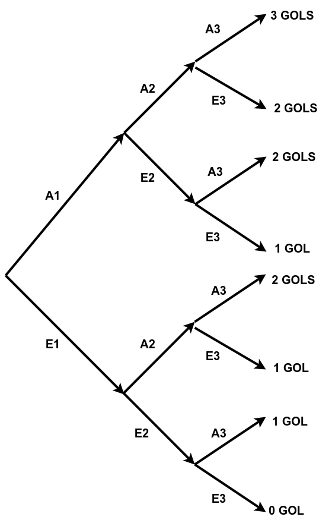

```


\

A seguir vemos a cadeia de eventos necessária para que cada contagem de gols se verifique:

\

\begin{align*}
\text{0 GOL} & = [E_{1} \cap E_{2} \cap E_{3}] \\
\text{1 GOL} & = \{ [A_{1} \cap E_{2} \cap E_{3}] \cup [E_{1} \cap A_{2} \cap E_{3}] \cup [E_{1} \cap E_{2} \cap A_{3}] \}\\
\text{2 GOLS} & = \{ [A_{1} \cap A_{2} \cap E_{3}] \cup [E_{1} \cap A_{2} \cap A_{3}] \cup [A_{1} \cap E_{2} \cap A_{3}] \}\\
\text{3 GOLS} & = [A_{1} \cap A_{2}  \cap  A_{3}] \\
\end{align*}


\

A probabilidade associada a cada contagem de gols será:

\


\begin{align*}
P(\text{0 GOL}) & = P[E_{1} \cap E_{2} \cap E_{3}] \\
P(\text{1 GOL}) & = P\{ [A_{1} \cap E_{2} \cap E_{3}] \cup [E_{1} \cap A_{2} \cap E_{3}] \cup [E_{1} \cap E_{2} \cap A_{3}] \}\\
P(\text{2 GOLS}) & = P\{ [A_{1} \cap A_{2} \cap E_{3}] \cup [E_{1} \cap A_{2} \cap A_{3}] \cup [A_{1} \cap E_{2} \cap A_{3}] \}\\
P(\text{3 GOLS}) & = P[A_{1} \cap A_{2}  \cap  A_{3}] \\
\end{align*}


\

A partir do enunciado, podemos deduzir as probabilidades de cada um dos eventos:

\


\begin{align*}
P(A_{1}) & = 0,50 \\
P(E_{1}) & = 0,50\\
P(A_{i+1}|A_{i}) & =0,60 \text{ logo, pelo complementar, } P(E_{i+1}|A_{i})=0,40\\
P(A_{i+1}|E_{i}) & =0,30 \text{ logo, pelo complementar } P(E_{i+1}|E_{i})=0,70\\
\end{align*}


\

\begin{align*}
P(\text{0 GOL}) & = P[E_{1} \cap E_{2} \cap E_{3}] \\
P(\text{0 GOL}) & = P[E_{1}] \times P[E_{2}|E_{1}] \times P[E_{3}|E_{2}] \\
P(\text{0 GOL}) & = 0,50 \times 0,70  \times 0,70 \\
P(\text{0 GOL}) & = 0,245
\end{align*}

\

\begin{align*}
P(\text{3 GOLS}) & = P[A_{1} \cap A_{2} \cap A_{3}] \\
P(\text{3 GOLS}) & = P[A_{1}] \times P[A_{2}|A_{1}] \times P[A_{3}|A_{2}] \\
P(\text{3 GOLS}) & = 0,50 \times 0,60  \times 0,60 \\
P(\text{3 GOLS}) & = 0,18
\end{align*}

\

\begin{align*}
P(\text{1 GOL}) & = P\{ [A_{1} \cap E_{2} \cap E_{3}]\} + P\{ [E_{1} \cap A_{2} \cap E_{3}]\} + P\{[E_{1} \cap E_{2} \cap A_{3}]\}\\
P(\text{1 GOL}) & = P[A_{1}] \times P[E_{2}|A_{1}] \times P[E_{3}|E_{2}] +\\
& P[E_{1}] \times P[A_{2}|E_{1}] \times P[E_{3}|A_{2}] +\\
& P[E_{1}] \times P[E_{2}|E_{1}] \times P[A_{3}|E_{2}]\\ 
P(\text{1 GOL}) & = 0,50 \times 0,40 \times  0,70 +\\
& 0,50 \times 0,30 \times 0,40 +\\
& 0,50 \times 0,70 \times 0,30 \\
P(\text{1 GOL}) & =0,305
\end{align*}

\

\begin{align*}
P(\text{2 GOLS}) & = P\{ [A_{1} \cap A_{2} \cap E_{3}]\} + P\{ [E_{1} \cap A_{2} \cap A_{3}]\} + P\{[A_{1} \cap E_{2} \cap A_{3}]\}\\
P(\text{2 GOLS}) & = P[A_{1}] \times P[A_{2}|A_{1}] \times P[E_{3}|A_{2}] +\\
& P[E_{1}] \times P[A_{2}|E_{1}] \times P[A_{3}|A_{2}] +\\
& P[A_{1}] \times P[E_{2}|A_{1}] \times P[A_{3}|E_{2}]\\ 
P(\text{2 GOLS}) & = 0,50 \times 0,60 \times  0,40 +\\
& 0,50 \times 0,30 \times 0,60 +\\
& 0,50 \times 0,40 \times 0,30 \\
P(\text{2 GOLS}) & =0,27
\end{align*}

\


## Dependência e independência de eventos

\


Pela **regra geral da probabilidade de dois eventos eventos condicionados**:

\

\begin{align*}
P(A|B) & = \frac{ P(A\cap B)}{ P(B)} \\
P(B|A) & = \frac{ P(B\cap A)}{ P(A)}
\end{align*}

\

Como a probabilidade de interseção não se altera ($P(A\cap B)=P(B\cap A)$), podemos reescrever essas duas expressões:

\

\begin{align*}
P(A \cap B) & =   P(A|B) \times P(B)  \\
P(A\cap B)  & =   P(B|A) \times P(A)    
\end{align*}

\

com $P(B)>0$ e $P(A)>0$ nas expressões acima.

\

Se os eventos $A$ e $B$ são guardam nenhuma relação de condicionamento eles são chamadas de **eventos independentes**. Equivale dizer que $P(A|B)=P(A)$ (ou $P(B|A)=P(B)$), a probabilidade de $A$ não se altera pela prévia ocorrência de $B$ (ou a de $B$ pelo de $A$). 

\

Portanto, **dois eventos são denominados independentes se, e somente se**:

\

$$
P (A \cap B)= P(A) \times P(B)
$$


\

>**Independência e correlação**: se duas variáveis aleatórias são **independentes** não há associação de natureza alguma entre elas, **inclusive a linear**, um caso particular de correlação. Todavia uma **correlação linear nula** não implica em **independência** posto existirem várias outras formas outras de relacionamento (quadrática, cúbica, \dots).

\


```{r  echo=FALSE, out.width='50%', fig.align='center', fig.cap="Independência implica em ausência de qualquer tipo de associação (a recíproca não se aplica"}


```

\


### Demonstração clássica de independência  


Uma bolsa contém 5 bolas `r colFmt("vermelhas",'red')`  e 5 `r colFmt("azuis",'blue')`. Nós removemos uma bola aleatória da bolsa, registramos sua cor **e a colocamos de volta na sacola**. Em seguida, removemos outra bola aleatória da bolsa e registramos sua cor.

\

- Qual é a probabilidade de a primeira bola ser `r colFmt("vermelha",'red')` ?  
- Qual é a probabilidade de a segunda bola ser `r colFmt("azul",'blue')`?  
- Qual é a probabilidade de a primeira bola ser `r colFmt("vermelha",'red')`  e a segunda bola `r colFmt("azul",'blue')`?  
- A primeira bola retirada foi uma bola `r colFmt("vermelha",'red')`  e a segunda bola `r colFmt("azul",'blue')`; esses eventos foram *independentes* ?


\

Solução: 

Probabilidade em se retirar uma bola `r colFmt("vermelha",'red')`  em primeiro lugar:
    
\

Há 10 bolas das quais 5 são `r colFmt("vermelhas",'red')` . A probabilidade de se retirar uma bola `r colFmt("vermelha",'red')`  será:

\

$$
P(1^{a} vermelha)= \frac{5}{10}= \frac{1}{2}
$$

\
    
Probabilidade em se retirar uma bola `r colFmt("azul",'blue')` em segundo lugar:
    
O enunciado do experimento assegura que após a retirada da primeira bola ela é **devolvida** ao sacola; por essa razão, ao se retirar a segunda bola, há novamente 10 bolas no total, das quais 5 são `r colFmt("azuis",'blue')`. A probabilidade de se retirar uma bola `r colFmt("azul",'blue')` será:

\

$$
P(2^{a} azul)= \frac{5}{10}= \frac{1}{2}
$$

\

Probabilidade da primeira bola retirada ser `r colFmt("vermelha",'red')`  e a segunda ser `r colFmt("azul",'blue')`:

\

Ao se retirar duas bolas do sacola há quatro possíveis combinações de resultados. Nós podemos obter:

\

1- uma `r colFmt("vermelha",'red')`  e depois outra `r colFmt("vermelha",'red')`;  
2- uma `r colFmt("vermelha",'red')`  e depois uma `r colFmt("azul",'blue')`;  
3- uma `r colFmt("azul",'blue')` e depois uma `r colFmt("vermelha",'red')`; ou,  
4- uma `r colFmt("azul",'blue')` e depois outra `r colFmt("azul",'blue')`;

\


Queremos saber a probabilidade do segundo resultado após termos obtido  uma bola `r colFmt("vermelha",'red')`  na primeira seleção. 

\

Como existem 5 bolas `r colFmt("vermelhas",'red')`  e 10 bolas no total, existem $\frac{5}{10}$ possibilidades de obter uma bola `r colFmt("vermelha",'red')`  primeiro.

\

Agora nós colocamos a primeira bola de volta, então há novamente 5 bolas `r colFmt("vermelhas",'red')`  e 5 bolas `r colFmt("azuis",'blue')` na sacola.

\

Portanto, há $\frac{5}{10}$ possibilidades de obter uma segunda bola `r colFmt("azul",'blue')` se a primeira bola for `r colFmt("vermelha",'red')` . 

\

Isso significa que existem: $\frac{5}{10} \times \frac{5}{10}= \frac{25}{100}$ possibilidades de se obter uma bola `r colFmt("vermelha",'red')`  em primeiro lugar e uma bola `r colFmt("azul",'blue')` em segundo. 

\

Então, a probabilidade associada será de $\frac{1}{4}$. 

\

A primeira bola retirada foi uma bola vermelha e a segunda bola azul. Esses dois eventos são independentes? 

\

Esses eventos serão *independentes* **se, e somente se**:
    
\

$$
P (A \cap B)= P(A) \times P(B)
$$

\

\begin{align*}
    P(1^{a} vermelha) & = \frac{5}{10}= \frac{1}{2}\\
    P(2^{a} azul) & = \frac{5}{10}= \frac{1}{2}\\
    P(1^{a} vermelha,2^{a} azul) & = \frac{25}{100} = \frac{1}{4}\\
\end{align*}


\

Como $\frac{1}{4}=\frac{1}{2} \times \frac{1}{2}$, **os eventos são independentes**.

\


```{r  echo=FALSE, out.width='50%', fig.align='center', fig.cap="Ilustração do experimento aleatório sob a condição de reposição"}

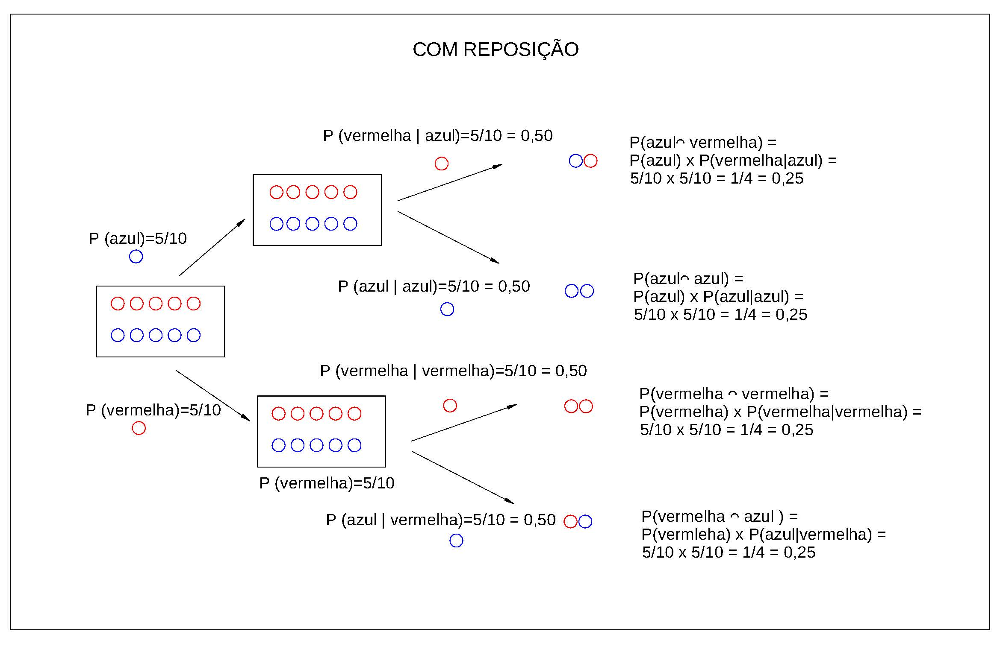

```


### Demonstração clássica de dependência 


**E se**, ao retirarmos a primeira bola, **não a devolvêssemos** ao sacola? 

\

Admitamos agora que o enunciado de nosso problema passou a ser:

\

Uma bolsa contém 5 bolas `r colFmt("vermelhas",'red')`  e 5 `r colFmt("azuis",'blue')`. Nós removemos uma bola aleatória da bolsa, registramos sua cor **e não a  colocamos de volta na sacola**. Em seguida, removemos outra bola aleatória da bolsa e registramos sua cor.

\

1- Qual é a probabilidade de a primeira bola ser `r colFmt("vermelha",'red')` ?  
2- Qual é a probabilidade de a segunda bola ser `r colFmt("azul",'blue')`?  
3- Qual é a probabilidade de a primeira bola ser `r colFmt("vermelha",'red')`  e a segunda bola `r colFmt("azul",'blue')`?  
4- A primeira bola retirada foi uma bola `r colFmt("vermelha",'red')`  e a segunda bola `r colFmt("azul",'blue')`; esses eventos foram *independentes* ?


\

Solução:

\

$1^{a}$ Etapa: analisar todos os possíveis resultados

\

Probabilidade da primeira bola retirada ser `r colFmt("vermelha",'red')`  e a segunda ser `r colFmt("azul",'blue')`:
    
\
 
Ao se retirar duas bolas do sacola há quatro possíveis combinações de resultados. Nós podemos obter:

\

- uma `r colFmt("vermelha",'red')`  e depois outra `r colFmt("vermelha",'red')`;  
- uma `r colFmt("vermelha",'red')`  e depois uma `r colFmt("azul",'blue')`;  
- uma `r colFmt("azul",'blue')` e depois uma `r colFmt("vermelha",'red')` ; ou,  
- uma `r colFmt("azul",'blue')` e depois outra `r colFmt("azul",'blue')`.

\
    
Queremos saber a probabilidade do segundo resultado após termos obtido  uma bola `r colFmt("vermelha",'red')`  na primeira seleção.

\

Como existem 5 bolas `r colFmt("vermelhas",'red')`  e 10 bolas no total, existem $\frac{5}{10}$ maneiras de obter uma bola 
`r colFmt("vermelha",'red')`  primeiro. 

\


**Entretanto, nessa nova situação, nós não colocamos a primeira bola de volta**, então haverá apenas 4 bolas `r colFmt("vermelhas",'red')`  e 5 bolas `r colFmt("azuis",'blue')` na sacola.


\

- Haverá $\frac{4}{9}$ maneiras de obter uma segunda bola `r colFmt("vermelha",'red')`  se a primeira bola for `r colFmt("vermelha",'red')` . Isso significa que existem: $\frac{5}{10} \times \frac{4}{9}= \frac{20}{90}$ maneiras de se obter uma bola `r colFmt("vermelha",'red')`  em primeiro lugar **e** uma bola `r colFmt("vermelha",'red')`  em segundo. Então, a probabilidade associada será de $\frac{2}{9}$;
    
\

- Haverá $\frac{5}{9}$ maneiras de obter uma segunda bola `r colFmt("azul",'blue')` se a primeira bola for `r colFmt("vermelha",'red')` . Isso significa que existem: $\frac{5}{10} \times \frac{5}{9}= \frac{25}{90}$ maneiras de se obter uma bola `r colFmt("vermelha",'red')`  em primeiro lugar **e** uma bola `r colFmt("azul",'blue')` em segundo. Então, a probabilidade associada será de $\frac{5}{18}$;
 
\
 
- Haverá $\frac{5}{9}$ maneiras de obter uma segunda bola `r colFmt("vermelha",'red')`  se a primeira bola for `r colFmt("azul",'blue')`. Isso significa que existem: $\frac{5}{10} \times \frac{5}{9}= \frac{25}{90}$ maneiras de se obter uma bola `r colFmt("azul",'blue')` em primeiro lugar **e** uma bola `r colFmt("vermelha",'red')`  em segundo. Então, a probabilidade associada será de $\frac{5}{18}$.
    
\

- Haverá $\frac{4}{9}$ maneiras de obter uma segunda bola `r colFmt("azul",'blue')` se a primeira bola for `r colFmt("azul",'blue')`. Isso significa que existem: $\frac{5}{10} \times \frac{4}{9}= \frac{20}{90}$ maneiras de se obter uma bola `r colFmt("azul",'blue')` em primeiro lugar **e** uma bola `r colFmt("azul",'blue')` em segundo. Então, a probabilidade associada será de $\frac{2}{9}$;     


\

Resumo das probabilidades calculadas:

\

1 -uma `r colFmt("vermelha",'red')`  **e**  depois outra `r colFmt("vermelha",'red')` : $\frac{2}{9}$;  
2- uma `r colFmt("vermelha",'red')`  **e**  depois uma `r colFmt("azul",'blue')`: $\frac{5}{18}$;  
3- uma `r colFmt("azul",'blue')` **e**  depois uma `r colFmt("vermelha",'red')` : $\frac{5}{18}$; e,  
4- uma `r colFmt("azul",'blue')` **e**  depois outra `r colFmt("azul",'blue')`: $\frac{2}{9}$.

\

$2^{a}$ Etapa: analisar a possibilidade de se obter uma bola `r colFmt("vermelha",'red')`  na primeira extração: 

\

- uma `r colFmt("vermelha",'red')`  e depois outra `r colFmt("vermelha",'red')` : $\frac{2}{9}$;  
- uma `r colFmt("vermelha",'red')`  e depois uma `r colFmt("azul",'blue')`: $\frac{5}{18}$.

\

A probabilidade total de se obter uma bola `r colFmt("vermelha",'red')`  na primeira extração será:

\

$$
P(1^{a} vermelha)= \frac{2}{9} + \frac{5}{18} = \frac{1}{2}
$$


\

$3^{a}$ Etapa: analisar a possibilidade de se obter uma bola `r colFmt("azul",'blue')` na segunda extração: 

\

- uma `r colFmt("vermelha",'red')`  e depois uma `r colFmt("azul",'blue')`: $\frac{5}{18}$;  
- uma `r colFmt("azul",'blue')` e depois outra `r colFmt("azul",'blue')`: $\frac{2}{9}$.


\

A probabilidade total de se obter uma bola `r colFmt("azul",'blue')` na segunda extração será:

\

$P(2^{a} azul)= \frac{5}{18} + \frac{2}{9} = \frac{1}{2}$


\

$4^{a}$ Etapa: analisar a possibilidade de se obter uma bola `r colFmt("vermelha",'red')`  **e**  em seguida `r colFmt("azul",'blue')`: 

\


- uma `r colFmt("vermelha",'red')`  e depois outra `r colFmt("azul",'blue')`: $\frac{5}{18}$;

\

$5^{a}$ Etapa: Esses dois eventos são independentes?
    
\

Esses eventos serão *independentes* **se, e somente se**:
    
\

$$
P (A \cap B)= P(A) \times P(B)
$$

\

\begin{align*}
P(1^{a} vermelha) & = \frac{2}{9} + \frac{5}{18} = \frac{1}{2} \\
P(2^{a} azul) & = \frac{5}{18} + \frac{2}{9} = \frac{1}{2} \\
P(1^{a} vermelha,2^{a} azul) & = \frac{5}{18} \\
\end{align*}


\

Como $\frac{5}{18} \neq \frac{1}{2} \times \frac{1}{2}$, os eventos **não são independentes**.

\

```{r  echo=FALSE, out.width='50%', fig.align='center', fig.cap="Ilustração do experimento aleatório sob a condição de não reposição"}

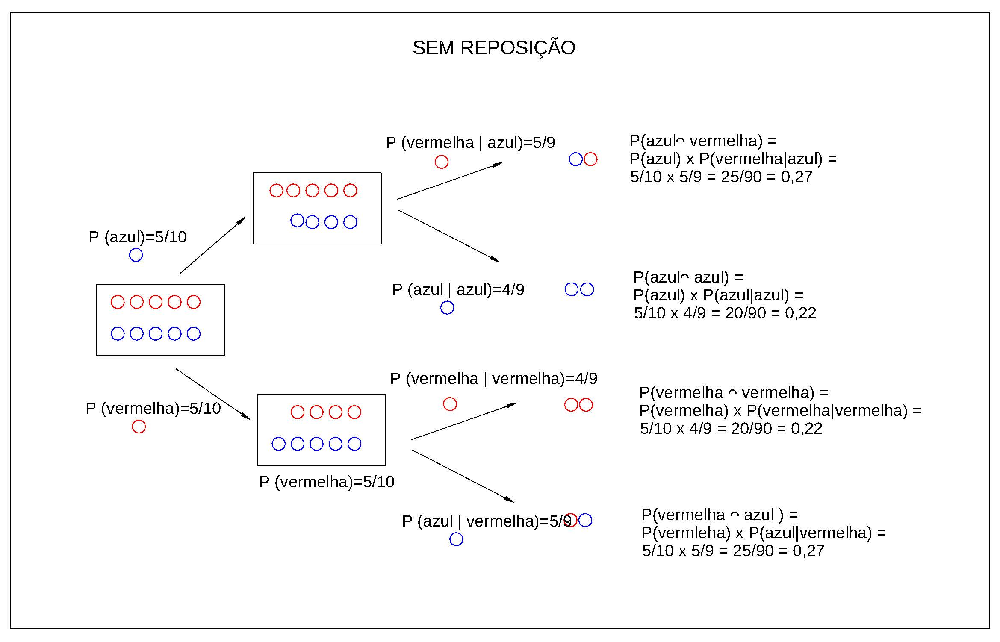

```


\

##  Probabilidade de eventos independentes (regra da cadeia)


Se $E_{1}$, $E_{2}$, ..., $E_{n}$ são eventos independentes **entre si**, então: 

\

\begin{center}
$P (E_{1} \cap E_{2} \cap ... E_{n})= P(E_{1}) \times P(E_{2}) ... \times P(E_{n})$
\end{center}


\

Para que isso se verifique, a independência entre cada um e todos os eventos deve se verificada. Numa situação de três eventos, por exemplo, teríamos que observar:

\


$$
P (E_{1} \cap E_{2})= P(E_{1}) \times P(E_{2})
$$

\


$$
P (E_{1} \cap E_{3})= P(E_{1}) \times P(E_{3})
$$

\


$$
P (E_{2} \cap E_{3})= P(E_{2}) \times P(E_{3})
$$


\

$$
P (E_{1} \cap E_{2} \cap E_{3} )= P(E_{1}) \times P(E_{2}) \times P(E_{3})
$$

\

> Exemplo: considere o experimento aleatório de se lançar dois dados e obter o valor **1** no primeiro deles e **5** no segundo (defina os eventos $E_{1}= \text{sair face 1}$ e $E_{5}=\text{sair face 5}$).

\

Solução:

\


Quando lançamos dois dados o resultado obtido em um deles (o valor numérico da face) **não condiciona ou altera** o resultado obtido no outro: os resultados são **são independentes**. Desse modo, sendo $P(E_{1})=\frac{1}{6}$ e $P(E_{5})=\frac{1}{6}$: 


\

\begin{align*}
P(E_{1} \cap E_{5}) & = \frac{1}{6} \times \frac{1}{6}\\
                    & = \frac{1}{36}.
\end{align*}

\


> Exemplo: Uma empresa que compra produtos de dois fabricantes diferentes (**Fabricante 1** e **Fabricante 2}**) adquiriu 168 unidades do primeiro e 84 do segundo. Sabendo que 8  unidades fabricadas pelo primeiro fornecedor não atenderam às especificações e apenas 4 do segundo, verifique se o fato de uma amostra ter atendido às especificações independe de ter sido produzida pelo **Fabricante 1**. 

\

Solução:

\


Para a primeira verificação pedida defina os eventos **$Fab1:$ ter sido produzida pelo Fabricante 1**, **$Aprov:$ ter atendido às especificações**  e **$Fab2:$ ter sido produzida pelo Fabricante 2**. Na sequência podemos calcular as seguintes probabilidades:

\


\begin{align*}
P(Fab1)   & = \frac{168}{252} \\
          & = 0,6666 \\
P(Aprov)  & = \frac{240}{252} \\
          & = 0,9523 \\
P(Fab1 \cap Aprov) & = \frac{160}{252} \\
          & =  0,6349  
\end{align*}


\

**Se** o fato de uma amostra ter sido aprovada **independe** de ter sido produzida pelo Fabricante 1 **então**  $P(Aprov|Fab1) = P(Aprov)$:

\

\begin{align*}
P(Aprov|Fab1) & = \frac{P(Aprov \cap Fab1)}{P(Fab1)} \\
              & = \frac{0,6349}{0,6666} \\
              & =  0,9523.
\end{align*}


\

Como $P(Aprov|Fab1) = P(Aprov)$, verifica-se que o fato de uma amostra aleatoriamente sorteada entre as peças do fabricante 1 não condiciona sua aprovação.

\


> Exemplo: A probabilidade de um consumidor ($C_{1}$) ficar satisfeito com o desempenho de certa marca de produto é de 25\%. A probabilidade de um outro consumidor  ($C_{2}$) ficar satisfeito com a mesma marca é de 40\%. Admitamos que os dois consumidores irão consumir o produto num mesmo momento e de **forma independente (incomunicáveis)**. Qual a probabilidade de **os dois** consumidores ficarem satisfeitos simultaneamente?

\

Solução:

\

As probabilidades individuais dos consumidores 1 **e** 2 ficarem  satisfeitos com o desempenho da marca do produto são:

\

\begin{align*}
P(C_{1}) & = 0,25\\
P(C_{2}) & = 0,40
\end{align*}

\

A probabilidade de **ambos** ficarem satisfeitos, dado que o enunciado afirma que esses eventos são **independente** será:

\

\begin{align*}
P(C_{1} \cap C_{2}) & = 0,25 \times 0,40\\
                    & = 0,10.
\end{align*}

\


## Teorema de Bayes

\

```{r  echo=FALSE, out.width='50%', fig.align='center', fig.cap="Thomas Bayes (1702 - 1761)"}

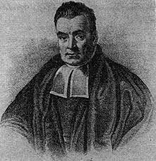
```


> Admita o espaço amostral de um experimento baseado no sorteio aleatório de um estudante de uma escola, com dois possíveis resultados quanto ao sexo:

\


```{r fig600, echo=FALSE, out.width='45%', fig.align='center', fig.cap="Espaço amostral"}

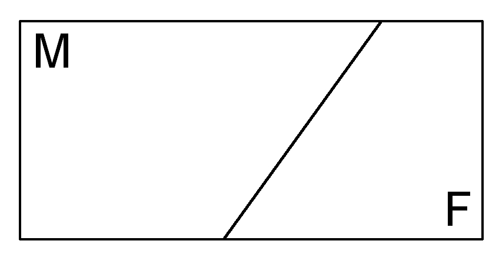

```

\


> Considere agora um evento definido nesse espaço amostral como sendo ``ter um carro'':

\

```{r fig601, echo=FALSE, out.width='70%', fig.align='center', fig.cap="Espaço amostral"}

knitr::include_graphics("images4/BAYES2.jpg")

```

\


> As interseções desse evento com os elementos do espaço amostral são:

\

```{r fig602, echo=FALSE, out.width='60%', fig.align='center', fig.cap="Espaço amostral"}

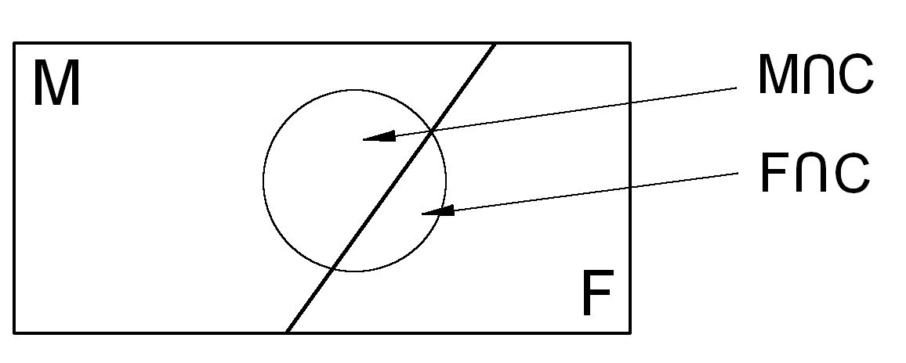

```

\


Pela  **regra da probabilidade condicionada** temos que 

\

$$
P(C|F) = \frac{P(C \cap F)}{ P(F)}\\ 
P(C \cap F) = P(C|F)  P(F) 
$$
\

e, de modo equivalente, 

\

$$
P(C|M) = \frac{P(C \cap M)}{ P(M)}\\ 
P(C \cap M) = P(C|M)  P(M) 
$$

\

A probabilidade de se ter um carro é dada pela regra da união de eventos que, nesse caso são disjuntos e assim:

\


$$
P(C) = P(C \cap M) \cup P(C \cap F)\\
P(C) =  P(C|M)  P(M) + P(C|F)  P(F) 
$$

\

> Sorteado aleatoriamente um estudante da escola verificou-se possuir um carro. Qual a probabilidade de que seja do sexo feminino ($P(F|C)$)?

\

$$
P(F|C) = \frac{P(F \cap C)}{ P(C)}\\ 
P(F \cap C) = P(F|C)  P(C) \\
$$


\

Pela igualdade $P(C \cap F)=P(F \cap C)$:

\

$$
P(C \cap F) = P(C|F)  P(F) \\
P(F \cap C) = P(F|C)  P(C) 
$$
\

substituindo-se na expressão acima chega-se a:

\


\begin{align*}
P(C \cap F) & =P(F \cap C)\\
P(C|F).P(F) & = P(F|C).P(C)\\ 
P(F|C)  & = \frac{P(C|F)P(F)}{P(C)}
\end{align*}


uma **relação** entre duas probabilidades inversamente condicionadas conhecida como **Teorema de Bayes**.

\


> Adimita então serem dados:

\


- ``M'': ser do sexo masculino: $P(M)=0,65$;
- ``F'': ser do sexo feminino: $P(F)=0,35$.
- ``C'': possuir um carro: 
  - $P(C|M)=0,30$
  - $P(C|F)=0,18$.

\

A probabilidade de se ter carro ($P(C)$) resulta de união de dois únicos e possíveis eventos condicionados ao sexo e disjuntos. Assim: 

\

\begin{align*}
P(C) & = P(C \cap M) \cup P(C \cap F)\\
P(C) & = [P(M).P(C|M)] \cup [P(F).P(C|F)]   \\
P(C) & = [0,65 . 0,30] + [0,35 . 0,18]   \\
P(C) & = 0,258\\
\end{align*}

\

e podemos calcular $P(F|C)$:  

\

\begin{align*}
P(F|C) & = \frac{P(F).P(C|F)}{P(C)}\\
P(F|C) & = \frac{0,35 . 0,18 }{ 0,258}\\
P(F|C) & = 0,2442\\
\end{align*}

\

A probabilidade de que um estudante aleatoriamente sorteado nessa escola e sabendo-se **a priori** que possui um carro ser do **sexo feminino** é de 24,42\%.

\


Para um espaço amostral mais amplo, de modo geral consideremos, inicialmente o diagrama da Figura \@ref(fig:fig6) onde $\Omega$ é o espaço amostral de um experimento aleatório qualquer:

\

```{r fig6, echo=FALSE, out.width='80%', fig.align='center', fig.cap="Espaço amostral"}

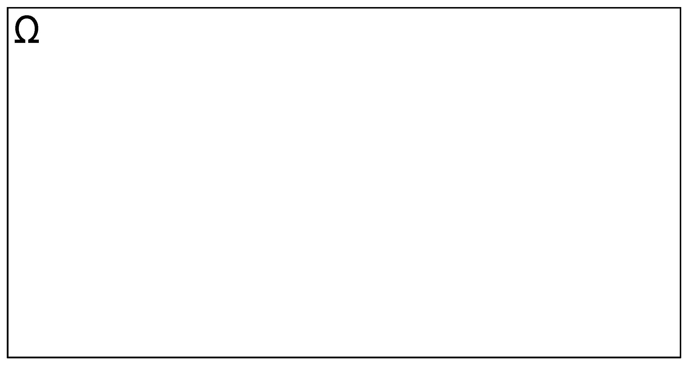

```
\

Admita que $E_{1}$, $E_{2}$, $E_{3}$ e $E_{4}$ formem a partição do espaço amostral $\Omega$ (seus elementos são **mutuamente exclusivos**) como exposto na Figura \@ref(fig:fig7)

\

```{r fig7, echo=FALSE, out.width='80%', fig.align='center', fig.cap="Espaço amostral e suas partições"}

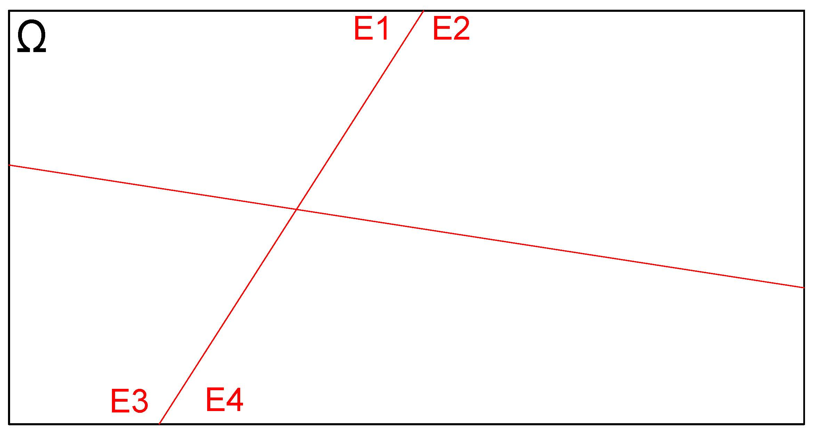

```
\

E seja $B$ um evento qualquer em $\Omega$ como ilustrado na Figura \@ref(fig:fig8)

\

```{r fig8, echo=FALSE, out.width='80%', fig.align='center', fig.cap="Evento definido sobre o espaço amostral"}

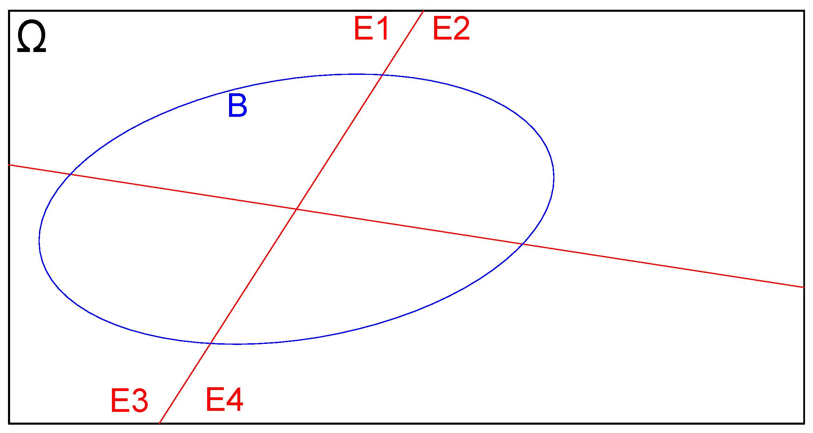

```
\

Delimitemos as interseções do evento $B$ com as partições $E_{1}$, $E_{2}$, $E_{3}$ e $E_{4}$ do espaço amostral $\Omega$, como ilustrado na Figura \@ref(fig:fig9)

\

```{r fig9, echo=FALSE, out.width='80%', fig.align='center', fig.cap="Interseções das partições do espaço amostral com o evento B"}

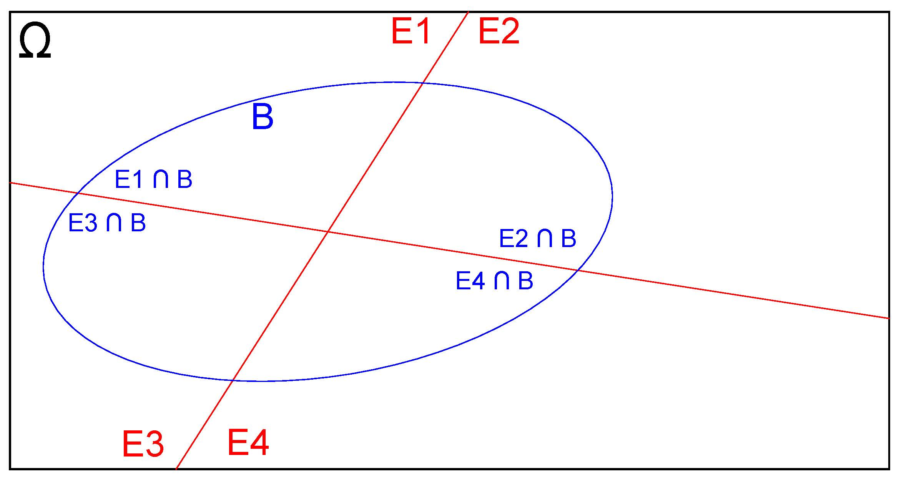

```
\

Isso pode ser estendido, em uma forma geral, para $i=1, \dots, n$ partições como ilustrado na Figura \@ref(fig:fig10)

\

```{r fig10, echo=FALSE, out.width='80%', fig.align='center', fig.cap="Interseções das n partições do espaço amostral com o evento B"}


```
\

Na representação esquemática da Figura \@ref(fig:fig10) podemos identificar:


1- $E_{1}$, $E_{2}$, \dots , $E_{i}$, \dots, $E_{n}$ constituem-se em partições do espaço amostral $\Omega$;  
2- Todas as partições são mutuamente exclusivas: $E_{i} \cap E_{j} = \varnothing$,$\forall$ $i \neq j$ (a interseção de quaisquer partições é vazia);  
3- Sendo vazias as interseções entre quaisquer partições, o espaço amostral $\Omega$ será a simples união de todas elas:  $\Omega = E_{1} \cup E_{2} \cup E_{3} \cup E_{4}\cup \dots \cup E_{i} \dots \cup E_{n}$; e,  
4- **B** é um evento qualquer definido sobre as partições de $\Omega$

\

São conhecidas as probabilidades de ocorrência de cada um dos elementos do espaço amostral $\Omega$: 

\

$$
P(E_{1}); P(E_{2}); P(E_{3}); \dots;P(E_{i}); \dots; P(E_{n})
$$


\

e também as  probabilidades do evento $B$ condicionadas a cada elemento do espaço amostral:

\

$$
P(B|E_{1}); P(B|E_{2});\dots;P(B|E_{i});\dots; P(B|E_{n})
$$   

\

A *probabilidade de ocorrência do evento B* é dada pela soma das probabilidades de cada uma de suas interseções com os elementos do espaço amostral $\Omega$, uma vez que essas interseções são disjuntas entre si:

\


\begin{align*}
P(B) & = P(E_{1} \cap B) \cup P(E_{2} \cap B) \cup  \dots  P(E_{i} \cap B) \cup \dots  P(E_{n} \cap B) \\
P(B) & = \sum _{i=1}^{n}P\left({E}_{i}\cap B\right)
\end{align*}

\

Pela *Regra do produto de eventos condicionados*, a *probabilidade de ocorrência do evento B* **posto** ter ocorrido um evento $E_{i}$ é:

\

\begin{align*}
P(B|E_{i}) & = \frac{P(E_{i}\cap B)}{P(E_{i})} \\ 
P(E_{i}\cap B) & = P(E_{i}) \times P(B|E_{i}) 
\end{align*}

\

com $P(E) > 0$ 


\


Aplicando-se na expressão anteriormente desenvolvida da *probabilidade de ocorrência do evento B* teremos:

\
\begin{align*}
P(B) & = P(E_{1} \cap B) \cup  P(E_{2} \cap B) \cup \dots \cup P(E_{i} \cap B) \cup \dots  \cup P(E_{n} \cap B) \\
P(B) & = P(E_{1}) \times P(B|E_{1}) + P(E_{2}) \times P(B|E_{2}) + \\
    & \dots +P(E_{i}) \times P(B|E_{i}) + \\
    & \dots  + P(E_{n}) \times P(B|E_{n}) 
\end{align*}

\


Portanto a **probabilidade total** do evento B em $\Omega$ é dada pelo somatório:

\

$$
P(B) = \sum _{i=1}^{n}\left[P\left({E}_{i}\right)\cdot P\left(B|{E}_{i}\right)\right]
$$

\

Pela **Regra do produto de eventos condicionados** a probabilidade de ocorrência de um evento $E_{i}$ posto ter ocorrido o evento $B$  é:

\


\begin{align*}
P(E_{i}|B) & = \frac{P(E_{i} \cap B)}{P(B)} \\
P(E_{i} \cap B) & = P(B) \times P(E_{k}|B) \\
P(B) & = \frac{P(E_{i}\cap B)}{P(E_{k}|B)}
\end{align*}

\

com $P(B) > 0$

\

Pela **igualdade** dos dois modos de se expressar a probabilidade total do evento $B$ desenvolvidos: 

\


$$
P(B) = \frac{P(E_{i}\cap B)}{P(E_{i}|B)}
$$

\

e 

\


$$
P(B) = \sum _{i=1}^{n}\left[P\left({E}_{i}\right)\cdot P\left(B|{E}_{i}\right)\right]
$$  

\

tem-se 

\

$$
\frac{P(E_{i}\cap B)}{P(E_{i}|B)}=\sum _{i=1}^{n}\left[P\left({E}_{i}\right)\cdot P\left(B|{E}_{i}\right)\right]
$$

\


Rearranjando-se em termos da expressão anterior para exprimir a probabilidade de ocorrência de um evento $E_{i}$ posto ter ocorrido o evento $B$ chegamos a:  

\


$$
P(E_{i}|B) = \frac{P(E_{i}\cap B)}{\sum _{i=1}^{n}\left[P\left({E}_{i}\right)\cdot P\left(B|{E}_{i}\right)\right]}
$$

\

Sendo 

\

$$
P(E_{i} \cap B) = P(B) \times P(E_{i}|B) 
$$

\

a expressão anterior pode ser reescrita como:


\

$$
P(E_{i}|B) = \frac{ P(E_{i}) \times P(B|E{i})   }{  \sum _{i=1}^{n}\left[P\left({E}_{i}\right)\times P\left(B|{E}_{i}\right)\right]  }
$$

uma forma mais geral do **Teorema de Bayes**. 

\

O Teorema de Bayes é também chamado de Teorema da probabilidade a *posteriori* ao permitir que se calcule $P(E_{i}|B)$ em termos da ocorrência $P(B|E_{i})$

\


É, de certo modo, uma conjugação do *teorema na probabilidade total* e da *regra do produto* de probabilidades. 

\

O denominador:

\

$$
P(B)=  \sum _{i=1}^{n}\left[P\left({E}_{i}\right)\times P\left(B|{E}_{i}\right)\right]
$$ 

\

é a denominada **probabilidade marginal** de ocorrência do evento $B$ no espaço amostral $\Omega$ composto por $n$ elementos (partições).

\


Na expressão do Teorema de Bayes: 

\

- $P(E_{k}|B)$ é a denominada probabilidade *a posteriori* do evento $E_{k}$ condicionada pela ocorrência anterior do evento B;  
- $P(E_{k})$ é a denominada probabilidade *a priori* do evento $E_{k}$;  
- $P(B|E_{k})$ é a denominada probabilidade *a posteriori* do evento $B$ condicionada pela ocorrência anterior do evento $E_{k}$;  
- $P(E_{i})$ é a denominada probabilidade *a priori* de cada evento $E_{i}$;  
- $P(B|E_{i})$ é a denominada probabilidade *a posteriori* do evento $B$ condicionada pela ocorrência anterior de cada evento $E_{i}$.

\

>Exemplo: Constatou-se que o aumento nas vendas de um certo produto comercializado por uma empresa num mês **pode ocorrer somente** por uma das quatro causas **mutuamente exclusivas** a seguir: 

\

1- ação de marketing;  
2- propaganda;  
3- flutuações na economia do país; ou,  
4- efeitos sazonais.

\

A probabilidade de haver uma ação da empresa no mês focada para o *marketing* é de 40\%; e para propaganda é de 30\%; as probabilidades de ocorrerem flutuações na economia do país é de 20\% e de efeitos sazonais é de 10\%. Uma pesquisa mostrou que a probabilidade de haver um aumento nas vendas do produto devido a uma ação de *marketing* é de 7\%; devido à publicidade, de 7,5\%, por flutuações na economia do país, de 3\% e por sazonalidade de 2\%.

\

Em um determinado mês a empresa observou um considerável incremento nas vendas. Qual seria sua causa mais provável? Qual a probabilidade de incremento das vendas em um certo mês? 


\

Inicialmente definimos um experimento aleatório como sendo "qual fato ocorreu no mês". 
\

Não sabemos qual fato ocorreu, mas sabemos que as possibilidades são apenas 4 (*marketing*, propaganda, flutuações na economia ou efeitos sazonais).

\
 
Podemos então conceber que esses fatos são elementos do espaço amostral do experimento aleatório: pois são eventos exaustivos e exclusivos: não pode ocorrer mais de um ao mesmo tempo e ao menos um ocorrerá. 

\

Assim esse espaço amostral é composto pelos seguintes "elementos" e suas probabilidaes são tiradas do enunciado:

\

- $E_{1}$ o elemento "Ação de marketing" $\therefore \rightarrow$ $P(E_{1})=0,40$;  
- $E_{2}$ o elemento "Ação de propaganda"  $\therefore \rightarrow$ $P(E_{2})=0,30$;  
- $E_{3}$ o elemento "Flutuações na economia" $\therefore \rightarrow$ $P(E_{3})=0,20$; ou,  
- $E_{4}$ o elemento "Sazonalidade" $\therefore \rightarrow$ $P(E_{4})=0,10$.

Chamemos de $B$ ao evento "ocorrer um incremento nas vendas", um evento construído sobre os elementos do espeço amostral e que apresenta diferentes probabilidades a depender de qual elemento do espaço amostral ocorreu (a probabilidade de $B$ está *condicionada* aos elementos do espaço amstral). Da leitura do enunciado extraímos as probabilidades de ocorrência de cada um dos eventos influenciadores: 

\

As probabilidades condicionadas de ocorrer um incremento das vendas ($B$) pela ocorrência anterior de cada um dos elementos do espaço amostral (**posto ter ocorrido o evento $E_{i}$**) também são tiradas do enunciado: 

\


- $P(B|E_{1}) = 0,07$ ; 
- $P(B|E_{2}) = 0,075$;  
- $P(B|E_{3}) = 0,03$; e,  
- $P(B|E_{4}) = 0,02$. 

\

Para responder à indagação do problema ("Qual a causa mais provável?") podemos invertê-la e reformulá-la:

\

"Qual a probabilidade de ter ocorrido cada um dos quatro eventos ($E_{1}$, $E_{2}$, $E_{3}$, $E_{4}$) **posto** (dado) ter ocorrido um incremento nas vendas? 

\

Calculemos para cada um deles usando o Teorema de Bayes:

\

$$
P(E_{i}|B) = \frac{ P(E_{i}) \times P(B|E{i})   }{  \sum _{i=1}^{n}\left[P\left({E}_{i}\right)\times P\left(B|{E}_{i}\right)\right]  }
$$

\

Probabilidade da empresa ter realizado uma ação de *marketing*, **posto** ter ocorrido um incremento nas vendas de seu produto:

\

\begin{align*}
P(E_{1}|B) &  = \frac{ P(E_{1}) \times P(B|E{1})   }{  \sum _{i=1}^{4}\left[P\left({E}_{i}\right)\times P\left(B|{E}_{i}\right)\right] } \\
P(E_{1}|B) & = \frac{0,40 \times 0,07} { (0,40 \times 0,07) + (0,30 \times 0,075) +(0,20 \times 0,03) +(0,10 \times 0,02) } \\
P(E_{1}|B) & = 0,4786 \\
\end{align*}

\

Probabilidade da empresa ter realizado propaganda, **posto** ter ocorrido um incremento nas vendas de seu produto:

\

\begin{align*}
P(E_{2}|B) &  = \frac{ P(E_{2}) \times P(B|E{2})   }{  \sum _{i=1}^{4}\left[P\left({E}_{i}\right)\times P\left(B|{E}_{i}\right)\right]  }  \\
P(E_{2}|B) & = \frac{0,30 \times 0,075} { (0,40 \times 0,07) + (0,30 \times 0,075) +(0,20 \times 0,03) +(0,10 \times 0,02) } \\
P(E_{2}|B) & = 0,3846 
\end{align*}

\

Probabilidade da empresa ter ocorrido flutuações na economia, **posto** ter ocorrido um incremento nas vendas de seu produto:

\

\begin{align*}
P(E_{3}|B) & = \frac{ P(E_{3}) \times P(B|E{3})   }{  \sum _{i=1}^{4}\left[P\left({E}_{i}\right)\times P\left(B|{E}_{i}\right)\right]  } \\
P(E_{3}|B) & = \frac{0,20 \times 0,03} { (0,40 \times 0,07) + (0,30 \times 0,075) +(0,20 \times 0,03) +(0,10 \times 0,02) } \\
P(E_{3}|B) & = 0,1026 
\end{align*}

\

Probabilidade da empresa ter ocorrido efeitos sazonais, **posto** ter ocorrido um incremento nas vendas de seu produto:

\
\begin{align*}
P(E_{4}|B) & = \frac{ P(E_{4}) \times P(B|E{4})   }{  \sum _{i=1}^{4}\left[P\left({E}_{i}\right)\times P\left(B|{E}_{i}\right)\right]  } \\
P(E_{4}|B) & = \frac{0,10 \times 0,02} { (0,40 \times 0,07) + (0,30 \times 0,075) +(0,20 \times 0,03) +(0,10 \times 0,02) } \\
P(E_{4}|B) & = 0,03419 
\end{align*}

\

Respostas:

\

1- Os cálculos indicam que o evento mais provável pelo incremento das vendas observado naquele mês foi o de uma **ação de marketing**;  
2- A probabilidade de incremento das vendas em um determinado mês como resultado dos quatro possíveis eventos indicados é o **próprio denominador do Teorema de Bayes**: 0,0585.


> Exemplo: Considere 5 urnas, cada uma delas contendo 6 bolas. Duas dessas urnas (urnas tipo $C_{1}$) possuem 3 bolas brancas em seu interior. Duas outras (urnas tipo $C_{2}$) possuem 2 bolas brancas em seu interior e a última (urnas tipo $C_{3}$) possui 6 bolas brancas em seu interior (cf.  Figura \@ref(fig:fig11)).

\


```{r fig11,  echo=FALSE, out.width='50%', fig.align='center', fig.cap="Cinco urnas cada uma com 6 bolas em cores de diferentes quantidades da cor branca"}

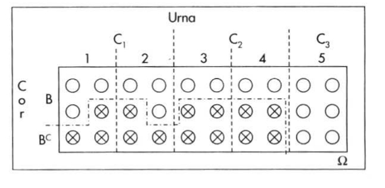

```


\

Escolhida aleatoriamente uma urna retira-se uma bola. Qual a probabilidade da urna escolhida ter sido a urna $C_{3}$ **sabendo-se que a bola retirada foi branca**?

\

**Desejamos determinar** $P(C_{3} | Branca)$

\

Da leitura do enunciado extraímos as seguintes informações:

\

\begin{align*}
P(C_{1}) & = \frac{2}{5} \\
P(C_{2}) & = \frac{2}{5} \\
P(C_{3}) & = \frac{1}{5} \\
P(Branca | C_{1}) & = \frac{1}{2} \\
P(Branca | C_{2}) & = \frac{1}{3} \\
P(Branca | C_{3}) & = 1
\end{align*}

\

\begin{align*}
P(C_{3} | Branca) & = \frac{ P(C_{3}) \times P(Branca | C_{3})  }{  \sum_{i=1}^{3}\left[P\left({C}_{i}\right)\times P\left(Branca | {C}_{i}\right)\right]  } \\
P(C_{3} | Branca) & = \frac{ 0,20 \times 1,00} { (0,40  \times 0,50 ) + (0,40 \times 0,33 ) +(0,20 \times 1,00)} \\
P(C_{3} | Branca) & = 0,375
\end{align*}


\


## Teoremas da Teoria das probabilidades


### Teorema 01


Se $E$ é um evento num espaço discreto $\Omega$, então $P(E)$ é igual à soma das probabilidades de ocorrência de todos os elementos do espaço amostral que satisfazem ao evento de interesse $E$ .

\

Sejam $E_{1},E_{2},E_{3},\dots$ a sequência finita ou infinita de eventos que satisfazem ao evento de interesse $E$. Assim, $E = E_{1} \cup E_{2} \cup E_{3}...$. Como $E_{1},E_{2},E_{3},\dots$ são eventos **mutuamente exclusivos**, pelo terceiro postulado das probabilidades teremos:

\

$$
P(E) = P(E_{1}) + P(E_{2}) + P(E_{3}) + ...
$$

\

> Exemplo: Lançamento de uma moeda duas vezes

\

Espaço amostral dos possíveis eventos (resultados): $\Omega = \{(cara, cara), (cara, coroa), (coroa, cara), (coroa, coroa)\}$


- Evento de interesse $E$: obter ao menos uma _cara_
- Eventos que satisfazem: $E_{1} =\{(cara, cara)\}$; $E_{2} =\{(cara, coroa)\}$; $E_{3} =\{(coroa, cara)\}$


A probabilidade de $E$ ($P(E)$)será a soma das probabilidades dos eventos que o satisfazem:

$$
P(E) = P(E_{1}) + P(E_{2}) + P(E_{3}) = \frac{1}{4} + \frac{1}{4} + \frac{1}{4} = \frac{3}{4}
$$


\

### Teorema 02 


Se um experimento aleatório pode ter $N$ resultados possíveis e equiprováveis e um evento $E$ pode ter $n$ resultados que o satisfazem, então $P(E) = \frac{n}{N}$.  

\

Sejam $E_{1},E_{2},E_{3},\dots,E_{N}$ os resultados do espaço amostral $\Omega$, cada um deles equiprovável ($P(E_{i} =\frac{1}{N}$). Se $E$ é a união de $n$ desses eventos **mutuamente exclusivos**, pelo terceiro postulado das probabilidades teremos:

\

\begin{align*}
P(E) & = P(E_{1}) + P(E_{2}) + P(E_{3}) + ... P(E_{n}) \\
P(E) & = \frac{1}{N} + \frac{1}{N} +\frac{1}{N} +...+\frac{1}{N} \\
P(E) & = \frac{n}{N} 
\end{align*}


\

### Teorema 03


Se $E$ e $E^{c}$ são eventos complementares no espaço amostra $\Omega$ então $P(E^{c}) = 1 - P(E)$.

\

Sendo os eventos $E$ e $E^{c}$ **mutuamente exclusivos** e também sendo $E \cup E^{c} = \Omega$, considerando-se que $P(\Omega) = 1$, pelos segundo e terceiro postulados tem-se:

\

\begin{align*}
P(\Omega) & = 1 \\
1 & = P(E \cup E^{c}) \\
1 & = P(E) + P(E^{c})
\end{align*}

\


### Teorema 04


$P(\varnothing)=0$ 

\

Sendo $\Omega$ e $\varnothing$ são **mutuamente exclusivos** e, como de acordo com a definição de um espaço vazio 
$\Omega \cup \varnothing = \Omega$, pelo terceiro postulado tem-se:

\

\begin{align*}
P(\Omega) & = P(\Omega \cup \varnothing)\\ 
P(\Omega) & = P(\Omega) + P(\varnothing)\\ 
P(\Omega) - P(\Omega) & = P(\varnothing)\\ 
P(\varnothing) & =0
\end{align*}

\


### Teorema 05


Se $A$ e $B$ são eventos em um mesmo espaço amostral $\Omega$ e  $A \subset B$ então $P(A) \le P(B)$.

\

Se $A \subset B$ então pode-se escrever: $B = A \cup (A^{c} \cap B)$ (verifica-se pelo correspondente diagrama de Venn). 

\

Como $A$ e $A^{c}\cap B$ são **mutuamente exclusivos**, pelo terceiro postulado tem-se:

\

\begin{align*}
P(B) &  = P(A) + P(A^{c}\cap B) \\
P(A) & = P(B) - P(A^{c}\cap B)
\end{align*}


\


### Teorema 06


A probabilidade de qualquer evento $E$ em $\Omega$ está compreendida entre $0 \le P(E) \le 1$.

\

Estando $\varnothing \subset E \subset \Omega$ e considerando-se o Teorema 5 tem-se:

\

$$
P(\varnothing)  \le P(E) \le P(\Omega) \\
0 \le P(E) \le 1
$$


\


### Teorema 07


Para dois eventos quaisquer em $\Omega$, $A$ e $B$ tem-se que: $P( A \cup B ) = P(A) + P(B) - P(A \cap B)$.

\

Sejam as seguintes probabilidades para esses eventos **mutuamente exclusivos**:

\

```{r  , echo=FALSE, out.width='50%', fig.align='center'}

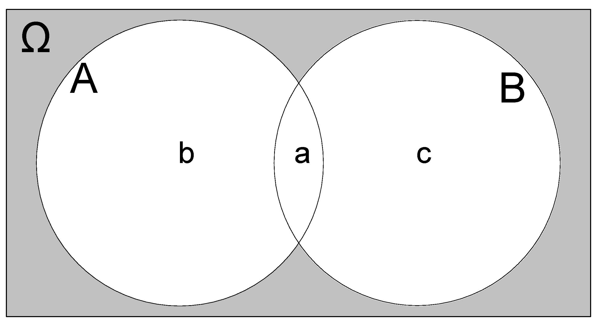

```

\

- $P(A \cap B) = a $;  
- $P(A \cap B^{c}) = b$;  e,  
- $P(A^{c} \cap B) = c$.

\


\begin{align*}
P ( A \cup B) & = a + b + c \\
P ( A \cup B) & = (a + b) + (c + d) - a \\
P ( A \cup B) & = P(A) + P(B) - P(A \cap B)
\end{align*}


\

### Teorema 08


Para três eventos quaisquer em $\Omega$, $A$, $B$ e $C$ tem-se que: 

\

\begin{align*}
P( A \cup B \cup C ) & = \\
                     & = P(A) + P(B) +P(C) - \\
                     & P(A \cap B) - P(A \cap C) - P(B \cap C)  + \\
                     & P(A \cap B \cap C)
\end{align*}


\

Escrevendo-se $A \cup B \cup C$ como $A  \cup (B \cup C)$ e usando o Teorema 7 duas vezes (uma para $P[A \cup (B \cup C)]$ e a outra para $P(  B \cup C)$ tem-se:

\

\begin{align*}
P( A \cup B \cup C) &  = P[ A \cup (B \cup C)] \\
P( A \cup B \cup C) & = P(A) + P( B \cup C) - P [A \cap (B \cup C)]\\
P( A \cup B \cup C) & = P(A) + P(B) + P(C) - P (B \cap C) - P [A \cap (B \cup C)]
\end{align*}


\

Pela lei distributiva tem-se:

\


\begin{align*}
P [A \cap (B \cup C)] & = P[ (A \cap B) \cup (A \cap C )  ]\\
P [A \cap (B \cup C)] & = P(A \cap B) + P(A \cap C) - P[ ( A \cap B) \cap (A \cap C)] \\
P [A \cap (B \cup C)] & = P(A \cap B) + P(A \cap C) - P( A \cap B \cap C)
\end{align*}

\

Chega-se a :
\

\begin{align*}
P( A \cup B \cup C ) & = \\
                     & P(A) + P(B) +P(C) - P(A \cap B) - P(A \cap C) - P(B \cap C)  +\\
                     & P(A \cap B \cap C)
\end{align*}


