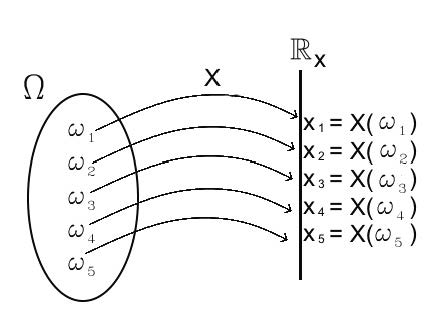
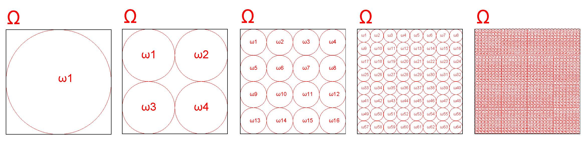
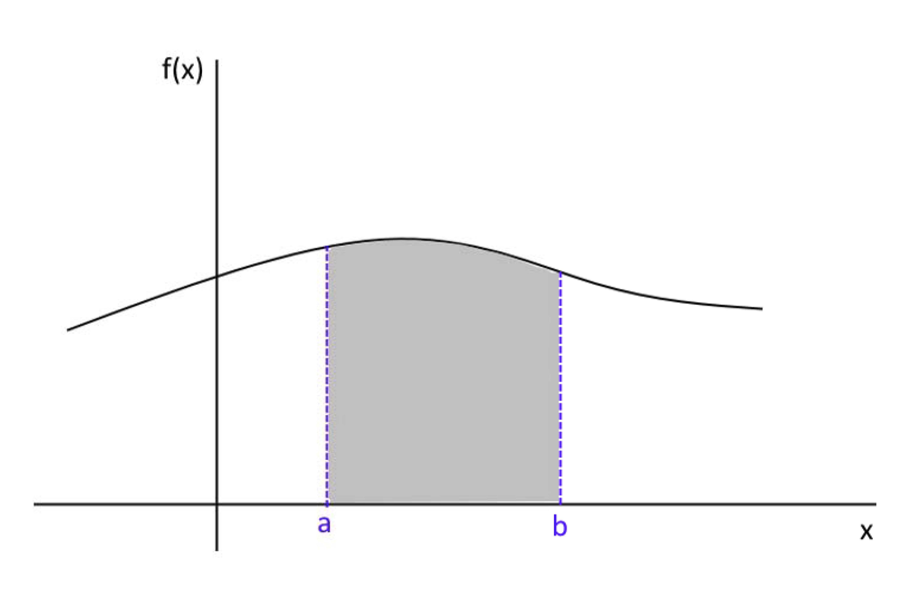
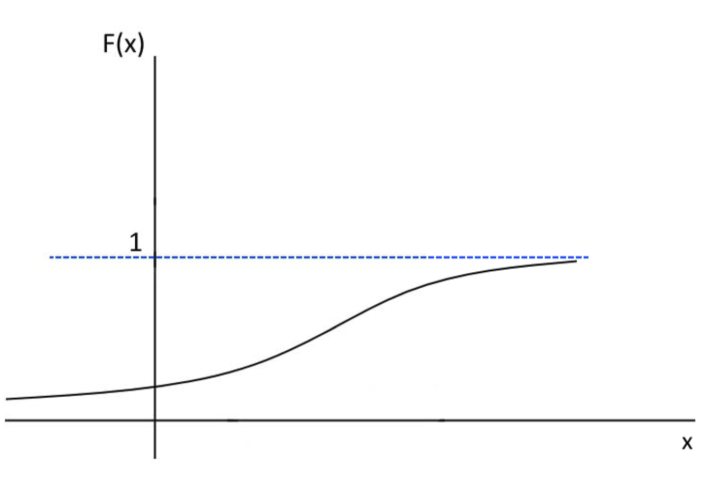
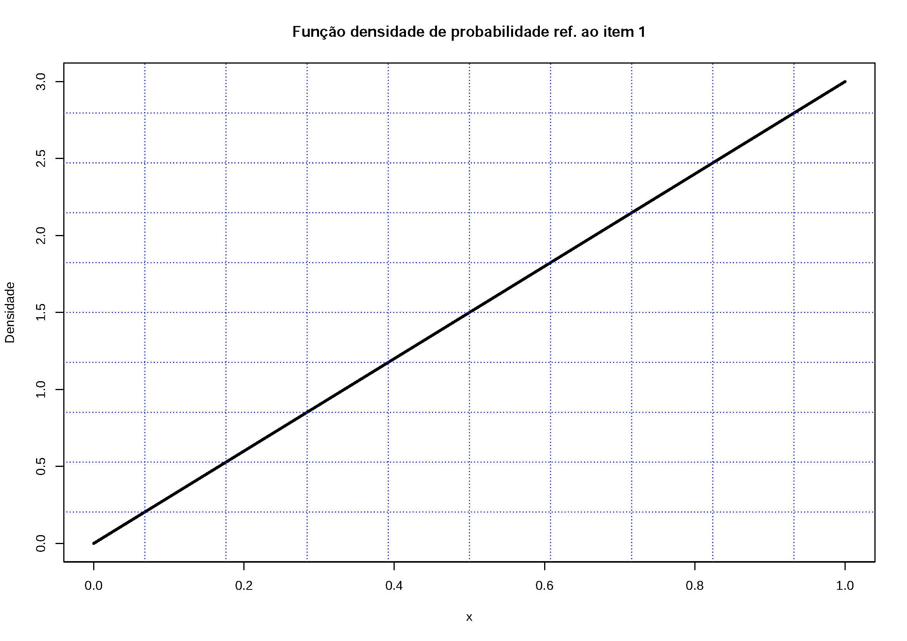
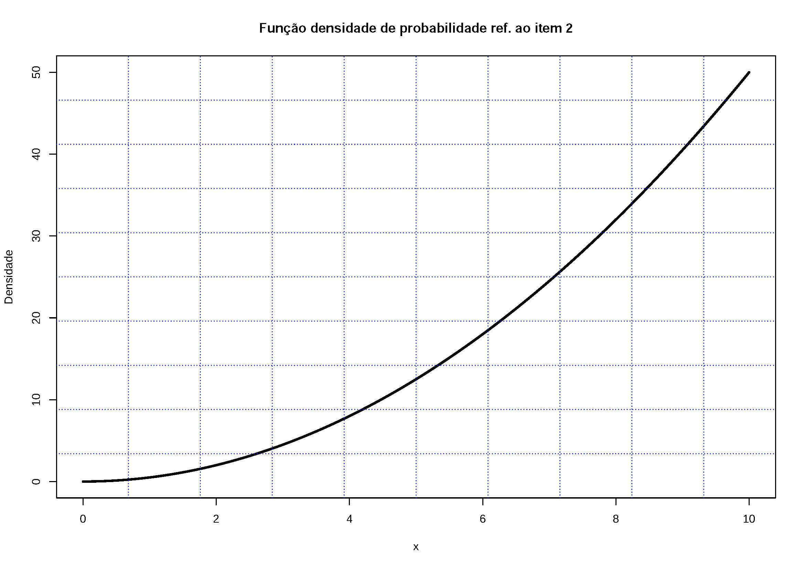
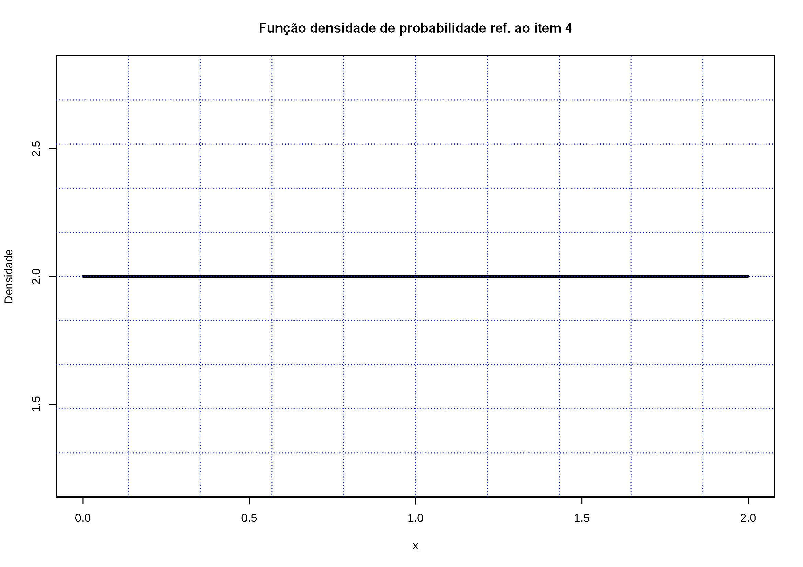
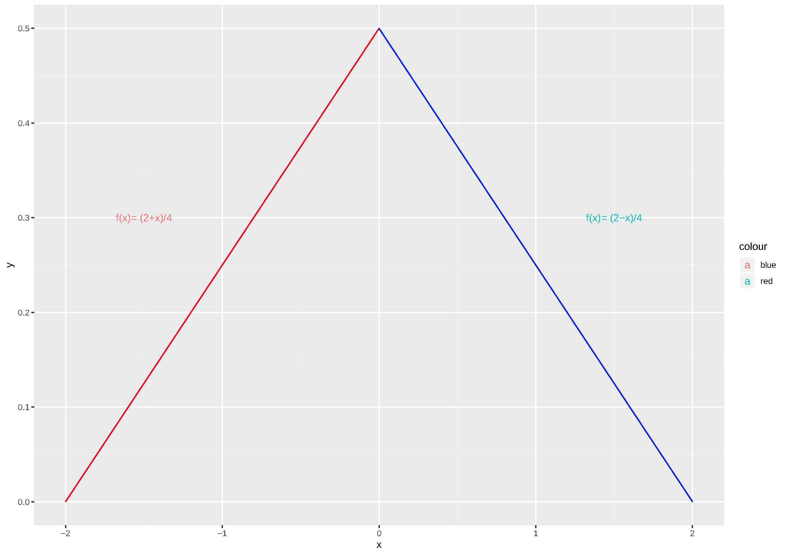

```{r, echo=FALSE, include=FALSE}
colFmt <- function(x,color) {
  
  outputFormat <- knitr::opts_knit$get("rmarkdown.pandoc.to")
  
  if(outputFormat == 'latex') {
    ret <- paste("\\textcolor{",color,"}{",x,"}",sep="")
  } else if(outputFormat == 'html') {
    ret <- paste("<font color='",color,"'>",x,"</font>",sep="")
  } else {
    ret <- x
  }

  return(ret)
}

#uso>>>> `r colFmt("REG",'red')`, 


```


```{r , echo = FALSE, include=FALSE}
library(texPreview)
library(kableExtra)
library(knitr)
knitr::opts_chunk$set(echo = TRUE)
```


# Introdução a variáveis aleatórias 

\

Ao realizar um experimento aleatório frequentemente estamos interessados mais em alguma função do resultado do que no próprio resultado em si:

>Ao lançar dois dados, podemos estar interessados na soma "7", sem nos importar se isso foi decorrente de (1,6),(2,5),(3,4),(4,3),(5,2) ou (6,1).

>De forma semelhante, ao lançar três vezes uma moeda, podemos estar interessados no número total de "2 caras" (KK) que ocorre, sem nos preocuparmos se isso decorreu da sequência (K,K,C),(K,C,K) ou (C,K,K).

>Da mesma forma, ao planejar uma família de três filhos, podemos estar interessados em ter exatamente 2 filhos do sexo masculino (MM), sem nos importar se isso resultou de  (F,M,M), (M,F,M) ou (M,M,F).

\

Essas quantidades de interesse, ou mais formalmente, essas funções de valor real definidas no espaço amostral (o conjunto de todos os possíveis resultados do experimento), são conhecidas como variáveis aleatórias.

\

Em outras palavras, uma função $X$ (geralmente representada por uma letra maiúscula) que associa cada elemento $\omega$ pertencente ao espaço amostral $\Omega$ um número real é denominada, de forma mais precisa, como uma variável aleatória ou função estocástica.

\


$$
X (\Omega) \to \mathcal{R}_{X} \text{, estando } \mathcal{R}_{X}\subseteq \mathcal{R}
$$

\

```{r, echo=FALSE, out.width='50%', fig.align='center', fig.cap="Variável aleatória"}



```

\


O *domínio* dessa função ($X$) é o conjunto de todos os possíveis valores numéricos de interesse do experimento aleatório e seu *contradomínio* está em $\mathbb{R}$. 

\

>Exemplo 1: considere o espaço amostral do experimento aleatório relacionado ao sexo do bebê em três gestações bem sucedidas:
$\Omega=\{\omega_{1}:(FFF), \omega_{2}:(FFM),\omega_{3}:(FMF), \omega_{4}:(MFF),\\
\omega_{5}:(FMM), \omega_{6}:(MFM), \omega_{7}:(MMF), \omega_{8}:(MMM)\}.$
Se estivermos interessados no número de nascimentos do sexo masculino, podemos definir a função $X$ para associar cada elemento $\omega_{i}$ em $\Omega$ a um valor $x_{i} \in \mathbb{R}$ que apresentará os seguintes resutados:
$X(FFF)=0; X(FFM)=1; X(FMF)=1; X(MFF)=1;\\
X(FMM)=2; X(MFM)=2; X(MMF)=2; X(MMM)=3$
$\mathcal{R}_{X}=\{x_{1}=0; x_{2}=1; x_{3}=2; x_{4}=3\}\subseteq \mathcal{R}$

\

>Exemplo 2: considere o espaço amostral do experimento aleatório relacionado à sobrevivência de paciente ao final de 1 dia em uma UTI com quatro leitos:
$\Omega=\{(0,0,0,0),(0,0,0,1),(0,0,1,0),(0,0,1,1),\\
(0,1,0,0),(0,1,0,1),(0,1,1,0),(0,1,1,1),(1,0,0,0),\\
(1,0,0,1),(1,0,1,0),(1,0,1,1),(1,1,0,0),(1,1,0,1),\\
(1,1,1,0),(1,1,1,1)\}.$ 
Cada elemento do espaço amostral é uma sequência de quatro valores binários $(x_{1},x_{2},x_{3},x_{4})$, onde: $x_{i}=0$ indica que o paciente no leito $i$ sobreviveu e $x_{i}=1$ caso contrário.
Se estivermos interessados no número de falecimentos podemos definir a função $X$ para associar cada elemento $\omega_{i}$ em $\Omega$ a um valor $x_{i} \in \mathbb{R}$ que apresentará os seguintes resultados:
$X(0000)=0; X(0001)=1; X(0010)=1; \dots ; X(1111)=4$
$\mathcal{R}_{X}=\{x_{1}=0; x_{2}=1; x_{3}=2; x_{4}=3; x_{5}=4\}\subseteq \mathcal{R}$

\


Existem dois tipos de variáveis aleatórias: **discretas** e **contínuas**:


\

>Os valores possíveis de uma variável aleatória discreta pertencem a um conjunto finito ou infinito enumerável, como $\{0,1,2, \dots \}$. Exemplos incluem: o número de acidentes em uma semana; o número de partículas αα emitidas por uma fonte radioativa em um intervalo de tempo; ou o número de casos de uma doença em um mês. 

\

>Os valores possíveis de uma variável aleatória contínua pertencem a um intervalo contínuo de números reais, como $[a,b]$, $[0,\infty)$ ou $-\infty, \infty)$. Exemplos incluem: o peso ou a altura de um grupo de pessoas; o tempo de vida de uma lâmpada; o tempo de reação a um estímulo; a concentração de álcool em um certo volume de sangue, a temperatura mínima no inverno Antártico.

\


A função aletória $X$ não irá, em geral, simplesmente relacionar os possíveis resultados de interesse do experimento aleatório a números reais. Mas sim computar algumas informações úteis como a probabilidade de sua verificação.

\


## Função massa de probabilidade (*Probability Mass Function - PMF*)


\	

Considere $X$ uma variável aleatória discreta com o contradomínio $x_{1},x_{2},x_{3}, \dots x_{n} \dots$. Uma  _função (de distribuição) de probabilidade_ $f(x)$ é assim denominada se, aplicada a cada um dos possíveis valores $x_{i}$ da variável aleatória $X$, resultar em sua probabilidade de ocorrência. Assim, para $x = x_{i}$, $f(x_{i}) = P(X=x_{i})=p(x{i})$.  

 
\	

Para que essa _função_ $f(x)$ possa ser considerada uma **função de distribuição de probabilidade**, ela precisa necessariamente atender às seguintes condições:

\	

>Postulado do intervalo:

$$
0 \leq f(x_{i}) \leq 1
$$

para qualquer $x_{i} \in \mathcal{R}_{X}$, onde $\mathcal{R}_{X}$ é o contradomínio de $X$.

>Postulado do evento certo:


$$
\sum _{i=1}^{n}f\left(x_{i}\right) = 1.
$$

\	

Equivale afirmar que a probabilidade de ocorrência de um dos valores que a variável aleatória pode assumir está sempre compreendida no intervalo $0 \leq P(X = x_{i}) \leq 1$. E mais, que a soma das probabilidades de todos os possíveis valores de $X$ será 1.

\


>Observação: somente se a soma acma for finita há a posibilidade de se ter probabilidades $p(x_{i})$ iguais para todos $x_{i}$ 

\	

> Exemplo: Suponha que uma moeda seja lançada duas vezes e que $X$ seja a variável aleatória que represente o número de $caras$ verificado. Defina o espaço amostral, associe para cada evento possível o valor da variável aleatória e definda uma função discreta de probabilidade correspondente.

\	

O espaço amostral desse experimento é _S = {(cara,cara), (cara,coroa), (coroa,cara), (coroa,coroa)}_ e a tabela abaixo relaciona o número de **caras** (o valor da variável aleatória $X$) associado a cada evento possível desse experimento:

 
\	

```{=latex }
\begin{table}[]
\resizebox{\linewidth}{!}{
\begin{tabular}{|c|c|c|c|c|}
\hline
Ponto amostral  & (cara,cara) & (cara,coroa) & (coroa,cara) & (coroa,coroa) \\
\hline
$X$ & 2 & 1 & 1 & 0  \\ 
\hline
\end{tabular}
}
\end{table}
```


```{r eval=knitr::is_html_output(), results = "asis", echo = FALSE, message = FALSE}

tex2markdown <- function(texstring) {
  writeLines(text = texstring,
             con = myfile <- tempfile(fileext = ".tex"))
  texfile <- pandoc(input = myfile, format = "html")
  cat(readLines(texfile), sep = "\n")
  unlink(c(myfile, texfile))
}

textable <- "
\\begin{table}[]
\\begin{tabular}{|c|c|c|c|c|}
\\hline
Ponto amostral  & (cara,cara) & (cara,coroa) & (coroa,cara) & (coroa,coroa) \\\\
\\hline
$X$ & 2 & 1 & 1 & 0  \\\\ 
\\hline
\\end{tabular}
\\end{table}
"

tex2markdown(textable)
```


\	

As probabilidades de ocorrência de cada um desses eventos é: 

\	

\begin{align*}
P(cara,cara) & = \frac{1}{4} \\
P(cara,coroa) & = \frac{1}{4}\\  
P(coroa,cara) & = \frac{1}{4} \\
P(coroa,coroa) & = \frac{1}{4}\\
\end{align*}

 
\	

Para definir uma _função discreta de distribuição de probabilidade_ deveremos associar a cada valor que a variável aleatória $X$ assume sua correspondente _probabilidade de ocorrência_.

 
\begin{align*}
P(X=0) & = P(coroa,coroa) = \frac{1}{4} \\ 	
P(X=1) & = P[(cara,coroa) \cup (coroa,cara)] \\
       & = P(cara,coroa) + P(coroa,cara)\\
       & = \frac{1}{4} + \frac{1}{4} \\
       & = \frac{1}{2} \\
P(X=2) & = P(cara,cara) = \frac{1}{4}
\end{align*}	


\	


```{=latex }
\begin{table}[]
\caption*{Função discreta de probabilidades da variável aleatória X}
\resizebox{0.8\linewidth}{!}{
\begin{tabular}{|c|c|c|c|}
\hline
$x_{k}$   & 0  & 1  & 2 \\
\hline
$P(X=x_{k})=f(x_{k})$ & 1/4  & 1/2 & 1/4  \\ 
\hline
\end{tabular}
}
\end{table}
```
 

 
```{r eval=knitr::is_html_output(), results = "asis", echo = FALSE, message = FALSE}

tex2markdown <- function(texstring) {
  writeLines(text = texstring,
             con = myfile <- tempfile(fileext = ".tex"))
  texfile <- pandoc(input = myfile, format = "html")
  cat(readLines(texfile), sep = "\n")
  unlink(c(myfile, texfile))
}

textable <- "
\\begin{table}[]
\\caption*{Função discreta de probabilidades da variável aleatória X}
\\begin{tabular}{|c|c|c|c|}
\\hline
$x_{k}$   & 0  & 1  & 2 \\\\
\\hline
$P(X=x_{k})=f(x_{k})$ & 1/4  & 1/2 & 1/4  \\\\ 
\\hline
\\end{tabular}
\\end{table}
"

tex2markdown(textable)
```
 
\


```{r,  out.width='60%',  fig.align='center'}

# Valores possíveis para o número de caras
x <- c(0, 1, 2)
# Probabilidades associadas (calculadas com o modelo binomial)
p <- c(0.25, 0.5, 0.25)
# Criando o gráfico de barras
barplot(
  p,
  names.arg = x,
  xlab = "x",
  ylab = expression(f(x)),
  col = "gray",
  ylim = c(0, 1),
  main = "Probabilidade de observar caras ao lançar 2 moedas"
)

# Adicionando linhas no eixo y para reforçar a interpretação
abline(h = seq(0, 1, by = 0.25), col = "lightgray", lty = 2)

```

 
\	


Uma _função de distribuição cumulativa_ $F(x)$ para uma variável aleatória $X$ exprime a probabilidade de que a variável aleatória $X$ assuma um valor _menor  ou igual a determinado $x$_ , sendo definida por:


\

$$
F(x) = P(X \leq x)
$$

\	

Propriedades:

\	

1- $0 \leq F(x) \leq 1$  (os valores da função estão no intervalo de probabilidade);   
2- $F(x)$ é não decrescente: $F(x) \leq F(y)$ se $x \leq y$ (a probabilidade cumulativa nunca diminui);
- $F(- \infty) = \underset{x\to -\infty }{lim}F\left(x\right)=0$ (a probabilidade cumulativa no limite inferior é zero); 
4- $F(+ \infty) = \underset{x\to \infty }{lim}F\left(x\right)=1$ (a probabilidade cumulativa no limite superior é um).

\	

>Relação com a Função de Probabilidade:

Para uma variável aleatória discreta $X$, a **função massa de probabilidade** $f(x)$ pode ser derivada da **função de distribuição cumulativa** $F(x)$. Especificamente, para todo $x$ em $(-\infty, \infty)$):

\

$$
f(x) = P(X = x) = F(x) - F(x^-),
$$
\

onde $F(x^-)$ é o valor de $F(x)$ imediatamente **antes** de $x$, considerando a natureza discreta da variável.


\

Além disso, a definição cumulativa da função $F(x)$ para valores discretos $x$ pode ser escrita como:

\


$$
F\left(x\right)=P\left(X\le x\right)=\sum _{u\le n}f\left(u\right),
$$

em que $u$ são os valores possíveis da variável aleatória $X$. Equivale dizer que é a soma sobre todos os valores $u$ assumidos por $X$ para os quais $u \leq x$.


\	

Se $X$ é discreta e assume um número finito de valores $x_{1},x_{2}, \dots, x_{n}$, então sua função de probabilidade cumulativa $F(x)$ será dada por:

\

$$
F(x) =
\begin{cases}
    0, & \text{se } -\infty < x < x_{1}, \\
    f(x_{1}), & \text{se } x_{1} \leq x < x_{2}, \\
    f(x_{1}) + f(x_{2}), & \text{se } x_{2} \leq x < x_{3}, \\
    \vdots & \\
    f(x_{1}) + f(x_{2}) + \dots + f(x_{n}), & \text{se } x_{n} \leq x < \infty.
\end{cases}
$$

\

Essa expressão mostra que $F(x)$ é obtida pela soma cumulativa das probabilidades associadas aos valores discretos de $X$, até um ponto $x$.

\	


> Exemplo: Suponha que uma moeda seja lançada duas vezes e que $X$ seja a variável aleatória que represente o número de **caras** verificado. Especifique sua função de probabilidade cumulativa dessa variável aleatória e apresente seu gráfico.

\	

```{=latex }
\begin{table}[]
\resizebox{0.6\linewidth}{!}{
\begin{tabular}{|c|c|c|c|}
\hline
$x_{k}$  & 0 & 1 &  2  \\
\hline
$P(X=x_{k})=f(x_{k})$ & 1/4  & 1/2 & 1/4  \\
\hline
\end{tabular}
}
\end{table}
```

 
 
```{r eval=knitr::is_html_output(), results = "asis", echo = FALSE, message = FALSE}

tex2markdown <- function(texstring) {
  writeLines(text = texstring,
             con = myfile <- tempfile(fileext = ".tex"))
  texfile <- pandoc(input = myfile, format = "html")
  cat(readLines(texfile), sep = "\n")
  unlink(c(myfile, texfile))
}

textable <- "
\\begin{table}[]
\\begin{tabular}{|c|c|c|c|}
\\hline
$x_{k}$  & 0 & 1 &  2  \\\\
\\hline
$P(X=x_{k})=f(x_{k})$ & 1/4  & 1/2 & 1/4  \\\\
\\hline
\\end{tabular}
\\end{table}
"

tex2markdown(textable)
```

 
 
\	

Sua função de probabilidade cumulativa é dada por:


\	


\begin{flalign}
F(x)=
\begin{cases}
		0                \hspace{1cm} x < 0 \\
		\frac{1}{4}  \hspace{1cm} 0 \leq x < 1  \\
		\frac{3}{4}  \hspace{1cm} 1  \leq x <  2 \\
		1                \hspace{1cm} 2 \leq x
\end{cases}
\end{flalign}


 
\	

O gráfico de sua função de probabilidade cumulativa é:

 
\	

```{r,  out.width='60%',  fig.align='center'}
# Valores possíveis para o número de caras
x <- c(0, 1, 2)

# Probabilidades associadas (calculadas com o modelo binomial)
p <- c(0.25, 0.5, 0.25)

# Probabilidade acumulada
p_cumulative <- cumsum(p)

# Criando o gráfico de probabilidade acumulada com linhas verticais
plot(
  x,
  p_cumulative,
  type = "s", # Tipo "steps" para probabilidade acumulada
  xlab = "x",
  ylab = expression(F(x)),
  ylim = c(0, 1),
  xlim = c(0, 3), # Expandido para incluir margens
  main = "Função de distribuição acumulada (CDF)",
  col = "blue",
  lwd = 2,
  axes = FALSE # Desabilita os eixos padrão para customização
)

# Adicionando linhas verticais para conectar os valores
segments(
  x0 = x[-1], # Exclui o primeiro valor (X=0)
  y0 = c(0, p_cumulative[-length(p_cumulative)])[-1], # Exclui o valor inicial (F(0))
  x1 = x[-1],
  y1 = p_cumulative[-1], # Exclui o valor inicial (F(0))
  col = "red",
  lty = 2 # Linhas tracejadas
)

# Adicionando bolinhas abertas nos limites inferiores (apenas X > 0)
points(x[-1], c(0, p_cumulative[-length(p_cumulative)])[-1], pch = 1, col = "blue", cex = 1.5)

# Adicionando bolinhas fechadas no limite superior de cada degrau
points(x, p_cumulative, pch = 16, col = "blue", cex = 1.5)

# Customizando o eixo X
axis(1, at = 0:3, labels = 0:3)

# Customizando o eixo Y com frações
axis(2, at = c(0, 0.25, 0.5, 0.75, 1), labels = c("0", "1/4", "1/2", "3/4", "1"), las = 1)

# Adicionando grades para facilitar a interpretação
grid(nx = NULL, ny = NULL, col = "lightgray", lty = "dotted")


```


## Função de densidade de probabilidade (*Probability Density Function - PDF*)
 


Considerem os espaços amostrais a seguir ($\Omega_{1},\Omega_{2},\Omega_{3},\Omega_{4},\Omega_{5}$) representativos de 4 experimentos aleatórios e admitam também que todos os eventos possíveis são equiprováveis. 

 
\	


```{r, echo=FALSE, out.width='60%', fig.align='center', fig.cap="Diferentes espaços amostrais de um experimento aleatório (por razões gráficas desprezem o espaço fora dos círculos"}



```


 
\	

Interpretem o último deles como um espaço amostral formado por $\infty$ pontos amostrais.  


 
\	

Os eventos que compõem os quatro primeiros espaços amostrais são variável aleatória discretas. 

\

Discretas pois permitem a contagem dos possíveis valores (finitos ou infinitos contáveis) aleatórios que o experimento pode assumir. Mas no quinto espaço amostral temos incontáveis possibilidades.


 
\	

Um _espaço amostral_ com essa característica é representativo de uma _variável aleatória contínua_.  

 
\	

Sendo todos os eventos representados nos espaços amostrais **equiprováveis**, comparemos as probabilidades associadas a cada um desses possíveis resultados.

\

 
Em $\Omega_{1}$, $P(\omega_{1})=1$  
Em $\Omega_{2}$, $P(\omega_{1})=P(\omega_{2})=P(\omega_{3})=P(\omega_{4})=0,50$  
Em $\Omega_{3}$, $P(\omega_{1})=P(\omega_{2})=...=P(\omega_{16})=0,0625$  
Em $\Omega_{4}$, $P(\omega_{1})=P(\omega_{2})=...=P(\omega_{64})=0,015625$  
Em $\Omega_{5}$, $P(\omega_{n}) \rightarrow 0$, à medida que o número de eventos $n \rightarrow \infty$

\

A probabilidade individual de qualquer evento do quinto espaço amostral ocorrer $\rightarrow 0$.


\


Por essa razão, no caso de variáveis aleatórias contínuas, não faz sentido falar em uma _probabilidade pontual exata_, associada a um resultado específico. Isso ocorre porque, para qualquer valor particular, a probabilidade é sempre igual a zero.


\


Experimentos aleatórios nos quais os possíveis resultados assumem valores resultantes de processos de mensuração tais como, por exemplo, rendas, pesos, velocidades, tempos, comprimentos, pertencentes aos números Reais, podem ser adequadamente modelados por variáveis aleatórias contínuas.


\

Para estes uma função densidade de probabilidade é definida de modo a retornar a probabilidade de ocorrência associada a um intervalo de valores, posto a probabilidade de ocorrência de um valor aleatório contínuo específico $x$ tender a zero: $P(X=x) \to 0$.  

\


A função $f(x)$ é uma função densidade de probabilidade para a variável aleatória contínua $X$  se atende às seguintes condições relacionadas aos axiomas da probabilidade:

\begin{itemize}
    \item $f(x) \ge 0$ para todo $x \in (-\infty, \infty) $ ;
    \item a área definida por $f(x)$ é igual a 1 (área sob $f(x)$ e acima do eixo $x$).
\end{itemize}


\

1- $f(x) \geq 0$, para todo $x \in (-\infty, \infty)$;  
2- A integral da função sobre todo o domínio é igual a 1:

\

$$
\underset{-\infty }{\overset{\infty }{\int }}f\left(x\right)dx = 1
$$.

 
\

Se $X$ é uma variável aleatória contínua, a probabilidade de $X$ assumir qualquer valor exato é $P(X = x) = 0$. No entanto, a **probabilidade intervalar** de $X$ estar entre dois valores distintos, $a$ e $b$, é dada por:

\

$$
P(a < X < b) = \int_{a}^{b} f(x) \, dx.
$$

\

Graficamente, a interpretação de uma função densidade de probabilidade contínua é representada pela **área sob a curva** da função $f(x)$, delimitada pelos valores de interesse $a$ e $b$. Essa área corresponde à probabilidade de $X$ estar no intervalo $(a, b)$.

 
\


```{r, echo=FALSE, out.width='60%', fig.align='center', fig.cap="A área sob a curva de uma função de probabilidade de uma variável contínua entre dois valores quaisquer é a probabilidade de se observar valores entre esses dois pontos"}



```


\

Como $f(x) \geq 0$, a curva da função densidade de probabilidade estará acima do eixo $x$ e a totalidade da área será igual a $1$, conforme 

$$
\underset{-\infty }{\overset{\infty }{\int }}f\left(x\right)dx = 1.
$$ 


\

Para estes uma função densidade de probabilidade é definida de modo a retornar a probabilidade de ocorrência associada a um intervalo de valores, posto a probabilidade exata de ocorrência de um valor aleatório contínuo específico $x$ tender a zero $P(X=x) \to 0$.  

\


A função $f(x)$ é uma função densidade de probabilidade para a variável aleatória contínua $X$  se atende às seguintes condições relacionadas aos axiomas da probabilidade:

\begin{itemize}
    \item $f(x) \ge 0$ para todo $x \in (-\infty, \infty) $ ;
    \item a área definida por $f(x)$ é igual a 1 (área sob $f(x)$ e acima do eixo $x$).
\end{itemize}

\


Para tornar o conceito de densidade mais compreensível admita a função densidade de probabilidade (fdp) a seguir e sua representação gráfica na  Figura  \@ref(fig:fig15) 

\


$$
f(X=x)=
\begin{cases}
2 . x \hspace{0.6cm} \text{para } 0 \le x \le 1 \\
0, \hspace{0.9cm} \text{para qualquer outro x}\\
\end{cases}
$$

\

```{r fig15, echo=FALSE, out.width='60%', fig.align='center', fig.cap="A área definida por (ODA) equivale à probabilidade de $f(X=x)$ no intervalo $0 \\le x \\le 0,50$ é notadamente menor que a área definida por (ABCD) equivalente à probabilidade de $f(X=x)$ no intervalo $0,5 \\le x \\le 1$. Tendo os intervalos [0;0,50] e [0,50; 1,00] igual amplitude, depreende-se que uma fdp é uma função indicadora da concentração massa (probabilidade) nos possíveis valores de $X$"}

knitr::include_graphics("images5/massa.jpg")

```

 
\

A **função de distribuição cumulativa**, definida como $F(x) = P(X \leq x)$, também terá a forma de uma curva, **crescente**, que aumenta continuamente de $0$ para $1$. Essa característica reflete o fato de que, ao longo do eixo $x$, a probabilidade cumulativa acumula todos os valores de $f(x)$ até $x$, de modo que:

\

1. $F(x)$ é **não decrescente** ($F(x_1) \leq F(x_2)$ para $x_{1} \leq x_{2}$);
2. $F(x)$ atinge valores-limite:

\


$$
\lim_{x \to -\infty} F(x) = 0 \quad \text{e} \quad \lim_{x \to \infty} F(x) = 1.
$$ 

Assim, $F(x)$ descreve graficamente a probabilidade acumulada até qualquer valor $x$, reforçando a relação entre a densidade de probabilidade e a probabilidade cumulativa.

\


```{r, echo=FALSE, out.width='60%', fig.align='center', fig.cap="Função de probabilidade cumulativa"}



```


 
\

> Exemplo: Seja a seguinte função e verifique se a função $f(x)$ pode ser a  _função de densidade de probabilidade_ da variável aleatória contínua $X$ e determine qual a probabilidade associada a valores compreendidos no intervalo $0 \leq X \leq \frac{1}{2}$. 

\

\begin{flalign}
f(x)=
\begin{cases}
		2.x    \hspace{1cm} \text{para} \hspace{1cm} 0 \leq x \leq 1 \\
		0             \hspace{1.7cm} \text{fora desse intervalo} \\
\end{cases}
\end{flalign}
	
 
 
\

A resolução deste exemplo será feita de um modo  _geométrico_.

\


```{r, echo=FALSE, out.width='60%', fig.align='center', fig.cap="A probabilidade de se observar valores entre 0 e 1/2 é igual à area sob a função densidade de probabilidade entre esses dois valores"}

# Configuração inicial
x <- seq(0, 1, by = 0.01)  # Valores de x no intervalo [0,1]
f <- 2 * x  # Função f(x) = 2x

# Gráfico da função
plot(x, f, type = "l", col = "blue", lwd = 1.5,
     xlab = "x", ylab = "Densidade (f(x))", 
     main = "Função densidade de probabilidade",
     xlim = c(0, 1), ylim = c(0, 2),
     xaxt = "n", yaxt = "n")

# Adiciona eixos personalizados
axis(1, at = c(0, 0.5, 1), labels = c("0", "1/2", "1"))
axis(2, at = c(0, 2), labels = c("0", "2"))

# Adiciona linhas de referência pontilhadas
segments(0, 2, 1, 2, col = "purple", lty = 2)
segments(1, 0, 1, 2, col = "purple", lty = 2)
segments(0.5, 0, 0.5, 1, col = "purple", lty = 2)

# Área sombreada entre 0 e 1/2
polygon(c(0, seq(0, 0.5, by = 0.01), 0.5),
        c(0, 2 * seq(0, 0.5, by = 0.01), 0),
        col = "gray90", border = NA, density = 20, angle = 45)

# Adiciona pontos finais para clareza
points(c(0, 0.5, 1), c(0, 1, 2), pch = 19, col = "black")


```


\

(a) Verificações para se aceitar a função como uma função de densidade de probabilidade para a variável aleatória $X$:

\

$$
f(x) \geq 0
$$

e, 

$$
\underset{-\infty }{\overset{\infty }{\int }}f\left(x\right)dx = 1
$$

\

Resp.: Atende às duas condições (não assume valores menores que zero e a área sob a reta dessa função é unitária)


\

(b) Cálculo da probabilidade para o intervalo $0 \leq X \leq \frac{1}{2}$ a partir da área do triângulo hachurado ($\frac{base \times altura}{2}$):

\

$$
P ( 0 \leq X \leq \frac{1}{2}) = \frac{1}{2} \times (\frac{1}{2} \times 1 ) = \frac{1}{4} 
$$


\


> Exemplo: Verifique se as funções a seguir atendem os pressupostos necessários para ser uma função densidade de probabilidade (assuma que toda $f(x)=0$ para valores fora dos intervalos especificados):

\


1- $f(x)=3x$ para $0 \le x \le 1$;  
2- $f(x)=\frac{x^{2}}{2}$ para $x \ge 0$;  
3- $f(x) = \frac{(x-3)}{2}$ para $3 \le x \le 5$;  
4- $f(x)=2$ para $0 \le x \le 2$;  
5- 

$$
f(X=x)=
\begin{cases}
	\frac{(2+x)}{4}, \hspace{0.6cm} \text{para } -2 \le x \le 0 \\
	\frac{(2-x)}{4}, \hspace{0.6cm} \text{para } 0 \le x \le 2\\
\end{cases}
$$
6- $f(x)=- \pi$ para $-\pi < x < 0$


\


Os gráficos das funções densidade de probabilidade são:


```{r fig16, echo=FALSE, out.width='60%', fig.align='center', fig.cap="A área definida por $f(x)$ no intervalo $0 \\le x \\le 1$ é maior que 1. Por essa razão não pode ser uma fdp"}



```

\

```{r fig17, echo=FALSE, out.width='60%', fig.align='center', fig.cap="A área definida por $f(x)$ no intervalo $x \\ge 0$ é maior que 1. Por essa razão não pode ser uma fdp"}



```

\

```{r fig18, echo=FALSE, out.width='60%', fig.align='center', fig.cap="Os valores assumidos por $f(x)$ são $\\ge 0$ e a área definida por f(x) o intervalo $3 \\le x \\le 5$ é igual a 1. Por essa razão pode ser uma fdp"}

knitr::include_graphics("images5/item3.jpg")

```


\

```{r fig19, echo=FALSE, out.width='60%', fig.align='center', fig.cap="A área definida por $f(x)$ no intervalo $0 \\le x \\le 2$ é maior que 1. Por essa razão não pode ser uma fdp"}



```

\

```{r fig20, echo=FALSE, out.width='60%', fig.align='center', fig.cap="Os valores assumidos por $f(x)$ são $\\ge 0$ e a área definida por $f(x)$ nos intervalos $-2 \\le x \\le 0$ e $0 \\le x \\le 2$ é igual a 1. Pode ser uma fdp"}



```


\

```{r fig21, echo=FALSE, out.width='60%', fig.align='center', fig.cap="Os valores assumidos por f(x) são $<0$. Por esa razão não pode ser uma fdp."}

knitr::include_graphics("images5/item6.jpg")

```


\

> Exemplo: A dureza $X$ de uma peça de aço pode ser entendida como sendo uma variável aleatória contínua uniforme no intervalo $(50,70)$ da escala Rockwel. Calcule a esperança e a variâcia dessa variável aleatória e a probabilidade de que uma peça tenha dureza entre 55 e 60? 

\


Definindo a variável aleatória contínua $X:X \sim U(50,70)$:

\

$$
f(X=x)=
\begin{cases}
\frac{1}{70-50}=\frac{1}{20}, \hspace{0.6cm} \text{para } 50 \le x \le 70 \\
0, \hspace{1cm} \text{para qualquer outro x}\\
\end{cases}
$$

\

Sua esperança e a variância são:

\

- Esperança: $E(X) = \mu = \frac{(70+50)}{2}=60$; e,  
- Variância: $Var(X) =  \frac{(70-50)^{2} }{12}=33,33$.

\


```{r fig22, echo=FALSE, out.width='60%', fig.align='center', fig.cap="Os valores assumidos por $f(x)$ são $\\ge 0$ e a área definida por $f(x)$ no intervalo $50 \\le x \\le 70$ é igual a 1. Por essa razão pode ser uma fdp. A probabilidade pedida equivale à área $P(60 \\le x \\le 55) = (60-55) .  0,05=0,25$."}

knitr::include_graphics("images5/exerc_15.jpg")

```


\


## Esperança e variância de uma variável aleatória discreta


Coletando-se dados podemos analisá-los, por exemplo, em termos de sua distribuição, pelas estatísticas da média e variância.


  
De maneira análoga procedemos com variáveis aleatórias (discretas ou contínuas) onde dispomos das  _probabilidades_ de ocorrência associadas a cada um dos valores (discretos ou infinitos numeráveis) que ela pode assumir. 

 
\

A  _esperança matemática_ (valor esperado ou expectância) de uma variável aleatória discreta é dada pela  _somatória do produto_ de cada um dos valores que ela pode assumir pela probabilidade associada a cada um desses valores.

 
\

Seja $X$ uma variável aleatória discreta que pode assumir os valores $x_{1},x_{2}, \dots x_{n}$; e sejam $P_{1},P_{2}, \dots, P_{n}$ as respectivas probabilidades associadas às suas ocorrências.

 
\

A esperança da variável $X$, denotada por $E(X)$ será:

\

$$
E\left(X\right)=\sum _{i=1}^{n}{x}_{i}.{P}_{i}
$$

\

Com  _n_ sendo o número de possíveis resultados que a variável  $X$ pode assumir.

 
\

A expressão anterior é semelhante àquela usada para se calcular a média para frequências de dados sendo que agora, no lugar de se utilizar a frequência relativa a cada dado observado, temos as probabilidades dadas por um modelo teórico pressuposto.  


\

Algumas propriedades envolvendo a esperança:

\	
1- Se $c$ é uma contante qualquer, então: $E(c) = c$ ($c \in \mathbb{R}$);  
2- Se $c$ é uma contante qualquer, então: $E(c X) = c . E(X)$ ($c \in \mathbb{R}$);  
3- Se $c$ é uma contante qualquer, então: $E(X \frac{+}{-} c) = E(X) \frac{+}{-} c$ ($c \in \mathbb{R}$);  
4- Se $X$ e $Y$ são duas variáveis aleatórias quaisquer, então: $E(X +/- Y) = E(X) +/- E(Y)$;  
5- Se $X$ e $Y$ são duas variáveis aleatórias independentes quaisquer, então:  $E(X . Y) = E(X). E(Y)$.

 
\

A variância de uma variável aleatória qualquer $X$, denotada por $Var(X)$, será dada por:


\


\begin{align*}
Var\left(X\right) & = \sum_{i=1}^{n} [{x}_{i} - E(X)]^{2}.{P}_{i} 
\end{align*}


\

Algumas propriedades envolvendo a variância:

\	

1- Se $c$ é uma contante qualquer, então: $Var(c)=0$ ($c\in\mathbb{R}$);  


2- Se $c$ é uma contante qualquer, então: $Var(cX)=c^{2}.Var(X)$ ($c\in\mathbb{R}$);  


3- Se $X$ e $Y$ são duas variáveis aleatórias **independentes** quaisquer, então:  $Var(X \pm Y)=Var(X)+Var(Y)$; 
 
 
4- Se $X$ e $Y$ são duas variáveis aleatórias **quaisquer**, então: $Var(X \pm Y)=Var(X)+Var(Y) \pm 2Cov(X,Y)$ (também).
 
\

A covariância ($Cov(X,Y)$) entre duas variáveis aleatórias quaisquer $X$ e $Y$ é dada por:

\

$$
Cov \left(X,Y\right)= E(XY) - E(X)E(Y)
$$


\

\

> Exemplo: Seja $X$ uma variável aleatória discreta que indica o  _número de pontos observados na face superior de um dado_ quando ele é  lançado. Calcule a esperança e a variância dessa variável aleatória.

 
\

```{=latex }
\begin{table}[htbp]
\centering
\caption*{Função discreta de distribuição de probabilidades de $X$}
\begin{tabular}{|c|c|}
\hline
$x_{i}$  & $P(X=x_{i})$ \\
\hline
1 & 1/6 \\
\hline
2 & 1/6 \\
\hline
3 & 1/6 \\
\hline
4 & 1/6 \\
\hline
5 & 1/6 \\
\hline
6 & 1/6 \\
\hline
Total & 1  \\
\hline
\end{tabular}
\end{table}
```


```{r eval=knitr::is_html_output(), results = "asis", echo = FALSE, message = FALSE}

tex2markdown <- function(texstring) {
  writeLines(text = texstring,
             con = myfile <- tempfile(fileext = ".tex"))
  texfile <- pandoc(input = myfile, format = "html")
  cat(readLines(texfile), sep = "\n")
  unlink(c(myfile, texfile))
}

textable <- "
\\begin{table}[htbp]
\\centering
\\caption*{Função discreta de distribuição de probabilidades de $X$}
\\begin{tabular}{|c|c|}
\\hline
$x_{i}$  & $P(X=x_{i})$ \\\\
\\hline
1 &  1/6 \\\\
\\hline
2 & 1/6 \\\\
\\hline
3 & 1/6 \\\\
\\hline
4 & 1/6 \\\\
\\hline
5 & 1/6 \\\\
\\hline
6 & 1/6 \\\\
\\hline
Total & 1  \\\\
\\hline
\\end{tabular}
\\end{table}
"

tex2markdown(textable)
```

 
\

$E(X) = \frac{1}{6} . (1+2+3+4+5+6) = 3,50$ 


\	

\begin{align*}
Var(X) & = (1-3,50)^{2}.(\frac{1}{6}) + (2-3,50)^{2}.(\frac{1}{6}) +\\
       & (3-3,50)^{2}.(\frac{1}{6}) + (4-3,50)^{2}.(\frac{1}{6}) + (5-3,50)^{2}.(\frac{1}{6}) + \\
       & (6-3,50)^{2}.(\frac{1}{6}) \\
       & = 2,90
\end{align*}

 
\

> Exemplo: Uma empresa de caminhões de aluguel possui uma frota composta de 4 veículos. O aluguel é cobrado por diária de uso de um caminhão e a função de distribuição de probabilidade de locações diárias está a seguir especificada. Calcule a esperança e a variância de locação diária dessa empresa.

\

```{=latex }
\begin{table}[htbp]
\centering
\caption*{Função discreta de distribuição de probabilidade de locações diárias}
\begin{tabular}{|c|c|}
\hline
$x_{i}$  & $P(X=x_{i})$  \\
\hline
0 & 0,10 \\
\hline
1 & 0,20 \\
\hline
2 & 0,30 \\
\hline
3 & 0,30 \\
\hline
4 & 0,10 \\
\hline
\end{tabular}
\end{table}
```

 
```{r eval=knitr::is_html_output(), results = "asis", echo = FALSE, message = FALSE}

tex2markdown <- function(texstring) {
  writeLines(text = texstring,
             con = myfile <- tempfile(fileext = ".tex"))
  texfile <- pandoc(input = myfile, format = "html")
  cat(readLines(texfile), sep = "\n")
  unlink(c(myfile, texfile))
}

textable <- "
\\begin{table}[htbp]
\\centering
\\caption*{Função discreta de distribuição de probabilidade de locações diárias}
\\begin{tabular}{|c|c|}
\\hline
$x_{i}$  & $P(X=x_{i})$  \\\\
\\hline
0 & 0,10 \\\\
\\hline
1 & 0,20 \\\\
\\hline
2 & 0,30 \\\\
\\hline
3 & 0,30 \\\\
\\hline
4 & 0,10 \\\\
\\hline
\\end{tabular}
\\end{table}
"

tex2markdown(textable)
```
 

 
 
\


$E(X) = (0 . 0,10) + (1 . 0,20) + 2 . 0,30) + (3 . 0,30) + (4 . 0,10) = 2,10$ (caminhões por dia) 

\

\begin{align*}
Var(X) & = (0-2,10)^{2}.0,10 + (1-2,10)^{2}.0,20 + (2-2,10)^{2}.0,30 + \\
       & (3-2,10)^{2}.0,30 + (4-2,10)^{2}.0,10 \\
       & = 1,29^{1}
\end{align*}


$^{1}$: (caminhões por dia)$^{2}$


## Esperança e variância de uma variável aleatória contínua
 


A esperança e a variância de uma variável aleatória contínua são dadas, respectivamente, por: 


\


$$
E(X) = \underset{-\infty }{\overset{\infty }{\int }}x.f\left(x\right)dx
$$


\

$$
Var(X) = E\left[ (X - E(X))^{2}  \right] = \underset{-\infty }{\overset{\infty }{\int }} (x-E(X))^{2}.f\left(x\right)dx
$$


