```{r, echo=FALSE, include=FALSE}
colFmt <- function(x,color) {
  
  outputFormat <- knitr::opts_knit$get("rmarkdown.pandoc.to")
  
  if(outputFormat == 'latex') {
    ret <- paste("\\textcolor{",color,"}{",x,"}",sep="")
  } else if(outputFormat == 'html') {
    ret <- paste("<font color='",color,"'>",x,"</font>",sep="")
  } else {
    ret <- x
  }

  return(ret)
}

#uso>>>> `r colFmt("REG",'red')`, 


```


```{r , echo = FALSE, include=FALSE}
library(texPreview)
library(kableExtra)
library(knitr)
knitr::opts_chunk$set(echo = TRUE)
```


# Introdução a variáveis aleatórias{#introducao-a-variaveis-aleatorias}

\

<iframe src="assets/var_aleatorias.html" width="100%" height="500px" style="border:none;"></iframe>

\

Ao realizar um experimento aleatório frequentemente estamos interessados mais em alguma função do resultado do que no próprio resultado em si:

\

>Ao lançar dois dados, podemos estar interessados na soma dos valores das suas faces, sem nos importar de que combinação particular ela resultou.

>Na quantidade de chamadas que chegam a uma central telefônica num intervalo de tempo.

>No lançamento por três vezes de uma moeda, podemos estar interessados no número total de "caras", sem nos preocuparmos de qual sequência particular ele decorreu.

>Na duração (vida útil) de uma lâmpada.

>No número de filhos do sexo masculino ao final de três gestações, sem nos importar de qual sequência particular ele foi resultado.

>No numero de veículos que passam por uma praça de pedágio em uma hora. 


\

Essas quantidades de interesse são formalmente tratadas no contexto do espaço de probabilidade $(\Omega, \mathcal{F}, P)$, composto por três elementos: o espaço amostral $\Omega$, que contém todos os resultados possíveis do experimento; a $\sigma$-álgebra $\mathcal{F}$, que é a coleção de todos os subconjuntos de $\Omega$ aos quais é *possível* atribuir probabilidade — denominados eventos; e a medida de probabilidade $P: \mathcal{F} \to [0,1]$, que associa a cada *evento* um valor em $[0,1]$. 

\


```{r, echo=FALSE, out.width='60%', fig.align='center', fig.cap="Espaço de probabilidade $(\\Omega, \\mathcal{F}, P)$"}

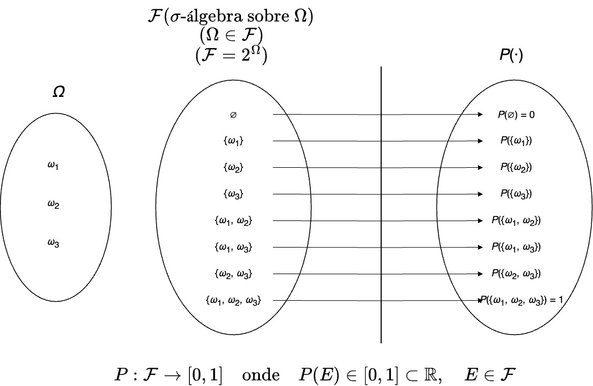

```


\

Um *espaço de probabilidade* $(\Omega, \mathcal{F}, P)$ é composto por três partes:

\

- $\Omega$: o espaço amostral, ou seja, todos os resultados possíveis do experimento aleatório.
- $\mathcal{F}$: uma $\sigma$-álgebra, isto é, a coleção de subconjuntos de $\Omega$ (os eventos) aos quais podemos atribuir probabilidade.
- $P$: a medida de probabilidade, que atribui um número em $[0,1]$ a cada evento de $\mathcal{F}$.

\

De forma mais rigorosa, uma *variável aleatória* é uma *função mensurável* (representada por uma letra maiúscula como $X$) definida sobre o espaço de probabilidade $(\Omega, \mathcal{F}, P)$, que associa cada elemento $\omega \in \Omega$ a um número real:

\

$$
X: (\Omega, \mathcal{F}) \to (\mathbb{R}, \mathcal{B}(\mathbb{R})),
$$

\

em que $\mathcal{B}(\mathbb{R})$ é a $\sigma$-álgebra de Borel, a menor $\sigma$-álgebra que contém todos os intervalos de $\mathbb{R}$.

\

Dizer que $X$ é *mensurável* significa que, para todo $B \in \mathcal{B}(\mathbb{R})$,

\

$$
X^{-1}(B) = \{\omega \in \Omega : X(\omega) \in B\} \in \mathcal{F},
$$

\

ou seja, a pré-imagem de qualquer boreliano é um evento. É isso que garante que probabilidades como $P(X \le x)$ ou $P(a < X \le b)$ estejam bem definidas.

\

O *domínio* dessa função é o espaço amostral $\Omega$, seu *contradomínio* é $\mathbb{R}$, e o conjunto dos valores efetivamente assumidos, $\mathbb{R}_X = X(\Omega)$, é um subconjunto de $\mathbb{R}$.


\

>Exemplo 1: considere o espaço amostral do experimento aleatório relacionado ao sexo dos bebês após três gestações bem sucedidas:

\

$\Omega=\{\omega_{1}:(FFF), \omega_{2}:(FFM),\omega_{3}:(FMF), \omega_{4}:(MFF),\\
\omega_{5}:(FMM), \omega_{6}:(MFM), \omega_{7}:(MMF), \omega_{8}:(MMM)\}.$

\

Se estivermos interessados no número de nascimentos de bebês do sexo masculino, podemos definir a variável aleatória $X$ para associar cada elemento $\omega_{i}$ em $\Omega$ a um valor $x_{i} \in \mathbb{R}$, a qual apresentará os seguintes valores:

\

$X(FFF)=0; X(FFM)=1; X(FMF)=1; X(MFF)=1;\\
X(FMM)=2; X(MFM)=2; X(MMF)=2; X(MMM)=3$

\

$\mathbb{R}_{X}=\{x_{1}=0; x_{2}=1; x_{3}=2; x_{4}=3\}\subseteq \mathbb{R}$

\

>Exemplo 2: considere o espaço amostral do experimento aleatório relacionado à sobrevivência de paciente ao final de 1 dia em uma UTI com quatro leitos:

\

$\Omega=\{(0,0,0,0),(0,0,0,1),(0,0,1,0),(0,0,1,1),\\
(0,1,0,0),(0,1,0,1),(0,1,1,0),(0,1,1,1),(1,0,0,0),\\
(1,0,0,1),(1,0,1,0),(1,0,1,1),(1,1,0,0),(1,1,0,1),\\
(1,1,1,0),(1,1,1,1)\}.$

\

Cada elemento do espaço amostral é uma sequência de quatro valores binários $(b_{1},b_{2},b_{3},b_{4})$, onde: $b_{i}=0$ indica que o paciente no leito $i$ sobreviveu e $b_{i}=1$ caso contrário.

\

Se estivermos interessados no número de falecimentos podemos definir a variável aleatória $X$ para associar cada elemento $\omega_{i}$ em $\Omega$ a um valor $x_{i} \in \mathbb{R}$ que apresentará os seguintes resultados:

\

$X(0000)=0; X(0001)=1; X(0010)=1; \dots ; X(1111)=4$

\

$\mathbb{R}_{X}=\{x_{1}=0; x_{2}=1; x_{3}=2; x_{4}=3; x_{5}=4\}
\subseteq \mathbb{R}$

\

## Variáveis aleatórias discretas e contínuas {#variaveis-aleatorias-discretas-continuas}

\

A depender da natureza do experimento aleatório podemos propor variáveis aleatórias **discretas** ou **contínuas**:


\

>Os valores possíveis de uma **variável aleatória discreta** pertencem a um conjunto finito ou infinito enumerável, como $\{0,1,2, \dots \}$. Exemplos incluem: o número de acidentes em uma semana; o número de partículas α emitidas por uma fonte radioativa em um intervalo de tempo; ou o número de casos de uma doença em um mês. 

\

>Os valores possíveis de uma **variável aleatória contínua** pertencem a um intervalo contínuo de números reais, como $[a,b]$, $[0,\infty)$ ou $(-\infty, \infty)$. Exemplos incluem: o peso ou a altura de um grupo de pessoas; o tempo de vida de uma lâmpada; o tempo de reação a um estímulo; a concentração de álcool em um certo volume de sangue, a temperatura mínima no inverno Antártico.

\


## Função massa (ou distribuição) de probabilidade (*Probability Mass Function - PMF*)


\	

Considere $X$ uma variável aleatória discreta e os possíveis valores que ela pode assumir $X:\{x_{1},x_{2},x_{3}, \dots x_{n} \dots\}$.

\

Uma  _função massa (ou distribuição) de probabilidade_ $f(x)$ de uma variável aleatória é assim denominada quando, aplicada a cada um dos possíveis valores $x_{i}$ que a variável aleatória $X$ assume, associar a probabilidade de sua ocorrência: para $x = x_{i}$, $f(x_{i}) = P(X=x_{i})=p(x{i})$.  

\	

Desse modo, sendo $f(x)$ uma **função de distribuição de probabilidade** de uma variável aleatória ela precisa **necessariamente** atender às seguintes condições:

\	

>Postulado do intervalo: 

$$
0 \leq f(x_{i}) \leq 1
$$

para qualquer $x_{i} \in \mathbb{R}_{X}$, onde $\mathbb{R}_{X}$ é a imagem de $X$ (o conjunto dos valores que $X$ assume).

\

>Postulado do evento certo:


\

$$
\sum _{i=1}^{n}f\left(x_{i}\right) = 1.
$$

\	

Equivale afirmar que a probabilidade de ocorrência de qualquer um dos valores que a variável aleatória pode assumir deve estar sempre compreendida no intervalo $0 \leq P(X = x_{i}) \leq 1$. E mais, que a soma das probabilidades de todos os possíveis valores que a variável aleatória $X$ pode assumir deve ser 1.

\


>Observação: somente se a soma acima for finita há a posibilidade de se ter probabilidades $P(x_{i})$ iguais para todos $x_{i}$ 

\	

> Exemplo: Suponha que uma moeda seja lançada duas vezes e que $X$ seja a variável aleatória que conte o número de $caras$. Defina o espaço amostral, associe para cada evento possível o valor que a variável aleatória assume e definda uma função discreta de probabilidade correspondente.

\	

O espaço amostral desse experimento é _S = {(cara,cara), (cara,coroa), (coroa,cara), (coroa,coroa)}_ e a tabela abaixo relaciona o número de **caras** (o valor da variável aleatória $X$) associado a cada evento possível desse experimento:

 
\	

```{=latex }
\begin{table}[]
\resizebox{\linewidth}{!}{
\begin{tabular}{|c|c|c|c|c|}
\hline
Ponto amostral  & (cara,cara) & (cara,coroa) & (coroa,cara) & (coroa,coroa) \\
\hline
$X$ & 2 & 1 & 1 & 0  \\ 
\hline
\end{tabular}
}
\end{table}
```


```{r eval=knitr::is_html_output(), results = "asis", echo = FALSE, message = FALSE}

tex2markdown <- function(texstring) {
  writeLines(text = texstring,
             con = myfile <- tempfile(fileext = ".tex"))
  texfile <- pandoc(input = myfile, format = "html")
  cat(readLines(texfile), sep = "\n")
  unlink(c(myfile, texfile))
}

textable <- "
\\begin{table}[]
\\begin{tabular}{|c|c|c|c|c|}
\\hline
Ponto amostral  & (cara,cara) & (cara,coroa) & (coroa,cara) & (coroa,coroa) \\\\
\\hline
$X$ & 2 & 1 & 1 & 0  \\\\ 
\\hline
\\end{tabular}
\\end{table}
"

tex2markdown(textable)
```


\	

As probabilidades de ocorrência de cada um desses eventos é: 

\	

\begin{align*}
P(cara,cara) & = \frac{1}{4} \\
P(cara,coroa) & = \frac{1}{4}\\  
P(coroa,cara) & = \frac{1}{4} \\
P(coroa,coroa) & = \frac{1}{4}\\
\end{align*}

 
\	

Para definir uma _função discreta de distribuição de probabilidade_ deveremos associar a cada valor que a variável aleatória $X$ assume sua correspondente _probabilidade de ocorrência_.

\ 
 
\begin{align*}
P(X=0) & = P(coroa,coroa) = \frac{1}{4} \\ 	
P(X=1) & = P[(cara,coroa) \cup (coroa,cara)] \\
       & = P(cara,coroa) + P(coroa,cara)\\
       & = \frac{1}{4} + \frac{1}{4} \\
       & = \frac{1}{2} \\
P(X=2) & = P(cara,cara) = \frac{1}{4}
\end{align*}	


\	


```{=latex }
\begin{table}[]
\caption*{Função discreta de probabilidades da variável aleatória X}
\resizebox{0.8\linewidth}{!}{
\begin{tabular}{|c|c|c|c|}
\hline
$x_{k}$   & 0  & 1  & 2 \\
\hline
$P(X=x_{k})=f(x_{k})$ & 1/4  & 1/2 & 1/4  \\ 
\hline
\end{tabular}
}
\end{table}
```
 

 
```{r eval=knitr::is_html_output(), results = "asis", echo = FALSE, message = FALSE}

tex2markdown <- function(texstring) {
  writeLines(text = texstring,
             con = myfile <- tempfile(fileext = ".tex"))
  texfile <- pandoc(input = myfile, format = "html")
  cat(readLines(texfile), sep = "\n")
  unlink(c(myfile, texfile))
}

textable <- "
\\begin{table}[]
\\caption*{Função discreta de probabilidades da variável aleatória X}
\\begin{tabular}{|c|c|c|c|}
\\hline
$x_{k}$   & 0  & 1  & 2 \\\\
\\hline
$P(X=x_{k})=f(x_{k})$ & 1/4  & 1/2 & 1/4  \\\\ 
\\hline
\\end{tabular}
\\end{table}
"

tex2markdown(textable)
```
 
\


```{r,  out.width='60%',  fig.align='center'}

# Valores possíveis para o número de caras
x <- c(0, 1, 2)
# Probabilidades associadas (calculadas com o modelo binomial)
p <- c(0.25, 0.5, 0.25)
# Criando o gráfico de barras
barplot(
  p,
  names.arg = x,
  xlab = "x",
  ylab = expression(f(x)),
  col = "gray",
  ylim = c(0, 1),
  main = "Probabilidade de observar caras ao lançar 2 moedas"
)

# Adicionando linhas no eixo y para reforçar a interpretação
abline(h = seq(0, 1, by = 0.25), col = "lightgray", lty = 2)

```

 
\	


## Função cumulativa de probabilidade


\


Uma _função de distribuição cumulativa de probabilidades_ $F(x)$ de uma variável aleatória $X$ exprime a probabilidade de que a variável aleatória $X$ assuma um valor _menor  ou igual a determinado $x$_ , sendo definida por:


\

$$
F(x) = P(X \leq x)
$$

\	

Propriedades:

\	

1- $0 \leq F(x) \leq 1$  (os valores da função estão no intervalo de probabilidade);  

2- $F(x)$ é não decrescente: $F(x) \leq F(y)$ se $x \leq y$ (a probabilidade cumulativa nunca diminui);

3- $F(- \infty) = \underset{x\to -\infty }{lim}F\left(x\right)=0$ (a probabilidade cumulativa no limite inferior é zero); 

4- $F(+ \infty) = \underset{x\to \infty }{lim}F\left(x\right)=1$ (a probabilidade cumulativa no limite superior é um).

\	

>Relação com a Função de Probabilidade:

\

Para uma variável aleatória discreta $X$, a **função massa de probabilidade** $f(x)$ pode ser derivada da **função de distribuição cumulativa** $F(x)$. Especificamente, para todo $x$ em $(-\infty, \infty)$:

\

$$
f(x) = P(X = x) = F(x) - F(\bar{x}),
$$
\

onde $F(\bar{x})$ é o valor de $F(x)$ imediatamente **antes** de $x$, considerando a natureza discreta da variável.


\

Além disso, a definição cumulativa da função $F(x)$ para valores discretos $x$ pode ser escrita como:

\


$$
F\left(x\right)=P\left(X\le x\right)=\sum _{u\le x}f\left(u\right),
$$

em que $u$ são os valores possíveis da variável aleatória $X$. Equivale dizer que é a soma sobre todos os valores $u$ assumidos por $X$ para os quais $u \leq x$.


\	

Se $X$ é discreta e assume um número finito de valores $x_{1},x_{2}, \dots, x_{n}$, então sua função de probabilidade cumulativa $F(x)$ será dada por:

\

$$
F(x) =
\begin{cases}
    0, & \text{se } -\infty < x < x_{1}, \\
    f(x_{1}), & \text{se } x_{1} \leq x < x_{2}, \\
    f(x_{1}) + f(x_{2}), & \text{se } x_{2} \leq x < x_{3}, \\
    \vdots & \\
    f(x_{1}) + f(x_{2}) + \dots + f(x_{n}), & \text{se } x_{n} \leq x < \infty.
\end{cases}
$$

\

Essa expressão mostra que $F(x)$ é obtida pela soma cumulativa das probabilidades associadas aos valores discretos de $X$, até um ponto $x$.

\	


> Exemplo: Suponha que uma moeda seja lançada duas vezes e que $X$ seja a variável aleatória que represente o número de **caras** verificado. Especifique sua função de probabilidade cumulativa dessa variável aleatória e apresente seu gráfico.

\	

```{=latex }
\begin{table}[]
\resizebox{0.6\linewidth}{!}{
\begin{tabular}{|c|c|c|c|}
\hline
$x_{i}$  & 0 & 1 &  2  \\
\hline
$f(x_{i})=P(X=x_{i})$ & 1/4  & 1/2 & 1/4  \\
\hline
\end{tabular}
}
\end{table}
```

 
 
```{r eval=knitr::is_html_output(), results = "asis", echo = FALSE, message = FALSE}

tex2markdown <- function(texstring) {
  writeLines(text = texstring,
             con = myfile <- tempfile(fileext = ".tex"))
  texfile <- pandoc(input = myfile, format = "html")
  cat(readLines(texfile), sep = "\n")
  unlink(c(myfile, texfile))
}

textable <- "
\\begin{table}[]
\\begin{tabular}{|c|c|c|c|}
\\hline
$x_{i}$  & 0 & 1 &  2  \\\\
\\hline
$f(x_{i})=P(X=x_{i})$ & 1/4  & 1/2 & 1/4  \\\\
\\hline
\\end{tabular}
\\end{table}
"

tex2markdown(textable)
```

 
 
\	

Sua função de probabilidade cumulativa é dada por:


\	


\begin{flalign}
F(x)=
\begin{cases}
		0                \hspace{1cm} x < 0 \\
		\frac{1}{4}  \hspace{1cm} 0 \leq x < 1  \\
		\frac{3}{4}  \hspace{1cm} 1  \leq x <  2 \\
		1                \hspace{1cm} 2 \leq x
\end{cases}
\end{flalign}


 
\	

O gráfico de sua função de probabilidade cumulativa é:

 
\	

```{r,  out.width='60%',  fig.align='center'}
# Valores possíveis para o número de caras
x <- c(0, 1, 2)

# Probabilidades associadas (calculadas com o modelo binomial)
p <- c(0.25, 0.5, 0.25)

# Probabilidade acumulada
p_cumulative <- cumsum(p)
n <- length(x)

# Limites do eixo x (com margem antes do primeiro e depois do último valor)
x_min <- -1
x_max <- 3

# Valor de F(x) imediatamente antes de cada salto
p_before <- c(0, p_cumulative[-n])

# Gráfico vazio, para desenhar os degraus manualmente
plot(
  NA,
  xlim = c(x_min, x_max),
  ylim = c(0, 1),
  xlab = "x",
  ylab = "",
  main = "Função de distribuição acumulada (CDF)",
  axes = FALSE # Desabilita os eixos padrão para customização
)

# Adicionando grades para facilitar a interpretação
grid(nx = NULL, ny = NULL, col = "lightgray", lty = "dotted")

# Customizando o eixo X (passando por y = 0)
axis(1, at = x_min:x_max, labels = x_min:x_max, pos = 0)

# Customizando o eixo Y com frações (passando por x = 0); o rótulo "0" já aparece no eixo X
axis(2, at = c(0, 0.25, 0.5, 0.75, 1), labels = c("", "1/4", "1/2", "3/4", "1"), las = 1, pos = 0)

# Rótulo F(x) no topo do eixo Y
mtext(expression(F(x)), side = 3, at = 0, line = 0)

# F(x) = 0 antes do primeiro valor
segments(x0 = x_min, y0 = 0, x1 = x[1], y1 = 0, col = "blue", lwd = 2)

# Degraus intermediários: F(x) = F(x_i) para x_i <= x < x_{i+1}
segments(x0 = x[-n], y0 = p_cumulative[-n], x1 = x[-1], y1 = p_cumulative[-n], col = "blue", lwd = 2)

# F(x) = 1 depois do último valor
segments(x0 = x[n], y0 = 1, x1 = x_max, y1 = 1, col = "blue", lwd = 2)

# Linhas verticais tracejadas nos saltos
segments(x0 = x, y0 = p_before, x1 = x, y1 = p_cumulative, col = "red", lty = 2)

# Bolinhas abertas nos limites inferiores de cada salto
points(x, p_before, pch = 21, bg = "white", col = "blue", cex = 1.5)

# Bolinhas fechadas no limite superior de cada degrau
points(x, p_cumulative, pch = 16, col = "blue", cex = 1.5)


```


## Função de densidade de probabilidade (*Probability Density Function - PDF*)
 
\
 


Considerem que os cinco alvos da imagem abaixo sejam como que espaços amostrais ($\Omega_{1},\dots \Omega_{5}$) representativos de 5 experimentos aleatórios nos quais uma pessoa poderá acertar um dardo. 

\

Admitam também também esses espaços amostrais seja equiprováveis.

\

Admitam o último deles como um espaço amostral formado por $\to\infty$ pontos.  

\	


```{r, echo=FALSE, out.width='100%', fig.align='center', fig.cap="Diferentes espaços amostrais de um experimento aleatório."}

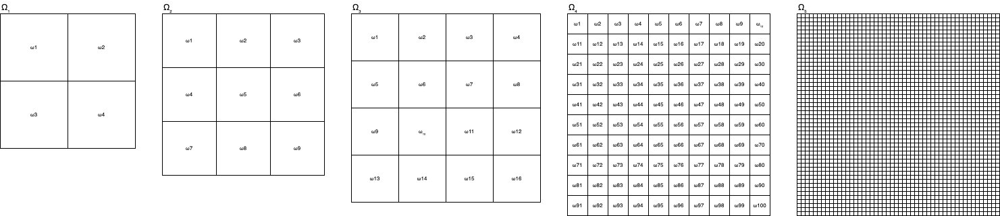

```


\	

Nos primeiros experimentos a probabilidade do arqueiro acertar **especificamente um dos dos possíveis quadradinhos (.)** parece ser bastante alta.  

\

Mas últimos experimentos, a probabilidade do arqueiro acertar **especificamente um dos dos possíveis quadradinhos (.)** é sensivelmente menor.


 
\	

Um _espaço amostral_ com a característica do último pode bem representar um **experimento aleatório continuo**.  

 
\	

Sendo todos os eventos representados nos espaços amostrais **equiprováveis**, comparemos as probabilidades associadas a cada um desses possíveis resultados.

\

 
Em $\Omega_{1}$, $P(\omega_{.})=0,25$  
Em $\Omega_{2}$, $P(\omega_{.})=0,111$  
Em $\Omega_{3}$, $P(\omega_{.})=0,0625$  
Em $\Omega_{4}$, $P(\omega_{.})=0,01$  
Em $\Omega_{5}$, $P(\omega_{.}) \rightarrow 0$, à medida que o número de eventos $n \rightarrow \infty$

\

A probabilidade individual de qualquer evento do quinto espaço amostral ocorrer $\rightarrow 0$.


\


Por essa razão, no caso de variáveis aleatórias contínuas, não faz sentido falar em uma _probabilidade pontual exata_, associada a um resultado específico. Isso ocorre porque, para qualquer valor particular, a probabilidade é sempre igual a zero.


\


Experimentos aleatórios nos quais os possíveis resultados assumem valores resultantes de processos de mensuração tais como, por exemplo, rendas, pesos, velocidades, tempos, comprimentos, pertencentes aos números Reais, podem ser adequadamente modelados por variáveis aleatórias contínuas.


\

Para estes uma _função densidade de probabilidade_ ($f(x)$) é definida de modo a retornar a probabilidade de ocorrência associada a um intervalo de valores, posto a probabilidade de ocorrência de um valor aleatório contínuo específico $x$ tender a zero: $P(X=x) \to 0$.  

\


A função $f(x)$ é uma função densidade de probabilidade para a variável aleatória contínua $X$  se atende às seguintes condições relacionadas aos axiomas da probabilidade:

\begin{itemize}
    \item $f(x) \ge 0$ para todo $x \in (-\infty, \infty) $ ;
    \item a área definida por $f(x)$ é igual a 1 (área sob $f(x)$ e acima do eixo $x$).
\end{itemize}


\

1- $f(x) \geq 0$, para todo $x \in (-\infty, \infty)$;  
2- A integral da função sobre todo o domínio é igual a 1:

\

$$
\underset{-\infty }{\overset{\infty }{\int }}f\left(x\right)dx = 1
$$.

 
\

Sendo $f(x)$ a _função densidade de probabilidade_ da  variável aleatória contínua $X$, a **probabilidade de $X$ assumir valores em um intervalo de valores: $a$ e $b$ ($b>a$)** será dada por:

\

$$
P(a < X < b) = \int_{a}^{b} f(x) \, dx.
$$

\

**Graficamente**, a interpretação de uma função densidade de probabilidade contínua é representada pela **área sob a curva** da função $f(x)$, delimitada pelos valores de interesse da variável aletatória $X$r.

 
\


```{r, echo=FALSE, out.width='60%', fig.align='center', fig.cap="A área sob a curva de uma função de probabilidade de uma variável contínua entre dois valores quaisquer é a probabilidade de se observar valores entre esses dois pontos"}

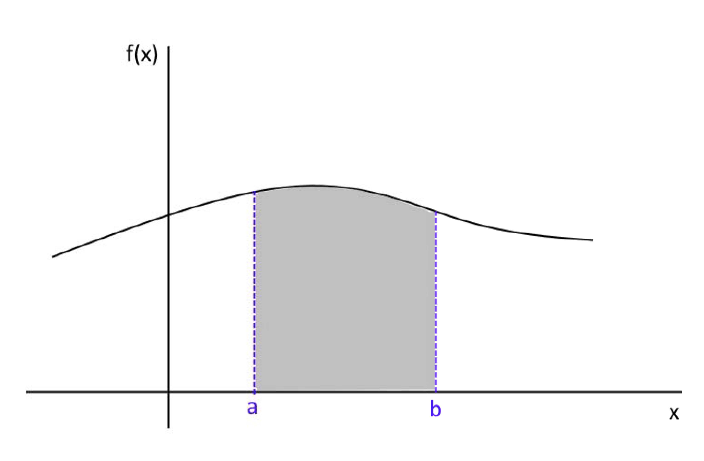

```


\

Se admitirmos $(a \leq X \leq b)$ temos que a área será igual a um (1) posto estarmos calculando a probabilidade do espaço amostral de $X$, o intervalo $(a, b)$.

\

De modo geral, 

\

$$
\underset{-\infty }{\overset{\infty }{\int }}f\left(x\right)dx = 1.
$$ 

\

Para estes uma função densidade de probabilidade é definida de modo a retornar a probabilidade de ocorrência associada a um intervalo de valores, posto a probabilidade exata de ocorrência de um valor aleatório contínuo específico $x$ tender a zero $P(X=x) \to 0$.  

\


A função $f(x)$ é uma função densidade de probabilidade para a variável aleatória contínua $X$  se atende às seguintes condições relacionadas aos axiomas da probabilidade:

\begin{itemize}
    \item $f(x) \ge 0$ para todo $x \in (-\infty, \infty) $ ;
    \item a área definida por $f(x)$ é igual a 1 (área sob $f(x)$ e acima do eixo $x$).
\end{itemize}

\


Para tornar o conceito de densidade mais compreensível admita a função densidade de probabilidade (fdp) a seguir e sua representação gráfica na  Figura  \@ref(fig:fig15) 

\


$$
f(X=x)=
\begin{cases}
2 . x \hspace{0.6cm} \text{para } 0 \le x \le 1 \\
0, \hspace{0.9cm} \text{para qualquer outro x}\\
\end{cases}
$$

\

```{r fig15, echo=FALSE, out.width='60%', fig.align='center', fig.cap="A área definida por (ODA) equivale à probabilidade de $f(X=x)$ no intervalo $0 \\le x \\le 0,50$ é notadamente menor que a área definida por (ABCD) equivalente à probabilidade de $f(X=x)$ no intervalo $0,5 \\le x \\le 1$. Tendo os intervalos [0;0,50] e [0,50; 1,00] igual amplitude, depreende-se que uma fdp é uma função indicadora da concentração massa (probabilidade) nos possíveis valores de $X$"}

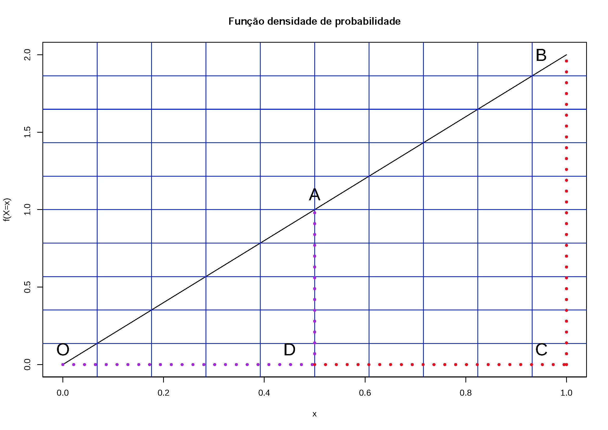

```

 
\

A **função de distribuição cumulativa**, definida como $F(x) = P(X \leq x)$, também terá a forma de uma curva, **crescente**, que aumenta continuamente de $0$ para $1$. Essa característica reflete o fato de que, ao longo do eixo $x$, a probabilidade cumulativa acumula todos os valores de $f(x)$ até $x$, de modo que:

\

1. $F(x)$ é **não decrescente** ($F(x_1) \leq F(x_2)$ para $x_{1} \leq x_{2}$);
2. $F(x)$ atinge valores-limite:

\


$$
\lim_{x \to -\infty} F(x) = 0 \quad \text{e} \quad \lim_{x \to \infty} F(x) = 1.
$$ 

Assim, $F(x)$ descreve graficamente a probabilidade acumulada até qualquer valor $x$, reforçando a relação entre a densidade de probabilidade e a probabilidade cumulativa.

\


```{r, echo=FALSE, out.width='60%', fig.align='center', fig.cap="Função de probabilidade cumulativa"}

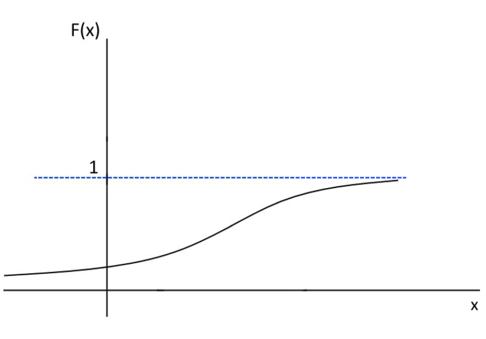

```


 
\

> Exemplo: Seja a seguinte função e verifique se a função $f(x)$ pode ser a  _função de densidade de probabilidade_ da variável aleatória contínua $X$ e determine qual a probabilidade associada a valores compreendidos no intervalo $0 \leq X \leq \frac{1}{2}$. 

\

\begin{flalign}
f(x)=
\begin{cases}
		2.x    \hspace{1cm} \text{para} \hspace{1cm} 0 \leq x \leq 1 \\
		0             \hspace{1.7cm} \text{fora desse intervalo} \\
\end{cases}
\end{flalign}
	
 
 
\

A resolução deste exemplo será feita de um modo  _geométrico_.

\


```{r, echo=FALSE, out.width='60%', fig.align='center', fig.cap="A probabilidade de se observar valores entre 0 e 1/2 é igual à area sob a função densidade de probabilidade entre esses dois valores"}

# Configuração inicial
x <- seq(0, 1, by = 0.01)  # Valores de x no intervalo [0,1]
f <- 2 * x  # Função f(x) = 2x

# Gráfico da função
plot(x, f, type = "l", col = "blue", lwd = 1.5,
     xlab = "x", ylab = "Densidade (f(x))", 
     main = "Função densidade de probabilidade",
     xlim = c(0, 1), ylim = c(0, 2),
     xaxt = "n", yaxt = "n")

# Adiciona eixos personalizados
axis(1, at = c(0, 0.5, 1), labels = c("0", "1/2", "1"))
axis(2, at = c(0, 2), labels = c("0", "2"))

# Adiciona linhas de referência pontilhadas
segments(0, 2, 1, 2, col = "purple", lty = 2)
segments(1, 0, 1, 2, col = "purple", lty = 2)
segments(0.5, 0, 0.5, 1, col = "purple", lty = 2)

# Área sombreada entre 0 e 1/2
polygon(c(0, seq(0, 0.5, by = 0.01), 0.5),
        c(0, 2 * seq(0, 0.5, by = 0.01), 0),
        col = "gray90", border = NA, density = 20, angle = 45)

# Adiciona pontos finais para clareza
points(c(0, 0.5, 1), c(0, 1, 2), pch = 19, col = "black")


```


\

(a) Verificações para se aceitar a função como uma função de densidade de probabilidade para a variável aleatória $X$:

\

$$
f(x) \geq 0
$$

e, 

$$
\underset{-\infty }{\overset{\infty }{\int }}f\left(x\right)dx = 1
$$

\

Resp.: Atende às duas condições (não assume valores menores que zero e a área sob a reta dessa função é unitária)


\

(b) Cálculo da probabilidade para o intervalo $0 \leq X \leq \frac{1}{2}$ a partir da área do triângulo hachurado ($\frac{base \times altura}{2}$):

\

$$
P ( 0 \leq X \leq \frac{1}{2}) = \frac{1}{2} \times (\frac{1}{2} \times 1 ) = \frac{1}{4} 
$$


\


> Exemplo: Verifique se as funções a seguir atendem os pressupostos necessários para ser uma função densidade de probabilidade (assuma que toda $f(x)=0$ para valores fora dos intervalos especificados):

\


1- $f(x)=3x$ para $0 \le x \le 1$;  
2- $f(x)=\frac{x^{2}}{2}$ para $x \ge 0$;  
3- $f(x) = \frac{(x-3)}{2}$ para $3 \le x \le 5$;  
4- $f(x)=2$ para $0 \le x \le 2$;  
5- 

$$
f(X=x)=
\begin{cases}
	\frac{(2+x)}{4}, \hspace{0.6cm} \text{para } -2 \le x \le 0 \\
	\frac{(2-x)}{4}, \hspace{0.6cm} \text{para } 0 \le x \le 2\\
\end{cases}
$$
6- $f(x)=- \pi$ para $-\pi < x < 0$


\


Os gráficos das funções densidade de probabilidade são:


```{r fig16, echo=FALSE, out.width='60%', fig.align='center', fig.cap="A área definida por $f(x)$ no intervalo $0 \\le x \\le 1$ é maior que 1. Por essa razão não pode ser uma fdp"}


```

\

```{r fig17, echo=FALSE, out.width='60%', fig.align='center', fig.cap="A área definida por $f(x)$ no intervalo $x \\ge 0$ é maior que 1. Por essa razão não pode ser uma fdp"}

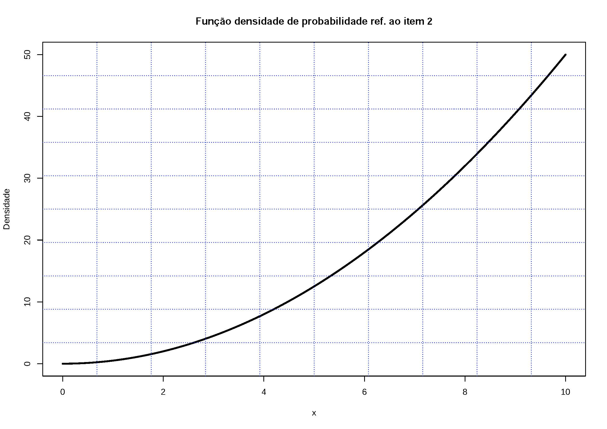

```

\

```{r fig18, echo=FALSE, out.width='60%', fig.align='center', fig.cap="Os valores assumidos por $f(x)$ são $\\ge 0$ e a área definida por f(x) o intervalo $3 \\le x \\le 5$ é igual a 1. Por essa razão pode ser uma fdp"}

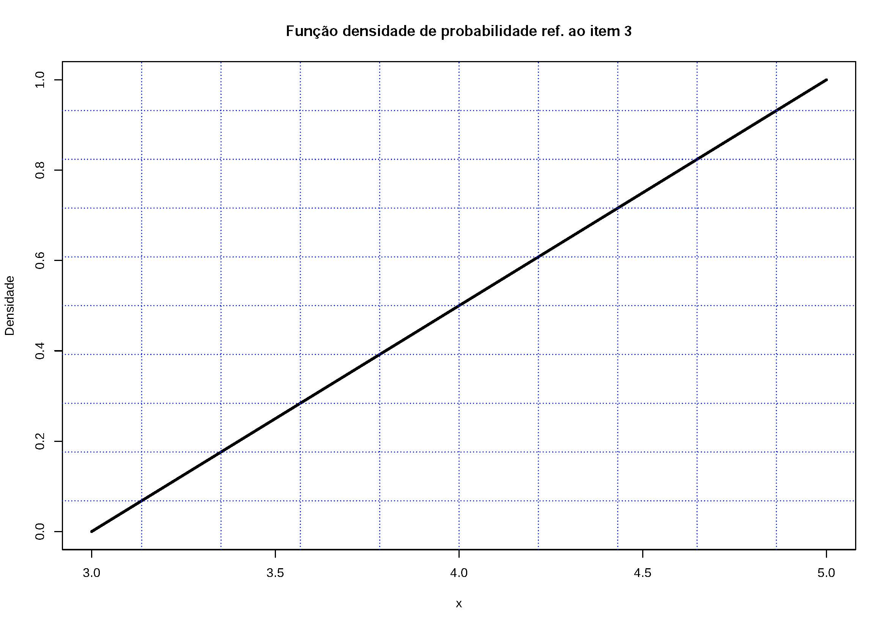

```


\

```{r fig19, echo=FALSE, out.width='60%', fig.align='center', fig.cap="A área definida por $f(x)$ no intervalo $0 \\le x \\le 2$ é maior que 1. Por essa razão não pode ser uma fdp"}

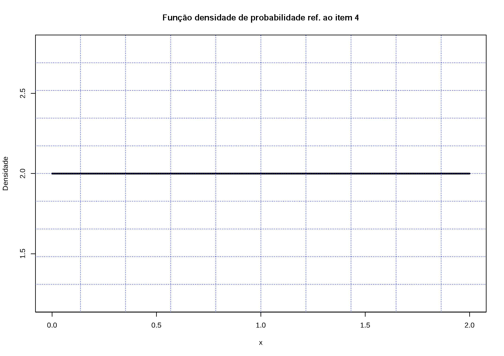

```

\

```{r fig20, echo=FALSE, out.width='60%', fig.align='center', fig.cap="Os valores assumidos por $f(x)$ são $\\ge 0$ e a área definida por $f(x)$ nos intervalos $-2 \\le x \\le 0$ e $0 \\le x \\le 2$ é igual a 1. Pode ser uma fdp"}

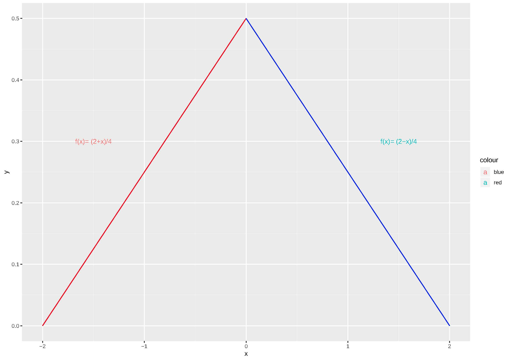

```


\

```{r fig21, echo=FALSE, out.width='60%', fig.align='center', fig.cap="Os valores assumidos por f(x) são $<0$. Por esa razão não pode ser uma fdp."}

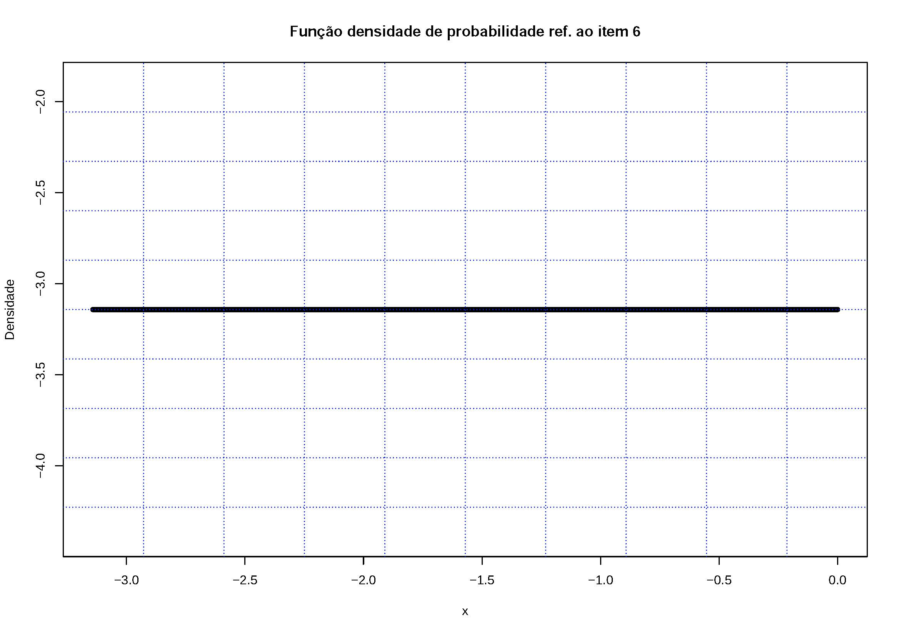

```


\


\


> **Exemplo:** As alturas $X$ (em metros) de um grupo de indivíduos têm as seguintes estatísticas: $a = 1,40$, $b = 1,85$ e $c = 1,625$ (alturas mínima, máxima e média).
> Determinar uma **função densidade de probabilidade (PDF) triangular** $f(x)$ para as alturas, com base nas estatísticas acima (o triângulo tem base no intervalo $[a, b] = [1,40;\ 1,85]$ e vértice superior em $x = c = 1,625$).
\

\

- Condição de área unitária: toda *PDF* deve ter área total igual a 1:

\

$$
\int_{-\infty}^{\infty} f(x)\,dx = 1.
$$

\

A área de um triângulo é dada por $\dfrac{\text{base} \times \text{altura}}{2}$. Sendo $h$ a altura do triângulo (o valor de $f(x)$ no vértice):

\

$$
\frac{(b - a) \cdot h}{2} = 1
\quad\Longrightarrow\quad
h = \frac{2}{b - a} = \frac{2}{1,85 - 1,40} = \frac{2}{0,45} \approx 4,444.
$$

\

A *PDF* será formada por dois segmentos de reta:

- $f_1(x)$: sobe de $(1,40;\ 0)$ até $(1,625;\ 4,444)$
- $f_2(x)$: desce de $(1,625;\ 4,444)$ até $(1,85;\ 0)$

\

>Segmento $f_1(x)$: 

\

- Coeficiente angular:

\

$$
b_{1} = \frac{4,444 - 0}{1,625 - 1,40} = \frac{4,444}{0,225} \approx 19,75111
$$

\

- Coeficiente linear, usando o ponto $(1,40;\ 0)$:

\

$$
0 = 19,75111 \times 1,40 + a_1
\quad\Longrightarrow\quad
a_1 \approx -27,65155
$$
\

Assim, 

\


$$
f_1(x) = a_1 + b_1 \cdot x \\
f_1(x) = - 27,65155 + 19,75111 \cdot x 
$$
\

>Segmento $f_2(x)$

\

- Coeficiente angular:

\

$$
b_2 = \frac{0 - 4,444}{1,85 - 1,625} = -\frac{4,444}{0,225} \approx -19,75111
$$
\


- Coeficiente linear, usando o ponto $(1,85;\ 0)$:
\


$$
0 = -19,75111 \times 1,85 + a_2
\quad\Longrightarrow\quad
a_2 \approx 36,53955
$$

\

Assim, 

\


$$
f_2(x) = a_2 + b_2 \cdot x \\
f_2(x) = 36,53955 -19,75111 \cdot x. 
$$

\

```{r grafico, fig.width=8, fig.height=4, fig.cap="PDF triangular das alturas"}

plot(NA, xlim = c(1.2, 2.05), ylim = c(0, 4.5),
     xlab = "x (alturas em m)", ylab = "f(x): densidade",
     main = "PDF Triangular")
polygon(c(1.40, 1.625, 1.85), c(0, 4.444, 0), col = "#DDE0E8", border = NA)
lines(c(1.2, 1.40, 1.625, 1.85, 2.05), c(0, 0, 4.444, 0, 0), col = "#1F2A6B", lwd = 1)
abline(v = 1.625, lty = 2, col = "grey60")
points(1.625, 4.444, pch = 19, col = "#1F2A6B")

```

\


## Esperança e variância de uma variável aleatória discreta


\

A  _esperança matemática_ (valor esperado ou expectância) de uma variável aleatória discreta é dada pela  _somatória do produto_ de cada um dos valores que ela pode assumir pela probabilidade associada a cada um desses valores.

 
\

Seja $X$ uma variável aleatória discreta que pode assumir os valores $x_{1},x_{2}, \dots x_{n}$; e sejam $P(X=x_{1}), \dots, P(X=x_{n})$ as respectivas probabilidades associadas às suas ocorrências.

 
\

A esperança da variável $X$, denotada por $E(X)$ será:

\

$$
E\left(X\right)=\sum _{i=1}^{n}{x}_{i} \cdot P(X=x_i),
$$

\

em que _n_ é o número de possíveis valores que a variável aleatória $X$ pode assumir.

 
\

A expressão anterior é semelhante àquela usada para se calcular a média para frequências de dados sendo que agora, no lugar de se utilizar a frequência relativa a cada dado observado, temos as probabilidades dadas por um modelo teórico pressuposto.  


\

Algumas propriedades envolvendo a esperança:

\	
1- Se $c$ é uma constante qualquer, então: $E(c) = c$ ($c \in \mathbb{R}$);  
2- Se $c$ é uma constante qualquer, então: $E(c X) = c . E(X)$ ($c \in \mathbb{R}$);  
3- Se $c$ é uma constante qualquer, então: $E(X \pm c) = E(X) \pm c$ ($c \in \mathbb{R}$);  
4- Se $X$ e $Y$ são duas variáveis aleatórias quaisquer, então: $E(X \pm Y) = E(X) \pm E(Y)$;  
5- Se $X$ e $Y$ são duas variáveis aleatórias independentes quaisquer, então:  $E(X.Y) = E(X).E(Y)$.

 
\

A variância de uma variável aleatória qualquer $X$, denotada por $Var(X)$, será dada por:


\

$$
Var\left(X\right) = \sum_{i=1}^{n} [{x}_{i} - E(X)]^{2}\cdot P(X=x_i) 
$$

\

ou, alternativamente por:

\

$$
Var\left(X\right) = E(X^{2}) - [E(X)]^{2}  
$$
\

em que $E\left(X^{2}\right) = \sum_{i=1}^{n} x_i^{2}.P(X = x_i)$

\

Algumas propriedades envolvendo a variância:

\	

1- Se $c$ é uma constante qualquer, então: $Var(c)=0$ ($c\in\mathbb{R}$);  


2- Se $c$ é uma constante qualquer, então: $Var(cX)=c^{2}.Var(X)$ ($c\in\mathbb{R}$);  


3- Se $X$ e $Y$ são duas variáveis aleatórias **independentes** quaisquer, então:  $Var(X \pm Y)=Var(X)+Var(Y)$; 
 
 
4- Se $X$ e $Y$ são duas variáveis aleatórias **quaisquer**, então: $Var(X \pm Y)=Var(X)+Var(Y) \pm 2Cov(X,Y)$. A covariância ($Cov(X,Y)$) entre duas variáveis aleatórias quaisquer $X$ e $Y$ é dada por:


$$
Cov \left(X,Y\right)= E(XY) - E(X)E(Y)
$$


\

\

> Exemplo: Seja $X$ uma variável aleatória discreta que indica o  _número de pontos observados na face superior de um dado_ quando ele é  lançado. Calcule a esperança e a variância dessa variável aleatória.

 
\

```{=latex }
\begin{table}[htbp]
\centering
\caption*{Função discreta de distribuição de probabilidades de $X$}
\begin{tabular}{|c|c|}
\hline
$x_{i}$  & $P(X=x_{i})$ \\
\hline
1 & 1/6 \\
\hline
2 & 1/6 \\
\hline
3 & 1/6 \\
\hline
4 & 1/6 \\
\hline
5 & 1/6 \\
\hline
6 & 1/6 \\
\hline
Total & 1  \\
\hline
\end{tabular}
\end{table}
```


```{r eval=knitr::is_html_output(), results = "asis", echo = FALSE, message = FALSE}

tex2markdown <- function(texstring) {
  writeLines(text = texstring,
             con = myfile <- tempfile(fileext = ".tex"))
  texfile <- pandoc(input = myfile, format = "html")
  cat(readLines(texfile), sep = "\n")
  unlink(c(myfile, texfile))
}

textable <- "
\\begin{table}[htbp]
\\centering
\\caption*{Função discreta de distribuição de probabilidades de $X$}
\\begin{tabular}{|c|c|}
\\hline
$x_{i}$  & $P(X=x_{i})$ \\\\
\\hline
1 &  1/6 \\\\
\\hline
2 & 1/6 \\\\
\\hline
3 & 1/6 \\\\
\\hline
4 & 1/6 \\\\
\\hline
5 & 1/6 \\\\
\\hline
6 & 1/6 \\\\
\\hline
Total & 1  \\\\
\\hline
\\end{tabular}
\\end{table}
"

tex2markdown(textable)
```

 
\

$E(X) = \frac{1}{6} . (1+2+3+4+5+6) = 3,50$ 


\	

\begin{align*}
Var(X) & = (1-3,50)^{2}.(\frac{1}{6}) + (2-3,50)^{2}.(\frac{1}{6}) +\\
       & (3-3,50)^{2}.(\frac{1}{6}) + (4-3,50)^{2}.(\frac{1}{6}) + (5-3,50)^{2}.(\frac{1}{6}) + \\
       & (6-3,50)^{2}.(\frac{1}{6}) \\
       & = 2,92
\end{align*}

 
\

> Exemplo: Uma empresa de caminhões de aluguel possui uma frota composta de 4 veículos. O aluguel é cobrado por diária de uso de um caminhão e a função de distribuição de probabilidade de locações diárias está a seguir especificada. Calcule a esperança e a variância de locação diária dessa empresa.

\

```{=latex }
\begin{table}[htbp]
\centering
\caption*{Função discreta de distribuição de probabilidade de locações diárias}
\begin{tabular}{|c|c|}
\hline
$x_{i}$  & $P(X=x_{i})$  \\
\hline
0 & 0,10 \\
\hline
1 & 0,20 \\
\hline
2 & 0,30 \\
\hline
3 & 0,30 \\
\hline
4 & 0,10 \\
\hline
\end{tabular}
\end{table}
```

 
```{r eval=knitr::is_html_output(), results = "asis", echo = FALSE, message = FALSE}

tex2markdown <- function(texstring) {
  writeLines(text = texstring,
             con = myfile <- tempfile(fileext = ".tex"))
  texfile <- pandoc(input = myfile, format = "html")
  cat(readLines(texfile), sep = "\n")
  unlink(c(myfile, texfile))
}

textable <- "
\\begin{table}[htbp]
\\centering
\\caption*{Função discreta de distribuição de probabilidade de locações diárias}
\\begin{tabular}{|c|c|}
\\hline
$x_{i}$  & $P(X=x_{i})$  \\\\
\\hline
0 & 0,10 \\\\
\\hline
1 & 0,20 \\\\
\\hline
2 & 0,30 \\\\
\\hline
3 & 0,30 \\\\
\\hline
4 & 0,10 \\\\
\\hline
\\end{tabular}
\\end{table}
"

tex2markdown(textable)
```
 

 
 
\


$E(X) = (0 . 0,10) + (1 . 0,20) + (2 . 0,30) + (3 . 0,30) + (4 . 0,10) = 2,10$ (caminhões por dia) 

\

\begin{align*}
Var(X) & = (0-2,10)^{2}.0,10 + (1-2,10)^{2}.0,20 + (2-2,10)^{2}.0,30 + \\
       & (3-2,10)^{2}.0,30 + (4-2,10)^{2}.0,10 \\
       & = 1,29^{1}
\end{align*}


$^{1}$: (caminhões por dia)$^{2}$


## Esperança e variância de uma variável aleatória contínua
 
\


A esperança e a variância de uma variável aleatória contínua são dadas, respectivamente, por: 


\


$$
E(X) = \underset{-\infty }{\overset{\infty }{\int }}x.f\left(x\right)dx
$$


\

$$
Var(X) = E\left[ (X - E(X))^{2}  \right] = \underset{-\infty }{\overset{\infty }{\int }} (x-E(X))^{2}.f\left(x\right)dx
$$


\


> Exemplo: A dureza $X$ de uma peça de aço pode ser entendida como sendo uma variável aleatória contínua uniforme no intervalo $(50,70)$ da escala Rockwell. Calcule a esperança e a variância dessa variável aleatória e a probabilidade de que uma peça tenha dureza entre 55 e 60? 

\


Definindo a variável aleatória contínua $X:X \sim U(50,70)$:

\

$$
f(X=x)=
\begin{cases}
\frac{1}{70-50}=\frac{1}{20}, \hspace{0.6cm} \text{para } 50 \le x \le 70 \\
0, \hspace{1cm} \text{para qualquer outro x}\\
\end{cases}
$$

\

Sua esperança e a variância são:

\

- Esperança: $E(X) = \mu = \frac{(70+50)}{2}=60$; e,  
- Variância: $Var(X) =  \frac{(70-50)^{2} }{12}=33,33$.

\


```{r fig22, echo=FALSE, out.width='60%', fig.align='center', fig.cap="Os valores assumidos por $f(x)$ são $\\ge 0$ e a área definida por $f(x)$ no intervalo $50 \\le x \\le 70$ é igual a 1. Por essa razão pode ser uma fdp. A probabilidade pedida equivale à área $P(55 \\le x \\le 60) = (60-55) .  0,05=0,25$."}

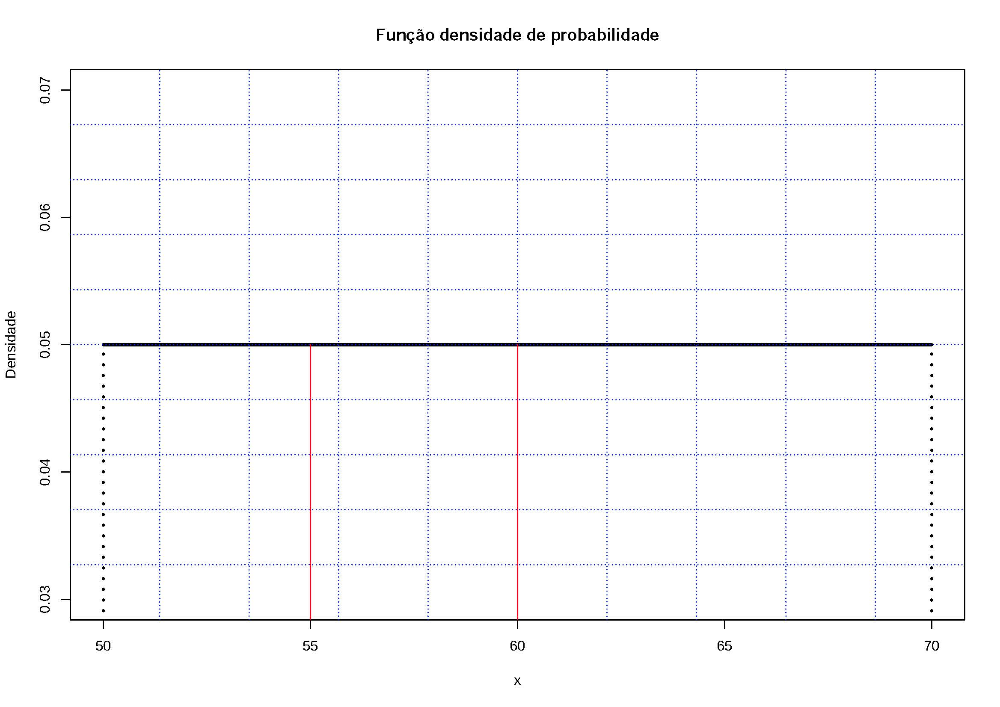

```

\


>Exemplo: calcule a E(X) e a Var(X) da *PDF* triangular determnada anteriormente.


\

Esperança $E(X)$

\

$$
E(X) = \int_{1,40}^{1,625} x\,f_1(x)\,dx + \int_{1,625}^{1,85} x\,f_2(x)\,dx
$$

\

- Parte de $f_1(x)$
\


$$
\int_{1,40}^{1,625} x\,(19,751111\,x - 27,651556)\,dx
= \left[\frac{19,751111\,x^3}{3} - \frac{27,651556\,x^2}{2}\right]_{1,40}^{1,625}
$$

\

- Avaliação em $x = 1,625$: $-8,257919$
- Avaliação em $x = 1,40$: $-9,032841$

\

$$
-8,257919 - (-9,032841) = 0,774923
$$

- Parte de $f_2(x)$
\


$$
\int_{1,625}^{1,85} x\,(-19,751111\,x + 36,539556)\,dx
= \left[-\frac{19,751111\,x^3}{3} + \frac{36,539556\,x^2}{2}\right]_{1,625}^{1,85}
$$
\


- Avaliação em $x = 1,85$: $20,842771$
- Avaliação em $x = 1,625$: $19,992856$

$$
20,842771 - 19,992856 = 0,849915
$$

\

Assim,

\

$$
E(X) = 0,774923 + 0,849915 = 1,624838
$$
\

Variância $Var(X)$

\

$$
Var(X) = \int_{1,40}^{1,625} (x - 1,624838)^2\,f_1(x)\,dx
       + \int_{1,625}^{1,85} (x - 1,624838)^2\,f_2(x)\,dx
$$

\

- Parte de $f_1(x)$

\


Polinômio expandido:

\

$$
(x - 1,624838)^2 f_1(x) = 19,751111\,x^3 - 91,836248\,x^2 + 142,003416\,x - 73,002786
$$

\

$$
\left[\frac{19,751111\,x^4}{4} - \frac{91,836248\,x^3}{3} + \frac{142,003416\,x^2}{2} - 73,002786\,x\right]_{1,40}^{1,625}
$$

\

- Avaliação em $x = 1,625$: $-28,066934$
- Avaliação em $x = 1,40$: $-28,071140$

\

$$
-28,066934 - (-28,071140) = 0,004206
$$

\

- Parte de $f_2(x)$

\


Polinômio expandido:

\

$$
(x - 1,624838)^2 f_2(x) = -19,751111\,x^3 + 100,724248\,x^2 - 170,886527\,x + 96,467967
$$

\

$$
\left[-\frac{19,751111\,x^4}{4} + \frac{100,724248\,x^3}{3} - \frac{170,886527\,x^2}{2} + 96,467967\,x\right]_{1,625}^{1,85}
$$

\

- Avaliação em $x = 1,85$: $40,780200$
- Avaliação em $x = 1,625$: $40,775970$

\

$$
40,780200 - 40,775970 = 0,004231
$$

\
Assim, 
\


$$
Var(X) = 0,004206 + 0,004231 = 0,008437
$$

\


