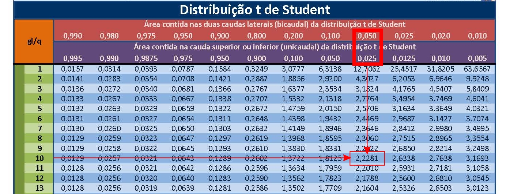

---
output:
  html_document: default
  pdf_document: default
---
```{r, echo=FALSE, include=FALSE}
colFmt <- function(x,color) {
  
  outputFormat <- knitr::opts_knit$get("rmarkdown.pandoc.to")
  
  if(outputFormat == 'latex') {
    ret <- paste("\\textcolor{",color,"}{",x,"}",sep="")
  } else if(outputFormat == 'html') {
    ret <- paste("<font color='",color,"'>",x,"</font>",sep="")
  } else {
    ret <- x
  }

  return(ret)
}

#uso>>>> `r colFmt("REG",'red')`, 


```


```{r , echo = FALSE, include=FALSE}
library(texPreview)
library(kableExtra)
library(knitr)
knitr::opts_chunk$set(echo = TRUE)

```


# Introdução a modelos teóricos de probabilidade 

\


Existem variáveis aleatórias discretas ou contínuas, que apresentam certas características ou padrões de comportamento. Para essas variáveis, com base nesses comportamentos típicos, foram estruturados modelos teóricos de distribuições de probabilidade (variáveis discretas) e de densidade de probabilidade (variáveis contínuas) e derivadas as expressões de suas esperanças e variâncias.


## Modelos teóricos de probabilidade para variáveis aleatórias discretas

### Uniforme

Variável aleatória $X$, assumindo valores $x_{1}, x_{2} , \dots, x_{k}$ tem distribuição uniforme se, e somente se,


$$
P(X=x_{i})=\frac{1}{k}.
$$
para todo $i=1, 2, \dots, k$. Para uma variável com distribuição uniforme: 


- Esperança: $E(X)=\frac{1}{k}\sum_{i=1}^{k} x_{i}$  
- Variância: $VAR(X)=\frac{1}{k} \left[ \sum_{i=1} ^{k} x_{i}^{2}\times\frac{( \sum_{i=1} ^{k} x_{i})^2}{k}     \right]$


\


### Bernoulli


Variável aleatória com distribuição _Bernoulli_ é uma variável definida por um experimento probabilístico em que os resultados possíveis se resumem a apenas dois: **sucesso** ou **fracasso** (ocorrência ou não).

 
\ 	

Caracterização de uma variável aleatória $X$ com distribuição de Bernoulli: $X\sim  Ber(p)$


```{=latex }

\begin{table}[h]
\centering
\begin{tabular}{|c|c|c|}
\hline 
$x_{i}$ & Evento & $P(X=x_{i})$ \\ 
\hline 
1 & Sucesso & p \\ 
\hline 
0 & Fracasso & q=1-p \\ 
\hline 
$\Sigma$ & - & 1 \\ 
\hline 
\end{tabular} 
\end{table}

```

```{r eval=knitr::is_html_output(), results = "asis", echo = FALSE, message = FALSE}

tex2markdown <- function(texstring) {
  writeLines(text = texstring,
             con = myfile <- tempfile(fileext = ".tex"))
  texfile <- pandoc(input = myfile, format = "html")
  cat(readLines(texfile), sep = "\n")
  unlink(c(myfile, texfile))
}

textable <- "
\\begin{table}[h]
\\centering
\\begin{tabular}{|c|c|c|}
\\hline 
$x_{i}$ & Evento & $P(X=x_{i})$ \\\\
\\hline 
1 & Sucesso & p \\\\ 
\\hline 
0 & Fracasso & q=(1-p) \\\\ 
\\hline 
$\\Sigma$ & - & 1 \\\\ 
\\hline 
\\end{tabular} 
\\end{table}
"

tex2markdown(textable)
```


\


Para uma variável de Bernoulli: 


- Esperança: $E(X)=p$  
- Variância: $VAR(X)=p(1-p)$

\


> Exemplo: Seja $X$ uma variável aleatória resultante do lançamento de um dado uma única vez e cujo sucesso está definido como **obter a face com 5 pontos**. Calcule a probabilidade de sucesso e fracasso, assim como sua variância. 

\


```{=latex }


\begin{table}[h]
\centering
\begin{tabular}{|c|c|c|}
\hline 
$x_{i}$ & Evento & $P(X=x_{i})$ \\ 
(face $5$ no lançamento de um dado) &  &  \\ 
\hline 
1 & Sucesso & p=1/6 \\ 
\hline 
0 & Fracasso & q=5/6 \\ 
\hline 
$\Sigma$ & - & 1 \\ 
\hline 
\end{tabular} 
\end{table}


```


```{r eval=knitr::is_html_output(), results = "asis", echo = FALSE, message = FALSE}

tex2markdown <- function(texstring) {
  writeLines(text = texstring,
             con = myfile <- tempfile(fileext = ".tex"))
  texfile <- pandoc(input = myfile, format = "html")
  cat(readLines(texfile), sep = "\n")
  unlink(c(myfile, texfile))
}

textable <- "
\\begin{table}
\\centering
\\begin{tabular}{|c|c|c|}
\\hline 
$x_{i}$ & Evento & $P(X=x_{i})$ \\\\ 
(face 5 no lançamento de um dado) &  &  \\\\ 
\\hline 
1 & Sucesso & p=1/6 \\\\ 
\\hline 
0 & Fracasso & q=5/6 \\\\ 
\\hline 
$\\Sigma$ & - & 1 \\\\ 
\\hline 
\\end{tabular} 
\\end{table}
"

tex2markdown(textable)
```


\ 


- Esperança: $E(X)= \frac{1}{6}$  
- Variância: $Var(X)= \frac{5}{36}$


\

 
Admita agora $X$ uma variável aleatória resultante de realização de $n$ tentativas (repetições) de Bernoulli e definindo $x$ como sendo o número de sucessos verificados nessas $n$ tentativas. Desse modo, proporção de sucessos observada após $n$ repetições é expressa como $\frac{x}{n}$. 

\

Se $p$ é a probabilidade de sucesso a cada repetição e se $\epsilon$ é um número qualquer positivo, tem-se:

\

$$
\underset{n\to \infty }{lim}P\left(\left|\frac{x}{n}-p\right|\ge \epsilon \right)=0
$$
\

A Lei dos grandes números para infinitas repetições de Bernoulli afirma que, após um **grande número de repetições** ($n$),  a proporção de sucessos observada ($\frac{x}{n}$) **irá se aproximar** da probabilidade teórica da variável aleatória de Bernoulli $p$. 


### Binomial


Variável aleatória com distribuição Binomial é uma variável resultante da repetição de um **experimento modelado por uma variável de Bernoulli** (isto é, a cada repetição apenas dois resultados podem ocorrer: sucesso ou fracasso). 


\


Para que $X$ seja uma variável aleatória com distribuição Binomial: $X\sim b(n,p)$ é necessário que:  

\
- o experimento deve ser realizado um número $n$ finito de vezes;  
- cada repetição deve ser independente das demais;  
- cada repetição é, em essência, um ensaio de Bernoulli onde só pode haver dois resultados: sucesso ou fracasso;   
- a probabilidade de sucesso $p$ em cada repetição é **sempre a mesma**; e, consequentemente,   
- a probabilidade de fracasso $q=1-p$ em cada repetição é **também a mesma**.

\


Considerem o diagrama de árvore ilustrado na Figura  \@ref(fig:fig14) que representa, esquematicamente, 3 repetições independentes de um evento modelado por uma variável de Bernoulli, com probabilidade individual de sucesso $P(X=1)=p$ e, de fracasso,  $P(X=0)=1-p=q$.  


\


```{r fig14, echo=FALSE, out.width='60%', fig.align='center', fig.cap="Três repetições independentes de um experimento aleatório modelado por uma variável de Bernoulli"}


```


\


```{=latex }
\begin{table}[!htb]
	\caption*{Função discreta de probabilidade da variável $X\sim b(n,p)$ com $n=3$ (repetições)}
	\resizebox{\linewidth}{!}{
\begin{tabular}{|c|c|c|}
	\hline 
	Número de sucessos & Probabilidade & Probabilidade \textbf{se $p=0,50$} \\ 
	\hline 
	0 & $q^{3}$ & $\frac{1}{8}$ \\ 
	\hline 
	1 & $3pq^{2}$ & $\frac{3}{8}$ \\ 
	\hline 
	2 & $3p^{2}q$ & $\frac{3}{8}$ \\ 
	\hline 
	3 & $p^{3}$  & $\frac{1}{8}$ \\ 
	\hline 
\end{tabular} 
}
\end{table}
```


```{r eval=knitr::is_html_output(), results = "asis", echo = FALSE, message = FALSE}

tex2markdown <- function(texstring) {
  writeLines(text = texstring,
             con = myfile <- tempfile(fileext = ".tex"))
  texfile <- pandoc(input = myfile, format = "html")
  cat(readLines(texfile), sep = "\n")
  unlink(c(myfile, texfile))
}

textable <- "
\\begin{table}[]
\\caption*{Função discreta de probabilidade da variável $X\\sim b(n,p)$ com $n=3$ (repetições)}
\\resizebox{\\linewidth}{!}{
\\begin{tabular}{|c|c|c|}
\\hline 
Número de sucessos & Probabilidade & Probabilidade \\textbf{se $p=0,50$} \\\\ 
\\hline 
0 & $q^{3}$ & $\\frac{1}{8}$ \\\\ 
\\hline 
1 & $3pq^{2}$ & $\\frac{3}{8}$ \\\\ 
\\hline 
2 & $3p^{2}q$ & $\\frac{3}{8}$ \\\\ 
\\hline 
3 & $p^{3}$  & $\\frac{1}{8}$ \\\\ 
\\hline 
\\end{tabular} 
}
\\end{table}
"

tex2markdown(textable)
```


Se $p$ é a probabilidade de se verificar sucesso em qualquer uma das $n$ repetições de Bernoulli realizadas no experimento aletório então uma variável aleatória Binomial $X$ definida sobre esse experimento apresentará $k$ sucessos após $n$ repetições independentes e terá a seguinte função de probabilidade:

\


\begin{align*}
f(k) & = P(X=k)  \\
f(k) & = {C}_{k}^{n}. {p}^{k}. {q}^{(n-k)} \\
f(k) & = \frac{n!}{k!. (n-k)!} . {p}^{k}. {q}^{(n-k)}   
\end{align*}


\


Sendo a probabilidade $p$ de sucesso, igual em todas as repetições, então:  


\

- Esperança: $E\left(X\right)=\sum _{i=1}^{n}{x}_{i}. P\left(X={x}_{i}\right)=n. p$  
- Variância: $V\left(X\right)=E\left({X}^{2}\right)-{\left[E\left(X\right)\right]}^{2} = n . p . q$

\


> Exemplo: Numa prova com 6 questões, a probabilidade de que um aluno acerte cada uma delas é de 0,30. Admitindo que a resolução dessas 6 questões é feita de modo independente, qual a probabilidade desse aluno acertar 4 questões? 

\


1- cada questão apresenta apenas duas possibilidades: **acertar ou errar**; assim, esse experimento aleatório pode seguir o modelo teórico de Bernoulli tendo o evento de sucesso definido como: **a chance de acertar uma prova**, com probabilidade de ocorrência $p=0,30$;  
2- ao se repetir esse experimento $n=6$ (pois este é o número de questões a serem resolvidas) o experimento passa seguir o modelo teórico Binomial pois nos foi assegurada a independência entre cada repetição bem como a constância da probabilidade $p$.  

\

A probabilidade de se acertar $k=4$ questões em $n-6$ repetições independentes tendo cada uma uma probabilidade de sucesso $p=0,30$ será então:

\

\begin{align*}
P\left(X=k\right) & = {C}_{k}^{n}. {p}^{k}. {q}^{n-k} \\
P\left(X=4\right) & = 15 . 0,30^{4} . 0,70^{(6-4)} \\
 & = 0,0595
\end{align*}

\


Conclusão: a probabilidade de um aluno acertar 4 questões das 6 resolvidas, considerando a probabilidade associada ao acerto de cada questão, é de 0,0595. 

\

> Exemplo: Ainda utilizando a construção teórica desse experimento, admitamos que nosso interesse reside em obter as seguintes probabilidades a ele associadas:
1- probabilidade do aluno não acertar nenhuma questão;  
2- probabilidade do aluno acertar todas as questões;  
3- probabilidade do aluno acertar no mínimo 2 questões; e a  
4- probabilidade do aluno acertar no máximo 2 questões.

\


A resposta aos dois primeiros itens é imediata pela simples aplicação dos dados ao odelo, pois o número de sucessos desejado é $k=0$ no primeiro e $k=6$ no segundo (e $p=0,30$ para todos) . Assim:


\begin{align*}
P\left(X=k\right) & ={C}_{k}^{n}. {p}^{k}. {q}^{n-k} \\ 
P\left(X=0\right) & = 1 . 0,30^{0} . 0,70^{(6-0)} \\
                  & = 0,1176
\end{align*}

\


\begin{align*}
P\left(X=k\right) & ={C}_{k}^{n}. {p}^{k}. {q}^{n-k} \\ 
P\left(X=6\right) & = 1 . 0,30^{6} . 0,70^{(6-6)} \\
                 & = 0,000729
\end{align*}

\

A resposta aos dois últimos itens irá demandar o uso da **regra da adição de probabilidades** e, como cada evento é disjunto dos demais, essa regra recai sobre a simples adição das probabilidades envolvidas.


\

Ao perguntar qual a probabilidade do aluno acertar no **mínimo** 2 questões ($P(X \ge 2)$) equivale a se perguntar qual a probabilidade do aluno acertar 2 **OU** 3 **OU** 4 **OU** 5 **OU** 6 questões. Assim, temos como elementos desses eventos de sucesso ${2, 3, 4, 5, 6}$. Assim a solução passará pelo cálculo das probabilidades individuais para **cada** um desses eventos de sucesso que serão simplesmente somadas pois, a ocorrência de cada um desses eventos de sucesso é disjunta dos demais (se ocorrer 2 não ocorre simultaneamente 3).

\


\begin{align*}
P\left(X=k\right) & ={C}_{k}^{n}. {p}^{k}. {q}^{n-k} \\
P\left(X=2\right) & = 15 . 0,30^{2} . 0,70^{(6-2)} \\
                  & = 0,3241
\end{align*}

\

\begin{align*}
P\left(X=k\right) & ={C}_{k}^{n}. {p}^{k}. {q}^{n-k} \\
P\left(X=3\right) & = 20 . 0,30^{3} . 0,70^{(6-3)} \\
                  & = 0,1852
\end{align*}

\

\begin{align*}
P\left(X=k\right) & ={C}_{k}^{n}. {p}^{k}. {q}^{n-k} \\
P\left(X=4\right) & = 15 . 0,30^{4} . 0,70^{(6-4)} \\
                  & = 0,0595
\end{align*}

\

\begin{align*}
P\left(X=k\right) & ={C}_{k}^{n}. {p}^{k}. {q}^{n-k} \\
P\left(X=5\right) & = 6 . 0,30^{5} . 0,70^{(6-5)} \\
                  & = 0,01020
\end{align*}

\

\begin{align*}
P\left(X=k\right) & ={C}_{k}^{n}. {p}^{k}. {q}^{n-k} \\
P\left(X=6\right) & = 1 . 0,30^{6} . 0,70^{(6-6)} \\
                  & = 0,000729
\end{align*}


\

Assim, $P\left(X\ge2\right)=0,3241+0,1852+0,0595+0,01020+0,00079=0,5797$ 

\


```{r}
# Defina o número de repetições (n) e o número de sucessos (k)

n=6  # Número de repetições
k=c(0,1,2,3,4,5,6)   # Número de sucessos varia de nenhum (0) até dez (10) acertar as dez questões
p=0.30 # A probabilidade em cada repetição de Bernoulli


# Probabilidade de k sucessos em n repetições (utilizando a função 'dbinom')

probabilidade <- dbinom(k, n, prob = p)  # Neste exemplo, 0.5 é a probabilidade de sucesso

# Crie uma tabela com duas colunas (Número de Sucessos e Probabilidade)

tabela <- data.frame(Número_de_Sucessos = k, Probabilidade = probabilidade)

# Exiba a tabela

print(tabela)

```

\


> Exemplo: Uma pessoa trabalha em 3 empregos onde desenvolve atividades iguais, sendo remunerada também igualmente nos três lugares. A probabilidade de que o pagamento saia até o 2$^{o}$ dia útil nos três empregos é de 0,85. Qual a probabilidade de apenas um salário sair até o 2$^{o}$ dia útil?   

\


1- a probabilidade de ocorrência do pagamento até o 2$^{o}$ dia útil em cada emprego pode ser modelada por uma variável aleatória de Bernoulli pois apresenta apenas duas possibilidades: ocorrer ou não, cuja probabilidade de sucesso nos foi dada: $p=0,85$;  
2- os três empregos podem ser considerados como repetições desse experimento básico;  
3- esse experimento final pode ter as probabilidades modeladas por uma variável aleatória Binomial com evento de sucesso definido como **chance de se receber apenas um pagamento até o 2$^{o}$ dia útil** ($k=1$) pois consiste na repetição de ($n=3$) experimentos de Bernoulli independentes e com probabilidade individual constante ($p-0,85$).      


\


A probabilidade de se receber o pagamento até o  2$^{o}$ dia útil **em apenas um emprego será dada por**:

\

\begin{align*}
P\left(X=k\right) & ={C}_{k}^{n}. {p}^{k}. {q}^{n-k} \\
P\left(X=1\right) & =3 . 0,85^{1} . 0,15^{2} \\
                  & = 0,0574
\end{align*}

\

Conclusão: a probabilidade desse  trabalhador receber **apenas um salário** até o 2$^{o}$ dia útil do mês é de 0,0574. 

\


```{r}
# Defina o número de repetições (n) e o número de sucessos (k)

n=3  # Número de repetições
k=c(0,1,2,3)    # Número de sucessos varia de nenhum (0) até três (3) receber até o segundo dia nos três empregos
p=0.85 # A probabilidade em cada repetição de Bernoulli


# Probabilidade de k sucessos em n repetições (utilizando a função 'dbinom')

probabilidade = dbinom(k, n, prob = p)  # Neste exemplo, 0,856 é a probabilidade de sucesso

# Crie uma tabela com duas colunas (Número de Sucessos e Probabilidade)

tabela = data.frame(Número_de_Sucessos = k, Probabilidade = probabilidade)

# Exiba a tabela

print(tabela)

```

\

### Poisson


A distribuição de _Poisson_ (assim chamada em homenagem a Siméon Denis Poisson que a descobriu no início do século XIX) é largamente empregada quando se deseja **contar o número de eventos raros** cuja probabilidade média seja dada em termos de um **intervalo de tempo**, **determinada extensão**, **área** ou **volume** (uma taxa).

\

Uma variável aleatória discreta $X$ com Distribuição de _Poisson_ é aquela que pode assumir **infinitos valores numeráveis** ($k=0,1,2, .s, \infty$). Sua representação é:  $X \sim Pois (\lambda)$  e sua função de probabilidade para esses valores é:


\

\begin{align*}
f(k) & = P(X=k) \\
     & = \frac{\lambda^{k}. \epsilon^{-\lambda}} {k!} 
\end{align*}

Com $\epsilon= 2,718$ (número irracional de Euler).


\


A esperança e a variância de uma variável aleatória discreta com Distribuição de _Poisson_ são dados pelo seu parâmetro $\lambda$ que expressa o número médio de eventos ocorrendo no **intervalo de tempo**, ou em uma **determinada extensão**, **área** ou **volume** :


- Esperança: $E(X) = \lambda$;  
- Variância: $Var(X) = \lambda$


\


> Exemplo:Uma central telefônica recebe em média 5 chamadas por minuto. Supondo que a Distribuição de Poisson seja adequada a esse contexto, obter as probabilidade de que essa central não receba chamadas num intervalo de 1 e que receba no máximo duas chamadas em 4 minutos.


\


Dados do problema:

1- $\lambda=$ é o parãmetro da distribuição de Poisson (a esperança, a média); assim temos $\lambda=5$ chamadas por **minuto** (é importante atentar para qual é a unidade associada ao valor do $\lambda$);  
2- **não receber** chamada alguma equivale a um $k=0$;  
3- na sequência, ao se perguntar sobre a probabilidade de se receber **no máximo** duas chamadas em **4 minutos** equivale a não receber chamada alguma **ou**  uma chamada **ou** duas chamadas (soma das probabilidades de eventos mutuamente excludentes);  
4- **mas** é necessário reestimar o valor de $\lambda$ pois agora o intervalo de tempo é de **4 minutos** e o valor que nos foi dado é para **1 minuto** (o que é feito mediante uma simples regra de três: 5 chamadas em **um minuto** passam a ser 20 chamadas em **quatro minutos**)


\

Probabilidade de **não receber chamada alguma**:


\

\begin{align*}
P(X=k) & = \frac{\lambda ^{k}. \epsilon^{-\lambda}} {k!} \\
P(X=0) & = \frac{5^{0}. \epsilon^{-5}} {0!} \\
P(X=0) & = \frac{1 . 0,00673}{1}\\
       & = 0,00673
\end{align*}


\


Probabilidade de receber no **máximo 2** chamadas em 4 minutos ($\lambda = 20$ chamadas por 4 minutos):


\


\begin{align*}
P(X=0) & = \frac{20^{0}. \epsilon^{-20}} {0!} = 2,061154e-09 \\
P(X=1) & = \frac{20^{1}. \epsilon^{-20}} {1!} = 4,122307e-08 \\
P(X=2) & = \frac{20^{2}. \epsilon^{-20}} {2!} = 4,122307e-07 \\
\end{align*}

$P(X \le 2)=P(X=0)+P(X=1)+P(X=2)=4,554699e-7$

\


```{r}
# Defina o número de repetições (n) e o número de sucessos (k)

k= 0    # Número de sucessos varia de nenhum (0) até infinito 
l= 5 # A probabilidade de sucesso na proporção dada (área, comprimento, tempo...) 5 chamadas por minuto

k1= c(0,1,2) 
l1= 20 # 5 chamadas em 1 minuto >> 20 chamadas em 20 minutos


# Probabilidade de k sucessos em n repetições (utilizando a função 'dbinom')

probabilidade = dpois(k, lambda = l)  # Neste exemplo, l=5 chamadas por minuto

probabilidade1 =  dpois(k1, lambda = l1)  # Neste exemplo, l=20 chamadas por minuto


# Crie uma tabela com duas colunas (Número de Sucessos e Probabilidade)

tabela = data.frame(Número_de_Sucessos = k, Probabilidade = probabilidade)
tabela1 = data.frame(Número_de_Sucessos = k1, Probabilidade = probabilidade1)


# Exiba a tabela

print(tabela)
print(tabela1)


```


\


> Exemplo: Um posto de bombeiros recebe em média 3 chamadas por dia. Admitindo que as probabilidades associadas ao recebimento de diferentes números de chamadas podem ser modeladas por uma variável aleatória de _Poisson_ qual seria a probabilidade desse posto receber 4 chamadas em 2 dias?

\

A unidade da esperança dessa variável de _Poisson_ ($\lambda$) de chamadas nos foi dada **por dia** ao passo que a probabilidade pedida está associada a um período de **dois dias**, exigindo que a esperança $\lambda$ seja convertida para essa nova unidade (uma simples regra de três: 3 chamadas por dia, então para 2 dias, 6 chamadas). Assim, a probabilidade pedida será:

\

\begin{align*}
P(X=k) & = \frac{\lambda ^{k}. \epsilon^{-\lambda}} {k!}\\
P(X=4) & = \frac{6^{4}. \epsilon^{-6}} {4!} \\
       & = 0,1338
\end{align*}

\

A figura abaixo ilustra a distribuição acumulada das probabilidades de alguns sucessos para o exemplo em estudo.
\


```{r fig000, out.width='100%', fig.align='center', fig.cap="Gráfico ilustrativo das probabilidades acumuladas", warning = FALSE}

library(tidyverse)
prob=c(0.00248, 0.01448, 0.044643, 0.08929, 0.1338, 0.16072, 0.16072, 0.137762, 0.256105)
k=c("k=0", "k=1", "k=2", "k=3", "k=4", "k=5", "k=6", "k=7", "soma(k=8,k=9,...,inf)")
legend_title="Sucessos"
nchamadas=data.frame(sucesso = k, proporcao= prob)
nchamadas=nchamadas %>% 
  mutate(va_poisson = "Probabilidades segundo o modelo teórico de Poisson")
ggplot(nchamadas, aes(x = va_poisson, y =proporcao, fill = forcats::fct_rev(sucesso))) +
  geom_col( width = 0.2) +
  geom_text(aes(label = proporcao),size=3,
            position = position_stack(vjust = 0.5) ) +
  theme(legend.position = "right") +
  ylab("Probabilidade acumulada") +
  xlab(NULL)+
  scale_fill_discrete(name="Número de sucessos", 
                      labels=rev(c("k=0", "k=1","k=2","k=3","k=4",
                               "k=5","k=6","k=7","soma(k=8,k=9,...,inf)")))

```

\


> Exemplo: Por um posto de pedágio passam, em média, 5 carros por minuto. Qual a probabilidade de passarem exatamente 3 carros em 1 minuto?

\

\begin{align*}
P(X=k) & = \frac{\lambda ^{k}. \epsilon^{-\lambda}} {k!} \\
P(X=3) & = \frac{5^{3}. \epsilon^{-5}} {3!} \\
       & = 0,1404
\end{align*}


Uma variável aleatória discreta de _Poisson_  modela muito bem eventos raros; ou seja, aqueles que não acontecem com grande frequência para qualquer intervalo considerado (tempo, extensão, área, volume). Trata-se de uma caso de variável Binomial no qual $n \to \infty$ e $p$ é pequeno ($n \ge 50$ e $n . p \le (5)$).  Nesse cenário pode-se demonstrar que:

\

$$
lim_{n \to \infty} P(X) = {C}_{k}^{n}. {p}^{k}. {q}^{n-k}
$$

\

é igual a:

\

$$
P(X=k) = \frac{\lambda ^{k}. \epsilon^{-\lambda}} {k!}
$$

\


Tal aproximação era, tempos atrás (antes da era computacional), bastante útil pois, para um $n$ muito grande o cálculo fatorial era trabalhoso! Nesse contexto pode-se modelar o experimento acima, de modo bem aproximado, por uma variável aleatória de Poisson com $\lambda=n . p$:

\


$$
f(k) = P(X=k) = \frac{n . p^{k}. \epsilon^{- n . p}} {k!}
$$


\


### Multinomial


\

A distribuição multinomial é uma generalização da distribuição binomial -  a qual  admite apenas dois resultados: sucesso e fracasso -  para as situações de mais de dois valores. Assim como a distribuição binomial, a distribuição multinomial é uma função de distribuição para processos discretos nos quais prevalecem probabilidades fixas para cada valor gerado de modo  independente uns dos outros.


\

Admita que $X$ seja uma variável aleatória com distribuição multinomial: $X_{k} \sim multinomial(n , \boldsymbol{p})$ que envolve um processo aleatório que possui um conjunto de $k$ possíveis resultados, cada um com sua probabilidade $p_{k}$ definida: 


\

$$
X_{k} =
\begin{cases}
X_{1}  \text{  com probabilidade } p_{1} \\
X_{2}  \text{ com probabilidade } p_{2} \\
\vdots  \\
X_{k}  \text{ com probabilidade } p_{k} \\
\end{cases}
$$


\

- $X_{1}, X_{2}, \dots, X_{k}$ são os $k$ possíveis resultados assumidos pela variável aleatória multinomial $X_{k}$ ;
- $\boldsymbol{p}$ é o vetor de probabilidades $p_{1}, p_{2}, \dots, p_{k}$ associadas à ocorrência de cada um dos possíveis resultados da variável aleatória multinomial $X_{k}$;
- $n$ é o número finito de vezes que o experimento é realizado;
- $n_{1}, n_{2}, \dots, n_{k}$ é o número de sucessos observados em cada um dos possíveis resultados que a variável aleatória multinomial $X_{k}$ pode assumir, de tal modo que $n_{1} + n_{2} + \dots + n_{k} = n$; 
- as probabilidades de sucesso $p_{k}$ em cada uma das repetições são sempre as mesmas: indepenendência de resultados entre as as repetições.

\

A função de distribuição de probabilidades é dada por: 

\


\begin{align*}
f(X=(n_{1}, n_{2}, \dots,  n_{k})) & = P(X_{1}=n_{1}; X_{2}=n_{2}, \dots, X_{k}=n_{k}) \\
P(X_{1}=n_{1}; X_{2}=n_{2}, \dots, X_{k}=n_{k})  & = \frac{n!}{n_1!n_2!\cdots n_{k}!}. p_1^{n_1} \cdot p_2^{n_2} \dots  p_k^{n_k}
\end{align*}


\


A esperança e a variância de uma variável aleatória discreta com Distribuição de multinomial são dadas por:

\

- O vetor esperança: $E(X_{k}) = n.\boldsymbol{p}_{k} = \{n.p_{1};n.p_{2};\cdots;n.p_{k};     \}$;  
- O vetor variância: $Var(X_{k}) = n.\boldsymbol{p}_{k}.(1-\boldsymbol{p}_{k})= \{n.p_{1}.(1-p_{1});n.p_{2}.(1-p_{2});\cdots;n.p_{k}.(1-p_{k})\}$.


Os valores do vetor da esperança numericamente calculados poderão ser arredondados se o objetivo incluir sua aplicação prática em algum contexto; caso contrário, permanecem como calculados foram. 

\
\

> Exemplo: Em uma partida de xadrez dois jogadores têm a probabilidade de vencer, perder ou empatar. A probabilidade do jogador "A" vencer é 0,40, do jogador "B" vencer é 0,35 e do jogo terminar empatado é de 0,25. Calcule a probabilidade de em 12 partidas, observar-se que o jogador "A" ganhou 7 partidas, o jogador "B" venceu 2 partidas e as 3 partidas restantes terminaram em empate.


\

Uma variável aleatória $X$ pode ser definda para modelar a probabilidade dos diferentes resultados possíveis nesse experimento aleatório tal que $X_{3} \sim multinomial (n, \boldsymbol{p})$ tal que:

\


$$
X_{3} = 
\begin{cases}
X_1\text{: "A" ganha }  \text{probabilidade } p_{1}=0,40 \\
X_2\text{: "B" ganha }  \text{probabilidade } p_{2}=0,35 \\
X_3\text{: empate entre "A" e  "B"}  \text{probabilidade } p_{3}=0,25 \\
\end{cases}
$$

\

\begin{align*}
P(X_{1}=n_{1};X_{2}=n_{2};X_{3}=n_{3}) & = \frac{n!}{n_1!n_2!n_{3}!} \cdot p_1^{n_1} \cdot p_2^{n_2} \cdot  p_3^{n_3}\\
P(X_{1}=7;X_{2}=2;X_{3}=3) & = \frac{12!}{7!2!3!} \cdot 0,40^{7} \cdot 0,35^{2} \cdot  0,25^{3}\\
P(X_{1}=7;X_{2}=2;X_{3}=3) &  = 0.02483712
\end{align*}

\


```{r}
# Defina as probabilidades de sucsesso de cada possível resultado da variável aleatória: p_(k). Admita que existam apenas tês:

p1= 0.4
p2= 0.35
p3= 0.25

# O número de repetições 'n' é automaticamente definido pelo arranjo de sucessos que se deseja estimar a probabilidade   
x=c(7,2,3) # Nesse caso deseja-se 7 sucessos do resultado X_1 (jogador 1), 2 do X_2 (jogador 2) e 3 do X_3  (jogador 3)


# Probabilidade desse vetor de sucessos (utilizando a função 'dmultinom')

probabilidade = dmultinom(x=c(7,2,3), prob = c(0.4,0.35,0.25))

print(probabilidade)

```
\


## Modelos téoricos do tempo de espera


As distribuições do tempo de espera são outra importante classe de problemas associados com a quantidade de tempo que leva para a ocorrência de um evento específico de interesse. Dentro dessa classe de problemas se enquadram duas distribuições bastante conhecidas, são elas: geométrica e Geométrica negativa.


### Geométrica


A distribuição geométrica é uma distribuição de probabilidade discreta que modela o número de tentativas independentes necessárias para obter o primeiro sucesso em um processo de Bernoulli, onde cada tentativa tem duas possibilidades: sucesso ou fracasso e a probabilidade de sucesso é constante e denotada por $p$ sob as seguintes condicionantes:

\

1- cada experimento é um ensaio de Bernoulli (só poderá haver dois resultados possíveis: sucesso ou fracasso);  
2- cada repetição deve ter seu resultado independente do resuluado das demais;  
3- a probabilidade de sucesso ($p$) é constante para todas as repetições;  
4- consequentemente, a probabilidade de fracasso ($q=1-p$) também o é; e,  
5- o experimento é repetido segue até que se verifique o primeiro sucesso.

\ 

Considere o experimento aelatório de se lançar uma moeda **não honesta**, com probabilidade $p$ de ocorrência de _Cara_ e $(1-p)$ de ocorrência de _Coroa_. Se definimos nosso evento de sucesso como sendo obter _Cara_ no lançamento, quantos lançamentos serão necessários para se verificar a ocorrência de sucesso? 

\ 	

Admita uma sequência de $n$ lançamentos: _{Coroa, Coroa, ..., Coroa, Cara}_ onde no $n-ésimo$ lançamento verificou-se o sucesso. Assim sendo, podemos definir $j=(n-1)$ como o número de tentativas **anteriores** fracassadas.

\ 	


Uma variável aleatória $X$ com Distribuição Geométrica, com parâmetro $p$ ($0 \le p \le1$), é aquela que pode assumir **infinitos valores numeráveis** ($j=0,1,2, .s, \infty$) para a quantidade $j$ de tentativas que **precedem o primeiro sucesso**, que será observado na tentativa seguinte ($j+1$). 

\

Sua representação é $X\sim geo(p)$ e sua função de probabilidade é:

\


\begin{align*}
f(X=x; p) & = P(X=j) = p . (1-p)^{j} \\
          & = P(X=j) = p . q^{j}
\end{align*}

\

O Modelo geométrico pode ser escrito sub uma "forma alternativa":  o **número de tentativas $n$ até se observar o primeiro sucesso**, agora com $x=n=1, 2, ...$.}. 

\

\begin{align*}
f(X=x; p) & = P(X=n) = p . (1-p)^{(n-1)} \\
          & = P(X=n) = p . q^{(n-1)}  
\end{align*}


\ 

A esperança e a variância de uma variável aleatória discreta com Distribuição geométrica ($X\sim geo(p)$) são:

\

- Esperança: $E(X) = \frac{1}{p}$  
- Variância: $Var(X) = \frac{(1-p)}{p^{2}} = \frac{q}{p^{2}}$.

\

A distribuição geométrica é frequentemente usada em situações em que estamos interessados em calcular quantas tentativas independentes são necessárias até que um evento específico ocorra. Por exemplo, pode ser usada para modelar o número de lançamentos de uma moeda justa até que a primeira cara apareça, ou o número de tentativas até que um cliente faça sua primeira compra em um site de comércio eletrônico.

\


>Lembrando que o modelo binomial é aplicado sobre a contagem de número de sucessos $k$ em $n$ tentativas de Bernoulli; ou seja, o número de tentativas $n$ é **fixo** e o número de sucessos $k$ é **aleatório**. 

\

>Já o modelo geométrico estima o número de tentativas $j$ até se observar o primeiro sucesso; isto é, o número de sucessos $k$ é **fixo** e o número de tentativas $j$ é **aleatório**.  


\

Uma variável aleatória geométrica é definida como o número de tentativas até que o primeiro sucesso fosse encontrado e, como essas tentativas são independentes entre si; ie., a probabilidade $p$ não se altera em razão de terem sido realizadas tentativas anteriores, a contagem do número de tentativas até o próximo sucesso pode ser começada em qualquer tentativa sem alterar a distribuição de probabilidades da variável aleatória. A consequência de usar um modelo geométrico é que o sistema presumivelmente não será desgastado, a probabilidade permanece constante. 

\


Nesse sentido à distribuição geométrica é dita **faltar qualquer memória**.  

\


> Exemplo: A probabilidade de que um _bit_ transmitido através de um canal digital seja recebido **com erro** é de 0,1. Considere que as transmissões sejam eventos independentes e o erro relativamente raro. Uma variável aleatória discreta pode ser definida como $X\sim Geo(p)$. Qual a probabilidade de que **o primeiro erro** na transmissão de um _bit_ ocorra na **quinta** transmissão?

\


Uma variável aleatória discreta com Distribuição geométrica pode ser definida para modelar a probabilidade desse experiment aleatório como $X\sim geo(p)$, onde $p$ é a probabilidade individual de sucesso (no nosso caso, que o _bit_ seja transmitido com erro). 

\


Dados do problema:

1- a probabilidade de ocorrência de um sucesso (aqui bem entendido como sendo a transmissão de um _bit_ com erro) é $p=0,1$; e,  
2- a probabilidade pedida é a de se observar a ocorrência do primeiro sucesso com 5 repetições (bem entendido aqui que o número de tentativas **sem se observar sucesso** será $j=4$ e, em $j+1=5$ teremos sucesso).

\


\begin{align*}
f(X=x; p) & = P(X=j) = (1-p)^{j} .  p \\
P(X=4) & = (1-0,1)^{4} . 0,1 \\
P(X=4) & = 0,0656
\end{align*}

\

A probabilidade de que na **quinta transmissão** de um _bit_ ocorra um erro é de 6,56\%.

\

```{r}
p = 0.10
n = 4 # Uma vez que na 5 repetição ocorrerá o 'sucesso' (o bit será transmitido com erro)
dgeom(x = n, prob = p)
```
 


> Exemplo: Uma linha de produção está sendo analisada para fins de controle da qualidade das peças produzidas. Tendo em vista o alto padrão requerido, a produção é interrompida para regulagem **toda vez que uma peça defeituosa é observada**. Se 0,01 é a probabilidade da peça ser defeituosa, determine a probabilidade de ocorrer uma peça defeituosa entre a $4^{a}$ e $6^{a}$ peças produzidas.

\ 

Uma variável aleatória discreta com Distribuição geométrica pode ser definida para modelar esse experimento aleatório como $X\sim Geo(p)$ onde $p$ é a probabilidade individual de sucesso (no caso, a produção de uma peça defeituosa). Pede-se a probabiidade de que essa ocorrência se verifique **OU** na quarta **OU** na quinta **OU** na setxa peça produzida.  

\


Dados do problema:

- a probabilidade de ocorrência de um sucesso (aqui bem entendido como sendo a produção de uma peça defeituosa) é $p=0,01$; e,  
- a probabilidade pedida é a de se observar a ocorrência da produção da primeira peça defeituosa com 4, 5 **OU** 6 repetições.


Assim sendo o número de tentativas **sem se ter nenhuma peça produzida com defeito** é de $3 \le j \le 5$ porque assim, em $j+1$, teremos sucesso na quarta, quinta ou sexta peça produzidas.

\


Considerando-se que os eventos são disjuntos (ocorrerá na quarta, na quinta ou na sexta), probabilidade pedida será:


$$
P(X=j)_{3 \le j \le 5}= P(X=3) + P(X=4) + P(X=5)
$$ 

\

A probabilidade de verificarnos sucesso na $4^{a}$ peça produzida (peça produzida com defeito) será:

\


\begin{align*}
f(X=x; p) & = P(X=j) \\
P(X=j)    & = (1-p)^{j} . p  \\
P(X=3)    & = (1-0,01)^{3} . 0,01 \\
P(X=3)    & = 0.00970299
\end{align*}


\ 

A probabilidade de verificarnos sucesso na $5^{a}$ peça produzida (peça produzida com defeito) será:


\begin{align*}
f(X=x; p) & = P(X=j) \\
P(X=j)    & = (1-p)^{j} . p \\
P(X=4)    & = (1-0,01)^{4} . 0,01 \\
P(X=4)   & = 0.00960596
\end{align*}

\ 

A probabilidade de verificarnos sucesso na $6^{a}$ peça produzida (peça produzida com defeito) será:

\begin{align*}
f(X=x; p) & = P(X=j) \\
P(X=j)   & = (1-p)^{k} . p \\
P(X=5)    & = (1-0,01)^{5} . 0,01 \\
P(X=5)    & = 0.0095099    
\end{align*}


\


A probabilidade de termos uma peça **produzida com defeito ** na quarta **OU** na quinta **OU** na sexta das peças produzidas será:

\begin{align*}
P(3 \le j \le 5)  &  = P(X=3) + P(X=4) + P(X=5) \\
P(3 \le j \le 5)  &  = 0.00970299 +  0.00960596 +  0.00950990\\
P(3 \le j \le 5)  &  = 0.02881885
\end{align*}


\


A probabilidade de termos uma **peça defeituosa** na quarta **OU** na quinta **OU** na sexta das peças produzidas é de 2,9116\%.

\


```{r}
p = 0.01
n = c(3,4,5) # Uma vez que na 4, 5 e 6 repetições ocorrerão os 'sucessos' (a produção de uma peça defeituosa)
dgeom(x = n, prob = p)

```
\


> Exemplo 9 A  probabilidade de um alinhamento ótico bem sucedido na montagem de produto de armazenamento de dados é de 0,80. Assuma que as tentativas são independentes e responda:  
1- Qual é a probabilidade de que o primeiro alinhamento bem sucedido requeira exatamente quatro tentativas?  
2- Qual é a probabilidade de que o primeiro alinhamento bem sucedido requeira no máximo quatro tentativas?  
3- Qual é a probabilidade de que o primeiro alinhamento bem sucedido requeira ao menos quatro tentativas?

\

Uma variável aleatória discreta com Distribuição geométrica pode ser definida para modelar esse experimento aleatório como $X\sim Geo(p)$ onde $p$ é a probabilidade individual de sucesso .

\


Dados do problema:

- a probabilidade de ocorrência de um sucesso (alinhamento ótico bem sucedido na montagem de produto de armazenamento de dados) é $p=0,80$;  
- o item (1) pede a probabilidade de verificar o primeiro sucesso com exatamente **quatro repetições**; assim, o número de tentativas **sem se observar sucesso** é $j=3$ (em $j+1=4$ verifica-se sucesso);  
- o item (2) pede a probabilidade de se verificar o primeiro sucesso com **no máximo** quatro repetições; assim, o número de tentativas **sem se observar** sucesso é de $0 \le j \le 3$ (em $j+1$ teremos sucesso: no primeiro **OU** no segundo **OU** no terceiro **OU** no quarto alinhamentos realizados); e,  
- o item (3) pede a probabilidade de se observar o primeiro sucesso com **no mínimo quatro** repetições; assim, o número de tentativas **sem se observar sucesso** é de $3 \le j \le \infty $ (em $j+1$ teremos sucesso: no quarto **OU* no quinto **OU** sexto .s,  alinhamentos realizados).

\ 

Para o item (1) a probabilidade de termos a ocorrência de um sucesso (ou seja, um alinhamento ótico bem sucedido) na $4^{a}$ montagem será:

\

\begin{align*}
f(X=x; p) & = P(X=j) \\
P(X=j)  & = (1-p)^{j} . p \\
P(X=3) & = (1-0,80)^{3} . 0,80 \\
P(X=3) & = 0,0064
\end{align*}

\

```{r}
p = 0.80
n = c(3) # Uma vez que na 4 repetição ocorrerá o 'sucesso' (um alinhamento ótico bem sucedido)
dgeom(x = n, prob = p)
```

\


Para o item (2) considerando-se que as repetições são independentes, a probabilidade pedida será:

\

$$
P(X=j)_{0 \le j \le 3} = P(X=0) + P(X=1) + P(X=2) + P(X=3)
$$ 


\


\begin{align*}
f(X=x; p) & = P(X=j) \\
P(X=j) & =  (1-p)^{j} . p \\
P(X=0) & =  (1-0,80)^{0} . 0,80 \\
P(X=0) &  =  0,80 
\end{align*}

\

\begin{align*}
f(X=x; p) & =  P(X=j) \\
P(X=j) & =  (1-p)^{j} . p \\
P(X=1) & =  (1-0,80)^{1} . 0,80 \\
P(X=1) & = 0,16
\end{align*}

\


\begin{align*}
f(X=x; p) & =   P(X=j) \\
P(X=j) & =  (1-p)^{j} . p \\
P(X=2) & =  (1-0,80)^{2} . 0,80 \\
P(X=2) & = 0,032
\end{align*}

\

\begin{align*}
f(X=x; p) & =  P(X=j) \\
 P(X=j) & =  (1-p)^{j} . p \\
P(X=3) & =  (1-0,80)^{3} . 0,80 \\
P(X=3) & = 0,0064
\end{align*}


\


A probabilidade pedida é de:

\begin{align*}
P(X=j)_{0 \le j \le 3} & = P(X=0) + P(X=1) + P(X=2) + P(X=3) \\
P(X=j)_{0 \le j \le 3} & =  0,9984
\end{align*}


\

```{r}
p = 0.80
n = c(0,1,2,3) # Uma vez que na 1, 2, 3, e 4 repetições ocorrerão os 'sucessos' (alinhamentos óticos bem sucedidos)
dgeom(x = n, prob = p)
```
\


Para o item (3) considerando-se que os eventos pedidos são disjuntos a probabilidade pedida deverá ser calculada a partir do complemento da probabilidade total menos os eventos que não são de interesse:

\

$$
P(X=j)_{3 \le j \le \infty} = 1 - P(X=0) + P(X=1) + P(X=2)
$$


\


\begin{align*}
f(X=x; p) & =  P(X=j) \\
P(X=j) & = (1-p)^{j} . p \\
P(X=0) & = (1-0,80)^{0} . 0,80 \\
P(X=0) & =  0,80 
\end{align*}

\

\begin{align*}
f(X=x; p) & =  P(X=j) \\
P(X=j) & =  (1-p)^{j} . p \\
P(X=1) & =  (1-0,80)^{1} . 0,80 \\
P(X=1) & =  0,16
\end{align*}

\


\begin{align*}
f(X=x; p) & =   P(X=j) \\
P(X=j) & =  (1-p)^{j} . p \\
P(X=2) & =  (1-0,80)^{2} . 0,80 \\
P(X=2) & =  0,032
\end{align*}

\


A probabilidade é de: 

\begin{align*}
P(X=j)_{3 \le j \le \infty} &  =  1 - P(X=0) + P(X=1) + P(X=2) \\
P(X=j)_{3 \le j \le \infty} &  = 1 - (0,80 + 0,16 + 0,032) \\
P(X=j)_{3 \le j \le \infty} &  = 0,008
\end{align*}


### Binomial Negativa

\

A distribuição Binomial Negativa (também conhecida como de Distribuição de Pascal em homenagem ao matemático francês Blaise Pascal) pode ser considerada como uma generalização da variável Geométrica, na qual agora considera-se a situação em que se modelam as probabilidades de se verificar mais de um evento de sucesso em um certo número de repetições. 

\


Ao se realizar repetidos experimentos de Bernoulli, uma variável aleatória Binomial Negativa modela as probabilidades de serem observados $k$ sucessos em  $n$ repetições. 

\


Um experimento que apresenta uma distribuição Binomial Negativa satisfaz aos seguintes pressupostos: 

\

1- cada repetição é um ensaio de Bernoulli (só poderá haver dois resultados possíveis: sucesso ou fracasso);  
2- cada repetição não altera a probabilidade original (há independência entre as repetições);  
3- portanto, a probabilidade de sucesso ($p$) em cada repetição é constante;  
4- e, consequentemente, a probabilidade de fracasso ($q=1-p$) em cada repetição também é constante; e,  
5- o experimento aleatório prossegue até que sejam verificados $k$ sucessos (na última repetição terá sido observado o k-ésimo sucesso).

\

A notação de uma variável aleatória Binomial Negativa é $X\sim bn(p,k)$, onde o parâmetro $p$ ($0 \le p \le1$) indica a probabilidade individual de sucesso a cada repetição de Bernoulli e $k$ o número total de sucessos desejado e estabelecido _a priori_. 

\

Sua função discreta de probabilidade, que calcula a probabilidade de se observar o número $k$ sucessos estabelecido _a priori_ em $n$ de ensaios de Bernoulli realizados, é a seguinte:

\


\begin{align*}
f(X=n; (p, k)) & = P(X=n; (p,k) = \binom{n-1}{k-1} \cdot {p}^{k} \cdot {q}^{(n-k)} \\
& = \frac{(n-1)!}{ (k-1)! \cdot (n-k)!} \cdot {p}^{k} \cdot {q}^{(n-k)}
\end{align*}

\

Como são necessários no mínimo $k$ tentativas para se obter $k$ sucessos, os valores de $n={k, k+1, k+2 ...}$).   


\

A esperança e a variância de uma variável aleatória discreta com Distribuição Binomial Negativa são:


- Esperança: $E(X) = \frac{k}{p}$ ;  
- Variância: $Var(X) = \frac{k \cdot (1-p)}{p^{2}} = \frac{q \cdot k}{p^{2}}$.


\

> Uma variável aleatória Binomial é uma contagem de número de sucessos $k$ em $n$ tentativas de Bernoulli; ou seja, o número de tentativas $n$ é predeterminado (fixo) e o número de sucessos $k$ é a variação aleatória. Em $n$ tentativas a probabilidade de se observar $k$ sucessos é calculada pela sua função de distribuição discreta de probabilidades.

> Uma variável aleatória Binomial Negativa é uma contagem do número de tentativas $n$ de Bernoulli em $k$ sucessos; ou seja, o número de sucessos $k$ é predeterminado (fixo) e o número de tentativas é a variação aleatória. Em $n$ tentativas a probabilidade de se observar $k$ sucessos é calculada pela sua função de distribuição discreta de probabilidades. 


\

> Exemplo 10: A probabilidade com que um _bit_ transmitido através de um canal digital de transmissão seja recebido com erro é de 0,1 e que as transmissões sejam eventos independentes. Qual a probabilidade de que nas dez primeiras transmissões ocorram quatro erros?

\

Uma variável aleatória discreta com Distribuição Binomial Negativa pode ser definida para modelar esse experimento aleatório, tal que $X\sim bn(p,k)$ onde $p$ é a probabilidade individual de sucesso e $k$ o número de sucessos estabelecido _a priori_.

\
	

Dados do problema:

\

1- a probabilidade de ocorrência de um sucesso (aqui bem entendido como sendo a recepção errada de um _bit_ transmitido) é $p=0,1$; e,   
2- o número de sucessos (aqui bem entendido como sendo a recepção errada de um _bit_ transmitido) está definido em $k=4$.   

\

Pede-se a probabilidade de se observar  quatro sucessos ($k=4$) em dez ($n=10$) transmissões (repetições).

\

A probabilidade de se observar $k=4$ sucessos ao se realizar $n=10$ tentativas de Bernoulli é dada pela função discreta de probabilidade da variável aleatória Binomial Negativa: 

\

\begin{align*}
f(X=n; (p, k)) & = P(X=10; (p=0,1; k=4)) = \binom{n-1}{k-1} \cdot {p}^{k} \cdot {q}^{n-k} \\
& = \frac{(n-1)!}{ (k-1)! \cdot (n-k)!} \cdot {p}^{k} \cdot {q}^{n-k} \\ 
& = \frac{(10-1)!}{ (4-1)! \cdot (10-4)!} \cdot {0,1}^{4} \cdot {0,9}^{10-4} \\
& = \frac{362880}{ 6 \cdot 720} \cdot 0.0001  \cdot 0.531441 \\
& = 0,004464104
\end{align*}

\

A probabilidade de se observar 4 sucessos em 10 tentativas é de 0,4464104\%. 

\

```{r}
k = 4
n = 10
p = 0.10
x = n-k # Entrar com n-k na função pois ela espera o número de falhas
dnbinom(x = x , size = k, prob = p)
```


\

> Exemplo 11: Bob é um jogador de basquete de uma escola. Ele é um lançador de arremessos livres e sua probabilidade de acertar é igual a 70\%. Durante uma partida qualquer, qual a probabilidade de que Bob acerte seu **terceiro** arremesso livre na seu **quinta** tentativa?  

\

Uma variável aleatória discreta com Distribuição Binomial Negativa pode ser definida para modelar esse experimento aleatório tal que $X\sim bn(p,k)$ onde $p$ é a probabilidade individual de sucesso e $k$ o número de sucessos estabelecido _a priori_ sob probabilidade constante e igual a _p_ a cada repetição (p, k são os parâmetros do modelo).

\


Dados do problema:

\

1- a probabilidade de ocorrência de um sucesso é $p=0,70$, e  
2- o número de sucessos =3$.

\

Pede-se a probabilidade de se observar  três sucessos ($k=3$) em cinco  ($n=5$) arremessos(repetições).
\


A probabilidade de se obter $k=3$ sucessos ao se realizar $n=5$ tentativas é dada pela função discreta de probabilidade da variável Binomial Negativa: 

\

\begin{align*}
f(X=n; (p; r)) & = P(X=5; (p=0,7; k=3 )) = \binom{n-1}{k-1} \cdot {p}^{k} \cdot {q}^{n-k} \\
& = \frac{(n-1)!}{ (k-1)! \cdot (n-k)!} \cdot {p}^{k} \cdot {q}^{n-k} \\ 
& = \frac{(5-1)!}{ (3-1)! \cdot (5-3)!} \cdot {0,7}^{3} \cdot {0,3}^{5-3} \\
& = \frac{24}{ 2 \cdot 2} \cdot 0.343  \cdot 0.09 \\
& = 0,18522
\end{align*}

\

A probabilidade de Bob acertar 3 arremessos em 5 tentativas é de 18,522\%. 

\


```{r}
k = 3
n = 5
p = 0.70
x = n-k # Entrar com n-k na função pois ela espera o número de falhas
dnbinom(x = x , size = k, prob = p)
```

\

> Exemplo 12: Lançamos repetidas vezes uma moeda. Seja $X$ o número de caras até que consigamos sete coroas. Qual é a probabilidade de que o número de caras seja igual a cinco até que consigamos as sete coroas?


\

Uma variável aleatória discreta com Distribuição Binomial Negativa pode ser definida para modelar esse experimento aleatório tal que $X\sim bn(p,k)$ onde $p$ é a probabilidade individual de sucesso e $k$ o número de sucessos estabelecido _a priori_ sob probabilidade constante e igual a _p_ a cada repetição (p, k são os parâmetros do modelo).


\	

Dados do problema:

\

- a probabilidade de ocorrência de um sucesso é $p=0,5$, e,  
- o número de sucessos é $k=7$. 

\

Pede-se a probabilidade de se observar sete sucessos (sete Caras) em doze tentativas (sete Caras e cinco Coroas).

\

A probabilidade de se obter $k=7$ sucessos ao se realizar $n=12$ tentativas é dada pela função discreta de probabilidade da variável Binomial Negativa: 

\

\begin{align*}
f(X=n; p; r) & = P(X=12; p=0.5; k=7 ) = \binom{n-1}{k-1} \cdot {p}^{k} \cdot {q}^{n-k} \\
& = \frac{(n-1)!}{ (r-1)! \cdot (n-k)!} \cdot {p}^{k} \cdot {q}^{n-k} \\ 
& = \frac{(12-1)!}{ (7-1)! \cdot (12-7)!} \cdot {0,5}^{7} \cdot {0,5}^{12-7} \\
& = \frac{39916800}{ 720 \cdot 120} \cdot 0.0078125 \cdot 0.03125 \\
& = 462  \cdot 0.0078125 \cdot 0.03125 \\
& = 0.112793
\end{align*}

\

A probabilidade de se obter 7 sucessos em 12 tentativas é de 11,28\%. 

\

```{r}
k = 7
n = 12
p = 0.50
x = n-k # Entrar com n-k na função pois ela espera o número de falhas
dnbinom(x = x , size = k, prob = p)
```

\

> Exemplo 13: Considere o tempo para recarregar o flash de uma câmera de celular. Assuma que a probabilidade de que uma câmera instalada no celular durante sua montagem passe no teste seja de 0.80 e que cada câmera é montada de modo que a probabilidade não se altere (independência). Determine as seguintes probabilidades:  
1- de que a segunda falha ocorra na décima câmera testada;  
2- de que a segunda falha ocorra no teste de quatro ou menos câmeras; e,  
3- o valor esperado do número de câmeras testadas para obter a terceira falha.


\

Uma variável aleatória discreta com Distribuição Binomial Negativa pode ser definida para modelar esse experimento aleatório tal que  $X\sim bn(p,k)$ onde $p$ é a probabilidade individual de sucesso e $k$ o número de sucessos estabelecido _a priori_ sob probabilidade constante e igual a _p_ a cada repetição (p, k são os parâmetros do modelo).

\


Dados do problema:

\

-  se a probabilidade de que a câmera montada no celular passe no teste  é $0,80$ a probabilidade de não passar é de ($1-0,80$) $=0,20$;  
- fica bem entendido aqui que o **sucesso** é a câmera montada no celular **não passar** no teste, logo $p=0,20$;  
- no item (1) pede-se a probabilidade de se observar um número de sucessos fixado _a priori_ $k=2$ em $n=10$ câmeras testadas (repetições de Bernoulli);  
- no item (2) pede-se a probabilidade de se observar um número de sucessos também fixado _a priori_ em $k=2$ mas agora no intervalo de  $n \le 4$ câmeras testadas (repetições de Bernoulli); e,  
- o valor esperado para o número de câmeras testadas (repetições de Bernoulli) ($n=?$) para que se observ $k=3$ sucessos.


\

A probabilidade de se observar $k=2$ sucessos ao se realizar $n=10$ tentativas de Berboulli é dada pela função discreta de probabilidade da variável Binomial Negativa: 

/

\begin{align*}
f(X=n; (p,k)) & = P(X=10; (p=0.2; k=2) ) = \binom{n-1}{k-1} \cdot {p}^{k} \cdot {q}^{n-k} \\
& = \frac{(n-1)!}{ (k-1)! \cdot (n-k)!} \cdot {p}^{k} \cdot {q}^{n-k} \\ 
& = \frac{(10-1)!}{ (2-1)! \cdot (10-2)!} \cdot {0,2}^{2} \cdot {0,8}^{10-2} \\
& = \frac{362880}{ 1 \cdot 40320} \cdot 0.04 \cdot 0.1677722 \\
& = 9 \cdot 0.04 \cdot 0.1677722 \\
& = 0.06039799
\end{align*}

\

A probabilidade de se observar $k=2$ sucessos em $n=10$ tentativas de Bernoulli é de 6,039\%. 

\

As probabilidades de se observar $k=2$ sucessos ao serem realizadas $n \le 4$ tentativas é expressa por $P(X=2) \cap P(X=3) \cap P(X=4)=P(X=2)+P(X=3)+P(X=4)), dadas pela função discreta de probabilidade da variável Binomial Negativa aplicada a: 

\


\begin{align*}
f(X=n; (p,k)) & = P(X=2; (p=0.2; k=2) ) = \binom{n-1}{k-1} \cdot {p}^{k} \cdot {q}^{n-k} \\
& = \frac{(2-1)!}{ (2-1)! \cdot (2-2)!} \cdot {0,2}^{2} \cdot {0,8}^{2-2} \\
P(X=2) & = 0,04
\end{align*}

\

\begin{align*}
f(X=n; (p,k))) & = P(X=3; (p=0.2; k=2)) = \binom{n-1}{k-1} \cdot {p}^{k} \cdot {q}^{n-k} \\
& = \frac{(3-1)!}{ (2-1)! \cdot (3-2)!} \cdot {0,2}^{2} \cdot {0,8}^{3-2} \\
P(X=3) & = 0,064
\end{align*}

\

\begin{align*}
f(X=n; (p,k)) & = P(X=4; (p=0.2; k=2) ) = \binom{n-1}{k-1} \cdot {p}^{k} \cdot {q}^{n-k} \\
& = \frac{(4-1)!}{ (2-1)! \cdot (4-2)!} \cdot {0,2}^{2} \cdot {0,8}^{4-2} \\
P(X=4) & = 0,0768
\end{align*}

\


A probabilidade de se obter $r=2$ sucessos em $n \le 4$ tentativas é de ($0,04+0,064+0,0768$) 18,08\%. 


\

O valor esperado (esperança) do número de câmeras testadas para que se observem $k=3$ sucessos é dado 

\


\begin{align*}
E(X) &  = \frac{k}{p} \\
E(X) & = \frac{3}{0,2} \\
E(X) & =15
\end{align*}

\

O valor esperado (esperança) do número $n$ de câmeras testadas para que se observem $r=3$ sucessos é 15

\


## Modelos teóricos de probabilidade para variáveis aleatórias contínuas


Experimentos aleatórios nos quais os possíveis resultados assumem valores resultantes de processos de mensuração tais como, por exemplo, rendas, pesos, velocidades, tempos, comprimentos, pertencentes aos números Reais, podem ser adequadamente modelados por variáveis aleatórias contínuas.

\


### Uniforme

\

A Distribuição Uniforme é uma das distribuições contínuas mais simples de toda a Estatística. Ela se caracteriza por ter uma função densidade contínua em um intervalo fechado $[a,b]$. Ou seja, a probabilidade de ocorrência de um certo valor é sempre a mesma. 

\

Embora as aplicações desta distribuição não sejam tão abundantes quanto as demais distribuições que discutiremos mais adiante, utilizaremos a Distribuição Uniforme para introduzirmos as funções contínuas e darmos uma noção de como se utiliza a função densidade para determinarmos probabilidades, esperanças e variâncias. 

\

Uma variável aleatória $X$ tem Distribuição Uniforme no intervalo $[a,b]$, com notação $X \sim U (a, b)$, se sua função densidade de probabilidade for dada por:

\

$$
f(X=x)=
\begin{cases}
	\frac{1}{b-a}, \hspace{0.6cm} \text{para } a \le x \le b \\
	0, \hspace{1cm} \text{para qualquer outro x}\\
\end{cases}
$$

\


A esperança e a variância de uma variável aleatória contínua com Distribuição Uniforme são:

- Esperança: $E(X) = \frac{(a+b)}{2}$; e, 
- Variância: $Var(X) =    \frac{(b-a)^{2} }{12}$.

\

A probabilidade para um intervalo $[c,d]$ tal que $a \le c < d \le b$ será dada por:


$$
\int_c^d \frac{1}{(b - a)} \, dx \\
\frac{1}{(b - a)} \int_c^d 1 \, dx \\
\frac{1}{(b - a)} |^{d}_{c} \\
\frac{(d - c)}{(b - a)}
$$


### Exponencial


\	


A Distribuição Exponencial é largamente utilizada nas áreas de engenharia, física, computação e biologia para modelar variáveis tais como vida útil de equipamentos, tempos entre falhas ($TBF$), tempos de sobrevivência de espécies, intervalos de solicitação de recursos por exemplo. 

\	

Esta é uma distribuição que se caracteriza por ter uma função de taxa de falha constante, a única com esta propriedade e por essa razão tem tem sido usada extensivamente como um modelo para o tempo de vida de certos produtos e materiais. 

\


Uma variável aleatória contínua $X$ que assume valores não negativos segue o modelo teórico Exponencial com parâmetro (taxa) $\lambda$: $X \sim Exp (\lambda)$ . Sua função densidade de probabilidade é dada por:  


\

$$
f(X=x)=
\begin{cases}
	\lambda \cdot \varepsilon ^{-\lambda \cdot x} \text{, para } x \ge 0 \\
	0 \text{, para } x < 0\\
\end{cases}
$$
\

Alternativamente com parâmetro (escala): $\alpha=\frac{1}{\lambda}$ e sua sua densidade de probabilidade é dada por:  

\

$$
f(X=x)=
\begin{cases}
	\frac{1}{\alpha} \cdot \varepsilon ^{-\frac{1}{\alpha} \cdot x} \text{, para } x \ge 0 \\
	0 \text{, para } x < 0\\
\end{cases}
$$

\


Para se calcular probabilidades de uma Distribuição Exponencial torna-se necessária a resolução da integral associada, posto que a análise simplificada de figuras geométricas não mais é possível. 

\	

De modo geral temos: 

\

\begin{align*}
P( a < X < b) & = \int_{a}^{b}  \lambda \cdot \varepsilon ^{- \lambda \cdot x} dx \\
P( a < X < b) & = - \varepsilon^{-\lambda \cdot x} \rvert_{a}^{b} \\ 
P( a < X < b) & = \varepsilon^{-\lambda \cdot a} - \varepsilon^{-\lambda \cdot b} \\  
\end{align*}


\


Sua esperança e a variância são:

\

- Esperança: $E(X) = \mu = \frac{1}{\lambda}=\alpha$; e,  
- Variância: $Var(X) =  \frac{1}{\lambda^{2}}=\alpha^{2}$.

\


> Exemplo:
Uma indústria fabrica lâmpadas especiais que ficam em operação continuamente. A empresa oferece a seus clientes a garantia de reposição, caso a lâmpada dure menos de 50 horas. A vida útil dessas lâmpadas pode ser modelada adequadamente através da distribuição Exponencial com parâmetro $\lambda = \frac{1}{8000}$. Determine a probabilidade de uma lâmpada necessitar ser trocada pela indústria em razão da garantia oferecida ao cliente.

\

Definindo a variável aleatória contínua $T$ como sendo a vida útil da lâmpada: $T \sim Exp (\frac{1}{8000})$ e sua função densidade de probabilidade:
  
\
  
$$
f(T=t)=
\begin{cases}
	\frac{1}{8000} \cdot \varepsilon ^{-  \frac{1}{8000} \cdot t} \text{, para } t \ge 0 \\
	0 \text{, para } x < 0\\
\end{cases}
$$

\

A probabilidade de que uma lâmpada tenha uma vida útil menor que 50 horas será dada pela integral da fdp no intervalo [0;50]:

\


\begin{align*}
P( 0 < T < 50) & = \int_{0}^{50}  \lambda \cdot \varepsilon ^{- \lambda \cdot x} dx \\
P( 0 < T < 50) & = - \varepsilon^{-\lambda \cdot x} \rvert_{0}^{50} \\ 
P( 0 < T < 50) & = \varepsilon^{- \frac{1}{8000}  \cdot 0} - \varepsilon^{- \frac{1}{8000}   \cdot 50} \\
P( 0 < T < 50) & = 1-0,939413063 \\
               & = 0,006 \\
\end{align*}

\

A probabilidade de que uma lâmpada fabricada por essa empresa tenha uma vida útil menor que 50 h é de 0,006 (proporção de 0,60\%), naturalmente muito pequena considerando que a duração média das lâmpadas é de $\mu = \frac{1}{\lambda} =\frac{1}{\frac{1}{8000}}=8000$ h, aproximadamente 333 dias (esperança da variável).  


\

```{r}
# Biblioteca necessária
library(ggplot2)

# Parâmetro lambda (inverso da esperança)
lambda <- 1/8000 # horas

# A esperança é de 8000 horas ~ 1 ano

# Faixa de valores para mostrar a curvatura suave
x_values <- seq(0, 50000, length.out = 50)

# Função densidade de probabilidade exponencial: f(x) = lambda * exp (-lambda*x)
# para lambda maior que zero > X ~ Exp (lambda)

density_values <- dexp(x_values, rate = lambda)

# Pontos
plot_data <- data.frame(x = x_values, density = density_values)

# Gráfico
plot <- ggplot(plot_data, aes(x, density)) +
  geom_line(color = "blue", size = 1) +
  theme_minimal() +
  labs(title = "Função densidade de probabilidade exponencial",
       x = "Variável aleatória: vida útil das lâmpadas (h)",
       y = "Densidade")

# Plote para mostrar a curvatura suave
plot
```


```{r}
# Para destacar a área de integração (0 a 50) 
x_values <- seq(0, 1000, length.out = 50)

# Função densidade de probabilidade exponencial: f(x) = lambda * exp (-lambda*x)
# para lambda maior que zero
# X ~ Exp (lambda)

density_values <- dexp(x_values, rate = lambda)

# Pontos
plot_data <- data.frame(x = x_values, density = density_values)

# Gráfico
plot <- ggplot(plot_data, aes(x, density)) +
  geom_line(color = "blue", size = 1) +
  theme_minimal() +
  labs(title = "Função densidade de probabilidade exponencial",
       x = "Variável aleatória: vida útil das lâmpadas (h)",
       y = "Densidade")

highlight_values <- c(0, 50) 

plot <- plot + geom_ribbon(data = subset(plot_data, x >= highlight_values[1] & x <= highlight_values[2]),
                           aes(x = x, ymin = 0, ymax = density),
                           fill = "yellow", alpha = 0.5)

plot


```

```{r}
# Valores do intervalo
# 0.006230509 para [0,50]
# 0.9937695  para [50 , inf]. 1 - Prob[0,50]

valores <- c(0, 50)  #a integrar
lambda <- 1/8000 # horas

# Integração numérica
probability <- integrate(function(x) dexp(x, rate = lambda), lower = valores[1], upper = valores[2])$value

# Valor
cat("Probabilidade de se observar valores entre ", valores[1], "e", valores[2], "é :", probability, "\n")

```

\


> Exemplo: O intervalo de tempo (minutos) entre as emissões de uma fonte radioativa é uma variável aleatória contínua que pode ser modelada pela Distribuição Exponencial com parâmetro $\lambda=0,20$. Calcule a probabilidade de haver uma emissão em um intervalo de tempo inferior a 2 minutos.

\

Definindo a variável aleatória contínua $T$ como sendo o intervalo de tempo entre as emissões radioativas dessa fonte: $T \sim Exp (0,20)$ e sua função densidade de probabilidade:
  
\
  

$$
f(T=t)=
\begin{cases}
	0,20 \cdot \varepsilon ^{- 0,20\cdot t} \text{, para } t \ge 0 \\
	0 \text{, para } x < 0\\
\end{cases}
$$
\


A probabilidade de uma emissão em um intervalo de tempo inferior a 2 minutos será dada pela integral da fdp no intervalo [0;2]:

\


\begin{align*}
P( 0 < T < 2) & = \int_{0}^{2}  \lambda \cdot \varepsilon ^{- \lambda \cdot x} dx  \\ 
P( 0 < T < 2) & = - \varepsilon^{-\lambda \cdot x} \rvert_{0}^{2}  \\  
P( 0 < T < 2) & = \varepsilon^{- 0,20 \cdot 0} - \varepsilon^{- 0,20 \cdot 2} \\ 
P( 0 < T < 2) & = 1  - 0,6703 \\
              & = 0,3296
\end{align*}

\

A probabilidade de uma emissão em um intervalo de tempo inferior a 2 min é de 0,3296, naturalmente considerável uma vez que o intervalo médio entre as emissões radioativas é de $\mu = \frac{1}{\lambda}=\frac{1}{0,20}= 5$ min (esperança da variável).  

\

```{r}
valores <- c(0, 2)  #a integrar
lambda <- 0.2 # lambda já foi dado

# Integração numérica
probability <- integrate(function(x) dexp(x, rate = lambda), lower = valores[1], upper = valores[2])$value

# Valor
cat("Probabilidade de se observar valores entre ", valores[1], "e", valores[2], "é :", probability, "\n")

```

\


>Exemplo: Certo tipo de fusível elétrico tem duração de vida (horas) que segue uma Distribuição Exponencial com tempo médio de vida de 100 horas. Cada peça tem um custo de R\$ 10,00 e, se durar menos de 200 horas, existe um custo adicional de R\$ 8,00. Pede-se:
- a probabilidade de fusível durar mais de 150 horas; e,  
- o custo esperado.


\


Se a vida útil média ($\mu$) desse fusível é de 100 horas, então o valor do parâmetro dessa distribuição será $\frac{1}{100}$ (pois $\mu=\frac{1}{\lambda}$) e a variável aleatória contínua $T$ será definida como sendo a vida útil do fusível: $T \sim Exp (\frac{1}{100})$, com sua função densidade de probabilidade:

\


$$
f(T=t)=
\begin{cases}
	\frac{1}{100} \cdot \varepsilon ^{-  \frac{1}{100} \cdot t} \text{, para } t \ge 0 \\
	0 \text{, para } x < 0\\
\end{cases}
$$


O primeiro item pede a probabilidade de um fusível durar mais de 150 horas poderá ser dada por 1 menos o valor da integral da fdp no intervalo [0;150]:

\

\begin{align*}
P( T > 150) & = 1 - P(0<T<150) \\
            & = 1- \int_{0}^{150}  \lambda \cdot \varepsilon ^{- \lambda \cdot x} dx \\
            & = 1 - \varepsilon^{-\lambda \cdot x} \rvert_{0}^{150} \\
            & = 1 - (\varepsilon^{- 0,01 \cdot 0} - \varepsilon^{-0,01 \cdot 150}) \\
            & = 1 - (1  - 0,22313) \\
            & = 0,22313 \newline
\end{align*}


\


A probabilidade de um fusível ter uma vida útil maior que 150 horas é de 0,22313.

\

```{r}
valores <- c(0, 150)  # integrar e subtrair de 1
lambda <- 1/100 # foi dada a vida útil média

# Integração numérica
probability <- 1- integrate(function(x) dexp(x, rate = lambda), lower = valores[1], upper = valores[2])$value

# Valor
rotulos <- c(150, 'infinito')  # integrar e subtrair de 1


cat("Probabilidade de se observar valores entre ", rotulos[1], "e", rotulos[2], "é :", probability, "\n")

```

\


O custo unitário de um fusível é de R\$ 10,00 com um custo adicional de R\$ 8,00 se sua vida for inferior a 200 horas. Assim o custo esperado de um fusível será dada produto dos custos pelas respectivas probabilidades associadas:


$$
C=
\begin{cases}
R\$ 10,00 \text{ se t > 200}\\
R\$ 18,00 \text{ se t < 200}\\
\end{cases}
$$


\


A probabilidade de um fusível durar mais de 200 horas poderá ser dada por 1 menos o valor da integral da fdp no intervalo [0;200]:

\

\begin{align*}
P( T > 200) & = 1 - P(0<T<200) \\
            & = 1- \int_{0}^{200}  \lambda \cdot \varepsilon ^{- \lambda \cdot x} dx \\
            & = 1 - \varepsilon^{-\lambda \cdot x} \rvert_{0}^{200} \\
            & = 1 - (\varepsilon^{- 0,01 \cdot 0} - \varepsilon^{-0,01 \cdot 200}) \\
            & = 1 - (1  - 0,1353) \\
            & = 0,1353 \newline
\end{align*}

\

A probabilidade de um fusível ter uma vida útil maior que 200 horas é de 0,1353.

\

```{r}
valores <- c(0, 200)  # integrar e subtrair de 1
lambda <- 1/100 # foi dada a vida útil média

# Integração numérica
probability <- 1- integrate(function(x) dexp(x, rate = lambda), lower = valores[1], upper = valores[2])$value

# Valor
rotulos <- c(200, 'infinito')  # integrar e subtrair de 1


cat("Probabilidade de se observar valores entre ", rotulos[1], "e", rotulos[2], "é :", probability, "\n")

```

\


A probabilidade de um fusível durar menos de 200 horas será dada por 1 menos o valor calculado anteriormente: 

\

$$
P( 0 < T < 200) = 1 - 0,1353 = 0,8647
$$

\


A probabilidade de um fusível ter uma vida útil menor que 200 horas é de 0,8647. 

\

```{r}
valores <- c(0, 200)  #a integrar
lambda <- 1/100 # foi dada a vida útil média

# Integração numérica
probability <- integrate(function(x) dexp(x, rate = lambda), lower = valores[1], upper = valores[2])$value

# Valor
cat("Probabilidade de se observar valores entre ", valores[1], "e", valores[2], "é :", probability, "\n")

```
\


O custo esperado é de: $10,00 \times 0,1353 + 18,00 \times 0,8647 = R\$ 16,92$ 


### Normal


A distribuição Normal (Gaussiana) é uma das mais importantes distribuições de probabilidades por possibilitar a adequada modelagem de fenômenos de diversas áreas: física, biologia, psicologia, ciências sociais e econômicas.

\

A história da curva Gaussiana está relacionada à formulação da Teoria da Probabilidade nos séculos XVIII e XIX, que contou com contribuições de muitos matemáticos dentre os quais podemos citar Abrahan De Moivre, Pierre Simon Laplace, Adrien-Marie Legendre, Francis Galton e Johann Carl Friedrich Gauss.

\


Esses matemáticos constataram que as variações entre repetidas medidas da mesma grandeza física apresentavam um grau surpreendente de regularidade. Com a repetição de medidas em um numero razoável observou-se que distribuição das variações poderia ser satisfatoriamente aproximada por uma curva contínua.   


\


Em 1920 Karl Pearson relembra ter usado a expressão _curva normal_ como uma substituição de _natureza diplomática_ para evitar uma questão internacional sobre precedência que poderia surgir no uso comum à época da denominação "Curva de Laplace-Gauss", dois grandes matemáticos e astrônomos. Todavia, reconheceu também que a nova denominação poderia levar pessoas a incorrer no erro de supor que todas as demais distribuições seriam anormais. 

\

Uma variável aleatória contínua $X$ que assuma valores $x$ ($-\infty < x < \infty$) com  média $\mu$ e variância $\sigma^{2}$ distribuídos segundo uma Curva Gaussiana é denotada por $X \sim N(\mu, \sigma^{2})$, e sua função densidade de probabilidade é dada por:

\

$$
f(x)=\frac{1}{ {\sigma . \sqrt {2\pi }}}. e^\frac{{-(x-\mu)^{2}}}{2.\sigma^{2}}
$$


\

A função de probabilidade cumulativa, a probabilidade de que a variável aleatória $X$ apresente um valor menor ou igual a $x$ é dada por:

\

$$
F(x) = P(X\le x) =  \frac{1}{\sigma \sqrt{2}\pi } \underset{-\infty }{\overset{x}{\int }} {e^ \frac{-(v - \mu)^{2}}{2\sigma^{2}}}dv
$$

\

Sejam as seguintes variáveis aleatórias contínuas com Distribuição Normal:

\

- $X \sim N(\mu_{X}, {\sigma^{2}}_{X})$, tal que $E(X)=\mu_{X}$ e $Var(X)= \sigma^{2}_{X}$; e  
- $Y \sim N(\mu_{Y}, {\sigma^{2}}_{Y})$, tal que $E(Y)=\mu_{Y}$ e $Var(Y)= \sigma^{2}_{Y}$. 

\

Uma variável aleatória definida como uma soma de variáveis Normais $W=X \pm Y$ terá:

\


- E(W) = $\mu_{X} \pm  \mu_{y}$; e,  
- Var(W) = $\sigma^{2}_{X} + \sigma^{2}_{Y}$.    

\

Para qualquer variável aleatória contínua com Distribuição Normal, chama-se de _padronização_ à mudança da escala original dos dados para unidades padronizadas: _scores_ z. 

\

Uma variável padronizada segue possuindo Distribuição Normal, sendo denotada por $Z \sim N (0,1)$, indicando que a média é $0$ e o desvio-padrão é $1$. Para a padronização de uma variável original $X$ segue: 

\

$$
Z = \frac{X-\mu}{\sigma}
$$

\

A função densidade de probabilidade de uma variável aleatória contínua padronizada é dada por:

\

\begin{align*}
f(z) & = \frac{1}{{\sqrt {2\pi } }}e^{ - \frac{{z^2 }}{2}} \\
f(z) & = 0,3989e^{ - 5z^2}    
\end{align*}

\

E a função de probabilidade cumulativa (a probabilidade de que a variável aleatória padronizada $Z$ apresente um valor menor ou igual a $z$}) é dada por: 

\


\begin{align*}
F(z) &  = P(Z\le z) \\
P(Z\le z) &  =  \frac{1}{\sqrt{2}\pi } \underset{-\infty }{\overset{z}{\int }} e^\frac{-u^{2}}  {2}   du     
\end{align*}


\

A área sob a curva padronizada (probabilidade cumulativa entre dois valores $z$) é obtida em tabelas, dispensando a resolução numérica da integral acima (posto não possuir solução analítica).

\

Essas tabelas apresentam no **cruzamento** de suas **linhas** e **colunas** , a área sob a curva Normal padronizada equivalente à probabilidade associada a um **determinado intervalo* como, por exemplo:

\


```{r fig23, echo=FALSE, out.width='100%', fig.align='center', fig.cap="Tabela Z mostrando a probabilidade ao intervalo [0 ; 1,64] (quadro superior à esquerda explica onde a área se encontra)"}

knitr::include_graphics("images6/tabZa.jpg")

```

\

A tabela Z possibilita:

\

1- encontrar a probabilidade (área) partindo de _score_ z; e  
2- encontrar o _score_ z.

\

> Modo 1: admita que você padronizou um certo valor e obteve o _score_ z igual a 1,64. Na coluna vertical à esquerda você deverá encontrar qual é a linha que apresenta a **unidade** e a **primeira casa decimal** desse valor: 1,6. Nas outras **dez** colunas verticais você deverá buscar aquela que apresenta a **segunda casa decimal** desse valor: 4. No cruzamento dessas duas colunas você irá fazer a leitura do número que lá dentro se encontra. 
Agora veja o desenho orientativo que há no canto superior à direita (cada tabela pode variar um pouco). Ele expõe graficamente uma área hachurada e na cor laranja entre o **zero** e um valor **z**. É exatamente o valor dessa área que você acabou de encontrar (a área sob a curva da fdp no intervalo [0 ; 1,64].

> Modo 2: admita que você precisa determinar qual é o valor do score z para uma probabilidade (área) no intervalo [0 ; z] = 0,4495.  Nessa situação, simplesmente faça o caminho reverso.
Encontre que célula apresenta esse valor de 0,4495 e faça a leitura da **unidade** e a **primeira casa decimal** do valor do score z na coluna lateral à esquerda (1,6) e de sua **segunda casa decimal** na linha que identifica as outras dez colunas (4).  

\


A fdp da distribuição Normal apresenta uma **curva simétrica** centrada em sua média $\mu$. A fdp da distribuição Normal padronizada também é simétrica e centra em sua média que agora tem valor $0$. 

\


A **totalidade da área**  sob essas fdp (ou seja, o intervalo $-\infty < z < \infty$) possui área igual a $1$. Cada metade, consequentemente, terá área igual a $0,50$.
\

Por esse motivo as tabelas Z mostram apenas a **metade** da curva da fdp e muitos exercícios irão demandar que você some a área (0,50) do restante da curva da fdp, subtraia ou faça outras operações aritméticas simples para resolvê-los. 

\

```{r, fig.align='center' , warning=FALSE, fig.cap="Curva da fdp da Distribuição Normal padronizada mostrando as áreas delimitadas pelo score z arbitrado (1,64)", fig.pos="H" }

library(ggplot2)
options("digits"=4)
prob_desejada=0.95
z_desejado=round(qnorm(prob_desejada),4)
d_desejada=dnorm(z_desejado, 0, 1)
d_0=dnorm(0, 0, 1)

ggplot(NULL, aes(c(-4,4))) +
  geom_area(stat = "function", 
            fun = dnorm, 
            fill = "lightgrey", 
            xlim = c(-4, 0),
            colour="black") +
  scale_y_continuous(name="Densidade") +
  scale_x_continuous(name="Valores score (z)", breaks = z_desejado) + 
  geom_area(stat = "function",
            fun = dnorm, 
            fill = "red", 
            xlim = c(0, z_desejado),
            colour="red")+
  geom_area(stat = "function",
            fun = dnorm, 
            fill = "lightgrey", 
            xlim = c( z_desejado, 4),
            colour="black")+
  labs(title= 
      "Curva da função densidade da distribuição Normal padronizada", 
      subtitle = "P(-inf; 0)=0,50 (cinza) \nP(0 ; 1,645)=0,4495 (vermelho) \nP(1,645 ; inf)=0,0505 (cinza) ")+
  geom_segment(aes(x = z_desejado, y = 0, xend = z_desejado, yend = d_desejada), color="blue", lty=2, lwd=0.3)+
  geom_segment(aes(x = 0, y = 0, xend = 0, yend = d_0), color="blue", lty=2, lwd=0.3)+
  annotate(geom="text", x=-1, y=0.2, label="Probabilidade (área) =0,50 ", angle=0, vjust=0, hjust=0, color="blue",size=3)+
  annotate(geom="text", x=0.1, y=0.1, label="Probabilidade (área) =0,4495", angle=0, vjust=0, hjust=0, color="blue",size=3)+
  annotate(geom="text", x=2, y=0.05, label="Probabilidade (área) =0,0505", angle=0, vjust=0, hjust=0, color="blue",size=3)+
  theme_bw()

```

\

> Exemplo: Admita que o índice pluviométrico de uma cidade siga uma distribuição normal, com média de 101,60 mm/ano e desvio padrão de 12,70 mm/ano. Quais seriam as probabilidades dessa cidade ter menos de 83,82 mm/ano e mais de 96,52 mm/ano de precipitação no próximo ano?

\


A probabilidade de ocorrência de uma **precipitação inferior** a 83,82mm/ano equivale (graficamente) à área situada no intervalo [$-\infty ; 83,82$] na curva da fdp da distribuição Normal com média 101,60mm/ano e desvio padrão de 12,70mm/ano: 

\

$$
P(X \le 83,82) \equiv área[-\infty ; 83,82]
$$
\

A probabilidade de ocorrência de uma **precipitação superior** a 96,52 mm/ano equivale (graficamente) à área situada no intervalo [$96,52 ; +\infty$] na curva da fdp distribuição Normal com média 101,60mm/ano e desvio padrão de 12,70mm/ano 

$$
P(X \ge 96,52) \equiv área[96,52 ; +\infty]
$$


\

**Padronizando** esses valores será possível estabelecer os valores das precipitações associadas às probabilidades pedidas em termos de scores $z$ que podem ser obtidas em tabelas Z. 

\

Considerando-se que a média é de 101,60mm/ano e o desvio padrão é de 12,70mm/ano, para a primeira precipitação (83,82mm/ano) teremos:


\begin{align*}
X_{1} & = 83,82 \\
Z_{n} & =  \frac{X_{n} - \mu}{\sigma}\\
z_{1} & = -1,40
\end{align*}

\


E a probailidade pedida equivale (graficamente) à área situada no intervalo [$-\infty ; -1,40$] na curva da fdp distribuição Normal padronizada:

\


$$
P(X \le 83,82) = P(Z \le -1,40) \equiv área[-\infty ; -1,40]
$$

\


Portanto, uma precipitação de 83,82mm/ano localiza-se a -1,40 desvios padrão à esquerda da média da curva Normal padronizada ($\mu=0$).


\

Em uma tabela da Distribuição Normal Padronizada temos a probabilidade associada ao intervalo $P(0<Z<z)$ tabelada para vários valores de $z$. No caso, veremos que para um valor $P(0<z<1,40)=0,4192$  (lembre-se: a curva é simétrica por essa razão as tableas resumem-se  a mostrar um dos lados).            

\

Sendo a curva simétrica, a área total (probabilidade) sob a fdp é igual a $1$: 0,50 **à esquerda** e 0,50 **à direita**. Assim, a área hachurada em vermelho  na Figura  \@ref(fig:fig24) é a probabilidade pedida:

\


\begin{align*}
P(X \le 83,82) & = 0,50 - 0,4192 \\
P(X \le 83,82) & =  0,0808
\end{align*}

\

```{r}
# Integração numérica no R
fx <- function(x){(1/(12.7*sqrt(2*pi))) * exp(  -(1/2)*((x - 101.6)/(12.7))^2)}

p1=integrate(fx, 83.82, 101.6)

1-(p1$value + 0.5)

# Ou usando a função no R
pnorm(83.82, 101.6, 12.7)
```

\


```{r fig24, fig.align='center' , warning=FALSE, fig.cap="Curva da fdp da Distribuição Normal padronizada mostrando as áreas delimitadas pelo score z calculado (-1,40)" ,fig.pos="H" }

library(ggplot2)
options("digits"=4)
prob_desejada=0.0808
z_desejado=round(qnorm(prob_desejada),4)
d_desejada=dnorm(z_desejado, 0, 1)
d_0=dnorm(0, 0, 1)

ggplot(NULL, aes(c(-4,4))) +
  geom_area(stat = "function", 
            fun = dnorm, 
            fill = "red", 
            xlim = c(-4, z_desejado),
            colour="red") +
  scale_y_continuous(name="Densidade") +
  scale_x_continuous(name="Valores score (z)", breaks = z_desejado) + 
  geom_area(stat = "function",
            fun = dnorm, 
            fill = "lightgrey", 
            xlim = c(z_desejado, 0),
            colour="black")+
  geom_area(stat = "function",
            fun = dnorm, 
            fill = "lightgrey", 
            xlim = c(0, 4),
            colour="black")+
  labs(title= 
      "Curva da função densidade da distribuição Normal padronizada", 
      subtitle = "P(-inf; -1,40)=0,0808 (vermelho) \nP(-1,40 ; 0 )=0,4192 (cinza) \nP(0 ; inf)=0,50 (cinza) ")+
  geom_segment(aes(x = z_desejado, y = 0, xend = z_desejado, yend = d_desejada), color="blue", lty=2, lwd=0.3)+
  geom_segment(aes(x = 0, y = 0, xend = 0, yend = d_0), color="blue", lty=2, lwd=0.3)+
  theme_bw()

```

\


De modo análogo para a segunda questão 96,52 mm/ano) teremos:

\begin{align*}
X_{2} & = 96,52  \\
Z_{n} & = \frac{X_{n} - \mu}{\sigma}\\
z_{2} & = -0,40 
\end{align*}

\

E a probailidade pedida equivale (graficamente) à área situada no intervalo [$-0,40 ; \infty $] na curva da fdp distribuição Normal padronizada:

\


$$
P(X \ge 96,52) = P(Z \ge -0,40) \equiv área[-\infty ; -1,40]
$$


\


Portanto, uma precipitação de 96,52 mm/ano localiza-se a -0,40 desvios padrão à esquerda da média da curva Normal padronizada ($\mu=0$).


\

Em uma tabela da Distribuição Normal Padronizada temos a probabilidade associada ao intervalo $P(0<Z<z)$ tabelada para vários valores de $z$. No caso, veremos que para um valor $P(0<z<0,40)=0,1554$ (lembre-se: a curva é simétrica por essa razão as tableas resumem-se  a mostrar um dos lados).      

\

Sendo a curva simétrica, a área total (probabilidade) sob a fdp é igual a $1$: 0,50 **à esquerda** e 0,50 **à direita**. Assim, a área hachurada em vermelho  na Figura  \@ref(fig:fig25) é a probabilidade pedida:

\


$$
P(X \ge 96,52) = 0,50 + 0,4192 = 0,6554
$$

\

```{r}
# Integração numérica no R
fx <- function(x){(1/(12.7*sqrt(2*pi))) * exp(  -(1/2)*((x - 101.6)/(12.7))^2)}

p1=integrate(fx, 101.6, 96.52)

1-(p1$value + 0.5)

# Ou usando a função no R
pnorm(96.52, 101.6, 12.7, lower.tail = FALSE) # para calcular à direita
```
\


```{r fig25, fig.align='center' , warning=FALSE, fig.cap="Curva da fdp da Distribuição Normal padronizada mostrando as áreas delimitadas pelo score z calculado (-0,40)", fig.pos="H" }

library(ggplot2)
options("digits"=4)
prob_desejada=0.3446
z_desejado=round(qnorm(prob_desejada),3)
d_desejada=dnorm(z_desejado, 0, 1)
d_0=dnorm(0, 0, 1)

ggplot(NULL, aes(c(-4,4))) +
  geom_area(stat = "function", 
            fun = dnorm, 
            fill = "lightgrey", 
            xlim = c(-4, z_desejado),
            colour="black") +
  scale_y_continuous(name="Densidade") +
  scale_x_continuous(name="Valores score (z)", breaks = z_desejado) + 
  geom_area(stat = "function",
            fun = dnorm, 
            fill = "red", 
            xlim = c(z_desejado, 0),
            colour="red")+
  geom_area(stat = "function",
            fun = dnorm, 
            fill = "red", 
            xlim = c(0, 4),
            colour="red")+
  labs(title= 
      "Curva da função densidade da distribuição Normal padronizada", 
      subtitle = "P(-inf; -0,40)=0,3446 (cinza) \nP(-0,40 ; 0)=0,1554 (vermelho) \nP(0 ; inf)=0,50 (vermelho) ")+
  geom_segment(aes(x = z_desejado, y = 0, xend = z_desejado, yend = d_desejada), color="blue", lty=2, lwd=0.3)+
  geom_segment(aes(x = 0, y = 0, xend = 0, yend = d_0), color="blue", lty=2, lwd=0.3)+
  theme_bw()

```

\


### Student "t"

\


Se uma variável aleatória $T$ contínua com $\nu$ graus de liberdade segue a \textit{Distribuição t de Student}, sua função densidade de probabilidade é dada por:  

\

$$
f(t) =  \frac{-\Gamma \left(\frac{\nu +1}{2}\right)}{\sqrt{\nu \pi }\cdot \Gamma \cdot \left(\frac{\nu }{2}\right)}\cdot {\left(1+\frac{{t}^{2}}{v}\right)}^{\frac{-\left(\nu +1\right)}{2}}
$$

\

com $\Gamma (n) = (n!)$

\

Uma variável aleatória contínua com essa distribuição possui:

\

- $E(T)=\mu=0$; e,  
- $Var(T)=\sigma^{2}=\frac{\nu}{(\nu -2)}$, para $\nu > 2$ 

\


Admitamos que a partir de uma amostra aleatória composta por $n$ valores retirados de uma população Normal com variância conhecida $\sigma^{2}$ deseje-se estimar a média $\mu$.
\


Para grandes amostras ($n \ge 30$) a distribuição amostral de $\stackrel{-}{X}$ é aproximadamente Normal, com média $\mu$ e variância $\frac{\sigma^{2}}{n}$.  Isso torna possível estabelecer a seguinte estatística padronizada anteriormente vista:

$$
Z \sim \frac{\bar X -\mu}{\sigma/\sqrt{n}} \sim N(0,1)
$$

\

Entretanto, para amostras de tamanho reduzido e variância desconhecida, a adoção do desvio padrão amostral $S$ na estatística anterior conduz a uma outra distribuição.


\


Essa nova distribuição ainda é simétrica e com média $\mu=0$; todavia não mais seria a Normal padronizada pois seu denominador $\frac{S}{\sqrt{n}}$ é uma variável aleatória ($S$ é uma variável aleatória pois depende da amostra extrída ao passo o denominador anterior era uma constante: $\sigma$).  


\


Essa família de distribuições (cuja forma tende à de uma distribuição Normam padronizada quando $n \to \infty , t_{n} \to N(0,1)$ ) foi estabelecida pelo químico e estatístico inglês William Sealy Gosset.

\

$$
T \sim \frac{\bar X -\mu}{S/\sqrt{n}} \sim t_{n-1}
$$
\

Para se trabalhar com essa distribuição é preciso saber qual sua forma específica e isso é informado por uma estatística denominada **graus de liberdade**: $\nu$.


\


Toda estatística de teste que dependa de uma variável aleatória possui graus de liberdade ($\nu$). O número de informações independentes (ou livres) da amostra dá o número de graus de liberdade da Distribuição $t$ de Student. 

\

Na situação acima o propósito é estimar a média populacional $\mu$ através da média amostral $\stackrel{-}{X}$; todavia, tivemos também que estimar sua variância $\sigma^{2}$ através de $S^{2}$, de tal modo que o número de graus de liberdade será $\nu=n-1$: o tamanho da amostra menos 1.   


\


A área sob a curva da fdp de uma distribuição de Student (probabilidade cumulativa entre dois valores $t$) é também obtida em tabelas.

\

Essas tabelas apresentam no **cruzamento** de suas **linhas** e **colunas** , o valor "t" para várias áreas (probabilidades) associadas cmom:

- ao intervalo fechado: [-t ; +t] (Figura  \@ref(fig:fig27));  
- o intervalo aberto à esquerda: [-inf ; t] (Figura  \@ref(fig:fig28)); e,   
- o intervalo aberto à direita: [t, inf] (Figura  \@ref(fig:fig29)). 


Nas linhas horizontais lê-se os graus de liberdade $\nu$ e nas colunas as áreas (probabilidades).


\


```{r fig26, echo=FALSE, out.width='100%', fig.align='center', fig.cap="Tabela t mostrando duas áreas (probabilidades) para um grau de liberdade igual a 10. No intervalo fechado [-0,1289 ; 0,1289] a probabilidade é de 0,90 e para os intervalos abertos à direita: [0,1289 ; inf] e  à esquerda: [+inf ; 0,1289] é de 0,95." }



```

\

A tabela t possibilita:

\

1- encontrar a probabilidade (área) partindo de um valor "t"; e  
2- encontrar um valor "t" para determinada probabilidade  

\

A fdp da distribuição de Student apresenta também uma **curva simétrica** centrada em sua média $\mu=0$.

\

A **totalidade da área**  sob essa fdp (ou seja, o intervalo $-\infty < t < \infty$) possui área igual a $1$. Cada metade, consequentemente, terá área igual a $0,50$.

\

Muitos exercícios irão demandar que você some a área (0,50) do restante da curva da fdp, subtraia ou faça outras operações aritméticas simples para resolvê-los. 


```{r fig27, fig.align='center' , warning=FALSE, fig.cap="Curva da fdp da Distribuição Studentpara 10 graus de liberdade, mostrando as áreas delimitadas pelos valores +/-t (+/-2,28)"}

library(ggplot2)

alfa=0.05

prob_desejada1=alfa/2
df=10
t_desejado1=round(qt(prob_desejada1,df ),4)
d_desejada1=dt(t_desejado1,df)

prob_desejada2=1-alfa/2
df=10
t_desejado2=round(qt(prob_desejada2, df),4)
d_desejada2=dt(t_desejado2,df)


ggplot(NULL, aes(c(-4,4))) +
  geom_area(stat = "function", 
            fun = dt,
            args=list(df), 
            fill = "red", 
            xlim = c(-4, t_desejado1),
            colour="black") +
  geom_area(stat = "function", 
            fun = dt, 
            args=list(df), 
            fill = "lightgrey", 
            xlim = c(t_desejado1,0),
            colour="black") +
  geom_area(stat = "function", 
            fun = dt, 
            args=list(df), 
            fill = "lightgrey", 
            xlim = c(0, t_desejado2),
            colour="black") +
  geom_area(stat = "function", 
            fun = dt, 
            args=list(df), 
            fill = "red", 
            xlim = c(t_desejado2,4),
            colour="black") +
  scale_y_continuous(name="Densidade") +
  scale_x_continuous(name="Valores de t", breaks = c(t_desejado1, t_desejado2))  +
  labs(title= "Curva da função densidade \nDistribuição t (df=10)", 
       subtitle = "P(-2,228 ; 2,228)=0,90 (cinza) \nP(-inf ; -2,228)=P(2,086; inf)=0,05 (vermelho)")+
  geom_segment(aes(x = t_desejado1, y = 0, xend = t_desejado1, yend = d_desejada1), color="blue", lty=2, lwd=0.3)+
  geom_segment(aes(x = t_desejado2, y = 0, xend = t_desejado2, yend = d_desejada2), color="blue", lty=2, lwd=0.3)+
  annotate(geom="text", x=-0.1, y=0.2, label="Probabilidade (área) =0,90 \n(gl=10)", angle=0, vjust=0, hjust=0, color="blue",size=3)+
  annotate(geom="text", x=-3.5, y=0.1, label="Probabilidade (área) =0,05 \n(gl=10)", angle=0, vjust=0, hjust=0, color="blue",size=3)+
  annotate(geom="text", x=2.5, y=0.1, label="Probabilidade (área) =0,05 \n(gl=10)", angle=0, vjust=0, hjust=0, color="blue",size=3)+
  theme_bw()

```

\
 

```{r fig28, fig.align='center' , warning=FALSE, fig.cap="Curva da fdp da Distribuição Student para 10 graus de liberdade, mostrando as áreas delimitadas pelo valor -t (-2,28)"}

alfa=0.025
prob_desejada=alfa
df=10
t_desejado=round(qt(prob_desejada,df ),4)
d_desejada=dt(t_desejado,df)


ggplot(NULL, aes(c(-4,4))) +
  geom_area(stat = "function", 
            fun = dt,
            args=list(df), 
            fill = "red", 
            xlim = c(-4, t_desejado),
            colour="black") +
  geom_area(stat = "function", 
            fun = dt, 
            args=list(df), 
            fill = "lightgrey", 
            xlim = c(t_desejado,0),
            colour="black") +
  geom_area(stat = "function", 
            fun = dt, 
            args=list(df), 
            fill = "lightgrey", 
            xlim = c(0, 4),
            colour="black")+
  scale_y_continuous(name="Densidade") +
  scale_x_continuous(name="Valores de t", breaks = c(t_desejado)) +
  labs(title= "Curva da função densidade \nDistribuição t (df=10)", 
       subtitle = "P(-inf ; -2,228)=0,025 (vermelho) \nP(-2,228 ; +inf)= 0,975 (cinza)")+
  geom_segment(aes(x = t_desejado, y = 0, xend = t_desejado, yend = d_desejada), color="blue", lty=2, lwd=0.3)+
  annotate(geom="text", x=-0.1, y=0.2, label="Probabilidade (área) =0,975 \n(gl=10)", angle=0, vjust=0, hjust=0, color="blue",size=3)+
  annotate(geom="text", x=-3.5, y=0.1, label="Probabilidade (área) =0,025 \n(gl=10)", angle=0, vjust=0, hjust=0, color="blue",size=3)+
  theme_bw()
```


\


```{r fig29, fig.align='center' , warning=FALSE, fig.cap="Curva da fdp da Distribuição Student para 10 graus de liberdade, mostrando as áreas delimitadas pelo valor -t (-2,28)"}

alfa=0.025
prob_desejada=1-alfa
df=10
t_desejado=round(qt(prob_desejada,df ),4)
d_desejada=dt(t_desejado,df)


ggplot(NULL, aes(c(-4,4))) +
  geom_area(stat = "function", 
            fun = dt,
            args=list(df), 
            fill = "lightgrey", 
            xlim = c(-4, 0),
            colour="black") +
  geom_area(stat = "function", 
            fun = dt, 
            args=list(df), 
            fill = "lightgrey", 
            xlim = c(0, t_desejado),
            colour="black") +
  geom_area(stat = "function", 
            fun = dt, 
            args=list(df), 
            fill = "red", 
            xlim = c(t_desejado, 4),
            colour="black")+
scale_y_continuous(name="Densidade") +
  scale_x_continuous(name="Valores de t", breaks = c(t_desejado)) +
  labs(title= "Curva da função densidade \nDistribuição t (df=10)", 
       subtitle = "P(-inf ; 2,228)=0,975 (vermelho) \nP(2,228 ; +inf)= 0,025 (cinza)")+
  geom_segment(aes(x = t_desejado, y = 0, xend = t_desejado, yend = d_desejada), color="blue", lty=2, lwd=0.3)+
  annotate(geom="text", x=0, y=0.2, label="Probabilidade (área) =0,975 \n(gl=10)", angle=0, vjust=0, hjust=0, color="blue",size=3)+
  annotate(geom="text", x=2.5, y=0.1, label="Probabilidade (área) =0,025 \n(gl=10)", angle=0, vjust=0, hjust=0, color="blue",size=3)+
  theme_bw()


```


### Qui-Quadrado

\


Considerem $X_{1}$,$X_{2}$,...,$X_{\nu}$ como $\nu$ variáveis aleatórias contínuas independentes e normalmente distribuídas com média zero e variância 1. Definamos também uma variável aleatória resultante da soma dos quadrados das variáveis anteriormente especificadas: 

\

$$
\chi^{2} = X_{1}^{2} + X_{2}^{2}+...X_{\nu}^{2}
$$


\


A variável aleatória $\chi^{2}$ possui  seguinte fdp para $x > 0$ (para $x\le 0, f(x) = 0)$, com $\nu$ graus de liberdade:


\


$$
f(x) = \frac{1}{{2}^{\frac{\nu}{2}} \cdot \Gamma \cdot  (\frac{\nu}{2})} \cdot {x}^{ {(\frac{\nu}{2}})^{-1} \cdot \epsilon ^{\frac{-\nu}{2}} }
$$

\


A função de probabilidade cumulativa é dada por:

\

$$
P(\chi^{2} \le x) = \frac{1}{{2}^{\frac{\nu}{2}} \cdot \Gamma \cdot  (\frac{\nu}{2})} \underset{-\infty }{\overset{x}{\int }} {u}^{ {(\frac{\nu}{2}})^{-1} \cdot \epsilon ^{\frac{-\nu}{2}} }du
$$

\

Algumas propriedades da distriuição Qui-quadrado:

\

- Pelo Teorema Central do Limite esta família de distribuições tende a uma distribuição Normal quando o número de graus de liberdade tende ao infinito ($\nu \to \infty$ ($\chi^{2} \to N(0,1)$));  
- Se uma variável é definida como a soma de duas variáveis independentes com Distribuição Qui-quadrado com $\nu_{1}$ e $\nu_{2}$ graus de liberdade, essa variável também seguirá a Distribuição Qui-quadrado com $\nu_{1} + \nu_{2}$ graus de liberdade
- É assimétrica e definda para $x > 0$.


\

### Fisher-Snedecor "F"

\


Uma variável aleatória contínua definida como $X \sim F(\nu_{1},\nu_{2})$ segue a Distribuição Fisher-Snedecor com parâmetros $\nu_{1}$ e $\nu_{2}$, números inteiros positivos conhecidos como graus de liberdade do numerador e do denominador, respectivamente.


\


A Distribuição de Fisher-Snedecor é também conhecida como a Distribuição da razão de variâncias.

\


Uma variável aleatória $X$ que segue uma Distribuição de Fisher-Snedecor com $\nu_{1}$ e $\nu_{2}$ graus de liberdade tem sua pdf dada por:

\


$$
f(x) = \frac{\Gamma((\nu_{1}+\nu_{2})/2)(\nu_{1}/\nu_{2})^{\nu_{1}/2}x^{\nu_{1}/2-1}}
{\Gamma(\nu_{1}/2)\Gamma(\nu_{2}/2)[(\nu_{1}/\nu_{2})x+1]^{(\nu_{1}+\nu_{2})/2}} \qquad x > 0,
$$


com $\nu_{1} = 1,2,\ldots$ e $\nu_{2} = 1,2, \ldots \,$.


## Tabelas


```{r fig30, echo=FALSE, out.width='100%', fig.align='center', fig.cap="Tabela de valores ``z`` da Distribuição Normal padronizada" }

knitr::include_graphics("images6/tabZ.jpg")

```

\

```{r fig31, echo=FALSE, out.width='100%', fig.align='center', fig.cap="Tabela de valores ``t`` da Distribuição de Student" }

knitr::include_graphics("images6/tabt.jpg")

```

\


```{r fig32, echo=FALSE, out.width='100%', fig.align='center', fig.cap="Tabela de valores ``x`` da Distribuição Qui-quadrado" }

knitr::include_graphics("images6/distQQ.jpg")

```


```{r fig33, echo=FALSE, out.width='100%', fig.align='center', fig.cap="Tabela de valores ``x`` da Distribuição F específicos do percentil 95 (há outras tabelas, para outros percentis)" }


```


