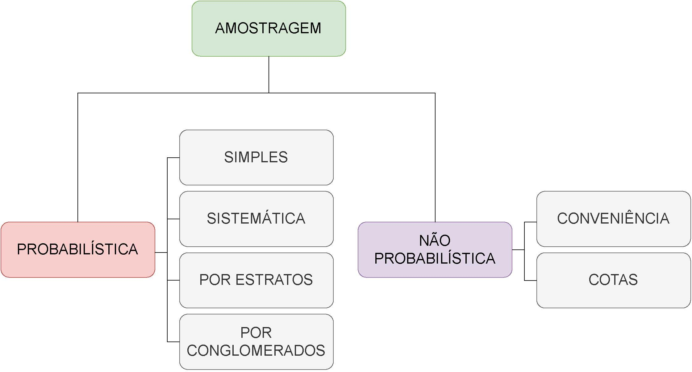
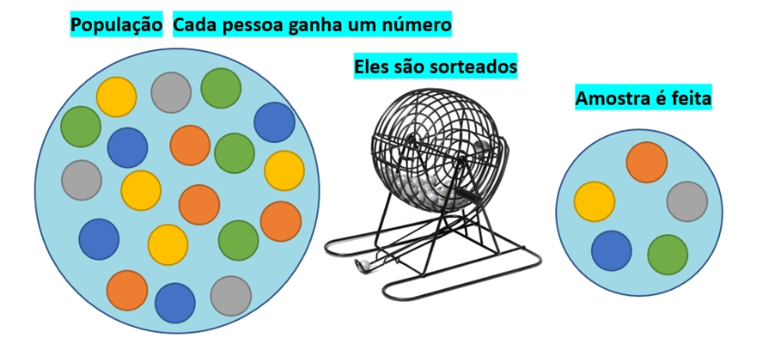
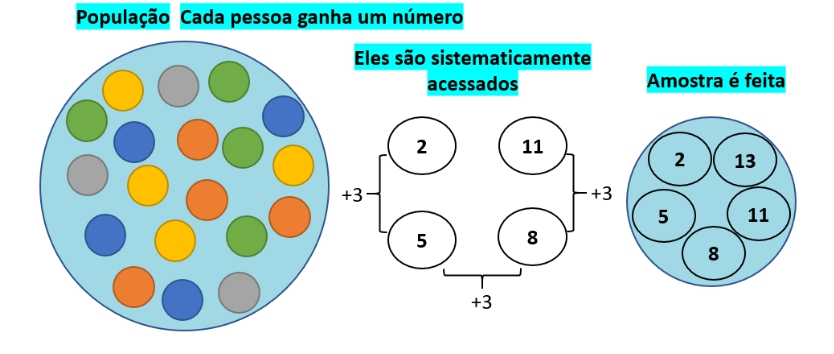
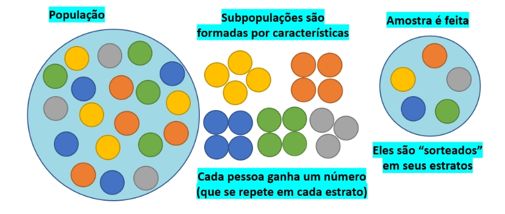
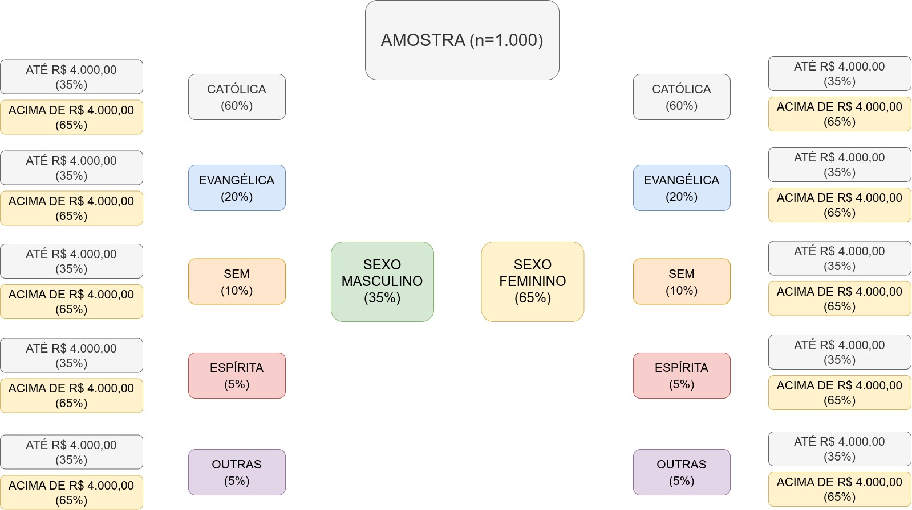
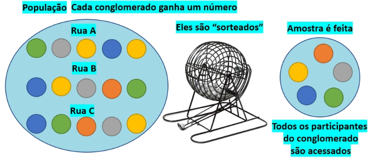
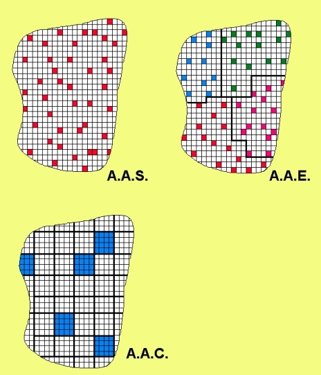
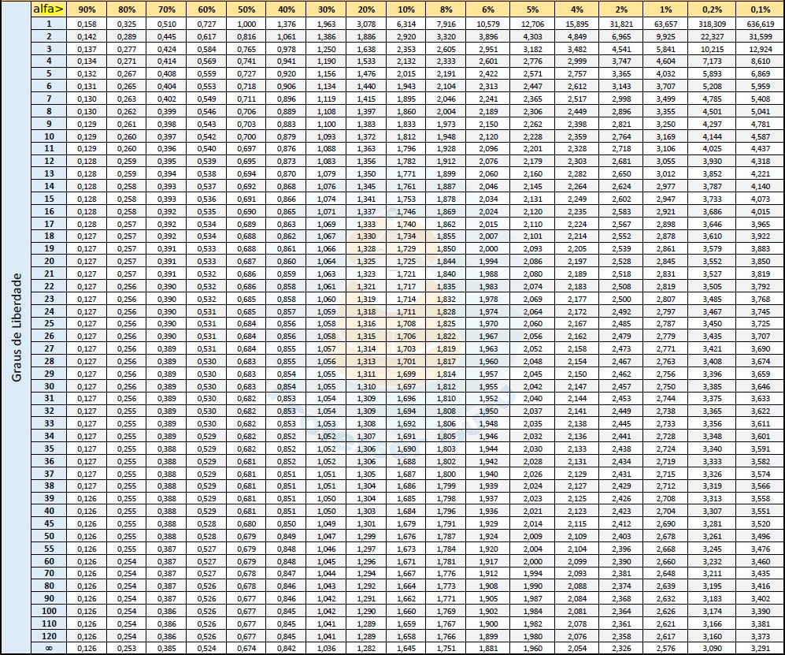

```{r, echo=FALSE, include=FALSE}
colFmt <- function(x,color) {
  
  outputFormat <- knitr::opts_knit$get("rmarkdown.pandoc.to")
  
  if(outputFormat == 'latex') {
    ret <- paste("\\textcolor{",color,"}{",x,"}",sep="")
  } else if(outputFormat == 'html') {
    ret <- paste("<font color='",color,"'>",x,"</font>",sep="")
  } else {
    ret <- x
  }

  return(ret)
}

#uso>>>> `r colFmt("REG",'red')`, 


```


```{r , echo = FALSE, include=FALSE}
library(texPreview)
library(kableExtra)
library(knitr)
knitr::opts_chunk$set(echo = TRUE)
```


# Introdução ao planejamento de pesquisas {#planejamento_pesquisas}


O estudo de uma realidade ainda não compreendida impõe ao pesquisador a formulação de hipóteses sobre suas possíveis causas, qualquer que seja a área do conhecimento:

\

- ciências biológicas;  
- ciências exatas;  
- ciências agrárias;  
- ciências humanas;  
- ciência sociais e outras.

\


```{r fig34, echo=FALSE, out.width='80%', fig.align='center', fig.cap="Representação esquemática do fluxo de infomações da amostra à produção de conhecimento "}

knitr::include_graphics("images7/esquema.jpg")

```

\

Uma hipótese é uma conjectura racional feita após um grande número de observações e experimentos; é uma tese que precisa ser confirmada ou verificada por meio de novas observações e experimentos.

\

Uma teoria científica é transitória. Uma conjectura temporariamente sustentada que um dia poderá ser refutada e substituída por outra. 

\


Conclusões baseadas em raciocínios plausíveis são provisórias, ao contrário daquelas produzidas por raciocínios demonstrativos. Considere as hipóteses a seguir: 

\


> Exemplo: Crianças socialmente isoladas assistem mais televisão do que crianças bem integradas a seus grupos?


> Exemplo: Famílias constituídas por um só dos genitores (pai ou mãe ausentes) geram mais delinquentes?   

> Exemplo: Diferentes tipos de uso do solo urbano influenciam na taxa de ocorrência de crimes?   


\

Só após ter-se bem definido pelo pesquisador o que seria uma **criança socialmente isolada**  e uma **criança bem integrada a um grupo**; assim como o que seria **família**, **genitor ausente** e até mesmo o que é **um delinquente**, o que é um **crime** e quais são os **usos do solo urbano** é que se pode avançar com o planejamento da pesquisa até a sua execução (entrevistas com crianças que responderiam o número de horas que passam defronte à televisão por dia ou um levantamento comparativo que permita verificar se há alguma correlação entre o comportamento social e o ambiente familiar de origem).


\

É necessário ao pesquisador testar suas hipóteses com informações trazidas da realidade estudada mesmo que, aparentemente, pareçam verdadeiras porque, caso contrário, seu julgamento seria conduzido baseado em ideias **pré-concebidas** por experiências pessoais anteriores, muitas vezes tendenciosas, resultando em conclusões cientificamente nulas.  


## Planejamento de pesquisas


Alguns consideram o artigo publicado em 1895 pelo estatístico norueguês Anders Nicolai Kiaer ( _Observations et expériences concernant les dénombrements représentatifs_ ) como o nascimento oficial da pesquisa por amostragem, apesar de existirem registros anteriores da realização de pesquisas por Laplace, Lavoisier e outros [(link)](https://www.jstor.org/stable/pdf/1403151.pdf?seq=1\#page_scan_tab_contents).

\

>Pesquisa é uma investigação sistemática para se obter informações precisas que permitam descrever, explicar o fenômeno que se deseja estudar.

\

> Pesquisas são baseadas em raciocínio lógico e envolve métodos indutivos e dedutivos.

\

> Requerem uma análise aprofundada de todos os dados coletados para que não haja anomalias associadas a eles.

\

> Uma pesquisa cria um caminho para gerar novas perguntas: os dados existentes ajudam a criar mais oportunidades de pesquisa.

\

> Uma pesquisa tem natureza analítica: utiliza todos os dados disponíveis para que não haja ambiguidade na inferência.

\

> A precisão é um dos aspectos mais importantes da pesquisa: as informações obtidas devem ser o mais precisas e verdadeiras possível: precisão nos instrumentos utilizados, nas calibrações de instrumentos ou ferramentas, treinamento de operadores.


## Tipos de pesquisas


```{=latex }

\begin{table}[h]
\centering
\caption{Quadro de tipos de pesquisas conforme sua classificação}
\begin{tabular}{|l|l|}
\hline 
\textbf{Classificação} & \textbf{Tipos de pesquisas}  \\ 
\hline 
Finalidade & básica (fundamental)   \\
           & aplicada (tecnológica) \\
\hline 
Abordagem  & qualitativa \\
           & quantitativa (descritiva ou analítica)\\
\hline 
Objetivos & exploratória \\
          & explicativa \\
\hline 
Tempo & transversal \\
      & longitudinal \\
\hline 
Natureza & observacional \\
         & experimental \\
\hline 
Obtenção dos dados & observacional \\
                    & experimental \\
                    & por amostragem \\

\hline 
\end{tabular} 
\end{table}
```

```{r eval=knitr::is_html_output(), results = "asis", echo = FALSE, message = FALSE}

tex2markdown <- function(texstring) {
  writeLines(text = texstring,
             con = myfile <- tempfile(fileext = ".tex"))
  texfile <- pandoc(input = myfile, format = "html")
  cat(readLines(texfile), sep = "\n")
  unlink(c(myfile, texfile))
}

textable <- "
\\begin{table}[h]
\\centering
\\caption{Quadro de tipos de pesquisas conforme sua classificação}
\\begin{tabular}{|l|l|}
\\hline 
\\textbf{Classificação} & \\textbf{Tipos de pesquisas}  \\\\ 
\\hline 
Finalidade & básica (fundamental)   \\\\
           & aplicada (tecnológica) \\\\
\\hline 
Abordagem  & qualitativa \\\\
           & quantitativa (descritiva ou analítica)\\\\
\\hline 
Objetivos & exploratória \\\\
          & explicativa \\\\
\\hline 
Tempo & transversal \\\\
      & longitudinal \\\\
\\hline 
Natureza & observacional \\\\
         & experimental \\\\
\\hline 
Obtenção dos dados & observacional \\\\
                    & experimental \\\\
                    & por amostragem \\\\

\\hline 
\\end{tabular} 
\\end{table}
"

tex2markdown(textable)
```

\

### Quanto à finalidade


- na pesquisa básica os dados coletados para aprimorar o conhecimento; a principal motivação é a expansão do conhecimento; é uma pesquisa não comercial que não tem como propósito imediato a criação ou invenção de nada; e,  
- uma pesquisa aplicada se concentra na análise e solução de problemas existentes na vida real; refere-se ao estudo que ajuda a resolver problemas práticos usando métodos científicos.

\

### Quanto à forma de abordagem


Os tipos de métodos de pesquisa podem ser amplamente divididos em duas categorias quantitativas e qualitativas:

\

- a pesquisa quantitativa descreve, infere e resolve problemas usando números; a ênfase é colocada na coleta de dados numéricos, no resumo desses dados e na realiazação de inferências a partir dos dados;  
- a pesquisa qualitativa é baseada em palavras, sentimentos, opiniões, sons e outros elementos não numéricos e não quantificáveis.

\

### Quanto aos objetivos


- uma pesquisa exploratória é conduzida para explorar um grupo de perguntas; as respostas e análises podem não oferecer uma conclusão final para o problema analisado; tem como objetivo lidar com novas problemáticas que não foram exploradas antes;  
- uma pesquisa explicativa é conduzida para entender o impacto de certas alterações em procedimentos padrão já estabelecidos; a realização de experimentos é a forma mais popular de pesquisa casual


\

### Quanto ao desenvolvimento no tempo


- em uma pesquisa transversal a análise está fixada em um momento específico no tempo;  
- uma pesquisa longitudinal desenrola-se em um período de tempo determinado 


\

### Quanto à natureza


- em uma pesquisa observacional o pesquisador atual de modo passivo;  
- uma pesquisa experimental o pesquisador é ativo ao promover processos de modo deliberado;
- em uma pesquisa amostral o pesquisador define uma população que apresenta a característica de inetresse do estudo. 

\

### Quanto à forma de obtenção dos dados


- nos levantamento de dados em uma pesquisa observaciona o pesquisador atua meramente como expectador de fenômenos ou fatos, sem, no entanto, realizar qualquer intervenção que possa interferir no curso natural e/ou no desfecho dos mesmos, embora possa, neste meio tempo, realizar medições, análises e outros procedimentos para coleta de dados;  
- em pesquisas experimentais o delineamento do experimento estabelece o modo como as variáveis em estudo serão aplicadas ao objeto com o propósito de se obter uma informação (resposta) sobre sua influência para validação ou não de uma hipótese previamente estabelecida;  
- levantamentos amostrais são aqueles nos quais os dados são extraídos de um subconjunto tecnicamente extraído de uma população bem definida por meio de procedimentos controlados pelo pesquisador e que podem ser subdivididos em probabilísticos (casuais ou aleatórios) e não probabilísticos (intencionalmente dirigidos).


\

## Principais etapas de uma pesquisa:


- Definição precisa do objetivo;  
- Planejamento;  
- Execução;
- Analise dos dados obtidos;  
- Resultados; e,
- Conclusões.

### Objetivo

Ao se iniciar qualquer pesquisa deve-se ter bem muito bem definido o problema a ser pesquisado, reduzido a uma _hipótese testável_. 

\


Os objetivos de uma pesquisa devem ser elaborados de forma bastante clara (já que as demais etapas da pesquisa tomam como base esses objetivos) e, invariavelmente, envolve uma extensa revisão da literatura existente sobre o assunto. 

\

> Exemplo: (objetivo geral) estabelecer o perfil dos estudantes universitários de Londrina para se (objetivos específicos) conhecer a renda média familiar e cidade de origem. Hipótese: a renda média familiar dos estudantes com origem diversa de Londrina é menor que do que os da própria cidade.

\


Uma vez que o objetivo geral está estabelecido e as hipóteses a serem testadas foram formuladas deve-se definir a população alvo cujos elementos contém a informação desejada considerando as definições estabelecidas para o problema. 


\

- todas as universidades de Londrina (ou apenas as universidades públicas ou particulares); 
- todos os cursos (ou algum em particular) ...


## População


Denomina-se por população ao universo de todos os elementos que apresentam a característica (informação) sob estudo (o termo aqui é utilizado em sentido estritamente técnico, nada relacionado ao número de habitantes de um determinado local).

\


- os pesos dos estudantes de uma determinada escola (população: todos os alunos);  
- os salários pagos por uma empresa (população: todos os funcionários legalmente existentes);  
- a proporção de indivíduos favoráveis a determinado projeto em uma cidade (população: todos os habitantes dessa cidade);  
- a durabilidade das peças sob produção em uma certa fábrica (população: todas as peças produzidas por essa fábrica);
- o número de horas passadas defronte à televisão por crianças até 10 anos de idade no Brasil (população: todas as crianças do Brasil com até 10 anos).

\

## Censo


Denomina-se por censo à investigação de todos os elementos da população defnida, o que resulta em apuração exata da informação requerida na pesauisa.

\

Todavia, muitos objetos de pesquisa impõem um grau de dificuldade e custo financeiro muito elevados para a execução de um censo o que acaba por tornarem não muito frequentes e, usualmente são realizados apenas pelo estado para dar suporte ao planejamento nacional ou local.


## Amostra


A coleta de dados em toda a população é inviável (ou até mesmo impossível) por diversas razões como, por exemplo: 

\

- tempo e/ou recursos financeiros limitados;  
- grande dispersão geográfica da população impondo complicações de ordem logística;  
- ensaios destrutivos (corpos de prova) para geração de informações;  
- inexistência _a priori_ de dados, demandando a realização de experimentos para a sua geração.

\

Denomina-se por amostra a qualquer subconjunto da população, extraído mediante procedimentos tecnicamente prescritos.

\

Se a característica em estudo em uma população fosse homogênea em todos os seus elementos, qualquer tamanho de amostra seria suficiente (na realidade, bastaria um elemento dessa população para estudar a característica em toda ela).

\

Considerando que existe variabilidade da característica nos elementos da população o pesquisador deve usar procedimentos estatísticos para a realização da amostragem e assegurar que tal variabilidade se reflita igualmente na amostra.

\

Quando a população é grande o estudo de uma fração (amostra) mostra-se mais vantajoso pelas seguintes razões:

\

- redução de custos;  
- redução de prazos: problemas relacionados à data de referência e a imprecisões introduzidas ao se fixar uma data pretérita (dificuldade em se recordar); e,  
- maior precisão nas informações: menos entrevistadores (mas com alto nível de treinamento) e procedimentos de acompanhamento mais rigoros.


\

Todavia há situações nas quais a extração de uma amostra não recomendada como:

\

- população pequena
- a característica de interessa é de fácil mensuração na população;
- necessidade de elevada precisão na estimação.


## Planejamento do levantamento amostral


O planejamento do levantamento amostral deve considerar:

\


-população objeto: identificar a população total de interesse sobre a qual desejamos obter informações;
- característica populacional: delimitar o aspecto da população que interessa ao estudo;  
- unidade amostral: definida de acordo com o interesse do estudo é onde a informação de interesse está; pode ser uma peça, um indivíduo, uma família, uma fazenda, um corpo de prova, etc;  
- erro amostral: diferença entre um resultado obtido pela análise da informação trazida por uma amostral específica e o verdadeiro valor da informação na população;  
- tamanho da amostra: decorrência do item anterior e também das probabilidades de cometimento de erros do tipo I e II estabelecidas _a priori_ (testes de hipóteses) 

\

## Elaboração dos questionários


Um questionário deve ser previamente elaborado de modo a manter o foco na obtenção de dados necessários à pesquisa:

\

- facilitação da comunicação: a linguagem deve ser a mesma adotada pelo público-alvo; e a redação precisa ortograficamente; 
- perguntas ambíguas ou não relacionadas à hipótese a ser testada devem ser evitadas, bem como o uso de termos ou simples palavras que possam induzir o respondente a uma opção;
- respostas possíveis: oferecer todas as possíveis alternativas de resposta para que o respondente possa encontrar sua melhor opção e não desistir da pesquisa;


### Tipos de perguntas:


- pergunta desqualificatória: funciona como um filtro para evitar que respondentes que não integrem o público-alvo respondam à pesquisa;
- pergunta de resposta única:  modelo de pergunta mais comum;
- pergunta de seleção múltipla: o respondente pode selecionar todas as opções que desejar dentre as alternativas oferecidas;
- pergunta em escala: formato de pergunta onde o respondente escolhe em uma escala de pontos pré-determinada (0 a 5; 0 a 10; 1 a 5, entre outros) e permite uma segunda análise a perguntas com apenas duas opções (_concordo totalmente_ ou _discordo totalmente_, por exemplo).

\

Algumas vantagens de pesquisas virtuais:

\

- impessoalidade: a ausência do entrevistador induz o respondente a uma reposta sincera;
- conveniência: o respondente pode participar da pesquisa em horário mais flexível;
- abrangência: permite alcançar mais facilmente um maior número de pessoas;
- menor custo envolvido; e,
- facilidade de tabulação: as respostas apresentadas pelo respondente podem ser automaticamente tabuladas e apresentadas na forma de gráficos.

\

### Execução do levantamento amostral


Encaminhamento dos questionários (ou disponibilização em meios virtuais); realização das entrevistas, do experimento ou ainda da observação.

### Análise exploratória dos dados

Obtenção de sínteses numéricas, apresentação na forma de tabelas e gráficos de variados formatos das respostas obtidas nos questionários.


### Resultados e conclusões


Apresentação dos resultados coerentes com os objetivos estipulados e a conclusão acerca da hipótese inicialmente proposta (rejeição u não rejeição da hipótes nula contraposta àquela formulada).


## Técnicas de amostragem

\


O modo de se obter uma amostra é tão importante, e existem tantos modos de fazê-lo, que esses procedimentos constituem especialidades dentro da Estatística. 

\	

Todavia os que são mais frequentemente empregados estão representados na Figura \ref{fig35}: 


\

```{r fig35, echo=FALSE, out.width='80%', fig.align='center', fig.cap="Principais procedimentos para se extrair uma amostra"}



```

\


## Amostragem probabilística


Uma amostragem de natureza probabilística é aquela que reúne todas as técnicas pelas quais se deixa completamente ao acaso a escolha dos elementos da população a serem incluídos na amostra. A aleatorização visa assegurar que a informação extraída da amostra possa ser generalizada na população de origem. A cada extração a probabilidade de um elemento ser incluído é igual para todos (embora ela e altere em razão de ser uma extração sem reposição).

\


### Amostragem aleatória simples (AAS)


Consiste na seleção de $n$ elementos amostrais de tal modo que cada um deles tenha a mesma probabilidade de pertencer à amostra que os demais. 

\

```{r fig36, echo=FALSE, out.width='80%', fig.align='center', fig.cap="Amostra aleatória simples AAS"}



```

\

Duas situações distintas: 


\

- com reposição do elemento amostral escolhido: o mesmo elemento da população pode ser amostrado mais de uma vez (a probabilidade de seleção não se altera); ou, 
- sem reposição: cada elemento da população é amostrado uma única vez (a probabilidade de seleção se altera)

\


> Amostragem aleatória simples sem reposição. Admita uma população ($N=5$) composta pelos elementos: {a, b, c, d, e} (podem ser as rendas anuais de cinco pessoas, os pesos de cinco vacas ou cinco modelos diferentes de aviões) da qual se deseje extrair uma amostra de tamanho $n=3$. 

\

	
Haverá 10 amostras possíveis de serem extraídas com tamanho 3 ($n=3$): {abc, abd, abe, acd, ace, ade, bcd, bce, bde, cde} pois: 

\

$$
C_{(N,n)} = \frac{ N! }{ n! \times ( N-n)!}=10
$$

\

> Amostragem aleatória simples com reposição. Considere agora a mesma população anterior ($N=5$) e o mesmo tamanho da amostra ($n=3$). Se a amostragem for feita com reposição teremos então $N^{n}=125$ amostras possíveis de serem extraídas: {aaa, aab, aac, aad, aae, aba, abb, abc, abd, abe, ......}  


\


```{r}
# Dados
conjunto=c("a", "b", "c", "d", "e")


# As 10 combinações possíveis tomando-se 3 elementos:
library(combinat)
#combn(conjunto, 3) (remova o # para executar)

# As 125 permutações possíveis tomando-se 3 elementos:
# permn(conjunto) (remova o # para executar)

# Extração de uma amostra (sem reposição) composta por 3 elementos do conjunto:
amostra_sr=sample(conjunto, 3, replace=FALSE)
amostra_sr

# Extração de uma amostra (com reposição) composta por 3 elementos do conjunto:
amostra_cr=sample(conjunto, 3, replace=TRUE)
amostra_cr


```

\


> Do ponto de vista da quantidade de informação contida na amostra, a amostragem sem reposição é mais adequada. 

\

> Todavia a amostragem com reposição conduz a um tratamento teórico mais simples, pois ele implica que tenhamos independência entre as unidades selecionadas (não há alteração na probabilidade de seleção).

\

> Para populações muito grandes a reposição ou não é irrelevante.

\

Uma vez determinadas as possíveis amostras, segue-se o problema de como elas serão efetivamente extraídas na prática numa amostragem aleatória simples. 

\


Numa situação simples como a que acabamos de conceber poderíamos escrever cada uma das 10 (ou 125) possíveis amostras em um pedaço de papel e colocá-los em uma urna para serem sorteados. 

\


Ou então enumerar os elementos da lista de possibilidades atribuindo um número a cada um e, em seguida, usar uma tabela de números aleatórios (ou um programa computacional para sua geração) para a escolha dos elementos que integrarão a amostra.

\

Uma AAS raramente é realizada na prática pois é necessário dispor de uma listagem bem definida _a priori_.

\

Assim, sob circunstâncias reais, um planejamento amostral pode ser definido de modo a assegurar que uma amostra mais informativa, mais barata e rápida possa ser extraída, principalmente quando a amostragem aleatória simples mostrar-se impraticável.


\

Em estudos de larga escala muitas vezes requerem uma abordagem mista.

\


A amostragem mista tem vantagens a nível prático, quando se conhecem algumas informações da população; assim sendo define-se uma característica dos elementos a incluir na amostra, deixando-se os restantes fatores ao acaso. 


\

Neste tipo de amostragem salientam-se os seguintes métodos:


\

1- sistemática;  
2- estratificada; e,  
3- por conglomerado.

\

### Amostragem aleatória sistemática

\

```{r fig37, echo=FALSE, out.width='80%', fig.align='center', fig.cap="Amostra sistemática"}



```

\


Quando os elementos da população estão dispostos sob alguma maneira organizada e aleatória (linha de produção, listagens, ... ) a extração de elementos pode ser realizada pela estipulação de um ponto de partida aleatório (o primeiro elemento a ser tomado como integrante da amostra) e de um passo (intervalo), de modo que a seleção dos demais elementos será feita a cada $k$ elementos da listagem. 


\

Roteiro:


- se $N$ é o tamanho da população a ser amostrada;
- e $n$ o tamanho da amostra que se deseja;


calcula-se o passo (intervalo) a ser adotado para a extração dos demais elementos amostrais. O primeiro elemento a ser coletado será aleatoriamente escolhido dentre os $k$ primeiros.


\

$$
S=\frac{N}{n}
$$

\


Sorteia-se o ponto de partida (um dos $S$ números do primeiro intervalo) e depois, a cada $S$ elementos da população, retira-se um para fazer parte da amostra, até completar o valor de$n$.

\

Algumas situações possíveis de se encontrar: 

\

- se $S$ for fracionário pode-se aumentar $n$ até tornar $S$ um inteiro;  
- reduzir $N$ em 1 unidade; 
- se $N$ for um número primo, excluem-se por sorteio alguns elementos da população para tornar $S$ inteiro.   
 
\

> Exemplo: considerem uma população composta por pelos seguintes elementos P={1, 2, 3, 4, 5, 6, 7, 8, 9, 10} (N=10) da qual desejamos extrair uma amostra de tamanho 3 (n=3). 

\	

O passo $S$ (o intervalo de extração de cada elemento) será igual a $S=\frac{N}{n}=\frac{10}{3}=3,33$ (fracionário). Aumentando-se para $n=4$ resultará também em um $S$ fracionário (2,5). Com $n$=5, $S=2$.  O primeiro elemento a integrar a amostra será será aleatoriamente escolhido dentre os 5 ($S$) primeiros. Assim, as duas possíveis amostras serão:

\


\begin{align*}
A1 & = {1, 3, 5, 7, 9}; e, \\
A2 & = {2, 4, 6, 8, 10}. \\
\end{align*}

\


Avaliar, alternativamente,  excluir aleatoriamente 1 elemento da população ($N=9$). Mantendo-se $n=3$ teremos $S=3$. 

\

\begin{align*}
A1 & = {1, 4, 7}; \\
A2 & = {2, 5, 8}; e, \\
A3 & = {3, 7, 9}. \\
\end{align*}


\

> Exemplo: uma operadora telefônica pretende saber a opinião de seus assinantes comerciais sobre seus serviços na cidade de Florianópolis. Supondo que há 25.037 assinantes comerciais e a amostra precisa ter no mínimo 800 elementos, mostre como seria organizada uma amostragem sistemática para selecionar os respondentes sabendo que a operadora dispõe de uma lista ordenada alfabeticamente com todos os seus assinantes.

\

Calculando o passo ($S$):

\	

\begin{align*}
S & = \frac{N}{n} \\
  & = \frac{25037}{800} \\
  & = 31,29
\end{align*}


\

Aumentar $n$ não irá resolver o problema ($N=25037$ é um número **primo**). Arredondar $S$ para cima irá extrapolar o tamanho da população ($32 \times 800=25600 >25037$). 

\

Podemos arredondar $S$ para baixo ($31 \times 800=24800$) para baixo e excluir **aleatoriamente** 237 elementos da população (é uma população relativamente grande e isso não acarretará problema algum). 

\	

Assim nossa amostra será composta por 800 elementos ($n$) de uma população de (reduzida a) $24800$ elementos. Sorteamos **aleatoriamente** o primeiro elemento dentre os 31 primeiros da listagem. Os demais, a cada 31 **elementos**.

\

Na amostragem sistemática deve-se avaliar o **risco** de periodicidades sistemáticas: 

\


- se lista de elementos estiver organizada com base em alguma informação da população (escolaridade, renda, ...) que possa induzir a algum tipo de viés;  
- se em um processo produtivo for sabidamente reconhecido que falhas podem se tornar mais frequentes a cada certo número de unidades produzidas (máquinas descalibradas).   

\

### Amostragem aleatória estratificada


```{r fig38, echo=FALSE, out.width='80%', fig.align='center', fig.cap="Amostra estratifiada"}



```

\


Quando se pode identificar na população a presença de **grupos distintos** (estratos) a amostragem estratificada se dá pela realização de amostragens aleatórias simples dentre os elementos de **cada um desses grupos**.

\	

Um **estrato** é uma subdivisão da população onde se observa a existência de uma razoável **homogeneidade interna** da informação desejada. Desse modo, é esencial para que a amostra final tenha qualidade, que **entre os estratos** estabelecidos exista **heterogeneidade** e assim, cada indivíduo pertença a apenas um estrato.

\

Há dois modos possíveis de se realizar uma amostragem estratificada:

\


- não proporcional; e, 
- proporcional. 

\

Em uma amostragem estratificada **não proporcional** o total de elementos extraídos de cada estrato é igual à razão do tamanho da amostra pelo número de estratos (de cada estrato serão escolhidos aleatoriamente um **mesmo número** de elementos). 

\

Esse modo de extração de elementos implica considerar **igual representatividade** de cada estrato na população, **independentemente** de quantos elementos ele abrigue (estratos menores teriam um mesmo peso que estrato maiores). 


\


Já na amostragem estratificada **proporcional** a amostra extraída de cada um dos estratos **segue algum critério de ponderação** do peso ou variabilidade de cada estrato da população.

\

Na alocação proporcional ao tamanho dos estratos a proporção relativa de cada uma das $k$ amostras extraídas ($n_{k}$) em relação ao tamanho de cada um dos $k$ extratos ($N_{k}$) é a mesma (garantindo que estratos maiores tenham mais elementos dentro da amostra final e que estratos menores tenham menos presença nela):

\

$$
\frac{n_{1}}{N_{1}} = \frac{n_{2}}{N_{2}} = \dots = \frac{n_{k}}{N_{k}}
$$
\

Onde:

\

- $N$ é o tamanho da população;  
- $n$ o tamanho da amostra que se deseja extrair da população;  
- $N_{i}$ é o tamanho do $i-ésim$o estrato da população, tal que $N=N_{1}+N_{2}+\dots+N_{k}$;  
- $n_{i}$ o tamanho da $i-ésima$ amostra a ser extraída do $i-ésimo$ estrato, tal que $n = n_{1} + n_{2} + \dots + n_{k}$.

\

O tamanho da $i-ésima$ amostra a ser extraída de um $i-ésimo$ estrato será determinada em razão do tamanho da amostra que se deseja extrair ($n$), o tamanho da população ($N$) e o tamanho do $i-ésimo$ estrato ($N_{i}$) tal que:

\

$$
n_{i} =  \frac{N_{i}}{N} \cdot n
$$
\

para i=1,2,...,k estratos.

\

> Exemplo: considerem uma comunidade universitária composta 8000 indivíduos (N=8000) sendo 800 professores ($N_{1}=800$), 1200 funcionários ($N_{2}=1200$) e 6000 estudantes ($N_{3}=6000$), da qual se estipulou extrair uma amostra de tamanho igual a 900 elementos ($n=900$) para fins de uma pesquisa sobre o estilo de liderança preferido, que se considera ser diferente para cada grupo componente da comunidade acadêmica.

\

Numa amostragem estratificada **não proporcional** os elementos são extraídos em igual quantidade de cada um dos estratos:


\


- 300 professores;  
- 300 funcionários; e,  
- 300 alunos.

\

Numa amostragem estratificada uniforme todas os elementos são extraídos em quantidade de modo independente do peso proporcional dos estratos na população. Esse tipo de amostragem apresenta resultados **menos precisos** mas, em contrapartida, estudar características de cada camada de forma mais eficiente.


\


Numa amostragem estratificada **proporcional** os elementos são extraídos de cada um dos estratos considerando-se seus diferentes tamanhos (suas proporções em relação à população total):

\

-  o estrato dos professores possui $N_{p}=800$ elementos;
-  o estrato dos funcionários possui $N_{f}=1200$ elementos; e,
-  o estrato dos estudantes possui $N_{e}=6000$ elementos.


\

Para uma amostra com um total de $n=900$ elementos seguem-se as quantidades a serem extraídas aleatoriamente de cada u dos três estratos:

\

-  $n_{p}=\frac{N_{p}}{N}.n=\frac{800}{8000}.900=90$ professores;
-  $n_{f}=\frac{N_{f}}{N}.n=\frac{1200}{8000}.900=135$ funcionários;
-  $n_{e}=\frac{N_{e}}{N}.n=\frac{6000}{8000}.900=675$ alunos;

\

Partindo-se desses tamanhos amostrais determinados (90 professores, 135 funcionários e 675 alunos) pode-se recorrer à extração sistemática usando-se a listagem dessas três categorias: 


\

- $S_{p}=\frac{N_{p}}{n_{p}}$ em que $S_{p}$ é o passo a ser seguido na extração de $n_{p}$ professores (90) da ``população'' de $N_{p}$ professores (800); 
- $S_{f}=\frac{N_{f}}{n_{f}}$ em que $S_{f}$ é o passo a ser seguido na extração de $n_{f}$ funcionários (135) da ``população'' de $N_{f}$ funcionários (1200); e, 
- $S_{e}=\frac{N_{e}}{n_{e}}$ em que $S_{e}$ é o passo a ser seguido na extração de $n_{e}$ alunos (675) da ``população'' de $N_{e}$ alunos (6000). 

\

Muitos ajustes devem ser feitos pois, de modo frequente, os resultados dos passos obtids na prática resultam em números fracionários. Todavia, devemos ter sempre procurar não reduzir o tamanho amostral e ter em mente que o tamanho da população não pode ser aumentado. 

\

Para os professores: $S_{p}=\frac{800}{90}=8,88$.  Se tomamos $S_{p}=9$ (um professor a cada nove da lista) veremos que para extrair 90 professores a população teria de ser de 810 (a população é de 800). Uma das opções seria usar $S_{p}=8$ e se extrair 100 professores (uma amostra um pouco maior). Outra possibilidade seria ainda usar $S_{p}=8$ remover aleatoriamente 80 professores da população e então tomar 90 professores (pois com $S_{p}=8$, $8 . 90=720$).

\

Para os funcionários: $S_{f}=\frac{1200}{135}=8,88$ (o mesmo porque essas amostras foram estabelecidas de modo proporcional).  Se tomamos $S_{f}=9$ (um funcionário a cada nove da lista) veremos que para extrair 135 funcionários a população teria de ser de 1215 (a população é de 1200). Uma das opções seria usar $S_{f}=8$ e se extrair 150 funcionários (uma amostra um pouco maior). Outra possibilidade seria ainda usar $S_{f}=8$ remover aleatoriamente 120 funcionários da população e então tomar 135 funcionários (pois com $S_{f}=8$, $8 . 135=1080$).

\

Do mesmo modo para os alunos: $S_{e}=\frac{6000}{675}=8,88$ (o mesmo porque essas amostras foram estabelecidas de modo proporcional).  Se tomamos $S_{e}=9$ (um aluno a cada nove da lista) veremos que para extrair 675 alunos a população teria de ser de 6075 (a população é de 6000). Uma das opções seria usar $S_{e}=8$ e se extrair 750 alunos (uma amostra um pouco maior). Outra possibilidade seria ainda usar $S_{e}=8$ remover aleatoriamente 600 funcionários da população e então tomar 600 alunos (pois com $S_{e}=8$, $8 . 135=1080$).


\

Ao final poderíamos extrair então 100 professores, 150 funcionários e 750 alunos; ou, pela segnda possibilidade, extrair  90 professores, 135 funcionários e 600 alunos (eliminando-se aleatoriamente elementos das populações antes de se sistematizar a extração, como antes explicado).

\

A proporção de elementos extraídos de cada um dos estratos é constante entre os extratos, asseguando uma extração proporcional:

\

$$
\frac{100}{800} = \frac{150}{1200} =\frac{750}{6000}=0,125 \\
\frac{90}{720} = \frac{135}{1080} =\frac{675}{5400}=0,125 
$$
\


Pode-se **otimizar**  uma amostragem estratificada proporcional consideran-de também sua variabilidade interna. O tamanho de cada uma das amostras ($n_{1},n_{2},\dots,n_{k}$) dos diferentes estratos são proporcionais aos **tamanhos** dos estratos ($N_{1},N_{2},\dots, N_{k}$) **e também** segundo algum critério adicional (otimização), como a variabilidade interna de cada estrato ($\sigma_{1},\sigma_{2},\dots,\sigma_{k}$) de modo a se manter iguais as razões:  

\


$$
\frac{n_{1}}{N_{1} \cdot \sigma_{1}} = \frac{n_{2}}{N_{2} \cdot \sigma_{2}} = \dots = \frac{n_{k}}{N_{k} \cdot \sigma_{k}}
$$
\

Onde: 
\

- $N$ é o tamanho da população;  
- $n$ o tamanho da amostra que se deseja extrair da população;  
- $N_{i}$ é o tamanho do $i-ésim$o estrato da população, tal que $N=N_{1}+N_{2}+\dots+N_{k}$;  
- $n_{i}$ o tamanho da $i-ésima$ amostra a ser extraída do $i-ésimo$ estrato, tal que $n = n_{1} + n_{2} + \dots + n_{k}$;e,
- $\sigma_{i}$ é o desvio padrão do $i-ésimo$ estrato.\newline


\

O tamanho da $i-ésima$ amostra a ser extraída de um $i-ésimo$ estrato será determinada em razão do tamanho da amostra que se deseja extrair ($n$), o tamanho da população ($N$), do tamanho e variabilidade do $i-ésimo$ estrato ($N_{i}$ e $\sigma_{i}$) tal que:

\

$$
n_{i} =\frac{ n \cdot N_{i} \cdot \sigma_{i} }{ N_{1} \cdot \sigma_{1} + N_{1} \cdot \sigma_{1} + \dots+ N_{k} \cdot \sigma_{k}}
$$

para i=1,2,..., k estratos.

\

> Exemplo: considere estudar a opinião de estudantes de uma universidade com relação à legalização do aborto. 
A equipe possui dados descritivos relacionados ao sexo, orientação religiosa e rendimento médio familiar de toda a comunidade acadêmica. 
Na revisão bibliográfica identifica-se que algumas das variáveis que habitualmente implicam em opiniões diferentes (escolaridade e idade) já não mais precisam ser consideradas; todavia, outras ainda devem ser consideradas.
Assim, um plano de estratificação de vários niveis pode ser estabelecido partindo-se da premissa de homogeneidade de opinião interna em cada um deles: sexo, orientação religiosa e rendimento familiar.  

\

Considerando uma amostra de $n=1.000$ estudantes e as seguintes medidas descritivas disponibilizadas pela universidade e relacionadas à sua população de estudantes:

\


- sexo: 35\% masculino e 65\% feminino;  
- orientação religiosa: 60\% católica; 20\% evangélica; 10\% sem; 5\% espírita e 5\% outras; e,  
- rendimento médio mensal familiar: 35\% até R\$ 4.000,00, 65\% acima de R\$ 4.000,00. 

\

podemos estabelecer vária camadas estratificadas proporcionalmente, tal como a ilustrado na Figura \@ref(fig:fig39).


\


```{r fig39, echo=FALSE, out.width='80%', fig.align='center', fig.cap="Plano de estratificação proporcional"}



```


\

### Amostragem aleatória por conglomerados


```{r fig40, echo=FALSE, out.width='80%', fig.align='center', fig.cap="Amostragem por conglomerados"}



```

\


Muitas vezes a **dispersão espacial**de uma população a ser investigada torna impeditiva uma amostragem aleatória simples.

\	

Um modo de contornar essa dificuldade é dividir a área total onde se assenta a população de interesse em várias _áreas geográficas menores_ e sem sobreposição, tais como cidades, regionais de cidades, bairros, quarteirões de um bairro, .... Essa subdivisão pode também ser realizada valendo-se de critérios organizacionais como, por exempo, universidades, escolas, grau escolar, departamentos de uma empresa, ....

\

As subpopulações que se localizam nessas áreas menores passam a ser denominadas de conglomerados e são como que representações **em escala reduzida** da população total. 

\

A **heterogeneidade** presente na população original passa a estar representada dentro de um conglomerado. Ou seja, é essencial para a qualidade final da amostra extraída desse modo, que os elementos dentro de cada conglomerado sejam tão **diversos** quanto a diversidade que se observa nos elementos da população total (a ideia de representação em escala reduzida). 

\

Em uma amostragem de **apenas 1 estágio**, após serem aletariamente sorteados um certo número de conglomerados, todos os elementos internos desses conglomerados são estudados. 

\

Todavia, considerando que os elementos de um conglomerado natural dentro de uma população são habitualmente mais homogêneos do que os elementos da população total (os moradores de um bairro são mais semelhantes entre si do que todos os moradores do município), **pode não ser** necessário um grande número de elementos para se representar adequadamente um conglomerado natural.

\

Uma diretriz científica num processo de amostragem por conglomerados é **maximizar o número de conglomerados** e  **diminuir** o número de elementos aleatoriamente escolhidos **dentro** de cada um deles. 

\

Recomenda-se observar as diferenças de tamanho existentes entre cada conglomerado, de modo a equilibrar a probabilidade. A probabilidade de seleção de um elemento num desenho de amostragem com probabilidade proporcional ao tamanho:

\

- na primeira etapa é dada a cada conglomerado uma oportunidade de seleção **proporcional** ao seu tamanho; e,  
- na segunda etapa um **mesmo número** de elementos é escolhido dentro de cada conglomerado selecionado.

\

Esses procedimentos igualam as probabilidades últimas de seleção de todos os elementos da população pois:

\


- conglomerados com mais elementos têm maior probabilidade de serem selecionados; e,
- elementos em conglomerados maiores têm menor chance de seleção do que elementos em conglomerados menores.

\

> Exemplo: a população universitária de Londrina (estimada em 25.000 estudantes) pode ser entendida como distribuída em vários **conglomerados organizacionais** como, por exemplo: UEL; UNIFIL; PUC; INESUL; UTFPr; Arthur Thomas; CESUMAR; Pitágoras; Positivo; ....

\

Se desejamos realizar uma pesquisa entre os estudantes universitários de Londrina (na qual sabe-se que não fará diferença se a instituição é pública ou privada) podemos sortear aleatoriamente alguns desses conglomerados.  

\	

Entretanto, lembrando que todos os elementos de um conglomerado devem ser entrevistados, pode ser que o número de estudantes em cada conglomerado escolhido ainda seja por demais elevado. 

\	

Nesse caso, um **segundo estágio** (como, por exemplo, utilizar a subdivisão administrativa que as universidades habitualmente adotam ao se subdividir em diversos centrso de estudos como conglomerados dentro dela) pode ser proposto.


\

Assim como na estratificação, a proposição de conglomerados deve sempre consider as variáveis condicionantes relacionadas com o objeto de estudo para que as informações de todas as unidade amostrais finais a serem entrevistadas possa ser usada seguramente para se inferir sobre a informação na população sob estudo.   


\

> Exemplo: a Pesquisa Nacional por Amostra de Domicílios (PNAD) do IBGE coleta informações demográficas e socioeconômicas sobre a população brasileira. Sinteticamente, utiliza amostragem por conglomerados em três estágios:


\

- primeiro estágio: amostras de municípios (conglomerados) para cada uma das regiões geográficas do Brasil (Norte, Nordeste, Centro-Oeste, Sudeste e Sul);  
- segundo estágio: setores censitários sorteados (subdivisão estabelecida pelo IBGE dentro de um município) em cada município (conglomerado sorteado);  
- terceiro estágio: domicílios sorteados aleatoriamente em cada setor censitário.


\


```{r fig41, echo=FALSE, out.width='100%', fig.align='center', fig.cap="Ilustração comparativa dos principais modos de extração de amostras"}



```

\


> Exemplo: considere estudar a opinião de estudantes universitários de toda uma cidade com relação à legalização do aborto.
A equipe possui dados descritivos relacionados ao sexo, orientação religiosa e rendimento médio familiar de toda a comunidade acadêmica. 
Na revisão bibliográfica identifica-se que algumas das variáveis que habitualmente implicam em opiniões diferentes (escolaridade e idade) já não mais precisam ser consideradas; todavia, outras ainda devem ser consideradas.
Assim, um plano de estratificação de vários niveis pode ser estabelecido partindo-se da premissa de homogeneidade de opinião interna em cada um deles: sexo, orientação religiosa e rendimento familiar.   

\


Nesse caso, podemos considerar cada universidade como um conglomerado. Numa primeira etapa promovemos um sorteio e, na sequência, uma estratitificação da amostra total em termos da população estudantil de cada conglomearado. A partir desse ponto, em cada universidade, estratificações suplementares são feitas para se considerar proporcionalmente as diferentes opiniões (sexo, orientação religiosa, renda). 

Ao final, após vários estágios, uma amostra não probabilística pode ser extraída de cada grupo individualizado anteriormente, tal como a ilustrado na Figura \@ref(fig:fig410).


```{r fig410, echo=FALSE, out.width='100%',fig.align='center',fig.cap="Planejamento da extração da amostra"}


```


## Amostragem não probabilística


Não obstante os métodos de amostragem probabilísticos serem adequados à generalização da informação colhida, há diferentes situações para as quais podemos nos decidir por métodos probabilísticos como, por exemplo, para tornar a pesquisa menos custosa financeiramente ou ainda porque talvez não seja necessário ter um elevado rigor e precisão nas estimativas que se deseja obter.

\

Amostragens não probabilísticas são aquelas em que a amostra é extraída de modo _dirigido_ ( _intencional_, não aleatório) pelo pesquisador em decorrência da natureza de seu estudo, não sendo consideradas a probabilidade de seleção de seus elementos.


### Amostragem por conveniência


Esta técnica é muito comum e consiste em se selecionar uma amostra da população imediatamente acessível (prontamente disponível). Considerem, por exemplo, pesquisar a opinião de estudantes universitários em Londrina sobre determinado assunto. 

\	

Poderíamos considerar cada universidade localizada em Londrina como um conglomerado e, dentro delas, realizar uma amostragem aleatória de todos os seus estudantes (ou parte, se realizarmos o delineamento em mais de um estágio). 

\	

Por conveniência podemos simplesmente decidir ir a um encontro de estudantes universitários que se realiza na cidade e perguntar a alguns deles que se declarem estudar em Londrina qual sua opinião sobre aquele assunto.


\

As  limitações desse tipo de amostragem são óbvias posto poder haver no grupo de entrevistados diferentes segmentos sociais, econômicos, políticos, filosóficos, religiosos dentre muitos outros fatores de diferenciação, que podem ser fundamentais face às opiniões que se deseja colher sobre o assunto inquerido, resultando em graves distorções. 


\

Esse tipo de amostragem, embora não aleatória, é bastante utilizada na área de _marketing_ na qual geralmente as amostras são obtidas em locais com aglomerações, como teatros, cinemas, mercados, .... Neste caso, é importante o senso crítico do pesquisador para evitar vieses, por exemplo, não selecionar sempre pessoas de mesmo sexo, de mesma faixa etária, ....


### Amostragem por cotas


A amostragem por cotas assemelha-se com a amostragem estratificada proporcional; mas, ao contrário da amostragem estratificada, a seleção final (no estrato) não precisa ser aleatória. A população é vista de forma segregada (estratificada), dividida em diversos subgrupos como sexo, idade, raça, local de residência, ocupação, ....  

\

Para compensar a falta de aleatoriedade na seleção, costuma-se dividir a população num grande número de subgrupos e seleciona-se (não aleatoriamente) uma quantidade de elementos em cada subgrupo, proporcional ao seu tamanho. 

\

Numa pesquisa socioeconômica, a população pode ser dividida por localidade, por nível de instrução, por faixas de renda, ...


\

## Dimensionamento de amostras


### Erros


Há de distinguir dois tipos de erros associados a levamentamentos amostrais: 

\

- erros amostrais, as diferenças entre o resultado obtido em uma amostra específica (uma estatística) e seu verdadeiro valor na população (o parãmetro);  
- erros não amostrais (experimentais), decorrentes de dados amostrais coletados incorretamente, inconsistentemente, fruto de erros nas transcrições, delineamentos fracamente estabelecidos (resultando em amostras tendenciosas), leituras instrumentais imprecisas (resultantes da perda da calibração dos instrumentos ou operação por técnicos com diferentes habilidades).

\

Os erros amostrais ocorrem porque as amostras são aleatórias: se de um grupo de 100 números extrairmos uma amostra aleatória de 10 deles a média amostral calculada teria um valor diferente a cada diferente amostra extraída (essa flutuação é assunto da teoria da distribuição das médias e proporções amostrais). Já os erros não amostrais devem ser minimizados ou melhor não existir.


\


A determinação do tamanho de uma amostra ($n_{0}$) é função do _erro amostral_ tolerável e do _nível de significância_ $\alpha$ estabelecido _a priori_ pelo pesquisador que se relaciona ao _nível de confiança_ pretendido por $(1-\alpha)$.

\

Assim, se o **nível de significância** máximo admissível para o assunto pesquisado é $\alpha=0,05$, o **nível de confiança** será $(1-\alpha)=0,95$ (uma vez que: $\alpha + (1-\alpha)=1$). 

\

```{=latex }

\begin{table}[h]
\centering
\caption{Valores críticos de $z_{c}$ correspondentes a alguns níveis de significância (confiança)}
\begin{tabular}{|c|c|c|c|c|c|}
\hline 
Níveis de confiança $(1-\alpha)$ & 0,80 & 0,90 & 0,95  & 0,99  & 0,999  \\
Níveis de significância $\alpha$ & 0,20 & 0,10 & 0,05  & 0,01  & 0,001  \\
\hline 
$z_{c}$  & 1,28 & 1,64 & 1,96 & 2,57 & 3,29  \\
\hline 
\end{tabular} 
\end{table}

```

\


```{r eval=knitr::is_html_output(), results = "asis", echo = FALSE, message = FALSE}


tex2markdown <- function(texstring) {
  writeLines(text = texstring,
             con = myfile <- tempfile(fileext = ".tex"))
  texfile <- pandoc(input = myfile, format = "html")
  cat(readLines(texfile), sep = "\n")
  unlink(c(myfile, texfile))
}

textable <- "
\\begin{table}[h]
\\centering
\\caption{Valores críticos de $z_{c}$ correspondentes a alguns níveis de significância (confiança)}
\\begin{tabular}{|c|c|c|c|c|c|}
\\hline 
Níveis de confiança $(1-\\alpha)$: & 0,80 & 0,90 & 0,95  & 0,99  & 0,999  \\\\
Níveis de significância $\\alpha$:  & 0,20 & 0,10 & 0,05  & 0,01  & 0,001  \\\\
\\hline 
$z_{c}$                 & 1,28 & 1,64 & 1,96 & 2,57 & 3,29  \\\\
\\hline 
\\end{tabular} 
\\end{table}
"

tex2markdown(textable)

```

\

> Todavia,  como mais adiante se verá, há situações nas quais o valor crítico referente ao nível de confiança estabelecido e que será empregado no dimensionamento da amostra será obtido de uma outra distribuição (t de _Student_).

\

### Determinação do tamanho de uma amostra para estimação da média populacional


Determinação do tamanho $n_{0}$ de uma amostra para estimação da média considerando-se uma **população infinita** ($N \ge 20.n_{0}$) e seguindo uma distribuição Normal:

\

$$
n_{0} =  \frac{z_{c}^2 \cdot \sigma^2}{\varepsilon^2}
$$

\

em que:

\

- $n_{0}$: é o tamanho amostral;  
- $z_{c}$: valor crítico tabelado da distribuição Normal usado para o nível de significância desejado (por exemplo, para $\alpha$=5\%, $z_{c}=1,96$);  
- $\sigma$ desvio padrão populacional obtido em estudos prévios; e,  
- $\varepsilon$: é o erro amostral, a máxima diferença entre $\mu$ e $\stackrel{-}{x}$ que se espera observar sob um nível de confiança de ($1-\alpha$) .

\

> Exemplo: Qual o tamanho de amostra necessária para se estimar o peso médio de cervos em uma dada população sob estudo,  admitida **infinita**. Sabe-se de estudos anteriores que o desvio padrão $\sigma$ do peso para animais dessa idade é de 30 kg. Utilize um erro $\varepsilon$ de 10 kg na estimação e um nível confiança $(1-\alpha)$ de 95\%.

\	

\begin{align*}
n_{0} & = \frac{Z^{2} \cdot \sigma^{2}}{\varepsilon^{2}} \\
n_{0} & = \frac{1,96^{2} \cdot 30^{2}}{10^{2}} \\
n_{0} & \sim 35 
\end{align*}


\

Se a população **não pode ser considerada infinita**, ou seja, se $N < 20.n_{0}$, então aplica-se uma correção sobre o valor inicialmente calculado para a ($n_{0}$) obtendo-se um novo tamanho ($n$):


\

$$
n=\frac{N \cdot n_{0}}{N + n_{0}}
$$

\

No exemplo anterior, caso a população sob estudo fosse composta por apenas 200 animais ($N < 20.n_{0}$) o tamanho da amostra seria:

\


\begin{align*}
n & = \frac{N \cdot n_{0}}{N + n_{0}} \\
n & = \frac{200 \cdot 35}{200  + 35 } \\
n & \sim 30
\end{align*}


\


O conhecimento prévio do **desvio padrão populacional ($\sigma$)** para utilizar as expressões acima é quase que uma exceção. Na maioria dos estudos ele é desconhecido e a única informação disponível acerca da variabilidade  é o **desvio padrão amostral $S$**.

\

Nesse cenário, a variável Norma padronizada $Z$ é substituída por uma outra, que segue a distribuição "t" de _Student_ e, para se obter seu valor crítico $t_{c}$ para um determinado nível de confiança desejado  necessitamos ter uma informação adicional: os _graus de liberdade_ (gl ou _df_), que são iguais ao tamanho da amostra **menos 1** ($gl=n_{0}-1$). Observa-se que para $n \to \infty$, os valores críticos de $z_{c}=t_{c}$ para um mesmo nível de significância. 

\

Ocorre porém que, não tendo ainda sido retirada a amostra, não dispomos do valor de $s$. Se não conhecemos nem ao menos um limite superior para $\sigma$, a única solução será colher uma amostra piloto de $n_0$ elementos para, com base nela obtermos uma estimativa de $s$ e estimarmos o tamanho amostral pela expressão:


$$
n =  \frac{t_{c}^2 \cdot s^2}{\varepsilon^2}
$$
\

com $s$ calculado sobre a amostra piloto de $n_{0}$ elementos e com $t_{c}$ obtido em uma tabela de valores da distribuição ``t''.

Essas tabelas de valores consideram nas suas **colunas** variados níveis de sginificância $\alpha$ e, nas suas **linhas** uma informação chamada de **graus de liberdade (gl)**

\

Graus de liberdade não mais são, no contexto estudado, que o tamanho da amostra piloto $n_{0}$ menos 1 ($gl=n_{0}-1$.  Assim, se a amostra piloto for de 5 elementos, gl=4 e será nessa linha, junto à coluna do nível de significância desejado, que o valor "t" será encontrado.


\


```{r fig42, echo=FALSE, out.width='100%', fig.align='center', fig.cap="Tabela t de Stdent: cada linha refere-se a um gl e cada coluna a um nível de significância (no cruzamento tem-se o valor crítico de t sob essas condições)"}



```


>Observe que à medida que o tamanho da amostra cresce, o valor crítico $t_{c}$ se aproxima do valor crítico $_{c}$ para um mesmo nível de significância. Por exemplo, para um $\alpha=5\%$ uma amostra de 121 (df=121-1=120) elementos possui um valor crítico $t_{c}=1,96$ (na distribuição de _Student_) e um valor crítico $z_{c}=1,96$ (distribuição Normal padrão). 


\

Se $n \le n_{0}$, a amostra piloto já terá sido suficiente para ser usada na análise. Caso contrário, deve-se retirar mais elementos da população, recalcular o tamanho da amostra $n$ até se observe essa desigualdade. 


#### Margem de erro em uma estimativa amostral da média


Reescrevendo-se a expressão para a determinação do tamanho amostral podemos exprimir o erro $\varepsilon$ associado à estimativa obtida de uma amostra de tamanho $n$: $\hat{p}$ da média populacional

\

$$
\varepsilon =  z_{c}\cdot \sqrt{\frac{\sigma^{2}}{n}}
$$

\


em que $\varepsilon$ é uma quantidade para **mais e para menos** da estimativa obtida de uma amostra de tamanho $n$  em relação a $\mu$ sob o nível de confiança $1-\alpha$ que determina $z_{c}$. 

\

A expressão anterior considera que a variâcia popuacional $\sigma^{2}$ é conhecida. Caso não se tenha informação alguma sobre seu valor, seguem-se as mesmas considerações relacionadas ao tamanho $n$ da amostra:

\

- se $n \ge 30$, adotar a variância amostral $S^{2}$ como aproximação de $\sigma^{2}$;  
- se $n < 30$, adotar a variância amostral $S^{2}$ como aproximação de $\sigma^{2}$ usando-se o valor crítico $t_{c}$ da distribuição de _Student_ (com gl/df iguais ao tamanho da amostra menos 1)

\

### Determinação do tamanho de uma amostra para estimação da proporção populacional


A determinação do tamanho de uma amostra para estimação da proporção populacional considerando-se uma **população infinita** ($N \ge 20. n_{0}$): 

\

$$
n_{0} = \frac{z_{c}^{2} \cdot \pi \cdot (1- \pi) }{\epsilon^{2}}
$$

\

em que: 

\

- $n_{0}$ é o tamanho da amostra;  
- $z_{c}$ é valor crítico tabelado da distribuição Normal para o nível de significância desejado (por exemplo, para $\alpha$=5\%, $z_{c}$=1,96);  
- $\pi$ é a proporção populacional;  
- $\varepsilon$: é o erro amostral, a máxima diferença entre $\pi$ e $p$ que se espera observar sob um nível de confiança de ($1-\alpha$) .

\


Quando não se dispõe de nenhuma informação _a priori_ sobre a proporção populacional ($\pi$) a adoção do máximo valor possível ao produto: $\pi . (1- \pi )=\frac{1}{4}$ assegura que o o tamanho de amostra obtido será suficiente para a estimação qualquer que seja a proporção populacional $\pi$. 

\

Isso equivale a considerar:

\

$$
n_{0} = \frac{z_{c}^{2}}{\epsilon^{2}} \cdot \frac{1}{4}
$$


\


De modo análogo, se a população **não pode ser considerada infinita**  ($N < 20n_{0}$) aplica-se uma correção sobre o valor calculado do tamanho da amostra ($n_{0}$) chegando-se a um novo tamanho ($n$):

\

$$
n=\frac{N \cdot n_{0}}{N + n_{0}}
$$

\


> Exemplo:Qual o tamanho de amostra ($n_{0}$) suficiente para estimarmos a proporção da área com solo contaminado que necessita de certo tratamento de descontaminação, com precisão ($\varepsilon$) de 0,02 e um nível de confiança ($1-\alpha$) de 95\%, sabendo que essa proporção seguramente não é superior a 0,2?


\


\begin{align*}
n_{0} & = \frac{z_{c}^{2} \cdot \pi \cdot (1-\pi) }{\varepsilon^{2}} \\
n_{0} & = \frac{1,96^{2} \cdot 0,20 \cdot 0,80 }{0,02^{2}}\\ 
n_{0} & \sim 1.537
\end{align*}

\


Considerando-se uma estimativa conservadora para $\pi.(1-\pi)$ pelo máximo valor possível desse produto ($\frac{1}{4}$) teremos:

\


\begin{align*}
n_{0} & =  \frac{z_{c}^{2}}{\varepsilon^{2}} \cdot \frac{1}{4} \\
n_{0} & =  \frac{1,96^{2}}{0,02^{2}} \cdot \frac{1}{4} \\
n_{0} & =  2.401
\end{align*}


\

#### Margem de erro em uma estimativa amostral da proporção


Reescrevendo-se a expressão para a determinação do tamanho amostral para a situação na qual não temos nenhuma informação sobre a proporção populacional ($\pi$), podemos exprimir o erro $\varepsilon$ associado à estimativa da proporção ($p$) obtida de uma amostra de tamanho $n$ da proporção populacional ($\pi$) sob o nível de confiança ($1-\alpha$) pelo critério mais conservador ($\pi.(1-\pi)=\frac{1}{4}$)

\


\begin{align*}
\varepsilon & = z_{c}\cdot \sqrt{\frac{\pi\cdot \left(1-\pi\right)}{n}} \\
\varepsilon & = z_{c}\cdot \sqrt{\frac{\frac{1}{4}}{n}}
\end{align*}

\


em que $\varepsilon$ é uma quantidade para **mais e para menos** da estimativa $p$ obtida de uma amostra de tamanho $n$ em relação a $\pi$ sob o nível de confiança $1-\alpha$ que determina $z_{c}$. 


\

> Exemplo: Uma pesquisa recente mostra o apoio dos eleitores a uma posição de liberação das restrições sobre a pesquisa de células estaminais embrionárias e permitir o uso médico do princípio ativo da \textit{cannabis sativa}. A pesquisa realizada para o \textit{The Detroit News} descobriram que 50\% dos prováveis eleitores de Michigan apoiam a proposta de células-tronco, 32\% são contra e 18\% indecisos. A pesquisa telefônica ouviu 602 prováveis eleitores de Michigan. Qual a margem de erro a um nível de significância de 95\% para os eleitores **a favor** da liberação das pesquisas?
[(link: Elgin C. College)](https://faculty.elgin.edu/dkernler/statistics/ch09/9-1.html) 

\

\begin{align*}
\varepsilon & = {z}_{(\frac{\alpha }{2})}\cdot \sqrt{\frac{\hat{p}\cdot \left(1-\hat{p}\right)}{n}}\\
& = 1,96 \cdot \sqrt{\frac{0,50 \cdot \left(1- 0,50 \right)}{602}}\\
& = 0,04
\end{align*}

\

A margem de erro é de 4 pontos percentuais para *cima ou para baixo* (46\%; 54\%) na proporção de eleitores em relação à proporção populacional $\pi$ a favor da liberação das pesquisas, sob um um nível de confiança de 95\% 


