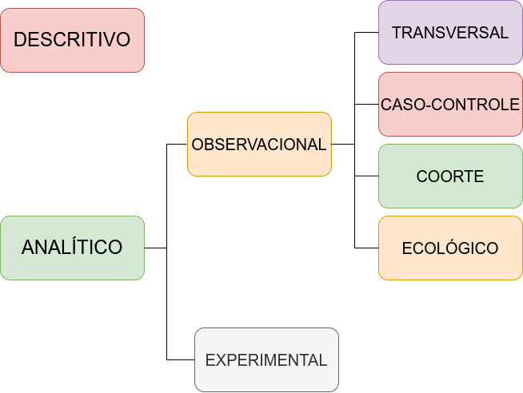
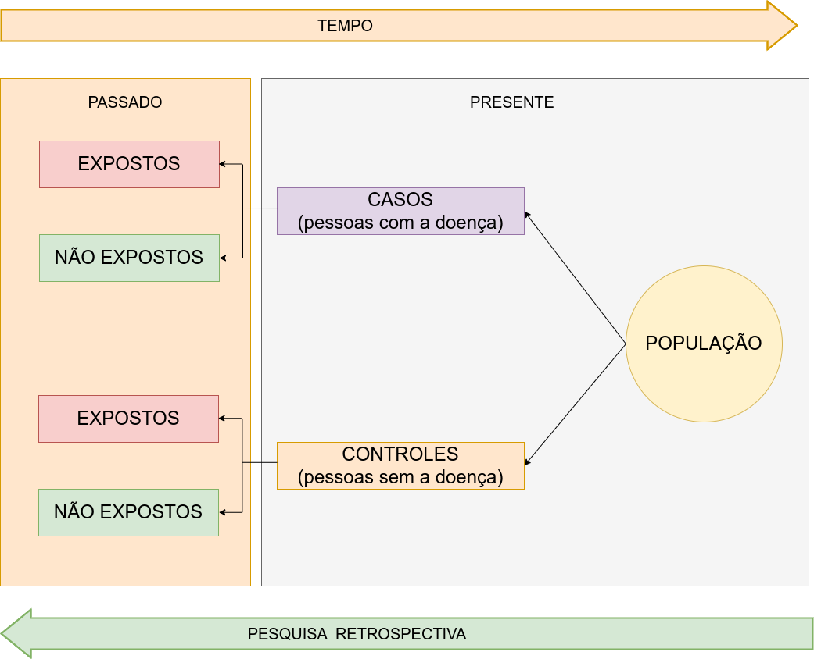
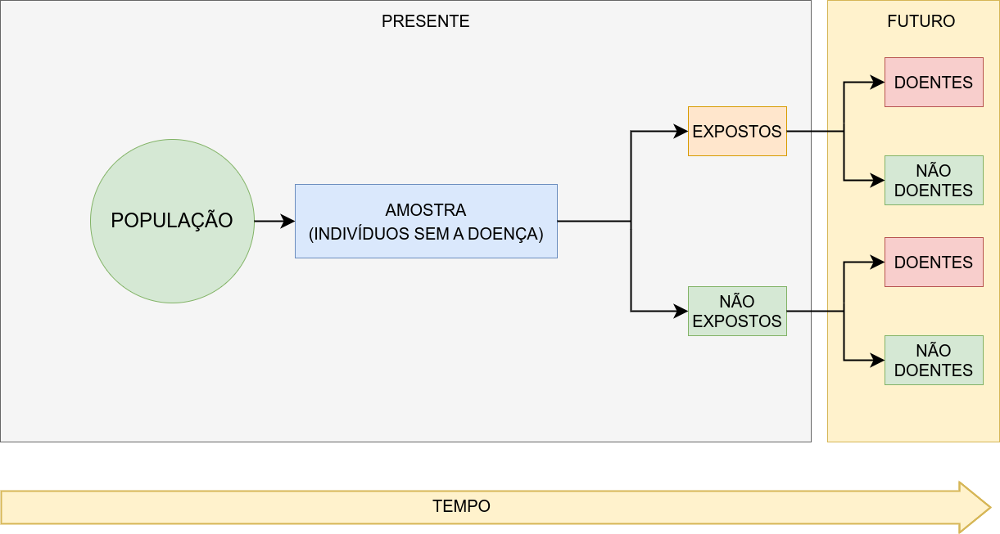
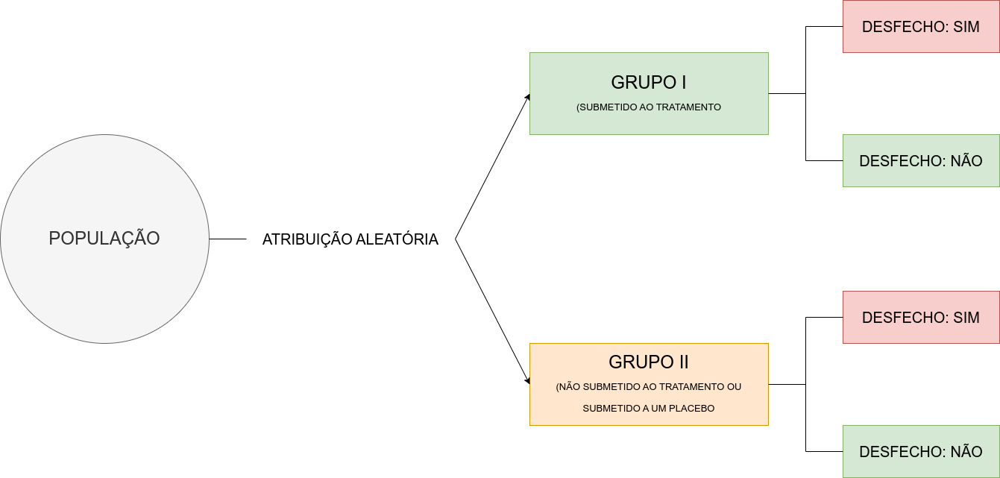
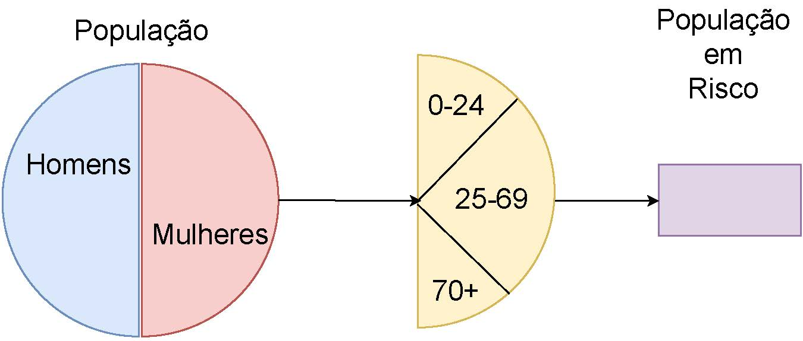
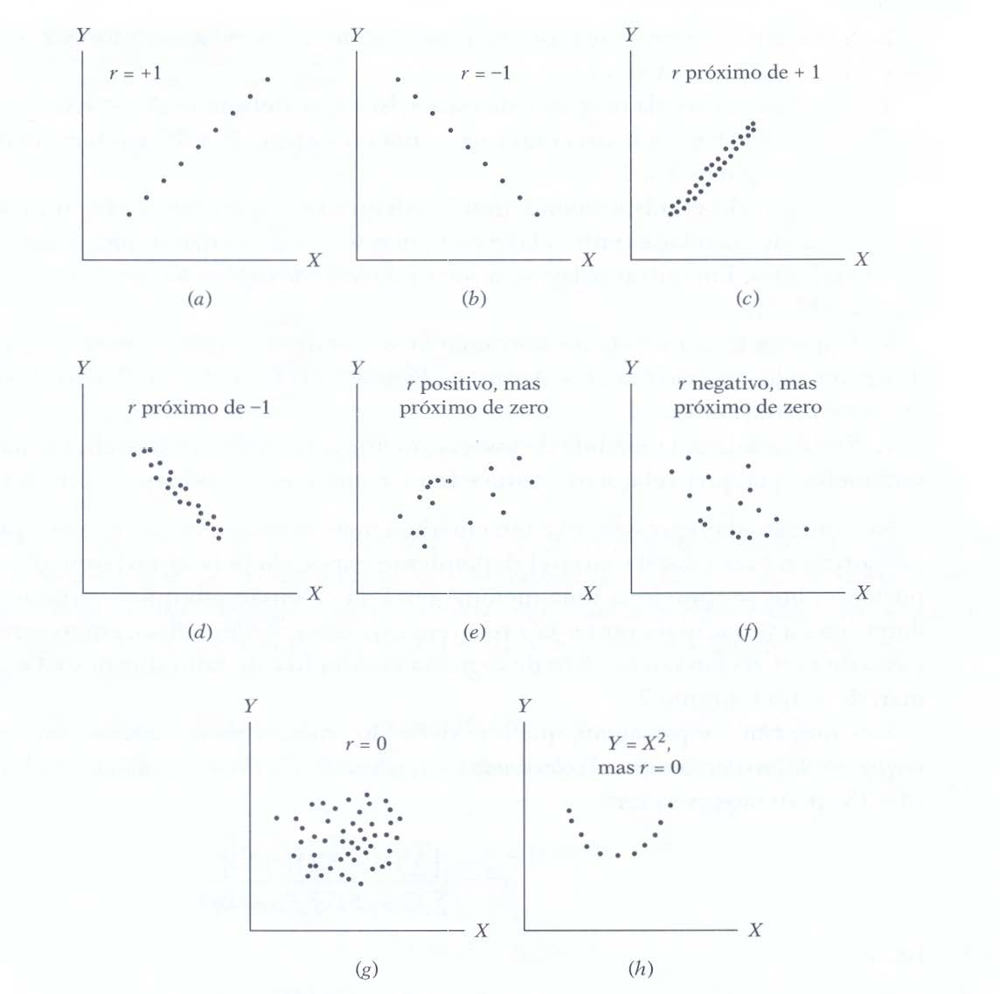

---
output:
  pdf_document: default
  html_document: default
---
```{r, echo=FALSE, include=FALSE}
colFmt <- function(x,color) {
  
  outputFormat <- knitr::opts_knit$get("rmarkdown.pandoc.to")
  
  if(outputFormat == 'latex') {
    ret <- paste("\\textcolor{",color,"}{",x,"}",sep="")
  } else if(outputFormat == 'html') {
    ret <- paste("<font color='",color,"'>",x,"</font>",sep="")
  } else {
    ret <- x
  }

  return(ret)
}

#uso>>>> `r colFmt("REG",'red')`, 


```


```{r , echo = FALSE, include=FALSE}
library(texPreview)
library(kableExtra)
library(knitr)
knitr::opts_chunk$set(echo = TRUE)
```


```{=latex }

\begin{table}[h]
\centering
\caption{Independent Samples T-Test}
\label{tab:independentSamplesT-Test}
{
\begin{tabular}{lrrrrrr}
\toprule
\multicolumn{1}{c}{} & \multicolumn{1}{c}{} & \multicolumn{1}{c}{} & \multicolumn{1}{c}{} & \multicolumn{1}{c}{} & \multicolumn{2}{c}{95\% CI for Cohen} \\
cline{6-7}
& t & df & p & Cohen & Lower & Upper  \\
\cmidrule[0.4pt]{1-7}
engagement & 2.365 & 38 & 0.023 & 0.748 & 0.101 & 1.385  \\
\bottomrule
% \addlinespace[1ex]
% \multicolumn{7}{p{0.5\linewidth}}{\textit{Note.} Student} \\
\end{tabular}
}
\end{table}

```

```{r eval=knitr::is_html_output(), results = "asis", echo = FALSE, message = FALSE}

tex2markdown <- function(texstring) {
  writeLines(text = texstring,
             con = myfile <- tempfile(fileext = ".tex"))
  texfile <- pandoc(input = myfile, format = "html")
  cat(readLines(texfile), sep = "\n")
  unlink(c(myfile, texfile))
}

textable <- "
\\begin{table}[h]
\\centering
\\caption{Independent Samples T-Test}
\\label{tab:independentSamplesT-Test}
{
\\begin{tabular}{lrrrrrr}
\\toprule
\\multicolumn{1}{c}{} & \\multicolumn{1}{c}{} & \\multicolumn{1}{c}{} & \\multicolumn{1}{c}{} & \\multicolumn{1}{c}{} & \\multicolumn{2}{c}{95\\% CI for Cohen} \\\\
cline{6-7}
& t & df & p & Cohen & Lower & Upper  \\\\
\\cmidrule[0.4pt]{1-7}
engagement & 2.365 & 38 & 0.023 & 0.748 & 0.101 & 1.385  \\\\
\\bottomrule
% \\addlinespace[1ex]
% \\multicolumn{7}{p{0.5\\linewidth}}{\\textit{Note.} Student} \\\\
\\end{tabular}
}
\\end{table}
"

tex2markdown(textable)
```


# Introdução às estatísticas epidemiológicas


## Tipos de estudos epidemiológicos


```{r fig43a, echo=FALSE, out.width='100%', fig.align='center', fig.cap="Estudos epidemiológicos"}



```

\

**Quanto ao objetivo**

>- Exploratórias (descritivas) 
>- Explicativas (analíticas)

\

**Quanto ao tempo**

>- Transversais
>- Longitudinais

\

**Quanto à natureza**

>- Observacional
>- Experimental

\


**Estudos descritivos** têm como foco principal a caracterização de uma população ou fenômeno em um momento específico, sem tentar estabelecer relações de causa e efeito. Esses estudos fornecem uma visão geral de uma situação ou contexto, frequentemente sendo usados para medir a prevalência de doenças ou comportamentos.

> Um estudo descritivo que relata a prevalência de diabetes em uma determinada região, baseado em dados coletados em um hospital.

\

**Estudos analíticos observacionais** buscam investigar possíveis associações entre variáveis, sem que o pesquisador manipule as condições em estudo. Estes estudos podem ser transversais, quando os dados são coletados em um único momento, ou longitudinais, quando há um acompanhamento ao longo do tempo. 

> Um estudo observacional que investiga a relação entre o consumo de alimentos ricos em gordura e doenças cardíacas, acompanhando os participantes ao longo do tempo, sem alterar seus comportamentos.

\


**Estudos analíticos experimentais** envolvem a manipulação ativa de variáveis pelo pesquisador, em um ambiente controlado, para avaliar seus efeitos sobre outras variáveis. Esses estudos, geralmente longitudinais, são considerados a melhor abordagem para investigar causalidade, pois permitem o controle de *fatores de confusão* e a comparação direta entre grupos. U

> Um ensaio clínico em que um grupo de pacientes recebe um novo medicamento e outro grupo recebe um placebo para avaliar a eficácia do medicamento.


\

##  Estudos transversais 

Um estudo transversal é um tipo de investigação observacional em que os dados são coletados em um único ponto no tempo ou durante um período curto. Esse tipo de estudo fornece uma "fotografia" instantânea das condições, comportamentos, ou características de uma população ou grupo em um determinado momento. 

Embora útil para fornecer uma visão geral da saúde da população, esse tipo de estudo não permite inferir relações causais entre fatores de risco e desfechos, sendo mais adequado para levantar hipóteses.

> Um estudo transversal pode ser usado para determinar a prevalência de hipertensão em uma população: um grupo de pessoas é examinado em um momento específico e o número de pessoas com hipertensão é registrado. Esse estudo dá uma visão geral da saúde da população naquele momento, mas não pode determinar se a hipertensão é causada por fatores observados no estudo.

\

##  Estudos longitudinais  

Um estudo longitudinal é um tipo de investigação observacional em que os dados são coletados ao longo de um período prolongado, envolvendo múltiplas observações em diferentes momentos no tempo. Esse tipo de estudo permite acompanhar mudanças, tendências e a evolução de condições, comportamentos ou características ao longo do tempo, oferecendo uma perspectiva dinâmica dos fenômenos estudados. 

Diferentemente dos estudos transversais, os estudos longitudinais são mais adequados para identificar relações temporais entre fatores de risco e desfechos, permitindo melhor compreensão sobre possíveis relações causais. 

> Um estudo longitudinal sobre hipertensão acompanharia o mesmo grupo de pessoas por vários anos, medindo regularmente sua pressão arterial e sua exposição a fatores de risco, permitindo assim observar como a pressão arterial se desenvolve ao longo do tempo e identificar quais fatores podem estar associados ao seu aparecimento ou progressão.

\

### Estudos de casos e controles


```{r fig43b, echo=FALSE, out.width='100%', fig.align='center', fig.cap="Estudo de casos e controles (retrospectivo)"}



```


\

Um estudo de caso-controle, geralmente retrospectivo, começa com a identificação de um grupo de casos (indivíduos com uma doença) e um grupo de controles (indivíduos sem a doença).

Por meio da anamnese o profissional de saúde ajuda o paciente a se recordar (pesquisa retrospectiva) de situações no passado que possam, de algum modo, configurar a exposição ao fator de risco pesquisado. As prevalências de exposição a um determinado fator são então medidas nos dois grupos e comparadas. 

Se a prevalência da exposição for maior nos casos do que nos controles, esta exposição pode então ser um fator de risco para a doença. Se a prevalência for menor entre os casos, então esta exposição pode ser um fator de proteção para a doença.

Este método é particularmente útil para investigar doenças raras ou condições com longos períodos de incubação.

\

Algumas vantagens:

-   são estudos relativamente baratos
-   podem investigar vários possíveis fatores de risco e são úteis para doenças raras

Algumas desvantagens:

-   são muito vulneráveis a vícios de seleção e observação
-   não são adequados para investigar exposições raras 
-   não podem obter estimativas da incidência de doença

\


### Estudos de coorte

\

```{r fig43c, echo=FALSE, out.width='100%', fig.align='center', fig.cap="Estudos de coorte (prospectivos)"}



```

\

Estudos de coorte são prospectivos. Assim, um grupo de indivíduos expostos e outro grupo de não expostos a uma causa potencial de doença são acompanhados ao longo do tempo. 

A incidência da doença é então comparada entre os dois grupos.

Para conduzir este tipo de estudo, é fundamental que uma hipótese clara seja formulada previamente ao início da investigação.


Considerando que esses estudos tendem a ser muito caros, eles geralmente são implementados somente depois que a hipótese foi explorada com outros desenhos de estudo mais econômicos.

\

Algumas vantagens:

-   a exposição é medida antes do início da doença;
-   as exposições raras podem ser estudadas selecionando grupos de indivíduos apropriados;
-   a incidência da doença pode ser medida nos grupos de expostos e não expostos.

Algumas desvantagens:


-   o estudo pode ser extenso e caro, especialmente se o período necessário para observar o efeito for prolongado;
-   mudanças na condição de exposição e nos critérios diagnósticos podem ocorrer durante o período do estudo e isto pode afetar a classificação dos indivíduos em expostos e não expostos e em doentes e não doentes;
-   a perda de indivíduos durante o seguimento pode introduzir sérios vieses no estudo.

\


### Estudos clínicos aleatorizados

\

```{r fig43d, echo=FALSE, out.width='100%', fig.align='center', fig.cap="Estudos clínicos aleatorizados"}



```

\

Em estudos epidemiológicos experimentais, também conhecidos como estudos de intervenção ou ensaios clínicos, os indivíduos participantes são alocados a diferentes grupos de acordo com a presença ou não de exposição. No entanto, nesses estudos é o pesquisador quem define quais os indivíduos que receberão a exposição e esta exposição é uma medida preventiva ou terapêutica.

Este tipo de estudo tem como principal vantagem a possibilidade de garantir a validade dos resultados. 

Os estudos experimentais são classificados em dois grandes grupos: as intervenções terapêuticas e as intervenções preventivas. 

As intervenções terapêuticas incluem pacientes que apresentam uma condição de saúde específica e o objetivo é avaliar a capacidade de determinada intervenção produzir a recuperação, reduzir sintomas, prevenir recrudescimento ou diminuir o risco de uma evolução desfavorável. Para este tipo de estudo, a unidade de amostragem e análise é o indivíduo. 

As intervenções preventivas envolvem pessoas sadias e o objetivo é avaliar a capacidade de uma intervenção em prevenir a ocorrência de um evento indesejado. As unidades de amostragem nesses casos podem ser tanto os indivíduos como comunidades.

Considerando que os participantes são deliberadamente selecionados pelo pesquisador para receber ou não uma intervenção, os estudos epidemiológicos experimentais envolvem questões éticas importantes e estão sujeitos a regulação legal.

\


## Terminologia


- Epidemiologia

\

> A epidemiologia é uma ciência médica que se concentra na distribuição e nos determinantes (fatores de risco) da frequência  das doenças na população (desfechos) , examinando seus padrões em busca de determinar por que alguns grupos ou certos indivíduos desenvolvem uma doença ao passo que outros não.  

\
	

- Estudos epidemiológicos

\

> Estudos epidemiológicos são experimentos científicos realizados com o propósito mais comum de se desejar saber se determinadas características pessoais, hábitos ou aspectos do ambiente onde uma pessoa vive estão associados com certa doença, manifestações de uma doença ou outro evento de interesse do pesquisador.

\

- Desfecho ("sucesso")

	
\
	
> Desfecho é o termo usado para designar a ocorrência do evento de interesse em uma pesquisa. O desfecho pode ser o surgimento de uma doença, de um determinado sintoma, o óbito ou qualquer outro evento relacionado ao processo de saúde-doença. Uma dificuldade inerente está em quantificar a intensidade do desfecho.

\
	

- Fator de risco (fator sob estudo)


\


> Fator de risco é a denominação usada em Epidemiologia para designar uma variável que se supõe estar associada ao desfecho. Refere-se portanto a um aspecto de hábitos pessoais ou a uma exposição ambiental, que pode estar associada a uma maior probabilidade de ocorrência de uma doença. Uma dificuldade inerente reside em como quantificar a exposição.


\
	
- Risco 

\

> Por risco entende-se a "a probabilidade de um membro de uma população definida desenvolver uma dada doença (ou condição) em um período de tempo". Perceba que nesta definição é possível observar três elementos: base populacional, doença (ou condição) e tempo. 

\
	
- População em risco

\

> Um fator importante no cálculo das medidas da frequência de uma doença é a estimativa correta do número de pessoas em estudo. Idealmente, esses números devem incluir apenas pessoas potencialmente suscetíveis às doenças (ou condições) em estudo. Por exemplo: homens não devem ser incluídos no cálculo da frequência de câncer do colo do útero e, vice-e-versa para câncer de próstata. Uma vez que os fatores de risco geralmente podem ser modificados, intervir para alterá-los em uma direção favorável pode reduzir probabilidade de ocorrência da doença. O resultado dessas intervenções pode ser estatisticamente verificado em variados tipos de ensaios ou medidas repetidas usando-se os mesmos métodos e definições. 

\


```{r fig43, echo=FALSE, out.width='60%', fig.align='center', fig.cap="Adaptação: Basic Epidemiology: R. Bonita, R. Beaglehole, T Kjelltröm, 2006 (p. 17)"}



```

\


- Confundimento

\


> A palavra "confundir" vem do latim _confundere_ e significa misturar (fundir junto). O confundimento é outra importante questão em estudos epidemiológicos. Em um estudo da associação entre a exposição a uma causa (fator de risco) e a ocorrência de uma doença, o confundimento pode ocorrer quando existe outra exposição na população e está associada tanto à doença quanto ao fator de risco em estudo. O confundimento pode ter uma influência muito importante, podendo até alterar a direção aparente de uma associação. Uma variável que aparece como fator de proteção pode, após o controle de confundimento, ser considerada um fator de risco. Ou então o confundimento pode criar a aparência de uma relação causa-efeito que, na verdade, não existe. O confundimento ocorre quando os efeitos de duas exposições (fatores de risco) \textbf{não foram separados} e a análise conclui que o efeito é devido a um fator e não a outro.  O confundimento surge porque a distribuição não aleatória de fatores de risco na fonte também ocorre na população de estudo, fornecendo estimativas enganosas de efeito.  Nesse sentido, pode parecer um viés, mas na verdade não resulta de um erro sistemático no projeto de pesquisa.  

\

> Um exemplo de confundimento pode ser a explicação para a relação demonstrada entre beber café e o risco de doenças cardíaca coronariana, pois sabe-se que o consumo de café está associado com o uso de tabaco: as pessoas que bebem café são mais propensos a fumar do que as pessoas que não bebem café.

\
	

> Também é sabido que o tabagismo é uma causa de doença cardíaca coronariana. É, portanto, possível que a relação entre o consumo de café e doenças cardíacas doença meramente reflete a associação causal conhecida do uso de tabaco e doenças cardíacas. Nesta situação, fumar causa confundimento na aparente relação entre o consumo de café e doença cardíaca coronariana porque o tabagismo está correlacionado com beber café e é um fator de risco mesmo para quem não bebe café.

\
	
Para se contornar esse tipo de problema deve-se, na etapa de delineamento do experimento, estabelecer os fatores envolvidos e, na realização da pesquisa observar a: 

\

- casualização: as amostras devem ser de tal modo constituídas que variáveis e confundimento nelas existam, potencialmente, em igual proporção (como, por exemplo, fumantes e não fumantes;  
- restrição: se estamos estudando a relação do café com doenças coronarianas, admitir apenas não fumantes.


\

- Vícios de seleção e de observação

> Vícios de seleção ocorrem quando os casos e controles são escolhidos de maneira que não representem corretamente a população. Vícios de observação ocorrem quando há erros na forma como a exposição ou os desfechos são medidos.


## Medidas de risco, morte, associação e correlação


\


- Incidência (I);  
- Prevalência (P);  
- Incidência cumulativa (risco - IC);  
- Fatalidade dos casos (FC);  
- Taxa de mortalidade (TM);  
- Diferença de risco (risco atribuível - RA);  
- Razão de risco (risco relativo - RR);  
- Risco atribuível proporcional (fração etiológica - FE);  
- _Odds ratio_ (razão de chances - OR); e,  
- Correlação linear de Pearson.

\

A morbidade é um dos importantes indicadores de saúde. É um termo genérico usado para designar o conjunto de casos de uma dada doença ou a soma de agravos à saúde que atingem um grupo de indivíduos. 

\	

Medir morbidade nem sempre é uma tarefa fácil, pois são muitas as limitações que contribuem para essa dificuldade, como a subnotificação.

\	

Para fazer essas mensurações, utilizam-se principalmente as medidas de incidência e prevalência.
\

### Incidência

\


Incidência representa a **proporção** de número de **novos casos** de uma determinada doença em um **intervalo de tempo** em uma população exposta ao risco. É, por conseguinte, uma medida dinâmica pois pode sofrer alteração em razão do tempo no qual o estudo foi realizado.

\	

Para um indivíduo pertencente à população exposta, indica a probabilidade de desenvolver a doença (risco).


\	

Observe como calcular a incidência:

\	

$$
I=\frac{\text{Número de novos casos de uma doença durante um determinado período de tempo}}{\text{Tamanho da população exposta ao risco nesse determinado período de tempo}} \\
\text{apresentação usualmente na forma: }I(\times 10^{n})
$$


\	

> Exemplo: para se  determinar a incidência de meningite no Maranhão no ano de 2014, será necessário saber o número de casos de meningite que ocorreram naquele período de tempo entre os residentes do Maranhão e o número de habitantes do estado no mesmo período de tempo (todos os possíveis expostos à doença):

\	

$$
I=\frac{\text{177 novos casos notificados de meningite no Maranhão em 2014}}{\text{2.648.532 (população do Maranhão em 2014)}} (\times 10^{5})
\\
I = \frac{6,68}{100.000 }
$$

\	

Os dados sobre prevalência e incidência tornam-se muito mais úteis se convertidos em taxas!


\	

Como você pode notar, os **casos novos**, ou incidentes, são aqueles que **não existiam no início** do período de observação (tempo analisado), mas que vieram a ocorrer no decorrer desse período.

\	

As taxas de incidência tendem a variar conforme o número de episódios da doença analisada, o número de pessoas que tiveram um episódio de uma doença, tempo para diagnosticá-la e a duração da investigação. 

\

### Prevalência


\


Prevalência representa a proporção de indivíduos de uma população que é acometida por uma determinada doença (ou agravo) em um determinado **momento**. É considerada uma medida **estática**. 

\

Ela engloba tanto os casos casos preexistentes, quanto os novos que ocorreram no período. 

\

Indica a probabilidade de ter a doença.

\


Observe como calcular a prevalência:


\

$$
P=\frac{\text{Número de  casos existentes de doença em um determinado momento no tempo}}{\text{Tamanho da população em risco nesse mesmo momento no tempo}}\\
\text{apresentação usualmente na forma: }P(\times 10^{n})
$$

\


> Exemplo: se em uma determinada comunidade mensurou-se 89 casos de indivíduos portadores de hipertensão em um determinado momento. Sabendo-se que a população (todos estão potencialmente expostos) dessa comunidade é de 3.500 a prevalência será:

\

$$
P=\frac{\text{89 casos de hipertensão na comunidade no dia 01/01/2014}}{\text{3.500 indivíduos como população em risco na comunidade em 01/01/2014}} (\times 10^{2})\\
P= \frac{2,54}{100 }
$$


\

Os dados sobre prevalência e incidência tornam-se muito mais úteis se convertidos em taxas!

\

#### Relação entre prevalência e incidência

\


A prevalência depende tanto da incidência quanto da duração da doença. Se os casos de incidentes não forem resolvidos e continuarem ao longo do tempo eles se tornarão casos prevalentes. Nesse sentido:

\


$$
P=\text{Incidência} \times \text{Duração média da doença}
$$

\

#### Quadro comparativo entre medidas de incidência e de prevalência

\


```{=latex }

\begin{table}[h]
\centering
\caption{Quadro comparativo entre medidas de incidência e de prevalência}
\begin{tabular}{|p{3cm}|p{6cm}|p{6cm}|}
\hline
&  Incidência & Prevalência  \\
\hline
Numerador & Número de \textbf{novos} casos de doença durante um determinado período de tempo & Número de casos \textbf{existentes} de doença em um determinado momento no tempo\\
\hline
Denominador & Tamanho da população em risco & Tamanho da população em risco  \\
\hline
Foco & Se o evento é um caso novo \newline Tempo de início da doença  & Presença ou ausência de uma doença \newline  O período de tempo é arbitrário \newline Um ``instantâneo'' no tempo \\
\hline
Uso  & Expressa o risco de adoecer \newline A principal medida de doenças ou condições agudas, mas também usado para doenças crônicas \newline Mais útil para estudos de causalidade  & Estima a probabilidade da população estar doente no período de tempo estudado \newline Útil no estudo da carga de doenças crônicas e implicações para os serviços de saúde\\
\hline 
\end{tabular}
\label{tab1}
\end{table}	

```

```{r eval=knitr::is_html_output(), results = "asis", echo = FALSE, message = FALSE}

tex2markdown <- function(texstring) {
  writeLines(text = texstring,
             con = myfile <- tempfile(fileext = ".tex"))
  texfile <- pandoc(input = myfile, format = "html")
  cat(readLines(texfile), sep = "\n")
  unlink(c(myfile, texfile))
}

textable <- "
\\begin{table}[h]
\\centering
\\caption{Quadro comparativo entre medidas de incidência e de prevalência}
\\begin{tabular}{|p{3cm}|p{6cm}|p{6cm}|}
\\hline
&  Incidência & Prevalência  \\\\
\\hline
Numerador & Número de novos casos de doença durante um determinado período de tempo & Número de casos existentes de doença em um determinado momento no tempo\\\\
\\hline
Denominador & Tamanho da população em risco & Tamanho da população em risco  \\\\
\\hline
Foco & Se o evento é um caso novo \\newline Tempo de início da doença  & Presença ou ausência de uma doença \\newline  O período de tempo é arbitrário \\newline Um ``instantâneo'' no tempo \\\\
\\hline
Uso  & Expressa o risco de adoecer \\newline A principal medida de doenças ou condições agudas, mas também usado para doenças crônicas \\newline Mais útil para estudos de causalidade  & Estima a probabilidade da população estar doente no período de tempo estudado \\newline Útil no estudo da carga de doenças crônicas e implicações para os serviços de saúde\\\\
\\hline 
\\end{tabular}
\\label{tab1}
\\end{table}	
"

tex2markdown(textable)
```


\

### Incidência cumulativa - IC (Risco)


\	

Incidência Cumulativa (ou risco) é uma medida da ocorrência de uma doença. 

\	

Ao contrário da Incidência, no denominador temos agora o número de pessoas na população exposta **sem a doença** no começo do período do estudo:   


\	

$$
IC=\frac{\text{Núm. de novos casos de uma doença durante um determ. período de tempo}}{\text{Tam. da pop. em risco (exposta) livre (sem) da doença no começo de um determ. período de tempo}}\\
\text{apresentação usualmente na forma: }IC(\times 10^{n}) 
$$


#### Quadro comparativo entre medidas de risco e prevalência


\	

```{=latex }

\begin{table}[h]
\caption{Quadro comparativo entre medidas de risco e prevalência}
\begin{tabular}{|p{3cm}|p{6cm}|p{6cm}|}
\hline
Característica &  Risco  & Prevalência  \\
\hline
O que é medido & Probabilidade da doença & Percentagem da população com a doença \\
\hline
Unidade & adimensional & adimensional \\
\hline
Momento do diagnóstico da doença: & Casos novos (recém diagnosticados) & Existentes \\
\hline
Sinônimos & Incidência cumulativa & - \\
\hline
\end{tabular}
\label{tab11}
\end{table}	

```


```{r eval=knitr::is_html_output(), results = "asis", echo = FALSE, message = FALSE}

tex2markdown <- function(texstring) {
  writeLines(text = texstring,
             con = myfile <- tempfile(fileext = ".tex"))
  texfile <- pandoc(input = myfile, format = "html")
  cat(readLines(texfile), sep = "\n")
  unlink(c(myfile, texfile))
}

textable <- "
\\begin{table}[h]
\\caption{Quadro comparativo entre medidas de risco e prevalência}
\\begin{tabular}{|p{3cm}|p{6cm}|p{6cm}|}
\\hline
Característica &  Risco  & Prevalência  \\\\
\\hline
O que é medido & Probabilidade da doença & Percentagem da população com a doença \\\\
\\hline
Unidade & adimensional & adimensional \\\\
\\hline
Momento do diagnóstico da doença: & Casos novos (recém diagnosticados) & Existentes \\\\
\\hline
Sinônimos & Incidência cumulativa & - \\\\
\\hline
\\end{tabular}
\\label{tab11}
\\end{table}	
"

tex2markdown(textable)
```

\


### Fatalidade dos Casos (FC)


\	


Fatalidade dos casos é uma medida da severidade da doença, definida como a proporção de casos com desfecho em óbito pelo total de acometidos (portadores da condição) em um determinado período de tempo.

\

$$
FC(\%)=\frac{\text{Número de mortes de casos diagnosticados da doença durante um determinado período de tempo}}{\text{Número de casos diagnosticados nesse período de tempo}} \\
\text{apresentação usualmente na forma: }FC(\%)(\times 100)
$$


\


### Taxas de mortalidade (TM)


\	

A principal desvantagem da Taxa bruta de mortalidade é que ela não leva em conta o fato de que a chance de morrer varia de acordo com idade, sexo, etnia e incontáveis outros fatores (sociais, econômicos, \dots). 

\	

Geralmente não é apropriado usá-la para comparar diferentes períodos de tempo ou áreas geográficas. Por exemplo, padrões de morte em núcleos urbanos recentemente constituídos e formados predominantemente por famílias jovens provavelmente serão muito diferentes das estâncias balneares escolhidas frequentemente por aposentados.

\	

A Taxa bruta de mortalidade para todas as mortes ou uma causa específica de morte é calculado da seguinte forma:

\	

$$
TM(\%)=\frac{\text{Número de mortes durante um determinado período de tempo}}{\text{Número de pessoas sob risco de morte nesse período de tempo}}\\
\text{apresentação usualmente na forma: }TM
(\times 10^{n})
$$

\

### Sobrevida

\


Uma vez que a TM representa a proporção de pessoas afetadas por uma doença e que faleceram em decorrência dela, a sobrevida S pode ser considerada como seu complemento:

\	

$$
S=1-TM
$$


### Taxas mais específicas

\

- taxa de mortalidade infantil;  
- taxa de mortalidade maternal;  
- taxa de mortalidade entre adultos; ou,   
- taxas de mortalidade ajustadas por faixa etária.

\	

Quantificar a ocorrência de doenças ou alterações nos estados de saúde é o primeiro passo de um estudo epidemiológico. 

\

## Medidas de associação em estudos de coorte


\


Uma tabela é uma forma de representação retangular que permite mostrar clara e resumidamente os dados correspondentes a uma ou mais variáveis, visualizar o comportamento dos dados e facilitar o entendimento das informações. Uma tabela de dupla entrada permite extrair facilmente as proporções **individuais**, **marginais** e  **associadas** relativas a duas variáveis (tabelas com mais variáveis são possíveis de serem construídas).

\

Especificamente para estudos epidemiológicos, admita que as variáveis envolvidas se refiram a contagens relacionadas à ocorrência de uma doença em dois grupos de pessoas sob diferentes exposições. O grupo não exposto ao fator de risco é frequentemente usado como referência.


\

- (a) o grupo de pessoas expostas a um determinado fator de risco; 
- (b) o grupo de pessoas não expostas.

\


```{=latex}

\begin{table}[h]
\centering
\caption{Casos classificados em relação ao desfecho a partir da exposição ao fator de risco}
\begin{tabular}{c|c|c|c}
\hline
\multirow{2}{*}{Fator de risco} & \multicolumn{2}{c|}{Desfecho observado (doença)} & Total \\ 
 & \cline{2-3}   
              Presente  & Ausente       \\ 
\hline              
Exposto & (a) &  (b)   & (e) \\
\hline 
Não exposto & (c) &  (d) & (f)  \\
\hline 
Total & (a) + (c)  & (b) + (d) & (e) + (f) \\
\hline 
\end{tabular}
\label{tab3}
\end{table}	

```

\


```{r eval=knitr::is_html_output(), results = "asis", echo = FALSE, message = FALSE}

tex2markdown <- function(texstring) {
  writeLines(text = texstring,
             con = myfile <- tempfile(fileext = ".tex"))
  texfile <- pandoc(input = myfile, format = "html")
  cat(readLines(texfile), sep = "\n")
  unlink(c(myfile, texfile))
}

textable <- "
\\begin{table}[h]
\\centering
\\caption{Casos classificados em relação ao desfecho a partir da exposição ao fator de risco}
\\begin{tabular}{c|c|c|c}
\\hline
\\multirow{2}{*}{Fator de risco} & \\multicolumn{2}{c|}{Desfecho observado (doença)} & Total \\\\
& \\cline{2-3}   
                Presente  & Ausente     \\\\
\\hline              
Exposto & (a) &  (b)   & (e) \\\\
\\hline 
Não exposto & (c) &  (d) & (f)  \\\\
\\hline 
Total & (a + c)  & (b  + d) & (e + f) \\\\
\\hline 
\\end{tabular}
\\end{table}
	
"

tex2markdown(textable)
```

\


> Exemplo: Incidência de baixo peso ao nascer em recém-nascidos de Pelotas (RS) segundo o hábito tabágico da mãe durante a gravidez (1982)


\


```{=latex}

\begin{table}
\centering
\caption{Incidência de baixo peso ao nascer em recém-nascidos de Pelotas, RS,
segundo o hábito tabágico da mãe durante a gravidez (1982)}
\begin{tabular}{c|c|c|c}
\hline
\multirow{2}{*}{Classificação da mãe} & \multicolumn{2}{c|}{Baixo peso ao nascer} & \multirow{2}{*}{Total}  \\ 
& \cline{2-3}
              Sim & Não        \\ 
\hline              
Fumante & 275 (a) & 2.144 (b) & 2.419 (e)   \\
\hline 
Não fumante & 311 (c) & 4.496 (d) & 4.807 (f)  \\
\hline 
Total & 586 & 6.640 & 7.226  \\
\hline 
\end{tabular}
\label{tab33}
\end{table}	

```


```{r eval=knitr::is_html_output(), results = "asis", echo = FALSE, message = FALSE}

tex2markdown <- function(texstring) {
  writeLines(text = texstring,
             con = myfile <- tempfile(fileext = ".tex"))
  texfile <- pandoc(input = myfile, format = "html")
  cat(readLines(texfile), sep = "\n")
  unlink(c(myfile, texfile))
}

textable <- "

\\begin{table}
\\centering
\\caption{Incidência de baixo peso ao nascer em recém-nascidos de Pelotas, RS,
segundo o hábito tabágico da mãe durante a gravidez (1982)}
\\begin{tabular}{c|c|c|c}
\\hline
\\multirow{2}{*}{Classificação da mãe} & \\multicolumn{2}{c|}{Baixo peso ao nascer} & \\multirow{2}{*}{Total}  \\\\ 
& \\cline{2-3}
              Sim & Não         \\\\ 
\\hline              
Fumante & 275 (a) & 2.144 (b) & 2.419 (e)   \\\\
\\hline 
Não fumante & 311 (c) & 4.496 (d) & 4.807 (f)  \\\\
\\hline 
Total & 586 & 6.640 & 7.226  \\\\
\\hline 
\\end{tabular}
\\label{tab33}
\\end{table}	

"

tex2markdown(textable)
```

\

### Incidência observada de nascimentos com baixo peso entre mães expostas ao risco (não fumantes): $I_{e}$


$$
I_{e}=\frac{(a)}{(e)} \times 100  = \frac{275}{2.419} \times 100 = 11,37 \%
$$
\

>Interpretação: 11,37\% das crianças analisadas e que têm mães tabagistas nasceram com baixo peso.

\

### Incidência observada de nascimentos com baixo peso entre mães não expostas ao risco (não fumantes): $I_{0}$


\


$$
I_{0}: \frac{(c)}{(f)} \times 100 = \frac{311}{4.807} \times 100 = 6,47 \%
$$

\

>Interpretação: 6.47\% das crianças analisadas e que têm mães não tabagistas nasceram com baixo peso.
\

### Prevalência de nascimentos com baixo peso na população estudada

\


$$
\frac{(a) + (c)}{(e) + (f)} \times 100 = \frac{586}{7.226} \times 100 =  8,11\%
$$

\

>Interpretação: 8,11\% das crianças avaliadas nasceram com baixo peso.
\

### Diferença de risco (Risco atribuível - RA)

\


A diferença de risco (também chamada de excesso de risco ou risco atribuível) é a diferença nas taxas de ocorrência entre os grupos expostos e não expostos da população. Essa medida quantifica o excesso absoluto de risco associado a uma dada exposição. É uma medida útil do problema de saúde pública causado pela exposição ao fator de risco.


\


Analisando-se as incidências na Tabela  vemos que a diferença de risco de nascimento de bebês com baixo peso entre mães fumantes e não fumantes é:

\


\begin{align*}
RA & =\frac{(a)}{(e)} - \frac{(c)}{(f)}  \\
   & = \frac{275}{2.419} - \frac{311}{4.807} \\ 
   & = 0,11368334 - 0,064697316 \\
   & = 4,9 \%
\end{align*}

\

>Interpretação: 4,9\% do risco de nascer com baixo peso pode ser atribuído ao fato de terem mães tabagistas.

\

### Razão de risco (Risco relativo - RR)


\

A razão de risco (também chamada de risco relativo) é o quociente entre as  taxas de ocorrência entre os grupos expostos e não expostos da população. Pode ser interpretado como a probabilidade de um indivíduo exposto apresentar o desfecho relativa à de um indivíduo não exposto também apresentar. 

\


- razão de risco maior que 1: **fator de risco**;  
- razão de risco menor que 1: **fator protetor**.  
 
\


Analisando-se as incidências na Tabela vemos que a razão de risco de nascimento de bebês com baixo peso entre mães fumantes e não fumantes é de: 

\

\begin{align*}
RR  & =  \frac{\frac{(a)}{(e)}}{\frac{(c)}{(f)}}  \\
& = \frac{\frac{275}{2.419}}{\frac{311}{4.807}} \\ 
& = \frac{0,11368334}{0,064697316} \\
& = 1,76 
\end{align*}

\

>Interpretação: As crianças de mães tabagistas têm aproximadamente 1,76 vezes mais risco de nascer com baixo peso em comparação com as de mães não tabagistas. 

\

### Risco atribuível proporcional (Fração etiológica - FE)


\	

Quando se acredita que uma  determinada exposição é um fator de risco de uma determinada doença, a fração atribuível é a proporção da doença na população específica que seria eliminada se a exposição fosse evitada. As frações etiológicas (frações relacionadas à origem da doença) são úteis para avaliar as prioridades da ação de saúde pública.


\	


O Risco atribuível proporcional (fração etiológica) é, assim, a proporção de todos os casos que podem ser atribuídos diretamente a uma exposição específica. Pode ser determinado pelo quociente da diferença de riscos das incidências pela incidência entre a população exposta.

\	

Esta medida é útil para determinar a importância relativa das exposições para toda a população. É a proporção pela qual a taxa de incidência do desfecho em toda a população seria reduzido se a exposição fosse eliminada.


\	

Observe como calcular o Risco atribuível proporcional (Fração etiológica - FE):

\	

$$
FE = \frac{I_{e}-I_{o}}{I_{e}} \times 100
$$

\


- $I_{e}$: é a incidência da doença no grupo exposto;  
- $I_{o}$: é a incidência da doença no grupo não exposto. 

\


Analisando-se as incidências na Tabela vemos que o risco atribuível proporcional de nascimento de bebês com baixo peso entre mães fumantes é de: 

\	

\begin{align*}
FE = & \frac{\left(\frac{(a)}{(e)} - \frac{(c)}{(f)}\right)}{\frac{(a)}{(e)}}  \\
   = & \frac{\left(\frac{275}{2.419} - \frac{311}{4.807}\right)}{\frac{275}{2.419}} \\ 
   = &  \frac{\left(0,11368334 - 0,064697316\right)}{0,11368334} \\
   = & 43,09 \%
\end{align*}

\	

>Interpretação: 43,09\% dos casos nascimentos de bebês com baixo peso podem ser atribuídos diretamente ao hábito tabagista das mães. 

\


## _Odds ratio_ (Razão das chances) em studos de casos e controles

\

Em estudos de caso-controle os pacientes são incluídos de acordo com a **presença ou não do desfecho**. 

Geralmente são definidos um grupo de casos (com o desfecho) e outro de controles (sem o desfecho) e avalia-se uma eventual exposição, **no passado** a potenciais fatores de risco nestes dois grupos.

\	

Devido ao fato de que o **delineamento** deste tipo de estudo baseia-se no **próprio desfecho**, não se pode estimar diretamente a incidência do desfecho de acordo com a **presença ou ausência** da exposição, como é usual em **estudos de coorte**. 


\	

Isto se deve ao fato de que a proporção **casos/controles)** (ou **desfecho/não-desfecho**) é determinada pelo próprio pesquisador (a proporção não é a mesma observada na população toda com possibilidade de exposição). Assim, a ocorrência de desfechos no grupo total estudado não é regida pela **história natural** da doença e depende de quantos casos e controles o pesquisador selecionou. 

\	

Apesar de não se poder estimar diretamente as incidências da doença (desfecho) entre **expostos e não-expostos** em estudos de caso-controle, é possível, entretanto, obter-se uma aproximação da Razão de risco (risco relativo - RR). 


\	

Se **se o desfecho for suficientemente raro** na população (10\% ou menos), a Razão de risco (risco relativo - RR) pode ser **estimada aproximadamente** em estudos de caso-controle através da Razão de chances (_odds ratio_ - OR) de exposição entre casos e controle:


\


```{=latex}

\begin{table}[h]
\centering
\caption{Casos e controles classificados em relação à exposição ao fator de risco}
\begin{tabular}{c|c|c}
\hline
\multirow{2}{*}{Fator} & \multicolumn{2}{c|}{Grupos}  \\
\cline{2-3}
 & Casos (com o desfecho) & Controles (sem o desfecho)    \\
\hline
Exposto & (a) &  (b)   \\
\hline
Não exposto & (c) &  (d)   \\
\hline
\end{tabular}
\label{tab3}
\end{table}

```

\


```{r eval=knitr::is_html_output(), results = "asis", echo = FALSE, message = FALSE}

tex2markdown <- function(texstring) {
  writeLines(text = texstring,
             con = myfile <- tempfile(fileext = ".tex"))
  texfile <- pandoc(input = myfile, format = "html")
  cat(readLines(texfile), sep = "\n")
  unlink(c(myfile, texfile))
}

textable <- "
\\begin{table}[h]
\\centering
\\caption{Casos e controles classificados em relação à exposição ao fator de risco}
\\begin{tabular}{c|c|c|c}
\\hline
\\multirow{2}{*}{Fator} & \\multicolumn{2}{c|}{Grupos}  \\\\
& \\hline
                Casos (com o desfecho)   & Controles  (sem o desfecho)   \\\\
\\hline
Exposto & (a) &  (b)   \\\\
\\hline
Não exposto & (c) &  (d)   \\\\
\\hline
\\end{tabular}
\\end{table}

"

tex2markdown(textable)
```

\

### Chance (_odds_) de observar um desfecho entre os casos:

\


>Grupo dos casos: a partir das proporções dos elementos desse grupo que foram ou não expostos ao fator ($P_{e},P_{0}$):

$$
P_{e}=\frac{\text{casos expostos}}{\text{total de casos}}\\
P_{0}=\frac{\text{casos não expostos}}{\text{total de casos}}\\
$$


a chance (_odds_) de se observar o desfecho entre os casos é a divisão dessas proporções: 


$$
Odds_{casos}=\frac{P_{e}}{P_{0}} \\
Odds_{casos}=\frac{\text{casos expostos}}{\text{casos não expostos}} \\
Odds_{casos}= \frac{a}{c}
$$

\	

### Chance (_odds_) de observar um desfecho entre os controles:


\


>Grupo dos controles: a partir das proporções dos elementos desse grupo que foram ou não expostos ao fator ($P_{e},P_{0}$):

$$
P_{e}=\frac{\text{controles expostos}}{\text{total de controles}}\\
P_{0}=\frac{\text{controles não expostos}}{\text{total de controless}}\\
$$

a chance (_odds_) de se observar o desfecho entre os controles é a divisão dessas proporções: 


$$
Odds_{controles}=\frac{P_{e}}{P_{0}} \\
Odds_{controles}=\frac{\text{controles expostos}}{\text{controles não espostos}}\\
Odds_{controles}= \frac{b}{d}
$$
\

### A razão das chances entre os casos e controle (_odds ratio_):

\

	
>A razão das chances ( _odds ratio_ - OR) de exposição entre casos e controles fica sendo
 


$$
OR = \frac{Odds_{casos}}{Odds_{controles}} 
$$

\


- OR ( _odds ratio_) maior que 1: **fator de risco**: a exposição ao fator aumenta a chance do desfecho
- OR ( _odds ratio_) menor que 1: **fator protetor**: a exposição ao fator reduza chance do desfecho.
 

\


A razão de chances ( _odds ratio_) exprime numericamente quantas vezes a exposição a um determinado fator de risco implica na possibilidade do desfecho estudado.

\


> Exemplo: tanto o tabagismo quanto a poluição do ar são causas de câncer de pulmão, mas a fração devido ao fumo é geralmente muito maior do que a devido ao ar poluição. Apenas em comunidades com prevalência de tabagismo muito baixa e severos índices de poluição, esta seria a provável de ser a principal causa de câncer de pulmão. Assim, em muitos países, controle do tabagismo deve ter prioridade nos programas de prevenção do câncer de pulmão.


\


```{=latex}

\begin{table}[h]
\centering
\caption{Casos e controles classificados em relação à exposição ao fator de risco}
\begin{tabular}{c|c|c}
\hline
\multirow{2}{*}{Fator} & \multicolumn{2}{c|}{Grupos}  \\
 \cline{2-3}
 & Casos (com câncer) & Controles (sem câncer)    \\
\hline
Exposto ao tabaco & 200 (a) & 50 (b)    \\
\hline
Não exposto ao tabaco & 100 (c) &  150 (d)   \\
\hline
\end{tabular}
\label{tab3}
\end{table}

```

\


```{r eval=knitr::is_html_output(), results = "asis", echo = FALSE, message = FALSE}

tex2markdown <- function(texstring) {
  writeLines(text = texstring,
             con = myfile <- tempfile(fileext = ".tex"))
  texfile <- pandoc(input = myfile, format = "html")
  cat(readLines(texfile), sep = "\n")
  unlink(c(myfile, texfile))
}

textable <- "
\\begin{table}[h]
\\centering
\\caption{Casos e controles classificados em relação à exposição ao fator de risco}
\\begin{tabular}{c|c|c}
\\hline
\\multirow{2}{*}{Fator} & \\multicolumn{2}{c|}{Grupos} \\\\
& \\hline
                Casos (com câncer)   & Controles  (sem câncer)   \\\\
\\hline
Exposto ao tabaco & 200  (a) &  50 (b)   \\\\
\\hline
Não exposto  ao tabaco & 100 (c) & 150  (d)  \\\\
\\hline
\\end{tabular}
\\end{table}

"

tex2markdown(textable)
```


\	


A chance (_odds_) de se observar o desfecho entre os casos : 

\


$$
Odds_{casos}=\frac{\text{casos expostos}}{\text{casos não expostos}} \\
Odds_{casos}= \frac{a}{c}\\
Odss_{casos}= \frac{200}{100}=2\\
$$

>Interpretação: entre as pessoas com câncer (casos), a chance de terem sido espostos ao tabaco é 2 vezes maior do que a chance de não terem sido expostos. Ou seja, é muito provável que tenham sido expostas.

\

A chance (_odds_) de se observar o desfecho entre os controles: 

\


$$
Odds_{controles}=\frac{\text{controles expostos}}{\text{controles não espostos}}\\
Odds_{controles}= \frac{b}{d}\\
Odds_{controles}= \frac{50}{150}=0,33
$$

>Interpretação: entre as pessoas sem câncer (controles), a chance de terem sido expostos ao tabaco é 1/3 da chance de não terem sido expostas. Ou seja, é pouco provável que tenham sido expostas.

\	


A razão das chances ( _odds ratio_ - OR) de exposição entre casos e controle:
 
\


$$
OR = \frac{Odds_{casos}}{Odds_{controles}} \\
OR = \frac{2}{0,33}=6,06
$$

\	


>Interpretação: uma _odds ratio_ (OR) de aproximadamente 6,06 significa que a chance de uma pessoa exposta ao tabagismo desenvolver câncer de pulmão é cerca de 6 vezes maior do que a de uma pessoa não exposta, o que indica uma forte associação entre tabagismo e câncer de pulmão.

\


## Correlação linear de Pearson

\


Em estatística, a expressão **correlação** se refere à relação existente entre variáveis, digamos $X$ e $Y$. 

Essa relação pode assumir diferentes relações funcionais que, bsicamente podem ser:

-   linear: positiva ou negativa
-   não linear: logarítmica, cíclica (periódica),  quadrática, cúbica  \dots. 


A correlação existente entre valores observados de uma mesma variável, digamos $X$ em diferentes momentos de tempo $X_{(t_i-1)}, X_{(t_i)}$ é denominada autocorrelação.


	
É preciso sempre ter em mente que uma **correlação**  estatística, por si só, não implica logicamente em **causação**. Para atribuir uma relação de causa-efeito deve-se lançar mão de considerações _a priori_ ou teóricas acerca do objeto do estudo.


\	


```{r fig44, echo=FALSE, out.width='100%', fig.align='center', fig.cap="Diferentes diagramas de dispersão entre duas variáveis X e Y (Fonte: Introduction to Econometrics. Englewoods Cliffs, 1978)"}



```


\	

Em (A), (B), (C) e (D) parece-nos que a relação observada entre as variáveis $X$ e $Y$ pode ser expressa por uma função linear (uma reta):

\

- em (A) e (C) vemos que a variação de ocorre no mesmo sentido: quando o valor da variável $X$ sofre um incremento, também assim ocorre, em algum grau, na variável $Y$;  
- em (B) e (D) vemos que uma variação inversa: quando o valor da variável $X$ sofre um incremento, a  variável $Y$ sofre um decremento em algum grau;  
- em (A) e (B) parece-nos que uma função linear exprimiria uma relação entre as variáveis $X$ e $Y$ de modo exato quando comparada a (C) e (D).


\	

Em (G) não se vislumbra um padrão linear no comportamento das variáveis $X$ e $Y$ e em (H) o padrão de comportamento observado entre as variáveis $X$ e $Y$ sugere haver uma boa relação, todavia não **linear**.	


\


O cálculo do **Coeficiente de correlação linear de Pearson (r)** envolve diversos somatórios dos valores das variáveis $X$, $Y$, seus quadrados e também de seu produto $X.Y$. 

\	

$$
r=\frac{\sum _{i=1}^{n}{x}_{i} \cdot {y}_{i} - \frac{\sum _{i=1}^{n}{x}_{i}\sum _{i=1}^{n}{y}_{i}}{n}}{\sqrt{\left(\sum _{i=1}^{n}{x}_{i}^{2}-\frac{{\left(\sum _{i=1}^{n}{x}_{i}\right)}^{2}}{n}\right)\cdot \left[\sum_{i=1}^{n}{y}_{i}^{2}-\frac{{\left(\sum _{i=1}^{n}{y}_{i}\right)}^{2}}{n}\right]}}
$$

\


Na expressão acima:

- $x_{i}$: é o _i-ésimo_ valor observado de $X$;  
- $y_{i}$: é o _i-ésimo_ valor observado de $Y$; e,  
- $n$ é o número de pares de valores observados. 

\

Outra apresentação de sua fórmula de estimação é:


$$
r=\frac{\sum _{i=1}^{n}(x_{i}-\bar{x})\cdot(y_{i}-\bar{y})}{
\sqrt{\sum_{i=1}^{n}(x_{i}-\bar{x})^{2} \cdot \sum_{i=1}^{n}(y_{i}-\bar{y})^{2}}
}
$$

\

Na expressão acima:

- $x_{i}$: é o _i-ésimo_ valor observado de $X$;  
- $y_{i}$: é o _i-ésimo_ valor observado de $Y$; 
- $\bar{x}$: é o valor médio das observações $x$; e, 
- $\bar{y}$: é o valor médio das obsrevações $y$.

\


Simplificadamente podemos também exprimir $r$ na forma abaixo:

\	

$$
r=\frac{{S}_{xy}}{\sqrt{{S}_{xx}\cdot {S}_{yy}}}
$$

\

em que: 

\

\begin{align*}
S_{xy} = & \sum_{i=1}^{n} x_{i}y_{i} - \frac{\sum_{i=1}^{n}x_{i}\cdot\sum_{i=1}^{n}y_{i}}{n} \\
S_{xx} = & \sum_{i=1}^{n} x_{i}^{2} - \frac{(\sum_{i=1}^{n} x_{i})^{2}}{n} \\
S_{yy} = & \sum_{i=1}^{n}y_{i}^{2} - \frac{(\sum_{i=1}^{n} y_{i})^{2}}{n} 
\end{align*}


\

O coeficiente de correlação de Pearson quantifica a **intensidade** das relações lineares entre $x$ e $y$ e não estabelece _per si_ nenhuma relação de causação. 

\

É apenas uma medida da associação linear entre duas variáveis e, portanto, não tem sentido usá-lo na quantificação de relações que não o sejam. 

\

O coeficiente de correlação linear de Pearson tem uma **faixa limitada de variação** e é simétrico; isto é, a correlação linear observada entre $X$ e $Y$ é a mesma que a medida entre $Y$ e $X$. 


\	

$$
-1\le r \le 1
$$


\	

- se $r>0$ dizemos que há uma relação linear positiva entre as variáveis estudadas: para um incremento na primeira variável observa-se também um incremento na segunda;  
- se $r<0$ a relação linear é negativa: um incremento em uma das variáveis é acompanhado por um decremento na outra; e, 
- quando  $r=0$ não há **relação linear** entre as variáveis consideradas. 


\	

> Exemplo: onsidere as medidas obtidas de duas variáveis no quadro abaixo.


\

```{=latex}
\begin{table}[h]
\centering
\caption{Quadro de dados}
\begin{tabular}{|c|c|}
	\hline 
	$X$ & $Y$ \\ 
	\hline 
      74 & 139 \\ 
	\hline 
	 45 & 108 \\ 
	\hline 
	 48 & 98 \\ 
	\hline 
	 36 & 76 \\ 
	\hline 
	 27 & 62 \\ 
	\hline 
	 16 & 57 \\ 
	\hline 
\end{tabular} 
\end{table}
```


```{r eval=knitr::is_html_output(), results = "asis", echo = FALSE, message = FALSE}

tex2markdown <- function(texstring) {
  writeLines(text = texstring,
             con = myfile <- tempfile(fileext = ".tex"))
  texfile <- pandoc(input = myfile, format = "html")
  cat(readLines(texfile), sep = "\n")
  unlink(c(myfile, texfile))
}

textable <- "
\\begin{table}[h]
\\centering
\\caption{Quadro de dados}
\\begin{tabular}{|c|c|}
\\hline 
	$X$ & $Y$ \\\\
\\hline 
  74 & 139 \\\\ 
\\hline 
 45 & 108 \\\\ 
\\hline 
 48 & 98 \\\\ 
\\hline 
 36 & 76 \\\\ 
\\hline 
 27 & 62 \\\\ 
\\hline 
 16 & 57 \\\\ 
\\hline 
\\end{tabular} 
\\end{table}

"

tex2markdown(textable)
```

\


```{=latex}
\begin{table}[h]
\centering
\caption{Quadro auxiliar para cálculo do coeficiente de correlação linear ($r$)}
\begin{tabular}{|c|c|c|c|c|c|}
\hline 
  $X$ & $Y$ & $x_{i} \cdot y_{i}$ & $ x_{i}^2$ & $y_{i}^2$ \\ 
\hline 
 74 & 139 & 10286 & 5476 & 19321 \\ 
\hline 
 45 & 108 & 4860 & 2025 & 11664 \\ 
\hline 
 48 & 98 & 4704 & 2304 & 9604 \\ 
\hline 
 36 & 76 & 2736 & 1296 & 5776 \\ 
\hline 
  27 & 62 & 1674 & 729 & 3844 \\ 
\hline 
  16 & 57 & 912 & 256 & 3249 \\ 
\hline 
  246 & 540 & 25172 & 12086 & 53458 \\ 
\hline 
\end{tabular} 
\end{table}
```

\


```{r eval=knitr::is_html_output(), results = "asis", echo = FALSE, message = FALSE}

tex2markdown <- function(texstring) {
  writeLines(text = texstring,
             con = myfile <- tempfile(fileext = ".tex"))
  texfile <- pandoc(input = myfile, format = "html")
  cat(readLines(texfile), sep = "\n")
  unlink(c(myfile, texfile))
}

textable <- "
\\begin{table}[h]
\\centering
\\caption{Quadro auxiliar para cálculo do coeficiente de correlação linear ($r$)}
\\begin{tabular}{|c|c|c|c|c|c|}
\\hline 
  $X$ & $Y$ & $x_{i} \\cdot y_{i}$ & $ x_{i}^2$ & $y_{i}^2$ \\\\ 
\\hline 
 74 & 139 & 10286 & 5476 & 19321 \\\\ 
\\hline 
 45 & 108 & 4860 & 2025 & 11664 \\\\ 
\\hline 
 48 & 98 & 4704 & 2304 & 9604 \\\\ 
\\hline 
 36 & 76 & 2736 & 1296 & 5776 \\\\ 
\\hline 
  27 & 62 & 1674 & 729 & 3844 \\\\ 
\\hline 
  16 & 57 & 912 & 256 & 3249 \\\\ 
\\hline 
  246 & 540 & 25172 & 12086 & 53458 \\\\ 
\\hline 
\\end{tabular}
\\end{table}
"

tex2markdown(textable)
```

\

Assim, sendo $n=6$ obervações segue-se: 

\

\begin{align*}
S_{xy} = & \sum_{i=1}^{n} x_{i}y_{i} - \frac{\sum_{i=1}^{n}x_{i}\cdot\sum_{i=1}^{n}y_{i}}{n} \\
       = & 25172 - \frac{246 \cdot 540}{6} \\
       = & 3032 \\
S_{xx} = & \sum_{i=1}^{n} x_{i}^{2} - \frac{(\sum_{i=1}^{n} x_{i})^{2}}{n} \\
       = & 12086 - \frac{246^2}{6} \\
       = & 2000 \\
S_{yy} = & \sum_{i=1}^{n}y_{i}^{2} - \frac{(\sum_{i=1}^{n} y_{i})^{2}}{n} \\
       = & 53458 - \frac{540^2}{6} \\
       = & 4858
\end{align*}


\


Portanto: 

\

\begin{align*}
r = & \frac{{s}_{xy}}{\sqrt{{s}_{xx}\cdot {s}_{yy}}} \\
  = & \frac{3032}{\sqrt{2000 \cdot 4858}} \\
  = & 0,9727
\end{align*}


## Intervalos de confiança 


As técnicas para obter intervalos de confiança para estimativas amostrais de riscos relativos e _odds ratio_ que serão apresentadas estão descritas no livro _Statistics with Confidence_ (Douglas Altman _et a_l) e, embora se constituam em aproximações para grandes amostras, são estimativas razoáveis para pequenos estudos.

\	

Através de uma transformação logarítmica, obtém-se uma curva com forma aproximadamente Normal e assim esses intervalos podem ser delimitados a partir da função densidade de probabilidade da distribuição Normal padronizada.


\	

Para o intervalo de confiança da estimativa amostral da diferença de risco (risco atribuível) a proposição se encontra no artigo  _Statistical algorithms in Review Manager 5_ de Jonathan J. Deeks e Julian P. T. Higgins e está baseada na distribuição da diferença de proporções.   


\	

$$
\log(IC_{(medida)}) = \log(medida) \pm \left[ z_{(1-\frac{\alpha}{2})} \times EP(\log(medida))\right] 
$$


\	

em que:

\	

- $EP(\log(medida))$ é o erro padrão do logaritmo da medida e os valores mínimo e máximo do intervalo de confiança serão dados por $\exp{[\log((IC_{(medida)})]}$; 
- $\alpha$ é o nível de significânica tolerado e, por conseguinte, $(1-\alpha)$ o nível de confiança pretendido; e,
- e os valores de $|z_{(1-\frac{\alpha}{2})}|$ poderão ser obtidos em uma tabela da distribuição Normal padronizada, sendo os mais usuais:


\	

```{=latex}

\begin{table}[h]
\centering
\caption{Valores críticos $z_{c}$ correspondentes a vários níveis de significância ($\alpha$)}
\begin{tabular}{|c|c|c|c|c|c|}
\hline 
Níveis de significância ($\alpha$) & 0,10 & 0,05 & 0,01 & 0,005 & 0,002 \\ 
\hline 
Valores críticos de $z_{c}$  & -1,28  & -1,645  & -2,33  & -2,58  &  -2,88 \\
    para testes unilaterais &  \textbf{ou} 1,28 & \textbf{ou} 1,645   &  \textbf{ou} 2,33 & \textbf{ou} 2,58  &  \textbf{ou} 2,88 \\
\hline 
Valores críticos de $z_{c}$  & -1,645 & -1,96  & -2,58  & -2,81  &  -3,08 \\
    para testes bilaterais &  \textbf{e} 1,645 & \textbf{e} 1,96   &  \textbf{e} 2,58 & \textbf{e} 2,81  &  \textbf{e} 3,08 \\
\hline
\end{tabular}
\end{table}
```


```{r eval=knitr::is_html_output(), results = "asis", echo = FALSE, message = FALSE}

tex2markdown <- function(texstring) {
  writeLines(text = texstring,
             con = myfile <- tempfile(fileext = ".tex"))
  texfile <- pandoc(input = myfile, format = "html")
  cat(readLines(texfile), sep = "\n")
  unlink(c(myfile, texfile))
}

textable <- "

\\begin{table}[h]
\\centering
\\caption{Valores críticos $z_{c}$ correspondentes a vários níveis de significância ($\\alpha$)}
\\begin{tabular}{|c|c|c|c|c|c|}
\\hline 
Níveis de significância ($\\alpha$) & 0,10 & 0,05 & 0,01 & 0,005 & 0,002 \\\\ 
\\hline 
Valores críticos de $z_{c}$  & -1,28  & -1,645  & -2,33  & -2,58  &  -2,88 \\\\
    para testes unilaterais &  \\textbf{ou} 1,28 & \\textbf{ou} 1,645   &  \\textbf{ou} 2,33 & \\textbf{ou} 2,58  &  \\textbf{ou} 2,88 \\\\
\\hline 
Valores críticos de $z_{c}$  & -1,645 & -1,96  & -2,58  & -2,81  &  -3,08 \\\\
    para testes bilaterais &  \\textbf{e} 1,645 & \\textbf{e} 1,96   &  \\textbf{e} 2,58 & \\textbf{e} 2,81  &  \\textbf{e} 3,08 \\\\
\\hline
\\end{tabular}
\\end{table}
"

tex2markdown(textable)
```

\


### Razão de risco (Risco relativo - RR)


\


Considere a estrutura dos dados presentes na Tabela para a estimação dos erros padrão a seguir. 

\	

$$
EP(\log(RR)) = \sqrt{ \left[  \frac{1}{(a)} - \frac{1}{(a) + (b)} \right] + \left[ \frac{1}{(c)} - \frac{1}{(c)+(d)} \right]}
$$


\	

O erro padrão do Risco Relativo - RR para os dados da Tabela poderá ser assim estimado:

\	

\begin{align*}
EP(\log(RR)) = & \sqrt{ \left[  \frac{1}{(a)} - \frac{1}{(a) + (b)} \right] + \left[ \frac{1}{(c)} - \frac{1}{(c)+(d)} \right]  }\\
EP(\log(RR)) = & \sqrt{ \left[  \frac{1}{(275)} - \frac{1}{2.419} \right] + \left[ \frac{1}{311} - \frac{1}{4.807} \right]  }\\
EP(\log(RR)) = & \sqrt{0,006230374} \\
EP(\log(RR)) = & 0,078932718
\end{align*}


\	

Para um nível de confiança de 95\% (nível de significância de 0,05\%) extraímos o valor crítico de  $z_{(1-\frac{\alpha}{2})}$ da  Tabela ($z_{c}=|1,96|$).

\	

A partir do Risco relativo previamente calculado (1,76), um intervalo com nível de confiança de ($1-\alpha=95\%$) fica assim delimitado:


\	


\begin{align*}
\log(IC_{(RR)})  = & \log(RR) \pm \left[ z_{(1-\frac{\alpha}{2})} \times EP(\log(RR))\right] \\
\log(IC_{(RR)})  = & \log(1,76) \pm \left(1,96 \times 0, 078932718 \right) \\
\log(IC_{(RR)})  =  & 0,565313809 \pm 0,154708127 \\
\text{Limite superior } IC_{(RR)}  = & \exp{(0.7147081)} \\
                                   = & 2,04359 \\
\text{Limite inferior } IC_{(RR)}  = & \exp{(0.4052919)}\\
                                    = & 1,49974
\end{align*}


\	

Assim, o intervalo com nível de confiança ($1-\alpha$) estabelecido em 95\% para a estimativa amostra do Risco relativo (RR) calculada em 1,76 é:
\


$$
IC_{RR (1-\alpha=0,95)} = [1,49974 ; 2,04359]
$$

\

### Razão de chances ( _odds ratio_ - OR)

\


Considere a estrutura dos dados presentes na Tabela para a estimação dos erros padrão a seguir. 

\	

$$
EP(\log(OR)) = \sqrt{  \frac{1}{(a)} + \frac{1}{(b)} + \frac{1}{(c)} +\frac{1}{(d)} }
$$

\	


O erro padrão da Razão das chances ( _odds ratio_ - OR) para os dados da Tabela poderá ser assim estimado:

\	

\begin{align*}
EP(\log(OR)) = & \sqrt{  \frac{1}{(a)} + \frac{1}{(b)} + \frac{1}{(c)} +\frac{1}{(d)}  } \\
EP(\log(OR)) = & \sqrt{  \frac{1}{275} + \frac{1}{2.144} + \frac{1}{311} +\frac{1}{4.496} }\\
EP(\log(OR)) = & \sqrt{ 0,007540636}\\
EP(\log(OR)) = & 0,08683683
\end{align*}


\	

Para um nível de confiança de 95\% (nível de significância de 0,05\%) extraímos o valor de  $z_{(1-\frac{\alpha}{2})}$ da  Tabela ($z_{c}=|1,96|$).

\	

A partir da Razão das chances previamente calculada (1,85), um intervalo com nível de confiança de ($1-\alpha=95\%$) fica assim delimitado:


\	


\begin{align*}
\log(IC_{(OR)}) = & \log(OR) \pm \left[ z_{(1-\frac{\alpha}{2})} \times EP(\log(OR))\right] \\
\log(IC_{(OR)}) = & \log(1,85) \pm \left(1,96 \times 0,08683683 \right) \\
\log(IC_{(OR)}) = & 0,6151856 \pm 0,1702002  \\
\text{Limite superior } IC_{(OR)} = & \exp{( 0.7853858)}\\
                                  = & 2,193253 \\
\text{Limite inferior } IC_{(OR)} = & \exp{(0.4449854)} \\
                                  = & 1,560467 \\
\end{align*}


\	

Assim, o intervalo com nível de confiança ($1-\alpha$) estabelecido em 95\% para a estimativa amostra da Razão de chances (OR) calculada em 1,85 é:

\


$$
IC_{OR (1-\alpha=0,95)} = [1, 560467 ; 2, 193253]
$$

\

### Diferença de risco (Risco atribuível - RA)

\


Considere a estrutura dos dados presentes na Tabela para a estimação dos erros padrão a seguir. 

\


$$
EP(RA) = \sqrt{ \left [ \frac{a \times b}{(a+b)^3} \right ]  + \left [ \frac{c \times d}{(c+d)^3} \right ]  }
$$

\


$$
IC_{(RA)} = RA \pm \left[ z_{(1-\frac{\alpha}{2})} \times EP(RA))\right] 
$$
\


O erro padrão da Diferença de Risco - RA para os dados da Tabela poderá ser assim estimado:

\


\begin{align*}
EP(RA)  = & \sqrt{ \left [ \frac{a \times b}{(a+b)^3} \right ]  + \left [ \frac{c \times d}{(c+d)^3} \right ]  }\\
EP(RA)  = & \sqrt{ \left [ \frac{275 \times 2144}{(275+2.144)^3} \right ]  + \left [ \frac{311 \times 4.496}{(311+4.496)^3} \right ]  }\\
EP(RA)  = & 0,007364887
\end{align*}

\

Para um nível de confiança de 95\% (nível de significância de 0,05\%) extraímos o valor de  $z_{(1-\frac{\alpha}{2})}$ da  Tabela  ($z_{c}=|1,96|$).

\

A partir da Diferença de risco previamente calculada (0,049), um intervalo com nível de confiança de ($1-\alpha=95\%$) fica assim delimitado:

\


\begin{align*}
IC_{(RA)}  = & RA \pm \left[ z_{(1-\frac{\alpha}{2})} \times EP(RA))\right] \\
IC_{(RA)}  = & 0,049 \pm \left[ 1,96  \times 0,007364887 \right] \\
\text{Limite superior}  = & 0,06343518 \\
\text{Limite inferior}  = & 0,03456482
\end{align*}

\

Assim, o intervalo com nível de confiança ($1-\alpha$) estabelecido em 95\% para a estimativa amostras da Diferença de risco  (RA) calculada em 4,9\% é:

\

$$
IC_{RA (1-\alpha=0,95)} = [3,46\%  ; 6,34\%]
$$


