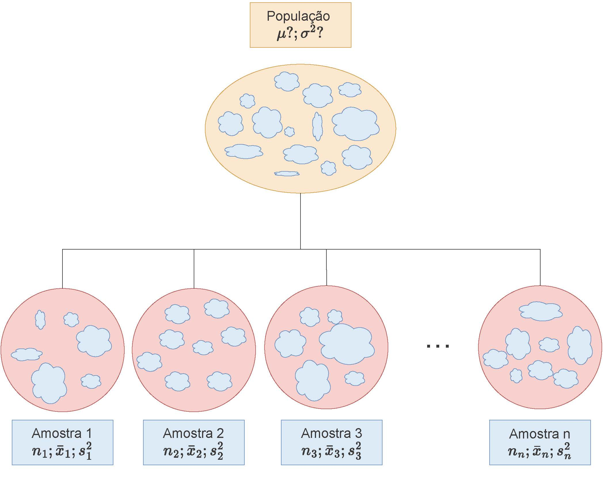

---
output:
  pdf_document: default
  html_document: default
---


```{r, echo=FALSE, include=FALSE}
colFmt <- function(x,color) {
  
  outputFormat <- knitr::opts_knit$get("rmarkdown.pandoc.to")
  
  if(outputFormat == 'latex') {
    ret <- paste("\\textcolor{",color,"}{",x,"}",sep="")
  } else if(outputFormat == 'html') {
    ret <- paste("<font color='",color,"'>",x,"</font>",sep="")
  } else {
    ret <- x
  }

  return(ret)
}

#uso>>>> `r colFmt("REG",'red')`, 


```


```{r , echo = FALSE, include=FALSE}
library(texPreview)
library(kableExtra)
library(knitr)
library(ggplot2)
knitr::opts_chunk$set(echo = TRUE)

```


# Introdução à distribuição das médias e diferenças entre médias amostrais e seus intervalos de confiança 


A finalidade de uma amostra é obter uma estimativa do valor de um ou mais parãmetros de uma população. 

Observa-se que os valores amostrais repetidamente extraídos de modo aleatório de uma mesma população variam de uma para outra amostra e também em relação ao verdadeiro parâmetro dessa população; todavia, demonstra-se que essa variabilidade pode ser descrita por meio de distribuições de probabilidade.


Distribuições de probabilidade  quando usadas para esse propósito são denominadas de distribuições amostrais e permitem responder para cada amostra o quão próxima está a estatística amostral do verdadeiro parâmetro populacional. Essa resposta depende fundamentalmente de três fatores:


- a estatistica que está sendo utilizada: diferentes estatísticas requerem diferentes distribuições de probabilidade para modelar sua variabilidade;
- o tamanho da amostra que implica de modo inverso na variabilidade entre as amostras;
- a variabilidade existente na própria população sob estudo e amostragem. 


\

\

## Distribuições amostrais 

\


Parâmetro é toda medida numérica descritiva de uma população. Quando essas medidas são calculadas sobre amostras extraídas de uma população passam a ser denominadas como estatísticas da população de origem. A média, a mediana, a variância, a proporção amostrais, assim como outras estatísticas amostrais, são exemplos de variáveis aleatórias (v.a.) uma vez que seus valores sofrem variação a cada amostra extraída. 

\


Considere uma população com $N$ elementos da qual se deseja extrair todas as possíveis amostras de tamanho $n$. Para cada amostra extraída pode-se calcular uma mesma medida descritiva como, por exemplo, a média ( ou a variância, proporção \dots). O conjunto dos valores resultantes nos permite analisar como as estimativas amostrais se distribuem em comparação ao parâmetro que estão a estimar. 

\


Essas distribuições são denominadas _distribuições amostrais_.  O estudo das _distribuições amostrais_ é um elemento fundamental na _inferência estatística_ posto possibilitar o estabelecimento de _intervalos de confiança_ relacionados ao valor de um _parâmetro_  que se deseja inferir, a partir de uma estatística proveniente de uma única amostra. 

\

O processo de extração de amostras pode ser *com* ou *sem* reposição. A extração *com* reposição assegura a independência entre os eventos e, eventos independentes são mais facilmente analisados. 

\

O quantidade possível de  amostras de tamanho $n$ extraídas de uma população de tamanho $N$ é dado por :

\

- com reposição: $N^{n}$; e, 
- sem reposição: $C_{(N.n)}$

\

Mais adiante veremos que processos de extração de amostras de tamanho $n$, *sem* reposição de populações finitas com parâmetros $\mu$ (média) e $\sigma^{2}$ (variância) a esperança da v.a. de sua média amostral ainda é dada por:

\

$$
E(\stackrel{-}{X})=\mu
$$

\

mas sua variância deve ser corrigida de:

\


$$
Var(\stackrel{-}{X})  =\frac{\sigma^{2}}{n} 
$$


\

para:

\

$$
Var(\stackrel{-}{X}) =\frac{\sigma^{2}}{n} \cdot (\frac{N-n}{N-1})
$$

\

em que $(\frac{N-n}{N-1})$ é denominado como fator de correção para populações finitas. 

\


Para ilustrar o conceito de distribuição das médias amostrais considere uma situação onde uma empresa produz lâmpadas e a vida útil média, em horas, dessas lâmpadas segue uma distribuição Normal tal que $VU \sim N (1600, 120)$.

\


Usando conceitos já explicados em uma unidade anterior podemos determinar o tamanho amostral em função de:

- um erro máximo: $\varepsilon$=20 horas;
- um nível de significância estabelecido: $\alpha$=0,05; e,
- e alguma informação sobre a medida da variabilidade da variável em estudo: $\sigma$=120 horas (no caso, o desvio padrão populacional).


\


```{r, warning=FALSE, echo=FALSE}

IC.Na = function (N, n, mu, sigma, conf, er) {
  dados=data.frame()
  plot(0, 0, 
       type="n", 
       xlim=c(mu-0.05*mu,mu+0.05*mu), 
       ylim=c(0,N), 
       bty="l",
       xlab="Vida útil em horas", 
       ylab="Amostras extraídas", 
       main=paste0("Flutuação dos valores médios obtidos em ", N," amostras de tamanho ",n,"\n(nível de confiança: ",conf,"; erro: ", er,")") , 
       sub=paste0("Os valores da vida útil seguem uma distribuição ~ N  (\u03bc:",mu," ; \u03c3:", sigma,")"))
  abline(v=mu, col='blue', lwd=2, lty=2)
  abline(v=mu-er, col='red', lwd=2, lty=2)
  abline(v=mu+er, col='red', lwd=2, lty=2)

  #axis(1, at = c(mu-1*mu, mu, mu+1*mu))
zc = qnorm(1-((1-conf)/2))
#sigma.xbarra = sigma/sqrt(n)
for (i in 1:N) {
  x = rnorm(n, mu, sigma)
  media = mean(x)
  erro= media-mu
  sd = sd(x)
  li = media - zc * sd/(sqrt(n))
  ls = media + zc * sd/(sqrt(n))
  temp=cbind(mu, media, erro, li, ls)
  dados=rbind(dados, temp)
  plotx = c(li,ls)
  ploty = c(i,i)
  #if (li > mu | ls < mu) lines(plotx,ploty, col="red", lwd=2, lend=0)
  #else lines(plotx,ploty, lend=0) 
   if (media > mu+er || media < mu-er) 
     points(media, i, col="red", cex=1)+text(y=i+3,x=media, labels=round(media,1), cex=1, col='red')
  else 
    points(media, i, col="black", cex=1) 
} 
colnames(dados)=c("mu", "media", "erro", "li", "ls")
return(dados)
}
```

\


```{r ,  out.width='100%', fig.align='center', fig.cap="Flutuação dos valores médios para diversas amostras extraídas de uma mesma população distribuição $\\sim N (\\mu; \\sigma)$", warning = FALSE, echo=FALSE}
N=100
n=140
mu=1600
sigma=120
conf=0.95
er=20

IC.Na(N, n, mu, sigma, conf, er)

```
\

Observa-se no gráfico acima que algumas das amostras (em vermelho), numa proporção igual ao nível de significância estabelecido quando do dimensionamento (5\%), geram médias (amostrais) se afastam do valor médio na população mais que o erro estabelecido (20 h). 

\


## Intervalos de confiança

\


Um _intervalo de confiança_ ($IC$) pode ser entendido com a faixa de valores delimitada por um mínimo e um máximo, calculados como função direta de um _nível de confiança_ e da _variabilidade_ e inversa da _tamanho amostral_.

\

$$
\text{estimativa amostral} \pm confiança.\sqrt\frac{variabilidade}{n}
$$

\

Raramente se dispõe de informação a respeito da variabilidade ($\sigma^{2}$) da população estudada. Assim, a variabilidade populacional será frequentemente incorporado na expressão acima, com ligeiras modificações, na forma de sua estimativa amostral ($S^{2}$).

\


De certo modo, um intervalo de confiança reflete uma estimativa objetiva da (im)precisão e do tamanho da amostra de determinada pesquisa e, assim, podemos considerá-lo como uma medida da qualidade da amostra e da pesquisa.

\

O _nível de confiança_ é designado pela quantidade $(1-\alpha)$ na qual $\alpha$ é denominado de _nível de significância_, uma medida da probabilidade de erro. 


\

Dependendo do _nível de confiança_ que escolhemos os limites superior e inferior do intervalo mudam para uma mesma estimativa amostral. Os intervalos de confiança mais utilizados na literatura são os de 90\%, 95\%, 99\% e menos de 99,9\%.

\

O _intervalo de confiança_ de 95\% é tradicionalmente o intervalo mais utilizado na literatura e isso está relacionado ao _nível de significância_ estatística ($P<0,05$) geralmente mais aceito.  

\

Quanto menor for a _amplitude_ de um intervalo, maior será a _precisão_ da estimativa. Todavia, somente estudos com amostras razoavelmente _grandes_ resultarão em um intervalo de confiança estreito, indicando simultaneamentente com alta precisão e alto grau de confianla a estimativa do parâmetro.
\

Intervalos de confiança podem ser construídos a quase todas as quantidades estatísticas e suas diferenças (quando se procura estudar se há ou não diferenças entre os parâmetros de duas populaçoes) como, por exemplo:
\

- médias;
- proporções; e,
- variâncias.


\

Um _intervalo de confiança_ estabelecido sob certa probabilidade **não** deve ser interpretado como sendo a _faixa_ de valores, delimitada por um mínimo e máximo, entre os quais o _parâmetro_ da população (o qual se estima ou sobre o qual se infere) se insere.

\


Mas **sim** que, extraíndo-se um grande número de amostras de igual tamanho e da mesma população, e construindo-se para cada uma dessas amostras um intervalo de confiança de um mesmo nível de significância ($\alpha$), observaremos que uma determinada proporção desses intervalos, chamada de nível de confiança ($1-\alpha$) **irá, de fato, conter** o _parâmetro_  sobre o qual se estima ou sobre o qual se infere.  Por conseguinte, uma proporção desses intervalos chamada de nível de significância ($\alpha$) **não irá** conter o verdadeiro valor do parâmetro populacional. 

\

Assim, $(1-\alpha)$ traduz o grau de confiança que se tem que um intervalo de confiança, calculado sobre uma estatística advinda de uma particular amostra de tamanho $n$ da variável aleatória $X$, inclua o verdadeiro valor do parâmetro da população:    

\


```{r,  out.width='100%', fig.align='center', fig.cap="Distribuição dos erros amostrais em relação ao verdadeiro valor do parãmetro da população"}


IC.N = function (N, n, mu, sigma, conf) {
  dados=data.frame()
  plot(0, 0, 
       type="n", 
       xlim=c(mu-0.4*mu,mu+0.4*mu), 
       ylim=c(0,N), 
       bty="l",
       xlab="Escala de valores da variável", 
       ylab="Intervalos amostrais construídos", 
       main=paste0("Intervalos com iguais níveis de confiança fixados em ", 100*conf, "% \n(",N," amostras de tamanho ",n,")") , 
       sub=paste0("Parâmetros da distribuição da população Normal ( \u03bc, \u03c3) = (",mu,", ", sigma,")"))
  abline(v=mu, col='red', lwd=2, lty=2)
  #axis(1, at = c(mu-1*mu, mu, mu+1*mu))
zc = qnorm(1-((1-conf)/2))
#sigma.xbarra = sigma/sqrt(n)
for (i in 1:N) {
  x = rnorm(n, mu, sigma)
  media = mean(x)
  erro= media-mu
  sd = sd(x)
  li = media - zc * sd/(sqrt(n))
  ls = media + zc * sd/(sqrt(n))
  temp=cbind(mu, media, erro, li, ls)
  dados=rbind(dados, temp)
  plotx = c(li,ls)
  ploty = c(i,i)
  if (li > mu | ls < mu) lines(plotx,ploty, col="red", lwd=2, lend=0)
  else lines(plotx,ploty, lend=0) 
   if (li > mu | ls < mu) points(media, i, col="red", cex=1)+text(y=i+3,x=media, labels=round(media,1), cex=1, col='red')
  else points(media, i, col="black", cex=1) 
} 
colnames(dados)=c("mu", "media", "erro", "li", "ls")
return(dados)
}

```

\

```{r}

N=100
n=64
mu=9.421
sigma=4.1681
conf=0.95
IC.N(N, n, mu, sigma, conf)

```


\


O gráfico acima expõe os intervalos de confiança: $(1-\alpha)$=`r 100*conf`\% produzidos para as `r N` médias de amostras de tamanho `r n` extraídas de uma população com parâmetros $\mu:$ `r mu` e $\sigma:$ `r sigma`. 

\

A proporção de intervalos amostrais que não contém o verdadeiro valor do parâmetro populacional pode ser visualmente inspecionada pelas linhas em vermelho.    

\


> Intervalos de confiança bilaterais: intervalos delimitados por dois valores: mínimo e máximo, para a proporção amostral, dentro do qual todos os valores possuem um mesmo nível de confiança de ocorrência.


> Intervalos de confiança unilaterais: intervalos delimitados apenas em um de seus lados, nos quais todos os valores possuem um mesmo nível de confiança. Podem ser limitados à direita por um valor máximo ou limitados à esquerda por um valor mínimo.


## Distribuição das médias amostrais e seus intervalos de confiança 

\


```{r fig45, echo=FALSE, out.width='100%', fig.align='center', fig.cap='Ilustração esquemática de $n$ amostras extraídas de uma mesma população de parâmetros $\\mu$ e $\\sigma$, cada uma apresentando as respectivas estatísticas calculadas'}



```

\


Para estudarmos a distribuição das médias amostrais considerem uma população com parâmetros $\mu$ (média) e $\sigma^{2}$ (variância).

\

A distribuição das médias amostrais expressa como se distribuem os valores dessa estatística calculada para todas as possíveis amostras de tamanho _n_ extraídas de uma população cujo valor desse parãmetro é desconhecido.   

\	

A convergência da forma de distribuição e dos parâmetros da distribuição das médias amostrais são elucidadas pelas **Leis (fraca e forte) dos Grandes Números** e pelo **Teorema Central do Limite** (George Pólya, 1920).

\

De acordo com a teoria, pelo uso de simulações computacionais consegue-se ilustrar que para uma amostra de tamanho _n_ (onde $x_{1},x_{1},...,x_{n}$ são os valores assumidos das variáveis aleatórias $X_{1},X_{1},...,X_{n}$) em amostras extraídas de uma população infinita de tamanho _N_ com média $\mu$ e variância $\sigma^{2}$) a distribuição das médias amostrais (v.a. $\stackrel{-}{X}$) segue uma distribuição com os média $=\mu$ e variância $=\frac{\sigma^{2}}{n}$ pois: 

\

\begin{align*}
E(\stackrel{-}{X})  & = \frac{1}{n} \cdot \{E(X_{1})+E(X_{2})+...+E(X_{n})\} \\
                    & = (\frac{1}{n})\cdot\{\mu+\mu+...+\mu\} = \frac{n\cdot\mu}{n} = \mu 
\end{align*}


\


\begin{align*}
Var(\stackrel{-}{X}) & =  \frac{1}{n^{2}} \cdot \{Var(X_{1})+Var(X_{2}+...+Var(X_{n})\} \\
                     & = (\frac{1}{n^{2}}) \cdot \{\sigma^{2}+\sigma^{2}+...+\sigma^{2}\} = n \cdot \frac{\sigma^{2}}{n^{2}} = \frac{\sigma^{2}}{n}
\end{align*}


\

Equivale afirmar que, **independentemente** da forma de distribuição da população de origem da qual são extraídas as amostras, a distribuição dos valores da variável aleatória $\stackrel{-}{X}$ tenderá a seguir uma distribuição $\sim N(\mu;\frac{\sigma^{2}}{n}$) à medida que _n_ , o tamanho da amostra aumenta, como ilustrado nas Figuras \@ref(fig:fig46) e \@ref(fig:fig48). 

\

O **TCL** garante a aproximação da distribuição de $\stackrel{-}{X}$ a uma distribuição Normal com média $\mu$ e variância $\frac{\sigma^{2}}{n}$ quando $n$ é grande, independentemente da distribuição da população de origem.   Na prática, essa aproximação é usada quando $n\ge 30$.

\


Portanto, para populações **infinitas** ou amostragem **com reposição**:

\

$$
\stackrel{-}{X} \sim N(\mu, \frac{\sigma^{2}}{n})
$$


\


> Demostração usando amostras extraídas de uma população com distribuição $\sim U (v_{min}; v_{max})$

\


```{r fig46,  out.width='100%', fig.align='center', fig.cap="Histograma de uma população cuja característica de interesse segue uma Distribuição Uniforme"}


# Definindo os parãmetros e a amostra
min_1=2
max_1=6
NN=5000
pop_1=runif(NN, min=min_1, max=max_1)
df=as.data.frame(pop_1)

# A distribuição da população ilustrada em um histograma
ggplot(df, aes(x=pop_1)) + 
  geom_histogram( binwidth=1,color="black", fill="lightblue")+
  scale_y_continuous(name="Frequência") +
  scale_x_continuous(name="Valores")+
  labs(title= paste("Histograma de uma população com Distribuição Uniforme"), 
       subtitle = paste("Parâmetros: valor min =",min_1,"; valor max =", max_1))+
  theme(plot.title = element_text(size = 10, face = "bold"),
        axis.text.x = element_text(angle=0, hjust=1, size=10),
        axis.text.y = element_text(angle=0, hjust=1, size=10),
        axis.title.x = element_text(size = 10),
        axis.title.y = element_text(size = 10))

```

\

A Figura  \@ref(fig:fig46) mostra o histograma de uma amostra de `r NN ` elementos de uma população com Distribuição Uniforme de parâmetros $v_{min}:$ `r min_1` e $v_{max}:$ `r max_1`. 

\

```{r , include=FALSE}

# Criando as repetições: N amostras de tamanhos n
N=100
n=30

# z crítico para o intervalo de confiança
conf=0.95
zc = qnorm(1-((1-conf)/2)) #Z=1,96


dados=data.frame()
for(i in 1:N){
  amostra_i=sample(x=pop_1, size=n, replace = TRUE) # i-ésima amostra da População 
  med_i=mean(amostra_i) # média da i-ésima amostra da População 
  sd_i=sd(amostra_i) # desvio padrão da i-ésima amostra da População  
  lim_sup=med_i+zc*(sd_i/sqrt(n)) # limite superior para a i-ésima média amostral tendo-se um tamanho amostral grande (Z)
  lim_inf=med_i-zc*(sd_i/sqrt(n)) # limite inferior para a i-ésima média amostral tendo-se um tamanho amostral grande (Z)
  meio=med_i
  temp=cbind(lim_inf, lim_sup, meio, sd_i)
  dados=rbind(dados, temp)
  print(i)
}


names=c("lim inferior", "lim superior", "Media", "Desv. Padrão")
colnames(dados)=names
row.names(dados)=NULL
m=dados$Media


# Intervalos de confiança das diferenças amostrais observadas 
# para demonstrar como é improvável de se observar diferenças amostrais nulas  

IC.N = function () {
  plot(0, 0, 
       type="n", 
       xlim=c(min_1-0.25*min_1,max_1+0.25*max_1), 
       ylim=c(0,N), 
       bty="l",
       xlab="Escala de valores da variável", 
       ylab="Intervalos amostrais construídos", 
       main=paste0("Intervalos com iguais níveis de confiança fixados em ", 100*conf, "% \n(",N," amostras de tamanho ",n,")") , 
       sub=paste0("Parâmetros da distribuição da população Uniforme (max, min)=(", max_1,",", min_1, ")") )
  abline(v=0.5*(max_1+min_1), col="red", lwd=1, lty=2)
  for (i in 1:N) {
    li = dados$`lim inferior`[i]
    ls = dados$`lim superior`[i]
    plotx = c(li,ls)
    ploty = c(i,i)
    if ( ls < 4 || li > 4 ) lines(plotx,ploty, col="red", lwd=1, lty=1)
    else lines(plotx,ploty, col="blue", lwd=1, lty=1)
    segments(x0=mean(dados$Media) , y0=0, x1=mean(dados$Media) ,y1=N,col="black", lwd=1, lty=2)
  } }


```

\


```{r fig47,  out.width='100%', fig.align='center', fig.cap="Intervalos de confiança construídos para diversas estimativas amostrais de uma população com Distribuição $\\sim N (\\mu= \\frac{max-min}{2}; \\sigma^2=\\frac{1}{12}(max-min)^2)$", warning = FALSE, echo=FALSE}

IC.N()

```

\
 
A Figura  \@ref(fig:fig47) expõe os intervalos sob nível de confiança de $(1-\alpha)$=`r 100*conf`\% produzidos para as `r N` médias de amostras de tamanho `r n` extraídas de uma população Uniforme com parâmetros $v_{max}:$ `r max_1` e $v_{min}:$ `r min_1` e, conforme assegura o **TCL**, o valor médio das médias amostrais (linha tracejada preta) converge assintoticamente para a média da população de origem (linha tracejada em vermelho) com o incremento do tamanho das amostras. 

\


```{r fig48,  out.width='100%', fig.align='center', fig.cap="Histograma da distribuição das médias de amostras extraidas de uma população com Distribuição Uniforme mostra que as mesmas seguem uma Distribuição $\\sim N (\\mu= \\frac{max-min}{2};\\sigma^2=\\frac{1}{12}(max-min)^2)$", warning = FALSE}


meu_titulo1=paste("Distribuição das médias de", N, "amostras de tamanho n=",n,"\n população de origem sob Dist. Unif. (min: ", min_1, "; max: ", max_1, ")")
meu_titulo2=paste("As médias amostrais ~ N( x=",round(mean(m),2),";sd=",round(sd(m),2),")")

dados=as.data.frame(m)
ggplot(dados, aes(m)) +     
  geom_histogram(aes(y = stat(density)), bins=10, fill="lightblue", col="black") +
  geom_area(stat = "function", 
            fun = dnorm, 
            args = list(mean=mean(m), sd=sd(m)),
            fill = NA, 
            colour="red") +
  scale_y_continuous(name="Densidade") +
  scale_x_continuous(name="Valores das médias amostrais") +
  labs(title=meu_titulo1)+
  geom_segment(aes(x = mean(m), y = 0, xend = mean(m), yend = max(dnorm(m))), color="blue", lty=2, lwd=0.3)+
  annotate(geom="text", x=mean(m), y=max(dnorm(m)),
           label=meu_titulo2, angle=0, vjust=-0.5, hjust=0.5, color="blue",size=6)+
  theme(plot.title = element_text(size = 10, face = "bold"),
        axis.text.x = element_text(angle=0, hjust=1, size=10),
        axis.text.y = element_text(angle=0, hjust=1, size=10),
        axis.title.x = element_text(size = 10),
        axis.title.y = element_text(size = 10))


```

\

O histograma da Figura  \@ref(fig:fig48) ilustra que os valores das médias calculadas de `r n` amostras extraídas de uma população com distribuição Uniforme $\sim U (v_{min}, v_{max}$) seguem uma distribuição Normal  $\sim N (\mu= \frac{v_{max}-v_{min}}{2}; \sigma^2=\frac{1}{12}(v_{max}-v_{min})^2)$. 


\

> Demostração usando amostras extraídas de uma população com distribuição $\sim N (\mu;\sigma)$

\


```{r fig49,  out.width='100%', fig.align='center', fig.cap="Histograma de uma população cuja característica de interesse segue uma Distribuição Normal"}


# Definindo os parãmetros e a amostra
media=80
desvio=4
NN=5000
pop_2=rnorm(n=NN, mean = media, sd = desvio)

df=as.data.frame(pop_2)

# A distribuição da população ilustrada em um histograma
ggplot(df, aes(x=pop_2)) + 
  geom_histogram( binwidth=1,color="black", fill="lightblue")+
  scale_y_continuous(name="Frequêcia") +
  scale_x_continuous(name="Valores")+
  labs(title= paste("Histograma de uma população com Distribuição Normal"), 
       subtitle = paste("Parâmetros: média =",media,"; desv. padrão =", desvio))+
  theme(plot.title = element_text(size = 10, face = "bold"),
        axis.text.x = element_text(angle=0, hjust=1, size=10),
        axis.text.y = element_text(angle=0, hjust=1, size=10),
        axis.title.x = element_text(size = 10),
        axis.title.y = element_text(size = 10))

```

\


A Figura  \@ref(fig:fig49) mostra o histograma de uma amostra de `r NN ` elementos de uma população com Distribuição Normal de parâmetros média= `r media` e desvio padrão =`r desvio`. 


```{r , include=FALSE}

# Criando as repetições: N amostras de tamanhos n
N=100
n=5000

# z crítico para o intervalo de confiança
conf=0.95
zc = qnorm(1-((1-conf)/2)) #Z=1,96

dados=data.frame()
for(i in 1:N){
  amostra_i=sample(x=pop_2, size=n, replace = TRUE) # i-ésima amostra da População 
  med_i=mean(amostra_i) # média da i-ésima amostra da População 
  sd_i=sd(amostra_i) # desvio padrão da i-ésima amostra da População  
  lim_sup=med_i+zc*(sd_i/sqrt(n)) # limite superior para a i-ésima média amostral tendo-se um tamanho amostral grande (Z)
  lim_inf=med_i-zc*(sd_i/sqrt(n)) # limite inferior para a i-ésima média amostral tendo-se um tamanho amostral grande (Z)
  meio=med_i
  temp=cbind(lim_inf, lim_sup, meio, sd_i)
  dados=rbind(dados, temp)
  print(i)
}


names=c("lim inferior", "lim superior", "Media", "Desv. Padrão")
colnames(dados)=names
row.names(dados)=NULL
m=dados$Media


# Intervalos de confiança das diferenças amostrais observadas 
# para demonstrar como é improvável de se observar diferenças amostrais nulas  

IC.N = function () {
  plot(0, 0, 
       type="n", 
       xlim=c(media-0.15*media, media+0.15*media), 
       ylim=c(0,N), 
       bty="l",
       xlab="Escala de valores da variável", 
       ylab="Intervalos amostrais construídos", 
       main=paste0("Intervalos com iguais níveis de confiança fixados em ", 100*conf, "% \n(",N," amostras de tamanho ",n,")") , 
    sub=paste0("Parâmetros da distribuição da população Normal ( \u03bc, \u03c3) = (",media,", ", desvio,")"))
  abline(v=media, col="red",  lwd=1, lty=2)
  for (i in 1:N) {
    li = dados$`lim inferior`[i]
    ls = dados$`lim superior`[i]
    plotx = c(li,ls)
    ploty = c(i,i)
    if ( ls < media || li > media ) lines(plotx,ploty, col="red", lwd=1, lty=1)
    else lines(plotx,ploty, col="blue", lwd=1, lty=1)
    segments(x0=mean(dados$Media) , y0=0, x1=mean(dados$Media) ,y1=N,col="black", lwd=1, lty=2)
  } }


```

\


```{r fig50,  out.width='100%', fig.align='center', fig.cap="Intervalos de confiança construídos para diversas estimativas amostrais de uma população com Distribuição $\\sim N (\\mu; \\sigma)$", warning = FALSE, echo=FALSE}

IC.N()

```
\

A Figura  \@ref(fig:fig50) expõe os intervalos sob nível de confiança de $(1-\alpha)$=`r 100*conf`\% produzidos para as `r N` médias de amostras de tamanho `r n` extraídas de uma população Uniforme com parâmetros $v_{max}:$ `r max_1` e $v_{min}:$ `r min_1` e, conforme assegura o **TCL**, o valor médio das médias amostrais (linha tracejada preta) converge assintoticamente para a média da população de origem (linha tracejada em vermelho) com o incremento do tamanho das amostras. 


\

```{r fig51,  out.width='100%', fig.align='center', fig.cap='Histograma da distribuição das médias de amostras extraidas de uma população  Normal mostra que as mesmas seguem uma Distribuição $\\sim N (\\stackrel{-}{x}= \\mu; s=\\frac{\\sigma}{\\sqrt{n}})$', warning = FALSE}


meu_titulo1=paste("Distribuição das médias de", N, "amostras de tamanho n=",n,"\n população de origem sob Dist. Normal ( \u03bc: ", media, ", \u03c3: ", desvio, ")")
meu_titulo2=paste("As médias amostrais ~ N( x\u0304=",round(mean(m),2),";sd=",round(sd(m),2),")")

dados=as.data.frame(m)
ggplot(dados, aes(m)) +     
  geom_histogram(aes(y = stat(density)), bins=10, fill="lightblue", col="black") +
  geom_area(stat = "function", 
            fun = dnorm, 
            args = list(mean=mean(m), sd=sd(m)),
            fill = NA, 
            colour="red") +
  scale_y_continuous(name="Densidade") +
  scale_x_continuous(name="Valores das médias amostrais") +
  labs(title=meu_titulo1)+
  geom_segment(aes(x = mean(m), y = 0, xend = mean(m), yend = max(dnorm(m))), color="blue", lty=2, lwd=0.3)+
  annotate(geom="text", x=mean(m), y=max(dnorm(m)),
           label=meu_titulo2, angle=0, vjust=-0.5, hjust=0.5, color="blue",size=6)+
  theme(plot.title = element_text(size = 10, face = "bold"),
        axis.text.x = element_text(angle=0, hjust=1, size=10),
        axis.text.y = element_text(angle=0, hjust=1, size=10),
        axis.title.x = element_text(size = 10),
        axis.title.y = element_text(size = 10))


```

\

O histograma da Figura  \@ref(fig:fig51) ilustra que os valores das médias calculadas de `r n` amostras extraídas de uma população com distribuição Normal $\sim N (\mu, \sigma)$ seguem uma distribuição Normal  $\sim N (\mu= \mu; \sigma=\frac{\sigma}{\sqrt{n}})$. 

\


Sendo o erro amostral expresso como:  $\varepsilon=\stackrel{-}{X} - \mu$, o histograma abaixo ilustra que os valores dos erros calculados de `r n` amostras extraídas de uma população com distribuição Normal $\sim N (\mu, \sigma)$ seguem uma distribuição Normal  $\sim N (\mu= \mu; \sigma=\frac{\sigma}{\sqrt{n}})$. 


\
```{r, warning=FALSE, echo=FALSE}


IC.Na = function (N, n, mu, sigma, conf) {
  dados=data.frame()
  plot(0, 0, 
       type="n", 
       xlim=c(mu-4,mu+4), 
       ylim=c(0,N), 
       bty="l",
       xlab="Escala de valores da variável", 
       ylab="Intervalos amostrais construídos", 
       main=paste0("Intervalos com iguais níveis de confiança fixados em ", 100*conf, "% \n(",N," amostras de tamanho ",n,")") , 
       sub=paste0("Parâmetros da distribuição da população Normal ( \u03bc, \u03c3) = (",mu,", ", sigma,")"))
  abline(v=mu, col="blue")
  #axis(1, at = c(mu-1*mu, mu, mu+1*mu))
zc = qnorm(1-((1-conf)/2))
#sigma.xbarra = sigma/sqrt(n)
for (i in 1:N) {
  x = rnorm(n, mu, sigma)
  media = mean(x)
  erro= media-mu
  sd = sd(x)
  li = media - zc * sd/(sqrt(n))
  ls = media + zc * sd/(sqrt(n))
  temp=cbind(mu, media, erro, li, ls)
  dados=rbind(dados, temp)
  plotx = c(li,ls)
  ploty = c(i,i)
  if (li > mu | ls < mu) lines(plotx,ploty, col="red", lwd=2, lend=0)
  else lines(plotx,ploty, lend=0) 
   if (li > mu | ls < mu) points(media, i, col="red")
  else points(media, i, col="black") 
} 
colnames(dados)=c("mu", "media", "erro", "li", "ls")
return(dados)
}
```


\


```{r fig0, out.width='100%', fig.align='center', fig.cap="Histograma da distribuição dos erros de amostras de tamanho n,  extraidas de uma população com distribuição $\\sim N(\\mu; \\sigma)$ mostra que os mesmos seguem uma distribuição $\\sim N (0; s=\\frac{\\sigma}{\\sqrt{n}})$", warning = FALSE}

N=100
n=50
mu=80
sigma=4 
conf=0.95
matriz=IC.Na(N, n, mu, sigma, conf)
erro_min=min(matriz$erro)
erro_max=max(matriz$erro)


meu_titulo1=paste("Distribuição dos erros de", N, "amostras de tamanho n=",n,"\n extraídas de uma população Normal ( \u03bc: ", mu, ", \u03c3: ", sigma, ")")
meu_titulo2=paste("Os erros amostrais ~ N( x\u0304=",round(mean(matriz$erro),2),"~0 ; sd=",round(sd(matriz$erro),2)," ~\u03c3/sqrt(n))")

ggplot(matriz, aes(x=erro)) + 
  geom_histogram(aes(y = stat(density)), bins=round(sqrt(N),0), fill="lightblue", col="black") +
  geom_area(stat = "function", 
            fun = dnorm, 
            args = list(mean=mean(matriz$erro), sd=sd(matriz$erro)),
            fill = NA, 
            colour="red") +
  scale_y_continuous(name="Frequência") +
  scale_x_continuous(name="Valores dos erros amostrais", limits=c(-2,2) )+
  labs(title=meu_titulo1)+
  annotate(geom="text", 
           label=meu_titulo2, x=-0.7,y= 0.9,
           angle=0, vjust=-0.5, hjust=0.5,
           color="blue",size=4)+
  theme(plot.title = element_text(size = 10, face = "bold"),
        axis.text.x = element_text(angle=0, hjust=1, size=10),
        axis.text.y = element_text(angle=0, hjust=1, size=10),
        axis.title.x = element_text(size = 10),
        axis.title.y = element_text(size = 10))

```


\

> Corolário: se $(X_{1}, X_{2},...,X{n})$ for uma amostra aleatória simples da população $X$ de média $\mu$ e variância $\sigma^{2}$ conhecida, e $\stackrel{-}{X}= \frac{(X_{1}+X_{2}+...+X{n})}{n}$, tal que $n\ge 30$, então a estatística $Z$ pode ser definida, bem como sua correspondente distribuição:

\


$$
Z = \frac{\stackrel{-}{X} - \mu}{\frac{\sigma}{\sqrt{n}}}  \sim N(0 ,1)
$$

\


Uma vez que a estatística $Z \sim N(0 ,1)$ (ela ``decorre'' da padronização da variável aleatória $\stackrel{-}{X}$) as probabilidades para os intervalos desejados de valores  $Z$ podem ser facilmente encontrados em tabelas, como mais adiante se verá na constução de intervalos de confiança.     

	

\

### Fator de correção para populações finitas

\


Se amostras de tamanho $n$ *sem reposição* são extraídas de uma população finita de tamanho *N* aplica-se o fator de correção para populações finitas ($\sqrt{\frac{(N-n)}{(N-1)}}$)  junto ao desvio padrão das expressões do erro máximo $\varepsilon$ anteriormente expostas: 


\begin{align*}
\varepsilon & =(\stackrel{-}{x}-\mu)={z}_{(1-\frac{\alpha }{2})} \cdot \frac{\sigma}{\sqrt{n}} \cdot \sqrt{\frac{(N-n)}{(N-1)}} \\
& =(\stackrel{-}{x}-\mu)={z}_{(1-\frac{\alpha }{2})} \cdot \frac{S}{\sqrt{n}} \cdot \sqrt{\frac{(N-n)}{(N-1)}}\\
& =(\stackrel{-}{x}-\mu)= ({t}_{(1-\frac{\alpha }{2}, (n-1))} \cdot \frac{S}{\sqrt{n}} \cdot \sqrt{\frac{(N-n)}{(N-1)}})\\
\end{align*}

\

Portanto, para populações *finitas* com amostragem *sem reposição* (com $n<N$):


\

$$
\stackrel{-}{X} \sim N(\mu,  \frac{\sigma^{2}}{n} \cdot \frac{(N-n)}{(N-1)}    )
$$


\


### Intervalo de confiança para médias amostrais

\


Se, por alguma razão, a variância populacional ($\sigma^{2}$) é conhecida,  podemos utilizar $\stackrel{-}{X}$ como estimador pontual da média. 

\

Assim, $X$ seguirá uma distribuição Normal tal que: 

\	

$$
\stackrel{-}{X} \sim N(\mu, \frac{\sigma^{2}}{n})
$$


\


Segue também que a estatística $Z$, como antes definida, seguirá uma distribuição Normal tal que:

\	

$$
Z = \frac{\stackrel{-}{X} - \mu}{\frac{\sigma}{\sqrt{n}}}  \sim N(0 ,1)
$$
com: 

\

- $\stackrel{-}{X}$ é a média da amostra;  
- $\mu$ é a média populacional;  
- $\sigma$ é o desvio padrão populacional; e,  
- $n$ é o tamanho da amostra extraída.


\

Entretanto, a situação mais usual é aquela na qual não termos informação alguma sobre a variância populacional ($\sigma^{2}$). 

\

Nessas situações, se o tamanho da amostra é grande (na prática $n\ge 30$),  podemos substituir  $\sigma$ na estatística $Z$ por $S$: substituir o desvio padrão populacional pelo desvio padrão da amostra extraída, sem que o erro cometido com esta substituição seja grande. 

\


Com tal substituição, a estatística $Z$ e passa a ser tal que: 

\

$$
Z = \frac{\stackrel{-}{X} - \mu}{\frac{S}{\sqrt{n}}}  \sim N(0 , 1)
$$

\

em que: 

\

- $\stackrel{-}{X}$ é a média amostral;  
- $\mu$ é a média populacional;  
- $S$ é o desvio padrão da amostra; e,  
- $n$ é o tamanho da amostra.


\

Caso a variância populacional ($\sigma^{2}$) não seja conhecida e o tamanho da amostra **não possa** ser admitido como grande ($n<30$) e sendo o estimador da variância amostral assim definido:

\	

$$
{S}^{2}=\frac{1}{\left(n-1\right)}\sum _{i=1}^{n}{\left({X}_{i}-\stackrel{-}{{X}_{1}}\right)}^{2}
$$

\


Definindo-se a variável $Y = \frac{(n-1)\cdot s^{2}}{\sigma^{2}}$ tem uma distribuição $\chi^{2}$ com (n-1) graus de liberdade tal que:

\	

$$
Y = \frac{(n-1)\cdot s^{2}}{\sigma^{2}} \sim \chi^{2}_{(n-1)},
$$


\	

e considerando-se que $Z$ é tal que:
\	

$$
Z = \frac{\stackrel{-}{X} - \mu}{\frac{\sigma}{\sqrt{n}}}  \sim N(0 ,1)
$$

\

segue a estatística $T$ e sua correspondente distribuição, denominada por *t* de *Student* :

\	

$$
T=\frac{Z}{\sqrt{\frac{Y}{\left(n-1\right)}}} \sim {t}_{\left(n-1\right)}.
$$
\

Para essa situação na qual a variância populacional não é conhecida e o tamanho amostral é pequeno, com  alguma manipulação chega-se à estatística $T$ e sua correspondente distribuição:

\	


$$
T = \frac{(\stackrel{-}{X} - \mu)}{    \frac{S}{\sqrt{n}} } \sim t_{(n-1)}
$$

\

em que:

\

- $\stackrel{-}{X}$ é a média amostral;  
- $\mu$ é a média populacional; 
- $S$ é o desvio padrão da amostra; e,  
- $n$ é o tamanho da amostra; e,   
- $(n-1)$ é uma quantidade denominada como *graus de liberdade*.

\

As probabilidades associadas a um intervalo para um determinado valor da estatística ``t'' da distribuição de *Student* encontram-se tabeladas para variados graus de liberdade , como mais adiante se verá na constução de intervalos de confiança.     

\

### Intervalo de confiança bilateral para uma média amostral sob variância populacional conhecida (Figura \@ref(fig:fig28))

\	


$$
Z = \frac{\stackrel{-}{X} - \mu}{\frac{\sigma}{\sqrt{n}}}  \sim N(0 ,1)
$$

\	

em que: 

\

- $\stackrel{-}{X}$ é a média amostral;  
- $\mu$ é a média populacional;  
- $\sigma$ é o desvio padrão populacional; 
- $n$ é o tamanho da amostra; e, 
- $Z$ é a estatística a ser calculada para a construção do intervalo de confiança sob o nível de significância $\alpha$ estabelecido. 


\


```{r fig52,  out.width='100%', fig.align='center', fig.cap="Regiões críticas, aquém e além das quais, a probabilidade associada aos valores $Z$ é inferior a $\\frac{\\alpha}{2}$, estabelecendo assim um intervalo com nível de confiança igual a $(1-\\alpha)$", warning = FALSE}


alfa=0.05

prob_desejada1=alfa/2
z_desejado1=round(qnorm(prob_desejada1),4)
d_desejada1=dnorm(z_desejado1, 0, 1)

prob_desejada2=1-alfa/2
z_desejado2=round(qnorm(prob_desejada2),4)
d_desejada2=dnorm(z_desejado2, 0, 1)


ggplot(NULL, aes(c(-4,4))) +
  geom_area(stat = "function", 
            fun = dnorm, 
            fill = "red", 
            xlim = c(-4, z_desejado1),
            colour="black") +
  geom_area(stat = "function", 
            fun = dnorm, 
            fill = "lightgrey", 
            xlim = c(z_desejado1,0),
            colour="black") +
  geom_area(stat = "function", 
            fun = dnorm, 
            fill = "lightgrey", 
            xlim = c(0, z_desejado2),
            colour="black") +
  geom_area(stat = "function", 
            fun = dnorm, 
            fill = "red", 
            xlim = c(z_desejado2,4),
            colour="black") +
  scale_y_continuous(name="Densidade") +
  scale_x_continuous(name="Valores ``z'' da distribuição Normal padrão")  +
  labs(title= 
         "Curva da função densidade \nDistribuição Normal Padrão", 
       subtitle = "P(-z, z)=(1-\u03b1) em cinza (nível de confiança) \nP(-\U221e; -z)= P(z; \U221e)= \u03b1/2 em vermelho ")+
  geom_segment(aes(x = z_desejado1, y = 0, xend = z_desejado1, yend = d_desejada1), color="blue", lty=2, lwd=0.3)+
  geom_segment(aes(x = z_desejado2, y = 0, xend = z_desejado2, yend = d_desejada2), color="blue", lty=2, lwd=0.3)+
  annotate(geom="text", x=z_desejado1-0.1, y=d_desejada1, label="-z", angle=90, vjust=0, hjust=0, color="blue",size=6)+
  annotate(geom="text", x=z_desejado2+0.3, y=d_desejada2, label="z", angle=90, vjust=0, hjust=0, color="blue",size=6)+
  annotate(geom="text", x=z_desejado1-1.8, y=0.1, label="Intervalo aberto à esq. \n(probabilidade=\u03b1/2)", angle=0, vjust=0, hjust=0, color="blue",size=3)+
  annotate(geom="text", x=z_desejado2+0.5, y=0.1, label="Intervalo aberto à dir. \n(probabilidade=\u03b1/2)", angle=0, vjust=0, hjust=0, color="blue",size=3)+
  annotate(geom="text", x=z_desejado1+1.3, y=0.2, label="Intervalo fechado \n(probabilidade= (1-\u03b1))", angle=0, vjust=0, hjust=0, color="blue",size=3)+
  theme_bw()


```

\

Na Figura \@ref(fig:fig52) observa-se: 

\	

- o nível de significância $\alpha$;   
- o nível de confiança $(1-\alpha)$; e,   
- o valor tabelado da estatística $Z(z)$ para o nível de confiança fixado.


\

Assim, 

\


\begin{align*}
P\left[-{Z}_{(1-\frac{\alpha }{2})}\le Z \le {Z }_{(1-\frac{\alpha }{2})}\right] & = (1-\alpha) \\ 
P\left[-{z}_{(1-\frac{\alpha }{2})}\le \frac{\stackrel{-}{x}-\mu }{\frac{\sigma}{\sqrt{n}}}
\le {z}_{(1-\frac{\alpha }{2})}\right] & = (1-\alpha) \\
P[\stackrel{-}{x}-({z}_{(1-\frac{\alpha }{2})} \cdot \frac{\sigma}{\sqrt{n}}) \le \mu \le \stackrel{-}{x}+({z}_{(1-\frac{\alpha }{2})} \cdot \frac{\sigma}{\sqrt{n}})     ] & = (1-\alpha)  
\end{align*}

\


$$
IC(\mu)_{(1-\alpha)} = [\stackrel{-}{x} \pm {z}_{c} \cdot \frac{\sigma}{\sqrt{n}}]
$$


\

Assim, se $\stackrel{-}{x}$ é usado como estimativa de $\mu$, podemos afirmar estar $100.(1-\alpha)$\% confiantes de que o erro não excederá  $({z}_{(1-\frac{\alpha }{2})} \cdot \frac{\sigma}{\sqrt{n}})$.

\	

A quantidade $\varepsilon=(\stackrel{-}{x}-\mu)={z}_{(1-\frac{\alpha }{2})} \cdot \frac{\sigma}{\sqrt{n}}$ é chamada de Erro máximo da estimativa ao se arbitrar um nível de confiança $\alpha$ para um determinado tamanho amostral.  

\


> Exemplo: As vendas de 15 lojas de uma região do país apresentam uma média igual a US\$ 20.000,00. Sabendo-se que as vendas de todas as lojas da região é uma variável aleatória que segue uma distribuição Normal, com desvio padrão igual a US\$ 8.300,00, construa o intervalo de confiança para a média ao nível de confiança de 95\%.

\

Dados do problema: 

\	

- o tamanho da amostra: $n=15$;  
- a média amostral: $\stackrel{-}{x}$ = US\$ 20.000;  
- o desvio padrão populacional: $\sigma$= US\$ 8.300;  
- nível de confiança: $(1-\alpha) = 0,95$; e, 
- valor extraído da tabela $z=1,96$ correspondente ao nível de confiança estipulado  $(1-\alpha)=95\%$.


\

\begin{align*}
P[\stackrel{-}{x}-({z}_{(1-\frac{\alpha }{2})} \cdot \frac{\sigma}{\sqrt{n}}) \le \mu \le \stackrel{-}{x}+({z}_{(1-\frac{\alpha }{2})} \cdot \frac{\sigma}{\sqrt{n}})     ] & = (1-\alpha) \\
P[20.000 - (1,96 \cdot \frac{8.300}{\sqrt{15}})  \le \mu \le 20000 + (      1,96 \cdot \frac{8.300}{\sqrt{15}})     ] & = 0,95 \\
P[20.000 - 4.200,38   \le \mu \le 20.000 + 4.200,38 ] & = 0,95 \\
\end{align*}

\

$$
IC_{(1-\alpha=0,95)} = [US\$ 15.799,62; US\$ 24.200,38]
$$


\

Se quisermos ser rigorosos na interpretação do intervalo de confiança calculado podemos explicar que, se extrairmos um grande número de amostras de tamanho 15 dessa população, e para todas elas calcularmos intervalos de confiança como o acima definido, a proporção desses intervalos onde poderemos encontrar a média populacional de vendas será de 0,95 (95 intervalos em 100).

\

De uma forma mais sintética, podemos afirmar que o intervalo aleatório ]US\$ 15.799,62; US\$ 24.200,38[, é um intervalo de confiança a 95\% para a média de vendas.

\

De forma mais corrente, *embora menos correta* em termos teóricos, é usual afirmar que, com 95\% de confiança a média de vendas se situa entre os valores US\$ 15.799,62 e US\$ 24.200,38.


\


> Intervalos de confiança unilaterais para uma média amostral sob variância populacional conhecida. 

\

A Figura \@ref(fig:fig29) ilustra um intervalo de confiança unilateral limitado à direita por um valor máximo, dde tal sorte que a probabilidade associada ao intervalo de valores da estatística $Z$ inferiores a esse limitante é 


\


$$
P\left [\mu \le \bar{x} + {z}_{c} \cdot  \frac{\sigma}{\sqrt{n}} \right ] = (1- \alpha)
$$


\

```{r fig53,  out.width='100%', fig.align='center', fig.cap="Região crítica, além da qual, a probabilidade associada aos valores $Z$ é inferior a $\\alpha$, delimitando assim, à esquerda, um intervalo aberto com nível de confiança igual a $(1-\\alpha)$", warning = FALSE}

prob_desejada=0.95
z_desejado=round(qnorm(prob_desejada),4)
d_desejada=dnorm(z_desejado, 0, 1)

ggplot(NULL, aes(c(-4,4))) +
  geom_area(stat = "function", 
            fun = dnorm, 
            fill = "lightgrey", 
            xlim = c(-4, 0),
            colour="black") +
  scale_y_continuous(name="Densidade") +
  scale_x_continuous(name="Valores ``z'' da distribuição Normal padrão")  +
  geom_area(stat = "function",
            fun = dnorm, 
            fill = "lightgrey", 
            xlim = c(0, z_desejado),
            colour="black")+
  geom_area(stat = "function",
            fun = dnorm, 
            fill = "red", 
            xlim = c( z_desejado, 4),
            colour="black")+
  labs(title= 
      "Curva da função densidade
      \nDistribuição Normal Padrão", 
      subtitle = "P(-\U221e; z)=(1-\u03b1) em cinza (nível de confiança)  \nP(z, + \U221e)= \u03b1, em vermelho ")+
  annotate(geom="text", x=z_desejado1+3.5, y=d_desejada1, label="z", angle=90, vjust=0, hjust=0, color="blue",size=6)+
  annotate(geom="text", x=z_desejado1+4.5, y=0.1, label="Intervalo aberto à dir. \n(probabilidade=\u03b1)", angle=0, vjust=0, hjust=0, color="blue",size=3)+
  annotate(geom="text", x=z_desejado1+1.3, y=0.2, label="Intervalo aberto à esq. \n(probabilidade= (1-\u03b1))", angle=0, vjust=0, hjust=0, color="blue",size=3)+
  theme_bw()

```

\


A Figura \@ref(fig:fig54) ilustra um intervalo de confiança unilateral limitado à esquerda por um valor mínimo, de tal sorte que a probabilidade associada ao intervalo de valores da estatística $Z$ superiores a esse limitante é 


\


$$
P\left [\mu \ge \bar{x} - {z}_{c} \cdot  \frac{\sigma}{\sqrt{n}} \right ] = (1- \alpha)
$$

\


```{r fig54,  out.width='100%', fig.align='center', fig.cap="Região crítica, aquém da qual, a probabilidade associada aos valores $Z$ é inferior a $\\alpha$, delimitando assim, à direita, um intervalo aberto com nível de confiança igual a $(1-\\alpha)$", warning = FALSE}


prob_desejada=0.05
z_desejado=round(qnorm(prob_desejada),4)
d_desejada=dnorm(z_desejado, 0, 1)

ggplot(NULL, aes(c(-4,4))) +
  geom_area(stat = "function", 
            fun = dnorm, 
            fill = "lightgrey", 
            xlim = c(-4, 0),
            colour="black") +
  scale_y_continuous(name="Densidade") +
  scale_x_continuous(name="Valores ``z'' da distribuição Normal padrão")  +
  geom_area(stat = "function",
            fun = dnorm, 
            fill = "red", 
            xlim = c(-4, z_desejado),
            colour="black")+
  geom_area(stat = "function",
            fun = dnorm, 
            fill = "lightgrey", 
            xlim = c( z_desejado, 4),
            colour="black")+
  labs(title= 
      "Curva da função densidade
      \nDistribuição Normal Padrão", 
      subtitle = "P(-\U221e; z)=\u03b1, em vermelho \nP(z, + \U221e)= (1-\u03b1) em cinza")+
  annotate(geom="text", x=z_desejado1+0.5, y=d_desejada1, label="-z", angle=90, vjust=0, hjust=0, color="blue",size=6)+
  annotate(geom="text", x=z_desejado1-2, y=0.1, label="Intervalo aberto à esq. \n(probabilidade=\u03b1)", angle=0, vjust=0, hjust=0, color="blue",size=3)+
  annotate(geom="text", x=z_desejado1+1.3, y=0.2, label="Intervalo aberto à dir. \n(probabilidade= (1-\u03b1))", angle=0, vjust=0, hjust=0, color="blue",size=3)+
  theme_bw()

```


### Intervalo de confiança para uma média amostral sob variância populacional desconhecida mas amostras não tão pequenas: $n \ge 30$  (Figura \@ref(fig:fig55))

\	

$$
Z = \frac{\stackrel{-}{X} - \mu}{\frac{S}{\sqrt{n}}}  \sim N(0 , 1)
$$

\	

em que: 

\

- $\stackrel{-}{X}$ é a média amostral;  
- $\mu$ é a média populacional;  
- $S$ é o desvio padrão amostral; 
- $n$ é o tamanho da amostra; e, 
- $Z$ é a estatística a ser calculada para a construção do intervalo de confiança sob o nível de significância $\alpha$ estabelecido. 


\


```{r fig55,  out.width='100%', fig.align='center', fig.cap="Regiões críticas, aquém e além das quais, a probabilidade associada aos valores $Z$ é inferior a $\\frac{\\alpha}{2}$, estabelecendo assim um intervalo com nível de confiança igual a $(1-\\alpha)$", warning = FALSE}

alfa=0.05

prob_desejada1=alfa/2
z_desejado1=round(qnorm(prob_desejada1),4)
d_desejada1=dnorm(z_desejado1, 0, 1)

prob_desejada2=1-alfa/2
z_desejado2=round(qnorm(prob_desejada2),4)
d_desejada2=dnorm(z_desejado2, 0, 1)


ggplot(NULL, aes(c(-4,4))) +
  geom_area(stat = "function", 
            fun = dnorm, 
            fill = "red", 
            xlim = c(-4, z_desejado1),
            colour="black") +
  geom_area(stat = "function", 
            fun = dnorm, 
            fill = "lightgrey", 
            xlim = c(z_desejado1,0),
            colour="black") +
  geom_area(stat = "function", 
            fun = dnorm, 
            fill = "lightgrey", 
            xlim = c(0, z_desejado2),
            colour="black") +
  geom_area(stat = "function", 
            fun = dnorm, 
            fill = "red", 
            xlim = c(z_desejado2,4),
            colour="black") +
  scale_y_continuous(name="Densidade") +
  scale_x_continuous(name="Valores ``z'' da distribuição Normal padrão")  +
  labs(title= 
         "Curva da função densidade \nDistribuição Normal Padrão", 
       subtitle = "P(-z; z)=(1-\u03b1) em cinza (nível de confiança) \nP(-\U221e; -z)= P(z; \U221e)= \u03b1/2 em vermelho")+
  geom_segment(aes(x = z_desejado1, y = 0, xend = z_desejado1, yend = d_desejada1), color="blue", lty=2, lwd=0.3)+
  geom_segment(aes(x = z_desejado2, y = 0, xend = z_desejado2, yend = d_desejada2), color="blue", lty=2, lwd=0.3)+
  annotate(geom="text", x=z_desejado1-0.1, y=d_desejada1, label="-z", angle=90, vjust=0, hjust=0, color="blue",size=6)+
  annotate(geom="text", x=z_desejado2+0.3, y=d_desejada2, label="z", angle=90, vjust=0, hjust=0, color="blue",size=6)+
  annotate(geom="text", x=z_desejado1-1.8, y=0.1, label="Intervalo aberto à esq. \n(probabilidade=\u03b1/2)", angle=0, vjust=0, hjust=0, color="blue",size=3)+
  annotate(geom="text", x=z_desejado2+0.5, y=0.1, label="Intervalo aberto à dir. \n(probabilidade=\u03b1/2)", angle=0, vjust=0, hjust=0, color="blue",size=3)+
  annotate(geom="text", x=z_desejado1+1.3, y=0.2, label="Intervalo fechado \n(probabilidade= (1-\u03b1))", angle=0, vjust=0, hjust=0, color="blue",size=3)+
  theme_bw()


```

\


Na Figura \@ref(fig:fig55) observa-se: 

\	

- o nível de significância $\alpha$;   
- o nível de confiança $(1-\alpha)$; e,   
- o valor tabelado da estatística $Z(z)$ para o nível de confiança fixado.


\

Assim, 

\	

\begin{align*}
P\left[-{Z}_{(1-\frac{\alpha }{2})}\le Z \le {Z }_{(1-\frac{\alpha }{2})}\right] & = (1-\alpha) \\
P\left[-{z}_{(1-\frac{\alpha }{2})}\le \frac{\stackrel{-}{x}-\mu }{(\frac{S}{\sqrt{n})}}
\le {z}_{(1-\frac{\alpha }{2})}\right] & = (1-\alpha) \\
P[\stackrel{-}{x}-({z}_{(1-\frac{\alpha }{2})} \cdot \frac{S}{\sqrt{n}}) \le \mu \le \stackrel{-}{x}+({z}_{(1-\frac{\alpha }{2})} \cdot \frac{S}{\sqrt{n}})     ] & = (1-\alpha) 
\end{align*}


\

$$
IC(\mu)_{(1-\alpha)} = [\stackrel{-}{x} \pm {z}_{c} \cdot \frac{S}{\sqrt{n}} ] 
$$

\

Assim, se $\stackrel{-}{x}$ é usado como estimativa de $\mu$ podemos afirmar estar $100(1-\alpha)$\% confiantes de que o erro não excederá  $({z}_{(1-\frac{\alpha }{2})} \cdot \frac{S}{\sqrt{n}})$.


\	


A quantidade $\varepsilon=(\stackrel{-}{x}-\mu)={z}_{(1-\frac{\alpha }{2})} \cdot \frac{S}{\sqrt{n}}$ é chamada de Erro máximo da estimativa ao se arbitrar um nível de confiança $\alpha$ para um determinado tamanho amostral.  


\

> Exemplo: As vendas de 60 lojas de uma região do país apresentam uma média igual a US\$ 20.000,00 e desvio padrão de US\$ 8.300,00. Construa o intervalo de confiança para a média ao nível de confiança de 95\%.

\

Dados do problema: 

\	


- o tamanho da amostra: $n=60$;  
- a média amostral: $\stackrel{-}{x}=US\$ 20.000$;  
- o desvio padrão amostral: $s=US\$ 8.300$;  
- nível de confiança: $(1-\alpha)=0,95$; e, 
- valor extraído da tabela $z=1,96$ correspondente ao nível de confiança estipulado  $(1-\alpha)=95\%$.

\

\begin{align*}
P[\stackrel{-}{x}-({z}_{(1-\frac{\alpha }{2})} \cdot \frac{S}{\sqrt{n}}) \le \mu \le \stackrel{-}{x}+({z}_{(1-\frac{\alpha }{2})} \cdot \frac{S}{\sqrt{n}})     ] & = (1-\alpha) \\
P[20.000 - (1,96 \cdot \frac{8.300}{\sqrt{60}}) \le \mu \le 20.000 + (      1,96 \cdot \frac{8.300}{\sqrt{60}})     ] & = 0,95 \\
P[20.000 - 2.100,19  \le \mu \le 20.000 + 2.100,19 ] & = 0,95 
\end{align*}

\


$$
IC_{(1-\alpha=0,95)} = [US\$ 17.899,81;US\$ 22.100,19]
$$


\

Se quisermos ser rigorosos na interpretação do intervalo de confiança calculado podemos explicar que  se extrairmos um grande número de amostras de tamanho 60 dessa população, e para todas elas calcularmos intervalos de confiança como o acima definido, a proporção desses intervalos onde poderemos encontrar a média populacional de vendas será de 0,95 (95 intervalos em 100).

\

De uma forma mais sintética, podemos afirmar que o intervalo aleatório ]US\$ 17.899,81; US\$ 22.100,19[, é um intervalo de confiança a 95\% para a média de vendas.

\

De forma mais corrente, *embora menos correta* em termos teóricos, é usual afirmar que, com 95\% de confiança a média de vendas se situa entre os valores US\$ 17.899,81 e US\$ 22.100,19.

\


> Intervalos de confiança unilaterais para uma média amostral sob variância populacional desconhecida  mas amostras não tão pequenas: $n \ge 30$. 

\


A Figura \@ref(fig:fig56) ilustra um intervalo de confiança unilateral limitado à direita por um valor máximo, de tal sorte que a probabilidade associada ao intervalo de valores da estatística $Z$ inferiores a esse limitante é 


\


$$
P\left [\mu \le \bar{x} + {z}_{c} \cdot  \frac{S}{\sqrt{n}} \right ] = (1- \alpha)
$$


\

```{r fig56,  out.width='100%', fig.align='center', fig.cap="Região crítica, além da qual, a probabilidade associada aos valores $Z$ é inferior a $\\alpha$, delimitando assim, à esquerda, um intervalo aberto com nível de confiança igual a $(1-\\alpha)$", warning = FALSE}

prob_desejada=0.95
z_desejado=round(qnorm(prob_desejada),4)
d_desejada=dnorm(z_desejado, 0, 1)

ggplot(NULL, aes(c(-4,4))) +
  geom_area(stat = "function", 
            fun = dnorm, 
            fill = "lightgrey", 
            xlim = c(-4, 0),
            colour="black") +
  scale_y_continuous(name="Densidade") +
  scale_x_continuous(name="Valores ``z'' da distribuição Normal padrão")  +
  geom_area(stat = "function",
            fun = dnorm, 
            fill = "lightgrey", 
            xlim = c(0, z_desejado),
            colour="black")+
  geom_area(stat = "function",
            fun = dnorm, 
            fill = "red", 
            xlim = c( z_desejado, 4),
            colour="black")+
  labs(title= 
      "Curva da função densidade
      \nDistribuição Normal Padrão", 
      subtitle = "P(-\U221e; z)=(1-\u03b1) em cinza (nível de confiança)  \nP(z, + \U221e)= \u03b1, em vermelho ")+
  annotate(geom="text", x=z_desejado1+3.5, y=d_desejada1, label="z", angle=90, vjust=0, hjust=0, color="blue",size=6)+
  annotate(geom="text", x=z_desejado1+4.5, y=0.1, label="Intervalo aberto à dir. \n(probabilidade=\u03b1)", angle=0, vjust=0, hjust=0, color="blue",size=3)+
  annotate(geom="text", x=z_desejado1+1.3, y=0.2, label="Intervalo aberto à esq. \n(probabilidade= (1-\u03b1))", angle=0, vjust=0, hjust=0, color="blue",size=3)+
  theme_bw()

```

\


A Figura \@ref(fig:fig57) ilustra um intervalo de confiança unilateral limitado à esquerda por um valor mínimo, de tal sorte que a probabilidade associada ao intervalo de valores da estatística $Z$ superiores a esse limitante é 


\


$$
P\left [\mu \ge \bar{x} - {z}_{c} \cdot  \frac{S}{\sqrt{n}} \right ] = (1- \alpha)
$$

\


```{r fig57,  out.width='100%', fig.align='center', fig.cap="Região crítica, aquém da qual, a probabilidade associada aos valores $Z$ é inferior a $\\alpha$, delimitando assim, à direita, um intervalo aberto com nível de confiança igual a $(1-\\alpha)$", warning = FALSE}


prob_desejada=0.05
z_desejado=round(qnorm(prob_desejada),4)
d_desejada=dnorm(z_desejado, 0, 1)

ggplot(NULL, aes(c(-4,4))) +
  geom_area(stat = "function", 
            fun = dnorm, 
            fill = "lightgrey", 
            xlim = c(-4, 0),
            colour="black") +
  scale_y_continuous(name="Densidade") +
  scale_x_continuous(name="Valores ``z'' da distribuição Normal padrão")  +
  geom_area(stat = "function",
            fun = dnorm, 
            fill = "red", 
            xlim = c(-4, z_desejado),
            colour="black")+
  geom_area(stat = "function",
            fun = dnorm, 
            fill = "lightgrey", 
            xlim = c( z_desejado, 4),
            colour="black")+
  labs(title= 
      "Curva da função densidade
      \nDistribuição Normal Padrão", 
      subtitle = "P(-\U221e; z)=\u03b1, em vermelho \nP(z, + \U221e)= (1-\u03b1) em cinza")+
  annotate(geom="text", x=z_desejado1+0.5, y=d_desejada1, label="-z", angle=90, vjust=0, hjust=0, color="blue",size=6)+
  annotate(geom="text", x=z_desejado1-1.5, y=0.1, label="Intervalo aberto à esq. \n(probabilidade=\u03b1)", angle=0, vjust=0, hjust=0, color="blue",size=3)+
  annotate(geom="text", x=z_desejado1+1.3, y=0.2, label="Intervalo aberto à dir. \n(probabilidade= (1-\u03b1))", angle=0, vjust=0, hjust=0, color="blue",size=3)+
  theme_bw()

```


### Intervalo de confiança para uma média amostral sob variância populacional desconhecida e amostras de qualquer tamanho (Figura \@ref(fig:fig58))


\	

$$
T = \frac{(\stackrel{-}{X} - \mu)}{    \frac{S}{\sqrt{n}} } \sim t_{(n-1)}
$$

\	

em que: 

\

- $\stackrel{-}{X}$ é a média amostral;  
- $\mu$ é a média populacional;  
- $S$ é o desvio padrão amostral;  
- $n$ é o tamanho da amostra; e, 
- $T$ é a estatística a ser calculada para a construção do intervalo de confiança sob o nível de significância $\alpha$ estabelecido. 

\


```{r fig58,  out.width='100%', fig.align='center', fig.cap="Regiões críticas, aquém e além das quais, a probabilidade associada aos valores $T$ ($(n-1)$ graus de liberdade) é inferior a $\\frac{\\alpha}{2}$, estabelecendo assim um intervalo com nível de confiança igual a $(1-\\alpha)$", warning = FALSE}


alfa=0.05

prob_desejada1=alfa/2
df=20
t_desejado1=round(qt(prob_desejada1,df ),4)
d_desejada1=dt(t_desejado1,df)

prob_desejada2=1-alfa/2
df=20
t_desejado2=round(qt(prob_desejada2, df),4)
d_desejada2=dt(t_desejado2,df)


ggplot(NULL, aes(c(-4,4))) +
  geom_area(stat = "function", 
            fun = dt,
            args=list(df), 
            fill = "red", 
            xlim = c(-4, t_desejado1),
            colour="black") +
  geom_area(stat = "function", 
            fun = dt, 
            args=list(df), 
            fill = "lightgrey", 
            xlim = c(t_desejado1,0),
            colour="black") +
  geom_area(stat = "function", 
            fun = dt, 
            args=list(df), 
            fill = "lightgrey", 
            xlim = c(0, t_desejado2),
            colour="black") +
  geom_area(stat = "function", 
            fun = dt, 
            args=list(df), 
            fill = "red", 
            xlim = c(t_desejado2,4),
            colour="black") +
  scale_y_continuous(name="Densidade") +
  scale_x_continuous(name="Valores ``t'' da distribuição de Student com gl=n-1")  +
  labs(title= "Curva da função densidade \nDistribuição t ", 
       subtitle = "P(-t; t)=(1-\u03b1) em cinza (nível de confiança) \nP(-\U221e; -t)= P(t; \U221e)= \u03b1/2 em vermelho ")+
  geom_segment(aes(x = t_desejado1, y = 0, xend = t_desejado1, yend = d_desejada1), color="blue", lty=2, lwd=0.3)+
  geom_segment(aes(x = t_desejado2, y = 0, xend = t_desejado2, yend = d_desejada2), color="blue", lty=2, lwd=0.3)+
  annotate(geom="text", x=t_desejado1-0.1, y=d_desejada1, label="-t", angle=90, vjust=0, hjust=0, color="blue",size=6)+
  annotate(geom="text", x=t_desejado2+0.3, y=d_desejada2, label="t", angle=90, vjust=0, hjust=0, color="blue",size=6)+
  annotate(geom="text", x=t_desejado1-1.8, y=0.1, label="Intervalo aberto à esq. \n(probabilidade=\u03b1/2)", angle=0, vjust=0, hjust=0, color="blue",size=3)+
  annotate(geom="text", x=t_desejado2+0.5, y=0.1, label="Intervalo aberto à dir. \n(probabilidade=\u03b1/2)", angle=0, vjust=0, hjust=0, color="blue",size=3)+
  annotate(geom="text", x=t_desejado1+1.3, y=0.2, label="Intervalo fechado \n(probabilidade= (1-\u03b1))", angle=0, vjust=0, hjust=0, color="blue",size=3)+  theme_bw()


```


\


Na Figura \@ref(fig:fig58) observa-se: 

\	

- o nível de significância $\alpha$;   
- o nível de confiança $(1-\alpha)$; e,   
- o valor tabelado da estatística $T(t)$ sob $n-1$ graus de liberdade para o nível de confiança fixado.

\

Assim, 

\	

\begin{align*}
P\left[-{T}_{(1-\frac{\alpha }{2}, (n-1))}\le T \le {T }_{(1-\frac{\alpha }{2}, (n-1))}\right] & = (1-\alpha) \\
P\left[-{t}_{(1-\frac{\alpha }{2}, (n-1))}\le \frac{\stackrel{-}{x}-\mu }{\frac{S}{\sqrt{n}}}
\le {t}_{(1-\frac{\alpha }{2}, (n-1))}\right] & = (1-\alpha) \\
P[\stackrel{-}{x}-({t}_{(1-\frac{\alpha }{2}, (n-1))} \cdot \frac{S}{\sqrt{n}}) \le \mu \le \stackrel{-}{x}+({t}_{(1-\frac{\alpha }{2}, (n-1))} \cdot \frac{S}{\sqrt{n}})     ] & = (1-\alpha) 
\end{align*}


$$
IC(\mu)_{(1-\alpha)}= [\stackrel{-}{x} \pm {t}_{c_{(n-1)}} \cdot \frac{S}{\sqrt{n}}] 
$$

\

Assim, se $\stackrel{-}{x}$ é usado como estimativa de $\mu$ podemos afirmar estar $100(1-\alpha)$\% confiantes de que o erro não excederá  $({t}_{(1-\frac{\alpha }{2})} \cdot \frac{S}{\sqrt{n}})$.

\	

A quantidade $\varepsilon=(\stackrel{-}{x}-\mu)=      ({t}_{(1-\frac{\alpha }{2}, (n-1))} \cdot \frac{S}{\sqrt{n}})$ é chamada de Erro máximo da estimativa ao se arbitrar um nível de confiança $\alpha$,  (n-1) graus de liberdade e um determinado tamanho amostral.  

\
	
> Exemplo: As vendas de 15 lojas de uma região do país apresentam uma média igual a US\$ 20.000,00 e desvio padrão de US\$ 8.300,00. Construa o intervalo de confiança para a média ao nível de confiança de 95\%.

\

Dados do problema: 

\

- o tamanho da amostra: $n=15$;  
- a média amostral: $\stackrel{-}{x}=US\$ 20.000$;  
- o desvio padrão amostral: $s=US\$ 8.300$;  
- nível de confiança: $(1-\alpha)=0,95$; e, 
- valor extraído da tabela da distribuição de \textit{Student} sob $(n-1=15-1=14)$ graus de liberdade $t_{c}=2,1448$ associado ao nível de confiança estipulado  $(1-\alpha)=95\%$.


\

\begin{align*}
P[\stackrel{-}{x}-({t}_{(1-\frac{\alpha }{2})} \cdot \frac{S}{\sqrt{n}}) \le \mu \le \stackrel{-}{x}+({t}_{(1-\frac{\alpha }{2})} \cdot \frac{S}{\sqrt{n}}) ] & = (1-\alpha) \\
P[20000 - ( 2,1448 \cdot \frac{8300}{\sqrt{15}}) \le \mu \le 20000 + ( 2,1448  \cdot \frac{8300}{\sqrt{15}}) ] & = 0,95\\
P[20000 - 4596,41 \le \mu \le 20000 + 4596,41 ] & = 0,95
\end{align*}

\

$$
IC_{(1-\alpha=0,95)} = [US\$ 15403,59 ; US\$ 24496,41]
$$


\

Se quisermos ser rigorosos na interpretação do intervalo de confiança calculado podemos explicar que se extrairmos um grande número de amostras de tamanho 15 dessa população, e para todas elas calcularmos intervalos de confiança como o acima definido, a proporção desses intervalos onde poderemos encontrar a média populacional de vendas será de 0,95 (95 intervalos em 100).


\


De uma forma mais sintética, podemos afirmar que o intervalo aleatório ]US\$ 15.403,59; US\$ 24.496,41[, é um intervalo de confiança a 95\% para a média de vendas.

\


De uma forma mais corrente, *embora menos correta* em termos teóricos, é usual afirmar que, com 95\% de confiança a média de vendas se situa entre os valores US\$ 15.403,59 e US\$ 24.496,41.

\

> Intervalos de confiança unilaterais para uma média amostral sob variância populacional desconhecida e amostras de qualquer tamanho 


\


A Figura \@ref(fig:fig59) ilustra um intervalo de confiança unilateral limitado à direita por um valor máximo, de tal sorte que a probabilidade associada ao intervalo de valores da estatística $T$ inferiores a esse limitante é 


\


$$
P\left [\mu \le \bar{x} + {t}_{c_{(n-1)}} \cdot  \frac{S}{\sqrt{n}} \right ] = (1- \alpha)
$$


\

```{r fig59,  out.width='100%', fig.align='center', fig.cap="Região crítica, além da qual, a probabilidade associada aos valores $T$ ($(n-1)$ graus de liberdade)  é inferior a $\\alpha$, delimitando assim, à esquerda, um intervalo aberto com nível de confiança igual a $(1-\\alpha)$", warning = FALSE}

alfa=0.95
prob_desejada1=alfa
df=20
t_desejado1=round(qt(prob_desejada1,df ),4)
d_desejada1=dt(t_desejado1,df)

ggplot(NULL, aes(c(-4,4))) +
  geom_area(stat = "function", 
            fun = dt,
            args=list(df), 
            fill = "red", 
            xlim = c( t_desejado1, 4),
            colour="black") +
  geom_area(stat = "function", 
            fun = dt, 
            args=list(df), 
            fill = "lightgrey", 
            xlim = c(0, t_desejado1),
            colour="black") +
  geom_area(stat = "function", 
            fun = dt, 
            args=list(df), 
            fill = "lightgrey", 
            xlim = c(-4, 0),
            colour="black") +
  scale_y_continuous(name="Densidade") +
  scale_x_continuous(name="Valores ``t'' da distribuição de Student com gl=n-1")  +
  labs(title= "Curva da função densidade \nDistribuição t ", 
       subtitle = "P(-\U221e, t)=(1-\u03b1) em cinza \nP(t, \U221e)= \u03b1 em vermelho ")+
  geom_segment(aes(x = t_desejado1, y = 0, xend = t_desejado1, yend = d_desejada1), color="blue", lty=2, lwd=0.3)+
  annotate(geom="text", x=t_desejado1+0.5, y=d_desejada1, label="t", angle=90, vjust=0, hjust=0, color="blue",size=6)+
  annotate(geom="text", x=t_desejado1+1, y=0.1, label="Intervalo aberto à esq. \n(probabilidade=\u03b1)", angle=0, vjust=0, hjust=0, color="blue",size=3)+
  annotate(geom="text", x=t_desejado1-2.5, y=0.2, label="Intervalo aberto \n(probabilidade= (1-\u03b1))", angle=0, vjust=0, hjust=0, color="blue",size=3)+  theme_bw()


```

\


A Figura \@ref(fig:fig60) ilustra um intervalo de confiança unilateral limitado à esquerda por um valor mínimo, de tal sorte que a probabilidade associada ao intervalo de valores da estatística $T$ superiores a esse limitante é 


\


$$
P\left [\mu \ge \bar{x} - {t}_{c} \cdot  \frac{S}{\sqrt{n}} \right ] = (1- \alpha)
$$

\


```{r fig60,  out.width='100%', fig.align='center', fig.cap="Região crítica, aquém da qual, a probabilidade associada aos valores $T$ ($(n-1)$ graus de liberdade)  é inferior a $\\alpha$, delimitando assim, à direita, um intervalo aberto com nível de confiança igual a $(1-\\alpha)$", warning = FALSE}


alfa=0.05
prob_desejada1=alfa
df=20
t_desejado1=round(qt(prob_desejada1,df ),4)
d_desejada1=dt(t_desejado1,df)


ggplot(NULL, aes(c(-4,4))) +
  geom_area(stat = "function", 
            fun = dt,
            args=list(df), 
            fill = "red", 
            xlim = c(-4, t_desejado1),
            colour="black") +
  geom_area(stat = "function", 
            fun = dt, 
            args=list(df), 
            fill = "lightgrey", 
            xlim = c(t_desejado1,0),
            colour="black") +
  geom_area(stat = "function", 
            fun = dt, 
            args=list(df), 
            fill = "lightgrey", 
            xlim = c(0, 4),
            colour="black") +
  scale_y_continuous(name="Densidade") +
  scale_x_continuous(name="Valores ``t'' da distribuição de Student com gl=n-1")  +
  labs(title= "Curva da função densidade \nDistribuição t ", 
       subtitle = "P(-t, \U221e)=(1-\u03b1) em cinza \nP(-\U221e; -t)= \u03b1 em vermelho ")+
  geom_segment(aes(x = t_desejado1, y = 0, xend = t_desejado1, yend = d_desejada1), color="blue", lty=2, lwd=0.3)+
  annotate(geom="text", x=t_desejado1-0.1, y=d_desejada1, label="-t", angle=90, vjust=0, hjust=0, color="blue",size=6)+
  annotate(geom="text", x=t_desejado1-2.5, y=0.1, label="Intervalo aberto à esq. \n(probabilidade=\u03b1)", angle=0, vjust=0, hjust=0, color="blue",size=3)+
  annotate(geom="text", x=t_desejado1+1, y=0.2, label="Intervalo aberto \n(probabilidade= (1-\u03b1))", angle=0, vjust=0, hjust=0, color="blue",size=3)+  theme_bw()


```


## Distribuição das diferenças de médias amostrais independentes e seus intervalos de confiança


Consideremos duas populações $X$ e $Y$ com médias $\mu_{1}$ e $\mu_{2}$ e variâncias $\sigma_{1}^{2}$ e $\sigma_{2}^{2}$, respectivamente.

\	

Conforme seções anteriores, as médias amostrais $\stackrel{-}{X}$ e $\stackrel{-}{Y}$ são duas variáveis aleatórias tais que:

\

\begin{align*}
\stackrel{-}{X} &  \sim N(\mu_{1},  \frac{\sigma^{2}_{1}}{n_{1}} )\\
\stackrel{-}{Y} & \sim N(\mu_{2},  \frac{\sigma^{2}_{2}}{n_{2}} )
\end{align*}

\

Pode-se demonstrar, pelas propriedades da esperança e da variância, que a média e a variância de uma variável aleatória (população) que resulta da soma ou diferença de duas outras, $X$ e $Y$,  é:

\

\begin{align*}
\mu_{(X \pm Y)} & = \mu_{1} \pm \mu_{2}\\
\sigma^{2}_{(X \pm Y)} &  = \sigma_{1}^{2} + \sigma_{2}^{2}    
\end{align*}


\

E a média e variância da soma ou diferença das distribuições amostrais das médias de  $X$ e $Y$ é:

\

\begin{align*}
\mu_{(\stackrel{-}{X} \pm \stackrel{-}{Y})} & = \mu_{1} \pm \mu_{2} \\    
\sigma^{2}_{(\stackrel{-}{X} \pm \stackrel{-}{Y})} & = \frac{\sigma_{1}^{2}}{n_{1}} + \frac{\sigma_{2}^{2}}{n_{2}}    
\end{align*}

\

### Intervalos de confiança para a diferença entre duas médias amostrais com variâncias populacionais conhecidas


\


Se $(X_{1}, X_{2},...,X{n_{1}})$  e $(Y_{1}, Y_{2},...,Y{n_{2}})$ forem amostras aleatórias simples das populações $X$ e $Y$ com médias $\mu_{1}$ e $\mu_{2}$, e variâncias  $\sigma_{1}^{2}$ e $\sigma_{2}^{2}$ conhecidas, e $\stackrel{-}{X}=\frac{(X_{1}+X_{2}+...+X{n_{1}})}{n}$ e $\stackrel{-}{Y}=\frac{(Y_{1}+Y_{2}+...+Y{n_{2}})}{n_{2}}$, então:

\


\begin{align*}
{X} & \sim N( \mu_{1} ,  \frac{\sigma_{1}}{\sqrt{n_{1}}} ) \\
{Y} & \sim N( \mu_{2} ,  \frac{\sigma_{2}}{\sqrt{n_{2}}} )
\end{align*}


\

Demonstra-se que a diferença entre $\stackrel{-}{X} e \stackrel{-}{Y}$ é tal que:

\

$$
\stackrel{-}{X} - \stackrel{-}{Y} \sim N((\mu_{1}-\mu_{2}) ,    \sqrt{\frac{\sigma^{2}_{1}}{n_{1}} + \frac{\sigma^{2}_{2}}{n_{2}} }      )  
$$

\

Demonstra-se que a estatística $Z$ pode ser assim definida, bem como sua correspondente distribuição (cf.Figura \@ref(fig:fig61)):

\

$$
Z = \frac{   (\stackrel{-}{X}-\stackrel{-}{Y})   - (\mu_{1}-\mu_{2})}{ \sqrt{\frac{\sigma^{2}_{1}}{n_{1}} + \frac{\sigma^{2}_{2}}{n_{2}} }      }  \sim N(0 ,1)
$$
\

em que: 

\


- $\stackrel{-}{X}$e $\stackrel{-}{Y}$ são as médias amostrais;  
- $\mu_{1}$ e $\mu_{2}$ são as médias populacionais;  
- $\sigma_{1}^{2}$ e $\sigma_{2}^{2}$ são as variâncias populacionais;  e, 
- $n_{1}$ e $n_{2}$ são os tamanhos das amostras 


\


```{r fig61,  out.width='100%', fig.align='center', fig.cap="Regiões críticas, aquém e além das quais, a probabilidade associada aos valores da estatística $Z$ é inferior a $\\frac{\\alpha}{2}$, estabelecendo assim um intervalo com nível de confiança igual a $(1-\\alpha)$", warning = FALSE}

alfa=0.05

prob_desejada1=alfa/2
z_desejado1=round(qnorm(prob_desejada1),4)
d_desejada1=dnorm(z_desejado1, 0, 1)

prob_desejada2=1-alfa/2
z_desejado2=round(qnorm(prob_desejada2),4)
d_desejada2=dnorm(z_desejado2, 0, 1)


ggplot(NULL, aes(c(-4,4))) +
  geom_area(stat = "function", 
            fun = dnorm, 
            fill = "red", 
            xlim = c(-4, z_desejado1),
            colour="black") +
  geom_area(stat = "function", 
            fun = dnorm, 
            fill = "lightgrey", 
            xlim = c(z_desejado1,0),
            colour="black") +
  geom_area(stat = "function", 
            fun = dnorm, 
            fill = "lightgrey", 
            xlim = c(0, z_desejado2),
            colour="black") +
  geom_area(stat = "function", 
            fun = dnorm, 
            fill = "red", 
            xlim = c(z_desejado2,4),
            colour="black") +
  scale_y_continuous(name="Densidade") +
  scale_x_continuous(name="Valores ``z'' da distribuição Normal padrão")  +
  labs(title= 
         "Curva da função densidade \nDistribuição Normal Padrão", 
       subtitle = "P(-z; z)=(1-\u03b1) em cinza (nível de confiança) \nP(-\U221e; -z)= P(z; \U221e)= \u03b1/2 em vermelho")+
  geom_segment(aes(x = z_desejado1, y = 0, xend = z_desejado1, yend = d_desejada1), color="blue", lty=2, lwd=0.3)+
  geom_segment(aes(x = z_desejado2, y = 0, xend = z_desejado2, yend = d_desejada2), color="blue", lty=2, lwd=0.3)+
  annotate(geom="text", x=z_desejado1-0.1, y=d_desejada1, label="-z", angle=90, vjust=0, hjust=0, color="blue",size=6)+
  annotate(geom="text", x=z_desejado2+0.3, y=d_desejada2, label="z", angle=90, vjust=0, hjust=0, color="blue",size=6)+
  annotate(geom="text", x=z_desejado1-1.8, y=0.1, label="Intervalo aberto à esq. \n(probabilidade=\u03b1/2)", angle=0, vjust=0, hjust=0, color="blue",size=3)+
  annotate(geom="text", x=z_desejado2+0.5, y=0.1, label="Intervalo aberto à dir. \n(probabilidade=\u03b1/2)", angle=0, vjust=0, hjust=0, color="blue",size=3)+
  annotate(geom="text", x=z_desejado1+1.3, y=0.2, label="Intervalo fechado \n(probabilidade= (1-\u03b1))", angle=0, vjust=0, hjust=0, color="blue",size=3)+
  theme_bw()


```

\


Na Figura \@ref(fig:fig61) observa-se: 

\	

- o nível de significância $\alpha$;   
- o nível de confiança $(1-\alpha)$; e,   
- o valor tabelado da estatística $Z(z)$ para o nível de confiança fixado.


\

Assim, 

\

\begin{align*}
P\left[-{Z}_{(1-\frac{\alpha }{2})}\le Z \le {Z }_{(1-\frac{\alpha }{2})}\right] & = (1-\alpha) \\
P\left[-{z}_{(1-\frac{\alpha }{2})}\le    \frac{   (\stackrel{-}{x}-\stackrel{-}{y})   - (\mu_{1}-\mu_{2})}{ \sqrt{\frac{\sigma^{2}_{1}}{n_{1}} + \frac{\sigma^{2}_{2}}{n_{2}} }      }
\le {z}_{(1-\frac{\alpha }{2})}\right] & = (1-\alpha)  \\
P[(\stackrel{-}{x}-\stackrel{-}{y} ) -   ({z}_{(1-\frac{\alpha }{2})} \cdot  \sqrt{\frac{\sigma^{2}_{1}}{n_{1}} + \frac{\sigma^{2}_{2}}{n_{2}} }  ) \le (\mu_{1}-\mu_{2}) \le (\stackrel{-}{x}-\stackrel{-}{y})   +({z}_{(1-\frac{\alpha }{2})} \cdot    \sqrt{\frac{\sigma^{2}_{1}}{n_{1}} + \frac{\sigma^{2}_{2}}{n_{2}} }    )     ] & = (1-\alpha) 
\end{align*}


\	


$$
IC(\mu_{1}-\mu_{2})_{(1-\alpha)}=[ (\stackrel{-}{x}-\stackrel{-}{y} ) \pm    {z}_{c} \cdot  \sqrt{\frac{\sigma^{2}_{1}}{n_{1}} + \frac{\sigma^{2}_{2}}{n_{2}} }   ] 
$$


\


> Exemplo: Uma empresa possui duas filiais (A e B). Uma amostra das vendas de 20 dias forneceu uma venda média diária de 40 unidades dessa peça a filial A e de 30 unidades da mesma peça para a filial B. Os desvios padrão das vendas diárias dessa peça são de 5 e 3, respectivamente. Admitindo que a distribuição diária das vendas dessa peça siga uma distribuição Normal, qual o intervalo de confiança para a diferença de médias das vendas nas duas filiais com um nível de confiança de 95\%?   


\

Dados do problema:


\


- $\stackrel{-}{X}=40$ e $\stackrel{-}{Y}=30$ são as médias amostrais (vendas médias diárias nas filiais A e B, respectivamente);  
- $\sigma_{1}^{2}=25$ e $\sigma_{2}^{2}=9$ são as variâncias populacionais;  
- $n_{1} = n_{2}=20$ são os tamanhos das amostras; e, 
- valor extraído da tabela $z=1,96$ correspondente ao nível de confiança estipulado  $(1-\alpha)=95\%$.

\


\begin{align*}
P[(\stackrel{-}{x}-\stackrel{-}{y} ) -   ({z}_{(1-\frac{\alpha }{2})} \cdot  \sqrt{\frac{\sigma^{2}_{1}}{n_{1}} + \frac{\sigma^{2}_{2}}{n_{2}} }  ) \le (\mu_{1}-\mu_{2}) \le (\stackrel{-}{x}-\stackrel{-}{y})   +({z}_{(1-\frac{\alpha }{2})} \cdot    \sqrt{\frac{\sigma^{2}_{1}}{n_{1}} + \frac{\sigma^{2}_{2}}{n_{2}} }    )     ] & =(1-\alpha) \\
P[(\stackrel{-}{x}-\stackrel{-}{y} ) -   ({z}_{(1-\frac{\alpha }{2})} \cdot  \sqrt{\frac{\sigma^{2}_{1}}{n_{1}} + \frac{\sigma^{2}_{2}}{n_{2}} }  ) \le (\mu_{1}-\mu_{2}) \le (\stackrel{-}{x}-\stackrel{-}{y})   +({z}_{(1-\frac{\alpha }{2})} \cdot    \sqrt{\frac{\sigma^{2}_{1}}{n_{1}} + \frac{\sigma^{2}_{2}}{n_{2}} }    )     ] & = (1-\alpha) \\
P[10 - ( 1,96  \cdot  \sqrt{\frac{25}{20} + \frac{9}{20}}  ) \le (\mu_{1}-\mu_{2}) \le ( 10 +  ( 1,96  \cdot  \sqrt{\frac{25}{20} + \frac{9}{20} }  ) ] & = 0,95 \\
P[10 - (1,96 \times 1,3038) \le (\mu_{1}-\mu_{2}) \le 10 + (1,96 \times  1,3038) ] & =  0,95 
\end{align*}


\	


$$
IC (\mu_{1} - \mu_{2})_{0,95} = [7; 13]
$$


\


Se quisermos ser rigorosos na interpretação do intervalo de confiança calculado podemos explicar que, se extrairmos um grande número de amostras dessas mesmas dimensões das vendas dessa peça nas duas empresas, e para cada uma delas calcularmos suas médias e as diferenças entre elas, e calcularmos os intervalos de confiança como o acima definido, a proporção desses intervalos onde podemos encontrar a diferença das médias de vendas dessa peça da filial A para a filial B será de 0,95 (95 intervalos em 100). 

\

De uma forma mais sintética podemos afirmar que, o anterior intervalo aleatório [7 ; 13], é um intervalo de confiança a 95\% para a diferença das médias de vendas dessa peça nas duas empresa


\

De uma forma mais corrente, *embora menos correta* em termos teóricos, é usual afirmar que, com 95\% de confiança a diferença das médias de vendas dessa peça da filial A para a filial B se situa entre os valores 7 e 13. 

\

Uma segunda observação se faz pertinente e se refere à natureza dos dados analisados e a forma de apresentação do resultado. Por serem dados discretos, o intervalo de confiança deverá ser apresentado em igual forma, sem ultrapassar os limites estabelecidos. Isto posto: $IC (\mu_{1} - \mu_{2})_{0,95} = [7; 13]$ \textbf{peças}.


\


### Intervalos de confiança para a diferença entre duas médias amostrais com variâncias populacionais desconhecidas mas admitidas iguais 

\

Se $(X_{1}, X_{2},...,X{n_{1}})$  e $(Y_{1}, Y_{2},...,Y{n_{2}})$ forem amostras aleatórias simples das populações $X$ e $Y$ com médias $\mu_{1}$ e $\mu_{2}$, e variâncias  $\sigma_{1}^{2}$ e $\sigma_{2}^{2}$ desconhecidas porém iguais ($\sigma_{1}^{2}=\sigma_{2}^{2}=\sigma^{2}$), e $\stackrel{-}{X}=\frac{(X_{1}+X_{2}+...+X{n_{1}})}{n}$ e $\stackrel{-}{Y}=\frac{(Y_{1}+Y_{2}+...+Y{n_{2}})}{n_{2}}$, então:

\	

\begin{align*}
{X}  & \sim N( \mu_{1} ,  \frac{\sigma}{\sqrt{n_{1}}} )\\
{Y}  & \sim N( \mu_{2} ,  \frac{\sigma}{\sqrt{n_{2}}} )
\end{align*}


\


Demonstra-se que a estatística $T$ pode ser assim definida, bem como sua correspondente distribuição (cf. Figura \ref{fig62}):

\

$$
T = \frac{   (\stackrel{-}{X}-\stackrel{-}{Y})   - (\mu_{1}-\mu_{2})}{S_{p} \cdot \sqrt{\frac{1}{n_{1}} + \frac{1}{n_{2}} }      }  \sim t(n_{1}+n_{2}-2)
$$


\

em que: 

\


- $\stackrel{-}{X}$e $\stackrel{-}{Y}$ são as médias amostrais;  
- $S_{1}^{2}$ e $S_{2}^{2}$ são as variâncias amostrais;  
- $\mu_{1}$ e $\mu_{2}$ são as médias populacionais;  
- $S_{p}$ é um desvio padrão amostral ponderado para as duas amostras;  
- $n_{1}$ e $n_{2}$ são os tamanhos das amostras;  

\

O desvio padrão ponderado $S_{p}$ é dado por:

\

$$
S_{p} =   \sqrt{\frac{(n_{1}-1)\cdot S^{2}_{1} +  (n_{2}-1)\cdot S^{2}_{2}}{n_{1}+n_{2}-2}}
$$
\


```{r fig62,  out.width='100%', fig.align='center', fig.cap="Regiões críticas, aquém e além das quais, a probabilidade associada aos valores da estatística $T$ ($(n-1)$ graus de liberdade) é inferior a $\\frac{\\alpha}{2}$, estabelecendo assim um intervalo com nível de confiança igual a $(1-\\alpha)$", warning = FALSE}


alfa=0.05

prob_desejada1=alfa/2
df=20
t_desejado1=round(qt(prob_desejada1,df ),4)
d_desejada1=dt(t_desejado1,df)

prob_desejada2=1-alfa/2
df=20
t_desejado2=round(qt(prob_desejada2, df),4)
d_desejada2=dt(t_desejado2,df)


ggplot(NULL, aes(c(-4,4))) +
  geom_area(stat = "function", 
            fun = dt,
            args=list(df), 
            fill = "red", 
            xlim = c(-4, t_desejado1),
            colour="black") +
  geom_area(stat = "function", 
            fun = dt, 
            args=list(df), 
            fill = "lightgrey", 
            xlim = c(t_desejado1,0),
            colour="black") +
  geom_area(stat = "function", 
            fun = dt, 
            args=list(df), 
            fill = "lightgrey", 
            xlim = c(0, t_desejado2),
            colour="black") +
  geom_area(stat = "function", 
            fun = dt, 
            args=list(df), 
            fill = "red", 
            xlim = c(t_desejado2,4),
            colour="black") +
  scale_y_continuous(name="Densidade") +
  scale_x_continuous(name="Valores ``t'' da distribuição de Student")  +
  labs(title= "Curva da função densidade \nDistribuição t (df=20)", 
       subtitle = "P(-t; t)=(1-\u03b1) em cinza (nível de confiança) \nP(-\U221e; -t)= P(t; \U221e)= \u03b1/2 em vermelho ")+
  geom_segment(aes(x = t_desejado1, y = 0, xend = t_desejado1, yend = d_desejada1), color="blue", lty=2, lwd=0.3)+
  geom_segment(aes(x = t_desejado2, y = 0, xend = t_desejado2, yend = d_desejada2), color="blue", lty=2, lwd=0.3)+
  annotate(geom="text", x=t_desejado1-0.1, y=d_desejada1, label="-t", angle=90, vjust=0, hjust=0, color="blue",size=6)+
  annotate(geom="text", x=t_desejado2+0.3, y=d_desejada2, label="t", angle=90, vjust=0, hjust=0, color="blue",size=6)+
  annotate(geom="text", x=t_desejado1-1.8, y=0.1, label="Intervalo aberto à esq. \n(probabilidade=\u03b1/2)", angle=0, vjust=0, hjust=0, color="blue",size=3)+
  annotate(geom="text", x=t_desejado2+0.5, y=0.1, label="Intervalo aberto à dir. \n(probabilidade=\u03b1/2)", angle=0, vjust=0, hjust=0, color="blue",size=3)+
  annotate(geom="text", x=t_desejado1+1.3, y=0.2, label="Intervalo fechado \n(probabilidade= (1-\u03b1))", angle=0, vjust=0, hjust=0, color="blue",size=3)+  theme_bw()


```

\


Na Figura \@ref(fig:fig62) observa-se: 

\	

- o nível de significância $\alpha$;   
- o nível de confiança $(1-\alpha)$; e,   
- o valor tabelado da estatística $T(t)$ sob $(n_{1}+n_{2}-2)$ graus de liberdade para o nível de confiança fixado.

\	


Assim, 

\	


\begin{align*}
P\left[-{T}_{(n_{1}+n_{2}-2, 1-\frac{\alpha }{2})}\le T \le {T}_{(n_{1}+n_{2}-2, 1-\frac{\alpha }{2})}\right] & = (1-\alpha) \\
P\left[-{t}_{(n_{1}+n_{2}-2, 1-\frac{\alpha }{2})}\le \frac{   (\stackrel{-}{x}-\stackrel{-}{y})   - (\mu_{1}-\mu_{2})}{S_{p} \cdot \sqrt{\frac{1}{n_{1}} + \frac{1}{n_{2}} }      } \le {t}_{(n_{1}+n_{2}-2, 1-\frac{\alpha }{2})}\right] & =(1-\alpha) \\
P[(\stackrel{-}{x}-\stackrel{-}{y} ) -   ({t}_{(n_{1}+n_{2}-2, 1-\frac{\alpha }{2})} \cdot  S_{p} \cdot \sqrt{\frac{1}{n_{1}} + \frac{1}{n_{2}} }       ) \le (\mu_{1}-\mu_{2}) \le (\stackrel{-}{x}-\stackrel{-}{y})   +({t}_{(n_{1}+n_{2}-2, 1-\frac{\alpha }{2})} \cdot  S_{p} \cdot \sqrt{\frac{1}{n_{1}} + \frac{1}{n_{2}} }         )     ] & =(1-\alpha) 
\end{align*}

\

$$
IC(\mu_{1}-\mu_{2})_{(1-\alpha)}=[ (\stackrel{-}{x}-\stackrel{-}{y} ) \pm    {t}_{c(n_{1}+n_{2}-2)} \cdot  S_{p} \cdot \sqrt{\frac{1}{n_{1}} + \frac{1}{n_{2}} } ] 
$$

\

> Exemplo: De uma grande turma extraiu-se uma pequena amostra de quatro notas de uma prova: 64, 66, 89, 77. De uma outra turma, extraiu-se uma outra amostra, independente, de três notas: 56, 71, 53. Se for razoável admitir que as variâncias das duas turmas ($\sigma^{2}_{1}$ e $\sigma^{2}_{2}$) sejam iguais, qual seria o intervalo de confiança para a diferença observada entre essas médias, a um nível de confiança de 95\%?   

\

Dados do problema:

\	

- $\stackrel{-}{X}=74$ e $\stackrel{-}{Y}=60$ são as médias calculadas sobre as duas amostras (notas nas turmas);  
- $S_{1}^{2}=132,67$ e $S_{2}^{2}=93$ são as variâncias calculadas sobre as duas amostras; 
- $n_{1} = 4$ e $n_{2}=3$ são os tamanhos das amostras;  
- $n_{1}+ n_{2}-2=5$ são os graus de liberdade;  e, 
- $t=2,57$ o valor tabelado da estatística para um nível de significância  $\alpha=5\%$ e graus de liberdade $gl=5$.


\


\begin{align*}
P[(\stackrel{-}{x}-\stackrel{-}{y} ) -   ({t}_{(n_{1}+n_{2}-2, 1-\frac{\alpha }{2})} \cdot  S_{p} \cdot \sqrt{\frac{1}{n_{1}} + \frac{1}{n_{2}} }       ) \le (\mu_{1}-\mu_{2}) \le (\stackrel{-}{x}-\stackrel{-}{y})   +({t}_{(n_{1}+n_{2}-2, 1-\frac{\alpha }{2})} \cdot  S_{p} \cdot \sqrt{\frac{1}{n_{1}} + \frac{1}{n_{2}} }         )     ]=(1-\alpha) 
\end{align*}


\

O desvio padrão ponderado $S_{p}$ é dado por:

\


\begin{align*}
S_{p} & =   \sqrt{\frac{(n_{1}-1)\cdot S^{2}_{1} +  (n_{2}-1)\cdot S^{2}_{2}}{n_{1}+n_{2}-2}} \\
S_{p} & =   \sqrt{\frac{( 4-1)\cdot 132,67  +  ( 3 -1)\cdot 93  }{4  + 3 - 2}} \\
S_{p} & = 10,81 
\end{align*}


\

\begin{align*}
P[(\stackrel{-}{x}-\stackrel{-}{y} ) -   ({t}_{(n_{1}+n_{2}-2, 1-\frac{\alpha }{2})} \cdot  S_{p} \cdot \sqrt{\frac{1}{n_{1}} + \frac{1}{n_{2}} }       ) \le (\mu_{1}-\mu_{2}) \le (\stackrel{-}{x}-\stackrel{-}{y})   +({t}_{(n_{1}+n_{2}-2, 1-\frac{\alpha }{2})} \cdot  S_{p} \cdot \sqrt{\frac{1}{n_{1}} + \frac{1}{n_{2}} }         )     ] & = (1-\alpha) \\
P[ 14  -   ( 2,57    \cdot  10,81  \cdot \sqrt{\frac{1}{4} + \frac{1}{3} }       ) \le (\mu_{1}-\mu_{2}) \le 14   +( 2,57  \cdot  10,81  \cdot \sqrt{\frac{1}{n_{1}} + \frac{1}{n_{2}} }         )     ] & = 0,95 \\
P[ 14  -   21,23  \le (\mu_{1}-\mu_{2}) \le 14   + 21,23 ] & =0,95
\end{align*}

\


$$
IC (\mu_{1} - \mu_{2})_{0,95} = [-7,23; 35,23 ]
$$


\

Se quisermos ser rigorosos na interpretação do intervalo de confiança calculado podemos explicar que, se extrairmos um grande número de amostras dessas mesmas dimensões das vendas dessa peça nas duas empresas, e para cada uma delas calcularmos suas médias e as diferenças entre elas, e calcularmos os intervalos de confiança como o acima definido, a proporção desses intervalos onde podemos encontrar a diferença das médias de vendas dessa peça da filial A para a filial B será de 0,95 (95 intervalos em 100). 


\

De uma forma mais sintética podemos afirmar que o  intervalo aleatório [-7,23; 35,23], é um intervalo de confiança a 95\% para a diferença das médias das notas dessas provas nas duas turmas.

\

De uma forma mais corrente, *embora menos correta* em termos teóricos, é usual afirmar que, com 95\% de confiança a diferença das médias das notas da primeira turma para a segunda turma se situa entre os valores -7,23 e 35,23.


\

> Uma importante conclusão pode ser extraída ao se analisar um pouco mais atentamente o intervalo calculado [-7,23 ; 35,23]. Vê-se que encontra-se dentro desse intervalo o valor 0 indicando que a diferença entre as médias amopstrais pode ser zero sob esse nível de confiança, o que equivale dizer que sob esse nível de confiança não se pode afirmar existir diferença significativa (i.e. sob o nível de significância) entre as médias das notas dessas duas turmas.

\


### Intervalos de confiança para a diferença entre duas médias amostrais com variâncias populacionais desconhecidas e desiguais

\


Se $(X_{1}, X_{2},...,X{n_{1}})$  e $(Y_{1}, Y_{2},...,Y{n_{2}})$ forem amostras aleatórias simples das populações $X$ e $Y$ com médias $\mu_{1}$ e $\mu_{2}$, e variâncias  $\sigma_{1}^{2}$ e $\sigma_{2}^{2}$ desconhecidas porém iguais ($\sigma_{1}^{2}=\sigma_{2}^{2}=\sigma^{2}$), e $\stackrel{-}{X}=\frac{(X_{1}+X_{2}+...+X{n_{1}})}{n}$ e $\stackrel{-}{Y}=\frac{(Y_{1}+Y_{2}+...+Y{n_{2}})}{n_{2}}$, então:

\	


\begin{align*}
{X} &  \sim N( \mu_{1} ,  \frac{\sigma}{\sqrt{n_{1}}} ) \\
{Y} & \sim N( \mu_{2} ,  \frac{\sigma}{\sqrt{n_{2}}} )
\end{align*}


\


Demonstra-se que a estatística $T$ pode ser assim definida, bem como sua correspondente distribuição (cf. Figura \ref{fig63}):

\	


$$
T = \frac{   (\stackrel{-}{X}-\stackrel{-}{Y})   - (\mu_{1}-\mu_{2})}{
\sqrt{\frac{S^{2}_{1}}{n_{1}} + \frac{S^{2}_{2}}{n_{2}}}}  \sim t_{\nu}
$$

\	

em que:


\	

- $\stackrel{-}{X}$e $\stackrel{-}{Y}$ são as médias das amostras extraídas; 
- $\mu_{1}$ e $\mu_{2}$ são as médias populacionais;  
- $n_{1}$ e $n_{2}$ são os tamanhos das amostras; e,
- $S_{1}^{2}$ e $S_{2}^{2}$ são as variâncias das amostras.


\

O número de graus de liberdade ($\nu$) é dado por:

\	

$$
\nu = \frac{
(\frac{S^{2}_{1}}{n_{1}} +
\frac{S^{2}_{2}}{n_{2}})^{2}
}
{ 
\frac{(\frac{S^{2}_{1}}{n_{1}})^{2}}{n_{1}-1}  +
\frac{(\frac{S^{2}_{2}}{n_{2}})^{2}}{n_{2}-1}
}
$$


\


```{r fig63,  out.width='100%', fig.align='center', fig.cap="Regiões críticas, aquém e além das quais, a probabilidade associada aos valores da estatística $T$ (com $\\nu$ graus de liberdade) é inferior a $\\frac{\\alpha}{2}$, estabelecendo assim um intervalo com nível de confiança igual a $(1-\\alpha)$", warning = FALSE}


alfa=0.05

prob_desejada1=alfa/2
df=20
t_desejado1=round(qt(prob_desejada1,df ),4)
d_desejada1=dt(t_desejado1,df)

prob_desejada2=1-alfa/2
df=20
t_desejado2=round(qt(prob_desejada2, df),4)
d_desejada2=dt(t_desejado2,df)


ggplot(NULL, aes(c(-4,4))) +
  geom_area(stat = "function", 
            fun = dt,
            args=list(df), 
            fill = "red", 
            xlim = c(-4, t_desejado1),
            colour="black") +
  geom_area(stat = "function", 
            fun = dt, 
            args=list(df), 
            fill = "lightgrey", 
            xlim = c(t_desejado1,0),
            colour="black") +
  geom_area(stat = "function", 
            fun = dt, 
            args=list(df), 
            fill = "lightgrey", 
            xlim = c(0, t_desejado2),
            colour="black") +
  geom_area(stat = "function", 
            fun = dt, 
            args=list(df), 
            fill = "red", 
            xlim = c(t_desejado2,4),
            colour="black") +
  scale_y_continuous(name="Densidade") +
  scale_x_continuous(name="Valores ``t'' da distribuição de Student")  +
  labs(title= "Curva da função densidade \nDistribuição t (df=20)", 
       subtitle = "P(-t; t)=(1-\u03b1) em cinza (nível de confiança) \nP(-\U221e; -t)= P(t; \U221e)= \u03b1/2 em vermelho ")+
  geom_segment(aes(x = t_desejado1, y = 0, xend = t_desejado1, yend = d_desejada1), color="blue", lty=2, lwd=0.3)+
  geom_segment(aes(x = t_desejado2, y = 0, xend = t_desejado2, yend = d_desejada2), color="blue", lty=2, lwd=0.3)+
  annotate(geom="text", x=t_desejado1-0.1, y=d_desejada1, label="-t", angle=90, vjust=0, hjust=0, color="blue",size=6)+
  annotate(geom="text", x=t_desejado2+0.3, y=d_desejada2, label="t", angle=90, vjust=0, hjust=0, color="blue",size=6)+
  annotate(geom="text", x=t_desejado1-1.8, y=0.1, label="Intervalo aberto à esq. \n(probabilidade=\u03b1/2)", angle=0, vjust=0, hjust=0, color="blue",size=3)+
  annotate(geom="text", x=t_desejado2+0.5, y=0.1, label="Intervalo aberto à dir. \n(probabilidade=\u03b1/2)", angle=0, vjust=0, hjust=0, color="blue",size=3)+
  annotate(geom="text", x=t_desejado1+1.3, y=0.2, label="Intervalo fechado \n(probabilidade= (1-\u03b1))", angle=0, vjust=0, hjust=0, color="blue",size=3)+  theme_bw()


```

\


Na Figura \@ref(fig:fig63) observa-se: 

\	

- o nível de significância $\alpha$;   
- o nível de confiança $(1-\alpha)$; e,   
- o valor tabelado da estatística $T(t)$ sob $\nu$ graus de liberdade para o nível de confiança fixado.


\


Assim, 

\


\begin{align*}
P\left[-{T}_{(\nu, 1-\frac{\alpha }{2})}\le T \le {T}_{( \nu, 1-\frac{\alpha }{2})}\right] & = (1-\alpha) \\
P\left[-{t}_{( \nu, 1-\frac{\alpha }{2})}\le \frac{   (\stackrel{-}{x}-\stackrel{-}{y})   - (\mu_{1}-\mu_{2})}{\sqrt{\frac{S^{2}_{1}}{n_{1}} + \frac{S^{2}_{2}}{n_{2}} }      } \le {t}_{( \nu, 1-\frac{\alpha }{2})}\right] & = (1-\alpha) \\
P[(\stackrel{-}{x}-\stackrel{-}{y} ) -   ({t}_{( \nu, 1-\frac{\alpha }{2})} \cdot   \sqrt{\frac{S^{2}_{1}}{n_{1}} + \frac{S^{2}_{2}}{n_{2}} }  ) \le (\mu_{1}-\mu_{2}) \le (\stackrel{-}{x}-\stackrel{-}{y})   +({t}_{( \nu, 1-\frac{\alpha }{2})} \cdot  \sqrt{\frac{S^{2}_{1}}{n_{1}} + \frac{S^{2}_{2}}{n_{2}} }        )     ] & = (1-\alpha) 
\end{align*}


\

$$
IC(\mu_{1}-\mu_{2})_{(1-\alpha)} = [(\stackrel{-}{x}-\stackrel{-}{y} ) \pm {t}_{c (\nu)} \cdot   \sqrt{\frac{S^{2}_{1}}{n_{1}} + \frac{S^{2}_{2}}{n_{2}} }  ]
$$


\


> Exemplo: De uma pequena classe do curso de ensino médio tomou-se uma amostra de 4 provas de matemática, obtendo-se um valor médio de 81 sob uma variância de 2. Outra amostra, de 6 provas de biologia, forneceu  um valor médio de 77 sob uma variância de 14,4.  Qual seria o intervalo de confiança para a diferença observada entre essas médias, sob um nível de confiança de 95\%?

\

Dados do problema:

\	


Dados do problema:

\	

- $\stackrel{-}{X}=81$ e $\stackrel{-}{Y}=77$ são as médias calculadas sobre as duas amostras (notas nas turmas);  
- $S_{1}^{2}=2$ e $S_{2}^{2}=14,40$ são as variâncias calculadas sobre as duas amostras;e,
- $n_{1} = 4$ e $n_{2}=6$ são os tamanhos das amostras. 

\


O número de graus de liberdade ($\nu$) é dado por:

\

\begin{align*}
\nu &  =  \frac{
(\frac{S^{2}_{1}}{n_{1}} +
\frac{S^{2}_{2}}{n_{2}})^{2}
}
{ 
\frac{(\frac{S^{2}_{1}}{n_{1}})^{2}}{n_{1}-1}  +
\frac{(\frac{S^{2}_{2}}{n_{2}})^{2}}{n_{2}-1}
} \\
\nu  & =  \frac{ (\frac{2}{4} + \frac{14,40}{6})^{2}}{\frac{(\frac{2}{4})^{2}}{4-1}  +
\frac{(\frac{14,40}{6})^{2}}{6-1} } \\
\nu & =  \frac{ 2,90^{2}}{0,083  + 1,152} \\
\nu & =  \frac{ 8,41}{1,23} = 6,83 \sim 7 \\
\end{align*}

\
Portanto, $t=2,36$ é o valor tabelado da estatística para um nível de significância $\alpha=5\%$ e graus de liberdade $gl=7$.

\

\begin{align*}
P[(\stackrel{-}{x}-\stackrel{-}{y} ) -   ({t}_{( \nu, 1-\frac{\alpha }{2})} \cdot   \sqrt{\frac{S^{2}_{1}}{n_{1}} + \frac{S^{2}_{2}}{n_{2}} }  ) \le (\mu_{1}-\mu_{2}) \le (\stackrel{-}{x}-\stackrel{-}{y})   +({t}_{( \nu, 1-\frac{\alpha }{2})} \cdot  \sqrt{\frac{S^{2}_{1}}{n_{1}} + \frac{S^{2}_{2}}{n_{2}} }        )     ] & = (1-\alpha) \\
P[ 4  -   ( 2,36  \cdot   \sqrt{\frac{ 2}{4} + \frac{14,40}{6}}  ) \le (\mu_{1}-\mu_{2}) \le  4  +( 2,36  \cdot  \sqrt{\frac{ 2}{4} + \frac{14,40}{6}}        )     ] & = 0,95 \\
P[ 4  -   ( 2,36  \cdot   1,70   ) \le (\mu_{1}-\mu_{2}) \le  4  +( 2,36  \cdot  1,70   )     ] &  = 0,95 \\
P[ 4  - 4,01  \le (\mu_{1}-\mu_{2}) \le  4  + 4,01  )     ] & = 0,95 \\
\end{align*}


\


$IC (\mu_{1} - \mu_{2})_{0,95} = [-0,01 ; 8,01]$

\

Se quisermos ser rigorosos na interpretação do intervalo de confiança calculado podemos explicar que, se extrairmos um grande número de amostras dessas mesmas dimensões das notas dessas provas nas duas turmas, e para cada uma delas calcularmos suas médias e as diferenças entre elas, e calcularmos os intervalos de confiança como o acima definido, a proporção desses intervalos onde podemos encontrar a diferença das notas notas da prova de matemática para a prova de biologia será de 0,95 (95 intervalos em 100). 

\


De uma forma mais sintética podemos afirmar que, o anterior intervalo aleatório [-0,01; 8,01], é um intervalo de confiança a 95\% para a diferença das médias das notas dessas provas nas duas turmas.

\


De uma forma mais corrente, *embora menos correta* em termos teóricos, é usual afirmar que, com 95\% de confiança a diferença das médias das notas da prova de matemática para a prova de biologia situa entre os valores -0,01 e 8,01.


\

> Uma importante conclusão pode ser extraída ao se analisar um pouco mais atentamente o intervalo calculado [-0,01 ; 8,01]. Vê-se que encontra-se dentro desse intervalo o valor 0 indicando que a diferença entre as médias amopstrais pode ser zero sob esse nível de confiança, o que equivale dizer que sob esse nível de confiança não se pode afirmar existir diferença significativa (i.e. sob o nível de significância) entre as médias dessas notas.


## Distribuição das diferenças de médias amostrais dependentes e seus intervalos de confiança
 
 
\

Na prática temos algumas situações onde as amostras não são independentes com, por exemplo, em situações quando são extraídas de uma mesma população em dois momentos distintos (antes e depois de algum fato), ou como numa situação de comparação inter laboratorial,  onde dois laboratórios medem a mesma peça, as medidas entre os laboratórios não são independentes. Nestes casos diz-se que os dados são pareados.

\


Considere duas amostras dependentes $(X_{1}, \dots X_{n})$ e $(Y_{1}, \dots Y_{n})$. O pareamento das observações será considerado tomando-se $(X_{1}, Y_{1}), \dots, (X_{n}, Y_{n})$ e as diferenças serão tomadas a cada par $D_{i}=X_{i} - Y_{i}$, para $i=1, \dots, n$. \

\

Assim obtemos uma  amostra $(D_{1}, \dots, D_{n})$, resultante das diferenças entre os valores de cada par. A variável aleatória será admitida tal que


\

$$
D \sim N (\mu_{D}, \sigma^{2}_{D})
$$


\

O parâmetro da média dessa distribuição ($\mu_{D}$) será estimado a partir da própria amostra das diferenças, tal que:

\

$$
\mu_{D}=\stackrel{-}{D}=\sum_{i=1}^{n}D_{i}
$$

\

e a variância populacional desconhecida será aproximada por:

\


$$
S^{2}_{D}=\sum_{i=1}^{n}\frac{(D{i}-\stackrel{-}{D})^{2}}{n-1}
$$


\


Demonstra-se que a estatística $T$ pode ser assim definida, bem como sua correspondente distribuição 

\	


$$
T = \frac{\stackrel{-}{D} -\mu_{D}}{\frac{S_{D}}{\sqrt{n}}}  \sim t_{(n-1)}
$$

\

Assim,


$$
IC(\mu_{D})_{(1-\alpha)} = [\stackrel{-}{D} \pm {t}_{c (n-1)} \cdot   \sqrt{\frac{S_{D}^{2}}{n} }  ]
$$

\

> Exemplo: Determinar o intervalo de confiança sob um nível de confiança de 95\% para a diferença de médias do resultados dos testes de um grupo de 15 alunos submetidos a um vídeo instrutivo tais que a primeira amostra foi tomada antes de assistirem ao vídeo e a segunda depois, mediante a aplicação de um novo teste, similar ao primeiro. 

\


```{=latex }

\begin{table}[h]
\centering
\begin{tabular}{|c|c|c|}
\hline 
Aluno & Primeira nota ($X$)& Segunda nota ($Y$) \\
\hline 
1 & 74 & 80 \\ 
\hline 
2 & 64 & 74 \\ 
\hline 
3 & 79 & 83 \\ 
\hline 
4 & 90 & 92 \\ 
\hline 
5 & 89 & 96 \\ 
\hline 
6 & 94 & 98 \\ 
\hline 
7 & 55 & 59 \\ 
\hline 
8 & 75 & 77 \\ 
\hline 
9 & 88 & 93 \\ 
\hline 
10 & 66 & 78 \\ 
\hline 
11 & 70 & 75 \\ 
\hline 
12 & 60 & 59 \\ 
\hline 
13 & 59 & 61 \\ 
\hline 
14 & 67 & 70 \\ 
\hline 
15 & 69 & 74 \\ 
\hline 
\end{tabular} 
\end{table}

```

```{r eval=knitr::is_html_output(), results = "asis", echo = FALSE, message = FALSE}

tex2markdown <- function(texstring) {
  writeLines(text = texstring,
             con = myfile <- tempfile(fileext = ".tex"))
  texfile <- pandoc(input = myfile, format = "html")
  cat(readLines(texfile), sep = "\n")
  unlink(c(myfile, texfile))
}

textable <- "
\\begin{table}[h]
\\centering
\\begin{tabular}{|c|c|c|}
\\hline 
Aluno & Primeira nota ($X$)& Segunda nota ($Y$) \\\\
\\hline 
1 & 74 & 80 \\\\ 
\\hline 
2 & 64 & 74 \\\\ 
\\hline 
3 & 79 & 83 \\\\ 
\\hline 
4 & 90 & 92 \\\\ 
\\hline 
5 & 89 & 96 \\\\ 
\\hline 
6 & 94 & 98 \\\\ 
\\hline 
7 & 55 & 59 \\\\ 
\\hline 
8 & 75 & 77 \\\\ 
\\hline 
9 & 88 & 93 \\\\ 
\\hline 
10 & 66 & 78 \\\\ 
\\hline 
11 & 70 & 75 \\\\ 
\\hline 
12 & 60 & 59 \\\\ 
\\hline 
13 & 59 & 61 \\\\ 
\\hline 
14 & 67 & 70 \\\\ 
\\hline 
15 & 69 & 74 \\\\ 
\\hline 
\\end{tabular} 
\\end{table}
"

tex2markdown(textable)
```

\

$$
\stackrel{-}{D}=\sum_{i=1}^{n}D_{i}=-4,667
$$
\

\begin{align*}
S^{2}_{D} & =\sum_{i=1}^{n}\frac{(D{i}-\stackrel{-}{D})^{2}}{n-1}=10,52354
\end{align*}

\

Sendo o valor crítico tabelado da estatística para um nível de significância $\alpha=5\%$ e graus de liberdade $gl=(n-1)=14$ igua a 1,761, o intervalo de confiança será:

\


\begin{align*}
IC(\mu_{D})_{(1-\alpha)} & = [\stackrel{-}{D} \pm {t}_{c (n-1)} \cdot   \sqrt{\frac{S_{D}^{2}}{n} }  ]\\
IC(\mu_{D})_{(1-\alpha)} & = [-4,667 \pm 1,761 \cdot   \sqrt{\frac{10,52354}{15} }  ]\\
IC(\mu_{D})_{(1-\alpha)} & = [-5,396; -3,937]
\end{align*}


\

>Sendo negativos os valores desse intervalo de confinaça deduz-se que a **primeira nota** é menor que a **segunda nota** ($X-Y < 0$) e assim, o vídeo que os alunos assistiram melhorou sua compreensão do assunto e seu desempenho no segundo teste (similar ao primeiro). Caso o valor "zero" estivesse contemplado nesse intervalo, a interpretação seria de que não há diferença estatisticamente significativa nas notas dos alunos nos dois testes (o vídeo não os ajudou em coisa alguma).


