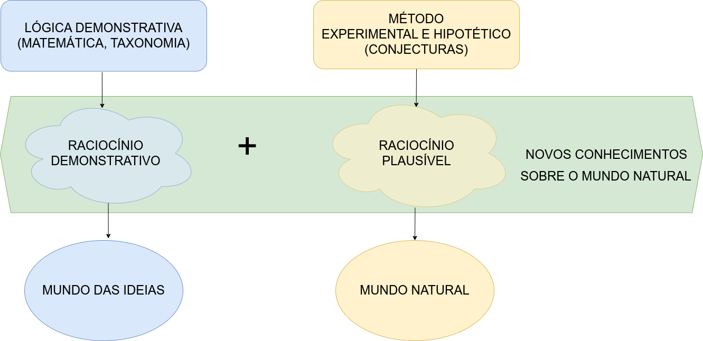
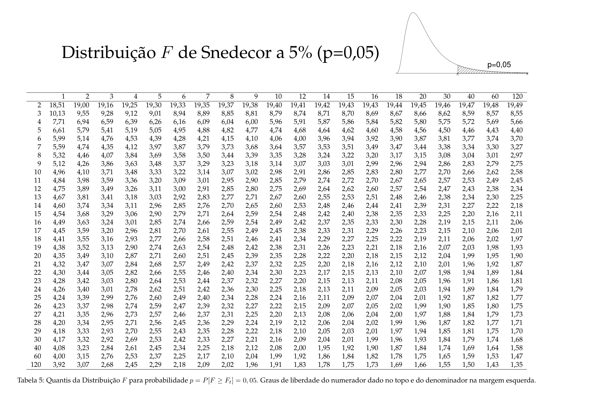
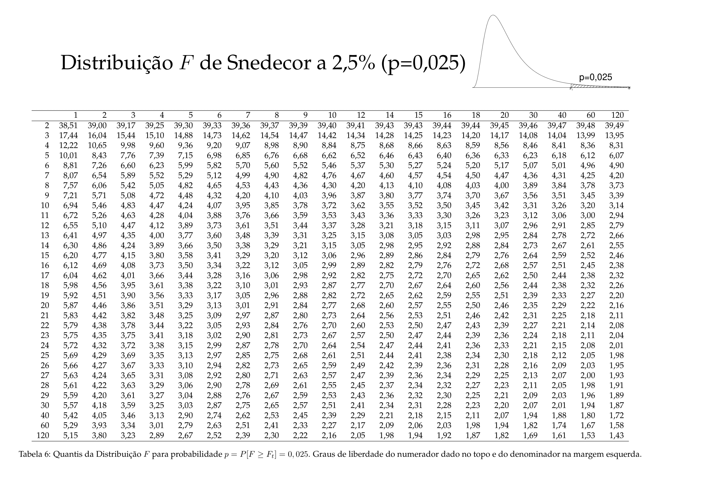
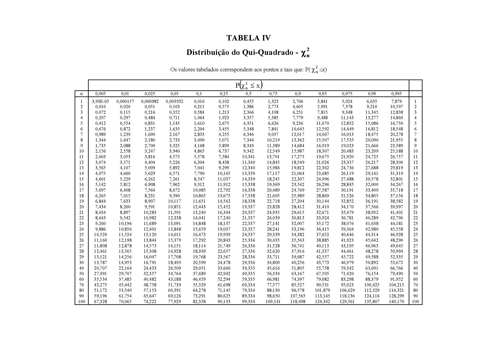

---
output:
  html_document: default
  pdf_document: default
---
```{r, echo=FALSE, include=FALSE}
colFmt <- function(x,color) {
  
  outputFormat <- knitr::opts_knit$get("rmarkdown.pandoc.to")
  
  if(outputFormat == 'latex') {
    ret <- paste("\\textcolor{",color,"}{",x,"}",sep="")
  } else if(outputFormat == 'html') {
    ret <- paste("<font color='",color,"'>",x,"</font>",sep="")
  } else {
    ret <- x
  }

  return(ret)
}

#uso>>>> `r colFmt("REG",'red')`, 


```


```{r , echo = FALSE, include=FALSE}
library(texPreview)
library(kableExtra)
library(knitr)
library(ggplot2)
knitr::opts_chunk$set(echo = TRUE)
library(showtext)
font_add_google('Noto Sans')
showtext_auto()
library(formatR)


```


# Introdução a testes de hipóteses{#introducao-a-testes-de-hipoteses}


## Filosofia da ciência


>Estritamente falando, todo o conhecimento fora da matemática, da lógica demonstrativa (um ramo da mesma) e da taxonomia encontra-se fundamentado em hipóteses (naturalmente há inúmeros tipos de hipóteses, mas as que estamos a nos referir são altamente confiáveis, como as expressas em certas leis gerais da física e da química como, por exemplo, a Lei de Hooke as Leis de Kepler dentre tantas outras).

\

O *raciocínio lógico demonstrativo* permeia as ciências até onde a matemática lhe suporta; todavia, em si (assim como também a matemática), é incapaz de gerar novos conhecimentos sobre o mundo que nos rodeia.

\

> O _método lógico demonstrativo_ é próprio para objetos que existem apenas _idealmente_, que são construídos inteiramente pelo nosso pensamento. 

\

> O _método hipotético experimental_ é próprio das ciências naturais  (física, química, biologia, etc.), que observam seus objetos e realizam experimentos.


```{r , echo=FALSE, out.width='80%', fig.align='center', fig.cap='Método demonstrativo e Método experimental hipotético (George Polya, 1954) '}


```

\

_Hipotético_ porque os cientistas partem de hipóteses sobre os objetos que guiam os experimentos e a avaliação dos resultados e _experimental_ porque se baseia em observações e em experimentos, tanto para formular quanto para verificar as teorias. 

\

O método hipotético experimental pode ser indutivo (fatos $\to$ lei geral) ou dedutivo  (lei geral $\to$ fatos): 

\

> Hipotético-indutivo porque o cientista observa inúmeros fatos variando as condições da observação; elabora uma hipótese e realiza novos experimentos (ou induções) para confirmar ou negar a hipótese; se esta não for negada, chega-se à lei do fenômeno estudado.

\

> Hipotético-dedutivo porque tendo chegado à lei, o cientista pode formular novas hipóteses, deduzidas do conhecimento já adquirido, e com elas prever novos fatos, ou formular novas experiências, que o levam a conhecimentos novos.


\


Em muitos processos de investigação científica é frequente ao pesquisador formular perguntas que deverão ser apropriadamente respondidas. 

\

- comparar esses resultados a outros valores; ou,  
- comparar resultados obtidos pela aplicação de diferentes métodos/ou produtos (valores centrais, variabilidade, proporções) observados em diferentes amostras.

\


```{r , echo=FALSE, out.width='80%', fig.align='center', fig.cap='Método experimental hipotético'}

knitr::include_graphics("images11/metodo_experimental.png")
```

\

Uma hipótese é uma conjectura racional feita após um grande número de observações e experimentos; é uma tese que precisa ser confirmada ou verificada por meio de novas observações e experimentos. 


\


Uma hipótese estatística é uma suposição feita sobre uma determinada característica de interesse de uma população sob estudo (um parâmetro) que subsiste (perdura, sobrevive, permanece incontestável) até que alguma informação sobre essa população seja estatisticamente significativa para contradizê-la.


\

> ``A ciência não consegue provar coisa alguma. Ela pode apenas refutar as coisas'' (Karl Popper)

\

> Uma teoria científica é, portanto, transitória. Uma conjectura temporariamente sustentada que um dia poderá ser refutada e substituída por outra. Conclusões baseadas em raciocínios plausíveis são provisórias, ao contrário daquelas produzidas por raciocínios lógico demonstrativos. 

\


>Um teste de hipóteses refere-se, portanto, a um método quantitativo subsidiário em processos de decisão, baseado na inferência estatística e de ampla aplicabilidade na experimentação e pesquisa; virtualmente, em qualquer área do conhecimento.  


\

## História


\
```{r fig67, echo=FALSE, out.width='80%', fig.align='center', fig.cap='Oriatrike or, physick refined. The common errors therein refuted, and the whole art reformed and rectified: being a new rise and progress of phylosophy and medicine, for the destruction of diseases and prolongation of life (p. 526)'}

knitr::include_graphics("images11/oriatrike.png")
```

\

Antigas referências relativas a testes de valores remontam aos séculos XVIII e XIX. Historicamente podemos retroceder a 1662, quando o médico flamengo Jean Baptista Van Helmont escreveu um desafio (*aposta de 300 florins*) em seu livro (Figura \@ref(fig:fig68)), sobre um _procedimento teste_ que consistiria em se dividir 200 ou 500 pacientes com febre e pleurite em dois grupos iguais e aplicar a eles diferentes tratamentos: os habitualmente adotados pelos médicos da época e os seus próprios métodos. Ao final de um período de tempo (não foi especificado) verificar quantos _funerais_ ocorreriam num e no outro (o livro foi publicado após sua morte, ocorrida em 1944, e não se tem registro sobre sua realização efetiva). 

\

```{r fig68, echo=FALSE, out.width='80%', fig.align='center', fig.cap='Tratamento mais utilizado à época (sangria)'}

knitr::include_graphics("images11/sangria.png")
```


\

```{r arbuthnot, echo=FALSE, out.width='60%', fig.align='center', fig.cap='John Arbuthnot, FRS (1667-1735)'}


```


\


Outro registro histórico é o artigo publicado em 1710 na _Royal Society's Philosophical Transactions_ pelo médico escocês John Arbuthnot (1667-1735, Figura \@ref(fig:arbuthnot)): _An argument for Divine Providence_ [(link)](https://royalsocietypublishing.org/doi/pdf/10.1098/rstl.1710.0011). 

\

Este artigo foi um marco na história da estatística; em termos modernos, ele realizou testes de hipóteses estatísticas, calculando o p-valor através de um teste de sinais e interpretou-o como estatisticamente significante e assim rejeitou a hipótese nula. Isso é creditado como "[...] o primeiro uso de testes de significância [...]" ( _in_ "Estatísticos do século", David Bellhouse, 2001).


\

A estruturação dos testes de hipóteses, tal como são promovidos atualmente, é devida à metodológia  empreendida por alguns dos mais destacados cientistas da área do final do século XIX e começo do XX (Figura \@ref(fig:fig69)).  

\


```{r fig69, echo=FALSE, out.width='80%', fig.align='center', fig.cap='Personagens históricos'}


```


\	

Em 1932 Karl Pearson  se aposentou com professor da *University College London* e diretor do Laboratório Galton de eugenia. Apesar das objeções de Fisher, o laboratório de estatística foi dividido em dois departamentos. O Departamento de estatística (criado em 1901, o primeiro do gênero em uma universidade), assumido pelo filho mais novo de Karl, Egon; e o Laboratório de eugenia, assumido por seu sucessor na cadeira de Eugenia, Ronald Fisher.


\	

O artigo de Henry F. Inman (*Karl Pearson and R. A. Fisher on Statistical Tests: A 1935 Exchange From Nature*, 1994) registra uma intensa troca de correspondências entre Fisher e Pearson tendo por assunto suas diferenças conceituais matemáticas e estatísticas, pela contrariedade de Pearson ante a continuidade de Fisher em lecionar teoria estatística e até mesmo por espaço físico para os experimentos científicos de Fisher, ao remover material do Museu de eugenia deixado por Pearson. 


\	

O pensamento estatístico da primeira metade do século XXI tem seu interesse voltado à solução dos problemas de testes de hipóteses e sua formulação e filosofia, tal como hoje são conhecidos, foi em grande parte criada por Ronald Aylmer Fisher (1890-1962), Jerzy Neyman (1894-1981) e Egon Sharpe Pearson (1895-1980) no período compreendido entre 1915-1933:  

\


- Estudo biológico realizado por Karl Pearson para tentar associar informações coletadas a distribuições de probabilidade apresentava os componentes básicos de um teste de hipóteses;  
- Ronald Fisher (1925): *Statistical Methods for Research Workers*; 
- George Waddel Snedecor (1940): *Statistical Methods*; e,    
- Erich Leo Lehmann (1959): *Testing Statistical Hypotheses* condensando os estudos desenvolvidos em 1920 pelo filho de Pearson, Egon, e o matemático polonês, Jerzy Neyman (formulação de *Neyman-Pearson*). 

\


## Conceitos 


A metodologia analisada na estruturação do método dos testes de hipóteses no fornece elementos auxiliares da decisão de rejeitar ou não - sob um prisma probabilístico - determinada conjectura postulada acerca de um parâmetro da população estudada. 

\

A *conclusão* de um teste de hipóteses resume-se a: *aceitar* ou *rejeitar* uma hipótese. Muitos estatísticos não adotam a expressão *aceitar* uma hipótese preferindo, no lugar, usar a expressão *não rejeitar* a hipótese sob um certo nível de significância.

\

>Por que essa distinção entre *aceitar* e *não rejeitar*?

\


Ao se usar a expressão *aceitar* pode haver uma pré-concepção de que a hipótese é universalmente verdadeira (lembrando que a conclusão encontra-se alicerçada simplesmente em uma amostra). 

\

Utiliando-se a expressão *não rejeitar* salienta-se que a informação trazida pelos dados (a amostra) não foi *suficientemente* robusta para que pudéssemos abandonar essa hipótese em favor de uma outra.

\


Alguns dizem que os estatísticos não se perguntam qual a probabilidade de estarem *certos*; mas de não estarem *errados*.


\


Um *teste de hipóteses* guarda uma certa semelhança a um julgamento. Caso não haja indício forte o suficiente que comprove a culpa do acusado ele é declarado como inocente (mesmo que não o seja de fato). No contexto estatístico, os *indícios* que nos levam a rejeitar uma hipótese provêm da análise de informações observadas na amostra. 


\

> A *hipótese nula* ($H_{0}$) é a proposição ``tradicional'' que reflete a situação na qual não há mudança. É, pois, uma _hipótese conservadora_, resultado de experimentos anteriores. 

\

> A *hipótese alternativa* ($H_{1}$) contradiz aquilo anunciado pela hipótese nula, é uma _hipótese inovadora_.

\


*Inicialmente* a hipótese nula ela é assumida como verdadeira para, logo a seguir, ser confrontada novas evidências amostrais para se verificar a sustentabilidade de sua afirmação:


\

- caso a informação amostral demonstre a consistência de hipótese nula tudo o que pode ser feito é se decidir por sua manutenção (falho na tentativa de se derrubar a hipótese conservadora);  e, 
- caso não seja, analisa-se quão improvável pode ser a informação amostral além de uma dúvida razoável ou mera coincidência (nível de significância).


\

> ``"Em relação a qualquer experimento, podemos referir-nos a esta hipótese como a *hipótese nula*, e deve-se notar que a hipótese nula nunca é provada ou estabelecida, mas é possivelmente refutada no decorrer da experimentação. Todo experimento pode ser considerado como existindo apenas para dar aos fatos uma chance de refutar a hipótese nula.'' (*The Design of Experiments*, Ronald Aylmer Fisher,  1935, p. 19)

\


O objetivo de um teste de hipóteses é, pois, o de tomar uma decisão no sentido de verificar se existem razões para rejeitar ou não a hipótese nula. Esta decisão é baseada na informação disponível, obtida a partir de uma amostra, que se recolhe da população. 

\

Teste de hipóteses nos possibilitam associar um *nível de significância* ($\alpha$) como medida probabilística do erro que se pode incorrer ao se concluir pela *rejeição* de uma *hipótese verdadeira*, na tomada de decisão.

\


> Nível de significância ($\alpha$) é estabelecido pelo pesquisador (baseado tanto na expertise dele, quanto no campo a que o estudo pertence) antes do experimento ser realizado e corresponde ao grau do risco que se deseja incorrer ao se "rejeitar" uma hipótese verdadeira.

	
\	

> Nível de confiança ($1-\alpha$) é a medida da confiabilidade de nossa conclusão no teste de hipóteses: "não rejeitar" uma hipótese verdadeira.

\

	
## Natureza dos erros 


Para introduzir os conceitos relacionados aos erros considere uma situação onde uma empresa produz lâmpadas e a vida útil média, em horas, dessas lâmpadas segue uma distribuição Normal tal que $VU \sim N (1600, 120)$.

\

Se não temos conhecimento algum sobre a real vida útil média dessas lâmpadas e alguém nos afirma que a vida útil é de 1.600 h, para confirmar ou não essa proposição (de um modo ``científico'') devemos extrair uma amostra.

\

Usando conceitos já explicados em uma unidade anterior podemos determinar o tamanho amostral em função de:

\

- um erro máximo tolerado: $\varepsilon$=20 horas;
- um nível de significância estabelecido: $\alpha$=0,05; e,
- e alguma informação sobre a medida da variabilidade da variável em estudo: $\sigma$=120 horas (no caso, o desvio padrão populacional).


\


```{r, warning=FALSE, echo=FALSE}

IC.Na = function (N, n, mu, sigma, conf, er) {
  dados=data.frame()
  plot(0, 0, 
       type="n", 
       xlim=c(mu-0.05*mu,mu+0.05*mu), 
       ylim=c(0,N), 
       bty="l",
       xlab="Vida útil em horas", 
       ylab="Amostras extraídas", 
       main=paste0("Flutuação dos valores médios obtidos em ", N," amostras de tamanho ",n,"\n(nível de confiança: ",conf,"; erro: ", er,")") , 
       sub=paste0("Os valores da vida útil seguem uma distribuição ~ N  (\u03bc:",mu," ; \u03c3:", sigma,")"))
  abline(v=mu, col='blue', lwd=2, lty=2)
  abline(v=mu-er, col='red', lwd=2, lty=2)
  abline(v=mu+er, col='red', lwd=2, lty=2)

  #axis(1, at = c(mu-1*mu, mu, mu+1*mu))
zc = qnorm(1-((1-conf)/2))
#sigma.xbarra = sigma/sqrt(n)
for (i in 1:N) {
  x = rnorm(n, mu, sigma)
  media = mean(x)
  erro= media-mu
  sd = sd(x)
  li = media - zc * sd/(sqrt(n))
  ls = media + zc * sd/(sqrt(n))
  temp=cbind(mu, media, erro, li, ls)
  dados=rbind(dados, temp)
  plotx = c(li,ls)
  ploty = c(i,i)
  #if (li > mu | ls < mu) lines(plotx,ploty, col="red", lwd=2, lend=0)
  #else lines(plotx,ploty, lend=0) 
   if (media > mu+er || media < mu-er) 
     points(media, i, col="red", cex=1)+text(y=i+3,x=media, labels=round(media,1), cex=1, col='red')
  else 
    points(media, i, col="black", cex=1) 
} 
colnames(dados)=c("mu", "media", "erro", "li", "ls")
return(dados)
}
```

\


```{r ,  out.width='100%', fig.align='center', fig.cap="Flutuação dos valores médios para diversas amostras extraídas de uma mesma população distribuição $\\sim N (\\mu; \\sigma)$", warning = FALSE, echo=FALSE}
N=100
n=140
mu=1600
sigma=120
conf=0.95
er=20

IC.Na(N, n, mu, sigma, conf, er)

```
\

Observa-se que algumas das amostras, numa proporção igual ao nível de significância estabelecido quando do dimensionamento (5\%), apresentam médias com valores que se afastam do valor médio populacional mais que o erro estabelecido (20 h). 

\ 

>Como já informado anteriormente, um teste de hipóteses é um método quantitativo e não se baseia, sobremaneira, em impressões pessoais ou outros achismos. Os cenários a seguir foram criados apenas para tentar estabelcer um paralelo entre a probabilidade de se obter médias amostrais muito destoantes da média populacional e uma "inclinação subjetiva" em se rejeitar uma afirmação. 

\

Considere que a sua amostra em particular é uma das que não se afasta tanto do valor que lhe afirmaram (a vida útil das lâmpadas é de 1.600 h). 

\

Nessa situação, talvez você não se "convencesse" de que a vida útil média fosse diferente daquilo que lhe informaram e, assim, não iria recusar a afirmação.

\

Agora considere que a sua amostra em particular é uma das que se afasta muito do valor que lhe afirmaram. 

\

Nessa nova situação, certamente você iria "suspeitar" que a vida útil média é diferente daquilo que lhe informaram e assim, recusar a afirmação.

\

Na primeira decisão, você **não recusou uma afirmação que era, de fato, verdadeira**; ao passo que na segunda, você **rejeitou uma afirmação que era verdadeira** (lembrando que você **não** sabia que a vida útil média é, de fato, 1.600 h).

\


Como se vê no quadro abaixo, há **dois tipos de erros** envolvidos em um teste de hipóteses e suas consequências, muitas vezes, são bem diferentes.

\

- Erro do tipo I e
- Erro do tipo II. 

\

Um *erro do tipo I* ocorre quando o pesquisador rejeita uma hipótese nula quando é verdadeira. A probabilidade (limitada pelo pesquisador) de se incorrer em um *erro do tipo I* é chamada de *nível de significância* e é frequentemente denotada pela letra grega $\alpha$.

\

Um *erro do tipo II*  ocorre quando o pesquisador não rejeita uma hipótese nula que é falsa. A probabilidade de cometer um *erro do tipo II*, também chamada de *poder do teste* e é frequentemente denotada pela letra grega $\beta$.

\


```{=latex }
\begin{table}[h]
\centering
\caption{{\small Erros envolvidos na rejeição ou não da hipótese nula}}
\begin{tabular}{p{5cm}p{5cm}p{5cm}}
\hline
\rowcolor{lightgray} Valor real do parâmetro & Não rejeitar & Rejeitar \\				
\rowcolor{lightgray} (desconhecido) & $H_{0}$ & $H_{0}$ \\
			\\[0.1cm]
\hline
		$H_{0}$ verdadeira & Decisão correta            & Erro do tipo I \\
			                         & probabilidade associada=$(1-\alpha$) & probabilidade associada= $\alpha$\\
\hline	                         
		$H_{0}$ falsa      & Erro do tipo II            & Decisão correta \\
			                         & probabilidade associada=$\beta$    & probabilidade associada =($1-\beta$)  \\
\hline
\end{tabular}
\end{table} 
```


```{r eval=knitr::is_html_output(), results = "asis", echo = FALSE, message = FALSE}

tex2markdown <- function(texstring) {
  writeLines(text = texstring,
             con = myfile <- tempfile(fileext = ".tex"))
  texfile <- pandoc(input = myfile, format = "html")
  cat(readLines(texfile), sep = "\n")
  unlink(c(myfile, texfile))
}

textable <- "
\\begin{table}[h]
\\caption*{{\\small Erros envolvidos na rejeição ou não da hipótese nula}}
\\begin{tabular}{p{5cm}p{5cm}p{5cm}}
\\hline
\\rowcolor{lightgray} Valor real do parâmetro & Não rejeitar & Rejeitar \\\\				
\\rowcolor{lightgray} (desconhecido) & $H_{0}$ & $H_{0}$ \\\\
			\\\\[0.1cm]
\\hline
		$H_{0}$ verdadeira & Decisão correta            & Erro do tipo I \\\\
			                         & probabilidade associada=$(1-\\alpha$) & probabilidade associada= $\\alpha$\\\\
\\hline	                         
		$H_{0}$ falsa      & Erro do tipo II            & Decisão correta \\\\
			                         & probabilidade associada=$\\beta$    & probabilidade associada =($1-\\beta$)  \\\\
\\hline
\\end{tabular}
\\end{table} 
"

tex2markdown(textable)
```


\

No quadro acima identificam-se:

\

- $\alpha$: a probabilidade associada ao cometimento de um *erro do tipo I*: rejeitar a hipótese nula sendo ela verdadeira (arbitrado pelo pesquisador, é denominado nível de significância do teste); 
- $\beta$: a probabilidade associada ao cometimento de um *erro do tipo II*: não rejeitar a hipótese nula sendo esta falsa;
- (1-$\alpha$): o nível de confiança estabelecido para a decisão, a probabilidade associada em **não se rejeitar a hipótese nula** ($H_{0}$) quando ela é, de fato, verdadeira; e,
- (1-$\beta$): o *poder do teste*, a probabilidade associada em não se aceitar a hipótese nula ($H_{0}$) quando ela é, de fato, falsa.

\

> Qual erro é o pior? 

\

Por exemplo, se alguém testa a presença de alguma doença em um paciente, decidindo incorretamente sobre a necessidade do tratamento (ou seja, decidindo que a pessoa está doente), pode submetê-lo ao desconforto pelo tratamento (efeitos colaterais) além de perda financeira pela despesa incorrida.
 
\

 Mas por outro lado, a falha em diagnosticar a presença da doença no paciente pode levá-lo à morte pela ausência de tratamento.
 
\
 
Outro exemplo clássico a ser citado seria o de condenar uma pessoa inocente ou libertar um criminoso.

\

Como não há uma regra clara sobre qual tipo de erro é o pior recomenda-se quando se usa dados para testar uma hipótese observar com muito cuidado as consequências que podem seguir os dois tipos de erros. Vários especialistas sugerem o uso de uma tabela como a abaixo para detalhar as consequências de um erro Tipo 1 e Tipo 2 em sua análise específica. 

\


```{=latex }
\begin{table}[h]
\centering
\caption{{\small Consequências da tomada de decisão face aos erro envolvidos}}
\begin{tabular}{p{5cm}p{5cm}p{5cm}}
\hline
\rowcolor{lightgray} $H_{0}$ explicada & Erro tipo 1: rejeitar $H_{0}$ quando verdadeira & Erro tipo II: não rejeitar $H_{0}$ quando falsa \\	
\hline
O medicamento ``A`` não alivia a Condição ``B`` & O medicamento ``A`` não alivia a Condição ``B``, mas não é eliminado como opção de tratamento & O medicamento ``A`` alivia a condição ``B``, mas é eliminado como opção de tratamento\\
\hline	                         
Consequências  &  Pacientes com Condição ``B`` que recebem o Medicamento ``A`` não obtêm alívio. Eles podem experimentar piora da condição e/ou efeitos colaterais, até e incluindo a morte. A empresa produtora do medicamento pode enfrentar processos judiciais & Um tratamento viável permanece indisponível para pacientes com Condição ``B``. Os custos de desenvolvimento são perdidos. O potencial lucro pela produção do medicamente ``A`` pela empresa é eliminado. \\
\hline
\end{tabular}
\end{table} 
```


```{r eval=knitr::is_html_output(), results = "asis", echo = FALSE, message = FALSE}

tex2markdown <- function(texstring) {
  writeLines(text = texstring,
             con = myfile <- tempfile(fileext = ".tex"))
  texfile <- pandoc(input = myfile, format = "html")
  cat(readLines(texfile), sep = "\n")
  unlink(c(myfile, texfile))
}

textable <- "
\\begin{table}[h]
\\caption*{{\\small Consequências da tomada de decisão face aos erro envolvidos}}
\\begin{tabular}{p{5cm}p{5cm}p{5cm}}
\\hline
\\rowcolor{lightgray} $H_{0}$ explicada & Erro tipo 1: rejeitar $H_{0}$ quando verdadeira & Erro tipo II: não rejeitar $H_{0}$ quando falsa \\\\
\\hline
O medicamento ``A`` não alivia a Condição ``B`` & O medicamento ``A`` não alivia a Condição ``B``, mas não é eliminado como opção de tratamento & O medicamento ``A`` alivia a condição ``B``, mas é eliminado como opção de tratamento\\\\
\\hline	                         
Consequências  &  Pacientes com Condição ``B`` que recebem o Medicamento ``A`` não obtêm alívio. Eles podem experimentar piora da condição e/ou efeitos colaterais, até e incluindo a morte. A empresa produtora do medicamento pode enfrentar processos judiciais & Um tratamento viável permanece indisponível para pacientes com Condição ``B``. Os custos de desenvolvimento são perdidos. O potencial lucro pela produção do medicamente ``A`` pela empresa é eliminado. \\\\
\\hline
\\end{tabular}
\\end{table} 

"

tex2markdown(textable)
```


\

É desejável conduzir o teste de um modo a manter a probabilidade de ambos os tipos de erro em um mínimo.

\

- aumentar o tamanho amostral reduz a probabilidade associada ao cometimento de erro do tipo II ($\beta$) e, consequentemente, aumenta o poder do teste ($1- \beta$);
- aumentar o nível de significância ($\alpha$) tem implicação direta na probabilidade associada ao cometimento de erro do tipo I todavia reduz a probabilidade associada ao cometimento de erro do tipo II ($\beta$). 

\


## Recomendações gerais


- o pesquisador deve delimitar o objeto de sua pesquisa;  
- uma boa hipótese deve ser baseada em uma boa pergunta sobre o objeto do estudo;
- deve ser simples e específica; 
- deve ser formulada na fase propositiva da pesquisa e não após a coleta de dados (*post hoc*);
- enunciar as hipóteses: as hipóteses são apresentadas de tal maneira que sejam **mutuamente exclusivas** (o que afirmado por uma deve ser contradito pela outra);   
- as hipóteses são comumente denominadas por hipótese nula ($H_{0}$) e hipótese alternativa ($H_{1}$);
- a hipótese nula ($H_{0}$) que será testada sob um nível de significância ($\alpha$) é, em geral, de concordância com o parâmetro que se estuda da população (conservadora) e baseada em conhecimento prévio; 
- a hipótese alternativa ($H_{1}$) é contrária, oposta, antagônica à hipótese nula (novadora); e,
- estabelecer um nível apropriado para a significância $\alpha$ (em alguns campos do conhecimento níveis de significância muito reduzidos são impraticáveis).

\

## Efeito do limite central


Seja $X_{1}, X_{2}, ...$ uma sequência de variáveis aleatórias independentes e identicamente distribuídas, cada uma com média finita $\mu=E(X_{i})$. 

\

A Lei forte dos grandes números (teorema) demonstra que 

\

$$
\frac{X_{1} + X_{2} + \dots, X_{n}}{n} \to  \mu
$$
\

quando $n \to \infty$. 

\

Isto é, $P\{lim_{\to \infty}(\frac{X_{1} + X_{2} \dots + X_{n}}{n})=\mu\}=1$


\

### Erro global

O erro global ($\varepsilon= X -\mu$) é um agregado de componentes. 

\

Uma medida (observação) obtida em um ensaio experimental específico pode estar sujeita a erros:

\

- analíticos;
- de amostragem (física, química, biológica, ...);  
- processuais (produzido por falhas no cumprimento das configurações exatas das condições experimentais);
- erros devidos à variação de matérias-primas;
- medição (diferentes operadores de equipamentos ou equipamentos descalibrados).

\

Assim, $\varepsilon$ será uma função linear de componentes $\varepsilon_{1}$, $\varepsilon_{2}, ...,\varepsilon_{n}$ de erros. Se cada erro individual for relativamente pequeno, será possível aproximar o erro global como uma função linear dos componentes de erros, onde $a$ são constantes:

\

$$
\varepsilon = a_{1}\varepsilon_{1} +  a_{2}\varepsilon_{2} + ... +  a_{n}\varepsilon_{n}
$$ 


\

O Teorema do limite central afirma que, sob condições quase sempre satisfeitas no mundo real da experimentação, a distribuição de tal função linear de erros tenderá à uma distribuição Normal quando o número de seus componentes torna-se grande, **independentemente** da distribuição original da população de onde suas amostras geradoras se originaram. 


\

Seja $X_{1},\dots,X_{n}$ uma sequência de variáveis aleatórias independentes e identicamente distribuídas, com média $\mu$ e variância $\sigma^{2}$.

\

A distribuição assumirá um perfil 

\

$$
\frac{X_{1} + X_{2} \dots + X_{n} - n \mu}{\sigma \sqrt{n}} \sim  \mathcal{N}(0,1)
$$

\

quando $n \to \infty$. 


\

Assim, para $-\infty < a < \infty$, 

\


$$
P \{ \frac{X_{1} + X_{2} \dots + X_{n} - n \mu}{\sigma \sqrt{n}} \leq a\}\to \mathcal{N}(0,1)  
$$

\

quando $n \to \infty$. 

\


Denotando-se de um modo alternativo, podemos então definir a estatística Z e sua correspondente distribuição como 


\


$$
Z = \frac{ \stackrel{-}{X} - \mu }{  \frac{\sigma}{\sqrt{n}}  } = \frac{\sqrt{n}\left(\stackrel{-}{X}-\mu \right)}{\sigma } \sim  \mathcal{N}(0,1)
$$


\

Ou seja, $Z$ é uma variável aleatória que segue a distribuição Normal com média zero e desvio-padrão unitário (Normal padronizada).


\

> Em resumo: quando, como é habitual, um erro experimental é um agregado de vários erros de componentes, sua distribuição tende para a forma Normal, mesmo a distribuição dos componentes pode ser marcadamente não Normal;


\

A média da amostra tende a ser distribuída Normalmente, mesmo que as observações individuais em que se baseia não o sejam. Consequentemente, métodos estatísticos que dependam, não diretamente da distribuição das observações individuais, mas na distribuição das médias tendem a ser insensíveis ou robustos à não normalidade.


\

Procedimentos que comparam médias são geralmente robustos à não normalidade. 

\


## Estruturas das hipóteses 

\


###  Interpretação gráfica dos níveis de significância/confiança 

\

O delineamento de um teste de hipóteses inclui regras de decisão para se rejeitar ou não a hipótese nula. 


\

Essas regras de decisão passam pela comparação dos valores calculados de uma estatística apropriada para o teste em curso com seus valores extremos, frequentemente obtidos em tabelas, os quais estão associados ao complemento de uma probabilidade (o nível de confiança) de ocorrência condizente ao nível de significância estabelecido na pesquisa.

\

Essa comparação é por demais facilitada se visualizada no gráfico da densidade de probabilidade da distribuição da estatística do teste, onde regiões (baseadas no nível de significância estabelecido) podem ser estabelecidas:

\

- testes bilaterais ( _hipótese alternativa do tipo: diferente de_ ): a região é fechada, delimitada à esquerda e à direita por valores críticos de estatística do teste;
- testes unilaterais à direita ( _hipótese alternativa do tipo: maior que_ ): a região é fechada à esquerda, delimitada por um valor crítico da estatística do teste e aberta à direita: $[\rightarrow \infty[$; e,
- testes unilaterais à esquerda ( _hipótese alternativa do tipo: menor que_ ): a região é fechada à direita, delimitada por um valor crítico da estatística do teste e aberta à esquerda $]-\infty \leftarrow]$).

\


No gráfico de densidade de probabilidade da estatística do teste temos uma primeira região frequentemente denominada de _região de não rejeição_: um intervalo de valores dentro do qual, se o valor calculado para a estatística de teste estiver contido, a hipótese nula não será rejeitada. 


\

O intervalo de valores que delimitam a _região de não rejeição_ é tal que a probabilidade dessa região é igual ao nível de confiança $(1-\alpha)$. 

\

Se a estatística calculada para o teste estiver fora da faixa de valores delimitada na _região de não rejeição_ a hipótese nula poderá ser rejeitada sob o nível de significância $\alpha$ estabelecido; ou seja, a probabilidade de se incorrer em um erro _Tipo I: rejeitar a hipótese nula quando ela é verdadeira_  é igual a $\alpha$. 


\

Com a popularização dos programas estatísticos computacionais, a _probabilidade exata_ associada ao valor calculado da estatística do teste passou ser neles apresentada de modo *default*, nominada pela expressão _valor p_ ( _p-Value_ ) que expressa uma probabilidade. 


\


Para melhor entender o _valor-p_ ( _p-value_) suponha que o valor da estatística do teste seja igual a $\zeta$. O _valor p_ é o quantil associado (a probabiliadde exata) a $\zeta$ na distribuição de probabilidade usada como referência. Se o _valor p_ for menor que o nível de significância ($\alpha$) estipulado pelo pesquisador, rejeita-se a hipótese nula sob esse nível de significância de cometimento de um erro do tipo I.

\

### Teste de hipóteses Bilateral


Nesse tipo de teste a _hipótese aternativa_ é proposta como a dizer que o valor em teste é diferente daquele afirmado pela _hipótese nula_ (conservadora):

\
$$
\begin{cases}
	H_{0}: \mu = \mu_{0}\\
	H_{1}: \mu \ne \mu_{0}\\
\end{cases}
$$
\

em que $\mu_{0}$ é o valor inferido ao parâmetro $\mu$ que se deseja testar.

\


```{r fig70,  out.width='100%', fig.align='center', fig.cap="Regiões críticas, aquém e além das quais, a probabilidade associada aos valores amostrais observados é inferior a $\\frac{\\alpha}{2}$, estabelecendo assim um intervalo com nível de confiança igual a $(1-\\alpha)$", warning = FALSE}


alfa=0.05

prob_desejada1=alfa/2
z_desejado1=round(qnorm(prob_desejada1),4)
d_desejada1=dnorm(z_desejado1, 0, 1)

prob_desejada2=1-alfa/2
z_desejado2=round(qnorm(prob_desejada2),4)
d_desejada2=dnorm(z_desejado2, 0, 1)


ggplot(NULL, aes(c(-4,4))) +
  geom_area(stat = "function", 
            fun = dnorm, 
            fill = "red", 
            xlim = c(-4, z_desejado1),
            colour="black") +
  geom_area(stat = "function", 
            fun = dnorm, 
            fill = "lightgrey", 
            xlim = c(z_desejado1,0),
            colour="black") +
  geom_area(stat = "function", 
            fun = dnorm, 
            fill = "lightgrey", 
            xlim = c(0, z_desejado2),
            colour="black") +
  geom_area(stat = "function", 
            fun = dnorm, 
            fill = "red", 
            xlim = c(z_desejado2,4),
            colour="black") +
  scale_y_continuous(name="Densidade") +
  scale_x_continuous(name="Valores da estatística calculada para o teste")  +
  labs(title= 
         "Regiões críticas sob a curva da função densidade da \ndistribuição apropriada ao teste", 
       subtitle = "P((-val. crítc), (val. crít.))=(1-\u03b1) em cinza (nível de confiança) \nP(-\U221e; (-val. crític.))= P((val.crítc.); \U221e)= \u03b1/2 em vermelho ")+
  geom_segment(aes(x = z_desejado1, y = 0, xend = z_desejado1, yend = d_desejada1), color="blue", lty=2, lwd=0.3)+
  geom_segment(aes(x = z_desejado2, y = 0, xend = z_desejado2, yend = d_desejada2), color="blue", lty=2, lwd=0.3)+
  annotate(geom="text", x=z_desejado1-0.1, y=d_desejada1, label="-(valor crítico)", angle=90, vjust=0, hjust=0, color="blue",size=3)+
  annotate(geom="text", x=z_desejado2+0.3, y=d_desejada2, label="(valor crítico)", angle=90, vjust=0, hjust=0, color="blue",size=3)+
  annotate(geom="text", x=z_desejado1-2, y=0.1, label="Região de rejeição da hipótese nula \nprobabilidade=\u03b1/2", angle=0, vjust=0, hjust=0, color="blue",size=3)+
  annotate(geom="text", x=z_desejado2+0.5, y=0.1, label="Região de rejeição da hipótese nula \nprobabilidade=\u03b1/2", angle=0, vjust=0, hjust=0, color="blue",size=3)+
  annotate(geom="text", x=z_desejado1+1.3, y=0.2, label="Região de não rejeição da hipótese nula \nprobabilidade= (1-\u03b1)", angle=0, vjust=0, hjust=0, color="blue",size=3)+
  theme_bw()


```

\

Na Figura \@ref(fig:fig70) observa-se: 

\	

- as regiões de rejeição da hipótese nula (subdivididas nos dois lados) sob a curva da função densidade de probabilidade da distribuição adequada ao teste com probabilidades iguais ao nível de significância $\alpha$ ;   
- a região de não rejeição da hipótese nula (delimitada à esquerda e à direita) com probabilidade igual ao nível de confiança $(1-\alpha)$; e,   
- os valores críticos da estatística do teste.


### Teste de hipóteses Unilateral à esquerda


Nesse tipo de teste a _hipótese aternativa_ é proposta como a dizer que o valor em teste não apenas é diferente, mas é menor do que aquele afirmado pela _hipótese nula_ (conservadora):

\

$$
\begin{cases}
	H_{0}: \mu \ge \mu_{0}\\
	H_{1}: \mu < \mu_{0}\\
\end{cases}
$$

\

em que $\mu_{0}$ é o valor inferido ao parâmetro $\mu$ que se deseja.

\


```{r fig71,  out.width='100%', fig.align='center', fig.cap="Região crítica aquém da qual a probabilidade associada aos valores amostrais observados é inferior a $\\alpha$, estabelecendo assim um intervalo com nível de confiança igual a $(1-\\alpha)$", warning = FALSE}


alfa=0.05
prob_desejada=alfa
z_desejado=round(qnorm(prob_desejada),4)
d_desejada=dnorm(z_desejado, 0, 1)


ggplot(NULL, aes(c(-4,4))) +
  geom_area(stat = "function", 
            fun = dnorm, 
            fill = "red", 
            xlim = c(-4, z_desejado),
            colour="black") +
  geom_area(stat = "function", 
            fun = dnorm, 
            fill = "lightgrey", 
            xlim = c(z_desejado,0),
            colour="black") +
  geom_area(stat = "function", 
            fun = dnorm, 
            fill = "lightgrey", 
            xlim = c(0, z_desejado),
            colour="black") +
  geom_area(stat = "function", 
            fun = dnorm, 
            fill = "lightgrey", 
            xlim = c(z_desejado,4),
            colour="black") +
  scale_y_continuous(name="Densidade") +
  scale_x_continuous(name="Valores da estatística calculada para o teste")  +
  labs(title= 
         "Região crítica sob a curva da função densidade da \ndistribuição apropriada ao teste", 
       subtitle = "P( (-val. crít.),\U221e,)=(1-\u03b1) em cinza (nível de confiança) \nP(-\U221e; (-val. crític.))=\u03b1 em vermelho ")+
geom_segment(aes(x = z_desejado, y = 0, xend = z_desejado, yend = d_desejada), color="blue", lty=2, lwd=0.3)+
annotate(geom="text", x=z_desejado-0.1, y=d_desejada, label="-(valor crítico)", angle=90, vjust=0, hjust=0, color="blue",size=3)+
annotate(geom="text", x=z_desejado-2, y=0.1, label="Região de rejeição da hipótese nula \nprobabilidade=\u03b1", angle=0, vjust=0, hjust=0, color="blue",size=3)+
annotate(geom="text", x=z_desejado+1.3, y=0.2, label="Região de não rejeição da hipótese nula  \nprobabilidade= (1-\u03b1)", angle=0, vjust=0, hjust=0, color="blue",size=3)+
theme_bw()


```
\

Na Figura \@ref(fig:fig71) observa-se: 

\	

- a região de rejeição da hipótese nula delimitada sob a curva da função densidade de probabilidade da distribuição adequada ao teste com probabilidade igual ao nível de significância $\alpha$ ;   
- a região de não rejeição da hipótese nula (delimitada à esquerda) com probabilidade igual ao nível de confiança $(1-\alpha)$; e,   
- os valores críticos da estatística do teste.


### Teste de hipóteses Unilateral à direita


Nesse tipo de teste a _hipótese aternativa_ é proposta como a dizer que o valor em teste não apenas é diferente, mas é maior do que aquele afirmado pela _hipótese nula_ (conservadora):

\

$$
\begin{cases}
	H_{0}: \mu \le \mu_{0}\\
	H_{1}: \mu > \mu_{0}\\
\end{cases}
$$

\

em que $\mu_{0}$ é o valor inferido ao parâmetro $\mu$ que se deseja testar .

\


```{r fig72,  out.width='100%', fig.align='center', fig.cap="Região crítica além da qual a probabilidade associada aos valores amostrais observados é inferior a $\\alpha$, estabelecendo assim um intervalo com nível de confiança igual a $(1-\\alpha)$", warning = FALSE}


alfa=0.95
prob_desejada=alfa
z_desejado=round(qnorm(prob_desejada),4)
d_desejada=dnorm(z_desejado, 0, 1)


ggplot(NULL, aes(c(-4,4))) +
  geom_area(stat = "function", 
            fun = dnorm, 
            fill = "lightgrey", 
            xlim = c(-4, z_desejado),
            colour="black") +
  geom_area(stat = "function", 
            fun = dnorm, 
            fill = "red", 
            xlim = c(z_desejado,4),
            colour="black") +
  scale_y_continuous(name="Densidade") +
  scale_x_continuous(name="Valores da estatística calculada para o teste")  +
  labs(title= 
         "Região crítica sob a curva da função densidade da \ndistribuição apropriada ao teste", 
       subtitle = "P(-\U221e, (val. crít.))=(1-\u03b1) em cinza (nível de confiança) \nP((val.crítc.); \U221e)= \u03b1 em vermelho ")+
geom_segment(aes(x = z_desejado, y = 0, xend = z_desejado, yend = d_desejada), color="blue", lty=2, lwd=0.3)+
annotate(geom="text", x=z_desejado+0.3, y=d_desejada, label="(valor crítico)", angle=90, vjust=0, hjust=0, color="blue",size=3)+
annotate(geom="text", x=z_desejado+0.5, y=0.1, label="Região de rejeição da hipótese nula \nprobabilidade=\u03b1", angle=0, vjust=0, hjust=0, color="blue",size=3)+
  annotate(geom="text", x=z_desejado-2.5, y=0.2, label="Região de não rejeição da hipótese nula \nprobabilidade= (1-\u03b1)", angle=0, vjust=0, hjust=0, color="blue",size=3)+
  theme_bw()
```


\

Na Figura \@ref(fig:fig72) observa-se: 

\	

- a região de rejeição da hipótese nula delimitada sob a curva da função densidade de probabilidade da distribuição adequada ao teste com probabilidade igual ao nível de significância $\alpha$ ;   
- a região de não rejeição da hipótese nula (delimitada à direita) com probabilidade igual ao nível de confiança $(1-\alpha)$; e,   
- os valores críticos da estatística do teste.

\


## Teste de hipóteses para a média $\mu$ de uma população Normal

\

### Cenários possíveis

\


- variância populacional ($\sigma^2$) conhecida;  
- variância populacional ($\sigma^2$) desconhecida, mas o tamanho da amostra ($n$) é grande: $n\ge 30$; e,  
- variância populacional ($\sigma$) desconhecida e as amostras de tamanho ($n$) reduzido: $n < 30$.

\

> Estatística do teste para a primeira situação: variância populacional conhecida


$$
Z = \frac{\stackrel{-}{X} - \mu_{0}}{\frac{\sigma}{\sqrt{n}}} \sim  \mathcal{N}(0,1)
$$
\

em que: 

\

- $\stackrel{-}{X}$ é uma média amostral;  
- $\mu_{0}$ o valor inferido ao parâmetro, a ser testado frente à média amostral observada;  
- $\sigma$ é o desvio padrão populacional; e,  
- $n$ é o tamanho da amostra.


\


> Estatística do teste para a segunda situação: variância populacional desconhecida mas amostras grandes: $n\ge30(40)$: $S$ pode ser tomado como estimativa de $\sigma$:

\

$$
Z = \frac{\stackrel{-}{X} - \mu_{0}}{\frac{S}{\sqrt{n}}}   \sim \mathcal{N}(0,1)
$$

\


em que:  
\

- $\stackrel{-}{X}$ é uma média amostral;  
- $\mu_{0}$ o valor inferido ao parâmetro, a ser testado frente à média amostral observada;    
- $S$ é o desvio padrão amostral; e,  
- $n$ é o tamanho da amostra. 


\

> Estatística do teste para a terceira situação: variância populacional desconhecida e amostras pequenas: $n<30$:

\


$$
T = \frac{(\stackrel{-}{X} - \mu_{0})}{    \frac{S}{\sqrt{n}} } \sim t_{(n-1)}
$$

\

em que:
\

- $\stackrel{-}{X}$ é uma média amostral;  
- $\mu_{0}$ o valor inferido ao parâmetro, a ser testado frente à média amostral observada;     
- $S$ é o desvio padrão amostral; e,   
- $n$ é o tamanho da amostra.

\

```{r, warning = FALSE}

# Definição do eixo x
x <- seq(-4, 4, length.out = 100)

# Densidade da distribuição normal padrão
y_norm <- dnorm(x, mean = 0, sd = 1)

# Lista com diferentes graus de liberdade
df_list=c(1, 2, 4, 8, 20)

# Lista com cores para as curvas da distribuição t
colors=c("#097aeb", "#a37602", "#02a6f2", "#9635a1", "#16b533")

# Criação do data frame com todas as curvas
data=data.frame()
for (i in seq_along(df_list)) {
  df = df_list[i]
  y_t = dt(x, df)
  df_data = data.frame(x, y_t, df)
  data = rbind(data, df_data)
}

# Plotagem do gráfico
p = ggplot(data, aes(x = x)) +
  geom_line(aes(y = y_t, color = factor(df)), size = 1) +
  scale_color_manual(values = colors, name = "Graus de liberdade")+
  ggtitle("Distribuição t sob diferentes graus de liberdade \ne sua aproximação à Normal padronizada)") +
  xlab("Valores assumidos") +
  ylab("Densidade") +
  theme_classic() +
  stat_function(fun = dnorm, args = list(mean = 0, sd = 1), color = "red", size=1.5, linetype='dashed')
print(p)


```

\


### Roteiro geral 

\

- identificar o modelo de probabilidade do estimador do parâmetro da população que se estuda;  
- identificar a estatística apropriada para o teste em razão das informações disponíveis acerca da população, do tamanho da amostra e sua independência:
    - escore médio;
    - proporção;
    - estatísticas T, Z, F, ou $\chi$;  
- determinar na curva de densidade de probabilidade do modelo da estatística de teste a(s) região(ões) crítica(s): faixa(s) de valores da estatística que nos levam à rejeição ou não da hipótese $H_{0}$ em função do nível de significância previamente arbitrado pelo pesquisador $\alpha$;
- calcular a estatística do teste apropriada para o parâmetro que se pretende inferir com base na amostra extraída;
- concluir com base nos resultados analisados: se o valor da estatística do teste	pertence à(s) região(ões) crítica(s) de sua distribuição teórica, rejeitar $H_{0}$; caso contrário não há evidências estatisticamente significativas para rejeitá-la.

\


### Probabilidade dos intervalos de confiança para os testes de hipóteses com o uso da estatística Z ($Z \sim \mathcal{N}(0,1)$):


\

- Teste de hipóteses bilateral (tipo: diferente de): 

\

\begin{align*}
P[\left|Z_{calc}\right| \le {Z}_{tab\left(\frac{\alpha }{2}\right)}|\mu=\mu_{0}] & =(1-\alpha)\\
P(-{Z}_{tab\left(\frac{\alpha }{2}\right)} \le  Z_{calc} \le {Z}_{tab\left(\frac{\alpha }{2}\right)}) & = (1-\alpha)\\
\end{align*}

\

- Teste de hipóteses unilateral à esquerda (tipo: menor que): 
	
\

\begin{align*}
P[Z_{calc} \ge -{Z}_{tab\left(\alpha \right)}|\mu \ge \mu_{0}] & =(1-\alpha) \\
P(Z_{calc} \ge -{Z}_{tab\left(\alpha \right)}) & =(1-\alpha)\\
\end{align*}

\

- Teste de hipóteses unilateral à direita (tipo maior que):

\

\begin{align*}
P[Z_{calc} \le {Z}_{tab\left(\alpha \right)}|\mu \le \mu_{0}] & =(1-\alpha)\\
P(Z_{calc} \le {Z}_{tab\left(\alpha \right)}) & =(1-\alpha)\\
\end{align*}


\

### Probabilidade dos intervalos de confiança para os testes de hipóteses com o uso da estatística T ($T\sim t_{(n-1)}$):


\

- Teste de hipóteses bilateral: 

\

\begin{align*}
P[\left|t_{calc}\right| \ge {t}_{tab\left(\frac{\alpha }{2};n-1\right)}|\mu=\mu_{0}] & =(1-\alpha)\\
P(-{t}_{tab\left(\frac{\alpha }{2};n-1\right)} \le  t_{calc}  \le  {t}_{tab\left(\frac{\alpha }{2};n-1\right)}) & =(1-\alpha)
\end{align*}


\

- Teste de hipóteses unilateral à esquerda:

\

\begin{align*}
P[t_{calc} \ge -{t}_{tab\left(\alpha \right)}|\mu \ge \mu_{0}] & =(1-\alpha)\\  
P( t_{calc}  \ge -{t}_{tab\left(\alpha;n-1\right)}) & = (1-\alpha) 
\end{align*}


	
\
	
- Teste de hipóteses unilateral à direita:

\

\begin{align*}
P[t_{calc} \le {t}_{tab\left(\alpha \right)}|\mu \le \mu_{0}] & =(1-\alpha) \\  
P( t_{calc}  \le {t}_{tab\left(\alpha;n-1\right)} ) & = (1-\alpha) 
\end{align*}


\

> Exemplo: O tempo de vida útil de uma amostra de 100 lâmpadas fluorescentes produzidas por uma fábrica foi calculado resultando em uma vida útil média de 1570 h sob um desvio padrão de 120 h. Seja $\mu$ é o tempo de vida útil das lâmpadas produzidas pela empresa. Teste a hipótese de $\mu=1600 h$ contra a hipótese alternativa de $\mu \neq 1600 h$ sob um nível de significância $\alpha=0,05$.

\


> O problema nos pede um teste bilateral (tipo: diferente de):

\


$$
\begin{cases}
	H_{0}: \mu = 1.600\\
	H_{1}: \mu \ne 1.600\\
\end{cases}
$$

Iremos verificar se a informação amostral obtida nos permite rejeitar a hipótese nula que afirma ser a vida útil média das lâmpadas a 1.600 h., fazendo então valer a hipótese alternativa que afirma ser a vida útil das lâmpadas **diferente de** 1.600 h.


\

Pelo enunciado do problema a variância populacional $\sigma^{2}$ é desconhecida mas, como a amostra é de grande tamanho (n=100) podemos tomar $S$ como uma estimativa de $\sigma$ e a estatística do teste fica definida como sendo:

\

$$
Z = \frac{\stackrel{-}{X} - \mu_{0}}{\frac{S}{\sqrt{n}}}   \sim \mathcal{N}(0,1)
$$


\

Extraindo os dados do problema:


- $\stackrel{-}{x}=1570h$ é a média amostral;  
- $\mu_{0}=1600$ o valor inferido à média populacional a ser testado frente à média amostral;  
- $S=120h$ é o desvio padrão amostral; e,    
- $n=100$ é o tamanho da amostra.

\

Calculando-se o valor da estatística do teste:

$$
z_{calc} = \frac{1570 - 1600}{\frac{120}{\sqrt{100}}   } =-2,50
$$


Da tabela da distribuição Normal reduzida obtemos o valor crítico bicaudal: $|{z}_{crit}|=1,96$. Pelo cálculo, a estatística do teste é $z_{calc}=-2,50$.


```{r fig73,  out.width='100%', fig.align='center', fig.cap="Regiões de rejeição da hipótese nula para o teste bilateral (tipo: diferente de) realizado: a região de não rejeição da hipótese nula (região de não significância do teste) está delimitada pelos valores críticos da estatística do teste: $z_{crit} =\\pm 1,96$. O valor calculado da estatística ($z_{calc}=-2,50$) situa-se na faixa de significância do teste, possibilitando a rejeição da hipótese nula sob aquele nível de confiança", warning = FALSE }


alfa=0.05

prob_desejada1=alfa/2
z_desejado1=round(qnorm(prob_desejada1),4)
d_desejada1=dnorm(z_desejado1, 0, 1)

prob_desejada2=1-alfa/2
z_desejado2=round(qnorm(prob_desejada2),4)
d_desejada2=dnorm(z_desejado2, 0, 1)

z_calculado=-2.5
d_calculado=dnorm(z_calculado, 0, 1)


ggplot(NULL, aes(c(-4,4))) +
  geom_area(stat = "function", 
            fun = dnorm, 
            fill = "red", 
            xlim = c(-4, z_desejado1),
            colour="black") +
  geom_area(stat = "function", 
            fun = dnorm, 
            fill = "lightgrey", 
            xlim = c(z_desejado1,0),
            colour="black") +
  geom_area(stat = "function", 
            fun = dnorm, 
            fill = "lightgrey", 
            xlim = c(0, z_desejado2),
            colour="black") +
  geom_area(stat = "function", 
            fun = dnorm, 
            fill = "red", 
            xlim = c(z_desejado2,4),
            colour="black") +
  scale_y_continuous(name="Densidade") +
  scale_x_continuous(name="Valores de z", breaks = c(z_desejado1,z_desejado2))  +
  labs(title= 
         "Regiões críticas sob a curva da função densidade da \ndistribuição apropriada ao teste", 
       subtitle = "P(-1,96, 1,96)=(1-\u03b1) em cinza (nível de confiança=0,95) \nP(-\U221e; -1,96)= P(1,96; \U221e)= \u03b1/2 em vermelho (nível de significância/2=0,025) ")+
  geom_segment(aes(x = z_desejado1, y = 0, xend = z_desejado1, yend = d_desejada1), color="blue", lty=2, lwd=0.3)+
  geom_segment(aes(x = z_desejado2, y = 0, xend = z_desejado2, yend = d_desejada2), color="blue", lty=2, lwd=0.3)+
  annotate(geom="text", x=z_desejado1-0.1, y=d_desejada1, label="valor crítico=-1,96", angle=90, vjust=0, hjust=0, color="blue",size=3)+
  annotate(geom="text", x=z_desejado2+0.3, y=d_desejada2, label="valor crítico=1,96", angle=90, vjust=0, hjust=0, color="blue",size=3)+
  annotate(geom="text", x=z_desejado1-2, y=0.1, label="Região de rejeição da hipótese nula \nprobabilidade=\u03b1/2", angle=0, vjust=0, hjust=0, color="blue",size=3)+
  annotate(geom="text", x=z_desejado2+0.5, y=0.1, label="Região de rejeição da hipótese nula \nprobabilidade=\u03b1/2", angle=0, vjust=0, hjust=0, color="blue",size=3)+
  annotate(geom="text", x=z_desejado1+1.3, y=0.2, label="Região de não rejeição da hipótese nula \nprobabilidade= (1-\u03b1)", angle=0, vjust=0, hjust=0, color="blue",size=3)+
  geom_segment(aes(x = z_calculado, y = 0, xend = z_calculado, yend = d_calculado), color="blue", lty=2, lwd=0.3)+
  annotate(geom="text", x=z_calculado-0.1, y=d_calculado, label="valor da estatística do teste=-2,5", angle=90, vjust=0, hjust=0, color="blue",size=3)+
  theme_bw()


```

\

Conclusão: Os resultados obtidos na análise estatística realizada nos permitem rejeitar a hipótese de que a duração média populacional das lâmpadas seja igual a 1600h sob um nível de confiança de 95\%. A vida útil média das lâmpadas é **diferente** de 1600h (Figura \@ref(fig:fig73)).    


\


\

Podemos ainda realizar testes de hipóteses unilaterais ($\mu<\mu_{0}$ ou $\mu>\mu_{0}$). 

\

> Teste unilateral à esquerda

\

$$
\begin{cases}
	H_{0}: \mu \ge 1.600 \\
	H_{1}: \mu < 1.600  \\
\end{cases}  
$$


\


Iremos verificar se a informação amostral obtida nos permite rejeitar a hipótese nula que afirma ser a vida útil média das lâmpadas igual ou superior a 1.600 h., fazendo então valer a hipótese alternativa que afirma ser a vida útil das lâmpadas **menor que** 1.600 h.

\


Da tabela da distribuição Normal reduzida obtemos o valor crítico monocaudal: ${z}_{crit}=-1,64$. Pelo cálculo, a estatística do teste é $z_{calc}=-2,50$.

\


```{r fig74,  out.width='100%', fig.align='center', fig.cap="Região de rejeição da hipótese nula para o teste unilateral realizado: a região de não rejeição da hipótese nula (região de não significância do teste) está delimitada pelo valor crítico da estatística do teste: $z_{crit} = -1,64$. O valor calculado da estatística ($z_{calc}=-2,50$) situa-se na faixa de significância do teste, possibilitando a rejeição da hipótese nula sob aquele nível de confiança", warning = FALSE}


alfa=0.05
prob_desejada=alfa
z_desejado=round(qnorm(prob_desejada),4)
d_desejada=dnorm(z_desejado, 0, 1)

z_calculado=-2.5
d_calculado=dnorm(z_calculado, 0, 1)


ggplot(NULL, aes(c(-4,4))) +
  geom_area(stat = "function", 
            fun = dnorm, 
            fill = "red", 
            xlim = c(-4, z_desejado),
            colour="black") +
  geom_area(stat = "function", 
            fun = dnorm, 
            fill = "lightgrey", 
            xlim = c(z_desejado,0),
            colour="black") +
  geom_area(stat = "function", 
            fun = dnorm, 
            fill = "lightgrey", 
            xlim = c(0, z_desejado),
            colour="black") +
  geom_area(stat = "function", 
            fun = dnorm, 
            fill = "lightgrey", 
            xlim = c(z_desejado,4),
            colour="black") +
  scale_y_continuous(name="Densidade") +
  scale_x_continuous(name="Valores da estatística calculada para o teste")  +
  labs(title= 
         "Região crítica sob a curva da função densidade da \ndistribuição apropriada ao teste", 
       subtitle = "P( -1,64,\U221e,)=(1-\u03b1) em cinza (nível de confiança=0,95) \nP(-\U221e; -1,64)=\u03b1 em vermelho (nível de significância=0,05) ")+
geom_segment(aes(x = z_desejado, y = 0, xend = z_desejado, yend = d_desejada), color="blue", lty=2, lwd=0.3)+
annotate(geom="text", x=z_desejado-0.1, y=d_desejada, label="valor crítico=-1,64", angle=90, vjust=0, hjust=0, color="blue",size=3)+
annotate(geom="text", x=z_desejado-2.5, y=0.1, label="Região de rejeição da hipótese nula \nprobabilidade=\u03b1", angle=0, vjust=0, hjust=0, color="blue",size=3)+
annotate(geom="text", x=z_desejado+1, y=0.2, label="Região de não rejeição da hipótese nula  \nprobabilidade= (1-\u03b1)", angle=0, vjust=0, hjust=0, color="blue",size=3)+
  geom_segment(aes(x = z_calculado, y = 0, xend = z_calculado, yend = d_calculado), color="blue", lty=2, lwd=0.3)+
  annotate(geom="text", x=z_calculado-0.1, y=d_calculado, label="valor da estatística do teste=-2,5", angle=90, vjust=0, hjust=0, color="blue",size=3)+
  theme_bw()

```


\

Conclusão: Os resultados obtidos na análise estatística realizada nos permitem rejeitar a hipótese de que a duração média populacional das lâmpadas seja igual ou superior a 1600h sob um nível de confiança de 95\%. A vida útil média é **menor que** 1600h  (Figura \@ref(fig:fig74)).  


\


> Teste unilateral à direita 

\

$$
\begin{cases}
H_{0}: \mu \le 1.600 \\
H_{1}: \mu > 1.600 \\
\end{cases} 
$$ 

\


Iremos verificar se a informação amostral obtida nos permite rejeitar a hipótese nula que afirma ser a vida útil média das lâmpadas igual ou inferior a 1.600 h., fazendo então valer a hipótese alternativa que afirma ser a vida útil das lâmpadas **maior que** 1.600 h.

\

Da tabela da distribuição Normal reduzida obtemos o valor crítico monocaudal: ${z}_{crit}=1,64$. Pelo cálculo, a estatística do teste é $z_{calc}=-2,50$.

\


```{r fig75,  out.width='100%', fig.align='center', fig.cap="Região de rejeição da hipótese nula para o teste unilateral realizado: a região de não rejeição da hipótese nula (região de não significância do teste) está delimitada pelo valor crítico da estatística do teste: $z_{crit} = 1,64$. O valor calculado da estatística ($z_{calc}=-2,50$) situa-se na faixa de não significância do teste, não possibilitando a rejeição da hipótese nula sob aquele nível de confiança", warning = FALSE}


alfa=0.95
prob_desejada=alfa
z_desejado=round(qnorm(prob_desejada),4)
d_desejada=dnorm(z_desejado, 0, 1)

z_calculado=-2.5
d_calculado=dnorm(z_calculado, 0, 1)


ggplot(NULL, aes(c(-4,4))) +
  geom_area(stat = "function", 
            fun = dnorm, 
            fill = "lightgrey", 
            xlim = c(-4, z_desejado),
            colour="black") +
  geom_area(stat = "function", 
            fun = dnorm, 
            fill = "red", 
            xlim = c(z_desejado,4),
            colour="black") +
  scale_y_continuous(name="Densidade") +
  scale_x_continuous(name="Valores da estatística calculada para o teste")  +
  labs(title= 
         "Região crítica sob a curva da função densidade da \ndistribuição apropriada ao teste", 
       subtitle = "P( -1,96,\U221e,)=(1-\u03b1) em cinza (nível de confiança=0,95) \nP(-\U221e; -1,96)=\u03b1 em vermelho (nível de significância=0,05) ")+
geom_segment(aes(x = z_desejado, y = 0, xend = z_desejado, yend = d_desejada), color="blue", lty=2, lwd=0.3)+
annotate(geom="text", x=z_desejado-0.1, y=d_desejada, label="valor crítico=-1,64", angle=90, vjust=0, hjust=0, color="blue",size=3)+
annotate(geom="text", x=z_desejado+1, y=0.1, label="Região de rejeição da hipótese nula \nprobabilidade=\u03b1", angle=0, vjust=0, hjust=0, color="blue",size=3)+
annotate(geom="text", x=z_desejado-2.5, y=0.2, label="Região de não rejeição da hipótese nula  \nprobabilidade= (1-\u03b1)", angle=0, vjust=0, hjust=0, color="blue",size=3)+
  geom_segment(aes(x = z_calculado, y = 0, xend = z_calculado, yend = d_calculado), color="blue", lty=2, lwd=0.3)+
  annotate(geom="text", x=z_calculado-0.1, y=d_calculado, label="valor da estatística do teste=-2,5", angle=90, vjust=0, hjust=0, color="blue",size=3)+
  theme_bw()
```


\

Conclusão: Os resultados obtidos na análise estatística realizada não nos permitem rejeitar a hipótese de que a duração média populacional das lâmpadas seja igual ou inferior a 1600h sob um nível de confiança de 95\%. A vida útil média é maior que 1600h (Figura \@ref(fig:fig74)).  


\


> Exemplo: De um universo Normal com parâmetros média e variância ($\mu$ e $\sigma^{2}$) desconhecidos, retirou-se uma amostra aleatória composta por 9 observações que apresentou as seguintes sínteses numéricas: $\stackrel{-}{X} = 4$ e $S^{2} = 2,2$. Proceda ao seguinte teste de hipóteses, a um nível de significância: $\alpha=0,05$, de que a média populacional é igual a 5.

\

> O problema nos pede um teste bilateral:

\


$$
\begin{cases}
H_{0}: \mu = 5\\
H_{1}: \mu \ne 5\\
\end{cases}
$$


\


Iremos verificar se a informação amostral obtida nos permite rejeitar a hipótese nula que afirma ser a média igual a 5, fazendo então valer a hipótese alternativa que afirma ser a média **diferente de** 5.

\


Pelo enunciado do problema a variância populacional $\sigma^{2}$ é desconhecida e a amostra é pequena (n=9). Nessa situação, a estatística do teste fica definida como sendo:

\

$$
T = \frac{(\stackrel{-}{X} - \mu_{0})}{    \frac{S}{\sqrt{n}} } \sim t_{(n-1)}    
$$

\

Extraindo os dados do problema:

\

- $\stackrel{-}{x}=4$ é a média amostral;  
- $\mu_{0}=5$ o valor (desconhecido) inferido à média populacional, a ser testado frente à média amostral;  
- $s = \sqrt{2,2}=1,48$ é o desvio padrão da amostra extraída;  
- $n = 9$ é o tamanho da amostra extraída;  

\

Calculando-se o valor da estatística do teste:

\


$$
t_{calc} = \frac{(\stackrel{-}{X} - \mu_{0})}{    \frac{S}{\sqrt{n}} }  = -2,02
$$    

\

Da tabela ``t'' de Student obtemos o valor crítico bicaudal: $|{t}_{tab\left(\frac{\alpha }{2}\right), (n-1)}|=2,306$. Pelo cálculo a estatística do teste é $t_{calc}=-2,02$.

\

```{r fig76, out.width='100%', fig.align='center', fig.cap="Regiões de rejeição da hipótese nula para o teste bilateral realizado: a região de não rejeição da hipótese nula (região de não significância do teste) está delimitada pelos valores críticos da estatística do teste: $t_{crit} =\\pm 2,306$. O valor calculado da estatística ($t_{calc}=-2,02$) situa-se na faixa de significância do teste, possibilitando a rejeição da hipótese nula sob aquele nível de confiança", warning = FALSE}


alfa=0.05

prob_desejada1=alfa/2
df=8
t_desejado1=round(qt(prob_desejada1,df ),df)
d_desejada1=dt(t_desejado1,df)

prob_desejada2=1-alfa/2
df=8
t_desejado2=round(qt(prob_desejada2, df),df)
d_desejada2=dt(t_desejado2,df)

t_calculado=-2
d_calculado=dt(t_calculado,df)


ggplot(NULL, aes(c(-4,4))) +
  geom_area(stat = "function", 
            fun = dt,
            args=list(df), 
            fill = "red", 
            xlim = c(-4, t_desejado1),
            colour="black") +
  geom_area(stat = "function", 
            fun = dt, 
            args=list(df), 
            fill = "lightgrey", 
            xlim = c(t_desejado1,0),
            colour="black") +
  geom_area(stat = "function", 
            fun = dt, 
            args=list(df), 
            fill = "lightgrey", 
            xlim = c(0, t_desejado2),
            colour="black") +
  geom_area(stat = "function", 
            fun = dt, 
            args=list(df), 
            fill = "red", 
            xlim = c(t_desejado2,4),
            colour="black") +
  scale_y_continuous(name="Densidade") +
  scale_x_continuous(name="Valores de t", breaks = c(t_desejado1, t_desejado2))  +
  labs(title= 
         "Regiões críticas sob a curva da função densidade da \ndistribuição apropriada ao teste", 
       subtitle = "P(-2,306, 2,306)=(1-\u03b1) em cinza (nível de confiança=0,95) \nP(-\U221e; -2,306)= P(2,306; \U221e)= \u03b1/2 em vermelho (nível de significância/2=0,025) ")+ geom_segment(aes(x = t_desejado1, y = 0, xend = t_desejado1, yend = d_desejada1), color="blue", lty=2, lwd=0.3)+
 geom_segment(aes(x = t_desejado2, y = 0, xend = t_desejado2, yend = d_desejada2), color="blue", lty=2, lwd=0.3)+
  annotate(geom="text", x=t_desejado1-0.1, y=d_desejada1, label="valor crítico=-2,306", angle=90, vjust=0, hjust=0, color="blue",size=3)+
  annotate(geom="text", x=t_desejado2+0.3, y=d_desejada2, label="valor crítico=2,306", angle=90, vjust=0, hjust=0, color="blue",size=3)+
 annotate(geom="text", x=t_desejado1-2, y=0.1, label="Região de rejeição da hipótese nula \nprobabilidade=\u03b1/2", angle=0, vjust=0, hjust=0, color="blue",size=3)+
 annotate(geom="text", x=t_desejado2+0.5, y=0.1, label="Região de rejeição da hipótese nula \nprobabilidade=\u03b1/2", angle=0, vjust=0, hjust=0, color="blue",size=3)+
 annotate(geom="text", x=t_desejado1+2, y=0.2, label="Região de não rejeição da hipótese nula \nprobabilidade= (1-\u03b1)", angle=0, vjust=0, hjust=0, color="blue",size=3)+
 geom_segment(aes(x = t_calculado, y = 0, xend = t_calculado, yend = d_calculado), color="blue", lty=2, lwd=0.3)+
 annotate(geom="text", x=t_calculado-0.1, y=d_calculado, label="valor da estatística do teste=-2.02", angle=90, vjust=0, hjust=0, color="blue",size=3)+
  theme_bw()

```

\

Conclusão: Os resultados obtidos na análise estatística realizada não nos permitem rejeitar a hipótese de que a média populacional seja igual a 5 sob um nível de confiança de 95\% (Figura \@ref(fig:fig76)).  

\


```{r}
# Dados do problema
n=9
media_amostral=4
var_amostral=2.2
media_populacao=5
alfa=0.05

# Estatística de teste
t=(media_amostral - media_populacao) / sqrt(var_amostral / n)

# Graus de liberdade
df=n - 1

# Valor-p à esquerda
p_valor_1=pt(-abs(t), df, lower.tail = TRUE)

# Valor-p à direita
p_valor_2=pt(abs(t), df, lower.tail = FALSE)

# p-valor
p_valor=p_valor_1+p_valor_2

# Ou
p_valor <- 2 * pt(-abs(t), df)

# Decisão e conclusão
if (p_valor < alfa) {
  cat("Os dados amostrais trazidos à análise nos permitem rejeitar, sob o nível de significância estabelecido de", alfa ,"de se cometer um erro do tipo I, a hipótese nula (H0) que afirma ser a média populacional igual a", media_populacao,".A média populacional  é diferente.")
} else {
  cat("Os dados amostrais trazidos à análise não nos permitem rejeitar, sob o nível de confiança de", 1-alfa ,",a hipótese nula (H0). A média populacional é igual a", media_populacao,".")
}
```
\
> Teste unilateral à esquerda 

\


$$
\begin{cases}
H_{0}: \mu \ge 5\\
H_{1}: \mu < 5\\
\end{cases}
$$

\

Iremos verificar se a informação amostral obtida nos permite rejeitar a hipótese nula que afirma ser a média igual ou maior a 5, fazendo então valer a hipótese alternativa que afirma ser a média **menor que** 5.

\


Da tabela ``t'' de Student obtemos o valor crítico monocaudal: $|{t}_{tab_(\alpha, (n-1))}|=-1,86$. Pelo cálculo a estatística do teste é $t_{calc}=-2,02$.

\


```{r fig77, out.width='100%', fig.align='center', fig.cap="Região de rejeição da hipótese nula para o teste unilateral realizado: a região de não rejeição da hipótese nula (região de não significância do teste) está delimitada pelo valor crítico da estatística do teste: $t_{crit} = -1,86$. O valor calculado da estatística ($t_{calc}=-2,02$) situa-se na faixa de significância do teste possibilitando a rejeição da hipótese nula sob aquele nível de confiança", warning = FALSE}


alfa=0.05
prob_desejada=alfa
df=8
t_desejado=round(qt(prob_desejada,df ),4)
d_desejada=dt(t_desejado,df)

t_calculado=-2
d_calculado=dt(t_calculado,df)


ggplot(NULL, aes(c(-4,4))) +
  geom_area(stat = "function", 
            fun = dt,
            args=list(df), 
            fill = "red", 
            xlim = c(-4, t_desejado),
            colour="black") +
  geom_area(stat = "function", 
            fun = dt, 
            args=list(df), 
            fill = "lightgrey", 
            xlim = c(t_desejado,4),
            colour="black") +
  scale_y_continuous(name="Densidade") +
  scale_x_continuous(name="Valores de t", breaks = c(t_desejado))  +
  labs(title= 
         "Regiões críticas sob a curva da função densidade da \ndistribuição apropriada ao teste", 
       subtitle = "P(-1,86, \U221e)=(1-\u03b1) em cinza (nível de confiança=0,95) \nP(-\U221e; -1,86)= \u03b1 em vermelho (nível de significância=0,05) ")+ 
  geom_segment(aes(x = t_desejado, y = 0, xend = t_desejado, yend = d_desejada), color="blue", lty=2, lwd=0.3)+
 annotate(geom="text", x=t_desejado-0.1, y=d_desejada, label="valor crítico=-1,86", angle=90, vjust=0, hjust=0, color="blue",size=3)+
  annotate(geom="text", x=t_desejado-2, y=0.1, label="Região de rejeição da hipótese nula \nprobabilidade=\u03b1", angle=0, vjust=0, hjust=0, color="blue",size=3)+
 annotate(geom="text", x=t_desejado+1.5, y=0.2, label="Região de não rejeição da hipótese nula \nprobabilidade= (1-\u03b1)", angle=0, vjust=0, hjust=0, color="blue",size=3)+
 geom_segment(aes(x = t_calculado, y = 0, xend = t_calculado, yend = d_calculado), color="blue", lty=2, lwd=0.3)+
 annotate(geom="text", x=t_calculado-0.1, y=d_calculado, label="valor da estatística do teste=-2.02", angle=90, vjust=0, hjust=0, color="blue",size=3)+
  theme_bw()

```


\


Conclusão: sob um nível de confiança de confiança de 95\%, face aos dados trazidos à análise podemos rejeitar a hipótese de que a média seja de no mínimo a 5 (Figura \@ref(fig:fig77)).

\

Caso estabelecêssemos um nível de confiança $(1-\alpha) \ge 0,9611277$ (ou tivéssemos uma informação amostral  $\stackrel{-}{x} \ge 4.080639$), a hipótese nula **não** seria rejeitada: a média populacional é maior ou igual a 5.

\


```{r}
# Dados do problema
n=9
media_amostral=4
var_amostral=2.2
media_populacao=5
alfa=0.05

# Estatística de teste
t=(media_amostral - media_populacao) / sqrt(var_amostral / n)

# Graus de liberdade
df=n - 1

# Valor-p à esquerda
p_valor=pt(t, df)


# Decisão e conclusão
if (p_valor < alfa) {
  cat("Os dados amostrais trazidos à análise nos permitem rejeitar, sob o nível de significância estabelecido de", alfa ,"de se cometer um erro do tipo I, a hipótese nula (H0) que afirma ser a média populacional maior ou igual a ", media_populacao,".A média populacional é menor.")
} else {
  cat("Os dados amostrais trazidos à análise não nos permitem rejeitar, sob o nível de confiança de", 1-alfa ,",a hipótese nula (H0). A média populacional é maior ou igual a", media_populacao,".")
}
```

\


> Teste unilateral à direita 

\

$$
\begin{cases}
H_{0}: \mu \le 5\\
H_{1}: \mu > 5\\
\end{cases}
$$


\

Iremos verificar se a informação amostral obtida nos permite rejeitar a hipótese nula que afirma ser a média igual ou menor a 5, fazendo então valer a hipótese alternativa que afirma ser a média **maior que** 5.


\

Da tabela ``t'' de Student obtemos o valor crítico monocaudal: $|{t}_{tab_(\alpha, (n-1))}|=1,86$. Pelo cálculo a estatística do teste é $t_{calc}=-2,02$.

\


```{r fig78, out.width='100%', fig.align='center', fig.cap="Região de rejeição da hipótese nula para o teste unilateral  realizado: a região de não rejeição da hipótese nula (região de não significância do teste) está delimitada pelo valor crítico da estatística do teste: $t_{crit} = 1,86$. O valor calculado da estatística ($t_{calc}=-2,02$) situa-se na faixa de não significância do teste, não possibilitando a rejeição da hipótese nula sob aquele nível de confiança", warning = FALSE}


alfa=0.95
prob_desejada=alfa
df=8
t_desejado=round(qt(prob_desejada,df ),4)
d_desejada=dt(t_desejado,df)

t_calculado=-2
d_calculado=dt(t_calculado,df)


ggplot(NULL, aes(c(-4,4))) +
  geom_area(stat = "function", 
            fun = dt,
            args=list(df), 
            fill = "lightgrey", 
            xlim = c(-4, t_desejado),
            colour="black") +
  geom_area(stat = "function", 
            fun = dt, 
            args=list(df), 
            fill = "red", 
            xlim = c(t_desejado,4),
            colour="black") +
  scale_y_continuous(name="Densidade") +
  scale_x_continuous(name="Valores de t", breaks = c(t_desejado))  +
  labs(title= 
         "Regiões críticas sob a curva da função densidade da \ndistribuição apropriada ao teste", 
       subtitle = "P(-\U221e; 1,86)=(1-\u03b1) em cinza (nível de confiança=0,95) \nP(1,86; \U221e)= \u03b1 em vermelho (nível de significância=0,05) ")+ 
  geom_segment(aes(x = t_desejado, y = 0, xend = t_desejado, yend = d_desejada), color="blue", lty=2, lwd=0.3)+
  annotate(geom="text", x=t_desejado-3, y=0.1, label="Região de não rejeição da hipótese nula \nprobabilidade=\u03b1", angle=0, vjust=0, hjust=0, color="blue",size=3)+
 annotate(geom="text", x=t_desejado, y=0.1, label="Região de rejeição da hipótese nula \nprobabilidade= (1-\u03b1)", angle=0, vjust=0, hjust=0, color="blue",size=3)+
 geom_segment(aes(x = t_calculado, y = 0, xend = t_calculado, yend = d_calculado), color="blue", lty=2, lwd=0.3)+
 annotate(geom="text", x=t_calculado-0.1, y=d_calculado, label="valor da estatística do teste=-2.02", angle=90, vjust=0, hjust=0, color="blue",size=3)+
  theme_bw()

```

\


Conclusão: sob um nível de confiança de confiança de 95\%, face aos dados trazidos à análise não podemos rejeitar a hipótese de que a média seja inferior a 5 (Figura \@ref(fig:fig78)).

\

Caso estabelecêssemos um nível de confiança $(1-\alpha) \ge 0,9611277$ (ou tivéssemos uma informação amostral  $\stackrel{-}{x} \ge 5.919361$), a hipótese nula **seria** rejeitada: a média populacional é maior que 5.

\


```{r}
# Dados do problema
n=9
media_amostral=4
var_amostral=2.2
media_populacao=5
alfa=0.95

# Estatística de teste
t=(media_amostral - media_populacao) / sqrt(var_amostral / n)

# Graus de liberdade
df=n - 1

# Valor-p à direita
p_valor=pt(-t, df)


# Decisão e conclusão
if (p_valor < alfa) {
  cat("Os dados amostrais trazidos à análise nos permitem rejeitar, sob o nível de significância estabelecido de", alfa ,"de se cometer um erro do tipo I, a hipótese nula (H0) que afirma ser a média populacional menor ou igual a", media_populacao,".A média populacional  é maior que",media_populacao,"." )
} else {
  cat("Os dados amostrais trazidos à análise não nos permitem rejeitar, sob o nível de confiança de", 1-alfa ,",a hipótese nula (H0). A média populacional é menor ou igual a", media_populacao,".")
}
```

\


## Teste de hipóteses para a razão de duas variâncias ($\frac{\sigma_{1}^{2}}{\sigma_{2}^{2}}$)

\

Para se verificar se a consideração de igualdade das variâncias é estatisticamente sustentável pode-se recorrer ao teste ``F'' de sua razão. Estrutura do teste: 
 
\


$$
\begin{cases}
    H_{0}: (\sigma_{1}^{2}-\sigma_{2}^{2})=\Delta_0 \\
    H_{1}: (\sigma_{1}^{2} - \sigma_{2}^{2}) \ne \Delta)o
\end{cases}
$$
\

em que, **usualmente**, $\Delta=0$, a fim de se testar se as variâncias podem ou não serem admitidas iguais.


\

A estatística do teste: $F_{calc}$, será dada por:

\

$$
f_{calc} =  \left(\frac{{S}_{1}^{2}}{{S}_{2}^{2}}\right)\cdot \left(\frac{{\sigma }_{1}^{2}}{{\sigma }_{2}^2}\right ) \sim F_{[(n_{1} -1), (n_{2} -1)]},
$$

\

lembrando que a pressuposição da igualdade estabeleciada na hipótese nula ($H_{0}$) leva a $\left(\frac{{\sigma }_{1}^{2}}{{\sigma}_{2}^2}\right)=1$.

\


A Hipótese nula será rejeitada se:

\
$$
f_{calc} \ge f_{[(n_{1} -1), (n_{2} -1), (1-\frac{\alpha}{2})]} 
$$

ou

$$
f_{calc} \le f_{[(n_{1} -1), (n_{2} -1), (\frac{\alpha}{2})]}
$$

\

em que ${f}_{({n}_{1}-1),({n}_{2}-1)}$ são os quantis de ordem $\frac{\alpha}{2}$ e $(1-\frac{\alpha}{2})$, respectivamente os valores limite pelo lado esquerdo e pelo lado direito da curva da função densidade da Distribuição F (Ronald Fisher e George Waddel Snedecor) com graus de liberdade: $(n_{1}-1)$ são os graus de liberdade (GL) no numerador e $(n_{2}-1)$ são os graus de liberdade (GL) no denominador (em concordância com a razão adotada: $\frac{S_{1}}{S_{2}}$).


\


Como as tabelas costumam mostrar apenas $f_{[(n_{1} -1), (n_{2} -1), ( 1-\frac{\alpha}{2})]}$ (o valor limite superior do intervalo), para a determinação do valor limite inferior ($f_{[(n_{1} -1), (n_{2} -1), (\frac{\alpha}{2})]}$) torna-se interessante relembrar a propriedade:

\

$$
{f}_{[({n}_{1}-1),({n}_{2}-1), (\frac{\alpha}{2})]} = \frac{1}{ {f}_{[({n}_{2}-1),({n}_{1}-1), (1-\frac{\alpha}{2})]}  }.
$$
\

Considera eo exemplo:

-vamos fazer o teste de hipóteses bilateral (pois estamos testando se são iguais ou não) a um nível de significância $\alpha=0,05$ (assim, teremos $\frac{\alpha}{2}=0,025$ à esquerda e $\frac{\alpha}{2}=0,025$ à direita;  
-admitamos que a razão das variâncias amostrais seja feita na ordem $\frac{S_{1}^{2}}{S_{2}^{2}}$ e que as mesmas tenham sido calculadas a partir das amostras $n_{1}=10$ e $n_{2}=9$;  
-assim, os graus de liberdade do numerador são: $GL_{numerador}=9$ e ($GL_{denominador}=8$;  
-na tabela para $\alpha=0,025$, temos o valor de 4,357;  
-esse é o valor $f_{[9; 8; 0,975]}$ (o limitante superior da região crítica);  
-para achar o valor ${f}_{[9; 8; 0,025]}$ (o limitante inferior da região crítica) tomemos o valor de $f_{[8; 9; 0,975]}=4,102$ e o seu inverso será ${f}_{[9; 8; 0,025]}=\frac{1}{4,102}=0,243$.

\

Regiões de rejeição da hipótese nula (Figura \@ref(fig:fig86)):
 
 
```{r fig86,  out.width='100%', fig.align='center', fig.cap='Regiões de rejeição da hipótese nula para o teste bilateral realizado: a região de não rejeição da hipótese nula (região de não significância do teste) está delimitada pelos valores críticos da estatística do teste: $f_{crit1}$ e $f_{crit2}$ para o nível de significância pretendido ($\\alpha$ dividido em ambas as caudas) e ($df_{1}; df_{2}$) graus de liberdade. A curva não é simétrica e assim, os valores críticos são diferentes', warning = FALSE}


# Parâmetros
prob_desejada1 = 0.025
prob_desejada2 = 0.975

df1 = 9
df2 = 8  

# Cálculo dos valores críticos
f_desejado1 = round(qf(prob_desejada1, df1, df2), 4)
f_desejado2 = round(qf(prob_desejada2, df1, df2), 4)

# Densidades nos valores críticos
d_desejada1 = df(f_desejado1, df1, df2)
d_desejada2 = df(f_desejado2, df1, df2)

# Gráfico
plot = ggplot(data.frame(x = c(0, 6)), aes(x)) +
  
  # Curva da distribuição F
  stat_function(fun = function(x) df(x, df1, df2),
                geom = "line",
                color = "black") +
  
  # Região de rejeição à esquerda (Vermelha)
  stat_function(fun = function(x) df(x, df1, df2),
                geom = "area",
                fill = "red",
                alpha = 0.5,
                xlim = c(0, f_desejado1)) +
  
  # Região de não rejeição (Cinza)
  stat_function(fun = function(x) df(x, df1, df2),
                geom = "area",
                fill = "lightgrey",
                alpha = 0.5,
                xlim = c(f_desejado1, f_desejado2)) +
  
  # Região de rejeição à direita (Vermelha)
  stat_function(fun = function(x) df(x, df1, df2),
                geom = "area",
                fill = "red",
                alpha = 0.5,
                xlim = c(f_desejado2, 6)) +
  
  # Linhas verticais nos valores críticos
  annotate("segment", x = f_desejado1, y = 0, xend = f_desejado1, yend = d_desejada1, 
           color = "blue", linetype = "dashed", size = 0.5) +
  
  annotate("segment", x = f_desejado2, y = 0, xend = f_desejado2, yend = d_desejada2, 
           color = "blue", linetype = "dashed", size = 0.5) +
  
  # Rótulos nos valores críticos
  annotate("text", x = f_desejado1 + 0.2, y = 0.2, label = "f crítico 1", 
           angle = 90, vjust = 0, hjust = 0, color = "blue", size = 4) +
  
  annotate("text", x = f_desejado2 - 0.2, y = 0.2, label = "f crítico 2", 
           angle = 90, vjust = 0, hjust = 0, color = "blue", size = 4) +
  
  # Rótulos das zonas de rejeição e não rejeição
  annotate("text", x = f_desejado1 + 1, y = 0.4, label = "Zona de não rejeição \n(para f calculado)", 
           vjust = 0, hjust = 0, color = "blue", size = 3) +
  
  annotate("text", x = f_desejado2 + 1, y = 0.2, label = "Zona de rejeição  \n(para f calculado)", 
           vjust = 0, hjust = 0, color = "blue", size = 3) +
  
  annotate("text", x = f_desejado1 - 1, y = 0.2, label = "Zona de rejeição  \n(para f calculado)", 
           vjust = 0, hjust = 0, color = "blue", size = 3) +
  
  # Ajuste dos eixos
  scale_y_continuous(name = "Densidade") +
  scale_x_continuous(name = "Valores score (f)", limits = c(0, 6)) +  
  
  # Títulos e tema
  labs(title = "Curva da função densidade \nDistribuição F", 
       subtitle = "P(f crítico 1, f crítico 2)=(1-\u03b1) em cinza (nível de confiança) \nP(0; f crítico 1)= P(f crítico 2; ∞)= \u03b1/2 em vermelho (nível de significância/2)") +
  theme_bw()

# Exibir gráfico
print(plot)


```
\


Uma regra prática permite reverter o teste bilateral em um teste unilateral à direita se tomarmos o maior valor ($f_{calc}$ maior que 1, portanto) de $f_{calc}$ dentre as possíveis razões: 

\

$$
f_{calc} =  (\frac{{S}_{1}^{2}}{{S}_{2}^{2}})\cdot (\frac{{\sigma }_{1}^{2}}{{\sigma }_{2}^2}) \sim F(_{(n_{1} -1), (n_{2} -1))} 
$$

ou

$$
f_{calc} =  (\frac{{S}_{2}^{2}}{{S}_{1}^{2}})\cdot (\frac{{\sigma }_{2}^{2}}{{\sigma }_{1}^2}) \sim F(_{(n_{2} -1), (n_{1} -1))}
$$

\

em que:

\

- ${F}_{tab\left(\alpha ,{n}_{1}-1,{n}_{2}-1\right)}$ é o quantil de ordem $\alpha$ da Distribuição ``F'' (Ronald Fisher e George Waddel Snedecor) com graus de liberdade $(n_{1}-1)$ no numerador e $(n_{2}-1)$ no denominador (em concordância com a razão utilizada: $\frac{S_{1}}{S_{2}}$); ou,
- $(n_{2}-1)$ são os graus de liberdade (GL) no numerador e $(n_{1}-1)$ são os graus de liberdade (GL) no denominador (em concordância com a razão utilizada:  $\frac{S_{2}}{S_{1}}$).


\


Região de rejeição da hipótese nula (Figura \@ref(fig:fig87)):
 
 
\
 
```{r fig87,  out.width='100%', fig.align='center', fig.cap="Região de rejeição da hipótese nula para o teste unilateral: a região de não rejeição da hipótese nula (região de não significância do teste) está delimitada pelo valor crítico da estatística do teste: $f_{crit}$ para o nível de significância pretendido ($\\alpha$ em uma cauda)  e ($df_{1}; df_{2}$) graus de liberdade.", warning = FALSE}

# Parâmetros
prob_desejada1 = 0.95

df1 = 9
df2 = 8  

# Cálculo do valor crítico
f_desejado1 = round(qf(prob_desejada1, df1, df2), 4)

# Densidade no valor crítico
d_desejada1 = df(f_desejado1, df1, df2)

# Gráfico
plot = ggplot(data.frame(x = c(0, 6)), aes(x)) +

# Curva da distribuição F
stat_function(fun = function(x) df(x, df1, df2),
            geom = "line",
            color = "black") +

# Região de não rejeição à esquerda (Cinza)
stat_function(fun = function(x) df(x, df1, df2),
            geom = "area",
            fill = "lightgray",
            alpha = 0.5,
            xlim = c(0, f_desejado1)) +
# Região de rejeição à direita (Vermelha)
stat_function(fun = function(x) df(x, df1, df2),
            geom = "area",
            fill = "red",
            alpha = 0.5,
            xlim = c(f_desejado1, 6)) +

# Linhas verticais nos valores críticos
annotate("segment", x = f_desejado1, y = 0, xend = f_desejado1, yend = d_desejada1, 
       color = "blue", linetype = "dashed", size = 0.5) +

# Rótulos nos valores críticos
annotate("text", x = f_desejado1 + 0.2, y = 0.2, label = "f crítico 1", 
       angle = 90, vjust = 0, hjust = 0, color = "blue", size = 4)+

# Rótulos das zonas de rejeição e não rejeição
annotate("text", x = f_desejado1 + 1, y = 0.4, label = "Zona de  rejeição \n(para f calculado)", 
       vjust = 0, hjust = 0, color = "blue", size = 3) +
annotate("text", x = f_desejado1 - 1, y = 0.2, label = "Zona de não  rejeição  \n(para f calculado)", 
       vjust = 0, hjust = 0, color = "blue", size = 3) +

# Ajuste dos eixos
scale_y_continuous(name = "Densidade") +
scale_x_continuous(name = "Valores score (f)", limits = c(0, 6)) +  

# Títulos e tema
labs(title = "Curva da função densidade \nDistribuição F", 
   subtitle = "P(f crítico 1, f crítico 2)=(1-\u03b1) em cinza (nível de confiança) \nP(0; f crítico 1)= P(f crítico 2; ∞)= \u03b1/2 em vermelho (nível de significância/2)") +
theme_bw()

# Exibir gráfico
print(plot)


```

\


## Teste de hipóteses para as médias ($\mu_{1};\mu_{2}$) de duas  populações Normais independentes 


\


```{r fig82, echo=FALSE, out.width='100%', fig.align='center', fig.cap='Visão esquemática das amostras de duas populações'}

knitr::include_graphics("images11/ilustração_01.png")


```


\


Pelo Teorema Limite Central, para tamanhos amostrais $n$ suficientemente grandes a média amostral $\stackrel{-}{X}$ tem distribuição aproximadamente Normal, com média $\mu$ e variância $\frac{\sigma^{2}}{n}$, independente da distribuição da população, onde $\mu$ e $\sigma^{2}$  são a média e a variância populacionais.    

\


- grandes: $n \geq 30 (40)$; e  
- pequenas: $n < 30$.

\

> Situações possíveis:

\


- Variâncias populacionais conhecidas ou não conhecidas mas com amostras de grande tamanho;  
- Variâncias populacionais desconhecidas: 
  - Variâncias populacionais admitidas iguais; ou,  
  - Variâncias populacionais quaisquer.


\


Os valores assumidos pelas características de nosso interesse nas populações são tais que: 

\


$$
X_{1} \sim \mathcal{N}(\mu_{1}; \sigma^{2}_{1})
$$

\

e 


\

$$
X_{2} \sim \mathcal{N}(\mu_{2}; \sigma^{2}_{2})
$$ 

Ao se extrair duas amostras, os valores amostrais assumidos por essas características serão duas variáveis aleatórias tais que:

\

$$
\stackrel{-}{X}_{1} \sim \mathcal{N} (\mu_{1}\frac{\sigma^{2}_{1}}{n_{1}}) 
$$

\

e

\

$$
\stackrel{-}{X}_{2} \sim \mathcal{N} (\mu_{2};\frac{\sigma^{2}_{2}}{n_{2}}).
$$

\


É de nosso particular interesse definir uma variável aleatória expressa como a diferença das variáveis $\stackrel{-}{X}_{1}$ e $\stackrel{-}{X}_{2}$. 

\
Segue-se assim (por serem independentes) que

\

$$
\stackrel{-}{X}_{1}-\stackrel{-}{X}_{2}  \sim \mathcal{N} (\mu_{1}-\mu_{2}; \frac{\sigma^{2}_{1}}{n_{1}} +  \frac{\sigma^{2}_{2}}{n_{2}}) .
$$

\

### As estruturas possíveis dos testes de hipóteses relacionados às suas médias serão:

\

> Teste bilateral

\


$$
\begin{cases}
	H_{0}:(\mu_{1} - \mu_{2}) = \Delta_{0} \\
	H_{1}:(\mu_{1} - \mu_{2}) \ne \Delta_{0} \\
\end{cases}
$$ 
\

> Teste unilateral à esquerda
 
\
 

$$
\begin{cases}
	H_{0}: (\mu_{1} - \mu_{2}) \ge \Delta_{0}\\
	H_{1}: (\mu_{1} - \mu_{2}) < \Delta_{0}\\
\end{cases}
$$

\

> Teste unilateral à direita 

\

$$
\begin{cases}
	H_{0}: (\mu_{1} - \mu_{2}) \le \Delta_{0}\\
	H_{1}: (\mu_{1} - \mu_{2}) > \Delta_{0}\\
\end{cases}
$$

\

Os valores assumidos pelas diferenças amostrais são tais que:

\


$$
\frac{(\stackrel{-}{X}_{1}-\stackrel{-}{X}_{2}) - \Delta_{0}}{\sqrt{\frac{\sigma^{2}_{1}}{n_{1}} +  \frac{\sigma^{2}_{2}}{n_{2}}}} \sim \mathcal{N} (0,1)
$$

\

para

\

- amostras Normais: $n_{1}$ e $n_{2}$ qualquer;  
- amostras sob outras distribuições, desde que: $n_{1}$ e $n_{2} \ge 30(40)$:  
- ${Z}_{tab\left(\frac{\alpha }{2}\right)}$ ou ${Z}_{tab\left(\alpha \right)}$: valores da distribuição Normal padronizada para o nível de significância pretendido no teste (bilateral ou unilateral); e,  
- $Z_{calc} =   \frac{(\stackrel{-}{X}_{1} - \stackrel{-}{X}_{2})-\Delta_{0}}{\sqrt{\frac{\sigma^{2}_{1}}{n_{1}}+\frac{\sigma^{2}_{2}}{n_{2}}}} \sim \mathcal{N}(0,1)$

\

em que: 

\

- $\Delta_{0}$ é o valor inferido à diferença das médias populacionais $\mu_{1}$ e $\mu_{2}$, usualmente 0 (igualdade);  
- $\sigma_{1}^{2}$ é a variância  da população 1;  
- $\sigma_{2}^{2}$ é a variância da população 2;  
- $\stackrel{-}{X}_{1}, n_{1}$ são a média e o tamanho da amostra 1; e,  
- $\stackrel{-}{X}_{2}, n_{2}$ são a média e o tamanho da amostra 2.

\


### Testes de hipóteses para as médias de duas populações Normais com variâncias conhecidas (ou não conhecidas mas o tamanho das amostras é grande: $n\ge30$: $S^{2}\approx\sigma^{2}$)


> Probabilidade dos intervalos de confiança para os testes de hipóteses com o uso da estatística Z ($Z \sim \mathcal{N}(0,1)$):

\

- Teste de hipóteses bilateral: 

\

\begin{align*}
P[\left|Z_{calc}\right| \le {Z}_{tab\left(\frac{\alpha }{2}\right)}|\mu_{1}=\mu_{2}] & =(1-\alpha)\\
P(-{Z}_{tab\left(\frac{\alpha }{2}\right)} \le Z_{calc} \le {Z}_{tab\left(\frac{\alpha }{2}\right)}) & = (1-\alpha)\\
\end{align*}

\


- Teste de hipóteses unilateral à esquerda: 

\

\begin{align*}
P[Z_{calc} \ge -{Z}_{tab\left(\alpha \right)}|\mu_{1} \ge \mu_{2}] & =(1-\alpha) \\
P( Z_{calc}  \ge -{Z}_{tab\left(\alpha \right)}) & = (1-\alpha) \\
\end{align*}

\

		
- Teste de hipóteses unilateral à direita:

\


\begin{align*}
P[Z_{calc} \le {Z}_{tab\left(\alpha \right)}|\mu_{1} \le \mu_{2}] & =(1-\alpha)  \\
P( Z_{calc}  \le {Z}_{tab\left(\alpha \right)}) & = (1-\alpha) \\
\end{align*}


\


Nas figuras \@ref(fig:fig70), \@ref(fig:fig71) e  \@ref(fig:fig72) observam-se: 


\	

- as regiões de rejeição da hipótese nula (subdivididas nos dois ou em apenas um dos lados) sob a curva da função densidade de probabilidade da distribuição adequada ao teste com probabilidades iguais ao nível de significância $\alpha$ ;   
- a região de não rejeição da hipótese nula (delimitada à esquerda e à direita ou apenas em um dos lados) com probabilidade igual ao nível de confiança $(1-\alpha)$; e,   
- os valores críticos da estatística do teste.

\

> Exemplo: Duas máquinas são usadas para encher garrafas plásticas com um volume líquido de 16oz. Os volumes de enchimento podem ser admitidos como normais, tendo desvios padrão iguais a $\sigma_{1}=0,020$oz e $\sigma_{2}=0,025$oz. O departamento de engenharia da fábrica deseja saber a um nível de significância de $\alpha=0,01$ se ambas as máquinas enchem um mesmo volume e para isso coletou uma amostra de 10 garrafas enchidas por cada uma das máquinas cf. tabela abaixo: 

\


```{=latex }
\begin{table}[h]
\centering
\caption{Enchimento de duas máquinas}	
\begin{tabular}{|c|c|c|c|}
\hline 
\multicolumn{2}{|c|}{Máquina 01} & \multicolumn{2}{|c|}{Máquina 02}   \\ 
\hline 
16,03 & 16,01 & 16,02 & 16,03 \\ 
\hline 
16,04 & 15,96 & 15,97 & 16,04 \\ 
\hline 
16,05 & 15,98 & 15,96 & 16,02 \\ 
\hline 
16,05 & 16,02 & 16,01 & 16,01 \\ 
\hline 
16,02 & 15,99 & 15,99 & 16,00 \\ 
\hline 
\end{tabular}  
\end{table}

```


```{r eval=knitr::is_html_output(), results = "asis", echo = FALSE, message = FALSE}

tex2markdown <- function(texstring) {
  writeLines(text = texstring,
             con = myfile <- tempfile(fileext = ".tex"))
  texfile <- pandoc(input = myfile, format = "html")
  cat(readLines(texfile), sep = "\n")
  unlink(c(myfile, texfile))
}

textable <- "
\\begin{table}[h]
\\caption*{Enchimento de duas máquinas}	
\\begin{tabular}{|c|c|c|c|}
\\hline 
\\multicolumn{2}{|c|}{Máquina 01} & \\multicolumn{2}{|c|}{Máquina 02}   \\\\
\\hline 
	16,03 & 16,01 & 16,02 & 16,03 \\\\
\\hline 
	16,04 & 15,96 & 15,97 & 16,04 \\\\
\\hline 
	16,05 & 15,98 & 15,96 & 16,02 \\\\
\\hline 
	16,05 & 16,02 & 16,01 & 16,01 \\\\
\\hline 
	16,02 & 15,99 & 15,99 & 16,00 \\\\
\\hline 
\\end{tabular}  
\\end{table}
"

tex2markdown(textable)
```


\

As variâncias populacionais $\sigma_{1}^{2}$ e $\sigma_{2}^{2}$ são conhecidas e as populações seguem uma distribuição Normal. A estatística do teste é: 

\

$$
Z_{calc} =   \frac{(\stackrel{-}{X}_{1} - \stackrel{-}{X}_{2}) }{\sqrt{\frac{\sigma^{2}_{1}}{n_{1}}+\frac{\sigma^{2}_{2}}{n_{2}}}}
$$
\

tal que $Z \sim \mathcal{N}(0,1)$, em que:

\

- $\mu_{1} , \mu_{2}$ são as médias das populações em teste;  
- $\sigma_{1}^{2}=0,020^{2}, \sigma_{2}^{2}=0,025^{2}$ são as variâncias das populações em teste;  
- $\stackrel{-}{x}_{1}=16,015, n_{1}=10$ são a média e o tamanho da amostra 1;  
- $\stackrel{-}{x}_{2}=16,005, n_{2}=10$ são a média e o tamanho da amostra 2; e,   
- o nível de significância estabelecido para o teste é $\alpha=0,01$.

\


> O problema nos pede um teste bilateral:


$$
\begin{cases}
	H_{0}: (\mu_{1} - \mu_{2}) = 0 \\
	H_{1}: (\mu_{1} - \mu_{2}) \ne 0 \\
\end{cases}
$$
\

Se $z_{calc}$ for tal que: 

\


$$
-{z}_{tab\left(\frac{\alpha }{2}\right)} \le z_{calc} \le {z}_{tab\left(\frac{\alpha }{2}\right)}
$$

\


não se rejeita a hipótese nula sob o nível de signficância estabelecido. Da tabela da distribuição Normal padronizada obtemos o valor crítico bicaudal: $|{Z}_{tab\left(\frac{\alpha }{2}\right)}|=2,57$. Pelo cálculo, a estatística do teste é  $z_{calc}=0,98773$.


\


```{r fig83,  out.width='100%', fig.align='center', fig.cap="Regiões de rejeição da hipótese nula para o teste bilateral realizado: a região de não rejeição da hipótese nula (região de não significância do teste) está delimitada pelos valores críticos da estatística do teste: $z_{crit} =\\pm 2,57$. O valor calculado da estatística ($z_{calc}=0,987$) não nos possibilita a rejeição da hipótese nula sob aquele nível de confiança", warning = FALSE}


alfa=0.01

prob_desejada1=alfa/2
z_desejado1=round(qnorm(prob_desejada1),4)
d_desejada1=dnorm(z_desejado1, 0, 1)

prob_desejada2=1-alfa/2
z_desejado2=round(qnorm(prob_desejada2),4)
d_desejada2=dnorm(z_desejado2, 0, 1)

z_calculado=0.98773
d_calculado=dnorm(z_calculado, 0, 1)


ggplot(NULL, aes(c(-4,4))) +
  geom_area(stat = "function", 
            fun = dnorm, 
            fill = "red", 
            xlim = c(-4, z_desejado1),
            colour="black") +
  geom_area(stat = "function", 
            fun = dnorm, 
            fill = "lightgrey", 
            xlim = c(z_desejado1,0),
            colour="black") +
  geom_area(stat = "function", 
            fun = dnorm, 
            fill = "lightgrey", 
            xlim = c(0, z_desejado2),
            colour="black") +
  geom_area(stat = "function", 
            fun = dnorm, 
            fill = "red", 
            xlim = c(z_desejado2,4),
            colour="black") +
  scale_y_continuous(name="Densidade") +
  scale_x_continuous(name="Valores de z", breaks = c(z_desejado1,z_desejado2))  +
  labs(title= 
         "Regiões críticas sob a curva da função densidade da \ndistribuição apropriada ao teste", 
       subtitle = "P(-2,57, 2,57)=(1-\u03b1) em cinza (nível de confiança=0,99) \nP(-\U221e; -2,57)= P(2,57; \U221e)= \u03b1/2 em vermelho (nível de significância/2=0,005) ")+
  geom_segment(aes(x = z_desejado1, y = 0, xend = z_desejado1, yend = d_desejada1), color="blue", lty=2, lwd=0.3)+
  geom_segment(aes(x = z_desejado2, y = 0, xend = z_desejado2, yend = d_desejada2), color="blue", lty=2, lwd=0.3)+
  annotate(geom="text", x=z_desejado1-0.1, y=d_desejada1, label="valor crítico=-2,57", angle=90, vjust=0, hjust=0, color="blue",size=3)+
  annotate(geom="text", x=z_desejado2+0.3, y=d_desejada2, label="valor crítico=2,57", angle=90, vjust=0, hjust=0, color="blue",size=3)+
  annotate(geom="text", x=z_desejado1-1.5, y=0.1, label="Região de rejeição da hipótese nula \nprobabilidade=\u03b1/2", angle=0, vjust=0, hjust=0, color="blue",size=3)+
  annotate(geom="text", x=z_desejado2+0.5, y=0.1, label="Região de rejeição da hipótese nula \nprobabilidade=\u03b1/2", angle=0, vjust=0, hjust=0, color="blue",size=3)+
  annotate(geom="text", x=z_desejado1+2, y=0.2, label="Região de não rejeição da hipótese nula \nprobabilidade= (1-\u03b1)", angle=0, vjust=0, hjust=0, color="blue",size=3)+
  geom_segment(aes(x = z_calculado, y = 0, xend = z_calculado, yend = d_calculado), color="blue", lty=2, lwd=0.3)+
  annotate(geom="text", x=z_calculado-0.1, y=d_calculado, label="valor da estatística do teste=0,9877", angle=90, vjust=0, hjust=0, color="blue",size=3)+
  theme_bw()


```

\

Conclusão: Os resultados obtidos pela análise estatística de comparação de médias das duas amostras colhidas de garrafas de plástico enchidas por duas máquinas diferentes $1$ e $2$ não nos permitem rejeitar a hipótese de que suas médias sejam iguais sob um nível de confiança de 99\% (Figura \@ref(fig:fig83)).    

\

Podemos ainda realizar testes de hipóteses para as diferenças entre as médias observadas ($\mu_{1}<\mu_{2}$ ou $\mu_{1}>\mu_{2}$). As conclusões derivadas desses testes deverão indicar que as médias não diferem entre si ao nível de significância dos testes chegando assim, por outras vias (agora não se rejeitando a hipótese nula), à mesma conclusão do teste de igualdade das médias antes realizado. 

\

> Teste unilateral à esquerda

\

Nessa situação postula-se que a diferença da média 1 **para** a média 2 é **no mínimo** 0 (o que equivale dizer que a média 1 **é no mínimo igual** à média 2):

\

$$
\begin{cases}
	H_{0}: (\mu_{1} - \mu_{2}) \ge 0 \\
	H_{1}: (\mu_{1} - \mu_{2}) < 0 
\end{cases}
$$
\

Da tabela da distribuição Normal padronizada obtemos o valor crítico monocaudal: ${Z}_{tab\left(\alpha \right)}=-2,33$. Pelo cálculo, a estatística do teste é $Z_{calc}=0,98773$.

\


```{r fig84,  out.width='100%', fig.align='center', fig.cap="Regiões de rejeição da hipótese nula para o teste unilateral realizado: a região de não rejeição da hipótese nula (região de não significância do teste) está delimitada pelos valor crítico da estatística do teste: $z_{crit}=-2,33$. O valor calculado da estatística ($z_{calc}=0,98773$) não nos possibilita a rejeição da hipótese nula sob aquele nível de confiança", warning = FALSE}


alfa=0.01
prob_desejada=alfa
z_desejado=round(qnorm(prob_desejada),4)
d_desejada=dnorm(z_desejado, 0, 1)

z_calculado=0.98773
d_calculado=dnorm(z_calculado, 0, 1)


ggplot(NULL, aes(c(-4,4))) +
  geom_area(stat = "function", 
            fun = dnorm, 
            fill = "red", 
            xlim = c(-4, z_desejado),
            colour="black") +
  geom_area(stat = "function", 
            fun = dnorm, 
            fill = "lightgrey", 
            xlim = c(z_desejado,0),
            colour="black") +
  geom_area(stat = "function", 
            fun = dnorm, 
            fill = "lightgrey", 
            xlim = c(0, z_desejado),
            colour="black") +
  geom_area(stat = "function", 
            fun = dnorm, 
            fill = "lightgrey", 
            xlim = c(z_desejado,4),
            colour="black") +
  scale_y_continuous(name="Densidade") +
  scale_x_continuous(name="Valores de z", breaks = c(z_desejado))  +
  labs(title= 
         "Região crítica sob a curva da função densidade da \ndistribuição apropriada ao teste", 
       subtitle = "P( -2,33,\U221e,)=(1-\u03b1) em cinza (nível de confiança=0,99) \nP(-\U221e; -2,33)=\u03b1 em vermelho (nível de significância=0,01) ")+
geom_segment(aes(x = z_desejado, y = 0, xend = z_desejado, yend = d_desejada), color="blue", lty=2, lwd=0.3)+
annotate(geom="text", x=z_desejado-0.1, y=d_desejada, label="valor crítico=-2,33", angle=90, vjust=0, hjust=0, color="blue",size=3)+
annotate(geom="text", x=z_desejado-2, y=0.1, label="Região de rejeição da hipótese nula \nprobabilidade=\u03b1", angle=0, vjust=0, hjust=0, color="blue",size=3)+
annotate(geom="text", x=z_desejado+1, y=0.2, label="Região de não rejeição da hipótese nula  \nprobabilidade= (1-\u03b1)", angle=0, vjust=0, hjust=0, color="blue",size=3)+
  geom_segment(aes(x = z_calculado, y = 0, xend = z_calculado, yend = d_calculado), color="blue", lty=2, lwd=0.3)+
  annotate(geom="text", x=z_calculado-0.1, y=d_calculado, label="valor da estatística do teste=0,98773", angle=90, vjust=0, hjust=0, color="blue",size=3)+
  theme_bw()

```

\


Conclusão: Os resultados obtidos pela análise estatística de comparação de médias das duas amostras colhidas de garrafas de plástico enchidas por duas máquinas diferentes $1$ e $2$ não nos permitem rejeitar a hipótese de que a média de enchimento da máquina 1 seja no mínimo igual à da máquina 2 sob um nível de confiança de 99\% (Figura \@ref(fig:fig84)).   


\


> Teste unilateral à direita 
\


Nessa situação postula-se  que a diferença da média 1 **para** a média 2 é **no máximo** 0 (o que equivale dizer que a média 1 **é no máximo igual** à média 2):

\

$$
\begin{cases}
	H_{0}: (\mu_{1} - \mu_{2}) \le 0 \\
	H_{1}: (\mu_{1} - \mu_{2}) >  0 \\
\end{cases}
$$
\

Da tabela da distribuição Normal padronizada obtemos o valor crítico monocaudal: ${Z}_{tab\left(\alpha \right)}=-2,33$. Pelo cálculo, a estatística do teste é $Z_{calc}=0,98773$.

\


```{r fig85,  out.width='100%', fig.align='center', fig.cap="Região de rejeição da hipótese nula para o teste unilateral realizado: a região de não rejeição da hipótese nula (região de não significância do teste) está delimitada pelo valor crítico da estatística do teste: $z_{crit} = 2,33$. O valor calculado da estatística ($z_{calc}=0,98773$) não nos possibilita a rejeição da hipótese nula sob aquele nível de confiança", warning = FALSE}


alfa=0.99
prob_desejada=alfa
z_desejado=round(qnorm(prob_desejada),4)
d_desejada=dnorm(z_desejado, 0, 1)

z_calculado=0.98773
d_calculado=dnorm(z_calculado, 0, 1)


ggplot(NULL, aes(c(-4,4))) +
  geom_area(stat = "function", 
            fun = dnorm, 
            fill = "lightgrey", 
            xlim = c(-4, z_desejado),
            colour="black") +
  geom_area(stat = "function", 
            fun = dnorm, 
            fill = "red", 
            xlim = c(z_desejado,4),
            colour="black") +
  scale_y_continuous(name="Densidade") +
  scale_x_continuous(name="Valores de z", breaks = c(z_desejado))  +
  labs(title= 
         "Região crítica sob a curva da função densidade da \ndistribuição apropriada ao teste", 
       subtitle = "P(- \U221e; 2,33)=(1-\u03b1) em cinza (nível de confiança=0,99) \nP(2,33 ; \U221e)=\u03b1 em vermelho (nível de significância=0,01) ")+
geom_segment(aes(x = z_desejado, y = 0, xend = z_desejado, yend = d_desejada), color="blue", lty=2, lwd=0.3)+
annotate(geom="text", x=z_desejado-0.1, y=d_desejada, label="valor crítico=-1,88", angle=90, vjust=0, hjust=0, color="blue",size=3)+
annotate(geom="text", x=z_desejado, y=0.1, label="Região de rejeição da hipótese nula \nprobabilidade=\u03b1", angle=0, vjust=0, hjust=0, color="blue",size=3)+
annotate(geom="text", x=z_desejado-3, y=0.2, label="Região de não rejeição da hipótese nula  \nprobabilidade= (1-\u03b1)", angle=0, vjust=0, hjust=0, color="blue",size=3)+
  geom_segment(aes(x = z_calculado, y = 0, xend = z_calculado, yend = d_calculado), color="blue", lty=2, lwd=0.3)+
  annotate(geom="text", x=z_calculado-0.1, y=d_calculado, label="valor da estatística do teste=0,98773", angle=90, vjust=0, hjust=0, color="blue",size=3)+
  theme_bw()
```


\

Conclusão: Os resultados obtidos pela análise estatística de comparação de médias das duas amostras colhidas de garrafas de plástico enchidas por duas máquinas diferentes $1$ e $2$ não nos permitem rejeitar a hipótese de que a média de enchimento da máquina 1 seja no máximo igual à da máquina 2 sob um nível de confiança de 99\% (Figura \@ref(fig:fig85)).   

\

Pelo teste unilateral à esquerda concluiu-se que $\mu_{1} \ge \mu_{2}$; pelo teste unilateral à direita conclui-se que $\mu_{1} \le \mu_{2}$. Sob o nível de significânca estabelecido conclui-se que $\mu_{1} = \mu_{2}$.  

\


### Testes de hipóteses para as médias de duas populações Normais com variâncias desconhecidas mas iguais: teste "t'' homocedástico ($\sigma_{1}^{2}=\sigma_{2}^{2}=?$)


> Probabilidade dos intervalos de confiança para os testes de hipóteses com o uso da estatística t ($T \sim t_{(n_{1} + n_{2} - 2)}$). Os valores assumidos pelas diferenças amostrais são tais que

\


$$
T =  \frac{(\stackrel{-}{X}_{1} - \stackrel{-}{X}_{2})-\Delta_{0}}  {S_{c} \cdot \sqrt{\frac{1}{n_{1}}+\frac{1}{n_{2}}}}  \sim t_{(n_{1} + n_{2} - 2)}
$$
\

em que:

\


- $\Delta_{0}$ usualmente é 0 (igualdade);  
- $\sigma_{1}^{2} = \sigma_{2}^{2} = \sigma^{2}$ são as variâncias populacionais desconhecidas, mas admitidas iguais (homogêneas);  
- $\stackrel{-}{X}_{1}, S_{1}^{2}, n_{1}$ são a média, a variância e o tamanho referentes à  amostra 1;  
- $\stackrel{-}{X}_{2}, S_{2}^{2}, n_{2}$ são a média, a variância e o tamanho referentes à amostra 2; e,  
- $S_{c}^{2}$ é a variância conjunta ou ponderada.

\

Condições: 


\

- amostras Normais ($n_{1}$ e $n_{2}$ qualquer);  
- amostras sob outras distribuições (desde que $n_{1}$ e $n_{2}$ $\ge 30$);  
- a utilização da estatística ``t'' para $n_{1}$ e $n_{2} \ge 30$ apenas pressupõe que $S_{c}$ e  seja um estimador suficientemente bom para $\sigma_{i}$; e,
- ${t}_{tab\left(\frac{\alpha }{2};{n}_{1}+{n}_{2}-2\right)}$ ou ${t}_{tab\left(\alpha ;{n}_{1}+{n}_{2}-2\right)}$: o quantil associado na distribuição ``t'' de *Student* ao nível de significância pretendido no teste, com $({n}_{1}+{n}_{2}-2)$ graus de liberdade.

\


A variância conjunta (ou variância ponderada) $S_{c}^{2}$ a ser utilizada no cálculo da estatística do teste é definida como:

\

$$
S_{c}^{2} =  \frac{\left({n}_{1}-1\right)\cdot {S}_{1}^{2}+\left({n}_{2}-1\right)\cdot {S}_{2}^{2}}{{n}_{1}+{n}_{2}-2}
$$ 

\

> Probabilidade dos intervalos de confiança para os testes de hipóteses com o uso da estatística t (T $\sim t_{(n_{1} + n_{2} - 2)}$)

\


- Teste de hipóteses bilateral: 


\begin{align*}
P[\left|t_{calc}\right| \ge  {t}_{tab\left(\frac{\alpha }{2};{n}_{1}+{n}_{2}-2\right)}|\mu_{1}=\mu_{2}] & =(1-\alpha) \\
P(-  {t}_{tab\left(\frac{\alpha }{2};{n}_{1}+{n}_{2}-2\right)} \le t_{calc}  \le  {t}_{tab\left(\frac{\alpha }{2};{n}_{1}+{n}_{2}-2\right)}) & =(1-\alpha)\\
\end{align*}


\

- Teste de hipóteses unilateral à esquerda: 

\

\begin{align*}
P[t_{calc} \ge -{t}_{tab\left(\alpha \right)}|\mu_{1} \ge \mu_{2}] & = (1-\alpha) \\  
P( t_{calc}  \ge -{t}_{tab\left(\alpha;{n}_{1}+{n}_{2}-2\right)} ) & = (1-\alpha) \\ 
\end{align*}

\

- Teste de hipóteses unilateral à direita:
	
\

\begin{align*}
P[t_{calc} \le {t}_{tab\left(\alpha \right)}|\mu_{1} \le \mu_{2}] &  =(1-\alpha)  
P( t_{calc}  \le {t}_{tab\left(\alpha;{n}_{1}+{n}_{2}-2\right)})  & = (1-\alpha) 
\end{align*}

\

Nas figuras \@ref(fig:fig70), \@ref(fig:fig71) e  \@ref(fig:fig72) observam-se: 

\	

- as regiões de rejeição da hipótese nula (subdivididas nos dois ou em apenas um dos lados) sob a curva da função densidade de probabilidade da distribuição adequada ao teste com probabilidades iguais ao nível de significância $\alpha$ ;   
- a região de não rejeição da hipótese nula (delimitada à esquerda e à direita ou apenas em um dos lados) com probabilidade igual ao nível de confiança $(1-\alpha)$; e,   
- os valores críticos da estatística do teste.

\


> Exemplo: A Secretaria de Educação de um município deseja saber se o desempenho dos alunos de duas diferentes escolas municipais na disciplina de matemática pode ser considerado igual a um nível de significância de $\alpha=0,05$ (verifique antes de as variâncias são podem sem admitidas como iguais). Para tanto ministrou um mesmo teste a 10 alunos de cada uma delas e obteve os seguintes notas:  
\


```{=latex }
\begin{table}[h]
\centering
\caption{Notas em matemática de duas escolas}
\begin{tabular}{|c|c|c|c|}
\hline 
\multicolumn{2}{|c|}{Escola 01} & \multicolumn{2}{|c|}{Escola 02} \\ 
\hline 
78 & 83 & 85 & 79 \\ 
\hline 
84 & 79 & 75 & 88 \\ 
\hline 
81 & 75 & 83 & 94 \\ 
\hline 
78 & 85 & 87 & 87 \\ 
\hline 
76 & 81 & 80 & 82 \\ 
\hline 
\end{tabular} 
\end{table}

```


```{r eval=knitr::is_html_output(), results = "asis", echo = FALSE, message = FALSE}

tex2markdown <- function(texstring) {
  writeLines(text = texstring,
             con = myfile <- tempfile(fileext = ".tex"))
  texfile <- pandoc(input = myfile, format = "html")
  cat(readLines(texfile), sep = "\n")
  unlink(c(myfile, texfile))
}

textable <- "
\\begin{table}[h]
\\caption*{Notas em matemática de duas escolas}
\\begin{tabular}{|c|c|c|c|}
\\hline 
\\multicolumn{2}{|c|}{Escola 01} & \\multicolumn{2}{|c|}{Escola 02} \\\\ 
\\hline 
78 & 83 & 85 & 79 \\\\ 
\\hline 
84 & 79 & 75 & 88 \\\\ 
\\hline 
81 & 75 & 83 & 94 \\\\ 
\\hline 
78 & 85 & 87 & 87 \\\\ 
\\hline 
76 & 81 & 80 & 82 \\\\ 
\\hline 
\\end{tabular} 
\\end{table}
"

tex2markdown(textable)
```

\

- Teste de hipóteses para a igualdade das variâncias:

$$
\begin{cases}
H_{0}: (\sigma_{1}^{2}-\sigma_{2}^{2})=\Delta \\
H_{1}: (\sigma_{1}^{2} - \sigma_{2}^{2}) \ne \Delta
\end{cases}
$$
\

em que, usualmente, $\Delta=0$ (igualdade). Se $\sigma_{1}^{2}=\sigma_{2}^{2}$, então $\frac{\sigma_{1}^{2}}{\sigma_{2}^{2}}=1$.

\

$$
F_{cal}=\frac{{S}_{2}^{2}}{{S}_{1}^{2}}\cdot \frac{{\sigma }_{2}^{2}}{{\sigma }_{1}^2}=2,56
$$


$$
F_{critico\left(\alpha ,{n}_{1}-1,{n}_{2}-1\right)} = F_{tab\left(5\% ,9,9\right)} = 3,18
$$

\


 
```{r , out.width='100%', fig.align='center', fig.cap="O valor calculado da estatística de teste ($F_{calc}=2,56$) situa-se na região não significante do teste, não permitindo a rejeição da hipótese nula de que as variâncias são iguais sob o nível de confiança estabelecido.", warning = FALSE}


prob_desejada1=0.95

df1=9
df2=9  

f_desejado1=round(qf(prob_desejada1,df1, df2), 4)
d_desejada1=df(f_desejado1,df1, df2)

f_calculado=2.56
d_calculado=df(f_calculado,df1, df2)

f_test_3=ggplot(data.frame(x = c(0, 6)), aes(x)) +
  stat_function(fun = df,
                geom = "area",
                fill = "lightgrey",
                xlim = c(0,f_desejado1),
                colour="black",
                args = list(
                  df1 = df1,
                  df2 = df2
                ))+
  stat_function(fun = df,
                geom = "area",
                fill = "red",
                xlim = c(f_desejado1,6),
                colour="black",
                args = list(
                  df1 = df1,
                  df2 = df2
                ))+
  scale_y_continuous(name="Densidade") +
  #scale_x_continuous(name="Valores score (f)", breaks = c(f_desejado1, f_desejado2))+  
  scale_x_continuous(name="Valores score (f)")+  
  labs(title="Curva da função densidade \nDistribuição F", 
  subtitle = "P(0; 3,18 1)=(1-\u03b1) em cinza (nível de confiança=0,95) \nP(3,18 ; \U221e)= \u03b1 em vermelho (nível de significância=0,05) ")+
  geom_segment(aes(x = f_desejado1, y = 0, xend = f_desejado1, yend = d_desejada1), color="blue", lty=2, lwd=0.3)+
  annotate(geom="text", x=f_desejado1+0.1, y=d_desejada1, label="F crítico 1=3,18", angle=90, vjust=0, hjust=0, color="blue",size=4)+
 annotate(geom="text", x=f_desejado1+1, y=d_desejada1, label="Zona de rejeição \n(para F calculado)", angle=0, vjust=0, hjust=0, color="blue",size=3)+
  annotate(geom="text", x=f_desejado1-2, y=d_desejada1, label="Zona de não rejeição  \n(para F calculado)", angle=0, vjust=0, hjust=0, color="blue",size=3)+
    geom_segment(aes(x = f_calculado, y = 0, xend = f_calculado, yend = d_calculado), color="blue", lty=2, lwd=0.3)+
  annotate(geom="text", x=f_calculado+0.1, y=d_calculado, label="f calculado=2,56", angle=90, vjust=0, hjust=0, color="blue",size=4)+
  theme_bw()


```

\
O valor calculado da estatística de teste ($F_{calc}=2,56$) situa-se na região não significante do teste, não permitindo a rejeição da hipótese nula de que as variâncias sejam iguais sob o nível de confiança estabelecido. Não se pode rejeitar a hipótese de que as variâncias sejam iguais a um nível de significância de 5\% (Figura \@ref(fig:fig88)).
\


```{r fig88, echo=FALSE, out.width='100%', fig.align='center', fig.cap='O valor calculado da estatística de teste ($F_{calc}=2,56$) situa-se na região não significante do teste, não permitindo a rejeição da hipótese nula de que as variâncias são iguais sob o nível de confiança estabelecido.'}

knitr::include_graphics("images11/f_test_3.png")


```

\


 
Estrutura do teste:

\

$$
\begin{cases}
  H_{0}: (\mu_{1} - \mu_{2}) = 0 \\
  H_{1}: (\mu_{1} - \mu_{2}) \ne 0 \\
\end{cases}
$$

\

Variâncias populacionais desconhecidas mas estatisticamente iguais. Nada se sabe sobre a distribuição da população e amostras de reduzido tamanho.

\

$$
S_{c}^{2} =  \frac{\left({n}_{1}-1\right)\cdot {S}_{1}^{2}+\left({n}_{2}-1\right)\cdot {S}_{2}^{2}}{{n}_{1}+{n}_{2}-2}
$$
\


é a variância conjunta ponderada, em que:

- $\mu_{1} , \mu_{2}$ são as médias das populações em teste;  
- $\sigma_{1}^{2}=\sigma_{2}^{2}=\sigma^{2}$ são as variâncias das populações em teste, desconhecidas e estatisticamente iguais;  
- $\stackrel{-}{x}_{1}=80, S_{1}^{2}= 3,366^{2}  , n_{1}=10$ são a média, a variância e o tamanho referentes à amostra 1;  
- $\stackrel{-}{x}_{2}=84, S_{2}^{2}= 5,395^{2}  , n_{2}=10$ são a média, a variância e o tamanho referentes à amostra 2;  
- ${t}_{tab\left(\frac{\alpha }{2};{n}_{1}+{n}_{2}-2\right)}$: o quantil associado na distribuição ``t'' de **Student** ao nível de significância pretendido no teste, com $({n}_{1}+{n}_{2}-2):18$ graus de liberdade.

\

\begin{align*}
S_{c}^{2} & = 20,2180\\
S_{c} & = 4,4964
\end{align*}


\


Estatística do teste:  

\

$$
T_{calc}  =  \frac{(\stackrel{-}{X}_{1} - \stackrel{-}{X}_{2})}  {S_{c} \cdot \sqrt{\frac{1}{n_{1}}+\frac{1}{n_{2}}}}
$$
\


$$
t_{cal}=  -1,9892
$$

\


Teste bilateral: 

\

$$
{t}_{tab\left(\frac{\alpha }{2};{n}_{1}+{n}_{2}-2\right)} < t_{calc}  <  {t}_{tab\left(\frac{\alpha }{2};{n}_{1}+{n}_{2}-2\right)}
$$

\

$$
|{t}_{tab\left(\frac{\alpha }{2};{n}_{1}+{n}_{2}-2\right)}|=|{t}_{tab\left(2.5\%;18\right)}|=2,101
$$

\


```{r fig89, out.width='100%', fig.align='center', fig.cap="Regiões de rejeição da hipótese nula para o teste bilateral realizado: a região de não rejeição da hipótese nula (região de não significância do teste) está delimitada pelos valores críticos da estatística do teste: $t_{crit} =\\pm 2,101$. O valor calculado da estatística ($t_{calc}=-1,9892$) situa-se na faixa de não significância do teste, impossibilitando a rejeição da hipótese nula sob aquele nível de confiança", warning = FALSE}


alfa=0.05

prob_desejada1=alfa/2
df=18
t_desejado1=round(qt(prob_desejada1,df ),df)
d_desejada1=dt(t_desejado1,df)

prob_desejada2=1-alfa/2
df=18
t_desejado2=round(qt(prob_desejada2, df),df)
d_desejada2=dt(t_desejado2,df)

t_calculado=-1.9892
d_calculado=dt(t_calculado,df)


ggplot(NULL, aes(c(-4,4))) +
  geom_area(stat = "function", 
            fun = dt,
            args=list(df), 
            fill = "red", 
            xlim = c(-4, t_desejado1),
            colour="black") +
  geom_area(stat = "function", 
            fun = dt, 
            args=list(df), 
            fill = "lightgrey", 
            xlim = c(t_desejado1,0),
            colour="black") +
  geom_area(stat = "function", 
            fun = dt, 
            args=list(df), 
            fill = "lightgrey", 
            xlim = c(0, t_desejado2),
            colour="black") +
  geom_area(stat = "function", 
            fun = dt, 
            args=list(df), 
            fill = "red", 
            xlim = c(t_desejado2,4),
            colour="black") +
  scale_y_continuous(name="Densidade") +
  scale_x_continuous(name="Valores de t", breaks = c(t_desejado1, t_desejado2))  +
  labs(title= 
         "Regiões críticas sob a curva da função densidade da \ndistribuição apropriada ao teste", 
       subtitle = "P(-2,101, 2,101)=(1-\u03b1) em cinza (nível de confiança=0,95) \nP(-\U221e; -2,101)= P(2,101; \U221e)= \u03b1/2 em vermelho (nível de significância/2=0,025) ")+ geom_segment(aes(x = t_desejado1, y = 0, xend = t_desejado1, yend = d_desejada1), color="blue", lty=2, lwd=0.3)+
 geom_segment(aes(x = t_desejado2, y = 0, xend = t_desejado2, yend = d_desejada2), color="blue", lty=2, lwd=0.3)+
  annotate(geom="text", x=t_desejado1-0.1, y=d_desejada1, label="valor crítico=-2,101", angle=90, vjust=0, hjust=0, color="blue",size=3)+
  annotate(geom="text", x=t_desejado2+0.3, y=d_desejada2, label="valor crítico=2,101", angle=90, vjust=0, hjust=0, color="blue",size=3)+
 annotate(geom="text", x=t_desejado1-2, y=0.1, label="Região de rejeição da hipótese nula \nprobabilidade=\u03b1/2", angle=0, vjust=0, hjust=0, color="blue",size=3)+
 annotate(geom="text", x=t_desejado2+0.5, y=0.1, label="Região de rejeição da hipótese nula \nprobabilidade=\u03b1/2", angle=0, vjust=0, hjust=0, color="blue",size=3)+
 annotate(geom="text", x=t_desejado1+2, y=0.2, label="Região de não rejeição da hipótese nula \nprobabilidade= (1-\u03b1)", angle=0, vjust=0, hjust=0, color="blue",size=3)+
 geom_segment(aes(x = t_calculado, y = 0, xend = t_calculado, yend = d_calculado), color="blue", lty=2, lwd=0.3)+
 annotate(geom="text", x=t_calculado-0.1, y=d_calculado, label="valor da estatística do teste=-1,9892", angle=90, vjust=0, hjust=0, color="blue",size=3)+
  theme_bw()
```


\

Conclusão: Os resultados obtidos pela análise estatística de comparação de médias das duas amostras colhidas das notas de testes de matemáticas realizados em duas escolas diferentes (escola 1 e escola 2) não nos permitem rejeitar a hipótese de que suas médias sejam iguais a um nível de confiança de 5\% 
(Figura \@ref(fig:fig89)).


\


\

### Teste de hipóteses para as médias de duas populações Normais com variâncias desconhecidas e desiguais: teste "``t'' heterocedástico ($\sigma_{1}^{2} \neq \sigma_{2}^{2}=?$)


> Probabilidade dos intervalos de confiança para os testes de hipóteses com o uso da estatística t ($T \sim t_{\nu}$). Os valores assumidos pelas diferenças amostrais são tais que

\


$$
T_{calc} =  \frac{(\stackrel{-}{X}_{1} - \stackrel{-}{X}_{2})-\Delta_{0}}{  \sqrt{\frac{S_{1}^{2}}{n_{1}}+\frac{S_{2}^{2}}{n_{2}}}}  \sim t_{\nu}
$$ 


\

em que:

\


- $\Delta_{0}$ usualmente é 0 (igualdade);  
- $\stackrel{-}{X}_{1}, S_{1}^{2}, n_{1}$ são a média, a variância e o tamanho referentes à  amostra 1;  
- $\stackrel{-}{X}_{2}, S_{2}^{2}, n_{2}$ são a média, a variância e o tamanho referentes à amostra 2; e,  
- a aproximação dos graus de liberdade ($\nu$) é dada por uma combinação linear de variâncias de amostras independentes (Welch-Satterhwaite, 1946)


\

$$
\nu=\frac{{\left(\frac{{S}_{1}^{2}}{{n}_{1}}+\frac{{S}_{2}^{2}}{{n}_{2}}\right)}^{2}}{\frac{{\left(\frac{{S}_{1}^{2}}{{n}_{1}}\right)}^{2}}{{n}_{1}-1}+\frac{{\left(\frac{{S}_{2}^{2}}{{n}_{2}}\right)}^{2}}{{n}_{2}-1}},
$$

\

arredondado pára o inteiro inferior mais próximo.


\

Condições: 


\

- amostras Normais ($n_{1}$ e $n_{2}$ qualquer);  
- amostras sob outras distribuições (desde que $n_{1}$ e $n_{2}$ $\ge 30$);  
- ${t}_{tab\left(\frac{\alpha }{2};\nu\right)}$ ou ${t}_{tab\left(\alpha ;\nu\right)}$: o quantil associado na distribuição ``t'' de *Student* ao nível de significância pretendido no teste, com $\nu$ graus de liberdade.

\


\

> Probabilidade dos intervalos de confiança para os testes de hipóteses com o uso da estatística t (T $\sim t_{\nu}$)

\

- Teste de hipóteses bilateral: 


\

\begin{align*}
P[\left|t_{calc}\right| \ge  {t}_{tab\left(\frac{\alpha }{2};\nu \right)} |\mu_{1}  = \mu_{2}  ] & = (1-\alpha) \\
P( - {t}_{tab\left(\frac{\alpha }{2};\nu \right)}  \le t_{calc}  \le  {t}_{tab\left(\frac{\alpha }{2};\nu \right)} ) & = (1-\alpha)   \\
\end{align*}


\


- Teste de hipóteses unilateral à esquerda: 

\

\begin{align*}
P[t_{calc} \ge {t}_{tab \left(\alpha ;\nu \right)} |\mu_{1} \ge  \mu_{2}] & = (1-\alpha)  \\
P(t_{calc}  \ge  {t}_{tab \left(\alpha ;\nu \right)}) & = (1-\alpha) \\
\end{align*}


\

- Teste de hipóteses unilateral à direita:

\

\begin{align*}
P[t_{calc} \le {t}_{tab \left(\alpha ;\nu \right)}|\mu_{1}  \le \mu_{2}] & = (1-\alpha) \\
P( t_{calc}  \le   {t}_{tab \left(\alpha ;\nu \right)} ) & = (1-\alpha) \\ 
\end{align*}


\


> Exemplo: a Secretaria de Educação de um município deseja saber se o desempenho dos alunos de duas diferentes escolas municipais na disciplina de matemática pode ser considerado igual a um nível de significância de $\alpha=0,05$ (verifique antes se as variâncias podem ser admitidas como iguais). Para tanto ministrou um mesmo teste a 10 alunos de cada uma delas e obteve os seguintes notas: 

\


```{=latex }
\begin{table}[h]
\centering
\caption{Desempenho dos alunos de duas escolas}
\begin{tabular}{|c|c|c|c|}
\hline 
\multicolumn{2}{|c|}{Escola 01} & \multicolumn{2}{|c|}{Escola 02}   \\ 
\hline 
68 & 94 & 85 & 79 \\ 
\hline 
51 & 100 & 75 & 88 \\ 
\hline 
50 & 75 & 83 & 94 \\ 
\hline 
81 & 70 & 87 & 87 \\ 
\hline 
100 & 20 & 80 & 82 \\ 
\hline 
\end{tabular} 
\end{table}


```


\


```{r eval=knitr::is_html_output(), results = "asis", echo = FALSE, message = FALSE}

tex2markdown <- function(texstring) {
  writeLines(text = texstring,
             con = myfile <- tempfile(fileext = ".tex"))
  texfile <- pandoc(input = myfile, format = "html")
  cat(readLines(texfile), sep = "\n")
  unlink(c(myfile, texfile))
}

textable <- "
\\begin{table}[h]
\\centering
\\caption*{Desempenho dos alunos de duas escolas}
\\begin{tabular}{|c|c|c|c|}
\\hline 
\\multicolumn{2}{|c|}{Escola 01} & \\multicolumn{2}{|c|}{Escola 02}   \\\\ 
\\hline 
68 & 94 & 85 & 79 \\\\ 
\\hline 
51 & 100 & 75 & 88 \\\\ 
\\hline 
50 & 75 & 83 & 94 \\\\ 
\\hline 
81 & 70 & 87 & 87 \\\\ 
\\hline 
100 & 20 & 80 & 82 \\\\ 
\\hline 
\\end{tabular} 
\\end{table}
"

tex2markdown(textable)
```

\

Estrutura do teste:


$$
\begin{cases}
	H_{0}: (\mu_{1} - \mu_{2}) = 0 \\
	H_{1}: (\mu_{1} - \mu_{2}) \ne 0 
\end{cases}
$$
\


- Teste de hipóteses bilateral:

$$
P (- {t}_{tab\left(\frac{\alpha }{2};\nu \right)}  \le t_{calc}  \le  {t}_{tab\left(\frac{\alpha }{2};\nu \right)}) = (1-\alpha)
$$
\

As variâncias populacionais não são conhecidas e o tamanho das amostras é reduzido.

\

Teste de hipóteses para a igualdade das variâncias:

\

$$
\begin{cases}
		H_{0}: (\sigma_{1}^{2}-\sigma_{2}^{2})=\Delta \\
		H_{1}: (\sigma_{1}^{2} - \sigma_{2}^{2}) \ne \Delta
\end{cases}
$$
\

usualmente $\Delta=0$ (igualdade)}

\


Se $\sigma_{1}^{2}=\sigma_{2}^{2}$, então $\frac{\sigma_{1}^{2}}{\sigma_{2}^{2}}=1$. O maior valor de $F_{calc}$ é dado por: 

\


$$
F_{cal}=\left(\frac{{S}_{1}^{2}}{{S}_{2}^{2}}\right)\cdot \left(\frac{{\sigma }_{1}^{2}}{{\sigma }_{2}^2}\right)=22,056
$$
\

e o valor crítico é 

\

$$
{F}_{tab\left(\alpha ,{n}_{1}-1,{n}_{2}-1\right)} = {F}_{tab\left(5\% ,9,9\right)} = 3,18
$$


\


```{r ,  out.width='100%', fig.align='center', fig.cap="Região de rejeição da hipótese nula para o teste uniletaral à direita : a região de não rejeição da hipótese nula (região de não significância do teste) está delimitada pelo valor crítico da estatística do teste: $F_{crit}$ para o nível de significância pretendido ($\\alpha$ em uma cauda)  e ($df_{1}; df_{2}$) graus de liberdade.", warning = FALSE}


prob_desejada1=0.95

df1=9
df2=9  

f_desejado1=round(qf(prob_desejada1,df1, df2), 4)
d_desejada1=df(f_desejado1,df1, df2)

f_calculado=22.056
d_calculada=df(f_calculado,df1, df2)


f_test_4=ggplot(data.frame(x = c(0, 25)), aes(x)) +
  stat_function(fun = df,
                geom = "area",
                fill = "lightgrey",
                xlim = c(0,f_desejado1),
                colour="black",
                args = list(
                  df1 = df1,
                  df2 = df2
                ))+
  stat_function(fun = df,
                geom = "area",
                fill = "red",
                xlim = c(f_desejado1,25),
                colour="black",
                args = list(
                  df1 = df1,
                  df2 = df2
                ))+
  scale_y_continuous(name="Densidade") +
  #scale_x_continuous(name="Valores score (f)", breaks = c(f_desejado1, f_desejado2))+  
  scale_x_continuous(name="Valores score (f)")+  
  labs(title="Curva da função densidade \nDistribuição F", 
  subtitle = "P(0; 22,056)=(1-\u03b1) em cinza (nível de confiança) \nP(22,056 ; \U221e)= \u03b1 em vermelho (nível de significância) ")+
  geom_segment(aes(x = f_desejado1, y = 0, xend = f_desejado1, yend = d_desejada1), color="blue", lty=2, lwd=0.3)+
  annotate(geom="text", x=f_desejado1+0.1, y=d_desejada1, label="F crítico", angle=90, vjust=0, hjust=0, color="blue",size=4)+
    geom_segment(aes(x = f_calculado, y = 0, xend = f_calculado, yend = d_calculada), color="blue", lty=2, lwd=0.3)+
  annotate(geom="text", x=f_calculado+0.1, y=d_desejada1, label="F calculado", angle=90, vjust=0, hjust=0, color="blue",size=4)+
 annotate(geom="text", x=f_desejado1+5, y=d_desejada1, label="Zona de rejeição \n(para F calculado)", angle=0, vjust=0, hjust=0, color="blue",size=3)+
  annotate(geom="text", x=f_desejado1-2.5, y=d_desejada1, label="Zona de não rejeição  \n(para F calculado)", angle=0, vjust=0, hjust=0, color="blue",size=3)+
  theme_bw()


```


\

```{r fig90, echo=FALSE, out.width='100%', fig.align='center', fig.cap='O valor calculado da estatística de teste ($F_{calc}=3,18$) situa-se na região significante do teste, permitindo a rejeição da hipótese nula de que as variâncias sejam iguais sob o nível de confiança estabelecido.'}

knitr::include_graphics("images11/f_test_4.png")


```

\

Conclusão: não se pode aceitar a hipótese de que as variâncias sejam iguais a um nível de significância de 5\% (cf. figura  \@ref(fig:fig90)).


> Estatística do teste: $T \sim t_{(\nu)}$ considerando que as variãncias populacionais não podem ser, estatisticamente, admitidas como iguais:

\

$$
T_{calc} =  \frac{(\stackrel{-}{X}_{1} - \stackrel{-}{X}_{2})-\Delta_{0}}  { \sqrt{\frac{S^{2}_{1}}{n_{1}}+\frac{S^{2}_{2}}{n_{2}}}} 
$$

\


em que:

- $\mu_{1} , \mu_{2}$ são as médias das populações em teste;  
- $\stackrel{-}{x}_{1}=70,90, S_{1}^{2}= 25,339^{2}  , n_{1}=10$ são a média, a variância e o tamanho da amostra da população 1;  
- $\stackrel{-}{x}_{2}=84, S_{2}^{2}= 5,395^{2}  , n_{2}=10$ são a média, a variância e o tamanho da amostra da população 2;  
- ${t}_{tab \left(\frac{\alpha }{2};\nu \right)}$ ou ${t}_{tab \left(\alpha ;\nu \right)}$:  o quantil associado na distribuição ``t'' de *Student* ao nível de significância pretendido no teste, com graus de liberdade $(\nu)$.

\


A aproximação dos graus de liberdade ($\nu$) é dada por uma combinação linear das variâncias de amostras independentes (equação de Welch-Satterhwaite, 1946):   	
	

$$
\nu=\frac{{\left(\frac{{S}_{1}^{2}}{{n}_{1}}+\frac{{S}_{2}^{2}}{{n}_{2}}\right)}^{2}}{\frac{{\left(\frac{{S}_{1}^{2}}{{n}_{1}}\right)}^{2}}{{n}_{1}-1}+\frac{{\left(\frac{{S}_{2}^{2}}{{n}_{2}}\right)}^{2}}{{n}_{2}-1}}=9
$$

\

aproximar o resultado para o inteiro inferior mais próximo.

\

Cálculo da estatística do teste:
\


$$
T_{calc}  =  \frac{(\stackrel{-}{X}_{1} - \stackrel{-}{X}_{2})-\Delta_{0}}  { \sqrt{\frac{S^{2}_{1}}{n_{1}}+\frac{S^{2}_{2}}{n_{2}}}}=-1,599
$$ 


\

Da tabela `t'' de Student obtemos o valor crítico bicaudal da estatística:

\


$$
|{t}_{tab \left(\frac{\alpha }{2};\nu \right)}| = |{t}_{tab \left(\frac{0,025}{2};9 \right)}| = 2,26
$$


\


```{r fig91, out.width='100%', fig.align='center', fig.cap="Regiões de rejeição da hipótese nula para o teste bilateral realizado: a região de não rejeição da hipótese nula (região de não significância do teste) está delimitada pelos valores críticos da estatística do teste: $t_{crit} =\\pm 2,26$. O valor calculado da estatística ($t_{calc}=-1,599$) não se situa na faixa de significância do teste, não nos permitindo a rejeição da hipótese nula sob aquele nível de confiança", warning = FALSE}


alfa=0.05

prob_desejada1=alfa/2
df=9
t_desejado1=round(qt(prob_desejada1,df ),df)
d_desejada1=dt(t_desejado1,df)

prob_desejada2=1-alfa/2
df=9
t_desejado2=round(qt(prob_desejada2, df),df)
d_desejada2=dt(t_desejado2,df)

t_calculado=-1.599
d_calculado=dt(t_calculado,df)


ggplot(NULL, aes(c(-4,4))) +
  geom_area(stat = "function", 
            fun = dt,
            args=list(df), 
            fill = "red", 
            xlim = c(-4, t_desejado1),
            colour="black") +
  geom_area(stat = "function", 
            fun = dt, 
            args=list(df), 
            fill = "lightgrey", 
            xlim = c(t_desejado1,0),
            colour="black") +
  geom_area(stat = "function", 
            fun = dt, 
            args=list(df), 
            fill = "lightgrey", 
            xlim = c(0, t_desejado2),
            colour="black") +
  geom_area(stat = "function", 
            fun = dt, 
            args=list(df), 
            fill = "red", 
            xlim = c(t_desejado2,4),
            colour="black") +
  scale_y_continuous(name="Densidade") +
  scale_x_continuous(name="Valores de t", breaks = c(t_desejado1, t_desejado2))  +
  labs(title= 
         "Regiões críticas sob a curva da função densidade da \ndistribuição apropriada ao teste", 
       subtitle = "P(-2,26, 2,26)=(1-\u03b1) em cinza (nível de confiança=0,95) \nP(-\U221e; -2,26)= P(2,26; \U221e)= \u03b1/2 em vermelho (nível de significância/2=0,025) ")+ geom_segment(aes(x = t_desejado1, y = 0, xend = t_desejado1, yend = d_desejada1), color="blue", lty=2, lwd=0.3)+
 geom_segment(aes(x = t_desejado2, y = 0, xend = t_desejado2, yend = d_desejada2), color="blue", lty=2, lwd=0.3)+
  annotate(geom="text", x=t_desejado1-0.1, y=d_desejada1, label="valor crítico=-2,101", angle=90, vjust=0, hjust=0, color="blue",size=3)+
  annotate(geom="text", x=t_desejado2+0.3, y=d_desejada2, label="valor crítico=2,101", angle=90, vjust=0, hjust=0, color="blue",size=3)+
 annotate(geom="text", x=t_desejado1-2, y=0.1, label="Região de rejeição da hipótese nula \nprobabilidade=\u03b1/2", angle=0, vjust=0, hjust=0, color="blue",size=3)+
 annotate(geom="text", x=t_desejado2+0.5, y=0.1, label="Região de rejeição da hipótese nula \nprobabilidade=\u03b1/2", angle=0, vjust=0, hjust=0, color="blue",size=3)+
 annotate(geom="text", x=t_desejado1+2, y=0.2, label="Região de não rejeição da hipótese nula \nprobabilidade= (1-\u03b1)", angle=0, vjust=0, hjust=0, color="blue",size=3)+
 geom_segment(aes(x = t_calculado, y = 0, xend = t_calculado, yend = d_calculado), color="blue", lty=2, lwd=0.3)+
 annotate(geom="text", x=t_calculado-0.1, y=d_calculado, label="valor da estatística do teste=-1,599", angle=90, vjust=0, hjust=0, color="blue",size=3)+
  theme_bw()
```


\


Conclusão: Os resultados obtidos pela análise estatística de comparação de médias das duas amostras colhidas das notas de testes de matemáticas realizados em duas escolas diferentes (1 e 2) não nos permitem rejeitar a hipótese de que suas médias sejam iguais a um nível de confiança de 5\% (cf. figura  \@ref(fig:fig91).    


\


## Teste de hipóteses para uma proporção $\Pi$ de uma população binomial

\


A aproximação de uma população sob distribuição Binomial pela distribuição Normal pode ser realizada desde que atendidas às seguintes condições:

\

- tamanho de amostra deve ser de ao menos 30 ($n \ge 30$);  
- o número de ``sucessos'' deve ser de ao menos 5: ($n \cdot \Pi_{0} \ge 5$); e,  
- o número de ``fracassos'' deve ser de ao menos 5: ($n \cdot (1-\Pi_{0}) \ge 5$).

\


### Estruturas possíveis para as hipóteses

\

> Teste bilateral 

\

$$
\begin{cases}
	H_{0}: \Pi = \Pi_{0}\\
	H_{1}: \Pi \ne \Pi_{0}\\
\end{cases}
$$

\

> Teste unilateral à esquerda 

\

$$
\begin{cases}
	H_{0}: \Pi \ge \Pi_{0}\\
	H_{1}: \Pi < \Pi_{0}\\
\end{cases}
$$

\

> Teste unilateral à direita 

\

$$
\begin{cases}
	H_{0}: \Pi \le \Pi_{0}\\
	H_{1}: \Pi > \Pi_{0}\\
\end{cases}
$$
\


> Estatística do teste:  

$$
Z=\frac{\hat{p}-\Pi_{0} }{\sqrt{\frac{\Pi_{0} \left(1-\Pi_{0}) \right)}{n}}} \sim \mathcal{N}(0,1)
$$

\

em que: 

\

- $\hat{p}$ é a proporção observada na amostra, uma estimativa da proporção populacional $\Pi$;  
- $\Pi_{0}$ o valor inferido à proporção populacional, a ser testado frente à proporção amostral; e,   
- $n$: é o tamanho da amostra.

\

### Probabilidade dos intervalos de confiança para os testes de hipóteses com o uso da estatística Z ($Z \sim \mathcal{N}(0,1)$):


\

- Teste de hipóteses bilateral : 

\

\begin{align*}
P[\left|Z_{calc}\right| \le {Z}_{tab\left(\frac{\alpha }{2}\right)}|\Pi= \Pi_{0}] & =(1-\alpha) \\
P( -{Z}_{tab\left(\frac{\alpha }{2}\right)} \le Z_{calc} \le {Z}_{tab\left(\frac{\alpha }{2}\right)} ) & =(1-\alpha)\\
\end{align*}


\

- Teste de hipóteses unilateral à esquerda (tipo: menor que): 

\

\begin{align*}
P[Z_{calc} \ge  {Z}_{tab\left(\alpha \right)}|\Pi \ge \Pi_{0}] & =(1-\alpha)\\  
P( Z_{calc}  \ge  {Z}_{tab\left(\alpha \right)}) & = (1-\alpha)\\ 
\end{align*}

\


- Teste de hipóteses unilateral à direita :

\

\begin{align*}
P[Z_{calc} \le  {Z}_{tab\left(\alpha \right)}|\Pi \le \Pi_{0}] & =(1-\alpha)\\  
P( Z_{calc}  \le  {Z}_{tab\left(\alpha \right)}) & = (1-\alpha)\\
\end{align*}

\


Nas figuras \@ref(fig:fig70), \@ref(fig:fig71) e  \@ref(fig:fig72) observam-se: 

\	

- as regiões de rejeição da hipótese nula (subdivididas nos dois ou em apenas um dos lados) sob a curva da função densidade de probabilidade da distribuição adequada ao teste com probabilidades iguais ao nível de significância $\alpha$ ;   
- a região de não rejeição da hipótese nula (delimitada à esquerda e à direita ou apenas em um dos lados) com probabilidade igual ao nível de confiança $(1-\alpha)$; e,   
- os valores críticos da estatística do teste.

\

> Exemplo: Um relatório de uma companhia afirma que 40\% de toda a água obtida a partir de poços artesianos no nordeste é salobra. Há muita controvérsia sobre essa informação, alguns dizem que a proporção é maior, outros que é menor. Para dirimir essa dúvida, 400 poços foram sorteados e observou-se em 120 deles que a água era salobra. Qual seria a conclusão a um nível de significância de 3\%?

\

> O problema nos pede um teste bilateral:

\


$$
\begin{cases}
	H_{0}: \Pi = 0,40\\
	H_{1}: \Pi \ne 0,40\\
\end{cases}
$$
\


Iremos verificar se a informação amostral obtida nos permite rejeitar a hipótese nula que afirma ser a proporção dos poços com água salobra é de 40\%, fazendo então valer a hipótese alternativa que afirma ser **diferente de** 40\%.


\


Verificação das condições:

\

- $(n \cdot \Pi_{0})$ e $(n \cdot (1-\Pi_{0})$ são maiores que 5 (160 e 240, respectivamente).

\

Assim, a estatística do teste fica definida como sendo:


\

$$
Z=\frac{\hat{p}-\Pi_{0} }{\sqrt{\frac{\Pi_{0} \left(1-\Pi_{0}) \right)}{n}}} \sim \mathcal{N}(0,1)
$$

\

em que:
\

- $\hat{p}=0,30$ é a proporção amostral
- $\Pi_{0}=0,40$ é o valor inferido à proporção populacional
- $n=400$: é o tamanho da amostra.

\

Da tabela da distribuição Normal padronizada obtemos o valor crítico bicaudal: $|{Z}_{tab\left(\frac{\alpha }{2}\right)}|=2,17$. Pelo cálculo, a estatística do teste é $z_{calc}=-4,082$.

\


```{r fig92,  out.width='100%', fig.align='center', fig.cap="Regiões de rejeição da hipótese nula para o teste bilateral realizado: a região de não rejeição da hipótese nula (região de não significância do teste) está delimitada pelos valores críticos da estatística do teste: $z_{crit} =\\pm 2,17$. O valor calculado da estatística ($z_{calc}=-4,082$) situa-se na faixa de significância do teste, possibilitando a rejeição da hipótese nula sob aquele nível de confiança", warning = FALSE}


alfa=0.03

prob_desejada1=alfa/2
z_desejado1=round(qnorm(prob_desejada1),4)
d_desejada1=dnorm(z_desejado1, 0, 1)

prob_desejada2=1-alfa/2
z_desejado2=round(qnorm(prob_desejada2),4)
d_desejada2=dnorm(z_desejado2, 0, 1)

z_calculado=-4.082
d_calculado=dnorm(z_calculado, 0, 1)


ggplot(NULL, aes(c(-5,5))) +
  geom_area(stat = "function", 
            fun = dnorm, 
            fill = "red", 
            xlim = c(-5, z_desejado1),
            colour="black") +
  geom_area(stat = "function", 
            fun = dnorm, 
            fill = "lightgrey", 
            xlim = c(z_desejado1,0),
            colour="black") +
  geom_area(stat = "function", 
            fun = dnorm, 
            fill = "lightgrey", 
            xlim = c(0, z_desejado2),
            colour="black") +
  geom_area(stat = "function", 
            fun = dnorm, 
            fill = "red", 
            xlim = c(z_desejado2,5),
            colour="black") +
  scale_y_continuous(name="Densidade") +
  scale_x_continuous(name="Valores de z", breaks = c(z_desejado1,z_desejado2))  +
  labs(title= 
         "Regiões críticas sob a curva da função densidade da \ndistribuição apropriada ao teste", 
       subtitle = "P(-2,17, 2,17)=(1-\u03b1) em cinza (nível de confiança=0,97) \nP(-\U221e; -2,17)= P(2,17; \U221e)= \u03b1/2 em vermelho (nível de significância/2=0,015) ")+
  geom_segment(aes(x = z_desejado1, y = 0, xend = z_desejado1, yend = d_desejada1), color="blue", lty=2, lwd=0.3)+
  geom_segment(aes(x = z_desejado2, y = 0, xend = z_desejado2, yend = d_desejada2), color="blue", lty=2, lwd=0.3)+
  annotate(geom="text", x=z_desejado1-0.1, y=d_desejada1, label="valor crítico=-2,17", angle=90, vjust=0, hjust=0, color="blue",size=3)+
  annotate(geom="text", x=z_desejado2+0.3, y=d_desejada2, label="valor crítico=2,17", angle=90, vjust=0, hjust=0, color="blue",size=3)+
  annotate(geom="text", x=z_desejado1-1.5, y=0.1, label="Região de rejeição da hipótese nula \nprobabilidade=\u03b1/2", angle=0, vjust=0, hjust=0, color="blue",size=3)+
  annotate(geom="text", x=z_desejado2+0.5, y=0.1, label="Região de rejeição da hipótese nula \nprobabilidade=\u03b1/2", angle=0, vjust=0, hjust=0, color="blue",size=3)+
  annotate(geom="text", x=z_desejado1+1.3, y=0.2, label="Região de não rejeição da hipótese nula \nprobabilidade= (1-\u03b1)", angle=0, vjust=0, hjust=0, color="blue",size=3)+
  geom_segment(aes(x = z_calculado, y = 0, xend = z_calculado, yend = d_calculado), color="blue", lty=2, lwd=0.3)+
  annotate(geom="text", x=z_calculado-0.1, y=d_calculado, label="valor da estatística do teste=-4,082", angle=90, vjust=0, hjust=0, color="blue",size=3)+
  theme_bw()


```

\

Conclusão: Os resultados obtidos na análise estatística realizada nos permitem rejeitar a hipótese de que a proporção de poços com água salobra é de 40\% sob um nível de confiança de 97\%. A proporção de poços com água  salobra no Nordeste é **diferente** de 40\% (Figura \@ref(fig:fig90)).    

\


> Teste unilateral à esquerda 

\


$$
\begin{cases}
	H_{0}: \Pi \ge 0,40\\
	H_{1}: \Pi < 0,40\\
\end{cases}
$$

\

Iremos verificar se a informação amostral obtida nos permite rejeitar a hipótese nula que afirma ser a proporção igual ou maior a 40\%, fazendo então valer a hipótese alternativa que afirma ser a proporção **menor que** 40\%.

\

Da tabela obtemos o valor crítico monocaudal: $Z_{tab\left(\alpha\right)}=-1,88$. Pelo cálculo, a estatística do teste é $Z_{calc}=-4,082$.


\


```{r fig93,  out.width='100%', fig.align='center', fig.cap="Regiões de rejeição da hipótese nula para o teste unilateral à esquerda realizado: a região de não rejeição da hipótese nula (região de não significância do teste) está delimitada pelos valor crítico da estatística do teste: $z_{crit} = -1,88$. O valor calculado da estatística ($z_{calc}=-4,082$) situa-se na faixa de significância do teste, o que nos permite a rejeição da hipótese nula sob aquele nível de confiança", warning = FALSE}


alfa=0.03
prob_desejada=alfa
z_desejado=round(qnorm(prob_desejada),4)
d_desejada=dnorm(z_desejado, 0, 1)

z_calculado=-4.082
d_calculado=dnorm(z_calculado, 0, 1)


ggplot(NULL, aes(c(-5,5))) +
  geom_area(stat = "function", 
            fun = dnorm, 
            fill = "red", 
            xlim = c(-5, z_desejado),
            colour="black") +
  geom_area(stat = "function", 
            fun = dnorm, 
            fill = "lightgrey", 
            xlim = c(z_desejado,0),
            colour="black") +
  geom_area(stat = "function", 
            fun = dnorm, 
            fill = "lightgrey", 
            xlim = c(0, z_desejado),
            colour="black") +
  geom_area(stat = "function", 
            fun = dnorm, 
            fill = "lightgrey", 
            xlim = c(z_desejado,5),
            colour="black") +
  scale_y_continuous(name="Densidade") +
  scale_x_continuous(name="Valores de z", breaks = c(z_desejado))  +
  labs(title= 
         "Região crítica sob a curva da função densidade da \ndistribuição apropriada ao teste", 
       subtitle = "P( -1,88,\U221e,)=(1-\u03b1) em cinza (nível de confiança=0,97) \nP(-\U221e; -1,88)=\u03b1 em vermelho (nível de significância=0,03) ")+
geom_segment(aes(x = z_desejado, y = 0, xend = z_desejado, yend = d_desejada), color="blue", lty=2, lwd=0.3)+
annotate(geom="text", x=z_desejado-0.1, y=d_desejada, label="valor crítico=-1,88", angle=90, vjust=0, hjust=0, color="blue",size=3)+
annotate(geom="text", x=z_desejado-2, y=0.1, label="Região de rejeição da hipótese nula \nprobabilidade=\u03b1", angle=0, vjust=0, hjust=0, color="blue",size=3)+
annotate(geom="text", x=z_desejado+1, y=0.2, label="Região de não rejeição da hipótese nula  \nprobabilidade= (1-\u03b1)", angle=0, vjust=0, hjust=0, color="blue",size=3)+
  geom_segment(aes(x = z_calculado, y = 0, xend = z_calculado, yend = d_calculado), color="blue", lty=2, lwd=0.3)+
  annotate(geom="text", x=z_calculado-0.1, y=d_calculado, label="valor da estatística do teste=-4,082", angle=90, vjust=0, hjust=0, color="blue",size=3)+
  theme_bw()

```

\


Conclusão: Os resultados obtidos na análise estatística realizada nos permitem rejeitar a hipótese de que a proporção de poços com água salobra é de 40\% sob um nível de confiança de 97\%. A proporção de poços com água  salobra no Nordeste é **menor que** de 40\% (Figura \@ref(fig:fig91).    

\


> Teste unilateral à direita 

\


$$
\begin{cases}
	H_{0}: \Pi \le 0,40\\
	H_{1}: \Pi > 0,40\\
\end{cases}
$$

\

Iremos verificar se a informação amostral obtida nos permite rejeitar a hipótese nula que afirma ser a proporção igual ou meor a 40\%, fazendo então valer a hipótese alternativa que afirma ser a proporção **maior que** 40\%.

\

Da tabela obtemos o valor crítico monocaudal: $Z_{tab\left(\alpha\right)}=1,88$. Pelo cálculo, a estatística do teste é $Z_{calc}=-4,082$.

\


```{r fig94,  out.width='100%', fig.align='center', fig.cap="Região de rejeição da hipótese nula para o teste unilateral à direita realizado: a região de não rejeição da hipótese nula (região de não significância do teste) está delimitada pelo valor crítico da estatística do teste: $z_{crit} = 1,88$. O valor calculado da estatística ($z_{calc}=-4,082$) situa-se na faixa de não significância do teste, não possibilitando a rejeição da hipótese nula sob aquele nível de confiança", warning = FALSE}


alfa=0.97
prob_desejada=alfa
z_desejado=round(qnorm(prob_desejada),4)
d_desejada=dnorm(z_desejado, 0, 1)

z_calculado=-4.082
d_calculado=dnorm(z_calculado, 0, 1)


ggplot(NULL, aes(c(-5,5))) +
  geom_area(stat = "function", 
            fun = dnorm, 
            fill = "lightgrey", 
            xlim = c(-5, z_desejado),
            colour="black") +
  geom_area(stat = "function", 
            fun = dnorm, 
            fill = "red", 
            xlim = c(z_desejado,5),
            colour="black") +
  scale_y_continuous(name="Densidade") +
  scale_x_continuous(name="Valores de z", breaks = c(z_desejado))  +
  labs(title= 
         "Região crítica sob a curva da função densidade da \ndistribuição apropriada ao teste", 
       subtitle = "P( -\U221e; 1,88)=(1-\u03b1) em cinza (nível de confiança=0,97) \nP(1,88; \U221e)=\u03b1 em vermelho (nível de significância=0,03) ")+
geom_segment(aes(x = z_desejado, y = 0, xend = z_desejado, yend = d_desejada), color="blue", lty=2, lwd=0.3)+
annotate(geom="text", x=z_desejado-0.1, y=d_desejada, label="valor crítico=-1,88", angle=90, vjust=0, hjust=0, color="blue",size=3)+
annotate(geom="text", x=z_desejado+1, y=0.1, label="Região de rejeição da hipótese nula \nprobabilidade=\u03b1", angle=0, vjust=0, hjust=0, color="blue",size=3)+
annotate(geom="text", x=z_desejado-2.5, y=0.2, label="Região de não rejeição da hipótese nula  \nprobabilidade= (1-\u03b1)", angle=0, vjust=0, hjust=0, color="blue",size=3)+
  geom_segment(aes(x = z_calculado, y = 0, xend = z_calculado, yend = d_calculado), color="blue", lty=2, lwd=0.3)+
  annotate(geom="text", x=z_calculado-0.1, y=d_calculado, label="valor da estatística do teste=-4,082", angle=90, vjust=0, hjust=0, color="blue",size=3)+
  theme_bw()
```


\

Conclusão: Os resultados obtidos na análise estatística realizada não nos permitem rejeitar a hipótese de que a proporção de poços com água salobra seja menor ou igual a 40\% sob um nível de confiança de 97\%.  (cf. Figura \@ref(fig:fig92)).  

\


## Testes não paramétricos


Um teste não paramétrico (às vezes chamado de teste livre de distribuição) não assume nada sobre a distribuição subjacente (por exemplo, que os dados vêm de uma distribuição Normal ). Isso não equivale a dizer que não se saiba nada sobre a população de origem. Geralmente significa que se sabe que os dados populacionais não são de uma distribuição Normal .

\


Tipos de testes não paramétricos

\

- Teste de sinal;
- Teste de Sinal de Wilcoxon;
- Teste de Friedman;
- Teste de Mann-Whitney;
- Teste de Kruskal Wallis; e,  
- Teste qui-quadrado.


\

Há um conjunto importante de testes de hipóteses que possibilita a análise de frequências que ocorrem nas classes de um fator. 

\

Esses testes de hipóteses são muitas vezes referenciados como testes qui-quadrado porque a estatística do teste possui, de modo assintótico, distribuição qui-quadrado. 

\
Embora esses testes se enquadrem em categorias distintas, compartilham algumas características comuns:

\

- Em cada situação considera-se a amostra aleatória, gerada por um ou mais experimentos multinomiais, independentes, de uma ou mais populações multinomiais. Obviamente, a população Bernoulli e a população binomial são casos particulares.  
- A amostra aleatória é formada pelas frequências observadas nas classes, definidas pela classificação de cada uma das unidades de observação de acordo com um ou mais critérios de interesse. Em todas as situações, a estatística do teste envolve a comparação entre **frequências observadas** e **frequências esperadas**, obtidas sob a hipótese de nulidade. Na essência, o teste qui-quadrado verifica hipóteses sobre as probabilidades e utiliza a **discrepância** existente entre as **frequências observadas** e as **frequências esperadas** para concluir sobre elas. Basicamente, dispõe-se de observações (contidas na amostra) sobre uma ou mais populações e busca-se determinar de qual população multinomial essa amostra veio. A hipótese de nulidade especifica a população de interesse.
- Se as probabilidades não forem completamente especificadas, algumas probabilidades (e, consequentemente, frequências esperadas) deverão ser estimadas pelos dados, reduzindo os graus de liberdade da distribuição limite.  
- Como mencionado, a distribuição limite da estatística do teste é a distribuição qui-quadrado. Uma regra usualmente exigida para uma boa aproximação da distribuição qui-quadrado é que a **frequência esperada seja maior ou igual a 5**. Evidentemente, quanto maiores forem as frequências esperadas, melhor será a aproximação.

\


Testes paramétricos exigem que a variável seja numérica e várias hipóteses relativas aos parâmetros sejam satisfeitas, tais como que os dados tenham uma distribuição Normal (ou a sigam assintoticamente) ou ainda, em alguns casos que, suas variâncias sejam homogêneas (homocedasticidade) e as amostras tenham um certo tamanho ou frequência observada mínimos.

\

Testes não paramétricos não assumem nenhum tipo de distribuição e são menos **exigentes**, podendo também trabalhar com variáveis não numéricas. Como regra geral, opta-se por testes não paramétricos quando:

\

- os valores observados forem extraídos de populações que não possuem uma aproximação com a distribuição Normal;  
- as populações de origem não possuem homogeneidade de variâncias (heterocedasticidade); e,  
- as variáveis em estudo não apresentem medidas intervalares que possibilitem o cálculo de estatísticas tais como a média e desvios. 

\


### Teste Qui-quadrado para verificação da independência (homogeneidade)

\


O Teste Qui-quadrado de homogeneidade (ou independência) é um teste estatístico aplicado a dados categóricos para avaliar quão provável é que qualquer diferença observada nas proporções observadas entre os vários níveis de uma variável categórica em populações diferentes (ou níveis de uma segunda variável categórica) seja simples decorrência do acaso; ou seja, o teste Qui-quadrado é geralmente usado verificar quão homogêneas são entre si as frequências observadas não havendo, portanto, diferença estatisticamente significativa entre as populações (ou variáveis). 


\

Diferenças entre o teste Qui-quadrado de homogeneidade e de independência:

\

- **Teste Qui-quadrado de homogeneidade**: selecionamos uma amostra de elementos de cada uma das populações e distribuímos os elementos de cada uma dessas amostras segundo as categorias da variável estudada; e,  
- **Teste Qui-quadrado de independência**: distribuímos uma amostra de *n* elementos de apenas uma população segundo as categorias da primeira variável categórica *A* e as da segunda variável categórica *B*. 

\


 
Esse tipo de investigação equivale à realização de Teste de Hipóteses onde a hipótese nula que pressupõe que exista homogeneidade (independência) na distribuição das contagens observadas em cada uma das categorias da variável nas populações amostradas (ou níveis da outra variável, no teste Qui-quadrado de Independência) será confrontada com a hipótese alternativa, de que não são homogêneas (dependência) e as flutuações não são podem ser atribuídas ao acaso.  


\
Desse modo o foco será buscar evidência estatística robusta o suficiente que confirmem que as frequências observadas entre as diferentes populações (ou níveis da outra variável, no teste Qui-quadrado de Independência) podem ser consideradas homogêneas (independentes) sob um dado nível de significância $\alpha$.

\


Consideremos para isso a tabela genérica para a realização do Teste Qui-quadrado onde em cada célula (habitualmente chamada de *casela*) temos uma frequência (uma quantidade) observada na Tabela a seguir.

\


```{=latex }
\begin{table}[h]
\centering
\caption{Tabela ($r \times s$) de frequências observadas}
\begin{tabular}{|c|c|c|c|c|c|}
	\hline 
    \shortstack{Populações (ou uma segunda variável categórica) \\ Variável categórica}  & $B_{1}$  & $B_{2}$   & ... & $B{s}$ & Total \\ 
	\hline 
	$A_{1}$   & $n_{(1,1)}$ & $n_{(1,2)}$ & ... & $n_{(1,s)}$ & $n_{(1,.)}$ \\
	$A_{2}$   & $n_{(2,1)}$ & $n_{(2,2)}$ & ... & $n_{(2,s)}$ & $n_{(2,.)}$ \\
	...       & ...       & ...       & ... & ...      & ...      \\
	$A_{r}$   & $n_{(r,1)}$ & $n_{(r,2)}$ & ... & $n_{(r,s)}$ & $n_{(r,.)}$ \\
	\hline
	Totais &  $n_{(.,1)}$ &  $n_{(.,2)}$ & ... &  $n_{(.,s)}$ &  $n_{(.,.)}$\\
	\hline 
\end{tabular} 
\end{table}


```


\


```{r eval=knitr::is_html_output(), results = "asis", echo = FALSE, message = FALSE}

tex2markdown <- function(texstring) {
  writeLines(text = texstring,
             con = myfile <- tempfile(fileext = ".tex"))
  texfile <- pandoc(input = myfile, format = "html")
  cat(readLines(texfile), sep = "\n")
  unlink(c(myfile, texfile))
}

textable <- "
\\begin{table}[h]
\\centering
\\caption*{Tabela ($r \\times s$) de frequências observadas}
\\begin{tabular}{|c|c|c|c|c|c|}
\\hline 
\\shortstack{Populações (ou uma segunda variável categórica) \\\\ Variável categórica}  & $B_{1}$  & $B_{2}$   & ... & $B{s}$ & Total \\\\ 
\\hline 
	$A_{1}$   & $n_{(1,1)}$ & $n_{(1,2)}$ & ... & $n_{(1,s)}$ & $n_{(1,.)}$ \\\\
	$A_{2}$   & $n_{(2,1)}$ & $n_{(2,2)}$ & ... & $n_{(2,s)}$ & $n_{(2,.)}$ \\\\
	...       & ...       & ...       & ... & ...      & ...                \\\\
	$A_{r}$   & $n_{(r,1)}$ & $n_{(r,2)}$ & ... & $n_{(r,s)}$ & $n_{(r,.)}$ \\\\
\\hline
	Totais &  $n_{(.,1)}$ &  $n_{(.,2)}$ & ... &  $n_{(.,s)}$ &  $n_{(.,.)}$\\\\
\\hline 
\\end{tabular} 
\\end{table}
"

tex2markdown(textable)
```


\


> Notação utilizada na tabela:

\


- $r$ é o número de linhas da tabela;  
- $s$ é o número de colunas da tabela;  
- $i$ indexa a *i-ésima* linha da tabela;  
- $j$ indexa a *j-ésima* coluna da tabela;  
- $n_{i,j}$ indica o elemento localizado na casela situada na *i-ésima* linha e *j-ésima* coluna;  
- $n_{(1,.)}$ indica o último elemento da primeira linha;  
- $n_{(.,1)}$ indica o último elemento da primeira coluna;e,    
- $n_{(.,.)}$ indica o último elemento simultaneamente das linhas e colunas da tabela.

\


> Quantas observações devemos ter em cada casela da tabela acima para que as proporções observadas de $A$ e $B$ sejam consideradas estatisticamente homogêneas (independentes)?

\


Se $A$ e $B$ forem independentes então $P(A_{i} \cap B_{j})= P(A_{i}) \times P(B_{j})$.

\


O número esperado de observações com as características ($A_{i}$ e $B_{j}$) entre as $n_{.,.}$ observações - **sob a hipótese de homogeneidade (independência) da distribuição das contagens observadas entre das variáveis (ou da variável nas populações)** - em cada casela deverá ser:

\

\begin{align*}
E_{(i,j)} & = n_{(.,.)} \times p_{(i,j)} \\
          & = n_{(.,.)} \times p_{(i,.)} \times p_{(.,j)}  \\
          & = n_{(.,.)} \times \frac{n_{(i,.)}}{n_{(.,.)}} \times \frac{n_{(.,j)}}{n_{(.,.)}}\\
\end{align*}

\

Assim, o valor esperado - **sob a hipótese de homogeneidade (independência) da distribuição das contagens observadas entre as variáveis (ou da variável nas populações)** $A$ e $B$ - em cada célula deverá ser:

\

$$
E_{(i,j)} = \frac{n_{(i,.)} \times n_{(.,j)}}{n_{(.,.)}}
$$


\


Em que: 

- $E_{(i,j)}$ é o valor esperado na casela $(i,j)$;  
- $n_{(i,.)}$ é o total observado na linha $i$;  
- $n_{(.,j)}$ é o total observado na coluna $j$; e,  
- $n_{(.,.)}$ é o total geral observado.

\

Para a aplicação do teste $\chi{2}$ exige-se que:

\


- preferencialmente as amostras sejam grandes ($n \ge 30$);  
- no máximo 20\% das caselas tenham uma frequência esperada **menor** que 5; e,  
- em nenhuma casela a frequência esperada pode ser menor que **1**.

\

A estatística ($X$) do Teste Qui-quadrado de homogeneidade (independência) baseia-se na diferença (dsitância) entre as contagens observados e as contagens esperadas sob a suposição de homogeneidade (independência) pode ser definida da seguinte maneira:

\

$$
X=\sum_{i=1}^r\sum_{j=1}^s \frac{(O_{(i,j)} - E_{(i,j)})^2}{E_{(i,j)}}   \sim \chi^{2}_{((r-1)\times(s-1))}
$$

\

e sua correspondente distribuição:

\

$$
X\sim \chi^{2}_{((r-1)\times(s-1))}
$$


\

> A **hipótese nula** postula que não há associação: as variáveis são independentes. A flutuação observada nas contagens é devida apenas a fatores puramente aleatórios.


> A **hipótese alternativa** a contradiz, afirmando existir algum fator não aleatório (alguma forma de associação) que resulta na distribuição não homogênea entre as contagens observadas: há dependência entre as variáveis.

\

$$
\begin{cases}
H_{0}: \text{ as variáveis são independentes (a flutuação nas contagens é aleatória}) \\
H_{1}: \text{ as variáveis não são independentes (há alguma associação}) 
\end{cases}
$$

\


A distribuição de referência que permite julgar se um determinado valor da estatística $X$ pode ser considerado grande o suficiente para rejeitar $H_{0}$ em favor de $H_{1}$ é a chamada distribuição Qui-quadrado: $\chi^{2}$. 

\

Formulação do teste: 

\

- teste de hipóteses unilateral à direita (tipo: maior que): 

\

\begin{align*}
P[X_{calc} \le {\chi^{2}}_{tab \left(\alpha ;(r-1)\times(s-1) \right)} | IND]& =(1-\alpha)\\
P(X_{calc}  \le  \chi^{2}_{tab \left(\alpha ;(r-1)\times(s-1) \right)})&=(1-\alpha)
\end{align*}

\


A região de não rejeição da hipótese nula pode ser vista na Figura \@ref(fig:fig95).

\


```{r fig95, out.width='100%', fig.align='center', fig.cap="Região de rejeição da hipótese nula para o teste uniletaral à direita (tipo: menor que): a região de não rejeição da hipótese nula (região de não significância do teste) está delimitada pelo valor crítico da estatística do teste: $x_{crit}$ para o nível de significância pretendido ($\\alpha$ em uma cauda) e ($df$) graus de liberdade.", warning = FALSE}
  
prob_desejada=0.95
r=4
s=3
df=(r-1)*(s-1)

q_desejado=round(qchisq(prob_desejada,df), 4)
d_desejada=dchisq(q_desejado,df)


ggplot(data.frame(x = c(0, 30)), aes(x)) +
  stat_function(fun = dchisq,
                geom = "area",
                fill = "lightgrey",
                xlim = c(0,q_desejado),
                colour="black",
                args=list(df=df) )+
  stat_function(fun = dchisq,
                geom = "area",
                fill = "red",
                xlim = c(q_desejado,30),
                colour="black",
                args = list(df = df))+
  scale_y_continuous(name="Densidade") +
  #scale_x_continuous(name="Valores score (f)", breaks = c(f_desejado1, f_desejado2))+  
  scale_x_continuous(name="Valores score (X)")+  
  labs(title="Curva da função densidade \nDistribuição Qui-quadrado", 
  subtitle = "P(0; x crítico)=(1-\u03b1) em cinza (nível de confiança) \nP(x crítico ; \U221e)= \u03b1 em vermelho (nível de significância) ")+
  geom_segment(aes(x = q_desejado, y = 0, xend = q_desejado, yend = d_desejada), color="blue", lty=2, lwd=0.3)+
  annotate(geom="text", x=q_desejado+0.5, y=d_desejada, label="x crítico", angle=90, vjust=0, hjust=0, color="blue",size=4)+
 annotate(geom="text", x=q_desejado+5, y=d_desejada, label="Zona de rejeição \n(para x calculado)", angle=0, vjust=0, hjust=0, color="blue",size=3)+
  annotate(geom="text", x=q_desejado-5, y=d_desejada, label="Zona de não rejeição  \n(para x calculado)", angle=0, vjust=0, hjust=0, color="blue",size=3)+
  theme_bw()

```


> Exemplo: verifique a independência (homogeneidade) nas contagens da intenção de voto de quatro candidatos distintos em amostras de três diferentes bairros, partindo das informações consolidadas na tabela abaixo.


\


```{ =latex}
\begin{table}[h]
\centering
\caption{Pesquisa sobre intenção de votos nos bairros ``A'', ``B'' e ``C''}
\begin{tabular}{|c|c|c|c|c|}
\hline 
\multirow{2}{*}{Candidato}   & \multicolumn{3}{c|}{Bairros} & \multirow{2}{*}{Total} \\ 
\cline{2-4}
         & ``A'' & ``B'' & ``C'' &  \\
\hline       
  Candidato ``A''  & 70 & 44 & 86 & 200 \\
\hline
  Candidato ``B'' & 50 & 30 & 45 & 125 \\
\hline
  Candidato ``C'' & 10 & 6 & 34 & 50 \\
\hline
  Candidato ``D''  & 20 & 20 & 85 & 125 \\
\hline
  Totais & 150  & 100  & 250 & 500 \\
\hline 
\end{tabular} 
\end{table}

```


\


```{r eval=knitr::is_html_output(), results = "asis", echo = FALSE, message = FALSE}

tex2markdown <- function(texstring) {
  writeLines(text = texstring,
             con = myfile <- tempfile(fileext = ".tex"))
  texfile <- pandoc(input = myfile, format = "html")
  cat(readLines(texfile), sep = "\n")
  unlink(c(myfile, texfile))
}

textable <- "

\\begin{table}[h]
\\centering
\\caption*{Pesquisa sobre intenção de votos nos bairros ``A'', ``B'' e ``C''}
\\begin{tabular}{|c|c|c|c|c|}
\\hline 
\\multirow{2}{*}{Candidato}   & \\multicolumn{3}{c|}{Bairros} & \\multirow{2}{*}{Total} \\\\ 
\\cline{2-4}
       & ``A'' & ``B'' & ``C'' &  \\\\
\\hline       
  Candidato ``A''  & 70 & 44 & 86 & 200 \\\\
\\hline
  Candidato ``B'' & 50 & 30 & 45 & 125 \\\\
\\hline
  Candidato ``C'' & 10 & 6 & 34 & 50 \\\\
\\hline
  Candidato ``D''  & 20 & 20 & 85 & 125 \\\\
\\hline
  Totais & 150  & 100  & 250 & 500 \\\\
\\hline 
\\end{tabular} 
\\end{table}
"

tex2markdown(textable)
```


\


estrutura das hipóteses para o teste a um nível de significância: 0,05


\

$$
\begin{cases}
H_{0}: \text{as contagens são homogêneas} \\
H_{1}: \text{as contagens não são homogêneas}
\end{cases}
$$
\

Equivale dizer que há independência entre a escolha de um ou outro candidato e o bairro em questão (não há relação entre um determinado bairro e um determinado candidato)

\

Estatística do teste e sua distribuição:

$$
X=\sum_{i=1}^r\sum_{j=1}^s \frac{(O_{(i,j)} - E_{(i,j)})^2}{E_{(i,j)}}   \sim \chi^{2}_{((r-1)\times(s-1))} 
$$

\

Cálculo da frequência esperada em cada casela ($E_{(i,j)}$):

\


$$
E_{(i,j)} = \frac{n_{(i,.)} \times n_{(.,j)}}{n_{(.,.)}}
$$

\

$$
\frac{\text{soma da linha i} \times \text{soma da coluna j}}{\text{total de observações}}
$$
\

As frequências esperadas em cada casela ($i,j$) serão calculadas pela fórmula acima seguir e estão apresentadas na tabela a segui, em conjunto com as frequências observadas. 


\


```{=latex }
\begin{table}[h]
\centering
\caption{Pesquisa sobre intenção de voto nos bairros ``A'', ``B'' e ``C'': frequências observadas (e entre parênteses e negrito as frequências esperadas)}
\begin{tabular}{|c|c|c|c|c|}
\hline 
\multirow{2}{*}{Candidato}   & \multicolumn{3}{c|}{Bairros} & \multirow{2}{*}{Total} \\ 
\cline{2-4}
         & ``A'' & ``B'' & ``C'' &  \\
\hline       
  Candidato ``A''  & 70 \textbf{(60)}& 44 \textbf{(40)} & 86 \textbf{(100)} & 200 \\
\hline
  Candidato ``B'' & 50 \textbf{(37,5)} & 30 \textbf{(25)} & 45 \textbf{(62,5)} & 125 \\
\hline
  Candidato ``C'' & 10 \textbf{(15)} & 6 (\textbf{10)} & 34 \textbf{(25)} & 50 \\
\hline
  Candidato ``D''  & 20 \textbf{(37,5)} & 20 \textbf{(25)} & 85 \textbf{(62,5)} & 125 \\
\hline
  Totais & 150  & 100  & 250 & 500 \\
\hline 
\end{tabular} 
\end{table}

```


\


```{r eval=knitr::is_html_output(), results = "asis", echo = FALSE, message = FALSE}

tex2markdown <- function(texstring) {
  writeLines(text = texstring,
             con = myfile <- tempfile(fileext = ".tex"))
  texfile <- pandoc(input = myfile, format = "html")
  cat(readLines(texfile), sep = "\n")
  unlink(c(myfile, texfile))
}

textable <- "
\\begin{table}[h]
\\centering
\\caption*{Pesquisa sobre intenção de voto nos bairros ``A'', ``B'' e ``C'': frequências observadas (e entre parênteses e negrito as frequências esperadas)}
\\begin{tabular}{|c|c|c|c|c|}
\\hline 
\\multirow{2}{*}{Candidato}   & \\multicolumn{3}{c|}{Bairros} & \\multirow{2}{*}{Total} \\\\ 
\\cline{2-4}
         & ``A'' & ``B'' & ``C'' &  \\\\
\\hline       
  Candidato ``A''  & 70 \\textbf{(60)}& 44 \\textbf{(40)} & 86 \\textbf{(100)} & 200 \\\\
\\hline
  Candidato ``B'' & 50 \\textbf{(37,5)} & 30 \\textbf{(25)} & 45 \\textbf{(62,5)} & 125 \\\\
\\hline
  Candidato ``C'' & 10 \\textbf{(15)} & 6 (\\textbf{10)} & 34 \\textbf{(25)} & 50 \\\\
\\hline
  Candidato ``D''  & 20 \\textbf{(37,5)} & 20 \\textbf{(25)} & 85 \\textbf{(62,5)} & 125 \\\\
\\hline
  Totais & 150  & 100  & 250 & 500 \\\\
\\hline 
\\end{tabular} 
\\end{table}
"

tex2markdown(textable)
```

\

Nenhuma casela teve frequência esperada menor que 1 nem tampouco observou-se casela com frequência inferior a 5.

\

Cálculo da estatística do teste:

\

$$
X=\sum_{i=1}^4\sum_{j=1}^3 \frac{(O_{(i,j)} - E_{(i,j)})^2}{E_{(i,j)}} = 37,88
$$

\


Da tabela $\chi^{2}$ para o total de graus de liberdade $((r-1)\times(s-1))=(4-1)\times(3-1)=6$ obtemos o valor crítico da estatística do teste ($\chi^{2}_{crit(6)}=12,60$). 

\


```{r fig96,  out.width='100%', fig.align='center', fig.cap="Região de rejeição da hipótese nula para o teste uniletaral à direita (tipo: menor que): a região de não rejeição da hipótese nula (região de não significância do teste) está delimitada pelo valor crítico da estatística do teste: $x_{crit}=12,60$ para o nível de significância pretendido ($\\alpha=0,05$ em uma cauda)  e ($df=6$) graus de liberdade.", warning = FALSE}


prob_desejada=0.95
r=4
s=3
df=(r-1)*(s-1)

q_desejado=round(qchisq(prob_desejada,df), 4)
d_desejada=dchisq(q_desejado,df)


q_calculado=37.88
d_calculado=dchisq(q_calculado,df)


ggplot(data.frame(x = c(0, 50)), aes(x)) +
  stat_function(fun = dchisq,
                geom = "area",
                fill = "lightgrey",
                xlim = c(0,q_desejado),
                colour="black",
                args=list(df=df) )+
  stat_function(fun = dchisq,
                geom = "area",
                fill = "red",
                xlim = c(q_desejado,40),
                colour="black",
                args = list(df = df))+
  scale_y_continuous(name="Densidade") +
  #scale_x_continuous(name="Valores score (f)", breaks = c(f_desejado1, f_desejado2))+  
  scale_x_continuous(name="Valores score (X)")+  
  labs(title="Curva da função densidade \nDistribuição Qui-quadrado", 
  subtitle = "P(0; 12,60)=(1-\u03b1) em cinza (nível de confiança) \nP(12,60 ; \U221e)= \u03b1 em vermelho (nível de significância) ")+
  geom_segment(aes(x = q_desejado, y = 0, xend = q_desejado, yend = d_desejada), color="blue", lty=2, lwd=0.3)+
  annotate(geom="text", x=q_desejado+0.5, y=d_desejada, label="x crítico=12,60", angle=90, vjust=0, hjust=0, color="blue",size=4)+
 annotate(geom="text", x=q_desejado+5, y=d_desejada, label="Zona de rejeição \n(para x calculado)", angle=0, vjust=0, hjust=0, color="blue",size=3)+
  annotate(geom="text", x=q_desejado-5, y=d_desejada, label="Zona de não rejeição  \n(para x calculado)", angle=0, vjust=0, hjust=0, color="blue",size=3)+
   geom_segment(aes(x = q_calculado, y = 0, xend = q_calculado, yend = d_calculado), color="blue", lty=2, lwd=0.3)+
  annotate(geom="text", x=q_calculado+0.5, y=d_calculado, label="x calculado=37,88", angle=90, vjust=0, hjust=0, color="blue",size=4)+
  theme_bw()


```

\


>Conclusão: face aos dados trazidos à análise rejeitamos a proposição de que a preferência por um determinado candidato não esteja de algum modo associada ao bairro pesquisado sob um nível de significância de 5\% (a probabilidade de cometimento de um erro tipo I. Há alguma relação entre a  preferência por um ou outro candidato e os bairros (Figura \@ref(fig:fig96)).
 .

\

### Correção de continuidade em tabelas 2x2

\


Em tabelas de dimensão 2x2, especialmente quando as amostras não forem muito grandes, recomenda-se aplicar a chamada correção de continuidade de Yates, que consiste em reduzir 0,5 unidade nas diferenças absolutas entre as frequências observadas e esperadas: 

\
$$
X=\sum_{i=1}^r\sum_{j=1}^s \frac{(|O_{(i,j)} - E_{(i,j)}|-0,5)^2}{E_{(i,j)}}
$$

\

Ou seja, em cada casela, depois de calculada a diferença entre a frequência observada e a frequência esperada, tomamos o módulo dessa operação (isto é, despreza-se o sinal $\pm$ ) e reduz-se esse valor em 0,5 unidade para, em seguida, elevamos ao quadrado e então dividir-se pela frequência esperada da célula.

\

### Coeficiente de contingência de Pearson (modificado: $C^{*})$ }

\


Como vimos, a aplicação do teste qui-quadrado permite verificar se existe associação entre duas variáveis, com base em um conjunto de observações. A intensidade dessa associação pode ser quantificada por coeficientes que têm por objetivo medir a força da associação entre duas variáveis categorizadas. Um deles é o chamado coeficiente de contingência de Pearson modificado (uma correção em razão da dimensão da tabela). 

\

Um coeficiente de associação, aplicado a uma tabela de contingência, produz um valor numérico que descreve se os dados se aproximam mais de uma situação de independência ($C^{*}=0$) ou de uma situação de associação ou dependência perfeita ($C^{*}=1$).

\

$$
C^{*} =  \sqrt{ \frac{k \times X^{2}}{(k-1)\times (n + X^{2}) } }
$$

\

em que: 

\

- $k$ é o menor valor entre o número de linhas (l) e de colunas (c) da tabela;  
- $n$ é o número de elementos da tabela; e,  
- $X{2}$: valor calculado da estatística do teste qui-quadrado. 

\


> Exemplo: no exercício resolvido anteriormente ($X^{2}=37,88$ e uma tabela $3 \times 4$ com 500 observaçoes) teremos o seguinte valor para o coeficiente de contingência modificado ($C^{*}$:)


\


\begin{align*}
C^{*} & =  \sqrt{ \frac{k \times X^{2}}{(k-1)\times (n + X^{2}) } }\\   
 & =  \sqrt{ \frac{3 \times 37,88}{(3-1)\times (500 + 37,88) } }\\
 & =  \sqrt{ \frac{113,64}{(2)\times (537,88) } }\\
 & =  \sqrt{0,105637}\\
 & =  0,325
\end{align*}

\

### Teste Qui-quadrado para verificação da qualidade do ajuste a uma distribuição teórica de probabilidade

\


O teste de ajuste de qui-quadrado é um teste não paramétrico usado para descobrir como o valor observado de um dado fenômeno é significativamente diferente do valor esperado. 

\


No teste de ajuste do qui-quadrado, o termo qualidade de ajuste ( _goodness-of-fit_ ) é usado para comparar a distribuição da amostra observada com uma distribuição teórica de probabilidade esperada. O teste de ajuste do qui-quadrado determina quão bem a distribuição teórica (como Normal, binomial ou Poisson) se encaixa na distribuição empírica.

\

No teste de ajuste do qui-quadrado, os dados da amostra são divididos em intervalos. Em seguida, os números de pontos que se enquadram no intervalo são comparados, com o número esperado de pontos em cada intervalo. Considere-se a seguinte tabela com as observações agrupadas em classes.


\


```{=latex }
\begin{table}[h]
\centering
\caption{Dados observados agrupados em classes}
\begin{tabular}{l|l|c|c|c|}
\noalign{\hrule height 1pt}
ID & Classes & Frequência observada ($f_{obs_i}$) & Frequência teórica esperada ($f_{esp_i}$) & $\frac{(f_{obs_i}-f_{esp_i})^{2}}{f_{esp_i}}$  \\  
\hline
1 &  $lim_{inf} \vdash lim_{sup}$  &   $f_{obs_1}$  &  $f_{esp_1}$ & .....  \\
2 &  $lim_{inf} \vdash lim_{sup}$   &   $f_{obs_2}$  &  $f_{esp_2}$ & .....  \\
... &  ...  &   ... &  .... & ....  \\
$k$ & $lim_{inf} \vdash lim_{sup}$ &  $f_{obs_k}$ & $f_{esp_k}$ &  \\
\hline
Totais & - & $\sum_{i=1}^{k}f_{obs_i}$ & -  & $X_{calc}=    \sum_{i=1}^{k} \frac{(f_{obs_i} - f_{esp_i})^{2}}{f_{esp_i}}$\\
\noalign{\hrule height 1pt}
\end{tabular}
\end{table}


```


\


```{r eval=knitr::is_html_output(), results = "asis", echo = FALSE, message = FALSE}

tex2markdown <- function(texstring) {
  writeLines(text = texstring,
             con = myfile <- tempfile(fileext = ".tex"))
  texfile <- pandoc(input = myfile, format = "html")
  cat(readLines(texfile), sep = "\n")
  unlink(c(myfile, texfile))
}

textable <- "
\\begin{table}[h]
\\centering
\\caption*{Dados observados agrupados em classes}
\\begin{tabular}{l|l|c|c|c|}
\\noalign{\\hrule height 1pt}
ID & Classes & Frequência observada ($f_{obs_{i}}$) & Frequência teórica esperada ($f_{esp_i}$) & $\\frac{(f_{obs_i} - f_{esp_i})^{2}}{f_{esp_i}}$  \\\\  
\\hline
1 &  $lim_{inf} \\vdash lim_{sup}$  &   $f_{obs_1}$  &  $f_{esp_1}$ & .....  \\\\
2 &  $lim_{inf} \\vdash lim_{sup}$   &   $f_{obs_2}$  &  $f_{esp_2}$ & .....  \\\\
... &  ...  &   ... &  .... & ....  \\\\
$k$ & $lim_{inf} \\vdash lim_{sup}$ &  $f_{obs_k}$ & $f_{esp_k}$ &  \\\\
\\hline
Totais & - & $\\sum_{i=1}^{k}f_{obs_i}$ & -  & $X_{calc}=    \\sum_{i=1}^{k} \\frac{(f_{obs_i} - f_{esp_i})^{2}}{f_{esp_i}}$\\
\\noalign{\\hrule height 1pt}
\\end{tabular}
\\end{table}

"

tex2markdown(textable)
```


\


A frequência esperada em cada classe, sob a suposição de que os dados seguem uma distribuição Normal: $X \sim  \mathcal{N}(\mu, \sigma)$  é dada por:

\


\begin{align*}
f_{esp_{i}} & = P[ lim_{inf_{i}} \le X \le lim_{sup_{i}}  ]\times \sum_{i=1}^kf_{obs_{i}}\\
& = P[ \frac{(lim_{inf_{i}}-\mu)}{\sigma}  \le Z \le \frac{(lim_{sup_{i}}-\mu)}{\sigma}  ]\times \sum_{i=1}^kf_{obs_{i}}\\
\end{align*}

\

Há de se considerar duas situações: $\mu$ e $\sigma$ conhecidos, ou estimados a partir dos dados da  amostra.

\


Caso sejam conhecidos, demonstra-se que $X_{calc} \sim \chi^{2}_{(k-1)}$; na outra situação, se forem estimados a partir da amostra (usando-se $\stackrel{-}{x}$ e $s$) então,  igualmente, tem-se que $X_{calc} \sim \chi^{2}_{(k-1-2)}$, apenas com a perda de dois graus de liberdade pelas estimações feitas.


\


A estatística do teste qui-quadrado de qualidade de ajuste baseia-se na distância entre as frequências observadas e as frequências esperados sob a distribuição de probabilidade considerada e pode então ser definida, bem como o teste de hipóteses, da seguinte maneira:


\

$$
X_{calc}=    \sum_{i=1}^k \frac{(f_{obs_i} - f_{esp_i})^2}{f_{esp_i}}
$$

\


Demonstra-se que para uma amostra grande e com classes com frequências esperadas ($f_{esp_i}\ge 5$) que $X_{calc} \sim \chi^{2} (k-1)$ e o correspondente teste de hipóteses assume a estrutura seguinte: 


$$
\begin{cases}
H_{0}: \text{X segue o modelo teórico proposto} \\
H_{1}: \text{X não segue o modelo proposto} 
\end{cases}
$$

\


> Formulação do teste: 

\

- Teste de hipóteses unilateral à direita (tipo: maior que): 

\

\begin{align*}
P[X_{calc} \le {\chi^{2}}_{tab \left(\alpha ;(k-1) \right)} | X \sim  \mathcal{N}] & =(1-\alpha) \\  
P(X_{calc}  \le  \chi^{2}_{tab \left(\alpha ;(k-1) \right)}) & =(1-\alpha)
\end{align*}


```{r fig97,  out.width='100%', fig.align='center', fig.cap="Região de rejeição da hipótese nula para o teste uniletaral à direita (tipo: menor que): a região de não rejeição da hipótese nula (região de não significância do teste) está delimitada pelo valor crítico da estatística do teste: $x_{crit}$ para o nível de significância pretendido ($\\alpha$ em uma cauda)  e ($df$) graus de liberdade.", warning = FALSE}


prob_desejada=0.95
r=4
s=3
df=(r-1)*(s-1)

q_desejado=round(qchisq(prob_desejada,df), 4)
d_desejada=dchisq(q_desejado,df)


ggplot(data.frame(x = c(0, 30)), aes(x)) +
  stat_function(fun = dchisq,
                geom = "area",
                fill = "lightgrey",
                xlim = c(0,q_desejado),
                colour="black",
                args=list(df=df) )+
  stat_function(fun = dchisq,
                geom = "area",
                fill = "red",
                xlim = c(q_desejado,30),
                colour="black",
                args = list(df = df))+
  scale_y_continuous(name="Densidade") +
  #scale_x_continuous(name="Valores score (f)", breaks = c(f_desejado1, f_desejado2))+  
  scale_x_continuous(name="Valores score (X)")+  
  labs(title="Curva da função densidade \nDistribuição Qui-quadrado", 
  subtitle = "P(0; x crítico)=(1-\u03b1) em cinza (nível de confiança) \nP(x crítico ; \U221e)= \u03b1 em vermelho (nível de significância) ")+
  geom_segment(aes(x = q_desejado, y = 0, xend = q_desejado, yend = d_desejada), color="blue", lty=2, lwd=0.3)+
  annotate(geom="text", x=q_desejado+0.5, y=d_desejada, label="x crítico", angle=90, vjust=0, hjust=0, color="blue",size=4)+
 annotate(geom="text", x=q_desejado+5, y=d_desejada, label="Zona de rejeição \n(para x calculado)", angle=0, vjust=0, hjust=0, color="blue",size=3)+
  annotate(geom="text", x=q_desejado-8, y=d_desejada, label="Zona de não rejeição  \n(para x calculado)", angle=0, vjust=0, hjust=0, color="blue",size=3)+
  theme_bw()


```


\


> Exemplo: deseja-se verificar a afirmação de que a porcentagem de cinzas (material estranh ao produtoo)  contidas em café torrado e moído produzido por certa empresa de torrefação segue uma distribuição Normal. Os dados abaixo representam a quantidade percentual desse material encontradas em 250 amostras analisadas em laboratório. Faça um teste qui-quadrado de adequação das frequências observadas a essa distribuição com um nível de significância $\alpha=0.04$.


\

```{=latex}

\begin{table}[h]
\centering
\caption{Análise da presença de cinzas em café torrado e moído}
\begin{tabular}{|l|l|c|}
\noalign{\hrule height 1pt}
ID  & Cinzas de material   & Frequência observada  \\  
(k) &  estranho (\%)       & ($f_{obs_{i}}$)        \\  
\hline
1 &  $9,50 \vdash 10,50$  &   2   \\
2 &  $10,50 \vdash 11,50$  &   5    \\
3 &  $11,50 \vdash 12,50$  &   16   \\
4 &  $12,50 \vdash 13,50$  &   42   \\
5 &  $13,50 \vdash 14,50$  &   69    \\
6 &  $14,50 \vdash 15,50$  &   51    \\
7 &  $15,50 \vdash 16,50$  &   32   \\
8 &  $16,50 \vdash 17,50$  &   23  \\
9 &  $17,50 \vdash 18,50$  &   9   \\
10 &  $18,50 \vdash 19,50$  &   1  \\
\hline
Totais &  & 250  \\
\noalign{\hrule height 1pt}
\end{tabular}
\end{table}

```


```{r eval=knitr::is_html_output(), results = "asis", echo = FALSE, message = FALSE}

tex2markdown <- function(texstring) {
  writeLines(text = texstring,
             con = myfile <- tempfile(fileext = ".tex"))
  texfile <- pandoc(input = myfile, format = "html")
  cat(readLines(texfile), sep = "\n")
  unlink(c(myfile, texfile))
}

textable <- "
\\begin{table}[h]
\\centering
\\caption*{Análise da presença de cinzas em café torrado e moído}
\\begin{tabular}{|l|l|c|}
\\noalign{\\hrule height 1pt}
ID  & Cinzas de material   & Frequência observada  \\\\  
(k) &  estranho (\\%)       & ($f_{obs_{i}}$)        \\\\  
\\hline
1 &  $9,50 \\vdash 10,50$  &   2   \\\\
2 &  $10,50 \\vdash 11,50$  &   5    \\\\
3 &  $11,50 \\vdash 12,50$  &   16   \\\\
4 &  $12,50 \\vdash 13,50$  &   42   \\\\
5 &  $13,50 \vdash 14,50$  &   69    \\\\
6 &  $14,50 \\vdash 15,50$  &   51    \\\\
7 &  $15,50 \\vdash 16,50$  &   32   \\\\
8 &  $16,50 \\vdash 17,50$  &   23  \\\\
9 &  $17,50 \\vdash 18,50$  &   9   \\\\
10 &  $18,50 \\vdash 19,50$  &   1  \\\\
\\hline
Totais &  & 250  \\\\
\\noalign{\\hrule height 1pt}
\\end{tabular}
\\end{table}

"

tex2markdown(textable)
```

\


Análise do problema: verificar se as frequências observadas nas classes diferem das que seriam esperadas se a distribuição dessa variável seguisse uma distribuição Normal com parâmetros $\mu$ e $\sigma$ (não informados pelo enunciado do problema).

\

Essa omissão nos força a utilizar a média e o desvio padrão amostrais ($\stackrel{-}{x}$ e $S$) como suas estimativas. 

\

Isso irá nos impor a perda adicional de mais dois graus de liberdade na estatística do teste: $\chi^{2}_{(k-1-2)}$.

\

Para dados agrupados em classes a média e a variância são calculados por: 

\

$$
\sum_{i=1}^k \frac{\stackrel{-}{x_{i}} \cdot f_{obs_{i}}}{n} = 14,512
$$

\

e
\

$$
S^{2} =    \frac{\sum_{i=1}^k (\stackrel{-}{x_{i}} -\stackrel{-}{x})^{2} \times f_{obs_{i}}}{n-1} = 2,701
$$


\

Na sequência, calculam-se as frequências esperadas para cada classe sob a premissa de Normalidade. Abaixo mostramos o cálculo para a primeira classe:

\

\begin{align*}
f_{esp_{i}} & = P[ lim_{inf_{i}} \le X \le lim_{sup_{i}}  ].\sum_{i=1}^{k}f_{obs_{i}} \\
 & = P[ 9,50 \le X \le 10,50  ] \times 250\\
 & = P[ \frac{(lim_{inf_{i}}-\mu)}{\sigma}  \le Z \le \frac{(lim_{sup_{i}}-\mu)}{\sigma}  ] \times \sum_{i=1}^kf_{obs_{i}}\\
 & = P[ \frac{(9,50-14,512)}{\sqrt{2,701}}  \le Z \le \frac{(10,50-14,512)}{\sqrt{2,701}}  ]\times 250\\
 & = P[ \frac{(9,50-14,512)}{\sqrt{2,701}}  \le Z \le \frac{(10,50-14,512)}{\sqrt{2,701}}  ]\times 250\\
 & = P[-3,0496  \le Z \le -2,4412  ]\times 250\\
 & = (0,4989-0,4927) \times 250\\
 & = (0,0062) \times 250\\
 & = 1,55\\
\end{align*}

\


```{=latex }
\begin{table}[h]
\centering
\caption{Análise da presença de cinzas em café torrado e moído}
\begin{tabular}{|l|l|c|c|c|}
\noalign{\hrule height 1pt}
ID  & Cinzas de material   & Frequência   & Frequência   & $\frac{(f_{obs_{i}} - f_{esp_i})^2}{f_{esp_i}}$  \\  
(k) &  estranho (\%)       & observada ($f_{obs_{i}}$)       &  teórica esperada ($f_{esp_{i}}$)            &         \\  
\hline
1 &  $9,50 \vdash 10,50$  &   2  & \textcolor{red}{1,543559}  &  \\
2 &  $10,50 \vdash 11,50$  &   5  &  6,525845 &  \\
3 &  $11,50 \vdash 12,50$  &   16  & 19,25203  &  \\
4 &  $12,50 \vdash 13,50$  &   42  &  39,648 &  \\
5 &  $13,50 \vdash 14,50$  &   69  &   57,01595 & \\
6 &  $14,50 \vdash 15,50$  &   51  &   57,26207 & \\
7 &  $15,50 \vdash 16,50$  &   32  &   40,16374 & \\
8 &  $16,50 \vdash 17,50$  &   23  &   19,67134 & \\
9 &  $17,50 \vdash 18,50$  &   9  &   6,725776 & \\
10 &  $18,50 \vdash 19,50$  &   1  &  \textcolor{red}{1,604656} & \\
\hline
Totais &  & 250 & -  & - \\
\noalign{\hrule height 1pt}
\end{tabular}
\end{table}
```


```{r eval=knitr::is_html_output(), results = "asis", echo = FALSE, message = FALSE}

textable <- "
\\begin{table}[h]
\\centering
\\caption{Análise da presença de cinzas em café torrado e moído}
\\begin{tabular}{|l|l|c|c|c|}
\\noalign{\\hrule height 1pt}
ID  & Cinzas de material   & Frequência   & Frequência   & $\\frac{(f_{obs_{i}} - f_{esp_i})^2}{f_{esp_i}}$  \\\\  
(k) &  estranho (\\%)       & observada ($f_{obs_{i}}$)       &  teórica esperada ($f_{esp_{i}}$)            &         \\\\  
\\hline
1 &  $9,50 \\vdash 10,50$  &   2  & \\textcolor{red}{1,543559}  &  \\\\
2 &  $10,50 \\vdash 11,50$  &   5  &  6,525845 &  \\\\
3 &  $11,50 \\vdash 12,50$  &   16  & 19,25203  &  \\\\
4 &  $12,50 \\vdash 13,50$  &   42  &  39,648 &  \\\\
5 &  $13,50 \\vdash 14,50$  &   69  &   57,01595 & \\\\
6 &  $14,50 \\vdash 15,50$  &   51  &   57,26207 & \\\\
7 &  $15,50 \\vdash 16,50$  &   32  &   40,16374 & \\\\
8 &  $16,50 \\vdash 17,50$  &   23  &   19,67134 & \\\\
9 &  $17,50 \\vdash 18,50$  &   9  &   6,725776 & \\\\
10 &  $18,50 \\vdash 19,50$  &   1  &  \\textcolor{red}{1,604656} & \\\\
\\hline
Totais &  & 250 & -  & - \\
\\noalign{\\hrule height 1pt}
\\end{tabular}
\\end{table}

"

tex2markdown(textable)
```

\


As frequências esperadas para as classes 1 e 10 são menores que 5 ($f_{esp_i}\ge 5$) impondo que essas duas classes sejam agrupadas às classes imediatamente adjacentes.

\

```{ =latex}

\begin{table}[h]
\centering
\caption{Análise da presença de cinzas em café torrado e moído}
\begin{tabular}{|l|l|c|c|c|}
\noalign{\hrule height 1pt}
ID  & Cinzas de material   & Frequência   & Frequência   & $\frac{(f_{obs_{i}} - f_{esp_i})^2}{f_{esp_i}}$  \\  
(k) &  estranho (\%)       & observada ($f_{obs_{i}}$)       &  teórica esperada ($f_{esp_{i}}$)            &         \\  
\hline
1-2 &  $9,50 \vdash 11,50$  &   7  &   8,069404 &  0,141724\\
3 &  $11,50 \vdash 12,50$  &   16  &  19,25203  & 0,549329 \\
4 &  $12,50 \vdash 13,50$  &   42  &    39,648  & 0,139525 \\
5 &  $13,50 \vdash 14,50$  &   69  &   57,01595 & 2,518900 \\
6 &  $14,50 \vdash 15,50$  &   51  &   57,26207 & 0,684808\\
7 &  $15,50 \vdash 16,50$  &   32  &   40,16374 & 1,659374\\
8 &  $16,50 \vdash 17,50$  &   23  &   19,67134 & 0,563255\\
9-10 &  $17,50 \vdash 19,50$  &   10  &   8,330432 & 0,334611\\
\hline
Totais &  & 250 & -  & 6,591525 \\
\noalign{\hrule height 1pt}
\end{tabular}
\end{table}

```


```{r eval=knitr::is_html_output(), results = "asis", echo = FALSE, message = FALSE}

textable <- "

\\begin{table}[h]
\\centering
\\caption*{Análise da presença de cinzas em café torrado e moído}
\\begin{tabular}{|l|l|c|c|c|}
\\noalign{\\hrule height 1pt}
ID  & Cinzas de material   & Frequência   & Frequência   & $\\frac{(f_{obs_{i}} - f_{esp_i})^2}{f_{esp_i}}$  \\\\  
(k) &  estranho (\\%)       & observada ($f_{obs_{i}}$)       &  teórica esperada ($f_{esp_{i}}$)            &         \\\\  
\\hline
1-2 &  $9,50 \\vdash 11,50$  &   7  &   8,069404 &  0,141724\\\\
3 &  $11,50 \\vdash 12,50$  &   16  &  19,25203  & 0,549329 \\\\
4 &  $12,50 \\vdash 13,50$  &   42  &    39,648  & 0,139525 \\\\
5 &  $13,50 \\vdash 14,50$  &   69  &   57,01595 & 2,518900 \\\\
6 &  $14,50 \\vdash 15,50$  &   51  &   57,26207 & 0,684808\\\\
7 &  $15,50 \\vdash 16,50$  &   32  &   40,16374 & 1,659374\\\\
8 &  $16,50 \\vdash 17,50$  &   23  &   19,67134 & 0,563255\\\\
9-10 &  $17,50 \\vdash 19,50$  &   10  &   8,330432 & 0,334611\\\\
\\hline
Totais &  & 250 & -  & 6,591525 \\\\
\\noalign{\\hrule height 1pt}
\\end{tabular}
\\end{table}
"

tex2markdown(textable)
```

\


Estrutura do teste: teste de hipóteses unilateral à direita (tipo: maior que):

\


$$
\begin{cases}
    H_{0}: X \sim \mathcal{N} (\stackrel{-}{x}, S) \\
    H_{1}: \text{X não segue o modelo proposto} 
\end{cases}
$$ 


\


A hipótese nula postula que a variável *X* segue a distribuição Normal ($X \sim  \mathcal{N}(\stackrel{-}{x}, S)$)

\


Estatística do teste:

$$
x_{calc}= \sum_{i=1}^k \frac{(f_{obs_{i}} - f_{esp_i})^2}{f_{esp_i}}=6,59
$$


\


Valor crítico da estatística de teste $\chi^{2}_{(\alpha), (k-1-2)}$:

\

$$
\chi^{2}_{(0,04), (8-1-2)}=11,64
$$ 

\


```{r fig98,  out.width='100%', fig.align='center', fig.cap="Região de rejeição da hipótese nula para o teste uniletaral à direita (tipo: menor que): a região de não rejeição da hipótese nula (região de não significância do teste) está delimitada pelo valor crítico da estatística do teste: $x_{crit}=11,64$ para o nível de significância pretendido ($\\alpha$ em uma cauda)  e ($df$) graus de liberdade.", warning = FALSE}

prob_desejada=0.96
df=5

q_desejado=round(qchisq(prob_desejada,df), 4)
d_desejada=dchisq(q_desejado,df)


q_calculado=round(6.59, 4)
d_calculada=dchisq(q_calculado,df)


ggplot(data.frame(x = c(0, 30)), aes(x)) +
  stat_function(fun = dchisq,
                geom = "area",
                fill = "lightgrey",
                xlim = c(0,q_desejado),
                colour="black",
                args=list(df=df) )+
  stat_function(fun = dchisq,
                geom = "area",
                fill = "red",
                xlim = c(q_desejado,30),
                colour="black",
                args = list(df = df))+
  scale_y_continuous(name="Densidade") +
  #scale_x_continuous(name="Valores score (f)", breaks = c(f_desejado1, f_desejado2))+  
  scale_x_continuous(name="Valores score (X)")+  
  labs(title="Curva da função densidade \nDistribuição Qui-quadrado", 
  subtitle = "P(0; 11,64)=0,96 em cinza (nível de confiança) \nP(11,64 ; \U221e)= 0,04 em vermelho (nível de significância) ")+
  geom_segment(aes(x = q_desejado, y = 0, xend = q_desejado, yend = d_desejada), color="blue", lty=2, lwd=0.3)+
  annotate(geom="text", x=q_desejado+0.5, y=d_desejada, label="x crítico=11,64", angle=90, vjust=0, hjust=0, color="blue",size=4)+
 annotate(geom="text", x=q_desejado+5, y=d_desejada, label="Zona de rejeição \n(para x calculado)", angle=0, vjust=0, hjust=0, color="blue",size=3)+
  annotate(geom="text", x=q_desejado-8, y=d_desejada, label="Zona de não rejeição  \n(para x calculado)", angle=0, vjust=0, hjust=0, color="blue",size=3)+
   geom_segment(aes(x = q_calculado, y = 0, xend = q_calculado, yend = d_calculada), color="blue", lty=2, lwd=0.3)+
  annotate(geom="text", x=q_calculado+0.5, y=d_calculada, label="x calculado=6,59", angle=90, vjust=0, hjust=0, color="blue",size=4)+
  theme_bw()


```

\

Conclusão:

\

O resultado do teste de hipóteses realizado com as amostras trazidas à análise não nos permite rejeitar a afirmação de que os seus valores procedem de uma distribuição Normal ($X \sim  \mathcal{N}(\stackrel{-}{x}=14,512, S=1,6435)$) a um nível de significância de 4\% (Figura \@ref(fig:fig98)).   

\


### Teste de significância para as médias de duas populações dependentes

\


O Teste ``t'' emparelhado é usado quando dados das duas amostras são colhidas de um mesmo indivíduo (ensaio clínico) ou em uma mesma unidade experimental (experimento agronômico) havendo, portanto, dependência entre os valores observados.

\

As possívies estruturas dos testes de hipóteses para duas médias dependentes (amostras emparelhadas) são:

\

- Teste de hipóteses bilateral (tipo: diferente de):

\

$$
\begin{cases}
  H_{0}: \mu_{\text{dif}} = \Delta_{0} \\
  H_{1}: \mu_{\text{dif}} \ne \Delta_{0}
\end{cases}
$$


\

- Teste de hipóteses unilateral à esquerda (tipo: menor que):
    
\

$$
\begin{cases}
  H_{0}: \mu_{\text{dif}} \ge \Delta_{0} \\
  H_{1}: \mu_{\text{dif}} < \Delta_{0}  
\end{cases}
$$

\

- Teste de hipóteses unilateral à direita (tipo: maior que):

\

$$
\begin{cases}
  H_{0}: \mu_{\text{dif}} \le \Delta_{0} \\
  H_{1}: \mu_{\text{dif}} > \Delta_{0}  
\end{cases}
$$

\
em que:

\

- $\Delta_{0}$ é, usualmente, 0 (as médias são iguais); e,    
- $\mu_{\text{dif}} = \mu_{1} - \mu_{2}$ é a diferença entre os pares de observaçõe.;

\


Estatística do teste para amostras Normais ($n_{1}$ e $n_{2}$ quaisquer) ou amostras de outras distribuições, mas desde que $n_{1}$ e $n_{2}$ $ \ge 30$:

\

- $t_{cal} = \frac{\sqrt{n}\cdot \left({\stackrel{-}{x}}_{dif}-{\Delta }_{0}\right)}{{S}_{dif}}$
- $\stackrel{-}{x}_{dif}$: valor médio das diferenças entre as observações (amostra)
- $S_{dif}$: desvio padrão das diferenças entre as observações (amostra)
- ${t}_{tab\left(\frac{\alpha }{2}; n-1 \right)}$ ou ${t}_{tab\left(\alpha ; n-1\right)}$: o quantil associado na distribuição ``t'' de *Student* ao nível de significância pretendido no teste, com $(n-1)$ graus de liberdade.


\


Formulação dos testes com a estatística T ($T \sim t_{(n-1)}$):

\

- Teste de hipóteses bilateral (tipo: diferente de):


\

\begin{align*}
P[\left|t_{calc}\right| \ge {t}_{tab\left(\frac{\alpha }{2}; n-1 \right)}|\mu_{\text{dif}}=0] & =(1-\alpha)\\
P ( - {t}_{tab\left(\frac{\alpha }{2}; n-1 \right)}   \le t_{calc}  \le {t}_{tab\left(\frac{\alpha }{2}; n-1 \right)}) & = (1-\alpha)\\
\end{align*}
 
\

As regiões de rejeição (regiões críticas) da hipótese nula podem ser vistas na Figura \@ref(fig:fig76).


\

- Teste de hipóteses unilateral à esquerda (tipo: menor que): 
	
\

\begin{align*}
P[t_{calc} \ge {t}_{tab\left(\alpha ; n-1\right)} |\mu_{\text{dif}}=0] &  =(1-\alpha)\\
P(t_{calc}  \ge {t}_{tab\left(\alpha ; n-1\right)}) & = (1-\alpha) \\ 
\end{align*}
	
\

A região de rejeição (região crítica) da hipótese nula pode ser vista na Figura \@ref(fig:fig77).


\

- Teste de hipóteses unilateral à direita (tipo: maior que):
	
\

\begin{align*}
P[t_{calc} \le {t}_{tab\left(\alpha ; n-1\right)}|\mu_{\text{dif}}=0]  & = (1-\alpha)\\  
P( t_{calc}  \le  {t}_{tab\left(\alpha ; n-1\right)}) & = (1-\alpha)\\ 
\end{align*}


\

A região de rejeição (região crítica) da hipótese nula pode ser vista na Figura \@ref(fig:fig78).

\

> Exemplo: Uma empresa precisa tomar a decisão de adquirir uma nova máquinas de usinagem. Contudo, o fornecedor apresentou dois modelos (A e B) de preços diferentes. Para tomar a decisão, convocou 5 de seus funcionários mais experientes e os despachou para a fábrica, que os treinou a executar a mesma tarefa em ambas as máquinas. A tabela abaixo apresenta os tempos gastos pelos funcionários em ambas as máquinas (cf. tabela \ref{tab7}).  No nível de significância de 10\% podemos afirmar que a tarefa realizada na máquina $A$ demora mais que na máquina $B$? 

\

```{ =latex}

\begin{table}[h]
\centering
\caption{Tempo necessário para usinagem de uma mesma peça em duas máquinas diferentes, por 5 operadores diferentes}	
\begin{tabular}{|c|c|c|}
\hline 
Funcionário & Máquina A (h) & Máquina B (h) \\ 
\hline 
A & 80 & 75 \\ 
\hline 
B & 72 & 70 \\ 
\hline 
C & 65 & 60 \\ 
\hline 
D & 78 & 72 \\ 
\hline 
E & 85 & 78 \\ 
\hline 
\end{tabular} 
\end{table}
```


```{r eval=knitr::is_html_output(), results = "asis", echo = FALSE, message = FALSE}

textable <- "

\\begin{table}[h]
\\centering
\\caption*{Tempo necessário para usinagem de uma mesma peça em duas máquinas diferentes, por 5 operadores diferentes}	
\\begin{tabular}{|c|c|c|}
\\hline 
Funcionário & Máquina A (h) & Máquina B (h) \\\\ 
\\hline 
A & 80 & 75 \\\\ 
\\hline 
B & 72 & 70 \\\\ 
\\hline 
C & 65 & 60 \\\\ 
\\hline 
D & 78 & 72 \\\\ 
\\hline 
E & 85 & 78 \\\\ 
\\hline 
\\end{tabular} 
\\end{table}

"

tex2markdown(textable)
```

\


O enunciado do problema deixa bastante claro que as medidas, os tempos gastos para a realização da tarefa nas máquinas A e B foram tomados no mesmo grupo de funcionários, de tal sorte que não nos é possível afirmar que há independência. O Teste ``t'' é usado quando dados das duas amostras são colhidas de um mesmo sujeito, havendo, portanto dependência entre as amostras. A tabela a seguir apresenta as diferenças de tempo de usinagem entre as máquinas, para cada operador.


\

```{=latex}
\begin{table}[h]
\centering
\caption{Diferenças nos tempos de usinagem}
	\begin{tabular}{|c|c|}
		\hline 
		Funcionário & Diferença: A-B (h) \\ 
		\hline 
		A & 5  \\ 
		\hline 
		B & 2 \\ 
		\hline 
		C & 5 \\ 
		\hline 
		D & 6  \\ 
		\hline 
		E & 7 \\ 
		\hline 
		Média & 5,00\\
		\hline
		Desvio padrão & 1,8708\\
		\hline
	\end{tabular} 
\end{table}


```


```{r eval=knitr::is_html_output(), results = "asis", echo = FALSE, message = FALSE}

textable <- "
\\begin{table}[h]
\\centering
\\caption*{Diferenças nos tempos de usinagem}
\\begin{tabular}{|c|c|}
\\hline 
		Funcionário & Diferença: A-B (h) \\\\ 
\\hline 
		A & 5  \\\\ 
\\hline 
		B & 2 \\\\ 
\\hline 
		C & 5 \\\\ 
\\hline 
		D & 6  \\\\ 
\\hline 
		E & 7 \\\\ 
\\hline 
		Média & 5,00\\\\
\\hline
		Desvio padrão & 1,8708\\\\
\\hline
\\end{tabular} 
\\end{table}


"

tex2markdown(textable)
```

\


Estrutura do teste: teste de hipóteses unilateral à direita (tipo: maior que):


$$
\begin{cases}
		H_{0}:  \mu_{\text{dif}} (\mu_{A} - \mu_{B}) \le 0 \\
		H_{1}:  \mu_{\text{dif}} (\mu_{A} - \mu_{B}) > 0
\end{cases}
$$

\


A hipótese nula afirma que o tempo médio $\mu_{A}$ é igual ou menor que o tempo médio $\mu_{B}$; já a hipótese alternativa, contrariamente, afirma que o tempo médio $\mu_{A}$ é maior que o tempo médio $\mu_{B}$. Estatística do teste:

\


$$
t_{cal} = \frac{\sqrt{n} \times \left({\stackrel{-}{x}}_{dif}\right)}{{S}_{dif}}
$$

\

$$
t_{calc}  >  {t}_{tab\left(\alpha ; (n-1)\right)}
$$
 
\

em que: 

\

- $n=5$;  
- ${t}_{tab\left(0,10 ; (5-1) \right)} = 1,533$ é o quantil associado na distribuição ``t'' de *Student* no nível de significância pretendido no teste e com $(n-1)$ graus de liberdade (valor crítico monocaudal);  
- $t_{cal} = \frac{\sqrt{n}\cdot \left({\stackrel{-}{x}}_{dif}\right)}{{S}_{dif}} = 5,97$;  
- $\stackrel{-}{x}_{dif} = 5,00$ é o valor médio das diferenças entre as observações amostrais;  
- $S_{dif} = 1,87$: desvio padrão das diferenças entre as observações amostrais.

\


```{r fig99, out.width='100%', fig.align='center', fig.cap="Região de rejeição da hipótese nula para o teste unilateral à direita (tipo: maior que) realizado: a região de não rejeição da hipótese nula (região de não significância do teste) está delimitada pelo valor crítico da estatística do teste: $t_{crit} = 1,53$. O valor calculado da estatística ($t_{calc}=5,97$) situa-se na faixa de significância do teste, não possibilitando a rejeição da hipótese nula sob aquele nível de confiança", warning = FALSE}


alfa=0.90
prob_desejada=alfa
df=4
t_desejado=round(qt(prob_desejada,df ),4)
d_desejada=dt(t_desejado,df)

t_calculado=5.97
d_calculado=dt(t_calculado,df)


ggplot(NULL, aes(c(-7,7))) +
  geom_area(stat = "function", 
            fun = dt,
            args=list(df), 
            fill = "lightgrey", 
            xlim = c(-7, t_desejado),
            colour="black") +
  geom_area(stat = "function", 
            fun = dt, 
            args=list(df), 
            fill = "red", 
            xlim = c(t_desejado,7),
            colour="black") +
  scale_y_continuous(name="Densidade") +
  scale_x_continuous(name="Valores de t", breaks = c(t_desejado))  +
  labs(title= 
         "Regiões críticas sob a curva da função densidade da \ndistribuição apropriada ao teste", 
       subtitle = "P(-\U221e; 1,53)=(1-\u03b1) em cinza (nível de confiança=0,90) \nP(1,53; \U221e)= \u03b1 em vermelho (nível de significância=0,10) ")+ 
  geom_segment(aes(x = t_desejado, y = 0, xend = t_desejado, yend = d_desejada), color="blue", lty=2, lwd=0.3)+
   annotate(geom="text", x=t_desejado-0.1, y=d_desejada, label="Valor crítico da estatística do teste=1,53", angle=90, vjust=0, hjust=0, color="blue",size=3)+
  annotate(geom="text", x=t_desejado-3, y=0.1, label="Região de não rejeição da hipótese nula \nprobabilidade=\u03b1", angle=0, vjust=0, hjust=0, color="blue",size=3)+
 annotate(geom="text", x=t_desejado+1, y=0.1, label="Região de rejeição da hipótese nula \nprobabilidade= (1-\u03b1)", angle=0, vjust=0, hjust=0, color="blue",size=3)+
 geom_segment(aes(x = t_calculado, y = 0, xend = t_calculado, yend = d_calculado), color="blue", lty=2, lwd=0.3)+
 annotate(geom="text", x=t_calculado-0.1, y=d_calculado, label="Valor da estatística do teste=5,97", angle=90, vjust=0, hjust=0, color="blue",size=3)+
  theme_bw()

```

\


Conclusão:

\


O resultado do teste de hipóteses realizado com as amostras trazidas à análise não nos permite suportar a afirmação de que o tempo médio para a realização da tarefa na máquina $A$ seja menor ou igual ao tempo médio gasto na máquina $B$ a um nível de significância de 10\%. O tempo médio na máquina $A$ é maior (Figura \@ref(fig:fig99)).   
  

\


## Fluxograma auxiliar para escolha da estatística do teste de hipóteses


```{r , echo=FALSE, out.width='80%', fig.align='center', fig.cap='Fluxograma auxiliar para escolha da estatística do teste de hipóteses'}


knitr::include_graphics("images11/esquema_teste_hipoteses.png")
```

\

## Tabelas


```{r , echo=FALSE, out.width='80%', fig.align='center', fig.cap='Tabela Normal padronizada'}


knitr::include_graphics("images11/tabZ.jpg")
```

\

```{r , echo=FALSE, out.width='80%', fig.align='center', fig.cap='Tabela da distribuição t de Student'}


knitr::include_graphics("images11/tabt.jpg")
```

\

```{r , echo=FALSE, out.width='80%', fig.align='center', fig.cap='Tabela da distribuição F de Fisher-Snedecor (5%)'}




```

\


```{r , echo=FALSE, out.width='80%', fig.align='center', fig.cap='Tabela da distribuição F de Fisher-Snedecor (2,5%)'}




```

\


```{r , echo=FALSE, out.width='100%', fig.align='center', fig.cap='Tabela da distribuição Qui-quadrado'}




```

\


```{r , echo=FALSE, out.width='80%', fig.align='center', fig.cap='Alfabeto grego'}


knitr::include_graphics("images11/alfabeto_grego.png")

```


