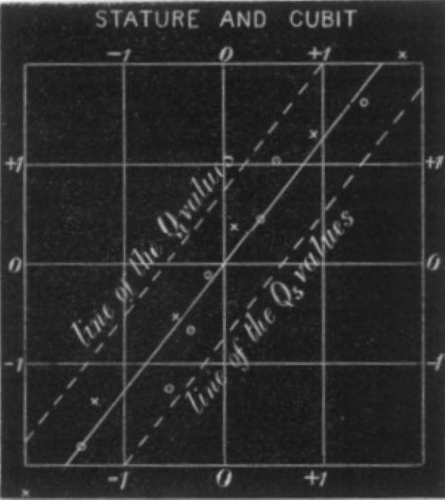
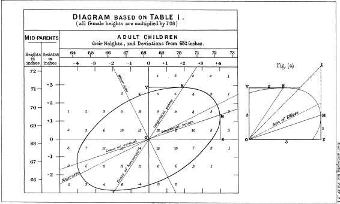
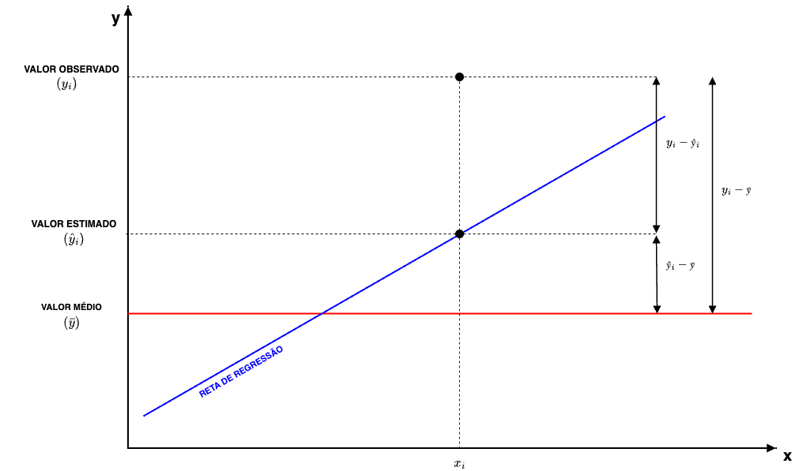
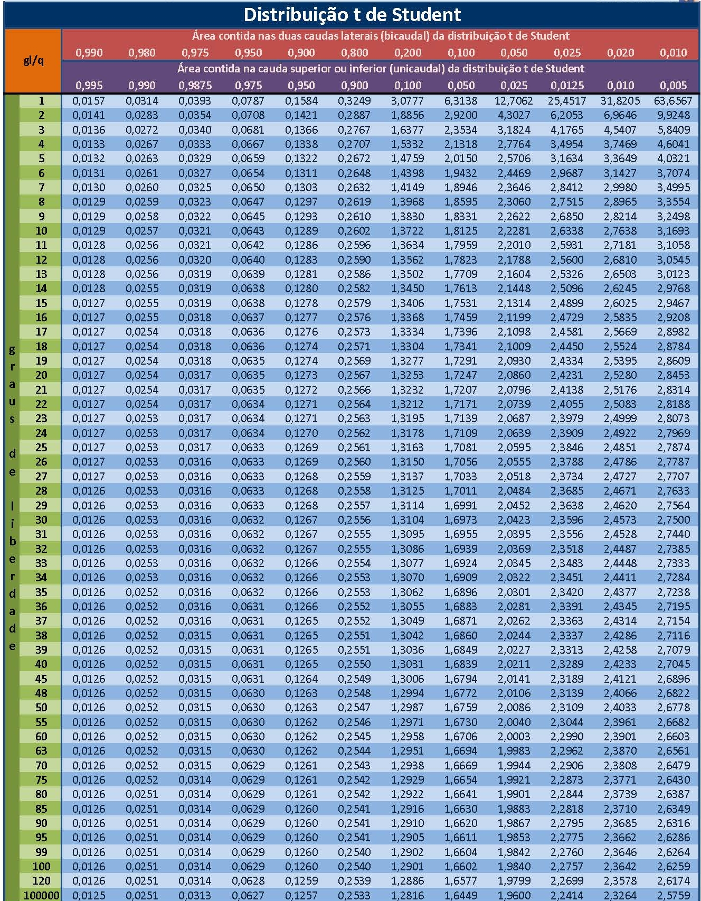
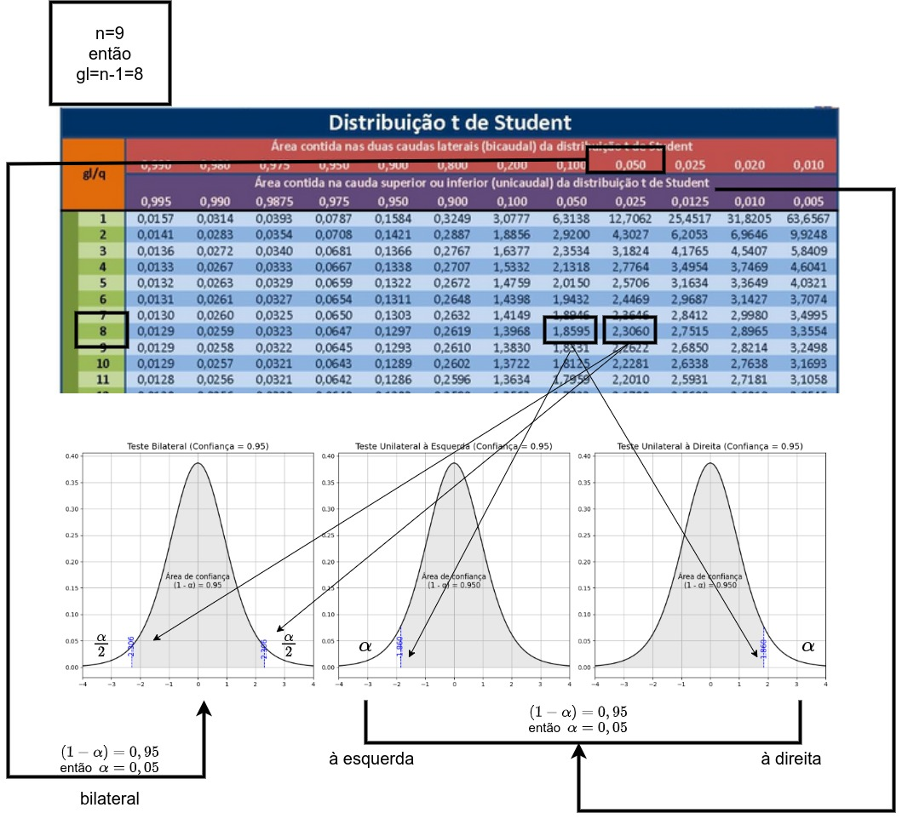
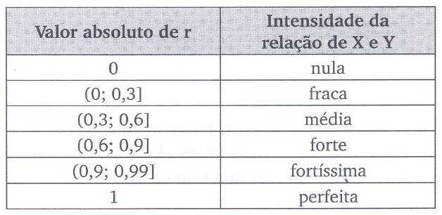

```{r, echo=FALSE, include=FALSE}
colFmt <- function(x,color) {
  
  outputFormat <- knitr::opts_knit$get("rmarkdown.pandoc.to")
  
  if(outputFormat == 'latex') {
    ret <- paste("\\textcolor{",color,"}{",x,"}",sep="")
  } else if(outputFormat == 'html') {
    ret <- paste("<font color='",color,"'>",x,"</font>",sep="")
  } else {
    ret <- x
  }

  return(ret)
}

#uso>>>> `r colFmt("REG",'red')`, 


```

<style>
.small-equation80 {
  font-size: 80%; 
}
</style>

<style>
.small-equation70 {
  font-size: 70%; 
}
</style>


<style>
.small-equation60 {
  font-size: 60%; 
}
</style>


<style>
.small-equation40 {
  font-size: 40%; 
}
</style>


<style>
blockquote {
  background-color: #c0c0c0; /* Fundo cinza claro */
  border-left: 4px solid #21130d; /* Barra lateral */
  padding: 10px;
  margin: 10px 0;
  border-radius: 4px; /* Bordas arredondadas */
  /* Remove o itálico padrão */
  color: #21130d; /* Cor do texto */
}
</style>


```{r , echo = FALSE, include=FALSE}
library(texPreview)
library(kableExtra)
library(knitr)
library(ggplot2)
library(MASS)      # Para boxcox
library(lmtest)    # Para testes de heterocedasticidade
library(nortest)   # Para testes de normalidade
library(car)       # Para vif e outras diagnósticas
knitr::opts_chunk$set(echo = TRUE)

```


# Introdução à Correlação Linear de Pearson{#introducao-a-correlacao-linear-de-pearson}

<br>

---


<figure class="image">
  <figcaption style="font-size: 20px;">>"Essentially, all models are wrong,but some are useful [...]" (George Edward Pelham Box, 1919 - 2013)</figcaption>
</figure>


---

## Contexto


<br>


O prefixo latino  _co_ remete ao significado _colaboração_ , _união_ ou até _simultaneidade_.  Correlação significa, portanto, uma relação mútua entre dois termos, uma correspondência.  


<br> 

Em *Correlations and their Measurement, chiefly from Anthropometric Data*, apresentado à *Royal Society of London* em dezembro de 1888, Francis Galton observou: 


<br> 


>"Correlação ou correlação de estrutura” é uma expressão muito usada em biologia, e principalmente naquele ramo que se refere à hereditariedade, e a ideia está ainda mais presente do que a expressão; mas eu não tenho conhecimento de nenhuma tentativa anterior de defini-la claramente, de traçar seu
modo de ação em detalhes ou de mostrar como medir seu grau".

---

Galton afirmou que que dois órgãos variáveis são ditos correlacionados quando a variação de um é acompanhada, na média, pela variação para mais ou menos no outro. Assim, o comprimento do braço
é considerado correlacionado com o da perna, porque uma pessoa com um braço longo geralmente tem uma perna longa e vice-versa. 

<br>

> Se a correlação for próxima, então uma pessoa com um braço muito longo geralmente teria uma perna muito longa. 

<br> 

> Se for moderadamente próxima, então o comprimento de sua perna seria geralmente apenas longo, não muito longo.

<br> 

> E se não houvesse correlação nenhuma, então o comprimento de sua perna seria, em média, mediano.

---


<figure class="image">
<br>
<figcaption style="font-size: 20px;">>"Diagrama de dispersão padronizado entre estatura e cúbito segundo Galton (1888). Cada observação é expressa em unidades da \textit{probable error} ($Q$), segundo $z_Q = \dfrac{x - M}{Q}$, onde $M$ é a mediana e $Q = \dfrac{Q_3 - Q_1}{2}$. Os eixos são centrados em zero e medidos em desvios padronizados robustos. As linhas diagonais representam as direções médias de variação conjunta entre as duas variáveis, evidenciando o grau de correlação linear após padronização por escala de variabilidade."</figcaption>  
</figure>


---


## Conceitos

<br>	

>_Correlação_ faz referência à relação existente entre variáveis, digamos *X* e *Y*. Essa relação pode assumir diferentes padrões: linear ou não linear (quadrática, cúbica, exponencial, ...). 

<br>

>_Autocorrelação_ refere-se à correlação dos valores de uma variável consigo mesma em diferentes defasagens temporais (*lags*), comumente chamada de série temporal. Formalmente, para uma série temporal $X_t$, a autocorrelação de ordem $k$ é definida como a correlação entre $X_t$ e $X_{t-k}$, medindo a dependência linear entre observações separadas por $k$ períodos de tempo ou unidades espaciais.

---


### Relações

<br>

> Relações Funcionais: relações expressas por sentenças matemáticas: área do retângulo ($A = a.b$), densidade de massa ($d_m=\frac{m}{V}$), perímetro de uma circunferência ($C = 2 \pi R)$

<br>

> Relações Estatísticas: relações estabelecidas entre  duas ou mais variáveis cujos valores foram coletados numa pesquisa (amostra). 

---

### Correlação _versus_ causação

<br>

>Embora a análise de correlação trate de algum modo com o comportamento de uma variável em relação a outra(s), isso não implica necessariamente em causação. 


<br> 

>Essa medida estatística não implica no estabelecimento inequívoco de uma relação causal. Para tanto deve-se lançar mão de considerações teóricas da relação estudada *a priori*.

<br>

Considerem a correlação existente entre a altura dos alunos de 6 a 17 anos e as notas médias anuais obtidas em matemática. Naturalmente não é o incremento que os alunos sofrem em suas alturas na fase de crescimento que causa a melhora nas notas; mas sim processos biológicos e comportamentais que resultam em melhorias na capacidade cognitiva.

---


### Correlação linear _versus_ regressão linear


<br>

>A análise de correlação tem como principal objetivo medir a força ou o grau de associação linear da relação entre as duas variáveis;

<br>

>A análise de regressão linear o objetivo primário é expressar matematicamente uma relação linear entre uma ou mais variáveis por meio de uma função, de modo a possibilitar obter estimativas de uma em relação a valor(es) não amostrado da(s) outra(s), contruir intervalos de confiança para essas estimativas e testar variadas hipóteses.  


---

### Diagrama de dispersão ( _scatterplot_ ) 

<br>


<figure class="image">
  
  <figcaption style="font-size: 20px;">>Descrito pela primeira vez por Francis Galton ( _Regression Towards Mediocrity in Hereditary Stature_ , 1886), os diagramas de dispersão ( _scatterplot_ ) ou gráficos de dispersão são representações de dados de duas (tipicamente) ou mais variáveis que são organizadas em um gráfico. O gráfico de dispersão utiliza coordenadas cartesianas para exibir valores de um conjunto de dados. Os dados são exibidos como uma coleção de pontos, cada um com o valor de uma variável determinando a posição no eixo horizontal e o valor da outra variável determinando a posição no eixo vertical (em caso de duas variáveis).</figcaption>
</figure>

<br>


Essas formas bem poderiam ser expressas, aproximadamente, por diferentes funções como:

- Lineares; ou
- Não lineares.

<br>

Vemos também que essas formas de associação entre os valores de $X$ e $Y$ podem ser *diretas* (positivamente) ou *inversamente* (negativamente) relacionadas. Estamos particularmente interessados em quantificar o grau da relação dos valores de $X$ e $Y$ nos padrões lineares.

<br>


```{r, echo=TRUE, fig.align='center', fig.width=7, fig.height=5, message=FALSE, warning=FALSE}

library(ggplot2)

# Dados
x=rnorm(n=100, mean=5, sd=2)
y= x + 2*rexp(n=100, rate=2) - 0.3*rgamma(n=100, shape=0.5, rate=1)
dados <- data.frame(x,y)

# Gráfico
ggplot(dados, aes(x = x, y = y)) +
  geom_point(color = "blue", size = 2) +
  labs(
    title = "Gráfico de dispersão de X por  Y ",
    x = "X",
    y = "Y"
  ) +
  theme_minimal() +
  theme(
    plot.title = element_text(size = 10, hjust = 0.5),
    axis.title = element_text(size = 9)
  ) +
  scale_x_continuous(limits = c(0,10)) +
  scale_y_continuous(limits = c(0,10))
```


---

>SIMULADOR 1: Considerem as simulações da dispersão de alguns valores de duas variáveis $X$ e $Y$. Vemos que em alguns casos nos parece ser razoável tentar exprimir qualquer tipo de relação entre os valores de $X$ e $Y$; todavia, há situações onde claramente vemos alguma forma de relação.  

---


## Coeficiente de correlação linear de Pearson

<br>

>O coeficiente de correlação linear (ou coeficiente de correlação produto momento de *Pearson*) expressa a medida da intensidade da associação **linear** entre duas variáveis.

<br>

<figure class="image">
  
</figure>
  <figcaption style="font-size: 20px;">A notação adotada para o coeficiente de correlação linear de Pearson depende dos dados analisados: se são dados amostrais ou populacionais:
- população: pela letra grega $\rho$  ("rô")
- amostra: pela letra latina *r*</figcaption>


<br> 

Trabalhando-se com dados de uma amostra, o estimador da correlação linear populacional $\rho$ é:

<br>	

$$
r  =  \frac{\sum _{i=1}^{n}{x}_{i} \cdot {y}_{i} - \frac{\sum _{i=1}^{n}{x}_{i}\sum _{i=1}^{n}{y}_{i}}{n}}{\sqrt{\left(\sum _{i=1}^{n}{x}_{i}^{2}-\frac{{\left(\sum _{i=1}^{n}{x}_{i}\right)}^{2}}{n}\right)\cdot \left[\sum_{i=1}^{n}{y}_{i}^{2}-\frac{{\left(\sum _{i=1}^{n}{y}_{i}\right)}^{2}}{n}\right]}},
$$


<br>

em que $x_{i}$: é o iésimo valor observado da variável *X*, $y_{i}$: é o iésimo valor observado da variável *Y*, $n$ é o número de pares de valores observados.


<br>

Equivalente à expressão:

<br>


$$r = \frac{\sum_{i=1}^{n}(x_i - \bar{x})(y_i - \bar{y})}{\sqrt{\sum_{i=1}^{n}(x_i - \bar{x})^2 \cdot \sum_{i=1}^{n}(y_i - \bar{y})^2}}.$$

<br> 

em que:

  - $x_{i}$: é o iésimo valor observado da variável *X*; 
  - $y_{i}$: é o iésimo valor observado da variável *Y*; e
  - $n$ é o número de pares de valores observados.
  
<br>


Ou, simplificadamente:

<br>	

$$
r = \frac{{S}_{xy}}{\sqrt{{S}_{xx}\cdot {S}_{yy}}}
$$

<br> 

em que $n$ é o número de pares de valores observados e:


$$
S_{xy} = \sum _{i=1}^{n} x_{i}y_{i} - \frac{\sum _{i=1}^{n}x_{i}\cdot\sum _{i=1}^{n}y_{i}}{n}
$$


$$
S_{xx} = \sum _{i=1}^{n} x_{i}^{2} - \frac{(\sum _{i=1}^{n} x_{i})^{2}}{n}
$$


$$
{S}_{yy}=\sum _{i=1}^{n}y_{i}^{2} - \frac{(\sum _{i=1}^{n} y_{i})^{2}}{n}
$$
---

Observações:

<br>

- a faixa de variação do coeficiente de correlação linear de Pearson é: $-1 \le r \le 1$,

- a correlação linear observada entre $X$ e $Y$ é simétrica; ou seja, é a mesma que se medida entre as variáveis $Y$ e $X$,

- mede apenas a associação linear entre duas variáveis e, portanto, não tem sentido usá-lo na quantificação de relações que não sejam lineares,

- a possibilidade de uma **correlação linear negativa** virá do resultado do *numerador* ($S_{xy}$), pois no denominador temos duas somas de quadrados,

- o coeficiente de correlação mede apenas a **intensidade** das relações lineares entre $X$ e $Y$ e não estabelece *per si* nenhuma relação de causação. 

<br>

Se $r \approx 0$, não há evidência de relação linear entre as variáveis na amostra observada. Neste caso, variações em uma variável não estão linearmente associadas a variações sistemáticas na outra.
    
Se $r \neq 0$, há evidência de relação linear entre as variáveis, cuja direção e intensidade são determinadas pelo sinal e magnitude de $r$:  

  -quando $r > 0$, a relação linear é \textbf{positiva}: incrementos em uma variável tendem a ser acompanhados por incrementos na outra, e decréscimos em uma variável tendem a ser acompanhados por decréscimos na outra;  
  -quando $r < 0$, a relação linear é \textbf{negativa}: incrementos em uma variável tendem a ser acompanhados por decréscimos na outra, e vice-versa.
  
---


<br>

O cálculo do coeficiente da correlação linear assemelha-se a uma _análise de variância_.

<br>

<figure class="image">
  
</figure>

<br>

Vejamos:

<br>

$$
y_i - \stackrel{-}{y} = (\hat{y_i} - \stackrel{-}{y})  + (y_i - \hat{y_i}).
$$

<br>

Elevando-se ao quadrado ambos os termos, para todos os valores observados, teremos:

<br>

$$ 
\sum _{i=1}^{n} ({y_{i}} - \stackrel{-}{y})^{2} = 
\sum _{i=1}^{n} (\hat{y_{i}} - \stackrel{-}{y})^{2}   + 
\sum _{i=1}^{n} (y_{i} - \hat{y_{i}})^{2}
$$

<br>

>A quantidade à esquerda mede a variação total dos *y* (*Soma de quadrados total*) e as quantidades à direita são a *Soma de quadrados da regressão* e a *Soma de quadrados dos resíduos*.  


<br> 

>A definição abaixo exprime a *fração da variação total* dos $y$ que está sendo explicada por sua *regressão linear* com $x$:  

<br> 


$$
R^{2}=\frac{\sum _{i=1}^{n} (\hat{y_{i}} - \stackrel{-}{y})^{2}}{\sum _{i=1}^{n} ({y_{i}} - \stackrel{-}{y})^{2}}\\
R^{2}=\frac{\text{variação explicada}}{\text{variação total}}
$$
<br>

é conhecida como coeficiente de determinação ($R^{2}$). Note que o coeficiente de determinação é o quadrado do coeficiente de correlação. Ele indica a proporção da variabilidade em Y que é explicada pela variação em X por meio da reta de regressão.
 
---

<br>

> Exemplo 1: Um jornal deseja verificar a eficácia de seus anúncios na venda de carros usados e para isso realizou um levantamento de todos os seus anúncios e informações dos resultados obtidos pelas empresas que o contrataram e dele extraiu uma pequena amostra. A tabela a seguir mostra o número de anúncios e o correspondente número de veículos vendidos por 6 companhias que usaram apenas este jornal como veículo de propaganda. Existe alguma relação linear entre as variáveis? Construa o diagrama de dispersão e calcule o coeficiente de correlação linear.  

<br>

<center>
<div class="small-equation80">

```{r eval=knitr::is_html_output(), results = "asis", echo = FALSE, message = FALSE}

tex2markdown <- function(texstring) {
  writeLines(text = texstring,
             con = myfile <- tempfile(fileext = ".tex"))
  texfile <- pandoc(input = myfile, format = "html")
  cat(readLines(texfile), sep = "\n")
  unlink(c(myfile, texfile))
}

textable <- "
\\begin{table}[h]
\\centering
\\caption*{Quadro de dados da quantidade de carros vendidos por 6 empresas distintas pela quantidade de anúncios feitos }
\\begin{tabular}{|c|c|c|}
\\hline 
Companhia & Anúncios feitos (X) & Carros vendidos (Y) \\\\
\\hline 
A & 74 & 139 \\\\
\\hline 
B & 45 & 108 \\\\
\\hline 
C & 48 & 98 \\\\
\\hline 
D & 36 & 76 \\\\
\\hline 
E & 27 & 62 \\\\
\\hline 
F & 16 & 57 \\\\
\\hline 
\\end{tabular}  
\\end{table}
"

tex2markdown(textable)

```
</div>
</center>


<br>


```{r, echo=TRUE, fig.align='center', fig.width=7, fig.height=5, message=FALSE, warning=FALSE}


# Dados
dados <- data.frame(
  Anuncios = c(74, 45, 48, 36, 27, 16),
  Carros_vendidos = c(139, 108, 98, 76, 62, 57)
)

# Gráfico
ggplot(dados, aes(x = Anuncios, y = Carros_vendidos)) +
  geom_point(color = "blue", size = 3) +
  labs(
    title = "Gráfico de dispersão entre o número de anúncios veiculados\ne o número de veículos vendidos no mês",
    x = "Número de anúncios veiculados no mês",
    y = "Número de veículos vendidos no mês"
  ) +
  theme_minimal() +
  theme(
    plot.title = element_text(size = 10, hjust = 0.5),
    axis.title = element_text(size = 9)
  ) +
  scale_x_continuous(limits = c(10, 80)) +
  scale_y_continuous(limits = c(10, 145))
```


<br>


```{r eval=knitr::is_html_output(), results = "asis", echo = FALSE, message = FALSE}

tex2markdown <- function(texstring) {
  writeLines(text = texstring,
             con = myfile <- tempfile(fileext = ".tex"))
  texfile <- pandoc(input = myfile, format = "html")
  cat(readLines(texfile), sep = "\n")
  unlink(c(myfile, texfile))
}


textable <- "
\\begin{table}[h]
\\caption*{Quadro para cálculo do coeficiente de correlação linear (\\$r\\$)}
\\begin{tabular}{|c|c|c|c|c|c|}
\\hline 
Companhia & Anúncios (X) & Carros vendidos (Y) & $x_{i}*y_{i}$ & $x_{i}^2$ & $y_{i}^2$ \\\\
\\hline 
A & 74 & 139 & 10286 & 5476 & 19321 \\\\ 
\\hline 
B & 45 & 108 & 4860 & 2025 & 11664 \\\\ 
\\hline 
C & 48 & 98 & 4704 & 2304 & 9604 \\\\ 
\\hline 
D & 36 & 76 & 2736 & 1296 & 5776 \\\\ 
\\hline 
E & 27 & 62 & 1674 & 729 & 3844 \\\\ 
\\hline 
F & 16 & 57 & 912 & 256 & 3249 \\\\ 
\\hline 
Totais & 246 & 540 & 25172 & 12086 & 53458 \\\\ 
\\hline 
\\end{tabular}
\\end{table}
"

tex2markdown(textable)
```


<br>

Sendo $n= 6$ temos:

$$
S_{xy} = \sum _{i=1}^{n} x_{i}y_{i} - \frac{\sum _{i=1}^{n}x_{i}\cdot\sum _{i=1}^{n}y_{i}}{n} = 25172 - \frac{246 \cdot 540}{6} = 3032\\
S_{xx} = \sum _{i=1}^{n} x_{i}^{2} - \frac{(\sum _{i=1}^{n} x_{i})^{2}}{n} = 12086 - \frac{246^2}{6} = 2000\\
{S}_{yy} = \sum _{i=1}^{n}y_{i}^{2} - \frac{(\sum _{i=1}^{n} y_{i})^{2}}{n}=   53458 - \frac{540^2}{6} = 4858
$$
<br>

Portanto: 

<br>

$$
r = \frac{{s}_{xy}}{\sqrt{{s}_{xx}\cdot {s}_{yy}}} = \frac{3032}{\sqrt{2000 \cdot 4858}} = 0,9727
$$
---

```{r, echo=TRUE, fig.align='center', fig.width=7, fig.height=5, message=FALSE, warning=FALSE}

Anuncios = c(74, 45, 48, 36, 27, 16)
Carros_vendidos = c(139, 108, 98, 76, 62, 57)
cor(Anuncios, Carros_vendidos, method = "pearson")

```


---

## Teste de hipóteses para a correlação linear na população


O coeficiente de correlação amostral $r$ é uma estimativa do coeficiente de correlação populacional $\rho$. 

<br> 

Sendo $r$ é uma variável aleatória, ie, uma função de duas variáveis aleatórias, possui uma distribuição amostral. Assim, para se realizar qualquer inferência concernentes a $\rho$, a partir de $r$, precisamos ter conhecimento da distribuição amostral de $r$. 

<br> 

Um inferência essencial é testar a existência de correlação entre as populações e, para tanto um teste de hipóteses com estrutura bilateral pode ser proposto: 

<br> 

$$
\begin{cases}
	H_{0}:\rho = 0 \hspace{0.1cm} \text{, ie. a correlação linear entre X e Y é nula} \\
	H_{1}:\rho \ne 0 \hspace{0.1cm} \text{, ie. a correlação linear entre X e Y não é nula} \\
\end{cases}
$$

<br>

> Lembrando a tradicional analogia de que um *teste de hipóteses* guarda uma certa semelhança a um julgamento: caso não haja indício forte o suficiente para comprovar a culpa do acusado ele é tecnicamente declarado *não culpado* (e não *inocente*). 

<br>
<br>

> Seguindo esse raciocínio, o *indício ou evidência* que nos permitirá rejeitar a hipótese nula virá de uma *evidência amostral* e a *significância* dessa *evidência amostral* será calculada a partir da estatística (${t}_{calc}$), que considera o o coeficiente de correlação amostral $r$ e o tamanho da amostra $n$.

<br> 

$$
{t}_{calc}=\frac{r\cdot\sqrt{n-2}}{\sqrt{1-{r}^{2}}}\\
T \sim t_{(n-2)}
$$

<br>

Para que o teste de correlação de Pearson seja **exato**, a distribuição bivariada $(X,Y)$ deve seguir uma distribuição normal bivariada. No entanto, o teste é razoavelmente robusto a violações deste pressuposto quando o tamanho amostral é grande (n>30). 

<br>

Para amostras pequenas ou quando há forte evidência de não-normalidade, alternativas não-paramétricas como o coeficiente de correlação de Spearman devem ser consideradas.


<br>

```{r, echo=TRUE, fig.align='center', fig.width=7, fig.height=5, message=FALSE, warning=FALSE}

# Dados
dados <- data.frame(
  Anuncios = c(74, 45, 48, 36, 27, 16),
  Carros_vendidos = c(139, 108, 98, 76, 62, 57)
)

# Configurar layout para múltiplos gráficos
par(mfrow = c(1, 2))

# 1. Gráfico Q-Q para Anúncios
qqnorm(dados$Anuncios, main = "QQ plot Anuncios\ncom n=6, a interpretação é limitada,\nmas os pontos devem aproximar-se\nda linha teórica", pch = 16, cex.main=0.8)
qqline(dados$Anuncios, col = "red", lwd = 2)

# 2. Gráfico Q-Q para Carros Vendidos
qqnorm(dados$Carros_vendidos, main = "QQ plot Carros vendidos\ncom n=6, a interpretação é limitada,\nmas os pontos devem aproximar-se\nda linha teórica", pch = 16, cex.main=0.8)
qqline(dados$Carros_vendidos, col = "red", lwd = 2)


```


<br>


>Rejeita-se a hipótese nula ($H_{0}:\rho = 0 \hspace{0.1cm}) se o valor da estatística calculada $t_{calc}$ for tão extremo que se verifique: 

<br>


$$
t_{calc} \le {t}_{tab[\frac{\alpha }{2};\left(n-2\right)]}\\
\text{ou}\\
t_{calc} \ge {t}_{tab[1-\frac{\alpha }{2};\left(n-2\right)]}\\
$$


<br> 

ou, equivalentemente, $|t_{calc}| \ge {t}_{tab\left[1-\frac{\alpha}{2};\left(n-2\right)\right]}$, em que $t_{tab}$ é o quantil associado na distribuição "t" de Student ao *nível de significância* pretendido ($\alpha$) com $(n-2)$ graus de liberdade. 

---

O teste de hipótese proposto é um *teste bilateral*; assim, o gráfico apropriado para se decidir pela rejeição ou não da hipótese nula assume a forma mostrada nessa simulação. (SIMULADOR 2 COM t)

---

O número de graus de liberdade irá determinar qual curva da família dessa distribuição será utilizada, por essa razão, as tabelas apresentam-se individualizadas por nível de significância e graus de liberdade.    


```{r, echo=TRUE, fig.align='center', fig.width=7, fig.height=5, message=FALSE, warning=FALSE}


# Dados
gl <- c(1, 2, 5, 10, 30, Inf)
x  <- seq(-5, 5, length.out = 500)
cores <- c("#e41a1c", "#ff7f00", "#4daf4a", "#377eb8", "#984ea3", "#000000")

plot(x, dnorm(x), type = "n",
     ylim = c(0, 0.42), xlab = "t", ylab = "Densidade",
     main = "Distribuição t de Student para diferentes graus de liberdade")

for (i in seq_along(gl)) {
  if (is.finite(gl[i])) {
    y <- dt(x, df = gl[i])
  } else {
    y <- dnorm(x)
  }
  lines(x, y, col = cores[i], lwd = 2)
}

legend("topright",
       legend = c(paste("gl =", gl[-length(gl)]), "Normal (gl = \u221e)"),
       col    = cores,
       lwd    = 2,
       bty    = "n")

```

---


As curvas da família "t" possuem simetria em relação a um eixo vertical no valor de máxima densidade. O valor tabelado dessa estatística acha-se associado à área sob ela pois é uma função densidade de probabilidade: a totalidade da área sob essa curva é igual a 1 (probabilidade de 100\%)

<br>

Assim, se consultarmos em uma tabela o valor "t" para um nível de significância $\alpha$ qualquer, correspodente assim a um nível de confiança de ($1-\alpha$), qualquer veremos que ele será igual, *em módulo*, ao valor "t" no outro extremo dessa curva.

<br>

Por essa razão muitas tabelas apresentam valores dessa estatística sob os títulos de *monocaudal* ou *bicaudal* pois estão apresentando os valores para um determinado nível de significância ($\alpha$): área sob a curva, situado apenas em um lado (ou *subdividido* nos dois ramos da curva nas tabelas chamadas "bilaterais").


---

### Outros testes de hipóteses sobre a correlação linear na população

<br>

Para se testar a hipótese $\rho=\rho_{0}\neq0$ 

<br>


$$
\begin{cases}
	H_{0}:\rho = \rho_{0} \hspace{0.1cm} \text{, ie. a correlação linear entre X e Y é igual a }\rho_{0} \\
	H_{1}:\rho \ne \rho_{0} \hspace{0.1cm} \text{, ie. a correlação linear entre X e Y é diferente de }\rho_{0} \\
\end{cases}
$$

<br> 

utilizamos a estatística $Z$ (zeta) de Fisher. A transformação $Z$ proposta por Fisher produz uma estatística que possui distribuição aproximadamente Normal. Para essa situação a estatística a ser utilizada é dada por:

<br>

$$
Z= \frac{1}{2}\ln\frac{(1+r)}{(1-r)}.
$$

<br>


Essa estatística possui uma distribuição aproximadamente Normal, com média e desvio padrão:


<br>

$$
\mu_{Z} =  \frac{1}{2}\ln\frac{(1+\rho_{0})}{(1-\rho_{0})}\\
\text{e}\\ 
\sigma_{Z} = \frac{1}{\sqrt{n-3}}
$$ 

<br>

Transformando-se $Z$ em unidades padrão (pela subtração de $\mu_{Z}$ e divisão por $\sigma_{Z}$), chega-se à estatística tabelada:

<br>

$$
z = \frac{Z - \mu_{Z}}{\sigma_{Z}} 
$$

<br>

que, sob $H_0: \rho = \rho_0$, segue aproximadamente uma distribuição Normal padrão $N(0,1)$.

---

<br>

> Exemplo 2: Faça o teste de hipóteses para a correlação linear $\rho$ a partir da correlação amostral $r$ calculada no exercício dos anúncios de veículos, sob um nível de significância ($\alpha$) de 0,05.

<br>

No exercício referido obtivemos um valor para a correlação linear de Pearson de $r=0,9727$. A partir desse valor podemos calcular o valor de nossa estatística ${t}_{calc}$ para o teste:  

<br>

$$
{t}_{calc}=\frac{r\cdot\sqrt{n-2}}{\sqrt{1-{r}^{2}}} = 8,38
$$
<br>

Rejeitaremos a hipótese nula ($H_{0}$) se:

<br>

$$
t_{calc} \le {t}_{tab[\frac{\alpha }{2};\left(n-2\right)]}\\
\text{ou}\\
t_{calc} \ge {t}_{tab[1-\frac{\alpha }{2};\left(n-2\right)]}
$$
<br>


Da tabela extraímos o valor de nossa estatística de comparação a um nível de significância $\alpha=5\%$ e, para um tamanho amostral $n=6$, temos como graus de liberdade $n-2=4$ ($t_{tab}=2,776$).

<br>

```{r, echo=TRUE, fig.align='center', fig.width=7, fig.height=5, message=FALSE, warning=FALSE}

qt(0.025, 4, lower.tail = TRUE)
qt(0.975, 4, lower.tail = TRUE)

```

<br>


Vê-se que o valor calculado da estatística "t" encontra-se além dos limites estabelecidos pela estatística de comparação ($t_{tab}$) para um nível de significância de  $\alpha=5\%$. (SIMULADOR 2 COM t)

<br>


```{r, echo=TRUE, fig.align='center', fig.width=7, fig.height=5, message=FALSE, warning=FALSE}

# Dados do Exemplo 1
anuncios <- c(74, 45, 48, 36, 27, 16)
carros_vendidos <- c(139, 108, 98, 76, 62, 57)
# Teste usando função nativa do R (para comparação)
teste <- cor.test(anuncios, carros_vendidos)
print(teste)

```


<br>


## Introdução à Correlação Linear de Spearman

A correlação de Spearman é uma medida de associação não paramétrica que avalia a relação monotônica entre duas variáveis. Diferentemente da correlação de Pearson, que opera sobre os valores brutos e pressupõe linearidade e normalidade, a correlação de Spearman baseia-se nos **postos** (*ranks*) atribuídos às observações.

---

### Definição

Sejam $X$ e $Y$ duas variáveis aleatórias com $n$ observações. Os postos de $X$ e $Y$ são definidos como $R(X_i)$ e $R(Y_i)$, respectivamente. O coeficiente de correlação de Spearman é dado por:

<br>

$$
r_s = 1 - \frac{6 \sum_{i=1}^{n} d_i^2}{n(n^2 - 1)}
$$

<br>

em que $d_i = R(X_i) - R(Y_i)$ é a diferença entre os postos de cada par de observações. Esta fórmula é equivalente ao coeficiente de correlação de Pearson calculado sobre os postos:

<br>

$$
r_s = \frac{\sum_{i=1}^{n}\left[R(X_i) - \overline{R(X)}\right]\left[R(Y_i) - \overline{R(Y)}\right]}{\sqrt{\sum_{i=1}^{n}\left[R(X_i) - \overline{R(X)}\right]^2 \sum_{i=1}^{n}\left[R(Y_i) - \overline{R(Y)}\right]^2}}
$$

<br>

A equivalência entre as duas expressões é válida na ausência de empates (*ties*). Quando há empates, recomenda-se utilizar a segunda formulação, que produz resultados exatos.

---

### Propriedades

<br>

O coeficiente de correlação de Spearman $r_s$ assume valores no intervalo $[-1, 1]$, sendo que:

<br>

- $r_s = 1$ indica relação monotônica crescente perfeita;
- $r_s = -1$ indica relação monotônica decrescente perfeita;
- $r_s = 0$ indica ausência de relação monotônica.

<br>

Como a correlação de Spearman opera sobre postos, ela é robusta à presença de *outliers* e não requer que as distribuições marginais sejam normais, tornando-a adequada a dados ordinais ou contínuos com distribuições assimétricas.

---

### Teste de Hipóteses

<br>

O teste de significância para $r_s$ considera as hipóteses:


$$
\begin{cases}
	H_{0}:\rho_s = 0 \hspace{0.1cm} \text{, ie. a correlação linear entre X e Y é nula} \\
	H_{1}:\rho_s \ne 0 \hspace{0.1cm} \text{, ie. a correlação linear entre X e Y não é nula} \\
\end{cases}
$$


<br>


Para amostras de tamanho $n > 10$, a estatística de teste

<br>


$$
t = r_s \sqrt{\frac{n - 2}{1 - r_s^2}}\\
T \sim t_{(n-2)}
$$

<br>


segue aproximadamente uma distribuição $t$ de Student com $n - 2$ graus de liberdade sob $H_0$

---


```{r, echo=TRUE, fig.align='center', fig.width=7, fig.height=5, message=FALSE, warning=FALSE}

# Dados
anuncios <- c(74, 45, 48, 36, 27, 16)
carros_vendidos <- c(139, 108, 98, 76, 62, 57)

# Teste usando função nativa do R (para comparação)
teste <- cor.test(anuncios, carros_vendidos,  method = "spearman")
print(teste)

```

---


#### Tabelas

<br>

<figure class="image">
  
</figure>	

---

<br>

<figure class="image">
  
</figure>	

---


<figure class="image">
  
</figure>

---
