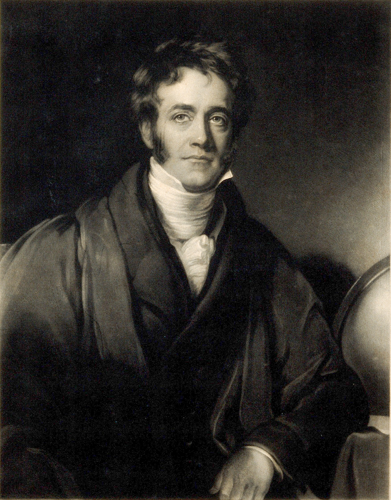
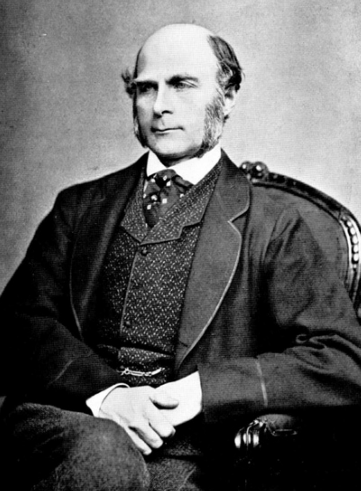
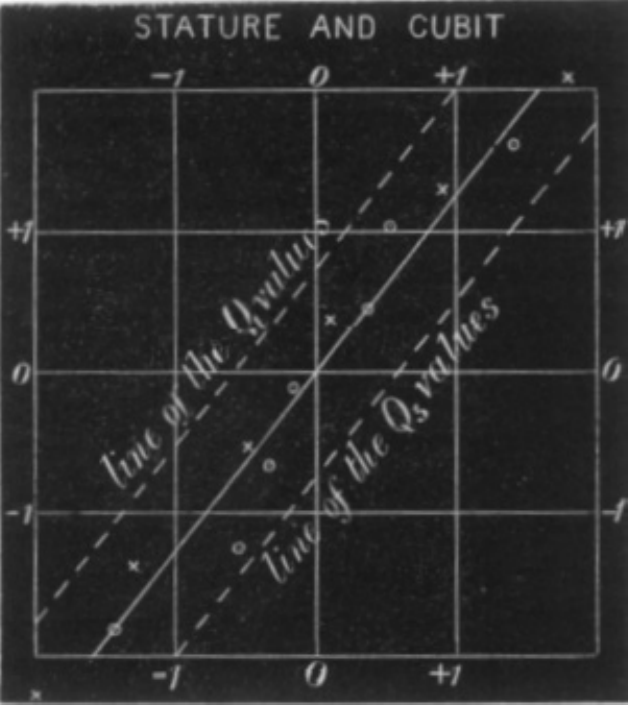
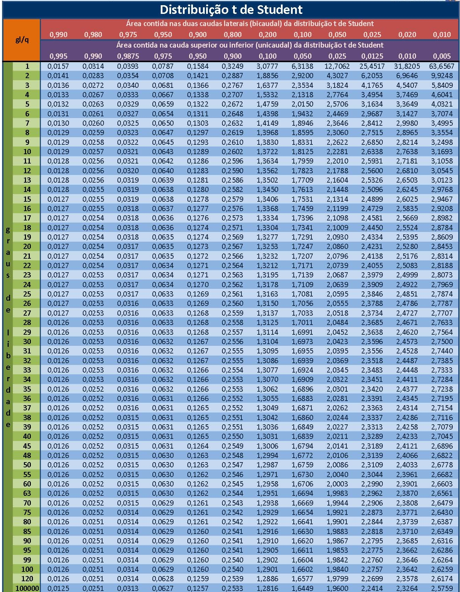
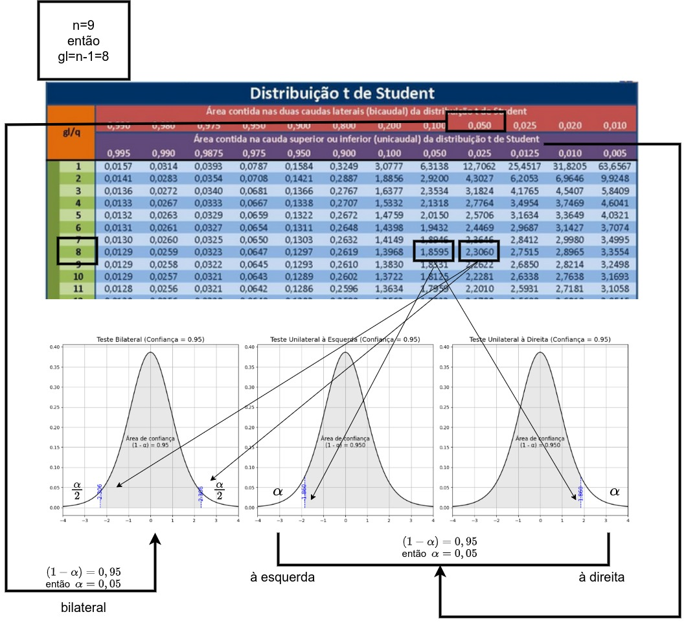
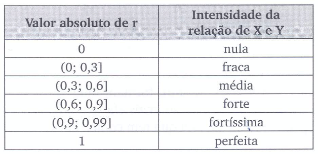
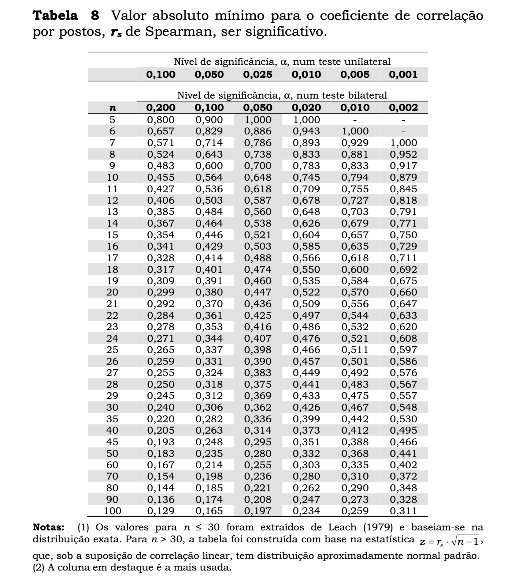

---
output:
  pdf_document: default
  html_document: default
---


```{r setup, echo=FALSE, include=FALSE}
# Função para colorir texto
colFmt <- function(x,color) {
  
  outputFormat <- knitr::opts_knit$get("rmarkdown.pandoc.to")
  
  if(outputFormat == 'latex') {
    ret <- paste("\\textcolor{",color,"}{",x,"}",sep="")
  } else if(outputFormat == 'html') {
    ret <- paste("<font color='",color,"'>",x,"</font>",sep="")
  } else {
    ret <- x
  }

  return(ret)
}

# Função para caminho de images12
img_path <- function(file) {
  file.path(params$img_dir, file)
}

#uso>>>> `r colFmt("REG",'red')`, 


knitr::opts_chunk$set(comment = "->")

```

<style>
.small-equation80 {
  font-size: 80%; 
}
</style>

<style>
.small-equation70 {
  font-size: 70%; 
}
</style>


<style>
.small-equation60 {
  font-size: 60%; 
}
</style>


<style>
.tabela-pequena table {
  font-size: 0.4em !important;
}
</style>

<style>
.small-equation40 {
  font-size: 40%; 
}
</style>


<style>
blockquote {
  background-color: #c0c0c0; /* Fundo cinza claro */
  border-left: 4px solid #21130d; /* Barra lateral */
  padding: 10px;
  margin: 10px 0;
  border-radius: 4px; /* Bordas arredondadas */
  /* Remove o itálico padrão */
  color: #21130d; /* Cor do texto */
}
</style>

<style>
  p, li, .article p {
    text-align: justify;
  }
</style>

```{r , echo = FALSE, include=FALSE}
library(texPreview)
library(kableExtra)
library(knitr)
library(ggplot2)
library(MASS)      # Para boxcox
library(lmtest)    # Para testes de heterocedasticidade
library(nortest)   # Para testes de normalidade
library(car)       # Para vif e outras diagnósticas
knitr::opts_chunk$set(echo = TRUE)


```


---


<figure class="image">
  
</figure>


```{r eval=knitr::is_html_output(), results = "asis", echo = FALSE, message = FALSE}

tex2markdown <- function(texstring) {
  writeLines(text = texstring,
             con = myfile <- tempfile(fileext = ".tex"))
  texfile <- pandoc(input = myfile, format = "html")
  cat(readLines(texfile), sep = "\n")
  unlink(c(myfile, texfile))
}

```


# Introdução a Medidas de Associação para Variáveis Quantitativas: \newline Correlação Linear de Pearson \newline Estimação e Inferência {#introducao-as-medidas-de-associacao-variaveis-quantitativas}


---

<br>
<br>

De forma análoga a como a média e o desvio padrão resumem, respectivamente, a posição e a dispersão de uma única variável, existem **estatísticas descritivas bivariadas** que sintetizam em um único valor a existência, a direção e a intensidade da associação linear entre duas variáveis quantitativas. 

<br> 

O estudo conjunto de duas variáveis quantitativas caracteriza uma **análise descritiva bidimensional** na análise exploratória de dois conjuntos de dados.


## Etimologia  

*Co* (preposição): equivalente a *com* ou *cum*, remete a significados como *junto* ou *mutuamente*.

<br>

<div style="margin-left: 40px;">

*Relátio(-ónis)*: equivalente a *relação*.   

</div>

<br>

<div style="margin-left: 80px;">

*Línea*: fio, linha

</div>

<br> 

<div style="margin-left: 120px;">

*Correlação linear*, portanto, significaria uma *relação/associação* de dois elementos na forma de uma linha.

</div>

<br>


## Conceitos (termos) correlatos


---	

### Correlação e autocorrelação

<br>	
<br>	

  - *Correlação* faz referência à relação existente entre variáveis, digamos *X* e *Y*. Essa relação pode assumir diferentes padrões: *linear* ou *não linear*. 

<br>

- *Autocorrelação* refere-se à correlação dos valores de uma variável *consigo mesma* observados em diferentes defasagens no tempo (ou distâncias no espaço).

---

### Correlação e regressão

<br>

- A *análise de correlação linear* tem como objetivo medir a força e a direção da associação linear entre duas variáveis, sem distinguir entre variável dependente e independente.

<br>

- A *análise de regressão linear*, por sua vez, tem como objetivo primário expressar a relação entre uma variável dependente e uma ou mais variáveis independentes por meio da estimação de uma função, de modo a possibilitar a obtenção de estimativas para valores não observados, a construção de intervalos de confiança para essas estimativas e o teste de hipóteses sobre os parâmetros do modelo.


---

### Correlação e causação

<br>
<br>
<br>

Embora a análise de correlação trate de algum modo com o comportamento de uma variável em relação a outra(s), isso não implica necessariamente em causação; ie. **essa medida estatística não implica no estabelecimento inequívoco de uma relação causal**. 


---

<br>
<br>
<br>

> Para o estabelecimento de **relações causais**, é necessário recorrer a considerações teóricas *a priori* sobre os possíveis mecanismos que governam as variáveis estudadas, uma vez que a correlação, por si só, não é condição suficiente para a inferência causal.

---

Em [Spurious Correlations (2014)](https://tylervigen.com/) Tyler Vigen promoveu uma infinidade de cruzamentos construídos sistematicamente a partir de uma base de 25.237 variáveis publicamente disponiveis com o exclusivo propósito de identificar *correlações aleatórias*. 

<br>


O resultado é uma coleção de associações *numericamente expressivas* quando vemos seus valores apresentados em um *diagrama de dispersão*:

---

<br>

```{r, echo=FALSE, fig.align='center', fig.width=8,  fig.align='center', message=FALSE, warning=FALSE}


library(ggplot2)

df <- data.frame(
  var1 = c(8.2, 7.0, 6.5, 5.3, 5.2, 4.0, 4.6, 4.5, 4.2, 3.7),
  var2 = c(5.0, 4.7, 4.6, 4.4, 4.3, 4.1, 4.2, 4.2, 4.2, 4.1)
)

ggplot(df, aes(x = var2, y = var1)) +
  geom_point(size = 2, color='red') +
  labs(
    x     = "Variável B",
    y     = "Variável A"
  ) +
scale_x_continuous( limits = c(4, 5.1), breaks = seq(3.75, 5.1, by = 0.25)) +
scale_y_continuous( limits = c(3.5, 8.3), breaks = seq(3.5, 8.3, by = 1))+
theme_minimal(base_size = 13) +
theme(
    panel.grid.minor = element_blank(),
    legend.position  = "none",
    axis.text        = element_text(size = 10),
    axis.title       = element_text(size = 10)
  )


```

---

<br>

mas *desprovidas de qualquer nexo causal* plausível quando apresentamos as variáveis $A$ e $B$:

<br>


```{r eval=knitr::is_html_output(), results = "asis", echo = FALSE, message = FALSE}

textable <- "
\\begin{table}[h]
\\centering
\\caption*{Consumo per capita de margarina nos EUA e taxa de divórcios no Maine (2000--2009)}
\\begin{tabular}{|l|c|c|c|c|c|c|c|c|c|c|}
\\hline
Variáveis & 2000 & 2001 & 2002 & 2003 & 2004 & 2005 & 2006 & 2007 & 2008 & 2009 \\\\
\\hline
A: consumo anual per capita de margarina (lbs.) & 8{,}2 & 7{,}0 & 6{,}5 & 5{,}3 & 5{,}2 & 4{,}0 & 4{,}6 & 4{,}5 & 4{,}2 & 3{,}7 \\\\
B: taxa de divórcios no Maine (‰) & 5{,}0 & 4{,}7 & 4{,}6 & 4{,}4 & 4{,}3 & 4{,}1 & 4{,}2 & 4{,}2 & 4{,}2 & 4{,}1 \\\\
\\hline
\\end{tabular}
\\end{table}
"
tex2markdown(textable)

```


---

### Diagrama de dispersão ( _scatterplot_ ) 

<br>

<figure style="float: left; margin: 0 20px 10px 0; width: 30%;">

<figcaption style="font-size: 16px;">John Frederick William Herschel (1792,1871).</figcaption>
</figure>

Introduzidos por Herschel em [On the Investigation of the Orbits of revolving Double Stars; being a Supplement to a Paper entitled "Micrometrical Measures of 364 Double Stars (1833)"](https://adsabs.harvard.edu/full/1833MmRAS...5..171H) e popularizados por Francis Galton em [Regression Towards Mediocrity in Hereditary Stature (1886)](https://galton.org/essays/1880-1889/galton-1886-jaigi-regression-stature.pdf), os diagramas de dispersão (*scatterplot*) são representações gráficas dos valores de duas variáveis.

<div style="clear: both;"></div>

---

Um *diagrama de dispersão* utiliza coordenadas cartesianas para representar observações de duas variáveis em um plano, posicionando cada ponto segundo os valores correspondentes nos eixos horizontal e vertical (Kotu \& Deshpande em [Data Science (2019)](https://www.sciencedirect.com/topics/mathematics/scatterplot)). 


O *padrão resultante da distribuição* dos pontos permite identificar *visualmente* diferentes aspectos da associação entre duas variáveis como:

  - *forma*,
  - *direção*, 
  - *intensidade*, 
  
facilitando a *proposição de relações* e a escolha de *medidas* adequadas à quantificação da *forma* da associação associação.


---


```{r herschel, echo=FALSE, fig.align='center', fig.width=8, message=FALSE, warning=FALSE, fig.cap="Ângulo de posição em relação ao Norte celeste do sistema binário de estrelas chamado γ Virginis (ou Porrima) em função do ano de observação, para determinação dos elementos orbitais: excentricidade, período, inclinação (Herschel, 1833)."}

library(ggplot2)
library(HistData)
data(Virginis)
data(Virginis.interp)

ggplot() +
  #geom_line(data = Virginis.interp, aes(x = year, y = posangle),
  #          color = "red", linewidth = 0.8) +
  #geom_point(data = Virginis.interp, aes(x = year, y = posangle),
  #           color = "red", shape = 15, size = 1.5) +
  geom_point(data = Virginis, aes(x = year, y = posangle),
             shape = 16, size = 2) +
  #geom_point(data = Virginis, aes(x = year, y = posangle, size = weight/2),
  #           shape = 1, stroke = 0.6) +
  scale_size_identity() +
  scale_x_continuous(limits = c(1710, 1850)) +
  scale_y_continuous(limits = c(50, 170)) +
  labs(
    x = "Ano",
    y = "Ângulo de posição (graus)"
  ) +
theme_minimal(base_size = 13) +
theme(
    panel.grid.minor = element_blank(),
    legend.position  = "none",
    axis.text        = element_text(size = 10),
    axis.title       = element_text(size = 10)
  )

```  

---

### Associações (modelos) estocásticas e determinísticas

<br>

Em grego, *estocástico* deriva de $\text{στόχος}$ (*stókhos*), que significa alvo ou *tentar adivinhar*. A distinção entre associações (modelos) estocásticas e determinísticas pode ser exemplificada tomando-se o crescimento exponencial de bactérias.


Se admitimos que a população cresce a uma taxa fixa de 20% por minuto, um modelo determinístico descreveria esse crescimento como:

$$
y(t) = y_0 \cdot e^{(0{,}20 \cdot t)}.
$$

Esse modelo afirma que, transcorridos 15 minutos, 4 bactérias terão crescido para uma população de $y(15) = 4 \cdot e^{0{,}20 \times 15} \approx 80$ — um valor único e inteiramente determinado pelas condições iniciais. 

---

```{r, echo=FALSE, fig.align='center', fig.width=7, fig.height=5, message=FALSE, warning=FALSE}
t  <- seq(0, 20, by = 0.5)
y0 <- 4; r <- 0.20
det <- y0 * exp(r * t)
y15 <- y0 * exp(r * 15)
plot(t, det, type = "l", lwd = 2.5,
     xlab = "Tempo (min)", ylab = "População",
     main = "Modelo determinístico")
abline(v = 15,  lty = 3, col = "gray50")
abline(h = y15, lty = 3, col = "gray50")
points(15, y15, pch = 19, col = "red", cex = 1.5)
text(15, y15, labels = paste0("y(15) ≈ ", round(y15)), pos = 2)
```


---

<br>

Entretanto, se tomarmos 10 culturas de 4 bactérias idênticas e contarmos a população após 15 minutos, observaremos uma flutuação aleatória na população final de cada cultura.

<br>

Ao contrário do modelo determinístico, que não considera a *aleatoriedade* (incerteza) presente no processo de reprodução desses organismos, um modelo estocástico admite essa variabilidade.

---


```{r, echo=FALSE, fig.align='center', fig.width=7, fig.height=5, message=FALSE, warning=FALSE}
set.seed(42)
dt    <- diff(t)[1]
sigma <- 0.08
sim_sde <- function() {
  dW <- c(0, rnorm(length(t) - 1, mean = 0, sd = sqrt(dt)))
  W  <- cumsum(dW)
  y0 * exp((r - sigma^2 / 2) * t + sigma * W)
}
sims <- replicate(10, sim_sde())
cols <- adjustcolor(1:10, 0.6)
# valores de cada cultura em t = 15
y15s <- sims[t == 15, ]
matplot(t, sims, type = "l", lty = 1, col = cols,
        xlab = "Tempo (min)", ylab = "",
        main = "Modelo estocástico — 10 culturas")
abline(v = 15, lty = 3, col = "gray50")
for (i in 1:10) {
  abline(h = y15s[i], lty = 3, col = cols[i])
}
axis(4, at = round(y15s), labels = round(y15s), las = 2, cex.axis = 0.75)
```

---

<br>

Esse comportamento — resultados aleatoriamente variados a partir de mesmas condições iniciais — é análogo ao que ocorre quando amostramos repetidamente de uma mesma população. 

Ao extrairmos diferentes amostras das variáveis $X$ e $Y$, o coeficiente de correlação calculado variará de amostra para amostra: o que obtemos é uma *estatística*, uma estimativa amostral ($R$) do coeficiente de correlação populacional ($\rho$).


<figure class="image">
  
</figure>


## Contexto histórico 


<figure style="float: left; margin: 0 20px 10px 0; width: 30%;">

<figcaption style="font-size: 16px;">Francis Galton (1822, 1911).</figcaption>
</figure>

Em [Correlations and their Measurement, chiefly from Anthropometric Data (1888)](https://www.jstor.org/stable/114860), Galton escreveu:

"[...] *Co-relação* (*sic*) ou correlação de estrutura é uma expressão muito usada em biologia, e principalmente naquele ramo que se refere à hereditariedade, e a ideia está ainda mais presente do que a expressão; mas eu não tenho conhecimento de *nenhuma* tentativa anterior de defini-la claramente, de traçar seu modo de ação em detalhes ou de mostrar *como medir seu grau* [...]". (tradução livre)

<div style="clear: both;"></div>

---

Galton afirmou que as dimensões de dois órgãos são ditos correlacionadas quando a variação de um é acompanhada, na média, pela variação para mais ou menos no outro.

<br>

- Se a correlação for próxima (*close*),  então uma pessoa com um braço muito longo geralmente terá uma perna muito longa. 
- Se for moderadamente próxima (*close*),  então o comprimento de sua perna seria geralmente apenas longo, não muito longo.
- E, se não houvesse correlação nenhuma, então o comprimento de sua perna será, em média, mediano (*mediocre*).

---

<br>
<br>

Trabalhando com medidas da estatura e do cúbito esquerda de $n = 348$ homens adultos, para cada  variável, Galton estimou os três quartis, definiu o erro provável $EP=½(Q_3 − Q_1)$ ($EP=1,75$ e $EP=0,56$ polegada para as alturas e o cúbito esquerdo, respectivamente) e transformou cada observação fazendo $x^{'} = (x − Q2) /EP$. Assim, o desvio de cada medida em relação à sua mediana foi expresso em múltiplos do respectivo erro provável.

---

<figure class="image">
<br>
<figcaption style="font-size: 20px;">Diagrama de dispersão padronizado entre as medidas das estaturas e dos cúbitos esquerdos de $n = 348$ homens adultos (Galton, 1888). A linha contínua representa a tendência conjunta dessas posições medianas das duas variáveis. Galton viu nisso uma evidência empírica da co-relação entre essas duas variáveis e escreveu: a co-relação da altura com o cúbito mede 0,80 assim como a co-relação do cúbito com a altura que mede 0,80.</figcaption>  
</figure>

---

</div>

<figure style="float: left; margin: 0 20px 10px 0; width: 25%;">

<figcaption style="font-size: 16px;">Karl Pearson (1857-1936).</figcaption>
</figure>

Em [Mathematical contributions to the theory of evolution.—III. Regression, heredity, and panmixia (1896)](https://royalsocietypublishing.org/rsta/article/doi/10.1098/rsta.1896.0007/108160/VII-Mathematical-contributions-to-the-theory-of), Pearson desenvolveu a ideia introduzida por Galton, mas relembra que os teoremas fundamentais da correlação (*dépendance mutuelle*) foram pela primeira vez discutidos (*de forma quase exaustiva*) por Bravais em [Analyse mathématique sur les probabilités des erreurs de situation d'un point (1846)](https://gallica.bnf.fr/ark:/12148/bpt6k5516293p/f261.image).

<figure style="float: right; margin: 0 0 10px 20px; width: 25%;">

<figcaption style="font-size: 16px;">Auguste Bravais (1811-1863).</figcaption>
</figure>

<div style="clear: both;"></div>


## Coeficiente de correlação linear de Pearson 


O coeficiente de correlação linear (ou coeficiente de correlação produto-momento) de *Pearson* expressa uma medida da intensidade da *associação linear* entre duas variáveis quantitativas.

Considerem os *diagramas de dispersão* simulados de alguns pares de valores das variáveis $x$ e $y$, nos quais podemos *visualmente* identificar a: 


  - *direção da associação*: quando ambas as variáveis variam no mesmo sentido (diretamente), ou se variam em sentidos opostos (inversamente);
  - *forma*: se a associação se dá numa forma linear ou não;
  - *intensidade*: se os pontos se mostram pouco ou muito dispersos considerando a forma de associação observada.

---

*sim. 1*

---

<br>

A expressão *coeficiente de correlação produto-momento*  tem origem na *mecânica* estatística do século XIX. Na física, o *momento* de uma força em relação a um ponto de referência é o produto da magnitude pela distância a esse ponto. Por analogia, Galton e Pearson denominaram *momento* de ordem $k$ de uma distribuição o valor: $\mu_k = \frac{1}{n}\sum_{i=1}^{n}(x_i - \bar{x})^k$.


O momento de ordem 2, por exemplo, corresponde à variância amostral (a menos do fator $n-1$). A covariância entre duas variáveis $x$ e $y$: $\frac{1}{n-1}\sum_{i=1}^{n}(x_i - \bar{x})(y_i - \bar{y})$ é um momento cruzado obtido pelo *produto* dos desvios de duas variáveis distintas em relação às suas respectivas médias --- daí a denominação *produto-momento*. A forma via escores padronizados torna essa estrutura explícita. 

---

<br>

O estimador $r$ para a correlação populacional $\rho$, definido em termos das amostras extaídas das duas populações das variáveis pode ser escrito na forma de $z-scores$:

<br>

$$  
r_{xy} = \frac{1}{(n-1)}\cdot\sum_{i=1}^{n} \left(\frac{x_i - \bar{x}}{s_{x}} \right )\cdot \left(\frac{y_i - \bar{y}}{s_{y}}\right)\\
$$


--- 

<br>
<br>

em que:


  - $x_{i}$: é o iésimo valor observado da variável $x$; 
  - $y_{i}$: é o iésimo valor observado da variável $y$;
  - $\bar{x}$ e $\bar{y}$ são os valores médios de $x$ e $y$, respectivamente.   
  - $s_{x}$ e $s_{y}$ são os desvios padrão amostrais de $x$ e $y$, respectivamente; e,
  - $n$ é o número de pares de valores observados.
  
---

<br>

A covariância amostral entre $x$ e $y$ $COV_{xy}$ compõe o numerador da expressão da correlação amostral $r_{xy}$.


$$
COV_{xy} = \frac{1}{(n-1)}\sum_{i=1}^{n} \left(x_i - \bar{x}\right).\left(y_i - \bar{y}\right)
$$

A covariância $COV_{(xy)}$ mede o grau de associação linear entre as variáveis, indicando como elas variam conjuntamente: um valor positivo indica que ambas tendem a crescer ou decrescer juntas; um valor negativo indica que uma cresce enquanto a outra decresce. 


Entretanto, como $COV_{xy} \in (-\infty, +\infty)$ e seu valor depende da escala de medida das variáveis, torna-se difícil julgar se uma covariância é alta ou baixa — o que motiva a padronização pelo produto dos desvios-padrão, dando origem ao coeficiente de correlação $r_{xy}$.

---

<br>

O denominador  $s_x.s_y$ (desvios padrão amostrais) realiza essa padronização do valor da covariância amostral, tornando-o adimensional, comparável entre diferentes conjuntos e restrito ao intervalo $[-1,1]$.  


$$
\begin{aligned}
r_{xy} & = \frac{COV_{(xy)}}{s_x \cdot s_y}\\
r_{xy} & = \frac{1}{(n-1)} \cdot \frac{1}{s_x \cdot s_y}\sum_{i=1}^{n} \left(x_i - \bar{x}\right).\left(y_i - \bar{y}\right)\\
r_{xy} & = \frac{1}{(n-1)}\cdot \sum_{i=1}^{n} \left(z_{x_i}\cdot z_{y_i}\right)\\
\end{aligned}
$$


---


Observações:

<br>

- $r$ é *adimensional* pois a correlação linear de Pearson é uma métrica *padronizada*: $-1 \le r \le 1$;

- a correlação linear observada entre $x$ e $y$ é *simétrica*: $r_{xy}=r_{yx}$;

- mede apenas a associação *linear* entre $x$ e $y$ e, portanto, não é adequado interpretá-lo como medida geral de associação quando o padrão dominante é não linear;

- o coeficiente de correlação mede apenas a *intensidade* da relação linear entre $x$ e $y$ e não estabelece *per se* nenhuma relação de *causação*; 


---


  - se $r \approx 0$, não há evidência de *associação linear* entre as variáveis na *amostra* observada. Neste caso, variações em uma variável não estão *linearmente associadas* a variações sistemáticas na outra.
      
      
<br>    
      
  - se $r \neq 0$, há evidência de relação linear entre $x$ e $y$, cuja *direção* e *intensidade* são determinadas pelo *sinal* e *magnitude* de $r$:  

      - quando $r > 0$, a relação linear é *positiva*: incrementos em uma variável tendem a ser acompanhados por incrementos na outra, e decréscimos em uma variável tendem a ser acompanhados por decréscimos na outra;  
      - quando $r < 0$, a relação linear é *negativa*: incrementos em uma variável tendem a ser acompanhados por decréscimos na outra, e vice-versa.
  
---


Aquela definição pode ser reescrita na forma por *desvios das médias*:

<br>	


$$
r_{xy} = \frac{\sum_{i=1}^{n}(x_i - \bar{x})\cdot(y_i - \bar{y})}{\sqrt{\sum_{i=1}^{n}(x_i - \bar{x})^2} \cdot \sqrt{\sum_{i=1}^{n}(y_i - \bar{y})^2}},
$$

---


e, equivalentemente, na forma por *somas brutas*:


<br>

$$
r_{xy}   =  \frac{\sum _{i=1}^{n}{x}_{i} \cdot {y}_{i} - \frac{\left(\sum _{i=1}^{n}{x}_{i}\right)\cdot\left(\sum _{i=1}^{n}{y}_{i}\right)}{n}}{\sqrt{\left[\sum _{i=1}^{n}{x}_{i}^{2}-\frac{{\left(\sum _{i=1}^{n}{x}_{i}\right)}^{2}}{n}\right]} \cdot \sqrt{\left[\sum_{i=1}^{n}{y}_{i}^{2}-\frac{{\left(\sum _{i=1}^{n}{y}_{i}\right)}^{2}}{n}\right]}},
$$

---

ou ainda como:

<br>

$$
r_{xy}  = \frac{n\sum x_i y_i - \left(\sum x_i\right) \cdot\left(\sum y_i\right)}{\sqrt{n\sum x_i^2 - \left(\sum x_i\right)^2} \cdot \sqrt{n\sum y_i^2 - \left(\sum y_i\right)^2}}
$$

---


Ou ainda, simplificadamente, numa *forma compacta*:

<br>	

$$
r_{xy}  = \frac{{S}_{xy}}{\sqrt{{S}_{xx}\cdot {S}_{yy}}}
$$

<br> 

em que:


$$
S_{xy} = \sum _{i=1}^{n} x_{i}\cdot y_{i} - \frac{\sum _{i=1}^{n}x_{i}\cdot\sum _{i=1}^{n}y_{i}}{n},
$$


$$
S_{xx} = \sum _{i=1}^{n} x_{i}^{2} - \frac{(\sum _{i=1}^{n} x_{i})^{2}}{n},  \quad {S}_{yy}=\sum _{i=1}^{n}y_{i}^{2} - \frac{(\sum _{i=1}^{n} y_{i})^{2}}{n}.
$$

---

<!-- <br> -->
<!-- <br> -->

<!-- > Exemplo 1: Uma turma do primeiro ano de Farmácia da UEL realizou a primeira avaliação da disciplina *2STA010-Elementos de Bioestatística*. Antes da prova, dez estudantes dessa turma foram sorteados e informaram voluntariamente quantas horas haviam estudado na semana que antecedeu a prova. Deseja-se estudar a associação entre o número de horas de estudo e a nota obtida na avaliação, expressa em escala de 0 a 100. Construa o diagrama de dispersão, discorra sobre a *forma* e *direção* da associação visualmente observada e *quantifique* a intensidade dessa associação por meio do coeficiente de correlação linear de Pearson. -->

<!-- --- -->

<!-- <br> -->
<!-- <br> -->

<!-- ```{r eval=knitr::is_html_output(), results = "asis", echo = FALSE, message = FALSE} -->

<!-- textable3 <- " -->
<!-- \\begin{table}[h] -->
<!-- \\centering -->
<!-- \\begin{tabular}{|c|c|c|} -->
<!-- \\hline -->
<!-- Aluno & Horas de estudo ($X$) & Nota ($Y$, 0--100) \\\\ -->
<!-- \\hline -->
<!-- A &  2 & 48 \\\\ -->
<!-- B &  3 & 50 \\\\ -->
<!-- C &  4 & 56 \\\\ -->
<!-- D &  5 & 52 \\\\ -->
<!-- E &  4 & 43 \\\\ -->
<!-- F &  6 & 60 \\\\ -->
<!-- G &  7 & 62 \\\\ -->
<!-- H &  8 & 58 \\\\ -->
<!-- I &  8 & 64 \\\\ -->
<!-- J & 10 & 72 \\\\ -->
<!-- \\hline -->
<!-- \\end{tabular} -->
<!-- \\end{table} -->
<!-- " -->
<!-- tex2markdown(textable3) -->

<!-- ``` -->

<!-- --- -->


<!-- ```{r, echo=FALSE, fig.align='center', fig.width=7, fig.height=5, message=FALSE, warning=FALSE, fig.cap='Número de horas de estudo pela nota obtida na avaliação da disciplina 2STA010-Elementos de Bioestatística.'} -->


<!-- library(ggplot2) -->
<!-- x <- c(2,3,4,5,4,6,7,8,8,10) -->
<!-- y <- c(48,50,56,52,43,60,62,58,64,72) -->
<!-- dados <- data.frame(x, y) -->
<!-- ggplot(dados, aes(x = x, y = y)) + -->
<!--   geom_point(color = "blue", size = 2) + -->
<!--   labs( -->
<!--     title = "Diagrama de dispersão", -->
<!--     x = "Horas de estudo", -->
<!--     y = "Nota obtida" -->
<!--   ) + -->
<!--   theme_minimal() + -->
<!--   theme( -->
<!--     plot.title = element_text(size = 10, hjust = 0.5), -->
<!--     axis.title = element_text(size = 9) -->
<!--   ) + -->
<!--   scale_x_continuous(limits = c(2, 10)) + -->
<!--   scale_y_continuous(limits = c(40, 80)) -->
<!-- ``` -->


<!-- --- -->

<!-- > Empregando a expressão 1: escores z -->

<!-- <br> -->

<!-- ```{r eval=knitr::is_html_output(), results = "asis", echo = FALSE, message = FALSE} -->

<!-- textable1 <- " -->
<!-- \\begin{table}[h] -->
<!-- \\centering -->
<!-- \\begin{tabular}{|c|c|c|c|c|c|c|c|} -->
<!-- \\hline -->
<!-- \\multicolumn{8}{c}{Quadro auxiliar para cálculo de $r$ pela forma dos escores padronizados}\\\\ -->
<!-- \\hline -->
<!-- Aluno & $x_i$ & $y_i$ & $x_i - \\bar{x}$ & $y_i - \\bar{y}$ & $z_{x_i}$ & $z_{y_i}$ & $z_{x_i} \\cdot z_{y_i}$ \\\\ -->
<!-- \\hline -->
<!-- A &  2 & 48 & & & & & \\\\ -->
<!-- B &  3 & 50 & & & & & \\\\ -->
<!-- C &  4 & 56 & & & & & \\\\ -->
<!-- D &  5 & 52 & & & & & \\\\ -->
<!-- E &  4 & 43 & & & & & \\\\ -->
<!-- F &  6 & 60 & & & & & \\\\ -->
<!-- G &  7 & 62 & & & & & \\\\ -->
<!-- H &  8 & 58 & & & & & \\\\ -->
<!-- I &  8 & 64 & & & & & \\\\ -->
<!-- J & 10 & 72 & & & & & \\\\ -->
<!-- \\hline -->
<!-- Total & 57 & 565 & & & & & \\\\ -->
<!-- \\hline -->
<!-- \\end{tabular} -->
<!-- \\end{table} -->
<!-- " -->
<!-- tex2markdown(textable1) -->

<!-- ``` -->

<!-- --- -->

<!-- Fórmulas: -->

<!-- <br> -->

<!-- $$ -->
<!-- \bar{x} = \frac{\sum x_{i}}{n} \text{,  } \bar{y}= \frac{\sum y_{i} }{n}  \text{,  }  s_x = \sqrt{\frac{\sum(x_i - \bar{x})^2}{n-1}}  \text{, e }  s_y = \sqrt{\frac{\sum(y_i - \bar{y})^2}{n-1}} -->
<!-- $$ -->

<!-- $$ -->
<!-- z_{x_i} = \frac{(x_i - \bar{x})}{s_x}  \text{, }  z_{y_i} = \frac{(y_i - \bar{y})}{s_y}  \text{, e }   r = \frac{1}{(n-1)}\sum_{i=1}^{n} z_{x_i} \cdot z_{y_i} -->
<!-- $$ -->


<!-- --- -->

<!-- Calculando-se antecipadamente $\bar{x} = 5,7$, $\bar{y} = 56,5$, $s_{x} = 2,5408$ e $s_{y} = 8,5537$ ($n = 10$): -->


<!-- ```{r eval=knitr::is_html_output(), results = "asis", echo = FALSE, message = FALSE} -->

<!-- textable2 <- " -->
<!-- \\begin{table}[h] -->
<!-- \\centering -->
<!-- \\begin{tabular}{|c|c|c|c|c|c|c|c|} -->
<!-- \\hline -->
<!-- \\multicolumn{8}{c}{Quadro auxiliar para cálculo de $r$ pela forma dos escores padronizados}\\\\ -->
<!-- \\hline -->
<!-- Aluno & $x_i$ & $y_i$ & $x_i - \\bar{x}$ & $y_i - \\bar{y}$ & $z_{x_i}$ & $z_{y_i}$ & $z_{x_i} \\cdot z_{y_i}$ \\\\ -->
<!-- \\hline -->
<!-- A &  2 & 48 & $-3{,}7$ & $-8{,}5$  & $-1{,}4562$ & $-0{,}9937$ & $1{,}4471$ \\\\ -->
<!-- B &  3 & 50 & $-2{,}7$ & $-6{,}5$  & $-1{,}0627$ & $-0{,}7599$ & $0{,}8075$ \\\\ -->
<!-- C &  4 & 56 & $-1{,}7$ & $-0{,}5$  & $-0{,}6691$ & $-0{,}0585$ & $0{,}0391$ \\\\ -->
<!-- D &  5 & 52 & $-0{,}7$ & $-4{,}5$  & $-0{,}2755$ & $-0{,}5261$ & $0{,}1449$ \\\\ -->
<!-- E &  4 & 43 & $-1{,}7$ & $-13{,}5$ & $-0{,}6691$ & $-1{,}5783$ & $1{,}0560$ \\\\ -->
<!-- F &  6 & 60 & $0{,}3$  & $3{,}5$   & $0{,}1181$  & $0{,}4092$  & $0{,}0483$ \\\\ -->
<!-- G &  7 & 62 & $1{,}3$  & $5{,}5$   & $0{,}5117$  & $0{,}6430$  & $0{,}3290$ \\\\ -->
<!-- H &  8 & 58 & $2{,}3$  & $1{,}5$   & $0{,}9052$  & $0{,}1754$  & $0{,}1587$ \\\\ -->
<!-- I &  8 & 64 & $2{,}3$  & $7{,}5$   & $0{,}9052$  & $0{,}8768$  & $0{,}7937$ \\\\ -->
<!-- J & 10 & 72 & $4{,}3$  & $15{,}5$  & $1{,}6924$  & $1{,}8121$  & $3{,}0667$ \\\\ -->
<!-- \\hline -->
<!-- Total & 57 & 565 & $0$ & $0$ & & & $7{,}8912$ \\\\ -->
<!-- \\hline -->
<!-- \\end{tabular} -->
<!-- \\end{table} -->
<!-- " -->
<!-- tex2markdown(textable2) -->


<!-- ``` -->

<!-- --- -->

<!-- Portanto,  -->

<!-- <br> -->


<!-- $$ -->
<!-- r_{xy}  = \frac{1}{(n-1)}\sum_{i=1}^{n} z_{x_i} \cdot z_{y_i} = \frac{7,8912}{9} \approx  0,8768 -->
<!-- $$ -->

<!-- --- -->

<!-- > Empregando a expressão 2: desvios em relação à média -->

<!-- <br> -->

<!-- ```{r eval=knitr::is_html_output(), results = "asis", echo = FALSE, message = FALSE} -->

<!-- textable <- " -->
<!-- \\begin{table}[h] -->
<!-- \\centering -->
<!-- \\begin{tabular}{|c|c|c|c|c|c|c|c|} -->
<!-- \\hline -->
<!-- \\multicolumn{8}{c}{Quadro auxiliar para cálculo de $r$ pela forma dos desvios}\\\\ -->
<!-- \\hline -->
<!-- Aluno & $x_i$ & $y_i$ & $x_i - \\bar{x}$ & $y_i - \\bar{y}$ & $(x_i-\\bar{x})(y_i-\\bar{y})$ & $(x_i-\\bar{x})^2$ & $(y_i-\\bar{y})^2$ \\\\ -->
<!-- \\hline -->
<!-- A &  2 & 48 & & & & & \\\\ -->
<!-- B &  3 & 50 & & & & & \\\\ -->
<!-- C &  4 & 56 & & & & & \\\\ -->
<!-- D &  5 & 52 & & & & & \\\\ -->
<!-- E &  4 & 43 & & & & & \\\\ -->
<!-- F &  6 & 60 & & & & & \\\\ -->
<!-- G &  7 & 62 & & & & & \\\\ -->
<!-- H &  8 & 58 & & & & & \\\\ -->
<!-- I &  8 & 64 & & & & & \\\\ -->
<!-- J & 10 & 72 & & & & & \\\\ -->
<!-- \\hline -->
<!-- Total & 57 & 565 & & & & & \\\\ -->
<!-- \\hline -->
<!-- \\end{tabular} -->
<!-- \\end{table} -->
<!-- " -->
<!-- tex2markdown(textable) -->

<!-- ``` -->


<!-- --- -->

<!-- Fórmula: -->

<!-- <br> -->


<!-- $$ -->
<!-- r_{xy}  = \frac{\sum_{i=1}^{n}(x_i - \bar{x})(y_i - \bar{y})}{\sqrt{\sum_{i=1}^{n}(x_i - \bar{x})^2 \cdot \sum_{i=1}^{n}(y_i - \bar{y})^2}} -->
<!-- $$ -->

<!-- --- -->

<!-- ```{r eval=knitr::is_html_output(), results = "asis", echo = FALSE, message = FALSE} -->

<!-- textable <- " -->
<!-- \\begin{table}[h] -->
<!-- \\centering -->
<!-- \\begin{tabular}{|c|c|c|c|c|c|c|c|} -->
<!-- \\hline -->
<!-- \\multicolumn{8}{c}{Quadro auxiliar para cálculo de $r$ pela forma dos desvios}\\\\ -->
<!-- \\hline -->
<!-- Aluno & $x_i$ & $y_i$ & $x_i - \\bar{x}$ & $y_i - \\bar{y}$ & $(x_i-\\bar{x})(y_i-\\bar{y})$ & $(x_i-\\bar{x})^2$ & $(y_i-\\bar{y})^2$ \\\\ -->
<!-- \\hline -->
<!-- A &  2 & 48 & $-3{,}7$ & $-8{,}5$  & $31{,}45$ & $13{,}69$ & $72{,}25$  \\\\ -->
<!-- B &  3 & 50 & $-2{,}7$ & $-6{,}5$  & $17{,}55$ & $7{,}29$  & $42{,}25$  \\\\ -->
<!-- C &  4 & 56 & $-1{,}7$ & $-0{,}5$  & $0{,}85$  & $2{,}89$  & $0{,}25$   \\\\ -->
<!-- D &  5 & 52 & $-0{,}7$ & $-4{,}5$  & $3{,}15$  & $0{,}49$  & $20{,}25$  \\\\ -->
<!-- E &  4 & 43 & $-1{,}7$ & $-13{,}5$ & $22{,}95$ & $2{,}89$  & $182{,}25$ \\\\ -->
<!-- F &  6 & 60 & $0{,}3$  & $3{,}5$   & $1{,}05$  & $0{,}09$  & $12{,}25$  \\\\ -->
<!-- G &  7 & 62 & $1{,}3$  & $5{,}5$   & $7{,}15$  & $1{,}69$  & $30{,}25$  \\\\ -->
<!-- H &  8 & 58 & $2{,}3$  & $1{,}5$   & $3{,}45$  & $5{,}29$  & $2{,}25$   \\\\ -->
<!-- I &  8 & 64 & $2{,}3$  & $7{,}5$   & $17{,}25$ & $5{,}29$  & $56{,}25$  \\\\ -->
<!-- J & 10 & 72 & $4{,}3$  & $15{,}5$  & $66{,}65$ & $18{,}49$ & $240{,}25$ \\\\ -->
<!-- \\hline -->
<!-- Total & 57 & 565 & $0$ & $0$ & $171{,}50$ & $58{,}10$ & $658{,}50$ \\\\ -->
<!-- \\hline -->
<!-- \\end{tabular} -->
<!-- \\end{table} -->
<!-- " -->
<!-- tex2markdown(textable) -->

<!-- ``` -->

<!-- --- -->

<!-- Portanto, -->

<!-- <br> -->


<!-- $$ -->
<!-- r_{xy}  = \frac{\sum_{i=1}^{n}(x_i - \bar{x})(y_i - \bar{y})}{\sqrt{\sum_{i=1}^{n}(x_i - \bar{x})^2 \cdot \sum_{i=1}^{n}(y_i - \bar{y})^2}}\\ -->
<!-- $$ -->


<!-- $$ -->
<!-- r_{xy}  = \frac{171{,}50}{\sqrt{58{,}10 \cdot 658{,}50}} = \frac{171{,}50}{\sqrt{38{.}259{,}35}} = \frac{171{,}50}{195{,}60} \approx  0{,}8768 -->
<!-- $$ -->


<!-- --- -->

<!-- > Empregando a expressão 3: somas brutas -->

<!-- <br> -->


<!-- ```{r eval=knitr::is_html_output(), results = "asis", echo = FALSE, message = FALSE} -->

<!-- textable <- " -->
<!-- \\begin{table}[h] -->
<!-- \\centering -->
<!-- \\begin{tabular}{|c|c|c|c|c|c|} -->
<!-- \\hline -->
<!-- \\multicolumn{6}{c}{Quadro auxiliar para cálculo de $r$ pela forma das somas brutas}\\\\ -->
<!-- \\hline -->
<!-- Aluno & $x_i$ & $y_i$ & $x_i y_i$ & $x_i^2$ & $y_i^2$ \\\\ -->
<!-- \\hline -->
<!-- A &  2 & 48 & & & \\\\ -->
<!-- B &  3 & 50 & & & \\\\ -->
<!-- C &  4 & 56 & & & \\\\ -->
<!-- D &  5 & 52 & & & \\\\ -->
<!-- E &  4 & 43 & & & \\\\ -->
<!-- F &  6 & 60 & & & \\\\ -->
<!-- G &  7 & 62 & & & \\\\ -->
<!-- H &  8 & 58 & & & \\\\ -->
<!-- I &  8 & 64 & & & \\\\ -->
<!-- J & 10 & 72 & & & \\\\ -->
<!-- \\hline -->
<!-- Totais & & & & & \\\\ -->
<!-- \\hline -->
<!-- \\end{tabular} -->
<!-- \\end{table} -->
<!-- " -->
<!-- tex2markdown(textable) -->

<!-- ``` -->


<!-- --- -->

<!-- Fórmulas: -->

<!-- <br> -->

<!-- $$ -->
<!-- r_{xy}  = \frac{S_{xy}}{\sqrt{S_{xx} \cdot S_{yy}}}  -->
<!-- $$ -->


<!-- $$ -->
<!-- S_{xy} = \sum_{i=1}^{n} x_i y_i - \frac{\sum_{i=1}^{n} x_i \cdot \sum_{i=1}^{n} y_i}{n} -->
<!-- $$ -->

<!-- $$ -->
<!-- S_{xx} = \sum_{i=1}^{n} x_i^2 - \frac{\left(\sum_{i=1}^{n} x_i\right)^2}{n}, \quad S_{yy} = \sum_{i=1}^{n} y_i^2 - \frac{\left(\sum_{i=1}^{n} y_i\right)^2}{n}  -->
<!-- $$ -->

<!-- --- -->


<!-- ```{r eval=knitr::is_html_output(), results = "asis", echo = FALSE, message = FALSE} -->

<!-- textable <- " -->
<!-- \\begin{table}[h] -->
<!-- \\centering -->
<!-- \\begin{tabular}{|c|c|c|c|c|c|} -->
<!-- \\hline -->
<!-- \\multicolumn{6}{c}{Quadro auxiliar para cálculo de $r$ pela forma das somas brutas}\\\\ -->
<!-- \\hline -->
<!-- Aluno & $x_i$ & $y_i$ & $x_i y_i$ & $x_i^2$ & $y_i^2$ \\\\ -->
<!-- \\hline -->
<!-- A &  2 & 48 &  96 &   4 &  2304 \\\\ -->
<!-- B &  3 & 50 & 150 &   9 &  2500 \\\\ -->
<!-- C &  4 & 56 & 224 &  16 &  3136 \\\\ -->
<!-- D &  5 & 52 & 260 &  25 &  2704 \\\\ -->
<!-- E &  4 & 43 & 172 &  16 &  1849 \\\\ -->
<!-- F &  6 & 60 & 360 &  36 &  3600 \\\\ -->
<!-- G &  7 & 62 & 434 &  49 &  3844 \\\\ -->
<!-- H &  8 & 58 & 464 &  64 &  3364 \\\\ -->
<!-- I &  8 & 64 & 512 &  64 &  4096 \\\\ -->
<!-- J & 10 & 72 & 720 & 100 &  5184 \\\\ -->
<!-- \\hline -->
<!-- Totais & 57 & 565 & 3392 & 383 & 32581 \\\\ -->
<!-- \\hline -->
<!-- \\end{tabular} -->
<!-- \\end{table} -->
<!-- " -->
<!-- tex2markdown(textable) -->

<!-- ``` -->

<!-- --- -->

<!-- $$ -->
<!-- \begin{aligned} -->
<!-- S_{xy} & = \sum_{i=1}^{n} x_i y_i - \frac{\sum_{i=1}^{n} x_i \cdot \sum_{i=1}^{n} y_i}{n} \\[2pt] -->
<!-- & = 3392 - \frac{57 \cdot 565}{10} = 3392 - 3220{,}5 \approx 171{,}5 -->
<!-- \end{aligned} -->
<!-- $$ -->


<!-- $$ -->
<!-- \begin{aligned} -->
<!-- S_{xx} & = \sum_{i=1}^{n} x_i^2 - \frac{\left(\sum_{i=1}^{n} x_i\right)^2}{n}  \\[2pt] -->
<!-- & = 383 - \frac{57^2}{10} = 383 - 324{,}9 \approx  58{,}1  -->
<!-- \end{aligned} -->
<!-- $$ -->

<!-- $$ -->
<!-- \begin{aligned} -->
<!-- S_{yy} & = \sum_{i=1}^{n} y_i^2 - \frac{\left(\sum_{i=1}^{n} y_i\right)^2}{n}  \\[2pt] -->
<!-- & = 32581 - \frac{565^2}{10} = 32581 - 31922{,}5 \approx  658{,}5 -->
<!-- \end{aligned} -->
<!-- $$ -->


<!-- --- -->

<!-- <br> -->

<!-- Portanto: -->

<!-- $$ -->
<!-- r_{xy}  = \frac{S_{xy}}{\sqrt{S_{xx} \cdot S_{yy}}} = \frac{171{,}5}{\sqrt{58{,}1 \cdot 658{,}5}} = \frac{171{,}5}{\sqrt{38{.}259{,}85}} = \frac{171{,}5}{195{,}60} \approx 0{,}8768 -->
<!-- $$ -->

<!-- --- -->

<!-- A implementação em R pode ser feita do seguinte modo: -->


<!-- ```{r, echo=TRUE, fig.align='center', fig.width=6, fig.height=5, message=FALSE, warning=FALSE} -->

<!-- horas <- c(2,3,4,5,4,6,7,8,8,10) -->
<!-- nota <- c(48,50,56,52,43,60,62,58,64,72) -->
<!-- z_horas=(horas-mean(horas))/sd(horas) -->
<!-- z_notas=(nota-mean(nota))/sd(nota) -->
<!-- r_zscores=sum(z_horas*z_notas)/9  -->
<!-- r_desvios=sum((horas-mean(horas))*(nota-mean(nota)))/sqrt(sum( (horas-mean(horas))^2 )*sum( (nota-mean(nota))^2 )) -->
<!-- r_somas=(sum(horas*nota)-(sum(horas)*sum(nota))/10)/sqrt((sum(horas^2) - ((sum(horas))^2)/10)*(sum(nota^2) - ((sum(nota))^2)/10))  -->
<!-- ``` -->


<!-- --- -->


<!-- ```{r, echo=TRUE, fig.align='center', fig.width=6, fig.height=5, message=FALSE, warning=FALSE} -->
<!-- print(paste("O coef. de cor. linear de Pearson usando a forma dos escores padroonizados é", round(r_zscores,14) )) -->
<!-- print(paste("O coef. de cor. linear de Pearson usando a forma dos desvios é", round(r_desvios,14))) -->
<!-- print(paste("O coef. de cor. linear de Pearson usando a forma das somas brutas é", round(r_somas,14))) -->
<!-- print(paste("O coef. de cor. linear de Pearson usando a função em R: cor(x=horas, y=notas, method='pearson') é", round(cor(horas, nota, method = "pearson"), 14))) -->
<!-- ``` -->

<!-- --- -->

<br>
<br>

> Exemplo 1: Dados fictícios de consumo e renda foram coletados para dez indivíduos. Deseja-se estudar a associação entre a renda mensal e o consumo mensal, ambos expressos em unidades monetárias. Construa o diagrama de dispersão, discorra sobre a *forma* e *direção* da associação visualmente observada e *quantifique* a intensidade dessa associação por meio do coeficiente de correlação linear de Pearson.

---

<br>
<br>

```{r eval=knitr::is_html_output(), results = "asis", echo = FALSE, message = FALSE}

textable3 <- "
\\begin{table}[h]
\\centering
\\begin{tabular}{|c|c|c|}
\\hline
Indivíduo & Renda ($X$) & Consumo ($Y$) \\\\
\\hline
A & 80  &  70 \\\\
B & 100 &  65 \\\\
C & 120 &  90 \\\\
D & 140 &  95 \\\\
E & 160 & 110 \\\\
F & 180 & 115 \\\\
G & 200 & 120 \\\\
H & 220 & 140 \\\\
I & 240 & 155 \\\\
J & 260 & 150 \\\\
\\hline
\\end{tabular}
\\end{table}
"
tex2markdown(textable3)

```

---

```{r, echo=FALSE, fig.align='center', fig.width=7, fig.height=5, message=FALSE, warning=FALSE, fig.cap='Renda mensal pelo consumo mensal para dez indivíduos (dados fictícios).'}

library(ggplot2)
x <- c(80, 100, 120, 140, 160, 180, 200, 220, 240, 260)
y <- c(70, 65, 90, 95, 110, 115, 120, 140, 155, 150)
dados <- data.frame(x, y)
ggplot(dados, aes(x = x, y = y)) +
  geom_point(color = "blue", size = 2) +
  labs(
    title = "Diagrama de dispersão",
    x = "Renda",
    y = "Consumo"
  ) +
  theme_minimal() +
  theme(
    plot.title = element_text(size = 10, hjust = 0.5),
    axis.title = element_text(size = 9)
  ) +
  scale_x_continuous(limits = c(80, 260)) +
  scale_y_continuous(limits = c(60, 160))
```

---

> Empregando a expressão 1: escores z

<br>

```{r eval=knitr::is_html_output(), results = "asis", echo = FALSE, message = FALSE}

textable1 <- "
\\begin{table}[h]
\\centering
\\begin{tabular}{|c|c|c|c|c|c|c|c|}
\\hline
\\multicolumn{8}{c}{Quadro auxiliar para cálculo de $r$ pela forma dos escores padronizados}\\\\
\\hline
Indivíduo & $x_i$ & $y_i$ & $x_i - \\bar{x}$ & $y_i - \\bar{y}$ & $z_{x_i}$ & $z_{y_i}$ & $z_{x_i} \\cdot z_{y_i}$ \\\\
\\hline
A &  80 &  70 & & & & & \\\\
B & 100 &  65 & & & & & \\\\
C & 120 &  90 & & & & & \\\\
D & 140 &  95 & & & & & \\\\
E & 160 & 110 & & & & & \\\\
F & 180 & 115 & & & & & \\\\
G & 200 & 120 & & & & & \\\\
H & 220 & 140 & & & & & \\\\
I & 240 & 155 & & & & & \\\\
J & 260 & 150 & & & & & \\\\
\\hline
Total & 1700 & 1110 & & & & & \\\\
\\hline
\\end{tabular}
\\end{table}
"
tex2markdown(textable1)

```

---

Fórmulas:

<br>

$$
\bar{x} = \frac{\sum x_{i}}{n} \text{,  } \bar{y}= \frac{\sum y_{i} }{n}  \text{,  }  s_x = \sqrt{\frac{\sum(x_i - \bar{x})^2}{n-1}}  \text{, e }  s_y = \sqrt{\frac{\sum(y_i - \bar{y})^2}{n-1}}
$$

$$
z_{x_i} = \frac{(x_i - \bar{x})}{s_x}  \text{, }  z_{y_i} = \frac{(y_i - \bar{y})}{s_y}  \text{, e }   r = \frac{1}{(n-1)}\sum_{i=1}^{n} z_{x_i} \cdot z_{y_i}
$$


---

Calculando-se antecipadamente $\bar{x} = 170$, $\bar{y} = 111$, $s_{x} = 60{,}5530$ e $s_{y} = 31{,}4290$ ($n = 10$):

```{r eval=knitr::is_html_output(), results = "asis", echo = FALSE, message = FALSE}

textable2 <- "
\\begin{table}[h]
\\centering
\\begin{tabular}{|c|c|c|c|c|c|c|c|}
\\hline
\\multicolumn{8}{c}{Quadro auxiliar para cálculo de $r$ pela forma dos escores padronizados}\\\\
\\hline
Indivíduo & $x_i$ & $y_i$ & $x_i - \\bar{x}$ & $y_i - \\bar{y}$ & $z_{x_i}$ & $z_{y_i}$ & $z_{x_i} \\cdot z_{y_i}$ \\\\
\\hline
A &  80 &  70 & $-90$ & $-41$ & $-1{,}4863$ & $-1{,}3045$ & $1{,}9387$ \\\\
B & 100 &  65 & $-70$ & $-46$ & $-1{,}1560$ & $-1{,}4637$ & $1{,}6920$ \\\\
C & 120 &  90 & $-50$ & $-21$ & $-0{,}8257$ & $-0{,}6683$ & $0{,}5519$ \\\\
D & 140 &  95 & $-30$ & $-16$ & $-0{,}4954$ & $-0{,}5091$ & $0{,}2522$ \\\\
E & 160 & 110 & $-10$ & $-1$  & $-0{,}1651$ & $-0{,}0318$ & $0{,}0053$ \\\\
F & 180 & 115 &  $10$ &  $4$  &  $0{,}1651$ &  $0{,}1273$ & $0{,}0210$ \\\\
G & 200 & 120 &  $30$ &  $9$  &  $0{,}4954$ &  $0{,}2864$ & $0{,}1419$ \\\\
H & 220 & 140 &  $50$ &  $29$ &  $0{,}8257$ &  $0{,}9227$ & $0{,}7618$ \\\\
I & 240 & 155 &  $70$ &  $44$ &  $1{,}1560$ &  $1{,}4000$ & $1{,}6183$ \\\\
J & 260 & 150 &  $90$ &  $39$ &  $1{,}4863$ &  $1{,}2409$ & $1{,}8441$ \\\\
\\hline
Total & 1700 & 1110 & $0$ & $0$ & & & $8{,}8272$ \\\\
\\hline
\\end{tabular}
\\end{table}
"
tex2markdown(textable2)

```

---

Portanto,

<br>

$$
r_{xy}  = \frac{1}{(n-1)}\sum_{i=1}^{n} z_{x_i} \cdot z_{y_i} = \frac{8{,}8272}{9} \approx  0{,}9808
$$

---

> Empregando a expressão 2: desvios em relação à média

<br>

```{r eval=knitr::is_html_output(), results = "asis", echo = FALSE, message = FALSE}

textable <- "
\\begin{table}[h]
\\centering
\\begin{tabular}{|c|c|c|c|c|c|c|c|}
\\hline
\\multicolumn{8}{c}{Quadro auxiliar para cálculo de $r$ pela forma dos desvios}\\\\
\\hline
Indivíduo & $x_i$ & $y_i$ & $x_i - \\bar{x}$ & $y_i - \\bar{y}$ & $(x_i-\\bar{x})(y_i-\\bar{y})$ & $(x_i-\\bar{x})^2$ & $(y_i-\\bar{y})^2$ \\\\
\\hline
A &  80 &  70 & & & & & \\\\
B & 100 &  65 & & & & & \\\\
C & 120 &  90 & & & & & \\\\
D & 140 &  95 & & & & & \\\\
E & 160 & 110 & & & & & \\\\
F & 180 & 115 & & & & & \\\\
G & 200 & 120 & & & & & \\\\
H & 220 & 140 & & & & & \\\\
I & 240 & 155 & & & & & \\\\
J & 260 & 150 & & & & & \\\\
\\hline
Total & 1700 & 1110 & & & & & \\\\
\\hline
\\end{tabular}
\\end{table}
"
tex2markdown(textable)

```

---

Fórmula:

<br>

$$
r_{xy}  = \frac{\sum_{i=1}^{n}(x_i - \bar{x})(y_i - \bar{y})}{\sqrt{\sum_{i=1}^{n}(x_i - \bar{x})^2 \cdot \sum_{i=1}^{n}(y_i - \bar{y})^2}}
$$

---

```{r eval=knitr::is_html_output(), results = "asis", echo = FALSE, message = FALSE}

textable <- "
\\begin{table}[h]
\\centering
\\begin{tabular}{|c|c|c|c|c|c|c|c|}
\\hline
\\multicolumn{8}{c}{Quadro auxiliar para cálculo de $r$ pela forma dos desvios}\\\\
\\hline
Indivíduo & $x_i$ & $y_i$ & $x_i - \\bar{x}$ & $y_i - \\bar{y}$ & $(x_i-\\bar{x})(y_i-\\bar{y})$ & $(x_i-\\bar{x})^2$ & $(y_i-\\bar{y})^2$ \\\\
\\hline
A &  80 &  70 & $-90$ & $-41$ & $3{.}690$ & $8{.}100$ & $1{.}681$ \\\\
B & 100 &  65 & $-70$ & $-46$ & $3{.}220$ & $4{.}900$ & $2{.}116$ \\\\
C & 120 &  90 & $-50$ & $-21$ & $1{.}050$ & $2{.}500$ &   $441$ \\\\
D & 140 &  95 & $-30$ & $-16$ &   $480$   &   $900$   &   $256$ \\\\
E & 160 & 110 & $-10$ &  $-1$ &    $10$   &   $100$   &     $1$ \\\\
F & 180 & 115 &  $10$ &   $4$ &    $40$   &   $100$   &    $16$ \\\\
G & 200 & 120 &  $30$ &   $9$ &   $270$   &   $900$   &    $81$ \\\\
H & 220 & 140 &  $50$ &  $29$ & $1{.}450$ & $2{.}500$ &   $841$ \\\\
I & 240 & 155 &  $70$ &  $44$ & $3{.}080$ & $4{.}900$ & $1{.}936$ \\\\
J & 260 & 150 &  $90$ &  $39$ & $3{.}510$ & $8{.}100$ & $1{.}521$ \\\\
\\hline
Total & 1700 & 1110 & $0$ & $0$ & $16{.}800$ & $33{.}000$ & $8{.}890$ \\\\
\\hline
\\end{tabular}
\\end{table}
"
tex2markdown(textable)

```

---

Portanto,

<br>

$$
r_{xy}  = \frac{\sum_{i=1}^{n}(x_i - \bar{x})(y_i - \bar{y})}{\sqrt{\sum_{i=1}^{n}(x_i - \bar{x})^2 \cdot \sum_{i=1}^{n}(y_i - \bar{y})^2}} \\
$$


$$
r_{xy}  = \frac{16{.}800}{\sqrt{33{.}000 \cdot 8{.}890}} = \frac{16{.}800}{\sqrt{293{.}370{.}000}} = \frac{16{.}800}{17{.}128{,}63} \approx  0{,}9808
$$


---

> Empregando a expressão 3: somas brutas

<br>

```{r eval=knitr::is_html_output(), results = "asis", echo = FALSE, message = FALSE}

textable <- "
\\begin{table}[h]
\\centering
\\begin{tabular}{|c|c|c|c|c|c|}
\\hline
\\multicolumn{6}{c}{Quadro auxiliar para cálculo de $r$ pela forma das somas brutas}\\\\
\\hline
Indivíduo & $x_i$ & $y_i$ & $x_i y_i$ & $x_i^2$ & $y_i^2$ \\\\
\\hline
A &  80 &  70 & & & \\\\
B & 100 &  65 & & & \\\\
C & 120 &  90 & & & \\\\
D & 140 &  95 & & & \\\\
E & 160 & 110 & & & \\\\
F & 180 & 115 & & & \\\\
G & 200 & 120 & & & \\\\
H & 220 & 140 & & & \\\\
I & 240 & 155 & & & \\\\
J & 260 & 150 & & & \\\\
\\hline
Totais & & & & & \\\\
\\hline
\\end{tabular}
\\end{table}
"
tex2markdown(textable)

```

---

Fórmulas:

<br>

$$
r_{xy}  = \frac{S_{xy}}{\sqrt{S_{xx} \cdot S_{yy}}} 
$$

$$
S_{xy} = \sum_{i=1}^{n} x_i y_i - \frac{\sum_{i=1}^{n} x_i \cdot \sum_{i=1}^{n} y_i}{n}
$$

$$
S_{xx} = \sum_{i=1}^{n} x_i^2 - \frac{\left(\sum_{i=1}^{n} x_i\right)^2}{n}, \quad S_{yy} = \sum_{i=1}^{n} y_i^2 - \frac{\left(\sum_{i=1}^{n} y_i\right)^2}{n} 
$$

---

```{r eval=knitr::is_html_output(), results = "asis", echo = FALSE, message = FALSE}

textable <- "
\\begin{table}[h]
\\centering
\\begin{tabular}{|c|c|c|c|c|c|}
\\hline
\\multicolumn{6}{c}{Quadro auxiliar para cálculo de $r$ pela forma das somas brutas}\\\\
\\hline
Indivíduo & $x_i$ & $y_i$ & $x_i y_i$ & $x_i^2$ & $y_i^2$ \\\\
\\hline
A &  80 &  70 &  5600 &  6400 &  4900 \\\\
B & 100 &  65 &  6500 & 10000 &  4225 \\\\
C & 120 &  90 & 10800 & 14400 &  8100 \\\\
D & 140 &  95 & 13300 & 19600 &  9025 \\\\
E & 160 & 110 & 17600 & 25600 & 12100 \\\\
F & 180 & 115 & 20700 & 32400 & 13225 \\\\
G & 200 & 120 & 24000 & 40000 & 14400 \\\\
H & 220 & 140 & 30800 & 48400 & 19600 \\\\
I & 240 & 155 & 37200 & 57600 & 24025 \\\\
J & 260 & 150 & 39000 & 67600 & 22500 \\\\
\\hline
Totais & 1700 & 1110 & 205500 & 322000 & 132100 \\\\
\\hline
\\end{tabular}
\\end{table}
"
tex2markdown(textable)

```

---

$$
\begin{aligned}
S_{xy} & = \sum_{i=1}^{n} x_i y_i - \frac{\sum_{i=1}^{n} x_i \cdot \sum_{i=1}^{n} y_i}{n} \\
& = 205500 - \frac{1700 \cdot 1110}{10} = 205500 - 188{.}700 = 16{.}800
\end{aligned}
$$

$$
\begin{aligned}
S_{xx} & = \sum_{i=1}^{n} x_i^2 - \frac{\left(\sum_{i=1}^{n} x_i\right)^2}{n} \\
&= 322000 - \frac{1700^2}{10} = 322000 - 289{.}000 = 33{.}000
\end{aligned}
$$

$$
\begin{aligned}
S_{yy} & = \sum_{i=1}^{n} y_i^2 - \frac{\left(\sum_{i=1}^{n} y_i\right)^2}{n} \\
& = 132100 - \frac{1110^2}{10} = 132100 - 123{.}210 = 8{.}890
\end{aligned}
$$

---

<br>

Portanto:

$$
\begin{aligned}
r_{xy}  & = \frac{S_{xy}}{\sqrt{S_{xx} \cdot S_{yy}}} \\
& = \frac{16{.}800}{\sqrt{33{.}000 \cdot 8{.}890}} \\
& = \frac{16{.}800}{\sqrt{293{.}370{.}000}} \\
& = \frac{16{.}800}{17{.}128{,}63} \approx 0{,}9808
\end{aligned}
$$

---


A implementação em R pode ser feita do seguinte modo:


```{r, echo=TRUE, fig.align='center', fig.width=6, fig.height=5, message=FALSE, warning=FALSE}
rend <- c(80, 100, 120, 140, 160, 180, 200, 220, 240, 260)
cons <- c(70, 65, 90, 95, 110, 115, 120, 140, 155, 150)
z_rend <- (rend - mean(rend)) / sd(rend)
z_cons <- (cons - mean(cons)) / sd(cons)
r_zscores <- sum(z_rend * z_cons) / 9
r_desvios <- sum((rend - mean(rend)) * (cons - mean(cons))) / sqrt(sum((rend - mean(rend))^2) * sum((cons - mean(cons))^2))
r_somas <- (sum(rend * cons) - (sum(rend) * sum(cons)) / 10) / sqrt((sum(rend^2) - ((sum(rend))^2) / 10) * (sum(cons^2) - ((sum(cons))^2) / 10))
```


---


```{r, echo=TRUE, fig.align='center', fig.width=6, fig.height=5, message=FALSE, warning=FALSE}
print(paste("O coef. de cor. linear de Pearson usando a forma dos escores padronizados é", round(r_zscores, 14)))
print(paste("O coef. de cor. linear de Pearson usando a forma dos desvios é", round(r_desvios, 14)))
print(paste("O coef. de cor. linear de Pearson usando a forma das somas brutas é", round(r_somas, 14)))
print(paste("O coef. de cor. linear de Pearson usando a função em R: cor(x=rend, y=cons, method='pearson') é", round(cor(rend, cons, method = "pearson"), 14)))
```

---


O cálculo do coeficiente da correlação linear assemelha-se a uma *análise de variância*:


```{r, echo=FALSE, fig.align='center', fig.width=7, fig.height=5, message=FALSE, warning=FALSE}


# Dados ilustrativos
x  <- c(1, 2, 3, 4, 5, 6, 7, 8)
y  <- c(3.2, 1.4, 4.0, 2.1, 5.0, 3.0, 5.8, 7.2)

# Modelo linear
mod <- lm(y ~ x)
yhat <- fitted(mod)
ybar <- mean(y)

# Escolha de um ponto para destacar
i <- 8

# Janela gráfica
plot(
  x, y,
  pch = 19,
  xlim = c(0, 15),
  ylim = c(0, 9),
  xlab = "x",
  ylab = "y",
  axes = FALSE
)

axis(1)
axis(2)
box()

# Reta ajustada
abline(mod, lwd = 2)

# Linhas horizontais: y_i, yhat_i e ybar
abline(h = y[i],    col = "orange", lty = 2, lwd = 2)
abline(h = yhat[i], col = "orange", lty = 2, lwd = 2)
abline(h = ybar,   col = "darkgreen", lty = 2, lwd = 2)

# Ponto observado e ponto estimado
points(x[i], y[i],    pch = 19, col = "black", cex = 1.3)
points(x[i], yhat[i], pch = 19, col = "blue", cex = 1.3)

# Segmento vertical entre y_i e yhat_i
arrows(
  x0 = 10, y0 = yhat[i],
  x1 = 10, y1 = y[i],
  code = 3,
  angle = 90,
  length = 0.08,
  col = "orange",
  lwd = 2
)

# Segmento vertical entre yhat_i e ybar
arrows(
  x0 = 10, y0 = ybar,
  x1 = 10, y1 = yhat[i],
  code = 3,
  angle = 90,
  length = 0.08,
  col = "orange",
  lwd = 2
)

# Segmento vertical entre y_i e ybar
arrows(
  x0 = 12, y0 = ybar,
  x1 = 12, y1 = y[i],
  code = 3,
  angle = 90,
  length = 0.08,
  col = "darkgreen",
  lwd = 2
)

# Rótulos matemáticos
text(x[i] - 0.8, y[i] + 0.35,
     expression(paste("(", x[i], ", ", y[i], ")")),
     col = "black", cex = 1.3)

text(x[i] - 0.8, yhat[i] + 0.35,
     expression(paste("(", x[i], ", ", hat(y)[i], ")")),
     col = "blue", cex = 1.3)

text(9.8, (y[i] + yhat[i]) / 2, expression(y[i] - hat(y)[i]), col = "orange", cex = 1.3, pos = 4)
text(9.8, (yhat[i] + ybar) / 2, expression(hat(y)[i] - bar(y)), col = "orange", cex = 1.3, pos = 4)
text(12, (y[i] + ybar) / 2.1, expression(y[i] - bar(y)), col = "darkgreen", cex = 1.3, pos = 4)

text(12.5, ybar - 0.5, expression(bar(y)), col = "darkgreen", cex = 1.5)


```


---

Vejamos:


$$
y_i - \stackrel{-}{y} = (\hat{y_i} - \stackrel{-}{y})  + (y_i - \hat{y_i}).
$$


Elevando-se ao quadrado ambos os termos, para todos os valores observados, teremos:


$$ 
\sum _{i=1}^{n} ({y_{i}} - \stackrel{-}{y})^{2} = 
\sum _{i=1}^{n} (\hat{y_{i}} - \stackrel{-}{y})^{2}   + 
\sum _{i=1}^{n} (y_{i} - \hat{y_{i}})^{2}
$$

<br>

A quantidade à esquerda mede a variação total dos *y*: *SQTotal* (soma total de quadrados). As quantidades à direita são a *SQReg* (soma de quadrados da regressão) e a *SQRes* (soma de quadrados dos resíduos).  

---


A definição abaixo exprime a *fração da variação total* dos $y$ que está sendo explicada por sua *regressão linear* com $x$:  

<br> 

$$
R^{2}=\frac{\sum _{i=1}^{n} (\hat{y_{i}} - \stackrel{-}{y})^{2}}{\sum _{i=1}^{n} ({y_{i}} - \stackrel{-}{y})^{2}}\\
R^{2}=\frac{\text{variação explicada}}{\text{variação total}}
$$
<br>

é conhecida como coeficiente de determinação ($R^{2}$) e indica a proporção da variabilidade presente em $Y$ que é explicada pela variação de $X$ por meio da regressão de $y$ por $x$.


## Inferências sobre $\rho$

---

### Teste de hipóteses para a correlação linear populacional  ($\rho$)

<br>

O coeficiente $r_{xy}$ obtido a partir das amostras é uma estimativa do parâmetro populacional $\rho$, uma estatística amostral, sujeita a variação: amostras diferentes extraídas da mesma população produzirão valores diferentes de $r$. 

Dessa forma, um valor de $r$ *afastado* de zero não implica necessariamente que exista correlação na população — pode ser apenas resultado aleatório da variabilidade amostral. 


Uma inferência essencial consiste em testar a existência de correlação linear entre as variáveis na população. Para avaliar se a correlação observada é *estatisticamente significativa*, realiza-se um *teste de hipóteses* sobre o parâmetro populacional $\rho$.


---


#### Teste de hipóteses para $\rho = \rho_0$, com $\rho_0=0$

<br>

O teste acima assume uma estrutura bilateral:

<br>


$$
\begin{cases}
	H_{0}:\rho =0 \hspace{0.1cm} \text{, ie. a correlação linear entre x e y é nula} \\
	H_{1}:\rho \ne 0 \hspace{0.1cm} \text{, ie. a correlação linear entre x e y não é nula} \\
\end{cases}
$$


<br>


Sendo $r$ uma variável aleatória, sua distribuição amostral, sob $H_0$, é aproximada pela distribuição $t$ de Student com $(n-2)$ graus de liberdade. 

---

Assim, a a estatística de teste é dada por:

<br>

$$
{t}_{calc}=\frac{r\cdot\sqrt{n-2}}{\sqrt{1-{r}^{2}}}; \quad T \sim t_{(n-2)}.
$$


---

Sendo o erro padrão do coeficiente de correlação linear de Pearson dado por:

<br> 


$$
EP_{(r)} = \sqrt{\frac{1 - r^2}{n - 2}},
$$

<br> 

a expressão anterior é equivalente a:

<br> 

$$
{t}_{calc}=r\frac{1}{EP_{(r)}}; \quad
T \sim t_{(n-2)}.
$$

---


A regra de decisão é geral para qualquer teste de hipóteses:

<br>

$$
p\text{-value} < \alpha \Rightarrow \text{rejeita-se } H_0
$$

<br>

$$
p\text{-value} \geq \alpha \Rightarrow \text{não se rejeita } H_0
$$

<br>

O $p$-value é a probabilidade de se obter uma estatística de teste tão ou mais extrema que a observada, assumindo-se $H_0$ verdadeira. Quando essa probabilidade é *menor que o nível de significância* $\alpha$ fixado para teste, a evidência contra $H_0$ é considerada *suficiente* para rejeitá-la.

---

Equivalente a se analisar pelo valor da estatística do teste, rejeita-se a hipótese nula (sob $H_{0}:\rho = 0 \hspace{0.1cm}$) se o valor da estatística calculada $t_{calc}$ for tão extremo que se verifique: 

<br>


$$
t_{calc} \le {t}_{tab[\frac{\alpha }{2};\left(n-2\right)]}\\
\text{ou}\\
t_{calc} \ge {t}_{tab[1-\frac{\alpha }{2};\left(n-2\right)]}\\
$$

<br> 

equivalente a se verificar se $|t_{calc}| \ge {t}_{tab\left[1-\frac{\alpha}{2};\left(n-2\right)\right]}$, em que $t_{tab}$ é o quantil associado na distribuição "t" de Student ao *nível de significância* pretendido ($\alpha$) com $(n-2)$ graus de liberdade. 

---

Observações: 

<br>

- Para que o resultado do teste seja *exato*, a distribuição bivariada $(x,y)$ deve seguir uma distribuição Normal bivariada. No entanto, o teste é *razoavelmente robusto* a violações deste pressuposto quando o tamanho amostral é *grande* ($n>30$). 

- Para amostras pequenas (ou quando há forte evidência de não-normalidade) alternativas não-paramétricas como o *coeficiente de correlação de Spearman* devem ser consideradas.

---

- As curvas da *família* "t" possuem *simetria* em relação a um eixo vertical passando pelo valor $t$ de máxima densidade. O número de *graus de liberdade* ($n-2$) irá determinar qual curva da *família* dessa distribuição será utilizada, por essa razão, as tabelas apresentam-se individualizadas por nível de significância e graus de liberdade.    


```{r, echo=FALSE, fig.align='center', fig.width=7, fig.height=5, message=FALSE, warning=FALSE}


# Dados
gl <- c(1, 2, 5, 10, 30, Inf)
x  <- seq(-5, 5, length.out = 500)
cores <- c("#e41a1c", "#ff7f00", "#4daf4a", "#377eb8", "#984ea3", "#000000")

plot(x, dnorm(x), type = "n",
     ylim = c(0, 0.42), xlab = "t", ylab = "Densidade",
     main = "Distribuição t de Student para diferentes graus de liberdade")

for (i in seq_along(gl)) {
  if (is.finite(gl[i])) {
    y <- dt(x, df = gl[i])
  } else {
    y <- dnorm(x)
  }
  lines(x, y, col = cores[i], lwd = 2)
}

legend("topright",
       legend = c(paste("gl =", gl[-length(gl)]), expression(paste("Normal (gl = ", infinity, ")"))),
       col    = cores,
       lwd    = 2,
       bty    = "n")

```

---


- Os *valores tabelados* dessa estatística acham-se associados às áreas por eles delimitadas sob a curva (função densidade de probabilidade: a totalidade da área sob essa curva é igual a 1)

- Sendo simétrica, um valor "t" para uma  nível de significância $\alpha$ qualquer será igual, *em módulo*, ao valor "t" no outro extremo da curva.

- Por essa razão muitas tabelas apresentam valores dessa estatística sob os títulos de *monocaudal* ou *bicaudal* pois estão apresentando os valores para um determinado nível de significância ($\alpha$): área sob a curva, situado apenas em um lado (ou *subdividido* nos dois ramos da curva nas tabelas chamadas "bilaterais").

- O teste de hipótese proposto é um *teste bilateral*; assim, o gráfico apropriado para se decidir pela *rejeição ou não* da hipótese nula assume a forma mostrada nessa simulação.

---

(*sim2 t*)

---

<!-- > Exemplo 2: Faça o teste de hipóteses para a correlação linear $\rho$ a partir da correlação amostral $r$ calculada com os dados das notas e horas de estudo dos alunos de Farmácia, sob um nível de significância ($\alpha$) de 0,05. -->

<!-- <br> -->

<!-- $$ -->
<!-- \begin{cases} -->
<!-- 	H_{0}:\rho =0 \hspace{0.1cm} \text{, ie. a correlação linear entre x e y é nula} \\ -->
<!-- 	H_{1}:\rho \ne 0 \hspace{0.1cm} \text{, ie. a correlação linear entre x e y não é nula} \\ -->
<!-- \end{cases} -->
<!-- $$ -->

<!-- --- -->

<!-- <br> -->

<!-- Rejeitaremos a hipótese nula ($H_{0}$) se: -->

<!-- <br> -->


<!-- $$ -->
<!-- t_{calc} \le {t}_{tab[\frac{\alpha }{2};\left(n-2\right)]}\\ -->
<!-- \text{ou}\\ -->
<!-- t_{calc} \ge {t}_{tab[1-\frac{\alpha }{2};\left(n-2\right)]} -->
<!-- $$ -->

<!-- --- -->

<!-- A normalidade marginal de cada variável pode ser verificada graficamente por meio dos gráficos QQ apresentados a seguir. -->


<!-- ```{r, echo=FALSE, fig.align='center', fig.width=7, fig.height=5, message=FALSE, warning=FALSE} -->

<!-- # Dados -->
<!-- dados <- data.frame( -->
<!--   horas=c(2,3,4,5,4,6,7,8,8,10), -->
<!--   nota=c(48,50,56,52,43,60,62,58,64,72) -->
<!-- ) -->

<!-- # Configurar layout para múltiplos gráficos -->
<!-- par(mfrow = c(1, 2)) -->

<!-- # 1. Gráfico Q-Q para horas -->
<!-- qqnorm(dados$horas, main = "QQ plot horas\ncom n=10, a interpretação é limitada,\nmas os pontos devem aproximar-se\nda linha teórica", pch = 16, cex.main=0.8) -->
<!-- qqline(dados$horas, col = "red", lwd = 2) -->

<!-- # 2. Gráfico Q-Q para nota -->
<!-- qqnorm(dados$nota, main = "QQ plot nota\ncom n=10, a interpretação é limitada,\nmas os pontos devem aproximar-se\nda linha teórica", pch = 16, cex.main=0.8) -->
<!-- qqline(dados$nota, col = "red", lwd = 2) -->


<!-- ``` -->


<!-- --- -->

<!-- <br> -->

<!-- No exercício referido obtivemos um valor para a correlação linear de Pearson de $r=0,8768$. A partir desse valor podemos calcular o valor de nossa estatística ${t}_{calc}$ para o teste:   -->

<!-- <br> -->


<!-- $$ -->
<!-- {t}_{calc}=\frac{r\cdot\sqrt{n-2}}{\sqrt{1-{r}^{2}}} = 5,1573 -->
<!-- $$ -->


<!-- <br> -->

<!-- Da tabela extraímos o valor de nossa estatística de comparação a um nível de significância $\alpha=5\%$ e, para um tamanho amostral $n=10$, temos como graus de liberdade $n-2=8$ ($t_{tab}=2,306$). -->

<!-- --- -->

<!-- A implementação em R pode ser feita do seguinte modo: -->

<!-- <br> -->


<!-- ```{r, echo=FALSE, fig.align='center', fig.width=7, fig.height=5, message=FALSE, warning=FALSE} -->

<!-- n=10 -->
<!-- alfa=0.05 -->
<!-- qt(alfa/2, n-2, lower.tail = TRUE) -->
<!-- qt(1-(alfa/2), n-2, lower.tail = TRUE) -->
<!-- print(paste("Os valores críticos tabelados para alfa =", alfa, "e n-2 =", n-2, "graus de liberdade são:", round(qt(0.025, n-2), 4), "e", round(qt(0.975, n-2), 4))) -->

<!-- ``` -->

<!-- --- -->


<!-- Vê-se que o valor calculado da estatística "t" encontra-se além dos limites estabelecidos pela estatística de comparação ($t_{tab}$) para um nível de significância de  $\alpha=5\%$. (*sim2 t*) -->


<!-- A implementação em R pode ser feita do seguinte modo: -->


<!-- ```{r, echo=TRUE, fig.align='center', fig.width=7, fig.height=5, message=FALSE, warning=FALSE} -->
<!-- horas <- c(2,3,4,5,4,6,7,8,8,10) -->
<!-- nota <- c(48,50,56,52,43,60,62,58,64,72) -->
<!-- # Teste usando função nativa do R (para comparação) -->
<!-- teste <- cor.test(horas, nota) -->
<!-- print(teste) -->

<!-- ``` -->

<!-- ---- -->


> Exemplo 2: Faça o teste de hipóteses para a correlação linear $\rho$ a partir da correlação amostral $r$ calculada com os dados de consumo e renda, sob um nível de significância ($\alpha$) de 0,05.

<br>

$$
\begin{cases}
	H_{0}:\rho =0 \hspace{0.1cm} \text{, ie. a correlação linear entre x e y é nula} \\
	H_{1}:\rho \ne 0 \hspace{0.1cm} \text{, ie. a correlação linear entre x e y não é nula} \\
\end{cases}
$$

---

<br>

Rejeitaremos a hipótese nula ($H_{0}$) se:

<br>

$$
\begin{aligned}
t_{calc} &  \le {t}_{tab[\frac{\alpha }{2};\left(n-2\right)]}\\
& \text{ou}\\
t_{calc} & \ge {t}_{tab[1-\frac{\alpha }{2};\left(n-2\right)]}
\end{aligned}
$$
<br>

A normalidade marginal de cada variável pode ser verificada graficamente por meio dos gráficos QQ.

---

A implementação em R pode ser feito do modo que se segue:

```{r, echo=TRUE, fig.align='center', fig.width=7, fig.height=5, message=FALSE, warning=FALSE}
# Dados do exemplo
dados <- data.frame(
  rend = c(80, 100, 120, 140, 160, 180, 200, 220, 240, 260),
  cons = c(70, 65, 90, 95, 110, 115, 120, 140, 155, 150)
)
```

---

```{r, echo=TRUE, fig.align='center', fig.width=10, fig.height=5, message=FALSE, warning=FALSE}
par(mfrow = c(1, 2))
qqnorm(dados$rend, main = "QQ plot renda\ncom n=10, a interpretação é limitada,\nmas os pontos devem aproximar-se\nda linha teórica", pch = 16, cex.main=0.8)
qqline(dados$rend, col = "red", lwd = 2)
qqnorm(dados$cons, main = "QQ plot consumo\ncom n=10, a interpretação é limitada,\nmas os pontos devem aproximar-se\nda linha teórica", pch = 16, cex.main=0.8)
qqline(dados$cons, col = "red", lwd = 2)
par(mfrow = c(1, 1))
```

---

<br>

No exercício referido obtivemos um valor para a correlação linear de Pearson de $r=0,9808$. A partir desse valor podemos calcular o valor de nossa estatística ${t}_{calc}$ para o teste:  

<br>

$$
{t}_{calc}=\frac{r\cdot\sqrt{n-2}}{\sqrt{1-{r}^{2}}} = 14{,}2341
$$


<br>

Da tabela extraímos o valor de nossa estatística de comparação a um nível de significância $\alpha=5\%$ e, para um tamanho amostral $n=10$, temos como graus de liberdade $n-2=8$ ($t_{tab}=2,306$).

---

A implementação em R pode ser feita do seguinte modo:

<br>

```{r, echo=FALSE, fig.align='center', fig.width=7, fig.height=5, message=FALSE, warning=FALSE}
n=10
alfa=0.05
qt(alfa/2, n-2, lower.tail = TRUE)
qt(1-(alfa/2), n-2, lower.tail = TRUE)
print(paste("Os valores críticos tabelados para alfa =", alfa, "e n-2 =", n-2, "graus de liberdade são:", round(qt(0.025, n-2), 4), "e", round(qt(0.975, n-2), 4)))
```

---

Vê-se que o valor calculado da estatística "t" encontra-se além dos limites estabelecidos pela estatística de comparação ($t_{tab}$) para um nível de significância de  $\alpha=5\%$. (*sim2 t*)

A implementação em R pode ser feita do seguinte modo:

```{r, echo=TRUE, fig.align='center', fig.width=7, fig.height=5, message=FALSE, warning=FALSE}
rend <- c(80, 100, 120, 140, 160, 180, 200, 220, 240, 260)
cons <- c(70, 65, 90, 95, 110, 115, 120, 140, 155, 150)
# Teste usando função nativa do R (para comparação)
teste <- cor.test(rend, cons)
print(teste)
```

---

(*sim2 t*)

---


#### Teste de hipóteses para $\rho = \rho_0$, com $\rho_0\neq 0$ 

<br>

Para se testar a hipótese $\rho = \rho_0$ com $\rho_0 \neq 0$

<br>


$$
\begin{cases}
	H_{0}:\rho = \rho_{0} \hspace{0.1cm} \text{, ie. a correlação linear entre X e Y é igual a }\rho_{0} \\
	H_{1}:\rho \ne \rho_{0} \hspace{0.1cm} \text{, ie. a correlação linear entre X e Y é diferente de }\rho_{0} \\
\end{cases}
$$

<br>


utilizamos a estatística $z$ (zeta) de Fisher 

<br>

$$
z_r= \frac{1}{2}\cdot\ln\frac{(1+r)}{(1-r)}.
$$


---


Essa estatística possui uma distribuição aproximadamente Normal, com média $\mu_{z}$

<br>

$$
\mu_{z} =  \frac{1}{2}\cdot\ln\frac{(1+\rho_{0})}{(1-\rho_{0})}\\
$$ 


<br>

e desvio padrão $\sigma_{z}$


<br>

$$
\sigma_{z} = \frac{1}{\sqrt{n-3}}
$$ 

---

<br>

Transformando-se $z$ em unidades padrão a estatística do teste é

<br>


$$
z_{calc} = \frac{z_r - \mu_{z}}{\sigma_{z}} 
$$

<br>

que, sob $H_0: \rho = \rho_0 \neq 0$, segue aproximadamente uma distribuição Normal padrão $N(0,1)$.

---

<!-- <br> -->

<!-- > Exemplo 3: Teste o valor $\rho=\rho_{0}=0{,}95$ por meio de um teste de hipóteses a partir da correlação amostral $r$ calculada com os dados das notas e horas de estudo dos alunos de Farmácia, sob um nível de significância ($\alpha$) de $0{,}05$. -->

<!-- <br> -->

<!-- $$ -->
<!-- \begin{cases} -->
<!-- H_{0}:\rho = 0{,}95 \text{, i.e., a correlação linear entre x e y é igual a } 0{,}95 \\ -->
<!-- H_{1}:\rho \neq 0{,}95 \text{, i.e., a correlação linear entre x e y é diferente de } 0{,}95 -->
<!-- \end{cases} -->
<!-- $$ -->

<!-- --- -->

<!-- <br> -->

<!-- Rejeitaremos a hipótese nula ($H_{0}$) se: -->

<!-- <br> -->


<!-- $$ -->
<!-- z_{calc} \le {z}_{tab[\frac{\alpha }{2})]}\\ -->
<!-- \text{ou}\\ -->
<!-- z_{calc} \ge {z}_{tab[1-\frac{\alpha }{2})]} -->
<!-- $$ -->


<!-- --- -->

<!-- $$ -->
<!-- Z = \frac{1}{2}\ln\frac{(1+r)}{(1-r)} = \frac{1}{2}\ln\frac{(1+0,8768)}{(1-0,8768)} \approx 1,3618 -->
<!-- $$ -->
<!-- <br> -->


<!-- $$ -->
<!-- \mu_{z} = \frac{1}{2}\ln\frac{(1+\rho_0)}{(1-\rho_0)} = \frac{1}{2}\ln\frac{(1+0,95)}{(1-0,95)} \approx 1,8318 -->
<!-- $$ -->

<!-- <br> -->


<!-- $$ -->
<!-- \sigma_{z} = \frac{1}{\sqrt{n-3}} = \frac{1}{\sqrt{10-3}} \approx 0,378 -->
<!-- $$ -->

<!-- --- -->

<!-- Estatística do teste: -->

<!-- <br> -->

<!-- $$ -->
<!-- z_{calc} = \frac{z - \mu_{z}}{\sigma_{z}} = \frac{1,3618 - 1,8318}{0,378} = \frac{-0,469}{0,378} = -1,2436 -->
<!-- $$ -->

<!-- <br> -->

<!-- Para $\alpha = 0{,}05$ bilateral, o valor crítico é $z_{\alpha/2} = \pm 1{,}96$. Como $|z_{calc}| = 1{,}241 < 1{,}96$, não se rejeita $H_0$ ao nível de significância de $5\%$. Os dados não fornecem evidência suficiente para afirmar que a correlação linear populacional é diferente de $0{,}95$. -->

<!-- --- -->


<!-- A implementação em R pode ser feita do seguinte modo: -->


<!-- <br> -->

<!-- ```{r, echo=TRUE, fig.align='center', fig.width=7, fig.height=5, message=FALSE, warning=FALSE} -->
<!-- r      <- 0.8768 -->
<!-- rho0   <- 0.95 -->
<!-- n      <- 10 -->
<!-- Z      <- 0.5 * log((1 + r)   / (1 - r)) -->
<!-- mu_z   <- 0.5 * log((1 + rho0) / (1 - rho0)) -->
<!-- sigma_z <- 1 / sqrt(n - 3) -->
<!-- z_calc <- (Z - mu_z) / sigma_z -->
<!-- p_valor <- 2 * (1 - pnorm(abs(z_calc))) -->
<!-- ``` -->

<!-- --- -->


<!-- ```{r, echo=TRUE, fig.align='center', fig.width=7, fig.height=5, message=FALSE, warning=FALSE} -->
<!-- cat("Z       =", round(Z, 4), "\n") -->
<!-- cat("mu_z    =", round(mu_z, 4), "\n") -->
<!-- cat("sigma_z =", round(sigma_z, 4), "\n") -->
<!-- cat("z_calc  =", round(z_calc, 4), "\n") -->
<!-- cat("p-valor =", round(p_valor, 4), "\n") -->
<!-- ``` -->


<!-- --- -->


<br>

> Exemplo 3: Teste o valor $\rho=\rho_{0}=0{,}95$ por meio de um teste de hipóteses a partir da correlação amostral $r$ calculada com os dados de consumo e renda, sob um nível de significância ($\alpha$) de $0{,}05$.

<br>

$$
\begin{cases}
H_{0}:\rho = 0{,}95 \text{, i.e., a correlação linear entre x e y é igual a } 0{,}95 \\
H_{1}:\rho \neq 0{,}95 \text{, i.e., a correlação linear entre x e y é diferente de } 0{,}95
\end{cases}
$$

---

<br>

Rejeitaremos a hipótese nula ($H_{0}$) se:

<br>

$$
\begin{aligned}
z_{calc} & \le {z}_{tab[\frac{\alpha }{2})]} \\
& \text{ou} \\
z_{calc} & \ge {z}_{tab[1-\frac{\alpha }{2})]}
\end{aligned}
$$

---

$$
Z = \frac{1}{2}\cdot \ln\frac{(1+r)}{(1-r)} = \frac{1}{2}\cdot\ln\frac{(1+0{,}9808)}{(1-0{,}9808)} \approx 2{,}3182
$$


<br>

$$
\mu_{z} = \frac{1}{2}\cdot\ln\frac{(1+\rho_0)}{(1-\rho_0)} = \frac{1}{2}\ln\frac{(1+0{,}95)}{(1-0{,}95)} \approx 1{,}8318
$$

<br>

$$
\sigma_{z} = \frac{1}{\sqrt{n-3}} = \frac{1}{\sqrt{10-3}} \approx 0{,}3780
$$

---

Estatística do teste:

<br>

$$
z_{calc} = \frac{z - \mu_{z}}{\sigma_{z}} = \frac{2{,}3182 - 1{,}8318}{0{,}3780} = \frac{0{,}4864}{0{,}3780} \approx 1{,}2869
$$

<br>

Para $\alpha = 0{,}05$ bilateral, o valor crítico é $z_{\alpha/2} = \pm 1{,}96$. Como $|z_{calc}| = 1{,}2869 < 1{,}96$, não se rejeita $H_0$ ao nível de significância de $5\%$. Os dados não fornecem evidência suficiente para afirmar que a correlação linear populacional é diferente de $0{,}95$.

---


A implementação em R pode ser feita do seguinte modo:

<br>

```{r, echo=TRUE, fig.align='center', fig.width=7, fig.height=5, message=FALSE, warning=FALSE}
r       <- 0.9808
rho0    <- 0.95
n       <- 10
Z       <- 0.5 * log((1 + r)    / (1 - r))
mu_z    <- 0.5 * log((1 + rho0) / (1 - rho0))
sigma_z <- 1 / sqrt(n - 3)
z_calc  <- (Z - mu_z) / sigma_z
p_valor <- 2 * (1 - pnorm(abs(z_calc)))
```

---

```{r, echo=TRUE, fig.align='center', fig.width=7, fig.height=5, message=FALSE, warning=FALSE}
cat("Z       =", round(Z, 4), "\n")
cat("mu_z    =", round(mu_z, 4), "\n")
cat("sigma_z =", round(sigma_z, 4), "\n")
cat("z_calc  =", round(z_calc, 4), "\n")
cat("p-valor =", round(p_valor, 4), "\n")
```

---

(*sim2 Z*)


---

#### Intervalo de confiança para $\rho$

<br>


Um intervalo de confiança sob nível de confiança $(1-\alpha)$ para $\rho$ pode ser construído via transformação $Z$ de Fisher

<br>

$$
z_r = \frac{1}{2}\cdot\ln\left(\frac{1+r}{1-r}\right).
$$

---


Sendo o erro padrão $EP(z_r) = \frac{1}{\sqrt{n-3}}$, o intervalo na escala $Z$ é

<br>

$$
L_{inf} = z_r - z_{\alpha/2} \cdot EP(z_r), \qquad L_{sup} = z_r + z_{\alpha/2} \cdot EP(z_r)
$$

<br>

Como os limites do intervalo de confiança para $\rho$: $L_{inf},L_{sup}\in (-\infty,\infty)$ são então transformados de volta à escala natural ($[-1,1]$) pela inversa:

<br>

$$
\rho_{inf} = \frac{e^{(2 \cdot L_{inf})} - 1}{e^{(2\cdot L_{inf})} + 1}, \qquad \rho_{sup} = \frac{e^{(2\cdot L_{sup})} - 1}{e^{(2\cdot L_{sup})} + 1}
$$


---

<br>

Os limites $\rho_{inf}$ e $\rho_{sup}$ definem um intervalo assimétrico em torno de $r$, o que é esperado, pois a distribuição amostral de $r$ é assimétrica quando $\rho \neq 0$. A transformação de Fisher corrige essa assimetria na escala $z_r$, onde a aproximação Normal é válida, e a transformação inversa a reintroduz de forma apropriada na escala original.

---


<!-- > Exemplo 4: Construa um intervalo de confiança para $\rho$ com $(1-\alpha)=0,95$ a partir da correlação amostral $r$ calculada com os dados das notas e horas de estudo dos alunos de Farmácia.  -->

<!-- --- -->

<!-- <br> -->

<!-- No exemplo que estamos trabalhando calculamos $r = 0,8768$ com $n = 10$. Fazendo a transformação de Fisher -->

<!-- <br> -->

<!-- $$ -->
<!-- z_r = \frac{1}{2}\ln\!\left(\frac{1+r}{1-r}\right) = \\ -->
<!-- z_r = \frac{1}{2}\ln\!\left(\frac{1,8769}{0,1231}\right)  \approx 1,3617 -->
<!-- $$ -->

<!-- --- -->

<!-- <br> -->

<!-- Calculando-se o erro padrão $EP(z_r)$ -->

<!-- <br> -->

<!-- $$ -->
<!-- EP(z_r) = \frac{1}{\sqrt{n-3}} = \frac{1}{\sqrt{7}} = \frac{1}{2,6458} \approx 0,3780 -->
<!-- $$ -->


<!-- --- -->

<!-- Calculando-se o limite inferior -->

<!-- <br> -->

<!-- $$ -->
<!-- L_{inf} = z_r - z_{\alpha/2} \cdot EP(z_r) \\ -->
<!-- L_{inf} = 1,3617 - 1,96 \times 0,3780 \\ -->
<!-- L_{inf} = 0,6208 -->
<!-- $$ -->

<!-- Calculando-se o limite superior -->

<!-- <br> -->


<!-- $$ -->
<!-- L_{sup} = z_r + z_{\alpha/2} \cdot EP(z_r)\\ -->
<!-- L_{sup} = 1,3617 + 1,96 \times 0,3780 \\ -->
<!-- L_{sup} = 2,1026 -->
<!-- $$ -->

<!-- --- -->


<!-- Os limites do intervalo de confiança para $\rho$: $L_{inf},L_{sup}\in (-\infty,\infty)$ são então transformados de volta à escala natural ($[-1,1]$) pela inversa: -->

<!-- <br> -->

<!-- $$ -->
<!-- \rho_{inf} = \frac{e^{2L_{inf}} - 1}{e^{2L_{inf}} + 1} -->
<!-- $$ -->

<!-- --- -->

<!-- <br> -->


<!-- $$ -->
<!-- \rho_{inf} = \frac{e^{2L_{inf}} - 1}{e^{2L_{inf}} + 1}\\ -->
<!-- \rho_{inf} = \frac{e^{2(0,6208)}-1}{e^{2(0,6208)}+1} \approx 0,5520 -->
<!-- $$ -->

<!-- <br> -->


<!-- $$ -->
<!-- \rho_{sup} = \frac{e^{2L_{sup}} - 1}{e^{2L_{sup}} + 1}\\ -->
<!-- \rho_{sup} = \frac{e^{2(2,1026)}-1}{e^{2(2,1026)}+1} \approx 0,9706 -->
<!-- $$ -->

<!-- --- -->

<!-- <br> -->

<!-- Temos 95\% de confiança de que o valor da correlação linear na população encontra-se no intervalo -->

<!-- <br> -->

<!-- $$ -->
<!-- IC(\rho)_{95\%}: \quad (0,5520 \;;\; 0,9706) -->
<!-- $$ -->

<!-- <br> -->

<!-- Os limites $\rho_{inf}$ e $\rho_{sup}$ definem um intervalo assimétrico em torno de $r$, o que é esperado, pois a distribuição amostral de $r$ é assimétrica quando $\rho \neq 0$. A transformação de Fisher corrige essa assimetria na escala $z_r$, onde a aproximação Normal é válida, e a transformação inversa a reintroduz de forma apropriada na escala original. -->


> Exemplo 4: Construa um intervalo de confiança para $\rho$ com $(1-\alpha)=0,95$ a partir da correlação amostral $r$ calculada com os dados de consumo e renda.

---

<br>

No exemplo que estamos trabalhando calculamos $r = 0,9808$ com $n = 10$. Fazendo a transformação de Fisher

<br>

$$
z_r = \frac{1}{2}\cdot \ln\!\left(\frac{1+r}{1-r}\right) = \\
z_r = \frac{1}{2}\cdot \ln\!\left(\frac{1,9808}{0,0192}\right)  \approx 2{,}3182
$$

---

<br>

Calculando-se o erro padrão $EP(z_r)$

<br>

$$
EP(z_r) = \frac{1}{\sqrt{n-3}} = \frac{1}{\sqrt{7}} = \frac{1}{2{,}6458} \approx 0{,}3780
$$

---

Calculando-se o limite inferior

<br>

$$
L_{inf} = z_r - z_{\alpha/2} \cdot EP(z_r) \\
L_{inf} = 2{,}3182 - 1{,}96 \cdot 0{,}3780 \\
L_{inf} = 1{,}5773
$$

<br>

Calculando-se o limite superior

<br>

$$
L_{sup} = z_r + z_{\alpha/2} \cdot EP(z_r)\\
L_{sup} = 2{,}3182 + 1{,}96 \cdot 0{,}3780 \\
L_{sup} = 3{,}0591
$$

---

Os limites do intervalo de confiança para $\rho$: $L_{inf},L_{sup}\in (-\infty,\infty)$ são então transformados de volta à escala natural ($[-1,1]$) pelas inversas:

<br>

$$
\begin{aligned}
\rho_{inf} & = \frac{e^{(2\cdot L_{inf})} - 1}{e^{(2\cdot L_{inf})} + 1} \\
\rho_{inf} & = \frac{e^{(2 \cdot 1{,}5773)}-1}{e^{(2 \cdot1{,}5773)}+1} \approx 0{,}9182
\end{aligned}
$$


<br>

$$
\begin{aligned}
\rho_{sup} & = \frac{e^{(2 \cdot L_{sup})} - 1}{e^{(2 \cdot L_{sup)}} + 1}\\
\rho_{sup} & = \frac{e^{(2 \cdot 3{,}0591)}-1}{e^{(2 \cdot 3{,}0591)}+1} \approx 0{,}9956
\end{aligned}
$$

---

<br>

Temos 95\% de confiança de que o valor da correlação linear na população encontra-se no intervalo

<br>

$$
IC(\rho)_{95\%}: \quad (0{,}9182 \;;\; 0{,}9956)
$$

<br>

Os limites $\rho_{inf}$ e $\rho_{sup}$ definem um intervalo assimétrico em torno de $r$, o que é esperado, pois a distribuição amostral de $r$ é assimétrica quando $\rho \neq 0$. A transformação de Fisher corrige essa assimetria na escala $z_r$, onde a aproximação Normal é válida, e a transformação inversa a reintroduz de forma apropriada na escala original.

---

A implementação em R pode ser feita do modo que se segue:


<br>

```{r, echo=TRUE, fig.align='center', fig.width=7, fig.height=5, message=FALSE, warning=FALSE}
rend <- c(80, 100, 120, 140, 160, 180, 200, 220, 240, 260)
cons <- c(70, 65, 90, 95, 110, 115, 120, 140, 155, 150)
cor.test(rend, cons, conf.level = 0.95)
```


## Coeficiente de correlação linear de Spearman 


<figure style="float: left; margin: 0 20px 10px 0; width: 30%;">

<figcaption style="font-size: 16px;">Charles Edward Spearman (1863-1945).</figcaption>
</figure>

A correlação de Spearman [(The Proof and Measurement of Association between Two Things, 1904)](https://www.jstor.org/stable/1412159?origin=crossref) é uma medida de associação *não paramétrica* que avaliaa relação monotônica entre duas variáveis, diferentemente da correlação de Pearson — uma medida *paramétrica* pois pressupõe linearidade e normalidade dos dados.

<br>

Como a correlação de Spearman opera sobre postos, ela é robusta à presença de *outliers* e não requer que as distribuições marginais sejam normais, tornando-a adequada a dados contínuos com *distribuições assimétricas*.


<div style="clear: both;"></div>

---

Sejam $x$ e $y$ duas variáveis com $n$ observações. Os postos de $x$ e $y$ são definidos como $R(x_i)$ e $R(y_i)$, respectivamente. O coeficiente de correlação de Spearman é dado, de modo simplificado, por:

<br>

$$
r_s = 1 - \frac{6 \cdot \sum_{i=1}^{n} d_i^2}{n \cdot (n^2 - 1)}
$$
<br>

em que $d_i = R(x_i) - R(y_i)$ é a diferença entre os postos de cada par de observações. 

---


Os postos são atribuídos ordenando-se as observações de cada variável separadamente, do menor para o maior valor, e associando a cada observação sua posição na ordenação. 

<br>

*Quando* duas ou mais observações apresentam o mesmo valor --- situação denominada *empate* (*tie*) --- atribui-se a cada uma delas a *média dos postos* que ocupariam caso fossem distintas.


```{r eval=knitr::is_html_output(), results = "asis", echo = FALSE, message = FALSE}
textable <- "
\\begin{table}[h]
\\centering
\\begin{tabular}{|c|c|c|c|}
\\hline
\\multicolumn{4}{c}{Exemplos de empates nos postos}\\\\
\\hline
Observações empatadas & Postos ocupados & & Posto atribuído \\\\
\\hline
2 observações & 3 e 4 & $\\frac{3+4}{2}$ & $3{,}5$ \\\\
3 observações & 5, 6 e 7 & $\\frac{5+6+7}{3}$ & $6{,}0$ \\\\
\\hline
\\end{tabular}
\\end{table}
"
tex2markdown(textable)
```

---

Na presença de empates, a *fórmula simplificada* $r_s = 1 - \frac{6 \cdot \sum d_i^2}{n(n^2-1)}$ *não* é adequada. Nessa situação utiliza-se a fórmula geral, que corresponde à *definição* do coeficiente de Spearman — o coeficiente de Pearson aplicado sobre os postos — e produz resultados exatos *independentemente* da presença ou ausência de empates:

<br>

$$
r_s = \frac{\displaystyle\sum_{i=1}^{n}\left[R(x_i) - \overline{R(x)}\right]\left[R(y_i) - \overline{R(y)}\right]}{\sqrt{\displaystyle\sum_{i=1}^{n}\left[R(x_i) - \overline{R(x)}\right]^2 \displaystyle\sum_{i=1}^{n}\left[R(y_i) - \overline{R(y)}\right]^2}}
$$

---

<br>

O coeficiente de correlação de Spearman ($r_s$) assume valores no intervalo $[-1, 1]$, sendo que:

<br>

- $r_s = 1$ indica relação monotônica crescente perfeita;
- $r_s = -1$ indica relação monotônica decrescente perfeita;
- $r_s = 0$ indica ausência de relação monotônica.


---


> Exemplo 5: Dados fictícios de consumo e renda foram coletados para dez indivíduos. Calcule o coeficiente de correlação linear de Spearman dos dados de renda e consumo.


---

```{r eval=knitr::is_html_output(), results = "asis", echo = FALSE, message = FALSE}
textable <- "
\\begin{table}[h]
\\centering
\\begin{tabular}{|c|c|c|c|c|c|}
\\hline
\\multicolumn{6}{c}{Quadro para cálculo do coeficiente de correlação de Spearman}\\\\
\\hline
$x_i$ & $R(X_i)$ & $y_i$ & $R(Y_i)$ & $d_i$ & $d_i^2$ \\\\
\\hline
 80 & & 70  & & & \\\\
100 & & 65  & & & \\\\
120 & & 90  & & & \\\\
140 & & 95  & & & \\\\
160 & & 110 & & & \\\\
180 & & 115 & & & \\\\
200 & & 120 & & & \\\\
220 & & 140 & & & \\\\
240 & & 155 & & & \\\\
260 & & 150 & & & \\\\
\\hline
\\multicolumn{2}{|r|}{$\\overline{R(X)} = $} & \\multicolumn{2}{r|}{$\\overline{R(Y)} = $} & & \\\\
\\hline
\\end{tabular}
\\end{table}
"
tex2markdown(textable)
```

---

```{r eval=knitr::is_html_output(), results = "asis", echo = FALSE, message = FALSE}
textable <- "
\\begin{table}[h]
\\centering
\\begin{tabular}{|c|c|c|c|c|c|}
\\hline
\\multicolumn{6}{c}{Quadro para cálculo do coeficiente de correlação de Spearman}\\\\
\\hline
$x_i$ & $R(X_i)$ & $y_i$ & $R(Y_i)$ & $d_i$ & $d_i^2$ \\\\
\\hline
 80 &  1 &  70 &  2 & $-1$ & 1 \\\\
100 &  2 &  65 &  1 &  $1$ & 1 \\\\
120 &  3 &  90 &  3 &  $0$ & 0 \\\\
140 &  4 &  95 &  4 &  $0$ & 0 \\\\
160 &  5 & 110 &  5 &  $0$ & 0 \\\\
180 &  6 & 115 &  6 &  $0$ & 0 \\\\
200 &  7 & 120 &  7 &  $0$ & 0 \\\\
220 &  8 & 140 &  8 &  $0$ & 0 \\\\
240 &  9 & 155 & 10 & $-1$ & 1 \\\\
260 & 10 & 150 &  9 &  $1$ & 1 \\\\
\\hline
\\multicolumn{2}{|r|}{$\\overline{R(X)}=$} & 5{,}5 & \\multicolumn{1}{r|}{$\\overline{R(Y)}=$} & 5{,}5 & \\textbf{4} \\\\
\\hline
\\end{tabular}
\\end{table}
"
tex2markdown(textable)
```

---

Como não há empates em $X$ nem em $Y$, utiliza-se a fórmula simplificada:

<br>

$$
r_s = 1 - \frac{6 \cdot \sum_{i=1}^{n} d_i^2}{n \cdot (n^2-1)} = 1 - \frac{6 \cdot  4}{10 \cdot (100-1)} = 1 - \frac{24}{990} \approx 0{,}9758
$$

---

A implementação em R pode ser feita do seguinte modo:

<br>

```{r, echo=TRUE, fig.align='center', fig.width=7, fig.height=5, message=FALSE, warning=FALSE}
rend <- c(80, 100, 120, 140, 160, 180, 200, 220, 240, 260)
cons <- c(70, 65, 90, 95, 110, 115, 120, 140, 155, 150)
cor_spearman <- cor(rend, cons, method = "spearman")
print(paste("O coeficiente de correlação linear de Spearman é", cor_spearman))
```

---

> Exemplo 6: Uma turma do primeiro ano de Farmácia da UEL realizou a primeira avaliação da disciplina *2STA010-Elementos de Bioestatística*. Antes da prova, dez estudantes dessa turma foram sorteados e informaram voluntariamente quantas horas haviam estudado na semana que antecedeu a prova. Calcule o coeficiente de correlação linear de Spearman dos dados das notas e horas de estudo dos alunos de Farmácia.

---


```{r eval=knitr::is_html_output(), results = "asis", echo = FALSE, message = FALSE}
textable <- "
\\begin{table}[h]
\\centering
\\begin{tabular}{|c|c|c|c|c|c|c|}
\\hline
\\multicolumn{7}{c}{Quadro para cálculo do coeficiente de correlação de Spearman}\\\\
\\hline
Aluno & $x_i$ & $R(X_i)$ & $y_i$ & $R(Y_i)$ & $d_i$ & $d_i^2$ \\\\
\\hline
A &  2 & &  48 & & & \\\\
B &  3 & &  50 & & & \\\\
C &  4 & &  56 & & & \\\\
D &  5 & &  52 & & & \\\\
E &  4 & &  43 & & & \\\\
F &  6 & &  60 & & & \\\\
G &  7 & &  62 & & & \\\\
H &  8 & &  58 & & & \\\\
I &  8 & &  64 & & & \\\\
J & 10 & &  72 & & & \\\\
\\hline
\\multicolumn{3}{|r|}{$\\overline{R(X)} = $} & \\multicolumn{2}{r|}{$\\overline{R(Y)} = $} & & \\\\
\\hline
\\end{tabular}
\\end{table}
"
tex2markdown(textable)

```


---


```{r eval=knitr::is_html_output(), results = "asis", echo = FALSE, message = FALSE}

textable <- "
\\begin{table}[h]
\\centering
\\begin{tabular}{|c|c|c|c|c|c|c|}
\\hline
\\multicolumn{7}{c}{Quadro para cálculo do coeficiente de correlação de Spearman}\\\\
\\hline
Aluno & $x_i$ & $R(X_i)$ & $y_i$ & $R(Y_i)$ & $d_i$ & $d_i^2$ \\\\
\\hline
A &  2 & 1,0                   & 48 & 2,0  & $-1{,}0$ & 1,00 \\\\
B &  3 & 2,0                   & 50 & 3,0  & $-1{,}0$ & 1,00 \\\\
C &  4 & $(3+4)/2 = 3{,}5$     & 56 & 5,0  & $-1{,}5$ & 2,25 \\\\
D &  5 & 5,0                   & 52 & 4,0  &  $1{,}0$ & 1,00 \\\\
E &  4 & $(3+4)/2 = 3{,}5$     & 43 & 1,0  &  $2{,}5$ & 6,25 \\\\
F &  6 & 6,0                   & 60 & 7,0  & $-1{,}0$ & 1,00 \\\\
G &  7 & 7,0                   & 62 & 8,0  & $-1{,}0$ & 1,00 \\\\
H &  8 & $(8+9)/2 = 8{,}5$     & 58 & 6,0  &  $2{,}5$ & 6,25 \\\\
I &  8 & $(8+9)/2 = 8{,}5$     & 64 & 9,0  & $-0{,}5$ & 0,25 \\\\
J & 10 & 10,0                  & 72 & 10,0 &  $0{,}0$ & 0,00 \\\\
\\hline
\\multicolumn{3}{|r|}{$\\overline{R(X)}= 5{,}5$} & \\multicolumn{2}{r|}{$\\overline{R(Y)}= 5{,}5$} & & \\textbf{20,00} \\\\
\\hline
\\end{tabular}
\\end{table}
"
tex2markdown(textable)

```

---

Como há empates nos postos de $X$ (alunos C e E com $x = 4$, e alunos H e I com $x = 8$), utiliza-se  a fórmula geral, que corresponde à própria definição do coeficiente de Spearman — isto é, o coeficiente de Pearson calculado sobre os postos — e produz resultados exatos independentemente da presença ou ausência de empates:


<br>


$$
r_s = \frac{\sum_{i=1}^{n}\left[R(x_i) - \overline{R(x) }  \right]\left[R(y_i) - \overline{R(y)} \right ]}{\sqrt{\sum_{i=1}^{n}\left[R(x_i) - \overline{R(x)} \right]^2 \cdot \sum_{i=1}^{n}\left[R(y_i) - \overline{R(y)} \right]^2}} = 0{,}878
$$

---


A implementação em R pode ser feita do seguinte modo:

<br>

```{r, echo=TRUE, fig.align='center', fig.width=7, fig.height=5, message=FALSE, warning=FALSE}
horas = c(2,3,4,5,4,6,7,8,8,10)
notas = c(48,50,56,52,43,60,62,58,64,72)
cor_spearman <- cor(horas, notas, method = "spearman")
print(paste("O coeficiente de correlação de Spearman é", round(cor_spearman, 4)))
```

---

### Teste de Hipóteses para o coeficiente de correlação de Spearman ($r_s$)

<br>

O teste de hipóteses para $r_s$ considera as hipóteses:

<br>


$$
\begin{cases}
H_{0}:\rho_s = 0 \text{, i.e., a correlação de Spearman entre x e y é nula} \\
H_{1}:\rho_s \ne 0 \text{, i.e., a correlação de Spearman entre x e y não é nula}
\end{cases}
$$
<br>

O procedimento do teste depende do tamanho amostral $n$:

---

<br>

- Para $n \leq 30$: utilizam-se tabelas de valores críticos específicas para $r_s$. 

<br>

*Rejeita-se* $H_0$ se $|r_s| > r_{s;\alpha}$, em que $r_{s;\alpha}$ é o valor crítico tabelado 
para o nível de significância $\alpha$ e tamanho amostral $n$.

---

<br>

- Para $n > 30$: a estatística abaixo segue aproximadamente uma distribuição $t$ de Student com $(n - 2)$ graus de liberdade

<br>

$$
t_{calc} = r_s \cdot \sqrt{\frac{n - 2}{1 - r_s^2}}
$$

<br>

*Rejeita-se* $H_{0}$ se $|t_{calc}| \ge {t}_{tab[1-\frac{\alpha }{2};\left(n-2\right)]}$.


---

<!-- > Exemplo 7: Faça o teste de hipóteses para o coeficiente de correlação linear de Spearman dos dados das notas e horas de estudo dos alunos de Farmácia. -->

<!-- --- -->

<!-- <br> -->

<!-- No exemplo trabalhado, como $n \leq 30$ ($n=10$), o procedimento correto é consultar a tabela de valores críticos de $r_s$.  -->

<!-- Para $n = 10$ e $\alpha = 0{,}05$ bilateral, o valor crítico tabelado é $r_{s;0{,}05} = 0{,}648$.  -->

<!-- Como $|r_s| = 0{,}878 > 0{,}648$, rejeita-se $H_0$ ao nível de significância de $5\%$.  -->

<!-- Há evidência de correlação de Spearman significativa entre o número de horas de estudo e a nota obtida na prova. -->


<!-- --- -->


<!-- A implementação em R pode ser feita do seguinte modo: -->


<!-- <br> -->

<!-- ```{r, echo=TRUE, fig.align='center', fig.width=7, fig.height=5, message=FALSE, warning=FALSE} -->
<!-- # Valor crítico exato de r_s para n=10, alpha=0.05, bilateral -->
<!-- # usando a distribuição exata de Spearman (pacote SuppDists) -->
<!-- library(SuppDists) -->
<!-- n <- 10 -->
<!-- alpha <- 0.05 -->
<!-- r_critico <- qSpearman(1 - alpha/2, r = n) -->
<!-- print(paste("O valor crítico para a estatística do teste bilateral a 0,05 é", round(r_critico,3))) -->


<!-- ``` -->


> Exemplo 8: Faça o teste de hipóteses para o coeficiente de correlação linear de Spearman dos dados de renda e consumo.

---

<br>

No exemplo trabalhado, como $n \leq 30$ ($n=10$), o procedimento correto é consultar a tabela de valores críticos de $r_s$.


Para $n = 10$ e $\alpha = 0{,}05$ bilateral, o valor crítico tabelado é $r_{s;0{,}05} = 0{,}648$. 


Como $|r_s| = 0{,}9758 > 0{,}648$, rejeita-se $H_0$ ao nível de significância de $5\%$. 


Há evidência de correlação de Spearman significativa entre a renda e o consumo.

---

A implementação em R pode ser feita do seguinte modo:

<br>

```{r, echo=TRUE, fig.align='center', fig.width=7, fig.height=5, message=FALSE, warning=FALSE}
# Valor crítico exato de r_s para n=10, alpha=0.05, bilateral
# usando a distribuição exata de Spearman (pacote SuppDists)
library(SuppDists)
n <- 10
alpha <- 0.05
r_critico <- qSpearman(1 - alpha/2, r = n)
print(paste("O valor crítico para a estatística do teste bilateral a 0,05 é", round(r_critico, 3)))

# Teste de correlação de Spearman
resultado <- cor.test(dados$rend, dados$cons, method = "spearman")
rs <- round(abs(resultado$estimate), 4)
decisao <- ifelse(rs > r_critico, "rejeita-se H0", "não se rejeita H0")
print(paste0("|r_s| = ", rs, " > ", round(r_critico, 3), ", ", decisao,
             " ao nível de significância de 5%"))
```


## Tabelas

---

<figure class="image">
  
</figure>	

---

<figure class="image">
  
</figure>	

---


<figure class="image">
  
</figure>

---


<figure class="image">
  
</figure>


