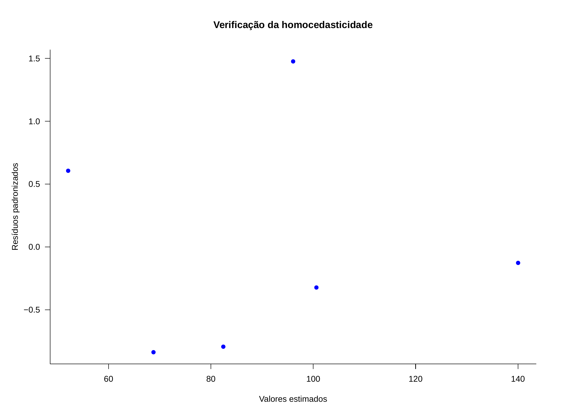

```{r, echo=FALSE, include=FALSE}
colFmt <- function(x,color) {
  
  outputFormat <- knitr::opts_knit$get("rmarkdown.pandoc.to")
  
  if(outputFormat == 'latex') {
    ret <- paste("\\textcolor{",color,"}{",x,"}",sep="")
  } else if(outputFormat == 'html') {
    ret <- paste("<font color='",color,"'>",x,"</font>",sep="")
  } else {
    ret <- x
  }

  return(ret)
}

#uso>>>> `r colFmt("REG",'red')`, 


```

<style>
.small-equation80 {
  font-size: 80%; 
}
</style>

<style>
.small-equation70 {
  font-size: 70%; 
}
</style>


<style>
.small-equation60 {
  font-size: 60%; 
}
</style>


<style>
.small-equation40 {
  font-size: 40%; 
}
</style>


<style>
blockquote {
  background-color: #c0c0c0; /* Fundo cinza claro */
  border-left: 4px solid #21130d; /* Barra lateral */
  padding: 10px;
  margin: 10px 0;
  border-radius: 4px; /* Bordas arredondadas */
  <!-- font-style: normal; /* Remove o itálico padrão */ -->
  color: #21130d; /* Cor do texto */
}
</style>


```{r , echo = FALSE, include=FALSE}
library(texPreview)
library(kableExtra)
library(knitr)
library(ggplot2)
knitr::opts_chunk$set(echo = TRUE)

```


# Introdução à Correlação Linear de Pearson e Regressão Linear Simples</span>


---


<figure class="image">
  <figcaption style="font-size: 20px;">>"Essentially, all models are wrong,but some are useful [...]" (George Edward Pelham Box, 1919 - 2013)</figcaption>
</figure>


---

## Contexto histórico


<figure class="image">
  <figcaption style="font-size: 20px;">>Sir Francis Galton (1822-1911), antropólogo e meteorologista inglês, propôs no artigo escrito em conjunto com J. D. Hamilton Dickson (*Family Likeness in Stature*) apresentado à *Royal Society of London* em 21 de janeiro de 1886, expressar por uma função uma relação que observou entre estaturas de pais e seus filhos e descendentes.</figcaption>
</figure>

---

<br><br><br>

Nesse artigo, Galton verificou que, embora houvesse uma tendência de que pais mais altos tivessem filhos altos (e pais mais baixos, filhos mais baixos), a estatura média de crianças nascidas de pais com dada altura tendia a **regredir** à altura média da população como um todo. Nas palavras de Galton isso seria uma **regressão à mediocridade**: pais mais altos que a estatura média têm filhos mais baixos que eles 

<br>

>"Each peculiarity in a man is shared by his kinsman but, on the average, in a less degree[...]"


---


<br><br>

<figure class="image">

<figcaption style="font-size: 20px;">>A *Lei da Regressão* de Galton foi referendada por Karl Pearson (*On the Laws of Inheritance*, 1903) poucos anos depois, quando analisou os dados de milhares de registros de estatura, tamanho do antebraço e da palma.</figcaption>
</figure>

---


Em latim o prefixo _co_ remete ao significado _colaboração_ , _união_ ou até _simultaneidade_.  Correlação significa, portanto, uma relação mútua entre dois termos, uma correspondência.  


>Em *Correlations and their Measurement, chiefly from Anthropometric Data*, apresentado à *Royal Society of London* em dezembro de 1888, ele observou aquilo que viria a conceituar como *co-relação* ou *correlação de estrutura*.

>Galton afirmou ao analisar o tamanho do braço com o da perna de um indivíduo que que dois órgãos são ditos serem correlacionados quando a variação de um é acompanhada, na média, pela variação para mais ou menos do outro:

- se a correlação fosse alta, uma pessoa com um braço longo teria também uma perna longa;
- se a correlação fosse moderada, o comprimento da perna não seria tão longo e,
- se não houvesse correlação, o comprimento de sua perna seria o comprimento médio desse membro na população.   

---

<br>


<figure class="image">

<figcaption style="font-size: 20px;">>"...Assim, ele naturalmente atingiu uma linha de regressão reta com variabilidade constante para todas as matrizes de um caractere para um dado caractere de um segundo. Talvez fosse melhor para o progresso do cálculo correlacional que este simples caso especial fosse exposto primeiro: é tão facilmente compreendido pelo iniciante[...]"</figcaption>  
</figure>

---

<br>

<figure class="image">
  
  <figcaption style="font-size: 20px;">>Houve um momento que Johann Carl Friedrich Gauss considerou sua descoberta (1795) da regressão estatística como "trivial". O método dos mínimos quadrados parecia tão óbvio para Carl Friedrich Gauss que ele imaginou não ter sido o primeiro a usá-lo. Ele  não declarou publicamente sua descoberta até alguns anos depois ( _Theoria motus corporum coelestium in sectionibus conicis solem ambientium_, 1809), quando seu contemporâneo Adrien-Marie Legendre ( _Nouvelles méthodes pour la détermination des orbites des comètes_, 1805) publicou o método. Quando Gauss sugeriu que ele o havia usado antes deu-se partida a uma das mais famosas disputas de antecedência na história da ciência. Gauss acabaria recebendo a maior parte do crédito como fundador da regressão, mas não sem uma briga.</figcaption>
</figure>


---

## Conceitos

<br>	

Em estatística, a expressão _correlação_ faz referência à relação existente entre variáveis, digamos *X* e *Y* que pode assumir diferentes padrões: linear ou não linear (quadrática, cúbica, exponencial ...). 

<br>

A _correlação_ existente entre valores de uma mesma variável, digamos *X* (em diferentes momentos de tempo $(X_{t_i}, X_{t_j})$ ou espaço $(X_{s_i}, X_{s_j})$ é denominada _autocorrelação_.

---

### Correlação linear _versus_ regressão

<br><br>

> a análise de correlação tem como principal objetivo medir a força ou o grau de associação linear entre as duas variáveis.

> na análise de regressão linear o objetivo primário é expressar matematicamente uma relação linear entre duas variáveis de modo a possibilitar obter estimativas de uma para um valor não amostrado da outra, contruir intervalos de confiança para essas estimativas e testar variadas      hipóteses.  

---

### Correlação _versus_ causação

<br>

Embora a análise de regressão lide com o comportamento de uma variável em relação a outra(s), isso não implica necessariamente em causação. É preciso levar em conta que uma relação estatística *por si só* não implica logicamente uma causação. Para atribuir uma relação de causação deve-se lançar mão de considerações *a priori* ou teóricas. 


>Considerem a correlação existente entre a altura dos alunos de 6 a 17 anos e as notas médias anuais obtidas em matemática. Naturalmente não é o incremento que os alunos sofrem em suas alturas na fase de crescimento que causa a melhora nas notas; mas sim processos biológicos e comportamentais que resultam em melhorias na capacidade cognitiva.

---

## Diagrama de dispersão

<br>


<figure class="image">
  
  <figcaption style="font-size: 20px;">>Descrito pela primeira vez por Francis Galton ( _Regression Towards Mediocrity in Hereditary Stature_ , 1886), os diagramas de dispersão ( _scatterplot_ ) ou gráficos de dispersão são representações de dados de duas (tipicamente) ou mais variáveis que são organizadas em um gráfico. O gráfico de dispersão utiliza coordenadas cartesianas para exibir valores de um conjunto de dados. Os dados são exibidos como uma coleção de pontos, cada um com o valor de uma variável determinando a posição no eixo horizontal e o valor da outra variável determinando a posição no eixo vertical (em caso de duas variáveis).</figcaption>
</figure>


---

>Considerem as simulações da dispersão de alguns valores de duas variáveis $X$ e $Y$. Vemos que em alguns casos nos parece ser razoável tentar exprimir qualquer tipo de relação entre os valores de $X$ e $Y$; todavia, há situações onde claramente  vemos alguma forma de relação.  

Essas formas bem poderiam ser expressas, aproximadamente, por diferentes funções como:

- lineares (retas) ou
- não lineares (curvas).

Vemos também que essas formas de associação entre os valores de $X$ e $Y$ podem ser diretas ou inversamente proporcionais ("positiva" ou "negativa"). Estamos particularmente interessados em quantificar o grau da relação dos valores de $X$ e $Y$ nos padrões lineares. 

(SIMULADOR 1)

---

## Coeficiente de correlação linear de Pearson

>O mais importante aspecto da correlação linear é a medida de sua intensidade, expressa pelo coeficiente de correlação linear (ou coeficiente de correlação produto momento de *Pearson*).


<figure class="image">
  
</figure>
  <figcaption style="font-size: 20px;">A notação adotada para o coeficiente de correlação linear de Pearson depende dos dados analisados: se são dados amostrais ou populacionais:
- população: pela letra grega $\rho$  ("rô")
- amostra: pela letra latina *r*</figcaption>

---

<br>	

Cálculo do coeficiente de correlação amostral $r$:

<br>	

$$r  =  \frac{\sum _{i=1}^{n}{x}_{i} \cdot {y}_{i} - \frac{\sum _{i=1}^{n}{x}_{i}\sum _{i=1}^{n}{y}_{i}}{n}}{\sqrt{\left(\sum _{i=1}^{n}{x}_{i}^{2}-\frac{{\left(\sum _{i=1}^{n}{x}_{i}\right)}^{2}}{n}\right)\cdot \left[\sum_{i=1}^{n}{y}_{i}^{2}-\frac{{\left(\sum _{i=1}^{n}{y}_{i}\right)}^{2}}{n}\right]}}$$

<br>

em que $x_{i}$: é o iésimo valor observado da variável *X*, $y_{i}$: é o iésimo valor observado da variável *Y*, $n$ é o número de pares de valores observados.


---

<br>	

Ou, simplificadamente:

<br>	

$$
r = \frac{{s}_{xy}}{\sqrt{{s}_{xx}\cdot {s}_{yy}}}
$$

<br> 

em que $S_{xy} = \sum _{i=1}^{n} x_{i}y_{i}$ - $\frac{\sum _{i=1}^{n}x_{i}\cdot\sum _{i=1}^{n}y_{i}}{n}$, $S_{xx} = \sum _{i=1}^{n} x_{i}^{2}$ - $\frac{(\sum _{i=1}^{n} x_{i})^{2}}{n}$, ${S}_{yy}=\sum _{i=1}^{n}y_{i}^{2}$ - $\frac{(\sum _{i=1}^{n} y_{i})^{2}}{n}$ e $n$ é o número de pares de valores observados. 


---

<br>	

- o coeficiente de correlação linear de Pearson tem uma faixa limitada de variação: $-1 \le r \le 1$,

- é simétrico; isto é, a correlação linear observada entre $X$ e $Y$ é a mesma que a medida entre as variáveis $Y$ e $X$,

- é apenas uma medida da associação linear entre duas variáveis e, portanto, não tem sentido usá-lo na quantificação de relações que não o sejam,

- a possibilidade de uma **correlação linear negativa** virá do resultado do *numerador* ($S_{xy}$), pois no denominador temos duas somas de quadrados,

- o coeficiente de correlação mede apenas a **intensidade** das relações lineares entre $x$ e $y$ e não estabelece *per si* nenhuma relação de causação. 

---

<br>	
<br>	
<br>	


- se $r>0$ dizemos que há uma relação linear positiva entre as variáveis estudadas: para um incremento na primeira variável observa-se também um incremento na segunda;  
- se $r<0$ a relação linear é negativa: um incremento em uma das variáveis é acompanhado por um decremento na outra; e, 
- se $r=0$, então não há uma **relação linear** entre as variáveis consideradas. 

---

O cálculo do coeficiente de correlação linear de Pearson assemelha-se a uma _análise de variância_

<figure class="image">
  
</figure>


$$
y - \stackrel{-}{y} = (\hat{y} - \stackrel{-}{y})  + (y - \hat{y})
$$

---

<br>

Elevando-se ao quadrado ambos os termos, para todos os valores observados, teremos:

$$ 
\sum _{i=1}^{n} ({y_{i}} - \stackrel{-}{y_{i}})^{2} = 
\sum _{i=1}^{n} (\hat{y_{i}} - \stackrel{-}{y_{i}})^{2}   + 
\sum _{i=1}^{n} (y_{i} - \hat{y_{i}})^{2}
$$


A quantidade à esquerda mede a variação total dos *y* (*Soma de quadrados total*); à direita temos a *Soma de quadrados da regressão* e a *Soma de quadrados dos resíduos* e,

$$
r=\sqrt{\frac{\sum _{i=1}^{n} (\hat{y_{i}} - \stackrel{-}{y_{i}})^{2}}{\sum _{i=1}^{n} ({y_{i}} - \stackrel{-}{y_{i}})^{2}}}
$$


A definição acima de $r$ nos diz que $100.r^{2}$ é a *percentagem da variação total* dos $y$ que está sendo explicada por sua regressão linear com $x$. 

---

> Exemplo 1: Um jornal deseja verificar a eficácia de seus anúncios na venda de carros usados e para isso realizou um levantamento de todos os seus anúncios e informações dos resultados obtidos pelas empresas que o contrataram e dele extraiu uma pequena amostra. A tabela a seguir mostra o número de anúncios e o correspondente número de veículos vendidos por 6 companhias que usaram apenas este jornal como veículo de propaganda. Existe alguma relação linear entre as variáveis? Construa o diagrama de dispersão e calcule o coeficiente de correlação linear.  


<center>
<div class="small-equation80">

```{r eval=knitr::is_html_output(), results = "asis", echo = FALSE, message = FALSE}

tex2markdown <- function(texstring) {
  writeLines(text = texstring,
             con = myfile <- tempfile(fileext = ".tex"))
  texfile <- pandoc(input = myfile, format = "html")
  cat(readLines(texfile), sep = "\n")
  unlink(c(myfile, texfile))
}

textable <- "
\\begin{table}[h]
\\centering
\\caption*{Quadro de dados da quantidade de carros vendidos por 6 empresas distintas pela quantidade de anúncios feitos }
\\begin{tabular}{|c|c|c|}
\\hline 
Companhia & Anúncios feitos (X) & Carros vendidos (Y) \\\\
\\hline 
A & 74 & 139 \\\\
\\hline 
B & 45 & 108 \\\\
\\hline 
C & 48 & 98 \\\\
\\hline 
D & 36 & 76 \\\\
\\hline 
E & 27 & 62 \\\\
\\hline 
F & 16 & 57 \\\\
\\hline 
\\end{tabular}  
\\end{table}
"

tex2markdown(textable)

```
</div>
</center>


---

<br>

<figure class="image">
  
</figure>

---

<center>

<br>


```{r eval=knitr::is_html_output(), results = "asis", echo = FALSE, message = FALSE}

tex2markdown <- function(texstring) {
  writeLines(text = texstring,
             con = myfile <- tempfile(fileext = ".tex"))
  texfile <- pandoc(input = myfile, format = "html")
  cat(readLines(texfile), sep = "\n")
  unlink(c(myfile, texfile))
}


textable <- "
\\begin{table}[h]
\\caption*{Quadro para cálculo do coeficiente de correlação linear (\\$r\\$)}
\\begin{tabular}{|c|c|c|c|c|c|}
\\hline 
Companhia & Anúncios (X) & Carros vendidos (Y) & $x_{i}*y_{i}$ & $x_{i}^2$ & $y_{i}^2$ \\\\
\\hline 
A & 74 & 139 & 10286 & 5476 & 19321 \\\\ 
\\hline 
B & 45 & 108 & 4860 & 2025 & 11664 \\\\ 
\\hline 
C & 48 & 98 & 4704 & 2304 & 9604 \\\\ 
\\hline 
D & 36 & 76 & 2736 & 1296 & 5776 \\\\ 
\\hline 
E & 27 & 62 & 1674 & 729 & 3844 \\\\ 
\\hline 
F & 16 & 57 & 912 & 256 & 3249 \\\\ 
\\hline 
Totais & 246 & 540 & 25172 & 12086 & 53458 \\\\ 
\\hline 
\\end{tabular}
\\end{table}
"

tex2markdown(textable)
```

</center>

---

Sendo $n= 6$ temos:

$$
S_{xy} = \sum _{i=1}^{n} x_{i}y_{i} - \frac{\sum _{i=1}^{n}x_{i}\cdot\sum _{i=1}^{n}y_{i}}{n} = 25172 - \frac{246 \cdot 540}{6} = 3032\\
S_{xx} = \sum _{i=1}^{n} x_{i}^{2} - \frac{(\sum _{i=1}^{n} x_{i})^{2}}{n} = 12086 - \frac{246^2}{6} = 2000\\
{S}_{yy} = \sum _{i=1}^{n}y_{i}^{2} - \frac{(\sum _{i=1}^{n} y_{i})^{2}}{n}=   53458 - \frac{540^2}{6} = 4858
$$


Portanto: 

$$
r = \frac{{s}_{xy}}{\sqrt{{s}_{xx}\cdot {s}_{yy}}} = \frac{3032}{\sqrt{2000 \cdot 4858}} = 0,9727
$$

---


## Teste de hipóteses para a correlação linear na população


<br>

>O coeficiente de correlação populacional $\rho$ sempre é estimado a partir do coeficiente de correlação amostral $r$. Para se realizar inferências concernentes a $\rho$ a partir de $r$ temos que ter o conhecimento da distribuição amostral dos coeficientes de correlação linear $r$. 

Para se testar a existência de correlação na população um teste de hipóteses na estrutura seguinte (bilateral) pode ser proposto: 

$$
\begin{cases}
	H_{0}:\rho = 0 \hspace{0.1cm} \text{, ie. a correlação linear entre X e Y é nula} \\
	H_{1}:\rho \ne 0 \hspace{0.1cm} \text{, ie. a correlação linear entre X e Y não é nula} \\
\end{cases}
$$


---

<br>
<br>

Lembrando que um *teste de hipóteses* guarda uma certa semelhança a um julgamento: caso não haja indício algum que comprove a culpa do acusado ele é declarado inocente. 

Seguindo essa analogia, o *indício ou evidência* que nos permitirá rejeitar a hipótese nula virá de uma *evidência amostral*. 

A quantificação da relevância da *evidência amostral* virá de uma estatística calculada (${t}_{calc}$) a partir do coeficiente de correlação amostral $r$ e o tamanho amostral $n$, que será comparado a um valor limite tabelado ($t_{tab}$) da correspondente distribuição da variável aleatória $T$:

---

A estatística do teste é:


$$
{t}_{calc}=\frac{r\cdot\sqrt{n-2}}{\sqrt{1-{r}^{2}}}\\
T \sim t_{(n-2)}
$$


Rejeita-se a hipótese nula ($H_{0}$) se o valor da estatística for tão extremo que se verifique: 

$$
t_{calc} \le {t}_{tab[\frac{\alpha }{2};\left(n-2\right)]}\\
\text{ou}\\
t_{calc} \ge {t}_{tab[1-\frac{\alpha }{2};\left(n-2\right)]}
$$
em que $t_{tab}$ é o quantil associado na distribuição "t" de Student (William Sealy Gosset, 1876-1937)  ao *nível de significância* pretendido ($\alpha$) com $(n-2)$ graus de liberdade. O número de graus de liberdade irá determinar qual curva da família dessa distribuição será utilizada, por essa razão, as tabelas apresentam-se individualizadas por nível de significância e graus de liberdade.    

---

As curvas da família "t" possuem simetria em relação a um eixo vertical central. O valor tabelado dessa estatística acha-se associado à área sob ela pois é uma função densidade de probabilidade: a totalidade da área sob essa curva é igual a 1 (probabilidade de 100\%)

Assim, se consultarmos em uma tabela o valor "t" para um nível de significância $\alpha$ qualquer, correspodente assim a um nível de confiança de ($1-\alpha$), qualquer veremos que ele será igual, *em módulo*, ao valor "t" no outro extremo dessa curva.

Por essa razão muitas tabelas apresentam valores dessa estatística sob os títulos de *monocaudal* ou *bicaudal* pois estão apresentando os valores para um determinado nível de significância ($\alpha$): área sob a curva, situado apenas em um lado (ou *subdividido* nos dois ramos da curva nas tabelas chamadas "bilaterais").

O teste de hipótese que iremos realizar é um *teste bilateral*; assim, o gráfico apropriado para se decidir pela rejeição ou não da hipótese nula assume a forma mostrada nessa simulação.

(SIMULADOR 2 COM t)


---

### Outros testes de hipóteses sobre a correlação linear na população


Outros tipos de testes só podem ser realizados através da estatística $\zeta$ (zeta) de Fisher. A transformação $Z$ proposta por Fisher produz uma estatística que possui distribuição aproximadamente Normal. Para essa situação a estatística a ser utilizada é dada por:

$$
\zeta = \frac{1}{2}.ln\frac{(1+r)}{(1-r)}
$$


que possui uma distribuição aproximadamente Normal, com média e desvio padrão:

$$
\mu_{\zeta} =  \frac{1}{2}.ln\frac{(1+\rho_{0})}{(1-(\rho_{0})} \text{    e    } 
\sigma_{\zeta} = \frac{1}{\sqrt{n-3}}.
$$ 
Transformando-se $\zeta$ em unidades padrão (pela subtração de $\mu_{\zeta}$ e divisão por $\sigma_{\zeta}$), chega-se à estatística tabelada $z = (Z - \mu_{\zeta}) . \sqrt{n-3}$.


---

<br><br><br>

> Exemplo 2: Faça o teste de hipóteses para a correlação linear $\rho$ a partir da correlação amostral $r$ calculada no exercício dos anúncios de veículos, sob um nível de significância ($\alpha$) de 0,05.

---


No exercício referido obtivemos um valor para a correlação linear de Pearson de $r=0,9727$. A partir desse valor podemos calcular o valor de nossa estatística ${t}_{calc}$ para o teste:  


$$
{t}_{calc}=\frac{r\cdot\sqrt{n-2}}{\sqrt{1-{r}^{2}}} = 8,38
$$


Rejeitaremos a hipótese nula ($H_{0}$) se:

$$
t_{calc} \le {t}_{tab[\frac{\alpha }{2};\left(n-2\right)]}\\
\text{ou}\\
t_{calc} \ge {t}_{tab[1-\frac{\alpha }{2};\left(n-2\right)]}
$$

Da tabela extraímos o valor de nossa estatística de comparação a um nível de significância $\alpha=5\%$ e, para um tamanho amostral $n=6$, temos como graus de liberdade $n-2=4$ ($t_{tab}=2,776$). 
Vê-se que o valor calculado da estatística "t" encontra-se além dos limites estabelecidos pela estatística de comparação ($t_{tab}$) para um nível de significância de  $\alpha=5\%$

(SIMULADOR 2 COM t)

---

## Regressão linear simples

---

### Introdução

<br><br><br>

Considerem a proposição de John Maynard Keynes para a relação entre o consumo e a renda, onde ele postulava haver uma relação positiva entre ambos: uma mudança em uma das variáveis iria alterar a outra. Seu modelo funcional para essa relação, com $Y$ sendo as despesas de consumo e $X$ a renda, é:

$$
Y = \alpha + \beta \cdot X
$$


Esse modelo admite que a verdadeira relação entre $Y$ e $X$ seja uma linha reta e que a observação $Y$ para cada nível de $X$ seja uma variável aleatória. Assim, o valor esperado de $Y$ para cada valor de $X$ é:


$$
Y_i = E(Y | X_i) = \alpha + \beta \cdot X_i
$$


---

<br><br>

Nesse modelo, $\alpha$ e $\beta$ são parâmetros desconhecidos da relação estabelecida entre as duas populações:

- $\alpha$: intercepto (um consumo mínimo é observado mesmo nas situações em que a renda é nula, em razão de programas de assistência governamental).
- $\beta$: inclinação (a propensão média do crescimento do consumo com o incremento da renda).

É um modelo puramente teórico, de limitada aplicabilidade prática, pois pretende exprimir por uma relação exata (*determinística*) o consumo e a renda, quando se sabe que grande parte das relações entre duas variáveis não são exatas.

---

<br><br><br>

Entretanto, ao se fixar um único valor para a variável explicativa, observa-se que há flutuações nos valores observados da variável explicada. Essa inexatidão, esse desvio do valor observado $Y_i$ em relação ao seu valor esperado, pode ser expresso da seguinte maneira:

$$
\varepsilon_i = Y_i - E(Y | X_i)
$$

em que $E(Y | X_i)$ é denominado componente sistemático ou determinístico, representando o *gasto médio* de todas as famílias com um mesmo nível de renda, e $\varepsilon_i$ é denominado termo de erro ou distúrbio estocástico. O termo de erro pode ser admitido como um *substituto* para todas as demais variáveis omitidas ou negligenciadas no modelo e que podem afetar $Y$.

---


Um modelo de regressão pode ser *linear* nas variáveis ou nos parâmetros.

>Uma função $Y = f(X)$ é dita linear em $X$ se $X$ tiver um expoente igual a 1 e não estiver multiplicado ou dividido por outra variável.

- a função $Y = \alpha + \beta \cdot X$ é dita linear em $\beta$ se $\beta$ tiver um expoente de 1 e não estiver multiplicado ou dividido por qualquer outro parâmetro.

>A função $E(Y | X) = \alpha + \beta \cdot X^2$ não é linear em $X$, pois $X$ está elevado ao quadrado.

- mas é linear nos parâmetros, pois, para $X = 3$, temos $E(Y | X = 3) = \alpha + 9 \cdot \beta$.


Das duas interpretações de linearidade, *a linearidade nos parâmetros* é a relevante para a formulação da teoria da regressão (a linearidade nas variáveis pode ou não ocorrer).

No contexto deste curso, o modelo será linear tanto nos parâmetros quanto na variável.

---

<br><br>

Admitindo-se que $E(Y | X_i)$ seja linear em $X_i$, podemos reescrever o modelo original na forma que incorpora o erro aleatório:

$$
Y_i = E(Y | X_i) = \alpha + \beta \cdot X_i \\
Y_i = E(Y | X_i) + \varepsilon_i \\
Y_i = \alpha + \beta \cdot X_i + \varepsilon_i
$$
em que  $\alpha$ é o intercepto da reta, representando o valor esperado da variável $Y$ quando $X = 0$, $\beta$ é  a inclinação da reta, representando a variação esperada de $Y$ para um aumento unitário em $X_i$, ($\alpha + \beta \cdot X_i$) é a parte explicada pelo modelo e $\varepsilon_i$ é o termo de erro ou distúrbio estocástico.

---

<br><br>

Nessa função:

- $Y$: variável dependente (também chamada de explicada, prevista, regressando, resposta, endógena, saída, controlada) — aqui, representando o *consumo*.
- $X$: variável independente (também chamada de explicativa, previsora, regressor, estímulo, exógena, entrada, controle) — aqui, representando a *renda*.

Se o termo de erro $\varepsilon_i$ representa todas aquelas variáveis omitidas no modelo (mas que, coletivamente, afetam $Y$), **por que não formular um modelo de regressão com o máximo de variáveis possíveis?**

---

<br><br>

- **Embasamento teórico vago**: A teoria existente suporta com certeza apenas algumas variáveis; o termo de erro $\varepsilon_i$ serve como um substituto para todas as variáveis excluídas no modelo.
- **Princípio da parcimônia**: Um modelo mais simples que explique bem a relação é preferível.
- **Forma funcional equivocada**: Em gráficos de dispersão, é mais fácil inferir a relação entre duas variáveis do que com muitas.
- **Limitação na quantidade de observações**: Muitas variáveis exigem mais observações para garantir a precisão do modelo.

---

<br><br>

Sendo inviável, e muitas vezes impossível, construir um *modelo populacional*, focamos o estudo em uma parte dessa população: uma *amostra*.

Um modelo funcional estimado com base em uma *amostra* apresenta **estimativas** dos parâmetros da função que descreve a população de origem (os quais são desconhecidos). Por isso, adota-se uma notação diferente para a **função de regressão amostral** em sua forma *estocástica*:

$$
\hat{Y} = a + b \cdot X
$$

em que $\hat{Y}$ é um estimador de $E(Y | X)$, $a$ é uma estimativa do parâmetro $\alpha$ e $b$ é uma estimativa do parâmetro $\beta$.

---

<br><br>

Para um determinado valor de $X = x_i$, temos uma observação amostral $Y = y_i$ que pode ser expressa pela **função de regressão amostral** como:

$$
y_i = \hat{y}_i + e_i \\
y_i = a + b \cdot x_i + e_i
$$

em que $\hat{y}_i$ é o valor estimado de $Y_i$ para um determinado $X_i$, $e_i$ é o erro amostral, que representa a diferença entre o valor observado $y_i$ e o valor estimado $\hat{y}_i$.

>Mas, como estimar $a$ e $b$?


---


### Método dos mínimos quadrados

<br>
	
Na literatura estatística há vários métodos de estimação dos parâmetros de um modelo de regressão linear, dentre os quais:

- Método dos momentos (creditado a Karl Pearson-1895, Ronald Aylmer Fisher-1925, Neyman e Egon Pearson-1928, publicado por Lars Peter Hansen-1982);
- Método da máxima verossimilhaça (creditado a Johann Carl Friedrich Gauss, Pierre-Simon Laplace, Thorvald N. Thiele e Francis Ysidro Edgeworth, popularizado por Ronald Aylmer Fisher, 1912-1922); e,
- Método dos mínimos quadrados (creditado a Johann Carl Friedrich Gauss-1795, publicado por Adrien-Marie Legendre-1805, Friedrich Robert Helmert-1872 ).

---


#### Contexto histórico

<br>


Desde tempos remotos as pessoas têm se interessado pelo problema de escolher o melhor valor único (médio) para resumir as informações fornecidas por várias observações, cada uma sujeita a erro. 

O problema de se estimar as constantes na equação da linha reta que melhor se ajusta a três ou mais pontos não colineares no plano (x, y) cujas coordenadas são pares de valores associados de duas variáveis relacionadas: $X$ e $Y$ remonta a Galileu Galilei (1632). 

>Credita-se Johann Carl Friedrich Gauss como o desenvolvedor das bases fundamentais do Método dos mínimos quadrados, em 1795, quando Gauss tinha apenas dezoito anos. 

Mas o Método dos mínimos quadrados foi publicado pela primeira vez por por Adrien-Marie Legendre (1752-1833) em 1805: *Nouvelles méthodes pour la détermination des orbites des comètes*.

---

<br>


Alguns demonstradores:  


- Robert Adrain (1775-1843) em 1808: *Research concerning the probabilities of the errors which happen in making observations*   
- Johann Carl Friedrich Gauss (1777-1855) em 1809: *Theoria motus corporum coelestium* 
- Pierre-Simon Laplace (1749-1827) em 1810: *Theorie analytique des Probabilite* - Johann Carl Friedrich Gauss (1777-1855) em 1823: *Theoria combinationis observationum erroribus obnoxiae*
- James Ivory (1765-1842) em 1825: *On the Method of the Least Squares*.

---


Para o modelo $y_{i}= a + b.x_{i}$ na simulação mostrada:

- **problema**: determinar as constantes $a$ e $b$ da equação de uma linha reta que melhor se ajusta a três ou mais pontos não colineares
- **solução**: minimizar a soma dos quadrados dos resíduos como mostrado na simulação.

$$
\sum _{i=1}^{n}{e}_{i}^{2} \rightarrow 0
$$

A grande vantagem do método dos mínimos quadrados é que ele é um método puramente geométrico, e não faz nenhuma suposição sobre a distribuição dos dados ou dos erros (resíduos). 

Em outras palavras, ele é aplicado sem se preocupar com a natureza probabilística dos erros (resíduos). O objetivo é apenas ajustar a melhor reta possível para um conjunto de pontos de dados


(SIMULADOR 3)

---

<br>

Matematicamente, a partir da igualdade: 

$$
\sum _{i=1}^{n} [ y_{i} - \hat{y} ]^{2} = \sum _{i=1}^{n}{\left[yi-\left(a{x}_{i}+b\right)\right]}^{2}
$$


a solução passar por derivar-se em relação a: $a|b \text{  fixo}$, e em relação b: $b|a  \text{    fixo}$, igualando-se a *zero*: 

$$
\frac{\delta }{\delta a}\sum _{i=1}^{n}{\left[yi-\left(a{x}_{i}+b\right)\right]}^{2}= 2 \cdot \sum _{i=1}^{n}\left({y}_{i}-a{x}_{i}-b\right)\left(-{x}_{i}\right)=0 \\
\frac{\delta }{\delta b}\sum _{i=1}^{n}{\left[yi-\left(a{x}_{i}+b\right)\right]}^{2}= 2\cdot \sum _{i=1}^{n}\left({y}_{i}-a{x}_{i}-b\right)\left(-1\right)=0 
$$

---

<br>
<br>


Após algumas manipulações algébricas obtemos as seguintes expressões para as estimativas: $a$ e $b$:


$$
b\cdot n+a\cdot \sum _{i=1}^{n}{x}_{i}=\sum _{i=1}^{n}{y}_{i}
$$

$$
b\cdot \sum _{i=1}^{n}{x}_{i}+a\cdot \sum _{i=1}^{n}{x}_{i}^{2}=\sum _{i=1}^{n}{x}_{i}\cdot {y}_{i}
$$


---

<br>
<br>

chegando-se ao **estimador** para *b*:

$$
b=\frac{n\cdot \left(\sum _{i=1}^{n}{x}_{i}{y}_{i}\right)-\sum _{i=1}^{n}{x}_{i}\sum _{i=1}^{n}{y}_{i}}{n\cdot \sum _{i=1}^{n}{x}_{i}^{2}-{\left(\sum _{i=1}^{n}{x}_{i}\right)}^{2}}
$$

e ao **estimador** para *a*:

$$
a=\frac{\left(\sum _{i=1}^{n}{x}_{i}^{2}\right)\cdot \left(\sum _{i=1}^{n}{y}_{i}\right)-\left(\sum _{i=1}^{m}{x}_{i}{y}_{i}\right)\cdot \left(\sum _{i=1}^{n}{x}_{i}\right)}{n\cdot \left(\sum _{i=1}^{n}{x}_{\stackrel{.}{i}}^{2}\right)-{\left(\sum _{i=1}^{n}{x}_{i}\right)}^{2}}
$$


---


Se definirmos $S_{xy}$ e $S_{xx}$ como sendo: 

$$
S_{xy} = \sum _{i=1}^{n} x_{i}y_{i} - \frac{\sum _{i=1}^{n}x_{i}\cdot\sum _{i=1}^{n}y_{i}}{n}
$$

e

$$
S_{xx} = \sum _{i=1}^{n} x_{i}^{2} - \frac{(\sum _{i=1}^{n} x_{i})^{2}}{n}
$$
então podemos escrever:

$$
b = \frac{S_{xy}}{S_ {xx}}\\
\text{e} \\
a = \stackrel{-}{y} - b\cdot\stackrel{-}{x}
$$

---

Uma vez que 


$$
\stackrel{-}{y}=\frac{\sum _{i=1}^{n}{y}_{i}}{n}\\
\text{e}\\
\stackrel{-}{x}=\frac{\sum _{i=1}^{n}{x}_{i}}{n}
$$

o estimador **$a$** pode ser reescrito na forma:

$$
a = \frac{\sum _{i=1}^{n}{y}_{i} - b . \sum _{i=1}^{n}{x}_{i}}{n}
$$

---


> Exemplo 3: Um jornal deseja verificar a eficácia de seus anúncios na venda de carros usados e para isso realizou um levantamento de todos os seus anúncios e informações dos resultados obtidos pelas empresas que o contrataram e dele extraiu uma pequena amostra. A tabela abaixo mostra o número de anúncios e o correspondente número de veículos vendidos por 6 companhias que usaram apenas este jornal como veículo de propaganda. Obtenha a equação de regressão linear simples e estime o número de carros vendidos para um volume de 70 anúncios?  

<center>
<div class="small-equation80">


```{r eval=knitr::is_html_output(), results = "asis", echo = FALSE, message = FALSE}

tex2markdown <- function(texstring) {
  writeLines(text = texstring,
             con = myfile <- tempfile(fileext = ".tex"))
  texfile <- pandoc(input = myfile, format = "html")
  cat(readLines(texfile), sep = "\n")
  unlink(c(myfile, texfile))
}

textable <- "
\\begin{table}[h]
\\centering
\\caption{Quadro de dados da quantidade de carros vendidos por 6 empresas distintas em função da quantidade de anúncios feitos}
\\begin{tabular}{|c|c|c|}
\\hline 
Companhia & Anúncios feitos (X) & Carros vendidos (Y) \\\\ 
\\hline 
A & 74 & 139 \\\\ 
\\hline 
B & 45 & 108 \\\\ 
\\hline 
C & 48 & 98 \\\\ 
\\hline 
D & 36 & 76 \\\\ 
\\hline 
E & 27 & 62 \\\\ 
\\hline 
F & 16 & 57 \\\\ 
\\hline 
\\end{tabular}
\\end{table}
"

# Chama a função para converter e exibir a tabela
tex2markdown(textable)

```

</div>

</center>

---


<center>

<br>


```{r eval=knitr::is_html_output(), results = "asis", echo = FALSE, message = FALSE}

tex2markdown <- function(texstring) {
  writeLines(text = texstring,
             con = myfile <- tempfile(fileext = ".tex"))
  texfile <- pandoc(input = myfile, format = "html")
  cat(readLines(texfile), sep = "\n")
  unlink(c(myfile, texfile))
}

textable <- "
\\begin{table}[h]
\\centering
\\caption{Quadro para cálculo das estimativas $a$ e $b$ dos parâmetros do modelo}
\\begin{tabular}{|c|c|c|c|c|c|}
\\hline 
Companhia & Anúncios ($x$) & Carros vendidos ($y$) & $x_{i}.y_{i}$ & $x_{i}^2$ & $y_{i}^2$ \\\\ 
\\hline 
A & 74 & 139 & 10286 & 5476 & 19321 \\\\ 
\\hline 
B & 45 & 108 & 4860 & 2025 & 11664 \\\\ 
\\hline 
C & 48 & 98 & 4704 & 2304 & 9604 \\\\ 
\\hline 
D & 36 & 76 & 2736 & 1296 & 5776 \\\\ 
\\hline 
E & 27 & 62 & 1674 & 729 & 3844 \\\\ 
\\hline 
F & 16 & 57 & 912 & 256 & 3249 \\\\ 
\\hline 
Totais & 246 & 540 & 25172 & 12086 & 53458 \\\\ 
\\hline 
Valor médio & 41 & 90 &  &  &  \\\\ 
\\hline 
\\end{tabular}
\\end{table}
"

# Chama a função para converter e exibir a tabela
tex2markdown(textable)

```  

</center>

---

<br>

Sendo $n= 6$, $\stackrel{-}{y}= 90$ e $\stackrel{-}{x} = 41$:

$$
S_{xy} = \sum _{i=1}^{n} x_{i}y_{i} - \frac{\sum _{i=1}^{n}x_{i}\cdot\sum _{i=1}^{n}y_{i}}{n} = 25172 - \frac{246 \cdot 540}{6} = 3032 \\
S_{xx} = \sum _{i=1}^{n} x_{i}^{2} - \frac{(\sum _{i=1}^{n} x_{i})^{2}}{n} = 12086 - \frac{246^2}{6} = 2000 \\
{S}_{yy} = \sum _{i=1}^{n}y_{i}^{2} - \frac{(\sum _{i=1}^{n} y_{i})^{2}}{n}=   53458 - \frac{540^2}{6} = 4858
$$

---

<br>

As estimativas dos parâmetros do modelo serão:

$$
b = \frac{S_{xy}}{S_ {xx}} = \frac{3032}{2000} = 1,5160
$$

e

$$
a = \stackrel{-}{y} - b\cdot\stackrel{-}{x} = 90 - 1,5160 \cdot 41 = 27,844
$$
    
<br>

e o modelo toma a seguinte forma $\hat{y} = 27,844 + 1,5160 \cdot x$. Para um volume de anúncios de 70 veiculações teremos, em média, 134 carros vendidos.

---

## Modelo de regressão linear sob erros Normais


Embora o método dos mínimos quadrados forneça estimativas para $a$ e $b$, ele **não nos diz nada sobre a incerteza dessas estimativas**. 

>Não podemos fazer inferências estatísticas tais como construir intervalos de confiança ou realizar testes de hipóteses, a menos que façamos suposições adicionais sobre os erros do modelo.

>Para realizar inferências estatísticas, introduzimos um **modelo de regressão linear com erro normal**, que assume:

- os erros ( $\varepsilon_{i}$) são variáveis aleatórias Normalmente distribuídas com média zero e variância constante ($\sigma^{2}$): $\varepsilon_i \sim N(0, \sigma^2)$
- os erros são independentes entre si
- a relação entre $Y_i$ e $X_i$ é linear, descrita pela equação $Y_{i} = \alpha + \beta X_{i} + \varepsilon_{i}$


---

### Propriedades dos Estimadores sob Erro Normal

Demonstra-se que, para um modelo $Y_{i}=\alpha+\beta\cdot X_{i}+\varepsilon_{i}$ que:


- $b$ \hspace{0.1cm} é um estimador não tendencioso do parâmetro $\beta$ com:

$$
E\left(b\right)=\beta \\
\text{e} \\
Var\left(b\right)=\frac{{\sigma }^{2}}{{S}_{xx}}
$$

-  $a$ \hspace{0.1cm} é um estimador não tendencioso do parâmetro $\alpha$ com:


$$
E\left(a\right)=\alpha\\
\text{e} \\
Var\left(a\right)={\sigma }^{2}\cdot \left(\frac{1}{n}+\frac{{\stackrel{-}{X}}^{2}}{{S}_{xx}}\right)
$$


---

-  $\hat{\sigma^{2}}$ é um estimador não tendencioso de $\sigma^{2}$:

$$
\hat{\sigma^{2}} =  \text{QMR} = \frac{S_{yy} -b  \cdot S{xy}}{n-2}
$$

Assim as variâncias dos estimadores $a$ e $b$ serão,


$$
s_{b} = \sqrt{\frac{{\hat{\sigma}}^{2}}{{S}_{xx}}}  = \sqrt{\frac{\text{QMRES}}{S_{xx}}}
$$

$$
s_{a} = \sqrt{{\hat{\sigma} }^{2}\cdot \left(\frac{1}{n}+\frac{{\stackrel{-}{x}}^{2}}{{S}_{xx}}\right)} = \sqrt{\text{QMRES} \cdot \left(\frac{1}{n}+\frac{{\stackrel{-}{x}}^{2}}{{S}_{xx}}\right)}
$$

---

lembrando que:

$$
S_{yy} = \sum (Y_i - \bar{Y})^2 \\
S_{xy} = \sum (X_i - \bar{X})(Y_i - \bar{Y}),
$$

e $n - 2$ representa os graus de liberdade, já que dois parâmetros ($\alpha$ e $\beta$) são estimados.

---

### Implicações da Normalidade

>A normalidade dos resíduos $\varepsilon_i$ garante que os estimadores $a$ e $b$ também sejam Normalmente distribuídos, o que é fundamental para realizar testes de hipóteses e construir intervalos de confiança nos modelos de regressão linear. 

Isso permite o uso de distribuições de referência, como as distribuições $t$ e $F$, especialmente em amostras pequenas, onde a variância dos estimadores não pode ser assumida como conhecida com precisão.

>Na estimação de um modelo de regressão linear simples com erro Normal (na forma $Y=\beta_{0}+\beta_{1}X+ \varepsilon$) muitas premissas preliminarmente como válidas deverão ser efetivamente verificadas a posteriori, na chamada etapa de diagnóstico do modelo, de modo a que a condução de inferências com esse modelo sejam dotada de razoável segurança.

---

<br>

Essas premissas podem ser classificadas em quatro categorias:

- linearidade da relação entre a variável preditora $X$ e a variável resposta $Y$: o valor esperado da variável resposta é uma função linear da variável preditora
- Normalidade: $\varepsilon_{i} \sim N (0,\sigma_{i}^{2})$
- independência estatística dos resíduos: $Cov(\varepsilon_{i},\varepsilon_{j})=E(\varepsilon_{i},\varepsilon_{j})=0, i \neq j$ e, em particular, nenhuma correlação entre erros de observações sucessivas no caso de dados provenientes de uma série; e,
- homogeneidade da variância dos resíduos (homocedasticidade): $Var(\varepsilon_{i})=E(\varepsilon{i}^{2})=\sigma_{i}^{2}$ quando analisada frente aos valores estimados pelo modelo ($\hat{Y}$), a variável peditora ($X$) ou o tempo de coleta nos casos de dados provenientes de uma série


---

<br><br>

>Se qualquer uma dessas premissas for violada então uma conclusão científica baseada em resultados advindos desse modelo de regressão poderá estar seriamente comprometida. As violações desses pressupostos não podem ser detectadas pelas estatísticas de resumo do modelo que usualmente se dipõe logo após sua estimação: estatísticas $t$, $F$ dos testes de significância ou então o coeficiente de determinação $R^{2}$. 

Assim, é sobretudo fundamental examinar mais aprofundadamente o modelo de modo a se assegurar com razoável confiança de sua adequação aos dados antes de se avançar com seu uso. A esse exame denominamos diagnóstico do modelo.

---

### Linearidade na relação entre a variável preditora $X$ e a variável resposta $Y$:

A violação da linearidade é extremamente graves pois um modelo ajustado a dados não lineares leva a previsões equivocadas não somente para valores situados além das fronteiras amostrais (como se usualmente observa) mas também para valores próximos ao seu centro. 

>Uma técnica gráfica para se verificar a linearidade da relação é através de dois gráficos:

- valores observados em relação aos valores estimados; ou/e, 
- resíduos contra valores estimados (ou valores observados).

Os padrões desejados nos gráficos acima deve assemelhar-se a:

- pontos dispersos de modo aproximadamente simétrico em torno de uma linha diagonal; e,
- pontos dispersos de modo aproximadamente simétrico em torno de uma linha horizontal, com uma variância aproximadamente homogênea.

---

<br>

Relações não lineares devem ser tratadas por meio da aplicação de uma transformação não linear adequada ao padrão da relação na variável resposta ou no variável preditora.

Para dados estritamente positivos com uma relação não linear a transformação com a função logaritmo pode ser uma opção. Se uma a transformação com o uso da função logaritmo é aplicada apenas à variável resposta isso equivalente a assumir que ela cresce (ou decai) exponencialmente como uma função da variável preditora.

Outra possibilidade a considerar é adicionar outra variável preditora na forma de uma função não linear como, por exepmplo, nos padrões de dispersão que mostrem uma curva parabólica onde pode fazer sentido regredir $Y$ em função de $X$ e $X^{2}$.

Finalmente, a relação não linear observada pode decorrer da omissão de outra(s) variáveis importantes que explicam ou corrigem o padrão não linear quando então modelos de regressão linear múltipla devem ser estudados.

---

### Homogeneidade da variância de $\varepsilon$ (homocedasticidade):


A violação da homogeneidade de variância dos resíduos (heterocedasticidade) resulta numa estimação imprecisa do verdadeiro desvio padrão dos erros das estimativas e acarreta em intervalos de confiança irreais: são mais amplos ou mais estreitos do que deveriam ser, e resultam em elevada imprecisão nas inferências feitas com estatísticas baseadas na variância ($t$, $F$).

Com variância constante (homocedasticidade) temos que $Var(\varepsilon|X_{i})=\sigma^{2}$; todavia o que se observa em muitas situações é que a variância está relacionada de algum modo funcional com a média ($\sigma^{2}=\mathcal{f}(X)$) e, assim:

$$
\begin{aligned}
Var(\varepsilon_{i}|X_{i})=\sigma^{2}_{i} \\
E(\varepsilon_{i}^{2})=\sigma^{2}_{i}
\end{aligned}
$$

Na presença de heterocedasticidade nos resíduos, os estimadores de mínimos quadrados continuam sendo não viesados e consistentes, mas perdem eficiência. Equivale a dizer que haverá um outro estimador para os parâmetros do modelo que terá uma variância menor e menos tendencioso:


$$
\begin{aligned}
Var(b^{*}) < Var(b)
\end{aligned}
$$

---


>Uma técnica gráfica para se verificar a homocedasticidade dos resíduos é através dos gráficos:

- resíduos contra valores estimados; ou,
- resíduos contra a variável preditora

Os padrões desejados nos gráficos acima deve assemelhar-se a pontos dispersos de modo aproximadamente simétrico em torno de um eixo horizontal e que não exibam, sistematicamente, nenhum padrão de crescimento ou decaimento na amplitude visual de sua dispersão como nas imagens abaixo: 

A heterocedasticidade pode ser um subproduto de uma violação significativa das premissas de linearidade e/ou independência, caso em que todas essas violações podem ser conjuntamente corrigidas com a aplicação de uma transformação de potência na variável dependente que terá como objetivos:  


- linearizar o ajuste tanto quanto possível; e/ou,
- estabilizar a variância dos resíduos.


Algum cuidado e discernimento é requerido pois esses dois objetivos podem conflitar entre si. Geralmente opta-se em estabilizar a variância dos resíduos primeiramente para, só então analisar linearização das relações. 

---

<br>

As transformações sugeridas pela família Box-Cox (1964) em função dos valor que maximizam a verissimilhança perfilada são:


- se $\lambda$=-2 $\rightarrow$ $\frac{1}{Y^{2}}$
- se $\lambda$=-1 $\rightarrow$ $\frac{1}{Y}$
- se $\lambda$=-0,5 $\rightarrow$ $\frac{1}{\sqrt{Y}}$
- se $\lambda$=0 $\rightarrow$ log(Y)
- se $\lambda$=0,50 $\rightarrow$ $\sqrt{Y}$
- se $\lambda$=1 $\rightarrow$ Y
- se $\lambda$=2 $\rightarrow$ $Y^{2}$

---

<br><br>

Gráficos dos valores absolutos dos resíduos (ou do quadrado dos resíduos pois os sinais dos resíduos não são significativos para o propósito desse exame) contra a variável preditora $X$ ou em relação aos valores ajustados também são úteis para o diagnóstico da heterocedasticidade da variância dos resíduos. 

Esses gráficos são recomendados quando não há muitas observações no conjunto de dados pois a plotagem dos resíduos absolutos ou seus quadrados coloca as informações sobre a alteração das suas magnitudes acima da linha horizontal do zero o que facilita a inspeção visual de possíveis alterações de sua magnitude em relação a outra variável adotada no gráfico. 

---

<br>

#### Testes para verificação da a homogeneidade da variância:

- teste de Park:
- teste de Bartlett: 
- teste de Levene: 
- teste de Brown-Forsythe: 
- teste de Breuch-Pagan: 

---

<br>

### Inconsistência de observações (outliers)

Outliers são observações extremas afastadas das demais observações que formam a amostra e sua identificação deve ser feita já na análise descritiva que antecede todo estudo estatístico.

Essas observações podem ser resultado dos mais variados erros de medição (observadores diferentes, equipamentos descalibrados, instrumentos de medição diversos) quando então, nessa hipótese e confirmado o erro de registro, devem ser descartados com discernimento. 

Todavia na maior parte dos experimentos a identificação desse tipo de erro na etapa descritiva não é possível e, nessas situações, a análise dos residuos gerados pelo modelo na estimação de cada observação é a principal ferramenta.

---


A principal razão para sua identificação é que esses pontos extremos podem ter grande repercussão e exercer grande influência nas estimativas do modelo. Uma observação é influente se uma uma pequena modificação em seu valor ou sua exclusão do modelo produz alterações significativas nas estimativas dos parâmetros. 

>Uma técnica gráfica para se verificar a presença observações outliers é através dos gráficos:

- resíduos contra valores estimados; e/ou,
- resíduos contra a variável preditora

A plotagem de resíduos estudentizados é particularmente útil para distinguir as observações cujos resíduos distem muitos desvios padrão da média zero.

Os padrões desejados nos gráficos acima deve assemelhar-se a pontos dispersos de modo aproximadamente simétrico em torno do eixo horizontal zero, que não exibam, sistematicamente, nenhum padrão de crescimento ou decaimento na amplitude visual de sua dispersão. Uma regra comum para amostras grandes (n>30) é considerar resíduos estudentizados com afstamentos em valor absoluto de quatro ou mais desvios padrão serem outliers. 

---

<br>

### Pontos influentes com capacidade de alavanca (leverage):

Os elementos $h_{ii}$ da diagonal da matriz de projeção (H) tem importante papel no diagnóstico de pontos influentes. Há diferentes opiniões sobre os valores críticos para essa medida:

- $h_{ii}>2\frac{p}{n}$ (Hoaglin, D. C. and Welsch, R. E, 1978. The hat matrix in regression and ANOVA)
- $h_{ii}> 3\frac{p}{n}$
onde p é o número de parâmetros estimados no modelo ($\hat{\beta_{0}}$ e $\hat{\beta_{1}}$: 2 para uma regressão linear simples).


David Sam Jayakumar e A. Sulthan (Exact distribution of Hat Values and Identification of Leverage Points, 2014) propuseram a distribuição teóricas exata para os valores da diagonal da matriz de projeção [link de acesso ao recurso](http://www.researchgate.net/publication/265423863).

---


#### DFBeta:

A estatística $DFBeta$ indica o quanto cada coeficiente de regressão $\hat{\beta_{j}}$ se altera em unidades de desvio padrão quando a i-ésima observação for removida:

$$
DFBeta_{(j,i)}=\frac{\hat{\beta_{j}}-\hat{\beta_{j(i)}}}{ \sqrt{S_{i}^{2}C_{(jj)}}}  
$$

onde $C_{(jj)}$ é o j-ésimo elemento da diagonal da matriz $(X^{t}X)^{-1}$ e:

$$
S_{i}^{2}=\frac{(n-p-1)QMRes - \hat{\varepsilon_{i}} (1-h_{ii}) }{(n-p)}
$$

Valores superiores a $|DFBeta_{(ji)}|> \frac{2}{\sqrt{n}}$ requerem exame mais detalhado.

---

#### DFFits:

A estatística $DFFits$ indica a influência da i-ésima observação medindo o quanto os valores preditos se modificam, em unidades de desvio padrão, se aquela observação for removida:

$$
DFFits= \frac{\hat{Y}-\hat{Y_{i}} }{\sqrt{S_{i}^{2} h_{ii}}}
$$


Valores superiores a $|DFFits|> 2\sqrt{\frac{p}{n}}$ requerem exame mais detalhado.

---


#### Distância de Cook:

A estatítica proposta por Denis R. Cook mede a influência de um determinado dado da amostra no que tange a quanto ele está afetando a linha de regressão, sendo medida pelo quanto a linha de regressão se alteraria caso esse dado fosse removido da da análise: ele exerce um destacado impacto da estimativa dos parâmetros do modelo. A influência na locação (afastamento de alguma observação da vizinhança do resto dos dados) pode ser investigada pelo gráfico feito das distâncias de Cook contra os valores ajustados. 

Há vários critérios para se definir um valor limite para a estatística de Cook: 

- $D_{i}>1$: Cook e Weisberg, 1982 e Chatterjee, Hadi e Price, 2000;  
- duas vezes a média das distâncias de Cook;
- $\frac{4}{n}<D_{i}<1$: Bollen et al, 1990; e,
- o valor crítico do quantil da distribuição F para uma significância igual a 0.5 com df1=p e f2=n-p.  

---

### Independência 

Quando as observações da amostra são independentes o que se espera é que seus resíduos apresentem-se aleatoriamente dispersos em torno da linha horizontal (zero) quando dispostos na sequência em que foram coletadas. O que se pretende aqui é verificar se há correlação serial entre as observações. 

A autocorrelação pode ser definida como a correlação entre integrantes de séries de observações ordenadas no tempo (como as séries temporais) ou no espaço (como nos dados de corte transversal) quando então os resíduos de duas observações guardam correlação diferente de zero entre si:

$$
\begin{aligned}
cov(\hat{\varepsilon_{i}}, \hat{\varepsilon_{j}}|x_{i}, x_{j}) \neq 0  \\
i \neq j
\end{aligned}
$$


---

<br>


A correlação serial pode decorrer:

- inércia: quando os efeitos na alteração da variável $X$ demoram a se manifestar na variável $Y$ (muito comum em dados econômicos);
- forma funcional do modelo incorreta;
- variáveis importantes foram omitidas. 


>A verificação da independência resíduos $\hat{\varepsilon}$ pode ser verificada informalmente através de vários modos gráficos dentre os quais destacam-se:

- resíduos contra o tempo ou ordem no qual as observações foram realizadas; e,
- observações contra o tempo ou ordem no qual foram realizadas (um gráfico sequencial).

O que se espera é que nenhuma relação funcional seja percebida. Há ferramentas estatísticas apropriadas para se analisar dados provenientes de séries. 

---

### Normalidade

>A Normalidade dos resíduos $\hat{\varepsilon}$ pode ser verificada informalmente através de vários modos gráficos dentre os quais descam-se:

- pela comparação de suas frequências às frequências esperadas de uma distribuições Normal:  68\%: $\pm 1$ desvio padrão; 90\%: $\pm 1.65$ desvio padrão; 95\%: $\pm 1.96$ desvio padrão;
- gráficos de caixas; 
- histogramas;
- gráficos dos quantis teóricos da distribuição Normal padronizada contra os quantis amostrais dos resíduos (QQ plot);
- gráfico com envoltória simulada dos resíduos (Brian David Ripley em Modelling Spatial Patterns, 1977).

Se os valores de uma amostra provêm de uma distribuição Normal, então os valores das estatísticas de ordem contruídas com os resíduos e os $Z_{i}$ correspondentes obtidos da distribuição Normal padrão são linearmente relacionados e, assim, o gráfico dos valores deve ter o aspecto aproximado de uma reta.

---

<br>

Todavia observam-se que alguns aspectos desse gráfico diferentes de uma reta que sugerem ausência de Normalidade têm como provável causa:

- "S": indica distribuições com caudas muito curtas, isto é, distribuições cujos valores estão muito próximos da média;
- "S invertido": indica distribuições com caudas muito longas e, portanto, presença de muitos valores extremos; e,
- "J" e "J invertido": indicam distribuições assimétricas, positivas e negativas, respectivamente.

A análise do modelo com respeito à Normalidade de seus resíduos é, em muitos aspectos, mais difícil do que para as outras verificações.

A menos que o tamanho da amostra seja muito grande ($n \sim 300$) a variação aleatória impõe sérias dificuldades para se estudar a natureza da distribuição de probabilidade da variável em estudo. Outros tipos de desvios podem também afetar a distribuição dos resíduos como quando a função é inadequada ou quando a variância não é constante. Assim, pequenos desvios dos resíduos em relação à distribuição Normal podem ser tolerados pois não causam problemas sérios na estimação do modelo.

---

#### Testes para Normalidade dos resíduos:

Para uma análise formal da Normalidade há vários testes definidos:

- $K^{2}$ de D'agostino (Ralph D'agostino); 
- Jarque-Bera (Carlos Jarque e Anil K. Bera); 
- Anderson-Darling (Theodore Wilbur Anderson e Donald Alan Darling);
- Cramer-von Mises (H. Cramer e R.E. von Mises);
- Lilliefors (Hubert W. Lilliefors);
- Shapiro-Francia (Samuel Sandford Shapiro e S. Francia);
- $X^{2}$ de Karl Pearson; 
- Shapiro-Wilk (Samuel Sandford Shapiro e Martin Bradbury Wilk);
- Kolmogorov-Smirnov (Andrey Kolmogorov e Nikolai Smirnov); e,
- teste de correlação linear entre os resíduos padronizados ordenados e os quantis teóricos da distribuição Normal padronizada;

---

### Variáveis omitidas do modelo

Caso os dados sob análise possuam mais variáveis preditoras é prudente plotar um gráfico dos resíduos contra cada uma delas para que eventuais efeitos na variável resposta sejam descartados.  

O objetivo desta análise adicional é determinar se há quaisquer outras variáveis que possam contribuir na explicação da variável resposta e assim, o padrão visual dos resíduos não pode diferir do padrão apresentado quando se plotam os resíduos contra a variável incorporada no modelo, não só na aleatoridade de sua dispersão mas também nas frequências ou concentrações mostradas acima ou abaixo da linha base (zero).


---

## Teste de significância (global) do modelo

<br>

O modelo $\hat{Y} = a + b \cdot X$ pode ser decomposto em duas partes:

- variação explicada: $a + b \cdot X$
- variação residual: $\hat{Y}-Y$, a diferença entre um valor estimado e o realmente observado.

Se a variação explicada for significativamente superior à variação residual, teremos um bom indicativo de existe regressão linear entre as variáveis $X$ e $Y$ e o modelo a está explicando razoavelmente bem. 

Essa verificação é realizada pela **análise de variância**.

---

<center>

<br>


<div class="small-equation80">
```{r eval=knitr::is_html_output(), results = "asis", echo = FALSE, message = FALSE}


tex2markdown <- function(texstring) {
  writeLines(text = texstring,
             con = myfile <- tempfile(fileext = ".tex"))
  texfile <- pandoc(input = myfile, format = "html")
  cat(readLines(texfile), sep = "\n")
  unlink(c(myfile, texfile))
}

# Tabela formatada para LaTeX
textable <- "
\\begin{table}[!htb]
\\centering
\\caption{Quadro para a Análise de variância do modelo}
\\begin{tabular}{| l | l | l | l | l | l |}
  \\hline
  \\rowcolor{white} Fonte & Graus & Soma & Quadrados & $F_{cal}$ & $F_{tab}$ \\\\ [2ex]
  \\rowcolor{white} da variação & de liberdade & de quadrados & médios &  & \\\\ [2ex]
  \\hline
  REGRESSÃO & k = 1 & $b \\cdot S_{xy}$ & $QMREG = \\frac{b \\cdot S_{xy}}{1}$ & $F_{calc}= \\frac{QMREG}{QMRES}$ & $F_{tab[1,(n-2); \\alpha]}$ \\\\ [2ex]
  \\hline
  RESÍDUOS & n-k-1 = n-2 & $S_{yy}- b \\cdot S_{xy}$ & $QMRES = \\frac{S_{yy} -b \\cdot S_{xy}}{n-2}$ & - & - \\\\ [2ex]
  \\hline
  TOTAL & k+(n-k-1) = n-1 & $S_{yy}$ & - & - & - \\\\ [2ex]
  \\hline
\\end{tabular}
\\end{table}
"
tex2markdown(textable)
``` 

</div>

</center>

---


Sendo SQTOTAL = SQREG - SQRES, em que:

<br>

$$
SQRES = S_{yy} - b\cdot S_{xy}\\
S_{xy} = \sum _{i=1}^{n} x_{i}y_{i} - \frac{\sum _{i=1}^{n}x_{i}\cdot\sum _{i=1}^{n}y_{i}}{n}\\
{S}_{yy}=\sum _{i=1}^{n} y_{i}^{2} - \frac{(\sum _{i=1}^{n} y_{i})^{2}}{n}
$$


---

A verificação da existência ou não de regressão linear na população é necessário testar o parâmetro $\beta$ e, para tanto, propomos as seguintes hipóteses: 


$$
\begin{cases}
H_{0}: \beta = \beta_{0}  \\
H_{1}: \beta \ne 0	
\end{cases}
$$


Usualmente $\beta_{0}=0$, indicando não haver regressão na população.


A estatística calculada (${F}_{calc}$) será comparada a uma estatística $F_{tab}$ tabelada da Distribuição "F" (Ronald Aylmer Fisher-George Waddel Snedecor).

$F_{tab}$ é o quantil de ordem $\alpha$ da Distribuição "F" (Ronald Aylmer Fisher-George Waddel Snedecor) com graus de liberdade $1,(n-2)$ (numerador e denominador, respectivamente). 

Rejeita-se a hipótese nula ($H_{0}$) se:

$$
F_{calc}= \frac{QMREG}{QMRES} \ge F_{tab[1,(n-2); \alpha]}
$$

em um teste unilateral à direita: $(\alpha)\in \text{right tail}$.

---


Vejam nessa simulação o gráfico da  função densidade de probabilidade "F" (Ronald Aylmer Fisher-George Waddel Snedecor) com graus de liberdade no numerador e denominador: $1, (n-2)$ e nível de significância $(\alpha)\in \text{right tail}$.

SIMULADOR 4

---

>Exemplo 4 Uma indústria farmacêutica vende um remédio para aliviar os sintomas do resfriado. Após dois anos de operação ela coletou as informações trimestrais de vendas desse produto e despesas com sua propaganda. Estime um modelo de regressão linear simples e teste a existência da regressão pela ANOVA a um nível de significância de 5\%

<center>


<div class="small-equation70">

```{r eval=knitr::is_html_output(), results = "asis", echo = FALSE, message = FALSE}

tex2markdown <- function(texstring) {
  writeLines(text = texstring,
             con = myfile <- tempfile(fileext = ".tex"))
  texfile <- pandoc(input = myfile, format = "html")
  cat(readLines(texfile), sep = "\n")
  unlink(c(myfile, texfile))
}

# Tabela formatada para LaTeX
textable <- "
\\begin{table}[!htb]
\\centering
\\caption{Quadro de despesas de propaganda ($X$) e receitas de vendas ($Y$)}
\\begin{tabular}{|c|c|c|}
  \\hline 
  Trimestre & Despesas (X) & Vendas (Y) \\\\ 
  \\hline 
  1 & 11 & 25 \\\\ 
  \\hline 
  2 & 5 & 13 \\\\ 
  \\hline 
  3 & 3 & 8 \\\\ 
  \\hline 
  4 & 9 & 20 \\\\ 
  \\hline 
  5 & 12 & 25 \\\\ 
  \\hline 
  6 & 6 & 12 \\\\ 
  \\hline 
  7 & 5 & 10 \\\\ 
  \\hline 
  8 & 9 & 15 \\\\ 
  \\hline
\\end{tabular}
\\end{table}
"

# Executando a função para gerar markdown
tex2markdown(textable)

```


</div>

</center>

---

<br>

<center>


<div class="small-equation80">

```{r eval=knitr::is_html_output(), results = "asis", echo = FALSE, message = FALSE}

tex2markdown <- function(texstring) {
  writeLines(text = texstring,
             con = myfile <- tempfile(fileext = ".tex"))
  texfile <- pandoc(input = myfile, format = "html")
  cat(readLines(texfile), sep = "\n")
  unlink(c(myfile, texfile))
}

# Tabela formatada para LaTeX
textable <- "
\\begin{table}[!htb]
\\centering
\\caption{Quadro para cálculo das estimativas dos parâmetros do modelo}
\\begin{tabular}{|c|c|c|c|c|c|}
  \\hline
  Trimestre & Despesas (X) & Vendas (Y) & $X \\cdot Y$ & $X^2$ & $Y^2$ \\\\
  \\hline
  1 & 11 & 25  & 275 & 121 & 625 \\\\
  \\hline
  2 & 5 & 13  & 65 & 25 & 169 \\\\
  \\hline
  3 & 3 & 8  & 24 & 9 & 64 \\\\
  \\hline
  4 & 9 & 20  & 180 & 81 & 400 \\\\
  \\hline
  5 & 12 & 25  & 300 & 144 & 625 \\\\
  \\hline
  6 & 6 & 12  & 72 & 36 & 144 \\\\
  \\hline
  7 & 5 & 10  & 50 & 25 & 100 \\\\
  \\hline
  8 & 9 & 15  & 135 & 81 & 225 \\\\
  \\hline
  Totais & 60 & 128 & 1101 & 522 & 2352 \\\\
  \\hline
  Valor médio & 7,50 & 16,00 & - & - & - \\\\
  \\hline
\\end{tabular}
\\end{table}
"

# Executando a função para gerar markdown
tex2markdown(textable)

```

</div>

</center>

---

Sendo  $n= 8$, $\stackrel{-}{y}= 16$ e $\stackrel{-}{x} = 7,50$, calculamos:

$$
S_{xy} = \sum _{i=1}^{n} x_{i}y_{i} - \frac{\sum _{i=1}^{n}x_{i}\cdot\sum _{i=1}^{n}y_{i}}{n} = 1101 - \frac{60 \cdot 128}{8} = 141 \\
S_{xx} = \sum _{i=1}^{n} x_{i}^{2} - \frac{(\sum _{i=1}^{n} x_{i})^{2}}{n} = 522 - \frac{60^2}{8} = 72\\
{S}_{yy} = \sum _{i=1}^{n}y_{i}^{2} - \frac{(\sum _{i=1}^{n} y_{i})^{2}}{n}=   2352 - \frac{128^2}{8} = 304
$$


---

As estimativas dos parâmetros do modelo serão:

$$
b = \frac{S_{xy}}{S_ {xx}} = \frac{141}{72} = 1,9583\\
a = \stackrel{-}{y} - b\cdot\stackrel{-}{x} = 16 - 1,9583 \cdot 7,50 = 1,3125
$$

<br>

O modelo toma a seguinte forma:

$$
\hat{y} = 1,3125 + 1,9583 \cdot x
$$ 


---

<br>

<center>


<div class="small-equation70">

```{r eval=knitr::is_html_output(), results = "asis", echo = FALSE, message = FALSE}

tex2markdown <- function(texstring) {
  writeLines(text = texstring,
             con = myfile <- tempfile(fileext = ".tex"))
  texfile <- pandoc(input = myfile, format = "html")
  cat(readLines(texfile), sep = "\n")
  unlink(c(myfile, texfile))
}

# Tabela formatada para LaTeX
textable <- "
\\begin{table}[h]
\\caption*{Quadro para análise de variância do modelo}
\\begin{tabular}{|l|l|l|l|l|l|}
\\hline
Fonte  da variação & Graus de liberdade & Soma de quadrados & Quadrados médios & $F_{cal}$ & $F_{tab}$ \\\\
\\hline
REGRESSÃO & k = 1 & $b.S_{xy}=1,9583.141=276,12$ & $QMREG = \\frac{b.S_{xy}}{1}=276,12$  & $F_{calc} = \\frac{QMREG}{QMRES} = 59,50$  &  $F_{tab[1,(n-2);\\alpha]} = F_{tab[1,6; 5\\%}=5,987$ \\\\ 
\\hline
RESÍDUOS & n-k-1 = n-2 = 6 & $S_{yy}- b \\cdot S_{xy} = 304 - 1,9583 \\cdot 141 = 27,87$ & $QMRES = \\frac{S_{yy} -b \\cdot S_{xy}}{n-2} = 4,64$ & --- & --- \\\\
\\hline
TOTAL & k+(n-k-1) = n-1 = 7 & $S_{yy} = 304$ & --- & --- & --- \\\\ 
\\hline
\\end{tabular}
\\end{table}
"


tex2markdown(textable)
```


</div>

Conclusão: frente ao resultado da análise dos dados rejeita-se  a hipótese  sob um nível de significância de 5\%. 

(SIMULADOR 4) 

</center>

---

## Teste de hipóteses para o coef. angular $\beta$

O teste de hipóteses para o coeficiente angular $\beta$ pode ser proposto da forma que se segue:

$$
\begin{cases}
H_{0}: \beta  = \beta_{0}  \hspace{0.5cm} \\
H_{1}: \beta  \ne \beta_{0} \hspace{0.5cm}  
\end{cases}
$$


Usualmente fazemos $\beta_{0}=0$, indicando não haver regressão. 

Estatística do teste: 

$$
t_{calc}=\frac{b-\beta_{0}}{s_{b}}
$$

---

<br>

Rejeita-se a hipótese nula ($H_{0}$) se:


$$
{t}_{calc} \le {t}_{tab[\frac{\alpha }{2};\left(n-2\right)]}\\
\text{ou}\\
{t}_{calc} \ge {t}_{tab[1-\frac{\alpha }{2};\left(n-2\right)]}
$$

em um teste bilateral: $(\frac{\alpha}{2})\in \text{left tail}; (\frac{\alpha}{2})\in \text{right tail}$.


Sendo $t_{tab}$ o quantil associado na distribuição "t" de Student (William Sealy Gosset, 1876-1937) ao nível de significância pretendido ($\alpha$) com $(n-2)$ graus de liberdade. O número de graus de liberdade irá determinar qual curva da família dessa distribuição será utilizada, por essa razão, as tabelas apresentam-se na forma de linhas (graus de liberdade) e colunas (nível de significância).

---

<br>

Vejam nessa simulaçao o gráfico da função densidade de probabilidade "t" de Student (William Sealy Gosset, 1876-1937) com graus de liberdade: $(n-2)$ e nível de significância: $(\frac{\alpha}{2})\in \text{left tail}; (\frac{\alpha}{2})\in \text{right tail}$.

(SIMULADOR 2 COM t)

---

## Teste de hipóteses para o coef. angular $\alpha$

O teste de hipóteses para o coeficiente linear $\alpha$ pode ser proposto da forma que se segue:

$$
\begin{cases}
H_{0}: \alpha = \alpha_{0} \\
H_{1}: \alpha \ne \alpha_{0} 
\end{cases}
$$

Usualmente $\alpha_{0} =0$ indicando que a regressão passa pela origem.
  

Estatística do teste: 

$$
{t}_{calc}=\frac{a-{\alpha }_{0}}{{s}_{a}}
$$

---

<br>

Rejeita-se a hipótese nula ($H_{0}$) se:


$$
t_{calc} \le {t}_{tab[\frac{\alpha }{2};\left(n-2\right)]} \\
\text{ou}\\
t_{calc} \ge {t}_{tab[1-\frac{\alpha }{2};\left(n-2\right)]}
$$

em um teste bilateral: $(\frac{\alpha}{2})\in \text{left tail}; (\frac{\alpha}{2})\in \text{right tail}$.

Sendo $t_{tab}$ o quantil associado na distribuição "t" de Student (William Sealy Gosset, 1876-1937) ao nível de significância pretendido ($\alpha$) com $(n-2)$ graus de liberdade. O número de graus de liberdade irá determinar qual curva da família dessa distribuição será utilizada, por essa razão, as tabelas apresentam-se na forma de linhas (graus de liberdade) e colunas (nível de significância).


---

<br>

Vejam nessa simulaçao o gráfico da função densidade de probabilidade "t" de Student (William Sealy Gosset, 1876-1937) com graus de liberdade: $(n-2)$ e nível de significância: $(\frac{\alpha}{2})\in \text{left tail}; (\frac{\alpha}{2})\in \text{right tail}$.

(SIMULADOR 2 COM t)

---

## Coeficiente de determinação $R^{2}$


O coeficiente de determinação amostral ($R^{2}$) é uma medida estatística que informa o quanto da variação observada na variável $Y$ está sendo explicada no modelo pela relação linear estabelecida com a variável $X$. 

$$
R^{2} = \frac{\text{variação explicada}}{\text{variação total}} \\
R^{2}=\frac{b\cdot Sxy}{{S}_{yy}}
$$

---


>Exemplo 5: O faturamento de uma loja durante o período de janeiro a gosto de 2010 é dado pela tabela abaixo (milhares de R\$). Construa um modelo, calcule a correlação existente, teste a existência da regressão pela ANOVA, a correlação linear obtida, as estimativas de seus coeficientes $a$ e $b$ de seus coeficientes $\alpha$ e $\beta$, a um nível de significância de 5\%

<center>


```{r eval=knitr::is_html_output(), results = "asis", echo = FALSE, message = FALSE}

tex2markdown <- function(texstring) {
  writeLines(text = texstring,
             con = myfile <- tempfile(fileext = ".tex"))
  texfile <- pandoc(input = myfile, format = "html")
  cat(readLines(texfile), sep = "\n")
  unlink(c(myfile, texfile))
}

# Tabela formatada para LaTeX
textable <- "
\\begin{table}[h]
\\caption*{Quadro do faturamento: meses ($X$); faturamento ($Y$)}
\\begin{tabular}{|c|c|c|}
\\hline 
Meses & ($X$) & Faturamento ($Y$) \\\\ 
\\hline 
Janeiro & 1 & 20 \\\\ 
\\hline 
Fevereiro & 2 & 22 \\\\ 
\\hline 
Março & 3 & 23 \\\\ 
\\hline 
Abril & 4 & 26 \\\\ 
\\hline 
Maio & 5 & 28 \\\\ 
\\hline 
Junho & 6 & 29 \\\\ 
\\hline 
Julho & 7 & 32 \\\\ 
\\hline 
Agosto & 8 & 36 \\\\ 
\\hline
\\end{tabular}
\\end{table}
"
tex2markdown(textable)

```

</center>

---


Sendo $n= 8$, $\stackrel{-}{Y}= 27$ e $\stackrel{-}{x} = 4,5$, calculamos:


$$
S_{xy} = \sum _{i=1}^{n} x_{i}y_{i} - \frac{\sum _{i=1}^{n}x_{i}\cdot\sum _{i=1}^{n}y_{i}}{n} = 1063 - \frac{36 \cdot 216}{8} = 91\\
S_{xx} = \sum _{i=1}^{n} x_{i}^{2} - \frac{(\sum _{i=1}^{n} x_{i})^{2}}{n} = 204 - \frac{36^2}{8} = 42\\
{S}_{yy} = \sum _{i=1}^{n}y_{i}^{2} - \frac{(\sum _{i=1}^{n} y_{i})^{2}}{n}=   6034 - \frac{216^2}{8} = 202
$$


---


As estimativas dos parâmetros do modelo serão: 

$$
b = \frac{S_{xy}}{S_ {xx}} = \frac{91}{42} = 2,166\\
a = \stackrel{-}{y} - b\cdot\stackrel{-}{x} = 27 - 2,166 \cdot 4,50 = 17,253\\
$$

E o modelo toma a seguinte forma: 

$$
\hat{y} = 17,253 + 2,166 \cdot x
$$

O coeficiente de correlação linear de Pearson é: 

$$
r = \frac{{s}_{xy}}{\sqrt{{s}_{xx}\cdot {s}_{yy}}} = \frac{91}{\sqrt{42 \cdot 202}} = 0,9880
$$


---

<center>


<div class="small-equation70">

```{r eval=knitr::is_html_output(), results = "asis", echo = FALSE, message = FALSE}

tex2markdown <- function(texstring) {
  writeLines(text = texstring,
             con = myfile <- tempfile(fileext = ".tex"))
  texfile <- pandoc(input = myfile, format = "html")
  cat(readLines(texfile), sep = "\n")
  unlink(c(myfile, texfile))
}

# Tabela formatada para LaTeX
textable <- "
\\begin{table}[h]
\\caption*{Quadro para análise de variância do modelo}
\\begin{tabular}{|l|l|l|l|l|l|}
\\hline
\\Fonte da variação & Graus de liberdade & Soma de quadrados & Quadrados médios & $F_{cal}$ & $F_{tab}$  \\\\
\\hline
REGRESSÃO  & k = 1      & $b.S_{xy}=2,166.91=197,106$  & $QMREG = \\frac{b.S_{xy}}{1}=197,106$  &  $F_{calc}=\\frac{QMREG}{QMRES} = 241,84 $ & $F_{tab[1,(n-2); \\alpha]} = F_{tab[1,6; 5\\%]}$ \\\\
\\hline
RESÍDUOS  & n-k-1 = n-2 = 6 & $S_{yy}- b.S_{xy} = 202 - 2,166.91 = 4,894 $ & $QMRES = \\frac{S_{yy} -b.S{xy}}{n-2} = 0,815$  & --       & --            \\\\
\\hline
TOTAL     & k+(n-k-1) = n-1 = 7   & $S_{yy} = 202$        &    --       & --     & \\\\
\\hline
\\end{tabular}
\\end{table}
"
tex2markdown(textable)

```

</div>

Conclusão: frente ao resultado da análise dos dados rejeitamos a hipótese nula sob um nível de significância de 5\%.

(SIMULADOR 4)

</center>


---

<br>

Teste de hipóteses para a correlação linear $\rho$ : 


$$
\begin{cases}
H_{0}: \rho = \rho_{0}  \\
H_{1}: \rho \ne 0
\end{cases}
$$

com $\rho_{0} =0$. Estatística do teste: 

$$
t_{calc}=\frac{r\cdot\sqrt{n-2}}{\sqrt{1-{r}^{2}}} =  \frac{0,9880 \cdot \sqrt{6}}{\sqrt{1-0,9880^2}} = 15,668
$$

---


Rejeita-se a hipótese nula ($H_{0}$) se o valor da estatística for tão extremo que se verifique: 

$$
t_{calc} \le {t}_{tab[\frac{\alpha }{2};\left(n-2\right)]}\\
\text{ou}\\
t_{calc} \ge {t}_{tab[1-\frac{\alpha }{2};\left(n-2\right)]}
$$

$$
t_{tab[\frac{\alpha }{2};\left(n-2\right)]}={t}_{tab[\frac{0.05}{2};\left(6\right)]}=-2,44 \\
t_{tab[1-\frac{\alpha }{2};\left(n-2\right)]}={t}_{tab[1-\frac{0.05}{2};\left(6\right)]}=2,44
$$

Conclusão: frente ao resultado da análise dos dados rejeitamos a hipotese nula sob um nível de significância de 5\%.

(SIMULADOR 2 COM t)

---


Teste de hipóteses para o coeficiente angular $\beta$: 

$$
\begin{cases}
H_{0}: \beta = \beta_{0} \\
H_{1}: \beta  \ne \beta_{0} 
\end{cases}
$$

com $\beta_{0} =0$. Estatística do teste: 

$$
t_{calc}=\frac{b-\beta_{0}}{s_{b}}
$$

com: 

$$
s_{b} = \sqrt{\frac{{\hat{\sigma}}^{2}}{{S}_{xx}}}  = \sqrt{\frac{\text{QMRES}}{S_{xx}}}
$$

$$
t_{calc}= 15,5491
$$


---

Rejeita-se a hipótese nula ($H_{0}$) se:  

$$
t_{calc} \le {t}_{tab[\frac{\alpha }{2};\left(n-2\right)]} \\
\text{ou}\\
t_{calc} \ge {t}_{tab[1-\frac{\alpha }{2};\left(n-2\right)]}
$$

$$
t_{tab[\frac{\alpha }{2};\left(n-2\right)]}={t}_{tab[\frac{0.05}{2};\left(6\right)]}=-2,44 \\
t_{tab[1-\frac{\alpha }{2};\left(n-2\right)]}={t}_{tab[1-\frac{0.05}{2};\left(6\right)]}=2,44
$$

Conclusão: frente ao resultado da análise dos dados rejeita-se a hip´tese nula sob um nível de significância de 5\%.

(SIMULADOR 2 COM t)

---


Teste de hipóteses para o coeficiente linear $\alpha$: 

$$
\begin{cases}
H_{0}: \alpha  = \alpha_{0}  \\
H_{1}: \alpha  \ne \alpha_{0} 
\end{cases}
$$

com $\alpha_{0}=0$. Estatística do teste: 

$$
t_{calc}=\frac{a-{\alpha }_{0}}{{s}_{a}}
$$

com

$$
s_{a} = \sqrt{\text{QMRES} \cdot 
\left(\frac{1}{n}+\frac{{\stackrel{-}{x}}^{2}}{{S}_{xx}}\right)}\\
$$

$$
t_{calc}= 24,5268
$$

---


Rejeita-se a hipótese nula ($H_{0}$) se: \newline

$$
t_{calc} \le {t}_{tab[\frac{\alpha }{2};\left(n-2\right)]} \\
\text{ou}\\
t_{calc} \ge {t}_{tab[1-\frac{\alpha }{2};\left(n-2\right)]}
$$

$$
t_{tab[\frac{\alpha }{2};\left(n-2\right)]}={t}_{tab[\frac{0.05}{2};\left(6\right)]}=-2,44 \\
t_{tab[1-\frac{\alpha }{2};\left(n-2\right)]}={t}_{tab[1-\frac{0.05}{2};\left(6\right)]}=2,44
$$

Conclusão: frente ao resultado da análise dos dados rejeita-se a hip´tese nula sob um nível de significância de 5\%.

(SIMULADOR 2 COM t)

---


O coeficiente de determinação será:

$$
R^{2} = \frac{\text{variação explicada}}{\text{variação total}}\\
R^{2}=\frac{b\cdot Sxy}{{S}_{yy}} = 0,9758
$$

O coeficiente de determinação amostral ($R^{2}$) é uma medida estatística que informa, em termos percentuais, o quanto da variação observada na variável $Y$ está sendo explicada no modelo pela relação linear estabelecida com a variável $X$.  No exemplo em tela, 97,58\%.

---

## Intervalos de confiança

>Um _intervalo de confiança_ ($IC$) pode ser entendido como uma **faixa de valores bastante específica** para uma estatística calculada dentro da qual, sob alguma confiança, podemos afirmar se localizar o valor do parâmetro estimado.

Essa faixa pode ser fechada ou aberta (delimitada apenas por dois ou apenas um valor, respectivamente):

- intervalos de confiança bilaterais: intervalos delimitados por dois valores: mínimo e máximo, dentro do qual todos os valores possuem um mesmo nível de confiança de ocorrência;
- intervalos de confiança unilaterais: intervalos delimitados apenas em um de seus lados, nos quais todos os valores possuem um mesmo nível de confiança (limitados à direita por um valor máximo ou limitados à esquerda por um valor mínimo).

---

>A amplitude de um intervalo de confiança é uma função diretamente proporcional a um _nível de confiança_ e à _variabilidade_ da população amostrada (quanto maior a variabilidade e/ou o nível de confiança, maior sua amplitude) e inversamente proporcional ao _tamanho amostral_ (quanto maior o tamanho da amostra, menor sua amplitude.

$$
amplitude=\text{estimativa amostral} \pm f(confiança, variabilidade, \frac{1}{n})
$$


Como raramente se dispõe de informação a respeito da variabilidade da carcaterística estudada na população, esse valor é considerado na expressão acima de modo estimado por uma amostra.

Um **intervalo de confiança** reflete uma estimativa objetiva da (im)precisão acarretada pelo tamanho da amostra e, assim, podemos considerá-lo como uma medida da qualidade da pesquisa.

O **nível de confiança** associado ao intervalo é designado pela quantidade $(1-\alpha)$, sendo $\alpha$ denominado de **nível de significância**: uma medida da probabilidade de erro. 


Dependendo do **nível de confiança** que escolhemos, os limites do intervalo mudam para uma **mesma** estimativa amostral. Os **níveis de confiança** mais utilizados na literatura são os de 90\%, 95\% e 99\%.

---

<br>

Assim, $(1-\alpha)$ traduz o grau de confiança que se tem em que uma *particular amostra* de tamanho $n$ da variável aleatória $X$ dê origem a um intervalo de valores (o intervalo de confiança) que compreenda o verdadeiro valor do parâmetro sobre o qual se estima ou sobre o qual se infere.
<br>

Vejam a simulação onde contruímos um grande número de intervalos de confiança calculados sob as mesmas condições (mesma população amostrada, mesmo tamanho amostral (n) e nível de significância $\alpha$).

(SIMULADOR 5)

<br>

Nela podemos observar que uma determinada proporção desses intervalos (aproximadamente igual ao nível de confiança $1-\alpha$), conterá o *parâmetro* sobre o qual se estima e se deseja inferir.


---

### Intervalos de confiança nos modelos de regressão linear simples

<br>

>Intervalo de confiança para a resposta média do modelo (equivale a dizer a resposta fornecida pelo modelo ajustado para **valores observados**)

>Intervalo de predição para novas observações (equivale a dizer a resposta fornecida pelo modelo ajustado para **valores não observados**)

>Intervalo de confiança para as estimativas dos parâmetros do modelo (o modelo ajustado apresenta meras **estimativas**: **a** e **b**, dos parâmetros desconhecidos: **$\alpha$** e **$\beta$**).

---

#### Intervalo de confiança para a resposta média do modelo sob um nível de significância $\alpha$

$$
IC=\hat{y_0} \pm {t}_{tab\left[\frac{\alpha }{2};\left(n-2\right)\right]}\cdot \hat{\sigma}\cdot \sqrt{\frac{1}{n}+ \frac{{\left({x}_{0}-\stackrel{-}{x}\right)}^{2}}{S_{xx}}}
$$
em que:

$$
\hat{\sigma}=\sqrt{QMRES} = \sqrt{\frac{SQRES}{(n-2)}} = \sqrt{\frac{S_{yy}- b \cdot S_{xy}}{(n-2)}}
$$

e $\hat{y}_{0}$ é o valor médio estimado para um $x_{0}$ pertencente à amostra e $t_{tab}$ é o quantil associado na distribuição "t" de Student (William Sealy Gosset, 1876-1937)  ao nível de significância pretendido com $(n-2)$ graus de liberdade. O número de graus de liberdade irá determinar qual curva da família dessa distribuição será utilizada, por essa razão, as tabelas apresentam-se individualizadas por nível de significância e graus de liberdade.

(SIMULADOR 2 COM t)

---

#### Intervalo de predição para novas observações sob um nível de significância $\alpha$


$$
IC=\hat{y_0} \pm  {t}_{tab\left[\frac{\alpha }{2};\left(n-2\right)\right]}\cdot \hat{\sigma }\cdot \sqrt{1+\frac{1}{n}+\frac{{\left({x}_{0}-\stackrel{-}{x}\right)}^{2}}{S_{xx}}}
$$

em que

$$
\hat{\sigma}=\sqrt{QMRES} = \sqrt{\frac{SQRES}{(n-2)}} = \sqrt{\frac{S_{yy}- b \cdot S_{xy}}{(n-2)}}
$$

e $\hat{y}_{0}$ é o valor predito para um $x_{0}$ não pertencente à amostra e $t_{tab}$ é o quantil associado na distribuição "t" de Student (William Sealy Gosset, 1876-1937)  ao nível de significância pretendido com $(n-2)$ graus de liberdade. O número de graus de liberdade irá determinar qual curva da família dessa distribuição será utilizada, por essa razão, as tabelas apresentam-se individualizadas por nível de significância e graus de liberdade.

(SIMULADOR 2 COM t)

---

#### Intervalo confiança para a estimativa $a$ do parâmetro $\alpha$ sob um nível de significância $\alpha$


$$
a \pm  {t}_{tab\left[\frac{\alpha }{2};\left(n-2\right)\right]}\cdot \hat{\sigma } \cdot \sqrt{ \left(\frac{1}{n}+\frac{\stackrel{-}{x}^{2}}{Sxx}\right)}
$$
em que

$$
\hat{\sigma}=\sqrt{QMRES} = \sqrt{\frac{SQRES}{(n-2)}} = \sqrt{\frac{S_{yy}- b \cdot S_{xy}}{(n-2)}}
$$


e $a$ é a estimativa do parâmetro $\alpha$ e $t_{tab}$ é o quantil associado na distribuição "t" de Student (William Sealy Gosset, 1876-1937)  ao nível de significância pretendido com $(n-2)$ graus de liberdade. O número de graus de liberdade irá determinar qual curva da família dessa distribuição será utilizada, por essa razão, as tabelas apresentam-se individualizadas por nível de significância e graus de liberdade.

(SIMULADOR 2 COM t)

---

#### Intervalo confiança para a estimativa $b$ do parâmetro $\beta$ sob um nível de significância $\alpha$

$$
b \pm {t}_{tab\left[\frac{\alpha }{2},\left(n-2\right)\right]}\cdot \frac{\hat{\sigma}}{\sqrt{  {S_{xx}}}}
$$

em que

$$
\hat{\sigma}=\sqrt{QMRES} = \sqrt{\frac{SQRES}{(n-2)}} = \sqrt{\frac{S_{yy}- b \cdot S_{xy}}{(n-2)}}
$$

e $b$ é a estimativa do parâmetro $\beta$ e $t_{tab}$ é o quantil associado na distribuição "t" de Student (William Sealy Gosset, 1876-1937)  ao nível de significância pretendido com $(n-2)$ graus de liberdade. O número de graus de liberdade irá determinar qual curva da família dessa distribuição será utilizada, por essa razão, as tabelas apresentam-se individualizadas por nível de significância e graus de liberdade.

SIMULADOR 2

---

> Exemplo 6: Um jornal deseja verificar a eficácia de seus anúncios na venda de carros usados e para isso realizou um levantamento de todos os seus anúncios e informações dos resultados obtidos pelas empresas que o contrataram e dele extraiu uma pequena amostra. A tabela abaixo mostra o número de anúncios e o correspondente número de veículos vendidos por 6 companhias que usaram apenas este jornal como veículo de propaganda. Obtenha a equação de regressão linear simples. Qual a estimativa de vendas do modelo para um volume de 36 anúncios? Qual a previsão do número de carros vendidos para um volume de 70 anúncios? Quais os intervalos (estimativa, predição e para os regressores do modelo) sob um nível de significância de 5\


<center>


<div class="small-equation80">


```{r eval=knitr::is_html_output(), results = "asis", echo = FALSE, message = FALSE}

tex2markdown <- function(texstring) {
  writeLines(text = texstring,
             con = myfile <- tempfile(fileext = ".tex"))
  texfile <- pandoc(input = myfile, format = "html")
  cat(readLines(texfile), sep = "\n")
  unlink(c(myfile, texfile))
}

# Tabela formatada para LaTeX
textable <- "
\\begin{table}[!h]
\\caption*{Quadro de dados da quantidade de carros vendidos por 6 empresas distintas pela quantidade de anúncios feitos}
\\begin{tabular}{|c|c|c|}
\\hline
Companhia & Anúncios feitos ($X$) & Carros vendidos ($Y$) \\\\
\\hline
A & 74 & 139 \\\\
\\hline
B & 45 & 108 \\\\
\\hline
C & 48 & 98 \\\\
\\hline
D & 36 & 76\\\\
\\hline
E & 27 & 62 \\\\
\\hline
F & 16 & 57 \\\\
\\hline
\\end{tabular}
\\end{table}
"
tex2markdown(textable)

```

</div>

</center>

---

Trazendo os resultados já calculados em exemplos anteriores:

com $n= 6$, $\stackrel{-}{y}= 90$ e $\stackrel{-}{x} = 41$ calcula-se

$$
S_{xy} = \sum _{i=1}^{n} x_{i}y_{i} - \frac{\sum _{i=1}^{n}x_{i}\cdot\sum _{i=1}^{n}y_{i}}{n} = 25172 - \frac{246 \cdot 540}{6} = 3032 \\
S_{xx} = \sum _{i=1}^{n} x_{i}^{2} -\frac{(\sum _{i=1}^{n} x_{i})^{2}}{n} = 12086 - \frac{246^2}{6} = 2000 \\
{S}_{yy} = \sum _{i=1}^{n}y_{i}^{2} - \frac{(\sum _{i=1}^{n} y_{i})^{2}}{n}=   53458 - \frac{540^2}{6} = 4858
$$


---

As estimativas dos parâmetros do modelo serão:

$$
b = \frac{S_{xy}}{S_ {xx}} = \frac{3032}{2000} = 1,5160 \\
a = \stackrel{-}{y} - b\cdot\stackrel{-}{x} = 90 - 1,5160 \cdot 41 = 27,844
$$
E o modelo toma a seguinte forma:

$$
\hat{y} = 27,844 + 1,5160 \cdot x
$$

---

O _valor médio_ estimado para um volume de anúncios de 36 veiculações é de 82 carros vendidos. O intervalo de confiança para a _resposta média_ do modelo: $IC[\mu(x_{0}=36)]$ sob um nível de significância $\alpha$ será

$$
\hat{y_0} \pm {t}_{tab\left[\frac{\alpha }{2};\left(n-2\right)\right]}\cdot \hat{\sigma}\cdot \sqrt{\frac{1}{n}+ \frac{{\left({x}_{0}-\stackrel{-}{x}\right)}^{2}}{S_{xx}}}
$$

em que

$$
\hat{\sigma}=\sqrt{QMRES} = \sqrt{\frac{SQRES}{(n-2)}} = \sqrt{\frac{S_{yy}- b \cdot S_{xy}}{(n-2)}} = 8,0853
$$

$\hat{y_0}=82$ é o valor médio estimado para o valor observado $x_{0} = 36$ (um dado pertencente à amostra) e  $t_{tab}$ é o quantil associado na distribuição ``t'' de Student (William Sealy Gosset, 1876-1937)  ao nível de significância pretendido ($\alpha=5\%$) com $(n-2)=4$ graus de liberdade ($t_{tab} = 2,77$).

>Assim, $IC[\mu(x=36)]_{(\alpha=5\%)} = (72,5201 ; 91,4799 )$

(SIMULADOR 2 COM t)

---

O _valor predito_ para um volume de anúncios de 70 veiculações é de 134 carros vendidos. O intervalo de predição para novas observações $IP[Y({x_{0})}]$ com nível de significância $\alpha$ será:

$$
\hat{y_0} \pm {t}_{tab\left[\frac{\alpha }{2};\left(n-2\right)\right]}\cdot \hat{\sigma }\cdot \sqrt{1+\frac{1}{n}+\frac{{\left({x}_{0}-\stackrel{-}{x}\right)}^{2}}{S_{xx}}}
$$

em que

$$
\hat{\sigma}=\sqrt{QMRES} = \sqrt{\frac{SQRES}{(n-2)}} = \sqrt{\frac{S_{yy}- b \cdot S_{xy}}{(n-2)}} = 8,0853
$$

$\hat{y}_{0}=134$ é o valor predito para um valor não observado $x_{0} = 70$ e $t_{tab}$ é o quantil associado na distribuição ``t'' de Student (William Sealy Gosset, 1876-1937)  ao nível de significância pretendido ($\alpha=5\%$) com $(n-2)=4$ graus de liberdade ($t_{tab} = 2,77$).


>Assim,  $IP[Y({x_{0})}]_{(\alpha=5\%)} = (105,7845 ; 162,2155)$

(SIMULADOR 2 COM t)
---

Intervalo de confiança para a estimativa $a$ do parâmetro $\alpha$ do modelo sob um nível de significância $\alpha$:

$$
a \pm {t}_{tab\left[\frac{\alpha }{2};\left(n-2\right)\right]}\cdot \hat{\sigma } \cdot \sqrt{ \left(\frac{1}{n}+\frac{\stackrel{-}{x}^{2}}{Sxx}\right)}
$$

em que

$$
\hat{\sigma}=\sqrt{QMRES} = \sqrt{\frac{SQRES}{(n-2)}} = \sqrt{\frac{S_{yy}- b \cdot S_{xy}}{(n-2)}} = 8,0853
$$


$a = 27,844$ é a estimativa do parâmetro $\alpha$ e $t_{tab}$ é o quantil associado na distribuição ``t'' de Student (William Sealy Gosset, 1876-1937)  ao nível de significância pretendido ($\alpha=5\%$) com $(n-2)=4$ graus de liberdade ($t_{tab} = 2,77$).


>Assim, $IC(a)_{(\alpha=5\%)} = (5,3676 ; 50,3204)$.

(SIMULADOR 2 COM t)

---

Intervalo de confiança para a estimativa $b$ do parâmetro $\beta$ do modelo sob um nível de significância $\alpha$:


$$
b \pm  {t}_{tab\left[\frac{\alpha }{2},\left(n-2\right)\right]}\cdot \frac{\hat{\sigma}}{\sqrt{  {S_{xx}}}}
$$

em que

$$
\hat{\sigma}=\sqrt{QMRES} = \sqrt{\frac{SQRES}{(n-2)}} = \sqrt{\frac{S_{yy}- b \cdot S_{xy}}{(n-2)}} = 8,0853
$$

e $b=1,5160$ é a estimativa do parâmetro $\beta$ e e $t_{tab}$ é o quantil associado na distribuição ``t'' de Student (William Sealy Gosset, 1876-1937)  ao nível de significância pretendido ($\alpha=5\%$) com $(n-2)=4$ graus de liberdade ($t_{tab} = 2,77$).

>Assim, $IC(b)_{(\alpha=5\%)} = (1,0152 ; 2,0168 )$.

(SIMULADOR 2 COM t)

---

## Verificações gráficas (visuais) das premissas do MMQO


A análise dos resíduos de um modelo de regressão linear simples é parte fundamental para que se avalie se o modelo produzido representa de forma acurada a realidade estudada.

- Linearidade no parâmetro: deve-se esperar que a relação entre a variável dependente (*Y*) e a variável independente (*X*) possa ser representada por uma função linear}:

    - pela análise dos gráficos dos resíduos padronizados no eixo $y$ pelos valores
    estimados e pela variável independente no eixo $x$. Em geral, valores próximos à 
    linha horizontal representam observações bem estimadas pelo modelo. Os pontos acima     e abaixo são observações superestimadas ou subestimadas pelo modelo. A premissa 
    delinearidade é apoiada pelo padrão de distribuição dos pontos, que deve indicar 
    uma razoável igualdade acima e abaixo da linha. Padronizam-se os resíduos brutos 
    pela Divisão de cada um deles pelo desvio padrão; ou seja: $d_{i} = \frac{e_{i}}{
    \hat{\sigma}} = \frac{e_{i}}{ \sqrt{QMRES}}$ 

---

  - independência dos resíduos, com valor médio zero e estejam normalmente distribuídos:  ($\varepsilon \sim N(0,\sigma^{2}$)}:


    - pela análise do histograma dos resíduos padronizados, com o propósito de se verificar se sua distribuição guarda semelhança com a da curva normal
    - pela comparação das frequências relativas acumuladas dos resíduos padronizados para os intervalos de (-1; +1), (-1,64; +1,64), (-1,96; +1,96) com as probabilidades da distribuição normal nesses mesmos intervalos (68\%, 95\% e 99\%)
    - pela análise do gráfico dos resíduos padronizados ordenados pelos quantis da distribuição normal padronizada, que deve se aproximar da bissetriz do primeiro quadrante

---

  - a variância residual seja sempre constante (homocedástica) para todas as observações, isto é, $VAR(\varepsilon)=E(\varepsilon)=\sigma^2$  
  
  - ausência de autocorrelação entre os termos de erros:
      - pela análise do gráfico dos resíduos padronizados pelos valores estimados $\hat{y}$, que deve apresentar pontos dispostos aleatoriamente sem padrão aparente;
    
  - mensuração das variáveis: assume-se que as variáveis foram medidas sem erro;
  
  - correta especificação do modelo: todas as variáveis independentes teoricamente relevantes foram incluídas no modelo e nenhuma irrelevante foi mantida;
  
  - ausência de multicolinearidade.

---

## Verificações adicionais
	

- Análise de pontos com elevada capacidade de alavancar o modelo. A alavancagem mede o quanto uma observação $x_{i}$ contribui para a predição de $\hat{y}_{i}$ pelo modelo. Um ponto é considerado alavanca (*leverage*) quando este exerce uma forte influência no seu valor ajustado, sem com isso afetar a estimativa dos parâmetros do modelo. De modo análogo à distância de Cook, há diversos critérios para estabelecer um valor crítico para os *hat values*: $h_{ii}$:
    - $h_{ii}$ > 2p/n (Hoaglin e Welsch, 1978),
    - $h_{ii}$ > 3p/n.

---

- Pontos discrepantes ($outliers$): A discrepância pode ser medida pela distância residual. Entretanto, os resíduos não são uma medida completa da discrepância. Para tanto basta-se imaginar casos onde onde uma observação possua elevada alavancagem que arraste o modelo inteiro em sua direção, resultando em pequenos resíduos. Uma forma de isolar esses pontos é dividindo seu resíduo por 1-$h_{ii}$, obtendo-se a partir dessa expressão os resíduos $studentizados$.

--- 

- influentes: A estatística distância de Cook mede a influência de um determinado dado da amostra no que tange a quanto ele está afetando a linha de regressão, sendo medida pelo quanto a linha de regressão se alteraria caso esse dado fosse removido da da análise: ele exerce um destacado impacto da estimativa dos parâmetros do modelo. A influência na locação (afastamento de alguma observação da vizinhança do resto dos dados) pode ser investigada pelo
	gráfico feito das distâncias de Cook contra os valores ajustados. Há vários critérios para se estabelecer um valor limite para a estatística de Cook:\\


- $D_{i}$ > 1 (Cook e Weisberg, 1982);
<br>
- duas vezes a média das distâncias de Cook;
<br>
- 4/n < $D_{i}$ < 1 (Bollen et al, 1990); ou,
<br>
- o valor crítico do quantil da distribuição F para uma significância igual a 0.5 com df1=p e f2=n-p.

---

>Exemplo 7: Um jornal deseja verificar a eficácia de seus anúncios na venda de carros usados e para isso realizou um levantamento de todos os seus anúncios e informações dos resultados obtidos pelas empresas que o contrataram e dele extraiu uma pequena amostra. A tabela abaixo mostra o número de anúncios e o correspondente número de veículos vendidos por 6 companhias que usaram apenas este jornal como veículo de propaganda. Estime os parâmetros de um modelo de regressão linear simples de $X$ por $Y$ verifique os pressupostos subjacentes ao método utilizado. Faça a análise dos resíduos e identifique possíveis $outliers$ . 


<center>


<div class="small-equation70">


```{r eval=knitr::is_html_output(), results = "asis", echo = FALSE, message = FALSE}

tex2markdown <- function(texstring) {
  writeLines(text = texstring,
             con = myfile <- tempfile(fileext = ".tex"))
  texfile <- pandoc(input = myfile, format = "html")
  cat(readLines(texfile), sep = "\n")
  unlink(c(myfile, texfile))
}

# Tabela formatada para LaTeX
textable <- "
\\begin{table}[!h]
\\caption*{Quadro de dados da quantidade de carros vendidos por 6 empresas distintas pela quantidade de anúncios feitos}
\\begin{tabular}{|c|c|c|}
\\hline
Companhia & Anúncios feitos ($X$) & Carros vendidos ($Y$) \\\\
\\hline
A & 74 & 139 \\\\
\\hline
B & 45 & 108 \\\\
\\hline
C & 48 & 98 \\\\
\\hline
D & 36 & 76\\\\
\\hline
E & 27 & 62 \\\\
\\hline
F & 16 & 57 \\\\
\\hline
\\end{tabular}
\\end{table}
"
tex2markdown(textable)

```

</div>

</center>


>Trazendo o modelo estimado anteriormente: $\hat{y} = 27,844 + 1,5160 \cdot x$

---

<br>

<center>


```{r eval=knitr::is_html_output(), results = "asis", echo = FALSE, message = FALSE}

tex2markdown <- function(texstring) {
  writeLines(text = texstring,
             con = myfile <- tempfile(fileext = ".tex"))
  texfile <- pandoc(input = myfile, format = "html")
  cat(readLines(texfile), sep = "\n")
  unlink(c(myfile, texfile))
}

# Tabela formatada para LaTeX
textable <- "
\\begin{table}[!h]
\\caption*{Quadro de valores observados, estimados, resíduos brutos e padronizados}
\\begin{tabular}{|c|c|c|c|c|}
\\hline
Anúncios (X) & Carros vendidos (Y) & Valores estimados & Resíduos brutos & Resíduos padronizados \\\\
\\hline
74 & 139 & 140,028 & -1,028 & -0,1271 \\\\
\\hline
45 & 108 & 96,064 & 11,936 & 1,4762 \\\\
\\hline
48 & 98 & 100,612 & -2,612 & 0,3230 \\\\
\\hline
36 & 76 & 82,420 & -6,420 & 0,7940 \\\\
\\hline
27 & 62 & 68,776 & -6,776 & -0,8380 \\\\
\\hline
16 & 57 & 52,100 & 4,900 & 0,6060 \\\\
\\hline
\\end{tabular}
\\end{table}
"
tex2markdown(textable)

```


</center>

---


<figure class="image">
  
</figure>

---


<figure class="image">
  
</figure>

---

<figure class="image">
  
</figure>

---


<figure class="image">
  
</figure>

---

#### Roteiro básico para uma análise de regressão linear simples

- Definir o problema de pesquisa, selecionar a variável dependente e
identificar a variável independente; ou seja, proceder a especificação do modelo. Aqui o pesquisador deve definir qual é a relação esperada entre a variável dependente e a independente;
- Maximizar o número de observações no sentido de aumentar o poder
estatístico, a capacidade de generalização e reduzir toda sorte de problemas associados a estimação de parâmetros populacionais a partir de dados amostrais com $n$ reduzido;
- Estimar um modelo;
- Verificar em que medida os dados disponíveis satisfazem os pressupostos
da análise de regressão de mínimos quadrados ordinários. Como procedimento padrão, o pesquisador deve reportar as técnicas utilizadas para corrigir eventuais violações (transformações, re-codificações, aumento de $n$, etc.);
- Interpretar os resultados, caso o modelo seja validado.

---

####  Homocedasticidade: transformações para estabilização da variância

Quando se observa que a distribuição gráfica dos resíduos não se mostra homocedástica, muitas vezes é útil aplicar uma transformação de Box-Cox para estabilizarmos a variância (torná-la constante independentemente do valor do resíduo).

Considerando $X_{1}, ..., X_{n}$ os dados originais, a transformação de Box-Cox consiste em encontrar um $\lambda$ tal que os dados transformados $Y_{1}, ..., Y_{n}$ se aproximem de uma distribuição normal.

O modelo passa a assumir a forma: $Y^{\lambda} = X \cdot \beta + \varepsilon$ com $Y_{\lambda}$ sendo: 

$$
\frac{Y^{\lambda} - 1}{\lambda} \text{  se } \lambda \ne 0 \\
ln (Y_{i}) \text{  se } \lambda = 0 
$$

---

#### Transformações para linearização das relações


Algumas vezes as relações observadas entre a variável dependente e a independente não se mostram diretamente lineares. 

Relações não-lineares podem ser linearizadas pela aplicação de transformações aos dados:

- Função hiperbólica: $Y = \frac{X}{a \cdot X - b}$, pela forma transformada:  $\frac{1}{Y} = a - \frac{b}{X}$ 
- Função exponencial: $Y = a \cdot e^{b \cdot X}$, pela forma transformada: $Ln (Y) = Ln (a) + b \cdot X $
- Função potência: $Y = a \cdot X ^{b}$, pela forma transformada: $Ln (Y) = Ln (a) + b \cdot Ln (X)$

---

#### Tabelas


<figure class="image">
  
</figure>	

---


<figure class="image">
  
</figure>	

---


<figure class="image">
  
</figure>

---

#### Resolução do sistema de equações matriciais

Seja a matriz \(Y\) das observações realizadas na variável dependente \(Y_{i}\) (dimensão \(n \times 1\)):

\[
Y = \begin{pmatrix}
y_{1} \\
y_{2} \\
\vdots \\
y_{n}
\end{pmatrix}
\]

Seja a matriz \(X\) das observações realizadas na variável independente \(X_{i}\) (dimensão \(n \times 2\)):

\[
X = \begin{pmatrix}
1 & x_{1} \\
1 & x_{2} \\
\vdots & \vdots \\
1 & x_{n}
\end{pmatrix}
\]

---

Seja a matriz \(\beta\) dos parâmetros a serem estimados (dimensão: \(2 \times 1\)):

\[
\beta = \begin{pmatrix}
\hat{\beta}_{0} \\
\hat{\beta}_{1}
\end{pmatrix}
\]

Seja a matriz \(e\) dos termos aleatórios (dimensão: \(n \times 1\)), não correlacionados, com média zero e variância constante:

\[
e = \begin{pmatrix}
e_{1} \\
e_{2} \\
\vdots \\
e_{n}
\end{pmatrix}
\]

---

Então podemos escrever o seguinte sistema matricial:

\[
Y = X \cdot \hat{\beta} + e
\]

A minimização da soma dos quadrados dos resíduos pode ser realizada fazendo-se:

\[
\Sigma (e_{i})^{2} = e^T \cdot e
\]

O sistema acima tomará a forma:

\[
e = Y - X \cdot \hat{\beta}
\]

\[
e^T \cdot e = (Y - X \cdot \hat{\beta})^T \cdot (Y - X \cdot \hat{\beta})
\]

---

Expandindo:

\[
Y^T \cdot Y - 2 \cdot \hat{\beta}^T \cdot X^T \cdot Y + \hat{\beta}^T \cdot X^T \cdot X \cdot \hat{\beta}
\]

Minimizando os resíduos, obtemos a equação normal:

\[
(X^T \cdot X) \cdot \hat{\beta} = X^T \cdot Y
\]

Multiplicando ambos os lados por \((X^T \cdot X)^{-1}\):

\[
(X^T \cdot X)^{-1} \cdot (X^T \cdot X) \cdot \hat{\beta} = (X^T \cdot X)^{-1} \cdot X^T \cdot Y
\]

---

Por fim, considerando-se que \((X^T \cdot X)^{-1} \cdot (X^T \cdot X) = I\), obtemos a solução para \(\hat{\beta}\):

\[
\hat{\beta} = (X^T \cdot X)^{-1} \cdot X^T \cdot Y
\]


