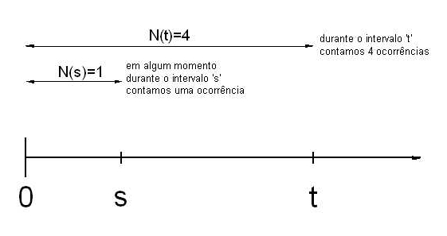
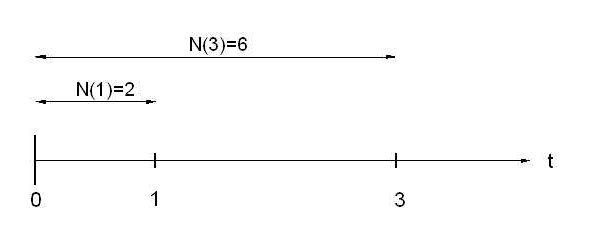
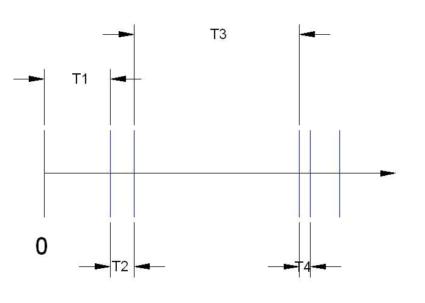

```{r, echo=FALSE, include=FALSE}
colFmt <- function(x,color) {
  
  outputFormat <- knitr::opts_knit$get("rmarkdown.pandoc.to")
  
  if(outputFormat == 'latex') {
    ret <- paste("\\textcolor{",color,"}{",x,"}",sep="")
  } else if(outputFormat == 'html') {
    ret <- paste("<font color='",color,"'>",x,"</font>",sep="")
  } else {
    ret <- x
  }

  return(ret)
}

#uso>>>> `r colFmt("REG",'red')`, 

```

```{r}

library(reticulate)
#use_condaenv("r-python")
#use_python('/opt/homebrew/Caskroom/miniconda/base/envs/r-python/python3.9')

library(reticulate)
Sys.setenv(RETICULATE_CONDA = "/opt/homebrew/Caskroom/miniconda/base/bin/conda")
use_condaenv("r-python")

```


# Introdução à modelagem de processos estocásticos 


\


A expressão **processo estocástico** pode ser interpretada de duas formas diferentes, todavia interligadas, dependendo do contexto.

\


>Como **fenômeno real** que ocorre no mundo físico ou social como o tempo de chegada de clientes em um banco, as variações no preço de uma ação ou a propagação de uma epidemia. Esses fenômenos apresentam variabilidade inerente e são influenciados por fatores que não podem ser totalmente controlados ou previstos.

\

>Como um **modelo** (abstração do fenômeno): usado para descrever, aproximar e analisar esse fenômeno aleatório. Um **processo de Poisson** pode ser utilizado para modelar a chegada de clientes em um restaurante. Nesse caso, ele é definido como uma **família de variáveis aleatórias indexadas por um conjunto de parâmetros** (tempo, no exemplo). 


## Modelos determinísticos e estocásticos

\

>Os **modelos estocásticos** contrastam com os **modelos determinísticos**. Enquanto os modelos determinísticos são definidos por **equações** que descrevem **exatamente** como o sistema evolui ao longo do tempo, os modelos estocásticos envolvem pelo menos algum **grau de aleatoriedade**. Assim, diferentes execuções de um processo estocástico produzem resultados variados, conhecidos como **realizações do processo**.

\

>**Modelos determinísticos** são geralmente **mais fáceis** de analisar, mas os estocásticos costumam ser **mais realistas**. Por exemplo, ao modelar a sobrevivência de uma espécie rara, um modelo determinístico prevê extinção ou sobrevivência **com certeza**. Já um modelo estocástico atribui uma **probabilidade de extinção**, permitindo estudar como diferentes estratégias de manejo influenciam esse resultado.


## Dedução e indução


\

>Uma dicotomia **relativamente** recente (Hammersly e Handscom em Monte Carlo Methods, 1964) contrasta o **matemático teórico** com o **matemático experimental** (semelhantes às usadas comumente para **físicos teóricos e experimentais**)

\

>Elas são independentes do fato de os objetivos serem **puros ou aplicados**. Não pressupõem que o **teórico** esteja sentado em uma sala vazia diante de uma folha de papel em branco, enquanto o **experimentalista** manipule equipamentos caros em um laboratório. 

\

>Embora certos experimentos matemáticos complexos exijam **computadores eletrônicos**, outros requerem **apenas papel e lápis**. 

\

>A diferença essencial é que os **teóricos deduzem conclusões a partir de postulados**, enquanto os **experimentalistas inferem conclusões com base em observações**. Trata-se da diferença entre **dedução** e **indução**.


## Processos estocásticos temporais, espaciais e espaçotemporais


\

>Como um modelo, um **processo estocástico** é uma família de **variáveis aleatórias \(\{X_\theta\}\)**, indexada por um parâmetro \(\theta\), onde \(\theta\) pertence a algum conjunto de índices \(\Theta\) e a **natureza** do processo estocástico pode ser **temporal**, **espacial** ou **espaçotemporal**.

\


### Processos Estocásticos Temporais

\

Em um processo estocástico temporal o parâmetro de índice (\(\Theta\)) representa o **tempo**: $\{X_t : t \in T \}$. 

\

Se \(\Theta\) for um conjunto de **números inteiros**, representando pontos específicos no tempo como no $1^{o}s$ ou no $3^{o}s$, teremos um **processo estocástico em tempo discreto** e a notação mais utilizada é:  

\[
\{X_t : t \in \mathbb{Z}_{+}\}
\]


\


Se \(\Theta\) for a **reta real** (ou algum intervalo da reta real) como um intervalo contínuo de tempo como em $0.1s$ ou em  $3s$, teremos um **processo estocástico em tempo contínuo** e a notação mais utilizada é:  

\[
\{X_t : t \in [0, \infty] \}
\]  

\

### Processos Estocásticos Espaciais

\

Em um **processo espacial**, o conjunto de índices \(\Theta\) não representa mais o tempo, mas sim **localizações no espaço** e passa a ser representado por um vetor, descrevendo posições em um espaço de uma ou mais dimensões. Esse tipo de processo é frequentemente representado por:

\[
\{X_{\mathbf{s}} : \mathbf{s} \in D \}
\]

em que: 

- \( X_{s} \): Variável aleatória associada ao ponto espacial representado por \(s\).  
- \(s\): Vetor de coordenadas espaciais, por exemplo, \((u, v)\) no caso de um plano ou  \((u, v, z)\) no espaço.  
- \( D \): Domínio espacial, que pode ser um subconjunto de \(\mathbb{R}^2\) (no plano) ou \(\mathbb{R}^3\) (no espaço tridimensional).

\

Se o domínio espacial \( D \) for **discreto**, representando pontos específicos no espaço (ex.: coordenadas de uma grade regular em um mapa), teremos:  

\

\[
\{X_{\mathbf{s}} : \mathbf{s} \in \mathbb{Z}^2 \}
\]

\

Se o domínio espacial \( D \) for **contínuo**, representando qualquer ponto em uma região do espaço (ex.: temperatura em qualquer ponto de uma superfície contínua), teremos:  

\

\[
\{X_{\mathbf{s}} : \mathbf{s} \in \mathbb{R}^2 \}
\]

\

### Processos Estocásticos Espaçotemporais

\


Em alguns casos, podemos ter processos que evoluem **no tempo e no espaço simultaneamente**. Estes são chamados de **processos espaço-temporais**, frequentemente representados por::

\[
\{X_{t, \mathbf{s}} : t \in T, \mathbf{s} \in D \}
\]

em que: 

- \( X_{t, \mathbf{s}} \): Variável aleatória associada ao instante \( t \) na posição espacial \( \mathbf{s} \).  
- \( t \): Índice temporal.  
- \( \mathbf{s} \): Índice espacial (vetor de coordenadas no espaço).  
- \( T \): Intervalo de tempo de interesse.  
- \( D \): Região espacial de interesse.

\

O **domínio espacial** (\( D \)) pode ser **discreto** (ex.: pontos específicos em uma grade regular, \( \mathbb{Z}^2 \)) ou **contínuo** (ex.: qualquer ponto em uma superfície, \( \mathbb{R}^2 \)). 

Da mesma forma, o **domínio temporal** (\( T \)) pode ser **discreto** (ex.: momentos específicos, \( \mathbb{Z} \)) ou **contínuo** (ex.: qualquer instante ao longo de um intervalo, \( \mathbb{R} \)).

\


## Processo de Poisson
 


### Natureza

\


> Alguns experimentos aleatórios envolvem, essencialmente, contagens observadas em um certo intervalo de tempo como, por exemplo:  


>1- clientes que entram num supermercado por dia, 
2- chamadas que uma central telefônica recebe por hora,  
3. pacotes que passam por um roteador por minuto,  
4. chamadas ao SIATE por semana,  
5. trens que chegam a uma estação a cada 12 horas.  
Ao se aumentar o intervalo, aumenta-se a probabilidade de se observar uma certa contagem.

\


>Definição 1: um **processo de contagem** é um **processo estocástico temporal** representado por:
\[
\{N_t : t \in [0, \infty) \}
\]
em que: \( N_t \) representa o **número de eventos ocorridos no intervalo [0, t]**. 

\


Esse processo deve satisfazer as seguintes propriedades:  

\

1. \( N_0 = 0 \) (no exato momento do início do processo a contagem é zero)  
2. \( N_t \in \{0, 1, 2, \ldots \} \) ($ie$, são contagens)  
3. Se \( s < t \), então \( N_s \leq N_t \) (a contagem no intervalo [0,s] não é superior à contagem no intervalo [0,t], para $s < t$)  
4. Para \( s < t \), a diferença \( N_t - N_s \) representa o número de eventos ocorridos no intervalo \( (s, t] \)  
5. \( N_t \) é uma função não descrescente

\

>Definição 2: um **processo de contagem** tem **incrementos independentes** se o **número de eventos que ocorrem em intervalos de tempo disjuntos são independentes**. Para \( 0 \leq t_1 < t_2 < \ldots < t_n \), temos que as variáveis aleatórias:
\[
N(t_2) - N(t_1), N(t_3) - N(t_2), \ldots, N(t_n) - N(t_{n-1})
\]
são **variáveis independentes**.

\

>Definição 3: um **processo de contagem** tem **incrementos estacionários** se a **distribuição de probabilidade do número de eventos que ocorrem em qualquer intervalo** é a mesma e **depende apenas da duração do intervalo** (a probabilidade de chegar um cliente entre 9 e 10 h é a mesma de chegar um cliente entre 15 e 16 h: \(P(N([9,10])=P(N([15,16])\)): **falta de memória**  

\


```{r , echo=FALSE, out.width='60%', fig.align='center', fig.cap=""}



```


\


```{r , echo = FALSE, message = FALSE, out.width='70%', fig.align='center', fig.cap="O processo de Poisson: (1) tem contagem zero em t=0; (2) se s<t então  N(s)<N(t); (4) N(t) é não descrescente e (4) os incrementos são independentes  "}

# Configurações iniciais
set.seed(42)  # Garante reprodutibilidade

# Definindo os tempos de chegada
arrival_times <- c(1, 2.5, 3 , 5.5, 7)  # Momentos de chegada dos eventos
n_events <- length(arrival_times)  # Número de chegadas

# Criando a contagem cumulativa
time <- seq(0, max(arrival_times) + 1, by = 0.1)  # Eixo temporal
N_t <- sapply(time, function(t) sum(arrival_times <= t))  # Número de eventos acumulados

# Plot do Processo de Contagem (removendo rótulos padrão do eixo x)
plot(time, N_t, type = "s", lwd = 2, col = "black",
     xlab = "", ylab = "N(t)", xaxt = "n",
     main = "Processo de Contagem de Eventos",
     ylim = c(0, max(N_t) + 1), xlim = c(0, max(time)))

# Adicionando pontos de chegada
points(arrival_times, 1:n_events, pch = 19, col = "black")  # Pontos cheios (chegadas)
points(arrival_times, 0:(n_events - 1), pch = 21, col = "black", bg = "white")  # Pontos vazios (antes da chegada)

# Adicionando linhas horizontais entre chegadas
for (i in 1:n_events) {
  if (i == 1) {
    segments(0, 0, arrival_times[i], 0, lwd = 2)
  } else {
    segments(arrival_times[i-1], i-1, arrival_times[i], i-1, lwd = 2)
  }
}

# Adicionando rótulos personalizados no eixo x
axis(1, at = arrival_times, labels = paste0("E", 1:n_events), col.axis = "blue", cex.axis = 0.9)


# Adicionando legenda
legend("topleft", legend = c("Evento Chegada", "Antes da Chegada"), 
       pch = c(19, 21), col = "black", pt.bg = c("black", "white"), bty = "n")

# Linha
par(xpd = TRUE)
inicio=0; fim=2; altura=-1.8; 
segments(inicio, altura, fim, altura, lwd = 1, col = "black")  
texto_legenda <- "intervalo 's'"
text((inicio + fim) / 2, altura + 0.3, texto_legenda, col = "black", cex = 1.2, font = 2)
inicio=0; fim=6; altura=-2.2; 
segments(inicio, altura, fim, altura, lwd = 1, col = "black")  
texto_legenda <- "intervalo 't'"
text((inicio + fim) / 2, altura + 0.3, texto_legenda, col = "black", cex = 1.2, font = 2)


```


\


Um **processo de contagem** \(\{N_t : t \geq 0 \}\) é dito ser um **processo de Poisson** com taxa \(\lambda > 0\) se:

\

1. \( N(0) = 0 \).  
2. o processo tem **incrementos independentes e estacionários**.  
3. o número de eventos em qualquer intervalo de comprimento \( t \) tem distribuição de **Poisson** com média \( \lambda t \).  

\

Ou seja, para \( s, t \geq 0 \)

\

\[
P(N(t + s) - N(s) = n) = \frac{e^{-\lambda t} (\lambda t)^n}{n!}
\]

\

em que \(P(N(t + s) - N(s) = n)\) é a probabilidade de serem observados $n$ eventos no intervalo de tempo $(t+s)-t=t$. Desse modo, para um intervalo de tempo $t$, a probabilidade de serem observados $n$ eventos é 

\

\[
P(N(t) = n) = \frac{e^{-\lambda t} (\lambda t)^n}{n!}
\]


\

>Exemplo 1: Fregueses chegam a uma certa loja de acordo com um **processo de Poisson** com taxa \( \lambda = 4 \) fregueses por hora. Admita que a loja abra às **9h** e que que os fregueses **não** deixam a loja. Quais são as probabilidades de que:
1. um freguês chegue até às 9:30h  
2. um total de 5 fregueses estejam na loja até às 11:30h?

\

A loja abre às 9 h então até as 9 h 30 min o primeiro intervalo de tempo será \( t_1 = 0.5 \) horas e até as 11 h 30 min o segundo intervalode tempo será   \( t_2 = 2.5 \). A taxa média de chegadas por hora é \( \lambda = 4 \).

\

O que se pede é a $P[N(t_1)=1,N(t_2)=5]$.

\

Essa probabilidade é a mesma que $P[N(t_1)=1 \cap N(t_2-t_1)=4]$ e, sendo os intervalos de tempo disjuntos, as probabilidades $P[N(t_1)=1]$ e $P[N(t_2 - t_1)=4]$ são independentes e podemos escrever:

\


\begin{align}
P[N(t_1)=1 \cap N(t_2-t_1)=4] & = P[N(t_1)=1] \times P[N(t_2-t_1)=4] \\
& = \frac{\varepsilon^{-\lambda t_1} (\lambda t_1)^{n_1}}{n_1!} \times \frac{\varepsilon^{-\lambda (t_2-t_1)}[\lambda (t_2-t_1)]^{n_2}}{n_2!}\\
& = \frac{\varepsilon^{-(4\times 0.5)} (4 \times 0.5)^{1}}{1!} \times \frac{\varepsilon^{-(4 \times 2)} (4 \times 2)^{4}}{4!}\\
& = 2\varepsilon^{-2} \times 170.67\varepsilon^{-8}\\
& = 0.2707 \times 0.0573 \approx 0.0155 
\end{align}

\


Um valor bastante baixo posto a taxa média $\lambda$ de 4 clientes por hora indicar que se esperam 2 em meia hora (apenas 1 chegou) e 8 em duas horas (apenas 4 chegaram). Ambos os eventos: chegar 1 pessoa em meia hora e 4 pessoas em duas horas são raros.  
\

>Exemplo 2: Suponha que pacotes **SMTP** chegam a um servidor de e-mails de acordo com um **processo de Poisson** com frequência \( \lambda = 2 \) pacotes por segundo. Seja \( N(t) \) o número de mensagens que chegam até o tempo \( t \). Quais são as probabilidades de que:
1. \( P(N(1) = 2) \): 2 pacotes em um intervalo de 1 segundo  
2. \( P(N(1) = 2 \cap N(3) = 6) \): 2 pacotes em um intervalo de 1 segundo e 6 pacotes em um intervalo de 3 segundos
3. \( P(N(1) = 2  | N(3) = 6) \)
4. \( P(N(3) = 6  | N(1) = 2) \)


\

A primeira probabilidade é imediata: 

\

\begin{align}
P(N(1) = 2) & = \frac{e^{-2 \times 1} (2 \times 1)^2}{2!}\\
& = \frac{e^{-2} \cdot 4}{2} \\
& = 2 e^{-2} \approx 0.27
\end{align}

\

A segunda,recorrendo à mesma definição do exemplo anterior, será dada por: 

\


\begin{align}
P[N(1)=2 \cap N(3)=6] & = P[N(1)=2] \times P[N(2)=4] \\
& = \frac{\varepsilon^{-(2\times 1)} (2 \times 1)^{2}}{2!} \times \frac{\varepsilon^{-(2 \times 2)} (2 \times 2 )^{4}}{4!}\\
& = 0.2707 \times 0.1952 \approx 0.052  
\end{align}

\

A terceira, recorrendo à probabilidade de dois eventos condicionado $P(A|B)=\frac{P(A\cap B)}{P(B)}$, será dada por: 

\

\begin{align}
P(N(1) = 2  | N(3) = 6)  & = \frac{P(N(1) = 2 \cap N(3) = 6)}{P(N(3) = 6)}\\
& = \frac{0.052}{P(N(3) = 6)}\\
& = \frac{0.052}{0.1606} \approx 0.32 \\
\end{align}


\

A quarta podemos entender que a probabilidade de N(3)=6 dado N(1) = 2, ilustrada a seguir:

\


```{r , echo=FALSE, out.width='60%', fig.align='center', fig.cap=""}



```

\

Portanto, calcular \( P(N(3) = 6  | N(1) = 2) \) equivale a calcular a probabilidade de \( P(N(2)=4)\) (os incrementos são independentes em um processo de Poisson), dada por $\frac{\varepsilon^{-(2\times 2)} (2 \times 2)^{4}}{4!} \approx 0.19$ .

\

### Processo de Poisson com classificação de eventos
\

Seja \( \{N(t), t \geq 0\} \) um **processo de Poisson** com taxa \( \lambda \), que descreve o número de eventos ocorridos em um intervalo de tempo \([0, t]\). Admita que cada evento nesse processo possa ser **classificado em dois tipos distintos (Tipo I e Tipo II)**:  

\

- Cada evento tem **probabilidade \( p \)** de ser classificado como **Tipo I**.  
- Cada evento tem **probabilidade \( 1-p \)** de ser classificado como **Tipo II**.  

\

Se a classificação de cada evento é **independente das demais classificações e da ocorrência dos eventos**, demonstra-se (Sheldon Ross, in Introduction to Probability Models, $6^{a}$ ed., Cap. 5) que 

\

- \( \{N_1(t), t \geq 0\} \): Número de eventos do **Tipo I** no intervalo \([0, t]\).  
- \( \{N_2(t), t \geq 0\} \): Número de eventos do **Tipo II** no intervalo \([0, t]\),  

\

e \( N(t) = N_1(t) + N_2(t) \).

\

>Os processos \( \{N_1(t), t \geq 0\} \) e \( \{N_2(t), t \geq 0\} \) têm as seguintes propriedades:  
1. Ambos são **processos de Poisson** com taxas:  
- \( \lambda_1 = \lambda p \) para eventos do **Tipo I**.  
- \( \lambda_2 = \lambda (1-p) \) para eventos do **Tipo II**.  
2. Os dois processos são **independentes**.

\

\[
N_1(t) \sim \text{Poisson}(\lambda p), \quad N_2(t) \sim \text{Poisson}(\lambda (1-p))
\]

\
 
 
De modo **geral**, considere um **processo de Poisson** com **taxa \( \lambda \)**. Cada evento pode ser classificado em **n tipos diferentes** com probabilidades:

\

\[
p_1, p_2, \ldots, p_n, \quad p_1 + p_2 + \cdots + p_n = 1
\]

\

Seja \( N_i(t) \) o número de eventos do tipo \( i \) até o tempo \( t \).Cada subprocesso segue uma **distribuição de Poisson** com taxa:

\

\[
N_i(t) \sim \text{Poisson}(p_i \lambda t)
\]

\

Os subprocessos \( N_1(t), N_2(t), \ldots, N_n(t) \) são **independentes** entre si. 

\

A ocorrência de um evento de um tipo **não afeta** a probabilidade de ocorrência de eventos de outro tipo.


\

Cada tipo de evento mantém suas próprias propriedades estatísticas e comportamentos, preservando a estrutura probabilística do processo original.


\


A proposição afirma que podemos **decompor um processo de Poisson subprocessos independentes**, onde cada subprocesso segue uma distribuição de Poisson ajustada pela probabilidade de classificação de cada evento. 

\

Esse resultado é frequentemente utilizado em aplicações práticas, como:  filas com diferentes tipos de clientes e sistemas de telecomunicações com pacotes de dados de diferentes tipos.


\

>Exemplo 3: Clientes entram em uma loja de acordo com um processo de Poisson com taxa λ = 10 por hora. De forma independente, cada cliente compra alguma coisa com probabilidade 0.3 ou sai da loja sem comprar nada com probabilidade 0.7. Calcule a probabilidade de que durante a primeira hora 9 pessoas entrem
na loja e, dentre essas 9 pessoas, 3 comprem alguma coisa e 6 não.

\

Considerando que \(N_0(t)\)  e \(N_1(t)\) são processos de Poisson independentes com taxas \((1 − p)\lambda\) e \(p \lambda\), em que \(N_0(t)\) o número de clientes que não compram nada até o tempo \(t\) e  \(N_1(t)\) o número de clientes que compram até o tempo \(t\), a probabilidade pedida é

\

\[ P(N_0(t=1)=6, N_1(t=1)=3)\]

\

em que \(N_0(t=1) \sim Poisson(\lambda_0=7)\) e \(N_1(t=1) \sim Poisson(\lambda_1=3)\).

\

\begin{align}
P(N_0(t=1)=6 \land N_1(t=1)=3) & = P(N_0(t=1)=6) \times P(N_1(t=1)=3)\\
& = \frac{e^{-\lambda_0 t} (\lambda_0 t)^n_0}{n_0!} \times  \frac{e^{-\lambda_1 t} (\lambda_1 t)^n_1}{n_1!} \\
& = \frac{e^{-7 \times 1}\dot(7 \times 1)^6}{6!} \times \frac{e^{-3 \times 1}\dot(3 \times 1)^3}{3!}  \\
& \approx 0.1251 \times 0.2666 \\
& \approx 0.0333
\end{align}

\

### Processos de Poisson não homogêneos

\

### Tempo de espera em um processo de Poisson

\

Seja \(\{N_t : t \geq 0 \}\) um **processo de Poisson** com taxa \(\lambda\): 

- denota-se por $T_{n}$ o tempo entre a $(n − 1)$ e a $n-ésima$ ocorrência de eventos, sendo $T_{1}$ o tempo até a primeira
ocorrência
- a sequência $T_{n}, n=1,2,...$ é a chamada sequência de tempos entre ocorrências (ou entre chagadas)

\

>Proposição: $T_{1},T_{2},...$ são variáveis aleatórias com distribuição exponencial de parâmetro $\frac{1}{\lambda}$. 

\

```{r , echo=FALSE, out.width='70%', fig.align='center', fig.cap="Os tempos de espera entre cada observação não são constantes."}



```

\


```{python, include=TRUE, echo=TRUE, message=FALSE, warning=FALSE}

import numpy as np
import matplotlib
matplotlib.use('Agg') 
import matplotlib.pyplot as plt
from scipy.stats import expon

```


```{python, include=TRUE, echo=TRUE, message=FALSE, warning=FALSE}

#A função **`generate_poisson_events`** simula um **Processo de Poisson**, gerando um número aleatório de eventos com taxa média `rate` em um intervalo de duração `time_duration`, retornando o número total de eventos, os tempos ordenados de ocorrência e os intervalos entre eventos consecutivos.

def generate_poisson_events(rate, time_duration):
    num_events = np.random.poisson(rate * time_duration)
    event_times = np.sort(np.random.uniform(0, time_duration, num_events))
    inter_arrival_times = np.diff(event_times)
    return num_events, event_times, inter_arrival_times

```


```{python, include=TRUE, echo=TRUE, message=FALSE, warning=FALSE}

# A função **`plot_non_sequential_poisson`** visualiza um **Processo de Poisson**, exibindo em dois gráficos o tempo cumulativo dos eventos (em uma curva de passos) e o histograma dos intervalos entre eventos, destacando a distribuição exponencial dos tempos de espera, com taxa média `rate` e duração total `time_duration`.

def plot_non_sequential_poisson(num_events, event_times, inter_arrival_times, rate, time_duration):
    fig, axs = plt.subplots(1, 2, figsize=(14, 5))  
    fig.suptitle(f'Simulação de um Processo de Poisson (λ = {rate}, Duração = {time_duration} segundos)\n', fontsize=14)

    # Gráfico 1: Tempo dos Eventos
    axs[0].step(event_times, np.arange(1, num_events + 1), where='post', color='blue')
    axs[0].set_xlabel('Tempo (s)')
    axs[0].set_ylabel('Número de Eventos')
    axs[0].set_title(f'Evolução Incremental dos Eventos no Tempo\nN(t) é não descrescente\nTotal: {num_events} eventos\n', fontsize=12)
    axs[0].grid(True)

    # Gráfico 2: Histograma dos Tempos de Espera
    axs[1].hist(inter_arrival_times, bins=20, density=True, color='green', alpha=0.5, label='Dados Empíricos')
    axs[1].set_xlabel('Tempo de Espera entre Eventos (s)')
    axs[1].set_ylabel('Densidade')
    axs[1].set_title(
        f'Distribuição dos Tempos de Espera entre Eventos\nE(T): {1/rate:.2f}, Sd(T): {np.std(inter_arrival_times):.2f}',
        fontsize=12
    )
    axs[1].grid(True, alpha=0.5)
    
    # Sobreposição da curva exponencial teórica
    lambda_param = rate  
    x = np.linspace(0, max(inter_arrival_times), 100)
    y = expon.pdf(x, scale=1/lambda_param)  
    axs[1].plot(x, y, 'r-', lw=2, label=f'Modelo Exponencial (λ={lambda_param:.2f})')

    # Legenda
    axs[1].legend()

    # Ajustar espaçamento entre gráficos
    plt.subplots_adjust(left=0.08, right=0.95, top=0.85, bottom=0.1, wspace=0.3)

    # Ajustar layout final
    plt.tight_layout()
    plt.show()


```


```{python, include=TRUE, echo=TRUE, message=FALSE, warning=FALSE}

# A função **`plot_sequential_poisson`** visualiza múltiplos **Processos de Poisson** com diferentes taxas `rate`, exibindo em dois gráficos a evolução cumulativa dos eventos no tempo e os histogramas dos intervalos entre eventos, destacando a distribuição exponencial dos tempos de espera para cada taxa ao longo de uma duração definida `time_duration`.


def plot_sequential_poisson(num_events_list, event_times_list, inter_arrival_times_list, rate, time_duration):
    fig, axs = plt.subplots(1, 2, figsize=(14, 5))  
    fig.suptitle(f'Simulação de Processos de Poisson com diferentes λ (Duração = {time_duration} segundos)\n', fontsize=14)

    # Gráfico 1: Tempo dos Eventos
    axs[0].set_xlabel('Tempo (s)')
    axs[0].set_ylabel('Número de Eventos')
    axs[0].set_title(f'Evolução Incremental dos Eventos no Tempo \nN(t) é não decrescente', fontsize=12)
    axs[0].grid(True)

    # Gráfico 2: Histograma dos Tempos de Espera
    axs[1].set_xlabel('Tempo de Espera entre Eventos (s)')
    axs[1].set_ylabel('Densidade')
    axs[1].set_title(f'Distribuição dos Tempos de Espera: T(n) ~ Exp\n E(T)=1/λ, Sd(T)=sqrt(1/λ²)', fontsize=12)
    axs[1].grid(True, alpha=0.5)

    color_palette = plt.get_cmap('tab20')
    colors = [color_palette(i) for i in range(len(rate))]

    for n, individual_rate in enumerate(rate):
        num_events = num_events_list[n]
        event_times = event_times_list[n]
        inter_arrival_times = inter_arrival_times_list[n]

        # Gráfico 1: Curva de passos para os tempos de chegada
        axs[0].step(event_times, np.arange(1, num_events + 1), where='post', color=colors[n],
                    label=f'λ = {individual_rate}, Total: {num_events}')

        # Gráfico 2: Histograma dos tempos entre eventos
        axs[1].hist(inter_arrival_times, bins=20, density=True, color=colors[n], alpha=0.5,
                    label=f'λ = {individual_rate}, E(T): {1/individual_rate:.2f}, Sd(T): {np.std(inter_arrival_times):.2f}')

        # Sobreposição da curva exponencial teórica
        x = np.linspace(0, max(inter_arrival_times), 100)
        y = expon.pdf(x, scale=1/individual_rate) 
        axs[1].plot(x, y, color=colors[n], lw=2, linestyle='--', label=f'Modelo Exp (λ={individual_rate:.2f})')

    axs[0].legend(loc='upper left', fontsize=9)
    axs[1].legend(loc='upper right', fontsize=9)

    # Ajustar espaçamento entre gráficos
    plt.subplots_adjust(left=0.08, right=0.95, top=0.85, bottom=0.1, wspace=0.3)

    # Ajustar layout final
    plt.tight_layout()
    plt.show()


```


```{python, include=TRUE, echo=TRUE, message=FALSE, warning=FALSE}

# A função **`poisson_simulation`** simula um ou vários **Processos de Poisson**, dependendo se `rate` é um valor único (int) ou uma lista de taxas, gerando tempos de ocorrência e intervalos entre eventos; além disso, visualiza os resultados por meio de gráficos que exibem a evolução temporal dos eventos e a distribuição dos tempos de espera ao longo de um intervalo definido por `time_duration`.

def poisson_simulation(rate, time_duration, show_visualization=True):
    if isinstance(rate, int):
        num_events, event_times, inter_arrival_times = generate_poisson_events(rate, time_duration)
        
        if show_visualization:
            fig = plt.figure(figsize=(14, 6))  # Aumentar tamanho da figura
            plot_non_sequential_poisson(num_events, event_times, inter_arrival_times, rate, time_duration)
            fig.set_tight_layout(True)  # Ajuste automático do layout
        else:
            return num_events, event_times, inter_arrival_times

    elif isinstance(rate, list):
        num_events_list = []
        event_times_list = []
        inter_arrival_times_list = []

        for individual_rate in rate:
            num_events, event_times, inter_arrival_times = generate_poisson_events(individual_rate, time_duration)
            num_events_list.append(num_events)
            event_times_list.append(event_times)
            inter_arrival_times_list.append(inter_arrival_times)

        if show_visualization:
            fig = plt.figure(figsize=(18, 8))  # Maior espaço para gráficos sequenciais
            plot_sequential_poisson(num_events_list, event_times_list, inter_arrival_times_list, rate, time_duration)
            fig.set_tight_layout(True)  # Ajuste automático do layout
        else:
            return num_events_list, event_times_list, inter_arrival_times_list


```

\


Nas simulações a seguir confirma-se empiricamente que a evolução incremental da contagem de eventos ao longo do tempo (a variável aleatória \(N(t)\)) é crescente e a distribuição dos tempos de espera (a variável aleatória \(T(n)\) entre eventos segue um modelo exponencial com parametro 1/λ (código adaptado de [link](https://medium.com/@abhash-rai/poisson-process-simulation-and-analysis-in-python-e62f69d1fdd0)).

\


```{python, include=TRUE, echo=TRUE, message=FALSE, warning=FALSE, fig.width=15, fig.height=4, fig.show='last'}


poisson_simulation(rate=5, time_duration=100)
poisson_simulation(rate=[2, 4, 6, 10], time_duration=100)
plt.close('all')
```


>Exemplo 3: Em um sistema de atendimento telefônico, as chamadas chegam de acordo com um processo de Poisson com taxa média de chegada de λ=3 chamadas por minuto. Responda:  
1) Qual é a probabilidade de que ocorram exatamente 2 chamadas em um intervalo de 1 minuto?  
2) Qual a probabilidade do tempo entre chamadas ser menor que 20 segundos?  
3) Sabendo que o sistema comporta **sem interrupção** o atendimento de até 6 chamadas por minuto, qual é a probabilidade do sistema apresentar falhas?  
4) Sabendo que o sistema comporta **sem interrupção** o atendimento com um intervalo mínimo de 15 segundos entre elas, qual é a probabilidade do sistema apresentar falhas?

\


1) A probabilidade de ocorrerem exatamente \( k = 2 \) chamadas em 1 minuto é dada pela fórmula da distribuição de Poisson:

\

\[
P(N(t) = k) = \frac{(\lambda t)^k e^{-\lambda t}}{k!}\\
P(N(1) = 2) = \frac{(3 \cdot 1)^2 e^{-3}}{2!}\\
P(N(1) = 2) = \frac{9 e^{-3}}{2}\\
P(N(1) = 2) \approx \frac{9 \cdot 0.0498}{2} = 0.2241
\]

\

2) A probabilidade de tempo entre chamadas ser menor que 20 segundos é 

\

\[
P(T \leq t) = 1 - e^{-\lambda t}\\
P(T \leq 1/3) = 1 - e^{-3 \cdot \frac{1}{3}}\\
P(T \leq 1/3) \approx 1 - 0.3679 = 0.6321
\]

\

3) Sabendo que o sistema comporta **sem interrupção** o atendimento de até **6 chamadas por minuto**, a interrupção ocorrerá  quando há **mais de 6 chamadas** no intervalo de 1 minuto, e a probabilidade disso ocorrer é

\


\[
P(N(1) > 6) = 1 - P(N \leq 6)\\
P(N(1) > 6 ) = 1- \sum_{k=0}^{6} \frac{3^k e^{-3}}{k!}\\
P(N(1) > 6 \approx 1- 0.967\\
P(N(1) > 6) \approx 0.033\\
\]


\

4) Sabendo que o sistema comporta **sem interrupção** o atendimento com um **intervalo mínimo de 15 segundos entre chamadas consecutivas**, a interrupção ocorrerá quando o sistema receber cahamadas com um intervalo menor que 15 s e essa probabilidade será

\

\[
P(T \leq t) = 1 - e^{-\lambda t}\\
P(T \leq 0.25) = 1 - e^{-3 \cdot 0.25}\\
P(T \leq 0.25) = 1 - e^{-0.75}\\
P(T \leq 0.25) \approx 1 - 0.4724 \\
P(T \leq 0.25) \approx 0.5276
\]

\


Esses resultados ilustram que:  
- É **improvável** que o sistema falhe devido a mais de 6 chamadas em 1 minuto.  
- Há uma **alta probabilidade de falha** devido a **intervalos muito curtos entre chamadas consecutivas**.

\

### Distribuição condicional dos tempos de chegada

\

Considere \( N(t), t \geq 0 \) com taxa \( \lambda \). Sabendo-se *a priori* que um evento ocorreu exatamente no intervalo \( (0, t] \), qual a distribuição do tempo até a ocorrência desse evento?

\

Ou seja, desejamos estimar a probabilidade do evento ter ocorrido em intervalo de tempo \(s\) dado que ocorreu um evento no intervalo \(t\), sendo \(s \leq t\)   

\

\[
P(T_1 < s \mid N(t) = 1), \, s \leq t.
\]

\

Pela hipótese de incrementos independentes e estacionários demonstra-se (Sheldon Ross, in Introduction to Probability Models, $6^{a}$ ed., Cap. 5) que a distribuição é uniforme no intervalo \( (0, t] \) e pode-se verificar que  


\

\[
P(T_1 < s \mid N(t) = 1) = \frac{s}{t}, \, s \leq t.
\]


\


>Exemplo 4: Em um sistema de atendimento telefônico, as chamadas chegam de acordo com um processo de Poisson com taxa média de chegada de λ=3 chamadas por minuto. Dado que ocorreram 2 chamadas em 1 minuto, qual é a probabilidade de que o tempo de espera para a primeira chamada seja inferior a 20 segundos?

\


A probabilidade de que o tempo de espera para a primeira chamada seja inferior a \(s=\frac{1}{3} min\) dado que ocorreram 2 chamadas em \(t=1min\) segue uma distribuição uniforme

\
\[
P(T_1 < s \mid N(t) = 1) = \frac{s}{t}, \, s \leq t.\\
P(T_1 < \frac{1}{3} \mid N(t=1) = 1) = \frac{\frac{1}{3}}{1}\\
P(T_1 < \frac{1}{3} \mid N(t=1) = 1) \approx 0.0333
\]

\

Dado que ocorreram 2 chamadas em 1 minuto, a probabilidade de que a primeira chamada ocorra nos primeiros 20 segundos é de 1/3 (aproximadamente 33,33%).

\


## Simulações Monte Carlo


### Introdução 

\

>O Método de Monte Carlo, desenvolvido na década de 1940 por Stanislaw Ulam durante seu trabalho no Los Alamos National Laboratory, surgiu como uma ferramenta para **simular processos probabilísticos** (uma ideia semelhante já havia sido utilizada por Enrico Fermi no estudo da difusão de nêutrons, mas nunca foi publicada). John von Neumann aprimorou o método, implementando-o no ENIAC, o primeiro computador programável da história. 


\


>É uma técnica matemática computacional amplamente utilizada para modelar e analisar **sistemas complexos**, frequentemente caracterizados por elevadas variabilidade e incerteza, nos quais os cálculos analíticos diretos seriam inviáveis devido ao grande número de variáveis ou à complexidade matemática envolvida.


\

>Baseiam-se na amostragem (ou geração) de **valores aleatórios** (estritamente falando, pseudoaleatórios), obtidos por algoritmos determinísticos - dentro de intervalos plausíveis para variáveis de entrada ie., suas **distribuições de probabilidade** específicas. 

\

>As distribuições de probabilidade podem ser determinadas por:

>
- dados de séries temporais;  
- estimativas de especialistas;  
- conhecimento prévio.  

\

>Cada simulação realizada gera um resultado e, ao serem repetidas um grande número de  vezes, esses resultados agregados permitem a **aproximação** dos parâmetros da distribuição de probabilidade do fenômeno.

\

>A geração de valores aleatórios confiáveis é essencial para que os resultados sejam estatisticamente robustos, garantindo que as simulações ofereçam estimativas precisas e representativas.

\

>Aplicadas em áreas como finanças, engenharia, física e ciência de dados, permitindo a previsão de cenários, a análise de riscos e a otimização de decisões sob incerteza.

\


> A **CDF** desempenha um papel importante nas Simulações Monte Carlo. A função de distribuição cumulativa (CDF) dá a probabilidade de que a variável aleatória seja **menor ou igual a um valor específico**.


### Fundamentação

\


>A Lei dos Grandes Números afirma que, à medida que o número de amostras aumenta, a média das observações converge para o valor esperado:

\

\[
\bar{X}_n = \frac{1}{n} \sum_{i=1}^{n} X_i \to \mathbb{E}[X] \text{ quando } n \to \infty
\]

\


>O Teorema do Limite Central afirma que, para um número suficientemente grande de amostras independentes e identicamente distribuídas (i.i.d), a soma das variáveis converge em distribuição a uma distribuição Normal:

\

\[
\frac{\sum_{i=1}^{n} X_i - n \mu}{\sqrt{n} \sigma} \xrightarrow{d} N(0,1)
\]

\

em que:  

\

- \(\mu\): média da variável aleatória  
- \(\sigma\): desvio padrão  

\

>Esses teoremas garantem que métodos de Monte Carlo produzam aproximações confiáveis conforme se aumente o número de simulações.

\


### Números Aleatórios e Pseudoaleatórios

\


>Os números verdadeiramente aleatórios são gerados a partir de processos físicos imprevisíveis, como ruído térmico ou decaimento radioativo. Esses métodos são difíceis de implementar computacionalmente devido ao custo e à dificuldade de captura dos fenômenos físicos.

\

>Os números pseudoaleatórios são gerados por **algoritmos determinísticos** que produzem sequências que se assemelham à aleatoriedade. **Um** dos métodos mais comuns é o **Gerador Linear Congruente (Linear Congruential Generator – LCG)**, cuja fórmula matemática é dada por:  

\

\[
X_{i+1} = (a X_i + c) \mod m
\]

\

em que:  

\

- \(X_i\): Valor atual da sequência  
- \(a\): Multiplicador  
- \(c\): Incremento  
- \(m\): Módulo (resto)
- \(X_0\): Semente inicial  

\

O **módulo** (\(m\)) é o valor pelo qual a expressão \((a X_i + c)\) é dividida, e o **resto dessa divisão** é o próximo número gerado na sequência. Considere como exemplo o LCG com parâmetros \(a=9\), \(c=1\), \(m=17\) e semente \(X_0=7\).  O primeiro número aleatório (\(X_0=7\)) será 

\

\begin{align}
X_{0} & = 7 \\
X_{1} & = (a X_0 + c) \mod m
X_{1} & = (9*7+1) \mod 17 \\
X_{1} & = 64 \mod 17 \\
X_{1} & = 13 \\
\end{align}

\

uma vez que \( \frac{64}{17} \approx 3,76\) e tomando-se \(64-(3*17)=13 \). Assim \(X_{1} = 13 \).

\

A sequência é então normalizada para o intervalo \([0, 1)\) fazendo-se   

\

\[
U_i = \frac{X_{i+1}}{m}
\]

\

No exemplo anterior teríamos:

\


\begin{align}
U_i & = \frac{X_{i+1}}{m}\\
U_0 & = \frac{X_{1}}{m}\\
U_0 & = \frac{13}{17}\\
U_0 & = 0,76471\\
\end{align}

\


>Essa normalização é essencial para aplicações que requerem números pseudoaleatórios no intervalo \([0, 1)\) como as **CDF**.

\

>O método LCG é **determinístico**, ou seja, dada uma mesma semente inicial (\(X_0\)), ele produzirá sempre a mesma sequência. Isso pode ser problemático em contextos onde a **imprevisibilidade** é desejada.

\

>O LCG a seguir foi adaptado de [link](https://github.com/rossilor95/lcg-python/blob/main/lcg.py)):

\


```{python}

from typing import Iterator, List

# Função correta do Gerador Linear Congruente (LCG)
def linear_congruential_generator(m: int, a: int, c: int, seed: int) -> Iterator[int]:
    """
    Implementa o Gerador Linear Congruente (LCG) para gerar números pseudoaleatórios.

    Parâmetros:
    - m: Módulo (define o intervalo dos números gerados).
    - a: Multiplicador (controla a dispersão dos números).
    - c: Incremento.
    - seed: Valor para iniciar a sequência.

    Retorna:
    - Um iterador que gera números inteiros pseudoaleatórios entre 0 e m-1.
    """
    x = seed  # Inicializa a sequência com a semente fornecida
    while True:
        yield x  # Retorna o valor atual de x
        x = (a * x + c) % m  # Calcula o próximo valor na sequência usando a fórmula do LCG

# Função para gerar uma lista de números pseudoaleatórios
def generate_lcg_samples(n_samples: int, m: int, a: int, c: int, seed: int) -> List[int]:
    """
    Gera uma lista de `n_samples` números pseudoaleatórios não normalizados usando o método do Gerador Linear Congruente (LCG).

    Parâmetros:
    - n_samples: Número de amostras a serem geradas.
    - m: Módulo do LCG.
    - a: Multiplicador do LCG.
    - c: Incremento do LCG.
    - seed: Semente inicial.

    Retorna:
    - Uma lista de números inteiros pseudoaleatórios entre 0 e m-1.
    """
    gen = linear_congruential_generator(m, a, c, seed)  # Inicializa o gerador corretamente
    return [next(gen) for _ in range(n_samples)]  # Coleta n_samples números


```

\

Gerando números pseudoaleatórios com valores $m = 16$, $a = 11$, $c = 0$, $seed=1$:

\

```{python}

# Parâmetros do LCG com ciclo visível
m = 16   # Módulo pequeno para demonstrar a repetibilidade
a = 11   # Multiplicador
c = 0    # Incremento
seed = 1 # Semente inicial X0
n_samples = 200  # Número de amostras para observar o ciclo completo

# Gerar números com o LCG (não normalizados)
lcg_samples = generate_lcg_samples(n_samples, m, a, c, seed)

# Exibir os números gerados
# print(lcg_samples)


```
\


```{python}

# Função para gerar uma sequência de números pseudoaleatórios normalizados no intervalo [0,1)
def lcg_normalized(n_samples: int, m: int, a: int, c: int, seed: int = 1) -> list[float]:
    """
    Gera uma sequência de números pseudoaleatórios normalizados no intervalo [0,1) 
    usando o Gerador Linear Congruente (LCG).

    Parâmetros:
    - n_samples: Número de amostras a serem geradas.
    - m: Módulo do LCG.
    - a: Multiplicador do LCG.
    - c: Incremento do LCG.
    - seed: Valor para iniciar a sequência.

    Retorna:
    - Uma lista de números float no intervalo [0,1).
    """
    gen = linear_congruential_generator(m, a, c, seed)  # Inicializa o gerador LCG
    sequence = []  # Lista para armazenar os números normalizados

    # Gera os números pseudoaleatórios normalizados
    for _ in range(n_samples):
        rand: float = next(gen) / m  # Normaliza o número gerado para o intervalo [0, 1)
        sequence.append(rand)  # Adiciona o número normalizado à sequência

    return sequence  # Retorna a lista completa de números normalizados


```


\

Gerando números pseudoaleatórios com valores $m = 16$, $a = 11$, $c = 0$, $seed=1$:

\

```{python}

# Parâmetros do LCG com ciclo visível
m = 16   # Módulo pequeno para demonstrar a repetibilidade
a = 11   # Multiplicador
c = 0    # Incremento
seed = 1 # Semente inicial X0
n_samples = 100  # Número de amostras para observar o ciclo completo

# Gerar números com o LCG (normalizados)
lcg_samples_norm = lcg_normalized(n_samples, m, a, c, seed)

# Exibir os números gerados
#print(lcg_samples_norm)


```
\

A escolha arbitrária de $m,a,c$ resulta em valores em um ciclo de repetibilidade previsível conforme os gráficos a seguir mostram: 

\


```{python, include=TRUE, echo=TRUE, message=FALSE, warning=FALSE, fig.width=14, fig.height=5, fig.show='last'}

import numpy as np
import matplotlib.pyplot as plt

# Criar índice para os pontos gerados
indices = np.arange(n_samples)

# Criar subplots lado a lado
fig, axes = plt.subplots(1, 2, figsize=(14, 5))

# Gráfico 1: Dispersão para observar padrão periódico
axes[0].scatter(indices, lcg_samples_norm, s=50, alpha=0.7, color='blue')  # Corrigido: índices no eixo X
axes[0].set_title('Distribuição de Números Pseudoaleatórios \n(Ciclo Repetitivo)')
axes[0].set_xlabel('Índice da Sequência')
axes[0].set_ylabel('Números gerados (0 a 1)')
axes[0].grid(True)

# Gráfico 2: Barras para visualizar periodicidade
axes[1].bar(indices, lcg_samples_norm, color='gray', edgecolor='black')
axes[1].set_title('Gráfico de Barras \n(Ciclo Evidenciado)')
axes[1].set_xlabel('Índice da Sequência')
axes[1].set_ylabel('Números gerados (0 a 1)')
axes[1].grid(True)

# Ajustar layout para melhor visualização
plt.tight_layout()
plt.show()


```
\


>De acordo com **Donald Knuth** (*The Art Of Computer Programming*), um gerador pseudoaleatório linear produz uma sequência **aperiódica** se as seguintes condições forem satisfeitas:

\

>1. Se \(p\) é um número primo que divide \(m\), então \(p\) deve dividir \(c\).  
2. Se \(m\) é múltiplo de 4, então \(a-1\) também deve ser múltiplo de 4.  
3. O único número inteiro que divide exatamente \(a\) e \(m\) deve ser 1 (ou seja, \(a\) e \(m\) devem ser coprimos).  

\

Essas condições garantem um **período máximo** e uma **boa distribuição** dos números gerados.

\

Considerando os parâmetros escolhidos:

- $m = 2^{31} = 2\,147\,483\,648$  
- $a = 594\,156\,893$  
- $c = 0$

verificamos as três condições:


Se $p$ é um número primo que divide $m$, então $p$ deve dividir $c$. Como $m = 2^{31}$, o único primo que o divide é $p = 2$. Como $c = 0$, $p$ divide $c$, satisfazendo a condição.
          
Se $m$ é múltiplo de 4, então $a-1$ também deve ser múltiplo de 4. Como $m = 2^{31}$ é múltiplo de 4, verificamos se $a - 1$ também é múltiplo de 4:  

$$
a - 1 = 594\,156\,893 - 1 = 594\,156\,892
$$

Como $594\,156\,892 \div 4$ é inteiro, a condição é satisfeita. O único número inteiro que divide exatamente $a$ e $m$ deve ser 1 (ou seja, $a$ e $m$ devem ser coprimos). Calculamos o máximo divisor comum $\gcd(a, m)$, obtendo:

$$
\gcd(594\,156\,893, 2^{31}) = 1
$$

isso confirma que $a$ e $m$ são coprimos, atendendo à terceira condição.

Portanto, os parâmetros escolhidos atendem às condições de Knuth, garantindo que o gerador linear congruencial produzirá uma sequência aperiódica.

\

```{python, include=TRUE, echo=TRUE, message=FALSE, warning=FALSE, fig.width=14, fig.height=5, fig.show='last'}

# Definição dos parâmetros em acordo com Knuth
m: int = 2_147_483_648  # Define o módulo (2^31), garantindo um grande período de números únicos
a: int = 594_156_893    # Define o multiplicador, cuidadosamente escolhido para evitar ciclos curtos
c: int = 0              # Incremento igual a zero, caracterizando um gerador multiplicativo
seed: int = 1   # Define o número inicial
n_samples: int = 200  # Número de amostras para observar o ciclo completo

# Gerar números com o LCG (normalizados)
lcg_samples_norm = lcg_normalized(n_samples, m, a, c, seed)

```


\

A escolha desses parãmetros resulta em valores em um ciclo de repetibilidade muito menos previsível conforme os gráficos a seguir mostram: 


\


```{python, include=TRUE, echo=TRUE, message=FALSE, warning=FALSE, fig.width=14, fig.height=5, fig.show='last'}

import numpy as np
import matplotlib.pyplot as plt

# Criar índice para os pontos gerados
indices = np.arange(n_samples)

# Criar subplots lado a lado
fig, axes = plt.subplots(1, 2, figsize=(14, 5))

# Gráfico 1: Dispersão para observar padrão periódico
axes[0].scatter(indices, lcg_samples_norm, s=50, alpha=0.7, color='blue')  # Corrigido: índices no eixo X
axes[0].set_title('Distribuição de Números Pseudoaleatórios \n(Ciclo Repetitivo)')
axes[0].set_xlabel('Índice da Sequência')
axes[0].set_ylabel('Números gerados (0 a 1)')
axes[0].grid(True)

# Gráfico 2: Barras para visualizar periodicidade
axes[1].bar(indices, lcg_samples_norm, color='gray', edgecolor='black')
axes[1].set_title('Gráfico de Barras \n(Ciclo Evidenciado)')
axes[1].set_xlabel('Índice da Sequência')
axes[1].set_ylabel('Números gerados (0 a 1)')
axes[1].grid(True)

# Ajustar layout para melhor visualização
plt.tight_layout()
plt.show()


```
\

Números aleatórios numa faixa específica [a,b]

\

Para gerar números aleatórios em uma faixa diferente de 0 e 1 usando um gerador linear congruente, você deve ajustar os parâmetros de normalização. Especificamente, para obter números em um intervalo $[a, b]$, você deve multiplicar o número gerado (que está inicialmente entre 0 e 1) pela amplitude do intervalo $b - a$ e, em seguida, somar o valor mínimo do intervalo a.

\


```{python, include=TRUE, echo=TRUE, message=FALSE, warning=FALSE, fig.width=14, fig.height=5, fig.show='last'}

# Gerar números pseudoaleatórios normalizados no intervalo [0,1)
m: int = 2_147_483_648  # Define o módulo (2^31), garantindo um grande período de números únicos
a: int = 594_156_893    # Define o multiplicador, cuidadosamente escolhido para evitar ciclos curtos
c: int = 0              # Incremento igual a zero, caracterizando um gerador multiplicativo
seed: int = 1   # Define o número inicial
n_samples: int = 200  # Número de amostras para observar o ciclo completo

# Gerar números com o LCG (normalizados)
lcg_samples_norm = lcg_normalized(n_samples, m, a, c, seed)

# Faixa desejada
a_range = 1  # Novo limite inferior
b_range = 3  # Novo limite superior

# Transformar os números normalizados para a nova faixa [a_range, b_range]
lcg_samples_ab = [a_range + x * (b_range - a_range) for x in lcg_samples_norm]


# Criar índices para os pontos gerados
indices = np.arange(len(lcg_samples_norm))
indices_b = np.arange(len(lcg_samples_ab))

# Criar subplots lado a lado
fig, axes = plt.subplots(1, 2, figsize=(14, 5))

# Gráfico 1: Dispersão dos números em [0,1]
axes[0].scatter(indices, lcg_samples_norm, s=50, alpha=0.7, color='blue')
axes[0].set_title('Distribuição de Números Pseudoaleatórios em [0,1]')
axes[0].set_xlabel('Índice da Sequência')
axes[0].set_ylabel('Números gerados em [0,1]')
axes[0].grid(True)

# Gráfico 2: Dispersão dos números em [a_range,b_range]
axes[1].scatter(indices_b, lcg_samples_ab, s=50, alpha=0.7, color='blue')
axes[1].set_title('Distribuição de Números Pseudoaleatórios em [1,3]')
axes[1].set_xlabel('Índice da Sequência')
axes[1].set_ylabel('Números gerados em [1,3]')
axes[1].grid(True)

# Ajustar layout
plt.tight_layout()
plt.show()

```


\


### Geração de amostras aleatórias de distribuições de probabilidade 

\


>Os números pseudoaleatórios gerados pelo **LCG** (\(U_{i})\) seguem uma **distribuição uniforme** no intervalo \([0,1]\). No entanto, muitos problemas exigem amostras de distribuições diferentes, como a **Normal**, **Exponencial** ou **Poisson**. 

\


#### Método da Inversa da Função de distribuição Acumulada (CDF)


\

>A geração de números aleatórios de uma distribuição de probabilidade qualquer pode ser feita por meio da **inversa de sua função de distribuição acumulada (CDF)**. 

\

Se \(F(x)\) é a CDF de uma variável aleatória \(X\), então:

\

\[
X = F^{-1}(U)
\]

\

em que:  

\

- \(U \sim U(0,1)\): é um número pseudoaleatório que segue uma distribuição uniforme  
- \(F^{-1}\): função inversa da CDF da distribuição da variável aleatória \(X\) 

\

>Exemplo1: variável aleatória \(X\) que siga uma distribuição uniforme com parâmetros \(a,b\). Sua **CDF** é

\[
F(x)=\frac{x-a}{b-a}
\]

\

Invertendo-se a **CDF** tem-se

\

\[
x=F^{-1}(p) = a + p.(b-1)
\]

\ 

em que $p$ é o valor da probabilidade no intervalo [0,1]. Como   \(U \sim U(0,1)\) é um número pseudoaleatório uniforme   

\


\[
F^{-1}(U) = a + U(b-a)
\]


\

Se admitirmos valores \(a=2,b=3\), um valor aleatório \(x\) da variável aleatória \(X\) gerado a partir do número aleatório \(U=0.56\) será \(x=2+0.56*(3-2)=2.56\).


\


>Exemplo 2: variável aleatória \(X\) que siga a distribuição exponencial com parâmetro \(\lambda\). Sua **CDF** é

\

\[
F(x) = 1 - e^{-\lambda x}
\]

\

Invertendo-se a **CDF** tem-se

\

\[
x=F^{-1}(p) = -\frac{1}{\lambda} \ln(1 - p).
\]


\

em que $p$ é o valor da probabilidade no intervalo [0,1]. Como   \(U \sim U(0,1)\) é um número pseudoaleatório uniforme   


\

\[
F^{-1}(U) = -\frac{1}{\lambda} \ln(1 - U).
\]

\

Se admitirmos um valor de \(\lambda=3\), um valor aleatório \(x\) da variável aleatória \(X\) gerado a partir do número aleatório \(U=0.56\) será \(x= -\frac{1}{3} \ln(1 - 0.56)=0.2729\).

\

>Exemplo 3: variável aleatória \(X\) que siga uma distribuição Normal com parâmetros \(\mu, \sigma\). Sua **CDF** é


\

\[
F(x) = \frac{1}{\sqrt{2 \pi \sigma^2}} \int_{-\infty}^{x} e^{-\frac{(t - \mu)^2}{2 \sigma^2}} \, dt\\
\]

\

Essa função **não possui uma inversa fechada** em termos de **funções elementares**. Portanto, sua inversa é frequentemente **aproximada numericamente** ou expressa em termos da **função de erro inversa (\(\operatorname{erf}^{-1}\))**.

\


#### Quando \(F^{-1}(X)\) não possui uma inversa fechada 

\


Método da Aceitação-Rejeição: usado para gerar amostras de uma distribuição-alvo quando a inversa da CDF não está disponível, utilizando uma distribuição auxiliar e uma função de aceitação para gerar amostras.  

\


Método de Newton-Raphson: método numérico iterativo usado para para encontrar aproximações da inversa da CDF resolvendo a equação \(F(X)=U\).

\


### Exemplo 1 (Goodwin e Wright, 2009)

\

Neste exemplo, analisamos as entradas (*cash inflows*) e saídas (*cash outflows*) de caixa de um sistema para se estimar **Lucro = Cash inflows - Cash outflows**.

\

Entradas de Caixa (*Cash Inflows*)

| **Cash inflows ($)** | **Probabilidade** | **CDF** |
|----------------------|-------------------|---------|
| 50,000               | 0.30              | 0.3     |
| 60,000               | 0.40              | 0.7     |
| 70,000               | 0.30              | 1.0     |

- Probabilidade de 30% para entrada de caixa de 50,000  
- Probabilidade de 40% para entrada de caixa de 60,000  
- Probabilidade de 30% para entrada de caixa de 70,000  

\

Saídas de Caixa (*Cash Outflows*)

| **Cash outflows ($)** | **Probability (%)** | **CDF** |
|-----------------------|---------------------|---------|
| 50,000                | 0.45                | 0.45    |
| 70,000                | 0.55                | 1.00    |

- Probabilidade de 45% para saída de caixa de 50,000.  
- Probabilidade de 55% para saída de caixa de 70,000.  

\

Admitindo-se que aos valores *cash inflow* sejam uma variável aleatória \(X\) com função distribuição de probabilidade:

\[
P(X = x) =
\begin{cases} 
0.30, & x = 50,000 \\
0.40, & x = 60,000 \\
0.30, & x = 70,000 \\
0, & \text{outros valores}
\end{cases}
\]


e que que os valores *cash outflow* sejam uma variável aleatória \(Y\) com função distribuição de probabilidade:


\[
P(Y = y) =
\begin{cases} 
0.45, & y = 50,000 \\
0.55, & y = 70,000 \\
0, & \text{outros valores}
\end{cases}
\]


números aleatórios \(U,V\) podem ser gerados e mapeados para valores de *cash inflow* e *cash outflow* a partir desses distribuições, e o lucro calculado para cada par de valores.

\


**Etapas da simulação**

Passo 1: Gerar valores aleatórios uniformes \( U \)** no intervalo \([0,1]\) para representar *Cash Inflows* e \( V \)** no intervalo \([0,1]\) *Cash Outflows*.  

Passo 2: Mapeamento para *Cash Inflows*

Para cada número aleatório \( U \):  
- Se \( 0 \leq U < 0.30 \) → *Cash Inflow* = 50,000  
- Se \( 0.30 \leq U < 0.70 \) → *Cash Inflow* = 60,000  
- Se \( 0.70 \leq U \leq 0.99 \) → *Cash Inflow* = 70,000

Passo 3: Mapeamento para *Cash Outflows*  

Para cada número aleatório \( V \):  
- Se \( 0 \leq V < 0.45 \) → *Cash Outflow* = 50,000  
- Se \( 0.45 \leq V \leq 0.99 \) → *Cash Outflow* = 70,000

Passo 4: Cálculo do Lucro

Para cada par de valores simulados:  

\[
\text{Lucro} = \text{Cash Inflow} - \text{Cash Outflow}
\]

Passo 5: Análise dos Resultados 

- Calcule a média dos lucros obtidos.  
- Visualize os resultados por meio de gráficos ou tabelas.


```{r}

# Simulação de Monte Carlo para Fluxo de Caixa Usando U e V

# Parâmetros de Cash Inflows
cash_inflows <- c(50000, 60000, 70000)
prob_inflows <- c(0.30, 0.40, 0.30)
cdf_inflows <- cumsum(prob_inflows)

# Parâmetros de Cash Outflows
cash_outflows <- c(50000, 70000)
prob_outflows <- c(0.45, 0.55)
cdf_outflows <- cumsum(prob_outflows)

# Número de simulações
n_simulations <- 1000

# Geração de números aleatórios independentes para U (Inflows) e V (Outflows)
set.seed(123)  # Garante reprodutibilidade
U <- runif(n_simulations)  # Para Cash Inflows
V <- runif(n_simulations)  # Para Cash Outflows

# Vetores para armazenar resultados
simulated_inflows <- numeric(n_simulations)
simulated_outflows <- numeric(n_simulations)
simulated_profit <- numeric(n_simulations)

# Mapeamento de U para Cash Inflows
for (i in 1:n_simulations) {
  if (U[i] < cdf_inflows[1]) {
    simulated_inflows[i] <- cash_inflows[1]
  } else if (U[i] < cdf_inflows[2]) {
    simulated_inflows[i] <- cash_inflows[2]
  } else {
    simulated_inflows[i] <- cash_inflows[3]
  }
}

# Mapeamento de V para Cash Outflows
for (i in 1:n_simulations) {
  if (V[i] < cdf_outflows[1]) {
    simulated_outflows[i] <- cash_outflows[1]
  } else {
    simulated_outflows[i] <- cash_outflows[2]
  }
}

# Cálculo do Lucro
simulated_profit <- simulated_inflows - simulated_outflows

# Tabela de resultados agregados
profit_table <- as.data.frame(table(simulated_profit))
profit_table$Probability <- as.numeric(profit_table$Freq) / n_simulations

# Gráfico com Probabilidades no Topo das Barras
library(ggplot2)

ggplot(profit_table, aes(x = as.numeric(as.character(simulated_profit)), y = Probability)) +
  geom_bar(stat = "identity", fill = "skyblue", color = "black") +
  geom_text(
    aes(label = sprintf("%.2f", Probability)), 
    vjust = -0.5, 
    size = 4
  ) +
  labs(
    title = "Distribuição do Lucro Simulado",
    x = "Lucro ($)",
    y = "Probabilidade"
  ) +
  theme_minimal()


```


\


### Exemplo 2: The Elite Pottery Company (Goodwin e Wright, 2009)

Neste exemplo, analisamos os custos (*Variable Costs*), vendas (*Sales*) e custos fixos (*Fixed Costs*) de um sistema para estimar: **$Lucro = (Sales - Variable \, Costs) \times Sales - Fixed \, Costs$**


\


Custos Variáveis (*Variable Costs*)

| **Variable Costs ($)** | **Probabilidade** | **CDF** |
|------------------------|-------------------|---------|
| 13                     | 0.30              | 0.30    |
| 8                      | 0.40              | 0.70    |
| 18                     | 0.30              | 1.00    |

- Probabilidade de 30% para custo variável de 13  
- Probabilidade de 40% para custo variável de 8  
- Probabilidade de 30% para custo variável de 18  

\

Vendas (*Sales*)

| **Sales**         | **Probabilidade** | **CDF** |
|-------------------|-------------------|---------|
| 22,000            | 0.30              | 0.30    |
| 10,000            | 0.40              | 0.70    |
| 30,000            | 0.30              | 1.00    |

- Probabilidade de 30% para vendas de 22,000  
- Probabilidade de 40% para vendas de 10,000  
- Probabilidade de 30% para vendas de 30,000  

\


Custos Fixos (*Fixed Costs*)

| **Fixed Costs ($)** | **Probabilidade** | **CDF** |
|----------------------|-------------------|---------|
| 175,000            | 0.30              | 0.30    |
| 100,000            | 0.40              | 0.70    |
| 300,000            | 0.30              | 1.00    |

- Probabilidade de 30% para custo fixo de 175,000  
- Probabilidade de 40% para custo fixo de 100,000  
- Probabilidade de 30% para custo fixo de 300,000  

\


Admitindo-se que os valores **Variable Costs** sejam uma variável aleatória \(X\) com função distribuição de probabilidade:

\[
P(X = x) =
\begin{cases} 
0.30, & x = 13 \\
0.40, & x = 8 \\
0.30, & x = 18 \\
0, & \text{outros valores}
\end{cases}
\]

E que os valores **Sales** sejam uma variável aleatória \(Y\) com função distribuição de probabilidade:

\[
P(Y = y) =
\begin{cases} 
0.30, & y = 22,000 \\
0.40, & y = 10,000 \\
0.30, & y = 30,000 \\
0, & \text{outros valores}
\end{cases}
\]

E que os valores **Fixed Costs** sejam uma variável aleatória \(Z\) com função distribuição de probabilidade:

\[
P(Z = z) =
\begin{cases} 
0.30, & z = 175,000 \\
0.40, & z = 100,000 \\
0.30, & z = 300,000 \\
0, & \text{outros valores}
\end{cases}
\]

Números aleatórios \(U, V, W\) podem ser gerados e mapeados para valores de **Variable Costs**, **Sales** e **Fixed Costs** a partir dessas distribuições, e o lucro calculado para cada conjunto de valores.

\


Etapas da Simulação

Passo 1: Gerar valores aleatórios uniformes  

- \( U \) no intervalo \([0,1]\) para representar *Variable Costs*.  
- \( V \) no intervalo \([0,1]\) para representar *Sales*.  
- \( W \) no intervalo \([0,1]\) para representar *Fixed Costs*.

Passo 2: Mapeamento para *Variable Costs*  

Para cada número aleatório \( U \):  
- Se \( 0 \leq U < 0.30 \) → *Variable Cost* = 13  
- Se \( 0.30 \leq U < 0.70 \) → *Variable Cost* = 8  
- Se \( 0.70 \leq U \leq 0.99 \) → *Variable Cost* = 18  

Passo 3: Mapeamento para *Sales*  

Para cada número aleatório \( V \):  
- Se \( 0 \leq V < 0.30 \) → *Sales* = 22,000  
- Se \( 0.30 \leq V < 0.70 \) → *Sales* = 10,000  
- Se \( 0.70 \leq V \leq 0.99 \) → *Sales* = 30,000  

Passo 4: Mapeamento para *Fixed Costs*  
Para cada número aleatório \( W \):  
- Se \( 0 \leq W < 0.30 \) → *Fixed Costs* = 175,000  
- Se \( 0.30 \leq W < 0.70 \) → *Fixed Costs* = 100,000  
- Se \( 0.70 \leq W \leq 0.99 \) → *Fixed Costs* = 300,000  

Passo 5: Cálculo do Lucro  

Para cada conjunto de valores simulados:  

\[
\text{Lucro} = \text{(Sales - Variable Cost)} \times \text{Sales - Fixed Cost}
\]


Passo 6: Análise dos Resultados  

- Calcule a média dos lucros obtidos.  
- Visualize os resultados por meio de gráficos ou tabelas.

\


```{r} 

# Parâmetros
variable_costs <- c(13, 8, 18)
sales <- c(22000, 10000, 30000)
fixed_costs <- c(175000, 100000, 300000)

prob_variable <- c(0.30, 0.40, 0.30)
prob_sales <- c(0.30, 0.40, 0.30)
prob_fixed <- c(0.30, 0.40, 0.30)

cdf_variable <- cumsum(prob_variable)
cdf_sales <- cumsum(prob_sales)
cdf_fixed <- cumsum(prob_fixed)

# Simulação
n_simulations <- 1000
set.seed(123)
U <- runif(n_simulations)
V <- runif(n_simulations)
W <- runif(n_simulations)

variable_sim <- variable_costs[findInterval(U, cdf_variable) + 1]
sales_sim <- sales[findInterval(V, cdf_sales) + 1]
fixed_sim <- fixed_costs[findInterval(W, cdf_fixed) + 1]

profit <- (25 - variable_sim) * sales_sim - fixed_sim

# Tabela de resultados agregados com probabilidade
profit_table <- as.data.frame(table(profit))
profit_table$Probability <- as.numeric(profit_table$Freq) / n_simulations

# Gráfico com Probabilidades no Topo das Barras
library(ggplot2)

ggplot(profit_table, aes(x = as.numeric(as.character(profit)), y = Probability)) +
  geom_bar(stat = "identity", fill = "skyblue", color = "black") +
  geom_text(
    aes(label = sprintf("%.2f", Probability)), 
    vjust = -0.5, 
    size = 4
  ) +
  labs(
    title = "Distribuição do Lucro Simulado",
    x = "Lucro ($)",
    y = "Probabilidade"
  ) +
  theme_minimal()


```

\

### Exemplo 3: Integração Numérica Usando o Método de Monte Carlo

\

A integração numérica pelo **Método de Monte Carlo** é uma técnica amplamente utilizada para aproximar valores de integrais definidas, especialmente quando as funções envolvidas são complexas ou não possuem primitivas analíticas. A ideia central do método é substituir o problema do cálculo integral por um **problema de probabilidade**.

\

Etapas

Etapa 1: Pontos aleatórios são gerados uniformemente dentro de um retângulo que cobre a região de integração.  
Etapa 2: Cada ponto é testado para verificar se está **abaixo** ou **acima** da curva definida pela função \( f(x) \).  
Etapa 3: A razão entre os pontos que caem **abaixo da curva** e o número total de pontos é usada para estimar a área sob a curva, que corresponde ao valor da integral.  

\

A estimativa da integral é calculada por meio da seguinte fórmula:

\[
I \approx \frac{\text{Pontos Abaixo da Curva}}{\text{Total de Pontos}} \times (b - a) \times f_{max}
\]

\

em que:  
- \( (b - a) \): representa o intervalo de integração.  
- \( f_{max} \): é o valor máximo da função no intervalo considerado.  
- \( n \):  número de pontos aleatórios gerados.  

\

Esse método é especialmente útil quando as funções são complexas ou multidimensionais, tornando os métodos tradicionais de integração inviáveis.

\

No código a seguir, apresentamos uma implementação generalizada para integrar qualquer função definida em um intervalo arbitrário, com representação visual dos pontos gerados.
\


```{r,  echo = FALSE, message = FALSE}

# Função Generalizada para Integração Monte Carlo
monte_carlo_integration <- function(f, a, b, f_max, n = 10000) {
  
  # Geração de Pontos Aleatórios
  set.seed(123)  # Garantir reprodutibilidade
  X <- runif(n, min = a, max = b)    # Pontos no eixo X no intervalo [a, b]
  Y <- runif(n, min = 0, max = f_max) # Pontos no eixo Y no intervalo [0, f_max]
  
  # Classificar Pontos: Dentro ou Fora da Curva
  below_curve <- Y <= f(X)  # TRUE se estiver abaixo da curva, FALSE se acima
  
  # Estimativa da Integral
  area_total <- (b - a) * f_max
  integral_estimate <- mean(below_curve) * area_total
  
  # Gráfico de Visualização com Anotação do Valor da Integral
  library(ggplot2)
  
  data <- data.frame(
    x = X,
    y = Y,
    below = below_curve
  )
  
  graf <- ggplot(data, aes(x = x, y = y)) +
    geom_point(aes(color = below), alpha = 0.6, size = 1) +
    stat_function(fun = f, color = "black", size = 1) +  # Curva da função
    scale_color_manual(values = c("TRUE" = "skyblue", "FALSE" = "red"),
                       labels = c("Fora da Área", "Dentro da Área")) +
    annotate(
      "text", x = mean(X), y = max(Y) * 0.05, 
      label = sprintf("Estimativa da Integral: %.4f", integral_estimate),
      color = "black", size = 4, hjust = 0.5
    ) +
    labs(
      title = "Integração Monte Carlo",
      x = "Pontos Aleatórios (X)",
      y = "f(x) Aleatória (Y)",
      color = "Classificação"
    ) +
    theme_minimal()
  
  return(graf)
}


```


\

Aplicação para a determinação da integral da função \(f(x) = sin(x)\) nos limites \([0 \pi]\): 
\

\[
I = \int_0^{\pi} \sin(x) \, dx
\]

Sabemos que a primitiva de \( \sin(x) \) é dada por:

\[
\int \sin(x) \, dx = -\cos(x) + C \\
I = \left[-\cos(x)\right]_0^{\pi}\\
I = -\cos(\pi) + \cos(0)\\
\cos(\pi) = -1 \quad \text{e} \quad \cos(0) = 1\\
I = -(-1) + 1\\
I = 1 + 1 = 2\\
\]


O valor exato da integral de \( f(x) = \sin(x) \) no intervalo \([0, \pi]\) é:

\[
I = 2
\]

Esse resultado analítico servirá como referência para compararmos com os valores obtidos numericamente pelo método de **Monte Carlo**.


```{r}

# Função a ser integrada
f <- function(x) {
  sin(x)
}

# Parâmetros
a <- 0
b <- pi
f_max <- 1
n <- 10000

# Gerar gráfico com valor da integral exibido
graf <- monte_carlo_integration(f, a, b, f_max, n)
graf


```

