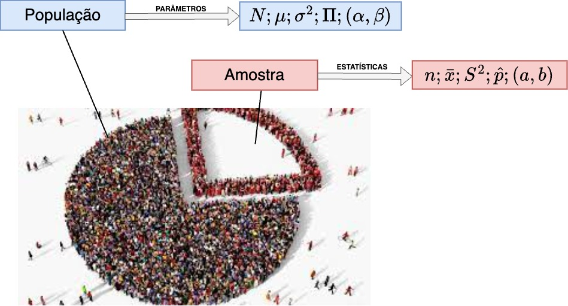

```{r, echo=FALSE, include=FALSE}
colFmt <- function(x,color) {
  
  outputFormat <- knitr::opts_knit$get("rmarkdown.pandoc.to")
  
  if(outputFormat == 'latex') {
    ret <- paste("\\textcolor{",color,"}{",x,"}",sep="")
  } else if(outputFormat == 'html') {
    ret <- paste("<font color='",color,"'>",x,"</font>",sep="")
  } else {
    ret <- x
  }

  return(ret)
}

#uso>>>> `r colFmt("REG",'red')`, 


```

<style>
.small-equation80 {
  font-size: 80%; 
}
</style>

<style>
.small-equation70 {
  font-size: 70%; 
}
</style>


<style>
.small-equation60 {
  font-size: 60%; 
}
</style>


<style>
.small-equation40 {
  font-size: 40%; 
}
</style>


<style>
blockquote {
  background-color: #c0c0c0; /* Fundo cinza claro */
  border-left: 4px solid #21130d; /* Barra lateral */
  padding: 10px;
  margin: 10px 0;
  border-radius: 4px; /* Bordas arredondadas */
  /* Remove o itálico padrão */
  color: #21130d; /* Cor do texto */
}
</style>


```{r , echo = FALSE, include=FALSE}
library(texPreview)
library(kableExtra)
library(knitr)
library(ggplot2)
library(MASS)      # Para boxcox
library(lmtest)    # Para testes de heterocedasticidade
library(nortest)   # Para testes de normalidade
library(car)       # Para vif e outras diagnósticas
knitr::opts_chunk$set(echo = TRUE)

```


# Introdução à Regressão Linear{#introducao-a-regressao-linear}

<br>

---


<figure class="image">
  <figcaption style="font-size: 20px;"><center>"Essentially, all models are wrong,but some are useful [...]" (George Edward Pelham Box, 1919 - 2013)<center></figcaption>
</figure>


---

## Contexto 


<br> 

Diversos fenômenos observados no mundo real podem ser descritos por meio de uma relação entre duas ou mais variáveis. Essa relação pode ser representada por um modelo matemático, que associa a *variável dependente* com a(s) *variável(is) independente(s)*. 

<br>

>Natureza das variáveis (dados):

<br>

- Variáveis qualitativas:  
  - ordinais (nível de escolaridade,  classe de rendimento, padrão construtivo)  
  - nominais (cor dos olhos, sexo, naturalidade)

- Variáveis Quantitativas. 
  - discretas (anos completos de idade/escolaridade, degraus de uma escada, andares de um edifício). 
  - contínuas (pesos, velocidades, comprimentos, áreas, volumes, tempo?)

<br> 


<figure class="image">
  <figcaption style="font-size: 20px;"><center>Quadro esquemático sobre a natureza das variáveis<center></figcaption>
</figure>

<br> 

>Relação das variáveis com o fenômeno estudado: 

<br>

- Variável dependente (explicada, prevista, regressando, resposta, endógena, saída, controlada) 

- Variável(is) independente(s) (explicativa, previsora, regressor, estímulo, exógena, entrada, controle)


<br>

Em geral estudamos a relação de uma única variável dependente $Y$ com  $k$ variáveis independentes $X_1, X_2, \ldots, X_k$ por meio de modelos. 

<br>

Em epistemologia, um modelo é uma **simplificação** de um sistema (conjunto de elementos ou componentes inter-relacionados) utilizado para compreender a realidade.

<br>

Ao focar em certos aspectos (variáveis analisadas) enquanto omite outros, permitem um raciocínio substitutivo (aprender a partir do modelo) para obter insights sobre o sistema real. Modelos funcionam como ferramentas epistêmicas para a investigação, sendo distintos de teorias completas.

<br>


<figure class="image">
  <figcaption style="font-size: 20px;"><center>Alguns modelos estatísticos de regressão/classificação<center></figcaption>
</figure>


<br>


A teoria de Regressão teve origem no século XIX com Galton. Em um de seus trabalhos, estudou a relação entre a altura dos pais e dos filhos $(X_i, Y_i)$, procurando saber como a altura do pai se relacionava com a altura do filho. 

<br>


Um modelo de regressão pode ser linear nas **variáveis** ou nos **parâmetros**. A linearidade nos parâmetros é a relevante para a formulação da teoria da regressão.  

<br>

Uma função é **linear nos parâmetros** se pode ser expressa como uma combinação linear dos parâmetros, onde nenhum parâmetro está elevado a uma potência ou multiplicado por outro parâmetro.

<br>

>Exemplos de modelos lineares nos parâmetros:

<br>

  - $Y = \alpha + \beta X^2$ (linear nos parâmetros, não linear em $X$) 
  - $Y = \alpha + \beta \ln(X)$
  - $Y = \alpha + \beta_1 X + \beta_2 X^2$

>Exemplos de modelos não lineares nos parâmetros:

<br>

  - $Y = \alpha e^{\beta X}$
  - $Y = \alpha X^{\beta}$

---

## Simples e Múltipla

<br>


Na regressão linear simples, objetiva-se determinar a relação entre uma única variável preditora $X$ e uma variável resposta $Y$ mediante a observação do fenômeno de interesse. Em experimentação (experimento planejado), o pesquisador define os valores de $X$ e observa os valores correspondentes de $Y$.

No entanto, fenômenos reais frequentemente dependem de múltiplos fatores simultaneamente. A **regressão linear múltipla** estende o conceito da regressão simples para incorporar $p$ variáveis preditoras $(X_1, X_2, \ldots, X_p)$, permitindo modelar a relação entre múltiplas variáveis independentes e a variável resposta $Y$. O modelo de regressão linear múltipla é expresso como:

$$Y = \alpha + \beta_1 X_1 + \beta_2 X_2 + \ldots + \beta_p X_p + \varepsilon$$

em que $\alpha$ é o intercepto, $\beta_j$ são os coeficientes angulares (ou coeficientes parciais de regressão), e $\varepsilon$ é o erro aleatório.

**Vantagens da Regressão Múltipla:**

- Modela simultaneamente o efeito de múltiplas variáveis sobre a resposta
- Permite controlar o efeito de variáveis confundidoras
- Aumenta o poder explicativo do modelo (maior $R^2$)
- Possibilita análise da contribuição individual de cada preditor mantendo os demais fixos

**Interpretação dos Coeficientes:**

Na regressão múltipla, o coeficiente $\beta_j$ representa a variação esperada em $Y$ quando $X_j$ aumenta em uma unidade, **mantendo todas as outras variáveis constantes** (coeficiente parcial). Esta interpretação difere da regressão simples, onde o coeficiente representa o efeito total da variável sem controlar por outros fatores.

<br> 

Considerem a proposição de John Maynard Keynes para a relação linear simples entre o consumo e a renda, onde ele postulava haver uma relação positiva entre ambos: uma mudança em uma das variáveis iria alterar a outra. Seu modelo funcional para essa relação, com $Y$ sendo as despesas de consumo e $X$ a renda, é:

<br> 

$$
Y = \alpha + \beta \cdot X
$$

<br>

Esse modelo admite que a verdadeira relação entre $Y$ e $X$ seja uma linha reta e que a observação $Y$ para cada nível de $X$ seja uma variável aleatória. Assim, o valor esperado de $Y$ para cada valor de $X$ é:

<br> 

$$
E(Y | X) = \alpha + \beta \cdot X
$$

<br>

É um modelo puramente teórico, de limitada aplicabilidade prática, pois pretende exprimir por uma relação exata (*determinística*) o consumo e a renda, quando se sabe que grande parte das relações entre duas variáveis não são exatas.

<br>

Ao se fixar a variável explicativa $X$ observa-se que há flutuações nos valores observados da variável explicada $Y$. Essa inexatidão, esse desvio da cada valor observado $Y_i$ em relação ao seu valor esperado pode ser expresso da seguinte maneira:

<br>

$$
\varepsilon_i = Y_i - E(Y | X_i).
$$

<br>

Assim, o modelo completo deve ser expresso como:

<br>

$$
Y_i = E(Y | X_i) + \varepsilon_i \\
Y_i = \alpha + \beta \cdot X_i + \varepsilon_i
$$

<br>

Os componentes desse modelo de regressão com uma variável independente são:

<br>

  - $\alpha$: intercepto da reta representando o valor esperado de $Y$ quando $X = 0$; ou seja, $E(Y|X=0)$. No contexto de Keynes, um consumo mínimo observado mesmo quando a renda é nula, em razão de programas de assistência governamental. 
  - $\beta$: inclinação da reta, representando a variação esperada de $Y$ para um aumento unitário em $X$ (a propensão marginal a consumir: $\frac{\Delta Y}{\Delta X}$).
  - $E(Y | X_i) = \alpha + \beta \cdot X_i$: componente sistemático ou determinístico, representando o gasto médio de todas as famílias com um mesmo nível de renda.
  - $\varepsilon_i$: termo de erro ou distúrbio estocástico, admitido como substituto para todas as **demais variáveis omitidas (negligenciadas)** no modelo e que podem afetar $Y$.

<br>

Nessa função:

<br> 

- $Y$: variável dependente (consumo).
- $X$: variável independente (renda).

<br>

Se o termo de erro $\varepsilon_i$ representa todas aquelas variáveis omitidas no modelo (mas que, coletivamente, afetam $Y$), **por que não formular um modelo de regressão com o máximo de variáveis possíveis?**


<br>

  - Embasamento teórico vago: A teoria existente suporta com certeza apenas algumas variáveis; o termo de erro $\varepsilon_i$ serve como um substituto para todas as variáveis excluídas no modelo.
  - Princípio da parcimônia: Um modelo mais simples que explique bem a relação é preferível.
  - Forma funcional equivocada: Em gráficos de dispersão, é mais fácil inferir a relação entre duas variáveis do que com muitas.
  - Limitação na quantidade de observações: Muitas variáveis exigem mais observações para garantir a precisão do modelo.


<br>

Sendo inviável (muitas vezes impossível) impossível observar toda a população e construir um *modelo populacional*, focamos o estudo em uma parte observada dessa população: uma *amostra*. 

<br>


<figure class="image">
  <figcaption style="font-size: 20px;"><center>Universo (parâmetros e amostras (estimativa/estatísticas<center></figcaption>
</figure>


<br> 

Um modelo funcional estimado com base em uma *amostra* apresenta **estimativas** dos **parâmetros** da função que o descreve na população. Por isso, adota-se uma notação diferente para a **função de regressão amostral**:

<br> 

$$
\hat{Y} = a + b \cdot X
$$

<br> 


em que>

  - $\hat{Y}$ é um estimador de $E(Y | X)$  
  - $a$ é uma estimativa do parâmetro $\alpha$. 
  - $b$ é uma estimativa do parâmetro $\beta$. 
  
<br> 

Frequentemente são vistas notações alternativas para as estimativas de $\alpha$ e $\beta$, como $\hat{\alpha}$ e $\hat{\beta}$ (ou ainda $\hat{\beta_0}$ e $\hat{\beta_1}$).

<br>


Para cada valor $x_i$ presente na amostra temos o valor observado $y_i$ e a **função de regressão amostral** nos retorna um valor estimado $\hat{y}_i = a + b \cdot x_i$. Como o valor observado $y_{i}$ pode ser decomposto em $y_i = \hat{y}_i + e_i$, o modelo pode ser expresso como:.

<br> 

$$
y_i = a + b \cdot x_i + e_i 
$$

<br> 

em que $e_i=y_i - \hat{y}_i$ é o resíduo de ajuste para a $i\text{-ésima}$ observação.

<br>


>**Mas, como estimar $a$ e $b$?**

---

## Método dos Mínimos Quadrados


<br>

Na literatura estatística há vários métodos de estimação dos parâmetros de um modelo de regressão linear, dentre os quais:

<br>


  - Método dos mínimos quadrados: desenvolvido por Carl Friedrich Gauss (1795), publicado por Adrien-Marie Legendre (1805), Friedrich Robert Helmert (1872).  
  - Método dos momentos: introduzido por Pafnuty Chebyshev (1887), desenvolvido por Karl Pearson (1894-1895), e posteriormente generalizado por Lars Peter Hansen (Método Generalizado dos Momentos - GMM, 1982).  
  - Método da máxima verossimilhança: formas rudimentares foram utilizadas por Carl Friedrich Gauss, Pierre-Simon Laplace, Thorvald N. Thiele e Francis Ysidro Edgeworth; a versão moderna foi criada e popularizada por Ronald Aylmer Fisher (1912-1922).

---

### Contexto

<br>


Desde tempos remotos as pessoas têm se interessado pelo problema de escolher o melhor valor único (médio) para resumir as informações fornecidas por várias observações, cada uma sujeita a erro. 

<br>

O problema de se estimar as constantes na equação da linha reta que melhor se ajusta a três ou mais pontos não colineares no plano (x, y) cujas coordenadas são pares de valores associados de duas variáveis relacionadas: $X$ e $Y$ remonta a Galileu Galilei (1632). 

<br>

Credita-se Johann Carl Friedrich Gauss como o desenvolvedor das bases fundamentais do Método dos mínimos quadrados, em 1795, quando Gauss tinha apenas dezoito anos. 

<br>


Mas o Método dos mínimos quadrados foi publicado pela primeira vez por por Adrien-Marie Legendre (1752-1833) em 1805: *Nouvelles méthodes pour la détermination des orbites des comètes*.

<br>


Alguns demonstradores:  

<br>

  - Robert Adrain (1775-1843) em 1808: *Research concerning the probabilities of the errors which happen in making observations*   
  - Johann Carl Friedrich Gauss (1777-1855) em 1809: *Theoria motus corporum coelestium* 
  - Pierre-Simon Laplace (1749-1827) em 1810: *Theorie analytique des Probabilite* - Johann Carl Friedrich Gauss (1777-1855) em 1823: *Theoria combinationis observationum erroribus obnoxiae*
  - James Ivory (1765-1842) em 1825: *On the Method of the Least Squares*.

<br>

Para a função de regressão amostral $\hat{y}_{i}= a + b.x_{i}$ - em que $e_i = y_i - \hat{y}_i$ é a diferença entre o valor observado e o valor estimado - a função procurada pode ser escrita como $y_i=a + bx_i + e_i$ e o o **problema** se resume a determinar as constantes $a$ e $b$ da equação de uma linha reta que melhor se ajusta a três ou mais pontos não colineares.

<br> 


A **solução** é minimizar a soma dos quadrados dos resíduos:  

<br>


$$
min\left(\sum _{i=1}^{n}{e}_{i}^{2}\right).
$$


---

### Dedução para uma Regressão Linear Simples

<br>


O método dos mínimos quadrados (MMQ) é puramente geométrico: não faz nenhuma suposição sobre a distribuição dos dados ou dos erros (resíduos). Em outras palavras, ele é aplicado sem se preocupar com a natureza probabilística dos erros (resíduos).  (SIMULADOR 3)

<br>


O objetivo é apenas ajustar a melhor reta possível para um conjunto de pontos de dados. A partir da igualdade: 

<br>


$$
\sum _{i=1}^{n} [ y_{i} - \hat{y}_i ]^{2} = \sum _{i=1}^{n}{\left[y_i-\left(a+b{x}_{i}\right)\right]}^{2}
$$

<br>

a solução passa por derivar-se em relação a $a$ e em relação a $b$, igualando-se a *zero*: 

<br>


$$
\frac{\partial }{\partial a}\sum _{i=1}^{n}{\left[y_i-\left(a + b \cdot x_{i}\right)\right]}^{2}= 2 \cdot \sum _{i=1}^{n}\left(y_{i} - a - b \cdot x_{i}\right)\left(-1\right)=0 \\
\frac{\partial }{\partial b}\sum _{i=1}^{n}{\left[y_i-\left(a + b \cdot x_{i}\right)\right]}^{2}= 2\cdot \sum _{i=1}^{n}\left(y_{i} - a - b \cdot x_{i}\right)\left(-x_i\right)=0 
$$

<br>

Expandindo as derivadas e simplificando (dividindo por 2 e removendo os sinais negativos):

<br>

$$
\sum _{i=1}^{n}\left(y_{i}-a-b \cdot x_{i}\right) = 0 \\
\sum _{i=1}^{n}\left(y_{i}-a-b \cdot x_{i}\right) \cdot x_i = 0
$$

<br>

Desenvolvendo a primeira equação:

<br>

$$
\sum _{i=1}^{n}y_{i} - \sum _{i=1}^{n}a - \sum _{i=1}^{n}b \cdot x_{i} = 0 \\
\sum _{i=1}^{n}y_{i} - n \cdot a - b \cdot \sum _{i=1}^{n}x_{i} = 0
$$

<br>

Desenvolvendo a segunda equação:

<br>


$$
\sum _{i=1}^{n}y_{i} \cdot x_i - \sum _{i=1}^{n}a \cdot x_i - \sum _{i=1}^{n}b \cdot x_{i}^2 = 0 \\
\sum _{i=1}^{n}y_{i} \cdot x_i - a \cdot \sum _{i=1}^{n}x_i - b \cdot \sum _{i=1}^{n}x_{i}^2 = 0
$$

<br>

Rearranjando ambas as equações, obtemos o **sistema de equações normais**:

<br>


$$
\begin{cases}
a \cdot n + \left(\sum_{i=1}^{n}x_{i}\right) \cdot b = \sum_{i=1}^{n}y_{i} \\
\left(\sum_{i=1}^{n}x_{i}\right) \cdot a + \left(\sum_{i=1}^{n}x_{i}^{2}\right) \cdot b = \sum_{i=1}^{n}x_{i} \cdot y_{i}
\end{cases}
$$

<br>

ou, equivalentemente:

<br>

$$
\begin{cases}
a \cdot n + b \cdot \sum_{i=1}^{n}x_{i} = \sum_{i=1}^{n}y_{i} \\
a \cdot \sum_{i=1}^{n}x_{i} + b \cdot \sum_{i=1}^{n}x_{i}^{2} = \sum_{i=1}^{n}x_{i} \cdot y_{i}
\end{cases}
$$

<br>

Após algumas manipulações algébricas obtemos as seguintes expressões para as estimativas: $a$ e $b$:

<br>

$$
a\cdot n + b\cdot \sum _{i=1}^{n}{x}_{i}=\sum _{i=1}^{n}{y}_{i}
$$
<br>


$$
a\cdot \sum _{i=1}^{n}{x}_{i}+b\cdot \sum _{i=1}^{n}{x}_{i}^{2}=\sum _{i=1}^{n}{x}_{i}\cdot {y}_{i}
$$

<br>

chegando-se à **estimativa** $b$ do parâmetro $\beta$, dada pelo **estimador de mínimos quadrados**:


<br>


$$
b=\frac{n\cdot \left(\sum _{i=1}^{n}{x}_{i}{y}_{i}\right)-\sum _{i=1}^{n}{x}_{i}\sum _{i=1}^{n}{y}_{i}}{n\cdot \sum _{i=1}^{n}{x}_{i}^{2}-{\left(\sum _{i=1}^{n}{x}_{i}\right)}^{2}}
$$

<br>


e à **estimativa** $a$ do parâmetro $\alpha$, dada pelo **estimador de mínimos quadrados**:
 

$$
a=\frac{\left(\sum _{i=1}^{n}{x}_{i}^{2}\right)\cdot \left(\sum _{i=1}^{n}{y}_{i}\right)-\left(\sum _{i=1}^{n}{x}_{i}{y}_{i}\right)\cdot \left(\sum _{i=1}^{n}{x}_{i}\right)}{n\cdot \left(\sum _{i=1}^{n}{x}_i^{2}\right)-{\left(\sum _{i=1}^{n}{x}_{i}\right)}^{2}}
$$

<br>


Se definirmos $S_{xy}$ e $S_{xx}$ como sendo: 

<br>


$$
S_{xy} = \sum _{i=1}^{n} x_{i}y_{i} - \frac{\sum _{i=1}^{n}x_{i}\cdot\sum _{i=1}^{n}y_{i}}{n}
$$

<br>

e

<br>

$$
S_{xx} = \sum _{i=1}^{n} x_{i}^{2} - \frac{(\sum _{i=1}^{n} x_{i})^{2}}{n}
$$

<br>


então podemos escrever:

<br>

$$
b = \frac{S_{xy}}{S_ {xx}}\\
\text{e} \\
a = \stackrel{-}{y} - b\cdot\stackrel{-}{x}.
$$

<br>

Uma vez que 

<br>

$$
\stackrel{-}{y}=\frac{\sum _{i=1}^{n}{y}_{i}}{n}\\
\text{e}\\
\stackrel{-}{x}=\frac{\sum _{i=1}^{n}{x}_{i}}{n}
$$

<br>


o estimador **$a$** pode ser reescrito na forma:

<br>

$$
a = \frac{\sum _{i=1}^{n}{y}_{i} - b . \sum _{i=1}^{n}{x}_{i}}{n}
$$

<br>


Portanto, $a$ e $b$ são os estimadores de mínimos quadrados do intercepto e inclinação, respectivamente. O modelo de regressão linear simples ajustado é dado por:

<br>

$$
\hat{y}_i = a  + b  x_i
$$

<br>


que dá uma estimativa pontual da média de $Y$ para cada valor de $X$.

---

### Expressão Matricial

<br>


Na forma matricial para um modelo de regressão linear múltipla com $p$ variáveis preditoras, sejam os vetores e matrizes:

<br>


$$
Y = \begin{bmatrix} y_1 \\ y_2 \\ \vdots \\ y_n \end{bmatrix}, \quad
X = \begin{bmatrix} 
1 & x_{11} & x_{12} & \cdots & x_{1p} \\ 
1 & x_{21} & x_{22} & \cdots & x_{2p} \\ 
\vdots & \vdots & \vdots & \ddots & \vdots \\ 
1 & x_{n1} & x_{n2} & \cdots & x_{np} 
\end{bmatrix}, \quad
\boldsymbol{\beta} = \begin{bmatrix} \beta_0 \\ \beta_1 \\ \beta_2 \\ \vdots \\ \beta_p \end{bmatrix}, \quad
\boldsymbol{\varepsilon} = \begin{bmatrix} \varepsilon_1 \\ \varepsilon_2 \\ \vdots \\ \varepsilon_n \end{bmatrix}
$$

<br>


em que:

  - $Y$ é o vetor $n \times 1$ das observações da variável resposta
  - $X$ é a matriz $n \times (p+1)$ de planejamento (ou matriz de delineamento)
  - $\boldsymbol{\beta}$ é o vetor $(p+1) \times 1$ dos parâmetros do modelo
  - $\boldsymbol{\varepsilon}$ é o vetor $n \times 1$ dos erros aleatórios

<br>

Note que o número de colunas de $X$ é $(p+1)$, igual ao número de parâmetros a serem estimados, e o número de linhas de $X$ é $n$, o tamanho da amostra. A primeira coluna de $X$ é um vetor com elementos iguais a 1, correspondente ao intercepto $\beta_0$. As demais colunas contêm os valores das $p$ variáveis preditoras. 

<br>

O vetor aleatório $\boldsymbol{\varepsilon}$ é composto de variáveis independentes, com distribuição normal $\varepsilon \sim N(\boldsymbol{0}, \sigma^2 \boldsymbol{I})$. O vetor esperança dos elementos de $\boldsymbol{\varepsilon}$ é o vetor nulo de dimensão $n$. A matriz de variância-covariância de $\boldsymbol{\varepsilon}$ possui na diagonal principal as variâncias $\sigma^{2}$ e, nos demais elementosm, as covariâncias $Cov[\varepsilon_i, \varepsilon_j] = 0$ para $i \neq j$, com $i, j = 1, 2, \ldots, n$.

<br>

Assim, pode-se assumir o modelo de regressão linear amostral da forma:

<br>

$$
\boldsymbol{Y} = \boldsymbol{X}\boldsymbol{\beta} + \boldsymbol{\varepsilon}
$$
<br>


Para regressão linear simples ($p=1$), a notação se reduz a:

<br>


$$
Y = \begin{bmatrix} y_1 \\ y_2 \\ \vdots \\ y_n \end{bmatrix}, \quad
X = \begin{bmatrix} 1 & x_1 \\ 1 & x_2 \\ \vdots & \vdots \\ 1 & x_n \end{bmatrix}, \quad
\boldsymbol{\beta} = \begin{bmatrix} \beta_0 \\ \beta_1 \end{bmatrix}, \quad
\boldsymbol{\varepsilon} = \begin{bmatrix} \varepsilon_1 \\ \varepsilon_2 \\ \vdots \\ \varepsilon_n \end{bmatrix}
$$

<br>

em que a matriz $\boldsymbol{X}$ possui dimensão $n \times 2$, com a primeira coluna de 1's e a segunda coluna contendo os valores $x_1, x_2, \ldots, x_n$ da única variável preditora.

<br>

O estimador de mínimos quadrados é:

<br>


$$
\hat{\boldsymbol{\beta}} = (X'X)^{-1}X'Y
$$

<br>


Os valores ajustados (preditos) podem ser expressos como:

<br>

$$
\boldsymbol{\hat{Y}} = \boldsymbol{X}\hat{\boldsymbol{\beta}} = \boldsymbol{X}(\boldsymbol{X}'\boldsymbol{X})^{-1}\boldsymbol{X}'\boldsymbol{Y} = \boldsymbol{HY}
$$

<br>

em que $\mathbf{H=X(X'X)^{-1}X'}$ é a chamada matriz $hat$ (chapéu). Propriedades da matriz chapéu:

<br>

- $\boldsymbol{H}$ é simétrica: $\boldsymbol{H' = H}$
- $\boldsymbol{H}$ é idempotente: $\boldsymbol{HH = H}$

<br>


```{r eval=FALSE}

X <- as.matrix(cbind(1, x))  # Matriz X
Y <- as.matrix(cbind(y))      # Matriz Y
XtX <- t(X) %*% X             # (X'X)
XtY <- t(X) %*% Y             # X'Y
INV <- solve(XtX)             # Inversa da matriz (X'X)
Betas <- INV %*% XtY          # Coeficientes

# Matriz Hat
H <- X %*% INV %*% t(X)       # Matriz hat H = X(X'X)^{-1}X'
h_ii <- diag(H)               # Elementos da diagonal (alavancagem)

# Valores ajustados e resíduos
Y_hat <- H %*% Y              # Valores ajustados
residuos <- Y - Y_hat         # Resíduos

``` 


---

<br>

> Exemplo 3: Um jornal deseja verificar a eficácia de seus anúncios na venda de carros usados e para isso realizou um levantamento de todos os seus anúncios e informações dos resultados obtidos pelas empresas que o contrataram e dele extraiu uma pequena amostra. A tabela abaixo mostra o número de anúncios e o correspondente número de veículos vendidos por 6 companhias que usaram apenas este jornal como veículo de propaganda. Obtenha a equação de regressão linear simples e estime o número de carros vendidos para um volume de 70 anúncios?  

<br>

<center>
<div class="small-equation80">


```{r eval=knitr::is_html_output(), results = "asis", echo = FALSE, message = FALSE}

tex2markdown <- function(texstring) {
  writeLines(text = texstring,
             con = myfile <- tempfile(fileext = ".tex"))
  texfile <- pandoc(input = myfile, format = "html")
  cat(readLines(texfile), sep = "\n")
  unlink(c(myfile, texfile))
}

textable <- "
\\begin{table}[h]
\\centering
\\caption{Quadro de dados da quantidade de carros vendidos por 6 empresas distintas em função da quantidade de anúncios feitos}
\\begin{tabular}{|c|c|c|}
\\hline 
Companhia & Anúncios feitos (X) & Carros vendidos (Y) \\\\ 
\\hline 
A & 74 & 139 \\\\ 
\\hline 
B & 45 & 108 \\\\ 
\\hline 
C & 48 & 98 \\\\ 
\\hline 
D & 36 & 76 \\\\ 
\\hline 
E & 27 & 62 \\\\ 
\\hline 
F & 16 & 57 \\\\ 
\\hline 
\\end{tabular}
\\end{table}
"

# Chama a função para converter e exibir a tabela
tex2markdown(textable)

```

</div>
</center>
---

<br>


```{r eval=knitr::is_html_output(), results = "asis", echo = FALSE, message = FALSE}

tex2markdown <- function(texstring) {
  writeLines(text = texstring,
             con = myfile <- tempfile(fileext = ".tex"))
  texfile <- pandoc(input = myfile, format = "html")
  cat(readLines(texfile), sep = "\n")
  unlink(c(myfile, texfile))
}

textable <- "
\\begin{table}[h]
\\centering
\\caption{Quadro para cálculo das estimativas $a$ e $b$ dos parâmetros do modelo}
\\begin{tabular}{|c|c|c|c|c|c|}
\\hline 
Companhia & Anúncios ($x$) & Carros vendidos ($y$) & $x_{i}.y_{i}$ & $x_{i}^2$ & $y_{i}^2$ \\\\ 
\\hline 
A & 74 & 139 & 10286 & 5476 & 19321 \\\\ 
\\hline 
B & 45 & 108 & 4860 & 2025 & 11664 \\\\ 
\\hline 
C & 48 & 98 & 4704 & 2304 & 9604 \\\\ 
\\hline 
D & 36 & 76 & 2736 & 1296 & 5776 \\\\ 
\\hline 
E & 27 & 62 & 1674 & 729 & 3844 \\\\ 
\\hline 
F & 16 & 57 & 912 & 256 & 3249 \\\\ 
\\hline 
Totais & 246 & 540 & 25172 & 12086 & 53458 \\\\ 
\\hline 
Valor médio & 41 & 90 &  &  &  \\\\ 
\\hline 
\\end{tabular}
\\end{table}
"

# Chama a função para converter e exibir a tabela
tex2markdown(textable)

```  

</center>

---

<br>

Sendo $n= 6$, $\stackrel{-}{y}= 90$ e $\stackrel{-}{x} = 41$:

$$
S_{xy} = \sum _{i=1}^{n} x_{i}y_{i} - \frac{\sum _{i=1}^{n}x_{i}\cdot\sum _{i=1}^{n}y_{i}}{n} = 25172 - \frac{246 \cdot 540}{6} = 3032 \\
S_{xx} = \sum _{i=1}^{n} x_{i}^{2} - \frac{(\sum _{i=1}^{n} x_{i})^{2}}{n} = 12086 - \frac{246^2}{6} = 2000 \\
{S}_{yy} = \sum _{i=1}^{n}y_{i}^{2} - \frac{(\sum _{i=1}^{n} y_{i})^{2}}{n}=   53458 - \frac{540^2}{6} = 4858
$$


<br>

As estimativas dos parâmetros do modelo serão:

$$
b = \frac{S_{xy}}{S_ {xx}} = \frac{3032}{2000} = 1,5160
$$

e

$$
a = \stackrel{-}{y} - b\cdot\stackrel{-}{x} = 90 - 1,5160 \cdot 41 = 27,844
$$

---
    
<br>


e o modelo toma a seguinte forma $\hat{y} = 27,844 + 1,5160 \cdot x$. Para um volume de anúncios de 70 veiculações teremos, em média, 134 carros vendidos.

---

<br>

```{r, echo=FALSE, fig.align='center', fig.width=7, fig.height=5, message=FALSE, warning=FALSE, results='hold'}


# Dados
anuncios <- c(74, 45, 48, 36, 27, 16)
carros_vendidos <- c(139, 108, 98, 76, 62, 57)

X <- as.matrix(cbind(1, anuncios))   # Matriz X
Y <- as.matrix(cbind(carros_vendidos))      # Matriz Y
XtX <- t(X) %*% X             # (X'X)
XtY <- t(X) %*% Y             # X'Y
INV <- solve(XtX)             # Inversa da matriz (X'X)
Betas <- INV %*% XtY          # Coeficientes

# Resultados
cat("Equação:", sprintf("Y = %.3f + %.4f * X\n", 
                        Betas[1], Betas[2]))

```

<br>


```{r, echo=FALSE, fig.align='center', fig.width=7, fig.height=5, message=FALSE, warning=FALSE, results='hold'}

# Dados
anuncios <- c(74, 45, 48, 36, 27, 16)
carros_vendidos <- c(139, 108, 98, 76, 62, 57)

# Modelo
modelo <- lm(carros_vendidos ~ anuncios)

# Resultados
cat("Equação:", sprintf("Y = %.3f + %.4f * X\n", 
                        coef(modelo)[1], coef(modelo)[2]))
cat("Predição para 70 anúncios:", 
    round(predict(modelo, data.frame(anuncios = 70))), "carros\n")


```


<br>

O método dos mínimos quadrados fornece estimativas para os parâmetros ($\boldsymbol{\beta}=\beta_0, \beta_1, \dots, \beta_p$)  para uma amostra específica. Contudo, diferentes amostras do mesmo fenômeno produzirão estimativas distintas. Como quantificar a variabilidade dessas estimativas e modo a ser possível estabelecer intervalos para cada uma? Como associar alguma medida de certeza para essas medidas? Para responder a essa questão pressuposições sobre a distribuição dos erros devem ser estabelecidas conduzindo ao arcabouço da inferência estatística em regressão.

<br>

---


## O Teorema de Gauss-Markov

<br>

O método dos mínimos quadrados (MMQ) é um procedimento puramente algébrico e geométrico que fornece estimativas para $a$ e $b$. Para responder às questões propostas devemos antes estabelecer certas propriedades estatísticas para essas estimativas.


<br>

O Teorema de Gauss-Markov estabelece que, sob certos pressupostos, os estimadores de MQO são os BLUE (*Best Linear Unbiased Estimators*) ou seja, possuem a **menor variância** possível dentro da classe de todos os estimadores lineares e não-enviesados.

<br>


<figure class="image">
  <figcaption style="font-size: 20px;"><center>Precisão e enviesamento<center></figcaption>
</figure>


<br>

Pressupostos de Gauss-Markov:

<br>


>1. Linearidade nos parâmetros: O modelo deve ser linear em relação aos parâmetros $\alpha$ e $\beta$, ou seja, a variável dependente $Y$ pode ser expressa como uma combinação linear desses parâmetros: $Y_i = \alpha + \beta X_i + \varepsilon_i$. 

   **Importante:** A linearidade refere-se aos **parâmetros**, não necessariamente à variável $X$. Por exemplo, os modelos $Y = \alpha + \beta X^2 + \varepsilon$ ou $Y = \alpha + \beta \ln(X) + \varepsilon$ ainda são **lineares nos parâmetros** $\alpha$ e $\beta$, mesmo que a relação com $X$ seja não-linear. Por outro lado, modelos como $Y = \alpha \cdot e^{\beta X} \cdot \varepsilon$ ou $Y = \alpha \cdot X^{\beta} \cdot \varepsilon$ **não são lineares** nos parâmetros (embora possam ser linearizados por transformações logarítmicas).

---
   
>2. Exogeneidade (ou Independência Média): A média condicional dos erros é zero dado qualquer valor de $X$: $E[\varepsilon_i | X_i] = 0$. Isto implica que não há correlação sistemática entre a variável explicativa $X$ e o termo de erro $\varepsilon$. 

   **Importante:** Este pressuposto garante que $X$ não carrega informação sobre o erro médio, ou seja, conhecer o valor de $X_i$ não nos ajuda a prever $\varepsilon_i$. Violações deste pressuposto ocorrem quando há variáveis omitidas relevantes (que estão em $\varepsilon$ mas correlacionadas com $X$), erros de medida em $X$, ou simultaneidade (quando $Y$ também influencia $X$). Quando este pressuposto é violado, os estimadores de MQO são **enviesados**.

---

>3. Homocedasticidade (Variância Constante): A variância do erro é constante para todas as observações, independentemente do valor de $X$: $Var(\varepsilon_i | X_i) = \sigma^2$ para todo $i$. 

   **Importante:** Este pressuposto estabelece que a dispersão dos erros ao redor da linha de regressão é a mesma para todos os níveis de $X$. A violação deste pressuposto — **heterocedasticidade** — ocorre quando $Var(\varepsilon_i | X_i) = \sigma_i^2$ varia com $X_i$. Por exemplo, em dados de renda familiar versus gastos com alimentação, a variabilidade dos gastos tende a aumentar com a renda. Sob heterocedasticidade, os estimadores de MQO permanecem não-enviesados, mas **perdem eficiência** (não são mais BLUE) e os **erros padrão** usuais ficam incorretos, comprometendo testes de hipóteses e intervalos de confiança.

---

>4. Ausência de Autocorrelação: Os erros de observações diferentes não estão correlacionados entre si: $Cov(\varepsilon_i, \varepsilon_j) = 0$ para todo $i \neq j$, ou equivalentemente, $E[\varepsilon_i \cdot \varepsilon_j] = 0$ para $i \neq j$.

   **Importante:** Este pressuposto é especialmente relevante para dados de **séries temporais** ou dados com estrutura **espacial**. Em séries temporais, a autocorrelação ocorre quando o erro no período $t$ está correlacionado com o erro no período $t-1, t-2$, etc. Por exemplo, em dados mensais de vendas, choques positivos tendem a persistir por vários meses. Em dados espaciais, propriedades vizinhas tendem a ter erros correlacionados. Sob autocorrelação, os estimadores de MQO permanecem não-enviesados, mas **perdem eficiência** e os **erros padrão usuais** tornam-se enviesados (sendo frequentemente subestimados em casos de autocorrelação positiva, comum em séries temporais).


---

O Teorema de Gauss-Markov não **exige** normalidade dos erros: sob esses quatro pressupostos, os estimadores de MQO já são os melhores estimadores lineares não-enviesados, mesmo que os erros não sejam normalmente distribuídos. Todavia, mesmo sendo os *BLUE*, ele não nos permite fazer as inferências estatísticas que antes estabelecemos, tais como:


  - construir intervalos de confiança para as estimativas
  - realizar testes de hipóteses sobre seus valores


Para realizar **inferências estatísticas**, devemos fazer uma **suposição adicional**. 

<br> 

Para tanto precisamos garantir que os erros ($\varepsilon_i$) do modelo de regressão linear sejam variáveis aleatórias **Normalmente distribuídas** com média zero e variância constante: 

<br>


$$
\varepsilon_i \sim N(0, \sigma^2)
$$

---

## Modelo de Regressão Linear com Erros Normais 

<br>

Consolidando os pressupostos de Gauss-Markov com a normalidade, temos que as premissas do modelo de regressão linear podem ser classificadas em quatro categorias:

<br>

>1. Linearidade: A relação entre a variável preditora $X$ e a variável resposta $Y$ é linear nos parâmetros; o valor esperado da variável resposta é uma combinação linear dos parãmetros

---

>2. Normalidade: $\varepsilon_i \sim N(0, \sigma^2)$ — os erros são normalmente distribuídos com média zero e variância constante.

   **Importante:** Este pressuposto é **adicional** aos pressupostos de Gauss-Markov e não é necessário para garantir que os estimadores de MQO sejam BLUE. A normalidade dos erros é fundamental para: (i) garantir que os estimadores $a$ e $b$ sejam também normalmente distribuídos, permitindo o uso das distribuições $t$ e $F$ para inferência; (ii) construir intervalos de confiança válidos; (iii) realizar testes de hipóteses em **amostras pequenas**. Para **amostras grandes**, o Teorema Central do Limite garante que os estimadores sejam aproximadamente normais mesmo sem este pressuposto. A violação da normalidade compromete principalmente a validade de intervalos de confiança e testes em amostras pequenas ($n < 30$).

---

>3. Independência estatística dos resíduos: $Cov(\varepsilon_i, \varepsilon_j) = E(\varepsilon_i \cdot \varepsilon_j) = 0$ para $i \neq j$, e, em particular, nenhuma correlação entre erros de observações sucessivas no caso de dados provenientes de uma série.

   **Importante:** Este pressuposto estabelece que o erro associado a uma observação não fornece informação sobre o erro de outra observação. A violação deste pressuposto — **autocorrelação** ou **correlação serial** — é particularmente comum em: (i) **séries temporais**, onde choques em $t$ persistem em períodos subsequentes $t+1, t+2, ...$; (ii) **dados espaciais**, onde observações geograficamente próximas tendem a ter erros correlacionados; (iii) **dados em painel**, com observações repetidas da mesma unidade ao longo do tempo. A presença de autocorrelação não enviesa os estimadores de MQO, mas os torna **ineficientes** (não são mais BLUE), e os **erros padrão usuais** ficam **enviesados**, levando a intervalos de confiança artificialmente estreitos e rejeição excessiva de $H_0$ em testes. A detecção pode ser feita pelo teste de Durbin-Watson ou análise gráfica dos resíduos ao longo do tempo.

---

>4. Homocedasticidade: $Var(\varepsilon_i) = E(\varepsilon_i^2) = \sigma^2$ — a variância dos erros é constante quando analisada frente aos valores estimados pelo modelo ($\hat{Y}$), a variável preditora ($X$) ou o tempo de coleta nos casos de dados provenientes de uma série.

   **Importante:** Este pressuposto requer que a dispersão dos erros seja **uniforme** ao longo de toda a amplitude de $X$ ou $\hat{Y}$. A violação deste pressuposto — **heterocedasticidade** — ocorre quando $Var(\varepsilon_i) = \sigma_i^2$ varia sistematicamente, sendo comum em: (i) dados de **corte transversal** com unidades de diferentes tamanhos (ex: renda e gastos de famílias, onde famílias ricas têm maior variabilidade); (ii) dados onde a **precisão da medição** varia entre observações; (iii) modelos onde a variável dependente cresce exponencialmente. Sob heterocedasticidade, os estimadores de MQO permanecem **não-enviesados** e **consistentes**, mas perdem **eficiência** (não são BLUE), e os **erros padrão** calculados pela fórmula usual ficam **incorretos**, comprometendo testes de hipóteses e intervalos de confiança. A detecção pode ser feita por gráficos de resíduos versus valores ajustados ou testes formais (Breusch-Pagan, White). Correções incluem transformações (Box-Cox, logarítmica) ou uso de erros padrão robustos (White, HC).---

---

### Propriedades dos Estimadores sob Erro Normal

<br>

Demonstra-se que, para um modelo $Y_{i}=\alpha+\beta\cdot X_{i}+\varepsilon_{i}$ que:

<br>

- $b$ \hspace{0.1cm} é um estimador não tendencioso do parâmetro $\beta$ com:

<br>

$$
E\left(b\right)=\beta \\
\text{e} \\
Var\left(b\right)=\frac{{\sigma }^{2}}{{S}_{xx}}\\
\text{em que}\\
S_{xx}=\sum(x_{i}-\bar{x})^{2}
$$

<br>

-  $a$ \hspace{0.1cm} é um estimador não tendencioso do parâmetro $\alpha$ com:

<br>


$$
E\left(a\right)=\alpha\\
\text{e} \\
Var\left(a\right)={\sigma }^{2}\cdot \left(\frac{1}{n}+\frac{{\stackrel{-}{x}}^{2}}{{S}_{xx}}\right)
$$


<br>

-  $\hat{\sigma^{2}}$ é um estimador não tendencioso de $\sigma^{2}$:

<br>


$$
S^{2} =  \text{QMRes} = \frac{S_{yy} -b  \cdot S_{xy}}{n-2}
$$

<br>


Assim os desvios padrão dos estimadores $a$ ($S_{a}$) e $b$ ($S_{b}$) serão

<br>


$$
S_{b} = \sqrt{\frac{{\hat{\sigma}}^{2}}{{S}_{xx}}}  = \sqrt{\frac{\text{QMRes}}{S_{xx}}}
$$

<br>


$$
S_{a} = \sqrt{{\hat{\sigma} }^{2}\cdot \left(\frac{1}{n}+\frac{{\stackrel{-}{x}}^{2}}{{S}_{xx}}\right)} = \sqrt{\text{QMRes} \cdot \left(\frac{1}{n}+\frac{{\stackrel{-}{x}}^{2}}{{S}_{xx}}\right)}
$$

<br>


lembrando que:

<br>


$$
S_{yy} = \sum (Y_i - \bar{Y})^2 \\
S_{xy} = \sum (X_i - \bar{X})(Y_i - \bar{Y}),
$$

<br>


e $n - 2$ representa os graus de liberdade, já que são dois parâmetros ($\alpha$ e $\beta$) sendo estimados.

---

### Consequências da Normalidade

<br>


A normalidade dos resíduos $\varepsilon_i$ garante que os estimadores $a$ e $b$ também sejam Normalmente distribuídos, o que é fundamental para realizar variadas inferências sobre o fenômeno estudado, na forma de testes de hipóteses e intervalos de confiança dos modelos de regressão linear ajustados. 


<br>

Isso permite o uso de distribuições de referência, como as distribuições $t$ e $F$, especialmente em amostras pequenas, onde a variância dos estimadores não pode ser assumida como conhecida com precisão.


<br>

Na estimação de um modelo de regressão linear simples com erro Normal (na forma $Y=\beta_{0}+\beta_{1}X+ \varepsilon$) muitas premissas preliminarmente como válidas deverão ser efetivamente verificadas a posteriori, na chamada etapa de diagnóstico do modelo, de modo a que a condução de inferências com esse modelo sejam dotada de razoável segurança.


<br>

Se qualquer uma dessas premissas for violada então uma conclusão científica baseada em resultados advindos desse modelo de regressão poderá estar seriamente comprometida. As violações desses pressupostos não podem ser detectadas pelas estatísticas de resumo do modelo que usualmente se dispõe logo após sua estimação: estatísticas $t$, $F$ dos testes de significância ou então o coeficiente de determinação $R^{2}$. 

---

<br>

Assim, é sobretudo fundamental examinar mais aprofundadamente o modelo de modo a se assegurar com razoável confiança de sua adequação aos dados antes de se avançar com seu uso. A esse exame denominamos análise diagnóstica do modelo.

---

## Análise Diagnóstica do Modelo de Regressão Linear

<br>

---

### Tipos de Resíduos

<br>

**Resíduos Padronizados** são escalonados para que possuam variância aproximadamente unitária, mantendo a esperança nula inerente aos resíduos brutos. Consequentemente $|d_i| > 3$ indica _outliers_.

<br>

$$
d_i = \frac{e_i}{S} =  \frac{e_i}{\sqrt{QMRes}} 
$$

<br>

com $i = 1, 2, \ldots, n$.

<br>


```{r, echo=FALSE, fig.align='center', fig.width=7, fig.height=5, message=FALSE, warning=FALSE, results='hold'}

residuos <- modelo$residuals
QMRes <- (summary(modelo)$sigma)^2
respad <- residuos / sqrt(QMRes)
cat("Os resíduos padronizados são: {", respad, "}")

```

<br>

**Resíduo na forma de Student (Studentized)** – os resíduos padronizados e estudentizados são parecidos, mas em algumas situações os resíduos estudentizados são mais sensíveis para detectar _outliers_, dados por:

<br>

$$
r_i = \frac{e_i}{\sqrt{S^2(1-h_{ii})}}
$$

<br>

com $i = 1, 2, \ldots, n$ e, caso para $|r_i| > 3$, há uma indicação de se tratarem de  _outliers_.

<br>

---

### Linearidade na relação entre a variável preditora $X$ e a variável resposta $Y$:

<br>

A violação da linearidade é extremamente grave pois um modelo ajustado a dados não lineares leva a previsões equivocadas não somente para valores situados além das fronteiras amostrais (como se usualmente observa) mas também para valores próximos ao seu centro. 

Uma técnica para se verificar a linearidade da relação é através de dois gráficos:

- valores observados _versus_ valores estimados; ou/e, 
- resíduos obtidos _versus_ valores estimados.

<br>


```{r, echo=FALSE, fig.align='center', fig.width=7, fig.height=5, message=FALSE, warning=FALSE, results='hold'}

# Dados do Exemplo 3
dados <- data.frame(
  Anuncios = c(74, 45, 48, 36, 27, 16),
  Carros_vendidos = c(139, 108, 98, 76, 62, 57)
)

# Ajuste do modelo
modelo <- lm(Carros_vendidos ~ Anuncios, data = dados)

# Extração de elementos do modelo
residuos <- residuals(modelo)
n <- length(residuos)  # ou length(carros_vendidos)
valores_ajustados <- fitted(modelo)
residuos_padronizados <- rstandard(modelo)
residuos_studentizados <- rstudent(modelo)


# Gráficos
par(mfrow = c(1, 2))

plot(valores_ajustados, dados$Carros_vendidos,
     xlab = "Valores estimados",
     ylab = "Valores observados",
     main = "Valores observados vs estimados",
     pch = 19, col = "blue")
abline(a = 0, b = 1, col = "red", lwd = 2)

plot(valores_ajustados, residuos,
     xlab = "Valores estimados",
     ylab = "Resíduos",
     main = "Resíduos vs valores estimados",
     pch = 19, col = "blue")
abline(h = 0, col = "red", lwd = 2)
```


Os padrões desejados nos gráficos acima deve assemelhar-se a:

- pontos dispersos de modo aproximadamente simétrico em torno de uma linha diagonal; e,
- pontos dispersos de modo aproximadamente simétrico em torno de uma linha horizontal, com uma variância aproximadamente homogênea.


Relações não lineares devem ser tratadas por meio da aplicação de uma transformação não linear adequada ao padrão da relação na variável resposta ou no variável preditora.

Para dados estritamente positivos com uma relação não linear a transformação com a função logaritmo pode ser uma opção. Se uma a transformação com o uso da função logaritmo é aplicada apenas à variável resposta isso equivalente a assumir que ela cresce (ou decai) exponencialmente como uma função da variável preditora.

Outra possibilidade a considerar é adicionar outra variável preditora na forma de uma função não linear como, por exepmplo, nos padrões de dispersão que mostrem uma curva parabólica onde pode fazer sentido regredir $Y$ em função de $X$ e $X^{2}$.

Finalmente, a relação não linear observada pode decorrer da omissão de outra(s) variáveis importantes que explicam ou corrigem o padrão não linear quando então modelos de regressão linear múltipla devem ser estudados.

---

### Homogeneidade da variância dos resíduos $\varepsilon_i$ (homocedasticidade):

<br>

A violação da homogeneidade de variância dos resíduos (heterocedasticidade) resulta numa estimação imprecisa do verdadeiro desvio padrão dos erros das estimativas e acarreta em intervalos de confiança irreais: são mais amplos ou mais estreitos do que deveriam ser, e resultam em elevada imprecisão nas inferências feitas com estatísticas baseadas na variância ($t$, $F$).

<br> 

Com variância constante (homocedasticidade) temos que $Var(\varepsilon|X_{i})=\sigma^{2}$; todavia o que se observa em muitas situações é que a variância está relacionada de algum modo funcional com a variável preditora ($\sigma^{2}=\mathcal{f}(X)$) e, assim:

<br>

$$
\begin{aligned}
Var(\varepsilon_{i}|X_{i})=\sigma^{2}_{i} \\
E(\varepsilon_{i}^{2})=\sigma^{2}_{i}
\end{aligned}
$$

<br>

Na presença de heterocedasticidade nos resíduos, os estimadores de mínimos quadrados continuam sendo não viesados e consistentes, mas perdem eficiência. Equivale a dizer que haverá um outro estimador para os parâmetros do modelo que terá uma variância menor mantendo propriedade de não viés:

<br>

$$
\begin{aligned}
Var(b^{*}) < Var(b)
\end{aligned}
$$

<br>

Uma técnica para se verificar a homocedasticidade dos resíduos é através dos gráficos:

- resíduos _versus_ valores estimados; ou,
- resíduos _versus_ a variável preditora

<br>


```{r, echo=FALSE, fig.align='center', fig.width=7, fig.height=5, message=FALSE, warning=FALSE, results='hold'}


# ----------------------------------------------------------------------------
# HOMOCEDASTICIDADE
# ----------------------------------------------------------------------------


par(mfrow = c(1, 3))

# Gráfico 1: Resíduos vs valores ajustados
plot(valores_ajustados, residuos,
     xlab = "Valores estimados",
     ylab = "Resíduos",
     main = "Homocedasticidade:\nResíduos vs valores estimados",
     pch = 19, col = "blue")
abline(h = 0, col = "red", lwd = 2)

# Gráfico 2: Resíduos vs variável preditora
plot(anuncios, residuos,
     xlab = "Variável preditra (Anúncios)",
     ylab = "Resíduos",
     main = "Homocedasticidade:\nResíduos vs variável preditora X",
     pch = 19, col = "blue")
abline(h = 0, col = "red", lwd = 2)

# Gráfico 3: Resíduos absolutos vs valores ajustados
plot(valores_ajustados, abs(residuos),
     xlab = "Valores estimados",
     ylab = "|Resíduos|",
     main = "Homocedasticidade:\n|Resíduos| vs valores estimados",
     pch = 19, col = "blue")

```


<br>

Os padrões desejados nos gráficos acima devem assemelhar-se a pontos dispersos de modo aproximadamente simétrico em torno de um eixo horizontal e que não exibam, sistematicamente, nenhum padrão de crescimento ou decaimento na amplitude visual de sua dispersão como nas imagens acima.

<br>

Gráficos dos valores absolutos dos resíduos (ou do quadrado dos resíduos pois os sinais dos resíduos não são significativos para o propósito desse exame) contra a variável preditora $X$ ou em relação aos valores ajustados também são úteis para o diagnóstico da heterocedasticidade da variância dos resíduos. 

<br>

Esses gráficos são recomendados quando não há muitas observações no conjunto de dados pois a plotagem dos resíduos absolutos ou seus quadrados coloca as informações sobre a alteração das suas magnitudes acima da linha horizontal do zero o que facilita a inspeção visual de possíveis alterações de sua magnitude em relação a outra variável adotada no gráfico. 

<br>


A heterocedasticidade pode ser um subproduto de uma violação significativa das premissas de linearidade e/ou independência, caso em que todas essas violações podem ser conjuntamente corrigidas com a aplicação de uma transformação de potência na variável dependente que terá como objetivos:  


  - linearizar o ajuste tanto quanto possível; e/ou,
  - estabilizar a variância dos resíduos.

<br>


Algum cuidado e discernimento é requerido pois esses dois objetivos podem conflitar entre si. Geralmente opta-se em estabilizar a variância dos resíduos primeiramente para, só então analisar a linearização das relações. 

<br>

As transformações sugeridas pela família Box-Cox (1964) em função do valor que maximiza a verossimilhança perfilada são:


  - se $\lambda$=-2 $\rightarrow$ $\frac{1}{Y^{2}}$
  - se $\lambda$=-1 $\rightarrow$ $\frac{1}{Y}$
  - se $\lambda$=-0,5 $\rightarrow$ $\frac{1}{\sqrt{Y}}$
  - se $\lambda$=0 $\rightarrow$ log(Y)
  - se $\lambda$=0,50 $\rightarrow$ $\sqrt{Y}$
  - se $\lambda$=1 $\rightarrow$ Y
  - se $\lambda$=2 $\rightarrow$ $Y^{2}$


<br>


```{r, echo=FALSE, fig.align='center', fig.width=7, fig.height=5, message=FALSE, warning=FALSE, results='hold'}

# ----------------------------------------------------------------------------
# HOMOCEDASTICIDADE
# ----------------------------------------------------------------------------

# Transformação Box-Cox
par(mfrow = c(1, 1))
bc <- boxcox(modelo, lambda = seq(-2, 2, by = 0.1))
lambda_otimo <- bc$x[which.max(bc$y)]
cat("\nLambda ótimo da transformação Box-Cox:", lambda_otimo, "\n")

```

<br>


Testes de hipóteses para verificação da homogeneidade da variância em regressão:

- teste de Breusch-Pagan
- teste de Park

<br>

$$
\begin{cases}
H_{0}: Var(\varepsilon|X_{i}) = \sigma^{2} \text{ ou seja, constante para todo } i  \\
H_{1}: Var(\varepsilon|X_{i}) = \sigma^{2}_{i} \text{,  varia com  } i
\end{cases}
$$

<br>


```{r, echo=FALSE, fig.align='center', fig.width=7, fig.height=5, message=FALSE, warning=FALSE, results='hold'}

# ----------------------------------------------------------------------------
# HOMOCEDASTICIDADE
# ----------------------------------------------------------------------------

# Teste de Breusch-Pagan
bp_test <- bptest(modelo)
cat("\nTeste de Breusch-Pagan para heterocedasticidade:\n")
print(bp_test)

# Teste de Park
# 1. Modelo original
modelo <- lm(Carros_vendidos ~ Anuncios, data = dados)

# 2. Resíduos ao quadrado
residuos_sq <- residuals(modelo)^2

# 3. Logaritmos
ln_residuos_sq <- log(residuos_sq)
ln_anuncios <- log(dados$Anuncios)

# 4. Regressão auxiliar (Teste de Park)
park_model <- lm(ln_residuos_sq ~ ln_anuncios)

# 5. Resultado
summary(park_model)


```


---

### Independência

<br>

Quando as observações da amostra são independentes o que se espera é que seus resíduos apresentem-se aleatoriamente dispersos em torno da linha horizontal (zero) quando dispostos na sequência em que foram coletadas. O que se pretende aqui é verificar se há correlação serial entre os resíduos.

<br>

A autocorrelação pode ser definida como a correlação entre integrantes de séries de observações ordenadas no tempo (como as séries temporais) ou no espaço (como nos dados de corte transversal) quando então os resíduos de duas observações guardam correlação diferente de zero entre si:

<br>

$$
\begin{aligned}
cov(e_{i}, e_{j}|x_{i}, x_{j}) \neq 0  \\
i \neq j
\end{aligned}
$$

<br>


A correlação serial pode decorrer:

  - inércia: quando os efeitos na alteração da variável $X$ demoram a se manifestar na variável $Y$ (muito comum em dados econômicos);  
  - forma funcional do modelo incorreta;  
  - variáveis importantes foram omitidas.

<br>

Uma técnica para se verificar a ausência de correlação serial (independência dos resíduos $\hat{\varepsilon}$) é através do gráfico dos resíduos versus o tempo ou ordem no qual as observações foram realizadas.

<br>


```{r, echo=FALSE, fig.align='center', fig.width=7, fig.height=5, message=FALSE, warning=FALSE, results='hold'}


# ----------------------------------------------------------------------------
# INDEPENDÊNCIA DOS RESÍDUOS
# ----------------------------------------------------------------------------

# Dados do Exemplo 3
dados <- data.frame(
  Anuncios = c(74, 45, 48, 36, 27, 16),
  Carros_vendidos = c(139, 108, 98, 76, 62, 57)
)

# Ajuste do modelo
modelo <- lm(Carros_vendidos ~ Anuncios, data = dados)

# Extração de elementos do modelo
residuos <- residuals(modelo)
n <- length(residuos)  # ou length(carros_vendidos)
par(mfrow = c(1, 2))

# Gráfico: Resíduos vs ordem de coleta
plot(1:n, residuos,
     xlab = "Ordem de coleta",
     ylab = "Resíduos",
     main = "Independência:\nResíduos vs ordem",
     pch = 19, col = "blue", type = "b")
abline(h = 0, col = "red", lwd = 2)


```


---

### Normalidade dos Resíduos

<br>

A normalidade dos resíduos é essencial para a validade dos testes de hipóteses e intervalos de confiança em regressão. Embora pequenos afastamentos da normalidade não comprometam seriamente as inferências, desvios substanciais podem invalidar conclusões estatísticas, especialmente em amostras pequenas.

<br>

A análise gráfica constitui o primeiro passo para avaliar a normalidade dos resíduos. Os principais métodos incluem:

- **Comparação com frequências esperadas**: Sob normalidade, espera-se que 68% dos resíduos padronizados estejam em $\pm 1$ desvio padrão, 90% em $\pm 1{,}65$ desvios padrão e 95% em $\pm 1{,}96$ desvios padrão

- **Histograma**: Permite visualizar a forma da distribuição e compará-la com a curva normal teórica

- **Gráfico de caixa**: Identifica assimetria e presença de valores extremos

- **QQ-plot (gráfico quantil-quantil)**: Compara os quantis amostrais dos resíduos padronizados com os quantis teóricos da distribuição Normal padrão. Se os resíduos provêm de uma distribuição Normal, os pontos devem alinhar-se aproximadamente sobre uma reta

- **Gráfico com envoltória simulada**: Proposto por Ripley (1977), fornece bandas de confiança para avaliar desvios da normalidade

<br>


```{r, echo=FALSE, fig.align='center', fig.width=7, fig.height=5, message=FALSE, warning=FALSE, results='hold'}

# ----------------------------------------------------------------------------
# NORMALIDADE DOS RESÍDUOS
# ----------------------------------------------------------------------------

par(mfrow = c(2, 3))

# Gráfico 1: Histograma
hist(residuos,
     main = "Normalidade:\nHistograma",
     xlab = "Resíduos",
     ylab = "Densidade",
     col = "lightblue",
     border = "blue",
     probability = TRUE)
curve(dnorm(x, mean = mean(residuos), sd = sd(residuos)),
      add = TRUE, col = "red", lwd = 2)
legend("topright", legend = "Normal teórica", 
       col = "red", lwd = 2, bty = "n")

# Gráfico 2: Boxplot
boxplot(residuos,
        main = "Normalidade:\nBox-plot",
        ylab = "Resíduos",
        col = "lightblue",
        border = "blue")
abline(h = 0, col = "red", lwd = 2)

# Gráfico 3: QQ-plot
qqnorm(residuos,
       main = "Normalidade:\nQQ-plot",
       pch = 19, col = "blue")
qqline(residuos, col = "red", lwd = 2)

# Gráfico 4: Resíduos padronizados vs valores ajustados
plot(valores_ajustados, residuos_padronizados,
     xlab = "Valores ajustados",
     ylab = "Resíduos padronizados",
     main = "Normalidade:\nResíduos padronizados",
     pch = 19, col = "blue")
abline(h = c(-1.96, 0, 1.96), col = c("red", "darkgray", "red"),
       lty = c(2, 1, 2), lwd = c(2, 1, 2))
text(x = max(valores_ajustados) * 0.95, y = 2.2, 
     labels = "95%", col = "red", cex = 0.8)
text(x = max(valores_ajustados) * 0.95, y = -2.2, 
     labels = "95%", col = "red", cex = 0.8)

# Gráfico 5: Resíduos vs ordem de coleta (detecção de padrões)
plot(1:length(residuos), residuos,
     xlab = "Ordem de coleta",
     ylab = "Resíduos",
     main = "Normalidade:\nResíduos vs ordem",
     pch = 19, col = "blue", type = "b")
abline(h = 0, col = "red", lwd = 2)

# Gráfico 6: Densidade empírica vs teórica
plot(density(residuos_padronizados),
     main = "Normalidade:\nDensidade",
     xlab = "Resíduos padronizados",
     ylab = "Densidade",
     lwd = 2, col = "blue")
curve(dnorm(x, 0, 1), add = TRUE, col = "red", lwd = 2, lty = 2)
legend("topright", 
       legend = c("Empírica", "Normal(0,1)"),
       col = c("blue", "red"), 
       lwd = 2, lty = c(1, 2), bty = "n")

```

<br>


```{r, echo=FALSE, fig.align='center', fig.width=7, fig.height=5, message=FALSE, warning=FALSE, results='hold'}


# Verificação das frequências esperadas
prop_1sd <- mean(abs(residuos_padronizados) <= 1)
prop_1.65sd <- mean(abs(residuos_padronizados) <= 1.65)
prop_1.96sd <- mean(abs(residuos_padronizados) <= 1.96)

cat("\nFrequências observadas vs esperadas (sob normalidade):\n")
cat("Dentro de ±1,00 DP:", sprintf("%5.1f%%", prop_1sd * 100), 
    "(esperado: 68,0%)\n")
cat("Dentro de ±1,65 DP:", sprintf("%5.1f%%", prop_1.65sd * 100), 
    "(esperado: 90,0%)\n")
cat("Dentro de ±1,96 DP:", sprintf("%5.1f%%", prop_1.96sd * 100), 
    "(esperado: 95,0%)\n")

```

<br>

>Interpretação do QQ-plot

<br>

O gráfico quantil-quantil compara os quantis amostrais ordenados dos resíduos padronizados com os quantis teóricos da distribuição $N(0,1)$. Sob normalidade, os pontos devem dispor-se aproximadamente sobre uma linha reta. Padrões sistemáticos de afastamento indicam violações específicas:

- **Padrão "S"**: Distribuição com caudas curtas (platicúrtica), indicando concentração excessiva de valores próximos à média.

- **Padrão "S invertido"**: Distribuição com caudas longas (leptocúrtica), indicando presença de valores extremos além do esperado sob normalidade.

- **Padrão "J"**: Assimetria positiva (cauda direita mais longa).

- **Padrão "J invertido"**: Assimetria negativa (cauda esquerda mais longa).

<br>

>Considerações sobre diagnóstico de normalidade

<br>

A avaliação da normalidade dos resíduos apresenta desafios práticos:

1. **Tamanho amostral**: Em amostras pequenas ($n < 30$), a variação aleatória dificulta a distinção entre flutuações amostrais e desvios reais da normalidade. Para amostras muito grandes ($n \gtrsim 300$, as inferências tornam-se aproximadamente válidas mesmo com desvios moderados da normalidade devido à normalidade assintótica dos estimadores dos coeficientes de regressão.

2. **Outros desvios**: Inadequação da forma funcional ou heterocedasticidade podem distorcer a distribuição dos resíduos, confundindo o diagnóstico de normalidade.

3. **Tolerância a desvios**: Pequenos afastamentos da normalidade são aceitáveis e não comprometem seriamente as inferências, especialmente em amostras moderadas a grandes.

<br>

>Testes formais de normalidade

<br>

Embora a análise gráfica seja fundamental, testes de hipóteses formais complementam o diagnóstico:

**Hipóteses:**

$$
\begin{cases}
H_0: \text{os resíduos seguem distribuição Normal} \\
H_1: \text{os resíduos não seguem distribuição Normal}
\end{cases}
$$

<br>

**Testes mais utilizados:**

  - **Shapiro-Wilk** (Shapiro e Wilk, 1965): Recomendado para amostras pequenas a moderadas ($n \lesssim 200$)
  - **Kolmogorov-Smirnov** (Kolmogorov, 1933; Smirnov, 1948): Baseado na máxima diferença entre funções de distribuição empírica e teórica
  - **Lilliefors** (Lilliefors, 1967): Modificação do teste de Kolmogorov-Smirnov quando parâmetros são estimados
  - **Anderson-Darling** (Anderson e Darling, 1954): Dá maior peso às caudas da distribuição
  - **Jarque-Bera** (Jarque e Bera, 1987): Baseado em assimetria e curtose amostrais

**Outros testes:**

  - **Teste $K^2$ de D'Agostino** (D'Agostino, 1970)
  - **Teste de Cramér-von Mises** (Cramér, 1946; von Mises, 1928)
  - **Teste de Shapiro-Francia** (Shapiro e Francia, 1972)
  - **Teste $\chi^2$ de Pearson** (Pearson, 1900)
  - Teste de correlação linear entre resíduos ordenados e quantis teóricos

<br>


```{r, echo=FALSE, fig.align='center', fig.width=7, fig.height=5, message=FALSE, warning=FALSE, results='hold'}

# Testes de normalidade
cat("\nTestes formais de normalidade:\n\n")

# Shapiro-Wilk
sw_test <- shapiro.test(residuos)
cat("Teste de Shapiro-Wilk:\n")
cat("  Estatística W =", round(sw_test$statistic, 4), "\n")
cat("  p-valor =", round(sw_test$p.value, 4), "\n\n")

# Testes adicionais (via nortest)
if(require(nortest, quietly = TRUE)) {
  # Lilliefors (Kolmogorov-Smirnov)
  ks_test <- lillie.test(residuos)
  cat("Teste de Lilliefors (Kolmogorov-Smirnov):\n")
  cat("  Estatística D =", round(ks_test$statistic, 4), "\n")
  cat("  p-valor =", round(ks_test$p.value, 4), "\n\n")
  
  # Anderson-Darling (requer n > 7)
  if(length(residuos) > 7) {
    ad_test <- ad.test(residuos)
    cat("Teste de Anderson-Darling:\n")
    cat("  Estatística A =", round(ad_test$statistic, 4), "\n")
    cat("  p-valor =", round(ad_test$p.value, 4), "\n\n")
  } else {
    cat("Teste de Anderson-Darling:\n")
    cat("  Não aplicável (requer n > 7)\n\n")
  }
}

cat("Interpretação: p-valor > 0,05 indica não rejeição de H₀ (normalidade)\n")

```

<br>


```{r, echo=FALSE, fig.align='center', fig.width=7, fig.height=5, message=FALSE, warning=FALSE, results='hold'}

# QQ-plot
qqnorm(residuos_padronizados, 
       main = "QQ-plot", 
       pch = 19, col = "blue")
qqline(residuos_padronizados, col = "red", lwd = 2)

# Teste de Shapiro-Wilk
shapiro.test(residuos)

# Outros testes (pacote nortest)
library(nortest)
lillie.test(residuos)      # Lilliefors

# Anderson-Darling (requer n > 7)
if(length(residuos) > 7) {
  ad.test(residuos)
} else {
  cat("\nTeste de Anderson-Darling: não aplicável (requer n > 7)\n")
}

```


---

### Observações Inconsistentes

<br>

**Outliers** são observações que se afastam substancialmente do padrão geral dos dados. Contudo, nem toda observação distante do centroide dos dados necessariamente é uma observação problemática: é fundamental distinguir observações **naturalmente extremas** de erros que comprometam a validade do modelo.

<br>

Observações extremas podem originar-se de:

- Erros não amostrais: falhas na coleta, registro ou processamento dos dados (instrumentos descalibrados, erros de transcrição, observadores diferentes, equipamentos diversos)
- Variabilidade natural do fenômeno: observações legítimas que refletem eventos raros, mas genuínos, do processo estudado

<br>

A distinção entre essas situações é crucial: enquanto **erros não amostrais** devem ser corrigidos ou excluídos quando identificados, **observações extremas legítimas** fornecem informação valiosa sobre a variabilidade do fenômeno e não devem ser descartadas arbitrariamente.

<br>

Embora a identificação de observações inconsistentes deva iniciar na análise exploratória dos dados (EDA), muitos erros só se tornam evidentes **após** o ajuste do modelo, quando a análise dos resíduos revela padrões anômalos.

<br>


_Outliers_ devem ser removidos da análise **apenas** quando há evidência objetiva de que representam erros de coleta, registro, cálculo ou circunstâncias análogas. 

<br>

Observações extremas que refletem variabilidade genuína do fenômeno **não devem** ser descartadas, mesmo que exerçam influência no modelo, pois sua remoção resultaria em perda de informação relevante sobre o processo estudado.

<br> 

Uma técnica para se verificar a presença de observações inconsistentes é através dos seguintes gráficos:

  - Gráfico de caixa ( _box-plot_) dos resíduos padronizados: identifica observações afastadas da distribuição central por meio de análise univariada  
  - Resíduos padronizados _versus_ valores ajustados: permite identificar simultaneamente outliers ($|d_i| > 3$) e avaliar homocedasticidade  
  - Resíduos padronizados _versus_ variável preditora: complementa a análise anterior, revelando se outliers concentram-se em regiões específicas de $X$  
  - Resíduos estudentizados _versus_ valores ajustados: mais sensíveis para detectar pontos de alta alavancagem e influência ($∣r_i∣>3$)


<br>


```{r, echo=FALSE, fig.align='center', fig.width=7, fig.height=5, message=FALSE, warning=FALSE, results='hold'}


# ----------------------------------------------------------------------------
# OBSERVAÇÕES INCONSISTENTES
# ----------------------------------------------------------------------------

# Dados do Exemplo 3
dados <- data.frame(
  Anuncios = c(74, 45, 48, 36, 27, 16),
  Carros_vendidos = c(139, 108, 98, 76, 62, 57)
)

# Ajuste do modelo
modelo <- lm(Carros_vendidos ~ Anuncios, data = dados)

# Extração de elementos do modelo
residuos <- residuals(modelo)
n <- length(residuos)  # ou length(carros_vendidos)
valores_ajustados <- fitted(modelo)
residuos_padronizados <- rstandard(modelo)
residuos_studentizados <- rstudent(modelo)

par(mfrow = c(2, 2))

# Gráfico 1: Box-plot dos resíduos padronizados
boxplot(residuos_padronizados,
        main = "Outliers:\nBox-plot dos resíduos",
        ylab = "Resíduos padronizados",
        col = "lightblue",
        border = "blue",
        outcol = "red",
        outpch = 19)
abline(h = c(-3, 3), col = "red", lty = 2, lwd = 1)
abline(h = 0, col = "darkgray", lwd = 1)

# Gráfico 2: Resíduos padronizados vs valores ajustados
plot(valores_ajustados, residuos_padronizados,
     xlab = "Valores ajustados",
     ylab = "Resíduos padronizados",
     main = "Outliers:\nResíduos vs ajustados",
     pch = 19, col = "blue")
abline(h = c(-3, 3), col = "red", lty = 2, lwd = 2)
abline(h = 0, col = "red", lwd = 1)

# Gráfico 3: Resíduos padronizados vs variável preditora
plot(anuncios, residuos_padronizados,
     xlab = "Anúncios",
     ylab = "Resíduos padronizados",
     main = "Outliers:\nResíduos vs X",
     pch = 19, col = "blue")
abline(h = c(-3, 3), col = "red", lty = 2, lwd = 2)
abline(h = 0, col = "red", lwd = 1)

# Gráfico 4: Resíduos studentizados vs valores ajustados
plot(valores_ajustados, residuos_studentizados,
     xlab = "Valores ajustados",
     ylab = "Resíduos studentizados",
     main = "Outliers:\nResíduos studentizados",
     pch = 19, col = "blue")
abline(h = c(-3, 3), col = "red", lty = 2, lwd = 2)
abline(h = 0, col = "red", lwd = 1)


```


---

### Observações Influentes 

<br>

Uma observação é considerada **influente** quando sua presença ou ausência no conjunto de dados altera substancialmente as estimativas dos parâmetros do modelo. A detecção de pontos influentes é crucial devido ao impacto que causam no ajuste do modelo e nos pressupostos, devendo ser analisada em conjunto com as análises de resíduo. A presença de outliers pode:

<br>

  - Distorcer as estimativas dos coeficientes  
  - Inflar a variância residual  
  - Violar pressupostos do modelo (normalidade, homocedasticidade)

<br>

A matriz $\boldsymbol{H}$ (matriz Hat ou matriz chapéu) tem importante papel no diagnóstico de pontos influentes, determinando as variâncias e covariâncias do valor estimado $(\hat{Y})$ e dos erros. Os elementos $h_{ii}$ da diagonal da matriz de projeção $H$ são escritos como:

<br>

$$
h_{ii} = \boldsymbol{x_i'(X'X})^{-1}x_i
$$

<br>

em que $\boldsymbol{x'_i}$ é o vetor transposto da $i$-ésima observação do centro no espaço das variáveis preditoras.

<br>

Há diferentes opiniões sobre os valores críticos para essa medida:

<br>

  - $h_{ii}>2\frac{p}{n}$ (Hoaglin, D. C. and Welsch, R. E, 1978. The hat matrix in regression and ANOVA)
  - $h_{ii}> 3\frac{p}{n}$

<br>

em que $p$ é o número de parâmetros estimados no modelo ($\hat{\beta_{0}}$ e $\hat{\beta_{1}}$: 2 para uma regressão linear simples). Tradicionalmente assume-se que valores de $h_{ii}$ que excedem $(2p/n)$ indicam pontos influentes que merecem investigação mais detalhada.

<br>

David Sam Jayakumar e A. Sulthan (Exact distribution of Hat Values and Identification of Leverage Points, 2014) propuseram a distribuição teóricas exata para os valores da diagonal da matriz de projeção [link de acesso ao recurso](http://www.researchgate.net/publication/265423863).


```{r, echo=FALSE, fig.align='center', fig.width=7, fig.height=5, message=FALSE, warning=FALSE, results='hold'}


# ----------------------------------------------------------------------------
# PONTOS DE ALAVANCA (LEVERAGE)
# ----------------------------------------------------------------------------

# Dados do Exemplo 3
dados <- data.frame(
  Anuncios = c(74, 45, 48, 36, 27, 16),
  Carros_vendidos = c(139, 108, 98, 76, 62, 57)
)

# Ajuste do modelo
modelo <- lm(Carros_vendidos ~ Anuncios, data = dados)

# Calcular leverage (hat values)
n <- length(dados$Anuncios)
p <- 2  # número de parâmetros (beta0 e beta1)
hat_values <- hatvalues(modelo)

# Limites críticos
limite_hoaglin <- 2 * p / n
limite_alternativo <- 3 * p / n

cat("\nPontos de alavanca (leverage):\n")
cat("Limite de Hoaglin (2p/n):", limite_hoaglin, "\n")
cat("Limite alternativo (3p/n):", limite_alternativo, "\n")
cat("\nValores de leverage:\n")
print(hat_values)
cat("\nPontos com leverage alto (>", limite_hoaglin, "):\n")
print(which(hat_values > limite_hoaglin))

# Gráfico 3: Leverage
plot(1:n, hat_values,
     xlab = "Índice da observação",
     ylab = "Leverage",
     main = "Pontos de alavanca",
     pch = 19, col = "blue")
abline(h = limite_hoaglin, col = "red", lty = 2, lwd = 2)
abline(h = limite_alternativo, col = "orange", lty = 2, lwd = 2)

```


---


#### DFBetas (_Difference in Betas_)

<br>

A estatística DFBetas indica o quanto cada coeficiente de regressão $\hat{\beta}_j$ se modifica, em unidades de desvio padrão, se a $i$-ésima observação for removida, refletindo a taxa de mudança provocada em $\hat{\boldsymbol{\beta}}$ pela retirada da observação $i$:

<br>

$$
DFBeta_{j,i} = \frac{\hat{\beta}_j - \hat{\beta}_{j(i)}}{\sqrt{S_{(i)}^2 C_{jj}}}
$$

<br>

com $i = 1, 2, \ldots, n$, sendo $C_{jj}$ o $j$-ésimo elemento da diagonal da matriz $\boldsymbol{C = (X'X)}^{-1}$ e:

<br>

$$
S_{(i)}^2 = \frac{(n-p-1)QMRes - e_i^2(1-h_{ii})}{(n-p-1)}
$$

<br>

onde $h_{ii}$ é o $i$-ésimo componente da diagonal da matriz $H$.

<br>

A observação $i$ tem influência no $j$-ésimo coeficiente de regressão quando $|DFBeta_{j,i}| > \frac{2}{\sqrt{n}}$, valores esses que requerem exame mais detalhado.

<br>


```{r, echo=FALSE, fig.align='center', fig.width=7, fig.height=5, message=FALSE, warning=FALSE, results='hold'}


# ----------------------------------------------------------------------------
# MEDIDAS DE INFLUÊNCIA
# ----------------------------------------------------------------------------
# DFBetas
dfbetas_valores <- dfbetas(modelo)
limite_dfbetas <- 2 / sqrt(n)
influentes <- apply(abs(dfbetas_valores) > limite_dfbetas, 1, any)
obs_influentes <- which(influentes)

# Relatório textual
cat("\n========================================\n")
cat("ANÁLISE DE DFBetas\n")
cat("========================================\n")
cat("Limite crítico (2/√n):", round(limite_dfbetas, 4), "\n")
cat("Número de observações:", n, "\n")
cat("Número de parâmetros:", p, "\n")
cat("Observações influentes:", length(obs_influentes), "\n")

if (length(obs_influentes) > 0) {
  cat("\nObservações que excedem o limite:\n")
  for (i in obs_influentes) {
    cat(sprintf("  Obs %d: ", i))
    params_excedidos <- which(abs(dfbetas_valores[i, ]) > limite_dfbetas)
    for (j in params_excedidos) {
      cat(sprintf("β%d = %.4f ", j-1, dfbetas_valores[i, j]))
    }
    cat("\n")
  }
} else {
  cat("\nNenhuma observação excede o limite crítico.\n")
}

```


---


#### DFFits (_Difference in fits_)

<br>

A estatística DFFits investiga a influência da $i$-ésima observação nos valores ajustados (preditos), refletindo o quanto o valor ajustado se modifica, em unidades de desvio padrão, se a $i$-ésima observação for removida:

<br>

$$
DFFits_i = \frac{\hat{Y}_i - \hat{Y}_{(i)}}{\sqrt{S_{(i)}^2 h_{ii}}} = \left(\frac{h_{ii}}{1-h_{ii}}\right)^{1/2} r_i
$$

<br>

com $i = 1, 2, \ldots, n$, em que $r_i$ são os resíduos estudentizados, $\hat{Y}_i$ é o valor predito e $\hat{Y}_{(i)}$ é o valor predito sem o uso da $i$-ésima observação.

<br>

Observações com $|DFFits_i| > 2\sqrt{\frac{p}{n}}$ requerem exame mais detalhado.

<br>


```{r, echo=FALSE, fig.align='center', fig.width=7, fig.height=5, message=FALSE, warning=FALSE, results='hold'}


# ----------------------------------------------------------------------------
# MEDIDAS DE INFLUÊNCIA
# ----------------------------------------------------------------------------

# DFFits
dffits_valores <- dffits(modelo)
limite_dffits <- 2 * sqrt(p / n)
influentes <- abs(dffits_valores) > limite_dffits
obs_influentes <- which(influentes)

# Relatório textual
cat("\n========================================\n")
cat("ANÁLISE DE DFFits\n")
cat("========================================\n")
cat("Limite crítico (2√(p/n)):", round(limite_dffits, 4), "\n")
cat("Número de observações:", n, "\n")
cat("Número de parâmetros:", p, "\n")
cat("Observações influentes:", length(obs_influentes), "\n")

if (length(obs_influentes) > 0) {
  cat("\nObservações que excedem o limite:\n")
  for (i in obs_influentes) {
    cat(sprintf("  Obs %d: DFFits = %.4f\n", i, dffits_valores[i]))
  }
} else {
  cat("\nNenhuma observação excede o limite crítico.\n")
}

```


---

#### Distância de Cook:

<br>


A estatística proposta por Dennis R. Cook mede a influência de uma observação sobre as estimativas dos parâmetros do modelo, quantificando o quanto a linha de regressão se alteraria caso esse dado fosse removido da análise. É uma medida da distância ao quadrado entre a estimativa usual de mínimos quadrados de $\boldsymbol{\beta}$, baseada em todas observações, e a estimativa obtida quando o $i$-ésimo ponto for removido, $\hat{\boldsymbol{\beta}}_{(i)}$:

<br>

$$
D_i = \frac{(\hat{\boldsymbol{\beta}} - \hat{\boldsymbol{\beta}}_{(i)})'(X'X)(\hat{\boldsymbol{\beta}} - \hat{\boldsymbol{\beta}}_{(i)})}{p\hat{\sigma}^2}
$$

<br>

com $i = 1, 2, \ldots, n$.

<br>

A medida da distância de Cook pode também ser expressa por:

<br>

$$
D_i = \frac{r_i^2}{p} \cdot \frac{h_{ii}}{(1-h_{ii})}
$$

<br>

com $i = 1, 2, \ldots, n$, onde $D_i$ consiste no quadrado do resíduo estudentizado, refletindo quão bem o modelo se ajusta à $i$-ésima observação $Y_i$, e o termo $(h_{ii}/(1-h_{ii}))$ é uma medida de distância do $i$-ésimo ponto do centroide dos $(n-1)$ pontos restantes.

<br>

Na regressão múltipla pode ocorrer de algum subconjunto de observações influenciarem por estarem longe da vizinhança onde o restante dos dados foi coletado, afetando a determinação do $R^2$, as estimativas dos coeficientes de regressão e a magnitude da média quadrática dos erros. A influência na locação pode ser investigada pelo gráfico das distâncias de Cook contra os valores ajustados.

<br>

Há vários critérios para se definir um valor limite para a estatística de Cook:

  - $D_{i}>1$: Cook e Weisberg, 1982 e Chatterjee, Hadi e Price, 2000  
  - Duas vezes a média das distâncias de Cook  
  - $D_{i}> \frac{4}{n}$: Bollen et al, 1990  
  - Valor crítico do quantil da distribuição F para uma significância igual a 0.5 com df1=p e df2=n-p

Quando $D_i$ for alto, indica que o $i$-ésimo ponto exerce influência; se $D_i > 1$, indica que o ponto exerce grande influência.

<br>


```{r, echo=FALSE, fig.align='center', fig.width=7, fig.height=5, message=FALSE, warning=FALSE, results='hold'}


# ----------------------------------------------------------------------------
# MEDIDAS DE INFLUÊNCIA
# ----------------------------------------------------------------------------
# Distância de Cook
cook_valores <- cooks.distance(modelo)
limite_cook <- 1  # Critério de Cook e Weisberg (1982)
influentes <- cook_valores > limite_cook
obs_influentes <- which(influentes)

# Relatório textual
cat("\n========================================\n")
cat("ANÁLISE DE DISTÂNCIA DE COOK\n")
cat("========================================\n")
cat("Limite crítico (D_i > 1):", limite_cook, "\n")
cat("Número de observações:", n, "\n")
cat("Número de parâmetros:", p, "\n")
cat("Observações influentes:", length(obs_influentes), "\n")

if (length(obs_influentes) > 0) {
  cat("\nObservações que excedem o limite:\n")
  for (i in obs_influentes) {
    cat(sprintf("  Obs %d: D_i = %.4f\n", i, cook_valores[i]))
  }
} else {
  cat("\nNenhuma observação excede o limite crítico.\n")
}


```
---

#### Influência na Precisão da Estimação

<br>


As medidas $D_i$, $DFBetas_{j,i}$ e $DFFits_i$ fornecem uma visão do efeito de cada observação nos coeficientes estimados e nos valores ajustados. Não fornecem, contudo, qualquer informação sobre a precisão geral da estimação. Para expressar o papel da $i$-ésima observação na precisão da estimação, utiliza-se a medida:

<br>


$$
COVRATIO_i = \frac{|(\boldsymbol{X'_{(i)}X_{(i)}})^{-1}S_{(i)}^2|}{|(\boldsymbol{X'X})^{-1}QMRes|} = \left(\frac{S_i^2}{QMres}\right)^p \cdot \frac{1}{1-h_{ii}}
$$

<br>

$i = 1, 2, \ldots, n$ em que $h_{ii}$ é o $i$-ésimo componente da diagonal da matriz $\boldsymbol{H}$.

<br>


Belsley et al. (1980) sugeriram que se: $COVRATIO_i > 1 + 3p/n$ ou se $COVRATIO_i < 1 - 3p/n$, então, o $i$-ésimo ponto é um possível ponto influente. Em geral, esses pontos de corte são mais apropriados para amostras grandes.

<br>


```{r, echo=FALSE, fig.align='center', fig.width=7, fig.height=5, message=FALSE, warning=FALSE, results='hold'}


# ----------------------------------------------------------------------------
# MEDIDAS DE INFLUÊNCIA
# ----------------------------------------------------------------------------
# COVRATIO
covratio_valores <- covratio(modelo)
limite_superior <- 1 + (3 * p / n)
limite_inferior <- 1 - (3 * p / n)
influentes <- (covratio_valores > limite_superior) | (covratio_valores < limite_inferior)
obs_influentes <- which(influentes)

# Relatório textual
cat("\n========================================\n")
cat("ANÁLISE DE COVRATIO\n")
cat("========================================\n")
cat("Limite superior (1 + 3p/n):", round(limite_superior, 4), "\n")
cat("Limite inferior (1 - 3p/n):", round(limite_inferior, 4), "\n")
cat("Número de observações:", n, "\n")
cat("Número de parâmetros:", p, "\n")
cat("Observações influentes:", length(obs_influentes), "\n")

if (length(obs_influentes) > 0) {
  cat("\nObservações que excedem os limites:\n")
  for (i in obs_influentes) {
    cat(sprintf("  Obs %d: COVRATIO = %.4f\n", i, covratio_valores[i]))
  }
} else {
  cat("\nNenhuma observação excede os limites críticos.\n")
}

# Resumo completo das medidas de influência
# inflm.model <- influence.measures(modelo)
# inflm.model
# summary(inflm.model)


```

---

### Multicolinearidade: Fator de Inflação da Variância (VIF)

<br>

Na **regressão linear múltipla**, além das dependências entre a variável resposta $Y$ e os regressores $X_j$, frequentemente ocorrem dependências entre os próprios regressores. Quando duas variáveis preditoras apresentam correlação perfeita, a matriz $(X^TX)$ torna-se singular (determinante = 0), impedindo a estimação dos coeficientes por mínimos quadrados.

<br>


```{r}
set.seed(42)
n <- 100
x1 <- rnorm(n)
x2 <- 2 * x1  # Correlação perfeita
y <- 3 + 5*x1 + rnorm(n, 0, 0.1)

# Correlação
cat("A correlação entre as variáveis é:", cor(x1,x2), "\n")

# Tentativa de ajuste (o R remove uma variável)
cat("No ajuste do modelo, o R remove automaticamente variáveis redundantes (nota `NA` no seu coeficiente)","\n")
modelo <- lm(y ~ x1 + x2)

```


<br>

Consequências

<br>

  - Coeficientes indeterminados (infinitas soluções)
  - Variância infinita dos estimadores
  - Inferência estatística impossível

<br>

A presença da multicolinearidade pode ser detectada de várias maneiras:

<br>

  - **Critério do VIF**: quanto maior o VIF, mais severa é a multicolinearidade. Valores de $VIF_j > 10$ indicam multicolinearidade problemática, enquanto $VIF_j > 5$ já sugere atenção.  
  - **Inconsistência nos testes**: se o teste F para significância global da regressão for significativo, mas os testes t individuais dos coeficientes não forem significativos, então a multicolinearidade está presente.  
  - **Sinais dos coeficientes**: coeficientes com sinais contrários à expectativa teórica podem indicar multicolinearidade.

<br>

Soluções:

<br>

  - Aumentar o tamanho amostral com novas observações especificamente projetadas para fragmentar as dependências lineares
  - Remover variáveis altamente correlacionadas do modelo (com a desvantagem de perder informação)
  - Utilizar métodos alternativos de estimação menos sensíveis à multicolinearidade, como Regressão Ridge ou Regressão de Componentes Principais

<br>


Não situações onde a multicolinearidade não é perfeita, uma medida de sua intensidade é dada pelo Fator de Inflação da Variância (Variance Inflation Factor-VIF). O VIF quantifica a multicolinearidade de cada preditor:

<br>

$$
VIF_j = \frac{1}{1 - R_j^2}
$$

<br>

onde $R_j^2$ é o coeficiente de determinação da regressão de $x_j$ contra os demais preditores.

<br>

Interpretação

  - VIF = 1: Sem correlação
  - VIF < 5: Aceitável
  - VIF ≥ 10: Multicolinearidade problemática

<br>

Por que "Inflação"?

<br>

$$
\text{Var}(\hat{\beta}_j) = \frac{\sigma^2}{(n-1)s_j^2} \cdot VIF_j
$$

<br>

O VIF multiplica a variância do estimador.

<br>

```{r}
library(car)
set.seed(42)
n <- 100
x1 <- rnorm(n)
x2 <- x1 + rnorm(n, 0, 0.1)  # Correlacionada com x1
x3 <- rnorm(n)
y <- 2 + 3*x1 + 4*x3 + rnorm(n)

modelo <- lm(y ~ x1 + x2 + x3)
cat("\n========================================\n")
cat("O modelo ajustado é:","\n")
summary(modelo)
cat("\n========================================\n")
        

# VIF de cada variável
cat("Os VIF das variáveis são:","\n")
vif(modelo)
cat("\n========================================\n")
# x1 e x2 terão VIF alto (~100)
# x3 terá VIF próximo de 1


# Correlação entre preditores
cat("A correlação linear par a par das variáveis é:","\n")
cor(data.frame(x1, x2, x3))
cat("\n========================================\n")
```


<br>


Observações:

  - o _VIF_ só se aplica a modelos de regressão múltipla (com duas ou mais variáveis preditoras). Em regressão linear simples, não há razão para se falar em multicolinearidade.
  - ele não indica qual variável remover

<br>

```{r, echo=FALSE, message=FALSE, warning=FALSE, results='hold'}

# Verificar se há variáveis suficientes para calcular VIF
if(length(coef(modelo)) > 2) {
  require(car)
  vif_valores <- vif(modelo)
  
  cat("\n========================================\n")
  cat("FATOR DE INFLAÇÃO DA VARIÂNCIA (VIF)\n")
  cat("========================================\n")
  cat("Critério: VIF > 10 indica multicolinearidade severa\n")
  cat("         VIF > 5 sugere atenção\n\n")
  
  print(round(vif_valores, 4))
  
  # Identificar variáveis problemáticas
  problematicas <- which(vif_valores > 10)
  atencao <- which(vif_valores > 5 & vif_valores <= 10)
  
  if(length(problematicas) > 0) {
    cat("\nVariáveis com multicolinearidade severa (VIF > 10):\n")
    cat(paste(" -", names(problematicas), ":", round(vif_valores[problematicas], 2), "\n"))
  }
  
  if(length(atencao) > 0) {
    cat("\nVariáveis que requerem atenção (5 < VIF ≤ 10):\n")
    cat(paste(" -", names(atencao), ":", round(vif_valores[atencao], 2), "\n"))
  }
  
  if(length(problematicas) == 0 && length(atencao) == 0) {
    cat("\nNenhum problema de multicolinearidade detectado.\n")
  }
} else {
  cat("\n========================================\n")
  cat("FATOR DE INFLAÇÃO DA VARIÂNCIA (VIF)\n")
  cat("========================================\n")
  cat("Não aplicável: modelo de regressão linear simples\n")
  cat("(VIF requer duas ou mais variáveis preditoras)\n")
}
```

---

## Métricas de Aferição da Qualidade de Ajuste de uma Regressão Linear

<br>

---

### Coeficiente de determinação $R^{2}$ da Regressão Linear

<br>


O coeficiente de determinação ($R^{2}$) é uma medida estatística que informa o quanto da variação observada na variável $Y$ está sendo explicada no modelo pela relação linear estabelecida com a variável $X$. 

<br>


$$
R^{2} = \frac{\text{variação explicada}}{\text{variação total}} \\
R^{2}=\frac{b\cdot S_{xy}}{{S}_{yy}}
$$

<br>

$$
R^{2}_{ajustado} = 1 - \frac{(1-R^2)(n-1)}{n-p-1}
$$
<br>

em que $n$ é o número de observações, $p$ é o número de variáveis independentes.

<br>


```{r, echo=FALSE, fig.align='center', fig.width=7, fig.height=5, message=FALSE, warning=FALSE, results='hold'}


# ----------------------------------------------------------------------------
# COEFICIENTE DE DETERMINAÇÃO
# ----------------------------------------------------------------------------
# Relatório textual
cat("\n========================================\n")
cat("COEF. DE DETERMINAÇÃO\n")
cat("========================================\n")
cat("R²:", round(summary(modelo)$r.squared, 4), "\n")
cat("R² ajustado:", round(summary(modelo)$adj.r.squared, 4), "\n")


```

---

### AIC (Akaike _Information Criterion_) e RMSE (_Root Mean Squared Error_)

<br> 


O AIC é um critério de informação que equilibra a qualidade do ajuste com a complexidade do modelo, penalizando a inclusão de parâmetros adicionais. 

<br> 

O RMSE representa a raiz quadrada da média dos quadrados dos resíduos, fornecendo uma medida da dispersão dos erros na mesma escala da variável resposta, facilitando a interpretação da magnitude dos erros de predição.

<br>


**Menores** valores de AIC e de RMSE indicam melhor modelo, sendo particularmente úteis na comparação.

<br>


```{r, echo=FALSE, fig.align='center', fig.width=7, fig.height=5, message=FALSE, warning=FALSE}

# Cálculo das métricas
aic_valor <- AIC(modelo)
rmse_valor <- sqrt(mean(residuals(modelo)^2))

# Relatório textual
cat("\n========================================\n")
cat("CRITÉRIOS DE QUALIDADE DO MODELO\n")
cat("========================================\n")
cat("AIC:", round(aic_valor, 4), "\n")
cat("RMSE:", round(rmse_valor, 4), "\n")
```

---

## Testes de Hipóteses da Regressão Linear

<br>

---

### Teste F (Análise de Variância da Regressão) 

<br>

A análise de variância comprova estatisticamente se os dados apresentam a suposta relação linear entre as variáveis preditoras e a variável resposta $Y$. Um procedimento estatístico para se comprovar se os dados apresentam a suposta relação linear entre as variáveis é testar a hipótese:

<br>


$$
\begin{cases}
H_0: \beta_1 = \beta_2 = \ldots = \beta_p = 0  \hspace{0.5cm}  \text{ie., não há regressão} \\
H_1: \text{pelo menos um } \beta_j \neq 0 
\end{cases}
$$

<br>

em que sob $H_0$ a estatística do teste $F_{calc}$ pode ser calculada pela Tabela a seguir:

<br>


| Causa de Variação | Graus de Liberdade | Soma de Quadrados | Quadrado Médio | F |
|-------------------|--------------------|-------------------|----------------|---|
| Regressão         | $p$                | $SQReg$           | $QMReg = \frac{SQReg}{p}$ | $\frac{QMReg}{QMRes}$ |
| Resíduo           | $n-p-1$            | $SQRes$           | $QMRes = \frac{SQRes}{n-p-1}$ | |
| Total             | $n-1$              | $SQTotal$         |                              | |

<br>


em que $F_{calc}$ segue a distribuição F de Fisher-Snedecor com $p$ graus de liberdade no numerador e $(n-p-1)$ graus de liberdade no denominador, e $p$ é o número de variáveis independentes no modelo.

<br>


>Conclusão: se $F_{calc} \geq F_{tab}[p, (n-p-1); \alpha]$, rejeita-se $H_0$ ao nível de significância adotado, e conclui-se que existe regressão significativa, em que $F_{tab}[p, (n-p-1); \alpha]$ é o quantil $(1-\alpha)$ da distribuição F de Fisher-Snedecor com $p$ graus de liberdade no numerador e $(n-p-1)$ graus de liberdade no denominador.

<br>

Observe que ao realizar a análise de variância, o procedimento é particionar a variação total em duas componentes:

<br>

$$
\underbrace{\sum_{i=1}^{n}(y_i - \bar{y})^2}_{SQTotal} = \underbrace{\sum_{i=1}^{n}(y_i - \hat{y}_i)^2}_{SQRes} + \underbrace{\sum_{i=1}^{n}(\hat{y}_i - \bar{y})^2}_{SQReg}
$$

<br>

ou seja, $SQTotal = SQRes + SQReg$, onde:

<br>

  - $SQTotal$: variação total de $Y$ em torno da média
  - $SQRes$: variação de $Y$ em torno dos valores ajustados (variação não explicada)
  - $SQReg$: variação dos valores ajustados em torno da média (variação explicada pelo modelo)

<br>

Portanto:

<br>

$$
SQTotal = \sum_{i=1}^{n}(y_i - \bar{y})^2
$$

<br>

$$
SQReg = \sum_{i=1}^{n}(\hat{y}_i - \bar{y})^2
$$

<br>

$$
SQRes = \sum_{i=1}^{n}(y_i - \hat{y}_i)^2 = SQTotal - SQReg
$$

<br>


```{r, echo=FALSE, fig.align='center', fig.width=7, fig.height=5, message=FALSE, warning=FALSE, results='hold'}

anova(modelo)

```
<br>


Para regressão linear simples ($p=1$), os graus de liberdade da regressão são 1 e do resíduo $n-2$, e o teste F é equivalente ao teste t do coeficiente ($F = t^2$).

---

### Testes ``t'' para os Parâmetros da Regressão


<br>


Para testar hipóteses sobre o intercepto (coeficiente linear) $(\alpha)$ e o coeficiente angular $(\beta)$ do modelo de regressão, deve-se fazer a suposição de que os $(e_i)$ são normalmente distribuídos, ou seja, assume-se que os erros $e_i \sim NID(0, \sigma^2)$.


---

#### Coeficiente Linear ($\alpha$)

<br>

O procedimento para se testar a hipótese sobre o intercepto 

<br>

$$
\begin{cases}
H_0: \alpha = \alpha_0   \\
H_1: \alpha \neq \alpha_0  
\end{cases}
$$

<br>

para o qual se usa a estatística $t_{calc}$:

<br>

$$
t_{calc} = \frac{\hat{\alpha} - \alpha_0}{\sqrt{QMRes\left(\frac{1}{n} + \frac{\bar{x}^2}{S_{xx}}\right)}}
$$

<br>

que sob $H_0$ segue uma distribuição t de Student com $(n-p-1)$ graus de liberdade.

<br> 

>Conclusão: rejeita-se a hipótese nula se $|t_{calc}| > t_{\alpha/2;(n-p-1)}$, em que $t_{\alpha/2;(n-p-1)}$ é o quantil $(1-\alpha/2)$ da distribuição t de Student com $(n-p-1)$ graus de liberdade, para um nível de significância $\alpha$. 
>Observação: para regressão linear simples, os graus de liberdade são $(n-2)$.


---

#### Coeficiente Angular ($\beta_j$)

<br>

Um procedimento similar pode ser usado para testar a hipótese sobre os coeficientes angulares. Para testar a hipótese de que o coeficiente angular $\beta_j$ é igual a um valor constante $\beta_{j,0}$:


<br>


$$
\begin{cases}
H_0: \beta_j = \beta_{j,0}   \\
H_1: \beta_j \neq \beta_{j,0}  
\end{cases}
$$

<br>

usa-se a estatística teste $t_{calc_j}$:

<br>

$$
t_{calc_j} = \frac{\hat{\beta}_j - \beta_{j,0}}{\sqrt{QMRes \cdot C_{jj}}}
$$

<br>

em que $C_{jj}$ é o $j$-ésimo elemento da diagonal da matriz $(X'X)^{-1}$, que sob $H_0$ segue uma distribuição t de Student com $(n-p-1)$ graus de liberdade.

<br>

>Conclusão: rejeita-se a hipótese nula se $|t_{calc_j}| > t_{\alpha/2;(n-p-1)}$, em que $t_{\alpha/2;(n-p-1)}$ é o quantil $(1-\alpha/2)$ da distribuição t de Student com $(n-p-1)$ graus de liberdade, para um nível de significância $\alpha$.

<br>

>Observação: um caso especial importante é testar $H_0: \beta_j = 0$ versus $H_1: \beta_j \neq 0$, cuja hipótese está relacionada com a significância individual do preditor. Se $H_0: \beta_j = 0$ não for rejeitada, isto implica que a variável $x_j$ não contribui significativamente para o modelo na presença das demais variáveis.

<br>

Para uma regressão linear simples a hipótese se reduz a

<br>

$$
\begin{cases}
H_0: \beta = \beta_0   \\
H_1: \beta \neq \beta_0  
\end{cases}
$$

e como $C_{11} = 1/S_{xx}$, os graus de liberdade são $(n-2)$, e a estatística de teste se reduz a:

$$
t_{calc} = \frac{\hat{\beta} - \beta_0}{\sqrt{QMRes/S_{xx}}}
$$

> Conclusão: rejeita-se a hipótese nula se $|t_{calc}| > t_{\alpha/2;(n-2)}$, em que $t_{\alpha/2;(n-2)}$ é o quantil $(1-\alpha/2)$ da distribuição t de Student com $(n-2)$ graus de liberdade, para um nível de significância $\alpha$.


```{r, echo=FALSE, fig.align='center', fig.width=7, fig.height=5, message=FALSE, warning=FALSE, results='hold'}


summary(modelo)

```

---

## Intervalos de Confiança para os Parâmetros da Regressão Linear

<br>

>**Nota**: apenas nesta seção adotaremos $\gamma$ para o nível de significância do intervalo de confiança de modo a não ser confundido com o coeficiente linear ($\alpha$) do modelo.

---

### Coeficiente Linear ($\alpha$)

<br>

O intervalo de confiança de $(1-\gamma)100\%$ para o coeficiente linear é dado por:

<br>

$$
IC(\alpha; (1-\gamma))  = a \pm t_{\gamma/2;(n-p-1)} \sqrt{QMRes\left(\frac{1}{n} + \frac{\bar{x}^2}{S_{xx}}\right)}
$$

<br>

em que $t_{\gamma/2;(n-p-1)}$ é o quantil $(1-\gamma/2)$ da distribuição t de Student com $(n-p-1)$ graus de liberdade. Para regressão linear simples, os graus de liberdade são $(n-2)$.

---

### Coeficiente Angular ($\beta_j$)

<br>

O intervalo de confiança de $(1-\gamma)100\%$ para o coeficiente angular $\beta_j$ é dado por:

<br>

$$
IC(\beta_j; 1-\gamma) = \hat{\beta}_j \pm t_{\gamma/2;(n-p-1)} \sqrt{QMRes \cdot C_{jj}}
$$

<br>

em que $C_{jj}$ é o $j$-ésimo elemento da diagonal da matriz $(X'X)^{-1}$ e $t_{\gamma/2;(n-p-1)}$ é o quantil $(1-\gamma/2)$ da distribuição t de Student com $(n-p-1)$ graus de liberdade. Para regressão linear simples, $C_{11} = 1/S_{xx}$, os graus de liberdade são $(n-2)$, e o intervalo se reduz a:

<br>


$$
IC(\beta; 1-\gamma) = b \pm t_{\gamma/2;(n-2)} \sqrt{\frac{QMRes}{S_{xx}}}
$$


```{r, echo=FALSE, fig.align='center', fig.width=7, fig.height=5, message=FALSE, warning=FALSE, results='hold'}


confint(modelo, level = 0.95)


```

---

### Variância ($\sigma^2$)

<br>

Se os erros são normalmente e independentemente distribuídos, a distribuição amostral de $\frac{(n-p-1)QMRes}{\sigma^2}$ é qui-quadrado com $(n-p-1)$ graus de liberdade, ou seja:

<br>


$$
P\left\{\chi^2_{1-\gamma/2;(n-p-1)} \leq \frac{(n-p-1)QMRes}{\sigma^2} \leq \chi^2_{\gamma/2;(n-p-1)}\right\} = (1-\gamma)
$$

<br>


e consequentemente, o intervalo de confiança de $(1-\gamma)100\%$ para $\sigma^2$ é dado por:

<br>


$$
IC(\sigma^2; 1-\gamma) = \left[\frac{(n-p-1)QMRes}{\chi^2_{\gamma/2;(n-p-1)}}, \frac{(n-p-1)QMRes}{\chi^2_{1-\gamma/2;(n-p-1)}}\right]
$$

<br>


em que $\chi^2_{\gamma/2;(n-p-1)}$ e $\chi^2_{1-\gamma/2;(n-p-1)}$ são os quantis $(\gamma/2)$ e $(1-\gamma/2)$ da distribuição qui-quadrado com $(n-p-1)$ graus de liberdade, respectivamente. Para regressão linear simples, os graus de liberdade são $(n-2)$.

<br>

```{r, echo=FALSE, fig.align='center', fig.width=7, fig.height=5, message=FALSE, warning=FALSE, results='hold'}

# Dados do Exemplo 3
dados <- data.frame(
  Anuncios = c(74, 45, 48, 36, 27, 16),
  Carros_vendidos = c(139, 108, 98, 76, 62, 57)
)

# Ajuste do modelo
modelo <- lm(Carros_vendidos ~ Anuncios, data = dados)
n <- length(dados$Anuncios)
gl <- n - 2
QMRes <- (summary(modelo)$sigma)^2
ICvar <- QMRes * (gl) / qchisq(c(0.025, 0.975), df = gl, lower.tail = FALSE)

# Relatório textual
cat("\n========================================\n")
cat("INTERVALO DE CONFIANÇA PARA σ²\n")
cat("========================================\n")
cat("Graus de liberdade:", gl, "\n")
cat("QMRes:", round(QMRes, 4), "\n")
cat("Nível de confiança: 95%\n")
cat("IC(σ²; 0.95) = [", round(ICvar[1], 4), ";", round(ICvar[2], 4), "]\n")

```

---

### Intervalo de Confiança para $E[Y|\mathbf{X}]$

<br>

A esperança de $Y$, dados valores específicos $\mathbf{x}_0$ das variáveis regressoras, é dada por $E[Y|\mathbf{x}_0] = \beta_0 + \beta_1 x_{01} + \beta_2 x_{02} + \ldots + \beta_p x_{0p}$, sob o modelo de regressão linear múltipla, onde $\beta_0$ é o intercepto e $\beta_j$ são os coeficientes angulares.

<br>

Na forma matricial, com $\boldsymbol{\theta} = [\beta_0, \beta_1, \beta_2, \ldots, \beta_p]'$ sendo o vetor de parâmetros, pode-se definir um intervalo de confiança para $E[Y|\mathbf{x}_0]$ através da seguinte quantidade pivotal:

<br>

$$
\frac{\mathbf{x}_0'\hat{\boldsymbol{\theta}} - \mathbf{x}_0'\boldsymbol{\theta}}{\sqrt{QMRes \cdot \mathbf{x}_0'(X'X)^{-1}\mathbf{x}_0}}
$$

<br>

que tem distribuição $t$ de Student com $(n-p-1)$ graus de liberdade, onde $\mathbf{x}_0 = [1, x_{01}, x_{02}, \ldots, x_{0p}]'$ é o vetor de valores específicos das variáveis preditoras (incluindo o 1 para o intercepto).

<br>

Portanto, o intervalo de confiança de $(1-\gamma)100\%$ para $E[Y|\mathbf{x}_0]$ é dado por:

<br>

$$
IC(E[Y|\mathbf{x}_0]; 1-\gamma) = \mathbf{x}_0'\hat{\boldsymbol{\theta}} \pm t_{\gamma/2;(n-p-1)} \sqrt{QMRes \cdot \mathbf{x}_0'(X'X)^{-1}\mathbf{x}_0}
$$

<br>

em que $t_{\gamma/2;(n-p-1)}$ é o quantil $(1-\gamma/2)$ da distribuição t de Student com $(n-p-1)$ graus de liberdade.

<br>

A amplitude deste intervalo é:

<br>

$$
2 \cdot t_{\gamma/2;(n-p-1)} \sqrt{QMRes \cdot \mathbf{x}_0'(X'X)^{-1}\mathbf{x}_0}
$$

<br>

Para regressão linear simples, $\mathbf{x}_0 = [1, x_0]'$, $\hat{\boldsymbol{\theta}} = [\hat{\alpha}, \hat{\beta}]'$, $\mathbf{x}_0'(X'X)^{-1}\mathbf{x}_0 = \frac{1}{n} + \frac{(x_0-\bar{x})^2}{S_{xx}}$, os graus de liberdade são $(n-2)$, e o intervalo se reduz a:

<br>

$$
IC(E[Y|x_0]; 1-\gamma) = \hat{\alpha} + \hat{\beta} x_0 \pm t_{\gamma/2;(n-2)} \sqrt{QMRes\left[\frac{1}{n} + \frac{(x_0-\bar{x})^2}{S_{xx}}\right]}
$$


<br>

O intervalo de confiança fornece informação sobre a precisão das estimativas, no sentido de que quanto menor a amplitude do intervalo maior a precisão. 

<br>

Com os cálculos dos intervalos de confiança para alguns valores de $x$, pode-se esboçar uma região em torno da reta estimada, indicando os limites superiores e inferiores desses intervalos. 

<br>

Essa região também é chamada de bandas de confiança.

<br>


```{r, echo=FALSE, fig.align='center', fig.width=7, fig.height=5, message=FALSE, warning=FALSE, results='hold'}

# Cálculo dos intervalos de confiança
icconf <- predict(modelo, interval = "confidence", level = 0.95)

# Gráfico com bandas de confiança
plot(dados$Anuncios, dados$Carros_vendidos,
     pch = 19, col = "blue",
     xlab = "Anúncios",
     ylab = "Carros Vendidos",
     main = "Regressão Linear com Bandas de Confiança (95%)")

# Linha de regressão
abline(modelo, col = "red", lwd = 2)

# Ordenar dados para plotar as bandas corretamente
ordem <- order(dados$Anuncios)
x_ord <- dados$Anuncios[ordem]

# Adicionar bandas de confiança
lines(x_ord, icconf[ordem, "lwr"], col = "darkgreen", lty = 2, lwd = 2)
lines(x_ord, icconf[ordem, "upr"], col = "darkgreen", lty = 2, lwd = 2)

# Adicionar polígono semi-transparente para destacar a região
polygon(c(x_ord, rev(x_ord)), 
        c(icconf[ordem, "lwr"], rev(icconf[ordem, "upr"])),
        col = rgb(0, 1, 0, 0.2), border = NA)

# Legenda
legend("topleft", 
       legend = c("Dados observados", "Reta ajustada", "IC 95% para E[Y|x]"),
       col = c("blue", "red", "darkgreen"),
       pch = c(19, NA, NA),
       lty = c(NA, 1, 2),
       lwd = c(NA, 2, 2),
       bty = "n")

# Mostrar tabela dos intervalos
cat("\nIntervalos de Confiança para E[Y|x]:\n")
print(round(icconf, 2))

```

---

### Intervalo de Predição

<br>

Suponha que estamos interessados em fazer uma predição para um valor futuro de $Y_0$ (não observado) correspondente a valores específicos $\mathbf{x}_0$ das variáveis preditoras. Este intervalo frequentemente é mais relevante para o cientista do que o intervalo de confiança para as respostas médias, pois incorpora tanto a incerteza na estimação dos parâmetros quanto a variabilidade aleatória individual.

<br>

Para o modelo de regressão linear bem ajustado, $\hat{Y}_0 = \mathbf{x}_0'\hat{\boldsymbol{\theta}}$ é a predição de $Y_0$, onde $\hat{\boldsymbol{\theta}} = [\hat{\beta_0}, \hat{\beta}_1, \ldots, \hat{\beta}_p]'$ é o vetor de parâmetros estimados. Note que a predição de $Y_0$ é igual ao estimador do valor esperado de $Y$ para $\mathbf{x} = \mathbf{x}_0$.

<br>

O erro de predição é definido por $(Y_0 - \hat{Y}_0)$, o qual será a base para construirmos o intervalo de predição. Como $Y_0$ não faz parte da amostra utilizada no ajuste do modelo, é independente de $\hat{Y}_0$. Portanto:

<br>

$$
E[Y_0 - \hat{Y}_0] = 0
$$

<br>

$$
V[Y_0 - \hat{Y}_0] = \sigma^2\left[1 + \mathbf{x}_0'(X'X)^{-1}\mathbf{x}_0\right]
$$

<br>

em que o termo adicional $1$ representa a variabilidade individual de uma nova observação.

<br>

Como $[Y_0 - \hat{Y}_0]$ segue uma distribuição normal, o intervalo de predição de $(1-\gamma)100\%$ para um novo valor $Y_0$ dado $\mathbf{x}_0$ é definido por:

<br>

$$
IP(Y_0|\mathbf{x}_0; 1-\gamma) = \mathbf{x}_0'\hat{\boldsymbol{\theta}} \pm t_{\gamma/2;(n-p-1)} \sqrt{QMRes\left[1 + \mathbf{x}_0'(X'X)^{-1}\mathbf{x}_0\right]}
$$

<br>

em que $t_{\gamma/2;(n-p-1)}$ é o quantil $(1-\gamma/2)$ da distribuição t de Student com $(n-p-1)$ graus de liberdade.

<br>

A amplitude do intervalo de predição é:

<br>

$$
2 \cdot t_{\gamma/2;(n-p-1)} \sqrt{QMRes\left[1 + \mathbf{x}_0'(X'X)^{-1}\mathbf{x}_0\right]}
$$

<br>

>**Diferença fundamental:** Enquanto o intervalo de confiança refere-se ao valor esperado $E[Y|\mathbf{x}_0]$ (uma constante populacional), o intervalo de predição tem probabilidade $(1-\gamma)$ de conter um futuro valor individual $Y_0$ da variável aleatória, sendo portanto sempre mais amplo devido ao termo adicional $1$ na variância.

<br>

As bandas de confiança e as bandas de predição têm formato hiperbólico, o que enfatiza o risco de fazer extrapolações (predições fora do intervalo observado das variáveis $X$). Portanto, os modelos devem ser usados com cautela para fazer previsões sobre a variável resposta.

<br>

Para regressão linear simples, $\mathbf{x}_0 = [1, x_0]'$, $\mathbf{x}_0'(X'X)^{-1}\mathbf{x}_0 = \frac{1}{n} + 
\frac{(x_0-\bar{x})^2}{S_{xx}}$, os graus de liberdade são $(n-2)$, e o intervalo se reduz a:

<br>

$$
IP(Y_0|x_0; 1-\gamma) = \hat{\alpha} + \hat{\beta} x_0 \pm t_{\gamma/2;(n-2)} \sqrt{QMRes\left(1 + \frac{1}{n} + \frac{(x_0-\bar{x})^2}{S_{xx}}\right)}
$$

<br>

```{r, echo=FALSE, fig.align='center', fig.width=7, fig.height=5, message=FALSE, warning=FALSE, results='hold'}

# Cálculo dos intervalos de confiança e predição
icconf <- predict(modelo, interval = "confidence", level = 0.95)
icpred <- predict(modelo, interval = "prediction", level = 0.95)

# Gráfico com ambas as bandas
plot(dados$Anuncios, dados$Carros_vendidos,
     pch = 19, col = "blue",
     xlab = "Anúncios",
     ylab = "Carros Vendidos",
     main = "Bandas de Confiança vs Bandas de Predição (95%)",
     ylim = range(c(dados$Carros_vendidos, icpred)))

# Linha de regressão
abline(modelo, col = "red", lwd = 2)

# Ordenar dados para plotar as bandas corretamente
ordem <- order(dados$Anuncios)
x_ord <- dados$Anuncios[ordem]

# Bandas de confiança (para E[Y|x])
lines(x_ord, icconf[ordem, "lwr"], col = "darkgreen", lty = 2, lwd = 2)
lines(x_ord, icconf[ordem, "upr"], col = "darkgreen", lty = 2, lwd = 2)

# Bandas de predição (para Y_0)
lines(x_ord, icpred[ordem, "lwr"], col = "purple", lty = 2, lwd = 2)
lines(x_ord, icpred[ordem, "upr"], col = "purple", lty = 2, lwd = 2)

# Polígono para banda de confiança
polygon(c(x_ord, rev(x_ord)), 
        c(icconf[ordem, "lwr"], rev(icconf[ordem, "upr"])),
        col = rgb(0, 1, 0, 0.15), border = NA)

# Polígono para banda de predição
polygon(c(x_ord, rev(x_ord)), 
        c(icpred[ordem, "lwr"], rev(icpred[ordem, "upr"])),
        col = rgb(0.5, 0, 0.5, 0.10), border = NA)

# Legenda
legend("topleft", 
       legend = c("Dados observados", "Reta ajustada", 
                  "IC 95% para E[Y|x]", "IP 95% para Y₀"),
       col = c("blue", "red", "darkgreen", "purple"),
       pch = c(19, NA, NA, NA),
       lty = c(NA, 1, 2, 2),
       lwd = c(NA, 2, 2, 2),
       bty = "n")

# Mostrar tabelas dos intervalos
cat("\nIntervalos de Confiança para E[Y|x]:\n")
print(round(icconf, 2))

cat("\nIntervalos de Predição para Y₀:\n")
print(round(icpred, 2))
```


<br>

**Diferença conceitual entre Intervalo de Confiança e Intervalo de Predição:**

Para um mesmo valor das variáveis preditoras (por exemplo, 50 anúncios), diferentes vendas podem ocorrer na população devido à variabilidade natural do fenômeno.

- **Intervalo de Confiança para $E[Y|x_0]$**: Estima a **média** de todas as vendas possíveis quando fazemos 50 anúncios. É um valor fixo (constante) que queremos estimar. A incerteza vem apenas de não conhecermos perfeitamente os parâmetros do modelo.

- **Intervalo de Predição para $Y_0$**: Prevê quantos carros **venderemos especificamente na próxima vez** que fizermos 50 anúncios. Como cada venda individual varia naturalmente (mesmo mantendo x fixo), o intervalo precisa ser mais amplo para capturar essa variabilidade adicional.

**Por que o Intervalo de Predição é mais largo?**

Porque incorpora duas fontes de incerteza:

  - Não sabemos exatamente onde está a média (igual ao IC)  
  - Mesmo sabendo a média exata, os valores individuais variam ao redor dela (variabilidade natural do fenômeno)

**Analogia:** Se você joga um dado 100 vezes, consegue estimar bem a média (≈3.5). Mas prever o resultado do próximo lançamento específico é muito mais incerto!


