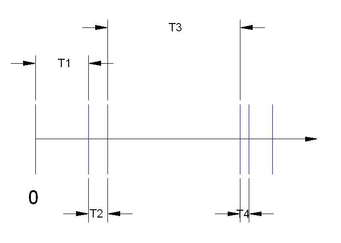

```{r, echo=FALSE, include=FALSE}
colFmt <- function(x,color) {
  
  outputFormat <- knitr::opts_knit$get("rmarkdown.pandoc.to")
  
  if(outputFormat == 'latex') {
    ret <- paste("\\textcolor{",color,"}{",x,"}",sep="")
  } else if(outputFormat == 'html') {
    ret <- paste("<font color='",color,"'>",x,"</font>",sep="")
  } else {
    ret <- x
  }

  return(ret)
}

#uso>>>> `r colFmt("REG",'red')`, 

```

```{r}

library(reticulate)
#use_condaenv("r-python")
#use_python('/opt/homebrew/Caskroom/miniconda/base/envs/r-python/python3.9')

library(reticulate)
Sys.setenv(RETICULATE_CONDA = "/opt/homebrew/Caskroom/miniconda/base/bin/conda")
use_condaenv("r-python")

```

# Introdução à modelagem de processos estocásticos {#introducao-a-modelagem-de-processos-estocasticos}

\

A palavra *estocástico* deriva do grego *stokhastikós* (στοχαστικός), que significa *capaz de adivinhar* ou *hábil em conjecturar*, derivado de *stókhos* (στόχος), *alvo* ou *objetivo*. A palavra chegou ao vocabulário científico moderno via latim acadêmico renascentista, como transliteração do grego.

\

Assim, a expressão *processo estocástico* pode ser interpretada de duas formas complementares, dependendo do contexto.

\

Como *fenômeno real* que ocorre no mundo físico ou social --- o tempo de chegada de clientes em um banco, as variações no preço de uma ação ou a propagação de uma epidemia. Esses fenômenos apresentam variabilidade inerente e são influenciados por fatores que não podem ser totalmente controlados ou previstos.

\

Como um *modelo matemático*: uma abstração que permite descrever e analisar o fenômeno aleatório, substituindo a complexidade do mundo real por uma estrutura probabilística tratável. As seções seguintes apresentam essa distinção com mais precisão.

\

## Modelos determinísticos e estocásticos {#modelos-deterministicos-e-estocasticos}

\

Os *modelos estocásticos* contrastam com os *modelos determinísticos*. Enquanto os *modelos determinísticos* são definidos por equações que descrevem exatamente como o sistema evolui ao longo do tempo, os *modelos estocásticos* envolvem algum grau de aleatoriedade. Assim, um *mesmo processo estocástico* pode produzir resultados variados a cada
observação --- cada resultado específico é chamado de *realização do processo*. Modelos determinísticos são geralmente mais fáceis de analisar, mas os estocásticos costumam ser mais realistas.

\

Essa distinção tem raízes metodológicas precisas. 

\


Uma dicotomia relativamente recente --- introduzida em [*Monte Carlo Methods* (Hammersley e Handscomb, 1964)](https://link.springer.com/book/10.1007/978-94-009-5819-7) --- contrasta o *matemático teórico* com o *matemático experimental*, de forma análoga à distinção usual entre físicos teóricos e experimentais. 

\

A diferença essencial é que os *teóricos deduzem conclusões a partir de postulados*, enquanto os *experimentalistas inferem conclusões com base em observações* --- trata-se da diferença entre *dedução* e *indução*. Essa dicotomia
independe de os objetivos serem puros ou aplicados, e não pressupõe recursos computacionais sofisticados: certos experimentos matemáticos complexos exigem computadores, outros requerem apenas papel e lápis.

\

Em modelagem estocástica, as duas abordagens são complementares: o teórico estabelece as propriedades formais do modelo; o experimentalista estima seus parâmetros a partir de dados observados. Os três exemplos a seguir ilustram essa complementaridade.

\

Considere três fenômenos econômicos de natureza distinta.

\

> O *nível do PIB* de um país apresenta uma trajetória de longo prazo 
> identificável, mas sujeita a perturbações imprevisíveis. Um modelo
> determinístico descreveria essa trajetória de forma exata: dado o
> estado atual da economia, o valor futuro seria calculado com precisão.
> Um modelo estocástico reconhece, porém, que choques externos ---
> variações nos preços internacionais de commodities, mudanças abruptas
> na política monetária, crises financeiras, guerras --- introduzem
> incerteza que nenhum componente sistemático captura integralmente.
> Formalmente:
>
> $$
> \text{PIB}(t) \;=\;
> \underbrace{\text{PIB}_0 + g \cdot t}_{\text{componente determinístico}}
> \;+\;
> \underbrace{\varepsilon(t)}_{\text{choque aleatório}}
> $$
>
> em que $\varepsilon(t) \sim \mathcal{N}(0,\,\sigma^2)$ representa as
> inovações não antecipadas. A largura do intervalo de confiança de
> qualquer previsão cresce com o horizonte temporal --- quanto mais
> distante o período previsto, maior a incerteza acumulada ---,
> consequência direta da variância do componente estocástico.

\

> A *ocorrência de eventos discretos e relativamente raros* --- como a
> chegada de ordens de compra em um mercado financeiro, a decretação de
> moratória por um país soberano ou a inadimplência em uma carteira de
> crédito --- é naturalmente capturada por um *processo de Poisson*
> $\{N(t) : t \geq 0\}$, em que $N(t)$ conta o número de eventos
> ocorridos até o instante $t$ a uma taxa média constante $\lambda > 0$.
> A propriedade central do processo --- incrementos independentes e
> estacionários --- implica que o número de eventos em qualquer intervalo
> depende apenas de sua duração, não de quando ele começa.

\

> A *evolução do preço de uma ação* é frequentemente modelada como um
> *passeio aleatório*: o preço no instante seguinte é o preço atual
> acrescido de uma variação imprevisível:
>
> $$
> P(t) = P(t-1) + \varepsilon(t), \qquad \varepsilon(t) \sim
> \mathcal{N}(0,\,\sigma^2)
> $$
>
> A hipótese subjacente --- conhecida como *hipótese dos mercados
> eficientes* apresentada em [*Efficient Capital Markets: A Review of Theory and Empirical Work* (Fama, 1970)](https://www.jstor.org/stable/2325486) --- é a de que toda
> informação disponível já está refletida no preço corrente, de modo que
> apenas novas informações, por definição imprevisíveis, podem alterá-lo.

Essa característica --- o estado futuro depender apenas do estado presente, e não de toda a trajetória anterior --- é conhecida como *propriedade markoviana*, e será ilustrada mais adiante por meio de exemplos.


## Processos estocásticos temporais, espaciais e espaçotemporais

\

Como um modelo, um *processo estocástico* é uma família de variáveis
aleatórias $\{X_\theta\}$, indexada por um parâmetro $\theta$ pertencente
a algum conjunto de índices $\Theta$. A natureza desse conjunto determina
se o processo é *temporal*, *espacial* ou *espaçotemporal*.

\

### Processos estocásticos temporais

\

Em um processo estocástico temporal, o conjunto de índices $\Theta$
representa o *tempo*, e o processo é escrito como $\{X_t : t \in T\}$.

\

Se $T$ for um conjunto de *números inteiros não negativos* ---
representando períodos específicos como o $1^{\circ}$ trimestre ou o
$3^{\circ}$ mês de uma série econômica --- teremos um *processo
estocástico em tempo discreto*:

$$
\{X_t : t \in \mathbb{Z}_{+}\}
$$

O PIB trimestral do Brasil, a taxa Selic mensal e o índice de preços ao
consumidor são exemplos de séries observadas em tempo discreto.

\

Se $T$ for a *reta real* ou algum intervalo dela --- representando
qualquer instante em um fluxo contínuo, como o preço de uma ação
registrado a cada milissegundo em uma bolsa de valores --- teremos um
*processo estocástico em tempo contínuo*:

$$
\{X_t : t \in [0, \infty)\}
$$

\

### Processos estocásticos espaciais

\

Em um *processo estocástico espacial*, o conjunto de índices $\Theta$
não representa o tempo, mas sim *localizações no espaço*, descritas por
um vetor de coordenadas. Esse tipo de processo é representado por:

$$
\{X_{\mathbf{s}} : \mathbf{s} \in D\}
$$

em que:

- $X_{\mathbf{s}}$: variável aleatória associada ao ponto espacial
  $\mathbf{s}$.
- $\mathbf{s}$: vetor de coordenadas espaciais --- por exemplo,
  $(u, v)$ no plano ou $(u, v, z)$ no espaço tridimensional.
- $D$: domínio espacial, subconjunto de $\mathbb{R}^2$ (no plano) ou
  $\mathbb{R}^3$ (no espaço tridimensional).

\

Se $D$ for *discreto* --- representando localizações específicas, como
os municípios de uma região metropolitana em um estudo de valor do solo
--- teremos:

$$
\{X_{\mathbf{s}} : \mathbf{s} \in \mathbb{Z}^2\}
$$

\

Se $D$ for *contínuo* --- representando qualquer ponto de uma região,
como o preço do metro quadrado em qualquer localização de uma cidade ---
teremos:

$$
\{X_{\mathbf{s}} : \mathbf{s} \in \mathbb{R}^2\}
$$

\

### Processos estocásticos espaçotemporais

\

Em alguns casos, o fenômeno evolui *no tempo e no espaço
simultaneamente*. Esses são chamados de *processos espaçotemporais* e
são representados por:

$$
\{X_{t,\mathbf{s}} : t \in T,\, \mathbf{s} \in D\}
$$

em que:

- $X_{t,\mathbf{s}}$: variável aleatória associada ao instante $t$ na
  posição espacial $\mathbf{s}$.
- $t$: índice temporal.
- $\mathbf{s}$: índice espacial (vetor de coordenadas).
- $T$: intervalo de tempo de interesse.
- $D$: região espacial de interesse.

\

O domínio temporal $T$ e o domínio espacial $D$ podem ser,
independentemente, discretos ou contínuos. Um exemplo econômico
direto é o valor do solo urbano em uma região metropolitana ao longo
do tempo: para cada município $\mathbf{s}$ e cada ano $t$, observa-se
uma realização $X_{t,\mathbf{s}}$ do processo --- configuração
típica de estudos de valorização imobiliária e uso do solo.


## Passeio aleatório {#passeio-aleatorio}

\
Os conceitos, exemplos e implementações relacionados a séries temporais
derivam principalmente de duas fontes: o projeto de pesquisa em ensino
*Aplicações de Processos Estocásticos na Economia*, do Prof. Dr. José
Carlos de Camargo Lourenço, e o tutorial
[*A Little Book of R for Time Series*](https://a-little-book-of-r-for-time-series.readthedocs.io/en/latest/)
(Avril Coghlan).


\

O *passeio aleatório* (*random walk*) é o processo estocástico discreto mais simples com dependência temporal e o ponto de partida natural para a compreensão da propriedade markoviana em contextos econômicos.

\

### Propriedade markoviana {#markov}

\

Um processo estocástico $\{X_t : t \in \mathbb{Z}_+\}$ satisfaz a *propriedade markoviana* se, para todo $t$ e todo estado futuro $x$:
\


$$
P(X_{t+1} = x \mid X_t, X_{t-1}, \ldots, X_0) = P(X_{t+1} = x \mid X_t)
$$


\

Equivale e dizer, em palavras, que toda a informação relevante sobre o futuro do processo está contida em seu estado presente. A trajetória anterior é irrelevante, dado o valor atual. Em Economia, essa propriedade tem uma interpretação
direta --- a *hipótese dos mercados eficientes* antes citada, a qual afirma que o preço corrente de um ativo já incorpora toda a informação disponível, de modo que conhecer preços anteriores não oferece vantagem preditiva além do que o preço de hoje já revela.

\

### Definição formal

\

Seja $P(t)$ o preço de um ativo financeiro no período $t$. O modelo de
passeio aleatório sem deriva (*driftless random walk*) é definido por:

\

$$
P(t) = P(t-1) + \varepsilon(t), \qquad
\varepsilon(t) \overset{iid}{\sim} \mathcal{N}(0,\, \sigma^2)
$$
\

em que $\varepsilon(t)$ representa a inovação --- a parcela do preço não antecipada pelo mercado. O processo satisfaz a propriedade markoviana por construção: dado $P(t-1)$, o valor $P(t)$ independe de $P(t-2), P(t-3), \ldots$ Três propriedades decorrem diretamente da definição:

\

$$
E[P(t)] = P(0) \qquad \text{(sem tendência)}
$$

\

$$
\text{Var}[P(t)] = t \cdot \sigma^2 \qquad
\text{(variância cresce com } t\text{)}
$$

\

$$
\text{Cov}[P(s), P(t)] = \min(s,t) \cdot \sigma^2 \qquad
\text{(observações próximas são correlacionadas)}
$$

\

A segunda propriedade tem consequência direta para a previsão: quanto mais distante o horizonte, maior a incerteza acumulada --- o intervalo de confiança se alarga proporcionalmente a $\sqrt{t}$.

\

### Passeio aleatório como série temporal {#random_walk_ts}

\

O passeio aleatório é o exemplo mais simples de *série temporal* não estacionária --- uma sequência de observações ordenadas no tempo cujas propriedades estatísticas variam com $t$. Em R, dados com estrutura temporal são armazenados como objetos da classe `ts` (*time-series*), criados pela função `ts()`, que associa os valores ao tempo e permite que as funções de análise reconheçam automaticamente a estrutura temporal da série.

\

### Não estacionaridade e diagnóstico {#nao_estacionariedade}

\

Um passeio aleatório é uma série *não estacionária*: sua variância cresce indefinidamente com $t$, violando a condição de variância constante exigida pela estacionaridade fraca. Em termos técnicos, *diz-se que a série possui uma raiz unitária*.

\

O diagnóstico de não estacionaridade pode ser feito de duas formas complementares. A primeira é visual, por meio da *função de autocorrelação* (ACF), que mede a correlação entre $P(t)$ e $P(t-h)$ para diferentes defasagens $h$:

\

>Em uma *série não estacionária*, as autocorrelações decaem lentamente e permanecem elevadas por muitas defasagens --- indicando que observações distantes no tempo ainda são fortemente correlacionadas. 

\

>Em uma *série estacionária*, as autocorrelações decaem rapidamente para zero.

\

A segunda forma é o *teste Augmented Dickey-Fuller* (ADF), que testa formalmente a presença de raiz unitária:

\

$$
H_0: \text{a série possui raiz unitária (não estacionária)}
$$
$$
H_1: \text{a série é estacionária}
$$
\

A regra de decisão usual é rejeitar $H_0$ quando o $p$-valor for inferior a $0,05$. A primeira diferença do processo resolve a não estacionaridade:

\

$$
\Delta P(t) = P(t) - P(t-1) = \varepsilon(t) \overset{iid}{\sim}
\mathcal{N}(0,\, \sigma^2)
$$

\

Em linguagem econômica, enquanto o *nível* do preço é não estacionário, a *variação* do preço é estacionária --- resultado consistente com a hipótese de mercados eficientes.

\

### Implementação em R (dados sintéticos)

\

```{r }

library(tseries)

set.seed(42)   # semente para reprodutibilidade dos resultados
n       <- 250  # número de dias de negociação (~1 ano útil em bolsa)
sigma   <- 1.5  # volatilidade diária em % — valor típico de ação de média liquidez
P0      <- 100  # preço inicial em R$ — valor de referência arbitrário

# epsilon: vetor de 250 choques aleatórios --- um por dia de negociação cada epsilon(t) ~ N(0, sigma²) é a realização da inovação não antecipada definida formalmente como varepsilon(t) no modelo do PIB --- aqui aplicada à variação diária do preço de uma única ação
epsilon <- rnorm(n, mean = 0, sd = sigma)


# Duas séries temporais distintas:
# P:       nível do preço --- passeio aleatório, série não estacionária 
#          c(P0, P0 + cumsum(epsilon)): concatena o preço inicial P0 com
#          os preços subsequentes, cada P(t) = P0 + soma acumulada dos
#          choques até t, resultando em n+1 valores (dias 0 a n)
P       <- ts(c(P0, P0 + cumsum(epsilon)), start = 1, frequency = 1)

# delta_P: variação diária --- primeira diferença de P, série estacionária
delta_P <- ts(diff(P), start = 2, frequency = 1)

```

\

| Gráfico | Série | Tipo | Diagnóstico esperado | Propriedade markoviana |
|---|---|---|---|---|
| 1.º | `P` | Nível do preço | Variância crescente --- não estacionária | Não satisfaz --- $P(t)$ carrega memória de todos os choques passados |
| 2.º | `delta_P` | Variação diária | Oscilação em torno de zero --- estacionária | Satisfaz --- $\varepsilon(t)$ independe dos valores anteriores |
| 3.º | ACF de `P` | Autocorrelação do nível | Decaimento lento --- raiz unitária | Não satisfaz --- autocorrelações persistentes confirmam dependência temporal |
| 4.º | ACF de `delta_P` | Autocorrelação da variação | Decaimento abrupto --- ruído branco | Satisfaz --- ausência de autocorrelação confirma independência |

\


```{r , fig.cap="Random walk do preço da ação ao longo de 250 dias"}

# Nível do preço: random walk gerado pela soma acumulada dos choques epsilon(t)
plot.ts(P,
        col  = "steelblue", lwd = 1.5,
        xlab = "Dia de negociação",
        ylab = "Preço (R$)")
abline(h = P0, lty = 2, col = "gray50")

```

\

Esse gráfico mostra o comportamento típico do *random walk*: a série vaga sem tendência definida, mas com variância crescente ao longo dos 250 dias de negociação. Diferentemente de uma *série estacionária*, o preço não tende a retornar a um nível médio --- cada choque
$\varepsilon(t)$ se acumula permanentemente, afastando a série de seu valor inicial $P_0$.

\

```{r , fig.cap="Primeira diferença do preço da ação: variação diária ao longo de 250 dias de negociação"}

# Variação diária: primeira diferença do passeio aleatório --- série estacionária
plot.ts(delta_P,
        col  = "firebrick", lwd = 1.5,
        xlab = "Dia de negociação",
        ylab = expression(Delta * P(t)))
abline(h = 0, lty = 2, col = "gray50")


```

\

Esse segundo gráfico mostra a variação diária $\Delta P(t) = P(t) - P(t-1)$ --- a primeira diferença do *random walk*. Diferentemente do anterior, a série oscila em torno de zero com amplitude aproximadamente constante ao longo do tempo, característica de uma *série estacionária*. 

\

```{r , fig.cap="ACF do nível do preço da ação: decaimento lento indicativo de não estacionaridade"}

# ACF do nível: autocorrelações decaem lentamente --- indicativo de não estacionaridade
acf(P,
    lag.max = 30,
    col     = "steelblue")
    
    
```    

\

A ACF do nível do preço $P(t)$ decai lentamente, com autocorrelações elevadas por muitas defasagens --- indicando que observações distantes no tempo ainda são *fortemente correlacionadas* entre si. 

\

Esse padrão reflete a acumulação permanente dos choques $\varepsilon(t)$: como cada inovação se incorpora definitivamente ao nível da série, o valor atual *carrega memória* de todos os choques passados. 

\

É o diagnóstico visual característico de uma *série não estacionária com raiz unitária*.

\

```{r , fig.cap="ACF da variação diária Delta P(t): decaimento abrupto característico de série estacionária"}

# ACF da variação: autocorrelações caem rapidamente para zero --- ruído branco
acf(delta_P,
    lag.max = 30,
    col     = "firebrick")

```

\

A ACF da variação diária $\Delta P(t)$ cai abruptamente para zero após a defasagem zero --- as autocorrelações nas defasagens seguintes são estatisticamente nulas, dentro das bandas de confiança tracejadas. 

\

Esse padrão é característico de *ruído branco*: as inovações $\varepsilon(t)$ são *independentes entre si*, sem qualquer estrutura de dependência temporal remanescente. 

\

Contrastando com a ACF do nível do preço $P(t)$, os dois gráficos sintetizam o diagnóstico visual completo --- diferenciar a série remove a raiz unitária e restaura a estacionaridade.

\


```{r}
# Teste ADF — confirma formalmente o diagnóstico visual das ACFs
# H0: a série possui raiz unitária (não estacionária)
# H1: a série é estacionária
# Regra de decisão: rejeitar H0 se p-valor < 0,05

# Esperado para P:       p-valor > 0,05 --- não rejeita H0 --- raiz unitária confirmada
# Esperado para delta_P: p-valor < 0,05 --- rejeita H0 --- estacionaridade confirmada
cat("--- Teste ADF: nível do preço ---\n")
print(adf.test(P, alternative = "stationary"))
cat("\n--- Teste ADF: variação do preço ---\n")
print(adf.test(delta_P, alternative = "stationary"))

```


## Decomposição de séries temporais {#decomposicao-de-series-temporais}

\

Uma série temporal econômica *raramente* é composta por um único padrão.
Na maior parte dos casos, o que se observa é a *sobreposição de
diferentes componentes* que evoluem em escalas de tempo distintas ---
*tendência de longo prazo*, *padrões sazonais* recorrentes e *variações aleatórias residuais*.

\

Separar esses componentes permite três objetivos distintos:

- compreender a estrutura da série e o papel de cada componente
  em sua variação total;
- construir previsões que incorporem *tendência* e *sazonalidade*,
  como nos métodos de suavização exponencial e Holt-Winters;
- modelar o componente irregular --- removidos os determinísticos ---
  por métodos probabilísticos específicos, passo natural seguinte
  na análise de séries temporais econômicas.


\

### Decomposição clássica {#decomposicao-classica}

\

A *decomposição clássica* assume que a série pode ser expressa como combinação de três componentes mensuráveis: *tendência*, *sazonalidade* e *irregularidade*. Dependendo da natureza da série, a combinação desses componentes pode ser aditiva ou multiplicativa. O *modelo aditivo* assume que os componentes se somam:

\

$$
Y(t) = T(t) + S(t) + I(t)
$$

\

O *modelo multiplicativo* assume que os componentes se multiplicam:

\

$$
Y(t) = T(t) \cdot S(t) \cdot I(t)
$$

\

em que:

\

- $T(t)$: componente de *tendência* --- direção de longo prazo da série.
- $S(t)$: componente *sazonal* --- padrão regular que se repete a cada
  ciclo fixo de $m$ períodos.
- $I(t)$: componente *irregular* --- variações aleatórias residuais não
  explicadas pelos demais componentes (ruído).

\

A *escolha entre* os dois modelos é guiada pela *inspeção visual* da série: 

- se a *amplitude das flutuações sazonais cresce* proporcionalmente ao nível da série, o *modelo multiplicativo* é o mais adequado; 
- se a *amplitude permanece aproximadamente constante*, o *modelo aditivo* é preferível. 

\

Uma estratégia comum é aplicar a transformação logarítmica à série original, o que converte um modelo multiplicativo em aditivo:

\


$$
\log Y(t) = \log T(t) + \log S(t) + \log I(t)
$$

\

#### Implementação em R (dados reais) {#impl-queensland}

\

Os dados utilizados correspondem às vendas mensais (AUD) de uma loja de souvenirs em uma cidade litorânea de Queensland, Austrália apresentados em *[Forecasting: Methods and Applications, Makridakis, Wheelwright e Hyndman (1998)](https://robjhyndman.com/forecasting/).

\

A série cobre o período de janeiro de 1987 a dezembro de 1993, totalizando 84 observações mensais, e apresenta tanto *tendência crescente* quanto *sazonalidade anual* pronunciada --- características típicas de séries econômicas de varejo.

\

```{r}
# Leitura dos dados diretamente do repositório de Hyndman
# scan() importa os valores em coluna única para um vetor numérico
souvenir <- scan("http://robjhyndman.com/tsdldata/data/fancy.dat",
                 quiet = TRUE)

# Conversão para objeto de série temporal
# frequency = 12: dados mensais (12 observações por ciclo anual)
# start = c(1987, 1): início em janeiro de 1987
souvenir_ts <- ts(souvenir, frequency = 12, start = c(1987, 1))
souvenir_ts

```

\

```{r decomp-plot-original, fig.cap="Vendas mensais de souvenirs em Queensland (1987--1993)"}
# Gráfico da série original
# A inspeção visual é o primeiro passo antes de qualquer modelagem
plot.ts(souvenir_ts,
        col  = "steelblue", lwd = 1.5,
        xlab = "Ano",
        ylab = "Vendas (AUD)")
```

\

O gráfico revela duas características imediatas: *tendência crescente ao longo do período* e *picos anuais* recorrentes em dezembro, associados à *sazonalidade* turística. 

\

Mais importante, a *amplitude dos picos cresce* ao longo do tempo --- as flutuações de 1993 são muito maiores do que as de 1987. 


\

Esse *padrão indica* que o *modelo multiplicativo* é o mais adequado, ou equivalentemente, que a transformação logarítmica deve ser aplicada *antes* da decomposição aditiva.

\

```{r decomp-log, fig.cap="Série de vendas após transformação logarítmica"}
# Transformação logarítmica: converte modelo multiplicativo em aditivo
# log(Y) = log(T) + log(S) + log(I)
# após a transformação, a amplitude sazonal deve ser aproximadamente constante
log_ts <- log(souvenir_ts)

plot.ts(log_ts,
        col  = "steelblue", lwd = 1.5,
        xlab = "Ano",
        ylab = "log(Vendas)")
```

\

Após a *transformação logarítmica*, a amplitude das flutuações sazonais torna-se aproximadamente *constante* ao longo do tempo --- confirmando que o modelo aditivo é agora apropriado para a série *transformada*.

\

```{r decomp-classical, fig.cap="Decomposição clássica aditiva da série log-transformada"}
# decompose() implementa a decomposição clássica em três etapas:
# 1. estima T(t) por média móvel centralizada de ordem m=12
# 2. estima S(t) como média dos desvios sazonais em cada mês
# 3. obtém I(t) = log_ts - T(t) - S(t) como resíduo
decomp <- decompose(log_ts)

# O objeto decomp contém:
# decomp$trend:    componente de tendência estimada
# decomp$seasonal: índices sazonais (repetidos para cada ano)
# decomp$random:   componente irregular residual
# decomp$figure:   índices sazonais para cada mês (Jan a Dez)
plot(decomp,
     col = "steelblue")
```

\

O gráfico de decomposição apresenta quatro painéis sobrepostos: a *série original* (topo), a *tendência estimada*, o *componente sazonal* e o *componente irregular* (ruído base). 

A *tendência* revela crescimento contínuo das vendas ao longo do período. O *componente sazonal* confirma o padrão anual com pico em dezembro e vale em janeiro e fevereiro --- reflexo direto da sazonalidade turística. 

O *componente irregular* (ruído), de amplitude relativamente pequena, sugere que tendência e sazonalidade explicam a *maior parte da variabilidade* da série. 


\

```{r decomp-indices}
# Índices sazonais mensais (na escala log)
# valores positivos: meses acima da média anual
# valores negativos: meses abaixo da média anual
meses <- c("Jan", "Fev", "Mar", "Abr", "Mai", "Jun",
           "Jul", "Ago", "Set", "Out", "Nov", "Dez")

data.frame(Mês    = meses,
           Índice = round(decomp$figure, 4))
```

\

Os *índices sazonais quantificam o desvio* de cada mês em relação à média anual.

\

Dezembro apresenta o maior índice positivo --- vendas sistematicamente acima da média ---  enquanto janeiro e fevereiro apresentam os maiores índices negativos. 

\

Em termos econômicos, esses índices são instrumentos diretos de planejamento: um varejista pode antecipar a demanda de cada mês com base no nível atual da tendência *corrigido* pelo índice sazonal correspondente.

\

```{r decomp-dessaz, fig.cap="Série dessazonalizada: tendência e componente irregular"}
# Ajuste sazonal: remoção do componente sazonal da série original
# série dessazonalizada = log_ts - S(t)
# contém apenas tendência e componente irregular
log_dessaz <- log_ts - decomp$seasonal

plot.ts(log_dessaz,
        col  = "darkgreen", lwd = 1.5,
        xlab = "Ano",
        ylab = "log(Vendas) dessazonalizado")
```

\

A série *dessazonalizada* remove o padrão repetitivo anual, expondo com mais clareza a trajetória de longo prazo das vendas. 

\

A *tendência* crescente torna-se visualmente mais nítida, e as flutuações remanescentes correspondem ao *componente irregular ou ruído* --- variações não explicadas nem pela *tendência* nem pela *sazonalidade*.


\


### Média móvel simples de ordem n (MMS-n) --- suavização da tendência {#media-movel-simples}

\

A *decomposição clássica* estima a *tendência* por meio de uma *média móvel centralizada* --- calculada internamente pela função `decompose()`, ela pondera igualmente os $m/2$ períodos anteriores e posteriores a cada instante $t$, produzindo uma estimativa suavizada da tendência no centro da janela. 

\

Por essa razão, a *média móvel centralizada* perde os primeiros e os últimos $m/2$ pontos da série --- os valores marcados como `NA` no objeto `decomp$trend`.

\

A *média móvel simples (MMS-n)* de ordem $n$ opera de forma diferente: considera apenas os $n$ períodos mais recentes, sem olhar para o futuro, calculando para cada instante $t$ a média aritmética desses períodos:

\

$$
\text{MMS}_n(t) = \frac{1}{n} \sum_{i=0}^{n-1} X(t-i)
$$

\

Por ser assimétrica --- voltada exclusivamente para o *passado* --- é adequada para suavizar a série em tempo real, quando observações futuras ainda não estão disponíveis. 

\

A escolha de $n$ envolve uma troca: valores pequenos reagem rapidamente às mudanças mas retêm mais ruído; valores grandes suavizam mais mas introduzem defasagem e perdem os primeiros $n-1$ pontos da série.

\

#### Implementação em R (dados reais) {#impl-ipca-mms}

\

O Índice Nacional de Preços ao Consumidor Amplo (IPCA) é o indicador oficial de inflação do Brasil, calculado mensalmente pelo IBGE e utilizado pelo Banco Central como referência para a condução da política monetária. 

\

A série histórica está disponível no Sistema Gerenciador de
Séries Temporais (SGS) do Banco Central, acessível diretamente pelo R
via pacote `GetBCBData` --- código **433**.

\

Para os fins desta seção, utilizaremos a série a partir de janeiro de
1995 --- após a implantação do Plano Real --- evitando o período de
hiperinflação anterior, cujas magnitudes distorceriam as análises de
suavização.

\

```{r mm-dados}
#install.packages("GetBCBData")
library(GetBCBData)
library(TTR)

# Código 433: IPCA variação mensal (%)
# Fonte: SGS/Banco Central do Brasil
ipca_raw <- gbcbd_get_series(
  id         = 433,
  first.date = "1995-01-01",
  use.memoise = FALSE
)

# Converter para objeto ts
# frequency = 12: dados mensais
# start: ano e mês de início
ipca_ts <- ts(ipca_raw$value,
              start     = c(1995, 1),
              frequency = 12)

ipca_ts
```

\

```{r mm-plot-original, fig.cap="Variação mensal do IPCA — janeiro de 1995 a dezembro de 2023"}
# Visualização da série original
plot.ts(ipca_ts,
        col  = "steelblue", lwd = 1,
        xlab = "Ano",
        ylab = "Variação mensal (%)")
abline(h = 0, lty = 2, col = "gray50")
```

\

A série do IPCA pós-Real oscila em torno de valores positivos baixos, com episódios de inflação mais elevada associados a choques específicos--- desvalorização cambial de 1999, crise energética de 2001, eleições de 2002, choque de *commodities* de 2015--2016 e pressões inflacionárias de 2021--2022. 

\

Diferentemente do *random walk* --- como o nível do preço da ação $P(t)$ simulado na seção anterior, cuja variância cresce indefinidamente com o tempo --- a série do IPCA não acumula os choques permanentemente: ela tende a retornar a um nível médio, comportamento mais próximo de uma *série estacionária*.

\


```{r mm-sma, fig.cap="IPCA mensal com médias móveis de ordem 3 e 12"}
# MMS de ordem 3: suavização leve --- ainda sensível a flutuações mensais
ipca_sma3  <- SMA(ipca_ts, n = 3)

# MMS de ordem 12: equivale à média dos últimos 12 meses
# remove a sazonalidade anual e destaca a tendência de médio prazo
ipca_sma12 <- SMA(ipca_ts, n = 12)

plot.ts(ipca_ts,
        col  = "gray70", lwd = 1,
        xlab = "Ano",
        ylab = "Variação mensal (%)",
        ylim = range(ipca_ts, na.rm = TRUE))
lines(ipca_sma3,  col = "firebrick",  lwd = 1.5)
lines(ipca_sma12, col = "steelblue",  lwd = 2)
abline(h = 0, lty = 2, col = "gray50")
legend("topright",
       legend = c("IPCA original", "MMS-3", "MMS-12"),
       col    = c("gray70", "firebrick", "steelblue"),
       lwd    = c(1, 1.5, 2), bty = "n")
```

\

A *MMS-3* acompanha de perto a série original, removendo apenas as flutuações mais ruidosas.

\

A *MMS-12* --- equivalente à média dos últimos doze meses --- revela com clareza os ciclos de médio prazo da inflação brasileira: o processo de desinflação dos anos 1990, os episódios de aceleração inflacionária e os períodos de convergência à meta. 

\

Em termos econômicos, a *MMS-12* é análoga ao conceito de *inflação acumulada em 12 meses*, amplamente utilizado pelo Banco Central e pela imprensa especializada.

\

### Suavização exponencial simples (SES) --- previsão de curto prazo {#suavizacao-exponencial-simples}

\

A *média móvel simples (MMS)* atribui peso igual a todos os $n$ períodos da janela e peso zero a todos os períodos anteriores.

\

A *suavização exponencial simples (SES)* generaliza esse esquema atribuindo pesos decrescentes geometricamente a todas as observações passadas:

\


$$
\hat{X}(t+1) = \alpha \cdot X(t) + (1-\alpha) \cdot \hat{X}(t)
$$

\

expandindo recursivamente:
\

$$
\hat{X}(t+1) = \alpha \sum_{k=0}^{\infty} (1-\alpha)^k X(t-k),
\qquad 0 < \alpha < 1
$$

\

O parâmetro $\alpha$ controla a memória do modelo: valores próximos de 1 dão peso quase exclusivo à observação mais recente; valores próximos de 0 distribuem o peso de forma mais uniforme pelo passado. Em política monetária, um banco central que reage fortemente à inflação corrente opera com $\alpha$ elevado; um que suaviza sua resposta ao longo do tempo opera com $\alpha$ baixo.

\

A SES é adequada para séries sem tendência e sem sazonalidade --- como o IPCA pós-Real, que oscila em torno de uma média aproximadamente estável. Quando a série apresenta os dois padrões simultaneamente, a SES os ignora, produzindo previsões
sistematicamente defasadas. Essa limitação motiva o método apresentado na seção seguinte.

\

#### Implementação em R (dados reais) {#impl-ipca-ses}

\

A função `HoltWinters()` com `beta = FALSE` e `gamma = FALSE` reduz o método ao caso mais simples --- apenas o parâmetro $\alpha$ é estimado, por mínimos quadrados, minimizando o erro quadrático médio entre os valores observados e os valores suavizados. 

\

O resultado de $\alpha$ estimado pelo R indica qual peso o próprio modelo, ajustado aos dados, atribui à observação mais recente em relação à história acumulada.

\

```{r mm-ses, fig.cap="Suavização exponencial simples do IPCA mensal"}
# HoltWinters com beta=FALSE e gamma=FALSE: suavização exponencial simples
# o parâmetro alpha é estimado automaticamente por mínimos quadrados
ses_ipca <- HoltWinters(ipca_ts, beta = FALSE, gamma = FALSE)

# alpha estimado
cat("Parâmetro alpha estimado:", round(ses_ipca$alpha, 4), "\n")

```
\

O valor estimado $\hat{\alpha} = 0,6913$ indica que aproximadamente $69\%$ do peso da previsão recai sobre a observação mais recente e apenas $31\%$ sobre toda a história anterior.

\

Um $\alpha$ elevado --- típico de séries com muita variabilidade --- reflete que o modelo *descarta* rapidamente a história passada e se concentra nos valores
*recentes*, comportamento adequado para uma série como o IPCA, sujeita a choques de *curta duração*.

\


```{r mm-ses-2, fig.cap="Suavização exponencial simples do IPCA mensal"}

# Gráfico: série original e valores suavizados
plot(ses_ipca,
     main = NULL,
     xlab = "Ano",
     ylab = "Variação mensal (%)")
legend("topright",
       legend = c("IPCA original", "SES"),
       col    = c("black", "red"),
       lwd    = c(1, 1.5), bty = "n")
```

\

O gráfico apresenta a série original do IPCA (preto) e os valores
suavizados pela *SES* (vermelho). 

\

A linha suavizada acompanha as flutuações da série original com uma defasagem característica --- consequência direta do mecanismo de atualização: a previsão para $t+1$ é formada antes que a observação $t+1$ seja conhecida. 

\

Nos episódios de aceleração inflacionária, a linha suavizada reage com
atraso, refletindo que o modelo ainda carrega o peso das observações
anteriores de inflação mais baixa. 

\


Nos episódios de queda, o mesmo comportamento ocorre em sentido inverso.


## Holt-Winters e previsão {#holt-winters}

\

A *SES* é adequada para séries *sem tendência* e *sem sazonalidade* ---
como o IPCA pós-Real, que oscila em torno de uma média aproximadamente estável. 

\

Quando a série apresenta os dois padrões simultaneamente, a *SES* os ignora, produzindo previsões sistematicamente defasadas. 

\

O método de **Holt-Winters** resolve essa limitação incorporando três equações de atualização simultâneas --- uma para o nível, uma para a tendência e uma para a sazonalidade --- permitindo previsões em séries que apresentam os dois padrões
simultaneamente.

\

### Modelo aditivo e multiplicativo {#hw-modelos}

\

O método de Holt-Winters apresenta duas variações, análogas às da decomposição clássica:

- *Modelo aditivo*: adequado quando as variações sazonais são aproximadamente constantes ao longo do tempo. 
- *Modelo multiplicativo*: adequado quando as variações sazonais crescem proporcionalmente ao nível da série.

\

As três equações de atualização do *modelo aditivo* são:

\

$$
\begin{aligned}
L(t) &= \alpha\,[Y(t) - S(t-m)] + (1-\alpha)\,[L(t-1) + B(t-1)] \\[6pt]
B(t) &= \beta\,[L(t) - L(t-1)] + (1-\beta)\,B(t-1) \\[6pt]
S(t) &= \gamma\,[Y(t) - L(t)] + (1-\gamma)\,S(t-m)
\end{aligned}
$$

\

em que $m$ é o número de períodos por ciclo sazonal ($m = 12$ para dados mensais), $L(t)$ é o nível estimado, $B(t)$ é a tendência estimada e $S(t)$ é o índice sazonal estimado. A previsão para $h$ períodos à frente é:

\

$$
\hat{Y}(t+h) = L(t) + h \cdot B(t) + S(t - m + h_m)
$$

\

em que $h_m = h \bmod m$. Os três parâmetros de suavização têm
interpretações econômicas diretas:

\

- $\alpha$: peso do nível corrente --- um $\alpha$ elevado significa
  que o modelo reage rapidamente a mudanças no nível da série.
- $\beta$: peso da tendência corrente --- um $\beta$ elevado significa
  que o modelo ajusta rapidamente a inclinação da trajetória.
- $\gamma$: peso do padrão sazonal corrente --- um $\gamma$ elevado
  significa que os índices sazonais são recalibrados a cada ciclo.

\

### Implementação em R --- vendas de souvenirs (Queensland) {#hw-souvenirs}

\

Retomamos os dados de vendas de souvenirs em Queensland. Como a amplitude das flutuações sazonais cresce com o nível da série, o modelo multiplicativo é o mais adequado.

\

```{r hw-ajuste}
# Ajuste do modelo Holt-Winters multiplicativo
# seasonal = "multiplicative": variações sazonais proporcionais ao nível
hw_mult <- HoltWinters(souvenir_ts, seasonal = "multiplicative")

# Parâmetros estimados automaticamente por mínimos quadrados
cat("alpha (nível):       ", round(hw_mult$alpha, 4), "\n")
cat("beta  (tendência):   ", round(hw_mult$beta,  4), "\n")
cat("gamma (sazonalidade):", round(hw_mult$gamma, 4), "\n")
```

\

```{r hw-plot, fig.cap="Holt-Winters multiplicativo --- ajuste e previsão para 1994"}
# Previsão para os próximos 12 meses (horizonte h = 12)
prev_hw <- predict(hw_mult, n.ahead = 12)

# Gráfico: série original, valores ajustados e previsão
plot(hw_mult, prev_hw,
     xlab = "Ano",
     ylab = "Vendas (AUD)")
```

\

O gráfico apresenta a série original (preto), os valores ajustados pelo modelo (vermelho sólido) e a previsão para os 12 meses seguintes (vermelho tracejado). 

\

O modelo captura com precisão tanto a tendência crescente quanto o padrão sazonal anual. 

\

A previsão para 1994 projeta continuidade do crescimento com pico em dezembro, consistente com o padrão histórico.

\

### Avaliação do modelo {#hw-avaliacao}

\

Após o ajuste, os resíduos do modelo devem ser examinados.

\

Um bom ajuste produz resíduos que se comportam como *ruído branco* ---
média zero, variância constante e ausência de autocorrelação. 

\

A presença de *padrões* nos resíduos indica que o modelo *não capturou toda a estrutura da série*.

\

```{r hw-residuos, fig.cap="Resíduos do modelo Holt-Winters multiplicativo"}
# Resíduos: diferença entre valores observados e ajustados
residuos_hw <- residuals(hw_mult)

plot(residuos_hw,
     type = "l", col = "steelblue", lwd = 1,
     xlab = "Ano",
     ylab = "Resíduo")
abline(h = 0, lty = 2, col = "gray50")
```

\

```{r hw-acf, fig.cap="ACF dos resíduos do modelo Holt-Winters"}
# ACF dos resíduos: decaimento abrupto indica ausência de autocorrelação
acf(residuos_hw,
    lag.max = 24,
    col     = "steelblue",
    main    = NULL)
```

\

O teste de Ljung-Box avalia formalmente se os resíduos apresentam *autocorrelação remanescente*.

\

```{r hw-ljung}
# Teste de Ljung-Box
# H0: resíduos são ruído branco (sem autocorrelação)
# H1: resíduos apresentam autocorrelação
# Regra: não rejeitar H0 se p-valor > 0,05
box_test <- Box.test(residuos_hw, lag = 12, type = "Ljung-Box")
print(box_test)
```


\

Um $p$-valor superior a $0,05$ indica que *não há evidência de autocorrelação* --- os resíduos se comportam como ruído branco, confirmando o bom ajuste do modelo.

\

As métricas de acurácia quantificam o desempenho preditivo do modelo.

\

```{r hw-acuracia}
# Métricas de acurácia da previsão
# accuracy() requer objeto da classe forecast --- converter via forecast()
# MAE:  Mean Absolute Error --- erro médio absoluto
# RMSE: Root Mean Squared Error --- penaliza erros grandes
# MAPE: Mean Absolute Percentage Error --- erro percentual médio absoluto
library(forecast)
accuracy(forecast(hw_mult))
```


\

O MAPE --- erro percentual médio absoluto --- é a medida mais intuitiva para séries econômicas: indica, em média, em quantos por cento o modelo erra em relação ao valor observado.

\

## Implementação em R (dados reais) {#dados-brasileiros}

\

A Penn World Table (PWT) é uma base de dados internacional que reúne séries de PIB, estoques de capital e trabalho para um amplo conjunto de países, medidos a preços constantes e corrigidos pela paridade do poder de compra (PPC). 

\

A versão 8.0, disponível no pacote `pwt8` do R, cobre o período de 1950 a 2011 e é amplamente utilizada em pesquisas sobre crescimento econômico e produtividade entre países.

\

```{r pwt-dados}
# install.packages("pwt8")
library(pwt8)

# Carregar os dados da Penn World Table 8.0
data("pwt8.0")

# Selecionar variáveis de interesse para o Brasil:
# rgdpna: PIB real a preços constantes (milhões de USD, PPC 2005)
# avh:    média anual de horas trabalhadas por trabalhador
# xr:     taxa de câmbio (moeda local por USD)
brasil <- subset(pwt8.0,
                 country == "Brazil",
                 select  = c(year, rgdpna, avh, xr))

# Produtividade do trabalho: PIB real por hora trabalhada
brasil$prod <- brasil$rgdpna / brasil$avh
```

\

```{r pwt-summary}
# Resumo estatístico das variáveis selecionadas
summary(brasil[, c("rgdpna", "avh", "xr", "prod")])
```

\

O resumo estatístico revela a amplitude do período analisado: o PIB real varia de aproximadamente USD 87 bilhões em 1950 a USD 1,75 trilhão em 2011, refletindo mais de seis décadas de crescimento econômico. 

\

A média de horas trabalhadas exibe trajetória decrescente ao longo do período --- tendência comum a economias em desenvolvimento que ampliam sua base de serviços e regulamentação trabalhista.

\

```{r pwt-hist, fig.cap="Distribuição da produtividade do trabalho --- Brasil (1950--2011)"}
# Histograma da produtividade do trabalho
# distribuição assimétrica esperada: concentração em valores baixos
# (período pré-milagre) com cauda direita (crescimento recente)
hist(brasil$prod,
     breaks = 12,
     col    = "lightblue",
     border = "white",
     main   = NULL,
     xlab   = "PIB real por hora trabalhada (USD PPC 2005)",
     ylab   = "Frequência")
```

\

O histograma revela distribuição assimétrica à direita: a maior parte das observações concentra-se em valores baixos de produtividade --- correspondentes ao período anterior ao milagre econômico --- com uma cauda direita que reflete o crescimento das últimas décadas da série. 

\

```{r pwt-ts, fig.cap="PIB real e produtividade do trabalho --- Brasil (1950--2011)"}
# Converter para objetos de série temporal
# frequency = 1: dados anuais
# start = 1950: primeiro ano da série
pib_ts  <- ts(brasil$rgdpna, start = 1950, frequency = 1)
prod_ts <- ts(brasil$prod,   start = 1950, frequency = 1)

par(mfrow = c(1, 2), mar = c(4, 4, 3, 1))

plot(pib_ts,
     col  = "steelblue", lwd = 2,
     main = NULL,
     xlab = "Ano",
     ylab = "PIB real (milhões USD PPC 2005)")

plot(prod_ts,
     col  = "darkgreen", lwd = 2,
     main = NULL,
     xlab = "Ano",
     ylab = "PIB por hora trabalhada")

par(mfrow = c(1, 1))
```

\

As duas séries exibem tendência crescente ao longo do período, interrompida por episódios recessivos claramente identificáveis: a crise da dívida de 1981--1983, a recessão de 1990 e a estagnação relativa dos anos 1980 --- a *década perdida*. 


\

A aceleração do crescimento a partir dos anos 2000 é visível em ambas as séries.

\

```{r pwt-crescimento, fig.cap="Taxa de crescimento anual do PIB real --- Brasil (1951--2011)"}
# Taxa de crescimento aproximada: primeira diferença do log-PIB
# Δ log PIB(t) ≈ variação percentual para valores pequenos
# multiplicado por 100 para expressar em pontos percentuais
taxa_cresc <- diff(log(pib_ts)) * 100

plot(taxa_cresc,
     type = "b", col = "firebrick", lwd = 1.5,
     pch  = 16, cex = 0.7,
     xlab = "Ano",
     ylab = "Variação % aproximada")
abline(h = 0,                lty = 2, col = "gray50")
abline(h = mean(taxa_cresc), lty = 3, col = "steelblue")
legend("topright",
       legend = c("Taxa de crescimento", "Média histórica"),
       col    = c("firebrick", "steelblue"),
       lty    = c(1, 3), lwd = 2, bty = "n")

cat("Média histórica:", round(mean(taxa_cresc), 2), "% ao ano\n")
cat("Desvio-padrão:  ", round(sd(taxa_cresc),   2), "% ao ano\n")
cat("Mínimo:", round(min(taxa_cresc), 2), "%",
    "(", brasil$year[which.min(taxa_cresc) + 1], ")\n")
cat("Máximo:", round(max(taxa_cresc), 2), "%",
    "(", brasil$year[which.max(taxa_cresc) + 1], ")\n")
```

\

A taxa de crescimento oscila em torno de uma média histórica de aproximadamente 4% ao ano, com pico durante o *milagre econômico* (1968--1973) e valores negativos nos episódios recessivos. 

\

Essa série --- a primeira diferença do log-PIB --- apresenta comportamento estacionário, confirmando que o nível do PIB é integrado de ordem 1, conforme discutido na seção do passeio aleatório.


## Processo de Poisson {#processo-poisson}


Alguns experimentos aleatórios envolvem, essencialmente, *contagens* de eventos observadas em um intervalo de tempo — como, por exemplo, o número de clientes que entram em um supermercado por dia. 

\

O Processo de Poisson é um modelo estocástico fundamental para descrever esse tipo de fenômeno: trata-se de um processo de tempo contínuo e espaço de estados discreto, no qual eventos aleatórios ocorrem de forma independente e imprevisível, porém a uma taxa média constante. 

\

Tal modelo permite caracterizar dois aspectos complementares de um mesmo fenômeno: (a) a distribuição do número de ocorrências em um intervalo de tempo fixado e (b) a distribuição dos tempos entre ocorrências consecutivas. 

\

Por sua flexibilidade e fundamentação teórica, o Processo de Poisson encontra aplicação em uma ampla variedade de contextos: 

\

- *Sistemas de filas:* chegada de clientes a bancos, caixas eletrônicos e centrais de atendimento.
- *Telecomunicações:* chegada de chamadas, pacotes de dados e detecção de sinais.
- *Engenharia de confiabilidade:* modelagem de falhas de componentes sob taxa de falha constante.
- *Finanças:* chegada de ordens de negociação e modelagem de eventos extremos em mercados financeiros.
- *Ciências naturais:* decaimento radioativo, emissão de fótons e ocorrência de terremotos.

\


### Definição formal do processo de Poisson

\

Um *processo de contagem* $\{N(t) : t \geq 0\}$ é dito ser um **Processo de Poisson** com taxa $\lambda > 0$ se satisfaz as seguintes condições:

\

1. $N(0) = 0$;
2. o processo tem *incrementos independentes e estacionários*;
3. o número de eventos ($k$) em qualquer intervalo de comprimento $t$ segue distribuição de Poisson com média $\lambda t$, isto é, para $s, t \geq 0$:

\

$$
P(N(t + s) - N(s) = k) = \frac{e^{-\lambda t}\cdot(\lambda t)^k}{k!}, \text{ }k=0,1,2 \dots
$$
\

Em particular, para um intervalo iniciado em $s = 0$:

\

$$
P(N(t) = n) = \frac{e^{-\lambda t}(\lambda t)^n}{n!}
$$

\

#### Processos de contagem: propriedades fundamentais

\

> **Definição 1.** Um *processo de contagem* é um processo estocástico $\{N(t) : t \in [0, \infty)\}$ em que $N(t)$ representa o número de eventos ocorridos no intervalo $[0, t]$. O processo deve satisfazer:
>
> 1. $N(0) = 0$ — no instante inicial, a contagem é zero;
> 2. $N(t) \in \{0, 1, 2, \ldots\}$ — os valores são contagens inteiras não negativas;
> 3. se $s < t$, então $N(s) \leq N(t)$ — a função de contagem é não decrescente;
> 4. para $s < t$, a diferença $N(t) - N(s)$ representa o número de eventos ocorridos no intervalo $(s, t]$.

\

```{r echo=FALSE, out.width='60%', fig.align='center'}
par(mar = c(3, 1, 3, 1), bg = "white")
plot(NULL,
     xlim = c(-0.1, 1.1), ylim = c(-0.2, 1.1),
     xaxt = "n", yaxt = "n", xlab = "", ylab = "",
     bty  = "n")
arrows(x0 = 0, y0 = 0.3, x1 = 1.05, y1 = 0.3,
       length = 0.10, lwd = 1.5, code = 2)
segments(x0 = c(0, 0.35, 0.75), y0 = 0.27,
         x1 = c(0, 0.35, 0.75), y1 = 0.33, lwd = 1.5)
text(x = c(0, 0.35, 0.75), y = 0.22,
     labels = c("0", "s", "t"),
     font = c(1, 3, 3), cex = 1.1)
arrows(x0 = 0,    y0 = 0.55,
       x1 = 0.35, y1 = 0.55,
       length = 0.08, lwd = 1, code = 3)
arrows(x0 = 0,    y0 = 0.82,
       x1 = 0.75, y1 = 0.82,
       length = 0.08, lwd = 1, code = 3)
text(x = 0.375, y = 1,
     labels = "N(t) = 4",
     font = 2, cex = 1.0)
text(x = 0.26, y = 0.90,
     labels = "durante o intervalo 't'\ncontamos 4 ocorrências",
     cex = 0.82, adj = 0)
text(x = 0.175, y = 0.75,
     labels = "N(s) = 1",
     font = 2, cex = 1.0)
text(x = 0.05, y = 0.65,
     labels = "durante o intervalo 's'\ncontamos 1 ocorrência",
     cex = 0.82, adj = 0)
```

\

> **Definição 2.** Um processo de contagem tem *incrementos independentes* se o número de eventos em intervalos disjuntos são variáveis aleatórias independentes. Formalmente, para $0 \leq t_1 < t_2 < \cdots < t_n$, as variáveis
>
> $$N(t_2) - N(t_1),\; N(t_3) - N(t_2),\; \ldots,\; N(t_n) - N(t_{n-1})$$
>
> são mutuamente independentes.

\

> **Definição 3.** Um processo de contagem tem *incrementos estacionários* se a distribuição do número de eventos em qualquer intervalo depende apenas da duração do intervalo, e não de sua posição no tempo. Por exemplo, a probabilidade de ocorrer um evento entre 9h e 10h é a mesma que entre 15h e 16h: $P(N([9, 10])) = P(N([15, 16]))$.

\

```{r echo=FALSE, message=FALSE, out.width='70%', fig.align='center', fig.cap="O processo de Poisson: (1) tem contagem zero em $t=0$; (2) se $s < t$ então $N(s) \\leq N(t)$; (3) $N(t)$ é não decrescente; (4) os incrementos são independentes."}
set.seed(42)
arrival_times <- c(1, 2.5, 3, 5.5, 7)
n_events      <- length(arrival_times)
time          <- seq(0, max(arrival_times) + 1, by = 0.1)
N_t           <- sapply(time, function(t) sum(arrival_times <= t))

plot(time, N_t, type = "s", lwd = 2, col = "black",
     xlab = "", ylab = "N(t)", xaxt = "n",
     main = "Processo de Contagem de Eventos",
     ylim = c(0, max(N_t) + 1), xlim = c(0, max(time)))
points(arrival_times, 1:n_events,     pch = 19, col = "black")
points(arrival_times, 0:(n_events-1), pch = 21, col = "black", bg = "white")
for (i in 1:n_events) {
  if (i == 1) {
    segments(0, 0, arrival_times[i], 0, lwd = 2)
  } else {
    segments(arrival_times[i-1], i-1, arrival_times[i], i-1, lwd = 2)
  }
}
axis(1, at = arrival_times,
     labels = paste0("E", 1:n_events),
     col.axis = "blue", cex.axis = 0.9)
legend("topleft",
       legend = c("Evento chegada", "Antes da chegada"),
       pch    = c(19, 21),
       col    = "black",
       pt.bg  = c("black", "white"),
       bty    = "n")
par(xpd = TRUE)
segments(0, -1.8, 2,   -1.8, lwd = 1)
text(1,   -1.5, "intervalo 's'", cex = 1.2, font = 2)
segments(0, -2.2, 6,   -2.2, lwd = 1)
text(3,   -1.9, "intervalo 't'", cex = 1.2, font = 2)
```

\


#### Formulação infinitesimal equivalente

\

Uma formulação alternativa e equivalente define o Processo de Poisson por meio de probabilidades infinitesimais. Para um incremento de tempo $h$ suficientemente pequeno:

\

$$
P(N(t+h) - N(t) = 1) = \lambda h + o(h)
$$

\

$$
P(N(t+h) - N(t) \geq 2) = o(h)
$$

\

em que $o(h)$ denota um termo que tende a zero mais rapidamente que $h$, isto é,
$\lim_{h \to 0} o(h)/h = 0$. A primeira condição estabelece que a probabilidade de
exatamente um evento em um intervalo muito curto é aproximadamente proporcional à
sua duração; a segunda estabelece que a probabilidade de dois ou mais eventos
simultâneos é desprezível.

\

### Propriedades do Processo de Poisson

\

#### 1. Intervalos entre chegadas, falta de memória e conexões com outras distribuições

\

Até aqui o processo de Poisson foi descrito pela perspectiva das *contagens*: quantos
eventos ocorrem em um intervalo de tempo. Há, porém, uma perspectiva complementar
igualmente útil: a dos *tempos de espera* entre eventos consecutivos.

\

Seja $T_1$ o tempo até o primeiro evento, $T_2$ o tempo entre o primeiro e o segundo
evento, e assim por diante. Esses intervalos são denominados *tempos entre eventos*
(*interarrival times*). Uma propriedade fundamental do processo de Poisson é que esses
intervalos seguem distribuição **exponencial** com parâmetro $\lambda$:

\

$$
T_i \sim \text{Exponencial}(\lambda), \quad i = 1, 2, \ldots
$$

\

A intuição é direta: como o processo tem incrementos independentes e estacionários, o
tempo de espera pelo próximo evento não depende de quando foi o último — o processo não tem "memória" do passado. A distribuição exponencial é precisamente a única distribuição contínua com essa propriedade, denominada *falta de memória*:

\

$$
\Pr(T > s + t \mid T > s) = \Pr(T > t)
$$

\

Suponha $\lambda = 2$ eventos por minuto. A probabilidade de esperar mais de 1 minuto
pelo próximo evento é $\Pr(T > 1) = e^{-2} \approx 0,135$. Se já se passaram 3
minutos sem nenhum evento, essa probabilidade permanece $e^{-2} \approx 0,135$ — o
tempo já decorrido não altera a distribuição do tempo restante.

\

Estendendo o raciocínio: o tempo até o $n$-ésimo evento, $S_n = T_1 + T_2 + \cdots +
T_n$, é a soma de $n$ variáveis exponenciais independentes com mesmo parâmetro
$\lambda$, seguindo distribuição *Gamma*:

\

$$
S_n \sim \text{Gamma}(n, \lambda)
$$

\

Cada $T_i$ representa uma "etapa" de espera, e $S_n$ acumula $n$ dessas etapas. A
distribuição Gamma com parâmetro de forma inteiro $n$ é também denominada distribuição
de *Erlang*, amplamente utilizada em modelos de filas para representar o tempo total de atendimento de $n$ clientes consecutivos.

\

O diagrama a seguir resume as conexões entre o processo de Poisson e as distribuições
relacionadas:

\

```{r poissonConnections, echo=FALSE, out.width='75%', fig.align='center', fig.cap="Conexões entre o processo de Poisson e as distribuições exponencial, Gamma e Erlang."}
par(mar = c(1, 1, 1, 1), bg = "white")
plot(NULL, xlim = c(0, 10), ylim = c(0, 6),
     xaxt = "n", yaxt = "n", xlab = "", ylab = "", bty = "n")

rect(0.2, 4.2, 3.8, 5.8, col = "gray92", border = "black")
rect(3.8, 2.2, 6.8, 3.8, col = "gray92", border = "black")
rect(6.8, 4.2, 9.8, 5.8, col = "gray92", border = "black")
rect(3.8, 0.0, 6.8, 1.8, col = "gray92", border = "black")

text(2.0, 5.2, "Processo de Poisson", font = 2, cex = 0.85)
text(2.0, 4.7, expression(N(t) %~% Poisson(lambda*t)), cex = 0.80)

text(5.3, 3.2, "Tempo entre eventos", font = 2, cex = 0.85)
text(5.3, 2.7, expression(T[i] %~% Exp(lambda)), cex = 0.80)

text(8.3, 5.2, "Tempo até n-ésimo evento", font = 2, cex = 0.85)
text(8.3, 4.7, expression(S[n] %~% Gamma(n, lambda)), cex = 0.80)

text(5.3, 1.3, "Erlang (n inteiro)", font = 2, cex = 0.85)
text(5.3, 0.8, expression(S[n] %~% Erlang(n, lambda)), cex = 0.80)

arrows(3.8, 5.0, 3.8, 3.8, length = 0.10, lwd = 1.2, code = 2)
arrows(6.8, 3.0, 6.8, 5.0, length = 0.10, lwd = 1.2, code = 2)
arrows(5.3, 2.2, 5.3, 1.8, length = 0.10, lwd = 1.2, code = 2)

text(3.2, 4.4, expression(T[i]==frac(1,lambda)), cex = 0.78)
text(7.5, 4.1, expression(S[n]==sum(T[i])), cex = 0.78)
text(5.9, 2.0, "n inteiro", cex = 0.75)
```

\

#### 2. Incrementos estacionários e independentes

\

1. O número de eventos no intervalo $[t_1, t_2]$ depende apenas de $t_2 - t_1$.
2. Eventos em intervalos disjuntos são estatisticamente independentes.

\

#### 3. Aditividade

\

Se $N_1(t)$ e $N_2(t)$ são processos de Poisson independentes com taxas $\lambda_1$ e
$\lambda_2$, respectivamente, então o processo combinado

\

$$
N(t) = N_1(t) + N_2(t)
$$

\

é também um processo de Poisson com taxa $\lambda = \lambda_1 + \lambda_2$. Por exemplo,se clientes de dois perfis distintos chegam a uma loja seguindo processos de Poisson independentes com taxas 3 e 5 clientes por hora, o fluxo total de chegadas segue um processo de Poisson com taxa 8 clientes por hora.

\

#### 4. Decomposição (*thinning*)

\
Dado um processo de Poisson com taxa $\lambda$, se cada evento é retido
independentemente com probabilidade $p$ e descartado com probabilidade $1 - p$, o
processo resultante é também um processo de Poisson com taxa

\
$$
\lambda' = p\lambda
$$

\

Por exemplo, se pedidos chegam a uma plataforma com taxa $\lambda = 10$ pedidos por
minuto e cada pedido é concluído com probabilidade $p = 0,6$, o processo de pedidos
concluídos é um processo de Poisson com taxa $\lambda' = 6$ pedidos por minuto.

\

#### 5. Classificação de eventos

\

Seja $\{N(t),\, t \geq 0\}$ um processo de Poisson com taxa $\lambda$. Admita que cada
evento possa ser classificado em dois tipos:

- **Tipo I** com probabilidade $p$;
- **Tipo II** com probabilidade $1 - p$,

\

de forma independente entre si e da ocorrência dos demais eventos. Sejam $N_1(t)$ e
$N_2(t)$ o número de eventos do Tipo I e do Tipo II no intervalo $[0, t]$,
respectivamente, com $N(t) = N_1(t) + N_2(t)$. Demonstra-se (Ross, *Introduction to
Probability Models*, cap. 5) que:

\

> 1. $\{N_1(t)\}$ e $\{N_2(t)\}$ são processos de Poisson com taxas $\lambda_1 = \lambda p$
>    e $\lambda_2 = \lambda(1-p)$, respectivamente.
> 2. Os dois processos são **independentes** entre si.

\

Em notação distribucional:

\

$$
N_1(t) \sim \text{Poisson}(\lambda p t), \qquad N_2(t) \sim \text{Poisson}(\lambda(1-p)t)
$$

\

De modo geral, se cada evento pode ser classificado em $n$ tipos com probabilidades
$p_1, p_2, \ldots, p_n$ (com $\sum_{i=1}^n p_i = 1$), então os subprocessos
$N_1(t), N_2(t), \ldots, N_n(t)$ são **independentes** entre si e satisfazem:

\

$$
N_i(t) \sim \text{Poisson}(p_i \lambda t), \quad i = 1, 2, \ldots, n
$$

\

Esse resultado — a partição de um processo de Poisson em subprocessos independentes —
tem aplicações diretas em filas com múltiplos perfis de clientes e em sistemas de
telecomunicações com pacotes de diferentes tipos.

\

### Tipos de processo de Poisson

\

#### Processo de Poisson homogêneo

\

É o processo descrito nas seções anteriores: a taxa $\lambda$ é *constante* ao longo do tempo. A probabilidade de $k$ eventos em um intervalo de comprimento $h$ é

\


$$
P(N(t+s) - N(s) = k) = \frac{e^{-\lambda t}\cdot(\lambda h)^k }{k!}
$$
\


É o modelo adequado quando não há razão para supor* que a intensidade de ocorrência dos eventos varie com o tempo.

\

>Exemplo 1: Fregueses chegam a uma certa loja de acordo com um *processo de Poisson* com taxa $\lambda = 4$ fregueses por hora. Admita que a loja abra às *9h* e que os fregueses *não* deixam a loja. Quais são as probabilidades de que:
1. exatamente um freguês chegue até às 9:30h e  
2. um total de 5 fregueses estejam na loja até às 11:30h?

\

A loja abre às 9 h, então até as 9 h 30 min o primeiro intervalo de tempo será $t_1 = 0.5$ horas e até as 11 h 30 min o segundo intervalo de tempo será $t_2 = 2.5$. A taxa média de chegadas por hora é $\lambda = 4$.

\

O que se pede é a $P[N(t_1)=1, N(t_2)=5]$.

\

Essa probabilidade é a mesma que $P[N(t_1)=1 \cap N(t_2-t_1)=4]$, pois como já ocorreu 1 evento no intervalo $[0, t_1]$, restam 4 eventos a ocorrer no intervalo $(t_1, t_2]$, de duração $t_2 - t_1 = 2$ horas. Sendo os intervalos de tempo disjuntos, a independência dos incrementos permite escrever:

\


\begin{align}
P[N(t_1)=1 \cap N(t_2-t_1)=4] & = P[N(t_1)=1] \cdot P[N(t_2-t_1)=4] \\
& = \frac{e^{-\lambda t_1} (\lambda t_1)^{n_1}}{n_1!} \cdot \frac{e^{-\lambda (t_2-t_1)}[\lambda (t_2-t_1)]^{n_2}}{n_2!}\\
& = \frac{e^{-(4\cdot 0.5)} (4 \cdot 0.5)^{1}}{1!} \cdot \frac{e^{-(4 \cdot 2)} (4 \cdot 2)^{4}}{4!}\\
& = 2e^{-2} \cdot 170.67\,e^{-8}\\
& = 341.33\,e^{-10}\\
& = 0.2707 \cdot 0.0573 \approx 0.0155 
\end{align}

\


Um valor bastante baixo, posto que a taxa média $\lambda$ de 4 clientes por hora indica que se esperam 2 chegadas em meia hora (apenas 1 chegou) e 8 chegadas nas duas horas seguintes (apenas 4 chegaram), totalizando 5 fregueses na loja até às 11:30h. Ambos os eventos — chegar exatamente 1 pessoa até às 9:30h e exatamente 4 pessoas nas duas horas seguintes — são raros.


\


```{r poissonEx1verif, echo=FALSE, results='hide'}
# Exemplo 1 — verificação numérica
lambda <- 4
t1 <- 0.5
t2 <- 2.5
p_ex1 <- dpois(1, lambda = lambda * t1) * dpois(4, lambda = lambda * (t2 - t1))
p_ex1
```

O valor calculado via `dpois()` é:  $P[N(t_1)=1, N(t_2)=5] \approx `r round(p_ex1,4)`$.


\


>Exemplo 2: Suponha que pacotes *SMTP* chegam a um servidor de e-mails de acordo com um *processo de Poisson* com taxa $\lambda = 2$ pacotes por segundo. Seja $N(t)$ o número de mensagens que chegam até o tempo $t$. Quais são as probabilidades de que:
1. $P(N(1) = 2)$: 2 pacotes em um intervalo de 1 segundo  
2. $P(N(1) = 2 \cap N(3) = 6)$: 2 pacotes em um intervalo de 1 segundo e 6 pacotes em um intervalo de 3 segundos
3. $P(N(1) = 2  | N(3) = 6)$
4. $P(N(3) = 6  | N(1) = 2)$


\

A primeira probabilidade é imediata: 

\

\begin{align}
P(N(1) = 2) & = \frac{e^{-2 \cdot 1} (2 \cdot 1)^2}{2!}\\
& = \frac{e^{-2} \cdot 4}{2} \\
& = 2 e^{-2} \approx 0.27
\end{align}

\

A segunda, recorrendo ao mesmo argumento do Exemplo 1 — a independência dos incrementos em intervalos disjuntos —, será dada por: 

\


\begin{align}
P[N(1)=2 \cap N(3)=6] & = P[N(1)=2] \cdot P[N(3)-N(1)=4] \\
& = P[N(1)=2] \cdot P[N(2)=4] \\
& = \frac{e^{-(2\cdot 1)} (2 \cdot 1)^{2}}{2!} \cdot \frac{e^{-(2 \cdot 2)} (2 \cdot 2 )^{4}}{4!}\\
& = 0.2707 \cdot 0.1952 \approx 0.052  
\end{align}

em que $N(3)-N(1)$ representa os eventos ocorridos no intervalo $(1,3]$, de duração 2 segundos.

\

A terceira, recorrendo à definição de probabilidade condicional $P(A|B)=\frac{P(A\cap B)}{P(B)}$, será dada por: 

\

\begin{align}
P(N(1) = 2  | N(3) = 6)  & = \frac{P(N(1) = 2 \cap N(3) = 6)}{P(N(3) = 6)}\\
& = \frac{0.052}{P(N(3) = 6)}
\end{align}

\

em que 

$$P(N(3) = 6) = \frac{e^{-(2\cdot 3)}\cdot(2\cdot 3)^6}{6!} = \frac{e^{-6} \cdot 6^6}{720} \approx 0.1606$$

\

portanto

$$
P(N(1) = 2  | N(3) = 6) = \frac{0.052}{0.1606} \approx 0.32
$$

\

A quarta: calcular $P(N(3) = 6  | N(1) = 2)$ equivale a calcular a probabilidade de que ocorram 4 eventos no intervalo $(1, 3]$, de duração 2 segundos, *i.e.*, $P(N(3)-N(1)=4) = P(N(2)=4)$, pois os incrementos são independentes em um processo de Poisson. Ilustração:

\


```{r , echo=FALSE, out.width='60%', fig.align='center', fig.cap=""}
par(mar = c(3, 1, 4, 1), bg = "white")
plot(NULL,
     xlim = c(-0.05, 1.1), ylim = c(-0.1, 1.1),
     xaxt = "n", yaxt = "n", xlab = "", ylab = "",
     bty  = "n")
# Linha temporal
arrows(x0 = 0, y0 = 0.2, x1 = 1.05, y1 = 0.2,
       length = 0.08, lwd = 1.5, code = 2)
# Posições: 0, 1 e 3 mapeados para [0, 0.33, 1.0]
x0 <- 0
x1 <- 0.33
x3 <- 1.0
# Marcas verticais
segments(x0 = c(x0, x1, x3), y0 = 0.17,
         x1 = c(x0, x1, x3), y1 = 0.23, lwd = 1.5)
# Rótulos do eixo
text(x = c(x0, x1, x3), y = 0.10,
     labels = c("0", "1", "3"), cex = 1.1)
# Rótulo do eixo t
text(x = 1.08, y = 0.20, labels = "t", font = 3, cex = 1.1)
# Seta N(1) = 2 (de 0 até 1)
arrows(x0 = x0, y0 = 0.58,
       x1 = x1, y1 = 0.58,
       length = 0.07, lwd = 1, code = 2)
text(x = (x0 + x1) / 2, y = 0.68,
     labels = "N(1) = 2", font = 2, cex = 0.95)
# Seta N(3) = 6 (de 0 até 3)
arrows(x0 = x0, y0 = 0.88,
       x1 = x3, y1 = 0.88,
       length = 0.07, lwd = 1, code = 2)
text(x = (x0 + x3) / 2, y = 0.98,
     labels = "N(3) = 6", font = 2, cex = 0.95)

```

\

$$
P(N(3) = 6  | N(1) = 2) = P(N(2)=4) = \frac{e^{-(2\cdot 2)}\cdot(2 \cdot 2)^{4}}{4!} \approx 0.19
$$

\

```{r poissonEx2verif, echo=FALSE, results='hide'}
# Exemplo 2 — verificação numérica
lambda <- 2
p2_item1 <- dpois(2, lambda = lambda * 1)
p2_item1
p2_item2 <- dpois(2, lambda = lambda * 1) * dpois(4, lambda = lambda * 2)
p2_item2
p2_n3_6  <- dpois(6, lambda = lambda * 3)
p2_item3 <- p2_item2 / p2_n3_6
p2_item3
p2_item4 <- dpois(4, lambda = lambda * 2)
p2_item4
```

\

Os valores calculados via `dpois()` são:  $P(N(1) = 2) \approx `r round(p2_item1,4)`$, $P(N(1) = 2 \cap N(3) = 6) \approx `r round(p2_item2,4)`$, $P(N(1) = 2  | N(3) = 6) \approx `r round(p2_item3,4)`$ e $P(N(3) = 6  | N(1) = 2) \approx `r round(p2_item4,4)`$.


\


>Exemplo 3: Pedidos chegam ao sistema de uma plataforma de *e-commerce* de acordo com um *processo de Poisson* com taxa $\lambda = 3$ pedidos por minuto. Seja $N(t)$ o número de pedidos recebidos até o instante $t$. Quais são as probabilidades de que:
1. $P(N(1) = 3)$: exatamente 3 pedidos em 1 minuto  
2. $P(N(1) = 3 \cap N(4) = 10)$: 3 pedidos no primeiro minuto e 10 pedidos nos primeiros 4 minutos  
3. $P(N(1) = 3 \mid N(4) = 10)$  
4. $P(N(4) = 10 \mid N(1) = 3)$

\

A primeira probabilidade é imediata:

\

\begin{align}
P(N(1) = 3) &= \frac{e^{-3 \cdot 1}(3 \cdot 1)^3}{3!}\\
&= \frac{e^{-3} \cdot 27}{6}\\
&= 4,5\,e^{-3} \approx 0,2240
\end{align}

\

A segunda, pela *independência dos incrementos* em *intervalos disjuntos*:

\

\begin{align}
P[N(1)=3 \cap N(4)=10] &= P[N(1)=3] \cdot P[N(4)-N(1)=7]\\
&= P[N(1)=3] \cdot P[N(3)=7]\\
&= \frac{e^{-(3\cdot 1)}(3\cdot 1)^{3}}{3!} \cdot \frac{e^{-(3\cdot 3)}(3\cdot 3)^{7}}{7!}\\
&= 0,2240 \cdot 0,1171 \approx 0,0262
\end{align}

\

em que $N(4)-N(1)$ representa os pedidos recebidos no intervalo $(1,4]$, de duração 3 minutos.

\

A terceira, pela definição de *probabilidade condicional* $P(A \mid B) = \frac{P(A \cap B)}{P(B)}$:

\

\begin{align}
P(N(1) = 3 \mid N(4) = 10) &= \frac{P(N(1)=3 \cap N(4)=10)}{P(N(4)=10)}
\end{align}

\

em que

$$
P(N(4) = 10) = \frac{e^{-(3\cdot 4)}\cdot(3\cdot 4)^{10}}{10!} = \frac{e^{-12}\cdot 12^{10}}{3628800} \approx 0,1048
$$

\

portanto

$$
P(N(1) = 3 \mid N(4) = 10) = \frac{0,0262}{0,1048} \approx 0,25
$$

\

A quarta: calcular $P(N(4) = 10 \mid N(1) = 3)$ equivale a calcular a probabilidade de que ocorram 7 pedidos no intervalo $(1,4]$, de duração 3 minutos, *i.e.*, $P(N(4)-N(1)=7) = P(N(3)=7)$, pois os incrementos são independentes em um processo de Poisson. Ilustração:

\


```{r poissonProcess3plot, echo=FALSE, out.width='50%', fig.align='center', fig.cap="Ilustração do item 4 do Exemplo 3: N(1)=3 e N(4)=10"}
par(mar = c(3, 1, 4, 1), bg = "white")
plot(NULL,
     xlim = c(-0.05, 1.1), ylim = c(-0.1, 1.1),
     xaxt = "n", yaxt = "n", xlab = "", ylab = "",
     bty  = "n")
arrows(x0 = 0, y0 = 0.2, x1 = 1.05, y1 = 0.2,
       length = 0.08, lwd = 1.5, code = 2)
x0 <- 0
x1 <- 0.25
x4 <- 1.0
segments(x0 = c(x0, x1, x4), y0 = 0.17,
         x1 = c(x0, x1, x4), y1 = 0.23, lwd = 1.5)
text(x = c(x0, x1, x4), y = 0.10,
     labels = c("0", "1", "4"), cex = 1.1)
text(x = 1.08, y = 0.20, labels = "t", font = 3, cex = 1.1)
arrows(x0 = x0, y0 = 0.58, x1 = x1, y1 = 0.58,
       length = 0.07, lwd = 1, code = 2)
text(x = (x0 + x1) / 2, y = 0.68,
     labels = "N(1) = 3", font = 2, cex = 0.95)
arrows(x0 = x0, y0 = 0.88, x1 = x4, y1 = 0.88,
       length = 0.07, lwd = 1, code = 2)
text(x = (x0 + x4) / 2, y = 0.98,
     labels = "N(4) = 10", font = 2, cex = 0.95)
```

\

$$
P(N(4) = 10 \mid N(1) = 3) = P(N(3)=7) = \frac{e^{-(3\cdot 3)}\cdot(3\cdot 3)^{7}}{7!} \approx 0,1171
$$

\

```{r poissonEx3verif, echo=FALSE, results='hide'}
#Exemplo 3, verificação numérica
lambda <- 3
p1 <- dpois(3, lambda = lambda * 1);p1
p2 <- dpois(3, lambda = lambda * 1) * dpois(7, lambda = lambda * 3); p2
p_n4_10 <- dpois(10, lambda = lambda * 4); p_n4_10 
p3 <- p2 / p_n4_10;p3
p4 <- dpois(7, lambda = lambda * 3);p4
```
\


Os valores calculados via `dpois()` são: $P(N(1)=3) \approx `r round(p1,4)`$, $P(N(1)=3 \cap N(4)=10) \approx `r round(p2,4)`$, $P(N(1)=3 \mid N(4)=10) \approx `r round(p3,4)`$ e $P(N(4)=10 \mid N(1)=3) \approx `r round(p4,4)`$.

\


>Exemplo 4: Clientes entram em uma loja de acordo com um processo de Poisson com taxa $\lambda = 10$ por hora. De forma independente, cada cliente é *classificado* em dois tipos: *compra alguma coisa* com probabilidade $p = 0,3$ ou *sai da loja sem comprar nada* com probabilidade $1-p = 0,7$. Calcule a probabilidade de que durante a primeira hora 9 pessoas entrem na loja e, dentre essas 9 pessoas, 3 comprem alguma coisa e 6 não.

\

Como a classificação de cada cliente é independente dos demais e da ocorrência dos eventos, pelo resultado de decomposição do processo de Poisson, $N_0(t)$ e $N_1(t)$ são processos de Poisson independentes, em que $N_0(t)$ representa o número de clientes que não compram nada até o tempo $t$ e $N_1(t)$ o número de clientes que compram até o tempo $t$, com taxas respectivas $\lambda_0 = (1-p)\lambda = 0,7 \cdot 10 = 7$ e $\lambda_1 = p\lambda = 0,3 \cdot 10 = 3$. Como $N(t) = N_0(t) + N_1(t)$, a condição de 9 clientes no total com 6 não-compradores e 3 compradores é equivalente a $N_0(1)=6$ e $N_1(1)=3$. A probabilidade pedida é portanto:

\

$$
P(N_0(1)=6 \cap N_1(1)=3)
$$

\

em que $N_0(1) \sim \text{Poisson}(\lambda_0=7)$ e $N_1(1) \sim \text{Poisson}(\lambda_1=3)$.

\

\begin{align}
P(N_0(1)=6 \cap N_1(1)=3) &= P(N_0(1)=6) \cdot P(N_1(1)=3)\\
&= \frac{e^{-7}\cdot 7^6}{6!} \cdot \frac{e^{-3}\cdot 3^3}{3!}\\
&\approx 0,1490 \cdot 0,2240\\
&\approx 0,0334
\end{align}

\

Dois aspectos merecem atenção. Primeiro, a fatoração da probabilidade conjunta em produto de probabilidades marginais é válida precisamente pela independência dos subprocessos $N_0(t)$ e $N_1(t)$, garantida pelo resultado de decomposição. Segundo, o total de 9 clientes não precisa ser imposto separadamente: ele está implícito na condição $N_0(1)=6$ e $N_1(1)=3$, pois $N(1) = N_0(1) + N_1(1) = 9$.

\

```{r poissonEx4verif, echo=FALSE, results='hide'}
# Exemplo 4 — verificação numérica
lambda <- 10
p <- 0.3
lambda1 <- p * lambda
lambda0 <- (1 - p) * lambda
p_ex5 <- dpois(6, lambda = lambda0) * dpois(3, lambda = lambda1)
p_ex5
```

\

O valor calculado via `dpois()` é: $P(N_0(1)=6 \cap N_1(1)=3) \approx `r round(p_ex5, 4)`$.


\


#### Processo de Poisson não-homogêneo

\

Quando a taxa de ocorrência varia com o tempo, escreve-se $\lambda(t)$ e o processo é denominado *não-homogêneo*. O número esperado de eventos até o instante $t$ é dado pela função de intensidade acumulada:

\

$$
\Lambda(t) = \int_0^t \lambda(s)\, ds
$$

\

e a probabilidade de $k$ eventos até o instante $t$ é

\

$$
P(N(t) = k) = \frac{(\Lambda(t))^k\, e^{-\Lambda(t)}}{k!}
$$
\

Alguns exemplos de funções de intensidade $\lambda(t)$ e suas respectivas funções acumuladas $\Lambda(t)$ são:

\

- *Linear*: $\lambda(t) = a + bt$, com $a, b > 0$, modela uma taxa crescente no tempo, como o aumento gradual de acessos a um sistema ao longo do dia:

$$
\Lambda(t) = at + \frac{bt^2}{2}
$$

- *Periódica*: $\lambda(t) = a + b\sin\left(\frac{2\pi t}{T}\right)$, com $a > b > 0$, modela oscilações regulares, como o fluxo de clientes em um supermercado com picos no almoço e no fim da tarde:

$$
\Lambda(t) = at - \frac{bT}{2\pi}\cos\left(\frac{2\pi t}{T}\right) + \frac{bT}{2\pi}
$$

- *Por partes*: $\lambda(t) = \lambda_i$ para $t \in [t_{i-1}, t_i)$, modela situações em que a taxa é constante dentro de cada período mas difere entre períodos, como chamadas a uma central de atendimento em horário comercial e fora dele:

$$
\Lambda(t) = \sum_{i} \lambda_i \cdot (t_i - t_{i-1})
$$


\

>Exemplo 5: O fluxo de clientes em um supermercado ao longo de um dia de funcionamento (8h às 20h, ou seja, $t \in [0, 12]$ horas) é modelado por um processo de Poisson não-homogêneo com função de intensidade:
\

$$
\lambda(t) = 20 + 10\sin\left(\frac{\pi t}{6}\right)
$$

\

em que $t$ é medido em horas a partir da abertura e $\lambda(t)$ em clientes por hora. Calcule:

\

1. $\Lambda(t)$: o número esperado de clientes até o instante $t$  
2. $\Lambda(12)$: o número esperado de clientes ao longo de todo o dia  
3. $P(N(4) \leq 100)$: a probabilidade de até 100 clientes nas primeiras 4 horas  
4. $P(100 \leq N(4) \leq 120)$: a probabilidade de entre 100 e 120 clientes nas primeiras 4 horas

\

A função $\lambda(t) = 20 + 10\sin\left(\frac{\pi t}{6}\right)$ é adequada ao contexto porque: a taxa mínima é $\lambda = 10$ clientes/hora (quando $\sin = -1$,
*i.e.*, $t = 9$ h, às 17h); a taxa máxima é $\lambda = 30$ clientes/hora (quando $\sin = 1$, *i.e.*, $t = 3$ h, ao meio-dia); e a taxa média é $\lambda = 20$ clientes/hora.

\

*Item 1:* integrando $\lambda(t)$:

\

\begin{align}
\Lambda(t) &= \int_0^t \left[20 + 10\sin\left(\frac{\pi s}{6}\right)\right] ds\\
&= \left[20s - \frac{60}{\pi}\cos\left(\frac{\pi s}{6}\right)\right]_0^t\\
&= 20t - \frac{60}{\pi}\cos\left(\frac{\pi t}{6}\right) + \frac{60}{\pi}\\
&= 20t + \frac{60}{\pi}\left[1 - \cos\left(\frac{\pi t}{6}\right)\right]
\end{align}

\

*Item 2:* substituindo $t = 12$:

\

\begin{align}
\Lambda(12) &= 20 \cdot 12 + \frac{60}{\pi}\left[1 - \cos(\pi)\right]\\
&= 240 + \frac{60}{\pi}\left[1 - (-1)\right]\\
&= 240 + \frac{120}{\pi}\\
&\approx 240 + 38,20 \approx 278,20
\end{align}

\

*Item 3:* calculando $P(N(4) \leq 100)$, com $\Lambda(4) \approx 108,6479$:

\

$$
P(N(4) \leq 100) = \sum_{k=0}^{100} \frac{(108,6479)^{k}\, e^{-108,6479}}{k!} \approx  0,2190035
$$

\

*Item 4:* calculando $P(100 \leq N(4) \leq 120)$:

\

$$
P(100 \leq N(4) \leq 120) = P(N(4) \leq 120) - P(N(4) \leq 99)\\
\sum_{k=0}^{120} \frac{(108,6479)^{k}\, e^{-108,6479}}{k!} - \sum_{k=0}^{99} \frac{(108,6479)^{k}\, e^{-108,6479}}{k!} \approx 0.6803769
$$

\

```{r poissonEx5NHPPverif, echo=FALSE, results='hide'}
# Exemplo 5 — verificação numérica
Lambda_12 <- 20 * 12 + (60 / pi) * (1 - cos(pi))
Lambda_4  <- 20 * 4  + (60 / pi) * (1 - cos(2 * pi / 3))
Lambda_12
Lambda_4
p_item3 <- ppois(100, lambda = Lambda_4)
p_item4 <- ppois(120, lambda = Lambda_4) - ppois(99, lambda = Lambda_4)
p_item3
p_item4
```

\

Os valores calculados via `ppois()` são: $\Lambda(12) \approx `r round(Lambda_12, 2)`$, $\Lambda(4) \approx `r round(Lambda_4, 2)`$, $P(N(4) \leq 100) \approx `r round(p_item3, 4)`$ e $P(100 \leq N(4) \leq 120) \approx `r round(p_item4, 4)`$.

\


#### Processo de Poisson composto

\

No *processo de Poisson composto*, cada evento contribui com uma quantidade aleatória $Y_i$, e o processo acumulado é

\

$$
X(t) = \sum_{i=1}^{N(t)} Y_i
$$

\

em que $N(t)$ é um processo de Poisson e $Y_i$ são variáveis aleatórias independentes e identicamente distribuídas. Esse modelo é amplamente utilizado em seguros e finanças: $N(t)$ representa o número de sinistros ocorridos até o instante $t$ e $Y_i$ representa o valor de cada sinistro.


\

>Exemplo 6: Sinistros chegam a uma seguradora de acordo com um processo de Poisson
com taxa $\lambda = 5$ sinistros por dia. O valor de cada sinistro, em milhares de reais, é uma variável aleatória independente com distribuição exponencial de média $\mu = 10$, isto é, $Y_i \sim \text{Exponencial}(1/10)$. Seja $X(t) = \sum_{i=1}^{N(t)} Y_i$ o valor acumulado de sinistros até o instante $t$. Calcule:
1. $E[X(t)]$: o valor esperado acumulado até o instante $t$
2. $\text{Var}[X(t)]$: a variância do valor acumulado até o instante $t$
3. $E[X(7)]$: o valor esperado acumulado ao longo de uma semana
4. $\text{Var}[X(7)]$: a variância do valor acumulado ao longo de uma semana

\

Para o processo de Poisson composto, as expressões gerais são:

\

$$
E[X(t)] = \lambda t \cdot E[Y_i]
$$

\

$$
\text{Var}[X(t)] = \lambda t \cdot E[Y_i^2]
$$

\

em que, para $Y_i \sim \text{Exponencial}(1/10)$: $E[Y_i] = 10$ e $E[Y_i^2] = \text{Var}[Y_i] + (E[Y_i])^2 = 100 + 100 = 200$.

\

*Item 1:*

\

$$
E[X(t)] = 5t \cdot 10 = 50t
$$

\

*Item 2:*

\

$$
\text{Var}[X(t)] = 5t \cdot 200 = 1000t
$$

\

*Item 3:* substituindo $t = 7$:

\

$$
E[X(7)] = 50 \cdot 7 = 350 \text{ mil reais}
$$

\

*Item 4:* substituindo $t = 7$:

\

$$
\text{Var}[X(7)] = 1000 \cdot 7 = 7000 \text{ (mil reais)}^2
$$

\

portanto o desvio padrão é $\sqrt{7000} \approx 83,67$ mil reais.

\

```{r poissonEx6verif, echo=FALSE, results='hide'}
lambda <- 5
mu_Y   <- 10
E_Y2   <- 200
t      <- 7
E_Xt   <- lambda * t * mu_Y
Var_Xt <- lambda * t * E_Y2
dp_Xt  <- sqrt(Var_Xt)
```

\

Os valores calculados são: $E[X(7)] = `r E_Xt`$ mil reais, $\text{Var}[X(7)] = `r Var_Xt`$ (mil reais)$^2$ e desvio padrão $= `r round(dp_Xt, 2)`$ mil reais.


\


### Tempo de espera em um processo de Poisson

\

Seja \(\{N_t : t \geq 0 \}\) um *processo de Poisson* com taxa \(\lambda\): 

- denota-se por $T_{n}$ o tempo entre a $(n − 1)$ e a $n$-ésima ocorrência de eventos, sendo $T_{1}$ o tempo até a primeira
ocorrência
- a sequência $T_{n}, n=1,2,...$ é a chamada sequência de tempos entre ocorrências (ou entre chegadas)

\

>Proposição: $T_{1},T_{2},...$ são variáveis aleatórias IID com distribuição exponencial de parâmetro $\lambda$. 

\

```{r , echo=FALSE, out.width='70%', fig.align='center', fig.cap="Os tempos de espera entre cada observação não são constantes."}



```

\


```{python, include=TRUE, echo=TRUE, message=FALSE, warning=FALSE}

import numpy as np
import matplotlib
matplotlib.use('Agg') 
import matplotlib.pyplot as plt
from scipy.stats import expon

```


```{python, include=TRUE, echo=TRUE, message=FALSE, warning=FALSE}

#A função *`generate_poisson_events`* simula um *Processo de Poisson*, gerando um número aleatório de eventos com taxa média `rate` em um intervalo de duração `time_duration`, retornando o número total de eventos, os tempos ordenados de ocorrência e os intervalos entre eventos consecutivos.

def generate_poisson_events(rate, time_duration):
    num_events = np.random.poisson(rate * time_duration)
    event_times = np.sort(np.random.uniform(0, time_duration, num_events))
    inter_arrival_times = np.diff(event_times)
    return num_events, event_times, inter_arrival_times

```


```{python, include=TRUE, echo=TRUE, message=FALSE, warning=FALSE}

# A função *`plot_non_sequential_poisson`* visualiza um *Processo de Poisson*, exibindo em dois gráficos o tempo cumulativo dos eventos (em uma curva de passos) e o histograma dos intervalos entre eventos, destacando a distribuição exponencial dos tempos de espera, com taxa média `rate` e duração total `time_duration`.

def plot_non_sequential_poisson(num_events, event_times, inter_arrival_times, rate, time_duration):
    fig, axs = plt.subplots(1, 2, figsize=(14, 5))  
    fig.suptitle(f'Simulação de um Processo de Poisson (λ = {rate}, Duração = {time_duration} segundos)\n', fontsize=14)

    # Gráfico 1: Tempo dos Eventos
    axs[0].step(event_times, np.arange(1, num_events + 1), where='post', color='blue')
    axs[0].set_xlabel('Tempo (s)')
    axs[0].set_ylabel('Número de Eventos')
    axs[0].set_title(f'Evolução Incremental dos Eventos no Tempo\nN(t) é crescente\nTotal: {num_events} eventos\n', fontsize=12)
    axs[0].grid(True)

    # Gráfico 2: Histograma dos Tempos de Espera
    axs[1].hist(inter_arrival_times, bins=20, density=True, color='green', alpha=0.5, label='Dados Empíricos')
    axs[1].set_xlabel('Tempo de Espera entre Eventos (s)')
    axs[1].set_ylabel('Densidade')
    axs[1].set_title(
        f'Distribuição dos Tempos de Espera entre Eventos\nE(T): {1/rate:.2f}, Sd(T): {np.std(inter_arrival_times):.2f}',
        fontsize=12
    )
    axs[1].grid(True, alpha=0.5)
    
    # Sobreposição da curva exponencial teórica
    lambda_param = rate  
    x = np.linspace(0, max(inter_arrival_times), 100)
    y = expon.pdf(x, scale=1/lambda_param)  
    axs[1].plot(x, y, 'r-', lw=2, label=f'Modelo Exponencial (λ={lambda_param:.2f})')

    # Legenda
    axs[1].legend()

    # Ajustar espaçamento entre gráficos
    plt.subplots_adjust(left=0.08, right=0.95, top=0.85, bottom=0.1, wspace=0.3)

    # Ajustar layout final
    plt.tight_layout()
    plt.show()


```


```{python, include=TRUE, echo=TRUE, message=FALSE, warning=FALSE}

# A função *`plot_sequential_poisson`* visualiza múltiplos *Processos de Poisson* com diferentes taxas `rate`, exibindo em dois gráficos a evolução cumulativa dos eventos no tempo e os histogramas dos intervalos entre eventos, destacando a distribuição exponencial dos tempos de espera para cada taxa ao longo de uma duração definida `time_duration`.


def plot_sequential_poisson(num_events_list, event_times_list, inter_arrival_times_list, rate, time_duration):
    fig, axs = plt.subplots(1, 2, figsize=(14, 5))  
    fig.suptitle(f'Simulação de Processos de Poisson com diferentes λ (Duração = {time_duration} segundos)\n', fontsize=14)

    # Gráfico 1: Tempo dos Eventos
    axs[0].set_xlabel('Tempo (s)')
    axs[0].set_ylabel('Número de Eventos')
    axs[0].set_title(f'Evolução Incremental dos Eventos no Tempo \nN(t) é crescente', fontsize=12)
    axs[0].grid(True)

    # Gráfico 2: Histograma dos Tempos de Espera
    axs[1].set_xlabel('Tempo de Espera entre Eventos (s)')
    axs[1].set_ylabel('Densidade')
    axs[1].set_title(f'Distribuição dos Tempos de Espera: T(n) ~ Exp\n E(T)=1/λ, Sd(T)=sqrt(1/λ²)', fontsize=12)
    axs[1].grid(True, alpha=0.5)

    color_palette = plt.get_cmap('tab20')
    colors = [color_palette(i) for i in range(len(rate))]

    for n, individual_rate in enumerate(rate):
        num_events = num_events_list[n]
        event_times = event_times_list[n]
        inter_arrival_times = inter_arrival_times_list[n]

        # Gráfico 1: Curva de passos para os tempos de chegada
        axs[0].step(event_times, np.arange(1, num_events + 1), where='post', color=colors[n],
                    label=f'λ = {individual_rate}, Total: {num_events}')

        # Gráfico 2: Histograma dos tempos entre eventos
        axs[1].hist(inter_arrival_times, bins=20, density=True, color=colors[n], alpha=0.5,
                    label=f'λ = {individual_rate}, E(T): {1/individual_rate:.2f}, Sd(T): {np.std(inter_arrival_times):.2f}')

        # Sobreposição da curva exponencial teórica
        x = np.linspace(0, max(inter_arrival_times), 100)
        y = expon.pdf(x, scale=1/individual_rate) 
        axs[1].plot(x, y, color=colors[n], lw=2, linestyle='--', label=f'Modelo Exp (λ={individual_rate:.2f})')

    axs[0].legend(loc='upper left', fontsize=9)
    axs[1].legend(loc='upper right', fontsize=9)

    # Ajustar espaçamento entre gráficos
    plt.subplots_adjust(left=0.08, right=0.95, top=0.85, bottom=0.1, wspace=0.3)

    # Ajustar layout final
    plt.tight_layout()
    plt.show()


```


```{python, include=TRUE, echo=TRUE, message=FALSE, warning=FALSE}

# A função *`poisson_simulation`* simula um ou vários *Processos de Poisson*, dependendo se `rate` é um valor único (int) ou uma lista de taxas, gerando tempos de ocorrência e intervalos entre eventos; além disso, visualiza os resultados por meio de gráficos que exibem a evolução temporal dos eventos e a distribuição dos tempos de espera ao longo de um intervalo definido por `time_duration`.

def poisson_simulation(rate, time_duration, show_visualization=True):
    if isinstance(rate, int):
        num_events, event_times, inter_arrival_times = generate_poisson_events(rate, time_duration)
        
        if show_visualization:
            fig = plt.figure(figsize=(14, 6))  # Aumentar tamanho da figura
            plot_non_sequential_poisson(num_events, event_times, inter_arrival_times, rate, time_duration)
            fig.set_tight_layout(True)  # Ajuste automático do layout
        else:
            return num_events, event_times, inter_arrival_times

    elif isinstance(rate, list):
        num_events_list = []
        event_times_list = []
        inter_arrival_times_list = []

        for individual_rate in rate:
            num_events, event_times, inter_arrival_times = generate_poisson_events(individual_rate, time_duration)
            num_events_list.append(num_events)
            event_times_list.append(event_times)
            inter_arrival_times_list.append(inter_arrival_times)

        if show_visualization:
            fig = plt.figure(figsize=(18, 8))  # Maior espaço para gráficos sequenciais
            plot_sequential_poisson(num_events_list, event_times_list, inter_arrival_times_list, rate, time_duration)
            fig.set_tight_layout(True)  # Ajuste automático do layout
        else:
            return num_events_list, event_times_list, inter_arrival_times_list


```

\


Nas simulações a seguir confirma-se empiricamente que a evolução incremental da contagem de eventos ao longo do tempo (a variável aleatória \(N(t)\)) é crescente e a distribuição dos tempos de espera (a variável aleatória \(T_n\)) entre eventos segue um modelo exponencial com parâmetro $\lambda$ (código adaptado de [link](https://medium.com/@abhash-rai/poisson-process-simulation-and-analysis-in-python-e62f69d1fdd0)).

\


```{python, include=TRUE, echo=TRUE, message=FALSE, warning=FALSE, fig.width=15, fig.height=4, fig.show='last'}


poisson_simulation(rate=5, time_duration=100)
poisson_simulation(rate=[2, 4, 6, 10], time_duration=100)
plt.close('all')
```


>Exemplo 7: Em um sistema de atendimento telefônico, as chamadas chegam de acordo com um processo de Poisson com taxa média de chegada de λ=3 chamadas por minuto. Responda:  
1) Qual é a probabilidade de que ocorram exatamente 2 chamadas em um intervalo de 1 minuto?  
2) Qual a probabilidade do tempo entre chamadas ser menor que 20 segundos?  
3) Sabendo que o sistema comporta *sem interrupção* o atendimento de até 6 chamadas por minuto, qual é a probabilidade do sistema apresentar falhas?  
4) Sabendo que o sistema comporta *sem interrupção* o atendimento com um intervalo mínimo de 15 segundos entre elas, qual é a probabilidade do sistema apresentar falhas?

\


1) A probabilidade de ocorrerem exatamente \( k = 2 \) chamadas em 1 minuto é dada pela fórmula da distribuição de Poisson:

\

\[
P(N(t) = k) = \frac{(\lambda t)^k e^{-\lambda t}}{k!}\\
P(N(1) = 2) = \frac{(3 \cdot 1)^2 e^{-3}}{2!}\\
P(N(1) = 2) = \frac{9 e^{-3}}{2}\\
P(N(1) = 2) \approx \frac{9 \cdot 0.0498}{2} = 0.2241
\]

\

2) A probabilidade de tempo entre chamadas ser menor que 20 segundos é 

\

\[
P(T \leq t) = 1 - e^{-\lambda t}\\
P(T \leq 1/3) = 1 - e^{-3 \cdot \frac{1}{3}}\\
P(T \leq 1/3) \approx 1 - 0.3679 = 0.6321
\]

\

3) Sabendo que o sistema comporta *sem interrupção* o atendimento de até *6 chamadas por minuto*, a interrupção ocorrerá  quando há *mais de 6 chamadas* no intervalo de 1 minuto, e a probabilidade disso ocorrer é

\


\[
P(N(1) > 6) = 1 - P(N(1) \leq 6)\\
P(N(1) > 6 ) = 1- \sum_{k=0}^{6} \frac{3^k e^{-3}}{k!}\\
P(N(1) > 6 ) \approx 1- 0.967\\
P(N(1) > 6 ) \approx 0.033\\
\]


\

4) Sabendo que o sistema comporta *sem interrupção* o atendimento com um *intervalo mínimo de 15 segundos entre chamadas consecutivas*, a interrupção ocorrerá quando o sistema receber chamadas com um intervalo menor que 15 s e essa probabilidade será

\

\[
P(T \leq t) = 1 - e^{-\lambda t}\\
P(T \leq 0.25) = 1 - e^{-3 \cdot 0.25}\\
P(T \leq 0.25) = 1 - e^{-0.75}\\
P(T \leq 0.25) \approx 1 - 0.4724 \\
P(T \leq 0.25) \approx 0.5276
\]

\


Esses resultados ilustram que:  
- É *improvável* que o sistema falhe devido a mais de 6 chamadas em 1 minuto.  
- Há uma *alta probabilidade de falha* devido a *intervalos muito curtos entre chamadas consecutivas*.


```{r poissonEx7verif, echo=FALSE, results='hide'}
lambda <- 3

# item 1
p_item1 <- dpois(2, lambda = lambda * 1)

# item 2
p_item2 <- pexp(1/3, rate = lambda)

# item 3
p_item3 <- 1 - ppois(6, lambda = lambda * 1)

# item 4
p_item4 <- pexp(0.25, rate = lambda)
```

\

Os valores calculados são: $P(N(1)=2) \approx `r round(p_item1, 4)`$, $P(T \leq 1/3) \approx `r round(p_item2, 4)`$, $P(N(1) > 6) \approx `r round(p_item3, 4)`$ e
$P(T \leq 0,25) \approx `r round(p_item4, 4)`$.


\

### Distribuição condicional dos tempos de chegada

\

Considere \( N(t), t \geq 0 \) com taxa \( \lambda \). Sabendo-se *a priori* que um evento ocorreu exatamente no intervalo \( (0, t] \), qual a distribuição do tempo até a ocorrência desse evento?

\

Ou seja, desejamos calcular a probabilidade do evento ter ocorrido em intervalo de tempo \(s\) dado que ocorreu um evento no intervalo \(t\), sendo \(s \leq t\)   

\

\[
P(T_1 < s \mid N(t) = 1), \, s \leq t.
\]

\

Pela hipótese de incrementos independentes e estacionários demonstra-se (Sheldon Ross, in Introduction to Probability Models, $6^{a}$ ed., Cap. 5) que a distribuição é uniforme no intervalo \( (0, t] \) e pode-se verificar que  


\

\[
P(T_1 < s \mid N(t) = 1) = \frac{s}{t}, \, s \leq t.
\]


\

\

>Exemplo 8: Em um sistema de atendimento telefônico, as chamadas chegam de acordo com um processo de Poisson com taxa média de chegada de λ=3 chamadas por minuto. Dado que ocorreu 1 chamada em 1 minuto, qual é a probabilidade de que o tempo de espera para a primeira chamada seja inferior a 20 segundos?

\


A probabilidade de que o tempo de espera para a primeira chamada seja inferior a \(s=\frac{1}{3} min\) dado que ocorreu 1 chamada em \(t=1min\) segue uma distribuição uniforme

\
$$
P(T_1 < s \mid N(t) = 1) = \frac{s}{t}, \, s \leq t.\\
P(T_1 < \frac{1}{3} \mid N(t=1) = 1) = \frac{\frac{1}{3}}{1}\\
P(T_1 < \frac{1}{3} \mid N(t=1) = 1) \approx 0.333
$$

\

```{r poissonEx8verif, echo=FALSE, results='hide'}
s <- 1/3
t <- 1
p_item8 <- s / t
```

\

O valor calculado é: $P\left(T_1 < \frac{1}{3} \mid N(1) = 1\right) = `r round(p_item8, 4)`$.

\


## Simulações Monte Carlo


### Introdução 

\

>O Método de Monte Carlo, desenvolvido na década de 1940 por Stanislaw Ulam durante seu trabalho no Los Alamos National Laboratory, surgiu como uma ferramenta para *simular processos probabilísticos* (uma ideia semelhante já havia sido utilizada por Enrico Fermi no estudo da difusão de nêutrons, mas nunca foi publicada). John von Neumann aprimorou o método, implementando-o no ENIAC, o primeiro computador programável da história. 


\


>É uma técnica matemática computacional amplamente utilizada para modelar e analisar *sistemas complexos*, frequentemente caracterizados por elevadas variabilidade e incerteza, nos quais os cálculos analíticos diretos seriam inviáveis devido ao grande número de variáveis ou à complexidade matemática envolvida.


\

>Baseiam-se na amostragem (ou geração) de *valores aleatórios* (estritamente falando, pseudoaleatórios), obtidos por algoritmos determinísticos - dentro de intervalos plausíveis para variáveis de entrada ie., suas *distribuições de probabilidade* específicas. 

\

>As distribuições de probabilidade podem ser determinadas por:

>
- dados de séries temporais;  
- estimativas de especialistas;  
- conhecimento prévio.  

\

>Cada simulação realizada gera um resultado e, ao serem repetidas um grande número de  vezes, esses resultados agregados permitem a *aproximação* dos parâmetros da distribuição de probabilidade do fenômeno.

\

>A geração de valores aleatórios confiáveis é essencial para que os resultados sejam estatisticamente robustos, garantindo que as simulações ofereçam estimativas precisas e representativas.

\

>Aplicadas em áreas como finanças, engenharia, física e ciência de dados, permitindo a previsão de cenários, a análise de riscos e a otimização de decisões sob incerteza.

\


> A *CDF* desempenha um papel importante nas Simulações Monte Carlo. A função de distribuição cumulativa (CDF) dá a probabilidade de que a variável aleatória seja *menor ou igual a um valor específico*.


### Fundamentação

\


>A Lei dos Grandes Números afirma que, à medida que o número de amostras aumenta, a média das observações converge para o valor esperado:

\

\[
\bar{X}_n = \frac{1}{n} \sum_{i=1}^{n} X_i \to \mathbb{E}[X] \text{ quando } n \to \infty
\]

\


>O Teorema do Limite Central afirma que, para um número suficientemente grande de amostras independentes e identicamente distribuídas (i.i.d), a soma das variáveis converge em distribuição a uma distribuição Normal:

\

\[
\frac{\sum_{i=1}^{n} X_i - n \mu}{\sqrt{n} \sigma} \xrightarrow{d} N(0,1)
\]

\

em que:  

\

- \(\mu\): média da variável aleatória  
- \(\sigma\): desvio padrão  

\

>Esses teoremas garantem que métodos de Monte Carlo produzam aproximações confiáveis conforme se aumente o número de simulações.

\


### Números Aleatórios e Pseudoaleatórios

\


>Os números verdadeiramente aleatórios são gerados a partir de processos físicos imprevisíveis, como ruído térmico ou decaimento radioativo. Esses métodos são difíceis de implementar computacionalmente devido ao custo e à dificuldade de captura dos fenômenos físicos.

\

>Os números pseudoaleatórios são gerados por *algoritmos determinísticos* que produzem sequências que se assemelham à aleatoriedade. *Um* dos métodos mais comuns é o *Gerador Linear Congruente (Linear Congruential Generator – LCG)*, cuja fórmula matemática é dada por:  

\

\[
X_{i+1} = (a X_i + c) \mod m
\]

\

em que:  

\

- \(X_i\): Valor atual da sequência  
- \(a\): Multiplicador  
- \(c\): Incremento  
- \(m\): Módulo (resto)
- \(X_0\): Semente inicial  

\

O *módulo* (\(m\)) é o valor pelo qual a expressão \((a X_i + c)\) é dividida, e o *resto dessa divisão* é o próximo número gerado na sequência. Considere como exemplo o LCG com parâmetros \(a=9\), \(c=1\), \(m=17\) e semente \(X_0=7\).  O primeiro número aleatório (\(X_0=7\)) será 

\

\begin{align}
X_{0} & = 7 \\
X_{1} & = (a X_0 + c) \mod m
X_{1} & = (9*7+1) \mod 17 \\
X_{1} & = 64 \mod 17 \\
X_{1} & = 13 \\
\end{align}

\

uma vez que \( \frac{64}{17} \approx 3,76\) e tomando-se \(64-(3*17)=13 \). Assim \(X_{1} = 13 \).

\

A sequência é então normalizada para o intervalo \([0, 1)\) fazendo-se   

\

\[
U_i = \frac{X_{i+1}}{m}
\]

\

No exemplo anterior teríamos:

\


\begin{align}
U_i & = \frac{X_{i+1}}{m}\\
U_0 & = \frac{X_{1}}{m}\\
U_0 & = \frac{13}{17}\\
U_0 & = 0,76471\\
\end{align}

\


>Essa normalização é essencial para aplicações que requerem números pseudoaleatórios no intervalo \([0, 1)\) como as *CDF*.

\

>O método LCG é *determinístico*, ou seja, dada uma mesma semente inicial (\(X_0\)), ele produzirá sempre a mesma sequência. Isso pode ser problemático em contextos onde a *imprevisibilidade* é desejada.

\

>O LCG a seguir foi adaptado de [link](https://github.com/rossilor95/lcg-python/blob/main/lcg.py)):

\


```{python}

from typing import Iterator, List

# Função correta do Gerador Linear Congruente (LCG)
def linear_congruential_generator(m: int, a: int, c: int, seed: int) -> Iterator[int]:
    """
    Implementa o Gerador Linear Congruente (LCG) para gerar números pseudoaleatórios.

    Parâmetros:
    - m: Módulo (define o intervalo dos números gerados).
    - a: Multiplicador (controla a dispersão dos números).
    - c: Incremento.
    - seed: Valor para iniciar a sequência.

    Retorna:
    - Um iterador que gera números inteiros pseudoaleatórios entre 0 e m-1.
    """
    x = seed  # Inicializa a sequência com a semente fornecida
    while True:
        yield x  # Retorna o valor atual de x
        x = (a * x + c) % m  # Calcula o próximo valor na sequência usando a fórmula do LCG

# Função para gerar uma lista de números pseudoaleatórios
def generate_lcg_samples(n_samples: int, m: int, a: int, c: int, seed: int) -> List[int]:
    """
    Gera uma lista de `n_samples` números pseudoaleatórios não normalizados usando o método do Gerador Linear Congruente (LCG).

    Parâmetros:
    - n_samples: Número de amostras a serem geradas.
    - m: Módulo do LCG.
    - a: Multiplicador do LCG.
    - c: Incremento do LCG.
    - seed: Semente inicial.

    Retorna:
    - Uma lista de números inteiros pseudoaleatórios entre 0 e m-1.
    """
    gen = linear_congruential_generator(m, a, c, seed)  # Inicializa o gerador corretamente
    return [next(gen) for _ in range(n_samples)]  # Coleta n_samples números


```

\

Gerando números pseudoaleatórios com valores $m = 16$, $a = 11$, $c = 0$, $seed=1$:

\

```{python}

# Parâmetros do LCG com ciclo visível
m = 16   # Módulo pequeno para demonstrar a repetibilidade
a = 11   # Multiplicador
c = 0    # Incremento
seed = 1 # Semente inicial X0
n_samples = 200  # Número de amostras para observar o ciclo completo

# Gerar números com o LCG (não normalizados)
lcg_samples = generate_lcg_samples(n_samples, m, a, c, seed)

# Exibir os números gerados
# print(lcg_samples)


```
\


```{python}

# Função para gerar uma sequência de números pseudoaleatórios normalizados no intervalo [0,1)
def lcg_normalized(n_samples: int, m: int, a: int, c: int, seed: int = 1) -> list[float]:
    """
    Gera uma sequência de números pseudoaleatórios normalizados no intervalo [0,1) 
    usando o Gerador Linear Congruente (LCG).

    Parâmetros:
    - n_samples: Número de amostras a serem geradas.
    - m: Módulo do LCG.
    - a: Multiplicador do LCG.
    - c: Incremento do LCG.
    - seed: Valor para iniciar a sequência.

    Retorna:
    - Uma lista de números float no intervalo [0,1).
    """
    gen = linear_congruential_generator(m, a, c, seed)  # Inicializa o gerador LCG
    sequence = []  # Lista para armazenar os números normalizados

    # Gera os números pseudoaleatórios normalizados
    for _ in range(n_samples):
        rand: float = next(gen) / m  # Normaliza o número gerado para o intervalo [0, 1)
        sequence.append(rand)  # Adiciona o número normalizado à sequência

    return sequence  # Retorna a lista completa de números normalizados


```


\

Gerando números pseudoaleatórios com valores $m = 16$, $a = 11$, $c = 0$, $seed=1$:

\

```{python}

# Parâmetros do LCG com ciclo visível
m = 16   # Módulo pequeno para demonstrar a repetibilidade
a = 11   # Multiplicador
c = 0    # Incremento
seed = 1 # Semente inicial X0
n_samples = 100  # Número de amostras para observar o ciclo completo

# Gerar números com o LCG (normalizados)
lcg_samples_norm = lcg_normalized(n_samples, m, a, c, seed)

# Exibir os números gerados
#print(lcg_samples_norm)


```
\

A escolha arbitrária de $m,a,c$ resulta em valores em um ciclo de repetibilidade previsível conforme os gráficos a seguir mostram: 

\


```{python, include=TRUE, echo=TRUE, message=FALSE, warning=FALSE, fig.width=14, fig.height=5, fig.show='last'}

import numpy as np
import matplotlib.pyplot as plt

# Criar índice para os pontos gerados
indices = np.arange(n_samples)

# Criar subplots lado a lado
fig, axes = plt.subplots(1, 2, figsize=(14, 5))

# Gráfico 1: Dispersão para observar padrão periódico
axes[0].scatter(indices, lcg_samples_norm, s=50, alpha=0.7, color='blue')  # Corrigido: índices no eixo X
axes[0].set_title('Distribuição de Números Pseudoaleatórios \n(Ciclo Repetitivo)')
axes[0].set_xlabel('Índice da Sequência')
axes[0].set_ylabel('Números gerados (0 a 1)')
axes[0].grid(True)

# Gráfico 2: Barras para visualizar periodicidade
axes[1].bar(indices, lcg_samples_norm, color='gray', edgecolor='black')
axes[1].set_title('Gráfico de Barras \n(Ciclo Evidenciado)')
axes[1].set_xlabel('Índice da Sequência')
axes[1].set_ylabel('Números gerados (0 a 1)')
axes[1].grid(True)

# Ajustar layout para melhor visualização
plt.tight_layout()
plt.show()


```
\


>De acordo com *Donald Knuth* (*The Art Of Computer Programming*), um gerador pseudoaleatório linear produz um *período máximo* se as seguintes condições forem satisfeitas:

\

>1. Se \(p\) é um número primo que divide \(m\), então \(p\) deve dividir \(a - 1\).  
2. Se \(m\) é múltiplo de 4, então \(a-1\) também deve ser múltiplo de 4.  
3. O único número inteiro que divide exatamente \(a\) e \(m\) deve ser 1 (ou seja, \(a\) e \(m\) devem ser coprimos).

\

Essas condições garantem um *período máximo* e uma *boa distribuição* dos números gerados.

\

Considerando os parâmetros escolhidos:

- $m = 2^{31} = 2\,147\,483\,648$  
- $a = 594\,156\,893$  
- $c = 0$

verificamos as três condições:


Se $p$ é um número primo que divide $m$, então $p$ deve dividir $c$. Como $m = 2^{31}$, o único primo que o divide é $p = 2$. Como $c = 0$, $p$ divide $c$, satisfazendo a condição.
          
Se $m$ é múltiplo de 4, então $a-1$ também deve ser múltiplo de 4. Como $m = 2^{31}$ é múltiplo de 4, verificamos se $a - 1$ também é múltiplo de 4:  

$$
a - 1 = 594\,156\,893 - 1 = 594\,156\,892
$$

Como $594\,156\,892 \div 4$ é inteiro, a condição é satisfeita. O único número inteiro que divide exatamente $a$ e $m$ deve ser 1 (ou seja, $a$ e $m$ devem ser coprimos). Calculamos o máximo divisor comum $\gcd(a, m)$, obtendo:

$$
\gcd(594\,156\,893, 2^{31}) = 1
$$

isso confirma que $a$ e $m$ são coprimos, atendendo à terceira condição. Portanto, os parâmetros escolhidos atendem às condições de Knuth, garantindo que o gerador linear congruencial produzirá uma sequência aperiódica.

\

```{python, include=TRUE, echo=TRUE, message=FALSE, warning=FALSE, fig.width=14, fig.height=5, fig.show='last'}

# Definição dos parâmetros em acordo com Knuth
m: int = 2_147_483_648  # Define o módulo (2^29), garantindo o período máximo de números únicos
a: int = 594_156_893    # Define o multiplicador, cuidadosamente escolhido para evitar ciclos curtos
c: int = 0              # Incremento igual a zero, caracterizando um gerador multiplicativo
seed: int = 1   # Define o número inicial
n_samples: int = 200  # Número de amostras para observar o ciclo completo

# Gerar números com o LCG (normalizados)
lcg_samples_norm = lcg_normalized(n_samples, m, a, c, seed)

```


\

A escolha desses parâmetros resulta em valores em um ciclo de repetibilidade muito menos previsível conforme os gráficos a seguir mostram: 


\


```{python, include=TRUE, echo=TRUE, message=FALSE, warning=FALSE, fig.width=14, fig.height=5, fig.show='last'}

import numpy as np
import matplotlib.pyplot as plt

# Criar índice para os pontos gerados
indices = np.arange(n_samples)

# Criar subplots lado a lado
fig, axes = plt.subplots(1, 2, figsize=(14, 5))

# Gráfico 1: Dispersão para observar padrão periódico
axes[0].scatter(indices, lcg_samples_norm, s=50, alpha=0.7, color='blue')  # Corrigido: índices no eixo X
axes[0].set_title('Distribuição de Números Pseudoaleatórios \n(Parâmetros de Knuth)')
axes[0].set_xlabel('Índice da Sequência')
axes[0].set_ylabel('Números gerados (0 a 1)')
axes[0].grid(True)

# Gráfico 2: Barras para visualizar periodicidade
axes[1].bar(indices, lcg_samples_norm, color='gray', edgecolor='black')
axes[1].set_title('Gráfico de Barras \n(Baixa Periodicidade)')
axes[1].set_xlabel('Índice da Sequência')
axes[1].set_ylabel('Números gerados (0 a 1)')
axes[1].grid(True)

# Ajustar layout para melhor visualização
plt.tight_layout()
plt.show()


```
\

Números aleatórios numa faixa específica [a,b]

\

Para gerar números aleatórios em uma faixa diferente de 0 e 1 usando um gerador linear congruente, você deve ajustar os parâmetros de normalização.

\

Especificamente, para obter números em um intervalo $[a, b]$, você deve multiplicar o número gerado (que está inicialmente entre 0 e 1) pela amplitude do intervalo $b - a$ e, em seguida, somar o valor mínimo do intervalo a.

\


```{python, include=TRUE, echo=TRUE, message=FALSE, warning=FALSE, fig.width=14, fig.height=5, fig.show='last'}

# Gerar números pseudoaleatórios normalizados no intervalo [0,1)
m: int = 2_147_483_648  # Define o módulo (2^31), garantindo um grande período de números únicos
a: int = 594_156_893    # Define o multiplicador, cuidadosamente escolhido para evitar ciclos curtos
c: int = 0              # Incremento igual a zero, caracterizando um gerador multiplicativo
seed: int = 1   # Define o número inicial
n_samples: int = 200  # Número de amostras para observar o ciclo completo

# Gerar números com o LCG (normalizados)
lcg_samples_norm = lcg_normalized(n_samples, m, a, c, seed)

# Faixa desejada
a_range = 1  # Novo limite inferior
b_range = 3  # Novo limite superior

# Transformar os números normalizados para a nova faixa [a_range, b_range]
lcg_samples_ab = [a_range + x * (b_range - a_range) for x in lcg_samples_norm]


# Criar índices para os pontos gerados
indices = np.arange(len(lcg_samples_norm))
indices_b = np.arange(len(lcg_samples_ab))

# Criar subplots lado a lado
fig, axes = plt.subplots(1, 2, figsize=(14, 5))

# Gráfico 1: Dispersão dos números em [0,1]
axes[0].scatter(indices, lcg_samples_norm, s=50, alpha=0.7, color='blue')
axes[0].set_title('Distribuição de Números Pseudoaleatórios em [0,1]')
axes[0].set_xlabel('Índice da Sequência')
axes[0].set_ylabel('Números gerados em [0,1]')
axes[0].grid(True)

# Gráfico 2: Dispersão dos números em [a_range,b_range]
axes[1].scatter(indices_b, lcg_samples_ab, s=50, alpha=0.7, color='blue')
axes[1].set_title('Distribuição de Números Pseudoaleatórios em [1,3]')
axes[1].set_xlabel('Índice da Sequência')
axes[1].set_ylabel('Números gerados em [1,3]')
axes[1].grid(True)

# Ajustar layout
plt.tight_layout()
plt.show()

```


\


### Geração de amostras aleatórias de distribuições de probabilidade 

\


>Os números pseudoaleatórios gerados pelo *LCG* (\(U_{i})\) seguem uma *distribuição uniforme* no intervalo \([0,1]\). No entanto, muitos problemas exigem amostras de distribuições diferentes, como a *Normal*, *Exponencial* ou *Poisson*. 

\


#### Método da Inversa da Função de distribuição Acumulada (CDF)


\

>A geração de números aleatórios de uma distribuição de probabilidade qualquer pode ser feita por meio da *inversa de sua função de distribuição acumulada (CDF)*. 

\

Se \(F(x)\) é a CDF de uma variável aleatória \(X\), então:

\

\[
X = F^{-1}(U)
\]

\

em que:  

\

- \(U \sim U(0,1)\): é um número pseudoaleatório que segue uma distribuição uniforme  
- \(F^{-1}\): função inversa da CDF da distribuição da variável aleatória \(X\) 

\

>Exemplo 1: variável aleatória \(X\) que siga uma distribuição uniforme com parâmetros \(a,b\). Sua *CDF* é

\[
F(x)=\frac{x-a}{b-a}
\]

\

Invertendo-se a *CDF* tem-se

\

$$
x=F^{-1}(p) = a + p\cdot(b-a)
$$

\ 

em que $p$ é o valor da probabilidade no intervalo [0,1]. Como   \(U \sim U(0,1)\) é um número pseudoaleatório uniforme   

\


\[
F^{-1}(U) = a + U(b-a)
\]


\

Se admitirmos valores \(a=2,b=3\), um valor aleatório \(x\) da variável aleatória \(X\) gerado a partir do número aleatório \(U=0.56\) será \(x=2+0.56*(3-2)=2.56\).


\


>Exemplo 2: variável aleatória \(X\) que siga a distribuição exponencial com parâmetro \(\lambda\). Sua *CDF* é

\

\[
F(x) = 1 - e^{-\lambda x}
\]

\

Invertendo-se a *CDF* tem-se

\

\[
x=F^{-1}(p) = -\frac{1}{\lambda} \ln(1 - p).
\]


\

em que $p$ é o valor da probabilidade no intervalo [0,1]. Como   \(U \sim U(0,1)\) é um número pseudoaleatório uniforme   


\

\[
F^{-1}(U) = -\frac{1}{\lambda} \ln(1 - U).
\]

\

Se admitirmos um valor de \(\lambda=3\), um valor aleatório \(x\) da variável aleatória \(X\) gerado a partir do número aleatório \(U=0.56\) será \(x= -\frac{1}{3} \ln(1 - 0.56)=0.2729\).

\

>Exemplo 3: variável aleatória \(X\) que siga uma distribuição Normal com parâmetros \(\mu, \sigma\). Sua *CDF* é


\

\[
F(x) = \frac{1}{\sqrt{2 \pi \sigma^2}} \int_{-\infty}^{x} e^{-\frac{(t - \mu)^2}{2 \sigma^2}} \, dt\\
\]

\

Essa função *não possui uma inversa fechada* em termos de *funções elementares*. Portanto, sua inversa é frequentemente *aproximada numericamente* ou expressa em termos da *função de erro inversa (\(\operatorname{erf}^{-1}\))*.

\


#### Quando \(F^{-1}(X)\) não possui uma inversa fechada 

\


Método da Aceitação-Rejeição: usado para gerar amostras de uma distribuição-alvo quando a inversa da CDF não está disponível, utilizando uma distribuição auxiliar e uma função de aceitação para gerar amostras.  

\


Método de Newton-Raphson: método numérico iterativo usado para encontrar aproximações da inversa da CDF resolvendo a equação \(F(X)=U\).

\


### Exemplo 1: simulação Monte Carlo de *Decision Analysis for Management Judgment*, ([Goodwin, Wright e Phillips,2004](https://archive.org/details/decisionanalysis0000good))


\

Neste exemplo, analisamos as entradas (*cash inflows*) e saídas (*cash outflows*) de caixa de um sistema para se estimar *Lucro = Cash inflows - Cash outflows*.

\

Entradas de Caixa (*Cash Inflows*)

| *Cash inflows ($)* | *Probabilidade* | *CDF* |
|----------------------|-------------------|---------|
| 50,000               | 0.30              | 0.3     |
| 60,000               | 0.40              | 0.7     |
| 70,000               | 0.30              | 1.0     |

- Probabilidade de 30% para entrada de caixa de 50,000  
- Probabilidade de 40% para entrada de caixa de 60,000  
- Probabilidade de 30% para entrada de caixa de 70,000  

\

Saídas de Caixa (*Cash Outflows*)

| *Cash outflows ($)* | *Probability (%)* | *CDF* |
|-----------------------|---------------------|---------|
| 50,000                | 0.45                | 0.45    |
| 70,000                | 0.55                | 1.00    |

- Probabilidade de 45% para saída de caixa de 50,000.  
- Probabilidade de 55% para saída de caixa de 70,000.  

\

Admitindo-se que os valores *cash inflow* sejam uma variável aleatória \(X\) com função distribuição de probabilidade:

\[
P(X = x) =
\begin{cases} 
0.30, & x = 50,000 \\
0.40, & x = 60,000 \\
0.30, & x = 70,000 \\
0, & \text{outros valores}
\end{cases}
\]


e que os valores *cash outflow* sejam uma variável aleatória \(Y\) com função distribuição de probabilidade:


\[
P(Y = y) =
\begin{cases} 
0.45, & y = 50,000 \\
0.55, & y = 70,000 \\
0, & \text{outros valores}
\end{cases}
\]


números aleatórios \(U,V\) podem ser gerados e mapeados para valores de *cash inflow* e *cash outflow* a partir desses distribuições, e o lucro calculado para cada par de valores.

\


*Etapas da simulação*

Passo 1: Gerar valores aleatórios uniformes \( U \)* no intervalo \([0,1]\) para representar *Cash Inflows* e \( V \)* no intervalo \([0,1]\) *Cash Outflows*.  

Passo 2: Mapeamento para *Cash Inflows*

Para cada número aleatório \( U \):  
- Se \( 0 \leq U < 0.30 \) → *Cash Inflow* = 50,000  
- Se \( 0.30 \leq U < 0.70 \) → *Cash Inflow* = 60,000  
- Se \( 0.70 \leq U \leq 1.00 \) → *Cash Inflow* = 70,000

Passo 3: Mapeamento para *Cash Outflows*  

Para cada número aleatório \( V \):  
- Se \( 0 \leq V < 0.45 \) → *Cash Outflow* = 50,000  
- Se \( 0.45 \leq V \leq 1.00 \) → *Cash Outflow* = 70,000

Passo 4: Cálculo do Lucro

Para cada par de valores simulados:  

\[
\text{Lucro} = \text{Cash Inflow} - \text{Cash Outflow}
\]

Passo 5: Análise dos Resultados 

- Calcule a média dos lucros obtidos.  
- Visualize os resultados por meio de gráficos ou tabelas.


```{r}

# Simulação de Monte Carlo para Fluxo de Caixa Usando U e V

# Parâmetros de Cash Inflows
cash_inflows <- c(50000, 60000, 70000)
prob_inflows <- c(0.30, 0.40, 0.30)
cdf_inflows <- cumsum(prob_inflows)

# Parâmetros de Cash Outflows
cash_outflows <- c(50000, 70000)
prob_outflows <- c(0.45, 0.55)
cdf_outflows <- cumsum(prob_outflows)

# Número de simulações
n_simulations <- 1000

# Geração de números aleatórios independentes para U (Inflows) e V (Outflows)
set.seed(123)  # Garante reprodutibilidade
U <- runif(n_simulations)  # Para Cash Inflows
V <- runif(n_simulations)  # Para Cash Outflows

# Vetores para armazenar resultados
simulated_inflows <- numeric(n_simulations)
simulated_outflows <- numeric(n_simulations)
simulated_profit <- numeric(n_simulations)

# Mapeamento de U para Cash Inflows
for (i in 1:n_simulations) {
  if (U[i] < cdf_inflows[1]) {
    simulated_inflows[i] <- cash_inflows[1]
  } else if (U[i] < cdf_inflows[2]) {
    simulated_inflows[i] <- cash_inflows[2]
  } else {
    simulated_inflows[i] <- cash_inflows[3]
  }
}

# Mapeamento de V para Cash Outflows
for (i in 1:n_simulations) {
  if (V[i] < cdf_outflows[1]) {
    simulated_outflows[i] <- cash_outflows[1]
  } else {
    simulated_outflows[i] <- cash_outflows[2]
  }
}

# Cálculo do Lucro
simulated_profit <- simulated_inflows - simulated_outflows

# Tabela de resultados agregados
profit_table <- as.data.frame(table(simulated_profit))
profit_table$Probability <- as.numeric(profit_table$Freq) / n_simulations

# Gráfico com Probabilidades no Topo das Barras
library(ggplot2)

ggplot(profit_table, aes(x = as.numeric(as.character(simulated_profit)), y = Probability)) +
  geom_bar(stat = "identity", fill = "skyblue", color = "black") +
  geom_text(
    aes(label = sprintf("%.2f", Probability)), 
    vjust = -0.5, 
    size = 4
  ) +
  labs(
    title = "Distribuição do Lucro Simulado",
    x = "Lucro ($)",
    y = "Probabilidade"
  ) +
  theme_minimal()


```


\

### Exemplo 2: The Elite Pottery Company de *Decision Analysis for Management Judgment* ([Goodwin, Wright e Phillips,2004](https://archive.org/details/decisionanalysis0000good))


Neste exemplo, analisamos os custos (*Variable Costs*), vendas (*Sales*) e custos fixos (*Fixed Costs*) de um sistema para estimar o lucro (*Profit*):

$$
\text{Profit} = (\text{Unitary Price - Variable Costs}) \times \text{Sales - Fixed Costs}
$$

\

O preço unitário (*unitary price*) do produto é fixado em **$25 por unidade** e tratado como parâmetro determinístico do modelo. As demais variáveis — *Variable Costs*, *Sales (units)* e *Fixed Costs* — são tratadas como variáveis aleatórias, com distribuições de probabilidade definidas a seguir.


\


Custos Variáveis (*Variable Costs*)

| *Variable Costs ($)* | *Probabilidade* | *CDF* |
|------------------------|-------------------|---------|
| 13                     | 0.30              | 0.30    |
| 8                      | 0.40              | 0.70    |
| 18                     | 0.30              | 1.00    |

- Probabilidade de 30% para custo variável de 13  
- Probabilidade de 40% para custo variável de 8  
- Probabilidade de 30% para custo variável de 18  

\

Vendas (*Sales*)

| *Sales*         | *Probabilidade* | *CDF* |
|-------------------|-------------------|---------|
| 22,000            | 0.30              | 0.30    |
| 10,000            | 0.40              | 0.70    |
| 30,000            | 0.30              | 1.00    |

- Probabilidade de 30% para vendas de 22,000  
- Probabilidade de 40% para vendas de 10,000  
- Probabilidade de 30% para vendas de 30,000  

\


Custos Fixos (*Fixed Costs*)

| *Fixed Costs ($)* | *Probabilidade* | *CDF* |
|----------------------|-------------------|---------|
| 175,000            | 0.30              | 0.30    |
| 100,000            | 0.40              | 0.70    |
| 300,000            | 0.30              | 1.00    |

- Probabilidade de 30% para custo fixo de 175,000  
- Probabilidade de 40% para custo fixo de 100,000  
- Probabilidade de 30% para custo fixo de 300,000  

\


Admitindo-se que os valores *Variable Costs* sejam uma variável aleatória \(X\) com função distribuição de probabilidade:

\[
P(X = x) =
\begin{cases} 
0.30, & x = 13 \\
0.40, & x = 8 \\
0.30, & x = 18 \\
0, & \text{outros valores}
\end{cases}
\]

E que os valores *Sales* sejam uma variável aleatória \(Y\) com função distribuição de probabilidade:

\[
P(Y = y) =
\begin{cases} 
0.30, & y = 22,000 \\
0.40, & y = 10,000 \\
0.30, & y = 30,000 \\
0, & \text{outros valores}
\end{cases}
\]

E que os valores *Fixed Costs* sejam uma variável aleatória \(Z\) com função distribuição de probabilidade:

\[
P(Z = z) =
\begin{cases} 
0.30, & z = 175,000 \\
0.40, & z = 100,000 \\
0.30, & z = 300,000 \\
0, & \text{outros valores}
\end{cases}
\]

Números aleatórios \(U, V, W\) podem ser gerados e mapeados para valores de *Variable Costs*, *Sales* e *Fixed Costs* a partir dessas distribuições, e o lucro calculado para cada conjunto de valores.

\


Etapas da Simulação

Passo 1: Gerar valores aleatórios uniformes  

- \( U \) no intervalo \([0,1]\) para representar *Variable Costs*.  
- \( V \) no intervalo \([0,1]\) para representar *Sales*.  
- \( W \) no intervalo \([0,1]\) para representar *Fixed Costs*.

Passo 2: Mapeamento para *Variable Costs*  

Para cada número aleatório \( U \):  
- Se \( 0 \leq U < 0.30 \) → *Variable Cost* = 13  
- Se \( 0.30 \leq U < 0.70 \) → *Variable Cost* = 8  
- Se \( 0.70 \leq U \leq 1.00 \) → *Variable Cost* = 18  

Passo 3: Mapeamento para *Sales*  

Para cada número aleatório \( V \):  
- Se \( 0 \leq V < 0.30 \) → *Sales* = 22,000  
- Se \( 0.30 \leq V < 0.70 \) → *Sales* = 10,000  
- Se \( 0.70 \leq V \leq 1.00 \) → *Sales* = 30,000  

Passo 4: Mapeamento para *Fixed Costs*  
Para cada número aleatório \( W \):  
- Se \( 0 \leq W < 0.30 \) → *Fixed Costs* = 175,000  
- Se \( 0.30 \leq W < 0.70 \) → *Fixed Costs* = 100,000  
- Se \( 0.70 \leq W \leq 1.00 \) → *Fixed Costs* = 300,000  

Passo 5: Cálculo do Lucro  

Para cada conjunto de valores simulados:  

$$
\text{Profit} = \text{(Unitary Price - Variable Cost)} \times \text{Sales - Fixed Cost}\\
\text{Lucro} = (25 - \text{Custo Variável}) \times \text{Vendas} - \text{Custo Fixo}
$$


Passo 6: Análise dos Resultados  

- Calcule a média dos lucros obtidos.  
- Visualize os resultados por meio de gráficos ou tabelas.

\


```{r} 

# Parâmetros
variable_costs <- c(13, 8, 18)
sales <- c(22000, 10000, 30000)
fixed_costs <- c(175000, 100000, 300000)

prob_variable <- c(0.30, 0.40, 0.30)
prob_sales <- c(0.30, 0.40, 0.30)
prob_fixed <- c(0.30, 0.40, 0.30)

cdf_variable <- cumsum(prob_variable)
cdf_sales <- cumsum(prob_sales)
cdf_fixed <- cumsum(prob_fixed)

# Simulação
n_simulations <- 1000
set.seed(123)
U <- runif(n_simulations)
V <- runif(n_simulations)
W <- runif(n_simulations)

variable_sim <- variable_costs[findInterval(U, cdf_variable) + 1]
sales_sim <- sales[findInterval(V, cdf_sales) + 1]
fixed_sim <- fixed_costs[findInterval(W, cdf_fixed) + 1]

profit <- (25 - variable_sim) * sales_sim - fixed_sim

# Tabela de resultados agregados com probabilidade
profit_table <- as.data.frame(table(profit))
profit_table$Probability <- as.numeric(profit_table$Freq) / n_simulations

# Gráfico com Probabilidades no Topo das Barras
library(ggplot2)

ggplot(profit_table, aes(x = as.numeric(as.character(profit)), y = Probability)) +
  geom_bar(stat = "identity", fill = "skyblue", color = "black") +
  geom_text(
    aes(label = sprintf("%.2f", Probability)), 
    vjust = -0.5, 
    size = 4
  ) +
  labs(
    title = "Distribuição do Lucro Simulado",
    x = "Lucro ($)",
    y = "Probabilidade"
  ) +
  theme_minimal()
```

\

### Exemplo 3: Integração Numérica Usando o Método de Monte Carlo

\

A integração numérica pelo *Método de Monte Carlo* é uma técnica amplamente utilizada para aproximar valores de integrais definidas, especialmente quando as funções envolvidas são complexas ou não possuem primitivas analíticas. A ideia central do método é substituir o problema do cálculo integral por um *problema de probabilidade*.

\

Etapas

Etapa 1: Pontos aleatórios são gerados uniformemente dentro de um retângulo que cobre a região de integração.  
Etapa 2: Cada ponto é testado para verificar se está *abaixo* ou *acima* da curva definida pela função \( f(x) \).  
Etapa 3: A razão entre os pontos que caem *abaixo da curva* e o número total de pontos é usada para estimar a área sob a curva, que corresponde ao valor da integral.  

\

A estimativa da integral é calculada por meio da seguinte fórmula:

$$
I \approx \frac{\text{Pontos Abaixo da Curva}}{\text{Total de Pontos}} \cdot (b - a) \cdot f_{max}
$$

\

em que:  
- \( (b - a) \): representa o intervalo de integração.  
- \( f_{max} \): é o valor máximo da função no intervalo considerado.  
- \( n \):  número de pontos aleatórios gerados.  

\

Esse método é especialmente útil quando as funções são complexas ou multidimensionais, tornando os métodos tradicionais de integração inviáveis.

\

No código a seguir, apresentamos uma implementação generalizada para integrar qualquer função definida em um intervalo arbitrário, com representação visual dos pontos gerados.
\


```{r,  echo = FALSE, message = FALSE}

# Função Generalizada para Integração Monte Carlo
monte_carlo_integration <- function(f, a, b, f_max, n = 10000) {
  
  # Geração de Pontos Aleatórios
  set.seed(123)  # Garantir reprodutibilidade
  X <- runif(n, min = a, max = b)    # Pontos no eixo X no intervalo [a, b]
  Y <- runif(n, min = 0, max = f_max) # Pontos no eixo Y no intervalo [0, f_max]
  
  # Classificar Pontos: Dentro ou Fora da Curva
  below_curve <- Y <= f(X)  # TRUE se estiver abaixo da curva, FALSE se acima
  
  # Estimativa da Integral
  area_total <- (b - a) * f_max
  integral_estimate <- mean(below_curve) * area_total
  
  # Gráfico de Visualização com Anotação do Valor da Integral
  library(ggplot2)
  
  data <- data.frame(
    x = X,
    y = Y,
    below = below_curve
  )
  
  graf <- ggplot(data, aes(x = x, y = y)) +
    geom_point(aes(color = below), alpha = 0.6, size = 1) +
    stat_function(fun = f, color = "black", size = 1) +  # Curva da função
    scale_color_manual(values = c("TRUE" = "skyblue", "FALSE" = "red"),
                       labels = c("Fora da Área", "Dentro da Área")) +
    annotate(
      "text", x = mean(X), y = max(Y) * 0.05, 
      label = sprintf("Estimativa da Integral: %.4f", integral_estimate),
      color = "black", size = 4, hjust = 0.5
    ) +
    labs(
      title = "Integração Monte Carlo",
      x = "Pontos Aleatórios (X)",
      y = "f(x) Aleatória (Y)",
      color = "Classificação"
    ) +
    theme_minimal()
  
  return(graf)
}


```


\

Aplicação para a determinação da integral da função \(f(x) = sin(x)\) nos limites \([0 \pi]\): 
\

\[
I = \int_0^{\pi} \sin(x) \, dx
\]

Sabemos que a primitiva de \( \sin(x) \) é dada por:

\[
\int \sin(x) \, dx = -\cos(x) + C \\
I = \left[-\cos(x)\right]_0^{\pi}\\
I = -\cos(\pi) + \cos(0)\\
\cos(\pi) = -1 \quad \text{e} \quad \cos(0) = 1\\
I = -(-1) + 1\\
I = 1 + 1 = 2\\
\]


O valor exato da integral de \( f(x) = \sin(x) \) no intervalo \([0, \pi]\) é:

\[
I = 2
\]

Esse resultado analítico servirá como referência para compararmos com os valores obtidos numericamente pelo método de *Monte Carlo*.


```{r}

# Função a ser integrada
f <- function(x) {
  sin(x)
}

# Parâmetros
a <- 0
b <- pi
f_max <- 1
n <- 10000

# Gerar gráfico com valor da integral exibido
graf <- monte_carlo_integration(f, a, b, f_max, n)
graf


```

