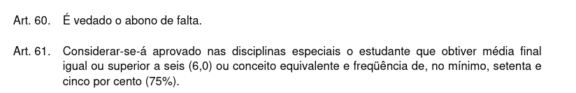
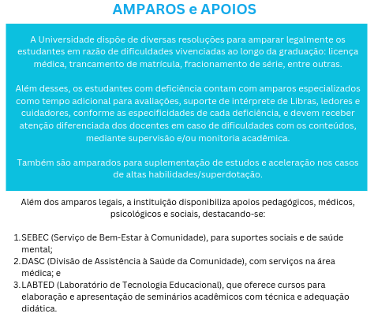
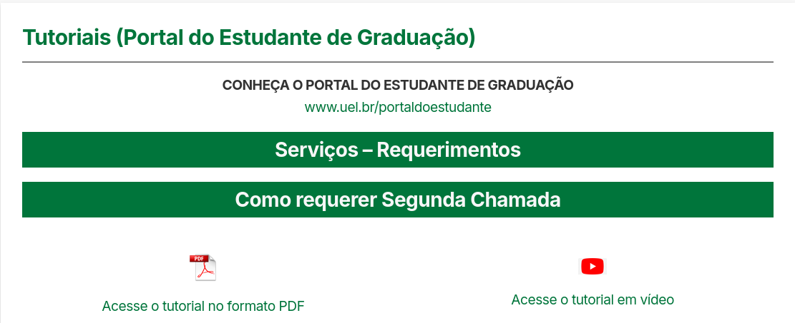

```{r, echo=FALSE, include=FALSE}
colFmt <- function(x,color) {
  
  outputFormat <- knitr::opts_knit$get("rmarkdown.pandoc.to")
  
  if(outputFormat == 'latex') {
    ret <- paste("\\textcolor{",color,"}{",x,"}",sep="")
  } else if(outputFormat == 'html') {
    ret <- paste("<font color='",color,"'>",x,"</font>",sep="")
  } else {
    ret <- x
  }

  return(ret)
}

#uso>>>> `r colFmt("REG",'red')`, 

```


# Orientações Gerais{#orientacoes-gerais}

\

\

## Informações administrativas

\


### Regimento geral da UEL

\


O Regimento Geral da Universidade Estadual de Londrina está disponível nesse [link](https://sites.uel.br/proplan/wp-content/uploads/2024/02/Regimento_Geral.pdf/) 

\


```{r, echo=FALSE, out.width='60%', fig.align='center', fig.cap="Regimento Geral da UEL"}


```

\


```{r, echo=FALSE, out.width='120%', fig.align='center', fig.cap="Artigos 60 e 71 do Regimento Geral da UEL"}



```

\

### Amparos e apoios na UEL


\

```{r, echo=FALSE, out.width='100%', fig.align='center', fig.cap="Amparos e apoios na UEL"}



```

\

### Tutoriais para os estudantes da graduação da UEL


\


Tutoriais para os estudantes da graduação da Universidade Estadual de Londrina estão disponíveis nesse [link](https://sites.uel.br/prograd/tutoriais-portal-do-estudante-de-graduacao-como-requerer-segunda-chamada/) 

\


```{r, echo=FALSE, out.width='80%', fig.align='center', fig.cap="Tutoriais para os estudantes da graduação da UEL"}



```


\

## Programas de atividade acadêmica para o primeiro semestre de 2026


<!-- ### Geografia: 1STA004 - Estatística Aplicada à Geografia -->

<!-- #### Horários: -->

<!-- >Turma 1000: quartas-feiras (19 h 15 min - 20 h 55 min / 21 h 10 min - 22 h 50 min)  -->

<!-- #### Locais: CCE -->

<!-- > Turma 1000: sala 705 (CCE) -->

<!-- #### Ementa conforme projeto pedagógico do curso,  Resolução CEPE/CA 026/2019:  -->

<!-- Introdução à Estatística. Amostragem. Tabelas. Gráficos. Distribuição de Frequências. Medidas de Posição. Medidas de Dispersão. Números Índices. Correlação. Regressão Linear Simples. Séries Temporais. -->

<!-- #### Conteúdo programático: -->

<!-- 1. Introdução à pesquisa científica, análise exploratória e descritiva de dados e assuntos correlacionados: noções sobre a produção de conhecimento por meio da pesquisa científica, conceitos de população e parâmetros, amostra e estatísticas, tipos de variáveis, indexação e somatório de dados, combinações, conectivos lógicos, conjuntos, diagramas de Venn, operações com conjuntos, apresentação dos dados brutos e em rol, apresentações gráficas elementares, sínteses numéricas de posição (média, moda), sínteses numéricas de dispersão (máximo, mínimo, amplitude, variância e coeficiente de variação), medidas separatrizes (percentis, decis, quartis), mediana, apresentação tabular de dados, média, moda e variância para dados agrupados em tabelas de frequências, apresentações gráficas para variáveis qualitativas (barras, setores) e quantitativas (histograma, box-plot).   -->
<!-- 2. Introdução ao planejamento de pesquisas e levantamentos amostrais: tipos de levantamentos amostrais (probabilísticos e não probabilísticos), levantamento amostral aleatório simples e sistematizado, levantamento amostral aleatório estratificado e por conglomerados, dimensionamento de amostras para inferências sobre médias e proporções (distribuição das médias e proporções amostrais).   -->
<!-- 3. Introdução às técnicas de regressão: análise de correlação linear e regressão linear simples. Modelo clássico de séries temporais. -->

<!-- #### Bibliografia básica: -->

<!-- A. MARTINS, Gilberto e DOMINGUES, Osmar (2017). Estatística Geral e Aplicada. 6ª ed. Rio de Janeiro: Atlas.   -->
<!-- MORETTIN, Pedro A. e O. BUSSAB, Wilton (2017). Estatística básica. 9ª ed. Rio de Janeiro: Editora Saraiva.   -->
<!-- TRIOLA, Mario F. (2024). Introdução à Estatística. 14ª ed. Rio de Janeiro: LTC. -->

<!-- #### Procedimentos de ensino -->

<!-- 1. O processo de ensino será composto por um conjunto de atividades presenciais expositivas e práticas com a resolução de exercícios em sala de aula a ter início no dia 26/03/2025, prosseguindo nos dias e horários determinados no Sistema UEL.   -->
<!-- 2. Todo material utilizado (textos, slides, listas de exercícios) será disponibilizado na sala de aula virtual a ser criada na Plataforma Google Classroom, de adesão compulsória por parte do discente, por meio de convite enviado ao seu email registrado no Sistema UEL.   -->
<!-- 3. Toda comunicação de natureza pedagógica entre discentes e o docente dar-se-á por meio de postagens na plataforma Google Classroom para que todos os alunos possam ter acesso e se beneficiar do conteúdo.   -->
<!-- 4. O atendimento presencial e em caráter pessoal, para elucidação de eventuais dúvidas de discentes, deverá ser previamente agendado com o docente.   -->
<!-- 5. As datas das atividades, avaliações e do exame final, indicadas no cronograma abaixo, poderão ser alteradas tanto em razão de situações não previstas pelo atual calendário acadêmico quanto do bom progresso das atividades didáticas, mediante comunicação aos alunos com razoável antecipação. -->

<!-- #### Formas e critérios de avaliação: -->

<!-- Durante o semestre serão realizadas as seguintes atividades avaliativas:   -->
<!-- - duas (2) provas presenciais escritas (P1 e P2) referentes ao conteúdo das aulas e valendo de zero (0) a dez (10) pontos cada uma e com peso 5 para fins da determinação da média final (MF);   -->
<!-- - duas (2) atividades no formato de listas de exercícios (L1 e L2) disponibilizadas na plataforma Google Classroom, valendo de zero (0) a dez (10) pontos. As atividades L1 e L2 poderão ser compostas por mais de uma lista sendo, nesse caso, atribuída a média aritmética com peso 1 das notas de todas as listas que compõem cada atividade conforme a expressão: -->

<!-- $$ -->
<!-- L_1 = \frac{L_{1,1} + · · · + L_{1,n_1}}{n_1} -->
<!-- $$ -->

<!-- e -->

<!-- $$ -->
<!-- L_2 = \frac{L_{2,1} + · · · + L_{2,n_2}}{n_2} -->
<!-- $$ -->

<!-- A média final (MF) será calculada pela seguinte expressão: -->

<!-- $$ -->
<!-- MF = \frac{(5 × P_1) + (1 × L_1) + (5 × P_2) + (1 × L_2)}{12} -->
<!-- $$ -->

### Química: 2STA032 - Estatística

#### Horários:

>Turma 1000: segundas-feiras (8 h 15 min - 9 h 55 min) e quartas-feiras (10 h 15 min - 11 h 55 min) 

#### Locais: 

>Turma 1000: sala 7 (CCE)

#### Ementa conforme projeto pedagógico do curso na Resolução CEPE/CA 18/2024:

Estatística descritiva. Introdução à probabilidade. Variáveis aleatórias. Principais distribuições de probabilidades discretas e contínuas. Noções de amostragem. Estimação pontual e intervalar. Testes de hipóteses. Análise de correlação e regressão linear.

#### Objetivos:

1. Adquirir conceitos básicos, compreender a importância da estatística e estabelecer uma visão crítica do cotidiano na profissão.
2. Desenvolver raciocínio lógico, crítico e analítico no que se refere a interpretações dos dados e estabelecer relações entre as variáveis dos fenômenos estudados visando a solução de problemas e a tomada de decisões.

#### Conteúdo programático:

1. Estatística descritiva: conceitos sobre produção de conhecimento por meio da pesquisa científica, análise exploratória de dados, conceitos de população/parâmetro(s), amostra/estatística(s), tipos de variáveis, apresentações tabulares e gráficas, sínteses numéricas.  
2. Probabilidade: aspectos históricos, conectivos lógicos, conjuntos (representações e operações),  experimentos aleatórios e determinísticos, espaços e eventos, conceitos, probabilidade da adição de eventos (disjuntos e não disjuntos), probabilidade condicional de eventos e independência de eventos, regra de Bayes, variáveis aleatórias discretas
e contínuas (função distribuição, densidade de probabilidade, esperança e variância), modelos teóricos de probabilidade para variáveis aleatórias discretas e contínuas.  
3. Estatística inferencial: distribuições amostrais, estimativas intervalares e testes de hipóteses.  
4. Introdução às técnicas de regressão: análise de correlação linear e regressão linear simples.  

#### Bibliografia básica e complementar:

1. BARBETTA, Pedro A., REIS, Marcelo M. e BORNIA, Antonio C. (2024). Estatística para Cursos de Engenharia, Computação e Ciência de Dados. 4a ed. Rio de Janeiro: LTC.  
2. DEVORE, Jay L. (2018). Probabilidade e estatística para engenharia e ciências. 3a ed. Porto Alegre: +A Educação - Cengage Learning Brasil.  
3. MORETTIN, Pedro A. (2023). Estatística básica. 10a ed. Rio de Janeiro: Saraiva Uni.  
4. LARSON, R. e FARBER, B. (2010). Estatística Aplicada. 4a ed. São Paulo: Pearson Prentice Hall.  
5. MAGALHÃES, M. N. e LIMA, C. Pedroso de (2015). Noções de Probabilidade e Estatística. 7a ed. São Paulo: Edusp.  
6. MONTGOMERY, Douglas C. e RUNGER, George C. (2021). Estatística Aplicada e Probabilidade para Engenheiros. 7a ed. Rio de Janeiro: LTC.  
7. MORETTIN, L. G. (2010). Estatística básica: probabilidade e inferência. São Paulo: Pearson Prentice Hall.  
8. WALPOLE, R. E. (2009). Probabilidade e Estatística para Engenharia e Ciências. São Paulo: Pearson Prentice Hall.


#### Procedimentos de ensino:

1. O processo de ensino será composto por um conjunto de atividades presenciais expositivas e práticas (listas de exercícios) com início no dia 2/3/2026 (CCE - sala 7), prosseguindo nos dias e horários determinados no Sistema UEL.
2. Todo material didático será disponibilizado na sala de aula virtual a ser criada na Plataforma Google Classroom, de adesão compulsória por parte do discente, por meio de convite enviado ao seu email registrado no Sistema UEL.
3. A cada aula os tópicos ministrados serão registrados resumidamente na sala de aula virtual mencionada no item anterior, para facilitar o acompanhamento por parte dos discentes.
4. Toda comunicação de natureza pedagógica entre discentes e o docente dar-se-á por meio de postagens na plataforma Google Classroom para que todos os alunos possam ter acesso e se beneficiar do conteúdo.
5. O atendimento pedagógico presencial em caráter pessoal deverá ser previamente agendado com o docente.
6. As datas das atividades, avaliações e do exame final, indicadas no cronograma abaixo, poderão ser alteradas tanto em razão de situações não previstas pelo atual calendário acadêmico quanto do bom progresso das atividades didáticas, mediante comunicação aos alunos com razoável antecipação.

#### Cronograma:


Aula 01 - Apresentações: (a) do programa de atividade acadêmica aprovado, (b) da sala de aula virtual criada (Google Classroom), (c) do calendário acadêmico do primeiro semestre de 2026 (Resolução CEPE no 051/2025, § 1), (d) de aspectos relevantes do Regimento Geral da UEL, especificamente os artigos 60 (vedação ao abono de falta) e 171 (deveres dos membros da Comunidade Universitária), (e) da Res. CEPE 017/2023 (amparos). Noções sobre a produção de conhecimento por meio da pesquisa científica. Conceitos introdutórios: população/parâmetro(s), amostra/estatística(s), estatística descritiva/inferencial e variável de estudo e tipos de variáveis.  

Aula 02 - Análise exploratória de dados: dados brutos e saneados, estatísticas amostrais: proporções/moda para dados qualitativos, operações envolvendo indexação de valores, sínteses numéricas descritivas para dados quantitativos: posição (moda, média).  

Aula 03 - Sínteses numéricas descritivas para dados quantitativos (seq.): variabilidade (mínimo, máximo, amplitude, variância/desvio padrão, coeficiente de variação), padronização (Z-scores).

Aula 04 - Sínteses numéricas descritivas para dados quantitativos (seq.): separação (quantis) e forma (assimetria e medida de curtose).

Aula 05 - Apresentação tabular de dados, recomendações gerais para apresentação, tabelas para dados qualitativos (simples e dupla entrada), apresentação gráfica de dados qualitativos (colunas, setores).

Aula 06: Tabelas para dados quantitativos (número de classes, intervalo de classe, frequências absolutas e relativas)

Aula 07 - Apresentação gráfica de dados quantitativos: histograma e box-plot

Aula 08 - Sínteses numéricas para dados apresentados em tabelas de frequências: média, moda e variância

Aula 09 - Introdução à programação em R e aplicação ao conteúdo ministrado (notebook na plataforma Colab.

Aula 10 - Primeira avaliação bimestral.

Aula 11 - Devolutiva (resolução comentada em sala) da primeira avaliação bimestral.

Aula 12 - Introdução ao cálculo de probabilidades: conceitos essenciais, experimentos determinísticos/aleatórios, conjuntos (representações e operações), espaço amostral e seus elementos, eventos, eventos simples/compostos.

Aula 13 - Conceitos de probabilidade: (1) clássico (a priori); (2) frequentista (a posteriori); (3) conceito axiomático: a probabilidade como uma função.

Aula 14 - Probabilidade da união de eventos, probabilidade de eventos condicionados e de eventos independentes.

Aula 15 - Regra de Bayes.

Aula 16 - Var. aleatórias discretas: conceito, propriedades, esperança e variância, função distribuição de probabilidade.

Aula 17 - Modelos teóricos de probabilidade para variáveis aleatórias discretas: Bernoulli e binomial.

Aula 18 - Var. aleatórias contínuas: conceito, propriedades, esperança e variância, função densidade de probabilidade.

Aula 19 - Modelos teóricos de probabilidade para variáveis aleatórias contínuas: exponencial e Normal.

Aula 20 - Introdução à programação em R, com aplicação ao conteúdo ministrado (notebook na plataforma Colab.

Aula 21 - Segunda avaliação bimestral.

Aula 22 - Devolutiva (resolução comentada em sala) da segunda avaliação bimestral.

Aula 23 - Noções de planejamento de pesquisas, tipos de pesquisas, técnicas de levantamento amostral (amostragem aleatória simples e sistemática).

Aula 24 - Amostragem aleatória estratificada e por conglomerados, amostragem por conveniência e por cotas.

Aula 25 - Introdução à inferência estatística, distribuições amostrais e diferenças amostrais, erros amostral/não amostral, nível de confiança, dimensionamento de amostras para estimação da média e da proporção de uma população.

Aula 26 - Intervalos de confiança para parâmetros: média e proporção (aprox. Normal).

Aula 27 - Intervalos de confiança para diferenças de parâmetros: duas médias independentes e duas proporções (aprox. Normal).

Aula 28 - Testes de hipóteses sobre parâmetros: médias e proporções.

Aula 29 - Testes de hipóteses sobre a diferença de parâmetros: duas médias independentes e duas proporções.

Aula 30 - Análise exploratória e técnicas de engenharia de variáveis (supressão/imputação, codificações e transformações), visualização de dados e de suas relações, diagrama de dispersão, correlações lineares e não lineares, coeficiente de correlação linear de Pearson, teste de hipóteses para a correlação populacional.

Aula 31: Modelo clássico de regressão linear simples sob erro Normal e seu ajuste.

Aula 32 - Análise de variância do modelo e teste "t" para as estimativas dos parâmetros.

Aula 33 - Intervalos de confiança para os parâmetros do modelo e estimativas geradas.

Aula 34 - Programação em R aplicada ao conteúdo ministrado (notebook na plataforma Colab.

Aula 35 - Terceira avaliação bimestral.

Aula 36 - Devolutiva (resolução comentada em sala) da segunda avaliação bimestral.

#### Formas e critérios de avaliação:

Durante o semestre serão realizadas as seguintes atividades avaliativas:

- três (3) provas escritas presenciais (P1, P2 e P3) referentes ao conteúdo das aulas e valendo de zero (0) a dez (10) pontos cada uma e todas com peso 1 para fins de determinação da média final. A média final (MF) será calculada pela seguinte expressão (média aritmética simples):

MF = (P1 + P2 + P3) / 3

As prováveis datas das três provas escritas presenciais serão: 1/4, 13/5 e 1/7.

A provável data para o exame final será 15/7.


### Farmácia: 2STA010 - Elementos de bioestatística 

#### Horários:

>Turmas 0001, 0002 e 0003: quintas-feiras (10 h 15 min - 11 h 55 min) 

#### Locais: 

>Turmas 0001, 0002 e 0003: sala 113 (CCLH)

#### Ementa conforme projeto pedagógico do curso na Resolução CEPE/CA 004/2022:

Noções de amostragem e dimensionamento de amostra. Tipos de experimentos na farmácia. Princípios básicos da experimentação. Análise exploratória e descritiva de dados. Medidas de associação. Uso de programa estatístico.

#### Conteúdo programático:

1. Noções gerais:
- Pesquisa científica e produção de conhecimento.
- População/amostra, parâmetro(s)/estatística(s).
- Planejamento de pesquisas. Levantamentos amostrais. Dimensionamento de amostras.
- Dados, análise exploratória, informação.  
2. Estatística descritiva e inferencial.
3. Estatísticas epidemiológicas: tipos de estudos, medidas de associação e correlação.

#### Bibliografia básica e complementar:

1. CALLEGARI-JACQUES, Sidia M. (2003). Bioestatística: princípios e aplicações. Porto Alegre: ArtMed.
2. DÍAZ, F. R. e LÓPEZ, F. J. B. (2007). Bioestatística. São Paulo: Thomson Learning.
3. MORETTIN, Pedro A. (2023). Estatística básica. 10a ed. Rio de Janeiro: Saraiva Uni.
4. LARSON, R. e FARBER, B. (2010). Estatística Aplicada. 4a ed. São Paulo: Pearson Prentice Hall.
5. MAGALHÃES, M. N. e LIMA, C. Pedroso de (2015). Noções de Probabilidade e Estatística. 7a ed. São Paulo: Edusp.
6. MONTGOMERY, Douglas C. e RUNGER, George C. (2021). Estatística Aplicada e Probabilidade para Engenheiros. 7a ed. Rio de Janeiro: LTC.
7. MORETTIN, L. G. (2010). Estatística básica: probabilidade e inferência. São Paulo: Pearson Prentice Hall.
8. WALPOLE, R. E. (2009). Probabilidade e Estatística para Engenharia e Ciências. São Paulo: Pearson Prentice Hall.


#### Procedimentos de ensino:

1. O processo de ensino será composto por um conjunto de atividades presenciais expositivas e práticas (listas de exercícios) com início no dia 5/3/2026 (CCLH - sala 113), prosseguindo nos dias e horários determinados no Sistema UEL.
2. Todo material utilizado será disponibilizado na sala de aula virtual a ser criada na Plataforma Google Classroom, de adesão compulsória por parte do discente, por meio de convite enviado ao seu email registrado no Sistema UEL.
3. A cada aula os tópicos ministrados serão registrados resumidamente na sala de aula virtual mencionada no item anterior, para facilitar o acompanhamento por parte dos discentes.
4. Toda comunicação de natureza pedagógica entre discentes e o docente dar-se-á por meio de postagens na plataforma Google Classroom para que todos os alunos possam ter acesso e se beneficiar do conteúdo.
5. O atendimento pedagógico presencial em caráter pessoal deverá ser previamente agendado com o docente.
6. As datas das atividades, avaliações e do exame final, indicadas no cronograma abaixo, poderão ser alteradas tanto em razão de situações não previstas pelo atual calendário acadêmico quanto do bom progresso das atividades didáticas, mediante comunicação aos alunos com razoável antecipação.

#### Formas e critérios de avaliação:

Durante o semestre serão realizadas as seguintes atividades avaliativas:

- duas (2) provas presenciais escritas (P1 e P2) referentes ao conteúdo das aulas e valendo de zero (0) a dez (10) pontos cada uma e todas com peso 1 para fins da determinação da média final (MF). A média final (MF) será calculada pela seguinte expressão (média aritmética simples):

MF = (P1 + P2) / 2

As prováveis datas das duas provas escritas presenciais serão: 30/4 e 9/7.

A provável data para o exame final será 16/7.


<!-- ### Computação: 2STA030 - Estatística -->

<!-- #### Horários: -->

<!-- >Turma 1000: sextas-feiras (14 h 00 min - 17 h 35 min) -->


<!-- #### Locais: CCE -->

<!-- >Turma 1000: sala 303A (CCE) -->

<!-- #### Ementa conforme projeto pedagógico do curso na Resolução CEPE/CA 109/2022: -->

<!-- Análise exploratória de dados. Probabilidades. Variáveis Aleatórias Discretas e Contínuas. Estimação de parâmetro. Teste de Hipóteses. Uso de programa estatístico. -->

<!-- #### Conteúdo programático: -->

<!-- 1. Estatística descritiva: introdução à pesquisa científica, análise exploratória e descritiva de dados e assuntos correlacionados: noções sobre a produção de conhecimento por meio da pesquisa científica, conceitos de população e parâmetros, amostra e estatísticas, tipos de variáveis, indexação e somatório de dados, conectivos lógicos, conjuntos, diagramas de Venn, operações com conjunto, apresentações gráficas -->
<!-- elementares, sínteses numéricas para dados individualizados e agrupados, apresentação tabular de dados, apresentações gráficas.   -->
<!-- 2. Probabilidade: aspectos históricos, experimentos aleatórios e determinísticos, espaços e eventos, conceitos, probabilidade da adição de eventos (disjuntos e não disjuntos), probabilidade condicional de eventos e independência de eventos, regra de Bayes, simulações usando a linguagem R, variáveis aleatórias discretas e contínuas (função distribuição e de densidade de probabilidade, esperança e variância), modelos -->
<!-- teóricos discretos e contínuos de probabilidade.   -->
<!-- 3. Estatística inferencial: distribuições amostrais, estimativas intervalares e testes de hipóteses.   -->
<!-- 4. Engenharia de variáveis: visualização, eliminação, imputação, codificação e transformação de dados em variáveis, introdução à programação em R especificamente relacionado aos tópicos acima (Google Colab). -->

<!-- #### Bibliografia básica: -->

<!-- DEVORE, Jay L. (2018). Probabilidade e estatística para engenharia e ciências. 3ª ed. Porto Alegre: +A Educação - Cengage Learning Brasil.   -->
<!-- MORETTIN, Pedro A. e O. BUSSAB, Wilton (2017). Estatística básica. 9ª ed. Rio de Janeiro: Editora Saraiva.   -->
<!-- ROSS, S. M. (2010). Probabilidade: um Curso Moderno com Aplicações. 8ª ed. São Paulo: Book -->

<!-- #### Procedimentos de ensino -->


<!-- 1. O processo de ensino será composto por um conjunto de atividades presenciais teóricas expositivas e resolução de exercícios em sala de aula a partir do dia 28/03/2025, prosseguindo nos dias e horários determinados no Sistema UEL.   -->
<!-- 2. Todo material utilizado (textos, slides, listas de exercícios) será disponibilizado na sala de aula virtual a ser criada na Plataforma Google Classroom, de adesão compulsória por parte do discente, por meio de convite enviado ao seu email registrado no Sistema UEL.   -->
<!-- 3. Toda comunicação de natureza pedagógica entre discentes e o docente dar-se-á por meio de postagens na plataforma Google Classroom para que todos os alunos possam ter acesso e se beneficiar do conteúdo. -->
<!-- 4. O atendimento presencial e em caráter pessoal, para elucidação de eventuais dúvidas de discentes, deverá ser previamente agendado com o docente.   -->
<!-- 5. As datas das atividades, avaliações e do exame final, indicadas no cronograma abaixo, poderão ser alteradas tanto em razão de situações não previstas pelo atual calendário acadêmico quanto do bom progresso das atividades didáticas, mediante comunicação aos alunos com razoável antecipação. -->

<!-- #### Formas e critérios de avaliação: -->

<!-- Durante o semestre serão realizadas as seguintes atividades avaliativas:   -->
<!-- - um (1) prova presencial escrita (P) referente ao conteúdo das aulas e valendo de zero (0) a dez (10) pontos e com peso 4 para fins da determinação da média final (M F );   -->
<!-- - uma (1) apresentação em sala na forma de seminário (S) por equipes de alunos com temas a serem determinados, referentes ao conteúdo das aulas, valendo de zero (0) a dez (10) pontos e com peso 5 para fins da determinação da média final (MF); -->
<!-- - uma (1) atividade no formato de listas de exercícios (L) disponibilizadas na plataforma Google Classroom, referente ao conteúdo das aulas, valendo de zero (0) a dez (10) pontos e com peso 1 para fins da determinação da média final (MF). -->
<!-- A atividade L poderá ser composta por mais de uma lista sendo, nesse caso, atribuída a média aritmética com peso 1 das notas de todas as listas que compõem essa atividade: -->

<!-- $$ -->
<!-- L = \frac{L_1 + · · · + L_n}{n} -->
<!-- $$ -->

<!-- A média final (MF) será calculada pela seguinte expressão que atribui peso 4 para a prova escrita presencial, peso 5 para o seminário e peso 1 para a lista de exercícios: -->

<!-- $$ -->
<!-- MF = \frac{4(P) + 5(S) + 1(L)}{10} -->
<!-- $$ -->

<!-- ### Engenharia Civil: 2STA016 - Estatística e probabilidades (2025/02) -->


<!-- #### Horários: -->

<!-- >Turma 1000: segundas e sextas-feiras (10 h 15 min - 11 h 55 min)\ -->
<!-- >Turma 2000: segundas e sextas-feiras (8 h 20 min - 10 h 00 min)\  -->
<!-- >Turma 3000: segundas e quartas-feiras (19 h 15 min - 20 h 55 min)\  -->


<!-- #### Locais: CTU -->

<!-- > Turma 1000: segundas-feiras: sala 1012 e sextas-feiras: sala 1015\ -->
<!-- > Turma 2000: segundas-feiras: sala 1015 e sextas-feiras: sala 1014\ -->
<!-- > Turma 3000: segundas-feiras e quartas-feiras: sala 1015\ -->


<!-- #### Ementa contida na Resolução Resolução CEPE/CA 073/2022:  -->

<!-- >Técnicas de amostragem. Medidas de posição e dispersão. Introdução à probabilidade. Variáveis aleatórias discretas, contínuas e suas principais distribuições de probabilidade. Inferência sobre médias, variâncias e proporções. Noções de planejamento de experimentos aplicados à Engenharia. -->

<!-- #### Conteúdo programático: -->

<!-- >1. Introdução à pesquisa científica, análise exploratória e descritiva de dados e assuntos correlacionados: noções sobre a produção de conhecimento por meio da pesquisa científica, conceitos de população e parâmetros, amostra e estatísticas, tipos de variáveis, indexação e somatório de dados, combinações, conectivos lógicos, conjuntos, diagramas de Venn, operações com conjuntos, coleta de dados das alturas dos alunos da turma para análise exploratória de dados, apresentação dos dados brutos e em rol, apresentações gráficas elementares, sínteses numéricas de posição (média, moda), sínteses numéricas de dispersão (máximo, mínimo, amplitude, variância e coeficiente de variação), medidas separatrizes (percentis, decis, quartis), mediana, apresentação tabular de dados, média, moda e variância para dados agrupados em tabelas de frequências, apresentações gráficas para variáveis qualitativas (barras, setores) e quantitativas (histograma box-plot)\ -->
<!-- >2. Introdução ao cálculo de probabilidades, variáveis aleatórias e distribuições teóricas de probabilidade: conceitos essenciais de experimentos aleatórios e experimentos determinísticos, a variável aleatória, o conjunto de possíveis resultados do experimento aleatório (espaço amostral e seus elementos), eventos simples e compostos (representações com diagramas de Venn), conceitos de probabilidade: (1) clássico (a priori) ; (2) frequentista (a posteriori); (3) conceito axiomático: a probabilidade como uma função,  probabilidade da união de eventos, probabilidade de eventos condicionados e independentes, introdução ao teorema de Bayes, funções de distribuição e densidade de probabilidade, modelo teórico discreto de Bernoulli, binomial e de Poisson, modelo teórico Normal.\ -->
<!-- >3. Introdução às distribuições amostrais e testes de hipóteses paramétricos: distribuição das médias amostrais e a construção de intervalos de confiança, distribuição das proporções amostrais e a construção de intervalos de confiança, distribuição das variâncias amostrais e a construção de intervalos de confiança, teste de hipóteses sobre a média de uma população, teste de hipóteses sobre a proporção de uma população, teste de hipóteses sobre a variância de uma população.\ -->
<!-- >4. Introdução ao planejamento de pesquisas e levantamentos amostrais: tipos de levantamentos amostrais (probabilísticos e não probabilísticos), levantamento amostral aleatório simples e sistematizado, levantamento amostral aleatório estratificado e por conglomerados, dimensionamento de amostras para inferências sobre médias e proporções.\\  -->

<!-- #### Bibliografia básica: -->

<!-- >BARBETTA, Pedro A., REIS, Marcelo M. e BORNIA, Antonio C. (2024). Estatística para Cursos de -->
<!-- Engenharia, Computação e Ciência de Dados. 4ª ed. Rio de Janeiro: LTC.\ -->
<!-- >DEVORE, Jay L. (2018). Probabilidade e estatística para engenharia e ciências. 3ª ed. Porto Alegre: +A Educação - Cengage Learning Brasil.\ -->
<!-- >MORETTIN, Pedro A. e O. BUSSAB, Wilton (2017). Estatística básica. 9ª ed. Rio de Janeiro: Editora -->
<!-- Saraiva.\ -->
<!-- >ROSS, S. M. (2010). Probabilidade: um Curso Moderno com Aplicações. 8ª ed. São Paulo: Bookman.\ -->

<!-- #### Procedimentos de ensino -->

<!-- >O processo de ensino será composto por um conjunto de atividades presenciais teóricas expositivas e -->
<!-- resolução de exercícios em sala de aula a partir do dia 11/08/2025, nos dias e horários determinados no Sistema UEL.\ -->
<!-- >Todo material utilizado (textos, slides, listas de exercícios) será disponibilizado na sala de aula virtual a ser criada na Plataforma *Google Classroom*, de adesão compulsória por parte do discente, por meio de convite enviado ao seu email registrado no Sistema UEL.\ -->
<!-- >Toda comunicação entre discentes e o docente dar-se-á por meio de postagens na plataforma *Google Classroom*.\ -->
<!-- >As datas das duas provas escritas presenciais e do exame final indicadas no cronograma a seguir **poderão ser alteradas** tanto em razão de situações não previstas no atual calendário acadêmico quanto do bom progresso das atividades didáticas, **mediante comunicação** aos alunos com devida antecipação.\ -->

<!-- #### Formas e critérios de avaliação: -->

<!-- >Durante o semestre serão realizadas as seguintes atividades avaliativas:\ -->
<!-- >três (3) \textbf{provas escritas presenciais} (P1, P2, P3) referentes ao conteúdo das aulas e valendo de zero (0) a dez (10) pontos cada uma;\ -->
<!-- >uma (1) \textbf{atividade} (A) no formato de listas de exercícios ($L_1, L_2, \cdots, L_n$),  disponibilizadas na plataforma \textit{Google Classroom}, valendo de zero (0) a dez (10) pontos cada uma, sendo seu valor final atribuído pela seguinte expressão (média aritmética simples): -->
<!-- $$ -->
<!-- A=\frac{ (L_1+L_2+\dots+L_n)}{n} -->
<!-- $$  -->
<!-- A \textbf{média final} ($MF$) será calculada pela seguinte expressão (média aritmética simples):\ -->
<!-- $$ -->
<!-- MF= \frac{1*P_1 + 1*P_2 + 1*P_3 + 1*A}{4}    -->
<!-- $$ -->

<!-- Ao final da disciplina **haverá exame final conforme estabelecido no Regimento da UEL (Art. 59)**.\ -->

<!-- #### Bibliografia complementar: -->

<!-- >MAGALHÃES, M. N. e LIMA, C. Pedroso de (2015). Noções de Probabilidade e Estatística. 7ª ed. São Paulo: Edusp.\ -->
<!-- >MEYER, Paul L. (2010). Probabilidade: Aplicações à Estatística. 2ª ed. Rio de Janeiro: LTC. -->
<!-- >MONTGOMERY, Douglas C. e RUNGER, George C. (2021). Estatística Aplicada e Probabilidade para Engenheiros. 7ª ed. Rio de Janeiro: LTC.\ -->
<!-- >MORETTIN, L. G. (2010). Estatística básica: probabilidade e inferência. São Paulo: Pearson Prentice Hall.\ -->
<!-- >WALPOLE, R. E. (2009). Probabilidade e Estatística para Engenharia e Ciências. São Paulo: Pearson Prentice Hall.\ -->


<!-- ### Ciência de dados e Inteligência Artifical: 2STA011 - Probabilidade -->


<!-- #### Horários: -->

<!-- >segundas e quartas-feiras (21 h 10 min - 22 h 50 min)         -->

<!-- #### Locais: CCE -->

<!-- > Sala 03 e XX -->

<!-- #### Ementa contida na Resolução CEPE/CA 060/2022:  -->

<!-- >Probabilidade e propriedades. Probabilidade condicional e independência. Variáveis aleatórias discretas e principais modelos de distribuição discretas. Variáveis aleatórias contínuas e principais modelos de distribuições contínuas. Processo de *Poisson*. Cadeias de *Markov*. Simulação de Monte Carlo. Uso de programa estatístico.  -->

<!-- #### Conteúdo programático: -->

<!-- >1. Módulo 1: Probabilidade   -->
<!-- -Introdução à Probabilidade: aspectos históricos, experimentos aleatórios e determinísticos, espaços e eventos, conceitos.   -->
<!-- -Probabilidade da adição de eventos (disjuntos e não disjuntos).   -->
<!-- -Probabilidade Condicional de eventos e independência de eventos.   -->
<!-- -Teorema de Bayes.   -->
<!-- -Simulações usando a linguagem R.   -->
<!-- -Variáveis aleatórias discretas e contínuas (função distribuição e de densidade de probabilidade, esperança e variância).   -->
<!-- -Principais modelos teóricos discretos e contínuos de probabilidade.   -->
<!-- 2. Módulo 2: Processos estocásticos   -->
<!-- -Aplicações do processo de Poisson, de simulações de Monte Carlo e cadeias de Markov.  -->

<!-- #### Bibliografia básica: -->

<!-- >1. ROSS, Sheldon. Probabilidade: um curso moderno com aplicações. 8 ed. Porto Alegre: Bookman, 2010. 606 p.\ -->
<!-- 2. MEYER, Paul L. Probabilidade: Aplicações à Estatística. 2 ed. Rio de Janeiro: LTC, 2010. 426 p.\ -->

<!-- #### Procedimentos de ensino -->

<!-- >1. O processo de ensino será composto por um conjunto de atividades presenciais teóricas expositivas e resolução de exercícios em sala de aula a partir do dia 14/10/2024, nos dias e horários determinados no Sistema UEL.   -->
<!-- 2. Todo material utilizado (textos, slides, listas de exercícios) será disponibilizado na sala de aula virtual a ser criada na Plataforma *Google Classroom*, de adesão compulsória por parte do discente, por meio de convite enviado ao seu *email* registrado no Sistema UEL.\ -->
<!-- 3. **Toda** comunicação entre discentes e o docente se dará por meio de postagens na plataforma *Google Classroom*.\ -->
<!-- 4. As datas das prova escrita presencial, do seminário e do exame final indicadas no cronograma a seguir **poderão** ser alteradas tanto em razão de **situações não previstas no atual calendário acadêmico** quanto do bom progresso das atividades didáticas, **mediante comunicação aos alunos com devida antecipação**.\ -->

<!-- #### Formas e critérios de avaliação: -->

<!-- >Durante o semestre serão realizadas as seguintes atividades avaliativas:\ -->
<!-- - uma (1) **prova escrita presencial (P)** referente ao conteúdo das aulas do módulo 1 valendo de zero (0) a dez (10) pontos;\ -->
<!-- - uma (1) apresentação em sala na forma de **seminário (S)** com tema a ser determinado e referente ao conteúdo das aulas do módulo 2, valendo de zero (0) a dez (10) pontos;\ -->
<!-- - uma (1) atividade no formato de **listas de exercícios (L) **disponibilizadas na plataforma *Google Classroom*, referente ao conteúdo das aulas do módulo 1 e valendo de zero (0) a dez (10) pontos. A atividade L poderá ser composta **por mais de uma lista de exercícios** sendo, nesse caso, atribuída a média aritmética das notas de todas as listas que compõem essa atividade:\ -->
<!-- $$ -->
<!-- L=\frac{ (L_{1,1}+\dots+L_{1,n})}{n} -->
<!-- $$ -->
<!-- A **média final** ($MF$) será calculada pela seguinte expressão que atribui peso 4 para a prova escrita presencial, peso 5 para o seminário e peso 1 para a lista de exercícios:\ -->
<!-- $$ -->
<!-- MF= \frac{4(P) + 5(S) + 1(L)}{10}    -->
<!-- $$\ -->
<!-- Ao final da disciplina **haverá exame final conforme estabelecido no Regimento da UEL (Art. 59) **. -->


### Economia: 2STA007 - Estatística Econômica 

#### Horários:

>Turma 1000: terças-feiras (19 h 15 min - 20 h 55 min) e quintas-feiras (21 h 10 min - 22 h 50 min) 

#### Locais: 

>Turma 1000: sala 466 (CESA)

#### Ementa conforme projeto pedagógico do curso na Resolução CEPE/CA 036/2021:

Introdução à estatística. Tipos de amostragem. Estatística descritiva: representação tabular e gráfica, medidas de posição e dispersão. Probabilidade: definições e teoremas. Variáveis aleatórias discretas e contínuas. Distribuição binomial, Poisson, geométrica, hipergeométrica, uniforme, normal e exponencial. Noções de simulação. Processo de Poisson. Uso de software estatístico.

#### Conteúdo programático:

Aula Inicial: apresentação do curso e conceitos básicos.
Tipos de variáveis e resumo de dados.
Medidas de posição.
Medidas separatrizes.
Medidas de dispersão.
Medidas de forma.
Análise Combinatória.
Teoria das Probabilidades.
Regras de Probabilidades.
Teorema de Bayes.
Variável aleatória discreta.
Distribuições Bernoulli e Binomial.
Distribuições Geométrica e Hipergeométrica.
Distribuições Poisson e Multinomial.
Aproximações de distribuições discretas.
Variável aleatória contínua.
Distribuição Normal.
Distribuição uniforme.
Distribuição exponencial.
Noções de simulação. 
Processo de Poisson. 

#### Bibliografia básica e complementar:

1. ANDERSON, David R., SWEENEY, Dennis J. e WILLIAMS, Thomas A. (2002). Estatística aplicada à administração e economia. São Paulo: Pioneira Thomson Learning.
2. BRUNI, Adriano Leal (2008). Estatística Aplicada à Gestão Empresarial. 2ª ed. São Paulo: Atlas, p. 396.
3. HOFFMANN, Rodolfo (2006). Estatística para economistas. 4ª ed. São Paulo: Thomson.
4. ALCOFORADO, Luciane Ferreira e LEVY, Ariel (2017). Visualização de dados com software R. Niterói, RJ:
Editora da Universidade Federal Fluminense (EDUFF). isbn: 978-85-922932-0-8. url: https://github.com/EstatisticaComR/visualizacao-de-dados-com-o-software-R.
5. CHERNICK, Michael R. e LABUDDE, Robert A. (2011). An Introduction to Bootstrap Methods with Applications to R. John Wiley & Sons, p. 240. isbn: 978-0470467046.
6. FREUND, John E. (2006). Estatística Aplicada: Economia, Administração e Contabilidade. 11ª ed. Porto Alegre: Artmed.
7. KOROSTELEVA, Olga (2022). Stochastic Processes with R: An Introduction. 1st. Chapman & Hall/CRC Texts in Statistical Science. Boca Raton, FL: Chapman e Hall/CRC, pp. x + 190. isbn: 978-1032153735. doi: 10.1201/9781003244288.
8. LARSON, Ron e FARBER, Betsy (2007). Estatística Aplicada. São Paulo: Prentice Hall.
9. MORETTIN, L. G. (2010). Estatística básica: probabilidade e inferência. São Paulo: Pearson Prentice Hall.
10. TRIOLA, Mario F. (2005). Introdução à Estatística. 9ª ed. Rio de Janeiro: LTC.


#### Procedimentos de ensino:

1. O processo de ensino será composto por um conjunto de atividades presenciais expositivas e práticas (listas de exercícios) com início no dia 3/3/2026 (CESA - sala 466), prosseguindo nos dias e horários determinados no Sistema UEL.
2. Todo material utilizado será disponibilizado na sala de aula virtual a ser criada na Plataforma Google Classroom, de adesão compulsória por parte do discente, por meio de convite enviado ao seu email registrado no Sistema UEL.
3. A cada aula os tópicos ministrados serão registrados resumidamente na sala de aula virtual mencionada no item anterior, para facilitar o acompanhamento por parte dos discentes.
4. Toda comunicação de natureza pedagógica entre discentes e o docente dar-se-á por meio de postagens na plataforma Google Classroom para que todos os alunos possam ter acesso e se beneficiar do conteúdo.
5. O atendimento pedagógico presencial em caráter pessoal deverá ser previamente agendado com o docente.
6. As datas das atividades, avaliações e do exame final, indicadas no cronograma abaixo, poderão ser alteradas tanto em razão de situações não previstas pelo atual calendário acadêmico quanto do bom progresso das atividades didáticas, mediante comunicação aos alunos com razoável antecipação.
7. Serão realizadas aulas no laboratório de informática a ser disponibilizado pelo Departamento do curso, de modo a permitir o atendimento da ementa no tocante ao item "uso de software estatístico".


#### Cronograma:


Aula 01 - Apresentações: (a) do programa de atividade acadêmica aprovado, (b) da sala de aula virtual composta no Google Classroom, (c) do calendário acadêmico do primeiro semestre (Resolução CEPE no 051/2025, § 1), (d) de aspectos relevantes do Regimento Geral da UEL, especificamente os artigos 60 (vedação ao abono de falta) e 171 (deveres dos membros da Comunidade Universitária), (e) da Res. CEPE 017/2023 (amparos). Noções sobre a produção de conhecimento por meio da pesquisa científica, conceitos introdutórios: população/amostra, parâmetros/estatísticas, estatística descritiva/inferencial.

Aula 02 - Análise exploratória de dados: tipos de variáveis (qualitativas/quantitativas), dados brutos/saneados, sínteses numéricas descritivas para dados qualitativos (proporções/moda), operações envolvendo indexação de valores, sínteses numéricas descritivas para dados quantitativos: posição (moda, média).

Aula 03 - Sínteses numéricas descritivas para dados quantitativos (seq.): variabilidade (mínimo/máximo, amplitude, variância/desvio padrão, coeficiente de variação), padronização de valores (Z-scores).

Aula 04 - Sínteses numéricas descritivas para dados quantitativos (seq.): separação (quantis) e forma (assimetria e medida de curtose).

Aula 05 - Apresentação tabular de dados, recomendações gerais para apresentação, tabelas para dados qualitativos (simples/dupla entrada), apresentação gráfica de dados qualitativos (colunas/setores).

Aula 06 - Apresentação tabular de dados quantitativos (número de classes, intervalo de classes, limites de cada classe, frequências absolutas e relativas).

Aula 07 - Apresentação gráfica de dados quantitativas: box-plot e histograma.

Aula 08 - Sínteses numéricas para dados apresentados em tabelas de frequências: média, moda e variância.

Aula 09 - Introdução à programação em R aplicada ao conteúdo das aulas anteriores em um notebook na plataforma Google Colab.

Aula 10 - Introdução à programação em R aplicada ao conteúdo das aulas anteriores em um notebook na plataforma Google Colab.

Aula 11 - Primeira avaliação bimestral.

Aula 12 - Devolutiva (resolução comentada em sala) da primeira avaliação bimestral.

Aula 13 - Introdução ao cálculo de probabilidades: conceitos essenciais de experimentos determinísticos/aleatórios, conjuntos (representações e operações), espaço amostral e seus elementos, eventos, eventos simples/compostos.

Aula 14 - Conceitos de probabilidade: (1) clássico (a priori); (2) frequentista (a posteriori); (3) conceito axiomático: a probabilidade como uma função.

Aula 15 - Probabilidade da união de eventos, probabilidade de eventos condicionados e de eventos independentes.

Aula 16 - Introdução à regra de Bayes, exercícios.

Aula 17 - Variáveis aleatórias discretas: conceito, propriedades, esperança e variância, função distribuição de probabilidade.

Aula 18 - Modelos teóricos de probabilidade para para var. aleatórias discretas: Bernoulli, binomial.

Aula 19 - Modelos teóricos de probabilidade para para var. aleatórias discretas (seq.): Poisson, multinomial, geométrica e hipergeométrica.

Aula 20 - Var. aleatórias contínuas: conceito, propriedades, esperança e variância, função densidade de probabilidade.

Aula 21 - Modelos teóricos de probabilidade para para var. aleatórias contínuas: Normal e exponencial.

Aula 22 - Conteúdo das aulas anteriores usando a linguagem R em um notebook na plataforma Google Colab.

Aula 23 - Segunda avaliação bimestral.

Aula 24 - Devolutiva (resolução comentada em sala) da segunda avaliação bimestral.

Aula 25 - Modelagem de processos estocásticos: conceitos gerais (modelos determinísticos e estocásticos; processos temporais (discretos, contínuos), espaciais e espaçotemporais).

Aula 26 - Simulações Monte Carlo: introdução e fundamentação.

Aula 27 - Simulações Monte Carlo: geração de números aleatórios (gerador linear congruente).

Aula 28: Simulações Monte Carlo: geração de amostras aleatórias de distribuições de probabilidade (método da inversa da distribuição cumulativa).

Aula 29: Simulações Monte Carlo: aplicação em processos estocásticos.

Aula 30 - Conteúdo das aulas anteriores usando a linguagem R em um notebook na plataforma Google Colab.

Aula 31 - Processo de Poisson: introdução e fundamentação.

Aula 32 - Processo de Poisson: aplicação com exemplos.

Aula 33 - Conteúdo das aulas anteriores usando a linguagem R em um notebook na plataforma Google Colab.

Aula 34 - Apresentação de seminário

Aula 35 - Apresentação de seminário

Aula 36 - Apresentação de seminário


#### Formas e critérios de avaliação:

Durante o semestre serão realizadas as seguintes atividades avaliativas:

- Duas (2) provas escritas presenciais (P1 e P2) referentes ao conteúdo das aulas e valendo de zero (0) a dez (10) pontos cada uma e com peso 1 para fins de determinação da média final.
- Uma (1) apresentação em sala na forma de seminário (S) com temas a serem determinados ulteriormente, valendo de zero (0) a dez (10) pontos;

- A média final (MF) será calculada pela seguinte expressão (média aritmética simples):

MF = (P1 + P2 + S) / 3

As prováveis datas das duas provas escritas presenciais serão: 7/4, 21/5.

As prováveis datas alocadas para os seminários são: 2/7, 7/7, 9/7.

A provável data para o exame final será 14/7.


